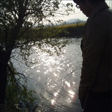

王半拍
============================

|  |  |
| :--: | :-- |
| [ 王半拍](https://i.xiami.com/wxm) | **地区**: China 中国大陆 **风格**: 摇滚 Rock & Roll, 国语流行 Mandarin Pop, 粤语流行 Cantopop, 欧美流行 Western Pop **播放数**: 3078662 **粉丝数**: 149 **评论数**: 30  |

## 档案

我只想一个人，一支烟，一杯咖啡，一间昏暗的录音棚。默默的唱着那些过去带来的伤痛，心已千疮百孔，肉体已遍体鳞伤。可是还是愿意相信爱，相信任何人，从不猜疑是否在欺骗我。

## 专辑

| 名称 | 语种 | 唱片公司 | 发行时间 | 专辑类别 | 专辑风格 |
| :--: | :-- | :-- | :-- | :-- | :-- |
| [ 泡沫泡沫](./albums/613465638.md) | 国语 | 独立发行 | 2014年10月16日 | EP, 单曲 | 国语流行 Mandarin Pop |
| [ 把悲伤留给自己……](./albums/1611491920.md) | 国语 | 独立发行 | 2014年09月24日 | EP, 单曲 | 国语流行 Mandarin Pop |
| [ 我会好好过……](./albums/211491540.md) | 国语 | 独立发行 | 2014年09月24日 | EP, 单曲 | 国语流行 Mandarin Pop |
| [ 牧马人……](./albums/11491928.md) | 国语 | 独立发行 | 2014年09月24日 | EP, 单曲 | 国语流行 Mandarin Pop |
| [ 勇敢的心死亡金属](./albums/1911488161.md) | 国语 | 独立发行 | 2014年09月24日 | EP, 单曲 | 死亡金属 Death Metal |
| [ 愿得一人心一人心](./albums/1306296990.md) | 国语 | 独立发行 | 2014年07月25日 | EP, 单曲 | 国语流行 Mandarin Pop |
| [ FUNRUN](./albums/1606298516.md) | 国语 | 独立发行 | 2014年07月25日 | EP, 单曲 | 国语流行 Mandarin Pop |
| [ 你会不会不会](./albums/1006295824.md) | 国语 | 独立发行 | 2014年07月25日 | EP, 单曲 | 国语流行 Mandarin Pop |
| [ 流浪记记](./albums/5686964.md) | 国语 | 独立发行 | 2014年07月18日 | EP, 单曲 | 国语流行 Mandarin Pop |
| [ 残酷月光](./albums/505521862.md) | 国语 | 独立发行 | 2014年07月16日 | EP, 单曲 | 国语流行 Mandarin Pop |
| [ 会痛的石头的石头](./albums/1805523109.md) | 国语 | 独立发行 | 2014年07月16日 | EP, 单曲 | 国语流行 Mandarin Pop |
| [ 爱什么稀罕稀罕](./albums/105478227.md) | 国语 | 王夏明 | 2014年07月16日 | EP, 单曲 | 国语流行 Mandarin Pop |
| [ 歌剧22](./albums/705525101.md) | 国语 | 独立发行 | 2014年07月16日 | EP, 单曲 | 欧美流行 Western Pop |
| [ 好男人绝不会让心爱的女人受一点伤](./albums/1605524296.md) | 国语 | 独立发行 | 2014年07月16日 | EP, 单曲 | 国语流行 Mandarin Pop |
| [ 灰色空间空间](./albums/105327913.md) | 国语 | 独立发行 | 2014年07月14日 | EP, 单曲 | 国语流行 Mandarin Pop |
| [ 秋意浓浓](./albums/905328441.md) | 国语 | 独立发行 | 2014年07月14日 | EP, 单曲 | 国语流行 Mandarin Pop |
| [ 无心伤害](./albums/205325774.md) | 国语 | 独立发行 | 2014年07月14日 | EP, 单曲 | 国语流行 Mandarin Pop |

## 评论

|  |  |  |
| :-- | :-- | :-- |
|  [虾米用户](https://emumo.xiami.com/u/348327397)  2019-12-31 09:52 赞(0) 踩(0) | 
加油
 |
|  [虾米用户](https://emumo.xiami.com/u/358104299) 悲观的唯心存在现实解构虚... 2019-12-22 20:29 赞(1) 踩(0) | 
14487
 |
|  [虾米用户](https://emumo.xiami.com/u/234478890)   2019-12-06 22:18 赞(0) 踩(0) | 
一把能唱摇滚的好嗓子
 |
| ⇒ |  [虾米用户](https://emumo.xiami.com/u/360523611) 我没有什么可说的! 2020-10-24 16:10 赞(0) 踩(0) | 
这嗓音唱摇滚，你确定适合？
 |
|  [虾米用户](https://emumo.xiami.com/u/293692544) 你敢给我说话吗？我咬你 2019-04-17 05:20 赞(1) 踩(0) | 
好听
 |
|  [虾米用户](https://emumo.xiami.com/u/293692544) 你敢给我说话吗？我咬你 2019-03-31 18:12 赞(1) 踩(0) | 
好听
 |
|  [虾米用户](https://emumo.xiami.com/u/237793266)  2017-03-20 08:36 赞(1) 踩(0) | 
很好，加油！
 |
|  [虾米用户](https://emumo.xiami.com/u/115893390)  2017-02-06 23:56 赞(1) 踩(0) | 
但愿你成长 
 |
|  [虾米用户](https://emumo.xiami.com/u/40878444)  2016-12-14 23:39 赞(1) 踩(0) | 
是阮文昊吗？到底消失到哪里去了   
 |
|  [虾米用户](https://emumo.xiami.com/u/123930676)  2016-05-22 21:02 赞(1) 踩(0) | 
好听，说实话，很喜欢
 |
|  [虾米用户](https://emumo.xiami.com/u/46271148)  2016-04-25 13:40 赞(2) 踩(0) | 
无意间听到你唱的把悲伤留给自己，唱得很有感情，喜欢。期待新作品，加油_~
 |
|  [虾米用户](https://emumo.xiami.com/u/49239916)  2015-11-14 00:00 赞(1) 踩(0) | 
加油！
 |
|  [虾米用户](https://emumo.xiami.com/u/9387877)  2015-07-15 19:01 赞(1) 踩(0) | 
流浪记几乎就是杨宗纬在《我是歌手》现场的翻版，声线、气息、情绪，是个不错的歌手，真怕在各种模仿的唱法中失去自我。
 |
|  [虾米用户](https://emumo.xiami.com/u/5005970) 爱你，爱你就爱你，爱死你... 2015-05-14 01:58 赞(0) 踩(0) | 
( ⊙ o ⊙ )咦！这位歌手是谁呀！本来想找《流浪记》这首歌曲，想着想着试听一下，一看主页就不想听了，毕竟是不认识的唱作型歌手。听了三首歌曲，唱的还不错，新人歌手值得推荐一下吧！(*^__^*) 嘻嘻……
 |
|  [虾米用户](https://emumo.xiami.com/u/41453568)  2015-05-06 20:31 赞(0) 踩(0) | 
我喜欢
 |
|  [虾米用户](https://emumo.xiami.com/u/36288592)  2015-04-18 22:12 赞(0) 踩(0) | 
好听～火钳留名～[带墨镜笑]
 |
|  [虾米用户](https://emumo.xiami.com/u/857047)  2015-03-22 09:58 赞(0) 踩(0) | 
原来灰色空间也是假如爱有天意的填词歌曲,明显比李健填词好.阮文旻也唱得更深情.
 |
|  [虾米用户](https://emumo.xiami.com/u/29864710)   2015-03-21 03:22 赞(0) 踩(0) | 
无意中搜到你唱的灰色空间 唱的很不错 加油
 |
|  [虾米用户](https://emumo.xiami.com/u/32109054)  2015-01-25 22:02 赞(0) 踩(0) | 
支持你哦，加油
 |
|  [虾米用户](https://emumo.xiami.com/u/319371)  2015-01-19 10:29 赞(0) 踩(0) | 
唱的很不错
 |
|  [虾米用户](https://emumo.xiami.com/u/3068952) 靠音乐续命，靠行走解忧 2014-09-28 23:03 赞(0) 踩(0) | 
不错不错，好听！
 |
|  [虾米用户](https://emumo.xiami.com/u/3068952) 靠音乐续命，靠行走解忧 2014-09-28 22:59 赞(0) 踩(0) | 
唱的不错
 |
|  [虾米用户](https://emumo.xiami.com/u/40075558)  2014-08-17 06:32 赞(0) 踩(0) | 
哈哈！偶像偶来了，飘过。。。
 |
|  [虾米用户](https://emumo.xiami.com/u/34512401) 孤情诗人 2014-08-11 20:17 赞(0) 踩(0) | 
加油 无意听到你的歌
 |
|  [虾米用户](https://emumo.xiami.com/u/11268465)   2014-07-26 00:59 赞(0) 踩(0) | 
唱的挺好，老乡支持一下
 |
|  [虾米用户](https://emumo.xiami.com/u/38998682)  2014-07-14 22:26 赞(0) 踩(0) | 
打发打发
 |
|  [虾米用户](https://emumo.xiami.com/u/11355053) 绍兴兰亭第七人民医院保送... 2014-07-13 14:36 赞(12) 踩(0) | 
我已经正式入住 虾米音乐人社区
 |
|  [虾米用户](https://emumo.xiami.com/u/11355053) 绍兴兰亭第七人民医院保送... 2014-07-13 14:35 赞(0) 踩(0) | 
谢谢大家的支持
 |
|  [虾米用户](https://emumo.xiami.com/u/11355053) 绍兴兰亭第七人民医院保送... 2014-07-13 14:35 赞(0) 踩(0) | 
我刚入驻了虾米音乐人，欢迎大家来我的个人主页，收听我的最新音乐
 |
| ⇒ |  [虾米用户](https://emumo.xiami.com/u/8211153) 暂无签名~ 2015-08-08 22:46 赞(0) 踩(0) | 
加油
 |
