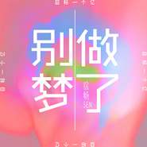

徐畅
============================

|  |  |
| :--: | :-- |
| [ 徐畅](https://i.xiami.com/m33-) | **地区**: China 中国大陆 **风格**: 国语流行 Mandarin Pop **播放数**: 703880 **粉丝数**: 600 **评论数**: 29  |

## 档案

## 专辑

| 名称 | 语种 | 唱片公司 | 发行时间 | 专辑类别 | 专辑风格 |
| :--: | :-- | :-- | :-- | :-- | :-- |
| [ 糖果&谁都一样](./albums/2102764286.md) | 国语 | 独立发行 | 2017年06月13日 | 录音室专辑 | 流行 Pop |
| [ 地球变了](./albums/2102732289.md) | 国语 | 独立发行 | 2017年04月14日 | 录音室专辑 | 独立电子乐 Indietronica |
| [ 别做梦了](./albums/2100386980.md) | 国语 | 独立发行 | 2016年09月07日 | EP, 单曲 |  |
| [ Proud girl](./albums/2100356772.md) | 国语 | 独立发行 | 2016年06月21日 | EP, 单曲 | 国语流行 Mandarin Pop |
| [ 你是谁](./albums/2100353919.md) | 国语 | 独立发行 | 2016年06月14日 | EP, 单曲 | 节奏布鲁斯 Rhythm & Blues, 国语流行 Mandarin Pop |
| [ 脱离](./albums/2100316894.md) | 国语 | 独立发行 | 2016年04月19日 | EP, 单曲 | 乡村流行 Country Pop, 国语流行 Mandarin Pop |
| [ 爱我的人爱我的人](./albums/2100253942.md) | 国语 | mono china | 2016年01月03日 | EP, 单曲 | 国语流行 Mandarin Pop |
| [ 体会爱情](./albums/2100208218.md) | 国语 | mono china | 2015年09月04日 | EP, 单曲 | 国语流行 Mandarin Pop |
| [ 眼光](./albums/2100178985.md) | 国语 | mono china | 2015年08月15日 | EP, 单曲 | 国语流行 Mandarin Pop |

## 评论

|  |  |  |
| :-- | :-- | :-- |
|  [虾米用户](https://emumo.xiami.com/u/358104299) 悲观的唯心存在现实解构虚... 2020-12-22 02:48 赞(0) 踩(0) | 
43641
 |
|  [虾米用户](https://emumo.xiami.com/u/2673316)  2020-11-03 11:09 赞(0) 踩(0) | 
小伙子加油啊，音乐相当不错
 |
| ⇒ |  [虾米用户](https://emumo.xiami.com/u/2673316)  2020-11-03 11:20 赞(0) 踩(0) | 
一首歌听完把所有能听的都听了，写的编的都好，音乐人！
 |
|  [虾米用户](https://emumo.xiami.com/u/783280) 我还没想好要写什么... 2019-05-10 06:16 赞(0) 踩(0) | 
《爱我的人》无限循环，歌词真挚，真的很棒，加油
 |
|  [虾米用户](https://emumo.xiami.com/u/246670855) 我还没想好要写什么... 2019-01-05 23:49 赞(0) 踩(0) | 
哇，昆明的耶，好棒！
 |
|  [虾米用户](https://emumo.xiami.com/u/41766162)  2018-12-16 11:07 赞(0) 踩(0) | 
昨天Studio Concert真的圈粉，唱作实力很棒！喜欢，期待2019！
 |
|  [虾米用户](https://emumo.xiami.com/u/608307)  2018-06-22 03:01 赞(0) 踩(0) | 
今天翻腾讯原力计划你是第二，1：01，听了一下，好听的一批啊
 |
| ⇒ |  [虾米用户](https://emumo.xiami.com/u/22070501)   2018-06-24 15:35 赞(0) 踩(0) | 
过奖啦 谢谢谢谢
 |
| ⇒ |  [虾米用户](https://emumo.xiami.com/u/608307)  2018-06-24 15:38 赞(0) 踩(0) | 
<q><b>徐畅说：</b></q>
 |
| ⇒ |  [虾米用户](https://emumo.xiami.com/u/608307)  2018-07-03 01:57 赞(0) 踩(0) | 
我觉得你值得拥有更多 只是你缺少推广  真心希望你火
 |
|  [虾米用户](https://emumo.xiami.com/u/256339012)  2017-09-14 23:12 赞(0) 踩(0) | 
典韦，我是鲁班，哈哈
 |
| ⇒ |  [虾米用户](https://emumo.xiami.com/u/22070501)   2017-09-15 02:11 赞(0) 踩(0) | 
？？？？
 |
|  [虾米用户](https://emumo.xiami.com/u/36237395)   2017-08-06 14:50 赞(1) 踩(0) | 
啪啪的徐畅？ 
 |
| ⇒ |  [虾米用户](https://emumo.xiami.com/u/22070501)   2017-08-08 18:14 赞(0) 踩(0) | 
是 你好
 |
|  [虾米用户](https://emumo.xiami.com/u/61831122) Hello,world 2017-06-28 13:43 赞(1) 踩(0) | 
加油哟 
 |
|  [虾米用户](https://emumo.xiami.com/u/93041280)  2017-05-06 08:57 赞(3) 踩(0) | 
学长，你好。我是大学时期的绿色心情
 |
| ⇒ |  [虾米用户](https://emumo.xiami.com/u/22070501)   2017-07-19 21:29 赞(0) 踩(0) | 
哈哈 你好 绿色心情
 |
|  [虾米用户](https://emumo.xiami.com/u/278451472)  2017-03-09 11:11 赞(1) 踩(0) | 
太好听了！参加中国好歌曲～
 |
|  [虾米用户](https://emumo.xiami.com/u/5698242)  2016-05-14 23:38 赞(1) 踩(0) | 
好听！！
 |
|  [虾米用户](https://emumo.xiami.com/u/60673126) 我还没想好要写什么... 2016-02-28 09:44 赞(1) 踩(0) | 

 |
|  [虾米用户](https://emumo.xiami.com/u/97812614)  2016-01-14 00:27 赞(1) 踩(0) | 
徐畅！加油！
 |
|  [虾米用户](https://emumo.xiami.com/u/84215052) 不怕路长，只怕心老。 2015-11-18 17:28 赞(1) 踩(0) | 
喜欢你的音乐，对了，大同哥也是我偶像哦 
 |
|  [虾米用户](https://emumo.xiami.com/u/48876853)    日月草乙 2015-08-19 15:38 赞(1) 踩(0) | 
看了微信推荐然后马不停蹄呢来搜歌了！   
 |
|  [虾米用户](https://emumo.xiami.com/u/50002727)  2015-05-12 03:10 赞(1) 踩(0) | 
太好听了。 支持
 |
|  [虾米用户](https://emumo.xiami.com/u/44260406) 是什么让我遇见这样的你、 2015-04-09 15:12 赞(1) 踩(0) | 
男神、 
 |
|  [虾米用户](https://emumo.xiami.com/u/218976)  2015-04-07 11:16 赞(3) 踩(0) | 
才子畅，我是你啪啪的粉丝，期待能听到你更多的作品，男神一如继往支持你  
 |
|  [虾米用户](https://emumo.xiami.com/u/1287077)  2015-03-24 00:40 赞(1) 踩(0) | 
期待！！！新歌！！
 |
|  [虾米用户](https://emumo.xiami.com/u/218976)  2015-03-19 00:33 赞(1) 踩(0) | 
一直听你啪啪，喜欢你很久很久了，一如继往支持你男神
 |
|  [虾米用户](https://emumo.xiami.com/u/22070501)   2014-07-20 21:01 赞(2) 踩(0) | 
我刚入驻了虾米音乐人，欢迎大家来我的个人主页，收听我的最新音乐
 |
