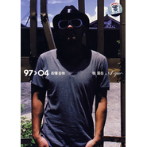

97>04 岳慢 岳快
============================

|  |  |
| :--: | :-- |
| [ 97>04 岳慢 岳快](https://emumo.xiami.com/album/363321) | **艺人**: [张震岳](../index.md) **语种**: 国语 **唱片公司**: 滚石唱片 **发行时间**: 2008年01月22日 **专辑类别**: 精选集 **专辑风格**: 国语流行 Mandarin Pop, 华语唱作人 Chinese Singer-Songwriter, 流行摇滚 Pop Rock **播放数**: 2415720 **收藏数**: 1650 **评论数**: 77  |

## 简介

《岳快岳慢》阿岳音乐历程全记录！

 全面解读阿岳，玩世不恭的外表下，有着细腻入微的情感世界！

 沉寂5年，厚积薄发，凭借《思念是一种病》，阿岳卷土重来。全新的风格，不禁让歌迷迷惑了，这还是我们熟悉的阿岳吗，那种玩世不恭、痞模痞样的摇滚风格已经荡然无存了。

 为了让新老歌迷了解一个全面的阿岳，滚石唱片精选了阿岳经典中的经典曲目十六首，其中囊括自由、爱的初体验、乾妹妹、我要钱、Free Night、爱我别走、勇气、分手吧、怎么办、在凌晨等大家耳熟能详的歌曲，熟悉阿岳的乐迷可以通过这张精选回忆一下当初阿岳，不熟悉阿岳的乐迷可以有一个全面了解阿岳的机会。

## 曲目

- [Free NightMV](./363321/xLpPqEd893d.md)
- [自由MV](./363321/xLpPqFcfb6a.md)
- [改变MV](./363321/mQ4Q2g6638c.md)
- [分手的人](./363321/mQ4Q2h840e5.md)
- [我要钱MV](./363321/mQ4Q2i911d2.md)
- [干妹妹MV](./363321/xLpPqJd8ae6.md)
- [爱的初体验MV](./363321/xLpPqKc188a.md)
- [一开始就没有退路MV](./363321/8GaOfved77c.md)
- [分手吧](./363321/8GaOfwef7a3.md)
- [爱我别走MV](./363321/mQ4Q2n520d6.md)
- [在凌晨MV](./363321/mQ4Q2o79786.md)
- [怎么办MV](./363321/xLpPqPa1b2b.md)
- [秘密](./363321/8GaOf017856.md)
- [勇气MV](./363321/mQ4Q2r5baec.md)
- [我给的爱](./363321/mQ4Q2s6af2d.md)

## 评论

|  |  |  |  |
| :-- | :-- | :-- | :-- |
|  [虾米用户](https://emumo.xiami.com/u/247129973)  2019-10-09 11:52 赞(0) 踩(0) | 
太棒了《自由》
 |
|  [虾米用户](https://emumo.xiami.com/u/1091873) 最多12个字符。 2018-12-22 10:16 赞(0) 踩(0) | 
10年了。
 |
|  [虾米用户](https://emumo.xiami.com/u/347071752) 面朝大海 春暖花开 2018-07-25 16:05 赞(0) 踩(0) | 
评论太少不科学
 |
|  [虾米用户](https://emumo.xiami.com/u/329796375)  2017-10-18 00:57 赞(0) 踩(0) | 
随便
 |
|  [虾米用户](https://emumo.xiami.com/u/329796375)  2017-10-18 00:57 赞(1) 踩(0) | 
越慢越快，人生如此，虾米如此，疯狂的聚会！！！！！OMG
 |
|  [虾米用户](https://emumo.xiami.com/u/87615396)   2017-07-16 19:44 赞(0) 踩(0) | 
经典之作，中文乐坛奇才！个性十足，音乐很好听。
 |
|  [虾米用户](https://emumo.xiami.com/u/29412881) 保持玩音乐的状态 一直到... 2017-03-15 02:50 赞(0) 踩(0) | 
张震岳  我爱你
 |
|  [虾米用户](https://emumo.xiami.com/u/1850288)  2016-11-19 22:29 赞(0) 踩(0) | 
爱的初体验，爱我别走，我要的爱
 |
|  [虾米用户](https://emumo.xiami.com/u/30431401)  2016-09-28 21:54 赞(4) 踩(0) | 
初二听的爱我别走，现在孩子上小学了 
 |
|  [虾米用户](https://emumo.xiami.com/u/194608448) 我们走吧！ 2016-09-03 21:29 赞(0) 踩(0) | 
良心之作
 |
|  [虾米用户](https://emumo.xiami.com/u/85947688)  2015-11-24 10:45 赞(0) 踩(0) | 
他的每首歌都好听 
 |
|  [虾米用户](https://emumo.xiami.com/u/45407904)  2015-11-12 00:02 赞(0) 踩(0) | 
就是要听大实话。
 |
|  [虾米用户](https://emumo.xiami.com/u/36499120)  2015-09-14 20:10 赞(1) 踩(0) | 
在追逐自己的音乐梦
 |
|  [虾米用户](https://emumo.xiami.com/u/49472654) 宇宙深处 2015-06-10 20:48 赞(0) 踩(0) | 
！！！！！！！！！
 |
|  [虾米用户](https://emumo.xiami.com/u/43130288) 卖螺蛳粉的王阿姨 2014-11-10 11:01 赞(0) 踩(0) | 
爱我别走，每次唱我都。。鸭子声
 |
|  [虾米用户](https://emumo.xiami.com/u/6213331) 邁出舞步 2014-11-09 23:38 赞(1) 踩(0) | 
<a href="http://emumo.xiami.com/u/4275776" target="_blank" rel="nofollow" name_card="4275776">@320K专门店</a> 07合格
 |
|  [虾米用户](https://emumo.xiami.com/u/36188570)  2014-10-28 22:55 赞(0) 踩(0) | 
爱的初体验是真好听，也许太好听，以至于他其他的歌没一个耐听的，简直是燥音！个人观点，不喜勿喷！
 |
| ⇒ |  [虾米用户](https://emumo.xiami.com/u/240824765)   2016-11-30 09:35 赞(0) 踩(0) | 
土鳖
 |
|  [虾米用户](https://emumo.xiami.com/u/36188570)  2014-10-28 22:52 赞(0) 踩(0) | 
除
 |
|  [虾米用户](https://emumo.xiami.com/u/275850)  2014-08-02 01:30 赞(1) 踩(0) | 
那个时候的张震岳好帅
 |
|  [虾米用户](https://emumo.xiami.com/u/783380)  2014-07-17 22:37 赞(0) 踩(0) | 
这他喵每一首都好听到爆啊。
 |
|  [虾米用户](https://emumo.xiami.com/u/11987919) 自娱自乐的ROBIN 2014-06-15 21:58 赞(0) 踩(0) | 
张震岳大爱
 |
|  [虾米用户](https://emumo.xiami.com/u/23441738)   2014-05-04 13:29 赞(0) 踩(0) | 
No reason
 |
|  [虾米用户](https://emumo.xiami.com/u/10201642) 我将回来 2014-04-25 10:07 赞(0) 踩(0) | 
这专辑各种精华啊
 |
|  [虾米用户](https://emumo.xiami.com/u/10812201)  2013-12-22 12:43 赞(0) 踩(0) | 
赞
 |
|  [虾米用户](https://emumo.xiami.com/u/24866636) 生活，就是音乐符号 2013-11-14 15:20 赞(0) 踩(0) | 
好好好
 |
|  [虾米用户](https://emumo.xiami.com/u/7527040)  2013-11-10 22:58 赞(3) 踩(0) | 
【已经忘了是什么时候认识张震岳了 只知道那个满大街都在播爱的初体验的年代里 我只是把他和旋风小子里那个和徐若萱交往的纨绔子弟话上等号。后来，听到 秘密 OK 自由 路口 勇气 便喜欢的一发不可收拾。这家伙的歌就像台味民谣摇滚米酒般的甘醇 让人循环了一遍后默默地按下REPEAT键】
 |
|  [虾米用户](https://emumo.xiami.com/u/4037596)  2013-10-15 21:03 赞(0) 踩(0) | 
最喜欢的是这张专辑
 |
|  [虾米用户](https://emumo.xiami.com/u/11834944) love music 2013-07-11 14:43 赞(0) 踩(0) | 
nice
 |
|  [虾米用户](https://emumo.xiami.com/u/11893001) wowo 2013-06-09 16:50 赞(0) 踩(0) | 
以前小时候不懂。。现在就懂了
 |
|  [虾米用户](https://emumo.xiami.com/u/13916160) hello~ 2013-04-27 14:34 赞(0) 踩(0) | 
就基本包括了所有他最有名的歌曲,好聽
 |
|  [虾米用户](https://emumo.xiami.com/u/6661598)  2013-03-21 09:22 赞(0) 踩(0) | 
发自灵魂的音乐，永远不会退流行
 |
|  [虾米用户](https://emumo.xiami.com/u/11907038)  2013-03-04 04:42 赞(0) 踩(0) | 
准备听
 |
|  [虾米用户](https://emumo.xiami.com/u/13209768) Stephen 2013-02-26 23:00 赞(0) 踩(0) | 
推荐，其他的都不说了。
 |
|  [虾米用户](https://emumo.xiami.com/u/11294370)  2012-12-18 19:57 赞(0) 踩(0) | 
青春
 |
|  [虾米用户](https://emumo.xiami.com/u/11913146)  2012-12-13 17:47 赞(0) 踩(0) | 
喜欢他的风格
 |
|  [虾米用户](https://emumo.xiami.com/u/10321035) 写点啥呢？算了。。黑线 2012-09-24 17:46 赞(0) 踩(0) | 
喜欢
 |
|  [虾米用户](https://emumo.xiami.com/u/3845224) 让风带走 2012-09-24 00:23 赞(0) 踩(0) | 
生命是一趟单程旅行...
 |
|  [虾米用户](https://emumo.xiami.com/u/3845224) 让风带走 2012-09-23 23:57 赞(0) 踩(0) | 
挺你
 |
|  [虾米用户](https://emumo.xiami.com/u/3845224) 让风带走 2012-09-23 23:56 赞(0) 踩(0) | 
确实是个说实话的另类
 |
|  [虾米用户](https://emumo.xiami.com/u/6629541)  2012-07-26 00:00 赞(0) 踩(0) | 
好听
 |
|  [虾米用户](https://emumo.xiami.com/u/2782231) :-( 2012-07-19 22:24 赞(0) 踩(0) | 
一听怎么办就崩溃这是病吗
 |
|  [虾米用户](https://emumo.xiami.com/u/6163112)  2012-03-28 16:37 赞(0) 踩(0) | 
专辑名字是岳慢岳快啊！！！
 |
|  [虾米用户](https://emumo.xiami.com/u/8190783) 我还没想好要写什么... 2012-03-06 18:55 赞(0) 踩(0) | 
+1
 |
|  [虾米用户](https://emumo.xiami.com/u/228659) 我还没想好要写什么... 2012-02-14 16:39 赞(0) 踩(0) | 
岳来岳棒
 |
|  [虾米用户](https://emumo.xiami.com/u/2909951) 我还没想好要写什么... 2012-01-29 00:36 赞(0) 踩(0) | 
太好了这个专辑
 |
|  [虾米用户](https://emumo.xiami.com/u/2331498)  2011-12-01 19:17 赞(0) 踩(0) | 
张震岳
 |
|  [虾米用户](https://emumo.xiami.com/u/5624135)  2011-10-12 16:04 赞(0) 踩(0) | 
wsss
 |
|  [虾米用户](https://emumo.xiami.com/u/5064569)  2011-08-22 04:32 赞(0) 踩(0) | 
有没有注意到这张专辑里面阿岳戴的帽子和思念是一种病里面的那顶是一样的
 |
| ⇒ |  [虾米用户](https://emumo.xiami.com/u/3949269) 狗屎啊，狗屎 2011-10-05 22:04 赞(0) 踩(0) | 
就是啊阿岳大概对那顶有特别的感情
 |
|  [虾米用户](https://emumo.xiami.com/u/2086809)  2011-07-24 13:48 赞(0) 踩(0) | 
爱我别走
 |
|  [虾米用户](https://emumo.xiami.com/u/4713241)   2011-07-03 11:14 赞(0) 踩(0) | 
RELPAY ON THE ROAD
 |
|  [虾米用户](https://emumo.xiami.com/u/4477693)  2011-06-29 06:15 赞(0) 踩(0) | 
我们自由了
 |
|  [虾米用户](https://emumo.xiami.com/u/2390305)  2011-06-15 10:05 赞(0) 踩(0) | 
喜欢~
 |
|  [虾米用户](https://emumo.xiami.com/u/1803405)  2011-05-31 15:26 赞(0) 踩(0) | 
就是喜欢你
 |
|  [虾米用户](https://emumo.xiami.com/u/3566990)  2011-04-23 20:59 赞(0) 踩(0) | 
精选集
 |
|  [虾米用户](https://emumo.xiami.com/u/2915010)  2011-04-13 11:59 赞(0) 踩(0) | 
好多老歌
 |
|  [虾米用户](https://emumo.xiami.com/u/3273586)   2011-03-21 09:57 赞(0) 踩(0) | 
歌单里的
 |
|  [虾米用户](https://emumo.xiami.com/u/2483229)  2011-01-24 22:59 赞(0) 踩(0) | 
喜欢...
 |
|  [虾米用户](https://emumo.xiami.com/u/2570002)   2011-01-23 14:43 赞(0) 踩(0) | 
喜欢张震岳
 |
|  [虾米用户](https://emumo.xiami.com/u/2525000)  2011-01-17 18:24 赞(0) 踩(0) | 
喜欢啊岳，不解释
 |
|  [虾米用户](https://emumo.xiami.com/u/647661)  2010-12-10 13:12 赞(0) 踩(0) | 
喜欢阿岳
 |
|  [虾米用户](https://emumo.xiami.com/u/1432141)  2010-10-16 23:20 赞(0) 踩(0) | 
是够慢的。。慢点。再慢点。。。
 |
|  [虾米用户](https://emumo.xiami.com/u/295735) 现实与梦境，我不怀疑 2010-08-26 16:47 赞(0) 踩(0) | 
这张确实很经典！！！！！！！！！让我见识了他的实力！！！！！！！！！！！记得唱片店老板总爱放那个“爸爸，我要钱......”
 |
|  [虾米用户](https://emumo.xiami.com/u/1209314) 不吝啬的是感受 2010-07-22 17:18 赞(0) 踩(0) | 
张老越老越帅。嘿嘿 。他当年的少林小子。...
 |
|  [虾米用户](https://emumo.xiami.com/u/783564) 我还没想好要写什么... 2010-06-15 10:40 赞(0) 踩(0) | 
他怎么不出新专辑了？？谁知道说下呗
 |
|  [虾米用户](https://emumo.xiami.com/u/3441) 茹毛饮血 2010-02-28 14:22 赞(0) 踩(0) | 
保持队形……
 |
|  [虾米用户](https://emumo.xiami.com/u/509470)  2010-01-25 09:53 赞(0) 踩(0) | 
保持队型嘛
 |
|  [虾米用户](https://emumo.xiami.com/u/103732) 我还没想好要写什么... 2010-01-13 12:03 赞(0) 踩(0) | 
= =!!这是咋了,多了那么些可爱的小蜗牛,呵呵。。。没有新调子,权当作重温吧。。。
 |
|  [虾米用户](https://emumo.xiami.com/u/522205) 一切很美，音為有你﹏ 2010-01-11 23:12 赞(1) 踩(0) | 
“玩世不恭的外表下，有着细腻入微的情感世界”呵呵 早年我从 勇气 摇摆 爱我别走 原谅 这几首歌里就感觉到了随着年龄的增大 蜕去傲气的阿岳 会带来更多更深沉动人的作品让我们期待吧!~
 |
|  [虾米用户](https://emumo.xiami.com/u/388701)  2010-01-11 22:08 赞(0) 踩(0) | 
是够慢的。。慢点。再慢点。。。
 |
|  [虾米用户](https://emumo.xiami.com/u/523680)  2010-01-11 20:30 赞(0) 踩(0) | 
是够慢的。。慢点。再慢点。。。
 |
|  [虾米用户](https://emumo.xiami.com/u/75072)  2010-01-11 20:11 赞(0) 踩(0) | 
是够慢的。。慢点。再慢点。。。
 |
|  [虾米用户](https://emumo.xiami.com/u/284050)  2010-01-11 19:41 赞(0) 踩(0) | 
是够慢的。。慢点。再慢点。。。
 |
|  [虾米用户](https://emumo.xiami.com/u/269007)  2010-01-11 17:59 赞(0) 踩(0) | 
是够慢的。。慢点。再慢点。。。   保持阵型
 |
|  [虾米用户](https://emumo.xiami.com/u/276282)  2010-01-11 13:42 赞(0) 踩(0) | 
是够慢的。。慢点。再慢点。。。
 |
|  [虾米用户](https://emumo.xiami.com/u/103732) 我还没想好要写什么... 2010-01-10 13:13 赞(0) 踩(0) | 
是够慢的。。慢点。再慢点。。。
 |
