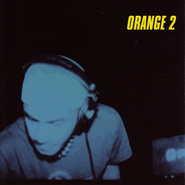

Orange 2
============================

|  |  |
| :--: | :-- |
| [ Orange 2](https://emumo.xiami.com/album/6220) | **艺人**: [张震岳](../index.md) **语种**: 国语 **唱片公司**: 魔岩唱片 **发行时间**: 2001年07月01日 **专辑类别**: EP, 单曲 **专辑风格**: 国语流行 Mandarin Pop, 华语唱作人 Chinese Singer-Songwriter, 电子 Electronic **播放数**: 300349 **收藏数**: 857 **评论数**: 47  |

## 简介

电子音乐是阿岳的兴趣之一，你还在适应阿岳的新角色？DJ Orange这回又玩出新花招！    <strong>⊙谁是DJ Orange！？照片揭晓就是张震岳啦！</strong>    在上一张EP专辑，一颗明亮鲜嫩多汁的橘子出现在专辑的封面，内页似成相识的模糊影像，搞不清楚这到底是谁？谁是DJ ORANGE？终于，在Orange首支MTV‘冬天下午的太阳’里，我们见识到DJ Orange的庐山真面目。就像MTV里那个俗辣、搞破坏的路人甲一样，DJ Orange的尝试与角色的冲突，成为一个问号？    <strong>⊙就在大家措手不及的时候Orange又出招了！</strong>    电子音乐是阿岳的兴趣之一，你还在适应阿岳的新角色？DJ Orange这回又玩出新花招！    短短不到两个月的时间，他以迅雷不及掩耳的速度完成Orange 2 第二张电子音乐Super EP制作。速度之快，令人纳闷，要揪出这其中的道理，答案只有一个----随性与自由，这全都是因为制作‘ORANGE 2’的阿岳跳出‘张震岳&amp; Free Night’的压力。    <strong>⊙曲目介绍</strong>    01 【Don’t Give A Damn About Me！】/ 具有舒缓、降温作用，宜解渴。你还在喊热吗！这个夏天有点逼近热熔点，再一点就要融化的温度，听这首歌心情不自觉就跟着凉爽。    早在Orange 1 这首歌就已完成，为了要破除传统“谁作、就要自己唱的观念。”在Orange1的时候，他尝试不用自己的声音诠释，这首也不例外，更重要的是阿岳首次用英文歌词表达，当然歌词不是由阿岳填写、但是概念和意境全都源自于阿岳本身。    02 【青蛙求偶记】/ 顾名思义，这是一首适合夏天、求偶的季节。    ‘夏天到了你若是在溪边、会听到青蛙呱呱呱、而且又是夏天，繁衍的季节。’歌的描述源自于阿岳，果真是一个乡下长大的孩子，城市的夏天还是车水马龙、乡下的夏天多的是呱！呱！呱！青蛙的叫声。70年代的复古味浓厚、穿着紧身上衣、喇叭裤，阿哥哥的装扮在舞会里磨蹭。 炎炎夏季，阿岳的青蛙求偶记的确让人清爽许多。    03 【朋友的话】/世界等着我们去改变。    柔软的House，再配合阿岳的Vocal‘这个世界是怎样、我是怎样、不要给我太多的压力，没有什么好去在乎，不要给我压力。’具有励志作用的歌曲。    04 【好天气】雨啊、拜讬你就别再下了！    轻松里带点俏皮的旋律。好天气的Brass听起来慵懒、Scratch不断地重复“Yep! Baby…..”分明要人不能抗拒它的快乐气氛。速度中庸、不需花太多脑筋，适合走路。    05 【隐藏】    潜入海里之前的深呼吸，海底的世界深藏不露，一切都静止等待发生。这是一首极为亢奋、但不是高涨的曲子，不断重复的旋律表面上听起来烦琐，却在无味中等待有趣的事情发生。颓废的慢板House、呢喃式的吟唱重复又重复，圈绕着黯淡的气氛。    06 【沈没】    从隐藏、好天气一直到沉没情绪一股作气、完整度更明确，尤其是情绪跟气氛的营造，简约中令人期待的单一旋律不曾间断…….直到平息。听见岳式情歌的影子，也是他最喜欢的一首曲子。    07 【要用力】/创世霹雳电玩主题配乐    这是一首电玩的主题配乐，结合速度、快感的Hard Trance，跃身高速公路的超快感，让我们再次听见‘逞速度英雄’的阿岳掌握速度之灵巧。是一首速度驾驭游戏的曲子。

## 曲目

- [Don’t Give A Damn About Me！](./6220/fM6s6c2e9.md)
- [青蛙求偶记](./6220/4Xy538a56.md)
- [朋友的话 (Vocal)](./6220/jYFwd6d93.md)
- [好天气](./6220/w9g3284bf.md)
- [隐藏 (Vocal)](./6220/jYFycd393.md)
- [沉没](./6220/jYFz9f5c0.md)
- [要用力](./6220/fM6y78762.md)

## 评论

|  |  |  |
| :-- | :-- | :-- |
|  [虾米用户](https://emumo.xiami.com/u/247129973)  2019-10-09 11:56 赞(1) 踩(0) | 
依旧是orange
 |
|  [虾米用户](https://emumo.xiami.com/u/8205758) 暂无签名~ 2019-06-11 10:27 赞(1) 踩(0) | 
18年前的专辑，屌 
 |
|  [虾米用户](https://emumo.xiami.com/u/7684146) luv. 2019-05-10 16:34 赞(1) 踩(0) | 
前卫 超前。
 |
|  [虾米用户](https://emumo.xiami.com/u/73064230) 最美好的幸福就是一无所知... 2019-05-01 23:15 赞(0) 踩(0) | 
宝藏男孩的宝藏专辑
 |
|  [虾米用户](https://emumo.xiami.com/u/2582482)  2019-04-17 23:43 赞(1) 踩(0) | 
还说什么了，张震DJ也是屌的不行
 |
|  [虾米用户](https://emumo.xiami.com/u/99465068) Spotify : Yo... 2019-03-30 10:29 赞(0) 踩(0) | 
爱
 |
|  [虾米用户](https://emumo.xiami.com/u/16181299) 我还没想好要写什么... 2019-03-08 02:16 赞(1) 踩(0) | 
这居然是2001年的，前卫
 |
|  [虾米用户](https://emumo.xiami.com/u/46417407) : 2019-02-18 09:59 赞(0) 踩(0) | 
独家很强
 |
|  [虾米用户](https://emumo.xiami.com/u/1536099) キラキラ 2018-12-10 11:28 赞(0) 踩(0) | 
宝藏~
 |
|  [虾米用户](https://emumo.xiami.com/u/25128230) 東  京  急  行  ... 2018-10-28 01:38 赞(0) 踩(0) | 
下班回去搞到午夜的东西，就是好啊 [文字cool]
 |
|  [虾米用户](https://emumo.xiami.com/u/13831197) 乐 生活 2017-10-09 17:27 赞(0) 踩(0) | 
卧槽！ 听了一下 蛮不错啊！ 列入CD清单了 
 |
|  [虾米用户](https://emumo.xiami.com/u/94254228)  2017-09-26 12:56 赞(0) 踩(0) | 
可以说是很前卫了 太几把牛逼了
 |
|  [虾米用户](https://emumo.xiami.com/u/5118264) Stop Talking... 2017-03-12 23:53 赞(0) 踩(0) | 
難得的實驗
 |
|  [虾米用户](https://emumo.xiami.com/u/55038076) 捣蒜 2017-01-25 22:03 赞(0) 踩(0) | 
好棒！ 
 |
|  [虾米用户](https://emumo.xiami.com/u/4183418) 。 2016-08-23 10:07 赞(0) 踩(0) | 
歌词是什么鬼
 |
|  [虾米用户](https://emumo.xiami.com/u/4211228)  2015-12-29 00:29 赞(0) 踩(0) | 
名字惊呆
 |
|  [虾米用户](https://emumo.xiami.com/u/74679326)  2015-12-06 15:50 赞(1) 踩(0) | 
听了6年多，唯一一个国人原创的DJ -EP，无法超越
 |
| ⇒ |  [虾米用户](https://emumo.xiami.com/u/93288170)  2015-12-21 00:52 赞(0) 踩(0) | 
啊岳的ORANGE2专辑电子乐华人排行第一，大陆做出来都是口水歌称为DJ。
 |
| ⇒ |  [虾米用户](https://emumo.xiami.com/u/307550608)  2017-11-30 11:01 赞(0) 踩(0) | 
窦唯1998《山河水》
 |
| ⇒ |  [虾米用户](https://emumo.xiami.com/u/227869336) 你的笑容我不想错过 2019-03-11 00:53 赞(0) 踩(0) | 
<q><b>jackie说：</b></q>
 |
|  [虾米用户](https://emumo.xiami.com/u/2265922)  2015-06-10 17:51 赞(0) 踩(0) | 
Keep being cool
 |
|  [虾米用户](https://emumo.xiami.com/u/28478813)   2015-05-09 10:42 赞(0) 踩(0) | 
很好听，
 |
|  [虾米用户](https://emumo.xiami.com/u/11508719) ¥ 2014-11-29 23:08 赞(2) 踩(0) | 
无意发现老张不怎么出名的DJ EP  不错不错
 |
| ⇒ |  [虾米用户](https://emumo.xiami.com/u/10857967) 我～就是我！不喜勿進！ 2016-08-11 11:36 赞(0) 踩(0) | 
这真是牛B
 |
|  [虾米用户](https://emumo.xiami.com/u/8687319)  2014-10-08 20:41 赞(1) 踩(0) | 
阿岳也开始玩电音了。。。不能在潮流节奏里掉队和顽固不化了。。。GOOD！
 |
| ⇒ |  [虾米用户](https://emumo.xiami.com/u/93288170)  2015-12-21 00:54 赞(0) 踩(0) | 
2001年的作品了，不是开始。
 |
|  [虾米用户](https://emumo.xiami.com/u/3944235) 耳朵说不塞耳机就聋掉 2014-07-24 19:34 赞(0) 踩(0) | 
超屌
 |
|  [虾米用户](https://emumo.xiami.com/u/4715251) 愿屁屁在喵星开开心心还有... 2014-03-24 14:40 赞(1) 踩(0) | 
这个好像是阿岳第二张DJ专辑？
 |
|  [虾米用户](https://emumo.xiami.com/u/26198151)  2013-11-09 19:28 赞(0) 踩(0) | 
摇啊摇
 |
|  [虾米用户](https://emumo.xiami.com/u/3458082)  2013-09-15 15:46 赞(1) 踩(0) | 
太基霸牛逼了
 |
|  [虾米用户](https://emumo.xiami.com/u/20033485)  2013-08-23 11:27 赞(0) 踩(0) | 
电子
 |
|  [虾米用户](https://emumo.xiami.com/u/10294893) XXX 2012-11-23 20:48 赞(0) 踩(0) | 
喜欢沉没
 |
|  [虾米用户](https://emumo.xiami.com/u/10999543)  2012-10-11 14:29 赞(1) 踩(0) | 
Dontgiveadamnaboutitaboutitaboutit
 |
|  [虾米用户](https://emumo.xiami.com/u/9629934)   2012-08-28 17:32 赞(1) 踩(0) | 
阿岳
 |
|  [虾米用户](https://emumo.xiami.com/u/2804960) 火星骆驼 2012-07-06 18:28 赞(0) 踩(0) | 
我超级爱的一张
 |
|  [虾米用户](https://emumo.xiami.com/u/9021226) 艺褀 2012-04-29 14:01 赞(0) 踩(0) | 
d0ntg1veadamnab0utme
 |
|  [虾米用户](https://emumo.xiami.com/u/6766358)  2011-12-10 15:07 赞(0) 踩(0) | 
歪瑞乃丝！！
 |
|  [虾米用户](https://emumo.xiami.com/u/4373016)  2011-10-14 21:08 赞(0) 踩(0) | 
pengpengping
 |
|  [虾米用户](https://emumo.xiami.com/u/207458)  2011-09-20 22:15 赞(0) 踩(0) | 
帅，阿岳要不要考虑玩1下嘻哈爵士
 |
|  [虾米用户](https://emumo.xiami.com/u/384509)  2011-05-21 00:01 赞(0) 踩(0) | 
爱这张...
 |
|  [虾米用户](https://emumo.xiami.com/u/440673)  2011-04-27 21:40 赞(0) 踩(0) | 
大爱！！
 |
|  [虾米用户](https://emumo.xiami.com/u/542697)  2011-03-05 03:54 赞(0) 踩(0) | 
for you
 |
|  [虾米用户](https://emumo.xiami.com/u/1667206)  2011-01-25 23:44 赞(0) 踩(0) | 
哎
 |
|  [虾米用户](https://emumo.xiami.com/u/1667206)  2011-01-25 23:44 赞(1) 踩(0) | 
哎 头疼
 |
|  [虾米用户](https://emumo.xiami.com/u/159140) 我还没想好要写什么... 2010-07-26 10:04 赞(0) 踩(0) | 
很好听。。但是音质好像差了点。。
 |
|  [虾米用户](https://emumo.xiami.com/u/515510)  2010-07-14 18:27 赞(0) 踩(0) | 
最喜欢的张震岳专辑！
 |
|  [虾米用户](https://emumo.xiami.com/u/390959)  2009-09-21 18:38 赞(0) 踩(0) | 
很不错！
 |
