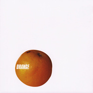

Orange
============================

|  |  |
| :--: | :-- |
| [ Orange](https://emumo.xiami.com/album/6222) | **艺人**: [张震岳](../index.md) **语种**: 国语 **唱片公司**: 魔岩唱片 **发行时间**: 2001年04月01日 **专辑类别**: 录音室专辑 **专辑风格**: 国语流行 Mandarin Pop, 电子 Electronic, 华语唱作人 Chinese Singer-Songwriter **播放数**: 274313 **收藏数**: 968 **评论数**: 69  |

## 简介

Orange-首张个人电子音乐专辑    这回张震岳摇身一变成Party maker—Orange。Chill out、Break-Beat、Trance、Disco、复古，浓浓电味、电气充满四溢。    <strong>⊙电音的时代即将来临?</strong>    电子音乐的引进在台湾少说有十年之久，从地下孤芳自赏期一直到地上生龙活虎，电子音乐渐渐跟流行品牌划上等号。不论身上穿的(闪亮萤光棒)、戴的(耳机)、吃的就别提了！惊人的魅力横扫，全台湾起立摇头，连不明就理就栽进去的辣哥辣妹都趋之若骛。哎！电音，不是‘瘾’字可以形容的。    从‘这个下午很无聊’、‘秘密基地’、一直到2000年的‘有问题’，张震岳的无与伦比超强渗透力和扩散性一直为青少年疯狂，除了带领台湾的流行音乐进入前所未有的改变，其简单直接的歌词、郎郎上口的旋律，和重摇滚夹带批判的眼神，已成为新世代年轻人的国歌。张口结舌通常是大家听过张震岳的歌立刻浮出的表情，再真实不过、大快人心。    这回台湾街头教主、音乐指标先生张震岳要为各位带来的可不是摇滚，彻头彻尾完全超乎想像之外，他摇身一变成Party maker—Orange。Chill out、Break-Beat、Trance、Disco、复古，浓浓电味、电气充满四溢。    天将将大任于私人也，必先苦其心志。别看他一附痞样，对于这张Mini Album阿岳可是卯足了劲完成，据说概念的形成已有一年半，从进录音室一直到开始Mix，完成的曲子洋洋洒洒早已超过十首。尤其对每一首歌的要求几乎达到了鸡蛋里挑骨头、铁杵磨成绣花针的精神，光是一首歌，早上听到的是这个版本，下午可能又是另外一种，前前后后版本不下七八种，几乎快撑死录音室的苹果。    不断地更换马力速度，让所有人感受到阿岳在电子世界里的有趣、自由自在。    音乐的潮流即将转变？！张震岳的音乐似乎嗅出一点端倪。你永远都无法清楚的知道阿岳接下来会做什么？姑且说它音乐上的人格分裂。除了具备有铁打不坏之身，还必须有无止尽的创意。    <strong>⊙‘Orange’?</strong>    什么是Orange？这可不是一般的橘子、也不是柳橙汁，只是阿岳酷爱的颜色。叫DJ太沈重。‘所以叫我Orange就好了。’从今天开始，张震岳的另一个别名叫做“Orange”，混身上下劲电十足的Orange。    话说10年前，阿岳在唱片行听见‘这个音乐听起来不一样喔！’从此粱子结下了！非要尝尝一点咸湿又不腻的电子元素，音乐才会有乐趣，这棵种子就慢慢地在他心目中不断茁壮，并誓言有一天一定要完成它，耳尖的人或许从去年‘有问题’专辑早就已经听出一些蛛丝马迹。    你以为张震岳只有摇滚吗！现在魔掌即将朝你而来、延伸到另一境地—电子音乐。    ‘Orange味道’/黄昏、灯光微醺、慵懒、无压力状态。    电子音乐的高贵气质和冷峻是一般人对它的印象，张震岳的Orange可就平易近人。对于看了千百次还是有看没有懂的侧条说明，来！给你最平民化的Orange，这张专辑可以说是言简易赅、乐趣无比结合速度、即兴与自由的电子专辑。    ‘当初有设定它是一个比较软性的东西、像现在流行chill out比较慢一点。最有趣的东西，还是即兴的。’通常阿岳对于这一天的录音工作没有什么具体的想法，即兴天马行空的作法，大部份都进录音室之后才开始执行。‘顶多前一天想到我今天想要做多快的歌。我今天想要做速度120或速度9啲歌。我是以这个当作出发点，再去写以什么速度为出发点的东西。’    ‘我们比较喜欢用真的Bass，用拼贴的方式、拼贴人声，不然就是找人家来Scratch，这是我以前没有做过的东西。’Chill out、break-beat、trance、house、Drum'n'bass、华丽的钢琴声外加阿岳卖力演出的Bass。你能想像置身沙滩的慵懒、阳光下午的狂奔和遛狗、宁静夜里的呼啸和美少女声音的奇幻咒语。    现在就来试试看！    <strong>⊙‘Orange不等于张震岳 &amp; Free Night’</strong>    阿岳难不成跟Free Night拆伙？ No No No…..只是take a break!午休时间到了。    ‘在工作上我希望有很多不一样的想法，有哪些想法去突破现有的创作、表演模式，那是非常重要的一点。’对于他挑战自己极限的说法很令人害怕，未来这个家伙会做出什么事情只能静观其变。‘所以我会暂时不跟Free Night一起工作，给我自己一个很大的空间，而是用多方面的音乐呈现，挑战自己的极限罢了。’这只是阿岳的其中一样兴趣罢了。‘Orange也是一样，在这个市场上，有人就这样做，我相信我这些Orange是有趣、好玩的。因为Free Night就有一些限制，单独的话就会有一些风格，脱离我以前的风格吧。’    <strong>⊙‘多做一点，又不会少一块肉。’</strong>    看过阿岳演出的人都一定会有暴动即将来袭的预感，分秒都在和血管里的血液赛跑，这是摇滚的张震岳。    ‘其实我也在ㄍ一ㄥ自己、也在看自己的极限。Orange不算是一个改变，我也想做做看，这些是潮流，哪些部分是可以做的、有哪些是还没有被开发出来。’    既然对电子音乐思慕已久，不去实现它又觉得心有不甘！终于在完成‘有问题’之后随即进入录音室，暂时摆脱摇滚歌手的身份。    堪称张震岳首张电子音乐专辑、台湾电子音乐地上化的最佳代表。除了Orange外，接下来阿岳还继续完成Orange II，预计五月中发行，至于专辑能不能受到众人喜爱，颇有音乐领导者风范的阿岳还是一附痞样：‘这种东西不期待成绩会多好，我也不期待人家对我的评价，我只是在试探我自己的极限到底可以到达哪里。音乐是很主观的，有可能叫好不叫座。’    <strong>⊙甘拜下风的‘六分钟’长度论</strong>    为这些都只是一些创意。创意跟旋律是比较重要的，要用很轻松的态度去看它。’对！轻松到工作人员拷贝到手软的地步。

## 曲目

- [冬天下午的太阳Winter Afternoon Sunshine](./6222/bjTLaa2ec.md)
- [机器人走路Robot Walking](./6222/b9ULf4f66.md)
- [偷懒Lazy](./6222/bZVA22d68.md)
- [山道王King of the Mountain Road](./6222/JST7c8a5.md)
- [微风香水Light Wind Perfume](./6222/bjTOdedaa.md)
- [停Stop](./6222/cPX12f388.md)
- [Trouble (Remix)](./6222/JSW5a75c.md)

## 评论

|  |  |  |
| :-- | :-- | :-- |
|  [虾米用户](https://emumo.xiami.com/u/66823378)  2020-03-29 00:53 赞(0) 踩(0) | 

 |
|  [虾米用户](https://emumo.xiami.com/u/413638266)  2019-11-03 13:12 赞(0) 踩(0) | 
舒舒服服 
 |
|  [虾米用户](https://emumo.xiami.com/u/247129973)  2019-10-09 11:56 赞(0) 踩(0) | 
dj       orange！
 |
|  [虾米用户](https://emumo.xiami.com/u/42560187) 归于传统 2019-08-04 10:18 赞(0) 踩(0) | 
实验电子大咖
 |
|  [虾米用户](https://emumo.xiami.com/u/15010887) 向死而生 2019-07-27 09:28 赞(0) 踩(0) | 
阿岳的电子砖还有啥说的，满分！
 |
|  [虾米用户](https://emumo.xiami.com/u/4017081) 我还没想好要写什么... 2019-07-25 15:03 赞(0) 踩(0) | 
这张专辑出过磁带吗
 |
|  [虾米用户](https://emumo.xiami.com/u/604558)  2019-07-13 03:49 赞(4) 踩(0) | 
开始理解老一辈人对当时所爱事物的执念，并非不纳新只是太念旧。纵贯线为什么拉上阿岳呢，也许他也代表了一个时代，至少是我的那个时代。这个版本是我最喜欢的，很佩服张震岳玩音乐玩儿的那么信手拈来又那么顺理成章。这也许是他做人做事的风格吧，所谓达不到的才最想要，这也是我艳羡的。个人觉得整盘专辑是有前瞻性的，放在当下听也走路带风。天才在不喜欢的人眼里也就是穿了衣服的猩猩，所以十几年前专辑卖相惨淡。如今依然热爱这盘不太复杂的电音专辑，这也是为什么有些人会把另一些人当成神的原因。神人有神作品，还有一小撮念旧的神经质崇拜者，这就厉害了这就好有爱了。老话讲的好，社会主义好，社会主义初级阶段允许一小部分人先幸福起来
 |
|  [虾米用户](https://emumo.xiami.com/u/73064230) 最美好的幸福就是一无所知... 2019-05-01 23:09 赞(1) 踩(0) | 
宝藏男孩的宝藏专辑
 |
|  [虾米用户](https://emumo.xiami.com/u/402338854) 我还没想好要写什么... 2018-09-11 10:48 赞(0) 踩(0) | 
宝藏啊这一专辑
 |
|  [虾米用户](https://emumo.xiami.com/u/36897148) 私信➕v请备注 2018-08-26 00:11 赞(0) 踩(0) | 
01的作品，好前卫
 |
|  [虾米用户](https://emumo.xiami.com/u/8970340) 小石头 2018-01-10 14:22 赞(0) 踩(0) | 
刮目相看
 |
|  [虾米用户](https://emumo.xiami.com/u/7834130)  2017-12-19 08:47 赞(0) 踩(0) | 
《停》很神。
 |
|  [虾米用户](https://emumo.xiami.com/u/1384976) 永远年轻，永远热泪盈眶… 2017-08-22 11:20 赞(2) 踩(0) | 
妈蛋，0204呢
 |
| ⇒ |  [虾米用户](https://emumo.xiami.com/u/10857967) 我～就是我！不喜勿進！ 2018-01-21 13:37 赞(0) 踩(0) | 
0204是在有问题那张专辑里面
 |
|  [虾米用户](https://emumo.xiami.com/u/186156516) 我的故事被風吹散 我的明... 2017-07-12 03:31 赞(0) 踩(0) | 
微风香水
 |
|  [虾米用户](https://emumo.xiami.com/u/11798035)  我们一起奔跑吧 2017-05-28 00:25 赞(0) 踩(0) | 
这张真的很好听
 |
|  [虾米用户](https://emumo.xiami.com/u/49420522) :-I 2017-04-09 20:55 赞(0) 踩(0) | 
封面太好看
 |
|  [虾米用户](https://emumo.xiami.com/u/85722000)   2017-04-05 17:55 赞(1) 踩(0) | 
年少无知错过的一张好专辑
 |
|  [虾米用户](https://emumo.xiami.com/u/4752582)  2017-02-05 13:09 赞(0) 踩(0) | 
散步最佳背景音乐   
 |
|  [虾米用户](https://emumo.xiami.com/u/37159474) 儿科咸鱼医生进阶中… 2016-12-11 11:18 赞(2) 踩(0) | 
冒个泡 昨天终于买到台湾的这张专辑了 
 |
|  [虾米用户](https://emumo.xiami.com/u/15710240)  2016-11-26 22:33 赞(0) 踩(0) | 
高一老听 很有意思的电子专 今年碰巧看了张震岳 音乐节嘛 唱的都是熟悉的几首 他就在那闷头唱感觉快睡着了 我站的也快睡着了 几首后开始讲话 讲话也像自言自语 但声音敲好听 不吵 软绵绵的 真的可以听他碎碎念一天的感觉
 |
|  [虾米用户](https://emumo.xiami.com/u/4235762)  2016-07-23 11:43 赞(0) 踩(0) | 
好棒
 |
|  [虾米用户](https://emumo.xiami.com/u/17719900) 请把我的歌带回你的家 2016-05-31 22:08 赞(0) 踩(0) | 
太有意思
 |
|  [虾米用户](https://emumo.xiami.com/u/430208)  2016-05-25 13:10 赞(2) 踩(0) | 
以前在家放这专辑的时候总挨妈妈揍
 |
|  [虾米用户](https://emumo.xiami.com/u/16896103) 我还没想好要写什么... 2016-04-21 22:11 赞(0) 踩(0) | 
yue
 |
|  [虾米用户](https://emumo.xiami.com/u/16896103) 我还没想好要写什么... 2016-04-21 22:01 赞(0) 踩(0) | 
01年
 |
|  [虾米用户](https://emumo.xiami.com/u/84770580) 不发声的爱恋 2015-11-25 16:55 赞(0) 踩(0) | 
超赞！
 |
|  [虾米用户](https://emumo.xiami.com/u/17013788) 微博同名 2015-11-17 11:14 赞(0) 踩(0) | 
很棒啊
 |
|  [虾米用户](https://emumo.xiami.com/u/10791590) *** 2015-09-09 13:13 赞(0) 踩(0) | 
得樂池得樂
 |
|  [虾米用户](https://emumo.xiami.com/u/2791252)  2015-07-13 13:26 赞(3) 踩(0) | 
2001年新街口音像店这张进口CD卖180还是200来着，当时觉得肉疼没拿下
 |
|  [虾米用户](https://emumo.xiami.com/u/29848735)  2015-01-22 17:47 赞(0) 踩(0) | 
很嗨嘛~
 |
|  [虾米用户](https://emumo.xiami.com/u/863150)  2014-08-28 11:11 赞(0) 踩(0) | 
好听 初秋的早上听，舒服！
 |
|  [虾米用户](https://emumo.xiami.com/u/1035146) 真高兴 我的心还活着 2014-07-07 23:20 赞(0) 踩(0) | 
电电电电电电电
 |
|  [虾米用户](https://emumo.xiami.com/u/18292318) ɧơɬ ɠıཞƖ ᒼᑋᐡ... 2014-04-12 18:12 赞(0) 踩(0) | 

 |
|  [虾米用户](https://emumo.xiami.com/u/450138)   2014-01-19 13:06 赞(1) 踩(0) | 
winter afternoon sunshine 有点像混沌武士ost啊
 |
|  [虾米用户](https://emumo.xiami.com/u/27399690) 我还没想好要写什么... 2014-01-03 19:51 赞(0) 踩(0) | 
张震岳
 |
|  [虾米用户](https://emumo.xiami.com/u/12686938) 活捉一只伪文青 2013-12-01 21:20 赞(0) 踩(0) | 
上高中的时候给同桌听《冬天下午的太阳》。一边写作业一边听完，他问我这首歌的名字，后来一致认为这个名字起得太好拉。暖洋洋的O(∩_∩)O
 |
|  [虾米用户](https://emumo.xiami.com/u/6258173) 我还没想好要写什么... 2013-10-28 14:31 赞(0) 踩(0) | 
orange！
 |
|  [虾米用户](https://emumo.xiami.com/u/7397144) 清歌一片,可惜付与黄昏 2013-10-04 23:23 赞(0) 踩(0) | 
沃特？微风香水是这张专辑的。。。~~！！？？？
 |
| ⇒ |  [虾米用户](https://emumo.xiami.com/u/1582817) 若收藏精选集已删除，请用... 2013-11-29 11:43 赞(0) 踩(0) | 
耶斯，噫特噫斯！是的不要疑问！！＾＿＾．．．
 |
| ⇒ |  [虾米用户](https://emumo.xiami.com/u/10857967) 我～就是我！不喜勿進！ 2015-02-25 13:00 赞(0) 踩(0) | 
有歌词的版本在《等我有一天》专辑里面
 |
| ⇒ |  [虾米用户](https://emumo.xiami.com/u/10857967) 我～就是我！不喜勿進！ 2015-02-25 13:02 赞(0) 踩(0) | 
这个是电子版
 |
| ⇒ |  [虾米用户](https://emumo.xiami.com/u/7397144) 清歌一片,可惜付与黄昏 2015-02-25 16:40 赞(0) 踩(0) | 
<q><b>王心凌的房客说：</b></q>
 |
|  [虾米用户](https://emumo.xiami.com/u/1582817) 若收藏精选集已删除，请用... 2013-09-11 17:06 赞(0) 踩(0) | 
比特率１９２ 都审不过核 ＞＿＜．．．
 |
|  [虾米用户](https://emumo.xiami.com/u/13435865) 草泥马的马勒戈壁＞＿＜… 2013-09-11 17:05 赞(0) 踩(0) | 
内容已删除
 |
| ⇒ |  [虾米用户](https://emumo.xiami.com/u/2412785) 火焰不熄，摇滚不已！ 2013-09-15 21:47 赞(0) 踩(0) | 
稍安勿躁，我已经发布新的了，正在审核
 |
|  [虾米用户](https://emumo.xiami.com/u/18411239) 我坐在枝头上孤独的唱歌 2013-08-09 20:29 赞(20) 踩(0) | 
绝对容易被忽视和低估的一张阿岳的专辑。第一首慵懒舒服，本以为这张专辑会以迷幻电子味主导。没想到第二首机器人走路加入了DISCO元素。第三首慵懒又加入蓝调和HOUSE。总之每两首都会穿插BEAT很强和相对缓和。绝对燃！
 |
|  [虾米用户](https://emumo.xiami.com/u/1329826)  2013-06-13 17:41 赞(0) 踩(0) | 
有些岳迷见得不得异见      自己又不发言。真是受不了。你觉得好听别人非得也觉得好听吗？(#‵′)凸
 |
| ⇒ |  [虾米用户](https://emumo.xiami.com/u/1582817) 若收藏精选集已删除，请用... 2015-05-20 23:12 赞(0) 踩(0) | 
你不懂电子　当然不爱听　弱你　就弱你个明白？！  你有脾气么？！！！！！！！！！！！！！！！！！
 |
|  [虾米用户](https://emumo.xiami.com/u/13697300)  2013-03-27 13:29 赞(0) 踩(0) | 
就是喜欢啊
 |
|  [虾米用户](https://emumo.xiami.com/u/5873475)  2012-12-29 14:49 赞(0) 踩(0) | 
喜欢喜欢喜欢
 |
|  [虾米用户](https://emumo.xiami.com/u/7817482)  2012-11-01 10:14 赞(0) 踩(0) | 
很黑怕的~\\(≧▽≦)/~啦啦啦
 |
|  [虾米用户](https://emumo.xiami.com/u/655219) 老去是最好的招安。 2011-11-28 20:18 赞(2) 踩(0) | 
不痞子，不浮躁。
 |
|  [虾米用户](https://emumo.xiami.com/u/6310813)  2011-11-24 00:22 赞(1) 踩(0) | 
秋天！阳光！聆听！时间！停留！
 |
|  [虾米用户](https://emumo.xiami.com/u/4373016)  2011-10-14 21:10 赞(0) 踩(0) | 
penpengpen
 |
|  [虾米用户](https://emumo.xiami.com/u/201318)  2011-08-02 15:43 赞(0) 踩(0) | 
实在不太成功，算了吧还是
 |
| ⇒ |  [虾米用户](https://emumo.xiami.com/u/1582817) 若收藏精选集已删除，请用... 2015-05-20 23:12 赞(0) 踩(0) | 
<q><b>说：</b></q>
 |
| ⇒ |  [虾米用户](https://emumo.xiami.com/u/1113346) 你曾怀疑，别忧郁我们终将... 2017-08-25 01:11 赞(0) 踩(0) | 
<q><b>耀动乾坤说：</b></q>
 |
|  [虾米用户](https://emumo.xiami.com/u/5105952)  2011-08-02 15:41 赞(0) 踩(0) | 
Orange-首张个人电子音乐专辑
 |
|  [虾米用户](https://emumo.xiami.com/u/2967289)  2011-07-10 00:00 赞(0) 踩(0) | 
mark：机器人走路偷懒山道王微风香水
 |
|  [虾米用户](https://emumo.xiami.com/u/467051)  2011-03-31 00:49 赞(0) 踩(0) | 
太喜欢这张了！像实验乐
 |
|  [虾米用户](https://emumo.xiami.com/u/1234001)  2010-10-30 12:24 赞(1) 踩(0) | 
挺前卫的一张专辑
 |
|  [虾米用户](https://emumo.xiami.com/u/651946) 乱听歌，喜欢各种风格，不... 2010-06-14 16:31 赞(0) 踩(0) | 
山道王！！！！！！！！！
 |
|  [虾米用户](https://emumo.xiami.com/u/710113)  2010-03-09 13:32 赞(0) 踩(0) | 
听第一首就喜欢  好听
 |
|  [虾米用户](https://emumo.xiami.com/u/500870)  2009-11-27 18:46 赞(0) 踩(0) | 
这张其实一般啦，算是新的尝试吧~
 |
|  [虾米用户](https://emumo.xiami.com/u/216714)   2009-11-21 11:06 赞(1) 踩(0) | 
微風香水和山道王調反了吧
 |
|  [虾米用户](https://emumo.xiami.com/u/406003) 虾米！我不想听你推荐给我... 2009-09-25 12:16 赞(0) 踩(0) | 
好~~好歌，好歌。
 |
|  [虾米用户](https://emumo.xiami.com/u/406003) 虾米！我不想听你推荐给我... 2009-09-25 12:15 赞(0) 踩(0) | 
好~~好歌，好歌。
 |
|  [虾米用户](https://emumo.xiami.com/u/186081)  2009-07-24 14:24 赞(1) 踩(0) | 
真的很慵懒  现在外面正下着雨 虽然是夏季 感觉却像秋天  边工作边听着这张音乐  感觉是如此舒服
 |
|  [虾米用户](https://emumo.xiami.com/u/207458)  2009-06-20 22:00 赞(1) 踩(0) | 
很棒啊，这张电子，很有味道，不过我听那个停才是trouble的remix吧 remix的版本真是爽，和原版比真是变凤凰了
 |
