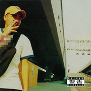

有问题Trouble
============================

|  |  |
| :--: | :-- |
| [ 有问题Trouble](https://emumo.xiami.com/album/6223) | **艺人**: [张震岳](../index.md) **语种**: 国语 **唱片公司**: 魔岩唱片 **发行时间**: 2000年12月05日 **专辑类别**: 录音室专辑 **专辑风格**: 国语流行 Mandarin Pop, 华语唱作人 Chinese Singer-Songwriter, 流行摇滚 Pop Rock **播放数**: 627227 **收藏数**: 1029 **评论数**: 109  |

## 简介

<strong>⊙年轻文化的张震岳</strong>    不做作、坦白、直接了当。阿岳的歌经常出现在时下青年的个性和思绪，不论城市角落和乡村，来不及闪躲的影响力早已向下扎根，俨然成为年轻族群的仗义直言者。    没什么大不了，干嘛躲！都会年轻人的一贯穿着垮裤、滑板鞋、在童话故事里着魔可爱的装饰物，在卡通与漫画间找寻自己的模样，却又同时在虚幻与现实间游离，不然就是骑着心爱的马车，载着妹妹看夜景，痞样的表情--叛逆、不管你承不承认，不爽的时候伸出中指、脏字中带着锋刃的力道，违法喔！电视上立法院还不是天天在上演。这厢批判听起来颇有道理，自信、真实的可爱、不造作，都一一在张震岳的歌词中显现。当然也有失落的时候，『美国派的电影情节正在上演』对未来的矛盾虚幻和不切实际，没工作就去打工、不然摆地摊也可以，但是不能没有爱情的滋润，爱情永远比面包大、爱情是一生中最大的志业。    肆无忌惮的生活力量、只有年轻才拥有的生命力，都比任何人还要深刻。他是流行语的产生、是所有年轻人的综合体，是生活意识的结合，是衍伸的现象，张震岳是年青生活的一种模式。    从前两张专辑，张震岳创造一股极具颠覆的风潮，从他的言行举止，俨然成为新世代的代表和模仿，而五十万张的销售量说明了年轻人要表达的意念，街头及KTV不断攀升的点播速率看见年轻人身体力行的效果。年轻人无意识地朝拜张震岳身上散发的元素，究竟什么样的魅力让人着魔？不懂，大家只有摸摸鼻子、拍拍头，管他呢！爽就对了。    这不是阶级意识，是坦白到不行----一个最直接的表达、有什么就说。    <strong>⊙一张充满惊异、狂想与揶揄、骚动的专辑</strong>    从退伍后第一张专辑『这个下午很无聊』到『秘密基地』，青春、浪漫的幻想不断地呈现，在经历退伍、写歌、拍电影、开服饰店、自制录音室、现在他还多了制作人的角色。    整张专辑像是半开放式的更衣间，里面的多样情趣、不需完全透视，他不断地骚你痒，却又直接了当地给你。除了张震岳特有的狠重摇滚(Trouble)、岳式情歌(在凌晨、一开始就没退路、想太多)之外，这次还加入更多电子(作梦、世界大同)和舞曲的风格。霓虹的舞池、幻灭的爱情、凌乱落寞的空房间、放纵肢体和感觉，颓废的欲望、失序的社会、和求助于新科技的爱抚，交杂层递，一波波不断地扩张，只有年轻才能拥有的意识都在音乐中一一呈现。    <strong>⊙『录音式的源起始末---阳明山我爱你』</strong>    从歌手一直到制作人的角色，所有人都虎视眈眈看着阿岳未来的方向，不知道他会创造什么新流行，从语不惊人死不休的「我要钱」、要你跳到不行的恰恰新风潮、很重节奏的摇滚，他一直给人期待和新想法。就连这张专辑，他的做法也较往常不同，其原因来自于他的录音室，『山不再高，有仙则灵』，这个『秘密基地』坐落于阳明山的某个角落。    在2000年的年初，一直希望拥有自己录音室的阿岳，终于在1月1日实现自己的梦想，采买古里古怪的器材、录音室的室内设计，经过四个月的工作，一间充满灵性的Home Studio诞生，张震岳&amp; Free Night从此进入私家录音时代。具他形容自己的录音室有如万花筒，其成分不过就是Free Night再加上舒适的录音空间、毫无限制的时间，大家一起JAM。    <strong>⊙『有问题』的创作方式--『关机重开』</strong>    音乐作品是一直源源不绝的，不停的写，不停的改，写完之后，觉得，嗯，不太好，然后Delete，『嘟』一声，所有的东西都不见了，这样累积下来，几百首歌全部都消失无踪，听过的只有一个人，叫张震岳。上面的这一段话，张震岳说的轻松，听的企划人员简直面无血色，天啊！这些东西竟然就这样消失了，这这这，这简直就是暴殄天物。企划人员有幸听过了不小心没被洗掉的「打电话给我」这首歌，超级爱不释手，但是，却无缘让众位歌迷听见。只能大声怨叹『计算机计算机我恨你！』    第一次身为自己专辑制作人  制作人--『唉！炸炮啦』    制作人，其实他一点也不炸炮。这一张首次身为自己专辑的制作人，在为那么多人写歌、制作之后，他又为自己跨越一步。『以前我就觉得制作人是一种很炸炮的工作，现在还是这样觉得。』不过，万事起头难，做完之后，阿岳满意的说『我有一部份蛮自傲的，就是我对声音很敏感，我觉得那是天赋。这一部份我很有信心。而年纪越来越大知道的越来越多，对于技术层面越来越了解。』    听说有很多禁歌？    禁歌--『禁止割包皮？』这是他的一些道理，听了众人会心一笑。『这些歌对社会，我不觉得那是负面的影响，比如说骂脏话，这是一个事实，谁没骂过脏话谁没做过弊?我何必要为这些事情道歉?如果我们要去怪罪的话是这个社会，那是从上面传给我们的?不能打架不能干麻，那些政治新闻在开会，谁不打架、谁不骂脏话?而且还SNG现场直播，要负社会责任??没有什么好争论的。卫道人士的自命清高。这些过程是很应该，对这些个别的事情没有什么好去争论的，过几年之后我们还是都上天堂。』    <strong>⊙『创作风格 ---我一直觉得我是主流的歌手，只是加一些奇怪的东西在里面。』</strong>    『音乐跟歌是不一样的。如果是歌曲的话，词带进去会主导你对这首歌的想法，如果是音乐的话 你的想象空间会更大想象空间会更多一点，而不是透过歌词去告诉你要做些什么，这一次的专辑有做一点这样的东西进去』音乐的想法一直不断地改变，让人为之惊艳。『要做新的东西每一个音乐人都做的出来，只是看他们敢不敢作，现在我已经找到一个平衡点。如果你也是听西洋音乐长大，说什么像什么，那只是一个元素而已，是因为听到什么，喜欢什么，所以我要做这个什么东西。说什么像什么其实是很无聊的。』    有问题--『10首歌』+一首Bouns走到底演奏版，最重要的是专辑内附超值重量Power CD，一张无限通往张震岳『秘密基地』的钥匙。    <strong>⊙Power CD介绍</strong>    你对偶像的网站感到厌烦的吧！久久才更新一次的内容，永远不被满足的讯息。    专辑附赠全台第一张互动机制的Power CD，所谓的Power CD当然功能威力超强。首先，将Power CD放入计算机之后，立即联机上网至张震岳『秘密基地』马上就可以看张震岳从“改变”到近期的。MTV精选，可说是“青春极速三部曲”的总回顾。除此之外，还要Show 给你[V]及MTV台都看不到的『放屁』全球独家完整版MTV。    随时更新『秘密基地』内的单曲及Download。未曾发表过的单曲、写给别人的歌曲Demo原唱版等等。    超强的功能，十足的威力，比MP3还超值，拥有的不只是一张张震岳的专辑，而是张震岳音乐基地里的无线未来！！    拥有Power CD，掌握张震岳！    <strong>⊙曲目介绍</strong>    四个大男生在录音室，会有什么好事出现，还真的没什么好事。    『跟Free Night 在一起，会有一些新的东西，聊天的时候、一起做一些事情的时候，当中会有一些很好的题材跳出来。』    写歌的动机都是一瞬间的。每天都有千奇百怪的想法诞生，在专辑录制前自己想的东西和进了录音室Free Night一起脑力激荡的怪点子。专辑共收录了11首歌，记得在接过录音室出炉的DEMO，光是听歌名所有人脸上立刻浮出三条斜线，按下Play，啊！！！这... ...怎么是好... ...    爱情不再至上、情歌不再当道、乐团正在兴盛、武曲悄悄来临、电音即将流行    <strong>⊙推荐曲目</strong>   <strong> 放屁</strong>：最讨厌那些只会装模作样的人，社会上有太多这类型的人，谁不会婀谀、谁不会自夸。不要否认，说不一定这也是你跟我。放屁，听起来愤怒，骨子里却是义气高昂、激烈，昂首跨步的放屁进行曲。    <strong>0204</strong>：前半段趣味横生的对话，再加上很逊的吉他Solo。90年代的文明产物---色情电话，谁不色情，关起门来，谁会知道门后的世界如何。0204源自于Free Night的 Bass阿蒙带来从0204的色情电话录音，后面一段「啾啾啾」跟摇头乐很像，台湾人喜欢跳舞，继「爱的初体验」之后，另外一首杰作。    <strong>狗男女</strong>：味道很重，不知道在气愤什么，新世代的爱情有时候直接到吓走人的地步，狗男女很直接，新世纪的爱情模式在下一个世纪会如何表现？未来的星期天 ，西门町应该还是挤满手牵手的男男女女，可能比网络恋情更劲爆的事情发生。    <strong>想太多</strong>：阿岳的情歌绝对不会让人有恨的味道，其实这跟年轻世代的想法很像，追女孩的法则---“追、敢、跑、跳、碰”，爱要让全世界都知道，若你不爱我，那也就算了。像Santana致敬，吉他手阿德甚至亲手谱曲。80年代早期的放客音乐，有点无奈，听起来很矬蛋，无非就是形容当下的年轻矬蛋还是要追。    <strong>一开始就没退路</strong>：青春的民谣节奏，张震岳的情歌非滥情歌，喜欢妳就说，绝对不会躲在背后偷偷暗恋。    <strong>世界大同</strong>：这张专辑不同的地方在于多了电，会放电，对阿岳来说是实验的东西，这年头不是流行RAVE Party，随着周末夜的到来，万头钻洞的Pub、人们找寻上瘾的乐子。世界大同听完之后世界变的大不同。

## 曲目

- [想太多MVThink Too Much](./6223/fM604ca53.md)
- [一开始就没退路MVPoint of No Return](./6223/w9g94778c.md)
- [IntroTrouble Intro](./6223/jYF4cb858.md)
- [在凌晨MVAt Dawn](./6223/okO818ae6.md)
- [Intro离开 Intro](./6223/DvGP4711c.md)
- [离开MVLeaving](./6223/fM6A833b9.md)
- [世界大同We Are The World](./6223/fM6B5603e.md)
- [走到底All the Way](./6223/okOGe2695.md)

## 评论

|  |  |  |  |
| :-- | :-- | :-- | :-- |
|  [虾米用户](https://emumo.xiami.com/u/9079353) 氓之嗤嗤 2020-06-07 15:40 赞(0) 踩(0) | 
作梦
 |
|  [虾米用户](https://emumo.xiami.com/u/5667996) 我还没想好要写什么... 2020-04-30 14:58 赞(2) 踩(0) | 
我有正版，曲目很全
 |
|  [虾米用户](https://emumo.xiami.com/u/47356160) 我还没想好要写什么... 2020-03-25 23:07 赞(0) 踩(0) | 
少了三首：0*，狗*，t*。
 |
| ⇒ |  [虾米用户](https://emumo.xiami.com/u/10857967) 我～就是我！不喜勿進！ 2020-09-17 22:29 赞(0) 踩(0) | 
你忘了放屁
 |
| ⇒ |  [虾米用户](https://emumo.xiami.com/u/47356160) 我还没想好要写什么... 2020-11-07 09:14 赞(0) 踩(0) | 
<q><b>王心凌的房客说：</b></q>
 |
|  [虾米用户](https://emumo.xiami.com/u/427830379) 不关你事！ 2020-03-13 05:35 赞(1) 踩(0) | 
少了几首
 |
|  [虾米用户](https://emumo.xiami.com/u/4721273)  2019-10-18 00:26 赞(1) 踩(0) | 
这张专辑很精彩，可惜好多歌没收进来，尤其是0204
 |
|  [虾米用户](https://emumo.xiami.com/u/247129973)  2019-10-09 11:56 赞(0) 踩(0) | 
太多喜欢的了！
 |
|  [虾米用户](https://emumo.xiami.com/u/55067108) 我还没想好要写什么... 2019-07-29 16:28 赞(1) 踩(0) | 
初二听的根本没有正版 阿岳还是过去的歌儿才叫歌儿吧
 |
|  [虾米用户](https://emumo.xiami.com/u/301576364) 我还没想好要写什么... 2019-07-22 13:28 赞(0) 踩(0) | 
少了零2零4和dog男女……（终于发出）
 |
|  [虾米用户](https://emumo.xiami.com/u/10857967) 我～就是我！不喜勿進！ 2019-06-23 21:46 赞(0) 踩(0) | 
封面马赛克了什么内容，咱也不知道，咱也不敢问
 |
|  [虾米用户](https://emumo.xiami.com/u/28009482) YouOnlyLiveO... 2019-05-18 14:31 赞(1) 踩(0) | 
Gou男女
 |
|  [虾米用户](https://emumo.xiami.com/u/348605006)  2019-03-01 11:00 赞(1) 踩(0) | 
放在今天 依然&amp;hellip;&amp;hellip;&amp;hellip;&amp;hellip; 难以复制了
 |
|  [虾米用户](https://emumo.xiami.com/u/176298808) 这个人太酷了，什么都没留... 2019-02-04 06:41 赞(2) 踩(0) | 
阿岳牛逼我爱阿岳
 |
|  [虾米用户](https://emumo.xiami.com/u/37603687) 我还没想好要写什么... 2018-12-24 20:20 赞(0) 踩(0) | 
躁动的青春
 |
|  [虾米用户](https://emumo.xiami.com/u/186156516) 我的故事被風吹散 我的明... 2018-12-01 18:59 赞(0) 踩(0) | 
屌！
 |
|  [虾米用户](https://emumo.xiami.com/u/186156516) 我的故事被風吹散 我的明... 2018-12-01 18:58 赞(0) 踩(0) | 
屌
 |
|  [虾米用户](https://emumo.xiami.com/u/10857967) 我～就是我！不喜勿進！ 2018-10-06 01:05 赞(3) 踩(0) | 
是谁把那些好心发完整资源链接的评论给举报的给我出来，说不定某些人就是下载了然后举报的，实际上自己在偷偷听，别以为我不知道
 |
|  [虾米用户](https://emumo.xiami.com/u/5202435) 我还没想好要写什么... 2018-09-16 02:44 赞(2) 踩(0) | 
牛逼的歌都切了&amp;hellip;&amp;hellip;
 |
|  [虾米用户](https://emumo.xiami.com/u/347071752) 面朝大海 春暖花开 2018-09-13 15:46 赞(2) 踩(0) | 
神专
 |
|  [虾米用户](https://emumo.xiami.com/u/347071752) 面朝大海 春暖花开 2018-09-13 15:45 赞(1) 踩(0) | 
评论太少不科学
 |
|  [虾米用户](https://emumo.xiami.com/u/36897148) 私信➕v请备注 2018-08-26 00:25 赞(0) 踩(0) | 
前卫的阿岳
 |
|  [虾米用户](https://emumo.xiami.com/u/7231165)  2018-07-17 14:52 赞(3) 踩(0) | 
0204都没有！！！&amp;ldquo;尿尿的时候很痛&amp;rdquo;&amp;hellip;&amp;hellip;
 |
| ⇒ |  [虾米用户](https://emumo.xiami.com/u/9671405)  2018-10-26 20:16 赞(0) 踩(0) | 
晚上没有事情做，夏天一到爱流汗～
 |
| ⇒ |  [虾米用户](https://emumo.xiami.com/u/80752236) 好听 2019-01-07 03:41 赞(0) 踩(0) | 
没听过，遗憾……
 |
|  [虾米用户](https://emumo.xiami.com/u/368212358)  2018-07-10 12:12 赞(0) 踩(0) | 
完美
 |
|  [虾米用户](https://emumo.xiami.com/u/275338302)  2018-06-05 21:04 赞(1) 踩(0) | 
有台湾原版的碟 开心
 |
|  [虾米用户](https://emumo.xiami.com/u/283384787) 17岁的hiphop爱好... 2018-01-04 14:06 赞(0) 踩(0) | 
中国最早带脏标的专辑
 |
|  [虾米用户](https://emumo.xiami.com/u/7834130)  2017-12-18 09:19 赞(1) 踩(0) | 
每天听N首歪腻的情歌后再听阿岳的这张专辑，感受只有两个字：痛快！
 |
|  [虾米用户](https://emumo.xiami.com/u/285419711)  2017-09-09 16:48 赞(16) 踩(0) | 
内容已删除
 |
| ⇒ |  [虾米用户](https://emumo.xiami.com/u/376229638) 我还没想好要写什么... 2018-06-20 13:10 赞(0) 踩(0) | 
好人一生平安<a href="mailto:348525375@qq.com">348525375@qq.com</a>
 |
|  [虾米用户](https://emumo.xiami.com/u/295889023)  2017-08-14 22:21 赞(2) 踩(0) | 
愤怒，叛逆，有趣
 |
|  [虾米用户](https://emumo.xiami.com/u/262100881)  2017-07-06 11:29 赞(14) 踩(0) | 
张震岳这个时期的创作状态真好。创作这东西最怕就是畏首畏尾，或者过度烹饪。
 |
|  [虾米用户](https://emumo.xiami.com/u/305596933)  2017-07-05 21:31 赞(2) 踩(0) | 
一七年七月某日 在新华书店以不敢相信的二十元买下了台版的这张
 |
| ⇒ |  [虾米用户](https://emumo.xiami.com/u/45501065) 基围虾 2017-08-03 20:09 赞(0) 踩(0) | 
233为什么新华书店有买这个
 |
| ⇒ |  [虾米用户](https://emumo.xiami.com/u/305596933)  2017-08-04 15:04 赞(0) 踩(0) | 
<q><b>收敛水说：</b></q>
 |
| ⇒ |  [虾米用户](https://emumo.xiami.com/u/45501065) 基围虾 2017-08-04 20:48 赞(0) 踩(0) | 
<q><b>未知生物说：</b></q>
 |
| ⇒ |  [虾米用户](https://emumo.xiami.com/u/305596933)  2017-08-04 21:09 赞(0) 踩(0) | 
<q><b>收敛水说：</b></q>
 |
|  [虾米用户](https://emumo.xiami.com/u/96797478) 简阳历史见证者 2017-07-02 22:13 赞(2) 踩(0) | 
当年最开发的一张专辑
 |
|  [虾米用户](https://emumo.xiami.com/u/90086500) 1974.5.2 2017-04-02 09:51 赞(1) 踩(0) | 
前几天准备下手买这张专辑，可是晚了两小时，没了，预定要再等半个月，伤心
 |
|  [虾米用户](https://emumo.xiami.com/u/229356899) 这家伙很聪明什么也没留下... 2017-03-14 00:23 赞(0) 踩(0) | 
嘟呃
 |
|  [虾米用户](https://emumo.xiami.com/u/5045600) . 2017-03-09 17:42 赞(1) 踩(0) | 
忘不了你给我最当初的礼物答应我陪我去寻找我的梦想到头来我不是你选择的人
 |
|  [虾米用户](https://emumo.xiami.com/u/3569954) 微博 & Ins: As... 2017-01-10 12:49 赞(0) 踩(0) | 
还好itunes里存了hhhh
 |
|  [虾米用户](https://emumo.xiami.com/u/194407726) 怎么可能忘记你 2017-01-01 13:00 赞(0) 踩(0) | 
不多说了  在凌晨 和一开始就没退路在网游时代陪了我多少个日日夜夜已经数不过来了
 |
|  [虾米用户](https://emumo.xiami.com/u/233338) 暂无签名~ 2016-12-22 13:51 赞(2) 踩(0) | 
内容已删除
 |
| ⇒ |  [虾米用户](https://emumo.xiami.com/u/28009482) YouOnlyLiveO... 2017-03-16 01:55 赞(0) 踩(0) | 
都是哥最愛聽的！
 |
|  [虾米用户](https://emumo.xiami.com/u/1108892)  2016-10-19 15:28 赞(0) 踩(0) | 
最好听的怎么被删了
 |
|  [虾米用户](https://emumo.xiami.com/u/3019759)  2016-10-10 17:10 赞(0) 踩(0) | 
感觉这张专辑上的照片长的像雪村。
 |
| ⇒ |  [虾米用户](https://emumo.xiami.com/u/205151039) 新石器时代的非中产外星人 2017-07-09 08:11 赞(0) 踩(0) | 
我觉得像徐峥
 |
| ⇒ |  [虾米用户](https://emumo.xiami.com/u/10857967) 我～就是我！不喜勿進！ 2017-08-17 20:06 赞(0) 踩(0) | 
我觉得像刀郎
 |
|  [虾米用户](https://emumo.xiami.com/u/227869336) 你的笑容我不想错过 2016-09-19 01:49 赞(0) 踩(0) | 

 |
|  [虾米用户](https://emumo.xiami.com/u/9671405)  2016-08-13 00:31 赞(0) 踩(0) | 
时间过了半个月，原来我是神经病~
 |
|  [虾米用户](https://emumo.xiami.com/u/6688315)  2016-08-08 21:47 赞(0) 踩(0) | 
他们说忘了粗口有问题
 |
|  [虾米用户](https://emumo.xiami.com/u/3581084)   2016-07-30 16:15 赞(1) 踩(0) | 
这张曲子都不错
 |
|  [虾米用户](https://emumo.xiami.com/u/5417905)  2016-06-03 10:28 赞(4) 踩(0) | 
回忆一下阿岳的黄金时代，CD封面被烙上需父母指导的警告，就算放到现在也是酷到爆炸
 |
|  [虾米用户](https://emumo.xiami.com/u/10857967) 我～就是我！不喜勿進！ 2016-05-10 18:34 赞(2) 踩(0) | 
内容已删除
 |
| ⇒ |  [虾米用户](https://emumo.xiami.com/u/49987503) 爽就是了 2016-05-10 18:35 赞(0) 踩(0) | 
thanks
 |
| ⇒ |  [虾米用户](https://emumo.xiami.com/u/174652108)  2016-06-22 20:22 赞(0) 踩(0) | 
谢谢
 |
| ⇒ |  [虾米用户](https://emumo.xiami.com/u/127408942) 音乐好朋友 2016-08-08 06:43 赞(0) 踩(0) | 
怎么复制啊
 |
|  [虾米用户](https://emumo.xiami.com/u/13697681) 爱屋及乌 2016-04-10 17:45 赞(0) 踩(0) | 
想听的没了
 |
|  [虾米用户](https://emumo.xiami.com/u/6787216) 音乐影画老周 2016-01-17 06:21 赞(15) 踩(0) | 
内容已删除
 |
| ⇒ |  [虾米用户](https://emumo.xiami.com/u/430208)  2016-06-12 11:06 赞(0) 踩(0) | 
还有那个上班很累爱情很贱老板会说*********那首也不见了
 |
| ⇒ |  [虾米用户](https://emumo.xiami.com/u/1653903)  2017-07-10 21:24 赞(0) 踩(0) | 
阿 现在还会唱0204怎么破！还好当年买了台版专辑
 |
| ⇒ |  [虾米用户](https://emumo.xiami.com/u/10857967) 我～就是我！不喜勿進！ 2018-01-21 13:38 赞(0) 踩(0) | 
<q><b>说：</b></q>
 |
|  [虾米用户](https://emumo.xiami.com/u/7480760) 音乐是解药。 2015-11-01 22:49 赞(0) 踩(0) | 
贝斯轨
 |
|  [虾米用户](https://emumo.xiami.com/u/2039235) 他不爱你，你的糖就不甜了 2015-08-13 17:47 赞(0) 踩(0) | 
我要去拖无损
 |
|  [虾米用户](https://emumo.xiami.com/u/4831940) 这家伙很懒，签名也没写 2015-08-11 12:48 赞(0) 踩(0) | 
卧槽这么充满正能量的歌还能上新闻
 |
|  [虾米用户](https://emumo.xiami.com/u/15814521)  2015-08-10 23:38 赞(1) 踩(0) | 
听了一晚这个摇滚专辑，彻底被洗脑了
 |
|  [虾米用户](https://emumo.xiami.com/u/8779903) 懒惰 2015-07-27 22:39 赞(1) 踩(0) | 
简单粗暴 我喜欢
 |
|  [虾米用户](https://emumo.xiami.com/u/4468229)  2015-06-04 13:09 赞(0) 踩(0) | 
酷
 |
|  [虾米用户](https://emumo.xiami.com/u/37620971) 暂无签名~ 2014-10-17 22:35 赞(1) 踩(0) | 
精品专辑
 |
|  [虾米用户](https://emumo.xiami.com/u/6190607) 我还没想好要写什么... 2014-09-21 18:30 赞(35) 踩(0) | 
内容已删除
 |
| ⇒ |  [虾米用户](https://emumo.xiami.com/u/42375150)   2016-03-05 19:33 赞(0) 踩(0) | 
你贏了
 |
| ⇒ |  [虾米用户](https://emumo.xiami.com/u/721990)  2016-12-02 14:47 赞(0) 踩(0) | 
哈哈哈哈哈哈
 |
| ⇒ |  [虾米用户](https://emumo.xiami.com/u/10857967) 我～就是我！不喜勿進！ 2017-08-09 19:22 赞(0) 踩(0) | 
你是一个受，鉴定完毕
 |
| ⇒ |  [虾米用户](https://emumo.xiami.com/u/864) 回头望望，沧海茫茫。 2017-10-22 14:43 赞(0) 踩(0) | 
解解真素努力厚。
 |
|  [虾米用户](https://emumo.xiami.com/u/13697681) 爱屋及乌 2014-09-08 00:20 赞(1) 踩(0) | 
封面有句话:警告  内含限制级内容，，，对的，封面马赛克下不知道是什么
 |
| ⇒ |  [虾米用户](https://emumo.xiami.com/u/10857967) 我～就是我！不喜勿進！ 2017-08-09 19:25 赞(0) 踩(0) | 
我也好奇
 |
|  [虾米用户](https://emumo.xiami.com/u/37249885)  2014-06-28 02:25 赞(0) 踩(0) | 
当年陪伴我高三的一张吊爆的专辑，我是女生同桌男生听到里面的狗男女，2046，时的表情现在记得！哈哈！
 |
| ⇒ |  [虾米用户](https://emumo.xiami.com/u/37249885)  2014-06-28 02:26 赞(0) 踩(0) | 
哈哈0204
 |
|  [虾米用户](https://emumo.xiami.com/u/10201642) 我将回来 2014-04-22 19:48 赞(0) 踩(0) | 
封面竟然马赛克……
 |
|  [虾米用户](https://emumo.xiami.com/u/25692151)  2014-03-13 15:48 赞(0) 踩(0) | 
这一张太个性了，叛逆的年龄，敢作敢当的行径
 |
|  [虾米用户](https://emumo.xiami.com/u/2649655)   2014-02-02 23:04 赞(0) 踩(0) | 
XXXXDDDDD
 |
|  [虾米用户](https://emumo.xiami.com/u/3569954) 微博 & Ins: As... 2014-01-22 07:52 赞(0) 踩(0) | 
是他的歌迷怎么了。。。有很不堪回首么
 |
|  [虾米用户](https://emumo.xiami.com/u/1715227)   2013-12-16 02:31 赞(0) 踩(0) | 
我曾经真是他歌迷!
 |
|  [虾米用户](https://emumo.xiami.com/u/6541362) 一个人游游荡荡 2013-12-15 21:21 赞(0) 踩(0) | 
五味杂陈的听歌心情，是被高估还是我们OUT了？
 |
|  [虾米用户](https://emumo.xiami.com/u/7083058) 喜欢自由自在 2013-11-16 02:11 赞(1) 踩(0) | 
创作爆发的一张
 |
|  [虾米用户](https://emumo.xiami.com/u/6790489) 猪头也卖萌 2013-11-08 17:01 赞(2) 踩(0) | 
可以说这是阿岳最具突破性的一张专辑，之后就轮为主流了。阿岳真不适合唱抒情慢歌，他的嗓子太平。反而唱带点说唱的感觉非常给力！个人感觉他说唱比热狗给力! 热狗台湾腔太重
 |
| ⇒ |  [虾米用户](https://emumo.xiami.com/u/4832669) 暂无签名~ 2015-07-15 12:47 赞(0) 踩(0) | 
是的，阿岳嗓子太平了，说到重点了。热狗的台湾腔有时候真的听到浑身不舒服。。。
 |
|  [虾米用户](https://emumo.xiami.com/u/24913877)  2013-10-20 09:07 赞(1) 踩(0) | 
他的音樂很好聽~
 |
|  [虾米用户](https://emumo.xiami.com/u/16820078) 游子 2013-08-23 14:41 赞(1) 踩(0) | 
特别的感觉 青涩的阿岳
 |
|  [虾米用户](https://emumo.xiami.com/u/7059600) 爱摇滚的孩子不会坏.. 2013-05-22 21:02 赞(1) 踩(0) | 
无意中在音像城买到的，让我欣赏上了张震岳
 |
|  [虾米用户](https://emumo.xiami.com/u/13844871) 戴上耳机，世界是你的 2013-04-29 21:33 赞(1) 踩(0) | 
某个时间段，总是有个歌手的歌会唱到你心里，这个时段，是张震岳
 |
|  [虾米用户](https://emumo.xiami.com/u/8128667)   2013-02-06 16:43 赞(0) 踩(0) | 
在凌晨
 |
|  [虾米用户](https://emumo.xiami.com/u/10151279)  2012-11-30 20:24 赞(0) 踩(0) | 
生猛！但感觉还是没其他几张精彩啊
 |
|  [虾米用户](https://emumo.xiami.com/u/10294893) XXX 2012-11-23 20:44 赞(0) 踩(0) | 
在凌晨
 |
|  [虾米用户](https://emumo.xiami.com/u/3458082)  2012-11-12 03:45 赞(0) 踩(0) | 
初二那会只听这张专辑，这张是他的巅峰。（当然以前的也能听）从此以后，他便沦为主流。
 |
|  [虾米用户](https://emumo.xiami.com/u/10982073) 摇滚青年 2012-10-31 22:53 赞(1) 踩(0) | 
张震岳
 |
|  [虾米用户](https://emumo.xiami.com/u/3062639) 青春青春青你媽個逼 才活... 2012-09-29 02:46 赞(1) 踩(0) | 
我的青春 纯正青春
 |
|  [虾米用户](https://emumo.xiami.com/u/5159412) 这么帅的人需要签名吗 2012-09-02 10:46 赞(0) 踩(0) | 
我高一开始，每天去网吧，就为了能带上网吧那脏耳机听到张震岳的歌。后来我买cd，买了n多年，终于买到这张专集，还舍不得听，刻成盘。
 |
|  [虾米用户](https://emumo.xiami.com/u/10466469)  2012-09-02 10:16 赞(0) 踩(0) | 
好听
 |
|  [虾米用户](https://emumo.xiami.com/u/622668)  2012-06-25 01:06 赞(0) 踩(0) | 
N年以前我还小 但现在还是很爱这张专辑 哈哈
 |
|  [虾米用户](https://emumo.xiami.com/u/3734839)  2012-04-19 14:21 赞(1) 踩(0) | 
就喜欢这味道
 |
|  [虾米用户](https://emumo.xiami.com/u/439851)  2012-01-04 13:08 赞(1) 踩(0) | 
他的歌曲都是超前的！
 |
|  [虾米用户](https://emumo.xiami.com/u/6767955) 求存是異種 2011-11-27 19:53 赞(3) 踩(0) | 
他……是一个全才，作品里有经典的流行曲子，也有让人血脉喷张的ROCK曲风，最近我发现、阿岳的电子功力也非常不俗！无论你哪总类型的歌曲，张震岳的歌，是必须听的！
 |
|  [虾米用户](https://emumo.xiami.com/u/5132921)  2011-10-14 17:55 赞(0) 踩(0) | 
时间有错误，应该是00年12月。
 |
|  [虾米用户](https://emumo.xiami.com/u/1259215)  2011-08-08 09:40 赞(1) 踩(0) | 
一到夏天我就喜欢把这张专辑翻出来听
 |
|  [虾米用户](https://emumo.xiami.com/u/5105952)  2011-08-02 15:42 赞(1) 踩(0) | 
不做作、坦白、直接了当。阿岳的歌经常出现在时下青年的个性和思绪，不论城市角落和乡村，来不及闪躲的影响力早已向下扎根，俨然成为年轻族群的仗义直言者。
 |
|  [虾米用户](https://emumo.xiami.com/u/3566990)  2011-04-23 20:57 赞(1) 踩(0) | 
那个时候的风格...
 |
|  [虾米用户](https://emumo.xiami.com/u/2438227) 9月28日会发布两张Du... 2011-02-18 20:02 赞(1) 踩(0) | 
这张我喜欢
 |
|  [虾米用户](https://emumo.xiami.com/u/626302) （（（（·。·）））） 2010-12-10 23:28 赞(0) 踩(0) | 
我的很多磁带~~~
 |
|  [虾米用户](https://emumo.xiami.com/u/667505)  2010-10-22 10:46 赞(1) 踩(0) | 
他……是一个全才，作品里有经典的流行曲子，也有让人血脉喷张的ROCK曲风，最近我发现、阿岳的电子功力也非常不俗！无论你哪总类型的歌曲，张震岳的歌，是必须听的！
 |
|  [虾米用户](https://emumo.xiami.com/u/1580621)  2010-09-30 13:34 赞(1) 踩(0) | 
我有这个CD经典啊
 |
|  [虾米用户](https://emumo.xiami.com/u/122035) 再看我一眼 2009-04-26 16:55 赞(1) 踩(0) | 
磁带  灰常久远的记忆啊
 |
