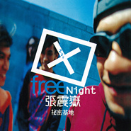

秘密基地Free Night
============================

|  |  |
| :--: | :-- |
| [ 秘密基地Free Night](https://emumo.xiami.com/album/6224) | **艺人**: [张震岳](../index.md) **语种**: 国语 **唱片公司**: 魔岩唱片 **发行时间**: 1998年12月12日 **专辑类别**: 录音室专辑 **专辑风格**: 流行摇滚 Pop Rock, 国语流行 Mandarin Pop, 华语唱作人 Chinese Singer-Songwriter **播放数**: 60018808 **收藏数**: 2321 **评论数**: 131  |

## 简介

张震岳最新专辑《祕密基地》强烈的速度、迷幻的青春、爱情至上、坦白直接，纯粹的年轻，充满乐趣 、充满想像、充分拥有自我的音乐，像呼吸一般的自然，那是一种会让你 自然High的音乐。    听张震岳的音乐，其实不须要深层的思考，而是一种瞬间的理解，如果你 跟他一样年轻。当你听见张震岳，会发现你的影子，也许正在街头游荡， 也许正在家中看无聊电视，也许正在唱KTV，也许跟着朋友在某个角落厮 混、也许正抱着枕头大睡，也许正跟身旁恋人热情拥吻。那是行进中的青春。    或许"大人"们认为年轻人很难理解、到处充满秘密，可是对年轻人来说， 这是再简单不过的事，不需要沟通彼此就很了的状况。如何看待爱情、看 待朋友、看待金钱、看待一切....这不是什么秘密，可是对来"大人"们来 说，这是他们一直想突破的代沟问题。在这张专辑里，我们可以分享新世 代想法。    这是一个属于年轻人的、一个公开的祕密基地。

## 曲目

- [我要钱MV](./6224/jYFF9cffe.md)
- [Free NightMV](./6224/0LpO2e560.md)
- [分手吧](./6224/DvGV48b6b.md)
- [勇气MV](./6224/jYFI1449c.md)
- [爱情你我他](./6224/fM6H50e8a.md)
- [One Night Stand](./6224/4XyU37c47.md)
- [爱我别走MV](./6224/0LpT335d1.md)
- [干妹妹MV](./6224/fM6K5414a.md)
- [看你300回](./6224/fM6L62e58.md)
- [自由MV](./6224/9j8a41d96.md)
- [爱不要停摆](./6224/fM6N7f067.md)
- [原谅](./6224/0LpY34500.md)
- [爱的初体验 (Remix)](./6224/jYFRcba3f.md)

## 评论

|  |  |  |
| :-- | :-- | :-- |
|  [虾米用户](https://emumo.xiami.com/u/38704281)  2020-12-11 17:23 赞(0) 踩(0) | 
刚觉得93年就是喜欢你的封面挺潮，没想到98年的也这么前卫
 |
|  [虾米用户](https://emumo.xiami.com/u/410537424)  2020-09-22 16:38 赞(0) 踩(0) | 
(๑-﹏-๑)
 |
|  [虾米用户](https://emumo.xiami.com/u/264293499) fuck the wor... 2020-03-12 02:05 赞(1) 踩(0) | 
我记着这张专辑是不是还有一首歌叫&amp;ldquo;放屁&amp;rdquo;？
 |
| ⇒ |  [虾米用户](https://emumo.xiami.com/u/5572045)  2020-11-15 19:10 赞(0) 踩(0) | 
《放屁》是在下一张2000年的《有问题》中收录。
 |
|  [虾米用户](https://emumo.xiami.com/u/614476)  2019-11-24 19:20 赞(0) 踩(0) | 
还有什么要说！不想说！
 |
|  [虾米用户](https://emumo.xiami.com/u/247129973)  2019-10-09 11:55 赞(1) 踩(0) | 
不想多说
 |
|  [虾米用户](https://emumo.xiami.com/u/20255187)  2019-10-06 21:08 赞(0) 踩(0) | 
我的青涩年华，我的张震岳！
 |
|  [虾米用户](https://emumo.xiami.com/u/87421924) 唯有自己钟情的音乐不可抗... 2019-10-03 05:32 赞(0) 踩(0) | 
张震岳音乐专辑秘密基地爱我别走
 |
|  [虾米用户](https://emumo.xiami.com/u/219333525) 我还没想好要写什么... 2019-09-09 22:59 赞(1) 踩(0) | 
我记得大概是02年左右买的正版美卡，九块八毛钱，
 |
|  [虾米用户](https://emumo.xiami.com/u/44237079)  2019-08-25 19:30 赞(0) 踩(0) | 
虾米终于有个有有资源的了，还好这里Free Night，星外星引进版和谐掉了。
 |
|  [虾米用户](https://emumo.xiami.com/u/373422410)  2019-07-03 22:46 赞(2) 踩(0) | 
当时记得用黎明的磁带换了同学这阿岳的这张专辑，然后就发现新大陆了，现在这张专辑的磁带还留着呢，青春啊……
 |
|  [虾米用户](https://emumo.xiami.com/u/192011503) Beast inside 2019-06-09 04:05 赞(0) 踩(0) | 
最爱的一张专辑，也是阿岳给我的初体验
 |
|  [虾米用户](https://emumo.xiami.com/u/408578238)  2019-04-22 23:06 赞(0) 踩(0) | 
满分拉
 |
|  [虾米用户](https://emumo.xiami.com/u/1218619) 我还没想好要写什么... 2019-04-13 21:34 赞(0) 踩(0) | 
这张真的太棒了！
 |
|  [虾米用户](https://emumo.xiami.com/u/96926014)  2019-03-16 16:43 赞(0) 踩(0) | 
完美
 |
|  [虾米用户](https://emumo.xiami.com/u/27080149)  2019-03-03 08:48 赞(0) 踩(0) | 
最自然的表露，～～
 |
|  [虾米用户](https://emumo.xiami.com/u/17889446) 暂无签名~ 2019-02-24 11:40 赞(0) 踩(0) | 
B+，台湾的男孩子们，请你们都这么可爱好吗！
 |
|  [虾米用户](https://emumo.xiami.com/u/5667996) 我还没想好要写什么... 2019-01-22 14:26 赞(0) 踩(0) | 
这张巅峰
 |
|  [虾米用户](https://emumo.xiami.com/u/186156516) 我的故事被風吹散 我的明... 2018-12-01 18:12 赞(4) 踩(0) | 
品品二十四岁的阿岳  如今二十岁的秘密基地❤
 |
|  [虾米用户](https://emumo.xiami.com/u/52056952) 人生即是到來、相遇、陪伴... 2018-11-08 13:30 赞(0) 踩(0) | 

 |
|  [虾米用户](https://emumo.xiami.com/u/157819680) 有时清醒 才是错误的开始... 2018-10-03 03:34 赞(0) 踩(0) | 
看封面我还以为是新专辑呢，因为tank唱了原谅，我才知道原唱是张震岳。
 |
|  [虾米用户](https://emumo.xiami.com/u/288742545) 我在香港 2018-07-19 15:35 赞(2) 踩(0) | 
回过头去听这些老歌，发现他们从未过时，依然可以轻而易举的唱到你的心里去，很多歌曲把我带回初恋的情境中，这是一张非常通俗却又深刻的专辑，把那个时候的爱写的通透而动人
 |
|  [虾米用户](https://emumo.xiami.com/u/10857967) 我～就是我！不喜勿進！ 2018-07-16 20:03 赞(0) 踩(0) | 
《前男友不是人》第6集出现的唱片
 |
|  [虾米用户](https://emumo.xiami.com/u/78551750)  2018-07-03 18:05 赞(0) 踩(0) | 
青春的记忆，屌丝的心声
 |
|  [虾米用户](https://emumo.xiami.com/u/12306228) Sing My Soul... 2018-06-27 14:39 赞(0) 踩(0) | 
这张和这个下午太无聊简直神专
 |
|  [虾米用户](https://emumo.xiami.com/u/10389225) 头像是前女友选的，不会换... 2018-06-25 15:19 赞(0) 踩(0) | 
这张封面真是太好看了，红白蓝高达配色
 |
|  [虾米用户](https://emumo.xiami.com/u/347071752) 面朝大海 春暖花开 2018-06-21 16:38 赞(0) 踩(0) | 
评论太少不科学
 |
|  [虾米用户](https://emumo.xiami.com/u/34313941) 面朝大海，春暖花开。 2018-06-12 22:29 赞(0) 踩(0) | 
好羡慕
 |
|  [虾米用户](https://emumo.xiami.com/u/275338302)  2018-06-05 21:04 赞(0) 踩(0) | 
有台湾原版的碟 开心
 |
|  [虾米用户](https://emumo.xiami.com/u/1143360) 到头来 还是感谢虾米一切... 2018-04-01 16:22 赞(0) 踩(0) | 
100
 |
|  [虾米用户](https://emumo.xiami.com/u/186156516) 我的故事被風吹散 我的明... 2018-03-19 03:27 赞(0) 踩(0) | 
99
 |
|  [虾米用户](https://emumo.xiami.com/u/2993529)  2018-02-01 18:35 赞(2) 踩(0) | 
阿岳就是天才，歌词不写意，没深意，但是不影响他在音乐上的天赋
 |
|  [虾米用户](https://emumo.xiami.com/u/24280035) No play, no ... 2018-01-30 07:23 赞(0) 踩(0) | 
回憶殺
 |
|  [虾米用户](https://emumo.xiami.com/u/295889023)  2017-12-07 21:44 赞(0) 踩(0) | 
激荡青春
 |
|  [虾米用户](https://emumo.xiami.com/u/3622154)  2017-10-28 00:37 赞(0) 踩(0) | 
记得是个夏天 记得一起买了两张「这个下午很无聊&amp;秘密基地」 然后整个暑假都有你的声音 最喜欢「自由」，特别是中间那段solo。。。
 |
|  [虾米用户](https://emumo.xiami.com/u/36865171) 我喂自己袋盐 2017-10-26 07:54 赞(1) 踩(0) | 
98的你实在太懂年轻人了，17年的我还是觉得什么话什么内心戏都被你唱出来了。 超喜欢阿岳
 |
|  [虾米用户](https://emumo.xiami.com/u/43421355) 暂无签名~ 2017-10-05 11:53 赞(0) 踩(0) | 
台湾新百佳-63
 |
|  [虾米用户](https://emumo.xiami.com/u/316776057) 我死了 2017-08-31 13:17 赞(1) 踩(0) | 
分手吧我要钱干妹妹 
 |
|  [虾米用户](https://emumo.xiami.com/u/41859390) 可能是一个假得灯泡操控员 2017-08-15 23:09 赞(0) 踩(0) | 
都是回忆
 |
|  [虾米用户](https://emumo.xiami.com/u/305896989) 哈罗 2017-08-07 19:15 赞(0) 踩(0) | 
棒棒！
 |
|  [虾米用户](https://emumo.xiami.com/u/305569875)  2017-06-18 18:24 赞(0) 踩(0) | 
懵懂的年纪 最好的回忆！经典！
 |
|  [虾米用户](https://emumo.xiami.com/u/288065708)  2017-04-12 01:55 赞(2) 踩(0) | 
我还没出生，但一直陪我到现在，突然又想起它来。 
 |
|  [虾米用户](https://emumo.xiami.com/u/284417692)  2017-04-01 23:39 赞(0) 踩(0) | 
好听
 |
|  [虾米用户](https://emumo.xiami.com/u/280522143)  2017-03-17 18:58 赞(2) 踩(0) | 
19年前的专辑太牛逼了&amp;middot;现在听依旧很牛！爱，最好不要停摆~~~
 |
|  [虾米用户](https://emumo.xiami.com/u/55067108) 我还没想好要写什么... 2017-03-02 19:25 赞(0) 踩(0) | 
11岁听的专辑。
 |
|  [虾米用户](https://emumo.xiami.com/u/36274083)   2017-02-20 22:00 赞(0) 踩(0) | 
free9到永远
 |
|  [虾米用户](https://emumo.xiami.com/u/257807530) 阿龙 2017-02-05 19:58 赞(0) 踩(0) | 
好听
 |
|  [虾米用户](https://emumo.xiami.com/u/96349984)  2017-01-31 22:42 赞(0) 踩(0) | 
看封面真的看不出来是上世纪的专辑
 |
|  [虾米用户](https://emumo.xiami.com/u/3062827)  2017-01-30 07:02 赞(0) 踩(0) | 
1998年 10岁的夏天
 |
|  [虾米用户](https://emumo.xiami.com/u/9537782)  2017-01-21 00:33 赞(0) 踩(0) | 
够摇滚
 |
|  [虾米用户](https://emumo.xiami.com/u/397279) 孤单躁狂听金属，寂寞哑言... 2016-11-19 11:52 赞(4) 踩(0) | 
这张完爆当下很多所谓的摇滚专辑
 |
|  [虾米用户](https://emumo.xiami.com/u/241732977)  2016-10-31 22:23 赞(1) 踩(0) | 
爱我别走，简单的一句话，真的很让人想流泪，我想，这就是单纯吧。
 |
|  [虾米用户](https://emumo.xiami.com/u/194407726) 怎么可能忘记你 2016-10-23 23:54 赞(17) 踩(0) | 
“这个下午很无聊”+“秘密基地”陪我度过了艰难与快乐并存的高中时光！“有问题”+“等我有一天”陪我度过了游戏时间的大学时光，工作之后特别是07年“OK”之后对你的动向以及新闻不再如以前那么上心，但是你的每张专还是一如既往的在持续支持。阿岳，感谢一路有你！ 
 |
|  [虾米用户](https://emumo.xiami.com/u/33276931)  2016-10-13 20:14 赞(0) 踩(0) | 
这张砖确实吊
 |
|  [虾米用户](https://emumo.xiami.com/u/114702580)  2016-09-25 04:31 赞(0) 踩(0) | 
爱我别走
 |
|  [虾米用户](https://emumo.xiami.com/u/36148446) richypanda 2016-06-07 00:47 赞(0) 踩(0) | 
秘密就是完美
 |
|  [虾米用户](https://emumo.xiami.com/u/124651052)   2016-05-22 02:18 赞(0) 踩(0) | 
最佳专辑没有之一满满的青春回忆
 |
|  [虾米用户](https://emumo.xiami.com/u/63262386) 反正不是 2016-04-13 16:45 赞(1) 踩(0) | 
阿岳 阿蒙 阿萍 阿德 当年的freenight
 |
|  [虾米用户](https://emumo.xiami.com/u/116351906)   2016-02-22 01:30 赞(0) 踩(0) | 
啊岳，一直很喜欢，初中时就听他的歌了
 |
|  [虾米用户](https://emumo.xiami.com/u/10857967) 我～就是我！不喜勿進！ 2016-02-16 01:37 赞(1) 踩(0) | 
这张专辑太牛B了，周杰伦的专辑都没有张震岳的《秘密基地》《有问题》这两张大胆。周杰伦有一首特别牛B的歌《嘻哈空姐》在《跨时代》内地版删掉了
 |
|  [虾米用户](https://emumo.xiami.com/u/7445029)  2016-02-01 13:34 赞(0) 踩(0) | 
青春
 |
|  [虾米用户](https://emumo.xiami.com/u/8070377) 爱雾瑞性维欧腐漏 2016-01-19 17:03 赞(1) 踩(0) | 
雾草 才注意发行是魔岩唱片
 |
| ⇒ |  [虾米用户](https://emumo.xiami.com/u/98105642) 从未如此开心 2016-09-17 07:19 赞(0) 踩(0) | 
华语摇滚超级盖过天就是魔岩唱片
 |
|  [虾米用户](https://emumo.xiami.com/u/48573908) ， 2015-12-28 15:11 赞(14) 踩(0) | 
是张震岳就嫁，弹簧也要直回来
 |
| ⇒ |  [虾米用户](https://emumo.xiami.com/u/4122967) 守得云开见月明 2017-10-28 00:45 赞(0) 踩(0) | 
直男见到也要弯成弹簧
 |
|  [虾米用户](https://emumo.xiami.com/u/54549437) 酸亦甜，甜亦酸 2015-11-22 15:30 赞(1) 踩(0) | 
虽然看电影现在慢慢喜欢节奏慢的了，但是音乐的口味却越来越像节奏靠拢。阿岳也是一位年龄越大音乐越内敛，律动越慢的唱作人，难道岁月真的会带走律动吗？
 |
|  [虾米用户](https://emumo.xiami.com/u/35177299)  2015-11-21 17:15 赞(0) 踩(0) | 
有些感觉说不出来，但是这个人给唱出来了
 |
|  [虾米用户](https://emumo.xiami.com/u/49478004)  2015-11-12 20:42 赞(0) 踩(0) | 
阿岳最好的专辑没有之一
 |
|  [虾米用户](https://emumo.xiami.com/u/37127371)   2015-08-09 23:16 赞(1) 踩(0) | 
这封面碉堡了
 |
|  [虾米用户](https://emumo.xiami.com/u/6534381) 我还没想好要写什么... 2015-08-02 06:52 赞(24) 踩(0) | 
那年，隔壁一大哥留了個丁子峻的頭髮.. 沒完沒了叼根煙擱那兒喊'愛的初體驗'...天亮到天黑....吵到不行..   那範兒甩現在所謂的EXO，TF粉多少條街..
 |
|  [虾米用户](https://emumo.xiami.com/u/7018069)  2015-06-29 16:00 赞(0) 踩(0) | 
初中的爽 WLAKMAN的艳阳天
 |
|  [虾米用户](https://emumo.xiami.com/u/8195454)   2015-06-14 19:21 赞(1) 踩(0) | 
既粗暴又温柔！！好爱他！！
 |
|  [虾米用户](https://emumo.xiami.com/u/12690979)  2015-05-12 00:42 赞(1) 踩(0) | 
折回来听
 |
|  [虾米用户](https://emumo.xiami.com/u/28419601) 暂无签名~ 2015-04-05 23:13 赞(0) 踩(0) | 
听着有种奇特的感觉，想了好久才想起来，初中那会不知道为什么特别迷爱我别走，几乎一开电脑就要循环，所以现在听起来才会有满满青涩又羞涩的少女情怀。
 |
|  [虾米用户](https://emumo.xiami.com/u/21356998)  2015-02-09 10:31 赞(0) 踩(0) | 
随性的声音，舒服的调调，还需要更多的理由吗，感觉，就是感觉。
 |
|  [虾米用户](https://emumo.xiami.com/u/46722295)  2015-02-05 13:56 赞(0) 踩(0) | 
<a href="http://url.cn/bW2Ag8" target="_blank" rel="nofollow noreferrer noopener">http://url.cn/bW2Ag8</a>
 |
|  [虾米用户](https://emumo.xiami.com/u/2340476)  2014-12-29 21:10 赞(1) 踩(0) | 
张震岳最好的专辑
 |
|  [虾米用户](https://emumo.xiami.com/u/37179922) 爱好者 2014-12-09 20:32 赞(2) 踩(0) | 
我靠，阿岳的这张专辑真TM碉堡。
 |
|  [虾米用户](https://emumo.xiami.com/u/37179922) 爱好者 2014-12-09 19:55 赞(1) 踩(0) | 
在组纵贯线之前，我一直忽略了阿岳的存在。
 |
|  [虾米用户](https://emumo.xiami.com/u/4023599)   2014-11-25 09:48 赞(0) 踩(0) | 
~~~
 |
|  [虾米用户](https://emumo.xiami.com/u/8070377) 爱雾瑞性维欧腐漏 2014-11-05 03:56 赞(84) 踩(0) | 
你看阿岳98年的砖封多潮
 |
| ⇒ |  [虾米用户](https://emumo.xiami.com/u/374358804)  2019-02-14 21:27 赞(0) 踩(0) | 
阿岳太潮了
 |
| ⇒ |  [虾米用户](https://emumo.xiami.com/u/8070377) 爱雾瑞性维欧腐漏 2019-02-14 23:37 赞(0) 踩(0) | 
<q><b>未知生物说：</b></q>
 |
|  [虾米用户](https://emumo.xiami.com/u/2710392)  2014-10-25 05:07 赞(0) 踩(0) | 
青春的記憶
 |
|  [虾米用户](https://emumo.xiami.com/u/40916439) 我爱摇滚乐，摇滚永不死！ 2014-09-26 21:06 赞(0) 踩(0) | 
当年我16岁的时候，听到这张专辑，真是想体验《爱的初体验》！《FREE NIGHT》！！！
 |
|  [虾米用户](https://emumo.xiami.com/u/39705507) skyline 2014-09-04 10:12 赞(0) 踩(0) | 
我到了这个时候还是一样，夜里寂寞叫人悲伤，我不敢想的太多，因为我一个人
 |
|  [虾米用户](https://emumo.xiami.com/u/812997) 最难了是人心 2014-09-02 14:59 赞(0) 踩(0) | 
这专辑算是阿岳的经典了！
 |
|  [虾米用户](https://emumo.xiami.com/u/32517121) 我要带你到处去飞翔。 2014-07-17 22:16 赞(0) 踩(0) | 
阿岳，大概是从这时候就开始喜欢你了
 |
|  [虾米用户](https://emumo.xiami.com/u/24301382) 原谅这一生放纵不羁笑点低 2014-07-17 16:10 赞(0) 踩(0) | 
Remix的初体验很台有没有
 |
|  [虾米用户](https://emumo.xiami.com/u/9036301) 静静听歌 2014-06-24 01:17 赞(0) 踩(0) | 
歌词好直接
 |
|  [虾米用户](https://emumo.xiami.com/u/8308934)  2014-06-08 14:25 赞(0) 踩(0) | 
词曲都是啊岳，好厉害，经典之作，我的童年
 |
|  [虾米用户](https://emumo.xiami.com/u/7900984) 天长地久只是时间的荒谬~... 2014-04-09 00:16 赞(0) 踩(0) | 
什么也不说了。。。爱我的人不会走。。。。晚安。
 |
|  [虾米用户](https://emumo.xiami.com/u/32918575)  2014-02-18 13:15 赞(0) 踩(0) | 
第一次
 |
|  [虾米用户](https://emumo.xiami.com/u/9896850) 我还没想好要写什么... 2013-12-30 22:30 赞(0) 踩(0) | 
可以单曲循环
 |
|  [虾米用户](https://emumo.xiami.com/u/24317470) 喜欢好音乐 2013-12-06 19:33 赞(0) 踩(0) | 
这张专辑出版于1998年，那个群雄并起的年代。
 |
| ⇒ |  [虾米用户](https://emumo.xiami.com/u/37887903)  2014-09-18 10:57 赞(0) 踩(0) | 
比如
 |
| ⇒ |  [虾米用户](https://emumo.xiami.com/u/10857967) 我～就是我！不喜勿進！ 2016-02-16 01:34 赞(0) 踩(0) | 
<q><b>臺灣藝人大根说：</b></q>
 |
|  [虾米用户](https://emumo.xiami.com/u/6359925)  2013-10-09 14:28 赞(0) 踩(0) | 
阿岳相当有才华啊！
 |
|  [虾米用户](https://emumo.xiami.com/u/16140309) never forget... 2013-07-26 00:55 赞(0) 踩(0) | 
每一首都在单曲循环
 |
|  [虾米用户](https://emumo.xiami.com/u/13815635) all ass on m... 2013-04-04 18:32 赞(0) 踩(0) | 
NOthing
 |
|  [虾米用户](https://emumo.xiami.com/u/5506428) www.jn-pipe. 2013-02-26 18:25 赞(1) 踩(0) | 
阿岳这张算是认识他的专辑  www.jn-pipe.com
 |
|  [虾米用户](https://emumo.xiami.com/u/1329826)  2013-01-31 22:50 赞(0) 踩(0) | 
这专辑很经典，现在阿岳演唱会上除了些新歌好像好多都是这张上面的，再加上OK 那张~
 |
|  [虾米用户](https://emumo.xiami.com/u/5979358)  2012-10-20 19:44 赞(0) 踩(0) | 
经典的专辑
 |
|  [虾米用户](https://emumo.xiami.com/u/111609)  2012-10-18 23:48 赞(0) 踩(0) | 
阿岳啊阿岳。
 |
|  [虾米用户](https://emumo.xiami.com/u/11022761) 只弹琴，不谈情 2012-10-12 10:01 赞(0) 踩(0) | 
vgmghmj
 |
|  [虾米用户](https://emumo.xiami.com/u/10530548) 我喜歡隨性的音樂 2012-09-11 14:14 赞(0) 踩(0) | 
岳迷
 |
|  [虾米用户](https://emumo.xiami.com/u/8324294) 纪念我无处安放的青春 2012-07-07 20:40 赞(0) 踩(0) | 
nice
 |
|  [虾米用户](https://emumo.xiami.com/u/8128667)   2012-06-06 18:24 赞(0) 踩(0) | 
张震岳
 |
|  [虾米用户](https://emumo.xiami.com/u/5925822)  2012-05-30 13:27 赞(0) 踩(0) | 
喜欢既是喜欢！
 |
|  [虾米用户](https://emumo.xiami.com/u/5925822)  2012-05-30 13:26 赞(0) 踩(0) | 
第一次认识张震岳就是这张专辑！怀念哦！
 |
|  [虾米用户](https://emumo.xiami.com/u/4808672) ⊙∝M 2012-05-02 10:33 赞(0) 踩(0) | 
我小學的回憶哈哈。磁帶和sony walkman
 |
|  [虾米用户](https://emumo.xiami.com/u/1480632)   2012-02-14 22:12 赞(0) 踩(0) | 
总觉得张震岳在这张专辑里面还是个无忧无虑的待业青年似的，以后的他，似乎多了些其他的东西
 |
|  [虾米用户](https://emumo.xiami.com/u/6992371)  2011-11-27 21:24 赞(0) 踩(0) | 
买的第一张张震岳的专辑，更多的是种回忆
 |
|  [虾米用户](https://emumo.xiami.com/u/5710594) 以马内利 2011-10-05 16:20 赞(0) 踩(0) | 
赤裸裸的味道。
 |
|  [虾米用户](https://emumo.xiami.com/u/5710594) 以马内利 2011-10-05 16:18 赞(0) 踩(0) | 
干妹妹、干妹妹！
 |
|  [虾米用户](https://emumo.xiami.com/u/5565934)  2011-09-14 21:20 赞(0) 踩(0) | 
经典的专辑！！！！
 |
|  [虾米用户](https://emumo.xiami.com/u/5105952)  2011-08-02 15:38 赞(0) 踩(0) | 
张震岳最新专辑《祕密基地》强烈的速度、迷幻的青春、爱情至上、坦白直接，纯粹的年轻，充满乐趣 、充满想像、充分拥有自我的音乐，像呼吸一般的自然，那是一种会让你 自然High的音乐。
 |
|  [虾米用户](https://emumo.xiami.com/u/4286734) 我控萝莉我自豪~ 2011-07-15 14:39 赞(0) 踩(0) | 
干妹妹！我承认我现在看到这三个字只有一个邪恶的念头。
 |
|  [虾米用户](https://emumo.xiami.com/u/4220587)  2011-06-23 01:01 赞(0) 踩(0) | 
没有理由。
 |
|  [虾米用户](https://emumo.xiami.com/u/2483229)  2011-01-24 23:02 赞(0) 踩(0) | 
没道理
 |
|  [虾米用户](https://emumo.xiami.com/u/2371354)  2011-01-13 13:28 赞(0) 踩(0) | 
干妹妹    我要干妹妹~~~
 |
| ⇒ |  [虾米用户](https://emumo.xiami.com/u/3727959)  2011-04-24 23:29 赞(0) 踩(0) | 
额~~
 |
|  [虾米用户](https://emumo.xiami.com/u/2107531)  2011-01-08 23:12 赞(0) 踩(0) | 
小学时买过的专辑
 |
|  [虾米用户](https://emumo.xiami.com/u/2107531)  2011-01-08 23:10 赞(0) 踩(0) | 
小学时买过的一张磁带。
 |
|  [虾米用户](https://emumo.xiami.com/u/1449381)  2010-09-05 16:07 赞(0) 踩(0) | 
阿岳就是阿岳
 |
|  [虾米用户](https://emumo.xiami.com/u/500870)  2010-02-24 14:05 赞(0) 踩(0) | 
残酷青春的印迹~
 |
|  [虾米用户](https://emumo.xiami.com/u/784) No signature... 2009-08-21 20:58 赞(1) 踩(0) | 
我发现一件好玩的事，三条评论都在某个月的21号~
 |
|  [虾米用户](https://emumo.xiami.com/u/784) No signature... 2009-08-21 20:57 赞(0) 踩(0) | 
听得我都要哭了
 |
| ⇒ |  [虾米用户](https://emumo.xiami.com/u/1548414)  2011-11-23 00:01 赞(0) 踩(0) | 
同感
 |
|  [虾米用户](https://emumo.xiami.com/u/57415)  2009-03-21 20:31 赞(0) 踩(0) | 
很棒的唱片~里面的一些曲目经久不衰~
 |
|  [虾米用户](https://emumo.xiami.com/u/31422)  2009-02-21 13:41 赞(0) 踩(0) | 
这还不够台湾吗？》嘿嘿
 |
