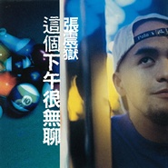

这个下午很无聊
============================

|  |  |
| :--: | :-- |
| [ 这个下午很无聊](https://emumo.xiami.com/album/6225) | **艺人**: [张震岳](../index.md) **语种**: 国语 **唱片公司**: 魔岩唱片 **发行时间**: 1997年10月01日 **专辑类别**: 录音室专辑 **专辑风格**: 流行摇滚 Pop Rock, 国语流行 Mandarin Pop, 华语唱作人 Chinese Singer-Songwriter **播放数**: 4044367 **收藏数**: 1858 **评论数**: 242  |

## 简介

“音乐生动有趣，有不同的观念和作法，不落入一般流行音乐的窠臼”这是张震岳在蛰伏三年后，站在1974世代年轻人的位置，推出这张专辑所给我们的最大惊喜。    因为创作的原动力来自生活，十一首歌曲里有十一个现现    再无聊的日子， 都有改变的可能，属于 60 年次以后的创作者终于出现。音乐制作人黄韵玲眼中的张震岳很像"泰山"，因为他的声音是那种可以从这个山谷唱到那个山谷，他的内心是很有爆发力的，只要他一吼，狮子，老虎，所有动物都来了，然后很甘愿的都臣服在他底下，每天都是很快乐的样子，从这棵树荡到那棵树，将悲伤收在心里，所以很难看到他的悲伤，就像听到他的音乐一般，快乐有活力，有爆发力。每个人都有自己的幻想，每个世代也都有自己的音乐，这些描述也只有您自己亲自聆听，才能体会出来。

## 曲目

- [分手的人](./6225/9j8o3f835.md)
- [把妹](./6225/okPff102d.md)
- [爱的初体验MV](./6225/jYGed4bc7.md)
- [你会等我吗](./6225/fM7d682fb.md)
- [改变MV](./6225/jYGgbbd1a.md)
- [不要再谈恋爱](./6225/okPjf1ed5.md)
- [这个下午很无聊](./6225/fM7g7cbe5.md)
- [怎么办MV](./6225/jYGjd633a.md)
- [同学会](./6225/jYGkd61ca.md)
- [秘密MV](./6225/okPne70da.md)
- [喝酒 (CD Bonus)](./6225/fM7keb09b.md)

## 评论

|  |  |  |
| :-- | :-- | :-- |
|  [虾米用户](https://emumo.xiami.com/u/12306228) Sing My Soul... 2021-01-18 21:13 赞(0) 踩(0) | 
评论太少不科学
 |
|  [虾米用户](https://emumo.xiami.com/u/25884133)  2020-04-15 22:50 赞(0) 踩(0) | 
这么多年以后才发现这个专辑是宝
 |
|  [虾米用户](https://emumo.xiami.com/u/404274627)  2020-04-11 01:11 赞(0) 踩(0) | 
全是年少轻狂的岁月。
 |
|  [虾米用户](https://emumo.xiami.com/u/177970278) 是脆弱同时也是力量 2020-03-22 07:40 赞(0) 踩(0) | 
绝了
 |
|  [虾米用户](https://emumo.xiami.com/u/275808395) onceinawhile... 2020-03-01 21:00 赞(0) 踩(0) | 
大男生面对爱情的独白 洒洒脱脱 烦烦恼恼 犯规de可爱出击
 |
|  [虾米用户](https://emumo.xiami.com/u/16396825) do you ? 2019-11-23 16:22 赞(0) 踩(0) | 
神专呀 
 |
|  [虾米用户](https://emumo.xiami.com/u/494285)  2019-11-21 22:43 赞(0) 踩(0) | 
曲风丰富，正宗英伦带点台湾味，小朋克
 |
|  [虾米用户](https://emumo.xiami.com/u/494285)  2019-11-21 22:42 赞(0) 踩(0) | 
那个年代，一张专辑首首都好听。
 |
|  [虾米用户](https://emumo.xiami.com/u/247129973)  2019-10-09 11:55 赞(0) 踩(0) | 
几句冲冲冲
 |
|  [虾米用户](https://emumo.xiami.com/u/43703349) 我还没想好要写什么... 2019-08-26 08:12 赞(0) 踩(0) | 
人生听到的第一张专辑
 |
|  [虾米用户](https://emumo.xiami.com/u/13707341) 斯派克 2019-06-20 13:47 赞(0) 踩(0) | 
迟到的卡
 |
|  [虾米用户](https://emumo.xiami.com/u/1218619) 我还没想好要写什么... 2019-04-13 21:36 赞(0) 踩(0) | 
这张太棒了！
 |
|  [虾米用户](https://emumo.xiami.com/u/217821570)  2019-03-26 21:16 赞(0) 踩(0) | 
完美
 |
|  [虾米用户](https://emumo.xiami.com/u/368916693)  2019-02-11 08:15 赞(1) 踩(0) | 
这整张专辑都是伍佰给张震岳制作的
 |
| ⇒ |  [虾米用户](https://emumo.xiami.com/u/404811637)  2019-02-28 00:38 赞(0) 踩(0) | 
他的前三张专辑吴俊霖是制作人
 |
|  [虾米用户](https://emumo.xiami.com/u/80752236) 好听 2018-10-14 16:20 赞(1) 踩(0) | 
封面好帅呀！
 |
|  [虾米用户](https://emumo.xiami.com/u/347071752) 面朝大海 春暖花开 2018-09-19 11:21 赞(0) 踩(0) | 
我又来了
 |
|  [虾米用户](https://emumo.xiami.com/u/10389225) 头像是前女友选的，不会换... 2018-06-25 15:20 赞(0) 踩(0) | 
这封面真棒，那个年代都是用白色字，漂亮！
 |
|  [虾米用户](https://emumo.xiami.com/u/275338302)  2018-06-05 21:04 赞(1) 踩(0) | 
有台湾原版的碟 开心
 |
|  [虾米用户](https://emumo.xiami.com/u/347071752) 面朝大海 春暖花开 2018-05-29 11:49 赞(0) 踩(0) | 
评论太少不科学
 |
|  [虾米用户](https://emumo.xiami.com/u/1938644) 1月13日 20:30 ... 2018-05-10 20:54 赞(0) 踩(0) | 
最喜欢的一张啦
 |
|  [虾米用户](https://emumo.xiami.com/u/241152) Supreme 2018-04-29 10:40 赞(1) 踩(0) | 
air max 97
 |
|  [虾米用户](https://emumo.xiami.com/u/135379) 我还没想好要写什么... 2018-04-18 23:05 赞(0) 踩(0) | 
每首都是丧曲哈哈哈
 |
|  [虾米用户](https://emumo.xiami.com/u/1143360) 到头来 还是感谢虾米一切... 2018-04-01 16:01 赞(0) 踩(0) | 
214
 |
|  [虾米用户](https://emumo.xiami.com/u/12429130)   2018-01-03 16:45 赞(3) 踩(0) | 
97年高二看CHANNEL[V]从此加入岳迷行列，20年不曾改变
 |
|  [虾米用户](https://emumo.xiami.com/u/122248288)  2017-10-01 09:05 赞(1) 踩(0) | 
回家的车上 播送着这首歌。
 |
| ⇒ |  [虾米用户](https://emumo.xiami.com/u/307011580) 我爱大龄文艺女青年 2017-10-02 00:37 赞(0) 踩(0) | 
我才知道虾米没有专门的动态  原来评论可以直接被看到
 |
|  [虾米用户](https://emumo.xiami.com/u/319983404) 为张震岳而来 2017-08-17 22:55 赞(3) 踩(0) | 
从这张专辑封面开始一直戴帽子了哈哈
 |
|  [虾米用户](https://emumo.xiami.com/u/9576799) 哈利路亚 2017-08-12 01:26 赞(2) 踩(0) | 
当兵归来，放飞自我
 |
|  [虾米用户](https://emumo.xiami.com/u/289924069)  2017-07-21 12:02 赞(2) 踩(0) | 
张震岳，半疯半傻，食用最佳 
 |
|  [虾米用户](https://emumo.xiami.com/u/356031) Like A Rock. 2017-07-10 20:11 赞(0) 踩(0) | 
3.5星。
 |
|  [虾米用户](https://emumo.xiami.com/u/259859197) Let me live ... 2017-04-19 16:17 赞(0) 踩(0) | 
街上闲逛ing 这个下午有点无聊噢
 |
|  [虾米用户](https://emumo.xiami.com/u/267838062)  2017-02-16 15:22 赞(1) 踩(0) | 
这个下午很无聊
 |
|  [虾米用户](https://emumo.xiami.com/u/50853551) Cathy blah b... 2017-01-01 08:51 赞(0) 踩(0) | 
早安！
 |
|  [虾米用户](https://emumo.xiami.com/u/9261161) 音乐里流动 2016-11-18 10:31 赞(0) 踩(0) | 
94-97，就三年，这时候张震岳就不是那时的小鲜肉了 可是，这一张基调一下就上去了，获得无数好评 我最感兴趣的是这三年到底发生了什么，不得而知……
 |
| ⇒ |  [虾米用户](https://emumo.xiami.com/u/75678260) 南方的小巷，推开多情的门... 2017-01-29 22:24 赞(0) 踩(0) | 
为啥不是小鲜肉了呢
 |
| ⇒ |  [虾米用户](https://emumo.xiami.com/u/9261161) 音乐里流动 2017-01-29 23:00 赞(0) 踩(0) | 
<q><b>Aerodynamics说：</b></q>
 |
|  [虾米用户](https://emumo.xiami.com/u/1460647) 我还没想好要写什么... 2016-10-27 14:11 赞(1) 踩(0) | 
想买这磁带快20年了，一直没买到。
 |
| ⇒ |  [虾米用户](https://emumo.xiami.com/u/306176426) 我还没想好要写什么... 2018-09-13 17:52 赞(0) 踩(0) | 
I HAVE VCD
 |
|  [虾米用户](https://emumo.xiami.com/u/48084409) 我还没想好要写什么.. 2016-09-21 22:08 赞(0) 踩(0) | 
当年买过磁带，最爱怎么办
 |
|  [虾米用户](https://emumo.xiami.com/u/226454407)  2016-09-19 00:14 赞(0) 踩(0) | 
这张专辑 是得不到 的基调。大概开始懂爱了吧
 |
|  [虾米用户](https://emumo.xiami.com/u/55423769) 我还没想好要写什么... 2016-09-15 12:53 赞(0) 踩(0) | 
封面帅的
 |
|  [虾米用户](https://emumo.xiami.com/u/173423368)  2016-05-19 15:53 赞(0) 踩(0) | 
好听好玩，喜欢的风格
 |
|  [虾米用户](https://emumo.xiami.com/u/2483864)  2016-04-24 14:16 赞(1) 踩(0) | 
这张有几首编曲的趟子很有意思
 |
|  [虾米用户](https://emumo.xiami.com/u/2483864)  2016-04-24 14:12 赞(0) 踩(0) | 
我买的第一张摇滚的 觉得这时候灵气在他身上
 |
|  [虾米用户](https://emumo.xiami.com/u/9316919) 暂无签名~ 2016-03-13 17:16 赞(1) 踩(0) | 
这个下午很无聊，怎么办，喝酒
 |
|  [虾米用户](https://emumo.xiami.com/u/2279444) 爱在左，同情在右。 2016-01-23 02:21 赞(1) 踩(0) | 
转眼已是二十年......
 |
|  [虾米用户](https://emumo.xiami.com/u/9902448)  2015-05-20 10:57 赞(1) 踩(0) | 
秘密好听
 |
|  [虾米用户](https://emumo.xiami.com/u/6710306) 听祂的声音 2015-01-20 13:43 赞(0) 踩(0) | 
姐姐不知道她在干啥
 |
|  [虾米用户](https://emumo.xiami.com/u/35908239)  2015-01-11 17:37 赞(1) 踩(0) | 
小学时就喊人家张震岳叔叔叫我好好学习
 |
|  [虾米用户](https://emumo.xiami.com/u/6213331) 邁出舞步 2014-11-09 23:14 赞(3) 踩(0) | 
<a href="http://emumo.xiami.com/u/4275776" target="_blank" rel="nofollow" name_card="4275776">@320K专门店</a> 08合格
 |
|  [虾米用户](https://emumo.xiami.com/u/10038457)  2014-10-25 13:46 赞(0) 踩(0) | 
好听！
 |
|  [虾米用户](https://emumo.xiami.com/u/6190607) 我还没想好要写什么... 2014-09-21 18:28 赞(11) 踩(0) | 
啧啧啧，这张封面的颜是他吗
 |
|  [虾米用户](https://emumo.xiami.com/u/27839282) once 2014-09-21 16:28 赞(0) 踩(0) | 
fuck yo 腿断了在家下午好无聊…
 |
|  [虾米用户](https://emumo.xiami.com/u/24666272) 老板，来碗肥肠米线。 2014-07-03 03:26 赞(22) 踩(0) | 
青春被射在墙上风化了，今年阿岳都40了！
 |
| ⇒ |  [虾米用户](https://emumo.xiami.com/u/236075366) love music 2017-02-16 01:17 赞(0) 踩(0) | 
17年了 43了
 |
| ⇒ |  [虾米用户](https://emumo.xiami.com/u/253069357) 90后 2017-10-17 00:31 赞(0) 踩(0) | 
人家三年前评论的。。。淡然40岁。。
 |
| ⇒ |  [虾米用户](https://emumo.xiami.com/u/265673645)  2018-01-02 18:40 赞(0) 踩(0) | 
18年了，马上就又老一岁
 |
| ⇒ |  [虾米用户](https://emumo.xiami.com/u/278041432)  2019-01-13 18:14 赞(0) 踩(0) | 
<q><b>东西方不败说：</b></q>
 |
| ⇒ |  [虾米用户](https://emumo.xiami.com/u/411783590) 我还没想好要写什么... 2020-02-26 14:23 赞(0) 踩(0) | 
<q><b>Gelin_说：</b></q>
 |
| ⇒ |  [虾米用户](https://emumo.xiami.com/u/436048304)  2020-06-07 13:51 赞(0) 踩(0) | 
<q><b>谢幕时分说：</b></q>
 |
| ⇒ |  [虾米用户](https://emumo.xiami.com/u/205195976) 暂时想不到什么矫情的话。 2020-07-14 11:31 赞(0) 踩(0) | 
20年了，四十六了
 |
|  [虾米用户](https://emumo.xiami.com/u/8356658)  2014-05-17 16:13 赞(0) 踩(0) | 
伍佰制作的
 |
|  [虾米用户](https://emumo.xiami.com/u/4286734) 我控萝莉我自豪~ 2014-05-14 21:57 赞(1) 踩(0) | 
哎？98年 我怎么记得是97年的那张滚石出品 新好男人 的合辑里面的歌 怎么办这首歌听了这么多年一直很喜欢。
 |
| ⇒ |  [虾米用户](https://emumo.xiami.com/u/48158801)  2015-05-31 21:32 赞(0) 踩(0) | 
我也是在那里听到的
 |
|  [虾米用户](https://emumo.xiami.com/u/11441220)  2014-03-19 15:53 赞(0) 踩(0) | 
无聊
 |
| ⇒ |  [虾米用户](https://emumo.xiami.com/u/3846875)  2015-04-25 02:34 赞(0) 踩(0) | 
我也是
 |
|  [虾米用户](https://emumo.xiami.com/u/7980605) 咩咩咩~ 2014-01-14 18:21 赞(0) 踩(0) | 
这个下午真的很无聊！
 |
|  [虾米用户](https://emumo.xiami.com/u/16310565)  2014-01-05 14:36 赞(1) 踩(0) | 
秘密。太喜欢
 |
|  [虾米用户](https://emumo.xiami.com/u/4719200)  2013-12-02 08:57 赞(0) 踩(0) | 
怎么办
 |
|  [虾米用户](https://emumo.xiami.com/u/26937555)  2013-11-12 16:49 赞(0) 踩(0) | 
喜欢听
 |
|  [虾米用户](https://emumo.xiami.com/u/16123281) 聆听梦想 2013-11-12 12:41 赞(0) 踩(0) | 
因这我喜欢，所以我聆听！
 |
|  [虾米用户](https://emumo.xiami.com/u/6359925)  2013-10-09 14:20 赞(0) 踩(0) | 
98、99年左右时，相当红啊！ 虽说歌词没什么深度， 但旋律好听。
 |
|  [虾米用户](https://emumo.xiami.com/u/6713366)  2013-09-15 20:23 赞(0) 踩(0) | 
最爱的歌手之一
 |
|  [虾米用户](https://emumo.xiami.com/u/19253672)  2013-09-03 16:49 赞(0) 踩(0) | 
还好，有点无聊
 |
|  [虾米用户](https://emumo.xiami.com/u/14449432) 你何时出现、、、 2013-08-30 16:48 赞(0) 踩(0) | 
在学校没课的时间也无聊
 |
|  [虾米用户](https://emumo.xiami.com/u/8536164)   2013-08-27 09:42 赞(0) 踩(0) | 
这个晚上很无聊
 |
|  [虾米用户](https://emumo.xiami.com/u/15369060)  2013-07-19 08:28 赞(0) 踩(0) | 
这个上午也很无聊...
 |
| ⇒ |  [虾米用户](https://emumo.xiami.com/u/7980605) 咩咩咩~ 2014-01-14 18:22 赞(0) 踩(0) | 
一整天都无聊该肿么办呀~
 |
|  [虾米用户](https://emumo.xiami.com/u/639782)  2013-06-19 15:02 赞(0) 踩(0) | 
好好
 |
|  [虾米用户](https://emumo.xiami.com/u/6892560)  2013-06-17 19:57 赞(0) 踩(0) | 
从这张开始 蜕变
 |
|  [虾米用户](https://emumo.xiami.com/u/7878966) 我还没想好要写什么... 2013-06-15 10:10 赞(0) 踩(0) | 
也不是真的无聊
 |
|  [虾米用户](https://emumo.xiami.com/u/1409529) 暂无签名~ 2012-11-27 22:51 赞(1) 踩(0) | 
音乐、歌词都是我的菜
 |
|  [虾米用户](https://emumo.xiami.com/u/11378481) 多 2012-11-08 17:32 赞(0) 踩(0) | 
就是喜欢
 |
|  [虾米用户](https://emumo.xiami.com/u/10990876) 冷僻的玩意都能找？ 2012-10-19 09:38 赞(0) 踩(0) | 
由于李宗盛推荐，爱屋及乌的喜欢张震岳，不过有几首被别人翻唱的歌都很经典。
 |
|  [虾米用户](https://emumo.xiami.com/u/6858904) nomin5~ 2012-10-07 16:28 赞(0) 踩(0) | 
还行吧~
 |
|  [虾米用户](https://emumo.xiami.com/u/4855774) 笑嘻嘻 2012-10-05 10:18 赞(0) 踩(0) | 
销魂
 |
|  [虾米用户](https://emumo.xiami.com/u/4855774) 笑嘻嘻 2012-10-05 10:16 赞(0) 踩(0) | 
销魂
 |
|  [虾米用户](https://emumo.xiami.com/u/8500236)  2012-09-27 08:22 赞(0) 踩(0) | 
一直喜欢张震岳
 |
|  [虾米用户](https://emumo.xiami.com/u/3549659) 清谈 2012-09-22 06:31 赞(0) 踩(0) | 
喜欢
 |
|  [虾米用户](https://emumo.xiami.com/u/3549659) 清谈 2012-09-22 06:30 赞(0) 踩(0) | 
爱的初体验MV中跳舞的柯蓝那时是年轻貌美 张震狱初期的顶峰时代 他后来竟然没有突破 定位在初体验的台岛朋克概念中了。
 |
|  [虾米用户](https://emumo.xiami.com/u/795643) never giveup 2012-09-01 17:24 赞(0) 踩(0) | 
下午确实很无聊啊
 |
|  [虾米用户](https://emumo.xiami.com/u/9323976)  2012-08-05 17:20 赞(0) 踩(0) | 
无聊的下午，做着无聊的梦、、、、、、、
 |
|  [虾米用户](https://emumo.xiami.com/u/3616320)  2012-07-09 16:19 赞(0) 踩(0) | 
有无聊的时候也是一种幸福了！
 |
|  [虾米用户](https://emumo.xiami.com/u/267886)  2012-07-03 17:31 赞(1) 踩(0) | 
99年的夏天，卖西瓜的钱买了一本磁带，听着咋这么有感觉呢！
 |
|  [虾米用户](https://emumo.xiami.com/u/3161497) 我还没想好要写什么... 2012-06-25 15:45 赞(0) 踩(0) | 
充分反映了今天下午的心情那
 |
|  [虾米用户](https://emumo.xiami.com/u/8128667)   2012-06-06 18:22 赞(0) 踩(0) | 
张震岳
 |
|  [虾米用户](https://emumo.xiami.com/u/3719355)  2012-05-13 18:32 赞(1) 踩(0) | 
爱的初体验，经典
 |
|  [虾米用户](https://emumo.xiami.com/u/3632052)  2012-05-05 16:28 赞(0) 踩(0) | 
好吧，我承认，这个下午很无聊……
 |
|  [虾米用户](https://emumo.xiami.com/u/275850)  2012-05-03 16:22 赞(0) 踩(0) | 
超级经典啊
 |
|  [虾米用户](https://emumo.xiami.com/u/2731983)   2012-05-02 02:32 赞(0) 踩(0) | 
跟上一张专辑 完全是大转变
 |
|  [虾米用户](https://emumo.xiami.com/u/2731983)   2012-05-02 02:32 赞(0) 踩(0) | 
完全改变了风格
 |
|  [虾米用户](https://emumo.xiami.com/u/2731983)   2012-05-02 02:31 赞(0) 踩(0) | 
这个下午 这个下午
 |
|  [虾米用户](https://emumo.xiami.com/u/849718)  2012-04-22 12:37 赞(0) 踩(0) | 
我爱怎么办
 |
|  [虾米用户](https://emumo.xiami.com/u/7580312)  2012-04-20 17:53 赞(0) 踩(0) | 
这个下午。。好累。。。走过好多路，好多往事。。妈的
 |
|  [虾米用户](https://emumo.xiami.com/u/4048170)  2012-04-17 16:17 赞(0) 踩(0) | 
这个下午真的很无聊 整个人都没有精神的 好累！
 |
|  [虾米用户](https://emumo.xiami.com/u/1391233)  2012-04-03 17:06 赞(0) 踩(0) | 
你总是匆匆的走过，你总是不回停留
 |
|  [虾米用户](https://emumo.xiami.com/u/1260342) Rockme 2012-03-23 21:46 赞(0) 踩(0) | 
怎么办是我一直到现在最喜欢的一首阿岳的歌
 |
|  [虾米用户](https://emumo.xiami.com/u/8445544)  2012-03-21 06:49 赞(0) 踩(0) | 
这个下午~很烫很烫，夏天到了
 |
|  [虾米用户](https://emumo.xiami.com/u/8077246)  2012-03-17 16:32 赞(0) 踩(0) | 
无意发现 我也很无聊
 |
|  [虾米用户](https://emumo.xiami.com/u/8371885) 一直假装很坚强 2012-03-16 16:16 赞(0) 踩(0) | 
太无聊了
 |
|  [虾米用户](https://emumo.xiami.com/u/8290805)  2012-03-04 17:44 赞(0) 踩(0) | 
自由好听
 |
|  [虾米用户](https://emumo.xiami.com/u/1716769) YO 2012-03-01 14:46 赞(0) 踩(0) | 
这个下午真尼玛的无聊啊
 |
|  [虾米用户](https://emumo.xiami.com/u/4222587)  2012-02-29 16:50 赞(0) 踩(0) | 
无聊
 |
|  [虾米用户](https://emumo.xiami.com/u/7972579)  2012-02-14 17:39 赞(0) 踩(0) | 
这个下午很无聊地飘过...
 |
|  [虾米用户](https://emumo.xiami.com/u/7972579)  2012-02-14 17:37 赞(0) 踩(0) | 
这个下午很无聊地飘过...
 |
|  [虾米用户](https://emumo.xiami.com/u/3848755)  2012-02-10 16:09 赞(0) 踩(0) | 
无聊
 |
|  [虾米用户](https://emumo.xiami.com/u/6895503)  2012-02-07 16:46 赞(0) 踩(0) | 
这个下午确实很无聊= =
 |
|  [虾米用户](https://emumo.xiami.com/u/6674200) 每个劫数时间会善后。 2012-01-31 17:19 赞(0) 踩(0) | 
这个下午真的很无聊呀呀呀呀呀！！！
 |
|  [虾米用户](https://emumo.xiami.com/u/6674200) 每个劫数时间会善后。 2012-01-31 17:18 赞(0) 踩(0) | 
张震岳肯定好听
 |
|  [虾米用户](https://emumo.xiami.com/u/6674200) 每个劫数时间会善后。 2012-01-31 17:17 赞(0) 踩(0) | 
这个下午好无聊
 |
|  [虾米用户](https://emumo.xiami.com/u/5726546) humor 2012-01-22 16:54 赞(0) 踩(0) | 
這個下午很無聊
 |
|  [虾米用户](https://emumo.xiami.com/u/7754423)  2012-01-21 16:34 赞(0) 踩(0) | 
很多韩国和价格久合居给谏
 |
|  [虾米用户](https://emumo.xiami.com/u/772914) would you da... 2012-01-20 17:09 赞(0) 踩(0) | 
还有什么能比这张专辑的名字更能表达我的心情么
 |
|  [虾米用户](https://emumo.xiami.com/u/1706529)  2012-01-15 16:35 赞(0) 踩(0) | 
这个下午真的无聊
 |
|  [虾米用户](https://emumo.xiami.com/u/2293192)  2012-01-03 17:01 赞(0) 踩(0) | 
刚考完试  还有三天加油
 |
|  [虾米用户](https://emumo.xiami.com/u/3103253)  2011-12-26 17:25 赞(0) 踩(0) | 
这个下午真的很无聊
 |
|  [虾米用户](https://emumo.xiami.com/u/6138397) 无 2011-12-25 18:27 赞(0) 踩(0) | 
这个下午很无聊。一觉睡到天黑。
 |
|  [虾米用户](https://emumo.xiami.com/u/759756)  2011-12-25 17:29 赞(0) 踩(0) | 
000000000
 |
|  [虾米用户](https://emumo.xiami.com/u/7342274)  2011-12-21 18:13 赞(0) 踩(0) | 
彷徨未来 充满未知数 boring
 |
|  [虾米用户](https://emumo.xiami.com/u/1697044)  2011-12-16 16:33 赞(0) 踩(0) | 
初冬的下午，又埋葬在自习室里了
 |
|  [虾米用户](https://emumo.xiami.com/u/987395)  2011-12-10 16:01 赞(0) 踩(0) | 
无聊ing
 |
|  [虾米用户](https://emumo.xiami.com/u/7113151)  2011-12-05 18:19 赞(0) 踩(0) | 
无聊ing
 |
|  [虾米用户](https://emumo.xiami.com/u/597689) 慢慢长大就是件靠谱的事 2011-12-05 17:25 赞(0) 踩(0) | 
现在是17：24分，很无聊，脑子里都是些无聊的想法，不停的幻想过去未来
 |
|  [虾米用户](https://emumo.xiami.com/u/1334070)  2011-12-03 16:43 赞(0) 踩(0) | 
现在4:42PM，这个下午好无聊。
 |
|  [虾米用户](https://emumo.xiami.com/u/7015376)  2011-12-02 16:33 赞(0) 踩(0) | 
no
 |
|  [虾米用户](https://emumo.xiami.com/u/1453136) hi, there 2011-11-21 16:48 赞(0) 踩(0) | 
喜欢张震岳
 |
|  [虾米用户](https://emumo.xiami.com/u/2318651)  2011-11-14 16:32 赞(0) 踩(0) | 
******
 |
|  [虾米用户](https://emumo.xiami.com/u/2219580)  2011-11-07 16:37 赞(0) 踩(0) | 
把妹，好潮的歌名
 |
|  [虾米用户](https://emumo.xiami.com/u/2219580)  2011-11-07 16:35 赞(0) 踩(0) | 
不错的
 |
|  [虾米用户](https://emumo.xiami.com/u/5992522)  2011-11-04 16:28 赞(0) 踩(0) | 
无奈，边听边做饭……
 |
|  [虾米用户](https://emumo.xiami.com/u/6534870)  2011-11-02 16:29 赞(0) 踩(0) | 
打发无聊
 |
|  [虾米用户](https://emumo.xiami.com/u/5835324)  2011-10-28 16:39 赞(0) 踩(0) | 
ok,
 |
|  [虾米用户](https://emumo.xiami.com/u/2148452)  2011-10-22 17:31 赞(0) 踩(0) | 
。。。。
 |
|  [虾米用户](https://emumo.xiami.com/u/1131855) 讨厌烦琐！不喜欢过年！ 2011-10-21 17:56 赞(0) 踩(0) | 
刚刚睡了一觉，醒来后的感觉很恍惚，怀疑自己犹在梦中，曾经发生、此刻发生在我身上的事感觉是那么遥远、那么无力、那么没有意义。。。。有一种悲情在心中产生，很想狠狠掐一下自己是否清醒着，为何这么恍惚？.
 |
|  [虾米用户](https://emumo.xiami.com/u/160708)   2011-10-10 12:13 赞(0) 踩(0) | 
地球好危险，怎么办。
 |
|  [虾米用户](https://emumo.xiami.com/u/6042565)  2011-10-06 04:59 赞(0) 踩(0) | 
爱的初体验！小时候外面总在放的。。。
 |
|  [虾米用户](https://emumo.xiami.com/u/754021)  2011-09-27 16:39 赞(0) 踩(0) | 
你会喜欢的！！！！！
 |
|  [虾米用户](https://emumo.xiami.com/u/5484908)  2011-09-25 17:51 赞(0) 踩(0) | 
基本只有一首好听
 |
|  [虾米用户](https://emumo.xiami.com/u/5389485)  2011-09-09 16:36 赞(0) 踩(0) | 
我是看到首页才滚进来的
 |
|  [虾米用户](https://emumo.xiami.com/u/4739429)  2011-09-05 16:10 赞(0) 踩(0) | 
才华横溢的歌手啊，不多说，他的歌既可以在ktv和朋友一起嘶吼，也可以自己一个人在夜晚静静品味
 |
|  [虾米用户](https://emumo.xiami.com/u/5662223)  2011-09-01 17:02 赞(0) 踩(0) | 
喜欢《爱我别走》，很用心，很好听。
 |
|  [虾米用户](https://emumo.xiami.com/u/5631538)  2011-08-30 17:33 赞(0) 踩(0) | 
貌似。。这盘音乐。。能缓解无聊啊。。。
 |
|  [虾米用户](https://emumo.xiami.com/u/1090308)  2011-08-30 17:29 赞(0) 踩(0) | 
这个下午的确很无聊
 |
|  [虾米用户](https://emumo.xiami.com/u/5105952)  2011-08-02 15:37 赞(0) 踩(0) | 
“音乐生动有趣，有不同的观念和作法，不落入一般流行音乐的窠臼”这是张震岳在蛰伏三年后，站在1974世代年轻人的位置，推出这张专辑所给我们的最大惊喜。
 |
|  [虾米用户](https://emumo.xiami.com/u/2776623)  2011-07-20 17:09 赞(0) 踩(0) | 
2000年买的第一张··
 |
|  [虾米用户](https://emumo.xiami.com/u/852325) 不想一个人 2011-07-06 18:30 赞(0) 踩(0) | 
没恋爱，没分手
 |
|  [虾米用户](https://emumo.xiami.com/u/4420570)  2011-06-28 18:32 赞(0) 踩(0) | 
这么燥热的下午，貌似听这盘专辑会更加燥热- -
 |
|  [虾米用户](https://emumo.xiami.com/u/4420570)  2011-06-28 18:29 赞(0) 踩(0) | 
这么燥热的下午，貌似听这盘专辑会更加燥热- -
 |
|  [虾米用户](https://emumo.xiami.com/u/3635966) 哥不是迷 只是传说 2011-06-25 17:10 赞(0) 踩(0) | 
怎么办，不用办。
 |
|  [虾米用户](https://emumo.xiami.com/u/3635966) 哥不是迷 只是传说 2011-06-25 17:09 赞(0) 踩(0) | 
听歌不无聊。
 |
|  [虾米用户](https://emumo.xiami.com/u/4379065)  2011-06-22 17:45 赞(0) 踩(0) | 
不错。支持
 |
|  [虾米用户](https://emumo.xiami.com/u/5763)  2011-05-26 18:13 赞(0) 踩(0) | 
这个下午很无聊，把妹。
 |
|  [虾米用户](https://emumo.xiami.com/u/1178175)  2011-05-21 18:28 赞(0) 踩(0) | 
勁愛
 |
|  [虾米用户](https://emumo.xiami.com/u/3959733)  2011-05-16 17:32 赞(0) 踩(0) | 
玩到无聊来听听哈。。。
 |
|  [虾米用户](https://emumo.xiami.com/u/3157849)  2011-05-01 16:58 赞(0) 踩(0) | 
有感觉
 |
|  [虾米用户](https://emumo.xiami.com/u/3015901) 空了听听音乐 2011-04-30 17:45 赞(0) 踩(0) | 
无聊的下午。来听听歌
 |
|  [虾米用户](https://emumo.xiami.com/u/3455882)  2011-04-22 16:45 赞(0) 踩(0) | 
buhao
 |
|  [虾米用户](https://emumo.xiami.com/u/3252961)  2011-03-27 17:45 赞(0) 踩(0) | 
太阳暖暖。很舒服
 |
|  [虾米用户](https://emumo.xiami.com/u/2905989)  2011-03-24 16:27 赞(0) 踩(0) | 
没分手  也来体验一下
 |
|  [虾米用户](https://emumo.xiami.com/u/1931916)  2011-03-20 17:01 赞(0) 踩(0) | 
你会等我吗
 |
|  [虾米用户](https://emumo.xiami.com/u/3151577)  2011-03-10 17:19 赞(0) 踩(0) | 
你会等我么
 |
|  [虾米用户](https://emumo.xiami.com/u/2950987)  2011-03-08 17:50 赞(0) 踩(0) | 
这个下午真的很无聊，听听吧
 |
|  [虾米用户](https://emumo.xiami.com/u/2355987)  2011-03-03 16:19 赞(0) 踩(0) | 
真羡慕你们...我忙飞了...想来下两首歌下班回去地铁上听...结果发现余额不足...伤心！！
 |
|  [虾米用户](https://emumo.xiami.com/u/2450613) 无拘无束… 2011-02-28 17:26 赞(0) 踩(0) | 
听呗~
 |
|  [虾米用户](https://emumo.xiami.com/u/2936195)  2011-02-22 16:48 赞(0) 踩(0) | 
一个恬昔的暖春午后。。。。
 |
|  [虾米用户](https://emumo.xiami.com/u/2936195)  2011-02-22 16:46 赞(0) 踩(0) | 
这个时间只属于我自己。。。。
 |
|  [虾米用户](https://emumo.xiami.com/u/1686461)   2011-02-12 16:03 赞(0) 踩(0) | 
一个人的下午
 |
|  [虾米用户](https://emumo.xiami.com/u/2791349)  2011-02-10 17:20 赞(0) 踩(0) | 
喜欢
 |
|  [虾米用户](https://emumo.xiami.com/u/2723130)  2011-02-03 17:26 赞(0) 踩(0) | 
00
 |
|  [虾米用户](https://emumo.xiami.com/u/2665492)  2011-01-31 16:41 赞(0) 踩(0) | 
＋1
 |
|  [虾米用户](https://emumo.xiami.com/u/2470446)  2011-01-27 17:50 赞(0) 踩(0) | 
无聊啊!无聊啊!!!
 |
|  [虾米用户](https://emumo.xiami.com/u/60027)  2011-01-25 16:53 赞(0) 踩(0) | 
现在我真的很无聊。。。。。
 |
|  [虾米用户](https://emumo.xiami.com/u/1864766)  2011-01-18 19:31 赞(0) 踩(0) | 
~大喊一声，无聊啊！！！！！！！！！！谁来拯救我。。。。走出这无聊的时间。、、、
 |
|  [虾米用户](https://emumo.xiami.com/u/1348708)  2011-01-17 17:45 赞(0) 踩(0) | 
等放假回家的日子真的很无聊
 |
|  [虾米用户](https://emumo.xiami.com/u/1551078)  2011-01-16 16:58 赞(0) 踩(0) | 
喜欢
 |
|  [虾米用户](https://emumo.xiami.com/u/2959)  2011-01-14 14:19 赞(0) 踩(0) | 
这个下午……很无聊 +_+
 |
|  [虾米用户](https://emumo.xiami.com/u/2029087)  2011-01-14 13:55 赞(0) 踩(0) | 
很庆幸读书时买了这张专辑，大爱
 |
|  [虾米用户](https://emumo.xiami.com/u/2336690)  2011-01-13 18:42 赞(0) 踩(0) | 
爱的初体验 还是没有落伍，依旧可以拿来听听
 |
|  [虾米用户](https://emumo.xiami.com/u/2290471)  2010-12-27 16:00 赞(0) 踩(0) | 
真的很无聊
 |
|  [虾米用户](https://emumo.xiami.com/u/674016)   2010-12-11 16:06 赞(0) 踩(0) | 
难得能有个无聊的下午，体味那无聊的滋味
 |
|  [虾米用户](https://emumo.xiami.com/u/293592) 去你大爷的 2010-12-02 17:26 赞(0) 踩(0) | 
无聊，啊！
 |
|  [虾米用户](https://emumo.xiami.com/u/2021623)  2010-11-26 16:16 赞(0) 踩(0) | 
真无聊 日子过的真没趣
 |
|  [虾米用户](https://emumo.xiami.com/u/1650267)  2010-11-18 17:15 赞(0) 踩(0) | 
it  is   so    boring  !!!   have   nothing   to   do  、、、、
 |
|  [虾米用户](https://emumo.xiami.com/u/1937193)  2010-11-16 17:32 赞(0) 踩(0) | 
再见。欢快的歌声却透露出悲伤。
 |
|  [虾米用户](https://emumo.xiami.com/u/1226831) 这个舞池即将结束营业，关... 2010-11-01 10:28 赞(0) 踩(0) | 
张阿岳从这张“无聊”开始雄起。推荐《同学会》以外的所有歌曲
 |
|  [虾米用户](https://emumo.xiami.com/u/1743006)  2010-10-26 16:36 赞(0) 踩(0) | 
是够无聊的
 |
|  [虾米用户](https://emumo.xiami.com/u/108721)  2010-10-12 17:07 赞(0) 踩(0) | 
很无聊 但是很忙
 |
|  [虾米用户](https://emumo.xiami.com/u/899851)  2010-10-10 17:31 赞(0) 踩(0) | 
无聊啊还有一千份信封等着我手写啊……
 |
|  [虾米用户](https://emumo.xiami.com/u/610043)  2010-10-08 11:06 赞(0) 踩(0) | 
很无聊啊咋办~
 |
|  [虾米用户](https://emumo.xiami.com/u/1498187)  2010-09-28 17:24 赞(0) 踩(0) | 
好吧 我承认我不无聊了
 |
|  [虾米用户](https://emumo.xiami.com/u/1462581)  2010-09-07 17:57 赞(0) 踩(0) | 
吉他520协会：<a href="http://www.jita520.com/" target="_blank" rel="nofollow noreferrer noopener">http://www.jita520.com/</a>   吉他入门 吉他教程 吉他谱 买吉他网站 中国吉他谱网！初学吉他爱好者必上的网站，吉他爱好者的家！
 |
|  [虾米用户](https://emumo.xiami.com/u/71846)  2010-08-28 16:21 赞(0) 踩(0) | 
我不无聊。我腰疼……
 |
|  [虾米用户](https://emumo.xiami.com/u/453311)  2010-08-26 16:05 赞(0) 踩(0) | 
还能有多无聊呢！
 |
|  [虾米用户](https://emumo.xiami.com/u/845775)  2010-08-16 19:01 赞(0) 踩(0) | 
分手的感觉就这样。
 |
|  [虾米用户](https://emumo.xiami.com/u/1272032)  2010-08-05 16:23 赞(0) 踩(0) | 
哦。分手的人，因该好痛吧
 |
|  [虾米用户](https://emumo.xiami.com/u/1243731)  2010-08-01 16:14 赞(0) 踩(0) | 
热里的鼓噪 ~ 想起当年买这张专辑的心情 ~~
 |
|  [虾米用户](https://emumo.xiami.com/u/296710)  2010-07-28 17:13 赞(0) 踩(0) | 
是挺无聊的，打了一下午的电话
 |
|  [虾米用户](https://emumo.xiami.com/u/862810)  2010-07-16 17:34 赞(0) 踩(0) | 
這個下午很無聊.好吧.我承認
 |
|  [虾米用户](https://emumo.xiami.com/u/1106766)  2010-07-01 23:31 赞(0) 踩(0) | 
我怀念的。
 |
|  [虾米用户](https://emumo.xiami.com/u/367766) 我还没想好要写什么... 2010-06-30 17:51 赞(0) 踩(0) | 
咯咯~
 |
|  [虾米用户](https://emumo.xiami.com/u/1107108)  2010-06-30 16:28 赞(0) 踩(0) | 
经典./
 |
|  [虾米用户](https://emumo.xiami.com/u/959975)  2010-06-26 17:22 赞(0) 踩(0) | 
一下午的午睡，刚刚醒来
 |
|  [虾米用户](https://emumo.xiami.com/u/675670) 我不会再来这里 2010-06-25 21:03 赞(0) 踩(0) | 
有点爱他。
 |
|  [虾米用户](https://emumo.xiami.com/u/895648) 看山是山，见水是水 2010-06-25 16:11 赞(0) 踩(0) | 
好久没听张震岳的歌了，选首听听
 |
|  [虾米用户](https://emumo.xiami.com/u/1016270)  2010-06-24 16:50 赞(0) 踩(0) | 
分手吧~~然后再去泡个新的，听着歌去泡！
 |
|  [虾米用户](https://emumo.xiami.com/u/1040172)  2010-06-18 17:09 赞(0) 踩(0) | 
10年又10年，我们在寂寞的午后寂寞的听着属于别人身体的节奏。
 |
|  [虾米用户](https://emumo.xiami.com/u/972240)  2010-06-14 16:00 赞(0) 踩(0) | 
无聊的一天
 |
|  [虾米用户](https://emumo.xiami.com/u/356296)  2010-06-12 17:52 赞(0) 踩(0) | 
drunk
 |
|  [虾米用户](https://emumo.xiami.com/u/752249)  2010-05-31 17:29 赞(0) 踩(0) | 
没有很华丽。很朴实，很亲切。
 |
|  [虾米用户](https://emumo.xiami.com/u/895884)  2010-05-23 17:19 赞(0) 踩(0) | 
******
 |
|  [虾米用户](https://emumo.xiami.com/u/894884)  2010-05-18 16:55 赞(0) 踩(0) | 
分手吧
 |
|  [虾米用户](https://emumo.xiami.com/u/475255) 暂无签名~ 2010-04-23 16:34 赞(0) 踩(0) | 
无聊的时候听听，还真不错呐
 |
|  [虾米用户](https://emumo.xiami.com/u/11164)  2010-02-26 16:08 赞(0) 踩(0) | 
无聊啊无聊啊无聊啊
 |
|  [虾米用户](https://emumo.xiami.com/u/94536)  2010-02-02 17:31 赞(0) 踩(0) | 
哎...today很无聊
 |
|  [虾米用户](https://emumo.xiami.com/u/636805)  2010-01-29 17:04 赞(0) 踩(0) | 
98年夏天，无聊的下午买的卡带，看到封面，怀念一下。
 |
|  [虾米用户](https://emumo.xiami.com/u/540256)  2010-01-05 17:15 赞(0) 踩(0) | 
无聊啊....
 |
|  [虾米用户](https://emumo.xiami.com/u/597767)  2010-01-05 17:06 赞(0) 踩(0) | 
因为寂寞，所以无聊~~~咱也寂寞啦~~~
 |
|  [虾米用户](https://emumo.xiami.com/u/534363)  2009-12-09 17:50 赞(0) 踩(0) | 
的确..哈哈
 |
|  [虾米用户](https://emumo.xiami.com/u/14240) 我是来自卡米街de佰客 2009-11-17 17:51 赞(0) 踩(0) | 
我无聊～～我音乐～～
 |
|  [虾米用户](https://emumo.xiami.com/u/427605)  2009-11-11 17:07 赞(0) 踩(0) | 
确实很无聊啊
 |
|  [虾米用户](https://emumo.xiami.com/u/361970)  2009-10-17 17:19 赞(0) 踩(0) | 
来听听啊
 |
|  [虾米用户](https://emumo.xiami.com/u/446396)  2009-10-17 17:08 赞(0) 踩(0) | 
睡觉觉~~~
 |
|  [虾米用户](https://emumo.xiami.com/u/412324)  2009-09-29 16:21 赞(0) 踩(0) | 
还满好听的
 |
|  [虾米用户](https://emumo.xiami.com/u/406357)  2009-09-25 16:40 赞(0) 踩(0) | 
我懒得  听了。。懒洋洋啊。。。好听。。
 |
|  [虾米用户](https://emumo.xiami.com/u/311044) 白天看廟，晚上睡覺。 2009-09-01 17:27 赞(0) 踩(0) | 
狂躁的音乐，浮躁的心。。。 完全符合我现在的状态。 这个下午，真的很无聊。
 |
|  [虾米用户](https://emumo.xiami.com/u/16912) 暖~ 2009-08-26 16:34 赞(0) 踩(0) | 
嗯，这个下午真的是很无聊！
 |
|  [虾米用户](https://emumo.xiami.com/u/221497)  2009-08-23 17:47 赞(0) 踩(0) | 
热。完全符合我现在的状态。。
 |
|  [虾米用户](https://emumo.xiami.com/u/260869) Blick Winkel 2009-08-16 16:33 赞(0) 踩(0) | 
...
 |
|  [虾米用户](https://emumo.xiami.com/u/44988)  2009-08-14 17:09 赞(0) 踩(0) | 
。。。
 |
|  [虾米用户](https://emumo.xiami.com/u/319280)  2009-08-10 16:42 赞(0) 踩(0) | 
懒洋洋
 |
|  [虾米用户](https://emumo.xiami.com/u/249314)  2009-07-17 16:16 赞(0) 踩(0) | 
。。。
 |
