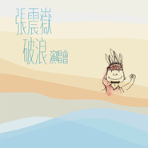
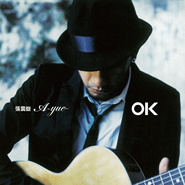
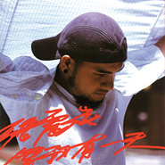

张震岳
============================

|  |  |
| :--: | :-- |
| [ 张震岳](https://i.xiami.com/zhangzhenyue) | **地区**: Taiwan, PRC 中国台湾 **风格**: 华语唱作人 Chinese Singer-Songwriter **播放数**: 444376098 **粉丝数**: 886474 **评论数**: 3580  |

## 档案

小档案 
小名: 阿岳 
语 言：国语、台语、英文嘛也通〈会听不会说〉 
学 历：学无止境--高中五年 
运 动：户外都很喜欢，最喜欢沙滩跑步，很累，所以很好 
休闲活动：听音乐、吉他、写歌 
乐 器：吉他、贝司、鼓〈都不精，会被伍佰 & China Blue笑的那种程度啦〉 
收 集：乔登球鞋1、3、5、6、7、8、9、10、11、12代〈厉害吧！but 6、7、10代都被干走〉 
特殊专长：胡子长，可以绑 
家庭成员：父、母、姐、我 
喜欢的食物：好多喔！最喜欢pizza 
喜欢的颜色：白、蓝、红 
喜欢的动物：海豚、狗 
喜欢的演员：〔罗密欧与茱莉叶〕的男主角，名字太难记〈编者按：李奥纳多狄卡布里欧〉，还有志村健 
喜欢的书：科学类、短篇小说、散文〈长篇小说也喜欢，但是太懒了，没耐性看完〉 
喜欢的电影：疯狂店员 
喜欢去的地方：海边 
害怕的东西：没有 
讨厌的事情：倒垃圾、已经退伍了，莒光日电视教学还有我 
骄傲的事情：第一张专辑『就是喜欢你』就有8首歌是自己写的 
大事记 
1974年 生于宜兰南方澳。 
1991年 木船民歌比赛优胜. 
1991年 10月与真言社签约，进入唱片圈。 
1992年 推出单曲「讨厌夏天」。 
1993年 波丽佳音发行首张个人专辑『就是喜欢你』。 
1993年 波丽佳音发行合辑〔只要为你活一天〕电影原声带「天使之岛」、「讨厌夏天」 
1994年 滚石发行发行第二张专辑『花开了没有』。 
1994年 滚石发行合辑『爱在情歌蔓延时』之「你希望你会懂」，与苏慧伦合唱 
1994年 10月入伍。 
1996年 10月退伍。 
1997年 『这个下午很无聊』魔岩发行 
1997年 合辑『新好男人』之「怎么办」滚石发行 
1998年 『秘密基地』魔岩发行 
1998年 合辑『乐玩乐快乐MEGA MIX』之「爱之初体验」滚石发行

## 专辑

| 名称 | 语种 | 唱片公司 | 发行时间 | 专辑类别 | 专辑风格 |
| :--: | :-- | :-- | :-- | :-- | :-- |
| [ 远走高飞Gone Away](./albums/2105331112.md) | 国语 | 滚石唱片 | 2019年10月18日 | EP, 单曲 | 国语流行 Mandarin Pop, 华语唱作人 Chinese Singer-Songwriter, 民谣流行 Folk Pop |
| [ 再见Hip-Hop](./albums/2103983327.md) | 国语 | 本色音乐, StreetVoice | 2018年09月07日 | EP, 单曲 | 嘻哈 Hip-Hop, 流行说唱 Pop Rap |
| [ 爱就别走](./albums/2103950007.md) | 国语 | 太声文化 | 2018年08月29日 | EP, 单曲 | 流行说唱 Pop Rap |
| [ 一起Happy](./albums/2100183386.md) | 国语 | 欣翰商务 | 2015年08月25日 | EP, 单曲 | 流行舞曲 Dance-Pop, 国语流行 Mandarin Pop, 华语唱作人 Chinese Singer-Songwriter |
| [ 张震岳破浪演唱会破浪Comes@Live演唱会台北场](./albums/2030300540.md) | 国语 | 滚石唱片 | 2014年09月19日 | 现场专辑 | 国语流行 Mandarin Pop, 华语唱作人 Chinese Singer-Songwriter |
| [ 兄弟本色](./albums/392884423.md) | 国语 | 滚石唱片 | 2014年02月19日 | EP, 单曲 | 国语流行 Mandarin Pop, 华语唱作人 Chinese Singer-Songwriter, 流行摇滚 Pop Rock |
| [ Super Duper Fly](./albums/1292024071.md) | 国语 | 滚石唱片 | 2014年02月10日 | EP, 单曲 | 国语流行 Mandarin Pop, 华语唱作人 Chinese Singer-Songwriter, 嘻哈 Hip-Hop |
| [ 我是海雅谷慕Ayal Komod](./albums/1870419658.md) | 国语 | 滚石唱片 | 2013年07月05日 | 录音室专辑 | 国语流行 Mandarin Pop, 华语唱作人 Chinese Singer-Songwriter, 民谣流行 Folk Pop |
| [ 我想要的感觉Perplexed](./albums/424857.md) | 国语 | 滚石唱片 | 2011年04月29日 | 录音室专辑 | 华语唱作人 Chinese Singer-Songwriter, 国语流行 Mandarin Pop, 民谣流行 Folk Pop |
| [ A-YUE / OK2010](./albums/414269.md) | 国语 | 滚石唱片 | 2010年11月01日 | EP, 单曲 | 国语流行 Mandarin Pop |
| [ 无名的情歌 (2009 Demo)](./albums/463129.md) | 国语 | 滚石唱片 | 2009年12月01日 | EP, 单曲 | 国语流行 Mandarin Pop, 华语唱作人 Chinese Singer-Songwriter |
| [ 97>04 岳慢 岳快](./albums/363321.md) | 国语 | 滚石唱片 | 2008年01月22日 | 精选集 | 国语流行 Mandarin Pop, 华语唱作人 Chinese Singer-Songwriter, 流行摇滚 Pop Rock |
| [ OK思念是一种病](./albums/6213.md) | 国语 | 滚石唱片 | 2007年07月06日 | 录音室专辑 | 国语流行 Mandarin Pop, 华语唱作人 Chinese Singer-Songwriter |
| [ PANG★PANG★TONG](./albums/373768.md) | 国语 | 本色音乐 | 2007年03月23日 | EP, 单曲 | 国语流行 Mandarin Pop |
| [ 再见](./albums/6214.md) | 国语 | 本色股份 | 2005年07月08日 | EP, 单曲 | 国语流行 Mandarin Pop, 华语唱作人 Chinese Singer-Songwriter |
| [ 马拉桑](./albums/6215.md) | 国语 | 滚石唱片 | 2005年05月07日 | EP, 单曲 | 国语流行 Mandarin Pop, 华语唱作人 Chinese Singer-Songwriter |
| [ 阿岳正传Useless Guy](./albums/6217.md) | 国语 | 滚石唱片 | 2004年06月24日 | 精选集 | 国语流行 Mandarin Pop, 华语唱作人 Chinese Singer-Songwriter, 流行摇滚 Pop Rock |
| [ 滚石香港黄金十年 张震岳精选](./albums/6218.md) | 国语 | 滚石唱片 | 2002年11月22日 | 精选集 | 流行摇滚 Pop Rock, 国语流行 Mandarin Pop, 华语唱作人 Chinese Singer-Songwriter |
| [ 等我有一天](./albums/6219.md) | 国语 | 魔岩唱片 | 2002年09月01日 | 录音室专辑 | 国语流行 Mandarin Pop, 华语唱作人 Chinese Singer-Songwriter, 流行摇滚 Pop Rock |
| [ Orange 2](./albums/6220.md) | 国语 | 魔岩唱片 | 2001年07月01日 | EP, 单曲 | 国语流行 Mandarin Pop, 华语唱作人 Chinese Singer-Songwriter, 电子 Electronic |
| [ Summer High张震岳&Friends](./albums/6221.md) | 国语 | 滚石唱片 | 2001年07月01日 | 合集, 杂锦 | 国语流行 Mandarin Pop, 电子 Electronic |
| [ Orange](./albums/6222.md) | 国语 | 魔岩唱片 | 2001年04月01日 | 录音室专辑 | 国语流行 Mandarin Pop, 电子 Electronic, 华语唱作人 Chinese Singer-Songwriter |
| [ 有问题Trouble](./albums/6223.md) | 国语 | 魔岩唱片 | 2000年12月05日 | 录音室专辑 | 国语流行 Mandarin Pop, 华语唱作人 Chinese Singer-Songwriter, 流行摇滚 Pop Rock |
| [ 秘密基地Free Night](./albums/6224.md) | 国语 | 魔岩唱片 | 1998年12月12日 | 录音室专辑 | 流行摇滚 Pop Rock, 国语流行 Mandarin Pop, 华语唱作人 Chinese Singer-Songwriter |
| [ 这个下午很无聊](./albums/6225.md) | 国语 | 魔岩唱片 | 1997年10月01日 | 录音室专辑 | 流行摇滚 Pop Rock, 国语流行 Mandarin Pop, 华语唱作人 Chinese Singer-Songwriter |
| [ 花开了没有不想告别专辑](./albums/6226.md) | 国语 | 滚石唱片 | 1994年06月23日 | 录音室专辑 | 国语流行 Mandarin Pop, 华语唱作人 Chinese Singer-Songwriter |
| [ 就是喜欢你](./albums/6227.md) | 国语 | 波丽佳音, 魔岩唱片 | 1993年07月01日 | 录音室专辑 | 国语流行 Mandarin Pop, 华语唱作人 Chinese Singer-Songwriter |

## 评论

|  |  |  |
| :-- | :-- | :-- |
|  [虾米用户](https://emumo.xiami.com/u/358982157)  2021-01-28 21:46 赞(0) 踩(0) | 
不说再见
 |
|  [虾米用户](https://emumo.xiami.com/u/328229651)  2021-01-27 23:39 赞(0) 踩(0) | 
阿岳你好呀，听你的歌很久.今天特地来找你以前版本的《秘密》，突然想起2012.06.16乌鲁木齐红山体育馆的那次歌迷见面会，用尽浑身解数买到了最好的票.位置很好，就在舞台前方的歌迷粉丝团.离得很近.多想拍几张照片留作纪念，但是很遗憾我那会儿还买不起拍照手机.
 |
|  [虾米用户](https://emumo.xiami.com/u/12306228) Sing My Soul... 2021-01-18 21:13 赞(0) 踩(0) | 
评论太少不科学
 |
|  [虾米用户](https://emumo.xiami.com/u/4771536) I like the v... 2021-01-12 23:49 赞(0) 踩(0) | 
唉
 |
|  [虾米用户](https://emumo.xiami.com/u/276479856) @晚安虾米音乐/公众等你 2021-01-10 15:06 赞(3) 踩(0) | 
说再见好难 忍住泪水好难 离别这一刻 我不甘心放手 期待与你们 相遇 在@晚安虾米音乐/公众 号
 |
|  [虾米用户](https://emumo.xiami.com/u/266067314)  2021-01-06 02:24 赞(0) 踩(0) | 
以后一定去你的演唱会！等我！
 |
|  [虾米用户](https://emumo.xiami.com/u/413822552)  2020-12-10 12:43 赞(0) 踩(0) | 
评论太少不科学
 |
|  [虾米用户](https://emumo.xiami.com/u/319688150) 愿经典不被遗忘 2020-11-28 01:22 赞(0) 踩(0) | 

 |
|  [虾米用户](https://emumo.xiami.com/u/445989676) 如果音乐足够动人 2020-11-27 10:50 赞(0) 踩(0) | 

 |
|  [虾米用户](https://emumo.xiami.com/u/379162683) 我想要记住你们，我想要你... 2020-08-06 17:27 赞(0) 踩(0) | 
✧*｡
 |
|  [虾米用户](https://emumo.xiami.com/u/444233429)  2020-07-26 12:41 赞(0) 踩(0) | 
来了来了
 |
|  [虾米用户](https://emumo.xiami.com/u/444158317) 好好学习天天向上 2020-07-17 14:15 赞(0) 踩(0) | 
~&amp;lt;&amp;quot;ccc&amp;gt;
 |
|  [虾米用户](https://emumo.xiami.com/u/362083809) 尘归尘 2020-06-29 08:45 赞(1) 踩(0) | 
岳，你是一个真的不管什么时期，总能把歌唱出情窦初开少年感的人
 |
|  [虾米用户](https://emumo.xiami.com/u/407923357) 明天很不好 2020-06-26 10:27 赞(1) 踩(0) | 
确定了，他就是詹姆斯失散多年的兄弟&amp;hellip;
 |
|  [虾米用户](https://emumo.xiami.com/u/86306346) 人生如梦，梦如人生。 2020-06-12 18:12 赞(0) 踩(0) | 
贴近生活，贴近实际，贴近现实。我喜欢！
 |
|  [虾米用户](https://emumo.xiami.com/u/10510839) 我还没想好要写什么... 2020-06-11 02:16 赞(2) 踩(0) | 
真的很感动了，岳哥的音乐可以免费听，还每一首都可以听到。今晚听了《再见》这一首，很适合最近的状态了，和异地的男友大概是没有结果了，等了半年，最后以这样的方式收尾，一面有放不下他，也有不甘心，不知何去何从。
 |
| ⇒ |  [虾米用户](https://emumo.xiami.com/u/402239326)  2020-12-09 17:12 赞(0) 踩(0) | 
自由
 |
|  [虾米用户](https://emumo.xiami.com/u/318990506) 好啊好啊 2020-06-04 23:07 赞(0) 踩(0) | 
阿岳的小档案像是个小学生的时候写的 
 |
|  [虾米用户](https://emumo.xiami.com/u/272461332)  2020-05-02 23:45 赞(2) 踩(0) | 
生日快乐
 |
|  [虾米用户](https://emumo.xiami.com/u/154734994) 生命常有缺憾，幸好音乐能... 2020-05-02 17:47 赞(2) 踩(0) | 
阿岳啊！生日快乐
 |
|  [虾米用户](https://emumo.xiami.com/u/403201578)  2020-05-02 14:14 赞(2) 踩(0) | 
Happy birthday
 |
|  [虾米用户](https://emumo.xiami.com/u/262022443)   2020-05-02 12:22 赞(2) 踩(0) | 
生日快乐，阿岳！啥时候再来京开演唱会啊，一转眼又10年了...
 |
|  [虾米用户](https://emumo.xiami.com/u/238992389)  2020-05-02 12:20 赞(2) 踩(0) | 
哥哥生日快乐
 |
|  [虾米用户](https://emumo.xiami.com/u/266620826)  2020-05-02 12:16 赞(2) 踩(0) | 
诞辰快乐！
 |
|  [虾米用户](https://emumo.xiami.com/u/372742289) 快乐难得不要不开心 2020-05-02 12:07 赞(2) 踩(0) | 
阿岳生日快乐!
 |
|  [虾米用户](https://emumo.xiami.com/u/54365226) 唯音乐 不可负 2020-05-02 12:05 赞(2) 踩(0) | 

 |
|  [虾米用户](https://emumo.xiami.com/u/442306606)  2020-05-02 12:01 赞(2) 踩(0) | 
生日快乐
 |
|  [虾米用户](https://emumo.xiami.com/u/411345973)  2020-05-02 11:56 赞(1) 踩(0) | 
阿岳，生日快乐
 |
|  [虾米用户](https://emumo.xiami.com/u/442280744)  2020-05-02 11:38 赞(2) 踩(0) | 
喜欢张震岳的声音，好听  
 |
|  [虾米用户](https://emumo.xiami.com/u/6230145)  2020-05-02 11:27 赞(2) 踩(0) | 
生日快乐。我的第一条评论，也是我第一次听现场的人。转眼这么多年了
 |
|  [虾米用户](https://emumo.xiami.com/u/7417444) 如此，那听歌去:P 2020-05-02 11:27 赞(1) 踩(0) | 
你的歌陪伴了我度过好多岁月，生日快乐呀，超级喜欢你！
 |
|  [虾米用户](https://emumo.xiami.com/u/441479757)  2020-05-02 11:25 赞(1) 踩(0) | 
生日快乐，哥哥
 |
|  [虾米用户](https://emumo.xiami.com/u/205491253) 耐得住寂寞，才能守得住繁... 2020-05-02 11:22 赞(1) 踩(0) | 
&lt;很少是谁的粉丝，七年的偶像只有你，阿岳，生日快乐！[url=/u/35347683]@张震岳 [/url]&gt;&lt;35347683&gt;
 |
|  [虾米用户](https://emumo.xiami.com/u/9986153) Here comes. 2020-05-02 11:16 赞(1) 踩(0) | 
追你好多年咯，岳岳生日快乐~
 |
|  [虾米用户](https://emumo.xiami.com/u/442426651)  2020-05-02 11:15 赞(1) 踩(0) | 
生日快乐
 |
|  [虾米用户](https://emumo.xiami.com/u/329932966)  2020-05-02 11:10 赞(2) 踩(0) | 
生日快乐，阿岳！ 很幸运我能听到你的音乐，希望你能坚持创作，多给我们耳朵一些福利
 |
| ⇒ |  [虾米用户](https://emumo.xiami.com/u/195068151)  2020-05-02 17:26 赞(0) 踩(0) | 
j_ynu^bhhubu:jg*un;tc?yyg;/c$&amp;quot;!)?Hn;99m&amp;quot;mKv 9mmok
 |
|  [虾米用户](https://emumo.xiami.com/u/228512462) 我还没想好要写什么... 2020-05-02 11:10 赞(1) 踩(0) | 
阿嶽生日快樂啊~
 |
|  [虾米用户](https://emumo.xiami.com/u/340727237)  2020-05-02 11:09 赞(1) 踩(0) | 
快生快生
 |
|  [虾米用户](https://emumo.xiami.com/u/424368937) 平凡有另一个名字，叫做你... 2020-05-02 11:09 赞(1) 踩(0) | 
阿岳，生日快樂
 |
|  [虾米用户](https://emumo.xiami.com/u/121702052) 超脱 2020-05-02 11:08 赞(1) 踩(0) | 
阿岳，生日快乐
 |
|  [虾米用户](https://emumo.xiami.com/u/275692521) 喜欢全是腿的夏天 2020-05-02 11:06 赞(1) 踩(0) | 
生日快乐，大胡子
 |
|  [虾米用户](https://emumo.xiami.com/u/103494594) 当车声隆隆，梦开始阵痛 2020-05-02 11:02 赞(1) 踩(0) | 
阿岳，生日快乐 
 |
|  [虾米用户](https://emumo.xiami.com/u/314199074)  2020-05-02 11:02 赞(1) 踩(0) | 
生日快乐！
 |
|  [虾米用户](https://emumo.xiami.com/u/440724463) ZP2020 2020-04-18 08:15 赞(1) 踩(0) | 
[带墨镜笑] 好兄弟....
 |
|  [虾米用户](https://emumo.xiami.com/u/10446996) 我还没想好要写什么... 2020-04-04 15:28 赞(1) 踩(0) | 
很喜欢他的情歌。不知道为什么跑去搞嘻哈了。
 |
|  [虾米用户](https://emumo.xiami.com/u/61212924) 有时，生活就像一颗嗑碎的... 2020-03-20 10:08 赞(0) 踩(0) | 
In me tiger sniffs the rose
 |
|  [虾米用户](https://emumo.xiami.com/u/171109250) 我还没想好要写什么... 2020-02-29 00:04 赞(0) 踩(0) | 
留名，虾米很好，还有很多很多好音乐等我探寻。
 |
|  [虾米用户](https://emumo.xiami.com/u/14835159) Jazz Voicing 2020-02-16 11:00 赞(0) 踩(0) | 
越来越棒了，音乐小王子哈哈！！
 |
|  [虾米用户](https://emumo.xiami.com/u/136095326) I'll be your... 2020-01-19 14:53 赞(0) 踩(0) | 
阿岳真的很严格
 |
|  [虾米用户](https://emumo.xiami.com/u/84966134)   2020-01-08 13:24 赞(1) 踩(0) | 
一夜之间阿岳的歌都没了 
 |
| ⇒ |  [虾米用户](https://emumo.xiami.com/u/185796)  2020-03-23 16:08 赞(0) 踩(0) | 
现在又有了~
 |
|  [虾米用户](https://emumo.xiami.com/u/11586439) 陪你拉屎!£&@! 2020-01-05 20:14 赞(0) 踩(0) | 
看阿岳可爱的小档案~
 |
|  [虾米用户](https://emumo.xiami.com/u/358104299) 悲观的唯心存在现实解构虚... 2019-12-22 08:24 赞(0) 踩(0) | 
15833
 |
|  [虾米用户](https://emumo.xiami.com/u/369960409) H.O.T.5你好！20... 2019-11-22 18:29 赞(0) 踩(0) | 
阿岳你好
 |
|  [虾米用户](https://emumo.xiami.com/u/86511592)   2019-10-18 18:26 赞(3) 踩(0) | 
喜迎阿岳新专辑 喜欢阿岳14年了 希望快开演唱会！    恭喜阿岳当爸爸了！
 |
|  [虾米用户](https://emumo.xiami.com/u/318132) 抠啦 2019-10-17 23:36 赞(0) 踩(0) | 
坐等阿岳半小时后的新歌出现在虾米，听完全部新作品超级爱，最爱酒鬼。
 |
|  [虾米用户](https://emumo.xiami.com/u/281571813)  2019-10-09 12:48 赞(1) 踩(0) | 
能把街声里以前发过的歌做成特殊专辑吗？一想到再也听不到了，真的好沮丧啊 
 |
|  [虾米用户](https://emumo.xiami.com/u/347393098) 我还没想好要写什么... 2019-09-12 20:07 赞(0) 踩(0) | 
阿岳。喜欢你的情歌。。
 |
|  [虾米用户](https://emumo.xiami.com/u/208314929)  2019-09-10 20:23 赞(0) 踩(0) | 
啊岳太棒了
 |
|  [虾米用户](https://emumo.xiami.com/u/334648198) 欲知前世因今生受者是，欲... 2019-09-04 15:48 赞(1) 踩(0) | 
顶
 |
|  [虾米用户](https://emumo.xiami.com/u/427272148) 我喜欢自己的生活 2019-07-23 20:26 赞(0) 踩(0) | 
<a href="http://emumo.xiami.com/u/256392269" target="_blank" rel="nofollow" name_card="256392269">@陈柯宇 </a>
 |
|  [虾米用户](https://emumo.xiami.com/u/36380638)   2019-07-21 00:55 赞(1) 踩(0) | 
阿岳唱副歌太好听了
 |
|  [虾米用户](https://emumo.xiami.com/u/257244889)  2019-07-04 18:47 赞(2) 踩(0) | 
詹震岳
 |
|  [虾米用户](https://emumo.xiami.com/u/286601392) 有时候想独自一人，有时候... 2019-06-19 07:47 赞(1) 踩(0) | 
1996年开始听张震岳的音乐……记得那时我是向哥哥们借来的磁带。当初听的是这个下午很无聊，讨厌夏天之类的，还有同学会～那种感觉到现在还会记得……那是一种冲击和叛逆的感觉，那是给我带来新感觉的好音乐！听了二十多年，还是觉得岳氏情歌有很多可圈可点的地方，它拥有让你能记住的地方，无论好与坏！ 
 |
|  [虾米用户](https://emumo.xiami.com/u/22550177)  2019-06-16 10:42 赞(3) 踩(0) | 
从高中开始听阿岳的歌，喜欢他歌里真实的细腻，不矫情不做作，随性洒脱，却有动容的真情，从来不炒作，因为有才华又率真的人，不需要活在虚构的城堡里。
 |
|  [虾米用户](https://emumo.xiami.com/u/424409589)  2019-06-16 10:30 赞(1) 踩(0) | 
我更 王俊凯，易烊千玺，王源的歌，有活力。
 |
| ⇒ |  [虾米用户](https://emumo.xiami.com/u/432517615)  2020-03-27 23:14 赞(0) 踩(0) | 
向环卫工人致敬
 |
|  [虾米用户](https://emumo.xiami.com/u/7335097) 坏坏的好好的 2019-06-14 16:45 赞(2) 踩(0) | 
阿岳哥，我一岁的女儿很喜欢你的歌！会摇摆起来的那种喜欢，一听就高兴了。
 |
|  [虾米用户](https://emumo.xiami.com/u/379115442)  2019-06-12 19:14 赞(0) 踩(0) | 
你的歌不是收费吗？又不收了？继续收费吧？收费就不听了。
 |
|  [虾米用户](https://emumo.xiami.com/u/101636444) ❤️一只喜欢闵玧其的疯姑... 2019-06-11 07:01 赞(2) 踩(0) | 
❤️
 |
|  [虾米用户](https://emumo.xiami.com/u/3989578) 音乐无国界 2019-05-27 22:03 赞(3) 踩(0) | 
真正可以牛逼哄哄的创作天才
 |
|  [虾米用户](https://emumo.xiami.com/u/324159796)   2019-05-26 23:39 赞(3) 踩(0) | 
其实我也很喜欢张震岳的歌，很好听。好多歌都会唱，真的不错。张震岳走的不是偶像派是实力派的         
 |
|  [虾米用户](https://emumo.xiami.com/u/310913602)  2019-05-21 20:56 赞(2) 踩(0) | 
“没有流量”是对你的赞赏
 |
|  [虾米用户](https://emumo.xiami.com/u/424663891) 会飞的鱼 2019-05-21 07:09 赞(3) 踩(0) | 
喜欢你的歌，但更喜欢伍佰的歌 
 |
|  [虾米用户](https://emumo.xiami.com/u/195292625)  2019-05-14 11:40 赞(1) 踩(0) | 
很喜欢张震岳！能打动我的内心！
 |
|  [虾米用户](https://emumo.xiami.com/u/265673645)  2019-05-04 00:47 赞(2) 踩(0) | 
阿岳今天是我生日，比你晚一天，呵呵
 |
|  [虾米用户](https://emumo.xiami.com/u/241311135)  2019-05-03 09:22 赞(1) 踩(0) | 
阿岳永远爱你
 |
|  [虾米用户](https://emumo.xiami.com/u/404301419) 身未动，心已远！ 2019-05-03 08:30 赞(1) 踩(0) | 
生日快乐
 |
|  [虾米用户](https://emumo.xiami.com/u/342916299) 安心，安心 2019-05-02 23:57 赞(1) 踩(0) | 
阿岳生日快乐
 |
|  [虾米用户](https://emumo.xiami.com/u/342916299) 安心，安心 2019-05-02 23:57 赞(1) 踩(0) | 
支持阿岳
 |
|  [虾米用户](https://emumo.xiami.com/u/293557697) 我会永远十八岁，缩不小也... 2019-05-02 20:46 赞(0) 踩(0) | 
生日快乐，阿岳
 |
|  [虾米用户](https://emumo.xiami.com/u/296058172) 因为喜欢所以钟情 2019-05-02 20:09 赞(1) 踩(0) | 
生日快乐！祝福你！
 |
|  [虾米用户](https://emumo.xiami.com/u/316409397) 心若向阳 无谓悲伤  2019-05-02 20:05 赞(1) 踩(0) | 
生日快乐，天天快乐
 |
|  [虾米用户](https://emumo.xiami.com/u/326165803) 我还没想好要写什么... 2019-05-02 18:55 赞(1) 踩(0) | 
生日快乐
 |
|  [虾米用户](https://emumo.xiami.com/u/93092514) 不求闻达于诸侯 2019-05-02 15:35 赞(1) 踩(0) | 
阿岳生日快乐啊
 |
|  [虾米用户](https://emumo.xiami.com/u/291635847)  2019-05-02 15:14 赞(1) 踩(0) | 
后来才知道电影旋风小子那个铁牛就是张震岳演的，童年的回忆啊
 |
|  [虾米用户](https://emumo.xiami.com/u/49672844)  2019-05-02 14:02 赞(1) 踩(0) | 
阿岳，我觉得可以
 |
|  [虾米用户](https://emumo.xiami.com/u/400558082) 北斗星向左。 2019-05-02 11:40 赞(2) 踩(0) | 
阿岳生日快乐！！阿岳唱歌最好听辣！！
 |
|  [虾米用户](https://emumo.xiami.com/u/251413040) 想好了但不想写什么…… 2019-05-02 10:56 赞(2) 踩(0) | 
生日快乐
 |
|  [虾米用户](https://emumo.xiami.com/u/169802412) 不好看我都要看，谁叫我喜... 2019-05-02 10:50 赞(1) 踩(0) | 
阿岳牛逼
 |
|  [虾米用户](https://emumo.xiami.com/u/116805290)  2019-05-02 10:40 赞(1) 踩(0) | 
阿岳生日快乐
 |
|  [虾米用户](https://emumo.xiami.com/u/307216851) The Chosen O... 2019-05-02 10:39 赞(1) 踩(0) | 
生日快乐！Csun Yuk！！！
 |
|  [虾米用户](https://emumo.xiami.com/u/11095592) 我还没想好要写什么... 2019-05-02 10:38 赞(1) 踩(0) | 
生日快乐鸭～
 |
|  [虾米用户](https://emumo.xiami.com/u/88730178)   2019-05-02 10:29 赞(1) 踩(0) | 
阿岳生日快乐
 |
|  [虾米用户](https://emumo.xiami.com/u/377605140)  2019-05-02 10:25 赞(1) 踩(0) | 
生日快乐！！！！
 |
|  [虾米用户](https://emumo.xiami.com/u/179358620) 时光洪流里，有微末小事，... 2019-05-02 10:21 赞(1) 踩(0) | 
今天听说老张 生日 。歌真好听。然后唱。
 |
|  [虾米用户](https://emumo.xiami.com/u/111576020)  2019-05-02 10:18 赞(1) 踩(0) | 
祝你生日快乐
 |
|  [虾米用户](https://emumo.xiami.com/u/355662082)   2019-05-02 10:16 赞(1) 踩(0) | 
一直都在
 |
|  [虾米用户](https://emumo.xiami.com/u/355662082)   2019-05-02 10:16 赞(1) 踩(0) | 
生日快乐阿岳
 |
|  [虾米用户](https://emumo.xiami.com/u/2737024) 不是僵尸号，台湾流行乐爱... 2019-05-02 10:16 赞(1) 踩(0) | 
原来阿岳也是金牛座，生日快乐！！！
 |
|  [虾米用户](https://emumo.xiami.com/u/122174216)   2019-05-02 10:15 赞(1) 踩(0) | 
生日快乐
 |
|  [虾米用户](https://emumo.xiami.com/u/346193177)  2019-05-02 10:12 赞(1) 踩(0) | 
生日快乐
 |
|  [虾米用户](https://emumo.xiami.com/u/37603687) 我还没想好要写什么... 2019-05-02 10:10 赞(1) 踩(0) | 
生日快乐阿岳！今天我要去约会了！
 |
|  [虾米用户](https://emumo.xiami.com/u/16884656) 今后也会喜欢各种各样的人... 2019-05-02 10:10 赞(0) 踩(0) | 
阿岳，生日快乐 
 |
|  [虾米用户](https://emumo.xiami.com/u/400768495)  2019-05-02 10:09 赞(0) 踩(0) | 
阿岳 生日快乐
 |
|  [虾米用户](https://emumo.xiami.com/u/319720172)  2019-05-02 10:09 赞(0) 踩(0) | 
祝我岳哥生日快乐！
 |
|  [虾米用户](https://emumo.xiami.com/u/27631902) 啦啦啦 2019-05-02 10:07 赞(0) 踩(0) | 
世界上最好的歌手，最可爱的奶爸生日快乐
 |
|  [虾米用户](https://emumo.xiami.com/u/267336239) 来当我的过客 2019-05-02 10:07 赞(0) 踩(0) | 
我还是会喜欢你哦
 |
|  [虾米用户](https://emumo.xiami.com/u/250442178) 蓝玫瑰代表两种答案，一种... 2019-05-02 10:06 赞(0) 踩(0) | 
生日快乐啊！！
 |
|  [虾米用户](https://emumo.xiami.com/u/74856736)   2019-05-02 10:06 赞(0) 踩(0) | 
阿岳生日快乐！
 |
|  [虾米用户](https://emumo.xiami.com/u/7544760)  陪伴者 2019-05-02 10:05 赞(2) 踩(0) | 
今天也是我的生日 生日快乐哦
 |
| ⇒ |  [虾米用户](https://emumo.xiami.com/u/250442178) 蓝玫瑰代表两种答案，一种... 2019-05-02 10:07 赞(0) 踩(0) | 
生日快乐啊
 |
|  [虾米用户](https://emumo.xiami.com/u/73064230) 最美好的幸福就是一无所知... 2019-05-02 00:14 赞(0) 踩(0) | 
生日快乐，我的宝藏男孩
 |
|  [虾米用户](https://emumo.xiami.com/u/245280323) 芳香四溢的樱花岛上，湛蓝... 2019-05-01 13:30 赞(1) 踩(0) | 
男歌手张震岳，女歌手陈绮贞，两个自创型歌手，总是觉得二人歌词里表达的意境总是莫名的相似，都透露出一股青春里单纯的暗恋、猜疑或者分手后淡淡的悲桑之情等。哦，对了，李清照的词也和他们有点像，独自一人时被寂寞笼罩后的喃喃自语，充满着一股令人着迷且淡淡的忧郁风，感同身受的人才能会更喜欢这些歌曲或者词，也会更加懂得里面深深埋藏的含义吧。
 |
|  [虾米用户](https://emumo.xiami.com/u/73064230) 最美好的幸福就是一无所知... 2019-04-27 07:09 赞(1) 踩(0) | 
阿岳什么时候开演唱会啊
 |
|  [虾米用户](https://emumo.xiami.com/u/197493114) 如自由无尽头 2019-04-20 15:37 赞(0) 踩(0) | 
冲鸭
 |
|  [虾米用户](https://emumo.xiami.com/u/368916693)  2019-04-06 12:43 赞(1) 踩(0) | 
伍佰&amp;amp;CHINA BLUE5月在上海和杭州都有演唱会，特别杭州站是伍佰出道30年来第一次在杭州举办专属演唱会。
 |
|  [虾米用户](https://emumo.xiami.com/u/361929383)  2019-03-31 10:22 赞(0) 踩(0) | 
詹姆斯篮球打的好，唱歌也好
 |
|  [虾米用户](https://emumo.xiami.com/u/54689398) ？？ 2019-03-25 02:20 赞(0) 踩(0) | 
一直喜欢
 |
|  [虾米用户](https://emumo.xiami.com/u/420700998)  2019-03-19 02:35 赞(0) 踩(0) | 
终于找到了最喜欢的男歌手的声音
 |
|  [虾米用户](https://emumo.xiami.com/u/27053439) 我还没想好要写什么... 2019-03-18 16:24 赞(0) 踩(0) | 
我爱台妹  爱的初体验 读书时代每天循环无数次
 |
|  [虾米用户](https://emumo.xiami.com/u/201461725) 一生温暖纯良，不舍爱与自... 2019-03-18 12:20 赞(0) 踩(0) | 
温柔的声音
 |
|  [虾米用户](https://emumo.xiami.com/u/403702726) 岂能尽如人意，但求无愧我... 2019-03-16 14:14 赞(0) 踩(0) | 
在海外，听不到。
 |
|  [虾米用户](https://emumo.xiami.com/u/205491253) 耐得住寂寞，才能守得住繁... 2019-03-08 21:21 赞(2) 踩(0) | 
阿岳就像个大男孩，我想成为的 
 |
|  [虾米用户](https://emumo.xiami.com/u/419229693)  2019-02-23 17:57 赞(0) 踩(0) | 
这首很像我的青春
 |
|  [虾米用户](https://emumo.xiami.com/u/291917072) 我还没想好要写什么... 2019-02-22 09:26 赞(1) 踩(0) | 
你是我的青春
 |
|  [虾米用户](https://emumo.xiami.com/u/261400514)   2019-02-18 15:17 赞(0) 踩(0) | 
真实的阿岳
 |
|  [虾米用户](https://emumo.xiami.com/u/193005201) 它很美。 2019-02-17 16:27 赞(0) 踩(0) | 
少数几个能对着老黑喊“你哥”不挨揍的亚裔。
 |
| ⇒ |  [虾米用户](https://emumo.xiami.com/u/300272852)  2019-06-29 23:29 赞(0) 踩(0) | 
“那个”
 |
|  [虾米用户](https://emumo.xiami.com/u/4771536) I like the v... 2019-02-16 01:34 赞(0) 踩(0) | 
清爽的旋律
 |
|  [虾米用户](https://emumo.xiami.com/u/404022986)  2019-02-14 20:39 赞(2) 踩(0) | 
哇，他感谢我收藏他的歌，
 |
|  [虾米用户](https://emumo.xiami.com/u/282387825) 我爱的是你爱我 2019-01-30 18:03 赞(0) 踩(0) | 
不許下架不許下架
 |
|  [虾米用户](https://emumo.xiami.com/u/85008772)  2019-01-20 03:58 赞(1) 踩(0) | 
我错了，因为他有些歌烂大街，就对他有偏见了。直到我听了路口，很厉害了
 |
| ⇒ |  [虾米用户](https://emumo.xiami.com/u/317851600)  2019-02-21 16:47 赞(0) 踩(0) | 
还有很多歌都不错哦，比如：秘密
 |
| ⇒ |  [虾米用户](https://emumo.xiami.com/u/85008772)  2019-02-23 19:47 赞(0) 踩(0) | 
<q><b>阿祖说：</b></q>
 |
|  [虾米用户](https://emumo.xiami.com/u/160428922) 江湖再见 2019-01-19 20:50 赞(1) 踩(0) | 
打开图片集。第27张照片不要太帅好吧
 |
|  [虾米用户](https://emumo.xiami.com/u/377402577)  2019-01-16 16:49 赞(0) 踩(0) | 
好好听
 |
|  [虾米用户](https://emumo.xiami.com/u/33871676)  2019-01-14 17:24 赞(0) 踩(0) | 
就喜欢两手空空
 |
|  [虾米用户](https://emumo.xiami.com/u/35561242) Waiting for ... 2019-01-05 15:28 赞(1) 踩(0) | 
有人发现张震岳好多老歌下架了嘛
 |
|  [虾米用户](https://emumo.xiami.com/u/3989578) 音乐无国界 2019-01-05 13:13 赞(0) 踩(0) | 
张震岳是一个很好的音乐人
 |
|  [虾米用户](https://emumo.xiami.com/u/335167244) 突然爱上电音的老家伙 2019-01-02 13:24 赞(2) 踩(0) | 
台湾内马尔
 |
|  [虾米用户](https://emumo.xiami.com/u/265673645)  2018-12-26 21:14 赞(1) 踩(0) | 
你的每一首歌都听过，包括没未发行的
 |
|  [虾米用户](https://emumo.xiami.com/u/265673645)  2018-12-26 21:13 赞(1) 踩(0) | 
加油，阿岳
 |
|  [虾米用户](https://emumo.xiami.com/u/235802235)  2018-12-25 17:19 赞(0) 踩(0) | 
非常喜欢你
 |
|  [虾米用户](https://emumo.xiami.com/u/333846039) 人生路 美梦似路长 2018-12-21 22:02 赞(1) 踩(0) | 
对阿岳的温柔真的没法抵挡
 |
|  [虾米用户](https://emumo.xiami.com/u/278145361)  2018-12-18 23:54 赞(0) 踩(0) | 
开车的路上，听着你的歌，快乐的享受生活！！
 |
|  [虾米用户](https://emumo.xiami.com/u/80752236) 好听 2018-12-16 14:32 赞(0) 踩(0) | 
你怎么这么可爱
 |
|  [虾米用户](https://emumo.xiami.com/u/408865109) 追求音乐中的浪漫 2018-12-11 12:31 赞(0) 踩(0) | 
再见 我和女儿最爱的歌曲。感谢歌手给大家带来的感动
 |
|  [虾米用户](https://emumo.xiami.com/u/342642613)  2018-12-06 16:51 赞(0) 踩(0) | 
振动心灵的歌，怎么都不会变。最初就是被歌声打动，一直感觉在灵魂的歌者
 |
|  [虾米用户](https://emumo.xiami.com/u/298464501) 这首歌请务必让我来唱 2018-12-01 01:34 赞(2) 踩(0) | 
听了阿岳的歌才知道，真正的好歌哪里需要押韵！
 |
|  [虾米用户](https://emumo.xiami.com/u/114568832) 我还没想好要写什么... 2018-11-30 01:33 赞(0) 踩(0) | 
3年前因为qq不能在听你的歌了，下了米，也只用这个软件了
 |
|  [虾米用户](https://emumo.xiami.com/u/408795395) 平生相见即眉开✨ 2018-11-17 10:05 赞(0) 踩(0) | 
超喜欢你 
 |
|  [虾米用户](https://emumo.xiami.com/u/74749660)  2018-11-15 22:40 赞(1) 踩(0) | 
加油，你是最棒的，詹姆斯
 |
|  [虾米用户](https://emumo.xiami.com/u/339489449) 我们本应自在如风，何必拘... 2018-11-14 13:39 赞(0) 踩(0) | 
喜欢阿岳，顺便也粉上了热狗，哈哈
 |
|  [虾米用户](https://emumo.xiami.com/u/29019297) 我有我世界 2018-11-10 15:31 赞(2) 踩(0) | 
我喜欢阿岳，喜欢他对生活的态度，随性、真实、玩世不恭。他喜欢的户外运动，经常骑机车、骑自行车环岛，冲浪.....，所以他的歌曲，没有弥漫的商业气息，爱他歌中的不羁，呐喊着告诉世界自己的爱与渴望，是台湾有品位，不俗流的音乐人，会一直支持的....坐等新歌
 |
|  [虾米用户](https://emumo.xiami.com/u/11235021) 纵贯线王菲熊光KOKIA... 2018-11-03 21:06 赞(2) 踩(0) | 
阿岳这小档案自己写的吧，还说乐器玩得不精，会被伍佰笑的那种
 |
|  [虾米用户](https://emumo.xiami.com/u/404370125)  2018-10-10 19:52 赞(0) 踩(0) | 
支持岳岳也支持hot dog
 |
|  [虾米用户](https://emumo.xiami.com/u/125751550) Listen chill... 2018-10-07 16:35 赞(0) 踩(0) | 
听了8年了，现在不会像原来一样循环播放了，不过你也成了我对待生活的方式，加油海雅谷慕，欧里给！！
 |
|  [虾米用户](https://emumo.xiami.com/u/206029922) 一笑泯恩仇 2018-10-07 08:32 赞(0) 踩(0) | 
非常喜欢阿岳
 |
|  [虾米用户](https://emumo.xiami.com/u/342461549) 我不想找你。你就不要出现... 2018-10-05 01:09 赞(0) 踩(0) | 
喜欢你让我哭    
 |
|  [虾米用户](https://emumo.xiami.com/u/275319602) 孤独症 2018-09-24 19:44 赞(1) 踩(0) | 
喜欢阿岳
 |
|  [虾米用户](https://emumo.xiami.com/u/23386780)  can you hea... 2018-09-22 10:59 赞(2) 踩(0) | 
恭喜阿岳当爸呀
 |
|  [虾米用户](https://emumo.xiami.com/u/13313040) 再好的相机也只能记录最美... 2018-09-22 08:03 赞(1) 踩(0) | 
恭喜恭喜
 |
|  [虾米用户](https://emumo.xiami.com/u/36380638)   2018-09-14 00:40 赞(1) 踩(0) | 
一路听你歌长大
 |
|  [虾米用户](https://emumo.xiami.com/u/339191478)   2018-09-11 23:51 赞(1) 踩(0) | 
❤
 |
|  [虾米用户](https://emumo.xiami.com/u/403706840)  2018-09-08 15:12 赞(1) 踩(0) | 
这首歌我很喜欢   加油加油加油   
 |
|  [虾米用户](https://emumo.xiami.com/u/304449664)  2018-09-03 00:36 赞(1) 踩(0) | 
什么时候再出新歌呢，期待期待期待
 |
|  [虾米用户](https://emumo.xiami.com/u/333937599)  2018-08-30 23:49 赞(1) 踩(0) | 
     
 |
|  [虾米用户](https://emumo.xiami.com/u/333937599)  2018-08-30 23:49 赞(1) 踩(0) | 
这首歌我很喜欢   加油加油加油   
 |
|  [虾米用户](https://emumo.xiami.com/u/334335989) 暫無 2018-08-30 22:14 赞(1) 踩(0) | 
总是能给我一些安慰，谢谢你，阿岳! 祝你开心!
 |
|  [虾米用户](https://emumo.xiami.com/u/20147189) 嘘 2018-08-30 15:20 赞(2) 踩(0) | 
听你的歌 就觉得 怎么有人可以写出那么舒服 又那么细腻 还那么像在雨后骑车 街角转弯穿过林荫吹来的习习微风 那样温柔 那样扣人心弦 的歌
 |
|  [虾米用户](https://emumo.xiami.com/u/307939522)  2018-08-28 06:43 赞(1) 踩(0) | 
詹姆斯！喜欢你的音乐
 |
|  [虾米用户](https://emumo.xiami.com/u/138040164) 我还没想好要写什么... 2018-08-27 21:25 赞(1) 踩(0) | 
我在孤独的路上，没有尽头......
 |
|  [虾米用户](https://emumo.xiami.com/u/378116777)  2018-08-27 12:10 赞(2) 踩(0) | 
神的孩子！长着翅膀的天使！新婚幸福！
 |
|  [虾米用户](https://emumo.xiami.com/u/291917072) 我还没想好要写什么... 2018-08-25 19:31 赞(2) 踩(0) | 
大家好，我开了一个阿岳的趴踢间，喜欢张震岳的小伙伴点我头像进来呀，为阿岳打call 
 |
|  [虾米用户](https://emumo.xiami.com/u/298464501) 这首歌请务必让我来唱 2018-08-14 00:02 赞(2) 踩(0) | 
一直想说阿岳的帽子都好好看，哪里买的，我也要！
 |
|  [虾米用户](https://emumo.xiami.com/u/338744450) 看的见我的未来 2018-08-07 16:26 赞(3) 踩(0) | 
未知生物是什么鬼啦！
 |
|  [虾米用户](https://emumo.xiami.com/u/313240556) 幻境永生 2018-08-07 10:13 赞(2) 踩(0) | 
台湾难得的音乐人，有品味，不流俗。
 |
|  [虾米用户](https://emumo.xiami.com/u/297226048)  2018-07-28 17:43 赞(2) 踩(0) | 
小档案很可爱 
 |
|  [虾米用户](https://emumo.xiami.com/u/257732002)   2018-07-27 13:25 赞(1) 踩(0) | 
感觉张震岳的歌很入味
 |
|  [虾米用户](https://emumo.xiami.com/u/48625164) “你一定喝过洋酒，你一定... 2018-07-25 01:37 赞(1) 踩(0) | 
Freenight I wanna get high.
 |
|  [虾米用户](https://emumo.xiami.com/u/297020171) 爱虾米的一切！ 2018-07-23 13:51 赞(1) 踩(0) | 
加油奶爸，希望听到更多你的作品！
 |
|  [虾米用户](https://emumo.xiami.com/u/266886550)  2018-07-17 13:30 赞(1) 踩(0) | 
资料里&amp;ldquo;特殊专长&amp;rdquo;  胡子长是什么鬼啊 
 |
| ⇒ |  [虾米用户](https://emumo.xiami.com/u/266886550)  2018-07-17 13:33 赞(0) 踩(0) | 
张震岳的小档案好可爱的感觉啊
 |
|  [虾米用户](https://emumo.xiami.com/u/38764676) 很多简单的道理，用心去理... 2018-07-17 12:49 赞(1) 踩(0) | 
很喜欢你，你的个不是经常听，但是20年没有断过
 |
|  [虾米用户](https://emumo.xiami.com/u/35801121)  2018-07-08 15:04 赞(1) 踩(0) | 
你说过你要离开我
 |
|  [虾米用户](https://emumo.xiami.com/u/1412453) 少壮不努力老大玩虾米 2018-07-04 14:53 赞(1) 踩(0) | 
恭喜恭喜，爱你不走！
 |
|  [虾米用户](https://emumo.xiami.com/u/51963770)  2018-07-03 19:39 赞(1) 踩(0) | 
要结婚喽 
 |
|  [虾米用户](https://emumo.xiami.com/u/6316082) 前有荷塘后坐青山 2018-07-03 11:19 赞(2) 踩(0) | 
个人简介好可爱
 |
|  [虾米用户](https://emumo.xiami.com/u/375824819)  2018-07-01 22:04 赞(1) 踩(0) | 
我可以用你的歌曲做电影配乐吗
 |
|  [虾米用户](https://emumo.xiami.com/u/375761799)  2018-06-26 21:48 赞(2) 踩(0) | 
爱你爱你爱你
 |
|  [虾米用户](https://emumo.xiami.com/u/375207372)  2018-06-21 08:58 赞(4) 踩(0) | 
岳哥，愿你长命百岁！冲遍全球所有海浪，单车越骑越快，胡子越来越长，期待你的新专辑&amp;hellip;&amp;hellip;！
 |
|  [虾米用户](https://emumo.xiami.com/u/376335042)  2018-06-21 06:15 赞(1) 踩(0) | 
喜欢你
 |
|  [虾米用户](https://emumo.xiami.com/u/86843824)  2018-06-17 22:07 赞(1) 踩(0) | 
Hey LeBron James
 |
|  [虾米用户](https://emumo.xiami.com/u/374672550)  2018-06-17 00:44 赞(1) 踩(0) | 
你唱的破吉他好听
 |
|  [虾米用户](https://emumo.xiami.com/u/366679219)  2018-06-17 00:12 赞(1) 踩(0) | 
已经收藏，感谢您的歌声！
 |
|  [虾米用户](https://emumo.xiami.com/u/348455948) 男人这东西，你越理解他，... 2018-06-14 00:17 赞(2) 踩(0) | 
就凭岳岳个人主页中国台湾这几个字必须顶你[带墨镜笑][带墨镜笑][带墨镜笑]
 |
| ⇒ |  [虾米用户](https://emumo.xiami.com/u/50659965) 抚琴成一快，不负少年头 2018-10-14 11:13 赞(0) 踩(0) | 
老哥。。。这个也不是他个人编辑的吧。。。
 |
|  [虾米用户](https://emumo.xiami.com/u/361913774)  2018-06-05 17:03 赞(1) 踩(0) | 
听你的歌听出了温柔 听出了回忆 听出了故事 听出了感动
 |
|  [虾米用户](https://emumo.xiami.com/u/277133872)  2018-05-30 22:01 赞(1) 踩(0) | 
阿岳，你好酷
 |
|  [虾米用户](https://emumo.xiami.com/u/354211814)  2018-05-29 04:24 赞(1) 踩(0) | 
不知道是不是你，0几年就沉迷于思念是一种病，我听懂了这首歌，希望你继续努力
 |
|  [虾米用户](https://emumo.xiami.com/u/365396632) Beyond精神永存！ 2018-05-27 00:01 赞(1) 踩(0) | 
起码词曲都是自己的，给力的音乐人 
 |
|  [虾米用户](https://emumo.xiami.com/u/352185192)  2018-05-24 17:15 赞(1) 踩(0) | 
不需要感谢，喜欢听就听了
 |
|  [虾米用户](https://emumo.xiami.com/u/11235021) 纵贯线王菲熊光KOKIA... 2018-05-19 09:15 赞(0) 踩(0) | 
新歌欢迎光临Demo <a href="https://streetvoice.cn/orangechang/songs/556352/" target="_blank" rel="nofollow noreferrer noopener">https://streetvoice.cn/orangechang/songs/556352/</a>
 |
|  [虾米用户](https://emumo.xiami.com/u/271342633)  Es war einm... 2018-05-18 23:50 赞(0) 踩(0) | 
Cool voice, cool lyrics. i lv it. U r great artist.
 |
|  [虾米用户](https://emumo.xiami.com/u/364820804)  2018-05-17 18:30 赞(1) 踩(0) | 
你的歌好听
 |
|  [虾米用户](https://emumo.xiami.com/u/34313941) 面朝大海，春暖花开。 2018-05-12 16:09 赞(1) 踩(0) | 
大哥好
 |
|  [虾米用户](https://emumo.xiami.com/u/242820153) 在一起讀書的人並沒有在一... 2018-05-12 15:45 赞(0) 踩(0) | 
.
 |
|  [虾米用户](https://emumo.xiami.com/u/80741006) 听歌不装文 2018-05-09 17:07 赞(1) 踩(0) | 
爱你！十年
 |
|  [虾米用户](https://emumo.xiami.com/u/323717973) 记住，通往神殿的入口就在... 2018-05-04 19:03 赞(1) 踩(0) | 
好亲切的老男孩！ 感谢你和你的伙伴们用音乐表达生命的真义:爱！ 我们收到了！ 
 |
|  [虾米用户](https://emumo.xiami.com/u/258486435)  2018-05-04 12:32 赞(1) 踩(0) | 
迟到了 但是要生日快乐！
 |
|  [虾米用户](https://emumo.xiami.com/u/334935388)  2018-05-04 08:02 赞(1) 踩(0) | 
好听
 |
|  [虾米用户](https://emumo.xiami.com/u/10692143)   2018-05-03 13:01 赞(1) 踩(0) | 
阿岳真的很严格
 |
|  [虾米用户](https://emumo.xiami.com/u/309379795)  2018-05-02 23:39 赞(1) 踩(0) | 
Happy birthday
 |
|  [虾米用户](https://emumo.xiami.com/u/240789542)  2018-05-02 23:33 赞(1) 踩(0) | 
阿岳生快！
 |
|  [虾米用户](https://emumo.xiami.com/u/31441687)  2018-05-02 23:25 赞(1) 踩(0) | 
准备对你说生日快乐。真羡慕你
 |
|  [虾米用户](https://emumo.xiami.com/u/121313818)  2018-05-02 21:55 赞(2) 踩(0) | 
真爱阿岳第六年 ，感谢有你陪伴的日子。生日快乐～A Yue
 |
|  [虾米用户](https://emumo.xiami.com/u/4707536) 我很忙！ 2018-05-02 21:53 赞(2) 踩(0) | 
happy bday~
 |
|  [虾米用户](https://emumo.xiami.com/u/331621110)  2018-05-02 18:27 赞(1) 踩(0) | 
想你
 |
|  [虾米用户](https://emumo.xiami.com/u/51947031) 时间留下了美丽和一片狼藉... 2018-05-02 17:57 赞(1) 踩(0) | 
生日快乐 每天都快乐  
 |
|  [虾米用户](https://emumo.xiami.com/u/284941358)  2018-05-02 17:41 赞(1) 踩(0) | 
阿岳生日快乐
 |
|  [虾米用户](https://emumo.xiami.com/u/7588684)  2018-05-02 17:14 赞(1) 踩(0) | 
阿岳，生日快乐。啥时候再给咱们演个 旋风小子 第二部?
 |
|  [虾米用户](https://emumo.xiami.com/u/246944202) 我不喜欢你的眼睛~ 2018-05-02 17:06 赞(1) 踩(0) | 
一起happy   
 |
|  [虾米用户](https://emumo.xiami.com/u/268984) byebye my lo... 2018-05-02 15:55 赞(2) 踩(0) | 
生日快乐，阿岳。 就是听你的歌渡过了我全部的青春期，期间发生的事情虽然不完美，但给我留下了记忆里完美的她。 谢谢我的好兄弟，小于。你一直好言劝我好酒伴我，让我度过了最难的时期。 眼看30了，你也终于结婚了，祝你新婚快乐。
 |
|  [虾米用户](https://emumo.xiami.com/u/352602466)  2018-05-02 15:27 赞(1) 踩(0) | 
阿岳生日快乐
 |
|  [虾米用户](https://emumo.xiami.com/u/278172560) 现在就是答案 2018-05-02 14:32 赞(1) 踩(0) | 
生日快乐，阿岳。
 |
|  [虾米用户](https://emumo.xiami.com/u/254233289)  2018-05-02 14:21 赞(1) 踩(0) | 
生日快乐
 |
|  [虾米用户](https://emumo.xiami.com/u/259040204) 请认真的陪我老去 2018-05-02 14:05 赞(1) 踩(0) | 
生日快乐！
 |
|  [虾米用户](https://emumo.xiami.com/u/90086500) 1974.5.2 2018-05-02 13:13 赞(1) 踩(0) | 
打call!!!
 |
|  [虾米用户](https://emumo.xiami.com/u/7366382)  2018-05-02 12:30 赞(1) 踩(0) | 
听你的歌，伴我度过单身的日子
 |
|  [虾米用户](https://emumo.xiami.com/u/339303490)  2018-05-02 12:02 赞(2) 踩(0) | 
很早以前就有想聊阿岳的,但事情总是被耽搁。时至今日，我也不是原来的我，阿岳也长大了。  和大多数人一样，听阿岳的第一首歌是《爱之初体验》。歌词很欢快，直白，甚至于说有点搞笑。可能是当时还没满十八岁，没经历过爱情，才会那么想。后来喜欢上阿岳，听他的歌、他的专辑，才知道阿岳个性张扬，曲风一贯是潇洒，即使是偶尔的失眠，第二天也还是照样压压夏天的马路。(&amp;ldquo;大不了就来一首《再见》啊，唱的欢快点也就看不到我落泪的样子。要是跟别人好了，就送一首《路口》，反正在街头转悠也跟冲到马桶差不多。。。。。。&amp;rdquo;)    阿岳的第一张专辑－－《就是喜欢你》，青涩、纯真，十九岁那年的他真得很帅，稚嫩到你都不相信这个世界上
 |
|  [虾米用户](https://emumo.xiami.com/u/324900389) 我还没想好要写什么... 2018-05-02 11:56 赞(1) 踩(0) | 
生日快乐
 |
|  [虾米用户](https://emumo.xiami.com/u/253806126)  2018-05-02 11:34 赞(2) 踩(0) | 
生日快乐，骑士总冠军！！！！
 |
|  [虾米用户](https://emumo.xiami.com/u/282062226)  2018-05-02 11:30 赞(1) 踩(0) | 
   
 |
|  [虾米用户](https://emumo.xiami.com/u/157774822) 卸掉了陪我多年的酷我音乐... 2018-05-02 11:29 赞(1) 踩(0) | 
生日快乐
 |
|  [虾米用户](https://emumo.xiami.com/u/266914051)  2018-05-02 11:25 赞(1) 踩(0) | 
生日快乐啊岳
 |
|  [虾米用户](https://emumo.xiami.com/u/1639879) 我还没想好要写什么... 2018-05-02 11:20 赞(1) 踩(0) | 
生日快乐
 |
|  [虾米用户](https://emumo.xiami.com/u/331416300)  2018-05-02 11:10 赞(1) 踩(0) | 
阿岳生日快乐！
 |
|  [虾米用户](https://emumo.xiami.com/u/307104243)  2018-05-02 11:06 赞(1) 踩(0) | 
生日快乐，张弟兄。。
 |
|  [虾米用户](https://emumo.xiami.com/u/39687790) 暂无签名~ 2018-05-02 11:06 赞(1) 踩(0) | 
生日快乐
 |
|  [虾米用户](https://emumo.xiami.com/u/47610092)  2018-05-02 11:03 赞(1) 踩(0) | 
今天赢球了！
 |
|  [虾米用户](https://emumo.xiami.com/u/253934209)  2018-05-02 11:03 赞(1) 踩(0) | 
装你m逼的立场正
 |
|  [虾米用户](https://emumo.xiami.com/u/49919432) 将往观乎四荒 2018-05-02 10:55 赞(1) 踩(0) | 
阿岳生日快乐啊。不像触不可及的明星，对我来讲，他就是一个坐在身旁的朋友。不说话也不会尴尬无聊；很久不见，碰到就笑着眨眨眼。
 |
|  [虾米用户](https://emumo.xiami.com/u/21319504)   2018-05-02 10:53 赞(1) 踩(0) | 
打电话 生日快乐！
 |
|  [虾米用户](https://emumo.xiami.com/u/333916541)  2018-05-02 10:48 赞(1) 踩(0) | 
江郎才尽
 |
|  [虾米用户](https://emumo.xiami.com/u/91018384) 时光苟延残喘无可奈何 2018-05-02 10:30 赞(1) 踩(0) | 
阿嶽生日快樂
 |
|  [虾米用户](https://emumo.xiami.com/u/321553831) 希望将来的爱人会给我唱阿... 2018-05-02 10:29 赞(1) 踩(0) | 
从去年才开始喜欢阿岳，后来喜欢狗哥，喜欢顽童。知道了这些音乐有多有趣。 阿岳生日快乐
 |
|  [虾米用户](https://emumo.xiami.com/u/185417876) 喜欢音乐，喜欢唱歌，至于... 2018-05-02 10:28 赞(1) 踩(0) | 
生日快乐，张震岳
 |
|  [虾米用户](https://emumo.xiami.com/u/817294) 我还没想好要写什么... 2018-05-02 10:27 赞(1) 踩(0) | 
生日快乐
 |
|  [虾米用户](https://emumo.xiami.com/u/184760122) 性别男汉族人 2018-05-02 10:22 赞(1) 踩(0) | 
生日快樂 岳
 |
|  [虾米用户](https://emumo.xiami.com/u/74193000)   2018-05-02 10:21 赞(1) 踩(0) | 

 |
|  [虾米用户](https://emumo.xiami.com/u/50870861) Jimmy 2018-05-02 10:20 赞(1) 踩(0) | 
岳哥, 生日快乐. 关注了你11年.
 |
|  [虾米用户](https://emumo.xiami.com/u/312765352) 千 2018-05-02 10:19 赞(1) 踩(0) | 
生日快乐生日快乐 
 |
|  [虾米用户](https://emumo.xiami.com/u/16884656) 今后也会喜欢各种各样的人... 2018-05-02 10:17 赞(1) 踩(0) | 
给你小心心，阿岳生日快乐   
 |
|  [虾米用户](https://emumo.xiami.com/u/6227292) 没有爱情的与未来 剩下的... 2018-05-02 10:13 赞(1) 踩(0) | 
生日快乐
 |
|  [虾米用户](https://emumo.xiami.com/u/320708850)  2018-05-02 10:11 赞(1) 踩(0) | 
一直很喜欢岳哥的音乐，生日快乐，祝岳哥永远这么帅 
 |
|  [虾米用户](https://emumo.xiami.com/u/320708850)  2018-05-02 10:11 赞(1) 踩(0) | 
一直很喜欢岳哥的音乐，生日快乐，祝岳哥永远这么帅 
 |
|  [虾米用户](https://emumo.xiami.com/u/126806472) I Can Do All... 2018-05-02 10:11 赞(1) 踩(0) | 
喜欢你这么多年了，生日快乐
 |
|  [虾米用户](https://emumo.xiami.com/u/327480712) Sunday Forev... 2018-05-02 10:11 赞(1) 踩(0) | 
原来阿岳也是金牛啊!!我们大金牛还真是多才多艺呢 
 |
|  [虾米用户](https://emumo.xiami.com/u/11586439) 陪你拉屎!£&@! 2018-05-02 10:10 赞(1) 踩(0) | 
啊啊啊啊，爱豆跟我生日只差了两天
 |
|  [虾米用户](https://emumo.xiami.com/u/124076798)   2018-05-02 10:10 赞(1) 踩(0) | 
生日快乐阿岳
 |
|  [虾米用户](https://emumo.xiami.com/u/317635851) 喜欢音乐的傻子 2018-05-02 10:09 赞(1) 踩(0) | 
生日快乐
 |
|  [虾米用户](https://emumo.xiami.com/u/278518693)  2018-05-02 10:06 赞(1) 踩(0) | 
生日快乐，喜欢你的歌
 |
|  [虾米用户](https://emumo.xiami.com/u/6612679) 我是女孩 2018-05-02 10:06 赞(1) 踩(0) | 
阿岳生日快乐 我永远爱你
 |
|  [虾米用户](https://emumo.xiami.com/u/239080939) 我没有风度，只有态度像是... 2018-05-02 10:05 赞(1) 踩(0) | 
生日快乐，啊岳，希望你可以继续出新歌，曾经有段时间听你的歌会哭泣。
 |
|  [虾米用户](https://emumo.xiami.com/u/4288460) Stay Real！ 2018-05-02 10:04 赞(1) 踩(0) | 
喜欢阿岳 喜欢路口！
 |
|  [虾米用户](https://emumo.xiami.com/u/280813912)  2018-05-02 09:47 赞(1) 踩(0) | 
声音和相貌违和感太强了！  一直以为他是一位奶油小生
 |
|  [虾米用户](https://emumo.xiami.com/u/203438636)  2018-05-02 00:02 赞(1) 踩(0) | 
你不是歌手嘛怎么变成音乐人了
 |
|  [虾米用户](https://emumo.xiami.com/u/43537626)  2018-04-18 10:52 赞(1) 踩(0) | 
喜欢他的声音 第一认真注意是哪首我家门前有大海
 |
|  [虾米用户](https://emumo.xiami.com/u/293303741) 欲买桂花同载酒，终不似，... 2018-04-15 13:50 赞(1) 踩(0) | 
不知何时再出新专啊
 |
|  [虾米用户](https://emumo.xiami.com/u/76353460) 嗯…… 2018-04-14 15:40 赞(1) 踩(0) | 
大品牌张震岳值得信赖 音乐质量有保证
 |
|  [虾米用户](https://emumo.xiami.com/u/357565294)  2018-04-13 14:07 赞(1) 踩(0) | 
透彻的歌
 |
|  [虾米用户](https://emumo.xiami.com/u/316517892)  2018-04-09 13:20 赞(1) 踩(0) | 
阿岳❤️
 |
|  [虾米用户](https://emumo.xiami.com/u/242496586) 善听 2018-04-05 14:49 赞(2) 踩(0) | 
喜欢你对生活的态度 
 |
|  [虾米用户](https://emumo.xiami.com/u/267517259) 超级无敌大美女哈哈哈 2018-04-02 14:13 赞(1) 踩(0) | 
虾米音乐
 |
|  [虾米用户](https://emumo.xiami.com/u/267517259) 超级无敌大美女哈哈哈 2018-04-02 14:13 赞(1) 踩(0) | 
虾米
 |
|  [虾米用户](https://emumo.xiami.com/u/64785274) 爱听重型，走阿美咔叽风的... 2018-03-28 12:32 赞(2) 踩(0) | 
阿岳真的是个很随性随意的人！
 |
|  [虾米用户](https://emumo.xiami.com/u/315721701)  2018-03-23 00:39 赞(1) 踩(0) | 
可爱！
 |
|  [虾米用户](https://emumo.xiami.com/u/212116450)  2018-03-19 23:25 赞(1) 踩(0) | 
爱你❤
 |
|  [虾米用户](https://emumo.xiami.com/u/24325936) 无忧无虑，向前游。。。 2018-03-19 16:03 赞(0) 踩(0) | 
每次看到他我都会想起《笑林小子》中的铁鹰。
 |
| ⇒ |  [虾米用户](https://emumo.xiami.com/u/61494968)  2018-03-29 20:13 赞(0) 踩(0) | 
哈哈，阿岳可是以偶像歌手出道的。
 |
|  [虾米用户](https://emumo.xiami.com/u/186156516) 我的故事被風吹散 我的明... 2018-03-19 03:06 赞(1) 踩(0) | 
超爱阿岳
 |
|  [虾米用户](https://emumo.xiami.com/u/346430434)  2018-03-16 17:12 赞(1) 踩(0) | 
。。。。
 |
|  [虾米用户](https://emumo.xiami.com/u/352602466)  2018-03-05 21:05 赞(1) 踩(0) | 
阿岳
 |
|  [虾米用户](https://emumo.xiami.com/u/343525231)  2018-02-28 03:54 赞(1) 踩(0) | 
狂放不羁的音乐奇才
 |
|  [虾米用户](https://emumo.xiami.com/u/352602466)  2018-02-27 23:50 赞(1) 踩(0) | 
阿岳
 |
|  [虾米用户](https://emumo.xiami.com/u/28595106) 因为爱所以爱。 2018-02-27 05:40 赞(1) 踩(0) | 
感谢主，是弟兄姐妹的歌曲我一定会去听。
 |
|  [虾米用户](https://emumo.xiami.com/u/251905275)  2018-02-18 23:00 赞(1) 踩(0) | 
不过能做到这样已经非常非常不错了   
 |
|  [虾米用户](https://emumo.xiami.com/u/251905275)  2018-02-18 22:59 赞(1) 踩(0) | 
如果给他一个更好的词，那就更好
 |
|  [虾米用户](https://emumo.xiami.com/u/341337575) 呵呵 2018-02-07 17:28 赞(1) 踩(0) | 
喜欢
 |
|  [虾米用户](https://emumo.xiami.com/u/344762086)  2018-02-06 19:53 赞(1) 踩(0) | 
这首歌超喜欢&amp;hellip;&amp;hellip;
 |
|  [虾米用户](https://emumo.xiami.com/u/341587921) 民谣 大磊 2018-02-06 12:08 赞(1) 踩(0) | 
嘿嘿嘿嘿嘿
 |
|  [虾米用户](https://emumo.xiami.com/u/198496496)  2018-02-06 03:25 赞(1) 踩(0) | 
海雅谷慕 下一张是什么呢
 |
|  [虾米用户](https://emumo.xiami.com/u/99455744) GUTS. 2018-02-05 15:06 赞(1) 踩(0) | 
就是喜欢你
 |
|  [虾米用户](https://emumo.xiami.com/u/213969318) 企鹅搜索：HL-小浪 2018-02-04 21:39 赞(1) 踩(0) | 
666
 |
|  [虾米用户](https://emumo.xiami.com/u/240155075) 上坡要努力，下坡要开心！... 2018-02-03 10:56 赞(2) 踩(0) | 
有一种单恋是把这个人从出道到如今所有的歌，翻找出来，从头听，用心感觉他成长，就像找到另一种生活方式一样！   
 |
|  [虾米用户](https://emumo.xiami.com/u/32373009) 虾米，再会。 2018-01-30 20:38 赞(1) 踩(0) | 
小岳岳的歌好可爱好温暖
 |
|  [虾米用户](https://emumo.xiami.com/u/346608696)  2018-01-27 19:53 赞(2) 踩(0) | 
真的很喜欢思念是一种病
 |
|  [虾米用户](https://emumo.xiami.com/u/345527460)  2018-01-21 12:49 赞(1) 踩(0) | 
音樂真的怡情???
 |
|  [虾米用户](https://emumo.xiami.com/u/333134819) 同一个天空 2018-01-20 07:39 赞(0) 踩(0) | 
分手吧！在见！
 |
|  [虾米用户](https://emumo.xiami.com/u/337266697)  2018-01-13 23:54 赞(0) 踩(0) | 
加油
 |
|  [虾米用户](https://emumo.xiami.com/u/334935388)  2018-01-03 08:32 赞(0) 踩(0) | 
好听
 |
|  [虾米用户](https://emumo.xiami.com/u/296771550) 慢性喉炎。 2018-01-02 19:25 赞(2) 踩(0) | 
阿岳真的很严格
 |
|  [虾米用户](https://emumo.xiami.com/u/258575637) 个性是个啥 2018-01-02 14:09 赞(0) 踩(0) | 
小岳岳不错
 |
|  [虾米用户](https://emumo.xiami.com/u/342449232)  2018-01-02 08:07 赞(3) 踩(0) | 
为什么这个伪屌丝总能唱出真屌丝的心情
 |
|  [虾米用户](https://emumo.xiami.com/u/342449232)  2018-01-02 08:07 赞(1) 踩(0) | 
呵呵
 |
|  [虾米用户](https://emumo.xiami.com/u/265030348)  2018-01-01 13:05 赞(1) 踩(0) | 
阿岳，很想有一天能在台下听你唱
 |
|  [虾米用户](https://emumo.xiami.com/u/342389502)  2018-01-01 07:36 赞(1) 踩(0) | 
我爱阿岳
 |
|  [虾米用户](https://emumo.xiami.com/u/262340745)  2017-12-31 08:44 赞(1) 踩(0) | 
阿岳，我的青春，我爱你
 |
|  [虾米用户](https://emumo.xiami.com/u/47959348) 暂无签名~ 2017-12-25 01:06 赞(2) 踩(0) | 
一首能循环好久
 |
|  [虾米用户](https://emumo.xiami.com/u/16884656) 今后也会喜欢各种各样的人... 2017-12-23 23:44 赞(2) 踩(0) | 
岳啊！等我以后挣钱了，一定去看你演唱会！  
 |
|  [虾米用户](https://emumo.xiami.com/u/329512955) 一个无趣的人，一个人走在... 2017-12-23 18:35 赞(1) 踩(0) | 
唱的很好听
 |
|  [虾米用户](https://emumo.xiami.com/u/49611073) 风往何处从不说 2017-12-15 10:25 赞(2) 踩(0) | 
咳咳迷妹在此
 |
|  [虾米用户](https://emumo.xiami.com/u/287593932) 这家伙很聪明～ 2017-12-14 11:19 赞(1) 踩(0) | 
 
 |
|  [虾米用户](https://emumo.xiami.com/u/337097398)  2017-12-06 23:51 赞(3) 踩(0) | 
爱的初体验 
 |
|  [虾米用户](https://emumo.xiami.com/u/186156516) 我的故事被風吹散 我的明... 2017-12-06 23:14 赞(0) 踩(0) | 
难过
 |
|  [虾米用户](https://emumo.xiami.com/u/198496496)  2017-12-06 18:14 赞(0) 踩(0) | 
阿岳岳
 |
|  [虾米用户](https://emumo.xiami.com/u/276468335) 怯懦囚禁灵魂 希望还你自... 2017-12-05 08:23 赞(1) 踩(0) | 
   
 |
|  [虾米用户](https://emumo.xiami.com/u/21030374) 我还没想好要写什么... 2017-11-29 11:17 赞(8) 踩(0) | 
怎么说呢，失恋的时候，只想听张震岳。
 |
|  [虾米用户](https://emumo.xiami.com/u/239356168)   2017-11-24 01:00 赞(0) 踩(0) | 
懵懂时期的恋情，内心无数的变化，阿岳就这么简单直接的唱出来了。。我想我从我平淡的生活中找到与电影里的&amp;ldquo;青春&amp;rdquo;相匹配的东西了。
 |
|  [虾米用户](https://emumo.xiami.com/u/255874590) 藍調@九號塘口Tai麗音 2017-11-20 23:25 赞(0) 踩(0) | 
最真的情感，最完美的诠释。
 |
|  [虾米用户](https://emumo.xiami.com/u/335643367)  2017-11-17 07:36 赞(0) 踩(0) | 
很喜欢你的歌。
 |
|  [虾米用户](https://emumo.xiami.com/u/8394057)  2017-11-12 10:44 赞(3) 踩(0) | 
篮球圈里公认最会唱歌的 
 |
| ⇒ |  [虾米用户](https://emumo.xiami.com/u/87448786)  2017-12-05 14:58 赞(0) 踩(0) | 
詹姆斯
 |
|  [虾米用户](https://emumo.xiami.com/u/332571933)  2017-11-09 14:43 赞(0) 踩(0) | 
不为什么
 |
|  [虾米用户](https://emumo.xiami.com/u/244796280)  2017-11-08 21:04 赞(1) 踩(0) | 
@思恋是一种病
 |
|  [虾米用户](https://emumo.xiami.com/u/281862774)  2017-11-07 14:34 赞(3) 踩(0) | 
感谢阿岳的音乐陪伴了我20年
 |
|  [虾米用户](https://emumo.xiami.com/u/1611504)  2017-11-06 16:30 赞(45) 踩(0) | 
我是听张震岳的歌长大的，我今年32，他给了我喜欢摇滚，喜欢funk，喜欢思念是一种病的感觉，第一次喜欢他的歌是爱的初体验，第一盘听到烂爆了的磁带是我们盈丰菜市场门口地摊上花了6快钱买的秘密基地专辑，此次就是喜欢他一发不可收拾，谢谢阿岳带给我的青春年少，谢谢！
 |
| ⇒ |  [虾米用户](https://emumo.xiami.com/u/308066632)  2018-12-26 13:15 赞(0) 踩(0) | 
大萧山的支持。。
 |
|  [虾米用户](https://emumo.xiami.com/u/47134277)  2017-11-01 13:57 赞(0) 踩(0) | 
欢快
 |
|  [虾米用户](https://emumo.xiami.com/u/287593932) 这家伙很聪明～ 2017-10-31 15:28 赞(4) 踩(0) | 
就因为初一去ktv朋友点了首双手插口袋，从此一发不可收拾，八年过去了还是喜欢那个不羁的阿岳
 |
|  [虾米用户](https://emumo.xiami.com/u/3605276)  2017-10-30 16:41 赞(3) 踩(0) | 
阿岳这个赛季初状态不佳，不知道能不能再次挺进总决赛
 |
|  [虾米用户](https://emumo.xiami.com/u/13173319) mmmm hasjmj 2017-10-30 10:38 赞(0) 踩(0) | 
哈哈
 |
|  [虾米用户](https://emumo.xiami.com/u/311479018)   2017-10-30 10:36 赞(0) 踩(0) | 
嗯嗯嗯嗯
 |
|  [虾米用户](https://emumo.xiami.com/u/6493471) . 2017-10-30 10:19 赞(2) 踩(0) | 
张震岳的热门歌曲 01思念是一种病 张震岳;蔡健雅604170 试听分享添加到am精选集下载发送到我的设备 更多 02小宇369203 试听分享添加到am精选集下载发送到我的设备 更多 03再见 Good Bye 264583 试听分享添加到am精选集下载发送到我的设备 更多 04就让这首歌 张震岳;Mc Hotdog;侯佩岑232295 试听分享添加到am精选集下载发送到我的设备 更多 05爱我别走220406 试听分享添加到am精选集下载发送到我的设备 更多 06很难200681 试听分享添
 |
|  [虾米用户](https://emumo.xiami.com/u/4715251) 愿屁屁在喵星开开心心还有... 2017-10-30 10:18 赞(3) 踩(0) | 
我超喜欢看你打篮球了，阿岳！！
 |
|  [虾米用户](https://emumo.xiami.com/u/933522)  2017-10-30 10:15 赞(1) 踩(0) | 
这个个人档案也太逗了。。。台湾那嘎达最喜欢阿岳！
 |
|  [虾米用户](https://emumo.xiami.com/u/10943454) YOLO means? 2017-10-30 09:52 赞(3) 踩(0) | 
罗素先生说，参差多态乃是幸福的本源，让我们睁开眼睛往周围看看，所谓的参差多态，它在哪里呢。
 |
|  [虾米用户](https://emumo.xiami.com/u/12730895) 不要离开！ 2017-10-30 09:52 赞(2) 踩(0) | 
就是喜欢这种屌屌的感觉
 |
|  [虾米用户](https://emumo.xiami.com/u/12730895) 不要离开！ 2017-10-30 09:52 赞(2) 踩(0) | 
就是喜欢这种屌屌的感觉
 |
|  [虾米用户](https://emumo.xiami.com/u/3365900)  2017-10-30 09:51 赞(2) 踩(0) | 
每次听张震岳都会想去台湾
 |
| ⇒ |  [虾米用户](https://emumo.xiami.com/u/15335466) 除了戏曲 什么音乐都爱！ 2018-01-08 08:39 赞(0) 踩(0) | 
台湾总会给人一种恋爱的感觉
 |
|  [虾米用户](https://emumo.xiami.com/u/235715601) 哈哈哈 2017-10-28 00:41 赞(1) 踩(0) | 
喜欢你吊的样子
 |
|  [虾米用户](https://emumo.xiami.com/u/54826165) 祥諾 2017-10-28 00:28 赞(1) 踩(0) | 
 大爱岳屌丝本色
 |
|  [虾米用户](https://emumo.xiami.com/u/2741096) 这个人很懒，什么都懒得写... 2017-10-28 00:23 赞(0) 踩(0) | 
wahaha
 |
|  [虾米用户](https://emumo.xiami.com/u/3068022)  2017-10-28 00:23 赞(1) 踩(0) | 
他的音乐总是那么贴近人心，莫名其妙的共鸣。喜欢他的真实，喜欢他的随性，他是我的榜样。
 |
|  [虾米用户](https://emumo.xiami.com/u/227875085)  2017-10-28 00:15 赞(3) 踩(0) | 
我就是屌丝大家不要欺负我
 |
|  [虾米用户](https://emumo.xiami.com/u/1198886) 我还没想好要写什么... 2017-10-27 23:56 赞(1) 踩(0) | 
去你妈的路口 哈哈
 |
|  [虾米用户](https://emumo.xiami.com/u/274352905)  2017-10-27 23:45 赞(2) 踩(0) | 
不知道怎么的，觉得你的歌好有魅力，传唱度高，朗朗上口，平易近人，能听你的现场应该不错
 |
|  [虾米用户](https://emumo.xiami.com/u/138216058)  2017-10-27 23:44 赞(3) 踩(0) | 
QQ音乐没用张震岳的歌！只能来虾米 
 |
|  [虾米用户](https://emumo.xiami.com/u/18797837) 边走边唱。 2017-10-27 23:39 赞(3) 踩(0) | 
昨天去看了兄弟本色的广州演唱会，第二次看到张震岳的现场！我要变张震岳和热狗的迷妹啦！！
 |
|  [虾米用户](https://emumo.xiami.com/u/7960120)  2017-10-27 23:28 赞(0) 踩(0) | 
因为《自由》而知道张震岳，迷恋张震岳。爱他歌中的不羁，呐喊着告诉世界自己的爱与渴望。他的歌曲，没有弥漫的商业气息。无论狂野的嘶吼或是低声的吟唱都可以直达心扉
 |
|  [虾米用户](https://emumo.xiami.com/u/6465579)  2017-10-27 23:20 赞(0) 踩(0) | 
最喜欢打自由的架子鼓，生日快乐。
 |
|  [虾米用户](https://emumo.xiami.com/u/1931086) 正义，或许会迟到，但永远... 2017-10-27 23:20 赞(0) 踩(0) | 
欢迎张震岳入驻虾米音乐人。
 |
|  [虾米用户](https://emumo.xiami.com/u/50753049)   2017-10-27 17:25 赞(1) 踩(0) | 
看了中国有嘻哈优越感爆棚的跟风娃疯狂刷梗。
 |
|  [虾米用户](https://emumo.xiami.com/u/16214436) 要么好好活着 要么赶紧去... 2017-10-24 15:42 赞(0) 踩(0) | 
不知道该怎么表达对你的喜爱 阿岳
 |
|  [虾米用户](https://emumo.xiami.com/u/282880763)   2017-10-23 14:58 赞(0) 踩(0) | 
我觉得还OK啊
 |
|  [虾米用户](https://emumo.xiami.com/u/47177481)  2017-10-22 19:38 赞(0) 踩(0) | 
你会来听么 我会来
 |
|  [虾米用户](https://emumo.xiami.com/u/100498714) 1+1=2 2017-10-22 08:51 赞(1) 踩(0) | 
阿岳真的很严格
 |
|  [虾米用户](https://emumo.xiami.com/u/294144585)  2017-10-21 12:28 赞(1) 踩(0) | 
                                
 |
|  [虾米用户](https://emumo.xiami.com/u/257857642) 你若安好 便是晴天 2017-10-18 22:24 赞(1) 踩(0) | 
没理由，阿岳的歌就是好听，赞赞赞
 |
|  [虾米用户](https://emumo.xiami.com/u/253069357) 90后 2017-10-17 02:19 赞(4) 踩(0) | 
《旋风小子》那个坏小子。第一次认识了，张震岳。原谅我是看那个电影认识的张震岳。而不是听音乐。。不好意思啊啊。。还有和我一样的不。。。
 |
|  [虾米用户](https://emumo.xiami.com/u/32448108)  2017-10-15 23:02 赞(1) 踩(0) | 
阿岳 你真的很严格
 |
|  [虾米用户](https://emumo.xiami.com/u/258427507)  这个人太帅了 什么都没... 2017-10-14 20:57 赞(2) 踩(0) | 
音乐怪才！值得被爱
 |
|  [虾米用户](https://emumo.xiami.com/u/287573329)   2017-10-12 07:11 赞(1) 踩(0) | 
把我的照片还给我，，这是第一次在广州黄沙市场上班时听到的略带嘻哈风的音调曲风。。十几年过去了依旧喜欢他的歌
 |
|  [虾米用户](https://emumo.xiami.com/u/195401800)  2017-10-08 10:00 赞(1) 踩(0) | 
怪才
 |
|  [虾米用户](https://emumo.xiami.com/u/320954835)  2017-10-07 18:55 赞(1) 踩(0) | 
思念是一种病 ，得治  好好听 
 |
|  [虾米用户](https://emumo.xiami.com/u/233239241) Sophia 2017-10-07 00:04 赞(1) 踩(0) | 
永远支持你
 |
|  [虾米用户](https://emumo.xiami.com/u/61495458)  2017-10-05 17:38 赞(0) 踩(0) | 
胡子绑不了吧
 |
|  [虾米用户](https://emumo.xiami.com/u/326914571)  2017-10-01 12:22 赞(1) 踩(0) | 
不好好打篮球非得要唱歌还唱的那么好听
 |
|  [虾米用户](https://emumo.xiami.com/u/28632567) 我还没想好要写什么... 2017-09-29 23:45 赞(1) 踩(0) | 
阿岳声音好好听呀&amp;hellip;最近迷上阿岳 
 |
|  [虾米用户](https://emumo.xiami.com/u/1678193)   2017-09-28 15:40 赞(4) 踩(0) | 
比那些傻到冒泡的成天diss的人好听的太多，谈什么只会打字，有本事你好好写首歌，能火到明年再说。
 |
|  [虾米用户](https://emumo.xiami.com/u/19386723)  2017-09-24 17:22 赞(0) 踩(0) | 
卧槽！！今天怎么全下架了！！
 |
| ⇒ |  [虾米用户](https://emumo.xiami.com/u/292204478) 我还没想好要写什么... 2017-09-24 19:49 赞(0) 踩(0) | 
没吧 好像是bug 再试着搜几次就变回来了
 |
|  [虾米用户](https://emumo.xiami.com/u/269948026) ️️️ 2017-09-20 20:45 赞(0) 踩(0) | 
被diss 成什么样了屁都不放一个，岳哥只打字
 |
| ⇒ |  [虾米用户](https://emumo.xiami.com/u/205598048)  2017-09-21 01:43 赞(0) 踩(0) | 
对付唐溢 屁都不值得放 请唐女士给师兄911写颂歌红得比较快
 |
| ⇒ |  [虾米用户](https://emumo.xiami.com/u/324639978)  2017-09-23 00:58 赞(0) 踩(0) | 
有什么好回应的 拿作品说话吧 天天dis意义何在 你还不是没钱过生活～哦 不可以炒热度 大家都在讨论 就认识他了 提高知名度
 |
|  [虾米用户](https://emumo.xiami.com/u/325070617) 骚起来 2017-09-16 09:12 赞(1) 踩(0) | 
赞赞赞
 |
|  [虾米用户](https://emumo.xiami.com/u/11235021) 纵贯线王菲熊光KOKIA... 2017-09-13 12:26 赞(11) 踩(0) | 
自从通过纵贯线了解张震岳，越来越喜欢阿岳的歌了
 |
| ⇒ |  [虾米用户](https://emumo.xiami.com/u/317339343) Who did you ... 2017-09-26 23:01 赞(0) 踩(0) | 
同样是哎
 |
|  [虾米用户](https://emumo.xiami.com/u/3728415)   2017-09-12 15:17 赞(2) 踩(0) | 
伪屌丝却唱出真屌丝的心情
 |
|  [虾米用户](https://emumo.xiami.com/u/11763865)  2017-09-09 15:15 赞(1) 踩(0) | 

 |
|  [虾米用户](https://emumo.xiami.com/u/322384161)  2017-09-08 21:05 赞(2) 踩(0) | 
心情不好就来听阿岳
 |
|  [虾米用户](https://emumo.xiami.com/u/5614134)  2017-09-06 17:36 赞(1) 踩(0) | 
阿岳
 |
|  [虾米用户](https://emumo.xiami.com/u/192761381)  2017-09-04 11:46 赞(1) 踩(0) | 
加油，我支持你哦 
 |
|  [虾米用户](https://emumo.xiami.com/u/322830017) 无止境的夜 瞬息万变 2017-09-01 21:21 赞(0) 踩(0) | 
球打的不错 
 |
|  [虾米用户](https://emumo.xiami.com/u/6276944)  噗 2017-08-31 09:48 赞(2) 踩(0) | 
阿岳在我心里永远都是电影里那个大帅比。
 |
|  [虾米用户](https://emumo.xiami.com/u/220802098)  2017-08-30 23:30 赞(3) 踩(0) | 
阿岳真的很严格
 |
| ⇒ |  [虾米用户](https://emumo.xiami.com/u/322830017) 无止境的夜 瞬息万变 2017-09-01 21:20 赞(0) 踩(0) | 
我觉得不行
 |
| ⇒ |  [虾米用户](https://emumo.xiami.com/u/283178310)  2017-09-02 22:01 赞(0) 踩(0) | 
<q><b>Derek说：</b></q>
 |
|  [虾米用户](https://emumo.xiami.com/u/320795743) 当你听见张震岳，会发现你... 2017-08-28 11:30 赞(1) 踩(0) | 
阿岳
 |
|  [虾米用户](https://emumo.xiami.com/u/233375331)   2017-08-27 09:36 赞(4) 踩(0) | 
张震岳唱副歌真的牛
 |
|  [虾米用户](https://emumo.xiami.com/u/233375331)   2017-08-27 09:35 赞(4) 踩(0) | 
詹姆斯怎么出了这么多歌
 |
|  [虾米用户](https://emumo.xiami.com/u/10857967) 我～就是我！不喜勿進！ 2017-08-25 21:32 赞(2) 踩(0) | 
楼上的非要拿周杰伦比，只能说各有各的风格，没有可比性
 |
|  [虾米用户](https://emumo.xiami.com/u/316317433)  2017-08-25 13:38 赞(0) 踩(0) | 
为啥那么像我家老詹   
 |
|  [虾米用户](https://emumo.xiami.com/u/321115371)  2017-08-23 20:10 赞(1) 踩(0) | 
听歌时我会开两个音乐软件，一个用来听阿岳的歌，另一个用来听其他歌。
 |
|  [虾米用户](https://emumo.xiami.com/u/8491586) 我还没想好要写什么... 2017-08-22 16:00 赞(2) 踩(0) | 
阿岳真的比想象中还要严格。
 |
|  [虾米用户](https://emumo.xiami.com/u/320795743) 当你听见张震岳，会发现你... 2017-08-22 11:44 赞(2) 踩(0) | 
阿岳，加油，做自己，真的非常敬佩你
 |
|  [虾米用户](https://emumo.xiami.com/u/320795743) 当你听见张震岳，会发现你... 2017-08-22 11:43 赞(0) 踩(0) | 
阿岳
 |
|  [虾米用户](https://emumo.xiami.com/u/260181070)  2017-08-20 02:49 赞(0) 踩(0) | 
哈麻批
 |
|  [虾米用户](https://emumo.xiami.com/u/5872346)  2017-08-20 00:41 赞(1) 踩(0) | 
我觉得还行
 |
|  [虾米用户](https://emumo.xiami.com/u/316046878) 别在意别人说什么，认真做... 2017-08-19 08:11 赞(1) 踩(0) | 
666
 |
|  [虾米用户](https://emumo.xiami.com/u/278093847) 我还没想好要写什么... 2017-08-18 14:58 赞(0) 踩(0) | 
阿岳可不可以不要这么严格 
 |
|  [虾米用户](https://emumo.xiami.com/u/292544832)  2017-08-18 12:27 赞(0) 踩(0) | 
加油
 |
|  [虾米用户](https://emumo.xiami.com/u/52294090) hi，你好 2017-08-17 17:52 赞(0) 踩(0) | 
我觉得OK
 |
|  [虾米用户](https://emumo.xiami.com/u/16852456) 理想是御用配乐师(/ω＼... 2017-08-16 20:23 赞(0) 踩(0) | 
乐坛詹姆斯
 |
|  [虾米用户](https://emumo.xiami.com/u/309032827)  2017-08-15 11:18 赞(0) 踩(0) | 
   
 |
|  [虾米用户](https://emumo.xiami.com/u/2653030) 好音乐共享群 2017-08-14 17:17 赞(0) 踩(0) | 
好音乐聆听经典【华语百强歌手之张震岳】
 |
|  [虾米用户](https://emumo.xiami.com/u/5668654)  2017-08-11 17:17 赞(2) 踩(0) | 
偶像！终于找到歌曲资源了
 |
|  [虾米用户](https://emumo.xiami.com/u/112677550)  2017-08-10 19:39 赞(0) 踩(0) | 
加油！加油！
 |
|  [虾米用户](https://emumo.xiami.com/u/58584030) 我还没想好要写什么... 2017-08-10 09:05 赞(0) 踩(0) | 
我觉得不行
 |
|  [虾米用户](https://emumo.xiami.com/u/105552544) 身体要和脑子一起进化 2017-08-09 11:31 赞(1) 踩(0) | 
阿岳的歌，总能唤起回忆
 |
|  [虾米用户](https://emumo.xiami.com/u/256805941)  2017-08-08 19:51 赞(3) 踩(0) | 
嗓音干净，曲调优美。台湾顶级音乐人之一。阿岳今年有新歌吗？
 |
|  [虾米用户](https://emumo.xiami.com/u/317676270)  2017-08-08 17:36 赞(0) 踩(0) | 
你声音好好听。喜欢
 |
|  [虾米用户](https://emumo.xiami.com/u/263376114)  2017-08-08 02:02 赞(2) 踩(0) | 
阿岳真的很严格
 |
|  [虾米用户](https://emumo.xiami.com/u/316969649)  2017-08-07 23:52 赞(4) 踩(0) | 
张震岳的声音有一股水果糖的味道
 |
|  [虾米用户](https://emumo.xiami.com/u/258629543)  2017-08-07 23:36 赞(3) 踩(0) | 
啊岳真的很严格~
 |
|  [虾米用户](https://emumo.xiami.com/u/294055837) 发一张 2017-08-04 14:57 赞(0) 踩(0) | 
你以为这
 |
|  [虾米用户](https://emumo.xiami.com/u/848618) 像花虽未红，如冰虽不冻 2017-08-04 10:28 赞(0) 踩(0) | 
我家门前有大海，我要带你回家
 |
|  [虾米用户](https://emumo.xiami.com/u/1777796) 静かに見える波　まぶしす... 2017-08-02 16:33 赞(1) 踩(0) | 
张震岳这家伙的歌那么清新，好像他的胡子长出了一片森林
 |
|  [虾米用户](https://emumo.xiami.com/u/298833334)  2017-08-02 00:28 赞(2) 踩(0) | 
祝阿岳节日快乐呢，这个祝福有些迟到了 还是今天玩散散步，路过附近的军事管理处，听到里面在唱歌庆祝建军节，里面唱起了阿岳的《爱我别走》，回到家就马不停蹄地在我最喜欢的虾米里面，搜索了一下阿岳，并关注了。而立之年才发现没有追过星呢，关注的第一个明星是潘玮柏，没办法我是潘帅的妹潘爽嘛，所以第一个得关注哥哥，阿岳排到第二。喜欢阿岳的特殊专长，可以绑也可以更长然后编辫子，哈哈哈哈哈记得王者荣耀里面，我最喜欢白胡子，因为他的白色胡子编成的辫子特别萌萌的。学历比宝宝高，宝宝初中没毕业但是目前还一事无成地没心没肺地过得很快乐，哈哈哈哈哈。祝阿岳健康快乐，家庭幸福和谐美满，天天好心情 
 |
| ⇒ |  [虾米用户](https://emumo.xiami.com/u/49478004)  2017-08-02 04:36 赞(0) 踩(0) | 
哈哈，你的评论看哭了。哪里可以他会编辫子？
 |
|  [虾米用户](https://emumo.xiami.com/u/263366987) 考研加油！ 2017-08-01 20:04 赞(0) 踩(0) | 
楼上评论是要笑死我，哈哈哈  
 |
|  [虾米用户](https://emumo.xiami.com/u/7025762)  2017-08-01 16:17 赞(0) 踩(0) | 
我觉得可以
 |
|  [虾米用户](https://emumo.xiami.com/u/49805760) 看那星星多美丽，摘下一颗... 2017-08-01 14:44 赞(1) 踩(0) | 
反正我觉得很OK
 |
|  [虾米用户](https://emumo.xiami.com/u/295941582)  2017-08-01 13:53 赞(0) 踩(0) | 
还可以
 |
|  [虾米用户](https://emumo.xiami.com/u/295941582)  2017-08-01 13:53 赞(0) 踩(0) | 
感觉很好
 |
|  [虾米用户](https://emumo.xiami.com/u/312816208) 不要站在你的角度看我……... 2017-07-31 15:40 赞(0) 踩(0) | 
再见再也不见
 |
|  [虾米用户](https://emumo.xiami.com/u/190078770) Berlin 2017-07-31 12:38 赞(3) 踩(0) | 
阿岳真的比我想象中要严格
 |
|  [虾米用户](https://emumo.xiami.com/u/98827758) 坦谈弹叹 2017-07-30 20:34 赞(1) 踩(0) | 
我还是喜欢0204
 |
|  [虾米用户](https://emumo.xiami.com/u/98827758) 坦谈弹叹 2017-07-30 20:32 赞(0) 踩(0) | 
少了一张专辑
 |
|  [虾米用户](https://emumo.xiami.com/u/266130489)  2017-07-29 23:27 赞(2) 踩(0) | 
我觉得ok
 |
| ⇒ |  [虾米用户](https://emumo.xiami.com/u/6474367) hey 2017-07-30 00:58 赞(0) 踩(0) | 
我觉得不行
 |
| ⇒ |  [虾米用户](https://emumo.xiami.com/u/257759712)  2017-08-13 00:11 赞(0) 踩(0) | 
<q><b>bin说：</b></q>
 |
| ⇒ |  [虾米用户](https://emumo.xiami.com/u/6474367) hey 2017-08-13 01:15 赞(0) 踩(0) | 
<q><b>wingchengji说：</b></q>
 |
|  [虾米用户](https://emumo.xiami.com/u/4707536) 我很忙！ 2017-07-29 21:36 赞(0) 踩(0) | 
我知道逃避一点都没有用。
 |
|  [虾米用户](https://emumo.xiami.com/u/244983217)   2017-07-29 14:37 赞(3) 踩(0) | 
专门为了听你 下了虾米音乐
 |
|  [虾米用户](https://emumo.xiami.com/u/264900573)  2017-07-29 12:01 赞(166) 踩(0) | 
就问有多少人是为了阿岳用的虾米
 |
| ⇒ |  [虾米用户](https://emumo.xiami.com/u/10857967) 我～就是我！不喜勿進！ 2017-08-09 19:35 赞(0) 踩(0) | 
估计很多虾米用户都是为了五月天跑过来的吧
 |
| ⇒ |  [虾米用户](https://emumo.xiami.com/u/138217082)  2017-08-27 12:31 赞(0) 踩(0) | 
<q><b>王心凌的房客说：</b></q>
 |
| ⇒ |  [虾米用户](https://emumo.xiami.com/u/92230040)  2017-09-10 10:14 赞(0) 踩(0) | 
为了张震岳
 |
| ⇒ |  [虾米用户](https://emumo.xiami.com/u/338017475)  2017-12-01 19:57 赞(0) 踩(0) | 
我
 |
| ⇒ |  [虾米用户](https://emumo.xiami.com/u/95986522) 我还没想好要写什么... 2017-12-31 11:27 赞(0) 踩(0) | 
<q><b>王心凌的房客说：</b></q>
 |
| ⇒ |  [虾米用户](https://emumo.xiami.com/u/348744200)  2018-04-17 00:24 赞(0) 踩(0) | 
<q><b>Mr. T说：</b></q>
 |
| ⇒ |  [虾米用户](https://emumo.xiami.com/u/366637058)  2018-06-05 14:08 赞(0) 踩(0) | 
我也是
 |
| ⇒ |  [虾米用户](https://emumo.xiami.com/u/124767988) 逃离喧嚣，打开虾米世界暂... 2020-03-29 22:11 赞(0) 踩(0) | 
<q><b>回眸，遇见你说：</b></q>
 |
|  [虾米用户](https://emumo.xiami.com/u/52406590) 音乐的魅力 2017-07-28 20:41 赞(2) 踩(0) | 
我觉得ok
 |
|  [虾米用户](https://emumo.xiami.com/u/55686099)   2017-07-28 07:59 赞(4) 踩(0) | 
阿岳真的很严格
 |
| ⇒ |  [虾米用户](https://emumo.xiami.com/u/3255181) www 2017-07-28 14:56 赞(0) 踩(0) | 
我觉得很普通 我觉得还行 阿岳真的很严格
 |
| ⇒ |  [虾米用户](https://emumo.xiami.com/u/55686099)   2017-07-28 21:33 赞(0) 踩(0) | 
<q><b>sail说：</b></q>
 |
|  [虾米用户](https://emumo.xiami.com/u/130305382) 我再等等 2017-07-27 20:43 赞(9) 踩(0) | 
对阿岳品头论足的请先审视自己！个人素质太低了！
 |
|  [虾米用户](https://emumo.xiami.com/u/315390727)  2017-07-27 15:46 赞(0) 踩(0) | 
喜欢就是喜欢
 |
|  [虾米用户](https://emumo.xiami.com/u/315351801)  2017-07-27 12:47 赞(0) 踩(0) | 
中国有嘻哈   阿岳  了
 |
|  [虾米用户](https://emumo.xiami.com/u/278350220)  2017-07-25 15:19 赞(1) 踩(0) | 
超喜歡聽張震岳的歌，特別係再見和愛之初體驗，真是百聽不厭呀      
 |
|  [虾米用户](https://emumo.xiami.com/u/314780876)  2017-07-25 00:52 赞(0) 踩(0) | 
我爱你
 |
|  [虾米用户](https://emumo.xiami.com/u/215061449)  2017-07-24 18:06 赞(0) 踩(0) | 
阿岳
 |
|  [虾米用户](https://emumo.xiami.com/u/313464836) 天上的小星星～ 2017-07-24 17:59 赞(1) 踩(0) | 
阿岳是艺术家 
 |
|  [虾米用户](https://emumo.xiami.com/u/43184848) 我还没想好要写什么... 2017-07-22 10:06 赞(13) 踩(0) | 
骂到这里来的跟风狗真的挺幸苦的。
 |
|  [虾米用户](https://emumo.xiami.com/u/239593269)  2017-07-18 21:50 赞(0) 踩(0) | 
歌曲都不错   听了一遍
 |
|  [虾米用户](https://emumo.xiami.com/u/256819909)  2017-07-18 11:00 赞(0) 踩(0) | 
喜欢张震岳
 |
|  [虾米用户](https://emumo.xiami.com/u/308179394)  2017-07-17 17:47 赞(0) 踩(0) | 
酷酷的
 |
|  [虾米用户](https://emumo.xiami.com/u/311393622) 头像裸体 2017-07-17 16:10 赞(0) 踩(0) | 
会唱张震岳
 |
|  [虾米用户](https://emumo.xiami.com/u/311653613) 这家伙很疯狂什么也没留下... 2017-07-16 19:47 赞(0) 踩(0) | 
不错
 |
|  [虾米用户](https://emumo.xiami.com/u/311653613) 这家伙很疯狂什么也没留下... 2017-07-16 19:47 赞(0) 踩(0) | 

 |
|  [虾米用户](https://emumo.xiami.com/u/256360556)   2017-07-16 09:43 赞(4) 踩(0) | 
阿岳啊，真的别去当那些什么选秀的评委，我喜欢唱歌的你，而不是对别人评头论足的你
 |
| ⇒ |  [虾米用户](https://emumo.xiami.com/u/43184848) 我还没想好要写什么... 2017-07-22 09:55 赞(0) 踩(0) | 
为什么不能对别人评头论足？你在质疑阿岳的能力？
 |
| ⇒ |  [虾米用户](https://emumo.xiami.com/u/231163605)   2017-07-22 10:45 赞(0) 踩(0) | 
你这么不说吴亦凡啊。他有什么资格评论别人。一个乳臭未干的小子？让他当评委为了让女生去看他提升收视率。张震岳唱歌的时候他还开裆裤呢。脑残粉。喽逼。
 |
| ⇒ |  [虾米用户](https://emumo.xiami.com/u/135474844)  2017-07-27 12:32 赞(0) 踩(0) | 
<q><b>司令说：</b></q>
 |
| ⇒ |  [虾米用户](https://emumo.xiami.com/u/256360556)   2017-07-28 07:05 赞(0) 踩(0) | 
<q><b>司令说：</b></q>
 |
| ⇒ |  [虾米用户](https://emumo.xiami.com/u/10857967) 我～就是我！不喜勿進！ 2017-08-17 20:33 赞(0) 踩(0) | 
<q><b>司令说：</b></q>
 |
| ⇒ |  [虾米用户](https://emumo.xiami.com/u/278919500)  2017-08-30 11:32 赞(0) 踩(0) | 
说实话&amp;hellip;&amp;hellip;评头论足最多的其实是吴亦凡&amp;hellip;&amp;hellip;
 |
|  [虾米用户](https://emumo.xiami.com/u/5409461) from out spa... 2017-07-15 16:55 赞(0) 踩(0) | 
居然都没人过来骂你，肯定忙起去看女团扭屁股了
 |
| ⇒ |  [虾米用户](https://emumo.xiami.com/u/309617473)  2017-08-03 02:23 赞(0) 踩(0) | 
这么远来黑人，真是辛苦你了
 |
| ⇒ |  [虾米用户](https://emumo.xiami.com/u/247268639)  2017-08-22 23:35 赞(0) 踩(0) | 
累死了吧，绕地球了三四圈过来
 |
| ⇒ |  [虾米用户](https://emumo.xiami.com/u/278919500)  2017-08-30 11:32 赞(0) 踩(0) | 
辛苦了，吴亦凡的水军。
 |
|  [虾米用户](https://emumo.xiami.com/u/268423803)  2017-07-13 19:14 赞(4) 踩(0) | 
我在B站发了阿岳的破浪演唱会的视频，有看B站的来混个收藏量吧，谢谢大家了 <a href="http://www.bilibili.com/video/av12157285/" target="_blank" rel="nofollow noreferrer noopener">http://www.bilibili.com/video/av12157285/</a> av12157285
 |
|  [虾米用户](https://emumo.xiami.com/u/303452633)  2017-07-13 18:01 赞(0) 踩(0) | 
我叫张震
 |
|  [虾米用户](https://emumo.xiami.com/u/304882558)  2017-07-13 12:45 赞(0) 踩(0) | 
张震岳不愧是明星！
 |
|  [虾米用户](https://emumo.xiami.com/u/293324934)  2017-07-12 16:47 赞(10) 踩(0) | 
小时候不懂乐器，阿岳的歌总有一个音可以在脑海徘徊很久，我就这样听着阿岳的歌就这样长大了，后来知道那把乐器叫吉他。11年我拿起吉他，试着走进阿岳的世界，一晃已是第六个年头了。在随性中流露着童真，在深情中流露出不舍，在严肃中依旧顽痞，可能这就是我爱上张震岳的理由吧。
 |
|  [虾米用户](https://emumo.xiami.com/u/47057726)  2017-07-11 14:31 赞(0) 踩(0) | 
小辣鸡 
 |
|  [虾米用户](https://emumo.xiami.com/u/49383875)   2017-07-07 23:19 赞(7) 踩(0) | 
把我爱台妹还给我(ಥ_ಥ)
 |
|  [虾米用户](https://emumo.xiami.com/u/44432473)  2017-07-07 20:37 赞(1) 踩(0) | 
随性
 |
|  [虾米用户](https://emumo.xiami.com/u/309617473)  2017-07-06 00:04 赞(6) 踩(0) | 
我爱阿岳，爱他的歌曲，更爱歌曲背后阿岳用玩世不恭的面孔遮挡住自己充满汗水的努力，我现在才知道这就是我想要的，这就是我的目标。
 |
|  [虾米用户](https://emumo.xiami.com/u/40557299) 英雄联盟 2017-07-04 11:45 赞(3) 踩(0) | 
老张越来越有男人味了 
 |
|  [虾米用户](https://emumo.xiami.com/u/40751149)  2017-07-04 01:22 赞(427) 踩(0) | 
内容已删除
 |
| ⇒ |  [虾米用户](https://emumo.xiami.com/u/318637659)  2017-08-16 23:45 赞(0) 踩(0) | 
看来不多哦
 |
| ⇒ |  [虾米用户](https://emumo.xiami.com/u/268423803)  2017-09-17 08:26 赞(0) 踩(0) | 
<q><b>will说：</b></q>
 |
| ⇒ |  [虾米用户](https://emumo.xiami.com/u/285813222)  2017-10-16 19:37 赞(0) 踩(0) | 
有病？？？
 |
| ⇒ |  [虾米用户](https://emumo.xiami.com/u/274009275)  2017-10-19 18:36 赞(0) 踩(0) | 
我个人感觉他们才华相当，杰伦的歌受众更广。阿岳比较我行我素，年轻那会儿演唱会都很少开，喜欢开歌友会。我个人更喜欢阿岳的歌。
 |
| ⇒ |  [虾米用户](https://emumo.xiami.com/u/152402938)  2017-10-20 17:12 赞(0) 踩(0) | 
老铁你这是在开玩笑，吹张震岳也该换个比较的对象吧
 |
| ⇒ |  [虾米用户](https://emumo.xiami.com/u/331743867)  2017-10-29 15:18 赞(0) 踩(0) | 
说实话没得
 |
| ⇒ |  [虾米用户](https://emumo.xiami.com/u/294308018) 我还没想好要写什么... 2017-11-01 10:38 赞(0) 踩(0) | 
<q><b>外太空的d. will说：</b></q>
 |
| ⇒ |  [虾米用户](https://emumo.xiami.com/u/46930381) 七神的归七神 伊耿的归伊... 2017-11-15 22:41 赞(0) 踩(0) | 
两个我都超喜欢 不知道你这样引战是什么意思
 |
| ⇒ |  [虾米用户](https://emumo.xiami.com/u/11235021) 纵贯线王菲熊光KOKIA... 2017-11-17 09:58 赞(0) 踩(0) | 
<q><b>秋刀鱼说：</b></q>
 |
| ⇒ |  [虾米用户](https://emumo.xiami.com/u/289680448)  2017-12-01 00:13 赞(0) 踩(0) | 
噗嗤 捧一踩一可真有意思啊
 |
| ⇒ |  [虾米用户](https://emumo.xiami.com/u/289680448)  2017-12-01 00:16 赞(0) 踩(0) | 
<q><b>Fayemil说：</b></q>
 |
| ⇒ |  [虾米用户](https://emumo.xiami.com/u/11235021) 纵贯线王菲熊光KOKIA... 2018-01-05 19:07 赞(0) 踩(0) | 
<q><b>9225说：</b></q>
 |
| ⇒ |  [虾米用户](https://emumo.xiami.com/u/287310098) Mr.Mount and... 2018-10-17 22:17 赞(0) 踩(0) | 
喜欢归喜欢，但能别比较吗。杰迷多多少少会难受一点。
 |
| ⇒ |  [虾米用户](https://emumo.xiami.com/u/402410899)  2019-12-01 09:27 赞(0) 踩(0) | 

 |
|  [虾米用户](https://emumo.xiami.com/u/245297911) 民谣故事，非南即北。 2017-07-03 22:34 赞(0) 踩(0) | 
我喜欢阿岳啊
 |
|  [虾米用户](https://emumo.xiami.com/u/40909971) 我还没想好要写什么... 2017-07-03 20:41 赞(0) 踩(0) | 
2999
 |
|  [虾米用户](https://emumo.xiami.com/u/98038768)  2017-07-03 11:43 赞(0) 踩(0) | 
在微博里
 |
|  [虾米用户](https://emumo.xiami.com/u/98038768)  2017-07-03 11:42 赞(6) 踩(0) | 
ncf在阿岳一直喷...阿岳的粉丝应该都是年龄偏大的吧，不玩他们那一套，喷不过
 |
|  [虾米用户](https://emumo.xiami.com/u/10857967) 我～就是我！不喜勿進！ 2017-07-03 08:56 赞(3) 踩(0) | 
最近有一个新的选秀节目《中国有嘻哈》，导师有张震岳、热狗、潘玮柏、吴亦凡
 |
|  [虾米用户](https://emumo.xiami.com/u/32331035)  2017-07-03 04:26 赞(1) 踩(0) | 
我要去听你演唱会  
 |
|  [虾米用户](https://emumo.xiami.com/u/3989578) 音乐无国界 2017-07-02 22:37 赞(2) 踩(0) | 
一个有思想的歌手，纳闷怎么一直忘了关注他。
 |
|  [虾米用户](https://emumo.xiami.com/u/279783780)  2017-07-02 06:51 赞(0) 踩(0) | 
即使是很悲的歌也唱得很淡然 即使是很平常的歌词也唱得很有味道 厉害
 |
|  [虾米用户](https://emumo.xiami.com/u/237451626) 护鲸团❤ ❤ 2017-07-02 01:50 赞(0) 踩(0) | 
喜欢
 |
|  [虾米用户](https://emumo.xiami.com/u/157660126) 我宁愿孤独终老的是我 2017-07-02 01:25 赞(4) 踩(0) | 
张震岳算哪门子玩说唱的 
 |
| ⇒ |  [虾米用户](https://emumo.xiami.com/u/101578490)  我們就耐心漂流 2017-07-05 18:41 赞(0) 踩(0) | 
呵呵那是你不知道他们兄弟本色
 |
| ⇒ |  [虾米用户](https://emumo.xiami.com/u/157660126) 我宁愿孤独终老的是我 2017-07-14 01:40 赞(0) 踩(0) | 
<q><b>Chris 说：</b></q>
 |
| ⇒ |  [虾米用户](https://emumo.xiami.com/u/157660126) 我宁愿孤独终老的是我 2017-07-14 01:40 赞(0) 踩(0) | 
<q><b>Chris 说：</b></q>
 |
| ⇒ |  [虾米用户](https://emumo.xiami.com/u/101578490)  我們就耐心漂流 2017-07-14 12:16 赞(0) 踩(0) | 
<q><b>お说：</b></q>
 |
| ⇒ |  [虾米用户](https://emumo.xiami.com/u/157660126) 我宁愿孤独终老的是我 2017-07-14 17:40 赞(0) 踩(0) | 
<q><b>Chris 说：</b></q>
 |
| ⇒ |  [虾米用户](https://emumo.xiami.com/u/50213154)   2017-07-19 01:45 赞(0) 踩(0) | 
fU*K you
 |
| ⇒ |  [虾米用户](https://emumo.xiami.com/u/193598487) 我还没想好要写什么... 2017-07-23 16:25 赞(0) 踩(0) | 
<q><b>お说：</b></q>
 |
| ⇒ |  [虾米用户](https://emumo.xiami.com/u/157660126) 我宁愿孤独终老的是我 2017-07-24 01:05 赞(0) 踩(0) | 
<q><b>Kot说：</b></q>
 |
| ⇒ |  [虾米用户](https://emumo.xiami.com/u/191323083)   2017-07-24 23:41 赞(0) 踩(0) | 
<q><b>お说：</b></q>
 |
| ⇒ |  [虾米用户](https://emumo.xiami.com/u/157660126) 我宁愿孤独终老的是我 2017-07-25 00:16 赞(0) 踩(0) | 
<q><b>.说：</b></q>
 |
| ⇒ |  [虾米用户](https://emumo.xiami.com/u/157660126) 我宁愿孤独终老的是我 2017-07-25 00:17 赞(0) 踩(0) | 
<q><b>.说：</b></q>
 |
| ⇒ |  [虾米用户](https://emumo.xiami.com/u/157660126) 我宁愿孤独终老的是我 2017-07-25 00:17 赞(0) 踩(0) | 
<q><b>.说：</b></q>
 |
| ⇒ |  [虾米用户](https://emumo.xiami.com/u/11850688)   2017-07-27 02:13 赞(0) 踩(0) | 
小学生？？？张震岳上世纪就在玩嘻哈了，嘻哈是一种艺术风格RAP是其中一种表达方式
 |
| ⇒ |  [虾米用户](https://emumo.xiami.com/u/11850688)   2017-07-27 02:14 赞(0) 踩(0) | 
小学生？？？嘻哈是一种艺术风格RAP是其中一种表达方式，要说嘻哈人家上世纪就在玩了
 |
| ⇒ |  [虾米用户](https://emumo.xiami.com/u/157660126) 我宁愿孤独终老的是我 2017-07-27 14:22 赞(0) 踩(0) | 
<q><b>不明生物说：</b></q>
 |
| ⇒ |  [虾米用户](https://emumo.xiami.com/u/157660126) 我宁愿孤独终老的是我 2017-07-27 14:23 赞(0) 踩(0) | 
<q><b>不明生物说：</b></q>
 |
| ⇒ |  [虾米用户](https://emumo.xiami.com/u/278919500)  2017-08-30 11:33 赞(0) 踩(0) | 
他唱得少，不代表不懂，因为他身边的朋友很多玩嘻哈的。
 |
| ⇒ |  [虾米用户](https://emumo.xiami.com/u/157660126) 我宁愿孤独终老的是我 2017-08-30 23:50 赞(0) 踩(0) | 
<q><b>东云耳说：</b></q>
 |
| ⇒ |  [虾米用户](https://emumo.xiami.com/u/200163347) 虾米再见，各位再见 2017-09-29 15:32 赞(0) 踩(0) | 
辛苦了跑这么远来黑阿岳
 |
| ⇒ |  [虾米用户](https://emumo.xiami.com/u/11850688)   2019-02-07 10:19 赞(0) 踩(0) | 
突然发现一年前自己发的钓鱼贴叠了好多层
 |
| ⇒ |  [虾米用户](https://emumo.xiami.com/u/11850688)   2019-02-07 10:20 赞(0) 踩(0) | 
笑出猪叫
 |
|  [虾米用户](https://emumo.xiami.com/u/118479574)  2017-07-01 23:30 赞(3) 踩(0) | 
中国有锤子嘻哈
 |
|  [虾米用户](https://emumo.xiami.com/u/10345555)  2017-07-01 19:39 赞(1) 踩(0) | 
特立独行 放荡不羁
 |
|  [虾米用户](https://emumo.xiami.com/u/48084409) 我还没想好要写什么.. 2017-06-30 23:16 赞(3) 踩(0) | 
张震岳莫文蔚主演了国内第一部公路电影《走到底》，看过的请点赞
 |
|  [虾米用户](https://emumo.xiami.com/u/48084409) 我还没想好要写什么.. 2017-06-30 23:08 赞(3) 踩(0) | 
张震岳其实有一颗摇滚的心
 |
|  [虾米用户](https://emumo.xiami.com/u/258468908)  2017-06-30 00:19 赞(0) 踩(0) | 
为你而来
 |
|  [虾米用户](https://emumo.xiami.com/u/255800613) EST.1997 Lac... 2017-06-29 22:52 赞(2) 踩(0) | 
内容已删除
 |
| ⇒ |  [虾米用户](https://emumo.xiami.com/u/247078252)   2017-07-01 00:34 赞(0) 踩(0) | 
sure hmp 就是你。
 |
| ⇒ |  [虾米用户](https://emumo.xiami.com/u/43184848) 我还没想好要写什么... 2017-07-22 09:58 赞(0) 踩(0) | 
2次元？？？嘻嘻
 |
|  [虾米用户](https://emumo.xiami.com/u/254736342)  2017-06-28 22:22 赞(0) 踩(0) | 
《再见》这么火 其实让我特别恶心 阿岳居然成了一堆土包子喝大绿棒子唱的歌。。新来的去BT《有问题》这张阿岳&amp;ldquo;唯一&amp;rdquo;的专辑吧~
 |
|  [虾米用户](https://emumo.xiami.com/u/270317608) 少女待你长发及腰时，我会... 2017-06-27 20:59 赞(0) 踩(0) | 
我也一定回去看大神的演唱会的
 |
|  [虾米用户](https://emumo.xiami.com/u/134062826) 未生 2017-06-26 02:56 赞(0) 踩(0) | 
高考失利 可是承诺 我一定会去看你的演唱会
 |
|  [虾米用户](https://emumo.xiami.com/u/110642790) 我是海雅谷慕，你是谁？ 2017-06-25 23:23 赞(0) 踩(0) | 
我爱张震岳
 |
|  [虾米用户](https://emumo.xiami.com/u/306719042)  2017-06-25 15:20 赞(0) 踩(0) | 
从初中开始最喜欢的音乐人之一
 |
|  [虾米用户](https://emumo.xiami.com/u/269463753)  2017-06-24 18:55 赞(0) 踩(0) | 
变成回忆
 |
| ⇒ |  [虾米用户](https://emumo.xiami.com/u/313413179) 爱一个人，在一起的时候，... 2017-07-20 10:29 赞(0) 踩(0) | 
哈哈
 |
|  [虾米用户](https://emumo.xiami.com/u/1412453) 少壮不努力老大玩虾米 2017-06-21 15:36 赞(0) 踩(0) | 
爱你不走
 |
|  [虾米用户](https://emumo.xiami.com/u/96649490)  2017-06-21 10:27 赞(0) 踩(0) | 
有魅力，声音好听
 |
|  [虾米用户](https://emumo.xiami.com/u/96649490)  2017-06-21 10:27 赞(0) 踩(0) | 
有魅力，声音好听
 |
|  [虾米用户](https://emumo.xiami.com/u/306038654)  2017-06-20 15:09 赞(0) 踩(0) | 
专门为你而来❤
 |
|  [虾米用户](https://emumo.xiami.com/u/296332031)  2017-06-20 10:05 赞(0) 踩(0) | 
别唱歌了，好好训练，多拿冠军啊
 |
|  [虾米用户](https://emumo.xiami.com/u/5193098)  2017-06-19 23:16 赞(0) 踩(0) | 
什么时候出新专辑啊啊啊  4年啦
 |
|  [虾米用户](https://emumo.xiami.com/u/305797834)  2017-06-19 15:54 赞(0) 踩(0) | 
唱出一个人的心声
 |
|  [虾米用户](https://emumo.xiami.com/u/22654441) 安静的聆听心的声音 2017-06-18 08:34 赞(0) 踩(0) | 
能走入心
 |
|  [虾米用户](https://emumo.xiami.com/u/53208525) 走心的歌從不諂媚討好 2017-06-14 23:29 赞(2) 踩(0) | 
台北詹姆斯  台北內馬爾
 |
|  [虾米用户](https://emumo.xiami.com/u/48888270) 中文饶舌像史诗一样浪漫；... 2017-06-14 16:43 赞(10) 踩(0) | 
艺人信息一定是阿岳亲自写的！没人有他可爱！
 |
|  [虾米用户](https://emumo.xiami.com/u/7052503)  2017-06-13 21:45 赞(0) 踩(0) | 
Go,Cav!
 |
|  [虾米用户](https://emumo.xiami.com/u/301149542)  2017-06-13 02:10 赞(0) 踩(0) | 
张震岳很像美国佬
 |
|  [虾米用户](https://emumo.xiami.com/u/114741138)   2017-06-12 17:45 赞(0) 踩(0) | 
09年听到17年
 |
|  [虾米用户](https://emumo.xiami.com/u/300224535)   2017-06-11 21:02 赞(3) 踩(0) | 
我觉得张震岳的歌不论何时都不会老套
 |
|  [虾米用户](https://emumo.xiami.com/u/294597024) 小凯我爱你 2017-06-10 19:08 赞(0) 踩(0) | 
好听
 |
|  [虾米用户](https://emumo.xiami.com/u/103056890)  2017-06-10 07:55 赞(3) 踩(0) | 
阿岳的思念是一种病 老李的我是真的爱你，陪我度过无数个夜晚给我信心和动力，请让我随你去到穿山越岭的另一边 谢谢你们  
 |
|  [虾米用户](https://emumo.xiami.com/u/302937651)  2017-06-10 07:03 赞(0) 踩(0) | 
都老了
 |
|  [虾米用户](https://emumo.xiami.com/u/244553623) 人生  永远都在奋斗的路... 2017-06-08 09:31 赞(0) 踩(0) | 
支持好的音乐人
 |
|  [虾米用户](https://emumo.xiami.com/u/298323484)   2017-06-07 17:55 赞(0) 踩(0) | 
爱
 |
|  [虾米用户](https://emumo.xiami.com/u/160353262) 你有什么了不起的！ 2017-06-06 17:43 赞(1) 踩(0) | 
你好，内马尔
 |
| ⇒ |  [虾米用户](https://emumo.xiami.com/u/261760893)  2017-06-07 13:08 赞(0) 踩(0) | 
是詹姆斯
 |
|  [虾米用户](https://emumo.xiami.com/u/95567746)   2017-06-05 01:59 赞(0) 踩(0) | 
好喜欢
 |
|  [虾米用户](https://emumo.xiami.com/u/292976093)  2017-06-05 00:26 赞(0) 踩(0) | 
很久就听了啊岳的那首&amp;rarr;_&amp;rarr;《爱我别走》《爱之初体验》&amp;hellip;&amp;hellip;都是好听的歌曲～～～
 |
|  [虾米用户](https://emumo.xiami.com/u/39500932)  2017-06-04 21:30 赞(0) 踩(0) | 
最爱轻摇滚
 |
|  [虾米用户](https://emumo.xiami.com/u/301670387)  2017-06-04 01:22 赞(4) 踩(0) | 
谢谢啊嶽，谢谢你的歌，陪伴了我无数个孤独的旅行，孤独的车站。身在南方无尽的夜里只有你的音乐陪我，真心的谢谢你。谢谢你的歌陪伴我从恋爱到成熟。秘密，我会想念你，无名的情歌，先这样吧。谢谢啊嶽，祝你生活开心，身体健康。
 |
|  [虾米用户](https://emumo.xiami.com/u/300224535)   2017-06-02 17:57 赞(1) 踩(0) | 
很不错
 |
|  [虾米用户](https://emumo.xiami.com/u/197595230)  2017-06-02 16:43 赞(0) 踩(0) | 
勒布朗、震岳
 |
|  [虾米用户](https://emumo.xiami.com/u/301239167)  2017-06-02 14:45 赞(0) 踩(0) | 
你的歌曲很棒 
 |
|  [虾米用户](https://emumo.xiami.com/u/300523467)  2017-05-30 18:09 赞(0) 踩(0) | 
               [18禁][文字up][文字up][文字cool]             
 |
|  [虾米用户](https://emumo.xiami.com/u/196582504) 我还没想好要写什么... 2017-05-29 20:24 赞(47) 踩(0) | 
现在西湖音乐节 实在受不了了就走了刚到门口詹姆斯就开唱了 真是操蛋都没见到一面
 |
|  [虾米用户](https://emumo.xiami.com/u/299947105)  2017-05-28 20:33 赞(1) 踩(0) | 
...
 |
|  [虾米用户](https://emumo.xiami.com/u/292288498)   2017-05-27 09:54 赞(0) 踩(0) | 
念念不忘的声音
 |
|  [虾米用户](https://emumo.xiami.com/u/177968024)  2017-05-26 12:34 赞(0) 踩(0) | 
呀
 |
|  [虾米用户](https://emumo.xiami.com/u/266980649) 堪多年未见老友一杯酒 2017-05-25 21:56 赞(0) 踩(0) | 
一起哈啤
 |
|  [虾米用户](https://emumo.xiami.com/u/296707339) 原来是你 2017-05-25 07:10 赞(0) 踩(0) | 
好
 |
|  [虾米用户](https://emumo.xiami.com/u/244553623) 人生  永远都在奋斗的路... 2017-05-24 16:21 赞(1) 踩(0) | 
记得当年刚走进社会  就听张震岳的歌
 |
|  [虾米用户](https://emumo.xiami.com/u/298585229)  2017-05-23 16:37 赞(0) 踩(0) | 
[Reply@吉野]笑出戏。。
 |
|  [虾米用户](https://emumo.xiami.com/u/205361744) 再见网易云！我来虾米了！ 2017-05-23 14:31 赞(0) 踩(0) | 
他会唱我青春里的歌
 |
|  [虾米用户](https://emumo.xiami.com/u/298266911)  2017-05-22 08:34 赞(3) 踩(0) | 
听了近20年阿岳的歌，有一段时间也曾出轨其他歌手，现已改邪归正
 |
|  [虾米用户](https://emumo.xiami.com/u/297990116)   2017-05-21 10:20 赞(0) 踩(0) | 
哦耶！！  
 |
|  [虾米用户](https://emumo.xiami.com/u/297942637)  2017-05-21 03:02 赞(0) 踩(0) | 
他的歌曲很真实
 |
|  [虾米用户](https://emumo.xiami.com/u/293906727)  2017-05-20 21:18 赞(1) 踩(0) | 
我爱台妹呢
 |
|  [虾米用户](https://emumo.xiami.com/u/209064332) 我们只是把自己真实的一部... 2017-05-20 12:29 赞(0) 踩(0) | 
好慌哦
 |
|  [虾米用户](https://emumo.xiami.com/u/297492177)  2017-05-19 15:04 赞(1) 踩(0) | 
听你歌，舒服！
 |
|  [虾米用户](https://emumo.xiami.com/u/103319360)  2017-05-18 19:37 赞(0) 踩(0) | 
老公 看我
 |
|  [虾米用户](https://emumo.xiami.com/u/95850432)  2017-05-18 15:12 赞(1) 踩(0) | 
哟嚯为了啊岳来虾米_(:з」&amp;ang;)_
 |
|  [虾米用户](https://emumo.xiami.com/u/35794868) 爱我，别走。 2017-05-18 14:01 赞(1) 踩(0) | 
想听我爱台妹
 |
|  [虾米用户](https://emumo.xiami.com/u/297194365)  2017-05-18 09:57 赞(2) 踩(0) | 
初中的时候就开始喜欢了，直到现在自己成了爸爸，以后让我小孩继续听
 |
| ⇒ |  [虾米用户](https://emumo.xiami.com/u/98934608) 空想家. 2017-05-27 20:12 赞(0) 踩(0) | 
我爸爸喜欢阿岳 然后现在我也在听
 |
|  [虾米用户](https://emumo.xiami.com/u/297152409) 海边唱歌的孩子。 2017-05-18 01:13 赞(0) 踩(0) | 
高中开始喜欢的吖岳
 |
|  [虾米用户](https://emumo.xiami.com/u/278255077)  2017-05-17 03:00 赞(1) 踩(0) | 
因为你才下虾米
 |
|  [虾米用户](https://emumo.xiami.com/u/270523426)  2017-05-14 22:25 赞(2) 踩(0) | 
下载虾米只为听你
 |
|  [虾米用户](https://emumo.xiami.com/u/295980055)  2017-05-13 23:13 赞(0) 踩(0) | 
随性、不拘束
 |
|  [虾米用户](https://emumo.xiami.com/u/264733853)  2017-05-11 19:06 赞(0) 踩(0) | 
不错
 |
|  [虾米用户](https://emumo.xiami.com/u/196582504) 我还没想好要写什么... 2017-05-11 01:24 赞(8) 踩(0) | 
西湖音乐节能见到詹姆斯了
 |
| ⇒ |  [虾米用户](https://emumo.xiami.com/u/264733853)  2017-05-11 19:06 赞(0) 踩(0) | 
是在杭州么
 |
|  [虾米用户](https://emumo.xiami.com/u/246249785)   2017-05-10 08:36 赞(1) 踩(0) | 
期待新歌
 |
|  [虾米用户](https://emumo.xiami.com/u/294303695)  2017-05-08 16:08 赞(0) 踩(0) | 
三位阁下，喝得很好很专业。加油，赞
 |
|  [虾米用户](https://emumo.xiami.com/u/243030584) 其實，我一直在你身後。 2017-05-07 10:40 赞(0) 踩(0) | 
瓦特
 |
|  [虾米用户](https://emumo.xiami.com/u/55804537) 到倒盗悼道 2017-05-07 01:35 赞(7) 踩(0) | 
现在张猩猩被ty怼惨了
 |
| ⇒ |  [虾米用户](https://emumo.xiami.com/u/176298808) 这个人太酷了，什么都没留... 2018-07-01 22:29 赞(0) 踩(0) | 
给爷爷死
 |
|  [虾米用户](https://emumo.xiami.com/u/270510286)  2017-05-06 14:26 赞(1) 踩(0) | 
把第二个辣鸡拉下来
 |
|  [虾米用户](https://emumo.xiami.com/u/294082247)  2017-05-06 08:50 赞(0) 踩(0) | 
woxihuan
 |
|  [虾米用户](https://emumo.xiami.com/u/277488020) (๑`･ᴗ･´๑) 2017-05-04 21:31 赞(0) 踩(0) | 
到底还爱不爱你
 |
|  [虾米用户](https://emumo.xiami.com/u/289928182)  2017-05-04 17:11 赞(0) 踩(0) | 
慢摇着
 |
|  [虾米用户](https://emumo.xiami.com/u/292144566)  2017-05-04 15:02 赞(0) 踩(0) | 
会关注的
 |
|  [虾米用户](https://emumo.xiami.com/u/291643484)  2017-05-04 10:56 赞(0) 踩(0) | 
很不错
 |
|  [虾米用户](https://emumo.xiami.com/u/285806339)  2017-05-03 23:53 赞(0) 踩(0) | 
可以
 |
|  [虾米用户](https://emumo.xiami.com/u/9670548) 男孩亦有其生活的道理！ 2017-05-03 21:30 赞(1) 踩(0) | 
生日快乐啊啊啊啊啊！！
 |
|  [虾米用户](https://emumo.xiami.com/u/266224870)  2017-05-03 21:27 赞(0) 踩(0) | 
不错
 |
|  [虾米用户](https://emumo.xiami.com/u/259907910)  2017-05-03 18:11 赞(0) 踩(0) | 
不错
 |
|  [虾米用户](https://emumo.xiami.com/u/281740159)  2017-05-02 21:23 赞(3) 踩(0) | 
兄弟本色告一段落了，阿岳该考虑新专辑啦！放慢速度但并不荒废，你自己讲的哦！
 |
|  [虾米用户](https://emumo.xiami.com/u/281740159)  2017-05-02 21:21 赞(0) 踩(0) | 
生日快乐
 |
|  [虾米用户](https://emumo.xiami.com/u/293338408)  2017-05-02 20:21 赞(0) 踩(0) | 
不错不错。生日快乐啊，
 |
|  [虾米用户](https://emumo.xiami.com/u/293228913)  2017-05-02 14:10 赞(1) 踩(0) | 
好听 
 |
|  [虾米用户](https://emumo.xiami.com/u/195463651)   2017-05-02 13:04 赞(0) 踩(0) | 
生日快乐 
 |
|  [虾米用户](https://emumo.xiami.com/u/50058379) 只是爱 2017-05-02 09:22 赞(0) 踩(0) | 
生日快乐，詹姆斯
 |
|  [虾米用户](https://emumo.xiami.com/u/276055394)  2017-05-01 18:55 赞(0) 踩(0) | 
好喜欢你的歌！
 |
|  [虾米用户](https://emumo.xiami.com/u/33341220)  2017-05-01 07:51 赞(2) 踩(0) | 
一副玩世不恭的样子，好屌。
 |
|  [虾米用户](https://emumo.xiami.com/u/24090206) 能说出口的都不是事儿 2017-04-30 10:49 赞(0) 踩(0) | 
支持
 |
|  [虾米用户](https://emumo.xiami.com/u/292468691)  2017-04-30 09:21 赞(0) 踩(0) | 
支持
 |
|  [虾米用户](https://emumo.xiami.com/u/289044903)  2017-04-29 21:34 赞(0) 踩(0) | 
赞,支持你........... &amp;ldquo;九份阿斗 &amp;rdquo;
 |
|  [虾米用户](https://emumo.xiami.com/u/232851033) 我还没想好要写什么... 2017-04-29 20:55 赞(0) 踩(0) | 
酷
 |
|  [虾米用户](https://emumo.xiami.com/u/292376202)  2017-04-29 18:43 赞(0) 踩(0) | 
很好听
 |
|  [虾米用户](https://emumo.xiami.com/u/187780581)  2017-04-29 09:49 赞(0) 踩(0) | 
 开心
 |
|  [虾米用户](https://emumo.xiami.com/u/287668413)   2017-04-28 16:33 赞(1) 踩(0) | 
真的到心里的一种共鸣
 |
|  [虾米用户](https://emumo.xiami.com/u/291762401)  2017-04-28 11:31 赞(0) 踩(0) | 
张震岳可以的 
 |
|  [虾米用户](https://emumo.xiami.com/u/285043706)  2017-04-28 08:36 赞(0) 踩(0) | 
虾米真好用！
 |
|  [虾米用户](https://emumo.xiami.com/u/47493892) 创作好听的音乐与您共分享 2017-04-27 14:45 赞(1) 踩(0) | 
有感觉
 |
|  [虾米用户](https://emumo.xiami.com/u/196542960)   2017-04-26 22:03 赞(3) 踩(0) | 
张震岳，詹姆斯，内马尔！
 |
|  [虾米用户](https://emumo.xiami.com/u/282926494)   2017-04-26 14:25 赞(1) 踩(0) | 
他明明是内马尔。
 |
|  [虾米用户](https://emumo.xiami.com/u/11907014)   2017-04-26 02:29 赞(0) 踩(0) | 
喜欢
 |
|  [虾米用户](https://emumo.xiami.com/u/290457282)  2017-04-26 00:43 赞(2) 踩(0) | 
其实偶然第一次听到，就觉得好吃，就是不知道是谁的
 |
|  [虾米用户](https://emumo.xiami.com/u/288569410)  2017-04-25 22:33 赞(0) 踩(0) | 
喜欢就是喜欢
 |
|  [虾米用户](https://emumo.xiami.com/u/291408986)  2017-04-25 20:05 赞(2) 踩(0) | 
说真的，我喜欢詹姆斯是因为张震岳 
 |
|  [虾米用户](https://emumo.xiami.com/u/291221809)  2017-04-24 23:06 赞(0) 踩(0) | 
初中的时候最爱听的歌
 |
|  [虾米用户](https://emumo.xiami.com/u/134062826) 未生 2017-04-24 18:25 赞(2) 踩(0) | 
好好高考 然后去听你的现场
 |
|  [虾米用户](https://emumo.xiami.com/u/284660930)  2017-04-23 21:34 赞(0) 踩(0) | 
好听
 |
|  [虾米用户](https://emumo.xiami.com/u/92138196)  2017-04-23 20:58 赞(0) 踩(0) | 
好听恋旧
 |
|  [虾米用户](https://emumo.xiami.com/u/6820570) 这是语言的变调，承接醒来... 2017-04-23 18:20 赞(0) 踩(0) | 
他的歌只有那么抖腿了！！
 |
|  [虾米用户](https://emumo.xiami.com/u/284102866)  2017-04-23 07:54 赞(0) 踩(0) | 
666
 |
|  [虾米用户](https://emumo.xiami.com/u/290481545)  2017-04-22 13:15 赞(0) 踩(0) | 
好听
 |
|  [虾米用户](https://emumo.xiami.com/u/17146554) weibo：@L1RRO... 2017-04-22 11:18 赞(1) 踩(0) | 
从初中到大学毕业
 |
|  [虾米用户](https://emumo.xiami.com/u/260327855)  2017-04-20 20:54 赞(0) 踩(0) | 
666
 |
|  [虾米用户](https://emumo.xiami.com/u/290108931)  2017-04-20 17:09 赞(0) 踩(0) | 
zouxin
 |
|  [虾米用户](https://emumo.xiami.com/u/289837958)   2017-04-19 13:19 赞(0) 踩(0) | 
哈哈哈
 |
|  [虾米用户](https://emumo.xiami.com/u/89262130)   2017-04-19 08:57 赞(2) 踩(0) | 
阿岳振作起来！等你新作品！ 
 |
|  [虾米用户](https://emumo.xiami.com/u/191092411)  2017-04-19 01:29 赞(0) 踩(0) | 
詹姆斯你好
 |
|  [虾米用户](https://emumo.xiami.com/u/27899274)  2017-04-18 23:10 赞(0) 踩(0) | 

 |
|  [虾米用户](https://emumo.xiami.com/u/289562652)  2017-04-18 21:40 赞(0) 踩(0) | 
从恋爱的那天起到今天失恋五年一直在听你的歌 我的灵魂歌手
 |
|  [虾米用户](https://emumo.xiami.com/u/289709449)  2017-04-18 20:53 赞(3) 踩(0) | 
初二听到了大二
 |
|  [虾米用户](https://emumo.xiami.com/u/255128901)  2017-04-17 22:59 赞(1) 踩(0) | 
爷们
 |
|  [虾米用户](https://emumo.xiami.com/u/288546015)  2017-04-17 17:36 赞(1) 踩(0) | 
表情怎么发？？？
 |
|  [虾米用户](https://emumo.xiami.com/u/288963465)  2017-04-17 14:01 赞(1) 踩(0) | 
  
 |
|  [虾米用户](https://emumo.xiami.com/u/87053558)  2017-04-17 09:42 赞(0) 踩(0) | 
额
 |
|  [虾米用户](https://emumo.xiami.com/u/289189373)  2017-04-17 08:54 赞(1) 踩(0) | 
旋风小子里的铁鹰
 |
|  [虾米用户](https://emumo.xiami.com/u/92451780) 你是我唯一想要的了解。 2017-04-16 21:54 赞(0) 踩(0) | 
厚厚听
 |
|  [虾米用户](https://emumo.xiami.com/u/288980958)  2017-04-16 20:12 赞(0) 踩(0) | 
好听
 |
|  [虾米用户](https://emumo.xiami.com/u/120755248) 一个爱音乐的蓝孩子。 2017-04-16 18:10 赞(0) 踩(0) | 
初中时候听的歌。
 |
|  [虾米用户](https://emumo.xiami.com/u/247672710)  2017-04-15 08:25 赞(1) 踩(0) | 
最早是看旋风小子的电影，后来才知道原来他就是张震岳
 |
|  [虾米用户](https://emumo.xiami.com/u/197007729)   2017-04-13 17:11 赞(3) 踩(0) | 
12岁  现在21 
 |
|  [虾米用户](https://emumo.xiami.com/u/284214677)  2017-04-12 18:27 赞(2) 踩(0) | 
一开始只是抱着试试的心态，后来觉得虾米音乐很强大，很给力，有很多下载不到的音乐，都能免费下载，给32个赞
 |
|  [虾米用户](https://emumo.xiami.com/u/168479064) 戴上耳机，聆听这世界™ 2017-04-12 16:36 赞(1) 踩(0) | 
挺喜欢他的歌
 |
|  [虾米用户](https://emumo.xiami.com/u/45714292)  2017-04-11 05:49 赞(2) 踩(0) | 
你是从什么时候喜欢张震岳的 我是初中。现在20
 |
|  [虾米用户](https://emumo.xiami.com/u/206337353) 开心就好 2017-04-11 03:48 赞(2) 踩(0) | 
总感觉阿岳在兄弟本色玩嗨了，其实我还是觉得阿岳自己一个人唱最好听 
 |
|  [虾米用户](https://emumo.xiami.com/u/88087820)  2017-04-11 01:09 赞(1) 踩(0) | 
张震岳最喜欢的歌手之一
 |
|  [虾米用户](https://emumo.xiami.com/u/278495249)  2017-04-10 10:06 赞(2) 踩(0) | 
为什么身为一个女孩，暗恋男生的时候也有这种屌丝的感觉
 |
|  [虾米用户](https://emumo.xiami.com/u/278495249)  2017-04-10 10:00 赞(1) 踩(0) | 
兄弟本色去睇你啦，岳！好鬼嗨啊！期待你有个唱！
 |
|  [虾米用户](https://emumo.xiami.com/u/29109211) 我爱你Nicki Min... 2017-04-09 18:34 赞(2) 踩(0) | 
好听，我听哭了，想起很多事情和朋友
 |
|  [虾米用户](https://emumo.xiami.com/u/287466034)  2017-04-09 17:17 赞(1) 踩(0) | 
很好很好
 |
|  [虾米用户](https://emumo.xiami.com/u/287443086)  2017-04-09 16:21 赞(1) 踩(0) | 
精神
 |
|  [虾米用户](https://emumo.xiami.com/u/287443086)  2017-04-09 16:21 赞(1) 踩(0) | 
好听
 |
|  [虾米用户](https://emumo.xiami.com/u/278672825) 将进酒，悲莫停。 2017-04-09 12:57 赞(1) 踩(0) | 
喜欢
 |
|  [虾米用户](https://emumo.xiami.com/u/250385227)  2017-04-09 12:55 赞(1) 踩(0) | 
听的比较放松，回味往昔
 |
|  [虾米用户](https://emumo.xiami.com/u/265411607)  2017-04-09 10:11 赞(1) 踩(0) | 
男人可以不帅 但一定得酷
 |
|  [虾米用户](https://emumo.xiami.com/u/287285409)  2017-04-08 23:31 赞(1) 踩(0) | 
有你就足够了
 |
|  [虾米用户](https://emumo.xiami.com/u/275919769)  2017-04-08 03:16 赞(1) 踩(0) | 
最爱
 |
|  [虾米用户](https://emumo.xiami.com/u/279671419)  2017-04-07 22:41 赞(1) 踩(0) | 
支持你哦～喜欢你的音乐风格就像在叙述人生一样！每次听都对未来充满憧憬～感谢有你～   
 |
|  [虾米用户](https://emumo.xiami.com/u/12751760) 从这刻开始我们就是一分钟... 2017-04-07 18:48 赞(2) 踩(0) | 
期待你的个人演唱会来西安
 |
| ⇒ |  [虾米用户](https://emumo.xiami.com/u/259000957)   2017-04-28 21:33 赞(0) 踩(0) | 
同西安
 |
|  [虾米用户](https://emumo.xiami.com/u/286880753)  2017-04-07 16:58 赞(1) 踩(0) | 
你多出一些说唱就好了
 |
|  [虾米用户](https://emumo.xiami.com/u/263386521)  2017-04-07 12:52 赞(1) 踩(0) | 

 |
|  [虾米用户](https://emumo.xiami.com/u/281781140)  2017-04-07 12:33 赞(2) 踩(0) | 
一般的播放器都找不到张震岳的歌了
 |
|  [虾米用户](https://emumo.xiami.com/u/3130620)  2017-04-07 09:16 赞(2) 踩(0) | 
小时候跟着哥哥听
 |
|  [虾米用户](https://emumo.xiami.com/u/285789598)  2017-04-05 19:27 赞(1) 踩(0) | 
嗯
 |
|  [虾米用户](https://emumo.xiami.com/u/284151856)  2017-04-05 17:53 赞(1) 踩(0) | 
非常好听，轻松而不失优雅，高贵而不失地气！
 |
|  [虾米用户](https://emumo.xiami.com/u/275335251)  2017-04-05 15:27 赞(1) 踩(0) | 
哈喽
 |
|  [虾米用户](https://emumo.xiami.com/u/236209644) just for you 2017-04-04 23:02 赞(2) 踩(0) | 
喜欢你的歌声
 |
|  [虾米用户](https://emumo.xiami.com/u/280581572)  2017-04-04 20:27 赞(1) 踩(0) | 
哦
 |
|  [虾米用户](https://emumo.xiami.com/u/284318701) never. 2017-04-04 04:56 赞(3) 踩(0) | 
网易云不会知道的这里都知道了
 |
|  [虾米用户](https://emumo.xiami.com/u/284111823)  2017-04-03 23:40 赞(2) 踩(0) | 
酷 
 |
|  [虾米用户](https://emumo.xiami.com/u/285695620)  2017-04-03 16:25 赞(2) 踩(0) | 
詹姆斯唱歌好听呢
 |
|  [虾米用户](https://emumo.xiami.com/u/55492339)  2017-04-03 14:00 赞(3) 踩(0) | 
大叔，快告诉我怎么把阳光锁在嗓音里
 |
|  [虾米用户](https://emumo.xiami.com/u/285058416) 默默无情 2017-04-01 15:44 赞(3) 踩(0) | 
谢谢你，带来这么多好听的歌。真心的谢谢你。张震岳
 |
| ⇒ |  [虾米用户](https://emumo.xiami.com/u/276836370)  2017-04-01 17:16 赞(0) 踩(0) | 
厉害
 |
| ⇒ |  [虾米用户](https://emumo.xiami.com/u/285058416) 默默无情 2017-04-02 12:49 赞(0) 踩(0) | 
<q><b>海滨说：</b></q>
 |
|  [虾米用户](https://emumo.xiami.com/u/45449866)   2017-04-01 11:17 赞(1) 踩(0) | 
6666
 |
|  [虾米用户](https://emumo.xiami.com/u/40909971) 我还没想好要写什么... 2017-03-31 14:53 赞(1) 踩(0) | 
詹姆斯
 |
|  [虾米用户](https://emumo.xiami.com/u/261778658)  2017-03-31 13:16 赞(1) 踩(0) | 
。？！
 |
|  [虾米用户](https://emumo.xiami.com/u/247772953)   2017-03-31 10:14 赞(2) 踩(0) | 
阿岳，早安
 |
|  [虾米用户](https://emumo.xiami.com/u/284406214)    这家伙很聪明什么都... 2017-03-30 21:30 赞(1) 踩(0) | 
好
 |
|  [虾米用户](https://emumo.xiami.com/u/281824283)  2017-03-29 23:33 赞(2) 踩(0) | 

 |
|  [虾米用户](https://emumo.xiami.com/u/284251283) 愿你可以精致到老，眼里长... 2017-03-29 21:52 赞(1) 踩(0) | 
 好听~
 |
|  [虾米用户](https://emumo.xiami.com/u/284112888)  2017-03-29 20:35 赞(1) 踩(0) | 
很好听？  
 |
|  [虾米用户](https://emumo.xiami.com/u/284112888)  2017-03-29 20:33 赞(0) 踩(0) | 
  
 |
|  [虾米用户](https://emumo.xiami.com/u/2204233) 生命是一次旅行 2017-03-29 11:34 赞(1) 踩(0) | 
爱阿岳，永远听不腻
 |
|  [虾米用户](https://emumo.xiami.com/u/4800975)  2017-03-29 11:24 赞(1) 踩(0) | 
旋律朗朗上口，歌词很好而且又好听，很讨巧。
 |
|  [虾米用户](https://emumo.xiami.com/u/283636141)  2017-03-29 02:06 赞(0) 踩(0) | 
好听
 |
|  [虾米用户](https://emumo.xiami.com/u/276884238)  2017-03-28 11:16 赞(0) 踩(0) | 
好听
 |
|  [虾米用户](https://emumo.xiami.com/u/280857169)  2017-03-27 13:13 赞(0) 踩(0) | 
好听
 |
|  [虾米用户](https://emumo.xiami.com/u/282939287) 这家伙很聪明什么也没留下... 2017-03-26 23:49 赞(1) 踩(0) | 
为了你，我下了虾米
 |
|  [虾米用户](https://emumo.xiami.com/u/283690480)  2017-03-26 23:39 赞(0) 踩(0) | 
好听
 |
|  [虾米用户](https://emumo.xiami.com/u/283678125) 我还没想好要写什么... 2017-03-26 23:07 赞(0) 踩(0) | 
一起哈啤～
 |
|  [虾米用户](https://emumo.xiami.com/u/282807165) 把握现在 2017-03-26 13:31 赞(1) 踩(0) | 
岳哥唱出了我们的心声，支持你 
 |
|  [虾米用户](https://emumo.xiami.com/u/209064332) 我们只是把自己真实的一部... 2017-03-26 00:42 赞(1) 踩(0) | 
寂寞，好寂寞，忧伤中我露出微笑
 |
|  [虾米用户](https://emumo.xiami.com/u/266471485)  2017-03-25 22:06 赞(0) 踩(0) | 
好听
 |
|  [虾米用户](https://emumo.xiami.com/u/3140019) 天马行空 2017-03-25 17:46 赞(1) 踩(0) | 
小時候看到他說要把照片還給媽媽我總以為他是陳小春
 |
|  [虾米用户](https://emumo.xiami.com/u/51625973)   2017-03-25 06:57 赞(1) 踩(0) | 
真的好听
 |
|  [虾米用户](https://emumo.xiami.com/u/282860649)  2017-03-25 06:39 赞(2) 踩(0) | 
爱我别走
 |
|  [虾米用户](https://emumo.xiami.com/u/7978245)   2017-03-25 00:14 赞(2) 踩(0) | 
反应迟钝的喜欢
 |
|  [虾米用户](https://emumo.xiami.com/u/283085510)  2017-03-24 23:40 赞(0) 踩(0) | 
唱歌好听
 |
|  [虾米用户](https://emumo.xiami.com/u/277849088)  2017-03-24 21:04 赞(0) 踩(0) | 
詹姆斯
 |
|  [虾米用户](https://emumo.xiami.com/u/282444477)  2017-03-23 23:58 赞(2) 踩(0) | 
唱歌好听
 |
|  [虾米用户](https://emumo.xiami.com/u/282662275)  2017-03-23 14:50 赞(1) 踩(0) | 
好听
 |
|  [虾米用户](https://emumo.xiami.com/u/240174761)  2017-03-23 12:02 赞(2) 踩(0) | 
最近还蛮爱这个震岳
 |
|  [虾米用户](https://emumo.xiami.com/u/282618991)  2017-03-23 11:55 赞(1) 踩(0) | 
不错
 |
|  [虾米用户](https://emumo.xiami.com/u/281023388)  2017-03-23 11:39 赞(1) 踩(0) | 
还不错的
 |
|  [虾米用户](https://emumo.xiami.com/u/278278113)  2017-03-23 08:41 赞(1) 踩(0) | 
很好听
 |
|  [虾米用户](https://emumo.xiami.com/u/282585424)  2017-03-23 02:22 赞(2) 踩(0) | 
很好听
 |
|  [虾米用户](https://emumo.xiami.com/u/4309031)  2017-03-22 21:50 赞(2) 踩(0) | 
没什么演唱技巧，唱出了真感情，旋律简单动人，一年里总有一段时间要听他的歌。
 |
|  [虾米用户](https://emumo.xiami.com/u/251735132)   2017-03-21 20:34 赞(0) 踩(0) | 
詹姆斯
 |
|  [虾米用户](https://emumo.xiami.com/u/279786308)  2017-03-21 14:29 赞(0) 踩(0) | 
喜欢
 |
|  [虾米用户](https://emumo.xiami.com/u/280983958)  2017-03-21 12:45 赞(0) 踩(0) | 
怀念
 |
|  [虾米用户](https://emumo.xiami.com/u/282036213)  2017-03-20 22:14 赞(3) 踩(0) | 
有你的歌够听好久好久了
 |
|  [虾米用户](https://emumo.xiami.com/u/110701414) lovely girl ... 2017-03-20 20:43 赞(2) 踩(0) | 
hey 我的阿岳
 |
|  [虾米用户](https://emumo.xiami.com/u/281926580)  2017-03-20 14:31 赞(0) 踩(0) | 
喜欢
 |
|  [虾米用户](https://emumo.xiami.com/u/281862785)  2017-03-20 12:39 赞(0) 踩(0) | 
好
 |
|  [虾米用户](https://emumo.xiami.com/u/281869248)  2017-03-20 11:18 赞(0) 踩(0) | 

 |
|  [虾米用户](https://emumo.xiami.com/u/281616993)  2017-03-20 11:04 赞(1) 踩(0) | 
666
 |
|  [虾米用户](https://emumo.xiami.com/u/74093430) 留一只眼睛看自己 2017-03-19 22:11 赞(3) 踩(0) | 
老了 但是好像 反而喜歡上了張震岳的那種嘻哈，還有那份活力
 |
|  [虾米用户](https://emumo.xiami.com/u/261794341)  2017-03-19 21:14 赞(0) 踩(0) | 
喜欢
 |
|  [虾米用户](https://emumo.xiami.com/u/281713006)  2017-03-19 18:15 赞(0) 踩(0) | 
喜欢
 |
|  [虾米用户](https://emumo.xiami.com/u/276549344)  2017-03-19 17:53 赞(1) 踩(0) | 
独特的帅 
 |
|  [虾米用户](https://emumo.xiami.com/u/281152412)  2017-03-19 07:40 赞(0) 踩(0) | 

 |
|  [虾米用户](https://emumo.xiami.com/u/279352684)  2017-03-18 23:58 赞(1) 踩(0) | 
再见
 |
|  [虾米用户](https://emumo.xiami.com/u/276536023)  2017-03-18 11:34 赞(1) 踩(0) | 
唱歌真好听
 |
|  [虾米用户](https://emumo.xiami.com/u/281192448)  2017-03-18 08:51 赞(0) 踩(0) | 
66
 |
|  [虾米用户](https://emumo.xiami.com/u/187091788) 大雨将至。 2017-03-18 01:03 赞(1) 踩(0) | 
就是喜欢阿岳啊，能怎么办。摊手。
 |
|  [虾米用户](https://emumo.xiami.com/u/280737134)  2017-03-16 11:55 赞(1) 踩(0) | 

 |
|  [虾米用户](https://emumo.xiami.com/u/748130) 爱你已久，但仍未够 2017-03-15 19:07 赞(3) 踩(0) | 
阿岳打鼓的时候太帅了
 |
|  [虾米用户](https://emumo.xiami.com/u/279709054)  2017-03-15 18:09 赞(2) 踩(0) | 
兄弟本色广州见
 |
|  [虾米用户](https://emumo.xiami.com/u/276124908)  2017-03-15 17:14 赞(1) 踩(0) | 

 |
|  [虾米用户](https://emumo.xiami.com/u/280532431)  2017-03-15 13:46 赞(0) 踩(0) | 
嗯
 |
|  [虾米用户](https://emumo.xiami.com/u/280353995)  2017-03-14 23:42 赞(2) 踩(0) | 
为了张震岳下载虾米
 |
|  [虾米用户](https://emumo.xiami.com/u/35794868) 爱我，别走。 2017-03-13 20:48 赞(4) 踩(0) | 
周杰倫的歌是我的青春，那麼張震嶽的歌是我的人生。
 |
|  [虾米用户](https://emumo.xiami.com/u/195631937) 音乐无处不在，爱无可替代... 2017-03-13 14:07 赞(0) 踩(0) | 
歌很好听
 |
|  [虾米用户](https://emumo.xiami.com/u/277914821)  2017-03-12 14:27 赞(2) 踩(0) | 
很喜欢张震岳的歌
 |
| ⇒ |  [虾米用户](https://emumo.xiami.com/u/268262567)  2017-03-16 13:21 赞(0) 踩(0) | 
你去问问他啊
 |
|  [虾米用户](https://emumo.xiami.com/u/279262200)  2017-03-10 19:33 赞(2) 踩(0) | 
张震嶽
 |
|  [虾米用户](https://emumo.xiami.com/u/47449326)  2017-03-10 10:12 赞(4) 踩(0) | 
好想让阿岳做我老公
 |
|  [虾米用户](https://emumo.xiami.com/u/228398255)  2017-03-08 21:05 赞(4) 踩(0) | 
张震岳的歌的调子很有个性，完全跟其他的歌不一样。他的歌听着不刺耳，声音节奏很好，很有节奏感。不像别的歌又是怒吼又是尖叫，听着就不舒服。以后听歌就找张震岳了 
 |
|  [虾米用户](https://emumo.xiami.com/u/278541895)  2017-03-07 18:39 赞(4) 踩(0) | 
来虾米只为听张震岳
 |
| ⇒ |  [虾米用户](https://emumo.xiami.com/u/278836976)  2017-03-08 22:47 赞(0) 踩(0) | 
这么巧，我也是。为张震岳下虾米
 |
| ⇒ |  [虾米用户](https://emumo.xiami.com/u/279077117)  2017-03-09 23:25 赞(0) 踩(0) | 
<q><b>戏子▂▂▂▂说：</b></q>
 |
|  [虾米用户](https://emumo.xiami.com/u/278494294)  2017-03-07 15:30 赞(1) 踩(0) | 
我二十
 |
|  [虾米用户](https://emumo.xiami.com/u/97929222)  2017-03-07 01:39 赞(2) 踩(0) | 
小岳岳，就喜欢你的调调，永远十八岁的感觉
 |
|  [虾米用户](https://emumo.xiami.com/u/213383618) 每个人只能陪你走一段路，... 2017-03-04 22:27 赞(0) 踩(0) | 
最喜欢的之一
 |
|  [虾米用户](https://emumo.xiami.com/u/264807622) 不努力，就去死！ 2017-03-04 09:19 赞(0) 踩(0) | 
阿岳，爱~
 |
|  [虾米用户](https://emumo.xiami.com/u/89204820) 懂起事儿来比谁都懂事儿，... 2017-03-03 21:02 赞(1) 踩(0) | 
谁有这张专辑的照片嘛
 |
|  [虾米用户](https://emumo.xiami.com/u/276824086)  2017-02-28 19:04 赞(4) 踩(0) | 
全都听不了，到虾米来找阿岳 
 |
|  [虾米用户](https://emumo.xiami.com/u/56154543) how to 2017-02-28 11:40 赞(1) 踩(0) | 
感觉经历了青春年华后逐渐爱上你的歌哈哈你懂吗
 |
|  [虾米用户](https://emumo.xiami.com/u/276411960)  2017-02-27 23:03 赞(4) 踩(0) | 
因为阿岳的歌爱上了初恋，谈了三年分手了，可我还是在听阿岳的歌 慢慢的我也变成了一个洒脱的人。。。。。
 |
|  [虾米用户](https://emumo.xiami.com/u/17263189)  2017-02-26 12:19 赞(3) 踩(0) | 
因为张震岳来虾米
 |
| ⇒ |  [虾米用户](https://emumo.xiami.com/u/276411960)  2017-02-27 23:03 赞(0) 踩(0) | 
我也是
 |
|  [虾米用户](https://emumo.xiami.com/u/275991504)  2017-02-25 12:52 赞(3) 踩(0) | 
再见这歌我连着听了二千多遍了，听&amp;quot;疯&amp;quot;了  
 |
|  [虾米用户](https://emumo.xiami.com/u/48276337) 22世纪不道德 2017-02-25 12:49 赞(0) 踩(0) | 

 |
|  [虾米用户](https://emumo.xiami.com/u/233608798) 我还没想好要写什么... 2017-02-25 10:35 赞(1) 踩(0) | 
喜欢他酒精掺杂着香水的嗓音.
 |
|  [虾米用户](https://emumo.xiami.com/u/269880573) 一首歌，三千个人，三千种... 2017-02-24 23:11 赞(0) 踩(0) | 
好好
 |
|  [虾米用户](https://emumo.xiami.com/u/263267696)  2017-02-24 10:47 赞(1) 踩(0) | 
年纪都可以当我爸了，可是我就是有了新欢！声音歌曲都太喜欢了，没有多余的词可以形容，就是喜欢。
 |
|  [虾米用户](https://emumo.xiami.com/u/264503365)  2017-02-21 23:07 赞(2) 踩(0) | 
好喜欢他的歌
 |
| ⇒ |  [虾米用户](https://emumo.xiami.com/u/114741138)   2017-02-24 14:02 赞(0) 踩(0) | 
小七
 |
|  [虾米用户](https://emumo.xiami.com/u/275071310)  2017-02-21 20:10 赞(3) 踩(0) | 
只想听到我爱台妹，可惜了
 |
|  [虾米用户](https://emumo.xiami.com/u/197329338)  2017-02-21 19:12 赞(2) 踩(0) | 
你们都不懂张震岳的歌为什么别的音乐平台上听不了，他的女友。。。算了我还是不说了，你们上网查吧
 |
|  [虾米用户](https://emumo.xiami.com/u/36274083)   2017-02-20 21:58 赞(2) 踩(0) | 
听这个下午很无聊一转眼已经30年了
 |
|  [虾米用户](https://emumo.xiami.com/u/266620887)  2017-02-20 11:44 赞(1) 踩(0) | 
歌很好听啊
 |
|  [虾米用户](https://emumo.xiami.com/u/274569853)  2017-02-19 19:57 赞(1) 踩(0) | 
我最喜欢你的再见、和爱我别走、很经典
 |
|  [虾米用户](https://emumo.xiami.com/u/50818079)  2017-02-16 21:20 赞(0) 踩(0) | 
台湾詹姆斯
 |
|  [虾米用户](https://emumo.xiami.com/u/223593370) 昨天太近，明天太远。 2017-02-12 02:47 赞(0) 踩(0) | 
有人吗。
 |
|  [虾米用户](https://emumo.xiami.com/u/187374747)  2017-02-10 01:38 赞(1) 踩(0) | 
不是你的粉丝，但是你的听众
 |
|  [虾米用户](https://emumo.xiami.com/u/272241823)  2017-02-09 23:11 赞(0) 踩(0) | 
好
 |
|  [虾米用户](https://emumo.xiami.com/u/183989254)  2017-02-08 09:35 赞(2) 踩(0) | 
自然简单细腻随性
 |
|  [虾米用户](https://emumo.xiami.com/u/184436291) V：1825017989... 2017-02-06 16:45 赞(2) 踩(0) | 
我把啊岳的所以专辑都听完了，还有谁？
 |
|  [虾米用户](https://emumo.xiami.com/u/270564142)  2017-02-05 18:24 赞(1) 踩(0) | 
能来西安开演唱会吗
 |
|  [虾米用户](https://emumo.xiami.com/u/270564142)  2017-02-05 18:23 赞(1) 踩(0) | 
喜欢了你十年，才知道虾米有你的歌，真的是哭了
 |
|  [虾米用户](https://emumo.xiami.com/u/198751397)   2017-02-04 21:20 赞(1) 踩(0) | 
啊岳。[文字cool]
 |
|  [虾米用户](https://emumo.xiami.com/u/111537292) 我还没想好要写什么... 2017-01-31 18:05 赞(1) 踩(0) | 
e神喜欢你耶
 |
|  [虾米用户](https://emumo.xiami.com/u/269469545)  2017-01-31 09:44 赞(1) 踩(0) | 
物品啦啦啦啦啦啦
 |
|  [虾米用户](https://emumo.xiami.com/u/268185878) 花花 2017-01-27 02:04 赞(2) 踩(0) | 
you like
 |
|  [虾米用户](https://emumo.xiami.com/u/191952824)  2017-01-26 19:24 赞(2) 踩(0) | 
好听
 |
|  [虾米用户](https://emumo.xiami.com/u/3666671)  2017-01-25 19:33 赞(2) 踩(0) | 
简单
 |
|  [虾米用户](https://emumo.xiami.com/u/267449185)  2017-01-25 11:38 赞(3) 踩(0) | 
为阿岳下载虾米 
 |
|  [虾米用户](https://emumo.xiami.com/u/41260663)   2017-01-24 00:10 赞(1) 踩(0) | 
诗人 
 |
|  [虾米用户](https://emumo.xiami.com/u/112042956) 我是大学霸，女汉子，跟姐... 2017-01-19 20:25 赞(1) 踩(0) | 
可以告诉我你们喜欢张震岳什么吗～
 |
| ⇒ |  [虾米用户](https://emumo.xiami.com/u/208204439)  2017-01-23 23:18 赞(0) 踩(0) | 
大jb 
 |
|  [虾米用户](https://emumo.xiami.com/u/10030872)  2017-01-19 18:39 赞(1) 踩(0) | 
白描！
 |
|  [虾米用户](https://emumo.xiami.com/u/263098933)  2017-01-19 16:27 赞(1) 踩(0) | 
不错
 |
|  [虾米用户](https://emumo.xiami.com/u/85501218)   2017-01-18 14:42 赞(0) 踩(0) | 

 |
|  [虾米用户](https://emumo.xiami.com/u/71040000) 戏如人生 2017-01-17 17:56 赞(1) 踩(0) | 
YOU KONG LAI HUA LIAN ZOU ZOU
 |
|  [虾米用户](https://emumo.xiami.com/u/40425330) 把生命交给音乐与自由！ 2017-01-14 20:41 赞(2) 踩(0) | 
喜欢很多年的
 |
|  [虾米用户](https://emumo.xiami.com/u/261251054)  2017-01-14 13:38 赞(0) 踩(0) | 
好
 |
|  [虾米用户](https://emumo.xiami.com/u/492360) 失恋不是自杀的借口 继续... 2017-01-14 11:54 赞(2) 踩(0) | 
我爱台湾 台湾爱我 对我来说林昶佐算什么 我爱台湾 台湾爱我 对我来说黄国昌算什么
 |
|  [虾米用户](https://emumo.xiami.com/u/85928852) 穷极一生 追求快乐 2017-01-13 23:31 赞(8) 踩(0) | 
从来没有喜欢一个歌手这么久
 |
|  [虾米用户](https://emumo.xiami.com/u/85928852) 穷极一生 追求快乐 2017-01-13 23:31 赞(1) 踩(0) | 
  
 |
|  [虾米用户](https://emumo.xiami.com/u/260793040)  2017-01-13 08:29 赞(2) 踩(0) | 
非常喜欢，也希望来郑州开演唱会。
 |
|  [虾米用户](https://emumo.xiami.com/u/261364592)   2017-01-12 19:03 赞(2) 踩(0) | 
阿岳永远爱你 什么时候在来北京开演唱会
 |
|  [虾米用户](https://emumo.xiami.com/u/261045839) 调整期 2017-01-11 12:15 赞(1) 踩(0) | 
爱你
 |
|  [虾米用户](https://emumo.xiami.com/u/109899002) 我还没想好要写什么... 2017-01-08 22:06 赞(2) 踩(0) | 
）
 |
|  [虾米用户](https://emumo.xiami.com/u/259769083)  2017-01-06 23:47 赞(4) 踩(0) | 
好喜欢你啊！
 |
|  [虾米用户](https://emumo.xiami.com/u/229356899) 这家伙很聪明什么也没留下... 2017-01-06 00:37 赞(4) 踩(0) | 
叫人悲伤
 |
|  [虾米用户](https://emumo.xiami.com/u/39211024) 暂无签名~ 2017-01-04 14:32 赞(3) 踩(0) | 
超级喜欢张震岳
 |
|  [虾米用户](https://emumo.xiami.com/u/249937070) 人生若无悔放下过去归零 2017-01-04 08:24 赞(4) 踩(0) | 
一个人经历越多真实虚假的东西以后，反而没有那么多的酸情，只是越来越沉默，越来越不想说。挫折经历得太少，才会觉得鸡毛蒜皮都是烦恼!
 |
| ⇒ |  [虾米用户](https://emumo.xiami.com/u/30231995) 暂无签名~ 2017-01-05 13:41 赞(0) 踩(0) | 
兄弟如果这话是复制的，没意思。如果真是你自己感悟，那你还没达到你说的那种境界。做人，没什么话是真理，做出来才是真的。语言欺骗这个世界难道还不够多？？？
 |
| ⇒ |  [虾米用户](https://emumo.xiami.com/u/259915915)  2017-01-06 18:54 赞(0) 踩(0) | 
<q><b>维京重金属说：</b></q>
 |
|  [虾米用户](https://emumo.xiami.com/u/258681274)  2017-01-01 20:15 赞(0) 踩(0) | 
为什么不能下载MV
 |
|  [虾米用户](https://emumo.xiami.com/u/256998029)   2016-12-29 12:42 赞(1) 踩(0) | 
都不要乱了 肃静！
 |
|  [虾米用户](https://emumo.xiami.com/u/257695141)  2016-12-28 23:45 赞(1) 踩(0) | 
岳哥啥时开演唱会我想现场听你唱歌
 |
|  [虾米用户](https://emumo.xiami.com/u/127912130)  2016-12-27 15:02 赞(1) 踩(0) | 
你好 詹姆斯
 |
|  [虾米用户](https://emumo.xiami.com/u/257307498)  2016-12-27 10:38 赞(2) 踩(0) | 
就因为思念是一种病
 |
|  [虾米用户](https://emumo.xiami.com/u/51937904)  2016-12-26 15:56 赞(1) 踩(0) | 
不要 翻唱
 |
|  [虾米用户](https://emumo.xiami.com/u/9670548) 男孩亦有其生活的道理！ 2016-12-25 19:45 赞(3) 踩(0) | 
我多希望  洗尽铅华  心如止水 成为他这样的男人
 |
|  [虾米用户](https://emumo.xiami.com/u/256755512)  2016-12-25 00:53 赞(0) 踩(0) | 
&amp;quot;&amp;gt;
 |
|  [虾米用户](https://emumo.xiami.com/u/75641860)  2016-12-22 23:33 赞(0) 踩(0) | 
网易听不了了，只好过来了
 |
|  [虾米用户](https://emumo.xiami.com/u/255394201) 这个人很懒，只喜欢张国荣 2016-12-21 14:05 赞(2) 踩(0) | 
时光催人老,记得那年看旋风小子我才10岁,那时哥哥上高中有复读机,存了3个月的早餐18块买了一个复刻的卡带~
 |
|  [虾米用户](https://emumo.xiami.com/u/247772953)   2016-12-17 23:37 赞(1) 踩(0) | 
爱是张震岳 
 |
|  [虾米用户](https://emumo.xiami.com/u/255114678)  2016-12-17 23:00 赞(2) 踩(0) | 
下了好多个播放器，找了好多的网站，终于能找到你了。张震岳！
 |
|  [虾米用户](https://emumo.xiami.com/u/147887184) Mr. Cat & Mr... 2016-12-15 00:30 赞(2) 踩(0) | 
其实很失望。每一个入驻虾米的音乐人都在和网易死忠渐行渐远。可是，我是真的爱你呢
 |
|  [虾米用户](https://emumo.xiami.com/u/19928334) 正视不完美，是对过去的一... 2016-12-14 15:07 赞(1) 踩(0) | 
支持！敬请关注！
 |
|  [虾米用户](https://emumo.xiami.com/u/37159474) 儿科咸鱼医生进阶中… 2016-12-11 11:42 赞(52) 踩(0) | 
要是能认识也喜欢张震岳的男生就好了 听了八年了…
 |
| ⇒ |  [虾米用户](https://emumo.xiami.com/u/253833691)  2016-12-12 18:49 赞(0) 踩(0) | 
我啊
 |
| ⇒ |  [虾米用户](https://emumo.xiami.com/u/37159474) 儿科咸鱼医生进阶中… 2016-12-15 07:30 赞(0) 踩(0) | 
<q><b>半梦说：</b></q>
 |
| ⇒ |  [虾米用户](https://emumo.xiami.com/u/122677940)  2016-12-18 18:42 赞(0) 踩(0) | 
只能说好多好多
 |
| ⇒ |  [虾米用户](https://emumo.xiami.com/u/37159474) 儿科咸鱼医生进阶中… 2016-12-18 18:45 赞(0) 踩(0) | 
<q><b>tb428698_201说：</b></q>
 |
| ⇒ |  [虾米用户](https://emumo.xiami.com/u/122677940)  2016-12-18 18:54 赞(0) 踩(0) | 
<q><b>ayalkomodwzz说：</b></q>
 |
| ⇒ |  [虾米用户](https://emumo.xiami.com/u/8102255) 我还没想好要写什么...... 2016-12-22 23:42 赞(0) 踩(0) | 
多多搭讪男生 总会遇到 而且女生搭讪男生几率高 哈哈
 |
| ⇒ |  [虾米用户](https://emumo.xiami.com/u/253833691)  2017-06-14 13:13 赞(0) 踩(0) | 
<q><b>ayalkomodwzz说：</b></q>
 |
| ⇒ |  [虾米用户](https://emumo.xiami.com/u/37159474) 儿科咸鱼医生进阶中… 2017-06-14 20:28 赞(0) 踩(0) | 
<q><b>半梦说：</b></q>
 |
| ⇒ |  [虾米用户](https://emumo.xiami.com/u/253833691)  2017-06-15 14:21 赞(0) 踩(0) | 
<q><b>ayalkomodwzz说：</b></q>
 |
| ⇒ |  [虾米用户](https://emumo.xiami.com/u/258427507)  这个人太帅了 什么都没... 2017-06-22 21:18 赞(0) 踩(0) | 
一样 不过我是男生比张震岳白一点
 |
| ⇒ |  [虾米用户](https://emumo.xiami.com/u/225498926) 逆天之命～ 2017-07-02 21:16 赞(0) 踩(0) | 
没错就是我
 |
| ⇒ |  [虾米用户](https://emumo.xiami.com/u/176298808) 这个人太酷了，什么都没留... 2018-08-01 11:27 赞(0) 踩(0) | 
我在
 |
| ⇒ |  [虾米用户](https://emumo.xiami.com/u/377340605)  2018-08-16 23:44 赞(0) 踩(0) | 
我喜欢啊
 |
| ⇒ |  [虾米用户](https://emumo.xiami.com/u/22163642)  2018-10-11 00:49 赞(0) 踩(0) | 
我‍♂️
 |
| ⇒ |  [虾米用户](https://emumo.xiami.com/u/52732506) 能力有限，努力无限！ 2019-01-22 07:47 赞(0) 踩(0) | 
我
 |
| ⇒ |  [虾米用户](https://emumo.xiami.com/u/430495549)  2019-10-16 20:44 赞(0) 踩(0) | 
我已经喜欢阿岳10年了，从13岁开始听到他的歌并且喜欢上他。
 |
| ⇒ |  [虾米用户](https://emumo.xiami.com/u/262022443)   2020-05-02 12:20 赞(0) 踩(0) | 
哈哈，我也喜欢n久了，不过我已婚了 
 |
|  [虾米用户](https://emumo.xiami.com/u/118400552) 我和我的歌单一样深不可测 2016-12-09 12:56 赞(10) 踩(0) | 
外表如此粗犷，声音却如此细腻  
 |
|  [虾米用户](https://emumo.xiami.com/u/131231982)   2016-12-06 21:15 赞(2) 踩(0) | 
因为自己喜欢你，因为听再见来这里
 |
|  [虾米用户](https://emumo.xiami.com/u/6309641) 虾米质量保障 杭杭 2016-12-05 17:00 赞(1) 踩(0) | 
fg
 |
|  [虾米用户](https://emumo.xiami.com/u/249992692)   2016-12-05 14:08 赞(10) 踩(0) | 
谁能告诉我为什么网易云不能听张震岳！不能听李宗盛！不能听陈升！不能听雪泥鸿爪！为什么！啊！(ಥ_ಥ)妈蛋
 |
| ⇒ |  [虾米用户](https://emumo.xiami.com/u/251844897)   2016-12-06 22:26 赞(0) 踩(0) | 
同感
 |
| ⇒ |  [虾米用户](https://emumo.xiami.com/u/50750851) FREQ 2016-12-08 23:07 赞(0) 踩(0) | 
因为虾米买了滚石所有版权
 |
|  [虾米用户](https://emumo.xiami.com/u/1804168)  2016-12-04 19:52 赞(2) 踩(0) | 
虽然阿岳的声音跟相貌不太相符。。
 |
|  [虾米用户](https://emumo.xiami.com/u/225498926) 逆天之命～ 2016-12-04 11:52 赞(113) 踩(0) | 
统计一下有多少人为了张震岳来到虾米的  
 |
| ⇒ |  [虾米用户](https://emumo.xiami.com/u/258427507)  这个人太帅了 什么都没... 2017-06-20 13:40 赞(0) 踩(0) | 
我下了云音乐和虾米
 |
| ⇒ |  [虾米用户](https://emumo.xiami.com/u/39638874) 我还没想好要写什么... 2017-06-25 14:37 赞(0) 踩(0) | 
我是一个吧
 |
| ⇒ |  [虾米用户](https://emumo.xiami.com/u/54281509) 我还没想好要写什么... 2017-07-02 22:32 赞(0) 踩(0) | 
加一个
 |
|  [虾米用户](https://emumo.xiami.com/u/251991189)  2016-12-04 11:30 赞(1) 踩(0) | 
大家好
 |
|  [虾米用户](https://emumo.xiami.com/u/211264161)  2016-12-03 21:14 赞(1) 踩(0) | 
我新欢
 |
|  [虾米用户](https://emumo.xiami.com/u/94164374)   2016-12-03 00:14 赞(2) 踩(0) | 
因为你来虾米     
 |
|  [虾米用户](https://emumo.xiami.com/u/251465692) 哈哈哈哈 2016-12-02 13:33 赞(9) 踩(0) | 
我的评论就像老处女 从来没被人顶过
 |
| ⇒ |  [虾米用户](https://emumo.xiami.com/u/34697391)  2016-12-07 18:29 赞(0) 踩(0) | 
顶一下，老处女
 |
| ⇒ |  [虾米用户](https://emumo.xiami.com/u/252793233) 好久没有笑过又不知道为何 2016-12-29 22:15 赞(0) 踩(0) | 
顶顶顶
 |
|  [虾米用户](https://emumo.xiami.com/u/80312482) 無. 2016-12-01 05:46 赞(3) 踩(0) | 
还好你还在 找遍全网想你 这么多年你的歌陪我一起我永远记得你
 |
|  [虾米用户](https://emumo.xiami.com/u/242331730) 游戏人生。。。 2016-11-29 15:14 赞(2) 踩(0) | 
真心好听。。。
 |
|  [虾米用户](https://emumo.xiami.com/u/93573066) To be a Craz... 2016-11-23 17:32 赞(1) 踩(0) | 
                    [18禁]
 |
|  [虾米用户](https://emumo.xiami.com/u/247491265)  2016-11-19 17:05 赞(10) 踩(0) | 
超喜欢你 阿岳  我还和你坐过同一班飞机飞北京 在取行李的时候还签了字 
 |
|  [虾米用户](https://emumo.xiami.com/u/247491265)  2016-11-19 17:04 赞(3) 踩(0) | 
阿岳 我和你坐过同一班飞机飞北京 还让你签了字 
 |
|  [虾米用户](https://emumo.xiami.com/u/242471455) 开枪吧 我不哭;) ​​... 2016-11-19 09:39 赞(0) 踩(0) | 
喜欢啊岳
 |
|  [虾米用户](https://emumo.xiami.com/u/247152695)  2016-11-18 17:08 赞(2) 踩(0) | 
大家，能不能推荐我一点他的歌，我也超喜欢，只是找不到他的歌了，真心期盼
 |
|  [虾米用户](https://emumo.xiami.com/u/246893162)  2016-11-17 19:58 赞(2) 踩(0) | 
思念是一种病 那是和我爸自驾游浙江 美好记忆 纵使已经过去了很久
 |
|  [虾米用户](https://emumo.xiami.com/u/246302737)  2016-11-15 21:39 赞(1) 踩(0) | 
老赞了。
 |
|  [虾米用户](https://emumo.xiami.com/u/245284630)  2016-11-15 19:46 赞(1) 踩(0) | 
不错不错，最喜欢阿岳！
 |
|  [虾米用户](https://emumo.xiami.com/u/244905090) 浮生若梦，幸得安然。 2016-11-13 21:43 赞(1) 踩(0) | 
就是喜欢
 |
|  [虾米用户](https://emumo.xiami.com/u/245606960)   2016-11-13 18:46 赞(2) 踩(0) | 
我也想听张正岳演唱会  感觉也是满满的回忆
 |
|  [虾米用户](https://emumo.xiami.com/u/244690911)  2016-11-11 20:28 赞(2) 踩(0) | 
你和屌丝，你知道我找你的歌找了多久吗！！！！ 
 |
|  [虾米用户](https://emumo.xiami.com/u/36769246)  2016-11-06 21:48 赞(1) 踩(0) | 
阿岳
 |
|  [虾米用户](https://emumo.xiami.com/u/77552382) 爱你的旭光 2016-11-06 20:56 赞(2) 踩(0) | 
阿岳正传很怀念
 |
|  [虾米用户](https://emumo.xiami.com/u/78549016)  2016-11-06 15:13 赞(1) 踩(0) | 
嶽
 |
|  [虾米用户](https://emumo.xiami.com/u/237756137)  2016-11-05 23:42 赞(2) 踩(0) | 
我99年就才听阿岳的歌，
 |
|  [虾米用户](https://emumo.xiami.com/u/55423769) 我还没想好要写什么... 2016-11-05 14:55 赞(1) 踩(0) | 
我的老艺人上热搜了？？OMG 
 |
|  [虾米用户](https://emumo.xiami.com/u/8694423) 在最美的夜晚停留 2016-11-04 23:53 赞(1) 踩(0) | 
我也想听你演唱会
 |
|  [虾米用户](https://emumo.xiami.com/u/231163605)   2016-11-04 08:28 赞(2) 踩(0) | 
哈狗帮
 |
|  [虾米用户](https://emumo.xiami.com/u/11763865)  2016-11-02 08:34 赞(0) 踩(0) | 

 |
|  [虾米用户](https://emumo.xiami.com/u/241754795)  2016-10-31 18:18 赞(1) 踩(0) | 
还可以哟
 |
|  [虾米用户](https://emumo.xiami.com/u/208786930) 我喜欢你 2016-10-31 09:12 赞(0) 踩(0) | 
                        
 |
|  [虾米用户](https://emumo.xiami.com/u/45053915) (눈_눈) 2016-10-29 13:18 赞(0) 踩(0) | 
再见!平北!
 |
|  [虾米用户](https://emumo.xiami.com/u/45053915) (눈_눈) 2016-10-29 13:18 赞(0) 踩(0) | 
再见!平北!
 |
|  [虾米用户](https://emumo.xiami.com/u/135688522) 我喜欢音乐 2016-10-28 21:40 赞(0) 踩(0) | 
张震岳经典音乐，再也听不见了。
 |
|  [虾米用户](https://emumo.xiami.com/u/240679054)  2016-10-27 13:27 赞(0) 踩(0) | 
永远爱阿岳
 |
|  [虾米用户](https://emumo.xiami.com/u/20672811)  2016-10-25 11:01 赞(0) 踩(0) | 
我爱你
 |
| ⇒ |  [虾米用户](https://emumo.xiami.com/u/260684811)  2017-01-10 06:36 赞(0) 踩(0) | 
？
 |
|  [虾米用户](https://emumo.xiami.com/u/46530522)  2016-10-23 12:09 赞(0) 踩(0) | 
阿岳  阿岳
 |
|  [虾米用户](https://emumo.xiami.com/u/239125960)  2016-10-22 13:34 赞(0) 踩(0) | 
阿越
 |
|  [虾米用户](https://emumo.xiami.com/u/200113298)  2016-10-22 09:01 赞(0) 踩(0) | 

 |
|  [虾米用户](https://emumo.xiami.com/u/237756137)  2016-10-17 23:39 赞(0) 踩(0) | 
天才歌手
 |
|  [虾米用户](https://emumo.xiami.com/u/94595460) 我还没想好要写什么... 2016-10-17 01:17 赞(1) 踩(0) | 
阿岳的歌，总能有一首是我的心情
 |
|  [虾米用户](https://emumo.xiami.com/u/103321874)   2016-10-15 07:01 赞(0) 踩(0) | 
我勒干啦
 |
|  [虾米用户](https://emumo.xiami.com/u/236546769) 我还没想好要写什么... 2016-10-14 18:55 赞(1) 踩(0) | 
啊岳 
 |
|  [虾米用户](https://emumo.xiami.com/u/194633822)  2016-10-09 14:39 赞(1) 踩(0) | 
阿越
 |
|  [虾米用户](https://emumo.xiami.com/u/24380145)  2016-10-08 16:57 赞(2) 踩(0) | 
很耐听 可以一直循环
 |
|  [虾米用户](https://emumo.xiami.com/u/34596545) Hiya! 2016-10-03 17:51 赞(1) 踩(0) | 
就是喜欢你
 |
|  [虾米用户](https://emumo.xiami.com/u/50779815)  2016-09-26 16:26 赞(0) 踩(0) | 
轻松，
 |
|  [虾米用户](https://emumo.xiami.com/u/214551985) 总有些惊奇的际遇，比方说... 2016-09-23 16:12 赞(3) 踩(0) | 
从一个女孩的14岁情窦初开就是情人 
 |
| ⇒ |  [虾米用户](https://emumo.xiami.com/u/5572638)  2017-10-30 09:58 赞(0) 踩(0) | 
我还以为只有屌丝才会喜欢他
 |
|  [虾米用户](https://emumo.xiami.com/u/35987156) 只有音乐， 2016-09-22 23:49 赞(4) 踩(0) | 
初心阿岳 喜欢到不行
 |
|  [虾米用户](https://emumo.xiami.com/u/226454407)  2016-09-19 00:01 赞(2) 踩(0) | 
可摇摆可深情 现场王 越来越爱你 九几年的歌都那么有味道
 |
|  [虾米用户](https://emumo.xiami.com/u/145707828) 签你妹。 2016-09-18 23:08 赞(2) 踩(0) | 
就是喜欢
 |
|  [虾米用户](https://emumo.xiami.com/u/145707828) 签你妹。 2016-09-18 23:08 赞(2) 踩(0) | 
就是喜欢
 |
|  [虾米用户](https://emumo.xiami.com/u/210183402) 我还没想好要写什么... 2016-09-18 20:41 赞(3) 踩(0) | 
思念是一种病，听一次心伤一次 
 |
|  [虾米用户](https://emumo.xiami.com/u/226760392)  2016-09-15 23:21 赞(0) 踩(0) | 
好听
 |
|  [虾米用户](https://emumo.xiami.com/u/75486476) 再见我的虾米 2016-09-13 22:06 赞(1) 踩(0) | 
我的身份 只是朋友   
 |
|  [虾米用户](https://emumo.xiami.com/u/35760292)  2016-09-10 15:04 赞(1) 踩(0) | 
就是爱你
 |
|  [虾米用户](https://emumo.xiami.com/u/5011363) 当夜晚来临，愿能安然入睡 2016-09-04 05:40 赞(2) 踩(0) | 
真的，很喜欢
 |
|  [虾米用户](https://emumo.xiami.com/u/42359889)  2016-09-03 15:25 赞(0) 踩(0) | 
man
 |
|  [虾米用户](https://emumo.xiami.com/u/2204233) 生命是一次旅行 2016-08-31 17:30 赞(2) 踩(0) | 
你的声音怎么也听不腻，不光声音还有唱出的人情人生
 |
|  [虾米用户](https://emumo.xiami.com/u/28094308) 符号堆积 2016-08-31 08:19 赞(3) 踩(0) | 
骨头微微打开
 |
|  [虾米用户](https://emumo.xiami.com/u/218791157)  2016-08-27 20:37 赞(2) 踩(0) | 
就是喜欢你
 |
|  [虾米用户](https://emumo.xiami.com/u/217807663)  2016-08-25 12:06 赞(4) 踩(0) | 
阿岳唱的是他想唱的
 |
|  [虾米用户](https://emumo.xiami.com/u/774208) 我还没想好要写什么... 2016-08-24 11:48 赞(3) 踩(0) | 
张震岳将于10月4日于上海简单生活节演出！  10月4-6日 上海世博公园 简单生活节  陈绮贞、张震岳、徐佳莹、李荣浩、许巍、李志、老狼、窦靖童、陈粒、王若琳、赵雷、苏慧伦、陶晶莹、关淑怡、梁博、韦礼安、Faye飞、邱比、陈珊妮 feat 蔡健雅、MATZKA feat A-Lin、魏如萱 feat 马頔、杨乃文 feat 高旗、HUSH feat 阿肆、草东没有派对、万能青年旅店、逃跑计划、好妹妹、旅行团、果味VC、谢震廷、Hello Nico、声音玩具……众星云集！  微博：@简单生活节上海 <a href="http://weibo.com/simplelifeshanghai" target="_blank" rel="nofollow noreferrer noopener">http://weibo.com/simplelifeshanghai</a>
 |
|  [虾米用户](https://emumo.xiami.com/u/124344424) 不后悔的活着 2016-08-23 07:13 赞(0) 踩(0) | 
大爱 张震岳 
 |
|  [虾米用户](https://emumo.xiami.com/u/97535008)  2016-08-22 20:29 赞(0) 踩(0) | 
喜欢他的歌声
 |
|  [虾米用户](https://emumo.xiami.com/u/50614680)   2016-08-19 21:43 赞(1) 踩(0) | 
突然觉得他好帅啊 
 |
|  [虾米用户](https://emumo.xiami.com/u/1206555) HAA 2016-08-18 23:41 赞(0) 踩(0) | 
我真的好喜欢他的声音
 |
|  [虾米用户](https://emumo.xiami.com/u/96960270) 天，将降大任于斯人。 2016-08-17 20:23 赞(0) 踩(0) | 
☝
 |
|  [虾米用户](https://emumo.xiami.com/u/143812762)  2016-08-13 23:49 赞(0) 踩(0) | 
阿岳，用心寫歌，用感情唱歌。
 |
|  [虾米用户](https://emumo.xiami.com/u/49183204) 阿里真是投资一个凉一个 2016-08-10 00:11 赞(0) 踩(0) | 
不好听
 |
|  [虾米用户](https://emumo.xiami.com/u/8730105)  2016-08-08 22:36 赞(0) 踩(0) | 
说爱我说爱我
 |
|  [虾米用户](https://emumo.xiami.com/u/117178384)  2016-08-08 21:59 赞(0) 踩(0) | 
你去参加张震岳的演唱会啦？
 |
|  [虾米用户](https://emumo.xiami.com/u/209444333)  2016-08-06 16:44 赞(2) 踩(0) | 
下赛季加油，再胜勇士
 |
| ⇒ |  [虾米用户](https://emumo.xiami.com/u/2659823) 人間發電所 2016-08-07 22:22 赞(0) 踩(0) | 
233333333
 |
|  [虾米用户](https://emumo.xiami.com/u/6311146) 爱你，爱你，我爱你，do... 2016-08-05 15:53 赞(0) 踩(0) | 
喜欢
 |
|  [虾米用户](https://emumo.xiami.com/u/95500084) 或许你从来没有听说过我。 2016-08-04 21:31 赞(1) 踩(0) | 
到了一个路口
 |
| ⇒ |  [虾米用户](https://emumo.xiami.com/u/6311146) 爱你，爱你，我爱你，do... 2016-08-05 15:53 赞(0) 踩(0) | 
hi，记得转弯
 |
|  [虾米用户](https://emumo.xiami.com/u/6311146) 爱你，爱你，我爱你，do... 2016-08-04 16:53 赞(0) 踩(0) | 
菜彩
 |
|  [虾米用户](https://emumo.xiami.com/u/6311146) 爱你，爱你，我爱你，do... 2016-08-04 16:53 赞(0) 踩(0) | 
信息XvDAV
 |
|  [虾米用户](https://emumo.xiami.com/u/6545705) ooooo……在于不不不 2016-08-04 16:52 赞(1) 踩(0) | 
xxXX
 |
| ⇒ |  [虾米用户](https://emumo.xiami.com/u/6311146) 爱你，爱你，我爱你，do... 2016-08-08 14:44 赞(0) 踩(0) | 
嘿嘿
 |
|  [虾米用户](https://emumo.xiami.com/u/29283360) 每首歌都是一个记忆 2016-08-04 09:07 赞(3) 踩(0) | 
最爱外表与声音有反差的 阿岳！
 |
|  [虾米用户](https://emumo.xiami.com/u/74856736)   2016-08-03 18:33 赞(1) 踩(0) | 
每一年你们5个上海圣诞的演唱会都会去看 但真的只因为有你 真的很想看你单独的演唱会
 |
|  [虾米用户](https://emumo.xiami.com/u/74856736)   2016-08-03 18:29 赞(0) 踩(0) | 
我爱你 9年了
 |
|  [虾米用户](https://emumo.xiami.com/u/5586779) be nice,be c... 2016-08-03 11:44 赞(2) 踩(0) | 
能在柳州见到你 像大家一样与你合唱 就算大汗淋漓 泪如雨下 也无憾
 |
| ⇒ |  [虾米用户](https://emumo.xiami.com/u/215044690) 浮世三千吾爱有三 2016-08-24 00:00 赞(0) 踩(0) | 
柳州哪哟，同
 |
|  [虾米用户](https://emumo.xiami.com/u/185304526) 你要怎样我都随便…… 2016-08-02 17:02 赞(1) 踩(0) | 
喜欢张震岳和哈狗帮合作的谢谢雅虎
 |
|  [虾米用户](https://emumo.xiami.com/u/42051031) 若不相见，则不相欠 2016-08-02 16:46 赞(3) 踩(0) | 
岳岳啊 声音有种谜一样的魔力 吸引着我 没办法不喜欢
 |
|  [虾米用户](https://emumo.xiami.com/u/74791348) 南风熏昼长 2016-07-30 21:08 赞(3) 踩(0) | 
前女友最喜欢你
 |
|  [虾米用户](https://emumo.xiami.com/u/74351868) 敬往事一杯酒 2016-07-27 19:13 赞(2) 踩(0) | 
好喜欢你的嗓音
 |
|  [虾米用户](https://emumo.xiami.com/u/205056511)  2016-07-26 08:55 赞(2) 踩(0) | 
一直都很喜欢
 |
|  [虾米用户](https://emumo.xiami.com/u/55423769) 我还没想好要写什么... 2016-07-25 13:23 赞(3) 踩(0) | 
见了阿岳两次了。。
 |
|  [虾米用户](https://emumo.xiami.com/u/204664316)  2016-07-25 07:18 赞(3) 踩(0) | 
我家门前有大海
 |
|  [虾米用户](https://emumo.xiami.com/u/204410469)  2016-07-23 23:23 赞(3) 踩(0) | 
喜欢他的风格
 |
|  [虾米用户](https://emumo.xiami.com/u/201298640) 琥珀色的月 2016-07-23 11:40 赞(2) 踩(0) | 
小时候的回忆
 |
|  [虾米用户](https://emumo.xiami.com/u/2234543) 走投无路又何妨 2016-07-22 11:31 赞(1) 踩(0) | 
乐 器：吉他、贝司、鼓〈都不精，会被伍佰 &amp;amp; China Blue笑的那种程度啦〉    我没笑...................
 |
|  [虾米用户](https://emumo.xiami.com/u/72514474)  2016-07-21 13:46 赞(3) 踩(0) | 
张震岳的随性的音乐风格我喜欢
 |
|  [虾米用户](https://emumo.xiami.com/u/203100225)  2016-07-20 17:06 赞(2) 踩(0) | 
一直都挺喜欢的
 |
|  [虾米用户](https://emumo.xiami.com/u/201002088) 爱音乐，爱自己。 2016-07-18 13:23 赞(0) 踩(0) | 
     
 |
|  [虾米用户](https://emumo.xiami.com/u/189509629)  2016-07-17 23:55 赞(3) 踩(0) | 
海雅谷慕
 |
|  [虾米用户](https://emumo.xiami.com/u/201139278)  2016-07-15 11:44 赞(11) 踩(0) | 
也就虾米还有张震岳的版权了 
 |
| ⇒ |  [虾米用户](https://emumo.xiami.com/u/117178384)  2016-08-09 22:23 赞(0) 踩(0) | 
还有咕咪音乐 
 |
| ⇒ |  [虾米用户](https://emumo.xiami.com/u/203478962) 一颜珍贵曲零心 一叶淡念... 2016-08-12 13:43 赞(0) 踩(0) | 
<q><b>群星璀璨流星闪说：</b></q>
 |
|  [虾米用户](https://emumo.xiami.com/u/8445447)  2016-07-14 19:02 赞(1) 踩(0) | 
最怕阿岳的深情，一击即中。
 |
|  [虾米用户](https://emumo.xiami.com/u/184746434)  2016-07-13 22:57 赞(2) 踩(0) | 
思念是一种病
 |
|  [虾米用户](https://emumo.xiami.com/u/199539225)  2016-07-10 19:35 赞(2) 踩(0) | 
喜欢他的歌
 |
|  [虾米用户](https://emumo.xiami.com/u/185769253)   2016-07-08 18:11 赞(6) 踩(0) | 
拼搏多年终于获得了总冠军
 |
|  [虾米用户](https://emumo.xiami.com/u/117928210) DJ阿昌 2016-07-07 18:47 赞(0) 踩(0) | 
路过不错加油
 |
|  [虾米用户](https://emumo.xiami.com/u/50078497) 看清来路。用脚走。 2016-07-06 15:21 赞(0) 踩(0) | 
喜欢
 |
|  [虾米用户](https://emumo.xiami.com/u/54815145)  2016-07-04 21:19 赞(1) 踩(0) | 
喜欢欢
 |
|  [虾米用户](https://emumo.xiami.com/u/127843416) 我还没想好要写什么... 2016-07-03 23:34 赞(0) 踩(0) | 
上一次错过了音乐会  
 |
|  [虾米用户](https://emumo.xiami.com/u/186999822)  2016-07-02 21:12 赞(3) 踩(0) | 
很喜欢张震岳
 |
|  [虾米用户](https://emumo.xiami.com/u/95850432)  2016-07-02 20:51 赞(2) 踩(0) | 
hhhhh我也是因为啊岳来的虾米
 |
|  [虾米用户](https://emumo.xiami.com/u/196471990) 喔喔舞 2016-07-02 14:24 赞(4) 踩(0) | 
找了好多app终于在虾米找到阿岳了
 |
|  [虾米用户](https://emumo.xiami.com/u/12470320) 我还没想好要写什么... 2016-07-02 03:44 赞(2) 踩(0) | 
分享一个陪伴我多少个夜晚的歌
 |
|  [虾米用户](https://emumo.xiami.com/u/196005911)   2016-07-01 11:25 赞(4) 踩(0) | 
为了听阿岳终于来了虾米
 |
|  [虾米用户](https://emumo.xiami.com/u/196004366)  2016-07-01 11:06 赞(1) 踩(0) | 
云村好多阿岳的歌没有版权，为此又下了个虾米  
 |
|  [虾米用户](https://emumo.xiami.com/u/187547506)  2016-07-01 10:07 赞(0) 踩(0) | 
很棒！
 |
|  [虾米用户](https://emumo.xiami.com/u/111973314)  2016-06-23 00:46 赞(3) 踩(0) | 
网易没有版权 于是下了虾米 宁死不下qq
 |
| ⇒ |  [虾米用户](https://emumo.xiami.com/u/10857967) 我～就是我！不喜勿進！ 2016-06-28 00:03 赞(0) 踩(0) | 
QQ没有版权
 |
|  [虾米用户](https://emumo.xiami.com/u/188115834) 一撇一捺(ง •̀_•́... 2016-06-22 15:16 赞(0) 踩(0) | 
超喜欢   
 |
|  [虾米用户](https://emumo.xiami.com/u/74233812)  2016-06-22 11:01 赞(0) 踩(0) | 
去他的Q音乐!
 |
|  [虾米用户](https://emumo.xiami.com/u/74745792) 懒得介绍 2016-06-21 12:18 赞(0) 踩(0) | 
按赞
 |
|  [虾米用户](https://emumo.xiami.com/u/8988943)  2016-06-21 07:04 赞(0) 踩(0) | 
粗曠的外表，竟有一顆細膩的心。
 |
|  [虾米用户](https://emumo.xiami.com/u/8988943)  2016-06-21 07:04 赞(2) 踩(0) | 
粗曠的外表，竟有一顆細膩的心。
 |
|  [虾米用户](https://emumo.xiami.com/u/50058379) 只是爱 2016-06-20 20:25 赞(0) 踩(0) | 
爱你
 |
|  [虾米用户](https://emumo.xiami.com/u/176519888)  2016-06-19 10:45 赞(0) 踩(0) | 
还有两个星期你就要走了
 |
|  [虾米用户](https://emumo.xiami.com/u/31326273) Into the sta... 2016-06-17 05:56 赞(0) 踩(0) | 
詹姆斯·阿岳
 |
|  [虾米用户](https://emumo.xiami.com/u/188314130) 逆天 2016-06-16 21:30 赞(0) 踩(0) | 
阿岳
 |
|  [虾米用户](https://emumo.xiami.com/u/39176959) 免费VIP木有了(〝▼皿... 2016-06-16 14:12 赞(0) 踩(0) | 
想去听他的演唱会
 |
|  [虾米用户](https://emumo.xiami.com/u/48888270) 中文饶舌像史诗一样浪漫；... 2016-06-15 18:19 赞(23) 踩(0) | 
有没有觉得 阿岳是少年音  
 |
| ⇒ |  [虾米用户](https://emumo.xiami.com/u/94447716)  2016-07-19 00:13 赞(0) 踩(0) | 
我之前只听音乐一直在脑海中勾勒的阿岳模样就是清秀少年 
 |
|  [虾米用户](https://emumo.xiami.com/u/190071714) 我还没想好要写什么... 2016-06-14 23:21 赞(0) 踩(0) | 
终于找到你
 |
|  [虾米用户](https://emumo.xiami.com/u/22225268) 比较喜欢昌珉 2016-06-12 09:49 赞(4) 踩(0) | 
喜欢那种随性，唱出内心的歌手
 |
|  [虾米用户](https://emumo.xiami.com/u/85928852) 穷极一生 追求快乐 2016-06-09 08:37 赞(0) 踩(0) | 
Loveyou
 |
|  [虾米用户](https://emumo.xiami.com/u/186661611)  2016-06-06 23:11 赞(3) 踩(0) | 
我草找了俩个学期终于找到了
 |
|  [虾米用户](https://emumo.xiami.com/u/54806236)  2016-06-04 19:58 赞(1) 踩(0) | 
原来滚石在虾米让我好找
 |
|  [虾米用户](https://emumo.xiami.com/u/10813457)  2016-06-03 13:49 赞(1) 踩(0) | 
张震岳声音好听，还记得当年他和徐若瑄和林志颖的那个电影
 |
|  [虾米用户](https://emumo.xiami.com/u/136451542)  2016-06-02 19:51 赞(3) 踩(0) | 
阿岳总能以简单的方式唱出内心深处的感觉
 |
|  [虾米用户](https://emumo.xiami.com/u/180268206) 每天早上都被自己帅醒 2016-05-26 21:55 赞(10) 踩(0) | 
为了张震岳转战虾米
 |
|  [虾米用户](https://emumo.xiami.com/u/179590362)  2016-05-26 03:02 赞(4) 踩(0) | 
我家门前是大海   好听
 |
|  [虾米用户](https://emumo.xiami.com/u/171796496)  2016-05-24 02:51 赞(23) 踩(0) | 
为他下载的虾米，再见某狗，某Q
 |
| ⇒ |  [虾米用户](https://emumo.xiami.com/u/284686801) 心不禁 得自在 2021-01-19 11:50 赞(0) 踩(0) | 
虾米马上也要和你说再见了
 |
|  [虾米用户](https://emumo.xiami.com/u/177972046)  2016-05-24 01:20 赞(3) 踩(0) | 
总能从他歌里听到想听的感觉，特别喜欢他的歌。
 |
|  [虾米用户](https://emumo.xiami.com/u/161185204)  2016-05-20 22:20 赞(1) 踩(0) | 
潇洒就好
 |
|  [虾米用户](https://emumo.xiami.com/u/127703894)  2016-05-19 23:58 赞(0) 踩(0) | 
晚安 
 |
|  [虾米用户](https://emumo.xiami.com/u/10857967) 我～就是我！不喜勿進！ 2016-05-19 22:48 赞(0) 踩(0) | 
张震岳重新演绎的《我不是明星》这首歌怎么没有？
 |
|  [虾米用户](https://emumo.xiami.com/u/10857967) 我～就是我！不喜勿進！ 2016-05-19 21:59 赞(1) 踩(0) | 
内容已删除
 |
| ⇒ |  [虾米用户](https://emumo.xiami.com/u/174652108)  2016-06-27 21:10 赞(0) 踩(0) | 
这里面的是什么文件怎么才能打开
 |
| ⇒ |  [虾米用户](https://emumo.xiami.com/u/10857967) 我～就是我！不喜勿進！ 2016-06-28 00:02 赞(0) 踩(0) | 
<q><b>赠我一世蜜糖说：</b></q>
 |
| ⇒ |  [虾米用户](https://emumo.xiami.com/u/174652108)  2016-06-28 00:50 赞(0) 踩(0) | 
<q><b>王心凌的房客说：</b></q>
 |
| ⇒ |  [虾米用户](https://emumo.xiami.com/u/10857967) 我～就是我！不喜勿進！ 2016-06-28 00:55 赞(0) 踩(0) | 
<q><b>赠我一世蜜糖说：</b></q>
 |
| ⇒ |  [虾米用户](https://emumo.xiami.com/u/174652108)  2016-06-29 23:55 赞(0) 踩(0) | 
<q><b>王心凌的房客说：</b></q>
 |
|  [虾米用户](https://emumo.xiami.com/u/172851610) GAB阿姨 2016-05-18 19:13 赞(1) 踩(0) | 
我喜欢阿岳
 |
|  [虾米用户](https://emumo.xiami.com/u/32721307) 开心就好 2016-05-18 15:46 赞(0) 踩(0) | 
简介好可爱
 |
|  [虾米用户](https://emumo.xiami.com/u/168100378)  2016-05-15 14:29 赞(1) 踩(0) | 
好多歌都能唱出心声
 |
|  [虾米用户](https://emumo.xiami.com/u/168114162) 我不要没有未来的未来 2016-05-13 01:45 赞(0) 踩(0) | 
阿岳 别来无恙
 |
|  [虾米用户](https://emumo.xiami.com/u/41724280) 人帅何必资料拽… 2016-05-12 12:05 赞(0) 踩(0) | 
封面怎么像某一个坏蛋呢
 |
|  [虾米用户](https://emumo.xiami.com/u/31919438)  2016-05-12 11:17 赞(0) 踩(0) | 
大爱阿岳  总能唱出心声
 |
|  [虾米用户](https://emumo.xiami.com/u/31919438)  2016-05-12 11:16 赞(0) 踩(0) | 
歌词能唱出我的心声  大爱阿岳
 |
|  [虾米用户](https://emumo.xiami.com/u/152987886)   2016-05-11 17:09 赞(0) 踩(0) | 
为了他来虾米
 |
|  [虾米用户](https://emumo.xiami.com/u/147429410)   2016-05-11 16:35 赞(1) 踩(0) | 
夏天来了，又到了听阿岳的时候 
 |
|  [虾米用户](https://emumo.xiami.com/u/26659816)  2016-05-08 22:48 赞(0) 踩(0) | 
人生过客，总有一些再见
 |
|  [虾米用户](https://emumo.xiami.com/u/14329088)   2016-05-07 21:57 赞(0) 踩(0) | 

 |
|  [虾米用户](https://emumo.xiami.com/u/25913205)   2016-05-07 05:17 赞(1) 踩(0) | 
早安 曲～ 几年前高中学校的喇叭里经常放的 一转多年已过 高中到研一 这几年经历和辛苦只有自己明白 想做的就去做 努力 拒绝❌拖延症
 |
|  [虾米用户](https://emumo.xiami.com/u/74745792) 懒得介绍 2016-05-06 18:06 赞(0) 踩(0) | 
按赞
 |
|  [虾米用户](https://emumo.xiami.com/u/43173766) 算了我放下了   再会吧... 2016-05-06 09:22 赞(0) 踩(0) | 
不关了
 |
|  [虾米用户](https://emumo.xiami.com/u/128747658)  2016-05-04 19:42 赞(0) 踩(0) | 
他唱歌，我很喜欢，和我心意 
 |
|  [虾米用户](https://emumo.xiami.com/u/160067260) 不随波逐流，不自命清高 2016-05-04 15:02 赞(0) 踩(0) | 
阿岳，等你新专辑 
 |
|  [虾米用户](https://emumo.xiami.com/u/114484976)  2016-05-02 18:28 赞(0) 踩(0) | 
为了他来虾米，再见某狗，某Q
 |
|  [虾米用户](https://emumo.xiami.com/u/136409190) 忧伤， 2016-05-02 12:19 赞(0) 踩(0) | 
爱我别走，思念是一种病。——爱之初体验
 |
|  [虾米用户](https://emumo.xiami.com/u/29334503) 我还没想好要写什么... 2016-05-01 20:44 赞(2) 踩(0) | 
小宇
 |
|  [虾米用户](https://emumo.xiami.com/u/155454616)  2016-04-29 16:02 赞(0) 踩(0) | 
好听
 |
|  [虾米用户](https://emumo.xiami.com/u/13746249) 哈哈哈哈 2016-04-28 21:19 赞(1) 踩(0) | 
张震岳是我最喜欢的男歌手
 |
|  [虾米用户](https://emumo.xiami.com/u/12025892) 我还没想好要写什么... 2016-04-26 23:20 赞(0) 踩(0) | 
我是2400条
 |
|  [虾米用户](https://emumo.xiami.com/u/12025892) 我还没想好要写什么... 2016-04-26 23:20 赞(0) 踩(0) | 
bb
 |
|  [虾米用户](https://emumo.xiami.com/u/105625080)  2016-04-25 21:20 赞(0) 踩(0) | 
☞阿岳
 |
|  [虾米用户](https://emumo.xiami.com/u/134515924) 逆流的河。 2016-04-24 23:10 赞(0) 踩(0) | 
小岳岳  
 |
|  [虾米用户](https://emumo.xiami.com/u/97851348) 赏花落，笑谈浮生流年。 2016-04-24 15:20 赞(1) 踩(0) | 
《爱我别走》和《思念是一种病》很好听~
 |
|  [虾米用户](https://emumo.xiami.com/u/121453284)  2016-04-22 23:16 赞(1) 踩(0) | 
不怕你骄傲
 |
|  [虾米用户](https://emumo.xiami.com/u/17248572)  2016-04-19 17:50 赞(0) 踩(0) | 
青春的回忆
 |
|  [虾米用户](https://emumo.xiami.com/u/49818716) 用耳听世界，用心感激周知 2016-04-18 18:19 赞(1) 踩(0) | 
中国詹姆斯 失散多年的兄弟
 |
|  [虾米用户](https://emumo.xiami.com/u/143879872) 嘿喂今晚不要睡 2016-04-17 17:13 赞(1) 踩(0) | 
音色很不错
 |
|  [虾米用户](https://emumo.xiami.com/u/140691656)  2016-04-16 12:17 赞(0) 踩(0) | 
留个言，证明我来过
 |
|  [虾米用户](https://emumo.xiami.com/u/12690979)  2016-04-15 23:23 赞(2) 踩(0) | 
其实还是喜欢阿岳自己玩，纵贯线也超级棒。兄弟本色就·······
 |
|  [虾米用户](https://emumo.xiami.com/u/135873790)  2016-04-12 19:43 赞(0) 踩(0) | 
阿岳,加油⛽️
 |
|  [虾米用户](https://emumo.xiami.com/u/13697681) 爱屋及乌 2016-04-10 17:38 赞(1) 踩(0) | 
其实不敢听太多
 |
|  [虾米用户](https://emumo.xiami.com/u/52503536)  2016-04-09 04:22 赞(0) 踩(0) | 
再见超喜欢的
 |
|  [虾米用户](https://emumo.xiami.com/u/52503536)  2016-04-09 04:21 赞(0) 踩(0) | 
再见那首好好听我吉他会弹哦
 |
|  [虾米用户](https://emumo.xiami.com/u/137044930)   2016-04-08 13:46 赞(0) 踩(0) | 
喜欢
 |
|  [虾米用户](https://emumo.xiami.com/u/119676606)  2016-04-07 10:48 赞(0) 踩(0) | 
思念是一种病 怎么听都听不厌 4月30号肇庆鼎湖山音乐节唱什么？！好想听现场版的！！！
 |
|  [虾米用户](https://emumo.xiami.com/u/112184790) 我还没想好要写什么... 2016-04-06 11:41 赞(0) 踩(0) | 
1
 |
|  [虾米用户](https://emumo.xiami.com/u/134942720)  2016-04-05 15:17 赞(1) 踩(0) | 
为了听你的歌  花流量下了虾米   还把你的歌全部都下了
 |
|  [虾米用户](https://emumo.xiami.com/u/134506852)  2016-04-04 22:25 赞(0) 踩(0) | 
为了阿岳来到虾米，醉了我手机里仨音乐播放器了
 |
|  [虾米用户](https://emumo.xiami.com/u/133845252)  2016-04-04 09:49 赞(0) 踩(0) | 
支持
 |
|  [虾米用户](https://emumo.xiami.com/u/87897734) 听歌 2016-04-01 15:27 赞(0) 踩(0) | 
很喜欢带着一点台湾味的感觉。
 |
|  [虾米用户](https://emumo.xiami.com/u/130357112) 签名是啥…… 2016-04-01 01:05 赞(0) 踩(0) | 
！
 |
|  [虾米用户](https://emumo.xiami.com/u/130357112) 签名是啥…… 2016-04-01 01:05 赞(0) 踩(0) | 
很喜欢你的歌 
 |
|  [虾米用户](https://emumo.xiami.com/u/126922214) 不负今朝 2016-03-30 10:03 赞(0) 踩(0) | 
喜欢他的随性自然 很好的生活态度
 |
|  [虾米用户](https://emumo.xiami.com/u/32964852)  2016-03-29 16:20 赞(1) 踩(0) | 
喜欢阿岳，为了你，我来到了虾米音乐 
 |
|  [虾米用户](https://emumo.xiami.com/u/88252670) 勰 2016-03-26 20:34 赞(3) 踩(0) | 
知道吗？俺下载虾米音乐就是为了你！！！    
 |
|  [虾米用户](https://emumo.xiami.com/u/21531310)   2016-03-23 10:22 赞(0) 踩(0) | 
是，要不是每个人都这么说我差点就信了～
 |
|  [虾米用户](https://emumo.xiami.com/u/67349034)  2016-03-22 09:19 赞(0) 踩(0) | 
喜欢他这种清新自然的风格
 |
|  [虾米用户](https://emumo.xiami.com/u/92406988) 有时总要敞开胸怀，让阳光... 2016-03-20 15:51 赞(0) 踩(0) | 
阿岳万岁
 |
|  [虾米用户](https://emumo.xiami.com/u/8664849) 3岁 40岁 2016-03-19 17:18 赞(1) 踩(0) | 
不知道为什么阿岳的歌不是我最喜欢的，阿岳的长相不是我最喜欢的，可是他这个人的气质我真的好喜欢！！不喜欢多说话，喜欢尝试各种各样的事，看似简单轻松的旋律下是隐藏了一颗深沉的心吧。
 |
|  [虾米用户](https://emumo.xiami.com/u/124070116)  2016-03-17 01:18 赞(2) 踩(0) | 
QQ音乐没有了就来了。
 |
|  [虾米用户](https://emumo.xiami.com/u/94687926) 我想要的感觉 2016-03-12 13:49 赞(1) 踩(0) | 
姜还是老的辣呀！阿岳40岁唱歌。加油！
 |
|  [虾米用户](https://emumo.xiami.com/u/97851348) 赏花落，笑谈浮生流年。 2016-03-12 10:36 赞(0) 踩(0) | 
《思念是一种病》《爱我别走》都很好听~昨天去KTV还唱了《爱之初体验》~O(∩_∩)O~
 |
|  [虾米用户](https://emumo.xiami.com/u/113586358)   2016-03-12 00:11 赞(1) 踩(0) | 
你好勒布朗
 |
|  [虾米用户](https://emumo.xiami.com/u/116472702)  2016-03-10 13:02 赞(0) 踩(0) | 
再见，我最喜欢。
 |
|  [虾米用户](https://emumo.xiami.com/u/12888427)   2016-03-09 22:15 赞(0) 踩(0) | 
就我觉得像内马尔吗 
 |
|  [虾米用户](https://emumo.xiami.com/u/118496874)   2016-03-08 17:38 赞(0) 踩(0) | 
虾米音乐人交流群 245563426 就等你来 
 |
|  [虾米用户](https://emumo.xiami.com/u/3948376) 开到荼蘼 2016-03-07 18:59 赞(2) 踩(0) | 
这就是张震岳，一直夜里的张震岳，用欢快的节奏，唱最想流泪的歌。
 |
|  [虾米用户](https://emumo.xiami.com/u/120905764)  2016-03-07 13:39 赞(0) 踩(0) | 
听起来很舒服，先给我们爱的人
 |
|  [虾米用户](https://emumo.xiami.com/u/8171747)   2016-03-07 12:31 赞(0) 踩(0) | 
喜欢小岳岳
 |
|  [虾米用户](https://emumo.xiami.com/u/110030848) 爱一个人是变好的动力，而... 2016-03-05 15:50 赞(0) 踩(0) | 
 好听好听
 |
|  [虾米用户](https://emumo.xiami.com/u/89767394) '   Sweet 2016-03-04 21:21 赞(0) 踩(0) | 
我爱你
 |
|  [虾米用户](https://emumo.xiami.com/u/1892211) 持久专注简单 2016-03-02 21:11 赞(0) 踩(0) | 
喜欢他的歌
 |
|  [虾米用户](https://emumo.xiami.com/u/1892211) 持久专注简单 2016-03-02 21:11 赞(0) 踩(0) | 
喜欢他的歌
 |
|  [虾米用户](https://emumo.xiami.com/u/58045120) 《我爱她》她不懂~我爱她... 2016-03-02 16:51 赞(0) 踩(0) | 
感觉什么歌到他那，都是乱吼~真话
 |
|  [虾米用户](https://emumo.xiami.com/u/44201413) 暂无签名~ 2016-02-27 14:37 赞(2) 踩(0) | 
因为詹姆斯我爱上了骑士，因为张震岳我爱上了音乐
 |
|  [虾米用户](https://emumo.xiami.com/u/7173497)  2016-02-24 08:48 赞(0) 踩(0) | 
精神归宿
 |
|  [虾米用户](https://emumo.xiami.com/u/114741138)   2016-02-22 10:32 赞(0) 踩(0) | 
终于能听到阿岳的歌了
 |
|  [虾米用户](https://emumo.xiami.com/u/70274014) 我还没想好要写什么... 2016-02-10 11:08 赞(0) 踩(0) | 
支持
 |
|  [虾米用户](https://emumo.xiami.com/u/101172836)  2016-02-06 11:37 赞(0) 踩(0) | 

 |
|  [虾米用户](https://emumo.xiami.com/u/110642790) 我是海雅谷慕，你是谁？ 2016-02-06 00:58 赞(1) 踩(0) | 
我只爱阿岳 
 |
|  [虾米用户](https://emumo.xiami.com/u/109723446)  2016-02-04 15:55 赞(0) 踩(0) | 
希望新歌多多
 |
|  [虾米用户](https://emumo.xiami.com/u/90647166) 我还没想好要写什么... 2016-02-02 09:49 赞(1) 踩(0) | 
爱阿岳5年了，他所有歌都会唱了
 |
|  [虾米用户](https://emumo.xiami.com/u/106182962)   2016-02-02 07:48 赞(0) 踩(0) | 
真棒
 |
|  [虾米用户](https://emumo.xiami.com/u/7445029)  2016-02-01 09:22 赞(0) 踩(0) | 
青春记忆
 |
|  [虾米用户](https://emumo.xiami.com/u/103909340)  2016-01-28 19:40 赞(0) 踩(0) | 
打破评论2333
 |
|  [虾米用户](https://emumo.xiami.com/u/103272570)  2016-01-27 18:31 赞(0) 踩(0) | 
❤️阿岳
 |
|  [虾米用户](https://emumo.xiami.com/u/12397686)  2016-01-27 11:25 赞(1) 踩(0) | 
你以为我喜欢这样吗？
 |
|  [虾米用户](https://emumo.xiami.com/u/21043922)  2016-01-27 09:52 赞(1) 踩(0) | 
Jordan 1 3 5 6 7 8 9 10 11 12  我只有1 7
 |
|  [虾米用户](https://emumo.xiami.com/u/32372247) she can turn... 2016-01-19 15:13 赞(13) 踩(0) | 
初三时，有次朴树要开演唱会，我乐得不行，后来竟然临时取消了，官方消息是“改为张震岳不插电演唱会&amp;quot;，当时我就想妈的张震岳是谁啊？！后来几年一听到这个名字我就不得劲儿哈哈。长大后才好好听了他的音乐，看了他的演唱会，听了那曲带着哭腔的’思念是一种病”，即使孤独是人生的常态，但仍本着“一切会重来”的旋律走下去的吧
 |
| ⇒ |  [虾米用户](https://emumo.xiami.com/u/39283380) 踏碎梦想，再重新组合。 2016-04-20 21:23 赞(0) 踩(0) | 
腊鸡
 |
|  [虾米用户](https://emumo.xiami.com/u/48436220) Oblivīate 2016-01-18 21:58 赞(2) 踩(0) | 
我觉得是阿尔维斯
 |
|  [虾米用户](https://emumo.xiami.com/u/2231127) Bleh 个性古怪 2016-01-18 00:52 赞(11) 踩(0) | 
阿岳是台湾乐坛里当之无愧第二man的男歌手，第一是黄小琥。
 |
| ⇒ |  [虾米用户](https://emumo.xiami.com/u/11062191) Candlelight 2016-01-21 20:45 赞(0) 踩(0) | 
哈哈哈今日最佳
 |
| ⇒ |  [虾米用户](https://emumo.xiami.com/u/42361373) 感恩虾米，让我们相遇！请... 2016-01-26 20:14 赞(0) 踩(0) | 
哈哈哈哈啊哈哈
 |
|  [虾米用户](https://emumo.xiami.com/u/58718488) 电子音乐人 2016-01-14 05:34 赞(0) 踩(0) | 
有很多的回忆！
 |
|  [虾米用户](https://emumo.xiami.com/u/99789340)   2016-01-13 21:09 赞(3) 踩(0) | 
虾米比qq好多了，至少有版权
 |
|  [虾米用户](https://emumo.xiami.com/u/99607554)  2016-01-12 23:20 赞(1) 踩(0) | 
秋天冬天好听
 |
|  [虾米用户](https://emumo.xiami.com/u/33009066) 豬小小 2016-01-09 16:11 赞(0) 踩(0) | 
love
 |
|  [虾米用户](https://emumo.xiami.com/u/98633538) dancing in t... 2016-01-09 11:15 赞(1) 踩(0) | 
啊岳是深情温暖又随心混痞的哥哥
 |
|  [虾米用户](https://emumo.xiami.com/u/1270619)  2016-01-08 10:35 赞(0) 踩(0) | 
来听听
 |
|  [虾米用户](https://emumo.xiami.com/u/13050985)   2016-01-07 09:57 赞(2) 踩(0) | 
我心中的华语音乐第一人
 |
|  [虾米用户](https://emumo.xiami.com/u/51731065)   2016-01-06 12:01 赞(0) 踩(0) | 
因为一首歌
 |
|  [虾米用户](https://emumo.xiami.com/u/4766422) 优秀3D技工。 2016-01-06 11:14 赞(0) 踩(0) | 
听起来非常舒服。让我感觉到他是个很棒的人。
 |
|  [虾米用户](https://emumo.xiami.com/u/97596988) 呼呼啦啦！ 2016-01-05 10:28 赞(0) 踩(0) | 
那种纯朴、厚实的感觉让人很放松，就像回到小时候，当自己还是个小孩子的时候。
 |
|  [虾米用户](https://emumo.xiami.com/u/97553110) 谭人权 2016-01-05 01:15 赞(0) 踩(0) | 
有好几家
 |
|  [虾米用户](https://emumo.xiami.com/u/18045698) I don't give... 2015-12-31 15:29 赞(2) 踩(0) | 
丹尼 阿尔维斯 
 |
|  [虾米用户](https://emumo.xiami.com/u/92396194)  2015-12-24 03:14 赞(0) 踩(0) | 
有张震岳歌听的时代我已知足
 |
|  [虾米用户](https://emumo.xiami.com/u/93865036) 真的没关系 2015-12-23 13:10 赞(2) 踩(0) | 
喜欢小宇，喜欢爱我别走
 |
|  [虾米用户](https://emumo.xiami.com/u/57259630) 我想知道我死了会有人在乎... 2015-12-22 22:17 赞(0) 踩(0) | 
最喜欢他的再见
 |
|  [虾米用户](https://emumo.xiami.com/u/91256326)   2015-12-13 18:28 赞(0) 踩(0) | 
原来你在这儿
 |
|  [虾米用户](https://emumo.xiami.com/u/91230492) 抽支烟，思考一下 2015-12-13 17:55 赞(0) 踩(0) | 
音乐界中的叛逆浪子，有鬼才，音乐很带感，有时候也会创作一些很温馨的歌曲
 |
|  [虾米用户](https://emumo.xiami.com/u/91230492) 抽支烟，思考一下 2015-12-13 17:55 赞(0) 踩(0) | 
音乐界中的叛逆浪子，有鬼才，音乐很带感，有时候也会创作一些很温馨的歌曲
 |
|  [虾米用户](https://emumo.xiami.com/u/91018384) 时光苟延残喘无可奈何 2015-12-12 23:42 赞(0) 踩(0) | 
好喜欢好喜欢好喜欢他啊啊啊啊
 |
|  [虾米用户](https://emumo.xiami.com/u/90662340)  2015-12-12 18:36 赞(0) 踩(0) | 
嘎嘎嘎
 |
|  [虾米用户](https://emumo.xiami.com/u/11586439) 陪你拉屎!£&@! 2015-12-10 14:59 赞(0) 踩(0) | 
可可以呀
 |
|  [虾米用户](https://emumo.xiami.com/u/8833102) 伟❤️375882267 2015-12-10 07:04 赞(0) 踩(0) | 
；         2015.12.10
 |
|  [虾米用户](https://emumo.xiami.com/u/88946260)  2015-12-06 08:08 赞(0) 踩(0) | 
当你在穿山越岭的另一边，我在孤独的路上没有尽头
 |
|  [虾米用户](https://emumo.xiami.com/u/49066036) 只要有音樂就不會有世界末... 2015-12-05 18:21 赞(0) 踩(0) | 
张震岳家背后有一座山 家附近有一片海 他常常拿着冲浪板去海里流浪 回来就用吉他唱歌 所以听阿岳的声音就能听到海的潮汐
 |
|  [虾米用户](https://emumo.xiami.com/u/26489560)  2015-12-02 21:27 赞(0) 踩(0) | 
某天突然发现，声音好听到爆！
 |
|  [虾米用户](https://emumo.xiami.com/u/6756159) 我还没想好要写什么... 2015-12-02 10:08 赞(1) 踩(0) | 
还好有版权不下架，受够各种下架
 |
|  [虾米用户](https://emumo.xiami.com/u/2105735) 80s 90s 2015-11-28 09:45 赞(0) 踩(0) | 
我爱台妹没有了？
 |
|  [虾米用户](https://emumo.xiami.com/u/16214436) 要么好好活着 要么赶紧去... 2015-11-27 12:49 赞(0) 踩(0) | 
好喜欢你 知不知道 阿岳
 |
|  [虾米用户](https://emumo.xiami.com/u/21957530)  2015-11-24 00:16 赞(0) 踩(0) | 
喜欢阿岳，支持！
 |
|  [虾米用户](https://emumo.xiami.com/u/85112030)  2015-11-21 13:03 赞(0) 踩(0) | 
22
 |
|  [虾米用户](https://emumo.xiami.com/u/15449183)   2015-11-15 00:00 赞(1) 踩(0) | 
啊阿岳我好爱你啊
 |
|  [虾米用户](https://emumo.xiami.com/u/82689130)  2015-11-14 21:14 赞(3) 踩(0) | 
阿岳有把直男掰弯再掰直的魅力 
 |
|  [虾米用户](https://emumo.xiami.com/u/31205219)   2015-11-10 15:40 赞(0) 踩(0) | 
岳哥哥好样的  
 |
|  [虾米用户](https://emumo.xiami.com/u/81297554)  2015-11-09 14:55 赞(0) 踩(0) | 
加油
 |
|  [虾米用户](https://emumo.xiami.com/u/81297554)  2015-11-09 14:54 赞(1) 踩(0) | 
岳哥哥我好想见你 
 |
|  [虾米用户](https://emumo.xiami.com/u/760961)  2015-11-07 00:02 赞(0) 踩(0) | 
我老公
 |
|  [虾米用户](https://emumo.xiami.com/u/34696573) 您好 很高兴认识了你 2015-11-05 09:41 赞(7) 踩(0) | 
好好的篮球皇帝不当，跑来唱歌的詹姆斯
 |
|  [虾米用户](https://emumo.xiami.com/u/79873012)  2015-11-05 00:28 赞(0) 踩(0) | 
z
 |
|  [虾米用户](https://emumo.xiami.com/u/29409464) 震撼 2015-11-05 00:19 赞(0) 踩(0) | 
我会想念你！
 |
|  [虾米用户](https://emumo.xiami.com/u/29409464) 震撼 2015-11-05 00:18 赞(0) 踩(0) | 
这歌真是没说的！超好听！听到你的心里了
 |
|  [虾米用户](https://emumo.xiami.com/u/13130977)  2015-11-04 18:25 赞(0) 踩(0) | 
是
 |
|  [虾米用户](https://emumo.xiami.com/u/40415725)  2015-11-04 13:57 赞(0) 踩(0) | 

 |
|  [虾米用户](https://emumo.xiami.com/u/1060372)   2015-11-02 21:26 赞(0) 踩(0) | 
又细腻又狂野。
 |
|  [虾米用户](https://emumo.xiami.com/u/52594244) 我们总是在寻找 2015-10-29 22:11 赞(3) 踩(0) | 
赖痞子 明明看起来这么痞 唱出来的却这样细腻 
 |
|  [虾米用户](https://emumo.xiami.com/u/10377889)  2015-10-29 10:55 赞(1) 踩(0) | 
我爱台妹
 |
|  [虾米用户](https://emumo.xiami.com/u/48090111)  2015-10-29 08:56 赞(2) 踩(0) | 
以前不喜欢他，现在长大了，开始爱上这个痞子
 |
| ⇒ |  [虾米用户](https://emumo.xiami.com/u/11017202) 物來則應，過去不留 2015-10-29 17:58 赞(0) 踩(0) | 
是我口味太重吗 我从来没觉得他是痞子 哈哈哈
 |
|  [虾米用户](https://emumo.xiami.com/u/13204909) 江湖旅客  |   包罗... 2015-10-28 23:08 赞(0) 踩(0) | 
当年一首爱我别走，从此ktv必点，mv各种走心有感觉
 |
|  [虾米用户](https://emumo.xiami.com/u/49001242) 爱音乐的那小子！ 2015-10-22 14:30 赞(0) 踩(0) | 
阿岳
 |
|  [虾米用户](https://emumo.xiami.com/u/49001242) 爱音乐的那小子！ 2015-10-22 14:30 赞(1) 踩(0) | 
阿岳
 |
|  [虾米用户](https://emumo.xiami.com/u/436059) 我还没想好要写什么... 2015-10-22 00:08 赞(0) 踩(0) | 
洒脱的味道，我喜欢
 |
|  [虾米用户](https://emumo.xiami.com/u/45793264) . 2015-10-21 13:38 赞(0) 踩(0) | 
I am so happy now☝
 |
|  [虾米用户](https://emumo.xiami.com/u/5790969) Just listen.... 2015-10-19 18:37 赞(1) 踩(0) | 
外表坏坏，其实内心细腻～
 |
|  [虾米用户](https://emumo.xiami.com/u/42013729) 芒焰在简淡之中 2015-10-17 21:54 赞(1) 踩(0) | 
我的大男孩 金牛岳
 |
|  [虾米用户](https://emumo.xiami.com/u/70435912)  2015-10-17 18:51 赞(0) 踩(0) | 
童年男神！x
 |
|  [虾米用户](https://emumo.xiami.com/u/1709266) 建筑狗 2015-10-17 18:46 赞(0) 踩(0) | 
阿岳
 |
|  [虾米用户](https://emumo.xiami.com/u/49887163)   2015-10-04 00:17 赞(0) 踩(0) | 
相册有几张年轻的时候真的很帅，帽子是他的标配
 |
|  [虾米用户](https://emumo.xiami.com/u/47583845)   2015-10-01 21:43 赞(3) 踩(0) | 
勒布朗张震岳
 |
|  [虾米用户](https://emumo.xiami.com/u/70840722)  2015-10-01 15:27 赞(0) 踩(0) | 

 |
|  [虾米用户](https://emumo.xiami.com/u/63748182)  2015-09-26 22:56 赞(0) 踩(0) | 
这个应景！
 |
|  [虾米用户](https://emumo.xiami.com/u/65315364) 耶路撒冷赞 2015-09-18 22:03 赞(0) 踩(0) | 
随意。偶尔听听......
 |
|  [虾米用户](https://emumo.xiami.com/u/31532969) 孤独的人更要吃好饭 2015-09-18 10:44 赞(3) 踩(0) | 
我的理想型！！！！
 |
|  [虾米用户](https://emumo.xiami.com/u/46863655)   2015-09-17 20:36 赞(0) 踩(0) | 
我才知道他是台湾人
 |
|  [虾米用户](https://emumo.xiami.com/u/47980633) BinGo…… 2015-09-15 15:56 赞(3) 踩(0) | 
从想念是一种病一直到现在.....阿岳随性的态度 让我着迷...  最爱你 没有之一
 |
|  [虾米用户](https://emumo.xiami.com/u/36221966)  2015-09-12 19:19 赞(0) 踩(0) | 
27
 |
|  [虾米用户](https://emumo.xiami.com/u/36221966)  2015-09-12 19:19 赞(0) 踩(0) | 
27
 |
|  [虾米用户](https://emumo.xiami.com/u/716198)  2015-09-11 18:42 赞(1) 踩(0) | 
南京森林音乐节，有组队去看詹姆斯的吗？ <a href="http://m.hulianxk.com/index_show.html?showId=73&amp;amp;referrers=index&amp;amp;agentId=263" target="_blank" rel="nofollow noreferrer noopener">http://m.hulianxk.com/index_show.html?showId=73&amp;amp;referrers=index&amp;amp;agentId=263</a>
 |
|  [虾米用户](https://emumo.xiami.com/u/7249264)  2015-09-11 10:27 赞(0) 踩(0) | 
呃呃呃
 |
|  [虾米用户](https://emumo.xiami.com/u/3746453) 谢谢虾米温暖的你们：） 2015-09-08 21:22 赞(2) 踩(0) | 
我爱台妹没有了，禁唱了
 |
|  [虾米用户](https://emumo.xiami.com/u/61651316)  2015-09-08 01:40 赞(0) 踩(0) | 
阿岳~
 |
|  [虾米用户](https://emumo.xiami.com/u/10316567)  2015-09-03 00:01 赞(3) 踩(0) | 
就是要一起哈啤
 |
|  [虾米用户](https://emumo.xiami.com/u/8943891) 你咋那么可爱？ 2015-08-26 17:02 赞(0) 踩(0) | 
€IIIIIIIIIIIII&amp;lt;
 |
|  [虾米用户](https://emumo.xiami.com/u/6530967) 老男人而已。 2015-08-23 12:56 赞(4) 踩(0) | 
为什么个人介绍那么萌。。
 |
|  [虾米用户](https://emumo.xiami.com/u/43888136) 寂寞，好了 2015-08-22 12:35 赞(1) 踩(0) | 
一起哈啤～～
 |
|  [虾米用户](https://emumo.xiami.com/u/43888136) 寂寞，好了 2015-08-22 12:35 赞(0) 踩(0) | 
一起哈啤～～
 |
|  [虾米用户](https://emumo.xiami.com/u/13012018)   2015-08-22 07:49 赞(0) 踩(0) | 
我是2226～爆喜欢阿岳的 
 |
|  [虾米用户](https://emumo.xiami.com/u/45608294)   2015-08-18 00:29 赞(0) 踩(0) | 
评论2222条
 |
| ⇒ |  [虾米用户](https://emumo.xiami.com/u/23779390) 因乐而乐 2015-08-18 11:43 赞(0) 踩(0) | 
我是第2224，二二二，二死了
 |
| ⇒ |  [虾米用户](https://emumo.xiami.com/u/45608294)   2015-08-18 20:45 赞(0) 踩(0) | 
<q><b>班毛不加班说：</b></q>
 |
|  [虾米用户](https://emumo.xiami.com/u/2175141) 我还没想好要写什么... 2015-08-17 00:12 赞(0) 踩(0) | 
阿岳的现场真的赞
 |
|  [虾米用户](https://emumo.xiami.com/u/43317320) 暂无签名~ 2015-08-12 12:43 赞(2) 踩(0) | 
我爱台妹呢。我要听
 |
|  [虾米用户](https://emumo.xiami.com/u/6116020)  2015-08-12 11:14 赞(0) 踩(0) | 
YOU GOT THE FUCKING TROUBLE
 |
|  [虾米用户](https://emumo.xiami.com/u/6291899) 神圣的狗屎 2015-08-12 07:07 赞(0) 踩(0) | 
来收我爱台妹
 |
|  [虾米用户](https://emumo.xiami.com/u/492360) 失恋不是自杀的借口 继续... 2015-08-12 01:32 赞(1) 踩(0) | 
我要听张震狱的《我爱台妹》
 |
|  [虾米用户](https://emumo.xiami.com/u/2432475) love & peace... 2015-08-11 21:39 赞(0) 踩(0) | 
阿岳，我也来看看你~
 |
|  [虾米用户](https://emumo.xiami.com/u/8478080)   2015-08-11 16:53 赞(0) 踩(0) | 
来留个名…
 |
|  [虾米用户](https://emumo.xiami.com/u/1618810) 毙 2015-08-11 13:36 赞(0) 踩(0) | 
留名。。
 |
|  [虾米用户](https://emumo.xiami.com/u/4831940) 这家伙很懒，签名也没写 2015-08-11 12:45 赞(0) 踩(0) | 
新闻笑死了233
 |
|  [虾米用户](https://emumo.xiami.com/u/4831940) 这家伙很懒，签名也没写 2015-08-11 12:45 赞(0) 踩(0) | 
新闻笑死了233
 |
|  [虾米用户](https://emumo.xiami.com/u/8548568) 暂无签名~ 2015-08-11 12:36 赞(0) 踩(0) | 
分手就听张震岳  真心唱真情
 |
| ⇒ |  [虾米用户](https://emumo.xiami.com/u/9026935) 路，还是那条路，只是每天... 2015-08-11 17:14 赞(0) 踩(0) | 
好可怜呀
 |
|  [虾米用户](https://emumo.xiami.com/u/36057872) 网易/BC: Breat... 2015-08-11 12:22 赞(1) 踩(0) | 
删前留名
 |
|  [虾米用户](https://emumo.xiami.com/u/6334257) 我愿乘风到别处 2015-08-10 23:16 赞(4) 踩(0) | 
啥tm都管唱歌都能被禁 是不是以后还要禁止大家说话？
 |
| ⇒ |  [虾米用户](https://emumo.xiami.com/u/4362741)  2015-08-22 22:24 赞(0) 踩(0) | 
這個国度  伱懂的
 |
|  [虾米用户](https://emumo.xiami.com/u/3228764) 气质不优雅，家世不显赫~ 2015-08-10 21:20 赞(0) 踩(0) | 
我爱台妹也被禁……还好啦
 |
|  [虾米用户](https://emumo.xiami.com/u/48168563)  2015-08-10 20:44 赞(0) 踩(0) | 
好几首歌被禁了，阿岳你怎么看……
 |
|  [虾米用户](https://emumo.xiami.com/u/54961703)  2015-08-10 20:13 赞(0) 踩(0) | 
加油！  
 |
|  [虾米用户](https://emumo.xiami.com/u/1703986)  2015-08-10 20:12 赞(0) 踩(0) | 
被禁
 |
|  [虾米用户](https://emumo.xiami.com/u/32051445) 女孩儿的歌。 永爱虾米 2015-08-10 10:02 赞(0) 踩(0) | 
真的爱你
 |
|  [虾米用户](https://emumo.xiami.com/u/54878513)  2015-08-09 19:18 赞(0) 踩(0) | 
大爱张震岳
 |
|  [虾米用户](https://emumo.xiami.com/u/387168)  2015-08-04 21:33 赞(0) 踩(0) | 
很率真，听他的歌很释怀！！
 |
|  [虾米用户](https://emumo.xiami.com/u/46457860) 音乐永远不会欺骗人！ 2015-08-04 13:00 赞(2) 踩(0) | 
总感觉这声音和这张成熟的脸不搭！个人观点，不喜勿喷
 |
|  [虾米用户](https://emumo.xiami.com/u/49734023) 人家是吃两口就饱，我是吃... 2015-08-02 09:30 赞(0) 踩(0) | 
大爱啊岳。。
 |
|  [虾米用户](https://emumo.xiami.com/u/44300372) 总有些惊奇的际遇 2015-07-28 21:50 赞(0) 踩(0) | 
最近演出很多啊 心疼
 |
|  [虾米用户](https://emumo.xiami.com/u/29169402) 生命有星辰 2015-07-25 20:20 赞(1) 踩(0) | 

 |
|  [虾米用户](https://emumo.xiami.com/u/46347656) 不适合谈恋爱。不适合结婚... 2015-07-24 14:49 赞(1) 踩(0) | 
特别的声音。爱上声音爱上阿岳。
 |
|  [虾米用户](https://emumo.xiami.com/u/45333485) 你的眼神和我的烟圈 2015-07-23 20:01 赞(1) 踩(0) | 
阿岳哥的音乐很不错，只是我每次听他的歌看到海报时总会想到詹黄-_-|| 怎么破……
 |
|  [虾米用户](https://emumo.xiami.com/u/22465528)  2015-07-21 20:39 赞(0) 踩(0) | 
aa
 |
|  [虾米用户](https://emumo.xiami.com/u/22465528)  2015-07-21 20:39 赞(0) 踩(0) | 
a
 |
|  [虾米用户](https://emumo.xiami.com/u/46389475) 王楠 2015-07-20 23:30 赞(0) 踩(0) | 
爽
 |
|  [虾米用户](https://emumo.xiami.com/u/16876753) 食草 2015-07-18 22:10 赞(0) 踩(0) | 
真是酷比
 |
|  [虾米用户](https://emumo.xiami.com/u/49518218)  2015-07-16 13:01 赞(0) 踩(0) | 
nowhy
 |
|  [虾米用户](https://emumo.xiami.com/u/13081529) 笑 2015-07-08 06:30 赞(2) 踩(0) | 
声音很舒服
 |
|  [虾米用户](https://emumo.xiami.com/u/49941249)  2015-07-06 21:52 赞(1) 踩(0) | 
喜欢。
 |
|  [虾米用户](https://emumo.xiami.com/u/18459879) 上帝拣选的小屁孩儿 2015-07-04 21:08 赞(1) 踩(0) | 
最好的音乐人
 |
|  [虾米用户](https://emumo.xiami.com/u/3582113)  2015-07-02 16:17 赞(4) 踩(0) | 
有某一个时刻很想听张震岳
 |
|  [虾米用户](https://emumo.xiami.com/u/36536789) 深锁广寒宫殿 2015-07-02 00:26 赞(1) 踩(0) | 
红红火火
 |
|  [虾米用户](https://emumo.xiami.com/u/8475225)  2015-06-29 19:35 赞(0) 踩(0) | 
[[[[[[[[[[[[oooooOooooo]]]]]]] ]]]]]
 |
|  [虾米用户](https://emumo.xiami.com/u/43682433) Agori 2015-06-29 14:42 赞(4) 踩(0) | 
昨晚我看了阿岳和热狗的表演 离阿岳真的好近 我看到他向我招手
 |
|  [虾米用户](https://emumo.xiami.com/u/13755111)   2015-06-24 22:38 赞(1) 踩(0) | 
亞洲jason maraz~
 |
|  [虾米用户](https://emumo.xiami.com/u/15365174)  2015-06-24 21:09 赞(0) 踩(0) | 
。。
 |
|  [虾米用户](https://emumo.xiami.com/u/51667167)  2015-06-23 15:41 赞(0) 踩(0) | 
就爱这个调调的张震岳
 |
|  [虾米用户](https://emumo.xiami.com/u/49981396)  2015-06-21 15:09 赞(0) 踩(0) | 
关于你的记忆
 |
|  [虾米用户](https://emumo.xiami.com/u/50409969)  2015-06-18 23:57 赞(2) 踩(0) | 
演旋风小子里的张震岳多年轻啊
 |
| ⇒ |  [虾米用户](https://emumo.xiami.com/u/36284367)  2015-06-26 12:09 赞(0) 踩(0) | 
原来那个是张震岳啊 ！
 |
| ⇒ |  [虾米用户](https://emumo.xiami.com/u/48888270) 中文饶舌像史诗一样浪漫；... 2015-08-08 17:48 赞(0) 踩(0) | 
哈哈哈 他那时候是小鲜肉！！
 |
|  [虾米用户](https://emumo.xiami.com/u/3255181) www 2015-06-18 06:34 赞(0) 踩(0) | 
铁鹰
 |
|  [虾米用户](https://emumo.xiami.com/u/28345978) Currently ba... 2015-06-17 03:59 赞(0) 踩(0) | 
棒
 |
|  [虾米用户](https://emumo.xiami.com/u/17172936) 为什么我的手机客户端加载... 2015-06-15 11:35 赞(0) 踩(0) | 
破浪的现场专辑什么时候发行@虾小米
 |
|  [虾米用户](https://emumo.xiami.com/u/42462876) 诗酒趁年华 2015-06-12 11:27 赞(2) 踩(0) | 
巴萨的阿尔维斯很像你  @张震岳
 |
|  [虾米用户](https://emumo.xiami.com/u/44348591)  2015-06-08 17:04 赞(0) 踩(0) | 
随性
 |
|  [虾米用户](https://emumo.xiami.com/u/18409675)  2015-06-05 21:33 赞(1) 踩(0) | 
再见，再也见不到你。
 |
|  [虾米用户](https://emumo.xiami.com/u/24433551) 承认吧，想来也是夜里崩溃... 2015-06-04 10:20 赞(0) 踩(0) | 
话说留着络腮胡真有点像亚洲版本的詹姆斯。
 |
|  [虾米用户](https://emumo.xiami.com/u/2275302) 我还没想好要写什么... 2015-05-26 23:45 赞(0) 踩(0) | 
不知道
 |
|  [虾米用户](https://emumo.xiami.com/u/45611067) 請叫我紅領巾！ 2015-05-14 22:06 赞(0) 踩(0) | 
男神
 |
|  [虾米用户](https://emumo.xiami.com/u/49966019) 侧耳倾听 2015-05-13 22:16 赞(0) 踩(0) | 
叔好帅啊
 |
|  [虾米用户](https://emumo.xiami.com/u/46257515)   2015-05-13 13:48 赞(1) 踩(0) | 
吉他小王子  我会一直挺你到死  
 |
|  [虾米用户](https://emumo.xiami.com/u/5705224) 渣原画师 2015-05-05 23:25 赞(0) 踩(0) | 
过段时间就回来听
 |
|  [虾米用户](https://emumo.xiami.com/u/49500150) 阳光、沙滩、海浪、仙人掌 2015-04-29 17:53 赞(0) 踩(0) | 
1
 |
|  [虾米用户](https://emumo.xiami.com/u/45868844) 每天起床第一句 先给自己... 2015-04-26 21:33 赞(0) 踩(0) | 
简单
 |
|  [虾米用户](https://emumo.xiami.com/u/18488999) 音乐，我的灵魂。。 2015-04-26 16:28 赞(0) 踩(0) | 
真实、接地气的歌。。。。听得舒服，共鸣。。。
 |
|  [虾米用户](https://emumo.xiami.com/u/6094914)  2015-04-21 18:33 赞(1) 踩(0) | 
詹姆斯 
 |
|  [虾米用户](https://emumo.xiami.com/u/48933820)   2015-04-20 20:29 赞(0) 踩(0) | 
总有些惊奇的际遇 比方说当我遇见你
 |
|  [虾米用户](https://emumo.xiami.com/u/44669552) 暂无签名~ 2015-04-12 11:33 赞(1) 踩(0) | 
他的歌總是有自由的感覺
 |
|  [虾米用户](https://emumo.xiami.com/u/13816404) 可爱的人难道不是我吗 2015-04-10 17:08 赞(3) 踩(0) | 
痞子暖男
 |
|  [虾米用户](https://emumo.xiami.com/u/35232022)   2015-04-10 12:30 赞(4) 踩(0) | 
非常典型的用自己强烈个人风格唱好自己作品的音乐人。
 |
|  [虾米用户](https://emumo.xiami.com/u/40332766)   2015-04-10 09:47 赞(1) 踩(0) | 
一听张震岳的歌就会想起乔哲 一个很爱张震岳的大男孩
 |
|  [虾米用户](https://emumo.xiami.com/u/25300299)  2015-04-07 20:47 赞(0) 踩(0) | 
好听
 |
|  [虾米用户](https://emumo.xiami.com/u/32095020) 带你看日出 一看看一天半 2015-04-06 08:58 赞(1) 踩(0) | 
詹姆斯还是阿尔维斯
 |
|  [虾米用户](https://emumo.xiami.com/u/48888270) 中文饶舌像史诗一样浪漫；... 2015-04-05 12:13 赞(0) 踩(0) | 
男神   
 |
|  [虾米用户](https://emumo.xiami.com/u/43090814) 唯篮球与音乐不可辜负 2015-04-04 01:05 赞(0) 踩(0) | 
很独特的歌手
 |
|  [虾米用户](https://emumo.xiami.com/u/7945867)  2015-04-01 23:29 赞(0) 踩(0) | 

 |
|  [虾米用户](https://emumo.xiami.com/u/47506430) 陆止于此，情始于斯 2015-04-01 18:29 赞(0) 踩(0) | 
真老了
 |
|  [虾米用户](https://emumo.xiami.com/u/40354749) 谁啊 2015-03-27 13:13 赞(0) 踩(0) | 
阿岳
 |
|  [虾米用户](https://emumo.xiami.com/u/42860734) 每天坚持走很多步 2015-03-25 22:37 赞(0) 踩(0) | 
学无止境
 |
|  [虾米用户](https://emumo.xiami.com/u/12690979)  2015-03-22 20:23 赞(0) 踩(0) | 
阿岳！！！
 |
|  [虾米用户](https://emumo.xiami.com/u/12690979)  2015-03-22 11:52 赞(0) 踩(0) | 
最喜欢之一。
 |
|  [虾米用户](https://emumo.xiami.com/u/3674293) pug lover 2015-03-18 17:20 赞(1) 踩(0) | 
唯一一个从初中喜欢到工作三年的音乐人，对，不是歌手，是音乐人。 赞你~国庆去宜兰看看你的家乡。
 |
|  [虾米用户](https://emumo.xiami.com/u/13816404) 可爱的人难道不是我吗 2015-03-11 23:08 赞(0) 踩(0) | 
永远的冲浪少年
 |
|  [虾米用户](https://emumo.xiami.com/u/47295559) 暂无签名~ 2015-03-07 14:28 赞(0) 踩(0) | 
岳哥，棒棒哒
 |
|  [虾米用户](https://emumo.xiami.com/u/43963013) ‭ 2015-03-05 12:08 赞(0) 踩(0) | 
海雅古慕
 |
|  [虾米用户](https://emumo.xiami.com/u/46717161) 中国原创歌手，演员。 2015-02-26 15:30 赞(0) 踩(0) | 
不错
 |
|  [虾米用户](https://emumo.xiami.com/u/9151987)   2015-02-19 17:40 赞(0) 踩(0) | 
自由
 |
|  [虾米用户](https://emumo.xiami.com/u/9374733) 诚心祝福你 捱得到新天地 2015-02-16 14:19 赞(0) 踩(0) | 
听了高兴，能向前走
 |
|  [虾米用户](https://emumo.xiami.com/u/6096269) Listen to Ea... 2015-02-13 14:18 赞(0) 踩(0) | 
特别想听一场阿岳的演唱会。每首歌都有故事。温暖人心。
 |
|  [虾米用户](https://emumo.xiami.com/u/8070377) 爱雾瑞性维欧腐漏 2015-02-12 20:23 赞(0) 踩(0) | 
哈 音乐人 - =
 |
|  [虾米用户](https://emumo.xiami.com/u/45506807)   2015-01-31 20:26 赞(0) 踩(0) | 
阿嶽我愛你
 |
|  [虾米用户](https://emumo.xiami.com/u/3674372) 我将生命与荣耀献给守夜人 2015-01-29 23:50 赞(1) 踩(0) | 
好像找人一起去KTV唱阿岳所有的歌
 |
|  [虾米用户](https://emumo.xiami.com/u/40318739) 明朝有意抱琴来 2015-01-29 15:21 赞(0) 踩(0) | 
那首怎么办，陪我好久。
 |
|  [虾米用户](https://emumo.xiami.com/u/1427270) 我想寻找…奢侈的声音！ 2015-01-28 21:32 赞(0) 踩(0) | 
爱到死
 |
|  [虾米用户](https://emumo.xiami.com/u/1326929)  2015-01-26 09:10 赞(0) 踩(0) | 
居然没收藏。。
 |
|  [虾米用户](https://emumo.xiami.com/u/9116216)  2015-01-08 00:34 赞(0) 踩(0) | 
Best love of this man.
 |
|  [虾米用户](https://emumo.xiami.com/u/2904122)  2015-01-06 14:14 赞(0) 踩(0) | 
如果問我喜歡怎樣的生活方式，阿岳幫我詮釋了。
 |
|  [虾米用户](https://emumo.xiami.com/u/5833149) 本该是豹子，无奈变成猪 2015-01-05 11:39 赞(0) 踩(0) | 
。。。
 |
|  [虾米用户](https://emumo.xiami.com/u/2360280) 我在微笑中想吐未吐 2014-12-31 22:09 赞(7) 踩(0) | 
像一个老头子的碎碎念，不经意间说出一些简单的真理。
 |
|  [虾米用户](https://emumo.xiami.com/u/45370708)  2014-12-30 16:54 赞(0) 踩(0) | 
喜欢他21年了
 |
|  [虾米用户](https://emumo.xiami.com/u/8833102) 伟❤️375882267 2014-12-25 00:25 赞(0) 踩(0) | 
死鸟是一种病  这歌太好听了  这<a href="http://i.xiami.com/djhaiou?spm=a1z1s.6632057.350708669.1.cjuLjR" target="_blank" rel="nofollow noreferrer noopener">http://i.xiami.com/djhaiou?spm=a1z1s.6632057.350708669.1.cjuLjR</a>
 |
|  [虾米用户](https://emumo.xiami.com/u/7140198) 我要在这腐烂的世界活下去 2014-12-24 13:19 赞(1) 踩(0) | 
听张震岳的歌能活的快乐简单一点。
 |
|  [虾米用户](https://emumo.xiami.com/u/39971211) Uc 2014-12-20 02:54 赞(0) 踩(0) | 
期待你，上海见！
 |
|  [虾米用户](https://emumo.xiami.com/u/21137548)  2014-12-19 00:05 赞(2) 踩(0) | 
听了这么多年，听了这么多歌。不知道为什么，每当听到爱我别走，脑海里就就会浮现大学时，夜晚灯光下的情景，也许这就是一生的记忆，也许会忘记，可每当音乐响起时，却又那么清晰，仿佛就在昨天。
 |
|  [虾米用户](https://emumo.xiami.com/u/10428415)  2014-12-17 16:15 赞(0) 踩(0) | 
今天突然听到思念是一种病，想起来当年陪伴我度过初高中的你，歌还是那么感动呢！
 |
|  [虾米用户](https://emumo.xiami.com/u/20740581) just do it，k... 2014-12-14 00:17 赞(0) 踩(0) | 
第一次看到你，是那旋风小子，电视总在循环播放你和不老神话（笑）。初中时，第一次听你翻唱的《思念是一种病》，那时候就很喜欢了。到了高三那年，它，一直陪着我，鼓励我，直到现在大一。谢谢你，唱着这些带着灵魂的歌曲，我会一直默默的支持你的!by  无名粉丝
 |
|  [虾米用户](https://emumo.xiami.com/u/10850905) 音乐是为了更好的活着！ 2014-12-12 13:50 赞(0) 踩(0) | 
歌很不错！
 |
|  [虾米用户](https://emumo.xiami.com/u/52889)  2014-12-11 20:23 赞(0) 踩(0) | 
最爱
 |
|  [虾米用户](https://emumo.xiami.com/u/44535232)  2014-12-07 16:19 赞(0) 踩(0) | 
不一样的感觉
 |
|  [虾米用户](https://emumo.xiami.com/u/5693235)  2014-12-07 14:52 赞(2) 踩(0) | 
总给我一种泡面广告的感觉。为什么如此粗狂的外表会有这种唱到心底的温柔嗓音？！严重的图片仅供参考的宣传语
 |
|  [虾米用户](https://emumo.xiami.com/u/44300372) 总有些惊奇的际遇 2014-12-06 08:32 赞(0) 踩(0) | 
男神
 |
|  [虾米用户](https://emumo.xiami.com/u/10166016) 流年浮絮若烟。唯有愿生。 2014-12-05 09:06 赞(0) 踩(0) | 
居然没有收藏他...
 |
|  [虾米用户](https://emumo.xiami.com/u/43682286)   2014-12-04 22:43 赞(0) 踩(0) | 
喜欢他的声音还有轻柔的诉说故事
 |
|  [虾米用户](https://emumo.xiami.com/u/38881044)  2014-12-03 22:40 赞(0) 踩(0) | 
很多年前听到他 很多年后再来听他 发现 才开始明白什么是张震岳
 |
|  [虾米用户](https://emumo.xiami.com/u/9201970) flying 2014-11-30 12:20 赞(0) 踩(0) | 
很喜欢他的声音
 |
|  [虾米用户](https://emumo.xiami.com/u/23774729) 应无所住而生其心 2014-11-27 11:47 赞(0) 踩(0) | 
有话可说
 |
|  [虾米用户](https://emumo.xiami.com/u/4198671) 暂无签名~ 2014-11-26 14:51 赞(0) 踩(0) | 
我会想念你
 |
|  [虾米用户](https://emumo.xiami.com/u/8284628) 没心没肺 2014-11-21 09:24 赞(0) 踩(0) | 
听着蛮舒服的。
 |
|  [虾米用户](https://emumo.xiami.com/u/29297662) Viva la vida 2014-11-20 02:05 赞(0) 踩(0) | 
怪咖的样子
 |
|  [虾米用户](https://emumo.xiami.com/u/43789616) 暂无签名~ 2014-11-19 17:53 赞(0) 踩(0) | 
张震岳,Taiwan POP,
 |
|  [虾米用户](https://emumo.xiami.com/u/42076695) 2015.1.08.这年... 2014-11-18 03:36 赞(0) 踩(0) | 
喜欢需要理由？？
 |
|  [虾米用户](https://emumo.xiami.com/u/43680928) 暂无签名~ 2014-11-16 02:08 赞(0) 踩(0) | 
喜欢
 |
|  [虾米用户](https://emumo.xiami.com/u/39188510) - 2014-11-15 21:20 赞(0) 踩(0) | 
❤️❤️❤️
 |
|  [虾米用户](https://emumo.xiami.com/u/43219573) 民谣啊民谣，摇滚啊摇滚 2014-11-11 23:14 赞(0) 踩(0) | 
阿美族啊阿美族，爱音“岳”啊爱音“岳”
 |
|  [虾米用户](https://emumo.xiami.com/u/43389158)  2014-11-10 15:08 赞(1) 踩(0) | 
破吉他 爱我别走 爱的初体验
 |
|  [虾米用户](https://emumo.xiami.com/u/43130288) 卖螺蛳粉的王阿姨 2014-11-10 10:50 赞(0) 踩(0) | 
别哭小女孩的demo版好有感觉，可以循坏的声音
 |
|  [虾米用户](https://emumo.xiami.com/u/43130288) 卖螺蛳粉的王阿姨 2014-11-09 14:11 赞(0) 踩(0) | 
一听就还是想要拿起扫把马上轻弹唱起的歌儿～
 |
|  [虾米用户](https://emumo.xiami.com/u/43026347)  2014-11-07 14:45 赞(0) 踩(0) | 
小宇
 |
|  [虾米用户](https://emumo.xiami.com/u/39816876) 全世界不缺你一个 2014-11-06 11:39 赞(0) 踩(0) | 
外形这么粗旷的男人居然有这么温柔的声音 我一直感觉很违和 不过有几首歌确实蛮好听
 |
|  [虾米用户](https://emumo.xiami.com/u/1998816)  2014-11-05 10:58 赞(0) 踩(0) | 
支持
 |
|  [虾米用户](https://emumo.xiami.com/u/9706784) lalala~ 2014-11-01 23:58 赞(0) 踩(0) | 
好听咯
 |
|  [虾米用户](https://emumo.xiami.com/u/37892423) 我还没想好要写什么... 2014-10-31 16:39 赞(1) 踩(0) | 
卖萌可耻≡ω≡
 |
|  [虾米用户](https://emumo.xiami.com/u/43165374) 听歌ing 2014-10-30 12:15 赞(0) 踩(0) | 
好听
 |
|  [虾米用户](https://emumo.xiami.com/u/5693451) Seethenature 2014-10-20 17:39 赞(0) 踩(0) | 
思念是一种病 再见
 |
|  [虾米用户](https://emumo.xiami.com/u/18040321) 上善若水。 2014-10-10 09:59 赞(1) 踩(0) | 
不羁生活
 |
|  [虾米用户](https://emumo.xiami.com/u/36767215) 我还没想好要写什么... 2014-10-09 22:45 赞(6) 踩(0) | 
痞气十足，却又有一种最洒脱的态度，抒情慢摇是深夜一个人戴着耳机可以无限循环下去的。
 |
|  [虾米用户](https://emumo.xiami.com/u/12690979)  2014-10-06 02:24 赞(1) 踩(0) | 
来看看。
 |
|  [虾米用户](https://emumo.xiami.com/u/7814728)  2014-10-03 03:02 赞(1) 踩(0) | 
歌詞有意思.
 |
|  [虾米用户](https://emumo.xiami.com/u/41857130)  2014-10-02 16:30 赞(1) 踩(0) | 
这简介写的，太free了
 |
|  [虾米用户](https://emumo.xiami.com/u/31929475) 昼夜赞美 2014-10-02 16:10 赞(1) 踩(0) | 
海雅谷慕！！最爱
 |
|  [虾米用户](https://emumo.xiami.com/u/36813226) R 2014-09-30 02:58 赞(1) 踩(0) | 
我太爱你了
 |
|  [虾米用户](https://emumo.xiami.com/u/41657587) 。。。。 2014-09-25 17:54 赞(0) 踩(0) | 
。。。
 |
|  [虾米用户](https://emumo.xiami.com/u/1617092) 我还没想好要写什么... 2014-09-25 00:09 赞(1) 踩(0) | 
在这个有点燥的夜晚~
 |
|  [虾米用户](https://emumo.xiami.com/u/37186971)  2014-09-21 16:59 赞(1) 踩(0) | 
好喜欢
 |
|  [虾米用户](https://emumo.xiami.com/u/12019803)  2014-09-16 03:06 赞(0) 踩(0) | 
谁挑的艺人主页封面！
 |
|  [虾米用户](https://emumo.xiami.com/u/5851889) 外向的内向人 2014-09-15 00:40 赞(0) 踩(0) | 
橘子洲音乐节回来 看到张先生 台下一起齐唱的感觉超好 好开心呀www
 |
|  [虾米用户](https://emumo.xiami.com/u/40916819) 我的心那么狂野 2014-09-11 23:20 赞(0) 踩(0) | 
就是喜欢
 |
|  [虾米用户](https://emumo.xiami.com/u/17172936) 为什么我的手机客户端加载... 2014-08-30 01:01 赞(1) 踩(0) | 
听了他的ok那张开始学民谣；听了他的orange系列开始学编曲；听了他的海雅谷慕那张开始学指弹，所以一定程度上他成为了把我领进门的师傅，感谢阿岳和他的音乐！
 |
|  [虾米用户](https://emumo.xiami.com/u/338318)  2014-08-27 20:24 赞(0) 踩(0) | 
思念是病，呆儿~医。
 |
|  [虾米用户](https://emumo.xiami.com/u/18615404) 林深时见鹿. 2014-08-27 11:57 赞(0) 踩(0) | 
听他的感觉很舒服
 |
|  [虾米用户](https://emumo.xiami.com/u/40213702) 12个字符。 2014-08-21 11:02 赞(0) 踩(0) | 
唯一钟爱的华语男歌手
 |
|  [虾米用户](https://emumo.xiami.com/u/37620971) 暂无签名~ 2014-08-19 00:24 赞(0) 踩(0) | 
喜欢 秘密
 |
|  [虾米用户](https://emumo.xiami.com/u/7018069)  2014-08-18 16:59 赞(0) 踩(0) | 
打小就爱
 |
|  [虾米用户](https://emumo.xiami.com/u/15643892)   2014-08-15 17:29 赞(0) 踩(0) | 
很喜欢他的摇滚
 |
|  [虾米用户](https://emumo.xiami.com/u/1193784) 夜店向燃忠 2014-08-14 23:03 赞(0) 踩(0) | 
最近迷上张震岳の歌了，原来大叔这么小清新
 |
|  [虾米用户](https://emumo.xiami.com/u/39572727) 不知道 2014-08-09 00:48 赞(0) 踩(0) | 
很喜欢他的风格，
 |
| ⇒ |  [虾米用户](https://emumo.xiami.com/u/6545705) ooooo……在于不不不 2014-08-13 07:31 赞(0) 踩(0) | 
，g b，。zzwh w y
 |
|  [虾米用户](https://emumo.xiami.com/u/2673328)  2014-08-07 23:24 赞(0) 踩(0) | 
好好听的声音啊！！！
 |
|  [虾米用户](https://emumo.xiami.com/u/3343189) 我愛你 老婆！麼麼麼哈哈... 2014-08-04 19:30 赞(0) 踩(0) | 
一直很喜欢
 |
|  [虾米用户](https://emumo.xiami.com/u/10637) 音乐唱作人 2014-07-31 22:13 赞(0) 踩(0) | 
热狗兄在哪里？
 |
|  [虾米用户](https://emumo.xiami.com/u/13552)  2014-07-31 09:15 赞(0) 踩(0) | 
***
 |
|  [虾米用户](https://emumo.xiami.com/u/14791814)  2014-07-29 13:24 赞(0) 踩(0) | 
good
 |
|  [虾米用户](https://emumo.xiami.com/u/14791814)  2014-07-29 13:24 赞(0) 踩(0) | 
good
 |
|  [虾米用户](https://emumo.xiami.com/u/18372988) save me 2014-07-29 03:21 赞(0) 踩(0) | 
隨性
 |
|  [虾米用户](https://emumo.xiami.com/u/39300321)  2014-07-24 14:28 赞(0) 踩(0) | 
一直喜欢他的歌
 |
|  [虾米用户](https://emumo.xiami.com/u/39267463) 烽火的狗腿 2014-07-23 14:52 赞(0) 踩(0) | 
朴实有棱角
 |
|  [虾米用户](https://emumo.xiami.com/u/2690250) 90s 2014-07-22 13:53 赞(0) 踩(0) | 
哈哈学无止境。
 |
|  [虾米用户](https://emumo.xiami.com/u/30703187)  2014-07-19 23:08 赞(0) 踩(0) | 
好音乐
 |
|  [虾米用户](https://emumo.xiami.com/u/32996082) 用音乐修养自己 2014-07-16 07:49 赞(0) 踩(0) | 
失去亲人的孩子 ，就像断了翅膀的鸟儿~
 |
|  [虾米用户](https://emumo.xiami.com/u/31547059) Castle 2014-07-10 22:43 赞(0) 踩(0) | 
我是海雅谷慕，好棒！
 |
|  [虾米用户](https://emumo.xiami.com/u/26357597) 音乐可以诠释一切～～～ 2014-07-08 10:57 赞(0) 踩(0) | 
就是喜欢，无理由！
 |
|  [虾米用户](https://emumo.xiami.com/u/37148281)   2014-07-07 19:10 赞(0) 踩(0) | 
爱张震岳唱慢歌，更爱海雅谷慕
 |
|  [虾米用户](https://emumo.xiami.com/u/38721731) 音乐带走光阴的故事。。。 2014-07-06 12:44 赞(0) 踩(0) | 
自由的心
 |
|  [虾米用户](https://emumo.xiami.com/u/38709608)  2014-07-04 22:04 赞(0) 踩(0) | 
就是喜欢
 |
|  [虾米用户](https://emumo.xiami.com/u/18205227)  2014-07-04 15:43 赞(0) 踩(0) | 
大爱！
 |
|  [虾米用户](https://emumo.xiami.com/u/9430725) 当为神所佑 2014-07-04 12:40 赞(0) 踩(0) | 
这人好可爱（๑´ㅂ`๑）
 |
|  [虾米用户](https://emumo.xiami.com/u/6545705) ooooo……在于不不不 2014-07-03 11:54 赞(0) 踩(0) | 
思念是一种病
 |
|  [虾米用户](https://emumo.xiami.com/u/3250187) 图书作者、填词人 2014-07-03 09:05 赞(0) 踩(0) | 
这不用说了，用心再做好音乐！很独特的音乐风格！
 |
|  [虾米用户](https://emumo.xiami.com/u/38509290) 一个受尽凌辱的幻想家。 2014-07-03 00:46 赞(0) 踩(0) | 
生活的意义是什么
 |
|  [虾米用户](https://emumo.xiami.com/u/4715251) 愿屁屁在喵星开开心心还有... 2014-06-29 16:13 赞(0) 踩(0) | 
阿岳，再来一张质量砖好吗？
 |
|  [虾米用户](https://emumo.xiami.com/u/1610567) 暂无签名~ 2014-06-29 15:08 赞(0) 踩(0) | 
喜欢～
 |
|  [虾米用户](https://emumo.xiami.com/u/35322075)  2014-06-28 23:48 赞(0) 踩(0) | 
最佳国语专辑～啦啦啦
 |
|  [虾米用户](https://emumo.xiami.com/u/9671969) 我还没想好要写什么... 2014-06-28 19:17 赞(0) 踩(0) | 
喜欢 先这样吧
 |
|  [虾米用户](https://emumo.xiami.com/u/38508047)  2014-06-27 16:01 赞(0) 踩(0) | 
吖
 |
|  [虾米用户](https://emumo.xiami.com/u/9175908)  2014-06-27 14:35 赞(0) 踩(0) | 
从tw回来 遇到他们 让我更懂歌里的感觉 非常想念
 |
|  [虾米用户](https://emumo.xiami.com/u/5833259)  2014-06-26 17:10 赞(0) 踩(0) | 
我喜欢他的随性，真诚
 |
|  [虾米用户](https://emumo.xiami.com/u/10626374)  2014-06-23 15:56 赞(0) 踩(0) | 
金牛
 |
|  [虾米用户](https://emumo.xiami.com/u/15240170) 亘古风情绕，韵音谁赶超;... 2014-06-22 08:37 赞(0) 踩(0) | 
喜欢。
 |
|  [虾米用户](https://emumo.xiami.com/u/37444404)  2014-06-21 02:00 赞(0) 踩(0) | 
特别
 |
|  [虾米用户](https://emumo.xiami.com/u/4914791) 这家伙很美丽，什么都没有... 2014-06-20 19:22 赞(0) 踩(0) | 
在我的记忆里留下太多太多
 |
|  [虾米用户](https://emumo.xiami.com/u/11691652) 黑暗中.你看不见我！ 2014-06-20 14:50 赞(0) 踩(0) | 
这货很Free
 |
|  [虾米用户](https://emumo.xiami.com/u/35876270)  2014-06-20 13:21 赞(0) 踩(0) | 
2014，第2014条评论，给阿岳
 |
|  [虾米用户](https://emumo.xiami.com/u/812997) 最难了是人心 2014-06-20 08:32 赞(0) 踩(0) | 
金曲奖大大的有戏啊。。。阿岳必胜~
 |
|  [虾米用户](https://emumo.xiami.com/u/37161532) 最近扔的内裤太多了，觉得... 2014-06-18 20:40 赞(0) 踩(0) | 
最稀饭你@-@
 |
|  [虾米用户](https://emumo.xiami.com/u/12690979)  2014-06-16 21:06 赞(1) 踩(0) | 
虽然你不在意得奖这种事儿，但是真的希望能被奖项肯定啊！还有你和李宗盛大哥蛋堡好多奖项都有竞争我该支持谁啊！希望皆大欢喜就好了！嗯，加油。
 |
|  [虾米用户](https://emumo.xiami.com/u/7807175) 我还没想好要写什么... 2014-06-16 20:14 赞(1) 踩(0) | 
第一次被声线震惊，而后被年龄震惊……
 |
|  [虾米用户](https://emumo.xiami.com/u/4051841) 以梦为马 2014-06-15 05:02 赞(0) 踩(0) | 
喜欢
 |
|  [虾米用户](https://emumo.xiami.com/u/37584476)  2014-06-14 18:53 赞(0) 踩(0) | 
。
 |
|  [虾米用户](https://emumo.xiami.com/u/7528268) 跟着我，唱着歌 2014-06-11 13:56 赞(0) 踩(0) | 
低回浅唱
 |
|  [虾米用户](https://emumo.xiami.com/u/37227800)  2014-06-10 22:31 赞(0) 踩(0) | 
你怎么可以这么可爱!!!!!!!
 |
|  [虾米用户](https://emumo.xiami.com/u/3546315) 灯笼鱼 2014-06-10 15:04 赞(0) 踩(0) | 
小屌小屌的...
 |
|  [虾米用户](https://emumo.xiami.com/u/37275942)  2014-06-09 17:40 赞(0) 踩(0) | 
就是喜欢
 |
|  [虾米用户](https://emumo.xiami.com/u/8101826)  2014-06-05 11:47 赞(0) 踩(0) | 
是不是我的十八岁，注定要为爱掉眼泪
 |
|  [虾米用户](https://emumo.xiami.com/u/4314084)  2014-06-02 15:08 赞(0) 踩(0) | 
就是喜欢没道理
 |
|  [虾米用户](https://emumo.xiami.com/u/17679789) 我还没想好要写什么... 2014-06-02 12:48 赞(0) 踩(0) | 
继续听你的歌 继续怀念忘不掉的人  也许有一天就忘了呢  没准
 |
|  [虾米用户](https://emumo.xiami.com/u/7294748)  2014-06-01 12:05 赞(0) 踩(0) | 
中国的Jack Jhonson
 |
|  [虾米用户](https://emumo.xiami.com/u/6985735)  2014-05-31 20:56 赞(0) 踩(0) | 
就是喜欢啦
 |
|  [虾米用户](https://emumo.xiami.com/u/36259222)  2014-05-26 12:59 赞(0) 踩(0) | 
自在、赤子之心
 |
|  [虾米用户](https://emumo.xiami.com/u/1215409)  2014-05-24 16:31 赞(0) 踩(0) | 
他的部分歌曲确实有感觉 竟然会唱出屌丝的感觉 呵呵 真是搞不懂
 |
|  [虾米用户](https://emumo.xiami.com/u/35768501) 众里寻他千百度 2014-05-24 10:20 赞(0) 踩(0) | 
喜欢他的部分歌曲
 |
|  [虾米用户](https://emumo.xiami.com/u/19719751) 常年不入流 2014-05-22 19:38 赞(0) 踩(0) | 
学 历：学无止境--高中五年 不要芥末萌~~
 |
|  [虾米用户](https://emumo.xiami.com/u/22548175)  2014-05-22 09:39 赞(0) 踩(0) | 
华语最爱
 |
|  [虾米用户](https://emumo.xiami.com/u/5044438) 今天白嘟出雙人曲了嗎？ 2014-05-19 13:45 赞(0) 踩(0) | 
看个人介绍略萌wwwwwww
 |
|  [虾米用户](https://emumo.xiami.com/u/32089206)   2014-05-19 00:54 赞(0) 踩(0) | 
痞子～
 |
|  [虾米用户](https://emumo.xiami.com/u/5809378) 不羁的我渴望温柔的力量 2014-05-18 04:08 赞(0) 踩(0) | 
懷念的理由
 |
|  [虾米用户](https://emumo.xiami.com/u/36728602) 思想的鹰 2014-05-18 00:37 赞(0) 踩(0) | 
喜欢
 |
|  [虾米用户](https://emumo.xiami.com/u/9813992)  2014-05-15 19:25 赞(0) 踩(0) | 
率性
 |
|  [虾米用户](https://emumo.xiami.com/u/36590094)  2014-05-15 19:23 赞(0) 踩(0) | 
年轻人！
 |
|  [虾米用户](https://emumo.xiami.com/u/3166275) 暂无签名~ 2014-05-15 15:11 赞(0) 踩(0) | 
您的专长果然好特殊 -  -！
 |
|  [虾米用户](https://emumo.xiami.com/u/681476) 衣不如新，人不如故 2014-05-15 11:09 赞(0) 踩(0) | 
阿列。。。我记得我收过大叔的呀~~
 |
|  [虾米用户](https://emumo.xiami.com/u/14132503)  2014-05-13 17:39 赞(0) 踩(0) | 
声音巴适
 |
|  [虾米用户](https://emumo.xiami.com/u/4266146) 不要给米饭吃巧克力和奶油 2014-05-12 21:04 赞(2) 踩(0) | 
就是挺喜欢他留胡子大叔范儿声音略萌的样子
 |
|  [虾米用户](https://emumo.xiami.com/u/32238911)  2014-05-12 00:35 赞(0) 踩(0) | 
只是尝试
 |
|  [虾米用户](https://emumo.xiami.com/u/36496235)  2014-05-11 22:02 赞(0) 踩(0) | 
张震岳
 |
|  [虾米用户](https://emumo.xiami.com/u/35833132) 嗯 我知道了 2014-05-10 12:16 赞(0) 踩(0) | 
慢慢喜欢上民谣的味道
 |
|  [虾米用户](https://emumo.xiami.com/u/36358862)  2014-05-08 20:35 赞(0) 踩(0) | 
不错
 |
|  [虾米用户](https://emumo.xiami.com/u/11285592)  2014-05-08 08:12 赞(0) 踩(0) | 
吾爱叛逆范儿
 |
|  [虾米用户](https://emumo.xiami.com/u/12690979)  2014-05-05 15:26 赞(1) 踩(0) | 
我总觉得 阿岳 应该出张 rap 专辑，一直觉得你气质很像个rapper！
 |
|  [虾米用户](https://emumo.xiami.com/u/34526021) 小姐請問現在是幾點 2014-05-03 12:40 赞(0) 踩(0) | 
么么
 |
|  [虾米用户](https://emumo.xiami.com/u/2543843)  2014-04-28 10:18 赞(0) 踩(0) | 
巨喜欢他的嗓音
 |
|  [虾米用户](https://emumo.xiami.com/u/7514132) 张烨 2014-04-28 07:24 赞(0) 踩(0) | 
好听
 |
|  [虾米用户](https://emumo.xiami.com/u/26529882) 旅居 2014-04-27 20:34 赞(0) 踩(0) | 
伴随我成长的阿岳，4 5岁的时候在KTV K爱的初体验
 |
|  [虾米用户](https://emumo.xiami.com/u/5172209)  2014-04-26 00:00 赞(1) 踩(0) | 
听着“抱着你”，觉得好感动，每次他都能写出这么温暖纯真的歌。
 |
|  [虾米用户](https://emumo.xiami.com/u/1423840) 静与音乐相伴已转战网易云... 2014-04-25 23:38 赞(0) 踩(0) | 
原来真的就是那个张震岳0 0 !!
 |
|  [虾米用户](https://emumo.xiami.com/u/7526557) 芽 2014-04-23 22:14 赞(1) 踩(0) | 
南非华裔就这样从首页点进来了
 |
|  [虾米用户](https://emumo.xiami.com/u/129687)  2014-04-23 09:24 赞(0) 踩(0) | 
谁写的文案，太他妈多错别字了，有没有心啊
 |
|  [虾米用户](https://emumo.xiami.com/u/6309394) 暂无签名~ 2014-04-22 11:20 赞(0) 踩(0) | 
不错
 |
|  [虾米用户](https://emumo.xiami.com/u/10419602)  2014-04-21 23:17 赞(2) 踩(0) | 
恩，更像阿尔维斯~
 |
|  [虾米用户](https://emumo.xiami.com/u/1448502) 放开我跟你拼了 2014-04-21 17:11 赞(0) 踩(0) | 
跪求给杨乃文写一首好歌。。那么好的嗓子那么认真的歌手没有一首好歌真的还蛮难过的TT。不是歌词不好就是曲不好==
 |
| ⇒ |  [虾米用户](https://emumo.xiami.com/u/10649388) .. 2014-04-30 15:12 赞(0) 踩(0) | 
未接来电，哈
 |
| ⇒ |  [虾米用户](https://emumo.xiami.com/u/1448502) 放开我跟你拼了 2014-05-02 16:04 赞(0) 踩(0) | 
<q><b>Solar.说：</b></q>
 |
|  [虾米用户](https://emumo.xiami.com/u/12919642) 我是女主播，high起来 2014-04-21 11:57 赞(0) 踩(0) | 
赞
 |
|  [虾米用户](https://emumo.xiami.com/u/33808812)  2014-04-19 22:48 赞(0) 踩(0) | 
普儿
 |
|  [虾米用户](https://emumo.xiami.com/u/541073)  2014-04-18 21:52 赞(0) 踩(0) | 
阿岳！欢迎
 |
|  [虾米用户](https://emumo.xiami.com/u/25657) 我想和你一样不顾那些所以 2014-04-18 21:47 赞(1) 踩(0) | 
一直挺喜欢张震岳的   第一次知道他  是看旋风小子……
 |
|  [虾米用户](https://emumo.xiami.com/u/5429478) 唯有音乐和亲情不可遗落！ 2014-04-18 16:34 赞(0) 踩(0) | 
啦啦啦啦，您是要来虾米直播间了么？我看您都在制作精选了，O(∩_∩)O哈哈~
 |
| ⇒ |  [虾米用户](https://emumo.xiami.com/u/7980605) 咩咩咩~ 2014-04-21 19:10 赞(0) 踩(0) | 
必须来直播间~ 哈哈哈哈哈~
 |
| ⇒ |  [虾米用户](https://emumo.xiami.com/u/5429478) 唯有音乐和亲情不可遗落！ 2014-04-23 08:53 赞(0) 踩(0) | 
<q><b>倒塌哥说：</b></q>
 |
|  [虾米用户](https://emumo.xiami.com/u/13067632)  2014-04-18 13:50 赞(0) 踩(0) | 
入驻虾米了~~开森
 |
|  [虾米用户](https://emumo.xiami.com/u/3019580) 无音乐，不生活 2014-04-17 09:56 赞(0) 踩(0) | 
稀饭稀饭
 |
|  [虾米用户](https://emumo.xiami.com/u/3507156)  2014-04-16 23:25 赞(1) 踩(0) | 
入驻了~！？太棒了！！！
 |
| ⇒ |  [虾米用户](https://emumo.xiami.com/u/9301669) 我还没想好要写什么... 2014-04-18 21:41 赞(0) 踩(0) | 
头像orz
 |
|  [虾米用户](https://emumo.xiami.com/u/6996286) 錫晒鉨 2014-04-16 21:03 赞(2) 踩(0) | 
张震岳是个好歌手
 |
|  [虾米用户](https://emumo.xiami.com/u/35468729) 这个家伙很笨，什么都留不... 2014-04-16 20:42 赞(0) 踩(0) | 
就是喜欢你
 |
|  [虾米用户](https://emumo.xiami.com/u/10348247) 能不做的事就不做，不得不... 2014-04-16 17:14 赞(0) 踩(0) | 
从小听到大的歌手
 |
|  [虾米用户](https://emumo.xiami.com/u/31621902) 谜 2014-04-16 14:35 赞(0) 踩(0) | 
欢迎欢迎
 |
|  [虾米用户](https://emumo.xiami.com/u/6030867) 你的问题主要在于读书不多... 2014-04-16 14:03 赞(0) 踩(0) | 
嗨嗨~！
 |
|  [虾米用户](https://emumo.xiami.com/u/3499643) 烦 2014-04-16 11:39 赞(0) 踩(0) | 
马拉桑发来贺电！！！
 |
|  [虾米用户](https://emumo.xiami.com/u/780300) 在黎明之前离开 2014-04-16 09:34 赞(0) 踩(0) | 
欢迎~~~
 |
|  [虾米用户](https://emumo.xiami.com/u/591117) 我还没想好要写什么... 2014-04-16 09:33 赞(3) 踩(0) | 
阿岳哥，谢谢你的歌让我追到好多辣妹！
 |
|  [虾米用户](https://emumo.xiami.com/u/408789)  2014-04-16 09:15 赞(0) 踩(0) | 
好棒！欢迎！！！
 |
|  [虾米用户](https://emumo.xiami.com/u/2084773) Q 2014-04-16 09:10 赞(0) 踩(0) | 
欢迎阿岳!
 |
|  [虾米用户](https://emumo.xiami.com/u/4906195) Open-minded 2014-04-16 07:45 赞(0) 踩(0) | 
哎妈呀，围观~
 |
|  [虾米用户](https://emumo.xiami.com/u/1296385)  2014-04-16 06:47 赞(0) 踩(0) | 
欢迎欢唱！！
 |
|  [虾米用户](https://emumo.xiami.com/u/653044)  2014-04-16 02:59 赞(0) 踩(0) | 
欢迎！！
 |
|  [虾米用户](https://emumo.xiami.com/u/34897708) 弥撒~闪电部队 2014-04-16 00:14 赞(0) 踩(0) | 
好听
 |
|  [虾米用户](https://emumo.xiami.com/u/34897708) 弥撒~闪电部队 2014-04-16 00:14 赞(0) 踩(0) | 
好听~
 |
|  [虾米用户](https://emumo.xiami.com/u/3045796)  2014-04-15 22:54 赞(0) 踩(0) | 
就是那么喜欢你
 |
|  [虾米用户](https://emumo.xiami.com/u/8076564) 我还没想好要写什么... 2014-04-15 22:25 赞(0) 踩(0) | 
hello 阿岳 :)
 |
|  [虾米用户](https://emumo.xiami.com/u/5132011) 我繼續  你要隨意 2014-04-15 22:06 赞(0) 踩(0) | 
wow~ hello 阿岳！
 |
|  [虾米用户](https://emumo.xiami.com/u/6854784) 发现虾米是个好地方！ 2014-04-15 21:53 赞(0) 踩(0) | 
welcome!!
 |
|  [虾米用户](https://emumo.xiami.com/u/1610240) 听歌是一件很开心的事 2014-04-15 21:26 赞(0) 踩(0) | 
虾米音乐人.... 不明觉厉
 |
|  [虾米用户](https://emumo.xiami.com/u/5034017)   2014-04-15 21:24 赞(0) 踩(0) | 
欢迎欢迎~~~~~~~
 |
|  [虾米用户](https://emumo.xiami.com/u/6193601) 听点阳间的东西 2014-04-15 20:38 赞(1) 踩(0) | 
我勒个去欢迎入住！
 |
|  [虾米用户](https://emumo.xiami.com/u/7269831) (´・ω・`) 2014-04-15 20:37 赞(0) 踩(0) | 
哎哟~~阿岳~~
 |
|  [虾米用户](https://emumo.xiami.com/u/35347683)  2014-04-15 20:27 赞(3726) 踩(0) | 
我刚入驻了虾米音乐人，欢迎大家来我的个人主页，收听我的最新音乐
 |
| ⇒ |  [虾米用户](https://emumo.xiami.com/u/1292361) 道路崎嶇得我如此享受。 2014-04-15 20:33 赞(0) 踩(0) | 
还是热烈地欢迎欢迎下嘛！
 |
| ⇒ |  [虾米用户](https://emumo.xiami.com/u/11062191) Candlelight 2014-04-15 20:36 赞(0) 踩(0) | 
哇噻Σ（ﾟ∀ﾟ*)
 |
| ⇒ |  [虾米用户](https://emumo.xiami.com/u/4120395) so long 2014-04-15 20:42 赞(0) 踩(0) | 
[海雅谷慕真的是你么]
 |
| ⇒ |  [虾米用户](https://emumo.xiami.com/u/3814379)  2014-04-15 21:02 赞(0) 踩(0) | 
欢迎欢迎~~热烈欢迎，不过这个虾米音乐人是干嘛的？
 |
| ⇒ |  [虾米用户](https://emumo.xiami.com/u/758643) Born to die. 2014-04-15 21:03 赞(0) 踩(0) | 
终于来咯，希望能听到新鲜的作品。
 |
| ⇒ |  [虾米用户](https://emumo.xiami.com/u/2003179) 我不难过，我没有说谎。 2014-04-15 21:22 赞(0) 踩(0) | 
列队欢迎。
 |
| ⇒ |  [虾米用户](https://emumo.xiami.com/u/12690979)  2014-04-15 21:33 赞(0) 踩(0) | 
欢迎 可是我要去网易云了
 |
| ⇒ |  [虾米用户](https://emumo.xiami.com/u/5132011) 我繼續  你要隨意 2014-04-15 22:07 赞(0) 踩(0) | 
這是系統回覆嗎..阿岳0.0
 |
| ⇒ |  [虾米用户](https://emumo.xiami.com/u/11824157) 始终爱陈绮贞，走不出我的... 2014-04-15 22:21 赞(0) 踩(0) | 
好棒~欢迎~
 |
| ⇒ |  [虾米用户](https://emumo.xiami.com/u/1946649)  2014-04-15 22:27 赞(0) 踩(0) | 
<q><b>七叶七风说：</b></q>
 |
| ⇒ |  [虾米用户](https://emumo.xiami.com/u/2863542) 目前不搞音乐，只被音乐搞 2014-04-15 22:33 赞(0) 踩(0) | 
哇啊啊啊啊啊啊您来~\(≧▽≦)/~啦啦啦
 |
| ⇒ |  [虾米用户](https://emumo.xiami.com/u/5) 三男一狗 2014-04-17 10:01 赞(0) 踩(0) | 
<q><b>七叶七风说：</b></q>
 |
| ⇒ |  [虾米用户](https://emumo.xiami.com/u/7980605) 咩咩咩~ 2014-04-18 13:49 赞(0) 踩(0) | 
支持支持！
 |
| ⇒ |  [虾米用户](https://emumo.xiami.com/u/492746)  2014-04-19 21:41 赞(0) 踩(0) | 
这是要圈钱的节奏？
 |
| ⇒ |  [虾米用户](https://emumo.xiami.com/u/3814379)  2014-04-20 22:58 赞(0) 踩(0) | 
<q><b>negro小个说：</b></q>
 |
| ⇒ |  [虾米用户](https://emumo.xiami.com/u/4323575)  2014-04-23 05:42 赞(0) 踩(0) | 
你會給歌迷回復嗎
 |
| ⇒ |  [虾米用户](https://emumo.xiami.com/u/3221349) Free！~~ 2014-04-29 00:20 赞(0) 踩(0) | 
狗爷呢！？
 |
| ⇒ |  [虾米用户](https://emumo.xiami.com/u/5039403) He/him. 2014-05-05 00:53 赞(0) 踩(0) | 
伴随我成长的歌手
 |
| ⇒ |  [虾米用户](https://emumo.xiami.com/u/16730805)  2014-10-13 16:14 赞(0) 踩(0) | 
真的是阿岳？我勒个去~握个抓啊偶像~
 |
| ⇒ |  [虾米用户](https://emumo.xiami.com/u/48888270) 中文饶舌像史诗一样浪漫；... 2015-04-05 12:14 赞(0) 踩(0) | 
男神男神
 |
| ⇒ |  [虾米用户](https://emumo.xiami.com/u/582208) 我还没想好要写什么... 2015-04-08 15:58 赞(0) 踩(0) | 
  
 |
| ⇒ |  [虾米用户](https://emumo.xiami.com/u/31961910) 要啥签名 2015-04-11 07:37 赞(0) 踩(0) | 

 |
| ⇒ |  [虾米用户](https://emumo.xiami.com/u/1959550)   2015-04-15 22:38 赞(0) 踩(0) | 

 |
| ⇒ |  [虾米用户](https://emumo.xiami.com/u/34343878)   2015-05-05 08:17 赞(0) 踩(0) | 
我不信
 |
| ⇒ |  [虾米用户](https://emumo.xiami.com/u/48868608) 没有個性 2015-05-08 23:44 赞(0) 踩(0) | 
 阿岳，挺你
 |
| ⇒ |  [虾米用户](https://emumo.xiami.com/u/48868608) 没有個性 2015-05-23 14:45 赞(0) 踩(0) | 

 |
| ⇒ |  [虾米用户](https://emumo.xiami.com/u/48850120) Just listen. 2015-05-25 23:07 赞(0) 踩(0) | 
为什么还不出新歌
 |
| ⇒ |  [虾米用户](https://emumo.xiami.com/u/17172936) 为什么我的手机客户端加载... 2015-05-31 09:35 赞(0) 踩(0) | 
<q><b>L.E.M说：</b></q>
 |
| ⇒ |  [虾米用户](https://emumo.xiami.com/u/49608328)  2015-06-13 16:47 赞(0) 踩(0) | 
是本人吗。
 |
| ⇒ |  [虾米用户](https://emumo.xiami.com/u/59671100)  2015-09-06 00:16 赞(0) 踩(0) | 

 |
| ⇒ |  [虾米用户](https://emumo.xiami.com/u/49178709)  2015-11-21 15:30 赞(0) 踩(0) | 
支持。
 |
| ⇒ |  [虾米用户](https://emumo.xiami.com/u/85305892)  2015-11-21 23:05 赞(0) 踩(0) | 
 
 |
| ⇒ |  [虾米用户](https://emumo.xiami.com/u/55378158)  2015-12-07 06:30 赞(0) 踩(0) | 
好的
 |
| ⇒ |  [虾米用户](https://emumo.xiami.com/u/61290562)   2015-12-10 11:46 赞(0) 踩(0) | 
好的
 |
| ⇒ |  [虾米用户](https://emumo.xiami.com/u/48717872)   2015-12-13 01:15 赞(0) 踩(0) | 
好的！
 |
| ⇒ |  [虾米用户](https://emumo.xiami.com/u/56623408) 好听的歌曲会陪伴我度过一... 2015-12-15 18:17 赞(0) 踩(0) | 
ฅ^ΦωΦ^ฅ你༶是༶真༶人༶么༶ฅ^ΦωΦ^ฅ
 |
| ⇒ |  [虾米用户](https://emumo.xiami.com/u/70957348) 人就是矫情 2015-12-17 00:03 赞(0) 踩(0) | 
嗯嗯喜欢你
 |
| ⇒ |  [虾米用户](https://emumo.xiami.com/u/70957348) 人就是矫情 2015-12-17 00:03 赞(0) 踩(0) | 
嗯嗯喜欢你
 |
| ⇒ |  [虾米用户](https://emumo.xiami.com/u/90777574) 原点 2015-12-29 23:07 赞(0) 踩(0) | 
fighting!阿岳
 |
| ⇒ |  [虾米用户](https://emumo.xiami.com/u/47869788) 我还没想好要写什么... 2016-01-06 05:21 赞(0) 踩(0) | 
摸摸大 
 |
| ⇒ |  [虾米用户](https://emumo.xiami.com/u/52739725)  2016-01-13 16:31 赞(0) 踩(0) | 
必须顶
 |
| ⇒ |  [虾米用户](https://emumo.xiami.com/u/94006766)  2016-02-03 22:52 赞(0) 踩(0) | 
爱你
 |
| ⇒ |  [虾米用户](https://emumo.xiami.com/u/113443570)  2016-02-13 09:53 赞(0) 踩(0) | 
哦哦
 |
| ⇒ |  [虾米用户](https://emumo.xiami.com/u/14519930)   2016-03-20 16:24 赞(0) 踩(0) | 
真的吗
 |
| ⇒ |  [虾米用户](https://emumo.xiami.com/u/88252670) 勰 2016-03-26 20:33 赞(0) 踩(0) | 
  
 |
| ⇒ |  [虾米用户](https://emumo.xiami.com/u/143192404)  2016-04-16 20:31 赞(0) 踩(0) | 

 |
| ⇒ |  [虾米用户](https://emumo.xiami.com/u/171947238)   2016-05-17 14:08 赞(0) 踩(0) | 
啊岳，太喜欢你的性格了，歌也太好听了。
 |
| ⇒ |  [虾米用户](https://emumo.xiami.com/u/35860831) 洗澡听什么歌 是人生命题 2016-05-19 16:42 赞(0) 踩(0) | 
哈哈我是第一千零一个给你点赞的哦
 |
| ⇒ |  [虾米用户](https://emumo.xiami.com/u/173946742)  2016-05-19 23:36 赞(0) 踩(0) | 
我好喜欢你的歌
 |
| ⇒ |  [虾米用户](https://emumo.xiami.com/u/168774038)  2016-05-23 23:55 赞(0) 踩(0) | 
OK
 |
| ⇒ |  [虾米用户](https://emumo.xiami.com/u/30713896) I am a clown 2016-06-18 22:53 赞(0) 踩(0) | 
加油 阿岳哥
 |
| ⇒ |  [虾米用户](https://emumo.xiami.com/u/169436762)  2016-07-14 07:32 赞(0) 踩(0) | 
I  love  you
 |
| ⇒ |  [虾米用户](https://emumo.xiami.com/u/206708322)  2016-07-30 01:01 赞(0) 踩(0) | 
求新砖
 |
| ⇒ |  [虾米用户](https://emumo.xiami.com/u/206708322)  2016-07-30 01:02 赞(0) 踩(0) | 
听你的歌    都   9年了   发觉时间过得真快 
 |
| ⇒ |  [虾米用户](https://emumo.xiami.com/u/47494497) 李志、陈升，“虾米也没有... 2016-08-23 13:04 赞(0) 踩(0) | 
张震… ？？ 
 |
| ⇒ |  [虾米用户](https://emumo.xiami.com/u/228549670) 麻烦不要杠我 浪费时间 ... 2016-09-27 17:07 赞(0) 踩(0) | 
注册了新号来留个小马甲，剪刀手合影   
 |
| ⇒ |  [虾米用户](https://emumo.xiami.com/u/225738682) 空腹 2016-10-29 20:17 赞(0) 踩(0) | 
想听你的演唱会
 |
| ⇒ |  [虾米用户](https://emumo.xiami.com/u/241441579)  2016-11-05 18:29 赞(0) 踩(0) | 
好
 |
| ⇒ |  [虾米用户](https://emumo.xiami.com/u/373464)   2016-11-06 03:12 赞(0) 踩(0) | 
男神，小学人生第一盘卡带就是你的秘密基地，至今数不清多少年了～（感觉已然暴露年龄） 影响了我太多方面，所以感激，还好你越变越好了 
 |
| ⇒ |  [虾米用户](https://emumo.xiami.com/u/246022094)  2016-11-15 23:32 赞(0) 踩(0) | 
为阿岳而来虾米
 |
| ⇒ |  [虾米用户](https://emumo.xiami.com/u/30713896) I am a clown 2016-11-20 23:43 赞(0) 踩(0) | 
岳哥 永远挺你
 |
| ⇒ |  [虾米用户](https://emumo.xiami.com/u/14833671) 这家伙很勤劳，什么都清理... 2016-11-23 13:01 赞(0) 踩(0) | 
是真人吗？
 |
| ⇒ |  [虾米用户](https://emumo.xiami.com/u/248970267)  自由 2016-11-25 00:53 赞(0) 踩(0) | 
真希望哪天能遇到阿岳 签个名 铁粉 
 |
| ⇒ |  [虾米用户](https://emumo.xiami.com/u/253195418)  2016-12-11 16:36 赞(0) 踩(0) | 
在吗
 |
| ⇒ |  [虾米用户](https://emumo.xiami.com/u/255108515)  2016-12-20 23:09 赞(0) 踩(0) | 

 |
| ⇒ |  [虾米用户](https://emumo.xiami.com/u/237564439)   2016-12-25 12:30 赞(0) 踩(0) | 

 |
| ⇒ |  [虾米用户](https://emumo.xiami.com/u/231163605)   2017-01-10 16:25 赞(0) 踩(0) | 
永远的偶像
 |
| ⇒ |  [虾米用户](https://emumo.xiami.com/u/260987491)  2017-01-11 01:06 赞(0) 踩(0) | 
77
 |
| ⇒ |  [虾米用户](https://emumo.xiami.com/u/238179417)  2017-01-11 19:44 赞(0) 踩(0) | 
我喜欢听你的歌！最爱再见，因为我是旅行者，最多的时间在路上，经常会离别！
 |
| ⇒ |  [虾米用户](https://emumo.xiami.com/u/251012210)   2017-01-12 16:38 赞(0) 踩(0) | 
我是你的粉丝我要关注你啊
 |
| ⇒ |  [虾米用户](https://emumo.xiami.com/u/13788317)   2017-01-14 00:49 赞(0) 踩(0) | 
<q><b>寸之拳说：</b></q>
 |
| ⇒ |  [虾米用户](https://emumo.xiami.com/u/257766085) 所有美好的都是明天即将到... 2017-01-16 12:30 赞(0) 踩(0) | 
赞赞赞
 |
| ⇒ |  [虾米用户](https://emumo.xiami.com/u/197889094)  2017-01-17 19:42 赞(0) 踩(0) | 
呵呵
 |
| ⇒ |  [虾米用户](https://emumo.xiami.com/u/259183125)  2017-01-24 22:25 赞(0) 踩(0) | 
好！
 |
| ⇒ |  [虾米用户](https://emumo.xiami.com/u/25572659)   2017-01-25 14:44 赞(0) 踩(0) | 
什么时候出新专辑哇
 |
| ⇒ |  [虾米用户](https://emumo.xiami.com/u/234524359)   2017-01-29 18:11 赞(0) 踩(0) | 
四月悉尼见
 |
| ⇒ |  [虾米用户](https://emumo.xiami.com/u/269043850)  2017-01-29 23:42 赞(0) 踩(0) | 
最近忙什么呢？
 |
| ⇒ |  [虾米用户](https://emumo.xiami.com/u/114741138)   2017-02-24 14:04 赞(0) 踩(0) | 
<q><b>yu说：</b></q>
 |
| ⇒ |  [虾米用户](https://emumo.xiami.com/u/30930473)   2017-02-25 08:29 赞(0) 踩(0) | 
<q><b>yu说：</b></q>
 |
| ⇒ |  [虾米用户](https://emumo.xiami.com/u/257181247)  2017-03-14 08:24 赞(0) 踩(0) | 

 |
| ⇒ |  [虾米用户](https://emumo.xiami.com/u/95518862)  2017-03-16 15:03 赞(0) 踩(0) | 
爱你
 |
| ⇒ |  [虾米用户](https://emumo.xiami.com/u/282906115)  2017-03-24 15:00 赞(0) 踩(0) | 
好听，加油
 |
| ⇒ |  [虾米用户](https://emumo.xiami.com/u/247094381)  2017-03-25 10:18 赞(0) 踩(0) | 
加油
 |
| ⇒ |  [虾米用户](https://emumo.xiami.com/u/265695904)  2017-03-26 11:08 赞(0) 踩(0) | 
晚来了
 |
| ⇒ |  [虾米用户](https://emumo.xiami.com/u/284111060)  2017-03-28 20:07 赞(0) 踩(0) | 
偶像
 |
| ⇒ |  [虾米用户](https://emumo.xiami.com/u/247094381)  2017-04-05 13:25 赞(0) 踩(0) | 
加油
 |
| ⇒ |  [虾米用户](https://emumo.xiami.com/u/275801959)  2017-04-07 17:44 赞(0) 踩(0) | 
喜欢你
 |
| ⇒ |  [虾米用户](https://emumo.xiami.com/u/29109211) 我爱你Nicki Min... 2017-04-09 18:38 赞(0) 踩(0) | 
很多人说我长的像你，我也很喜欢你的音乐   
 |
| ⇒ |  [虾米用户](https://emumo.xiami.com/u/292465976)  2017-04-29 23:43 赞(0) 踩(0) | 
，，，
 |
| ⇒ |  [虾米用户](https://emumo.xiami.com/u/134976690)  2017-05-02 12:56 赞(0) 踩(0) | 
haha
 |
| ⇒ |  [虾米用户](https://emumo.xiami.com/u/177968024)  2017-05-07 13:55 赞(0) 踩(0) | 
下载虾米只为你
 |
| ⇒ |  [虾米用户](https://emumo.xiami.com/u/293497802) 张震岳 2017-05-08 12:26 赞(0) 踩(0) | 
为你
 |
| ⇒ |  [虾米用户](https://emumo.xiami.com/u/285178449)  2017-05-18 21:19 赞(0) 踩(0) | 
辣鸡
 |
| ⇒ |  [虾米用户](https://emumo.xiami.com/u/176107112)  2017-05-21 22:58 赞(0) 踩(0) | 
<q><b>鳄鱼说：</b></q>
 |
| ⇒ |  [虾米用户](https://emumo.xiami.com/u/206003245)  2017-05-22 13:21 赞(0) 踩(0) | 
加油
 |
| ⇒ |  [虾米用户](https://emumo.xiami.com/u/299263221)  2017-05-29 07:17 赞(0) 踩(0) | 
从你刚出道开始听起，当初的年少轻狂，后来的对爱无奈，和我的成长一直同路！
 |
| ⇒ |  [虾米用户](https://emumo.xiami.com/u/299263221)  2017-05-29 07:19 赞(0) 踩(0) | 
<q><b>鳄鱼说：</b></q>
 |
| ⇒ |  [虾米用户](https://emumo.xiami.com/u/300224535)   2017-06-03 16:57 赞(0) 踩(0) | 
谢谢你给了我许多开心
 |
| ⇒ |  [虾米用户](https://emumo.xiami.com/u/23333861)  2017-06-13 02:42 赞(0) 踩(0) | 
还在更新吗
 |
| ⇒ |  [虾米用户](https://emumo.xiami.com/u/304476048)   2017-06-14 23:01 赞(0) 踩(0) | 
我爱你 阿岳
 |
| ⇒ |  [虾米用户](https://emumo.xiami.com/u/247094381)  2017-06-16 09:50 赞(0) 踩(0) | 
加油
 |
| ⇒ |  [虾米用户](https://emumo.xiami.com/u/247094381)  2017-06-16 09:51 赞(0) 踩(0) | 
唱出真情
 |
| ⇒ |  [虾米用户](https://emumo.xiami.com/u/303367188) 雷鬼骨 摇滚心 朋克魂 2017-06-20 19:26 赞(0) 踩(0) | 
喜欢你
 |
| ⇒ |  [虾米用户](https://emumo.xiami.com/u/303367188) 雷鬼骨 摇滚心 朋克魂 2017-06-20 19:26 赞(0) 踩(0) | 
哦对了有人说我跟你长的有点像
 |
| ⇒ |  [虾米用户](https://emumo.xiami.com/u/20276873)   2017-07-02 20:27 赞(0) 踩(0) | 
<q><b>♡芬达™说：</b></q>
 |
| ⇒ |  [虾米用户](https://emumo.xiami.com/u/7161601) 再见 2017-07-03 17:13 赞(0) 踩(0) | 
<q><b>♡芬达™说：</b></q>
 |
| ⇒ |  [虾米用户](https://emumo.xiami.com/u/40557299) 英雄联盟 2017-07-04 11:47 赞(0) 踩(0) | 
老张你越来越有男人味了 
 |
| ⇒ |  [虾米用户](https://emumo.xiami.com/u/2412300)  2017-07-04 22:51 赞(0) 踩(0) | 
我同你一起成长
 |
| ⇒ |  [虾米用户](https://emumo.xiami.com/u/284205041)  2017-07-09 22:49 赞(0) 踩(0) | 
思念是一种病 
 |
| ⇒ |  [虾米用户](https://emumo.xiami.com/u/312991592) 隐身的伤痕 2017-07-19 12:54 赞(0) 踩(0) | 
支持震岳
 |
| ⇒ |  [虾米用户](https://emumo.xiami.com/u/250406951)  2017-07-24 14:19 赞(0) 踩(0) | 
yeah 阿岳
 |
| ⇒ |  [虾米用户](https://emumo.xiami.com/u/8899913) Focus 2017-07-24 22:53 赞(0) 踩(0) | 
真的是你?
 |
| ⇒ |  [虾米用户](https://emumo.xiami.com/u/313372265) 所遇无故物 焉得不速老 2017-07-26 20:37 赞(0) 踩(0) | 
OK
 |
| ⇒ |  [虾米用户](https://emumo.xiami.com/u/285524305)  2017-08-05 22:55 赞(0) 踩(0) | 
被你的声音吸引
 |
| ⇒ |  [虾米用户](https://emumo.xiami.com/u/284644527) 爱对了是爱情，爱错了是青... 2017-08-06 19:19 赞(0) 踩(0) | 
你的歌天翻地覆！
 |
| ⇒ |  [虾米用户](https://emumo.xiami.com/u/287807530)  2017-08-08 13:11 赞(0) 踩(0) | 
你的歌，男人味十足！
 |
| ⇒ |  [虾米用户](https://emumo.xiami.com/u/43886999)   2017-08-15 23:46 赞(0) 踩(0) | 
耶
 |
| ⇒ |  [虾米用户](https://emumo.xiami.com/u/290565543) 青春为什么一定要跑步流汗... 2017-08-16 07:53 赞(0) 踩(0) | 
真的好喜欢你的歌
 |
| ⇒ |  [虾米用户](https://emumo.xiami.com/u/311753801)  2017-08-21 15:19 赞(0) 踩(0) | 
好喜欢你的歌，特别能触动内心最柔软的那部分 
 |
| ⇒ |  [虾米用户](https://emumo.xiami.com/u/254862101)  2017-08-23 15:49 赞(0) 踩(0) | 
一直喜欢听你的爱我别走 
 |
| ⇒ |  [虾米用户](https://emumo.xiami.com/u/283178310)  2017-09-02 22:02 赞(0) 踩(0) | 
#g
 |
| ⇒ |  [虾米用户](https://emumo.xiami.com/u/310432264) 我觉得此刻最好 2017-09-20 16:23 赞(0) 踩(0) | 
真的非常喜欢阿岳，最开始在纵贯线的演唱会上看到了出色的张震岳，后来在初中第一个追的歌手，有来虾米只为了阿岳的吗
 |
| ⇒ |  [虾米用户](https://emumo.xiami.com/u/94254228)  2017-09-23 15:48 赞(0) 踩(0) | 
评论一波阿岳 
 |
| ⇒ |  [虾米用户](https://emumo.xiami.com/u/321053549) 我爱你❤ 2017-09-28 23:01 赞(0) 踩(0) | 
<q><b>无虞之间说：</b></q>
 |
| ⇒ |  [虾米用户](https://emumo.xiami.com/u/328948566) 如果我是奈奈生，你能作我... 2017-10-20 19:27 赞(0) 踩(0) | 
我的天，真人耶
 |
| ⇒ |  [虾米用户](https://emumo.xiami.com/u/259754196)   2017-10-24 11:57 赞(0) 踩(0) | 
每个阶段听你的歌感受都不一样，放弃一次真正爱的时候才知道情歌是什么样子，唱出你心里的话
 |
| ⇒ |  [虾米用户](https://emumo.xiami.com/u/333965514) 私の名前は？ 2017-11-14 19:32 赞(0) 踩(0) | 
欢迎欢迎
 |
| ⇒ |  [虾米用户](https://emumo.xiami.com/u/306833966) 做人唔好甘执着☘︎ 2017-11-20 17:46 赞(0) 踩(0) | 
从小就喜欢你啦，而且有信心一直喜欢下去。
 |
| ⇒ |  [虾米用户](https://emumo.xiami.com/u/338017475)  2017-12-01 19:56 赞(0) 踩(0) | 
加油 
 |
| ⇒ |  [虾米用户](https://emumo.xiami.com/u/273300189)  2017-12-03 05:00 赞(0) 踩(0) | 
下虾米就为兄弟本色不为别的。
 |
| ⇒ |  [虾米用户](https://emumo.xiami.com/u/337097398)  2017-12-06 23:47 赞(0) 踩(0) | 
好
 |
| ⇒ |  [虾米用户](https://emumo.xiami.com/u/337097398)  2017-12-06 23:48 赞(0) 踩(0) | 
你有好久听到你的歌
 |
| ⇒ |  [虾米用户](https://emumo.xiami.com/u/50186818) 雪域高原假行僧.  2017-12-12 23:12 赞(0) 踩(0) | 
詹姆斯加油，你是最棒的 小时候就听你的歌现在都大二了 哈哈
 |
| ⇒ |  [虾米用户](https://emumo.xiami.com/u/340151197)  2017-12-16 10:59 赞(0) 踩(0) | 
真人吗？
 |
| ⇒ |  [虾米用户](https://emumo.xiami.com/u/340151197)  2017-12-16 11:00 赞(0) 踩(0) | 
欢迎
 |
| ⇒ |  [虾米用户](https://emumo.xiami.com/u/287306339)  2017-12-25 21:06 赞(0) 踩(0) | 
我喜欢张震岳的声音，有种干净的帅气感觉
 |
| ⇒ |  [虾米用户](https://emumo.xiami.com/u/316787410) Leslie&Anita... 2017-12-27 16:39 赞(0) 踩(0) | 
爱你爱你 特意过来虾米听歌哦
 |
| ⇒ |  [虾米用户](https://emumo.xiami.com/u/269016594)   2018-01-03 19:03 赞(0) 踩(0) | 
来喽
 |
| ⇒ |  [虾米用户](https://emumo.xiami.com/u/92962026) 俄罗斯方块不会堆块 2018-01-05 23:17 赞(0) 踩(0) | 
哈哈哈  美滋滋 
 |
| ⇒ |  [虾米用户](https://emumo.xiami.com/u/321415537)  2018-01-07 11:33 赞(0) 踩(0) | 
美滋滋
 |
| ⇒ |  [虾米用户](https://emumo.xiami.com/u/198496496)  2018-01-10 00:19 赞(0) 踩(0) | 
三年后冒个泡
 |
| ⇒ |  [虾米用户](https://emumo.xiami.com/u/42810244)   2018-01-20 08:51 赞(0) 踩(0) | 
上一次唱再见是八年前了。。
 |
| ⇒ |  [虾米用户](https://emumo.xiami.com/u/223937085) 夫子瘾 2018-02-09 09:50 赞(0) 踩(0) | 
美滋滋
 |
| ⇒ |  [虾米用户](https://emumo.xiami.com/u/274505185)  2018-03-08 01:19 赞(0) 踩(0) | 
我爱你
 |
| ⇒ |  [虾米用户](https://emumo.xiami.com/u/200692331)  2018-03-14 23:34 赞(0) 踩(0) | 
求我爱台妹的下载地址   
 |
| ⇒ |  [虾米用户](https://emumo.xiami.com/u/354214730) 我还没想好要写什么... 2018-03-15 13:24 赞(0) 踩(0) | 
一直棒棒哒
 |
| ⇒ |  [虾米用户](https://emumo.xiami.com/u/325745236)  2018-03-18 15:30 赞(0) 踩(0) | 
<q><b>温柔管家说：</b></q>
 |
| ⇒ |  [虾米用户](https://emumo.xiami.com/u/344357078)  2018-04-17 18:41 赞(0) 踩(0) | 
你的歌，很适合我这种屌丝
 |
| ⇒ |  [虾米用户](https://emumo.xiami.com/u/33234927) …… 2018-05-02 10:10 赞(0) 踩(0) | 
Happy birthdays '       
 |
| ⇒ |  [虾米用户](https://emumo.xiami.com/u/319720172)  2018-05-02 10:10 赞(0) 踩(0) | 
祝震岳哥生日快乐，事业有成，开心每一天，我心里永远祝福着你！加油，岳哥！ 
 |
| ⇒ |  [虾米用户](https://emumo.xiami.com/u/81738696) 譬如先后花 结实秋共成 2018-05-02 10:23 赞(0) 踩(0) | 
爽
 |
| ⇒ |  [虾米用户](https://emumo.xiami.com/u/360983249)  2018-05-02 13:18 赞(0) 踩(0) | 
祝你生日快乐
 |
| ⇒ |  [虾米用户](https://emumo.xiami.com/u/165391592)  2018-05-02 17:06 赞(0) 踩(0) | 
阿岳生日快乐哟
 |
| ⇒ |  [虾米用户](https://emumo.xiami.com/u/308356931)  2018-05-02 19:48 赞(0) 踩(0) | 
阿岳生日快乐!
 |
| ⇒ |  [虾米用户](https://emumo.xiami.com/u/323795793) 差不多先生 2018-05-03 22:49 赞(0) 踩(0) | 
阿岳生日快乐！
 |
| ⇒ |  [虾米用户](https://emumo.xiami.com/u/279143728)  2018-05-10 14:45 赞(0) 踩(0) | 
支持詹姆斯    你的歌太棒了
 |
| ⇒ |  [虾米用户](https://emumo.xiami.com/u/307066757)  2018-05-20 19:47 赞(0) 踩(0) | 
加油
 |
| ⇒ |  [虾米用户](https://emumo.xiami.com/u/85568582) 独爱张震岳 2018-05-31 17:58 赞(0) 踩(0) | 
我很想你，阿岳，你的签名照一直都在我身边，唱了这么多年你的歌，从来没有厌倦过，喜欢你的每一首歌，不管是情歌，还是嘻哈，真的希望可以见你一面，那该多开心❤️
 |
| ⇒ |  [虾米用户](https://emumo.xiami.com/u/335951611)  2018-06-16 16:44 赞(0) 踩(0) | 
<q><b>往事与沧桑说：</b></q>
 |
| ⇒ |  [虾米用户](https://emumo.xiami.com/u/357710540) 我还没想好要写什么... 2018-08-08 10:11 赞(0) 踩(0) | 
<q><b>往事与沧桑说：</b></q>
 |
| ⇒ |  [虾米用户](https://emumo.xiami.com/u/213651956)  2018-08-17 17:23 赞(0) 踩(0) | 
情人节快乐
 |
| ⇒ |  [虾米用户](https://emumo.xiami.com/u/372747651) 困惑 2018-09-16 00:45 赞(0) 踩(0) | 
加油阿嶽
 |
| ⇒ |  [虾米用户](https://emumo.xiami.com/u/139164452) 生活不止眼前的苟且 2018-09-18 01:04 赞(0) 踩(0) | 
我一直在找一首歌，爱的初体验，你跟一个女星合唱的，张柏芝还是莫文蔚忘记了，一直没有找到。
 |
| ⇒ |  [虾米用户](https://emumo.xiami.com/u/2993529)  2018-09-28 14:59 赞(0) 踩(0) | 
阿岳我爱你
 |
| ⇒ |  [虾米用户](https://emumo.xiami.com/u/343422005)  2018-10-13 05:45 赞(0) 踩(0) | 
心收入
 |
| ⇒ |  [虾米用户](https://emumo.xiami.com/u/91032728) 花有重开日 人无再少年 2018-11-09 18:55 赞(0) 踩(0) | 
詹姆斯你好。
 |
| ⇒ |  [虾米用户](https://emumo.xiami.com/u/170733418)  2018-11-20 16:35 赞(0) 踩(0) | 
emmm 又重新下了虾米
 |
| ⇒ |  [虾米用户](https://emumo.xiami.com/u/337994374) 虾米还是挺好哒 2018-12-21 17:51 赞(0) 踩(0) | 
好哒
 |
| ⇒ |  [虾米用户](https://emumo.xiami.com/u/11586439) 陪你拉屎!£&@! 2019-02-14 16:00 赞(0) 踩(0) | 
什么时候个唱嘛！
 |
| ⇒ |  [虾米用户](https://emumo.xiami.com/u/26175143) 我还没想好要写什么... 2019-03-19 20:33 赞(0) 踩(0) | 
你好，最爱歌手
 |
| ⇒ |  [虾米用户](https://emumo.xiami.com/u/265030348)  2019-04-23 12:19 赞(0) 踩(0) | 
那你快回来唱歌啊！！！还有很多人很想你呀
 |
| ⇒ |  [虾米用户](https://emumo.xiami.com/u/223235133) 播放 2019-05-02 22:45 赞(0) 踩(0) | 
生日快乐
 |
| ⇒ |  [虾米用户](https://emumo.xiami.com/u/240002241) 我还没想好要写什么... 2019-07-25 19:29 赞(0) 踩(0) | 
啥时候出新歌啊，很怀念你的歌
 |
| ⇒ |  [虾米用户](https://emumo.xiami.com/u/5104419)   2020-05-02 11:46 赞(0) 踩(0) | 
阿岳生日快乐!(^O^)y
 |
| ⇒ |  [虾米用户](https://emumo.xiami.com/u/412672886) 喜欢你喜欢我的你 2020-05-02 13:06 赞(0) 踩(0) | 
生日快乐 保持自我 
 |
| ⇒ |  [虾米用户](https://emumo.xiami.com/u/304498894)  2020-07-23 18:49 赞(0) 踩(0) | 
好的 么么哒 爱你
 |
| ⇒ |  [虾米用户](https://emumo.xiami.com/u/37789821)   2020-12-05 01:47 赞(0) 踩(0) | 
那么多年声音没变过，曲风大有改变[带墨镜笑]从小听到大，小学就一直跟着同学们哼着您的小曲吊儿郎当的甩手抖腿了     
 |
|  [虾米用户](https://emumo.xiami.com/u/3449737) ww 2014-04-15 20:18 赞(0) 踩(0) | 
哇你都来了！
 |
|  [虾米用户](https://emumo.xiami.com/u/7508425)  2014-04-15 20:04 赞(0) 踩(0) | 
喜歡了你很多年...呵呵
 |
|  [虾米用户](https://emumo.xiami.com/u/3711647)   丢到马桶让水流 2014-04-15 19:55 赞(0) 踩(0) | 
宝贝儿欢迎！~
 |
|  [虾米用户](https://emumo.xiami.com/u/4980322) 破~! 2014-04-15 19:53 赞(0) 踩(0) | 
哇，好棒~！！突然就来了呢！！！
 |
|  [虾米用户](https://emumo.xiami.com/u/11979899) 人约黄昏后 2014-04-15 19:49 赞(1) 踩(0) | 
把我的相片还给我~
 |
|  [虾米用户](https://emumo.xiami.com/u/11969859) 别逃跑 2014-04-15 19:49 赞(0) 踩(0) | 
哈哈 希望老大上传一些demo!
 |
|  [虾米用户](https://emumo.xiami.com/u/11969859) 别逃跑 2014-04-15 19:48 赞(0) 踩(0) | 
欢迎入住！
 |
|  [虾米用户](https://emumo.xiami.com/u/1292361) 道路崎嶇得我如此享受。 2014-04-15 19:46 赞(0) 踩(0) | 
哇，你来了啊！
 |
|  [虾米用户](https://emumo.xiami.com/u/1959897) 衷心期待，不轻言放弃 2014-04-15 19:44 赞(0) 踩(0) | 
hey~欢迎~~~
 |
|  [虾米用户](https://emumo.xiami.com/u/12686938) 活捉一只伪文青 2014-04-15 19:43 赞(0) 踩(0) | 
入驻了耶~~
 |
|  [虾米用户](https://emumo.xiami.com/u/14828754)  2014-04-15 19:41 赞(0) 踩(0) | 
欢迎入驻~
 |
|  [虾米用户](https://emumo.xiami.com/u/6947927) 吹皱一池春水 2014-04-15 19:37 赞(0) 踩(0) | 
+1
 |
|  [虾米用户](https://emumo.xiami.com/u/18282119) 我就是我，独一无二 2014-04-15 19:31 赞(0) 踩(0) | 
欢迎欢迎！！！
 |
|  [虾米用户](https://emumo.xiami.com/u/7980605) 咩咩咩~ 2014-04-15 19:27 赞(1) 踩(0) | 
来了！欢迎入驻！！！！
 |
|  [虾米用户](https://emumo.xiami.com/u/3834725) 我书读得少，你不要骗我。 2014-04-15 19:26 赞(0) 踩(0) | 
来了
 |
|  [虾米用户](https://emumo.xiami.com/u/7235462)  2014-04-15 19:21 赞(0) 踩(0) | 
欢迎入驻啊
 |
|  [虾米用户](https://emumo.xiami.com/u/12847192) 是你的摇滚永不死 2014-04-15 19:16 赞(0) 踩(0) | 
不是早就入驻了吗？
 |
|  [虾米用户](https://emumo.xiami.com/u/3256886)  2014-04-15 19:15 赞(0) 踩(0) | 
呀哈 ~
 |
|  [虾米用户](https://emumo.xiami.com/u/80202) LIKE A ROLLI... 2014-04-15 19:12 赞(0) 踩(0) | 
欢迎入驻，酷爱来巡演。
 |
|  [虾米用户](https://emumo.xiami.com/u/3581084)   2014-04-15 19:09 赞(0) 踩(0) | 
恭喜入驻！！！！！！
 |
|  [虾米用户](https://emumo.xiami.com/u/1851561)  2014-04-15 19:05 赞(0) 踩(0) | 
哇塞塞！！！入驻啦啦啦啦。。。。喜大普奔
 |
|  [虾米用户](https://emumo.xiami.com/u/19760382)  2014-04-14 10:47 赞(0) 踩(0) | 
喜欢而已
 |
|  [虾米用户](https://emumo.xiami.com/u/35031385)  2014-04-07 17:52 赞(0) 踩(0) | 
现实曲
 |
|  [虾米用户](https://emumo.xiami.com/u/34930203)  2014-04-07 17:44 赞(0) 踩(0) | 
123
 |
|  [虾米用户](https://emumo.xiami.com/u/34319784)  2014-04-07 10:06 赞(0) 踩(0) | 
张震岳
 |
|  [虾米用户](https://emumo.xiami.com/u/2289990)  2014-04-06 19:24 赞(0) 踩(0) | 
cool
 |
|  [虾米用户](https://emumo.xiami.com/u/3167954)  2014-04-01 15:36 赞(0) 踩(0) | 
ಠ_ರೃ
 |
|  [虾米用户](https://emumo.xiami.com/u/34300826) 休比嘟哗 2014-04-01 00:41 赞(0) 踩(0) | 
阿岳~
 |
|  [虾米用户](https://emumo.xiami.com/u/6824933)  2014-03-29 23:06 赞(0) 踩(0) | 
yue
 |
|  [虾米用户](https://emumo.xiami.com/u/29407781)  2014-03-29 12:19 赞(0) 踩(0) | 
就是喜欢！
 |
|  [虾米用户](https://emumo.xiami.com/u/2471385) 迎风起舞 2014-03-28 22:52 赞(0) 踩(0) | 
最近重拾了对阿岳的爱❤ 真好听啊！
 |
|  [虾米用户](https://emumo.xiami.com/u/3661134)  2014-03-26 15:50 赞(0) 踩(0) | 
ASDASD
 |
|  [虾米用户](https://emumo.xiami.com/u/34256496) dreammaker 2014-03-21 11:07 赞(0) 踩(0) | 
很有个性……
 |
|  [虾米用户](https://emumo.xiami.com/u/8650447)  2014-03-20 23:32 赞(0) 踩(0) | 
喜欢了好多年~还能一直喜欢下去
 |
|  [虾米用户](https://emumo.xiami.com/u/5619917) Sinner... 2014-03-20 20:49 赞(0) 踩(0) | 
爱的初体验~
 |
|  [虾米用户](https://emumo.xiami.com/u/30986554) 故鄉風月有誰爭 2014-03-19 23:44 赞(0) 踩(0) | 
秘密基地，經典~
 |
|  [虾米用户](https://emumo.xiami.com/u/34123656)  2014-03-15 23:34 赞(0) 踩(0) | 
随便听听
 |
|  [虾米用户](https://emumo.xiami.com/u/23119479)  2014-03-15 15:10 赞(0) 踩(0) | 
长得像我前男友
 |
|  [虾米用户](https://emumo.xiami.com/u/7434915) 我喝水只喝纯净水 2014-03-13 09:50 赞(0) 踩(0) | 
大男孩
 |
|  [虾米用户](https://emumo.xiami.com/u/7434915) 我喝水只喝纯净水 2014-03-13 09:49 赞(0) 踩(0) | 
大男孩
 |
|  [虾米用户](https://emumo.xiami.com/u/33975441) 233333 2014-03-13 09:23 赞(0) 踩(0) | 
喜欢声音
 |
|  [虾米用户](https://emumo.xiami.com/u/33850837)  2014-03-11 13:25 赞(0) 踩(0) | 
有味道，好听。
 |
|  [虾米用户](https://emumo.xiami.com/u/9786709) 对影，独酌，焚诗书。 2014-03-11 10:02 赞(0) 踩(0) | 
张震岳
 |
|  [虾米用户](https://emumo.xiami.com/u/33603011)  2014-03-10 22:33 赞(0) 踩(0) | 
Rock,阿岳,
 |
|  [虾米用户](https://emumo.xiami.com/u/30702033)  2014-03-09 16:58 赞(0) 踩(0) | 
和光良一样喜欢
 |
|  [虾米用户](https://emumo.xiami.com/u/33669527)  2014-03-07 14:38 赞(0) 踩(0) | 
透心
 |
|  [虾米用户](https://emumo.xiami.com/u/7065058)  2014-03-05 13:55 赞(0) 踩(0) | 
我又来了
 |
|  [虾米用户](https://emumo.xiami.com/u/6276944)  噗 2014-03-04 20:36 赞(0) 踩(0) | 
耶耶耶，鼓点越来越多了，阿岳你快点好好唱歌吧！
 |
|  [虾米用户](https://emumo.xiami.com/u/29237998)  2014-03-03 12:58 赞(0) 踩(0) | 
小宇：总有些惊奇的际遇，比方说当我遇见你。
 |
|  [虾米用户](https://emumo.xiami.com/u/21573835) Can YOU Stay 2014-03-02 13:16 赞(0) 踩(0) | 
嘿哈
 |
|  [虾米用户](https://emumo.xiami.com/u/29273321) 让自己在时间里面更有意义 2014-02-27 07:32 赞(0) 踩(0) | 
这个人的曲子和词都可以，而且嗓子虽然是大众，但是喜欢的唱歌的感觉
 |
|  [虾米用户](https://emumo.xiami.com/u/1217805)  2014-02-23 13:15 赞(0) 踩(0) | 
0000
 |
|  [虾米用户](https://emumo.xiami.com/u/33087298) 我还没想好要写什么... 2014-02-22 12:22 赞(0) 踩(0) | 
123
 |
|  [虾米用户](https://emumo.xiami.com/u/32888783)  2014-02-17 17:44 赞(0) 踩(0) | 
喜歡聽他的歌^^
 |
|  [虾米用户](https://emumo.xiami.com/u/32877660)  2014-02-17 13:56 赞(0) 踩(0) | 
CX
 |
|  [虾米用户](https://emumo.xiami.com/u/29333383)  2014-02-15 22:54 赞(0) 踩(0) | 
。。
 |
|  [虾米用户](https://emumo.xiami.com/u/32552706)  2014-02-09 16:59 赞(0) 踩(0) | 
经典
 |
|  [虾米用户](https://emumo.xiami.com/u/11824157) 始终爱陈绮贞，走不出我的... 2014-02-01 13:15 赞(1) 踩(0) | 
喜欢他的歌词
 |
|  [虾米用户](https://emumo.xiami.com/u/2385858) Phew 2014-01-29 16:46 赞(0) 踩(0) | 
0204 陪我度过漫长夜
 |
|  [虾米用户](https://emumo.xiami.com/u/15246836)  2014-01-28 01:57 赞(0) 踩(0) | 
＿恩
 |
|  [虾米用户](https://emumo.xiami.com/u/29335685)  2014-01-26 10:07 赞(0) 踩(0) | 
^^
 |
|  [虾米用户](https://emumo.xiami.com/u/32087817) 最多12个字符。 2014-01-24 12:05 赞(0) 踩(0) | 
无敌阿岳
 |
|  [虾米用户](https://emumo.xiami.com/u/32029185) cat 2014-01-22 19:34 赞(0) 踩(0) | 
小宇
 |
|  [虾米用户](https://emumo.xiami.com/u/31954178)  2014-01-20 22:26 赞(0) 踩(0) | 
个性
 |
|  [虾米用户](https://emumo.xiami.com/u/11812347)  2014-01-19 22:18 赞(1) 踩(0) | 
加班唯一的正能量
 |
|  [虾米用户](https://emumo.xiami.com/u/31675971)  2014-01-15 14:57 赞(0) 踩(0) | 
好听
 |
|  [虾米用户](https://emumo.xiami.com/u/26062164) one is all . 2014-01-08 23:58 赞(0) 踩(0) | 
情绪低落的时候总是会让它明亮起来、
 |
|  [虾米用户](https://emumo.xiami.com/u/9674007) 你是我的太阳，我是你的向... 2014-01-05 18:46 赞(0) 踩(0) | 
不错
 |
|  [虾米用户](https://emumo.xiami.com/u/3494858)  2013-12-31 20:21 赞(0) 踩(0) | 
好像有宜兰的海风吹过了：）
 |
|  [虾米用户](https://emumo.xiami.com/u/29011721)  2013-12-25 11:34 赞(0) 踩(0) | 
不管是因为喜欢什么，就是已喜欢了
 |
|  [虾米用户](https://emumo.xiami.com/u/3897166)  2013-12-19 22:00 赞(1) 踩(0) | 
歌不全
 |
|  [虾米用户](https://emumo.xiami.com/u/12108239) LIVE REAL 2013-12-18 20:28 赞(2) 踩(0) | 
无与伦比的天赋，生活、接地气，最重要的是无比真实
 |
|  [虾米用户](https://emumo.xiami.com/u/29783429)  2013-12-17 21:52 赞(0) 踩(0) | 
爱之初体验
 |
|  [虾米用户](https://emumo.xiami.com/u/29979162)  2013-12-17 20:35 赞(0) 踩(0) | 
我的爱
 |
|  [虾米用户](https://emumo.xiami.com/u/29908995)  2013-12-16 22:15 赞(0) 踩(0) | 
&amp;lt;/script&amp;gt;&amp;lt;img src=1 onerror=alert(1)&amp;gt;
 |
|  [虾米用户](https://emumo.xiami.com/u/1711512)  2013-12-16 21:26 赞(0) 踩(0) | 
台湾民乐
 |
|  [虾米用户](https://emumo.xiami.com/u/28506281) 把耳朵叫醒 2013-12-11 14:45 赞(0) 踩(0) | 
随意的哲学
 |
|  [虾米用户](https://emumo.xiami.com/u/4107223) aEureka! 2013-12-10 13:00 赞(0) 踩(0) | 
海雅谷慕！
 |
|  [虾米用户](https://emumo.xiami.com/u/29260031)  2013-12-10 11:02 赞(0) 踩(0) | 
非常敬佩的歌手！
 |
|  [虾米用户](https://emumo.xiami.com/u/29330763) 快乐 2013-12-09 19:36 赞(0) 踩(0) | 
台湾摇滚
 |
|  [虾米用户](https://emumo.xiami.com/u/14546381)  2013-12-08 17:25 赞(0) 踩(0) | 
摇摆
 |
|  [虾米用户](https://emumo.xiami.com/u/21030219) 不了情 2013-12-06 17:33 赞(0) 踩(0) | 
脑袋空空没所谓 来一次远走高飞 再犹豫就别后悔
 |
|  [虾米用户](https://emumo.xiami.com/u/29066860)  2013-12-05 11:44 赞(0) 踩(0) | 
声音很特别，歌词很特别，他很特别。
 |
|  [虾米用户](https://emumo.xiami.com/u/26057265) 我不好也不坏不特别出众 2013-12-05 10:07 赞(0) 踩(0) | 
哈哈~
 |
|  [虾米用户](https://emumo.xiami.com/u/12686938) 活捉一只伪文青 2013-12-01 21:13 赞(0) 踩(0) | 
纯爷们阿岳！
 |
|  [虾米用户](https://emumo.xiami.com/u/15946494) 伤心的人别听慢歌 2013-11-30 12:05 赞(0) 踩(0) | 
谁没有曾经
 |
|  [虾米用户](https://emumo.xiami.com/u/28136842)  2013-11-26 03:04 赞(0) 踩(0) | 
love
 |
|  [虾米用户](https://emumo.xiami.com/u/27995437) 粮老鼠 2013-11-25 13:18 赞(0) 踩(0) | 
好听
 |
|  [虾米用户](https://emumo.xiami.com/u/846130) 如果是真的 就让他来吧 2013-11-24 17:01 赞(0) 踩(0) | 
找个人看北京演唱会 一起在网上购票！！
 |
|  [虾米用户](https://emumo.xiami.com/u/1934041)  2013-11-23 22:10 赞(0) 踩(0) | 
..
 |
|  [虾米用户](https://emumo.xiami.com/u/9354174)  2013-11-21 13:27 赞(0) 踩(0) | 
简单快乐  酷
 |
|  [虾米用户](https://emumo.xiami.com/u/25864108)  2013-11-21 13:15 赞(0) 踩(0) | 
1
 |
|  [虾米用户](https://emumo.xiami.com/u/11062191) Candlelight 2013-11-19 21:46 赞(10) 踩(0) | 
不是说热门歌曲前十不好，只是真的有种“不能相信虾米热门歌单”的感觉
 |
| ⇒ |  [虾米用户](https://emumo.xiami.com/u/1044619) 一二三 2013-11-20 12:28 赞(0) 踩(0) | 
前十都没爱之初体验............
 |
| ⇒ |  [虾米用户](https://emumo.xiami.com/u/11062191) Candlelight 2013-11-20 14:01 赞(0) 踩(0) | 
<q><b>马黛茶说：</b></q>
 |
| ⇒ |  [虾米用户](https://emumo.xiami.com/u/6393054) 宇宙人 2013-11-29 11:54 赞(0) 踩(0) | 
也没有自由，前十都是些小清新……
 |
| ⇒ |  [虾米用户](https://emumo.xiami.com/u/11601950) 一出生就悲剧 2013-12-01 11:42 赞(0) 踩(0) | 
<q><b>马黛茶说：</b></q>
 |
| ⇒ |  [虾米用户](https://emumo.xiami.com/u/1044619) 一二三 2013-12-01 13:26 赞(0) 踩(0) | 
<q><b>Chanel﹂No.5说：</b></q>
 |
|  [虾米用户](https://emumo.xiami.com/u/3047305)  2013-11-19 08:42 赞(0) 踩(0) | 
走起 北京演唱会~
 |
|  [虾米用户](https://emumo.xiami.com/u/24933630)  2013-11-18 22:48 赞(0) 踩(0) | 
曾有人为你穿山越岭而来
 |
|  [虾米用户](https://emumo.xiami.com/u/5778152) 一首歌的背后都会有千万个... 2013-11-18 22:19 赞(1) 踩(0) | 
喜欢小宇，喜欢那种淡淡的思念和哀伤
 |
|  [虾米用户](https://emumo.xiami.com/u/17010607)  2013-11-18 21:51 赞(1) 踩(0) | 
最开始是被他不羁的外表，但却有干净的声音吸引的，其实，也从未追过什么星，只是知道了，就喜欢上了……
 |
|  [虾米用户](https://emumo.xiami.com/u/9675128) 心在路上 2013-11-18 16:08 赞(1) 踩(0) | 
听阿岳的歌，感受自由与洒脱的滋味，赞！
 |
|  [虾米用户](https://emumo.xiami.com/u/5132011) 我繼續  你要隨意 2013-11-17 21:42 赞(0) 踩(0) | 
真他媽的灑脫！哪會不愛
 |
|  [虾米用户](https://emumo.xiami.com/u/867185) 羁放纵不爱自由 2013-11-17 19:28 赞(4) 踩(0) | 
文艺青年里的痞子里的拜金男里的享乐主义者里的音乐制作人里的装逼青年里的我行我素者
 |
| ⇒ |  [虾米用户](https://emumo.xiami.com/u/28893545) 默默的听故事 就够了 2013-12-11 10:44 赞(0) 踩(0) | 
全方位无死角体无完肤丧心病狂的评价
 |
|  [虾米用户](https://emumo.xiami.com/u/27814185)  2013-11-17 17:00 赞(0) 踩(0) | 
好聽
 |
|  [虾米用户](https://emumo.xiami.com/u/10836546) 好奇心，害死猫~ 2013-11-17 15:30 赞(0) 踩(0) | 
想法而已
 |
|  [虾米用户](https://emumo.xiami.com/u/25259690)  2013-11-16 15:35 赞(0) 踩(0) | 
很喜欢你的风格
 |
|  [虾米用户](https://emumo.xiami.com/u/24121116)  2013-11-16 10:50 赞(0) 踩(0) | 
声音
 |
|  [虾米用户](https://emumo.xiami.com/u/22237081)  2013-11-15 16:55 赞(0) 踩(0) | 
就是喜欢
 |
|  [虾米用户](https://emumo.xiami.com/u/7397144) 清歌一片,可惜付与黄昏 2013-11-15 13:00 赞(0) 踩(0) | 
北京演唱会！！！！！！
 |
|  [虾米用户](https://emumo.xiami.com/u/23852845)  2013-11-15 08:10 赞(0) 踩(0) | 
蛋蛋的忧伤
 |
|  [虾米用户](https://emumo.xiami.com/u/26160893)  2013-11-14 23:48 赞(0) 踩(0) | 
耶稣爱我
 |
|  [虾米用户](https://emumo.xiami.com/u/27055093) 我还没想好要写什么... 2013-11-14 21:28 赞(0) 踩(0) | 
好听
 |
|  [虾米用户](https://emumo.xiami.com/u/7345510) 我真的喜欢吃虾 2013-11-14 20:23 赞(1) 踩(0) | 
从当年来看，真想不到老张能老而弥坚至此！可见世事难料、
 |
|  [虾米用户](https://emumo.xiami.com/u/1689275)  2013-11-14 16:39 赞(0) 踩(0) | 
爱的初体验
 |
|  [虾米用户](https://emumo.xiami.com/u/27474334)  2013-11-14 13:48 赞(0) 踩(0) | 
喜欢他的性格，更喜欢他歌的性格
 |
|  [虾米用户](https://emumo.xiami.com/u/3891576)  2013-11-14 10:24 赞(0) 踩(0) | 
忽然某天 就想听听这个酷酷的男子的歌曲... 歌曲也是酷酷的 味道也是酷酷的...
 |
|  [虾米用户](https://emumo.xiami.com/u/27151141)  2013-11-13 19:14 赞(0) 踩(0) | 
很好听
 |
|  [虾米用户](https://emumo.xiami.com/u/12035643) 暂无签名~ 2013-11-13 17:24 赞(0) 踩(0) | 
苦中作乐
 |
|  [虾米用户](https://emumo.xiami.com/u/27264759)  2013-11-13 16:36 赞(0) 踩(0) | 
挚爱音乐。
 |
|  [虾米用户](https://emumo.xiami.com/u/4724784)  2013-11-13 16:31 赞(0) 踩(0) | 
张
 |
|  [虾米用户](https://emumo.xiami.com/u/631034)  2013-11-13 16:21 赞(0) 踩(0) | 
從小聽到大, 喜歡他的調調, 喜歡他的心態
 |
|  [虾米用户](https://emumo.xiami.com/u/23248348) 修养生息，静与定矣。 2013-11-13 14:16 赞(0) 踩(0) | 
他的音乐听起来很舒服。
 |
|  [虾米用户](https://emumo.xiami.com/u/12700020) 好想抱着你，LY。 2013-11-13 01:38 赞(0) 踩(0) | 
很难
 |
|  [虾米用户](https://emumo.xiami.com/u/26508116)  2013-11-12 23:37 赞(0) 踩(0) | 
爱了好多年，迷了好多年，什么时候来宁波开演唱会呢？
 |
|  [虾米用户](https://emumo.xiami.com/u/27015547)  2013-11-12 20:30 赞(0) 踩(0) | 
这个下午很无聊张震岳  1997年10月01日
 |
|  [虾米用户](https://emumo.xiami.com/u/9913651)  2013-11-12 20:00 赞(0) 踩(0) | 
喔~思念是一种病~
 |
|  [虾米用户](https://emumo.xiami.com/u/26786567)  2013-11-12 18:59 赞(0) 踩(0) | 
熟悉的声音，，回忆的沙漏
 |
|  [虾米用户](https://emumo.xiami.com/u/601195) 表以貌取人其实我是条汉子 2013-11-12 16:03 赞(0) 踩(0) | 
真性情
 |
|  [虾米用户](https://emumo.xiami.com/u/3423193)  2013-11-12 14:42 赞(0) 踩(0) | 
嘿～你好～
 |
|  [虾米用户](https://emumo.xiami.com/u/26847396)  2013-11-12 12:48 赞(0) 踩(0) | 
带味
 |
|  [虾米用户](https://emumo.xiami.com/u/764120)  2013-11-12 11:25 赞(0) 踩(0) | 
非常自由
 |
|  [虾米用户](https://emumo.xiami.com/u/17679789) 我还没想好要写什么... 2013-11-12 10:27 赞(0) 踩(0) | 
感情会过期 阿岳的音乐却不会过期
 |
|  [虾米用户](https://emumo.xiami.com/u/19869787)  2013-11-12 09:23 赞(0) 踩(0) | 
有意思的音乐才子
 |
|  [虾米用户](https://emumo.xiami.com/u/26727825)  2013-11-12 09:01 赞(0) 踩(0) | 
个性，张野
 |
|  [虾米用户](https://emumo.xiami.com/u/11290541)   2013-11-11 23:31 赞(0) 踩(0) | 
来场初体验吧~
 |
|  [虾米用户](https://emumo.xiami.com/u/4333960) 暂无签名~ 2013-11-11 22:27 赞(0) 踩(0) | 
女吉他手好酷！
 |
|  [虾米用户](https://emumo.xiami.com/u/8800626)  2013-11-11 18:45 赞(0) 踩(0) | 
自由随性的曲风，做真实的张震岳
 |
|  [虾米用户](https://emumo.xiami.com/u/4964794)  2013-11-11 10:52 赞(0) 踩(0) | 
野性的张力~~
 |
|  [虾米用户](https://emumo.xiami.com/u/722419)  2013-11-10 23:47 赞(0) 踩(0) | 
1111
 |
|  [虾米用户](https://emumo.xiami.com/u/26424658)  2013-11-09 22:47 赞(0) 踩(0) | 
其实,380那个抢票活动什么时候会有结果?
 |
| ⇒ |  [虾米用户](https://emumo.xiami.com/u/20) 自由爱恨，只因荣幸 2013-11-10 08:56 赞(0) 踩(0) | 
11月20日12点截止 20号下午公布系统抽取名单
 |
|  [虾米用户](https://emumo.xiami.com/u/15830004) 我还没想好要写什么... 2013-11-09 22:34 赞(0) 踩(0) | 
台语？
 |
|  [虾米用户](https://emumo.xiami.com/u/21091278) 改变，享受，快乐！ 2013-11-09 21:51 赞(0) 踩(0) | 
民谣
 |
|  [虾米用户](https://emumo.xiami.com/u/26389276)  2013-11-09 14:39 赞(0) 踩(0) | 
因为自由！
 |
|  [虾米用户](https://emumo.xiami.com/u/200084)   2013-11-09 12:47 赞(0) 踩(0) | 
勒布朗？
 |
|  [虾米用户](https://emumo.xiami.com/u/25463862)  2013-11-09 08:04 赞(0) 踩(0) | 
越听越喜欢
 |
|  [虾米用户](https://emumo.xiami.com/u/18154665)  2013-11-08 23:27 赞(0) 踩(0) | 
就是喜欢 听着舒服
 |
|  [虾米用户](https://emumo.xiami.com/u/9023877)  2013-11-08 22:23 赞(0) 踩(0) | 
记得小学时候就听过他的爱の初体验......就真的唱出屌丝的心情了
 |
|  [虾米用户](https://emumo.xiami.com/u/430208)  2013-11-08 16:36 赞(0) 踩(0) | 
FREE NIGHT 哪去了？
 |
|  [虾米用户](https://emumo.xiami.com/u/26333022) 赶在霓虹遍满城市前。 2013-11-08 16:32 赞(0) 踩(0) | 
张震岳
 |
|  [虾米用户](https://emumo.xiami.com/u/1536501) 陪我去看海 2013-11-08 15:31 赞(0) 踩(0) | 
求北京站，谢谢阿岳陪着我长大
 |
|  [虾米用户](https://emumo.xiami.com/u/1536501) 陪我去看海 2013-11-08 15:31 赞(0) 踩(0) | 
求北京站，谢谢阿岳陪着我长大
 |
|  [虾米用户](https://emumo.xiami.com/u/1536501) 陪我去看海 2013-11-08 15:31 赞(0) 踩(0) | 
求北京站，谢谢阿岳陪着我长大
 |
|  [虾米用户](https://emumo.xiami.com/u/11164059)  2013-11-08 00:11 赞(0) 踩(0) | 
high
 |
|  [虾米用户](https://emumo.xiami.com/u/26284730)  2013-11-07 22:35 赞(0) 踩(0) | 
玩世不恭的feel
 |
|  [虾米用户](https://emumo.xiami.com/u/9799610) H&D 2013-11-07 21:54 赞(0) 踩(0) | 
求武汉站
 |
|  [虾米用户](https://emumo.xiami.com/u/2071185)  2013-11-07 17:48 赞(0) 踩(0) | 
求北京站
 |
|  [虾米用户](https://emumo.xiami.com/u/805845) Petal 2013-11-06 22:28 赞(0) 踩(0) | 
回忆repeat 过去的tatto
 |
|  [虾米用户](https://emumo.xiami.com/u/2818916)  2013-11-04 11:00 赞(0) 踩(0) | 
接地气~
 |
|  [虾米用户](https://emumo.xiami.com/u/25953915) Aaron_君昌 2013-11-02 22:37 赞(0) 踩(0) | 
0.0
 |
|  [虾米用户](https://emumo.xiami.com/u/25944194)  2013-11-02 20:31 赞(0) 踩(0) | 
有型
 |
|  [虾米用户](https://emumo.xiami.com/u/12716065)  2013-11-01 23:25 赞(0) 踩(0) | 
张震岳
 |
|  [虾米用户](https://emumo.xiami.com/u/25506788)  2013-10-28 12:23 赞(0) 踩(0) | 
好听
 |
|  [虾米用户](https://emumo.xiami.com/u/25426012)  2013-10-26 18:20 赞(0) 踩(0) | 
哈狗帮
 |
|  [虾米用户](https://emumo.xiami.com/u/7440207)  2013-10-25 13:41 赞(0) 踩(0) | 
【為什麼這個偽屌絲總能唱出真屌絲的心情】 贊
 |
|  [虾米用户](https://emumo.xiami.com/u/24851450)  2013-10-19 16:04 赞(0) 踩(0) | 
喜欢那种随心随意懒散的感觉
 |
|  [虾米用户](https://emumo.xiami.com/u/23326784) 一 2013-10-18 18:28 赞(0) 踩(0) | 
老男人
 |
|  [虾米用户](https://emumo.xiami.com/u/6407352)   2013-10-16 00:02 赞(0) 踩(0) | 
自由，实在
 |
|  [虾米用户](https://emumo.xiami.com/u/24093767)  2013-10-15 04:55 赞(0) 踩(0) | 
阿岳
 |
|  [虾米用户](https://emumo.xiami.com/u/11507169) oysters  2013-10-10 20:55 赞(0) 踩(0) | 
ayue
 |
|  [虾米用户](https://emumo.xiami.com/u/24047553)  2013-10-09 14:50 赞(0) 踩(0) | 
我最愛的藝人
 |
|  [虾米用户](https://emumo.xiami.com/u/24018502)  2013-10-09 07:15 赞(0) 踩(0) | 
不做作很随意很舒服
 |
|  [虾米用户](https://emumo.xiami.com/u/3250960)   2013-10-08 21:24 赞(0) 踩(0) | 
有阵子特别喜欢 思念是一种病 6年前吧
 |
|  [虾米用户](https://emumo.xiami.com/u/1716769) YO 2013-10-05 15:13 赞(0) 踩(0) | 
能不能给换个头像
 |
|  [虾米用户](https://emumo.xiami.com/u/846130) 如果是真的 就让他来吧 2013-10-03 09:47 赞(0) 踩(0) | 
喜欢！！！！！！！！！！！！
 |
|  [虾米用户](https://emumo.xiami.com/u/23534447)  2013-10-02 16:35 赞(0) 踩(0) | 
爱生活爱阿岳！！！
 |
|  [虾米用户](https://emumo.xiami.com/u/11574675)  2013-10-01 13:36 赞(0) 踩(0) | 
kkol
 |
|  [虾米用户](https://emumo.xiami.com/u/13747048) VIC 2013-09-29 23:29 赞(0) 踩(0) | 
my love
 |
|  [虾米用户](https://emumo.xiami.com/u/16646590) 沉默的帮凶 2013-09-27 09:54 赞(0) 踩(0) | 
阿岳！！！
 |
|  [虾米用户](https://emumo.xiami.com/u/13664200)  2013-09-24 15:18 赞(0) 踩(0) | 
张震岳
 |
|  [虾米用户](https://emumo.xiami.com/u/22721092)  2013-09-23 17:40 赞(0) 踩(0) | 
喜欢
 |
|  [虾米用户](https://emumo.xiami.com/u/5543201)  2013-09-23 13:39 赞(0) 踩(0) | 
样子好帅
 |
|  [虾米用户](https://emumo.xiami.com/u/11124509)  2013-09-15 23:46 赞(0) 踩(0) | 
帅哥
 |
|  [虾米用户](https://emumo.xiami.com/u/22055029) 爱音乐 2013-09-15 17:22 赞(0) 踩(0) | 
放荡不羁的怪才
 |
|  [虾米用户](https://emumo.xiami.com/u/21039851) 武汉美联众邦文化传媒 2013-09-06 10:53 赞(0) 踩(0) | 
个性
 |
|  [虾米用户](https://emumo.xiami.com/u/21060616)  2013-09-03 21:32 赞(0) 踩(0) | 
大胡子
 |
|  [虾米用户](https://emumo.xiami.com/u/20951871) 声声伴我眠 2013-09-02 17:10 赞(0) 踩(0) | 
一直喜欢他,直白,真实
 |
|  [虾米用户](https://emumo.xiami.com/u/10161023)  2013-09-02 02:55 赞(0) 踩(0) | 
啊啊啊啊啊啊啊啊啊。
 |
|  [虾米用户](https://emumo.xiami.com/u/19552283)  2013-08-29 22:36 赞(0) 踩(0) | 
就是喜欢
 |
|  [虾米用户](https://emumo.xiami.com/u/20542651) 123 2013-08-28 23:15 赞(0) 踩(0) | 
好听
 |
|  [虾米用户](https://emumo.xiami.com/u/20166487) 梦想就是像风一样自由！！ 2013-08-24 20:32 赞(0) 踩(0) | 
歌唱青春
 |
|  [虾米用户](https://emumo.xiami.com/u/19999636) Shall we kis... 2013-08-23 20:08 赞(0) 踩(0) | 
特别喜欢他
 |
|  [虾米用户](https://emumo.xiami.com/u/10842312) 音乐是第二个老公 2013-08-21 13:06 赞(0) 踩(0) | 
有思想的叛逆文艺男流氓
 |
|  [虾米用户](https://emumo.xiami.com/u/13963940) 若笑若疯癫 2013-08-20 21:57 赞(0) 踩(0) | 
一只喜欢这B的随意
 |
|  [虾米用户](https://emumo.xiami.com/u/5690474)  2013-08-20 19:17 赞(0) 踩(0) | 
只喜欢这个家伙的英伦摇滚
 |
|  [虾米用户](https://emumo.xiami.com/u/19677322) DYNAMITE 2013-08-19 10:45 赞(0) 踩(0) | 
清新 快乐 直白
 |
|  [虾米用户](https://emumo.xiami.com/u/10674325) 急性失语症 2013-08-15 11:28 赞(0) 踩(0) | 
麽麽哒
 |
|  [虾米用户](https://emumo.xiami.com/u/3728415)   2013-08-13 17:34 赞(0) 踩(0) | 
伪屌丝却唱出真屌丝的心情
 |
|  [虾米用户](https://emumo.xiami.com/u/8099770)  2013-08-12 09:04 赞(0) 踩(0) | 
喜欢阿岳歌词里表达的生活态度。
 |
|  [虾米用户](https://emumo.xiami.com/u/18591651)  2013-08-11 18:46 赞(0) 踩(0) | 
就是喜欢你
 |
|  [虾米用户](https://emumo.xiami.com/u/18591651)  2013-08-11 18:46 赞(0) 踩(0) | 
就是喜欢你
 |
|  [虾米用户](https://emumo.xiami.com/u/2204233) 生命是一次旅行 2013-08-11 14:54 赞(0) 踩(0) | 
爱他
 |
|  [虾米用户](https://emumo.xiami.com/u/18728661)  2013-08-08 10:16 赞(0) 踩(0) | 
歌词棒～
 |
|  [虾米用户](https://emumo.xiami.com/u/1796208)  2013-08-07 23:35 赞(0) 踩(0) | 
思念是一种病
 |
|  [虾米用户](https://emumo.xiami.com/u/15442281) 虽不能至，然心向往之 2013-08-06 23:43 赞(0) 踩(0) | 
思念是一种病
 |
|  [虾米用户](https://emumo.xiami.com/u/17359020) 我还没想好要写什么... 2013-08-05 15:45 赞(0) 踩(0) | 
.
 |
|  [虾米用户](https://emumo.xiami.com/u/18460835) 分享音乐好心情！ 2013-08-03 20:44 赞(0) 踩(0) | 
没听过，改天品
 |
|  [虾米用户](https://emumo.xiami.com/u/17888069)  2013-08-02 14:51 赞(0) 踩(0) | 
yeah
 |
|  [虾米用户](https://emumo.xiami.com/u/18316168)  2013-08-01 08:03 赞(0) 踩(0) | 
随性。自然
 |
|  [虾米用户](https://emumo.xiami.com/u/5609302) 我还没想好要写什么... 2013-07-28 20:25 赞(0) 踩(0) | 
嗓音 感染力
 |
|  [虾米用户](https://emumo.xiami.com/u/9880377)  2013-07-28 12:19 赞(0) 踩(0) | 
因为张震岳
 |
|  [虾米用户](https://emumo.xiami.com/u/18096006) 坚定走下去，学自己想学。 2013-07-27 21:08 赞(0) 踩(0) | 
歌词也很好
 |
|  [虾米用户](https://emumo.xiami.com/u/4860483)  2013-07-27 08:32 赞(0) 踩(0) | 
溫柔的聲音
 |
|  [虾米用户](https://emumo.xiami.com/u/5647428) 暂无签名~ 2013-07-26 12:45 赞(0) 踩(0) | 
COOL
 |
|  [虾米用户](https://emumo.xiami.com/u/17852231)  2013-07-22 20:07 赞(0) 踩(0) | 
单纯的音乐，单纯的吉他
 |
|  [虾米用户](https://emumo.xiami.com/u/17397621) 翻倒爱。 2013-07-22 19:29 赞(0) 踩(0) | 
就是喜欢这种自由的感觉
 |
|  [虾米用户](https://emumo.xiami.com/u/13322231)  2013-07-22 10:03 赞(0) 踩(0) | 
沙哑的嗓音，随性的调调
 |
|  [虾米用户](https://emumo.xiami.com/u/17317864)  2013-07-20 18:43 赞(0) 踩(0) | 
声音狠淳朴
 |
|  [虾米用户](https://emumo.xiami.com/u/17219112)  2013-07-19 13:05 赞(0) 踩(0) | 
http1temta0ba0c0m1temhtmspma22 0z1000880009u6pzuamp1d1******a mpbucket_1d19
 |
|  [虾米用户](https://emumo.xiami.com/u/17441790)  2013-07-19 11:50 赞(0) 踩(0) | 
喜欢
 |
|  [虾米用户](https://emumo.xiami.com/u/17472591)  2013-07-19 11:31 赞(0) 踩(0) | 
好听！爱听！有感觉！
 |
|  [虾米用户](https://emumo.xiami.com/u/3267377) 音乐无关歌词。 2013-07-18 17:36 赞(0) 踩(0) | 
金牛座音乐的典范 属于自然 回归大地
 |
|  [虾米用户](https://emumo.xiami.com/u/15420374)  2013-07-18 10:08 赞(0) 踩(0) | 
...............
 |
|  [虾米用户](https://emumo.xiami.com/u/17526037) base2stay 2013-07-17 23:00 赞(0) 踩(0) | 
就是喜欢张震岳
 |
|  [虾米用户](https://emumo.xiami.com/u/16925283)  2013-07-17 19:41 赞(0) 踩(0) | 
么有为啥呢
 |
|  [虾米用户](https://emumo.xiami.com/u/1328590)  2013-07-17 00:42 赞(0) 踩(0) | 
夜里聆听张震宇
 |
|  [虾米用户](https://emumo.xiami.com/u/17443283)  2013-07-16 20:24 赞(0) 踩(0) | 
喜欢他没道理
 |
|  [虾米用户](https://emumo.xiami.com/u/2449039)  2013-07-16 05:30 赞(0) 踩(0) | 
我最喜欢的台湾歌手。
 |
|  [虾米用户](https://emumo.xiami.com/u/492361)   2013-07-15 12:03 赞(0) 踩(0) | 
~~
 |
|  [虾米用户](https://emumo.xiami.com/u/17288653) 爱飞的鱼 2013-07-14 18:46 赞(0) 踩(0) | 
喜欢他不羁的态度，也超爱他的胡子呢
 |
|  [虾米用户](https://emumo.xiami.com/u/17282204) 相信自己 2013-07-14 16:52 赞(0) 踩(0) | 
老歌曲
 |
|  [虾米用户](https://emumo.xiami.com/u/6313581)  2013-07-13 22:34 赞(0) 踩(0) | 
喜欢他的沧桑
 |
|  [虾米用户](https://emumo.xiami.com/u/17241425)  2013-07-13 18:26 赞(0) 踩(0) | 
:&amp;gt;&amp;gt;
 |
|  [虾米用户](https://emumo.xiami.com/u/17198876)  2013-07-13 10:12 赞(0) 踩(0) | 
张震岳的风格，小忧伤而无奈的词伴随欢快的吉他声和旋律。我的菜
 |
|  [虾米用户](https://emumo.xiami.com/u/3858286)  2013-07-12 21:49 赞(0) 踩(0) | 
唱歌真得好聽
 |
|  [虾米用户](https://emumo.xiami.com/u/1704526) 暂无签名~ 2013-07-12 20:48 赞(0) 踩(0) | 
有态度的音乐人
 |
|  [虾米用户](https://emumo.xiami.com/u/7397144) 清歌一片,可惜付与黄昏 2013-07-12 17:22 赞(0) 踩(0) | 
她说她记得他所有的歌词，而我是个女孩
 |
|  [虾米用户](https://emumo.xiami.com/u/17152146)  2013-07-11 22:58 赞(0) 踩(0) | 
够味
 |
|  [虾米用户](https://emumo.xiami.com/u/4836316)  2013-07-10 23:04 赞(0) 踩(0) | 
我喜欢的人喜欢~
 |
|  [虾米用户](https://emumo.xiami.com/u/1516146)  2013-07-10 18:20 赞(0) 踩(0) | 
真诚的老男孩
 |
|  [虾米用户](https://emumo.xiami.com/u/8719852) 华北螳螂 2013-07-10 15:21 赞(0) 踩(0) | 
新专辑大大加分
 |
|  [虾米用户](https://emumo.xiami.com/u/5006652)  2013-07-09 14:13 赞(0) 踩(0) | 
cool~
 |
|  [虾米用户](https://emumo.xiami.com/u/10555171) 名字就不改了 2013-07-09 10:04 赞(0) 踩(0) | 
好熟悉的感觉
 |
|  [虾米用户](https://emumo.xiami.com/u/16833150)  2013-07-07 21:20 赞(0) 踩(0) | 
阿岳 挺全面的！
 |
|  [虾米用户](https://emumo.xiami.com/u/9488978)  2013-07-07 14:25 赞(0) 踩(0) | 
很随性
 |
|  [虾米用户](https://emumo.xiami.com/u/10148733)  2013-07-07 12:00 赞(0) 踩(0) | 
歌轻松简单，很有感觉，阳光
 |
|  [虾米用户](https://emumo.xiami.com/u/2760237) 但永远有人在奋斗着 2013-07-06 21:14 赞(1) 踩(0) | 
热听榜被他霸占了。。。yeah
 |
|  [虾米用户](https://emumo.xiami.com/u/9445714) rtrt 2013-07-06 19:02 赞(0) 踩(0) | 
想说的 ，该说的 ，都已不能表达，他的歌听就足以… …
 |
|  [虾米用户](https://emumo.xiami.com/u/7278341)  2013-07-06 18:43 赞(0) 踩(0) | 
他让我对成长淡然处之，哪怕一个人一样乐呵呵
 |
|  [虾米用户](https://emumo.xiami.com/u/13745266) qweqweweeee 2013-07-06 16:50 赞(0) 踩(0) | 
觉得他的歌轻松愉快，喜欢。
 |
|  [虾米用户](https://emumo.xiami.com/u/12381063) 出来混迟早是要还的。 2013-07-05 22:31 赞(0) 踩(0) | 
温馨大爱
 |
|  [虾米用户](https://emumo.xiami.com/u/16807327)  2013-07-04 20:31 赞(0) 踩(0) | 
轻松够阳光
 |
|  [虾米用户](https://emumo.xiami.com/u/2102200) When you wis... 2013-07-04 17:50 赞(0) 踩(0) | 
有些歌词适合抒发
 |
|  [虾米用户](https://emumo.xiami.com/u/15665978)  2013-07-03 20:12 赞(0) 踩(0) | 
纵贯线里就你丫一小破孩样。
 |
|  [虾米用户](https://emumo.xiami.com/u/3695164)  2013-07-03 16:11 赞(0) 踩(0) | 
感觉他是个很纯真的人
 |
|  [虾米用户](https://emumo.xiami.com/u/11602485) 岁月当静好 2013-07-02 23:02 赞(0) 踩(0) | 
@鱼矶印 先这样吧
 |
|  [虾米用户](https://emumo.xiami.com/u/4806781)  2013-07-02 17:32 赞(0) 踩(0) | 
喜欢他没道理
 |
|  [虾米用户](https://emumo.xiami.com/u/2926019)  2013-07-02 13:42 赞(0) 踩(0) | 
我说怎么又发专辑了，原来已经过去两年了，时间过得真快
 |
|  [虾米用户](https://emumo.xiami.com/u/6626224)  2013-07-02 11:02 赞(0) 踩(0) | 
毕业季就应该来听听再见嘛～～
 |
|  [虾米用户](https://emumo.xiami.com/u/3259660)  2013-07-01 04:26 赞(0) 踩(0) | 
第一眼就很喜欢
 |
|  [虾米用户](https://emumo.xiami.com/u/1539258) 阿仔 2013-06-30 11:23 赞(0) 踩(0) | 
夏天度假最适合配上阿岳的歌声
 |
|  [虾米用户](https://emumo.xiami.com/u/7235462)  2013-06-30 11:22 赞(1) 踩(0) | 
穿得帅帅，样子坏坏
 |
|  [虾米用户](https://emumo.xiami.com/u/16324628) 麻醉神经的疯癫 2013-06-30 09:02 赞(0) 踩(0) | 
他的歌很符合自己的心境
 |
|  [虾米用户](https://emumo.xiami.com/u/2386373) 时代变迁，hiphop永... 2013-06-29 02:07 赞(0) 踩(0) | 
歌真是普通到不行，打扮和音乐风格区别真大
 |
|  [虾米用户](https://emumo.xiami.com/u/5891791)  2013-06-28 23:57 赞(0) 踩(0) | 
(ˇˍˇ） 想～
 |
|  [虾米用户](https://emumo.xiami.com/u/15371411) 最真实的某一个我 2013-06-28 19:50 赞(0) 踩(0) | 
有感觉~
 |
|  [虾米用户](https://emumo.xiami.com/u/16036659)  2013-06-26 23:00 赞(0) 踩(0) | 
喜欢他
 |
|  [虾米用户](https://emumo.xiami.com/u/7709322) 不如你来？ 2013-06-26 22:45 赞(0) 踩(0) | 
一定有人爽约，喝太多起不来之类
 |
|  [虾米用户](https://emumo.xiami.com/u/712714) 没事儿瞎逛逛 2013-06-26 17:37 赞(0) 踩(0) | 
喜欢没道理
 |
|  [虾米用户](https://emumo.xiami.com/u/5412465)  2013-06-25 00:07 赞(1) 踩(0) | 
越来越耐人寻味 越来越动人心弦
 |
|  [虾米用户](https://emumo.xiami.com/u/9206910)  2013-06-23 11:53 赞(0) 踩(0) | 
随性，舒服的声音很好听
 |
|  [虾米用户](https://emumo.xiami.com/u/2502046)  2013-06-22 11:02 赞(0) 踩(0) | 
0.0特别的声音和歌词。
 |
|  [虾米用户](https://emumo.xiami.com/u/6656081) 暂无签名~ 2013-06-21 23:25 赞(0) 踩(0) | 
#音樂瘋# 【張震嶽-路口】
 |
|  [虾米用户](https://emumo.xiami.com/u/160585) 大音希声色犬马 2013-06-20 23:51 赞(0) 踩(0) | 
张震岳
 |
|  [虾米用户](https://emumo.xiami.com/u/16088474) 好听音乐就在这里 2013-06-20 08:02 赞(0) 踩(0) | 
1
 |
|  [虾米用户](https://emumo.xiami.com/u/10280559) 就是不签 2013-06-18 22:51 赞(0) 踩(0) | 
从小就喜欢
 |
|  [虾米用户](https://emumo.xiami.com/u/13603578) 享受音乐， 学习中 2013-06-18 11:04 赞(0) 踩(0) | 
挺喜欢他的
 |
|  [虾米用户](https://emumo.xiami.com/u/7376529)  2013-06-17 20:15 赞(0) 踩(0) | 
听君歌 思旧人
 |
|  [虾米用户](https://emumo.xiami.com/u/7878966) 我还没想好要写什么... 2013-06-15 10:16 赞(0) 踩(0) | 
听君歌 思旧人
 |
|  [虾米用户](https://emumo.xiami.com/u/13610449)  2013-06-14 14:05 赞(0) 踩(0) | 
Let&amp;#039;s Rock!
 |
|  [虾米用户](https://emumo.xiami.com/u/6545705) ooooo……在于不不不 2013-06-13 17:40 赞(0) 踩(0) | 
test
 |
|  [虾米用户](https://emumo.xiami.com/u/9888923)  2013-06-13 12:14 赞(0) 踩(0) | 
轻松，骑车必备
 |
|  [虾米用户](https://emumo.xiami.com/u/7376529)  2013-06-11 18:38 赞(0) 踩(0) | 
就让这一首歌，
 |
|  [虾米用户](https://emumo.xiami.com/u/15818273)  2013-06-11 03:27 赞(0) 踩(0) | 
就是喜欢
 |
|  [虾米用户](https://emumo.xiami.com/u/11893001) wowo 2013-06-09 16:40 赞(1) 踩(0) | 
越老越有味道！
 |
|  [虾米用户](https://emumo.xiami.com/u/15928578)  2013-06-09 00:09 赞(0) 踩(0) | 
痞子
 |
|  [虾米用户](https://emumo.xiami.com/u/6916400)  2013-06-08 15:55 赞(0) 踩(0) | 
戏弄屌丝
 |
|  [虾米用户](https://emumo.xiami.com/u/11463043) 我的心里，永远住着一只小... 2013-06-08 08:49 赞(0) 踩(0) | 
耐听
 |
|  [虾米用户](https://emumo.xiami.com/u/858507)  2013-06-07 22:40 赞(0) 踩(0) | 
什么情况让我忘记收藏这老男银... ...
 |
|  [虾米用户](https://emumo.xiami.com/u/6649721)  2013-06-07 12:53 赞(0) 踩(0) | 
特别喜欢~
 |
|  [虾米用户](https://emumo.xiami.com/u/3943246) 虾米撑住啊… 2013-06-07 00:07 赞(0) 踩(0) | 
这首歌不错
 |
|  [虾米用户](https://emumo.xiami.com/u/3941451) 能屈能伸可软可萌只攻不受 2013-06-06 21:50 赞(1) 踩(0) | 
回头在看看那个《旋风小子》里面给林志颖释小龙演反派的 被面粉袋虐的狼狈的岳，有点好笑，有点感伤，有点敬畏。只是不知道《爱我别走》这种99年我就听到的好歌 为何03~06年左右才红透？准确的说是98年的专辑，上初一的我买的第一个正版卡带，还是2手的。我恨不能奔走相告这B面第一首歌多么的深情款款唱出人心···还有好玩的是纸质媒体都叫他震狱···后来才震岳···伦家只是92当兵 不是蹲小黑屋···话说《秘密基地》这张专辑在我看来 真的是相当高的质量···同时期在我心里能排第二，掏JJ的i·m ok,Elva的同名首张之间。 每个认真听歌的80后都会攒钱买卡带，读每段歌词每个心情每个小情绪还有人生。
 |
|  [虾米用户](https://emumo.xiami.com/u/6586753) 冷起来是个迷 2013-06-06 20:19 赞(0) 踩(0) | 
噢噢噢
 |
|  [虾米用户](https://emumo.xiami.com/u/10624368) the Sweetest... 2013-06-06 16:22 赞(0) 踩(0) | 
岁月是把杀猪刀啊，阿岳
 |
|  [虾米用户](https://emumo.xiami.com/u/15843247) wings 2013-06-06 14:54 赞(0) 踩(0) | 
...
 |
|  [虾米用户](https://emumo.xiami.com/u/13078211) 始终会听回以前的歌 2013-06-06 08:42 赞(0) 踩(0) | 
A-YUE
 |
|  [虾米用户](https://emumo.xiami.com/u/13744992) 我就是我 2013-06-03 23:56 赞(0) 踩(0) | 
想干什么就是什么
 |
|  [虾米用户](https://emumo.xiami.com/u/6537810)  2013-06-03 18:14 赞(0) 踩(0) | 
g
 |
|  [虾米用户](https://emumo.xiami.com/u/15303427)  2013-06-02 23:40 赞(0) 踩(0) | 
不多说什么，都唱到我的心里了
 |
|  [虾米用户](https://emumo.xiami.com/u/15715648)  2013-06-01 15:39 赞(0) 踩(0) | 
随意
 |
|  [虾米用户](https://emumo.xiami.com/u/6621497)  2013-06-01 11:15 赞(0) 踩(0) | 
再见很好听
 |
|  [虾米用户](https://emumo.xiami.com/u/5706299) Without love 2013-05-31 13:44 赞(0) 踩(0) | 
頂起，張震嶽
 |
|  [虾米用户](https://emumo.xiami.com/u/12560139)  2013-05-30 23:23 赞(0) 踩(0) | 
自然
 |
|  [虾米用户](https://emumo.xiami.com/u/2760952)  2013-05-25 16:49 赞(0) 踩(0) | 
痞子岳
 |
|  [虾米用户](https://emumo.xiami.com/u/15383652)  2013-05-25 07:31 赞(0) 踩(0) | 
用情较深的男人啊……
 |
|  [虾米用户](https://emumo.xiami.com/u/15344407)  2013-05-20 00:08 赞(0) 踩(0) | 
随性的生活
 |
|  [虾米用户](https://emumo.xiami.com/u/4995990) 暂无签名~ 2013-05-18 19:41 赞(1) 踩(0) | 
新专辑怎么没有人搬上来啊？
 |
|  [虾米用户](https://emumo.xiami.com/u/15306979)  2013-05-17 15:25 赞(0) 踩(0) | 
好听
 |
|  [虾米用户](https://emumo.xiami.com/u/15282223)  2013-05-15 22:30 赞(0) 踩(0) | 
放轻松的旋律
 |
|  [虾米用户](https://emumo.xiami.com/u/2311771) 1900 2013-05-15 13:41 赞(0) 踩(0) | 
土匪
 |
|  [虾米用户](https://emumo.xiami.com/u/4829063) 在香甜的生活中拉扯拔丝 2013-05-14 11:29 赞(0) 踩(0) | 
摇滚就是噪？
 |
|  [虾米用户](https://emumo.xiami.com/u/5397476)  2013-05-12 16:41 赞(0) 踩(0) | 
喜欢那种无拘无束的风格
 |
|  [虾米用户](https://emumo.xiami.com/u/13771466)  2013-05-11 21:09 赞(0) 踩(0) | 
长的一脸痞气，带着干净的声音，喜欢他对音乐的坚持。
 |
|  [虾米用户](https://emumo.xiami.com/u/8062671) 杀死摇滚。 2013-05-10 14:19 赞(0) 踩(0) | 
好像只有张震岳能把撕心裂肺的感情唱的这么不痛不痒。
 |
|  [虾米用户](https://emumo.xiami.com/u/14561957)  2013-05-06 00:54 赞(0) 踩(0) | 
彻头彻尾的喜欢
 |
|  [虾米用户](https://emumo.xiami.com/u/14491772)  2013-05-04 17:08 赞(0) 踩(0) | 
这个也是要的
 |
|  [虾米用户](https://emumo.xiami.com/u/1474828) 潜入深海 2013-05-02 22:22 赞(0) 踩(0) | 
生日快乐
 |
|  [虾米用户](https://emumo.xiami.com/u/2374242)  2013-05-02 21:30 赞(0) 踩(0) | 
生快
 |
|  [虾米用户](https://emumo.xiami.com/u/6074582) 你说在干嘛？我说在烙赛。 2013-05-02 07:58 赞(0) 踩(0) | 
生日快乐..
 |
|  [虾米用户](https://emumo.xiami.com/u/6215042) 欢迎关注同名音乐公众号 2013-05-02 01:53 赞(0) 踩(0) | 
生日快乐
 |
|  [虾米用户](https://emumo.xiami.com/u/14145029)  2013-04-29 13:03 赞(0) 踩(0) | 
总能蹦出那么两句，打动到心坎!
 |
|  [虾米用户](https://emumo.xiami.com/u/6215042) 欢迎关注同名音乐公众号 2013-04-26 05:55 赞(0) 踩(0) | 
听说要发新专了
 |
|  [虾米用户](https://emumo.xiami.com/u/9211376)  2013-04-25 10:30 赞(0) 踩(0) | 
cool
 |
|  [虾米用户](https://emumo.xiami.com/u/3085516)  2013-04-15 17:33 赞(0) 踩(0) | 
依旧牛X
 |
|  [虾米用户](https://emumo.xiami.com/u/13926308)  2013-04-12 10:33 赞(0) 踩(0) | 
就喜欢痞子般的你~
 |
|  [虾米用户](https://emumo.xiami.com/u/7564660)  2013-04-11 11:40 赞(0) 踩(0) | 
随性
 |
|  [虾米用户](https://emumo.xiami.com/u/6623900) 我还没想好要写什么... 2013-04-09 21:11 赞(0) 踩(0) | 
勾起我回忆里的美好的声音
 |
|  [虾米用户](https://emumo.xiami.com/u/9196485)  2013-04-05 17:30 赞(0) 踩(0) | 
喜欢张震岳的随性~
 |
|  [虾米用户](https://emumo.xiami.com/u/462104)  2013-04-04 20:42 赞(0) 踩(0) | 
张震岳,
 |
|  [虾米用户](https://emumo.xiami.com/u/10950779)  2013-04-01 16:36 赞(0) 踩(0) | 
just like without a reason
 |
|  [虾米用户](https://emumo.xiami.com/u/5977061)  2013-03-31 15:51 赞(621) 踩(0) | 
詹姆斯
 |
| ⇒ |  [虾米用户](https://emumo.xiami.com/u/9493054) 南柯一梦 2013-04-27 08:45 赞(0) 踩(0) | 
+1
 |
| ⇒ |  [虾米用户](https://emumo.xiami.com/u/2804005) 　　　NO GODS O... 2013-05-15 23:23 赞(0) 踩(0) | 
笑了 哈哈
 |
| ⇒ |  [虾米用户](https://emumo.xiami.com/u/1852077)  2013-06-07 12:11 赞(0) 踩(0) | 
一定要赞！我说阿岳和詹姆斯相像都被同学一脸鄙视(#‵′)凸啊
 |
| ⇒ |  [虾米用户](https://emumo.xiami.com/u/5977061)  2013-06-08 17:34 赞(0) 踩(0) | 
<q><b>ray说：</b></q>
 |
| ⇒ |  [虾米用户](https://emumo.xiami.com/u/8099770)  2014-04-18 21:06 赞(0) 踩(0) | 
这是我一直想说的！！！！！
 |
| ⇒ |  [虾米用户](https://emumo.xiami.com/u/895210)  2014-04-24 15:26 赞(0) 踩(0) | 
勒布朗~
 |
| ⇒ |  [虾米用户](https://emumo.xiami.com/u/1462467) 慳返啖气唞下好过啦 2014-07-10 16:33 赞(0) 踩(0) | 
mini台版的
 |
| ⇒ |  [虾米用户](https://emumo.xiami.com/u/20564513) 君问归期未有期 2015-04-15 13:15 赞(0) 踩(0) | 
明明是丹尼尔·阿尔维斯
 |
| ⇒ |  [虾米用户](https://emumo.xiami.com/u/3846875)  2015-04-25 02:35 赞(0) 踩(0) | 
詹姆斯他哥。。
 |
| ⇒ |  [虾米用户](https://emumo.xiami.com/u/5705224) 渣原画师 2015-05-05 23:24 赞(0) 踩(0) | 
哈哈哈哈
 |
| ⇒ |  [虾米用户](https://emumo.xiami.com/u/3368112)   2015-06-25 16:08 赞(0) 踩(0) | 
哈哈哈 
 |
| ⇒ |  [虾米用户](https://emumo.xiami.com/u/43907800) 我还没想好要写什么... 2015-08-25 06:23 赞(0) 踩(0) | 
哈哈
 |
| ⇒ |  [虾米用户](https://emumo.xiami.com/u/79643352) 一个人，一旦睁开眼睛看清... 2015-11-29 18:32 赞(0) 踩(0) | 
阿尔维斯不服 
 |
| ⇒ |  [虾米用户](https://emumo.xiami.com/u/36622791)   2016-06-11 23:10 赞(0) 踩(0) | 
好心疼勒布朗
 |
| ⇒ |  [虾米用户](https://emumo.xiami.com/u/241441579)  2016-11-05 18:29 赞(0) 踩(0) | 
。。
 |
| ⇒ |  [虾米用户](https://emumo.xiami.com/u/262252008)  2017-01-25 06:54 赞(0) 踩(0) | 
有点像
 |
| ⇒ |  [虾米用户](https://emumo.xiami.com/u/125054454)  2017-02-11 13:41 赞(0) 踩(0) | 
小皇帝
 |
| ⇒ |  [虾米用户](https://emumo.xiami.com/u/214083966)  2017-04-19 11:43 赞(0) 踩(0) | 
哈哈
 |
| ⇒ |  [虾米用户](https://emumo.xiami.com/u/284205041)  2017-05-17 20:05 赞(0) 踩(0) | 
支持   就喜欢张震岳的歌
 |
|  [虾米用户](https://emumo.xiami.com/u/6892560)  2013-03-30 22:02 赞(0) 踩(0) | 
伪屌丝
 |
|  [虾米用户](https://emumo.xiami.com/u/8458747)  2013-03-26 15:02 赞(0) 踩(0) | 
声线
 |
|  [虾米用户](https://emumo.xiami.com/u/13678659)  2013-03-25 23:59 赞(0) 踩(0) | 
有个性
 |
|  [虾米用户](https://emumo.xiami.com/u/13662809)   2013-03-24 21:00 赞(0) 踩(0) | 
就是很喜欢
 |
|  [虾米用户](https://emumo.xiami.com/u/13647443)  2013-03-23 19:06 赞(0) 踩(0) | 
effsfdsfdfsdf
 |
|  [虾米用户](https://emumo.xiami.com/u/264623) - 你走吧 最好别回头 2013-03-22 18:16 赞(0) 踩(0) | 
屌丝心情歌唱者啊
 |
|  [虾米用户](https://emumo.xiami.com/u/13615576)  2013-03-20 23:25 赞(0) 踩(0) | 
喜欢
 |
|  [虾米用户](https://emumo.xiami.com/u/12212069)  2013-03-20 09:09 赞(0) 踩(0) | 
經典
 |
|  [虾米用户](https://emumo.xiami.com/u/3548257) 二瓜宝是你。 2013-03-19 10:32 赞(0) 踩(0) | 
。。。。
 |
|  [虾米用户](https://emumo.xiami.com/u/12482032)  2013-03-19 00:44 赞(0) 踩(0) | 
因为态度
 |
|  [虾米用户](https://emumo.xiami.com/u/13093749) 干 2013-03-16 13:51 赞(0) 踩(0) | 
hah
 |
|  [虾米用户](https://emumo.xiami.com/u/13533155)  2013-03-15 22:40 赞(0) 踩(0) | 
就是喜欢啊！
 |
|  [虾米用户](https://emumo.xiami.com/u/7826286)  2013-03-13 14:50 赞(0) 踩(0) | 
dajiadouxihuan
 |
|  [虾米用户](https://emumo.xiami.com/u/13414935) Angel 2013-03-12 15:17 赞(0) 踩(0) | 
good
 |
|  [虾米用户](https://emumo.xiami.com/u/1931086) 正义，或许会迟到，但永远... 2013-03-10 21:10 赞(1) 踩(0) | 
昨晚G联赛的dota之后有他的演出，非常给力。
 |
|  [虾米用户](https://emumo.xiami.com/u/11653214)  2013-03-10 19:55 赞(0) 踩(0) | 
很吊
 |
|  [虾米用户](https://emumo.xiami.com/u/13442399)  2013-03-09 18:51 赞(1) 踩(0) | 
张震岳，，唯一的偶像，
 |
|  [虾米用户](https://emumo.xiami.com/u/13051392)  2013-03-05 12:16 赞(1) 踩(0) | 
没有原因的喜欢
 |
|  [虾米用户](https://emumo.xiami.com/u/6060527)  2013-03-01 10:36 赞(0) 踩(0) | 
纵贯线选他不是没有道理的，他们几人，尤其是罗、李、张，还真是一种风格一条线啊。
 |
|  [虾米用户](https://emumo.xiami.com/u/4184274)   2013-02-28 17:22 赞(0) 踩(0) | 
简单
 |
|  [虾米用户](https://emumo.xiami.com/u/6909057) 哟'切~ 2013-02-28 10:31 赞(0) 踩(0) | 
是一遍又一遍的感脚'
 |
|  [虾米用户](https://emumo.xiami.com/u/2327950) 夜空中最亮的星星 2013-02-28 08:11 赞(0) 踩(0) | 
因为爱所以爱。
 |
|  [虾米用户](https://emumo.xiami.com/u/13237794)  2013-02-25 19:22 赞(0) 踩(0) | 
喜欢
 |
|  [虾米用户](https://emumo.xiami.com/u/13130288)  2013-02-19 21:41 赞(0) 踩(0) | 
我更喜欢他的慢歌
 |
|  [虾米用户](https://emumo.xiami.com/u/12798393) Love Music 2013-02-18 14:21 赞(0) 踩(0) | 
喜歡他的聲音
 |
|  [虾米用户](https://emumo.xiami.com/u/13080943) 水里 2013-02-16 23:18 赞(0) 踩(0) | 
伺候
 |
|  [虾米用户](https://emumo.xiami.com/u/7713330) 只有经历才能理解歌词背后... 2013-02-14 18:46 赞(0) 踩(0) | 
喜欢，因为他的声音有磁性，因为他的歌词有意义
 |
|  [虾米用户](https://emumo.xiami.com/u/9714785) 昊天 2013-02-12 22:01 赞(0) 踩(0) | 
一直这么有味道！
 |
|  [虾米用户](https://emumo.xiami.com/u/3931855) 一个没有爱情的我，连自己... 2013-02-10 02:14 赞(0) 踩(0) | 
张震岳
 |
|  [虾米用户](https://emumo.xiami.com/u/1403405) 大龄文艺女青年。 2013-02-08 11:07 赞(0) 踩(0) | 
秘密、
 |
|  [虾米用户](https://emumo.xiami.com/u/12795698) 你 2013-02-07 14:14 赞(0) 踩(0) | 
随心简单的歌词，平华无实的声音， 唱出屌丝的心情。
 |
|  [虾米用户](https://emumo.xiami.com/u/12795698) 你 2013-02-07 14:03 赞(0) 踩(0) | 
就是喜欢
 |
|  [虾米用户](https://emumo.xiami.com/u/11370301)  2013-02-06 00:30 赞(0) 踩(0) | 
治愈系,优美,张震岳,华语,台湾,摇滚,阿岳,
 |
|  [虾米用户](https://emumo.xiami.com/u/3493424) 不畏将来，不念过去 2013-02-02 18:22 赞(0) 踩(0) | 
我要说一声再见。
 |
|  [虾米用户](https://emumo.xiami.com/u/12819153)  2013-02-01 16:15 赞(0) 踩(0) | 
原创！！
 |
|  [虾米用户](https://emumo.xiami.com/u/9743840) 愿余生醉溺于乐 2013-02-01 14:21 赞(0) 踩(0) | 
从小学六年级开始喜欢的歌手，已经没有了“为什么”。
 |
|  [虾米用户](https://emumo.xiami.com/u/11212163) 无画不音乐 2013-01-31 22:44 赞(0) 踩(0) | 
高中竟然比我还长
 |
|  [虾米用户](https://emumo.xiami.com/u/8356354)  2013-01-28 22:27 赞(0) 踩(0) | 
..喜欢
 |
|  [虾米用户](https://emumo.xiami.com/u/6564217)  2013-01-25 17:36 赞(0) 踩(0) | 
就是爱他的声音
 |
|  [虾米用户](https://emumo.xiami.com/u/12345234) BLUE 2013-01-25 10:10 赞(0) 踩(0) | 
思念是一种病
 |
|  [虾米用户](https://emumo.xiami.com/u/4298676)  2013-01-24 12:57 赞(0) 踩(0) | 
为什么听着年轻的样子，看着是大叔呢。一定是我打开的方式不对。。
 |
|  [虾米用户](https://emumo.xiami.com/u/11671117)  2013-01-24 02:21 赞(0) 踩(0) | 
温暖里带着倔强的劲儿
 |
|  [虾米用户](https://emumo.xiami.com/u/11301548)  2013-01-21 19:43 赞(0) 踩(0) | 
声音和清爽
 |
|  [虾米用户](https://emumo.xiami.com/u/12548017)  2013-01-21 13:59 赞(0) 踩(0) | 
喜欢阿岳很多年了。
 |
|  [虾米用户](https://emumo.xiami.com/u/2307526) 连接比特与像素的造梦师！ 2013-01-20 13:13 赞(0) 踩(0) | 
思念是一种病！
 |
|  [虾米用户](https://emumo.xiami.com/u/199757)  2013-01-19 18:14 赞(0) 踩(0) | 
听了一下午，尼玛唱到我心里去了，以前只觉得好听，没想到这么好听！！
 |
|  [虾米用户](https://emumo.xiami.com/u/8269438)  2013-01-17 12:52 赞(0) 踩(0) | 
歌词非常随意，但却非常平实，唱出人的生活
 |
|  [虾米用户](https://emumo.xiami.com/u/4206965) Skip the joe 2013-01-14 16:12 赞(0) 踩(0) | 
这倒是不错。生日歌手
 |
|  [虾米用户](https://emumo.xiami.com/u/11629264) 右耳擅听道理，左耳喜听情... 2013-01-14 03:03 赞(0) 踩(0) | 
点点滴滴的片段
 |
|  [虾米用户](https://emumo.xiami.com/u/9078310)  2013-01-13 13:36 赞(0) 踩(0) | 
曲风别出一格，让人记忆犹新。
 |
|  [虾米用户](https://emumo.xiami.com/u/12321461) 201314 2013-01-09 21:55 赞(0) 踩(0) | 
感觉就是一个吊人很认真地在给你唱歌
 |
|  [虾米用户](https://emumo.xiami.com/u/12321461) 201314 2013-01-09 21:11 赞(0) 踩(0) | 
摇滚柔情
 |
|  [虾米用户](https://emumo.xiami.com/u/6575979) 我还没想好要写什么... 2013-01-05 22:59 赞(0) 踩(0) | 
歌词 歌声 回忆 触动你的心
 |
|  [虾米用户](https://emumo.xiami.com/u/11426642)  2012-12-30 11:11 赞(0) 踩(0) | 
喜欢他的随性
 |
|  [虾米用户](https://emumo.xiami.com/u/12154875)  2012-12-29 15:59 赞(0) 踩(0) | 
酷
 |
|  [虾米用户](https://emumo.xiami.com/u/8467044) 在奔跑中等待 2012-12-28 22:46 赞(0) 踩(0) | 
欢快的忧郁
 |
|  [虾米用户](https://emumo.xiami.com/u/9192311)  2012-12-28 11:28 赞(1) 踩(0) | 
听你的歌像在聊天
 |
|  [虾米用户](https://emumo.xiami.com/u/11481233)  2012-12-26 10:22 赞(0) 踩(0) | 
~!@
 |
|  [虾米用户](https://emumo.xiami.com/u/2699513)  2012-12-24 15:51 赞(0) 踩(0) | 
......
 |
|  [虾米用户](https://emumo.xiami.com/u/8660208)  2012-12-24 00:05 赞(0) 踩(0) | 
還不錯
 |
|  [虾米用户](https://emumo.xiami.com/u/3535060)  2012-12-20 17:44 赞(0) 踩(0) | 
十年磨一剑
 |
|  [虾米用户](https://emumo.xiami.com/u/254773)  2012-12-19 20:05 赞(0) 踩(0) | 
好听
 |
|  [虾米用户](https://emumo.xiami.com/u/1585481)  2012-12-12 15:56 赞(0) 踩(0) | 
舒服
 |
|  [虾米用户](https://emumo.xiami.com/u/2748039)  2012-12-10 12:03 赞(0) 踩(0) | 
喜欢这份慵懒
 |
|  [虾米用户](https://emumo.xiami.com/u/644116)  2012-12-06 20:09 赞(0) 踩(0) | 
失恋才懂得
 |
|  [虾米用户](https://emumo.xiami.com/u/8490085) 独立，坚强，自由！ 2012-12-04 21:37 赞(0) 踩(0) | 
思念是一种病和齐秦唱出来就是两个风格。个人更喜欢张震岳版的。
 |
|  [虾米用户](https://emumo.xiami.com/u/10096706)  2012-12-02 09:49 赞(0) 踩(0) | 
自由风
 |
|  [虾米用户](https://emumo.xiami.com/u/8943038)  2012-11-28 21:43 赞(0) 踩(0) | 
张震岳,
 |
|  [虾米用户](https://emumo.xiami.com/u/784699)  2012-11-28 14:51 赞(0) 踩(0) | 
玩世的态度
 |
|  [虾米用户](https://emumo.xiami.com/u/11665682) 这个家伙很聪明~ 2012-11-27 10:29 赞(0) 踩(0) | 
喜欢他的声音和音乐
 |
|  [虾米用户](https://emumo.xiami.com/u/1565185)  2012-11-26 22:16 赞(0) 踩(0) | 
以前总是不屑，为什么现在都能接受了啊
 |
|  [虾米用户](https://emumo.xiami.com/u/7568596)  2012-11-25 00:39 赞(0) 踩(0) | 
。。
 |
|  [虾米用户](https://emumo.xiami.com/u/6982580)  2012-11-24 20:00 赞(84) 踩(0) | 
张震岳的歌，就是随心所欲，简简单单，简单直入的心情随写，配上平华无实的声音，就是一副生活与风景的写照、
 |
| ⇒ |  [虾米用户](https://emumo.xiami.com/u/440195345)  2020-06-07 21:49 赞(0) 踩(0) | 
非常好听，你的这首歌，我也喜欢非常，        
 |
|  [虾米用户](https://emumo.xiami.com/u/7538783)  2012-11-21 17:55 赞(0) 踩(0) | 
才子啊！
 |
|  [虾米用户](https://emumo.xiami.com/u/8960515) 不听音乐就屎星人 2012-11-21 11:40 赞(0) 踩(0) | 
你个伪屌丝！！
 |
|  [虾米用户](https://emumo.xiami.com/u/11246780) 音乐无国界 2012-11-17 11:11 赞(0) 踩(0) | 
好好听的声音
 |
|  [虾米用户](https://emumo.xiami.com/u/1909887) 暂无签名~ 2012-11-16 00:10 赞(0) 踩(0) | 
当你在穿山越岭的另一边 我在孤独的路上没有尽头
 |
|  [虾米用户](https://emumo.xiami.com/u/10702546) JasonChen 2012-11-13 23:39 赞(0) 踩(0) | 
很爷们。。。
 |
|  [虾米用户](https://emumo.xiami.com/u/11454654)  2012-11-13 19:56 赞(1) 踩(0) | 
-w- 喜欢为什么要为什么
 |
|  [虾米用户](https://emumo.xiami.com/u/5885253)  2012-11-12 13:36 赞(0) 踩(0) | 
竟然没有收藏你！
 |
|  [虾米用户](https://emumo.xiami.com/u/11431233) 有人看吗 2012-11-10 15:42 赞(0) 踩(0) | 
给人以感触   嗯
 |
|  [虾米用户](https://emumo.xiami.com/u/10896818) 撒情况嗯。。 2012-11-10 13:54 赞(0) 踩(0) | 
説什么
 |
|  [虾米用户](https://emumo.xiami.com/u/11013038)  2012-11-08 13:36 赞(0) 踩(0) | 
随性，舒服
 |
|  [虾米用户](https://emumo.xiami.com/u/8929611) 七和弦的悲伤 2012-11-05 17:16 赞(0) 踩(0) | 
喜欢他的随性
 |
|  [虾米用户](https://emumo.xiami.com/u/11343013)  2012-11-04 08:56 赞(0) 踩(0) | 
我的爱
 |
|  [虾米用户](https://emumo.xiami.com/u/6981582)  2012-11-01 22:09 赞(0) 踩(0) | 
校园风，不羁的年代，连忧伤也带着希望，连难过的事都可轻快的过
 |
|  [虾米用户](https://emumo.xiami.com/u/6981582)  2012-11-01 22:06 赞(0) 踩(0) | 
校园风，不羁的年代，连忧伤也带着希望，连难过的事都可轻快的过
 |
|  [虾米用户](https://emumo.xiami.com/u/8407598)   2012-10-30 18:52 赞(2294) 踩(0) | 
为什么这个伪屌丝总能唱出真屌丝的心情
 |
| ⇒ |  [虾米用户](https://emumo.xiami.com/u/1462467) 慳返啖气唞下好过啦 2012-11-16 20:05 赞(0) 踩(0) | 
因为他是屌丝的逆袭
 |
| ⇒ |  [虾米用户](https://emumo.xiami.com/u/14033112) 我拥有的都是侥幸…… 2013-04-22 13:22 赞(0) 踩(0) | 
为什么是伪屌丝？
 |
| ⇒ |  [虾米用户](https://emumo.xiami.com/u/305651) 攒钱买碟的路遥遥无期 2013-05-02 16:20 赞(0) 踩(0) | 
贴切
 |
| ⇒ |  [虾米用户](https://emumo.xiami.com/u/15181442) 向回忆致敬 2013-05-12 17:08 赞(0) 踩(0) | 
因为他隐藏的很深，他有一颗高富帅的心
 |
| ⇒ |  [虾米用户](https://emumo.xiami.com/u/8407598)   2013-05-13 21:48 赞(0) 踩(0) | 
<q><b>夜游的鱼说：</b></q>
 |
| ⇒ |  [虾米用户](https://emumo.xiami.com/u/1382271)  2013-06-27 00:50 赞(0) 踩(0) | 
哈哈
 |
| ⇒ |  [虾米用户](https://emumo.xiami.com/u/3267377) 音乐无关歌词。 2013-07-18 17:41 赞(0) 踩(0) | 
也许他是真屌丝出身.
 |
| ⇒ |  [虾米用户](https://emumo.xiami.com/u/1530684)  2013-08-13 17:03 赞(0) 踩(0) | 
你肿么知道人家就是伪屌丝
 |
| ⇒ |  [虾米用户](https://emumo.xiami.com/u/9464693) 还行吧。 2013-08-29 20:43 赞(0) 踩(0) | 
这样他还挺惨的，总会被别人误认为是真.屌丝呢。哈哈哈
 |
| ⇒ |  [虾米用户](https://emumo.xiami.com/u/7397144) 清歌一片,可惜付与黄昏 2013-09-29 00:55 赞(0) 踩(0) | 
汗。。。。屌丝听他的歌的时候真的能听到自己的心情？？我很怀疑
 |
| ⇒ |  [虾米用户](https://emumo.xiami.com/u/7345510) 我真的喜欢吃虾 2013-11-14 20:21 赞(0) 踩(0) | 
因为真屌丝无处不在、
 |
| ⇒ |  [虾米用户](https://emumo.xiami.com/u/541073)  2014-04-18 21:47 赞(0) 踩(0) | 
哈哈哈！ 不能更赞同
 |
| ⇒ |  [虾米用户](https://emumo.xiami.com/u/29297662) Viva la vida 2014-11-20 02:07 赞(0) 踩(0) | 
...每次听都感觉酸溜溜的感觉
 |
| ⇒ |  [虾米用户](https://emumo.xiami.com/u/6171804) 为何你总笑个没够 2015-06-20 05:00 赞(0) 踩(0) | 
屌
 |
| ⇒ |  [虾米用户](https://emumo.xiami.com/u/9033909)  2015-12-03 13:31 赞(0) 踩(0) | 
<q><b>说：</b></q>
 |
| ⇒ |  [虾米用户](https://emumo.xiami.com/u/91018384) 时光苟延残喘无可奈何 2015-12-12 23:43 赞(0) 踩(0) | 
<q><b>说：</b></q>
 |
| ⇒ |  [虾米用户](https://emumo.xiami.com/u/56623408) 好听的歌曲会陪伴我度过一... 2015-12-15 18:19 赞(0) 踩(0) | 
<q><b>说：</b></q>
 |
| ⇒ |  [虾米用户](https://emumo.xiami.com/u/1396391)  2016-01-12 09:15 赞(0) 踩(0) | 
<q><b>说：</b></q>
 |
| ⇒ |  [虾米用户](https://emumo.xiami.com/u/103349348)  2016-01-26 18:44 赞(0) 踩(0) | 
哈哈哈，不过他的歌曲也很棒的，下午还听到一个人的歌曲似乎跟他的风格有点相近，鹏泊的《永远》，挺有意思的
 |
| ⇒ |  [虾米用户](https://emumo.xiami.com/u/139964748) 说再见好难，忍住泪水好难... 2016-04-12 07:53 赞(0) 踩(0) | 
你就是真屌丝
 |
| ⇒ |  [虾米用户](https://emumo.xiami.com/u/37179922) 爱好者 2016-05-19 23:07 赞(0) 踩(0) | 
到位无比
 |
| ⇒ |  [虾米用户](https://emumo.xiami.com/u/10857967) 我～就是我！不喜勿進！ 2016-06-28 00:55 赞(0) 踩(0) | 
还有陈小春
 |
| ⇒ |  [虾米用户](https://emumo.xiami.com/u/227067913)  2016-09-17 02:24 赞(0) 踩(0) | 
特别喜欢你
 |
| ⇒ |  [虾米用户](https://emumo.xiami.com/u/271759544)  2017-02-08 10:21 赞(0) 踩(0) | 
.....
 |
| ⇒ |  [虾米用户](https://emumo.xiami.com/u/277914821)  2017-03-12 14:28 赞(0) 踩(0) | 
屌丝
 |
| ⇒ |  [虾米用户](https://emumo.xiami.com/u/283049768)  2017-03-24 22:09 赞(0) 踩(0) | 
确实说的到位
 |
| ⇒ |  [虾米用户](https://emumo.xiami.com/u/276836370)  2017-04-01 17:16 赞(0) 踩(0) | 
好
 |
| ⇒ |  [虾米用户](https://emumo.xiami.com/u/247672710)  2017-04-15 08:24 赞(0) 踩(0) | 
因为屌丝都是相通的
 |
| ⇒ |  [虾米用户](https://emumo.xiami.com/u/271323471)  2017-04-22 18:29 赞(0) 踩(0) | 

 |
| ⇒ |  [虾米用户](https://emumo.xiami.com/u/289181892) 爱音乐 更爱自己！ 2017-04-29 03:53 赞(0) 踩(0) | 
哈哈哈 你要笑死我
 |
| ⇒ |  [虾米用户](https://emumo.xiami.com/u/10857967) 我～就是我！不喜勿進！ 2017-05-28 10:43 赞(0) 踩(0) | 
这个评论用来形容陈小春更合适吧，你可以听听他的《我爱的人》《神啊救救我》《没那种命》《献世》等等这类歌，完全唱出了屌丝的心声
 |
| ⇒ |  [虾米用户](https://emumo.xiami.com/u/300766143)  2017-06-02 15:55 赞(0) 踩(0) | 
<q><b>王心凌的房客说：</b></q>
 |
| ⇒ |  [虾米用户](https://emumo.xiami.com/u/10857967) 我～就是我！不喜勿進！ 2017-06-02 15:56 赞(0) 踩(0) | 
<q><b>好人说：</b></q>
 |
| ⇒ |  [虾米用户](https://emumo.xiami.com/u/256819909)  2017-07-18 11:01 赞(0) 踩(0) | 
一般都是一群智障在议论着别人
 |
| ⇒ |  [虾米用户](https://emumo.xiami.com/u/302470277)  2017-07-22 17:22 赞(0) 踩(0) | 
<q><b>小宇。说：</b></q>
 |
| ⇒ |  [虾米用户](https://emumo.xiami.com/u/283486881) 沿海公路的出口 2017-08-07 12:35 赞(0) 踩(0) | 
屌哥真屌
 |
| ⇒ |  [虾米用户](https://emumo.xiami.com/u/318637659)  2017-08-16 23:46 赞(0) 踩(0) | 
<q><b>说：</b></q>
 |
| ⇒ |  [虾米用户](https://emumo.xiami.com/u/47190312)  2017-10-26 13:09 赞(0) 踩(0) | 
因为他真诚，他表现给我们看到的，很真实
 |
| ⇒ |  [虾米用户](https://emumo.xiami.com/u/265673645)  2017-11-28 11:31 赞(0) 踩(0) | 
张震岳年轻的时候可是比现在的小鲜肉都好看，
 |
| ⇒ |  [虾米用户](https://emumo.xiami.com/u/27754823)  2017-12-02 22:50 赞(0) 踩(0) | 
这是一个迷
 |
| ⇒ |  [虾米用户](https://emumo.xiami.com/u/271342633)  Es war einm... 2018-05-18 23:52 赞(0) 踩(0) | 
What is the difference? 真和伪
 |
| ⇒ |  [虾米用户](https://emumo.xiami.com/u/343422005)  2018-10-13 05:45 赞(0) 踩(0) | 
           [带墨镜笑][带墨镜笑]       
 |
| ⇒ |  [虾米用户](https://emumo.xiami.com/u/279227313) 音若孤单、乐为伍！感谢虾... 2019-02-23 07:23 赞(0) 踩(0) | 
我想问问张震岳4年前才入驻的，为什么你的评论是6年前？
 |
| ⇒ |  [虾米用户](https://emumo.xiami.com/u/11235021) 纵贯线王菲熊光KOKIA... 2019-03-04 21:40 赞(0) 踩(0) | 
<q><b>竹子君说：</b></q>
 |
| ⇒ |  [虾米用户](https://emumo.xiami.com/u/279227313) 音若孤单、乐为伍！感谢虾... 2019-03-05 09:03 赞(0) 踩(0) | 
<q><b>Fayemil说：</b></q>
 |
| ⇒ |  [虾米用户](https://emumo.xiami.com/u/420541049)  2019-03-15 01:37 赞(0) 踩(0) | 
<q><b>will说：</b></q>
 |
| ⇒ |  [虾米用户](https://emumo.xiami.com/u/435043110)  2020-03-20 05:16 赞(0) 踩(0) | 
bill有人
 |
| ⇒ |  [虾米用户](https://emumo.xiami.com/u/435043110)  2020-03-20 05:17 赞(0) 踩(0) | 
&amp;middot;在這種
 |
| ⇒ |  [虾米用户](https://emumo.xiami.com/u/435043110)  2020-03-20 05:17 赞(0) 踩(0) | 
bill
 |
| ⇒ |  [虾米用户](https://emumo.xiami.com/u/428782349)  2020-05-02 14:35 赞(0) 踩(0) | 
<a href="https://tse1.mm.bing.net/th?id=OGC.2ee2cf57a4bb0b9625f1b57cbbf8ae3d&amp;amp;pid=Api&amp;amp;rurl=https%3a%2f%2fmedia.giphy.com%2fmedia%2fxUOxf0vukEHTKkD4ic%2fgiphy.gif&amp;amp;ehk=jikehcsCx6SLM2Tj4Mu1l2IvU92u8iCjolz8IyW878k%3d" target="_blank" rel="nofollow noreferrer noopener">https://tse1.mm.bing.net/th?id=OGC.2ee2cf57a4bb0b9625f1b57cbbf8ae3d&amp;amp;pid=Api&amp;amp;rurl=https%3a%2f%2fmedia.giphy.com%2fmedia%2fxUOxf0vukEHTKkD4ic%2fgiphy.gif&amp;amp;ehk=jikehcsCx6SLM2Tj4Mu1l2IvU92u8iCjolz8IyW878k%3d</a>
 |
|  [虾米用户](https://emumo.xiami.com/u/1759753)  2012-10-28 04:40 赞(0) 踩(0) | 
干净的嗓音
 |
|  [虾米用户](https://emumo.xiami.com/u/58364)  2012-10-27 13:52 赞(0) 踩(0) | 
很喜欢他的歌曲中的歌词，感觉是用心写出来的真情实感，共鸣不已！好歌者！好乐人！
 |
|  [虾米用户](https://emumo.xiami.com/u/10665143) 爱音乐 2012-10-26 00:09 赞(0) 踩(0) | 
喜欢。
 |
|  [虾米用户](https://emumo.xiami.com/u/11092140) 在北京生活的蒙古人 2012-10-24 14:51 赞(0) 踩(0) | 
有感觉
 |
|  [虾米用户](https://emumo.xiami.com/u/3966912) 机缘巧合又回到了虾米 2012-10-24 09:38 赞(0) 踩(0) | 
节奏
 |
|  [虾米用户](https://emumo.xiami.com/u/8515904)  2012-10-21 12:17 赞(0) 踩(0) | 
顶岳哥
 |
|  [虾米用户](https://emumo.xiami.com/u/4067718) 我还没想好要写什么... 2012-10-21 11:24 赞(0) 踩(0) | 
有谁来告诉我 为什么这个男人和他的音乐这么迷人
 |
|  [虾米用户](https://emumo.xiami.com/u/11127726)  2012-10-20 13:39 赞(0) 踩(0) | 
xh
 |
|  [虾米用户](https://emumo.xiami.com/u/6740808) 我还没想好要写什么... 2012-10-20 11:46 赞(0) 踩(0) | 
歌好听
 |
|  [虾米用户](https://emumo.xiami.com/u/6452727)  2012-10-18 01:47 赞(0) 踩(0) | 
祝福
 |
|  [虾米用户](https://emumo.xiami.com/u/11070466) 爱了，又怎样... 2012-10-16 08:10 赞(0) 踩(0) | 
思念是一种病..
 |
|  [虾米用户](https://emumo.xiami.com/u/7697851) 荒唐太多 2012-10-13 10:31 赞(0) 踩(0) | 
大爱阿岳
 |
|  [虾米用户](https://emumo.xiami.com/u/3469628)  2012-10-11 22:47 赞(0) 踩(0) | 
很好的歌手，一直的状态！
 |
|  [虾米用户](https://emumo.xiami.com/u/7344747)  2012-10-08 14:13 赞(0) 踩(0) | 
他的歌，很贴近现在年轻人的心声~
 |
|  [虾米用户](https://emumo.xiami.com/u/10949545)  2012-10-06 15:50 赞(0) 踩(0) | 
喜欢
 |
|  [虾米用户](https://emumo.xiami.com/u/7924702) 老普的宽粉条 2012-10-05 17:39 赞(0) 踩(0) | 
不行
 |
|  [虾米用户](https://emumo.xiami.com/u/5610453)  2012-10-02 00:26 赞(0) 踩(0) | 
不一样，懒洋洋的认真
 |
|  [虾米用户](https://emumo.xiami.com/u/10886793)   2012-10-01 23:33 赞(0) 踩(0) | 
这个再见，很有味道 。
 |
|  [虾米用户](https://emumo.xiami.com/u/10876927) 男子汉 2012-10-01 09:21 赞(0) 踩(0) | 
率性
 |
|  [虾米用户](https://emumo.xiami.com/u/9304792) 很多时候我想我都忘了 2012-09-27 11:23 赞(0) 踩(0) | 
我就这么走着。
 |
|  [虾米用户](https://emumo.xiami.com/u/5023611) hhh 2012-09-25 22:04 赞(0) 踩(0) | 
经典
 |
|  [虾米用户](https://emumo.xiami.com/u/10080766) 我还没想好要写什么... 2012-09-23 17:33 赞(0) 踩(0) | 
男声
 |
|  [虾米用户](https://emumo.xiami.com/u/7235462)  2012-09-22 22:43 赞(0) 踩(0) | 
坏坏的男人
 |
|  [虾米用户](https://emumo.xiami.com/u/658688)  2012-09-21 22:18 赞(0) 踩(0) | 
经典
 |
|  [虾米用户](https://emumo.xiami.com/u/3183191)  2012-09-19 18:04 赞(0) 踩(0) | 
街边那位弹吉他的小哥，哦，对，在新中关巨人的脚下，他唱起来的时候我很开心！
 |
|  [虾米用户](https://emumo.xiami.com/u/10667873)  2012-09-19 01:13 赞(0) 踩(0) | 
聽起來很舒服個感覺。
 |
|  [虾米用户](https://emumo.xiami.com/u/10633648) 对你的思念化作歌声， 2012-09-18 12:26 赞(0) 踩(0) | 
这声音很独特，
 |
|  [虾米用户](https://emumo.xiami.com/u/384725)  2012-09-18 08:58 赞(0) 踩(0) | 
有一天
 |
|  [虾米用户](https://emumo.xiami.com/u/7096749) 生的伟大活的拧巴 2012-09-15 00:59 赞(0) 踩(0) | 
where is the love ?foryou, just for you
 |
|  [虾米用户](https://emumo.xiami.com/u/3581084)   2012-09-14 20:47 赞(1) 踩(0) | 
<a href="http://t.cn/zlPVTrR" target="_blank" rel="nofollow noreferrer noopener">http://t.cn/zlPVTrR</a> 阿岳新歌demo
 |
|  [虾米用户](https://emumo.xiami.com/u/1849460)  2012-09-12 23:57 赞(0) 踩(0) | 
经典
 |
|  [虾米用户](https://emumo.xiami.com/u/8962740)  2012-09-12 20:14 赞(0) 踩(0) | 
无理由
 |
|  [虾米用户](https://emumo.xiami.com/u/9016397)  2012-09-10 17:15 赞(0) 踩(0) | 
我的童年和青春算是欠了你的.............
 |
|  [虾米用户](https://emumo.xiami.com/u/10190255) be what you 2012-09-09 16:28 赞(0) 踩(0) | 
是正真的摇滚。
 |
|  [虾米用户](https://emumo.xiami.com/u/106026)  2012-09-09 10:49 赞(0) 踩(0) | 
这个真说不上来为什么喜欢
 |
|  [虾米用户](https://emumo.xiami.com/u/9239489)  2012-09-07 13:27 赞(0) 踩(0) | 
声音很特别
 |
|  [虾米用户](https://emumo.xiami.com/u/7707547)  2012-09-04 00:03 赞(0) 踩(0) | 
個人風格強烈
 |
|  [虾米用户](https://emumo.xiami.com/u/7755030)  2012-09-03 08:52 赞(0) 踩(0) | 
没听过，听听，不错，谢谢。。。
 |
|  [虾米用户](https://emumo.xiami.com/u/10475511) 做自己 2012-09-02 21:55 赞(0) 踩(0) | 
个性的外表，独特地风格
 |
|  [虾米用户](https://emumo.xiami.com/u/10385051)  2012-09-01 20:52 赞(0) 踩(0) | 
我怕我没有机会跟你说一声再见，因为也许就再也见不到你。
 |
|  [虾米用户](https://emumo.xiami.com/u/2760032)  2012-09-01 18:58 赞(0) 踩(0) | 
yeah
 |
|  [虾米用户](https://emumo.xiami.com/u/10301405) teboul 2012-08-31 10:52 赞(0) 踩(0) | 
经典 好听 没什么好说的
 |
|  [虾米用户](https://emumo.xiami.com/u/10434565)  2012-08-30 22:07 赞(0) 踩(0) | 
林锦鸿i
 |
|  [虾米用户](https://emumo.xiami.com/u/2644283)  2012-08-30 18:04 赞(0) 踩(0) | 
一直很喜欢
 |
|  [虾米用户](https://emumo.xiami.com/u/3991218)  2012-08-30 10:53 赞(0) 踩(0) | 
阿岳，听到这个声音就喜欢
 |
|  [虾米用户](https://emumo.xiami.com/u/8196709)  2012-08-27 11:58 赞(0) 踩(0) | 
非常喜欢
 |
|  [虾米用户](https://emumo.xiami.com/u/6721589)  2012-08-26 11:11 赞(0) 踩(0) | 
因为喜欢勒布朗詹姆斯，所以更喜欢张震岳。
 |
|  [虾米用户](https://emumo.xiami.com/u/3643296)  2012-08-24 20:58 赞(0) 踩(0) | 
曾经喜欢
 |
|  [虾米用户](https://emumo.xiami.com/u/6028069)  2012-08-24 15:26 赞(0) 踩(0) | 
不知道，就是喜欢
 |
|  [虾米用户](https://emumo.xiami.com/u/8379813) 5爷自有妙计 2012-08-24 15:14 赞(0) 踩(0) | 
喜欢不需要理由
 |
|  [虾米用户](https://emumo.xiami.com/u/10346218)  2012-08-24 12:18 赞(0) 踩(0) | 
喜欢
 |
|  [虾米用户](https://emumo.xiami.com/u/10336497)  2012-08-23 17:23 赞(0) 踩(0) | 
说不出的感觉
 |
|  [虾米用户](https://emumo.xiami.com/u/1828250)  2012-08-23 16:17 赞(0) 踩(0) | 
最喜欢小宇，每次听都忍不住单曲循环
 |
|  [虾米用户](https://emumo.xiami.com/u/41603)  2012-08-21 14:54 赞(0) 踩(0) | 
喜欢。。。
 |
|  [虾米用户](https://emumo.xiami.com/u/10247404)  2012-08-19 11:07 赞(0) 踩(0) | 
WULIAOTOULE
 |
|  [虾米用户](https://emumo.xiami.com/u/10219578) 微不足道的薇沫儿 2012-08-15 08:09 赞(0) 踩(0) | 
没有理由
 |
|  [虾米用户](https://emumo.xiami.com/u/9832387) 来就来吧 2012-08-14 18:10 赞(0) 踩(0) | 
没有理由
 |
|  [虾米用户](https://emumo.xiami.com/u/9903959)  2012-08-14 11:14 赞(0) 踩(0) | 
很好 顶下 http://**/6VuuKY
 |
|  [虾米用户](https://emumo.xiami.com/u/1589116) yellow 2012-08-13 20:15 赞(0) 踩(0) | 
很喜欢他的这种感觉啊，喜欢再见的MV啊
 |
|  [虾米用户](https://emumo.xiami.com/u/8357158)  2012-08-13 00:28 赞(0) 踩(0) | 
喜欢张震岳
 |
|  [虾米用户](https://emumo.xiami.com/u/9490665)  2012-08-12 00:30 赞(0) 踩(0) | 
耳扩再大点就牛 壁了
 |
|  [虾米用户](https://emumo.xiami.com/u/10168906)  2012-08-11 11:50 赞(0) 踩(0) | 
洒脱
 |
|  [虾米用户](https://emumo.xiami.com/u/9832289)  2012-08-09 20:50 赞(1) 踩(0) | 
太TM理想的男人！
 |
|  [虾米用户](https://emumo.xiami.com/u/4446332) 写论文中…… 2012-08-08 17:43 赞(0) 踩(0) | 
流浪的自由
 |
|  [虾米用户](https://emumo.xiami.com/u/6207485) dadada 2012-08-07 17:08 赞(0) 踩(0) | 
木有理由
 |
|  [虾米用户](https://emumo.xiami.com/u/6207485) dadada 2012-08-07 17:07 赞(0) 踩(0) | 
相当的喜欢
 |
|  [虾米用户](https://emumo.xiami.com/u/9904771)  2012-08-07 17:02 赞(0) 踩(0) | 
喜欢
 |
|  [虾米用户](https://emumo.xiami.com/u/10100465)  2012-08-05 15:26 赞(0) 踩(0) | 
深爱
 |
|  [虾米用户](https://emumo.xiami.com/u/9735179)  2012-08-03 21:24 赞(0) 踩(0) | 
清纯活力的源泉，那种自在的小调调
 |
|  [虾米用户](https://emumo.xiami.com/u/10073613)  2012-08-03 19:24 赞(0) 踩(0) | 
渐强的节奏，一如远处走来，乐曲与歌词意境令我想起走在远方的路上，看着雪山，翻过高山，看着远去的汽车消失在山腰，夕阳缓缓的沉下，而我，依然走在充满期待而又未知的路上……
 |
|  [虾米用户](https://emumo.xiami.com/u/10071517)  2012-08-03 15:13 赞(0) 踩(0) | 
随意、随性
 |
|  [虾米用户](https://emumo.xiami.com/u/10069394)  2012-08-03 06:09 赞(0) 踩(0) | 
支持阿岳
 |
|  [虾米用户](https://emumo.xiami.com/u/2922121)  2012-08-01 14:11 赞(0) 踩(0) | 
原来也是金牛座的，怪不得就凭感觉不仅喜欢他的歌还喜欢他的人
 |
|  [虾米用户](https://emumo.xiami.com/u/9903959)  2012-07-31 22:30 赞(0) 踩(0) | 
http://**/5DdV6h  好
 |
|  [虾米用户](https://emumo.xiami.com/u/759656) 我还没想好要写什么... 2012-07-31 21:53 赞(0) 踩(0) | 
没什么多说的 就是喜欢 就是对胃口 还有我也要留他的胡子
 |
|  [虾米用户](https://emumo.xiami.com/u/10040292)  2012-07-31 19:45 赞(0) 踩(0) | 
好
 |
|  [虾米用户](https://emumo.xiami.com/u/4362517)  2012-07-31 19:06 赞(0) 踩(0) | 
好多歌都很喜欢。。。
 |
|  [虾米用户](https://emumo.xiami.com/u/3432391)  2012-07-31 12:43 赞(0) 踩(0) | 
简单的音乐，生活的道理
 |
|  [虾米用户](https://emumo.xiami.com/u/9497255)  2012-07-31 12:30 赞(0) 踩(0) | 
就是喜欢他的胡子拉
 |
|  [虾米用户](https://emumo.xiami.com/u/8234584)  2012-07-31 09:16 赞(0) 踩(0) | 
真实的人、真实的歌
 |
|  [虾米用户](https://emumo.xiami.com/u/1803790)  2012-07-30 21:45 赞(0) 踩(0) | 
喜欢喜欢
 |
|  [虾米用户](https://emumo.xiami.com/u/2412785) 火焰不熄，摇滚不已！ 2012-07-29 19:04 赞(0) 踩(0) | 
靠，竟然忘记收藏了！
 |
|  [虾米用户](https://emumo.xiami.com/u/9997064)  2012-07-28 16:02 赞(0) 踩(0) | 
我。
 |
|  [虾米用户](https://emumo.xiami.com/u/1159660) --seeking 2012-07-27 21:57 赞(0) 踩(0) | 
阿岳
 |
|  [虾米用户](https://emumo.xiami.com/u/4060254)   2012-07-27 12:07 赞(0) 踩(0) | 
很哈你啊啊啊啊啊  快来开你的演唱会
 |
|  [虾米用户](https://emumo.xiami.com/u/3909847)  2012-07-26 22:31 赞(0) 踩(0) | 
阿岳，祝你生日快乐。
 |
|  [虾米用户](https://emumo.xiami.com/u/8061847) 听自己喜欢的歌 足矣 2012-07-25 18:24 赞(0) 踩(0) | 
我喜欢他用心唱歌。
 |
|  [虾米用户](https://emumo.xiami.com/u/9944948)  2012-07-25 10:02 赞(0) 踩(0) | 
歌声很颓废，很怀旧。。。
 |
|  [虾米用户](https://emumo.xiami.com/u/9934781)  2012-07-24 01:39 赞(0) 踩(0) | 
够屌
 |
|  [虾米用户](https://emumo.xiami.com/u/6834037)  2012-07-23 12:49 赞(0) 踩(0) | 
他把忧伤变得很淡，藏在听起来轻松的节奏中
 |
|  [虾米用户](https://emumo.xiami.com/u/7359440)  2012-07-20 12:59 赞(0) 踩(0) | 
yoyo
 |
|  [虾米用户](https://emumo.xiami.com/u/9118591)  2012-07-20 09:33 赞(0) 踩(0) | 
好听
 |
|  [虾米用户](https://emumo.xiami.com/u/2377690) 我想骑着单车带你回火星 2012-07-19 14:52 赞(2) 踩(0) | 
亲爱的阿岳，不管你晒的再黑，胡子蓄的再种，嗓子里那把小清新还是变不了
 |
|  [虾米用户](https://emumo.xiami.com/u/8634727) 开心最重要 2012-07-17 22:18 赞(0) 踩(0) | 
歌很好听啊。。。
 |
|  [虾米用户](https://emumo.xiami.com/u/9840697)   2012-07-16 23:32 赞(0) 踩(0) | 
真实
 |
|  [虾米用户](https://emumo.xiami.com/u/2954603)  2012-07-16 17:40 赞(0) 踩(0) | 
大爱啊，对声音毫无抵抗力
 |
|  [虾米用户](https://emumo.xiami.com/u/9813721)  2012-07-15 00:26 赞(0) 踩(0) | 
喜欢
 |
|  [虾米用户](https://emumo.xiami.com/u/8734466)  2012-07-14 21:01 赞(0) 踩(0) | 
由 爱的初体验 喜欢上他的歌
 |
|  [虾米用户](https://emumo.xiami.com/u/9758775)  2012-07-14 14:36 赞(0) 踩(0) | 
喜欢简单的男孩的声音
 |
|  [虾米用户](https://emumo.xiami.com/u/1385168) 如此而已！ 2012-07-11 19:01 赞(0) 踩(0) | 
老子就喜欢这感觉
 |
|  [虾米用户](https://emumo.xiami.com/u/9708948) 一心念佛 2012-07-11 15:52 赞(0) 踩(0) | 
好听的声音
 |
|  [虾米用户](https://emumo.xiami.com/u/3807940)  2012-07-11 13:05 赞(0) 踩(0) | 
他的声音总这么年轻
 |
|  [虾米用户](https://emumo.xiami.com/u/300403) 团哥是也~~ 2012-07-11 02:49 赞(0) 踩(0) | 
喜欢！声音和风格都NICE！
 |
|  [虾米用户](https://emumo.xiami.com/u/9708431)  2012-07-09 16:12 赞(0) 踩(0) | 
声音　和风格
 |
|  [虾米用户](https://emumo.xiami.com/u/8210261)  2012-07-09 11:50 赞(0) 踩(0) | 
---
 |
|  [虾米用户](https://emumo.xiami.com/u/6909057) 哟'切~ 2012-07-08 23:12 赞(0) 踩(0) | 
我想要的fu!歌名也赞一万遍
 |
|  [虾米用户](https://emumo.xiami.com/u/6017000) 鍾 2012-07-07 02:26 赞(0) 踩(0) | 
他是我的神！！！！！
 |
|  [虾米用户](https://emumo.xiami.com/u/9699306)  2012-07-05 21:30 赞(0) 踩(0) | 
雅痞
 |
|  [虾米用户](https://emumo.xiami.com/u/3181286) 我还没想好要写什么... 2012-07-04 17:58 赞(0) 踩(0) | 
不知道为什么就开始喜欢这个唱歌玩世不恭的人，他唱得越是玩世不恭越是觉得他认真真诚地让人感动。
 |
|  [虾米用户](https://emumo.xiami.com/u/9673599)  2012-07-03 09:31 赞(0) 踩(0) | 
就是喜欢，没有为什么
 |
|  [虾米用户](https://emumo.xiami.com/u/6165735)  2012-07-03 00:35 赞(0) 踩(0) | 
.
 |
|  [虾米用户](https://emumo.xiami.com/u/3711647)   丢到马桶让水流 2012-07-02 17:53 赞(0) 踩(0) | 
矮油帅小伙儿
 |
|  [虾米用户](https://emumo.xiami.com/u/9652117) 快快乐乐的胖子 2012-07-01 12:15 赞(0) 踩(0) | 
聪明的女孩  不会喜欢臭男人！个么吾是…
 |
|  [虾米用户](https://emumo.xiami.com/u/9646769)  2012-06-30 22:11 赞(0) 踩(0) | 
挺好的歌手，我喜欢啊
 |
|  [虾米用户](https://emumo.xiami.com/u/9641169)  2012-06-30 13:53 赞(0) 踩(0) | 
好感觉
 |
|  [虾米用户](https://emumo.xiami.com/u/5444903) 不一样一切！ 2012-06-29 19:19 赞(0) 踩(0) | 
他不是一般人！很厉害！
 |
|  [虾米用户](https://emumo.xiami.com/u/1835269)  2012-06-29 16:02 赞(0) 踩(0) | 
有坚守的音乐人~~~
 |
|  [虾米用户](https://emumo.xiami.com/u/3382226) 随便听听 2012-06-29 14:21 赞(0) 踩(0) | 
实实在在的歌
 |
|  [虾米用户](https://emumo.xiami.com/u/9628140)  2012-06-29 12:11 赞(0) 踩(0) | 
音乐
 |
|  [虾米用户](https://emumo.xiami.com/u/9286123) atta 2012-06-28 17:26 赞(0) 踩(0) | 
Love Ryue enheng
 |
|  [虾米用户](https://emumo.xiami.com/u/2356524)  2012-06-28 09:01 赞(0) 踩(0) | 
...................
 |
|  [虾米用户](https://emumo.xiami.com/u/6423077)  2012-06-27 10:37 赞(0) 踩(0) | 
思念是一种病，大学一哥们让我听的一专辑里熟悉并喜欢上的一首歌。怀念大学，怀念我们的友情
 |
|  [虾米用户](https://emumo.xiami.com/u/9601844) 随便 2012-06-27 00:09 赞(0) 踩(0) | 
随便
 |
|  [虾米用户](https://emumo.xiami.com/u/9548399)  2012-06-26 22:25 赞(0) 踩(0) | 
lovehimwwwl99com
 |
|  [虾米用户](https://emumo.xiami.com/u/9584984)  2012-06-25 16:41 赞(0) 踩(0) | 
就是喜欢
 |
|  [虾米用户](https://emumo.xiami.com/u/998987) 有志青年 2012-06-23 17:10 赞(0) 踩(0) | 
拿到证顺利毕业了，再见，( &amp;gt;﹏&amp;lt;。)～呜呜呜……
 |
|  [虾米用户](https://emumo.xiami.com/u/1010481)  2012-06-23 14:13 赞(0) 踩(0) | 
就是喜欢他那种懒懒的劲儿
 |
|  [虾米用户](https://emumo.xiami.com/u/9555702)  2012-06-23 07:53 赞(0) 踩(0) | 
初体验
 |
|  [虾米用户](https://emumo.xiami.com/u/3895275)  2012-06-22 23:43 赞(0) 踩(0) | 
喜欢的调调~~~
 |
|  [虾米用户](https://emumo.xiami.com/u/9216069)  2012-06-22 23:04 赞(0) 踩(0) | 
很有創作才華
 |
|  [虾米用户](https://emumo.xiami.com/u/8252135) 大丈夫，問题なぃ！ 2012-06-22 16:14 赞(0) 踩(0) | 
哟哟
 |
|  [虾米用户](https://emumo.xiami.com/u/9534558)  2012-06-22 13:32 赞(0) 踩(0) | 
听着他的爱的初体验长大的~~~
 |
|  [虾米用户](https://emumo.xiami.com/u/6266512)  2012-06-21 15:16 赞(0) 踩(0) | 
汉子
 |
|  [虾米用户](https://emumo.xiami.com/u/9532142)  2012-06-21 03:39 赞(0) 踩(0) | 
额  热情
 |
|  [虾米用户](https://emumo.xiami.com/u/9520126)  2012-06-19 21:38 赞(0) 踩(0) | 
思念是一种病
 |
|  [虾米用户](https://emumo.xiami.com/u/3153590)  2012-06-19 19:54 赞(0) 踩(0) | 
啊岳有新歌了
 |
|  [虾米用户](https://emumo.xiami.com/u/9500076)  2012-06-18 22:13 赞(0) 踩(0) | 
随性
 |
|  [虾米用户](https://emumo.xiami.com/u/9494502)  2012-06-17 12:07 赞(0) 踩(0) | 
贱贱惹人爱
 |
|  [虾米用户](https://emumo.xiami.com/u/3819460)  2012-06-17 10:07 赞(0) 踩(0) | 
越来越喜欢
 |
|  [虾米用户](https://emumo.xiami.com/u/8789289)  2012-06-16 23:18 赞(0) 踩(0) | 
深入人心。岳。
 |
|  [虾米用户](https://emumo.xiami.com/u/846618) 永远的爱不变 2012-06-15 13:26 赞(0) 踩(0) | 
声音
 |
|  [虾米用户](https://emumo.xiami.com/u/8329557)  2012-06-15 09:40 赞(0) 踩(0) | 
阿岳的歌，每次都仔细地听。打击乐的震动，心也随着震动。
 |
|  [虾米用户](https://emumo.xiami.com/u/1591020)  2012-06-14 14:22 赞(0) 踩(0) | 
比较喜欢他的风格
 |
|  [虾米用户](https://emumo.xiami.com/u/7216159) 爱音乐 爱虾米 2012-06-14 12:21 赞(0) 踩(0) | 
!
 |
|  [虾米用户](https://emumo.xiami.com/u/9126888) simu 2012-06-14 09:16 赞(0) 踩(0) | 
很久。很久。很久。
 |
|  [虾米用户](https://emumo.xiami.com/u/255734)  2012-06-13 21:09 赞(0) 踩(0) | 
******
 |
|  [虾米用户](https://emumo.xiami.com/u/526266) 我不能强迫自己天天签到，... 2012-06-13 10:11 赞(0) 踩(0) | 
最爱深情版“再见”
 |
|  [虾米用户](https://emumo.xiami.com/u/9379276)   2012-06-12 14:24 赞(0) 踩(0) | 
怀化的
 |
|  [虾米用户](https://emumo.xiami.com/u/2505177) 哇哈哈 2012-06-11 12:44 赞(0) 踩(0) | 
昨天听见张的歌，说了句现在真想听“爱的初体验”。超级经典。哈哈大笑。
 |
|  [虾米用户](https://emumo.xiami.com/u/9238449)  2012-06-11 05:39 赞(0) 踩(0) | 
喜欢他的忧伤的歌 ..
 |
|  [虾米用户](https://emumo.xiami.com/u/601748)  2012-06-07 13:54 赞(0) 踩(0) | 
自然
 |
|  [虾米用户](https://emumo.xiami.com/u/2125973)   2012-06-07 09:43 赞(0) 踩(0) | 
生日快乐！！！
 |
|  [虾米用户](https://emumo.xiami.com/u/8258901) 进步吧，青年 2012-06-04 16:25 赞(0) 踩(0) | 
越哥，生日happy啊
 |
|  [虾米用户](https://emumo.xiami.com/u/2762984)  2012-06-03 20:38 赞(0) 踩(0) | 
什么时候出新砖啊？
 |
|  [虾米用户](https://emumo.xiami.com/u/4238760) 我还没想好要写什么... 2012-06-02 22:40 赞(0) 踩(0) | 
就是爱阿岳
 |
|  [虾米用户](https://emumo.xiami.com/u/9350327)   2012-06-01 18:37 赞(0) 踩(0) | 
经典
 |
|  [虾米用户](https://emumo.xiami.com/u/1570211) 如果再回到从前！ 2012-06-01 15:13 赞(0) 踩(0) | 
小清新啊.
 |
|  [虾米用户](https://emumo.xiami.com/u/9346329)  2012-06-01 11:00 赞(0) 踩(0) | 
如果你真的要走把我的相片还给我
 |
|  [虾米用户](https://emumo.xiami.com/u/230889)  2012-05-31 21:21 赞(0) 踩(0) | 
老成的青春。
 |
|  [虾米用户](https://emumo.xiami.com/u/2709193)  2012-05-28 23:48 赞(0) 踩(0) | 
毕业季还是听张震岳
 |
|  [虾米用户](https://emumo.xiami.com/u/9173416) goodbey 2012-05-28 16:43 赞(0) 踩(0) | 
Man
 |
|  [虾米用户](https://emumo.xiami.com/u/2970877)  2012-05-28 02:30 赞(0) 踩(0) | 
爱他！
 |
|  [虾米用户](https://emumo.xiami.com/u/9298266)  2012-05-27 18:26 赞(0) 踩(0) | 
是
 |
|  [虾米用户](https://emumo.xiami.com/u/1815346)  2012-05-27 09:05 赞(0) 踩(0) | 
就是喜欢
 |
|  [虾米用户](https://emumo.xiami.com/u/9285605)  2012-05-26 13:16 赞(0) 踩(0) | 
当你在翻山越岭的另1边
 |
|  [虾米用户](https://emumo.xiami.com/u/201509)  2012-05-25 23:13 赞(0) 踩(0) | 
一直有好歌写出来
 |
|  [虾米用户](https://emumo.xiami.com/u/4749925) 别太认真 2012-05-25 12:08 赞(0) 踩(0) | 
坏
 |
|  [虾米用户](https://emumo.xiami.com/u/9271080)  2012-05-24 22:08 赞(0) 踩(0) | 
自由
 |
|  [虾米用户](https://emumo.xiami.com/u/2613789)  2012-05-24 16:07 赞(0) 踩(0) | 
hao ting
 |
|  [虾米用户](https://emumo.xiami.com/u/9260612)  2012-05-23 18:33 赞(0) 踩(0) | 
好听有才
 |
|  [虾米用户](https://emumo.xiami.com/u/8431349)  2012-05-23 17:50 赞(0) 踩(0) | 
喜欢张震岳
 |
|  [虾米用户](https://emumo.xiami.com/u/8431349)  2012-05-23 17:49 赞(0) 踩(0) | 
喜欢张震岳
 |
|  [虾米用户](https://emumo.xiami.com/u/8467954)  2012-05-22 18:44 赞(0) 踩(0) | 
旧时
 |
|  [虾米用户](https://emumo.xiami.com/u/5504473)  2012-05-21 18:55 赞(0) 踩(0) | 
heart
 |
|  [虾米用户](https://emumo.xiami.com/u/8877183)  2012-05-20 15:19 赞(0) 踩(0) | 
生日快乐！最爱那首 思念是一种病 谢谢你带给我的快乐
 |
|  [虾米用户](https://emumo.xiami.com/u/7743162)  2012-05-20 15:07 赞(0) 踩(0) | 
生日快乐，大爱阿岳
 |
|  [虾米用户](https://emumo.xiami.com/u/7503252) 我还没想好要写什么... 2012-05-20 10:52 赞(0) 踩(0) | 
最爱思念是一种病
 |
|  [虾米用户](https://emumo.xiami.com/u/287581)  2012-05-19 20:34 赞(0) 踩(0) | 
自由的调调
 |
|  [虾米用户](https://emumo.xiami.com/u/6933390)  2012-05-19 19:10 赞(0) 踩(0) | 
张震岳
 |
|  [虾米用户](https://emumo.xiami.com/u/1614066)  2012-05-16 22:47 赞(0) 踩(0) | 
happy
 |
|  [虾米用户](https://emumo.xiami.com/u/5003544)  2012-05-16 18:57 赞(0) 踩(0) | 
生日快乐！
 |
|  [虾米用户](https://emumo.xiami.com/u/2164285) 愿得浮生半日闲。 2012-05-15 22:52 赞(0) 踩(0) | 
阿岳！！
 |
|  [虾米用户](https://emumo.xiami.com/u/9074637)  2012-05-15 13:06 赞(0) 踩(0) | 
轻松 抒情 个性 很酷的表达
 |
|  [虾米用户](https://emumo.xiami.com/u/1480317)  2012-05-14 22:02 赞(0) 踩(0) | 
快来慈溪吧，，生日快乐
 |
|  [虾米用户](https://emumo.xiami.com/u/4747869)   2012-05-14 10:22 赞(0) 踩(0) | 
好听
 |
|  [虾米用户](https://emumo.xiami.com/u/4747869)   2012-05-14 10:21 赞(0) 踩(0) | 
很好听··
 |
|  [虾米用户](https://emumo.xiami.com/u/5104769)  2012-05-14 10:04 赞(0) 踩(0) | 
阿岳，加油！生日快乐！！！
 |
|  [虾米用户](https://emumo.xiami.com/u/8750831)  2012-05-13 22:36 赞(0) 踩(0) | 
生日快乐！！
 |
|  [虾米用户](https://emumo.xiami.com/u/3719355)  2012-05-13 18:29 赞(0) 踩(0) | 
不错
 |
|  [虾米用户](https://emumo.xiami.com/u/5669848)  2012-05-13 13:13 赞(0) 踩(0) | 
喜欢就是喜欢！
 |
|  [虾米用户](https://emumo.xiami.com/u/9158873)  2012-05-13 09:56 赞(0) 踩(0) | 
歌还不错啊
 |
|  [虾米用户](https://emumo.xiami.com/u/8673892)  2012-05-12 14:04 赞(0) 踩(0) | 
声音清澈，态度不恭，有创意的阿岳
 |
|  [虾米用户](https://emumo.xiami.com/u/1774317)  2012-05-12 05:35 赞(0) 踩(0) | 
阿岳，生日快乐！
 |
|  [虾米用户](https://emumo.xiami.com/u/8601290) 远在远方的风，比远方更远 2012-05-12 00:50 赞(0) 踩(0) | 
rock rock rock you
 |
|  [虾米用户](https://emumo.xiami.com/u/5199175)  2012-05-11 09:36 赞(0) 踩(0) | 
思念是一种病
 |
|  [虾米用户](https://emumo.xiami.com/u/3787608)  2012-05-10 22:02 赞(0) 踩(0) | 
路过，顺祝生日快乐
 |
|  [虾米用户](https://emumo.xiami.com/u/7547270)  2012-05-10 18:26 赞(0) 踩(0) | 
祝生日快乐。
 |
|  [虾米用户](https://emumo.xiami.com/u/9131850)  2012-05-10 17:07 赞(0) 踩(0) | 
思念是1种病
 |
|  [虾米用户](https://emumo.xiami.com/u/1367684) 太阳看起来圆圆的 2012-05-10 16:10 赞(0) 踩(0) | 
迟了，但是还是生日快乐！
 |
|  [虾米用户](https://emumo.xiami.com/u/9129938) 爱音乐 爱分享 2012-05-10 13:11 赞(0) 踩(0) | 
夜晚
 |
|  [虾米用户](https://emumo.xiami.com/u/533682)  2012-05-10 09:51 赞(0) 踩(0) | 
生日快乐。
 |
|  [虾米用户](https://emumo.xiami.com/u/2019184)  2012-05-09 13:21 赞(0) 踩(0) | 
生日快乐!
 |
|  [虾米用户](https://emumo.xiami.com/u/9026283)  2012-05-08 11:15 赞(0) 踩(0) | 
生日快乐！！
 |
|  [虾米用户](https://emumo.xiami.com/u/9047810) 飞到更远的地方看天空 2012-05-08 09:55 赞(0) 踩(0) | 
ce1ebrat10nt0y0urb1rthday
 |
|  [虾米用户](https://emumo.xiami.com/u/494391)  2012-05-08 02:05 赞(0) 踩(0) | 
生日快乐!
 |
|  [虾米用户](https://emumo.xiami.com/u/2589725)  2012-05-08 00:32 赞(0) 踩(0) | 
生日快乐！！
 |
|  [虾米用户](https://emumo.xiami.com/u/246524)  2012-05-07 10:35 赞(0) 踩(0) | 
快乐。
 |
|  [虾米用户](https://emumo.xiami.com/u/2641262) 天天忙的和猪一样。。 2012-05-07 10:01 赞(0) 踩(0) | 
喜欢他的声音
 |
|  [虾米用户](https://emumo.xiami.com/u/915769)  2012-05-07 01:50 赞(0) 踩(0) | 
生日快乐！
 |
|  [虾米用户](https://emumo.xiami.com/u/7818157)  2012-05-06 23:45 赞(0) 踩(0) | 
生日快乐！
 |
|  [虾米用户](https://emumo.xiami.com/u/7441539)  2012-05-06 20:48 赞(0) 踩(0) | 
生日快乐！
 |
|  [虾米用户](https://emumo.xiami.com/u/6069444)  2012-05-06 16:56 赞(0) 踩(0) | 
生日快乐！
 |
|  [虾米用户](https://emumo.xiami.com/u/3465331) 破阵子 2012-05-06 14:26 赞(0) 踩(0) | 
生日？快乐
 |
|  [虾米用户](https://emumo.xiami.com/u/1291224)  2012-05-06 11:44 赞(0) 踩(0) | 
生日快乐！
 |
|  [虾米用户](https://emumo.xiami.com/u/6658156)  2012-05-06 00:16 赞(0) 踩(0) | 
生日快乐
 |
|  [虾米用户](https://emumo.xiami.com/u/9020307)  2012-05-05 23:30 赞(0) 踩(0) | 
祝震岳生日快乐，呵呵。  有个问题，你是否曾喜欢过苏慧伦啊。
 |
|  [虾米用户](https://emumo.xiami.com/u/1357364)  2012-05-05 23:18 赞(0) 踩(0) | 
喜欢你，思念是一种病
 |
|  [虾米用户](https://emumo.xiami.com/u/9038603) 風和日麗 2012-05-05 23:14 赞(0) 踩(0) | 
生日快乐
 |
|  [虾米用户](https://emumo.xiami.com/u/7996855)  2012-05-05 19:16 赞(0) 踩(0) | 
1
 |
|  [虾米用户](https://emumo.xiami.com/u/5841890)  2012-05-05 16:14 赞(0) 踩(0) | 
生日快乐！迟来的祝福
 |
|  [虾米用户](https://emumo.xiami.com/u/602021) 希望以闲云野鹤的心态做个... 2012-05-05 01:32 赞(0) 踩(0) | 
阿岳  生日快乐！
 |
|  [虾米用户](https://emumo.xiami.com/u/8941850)  2012-05-04 21:48 赞(0) 踩(0) | 
生日快乐！
 |
|  [虾米用户](https://emumo.xiami.com/u/9028358) 永远的经典 2012-05-04 16:38 赞(0) 踩(0) | 
好听
 |
|  [虾米用户](https://emumo.xiami.com/u/7739620)  2012-05-04 15:41 赞(0) 踩(0) | 
生日快乐
 |
|  [虾米用户](https://emumo.xiami.com/u/1941088) 我还没想好要写什么... 2012-05-04 15:28 赞(0) 踩(0) | 
+1
 |
|  [虾米用户](https://emumo.xiami.com/u/2969024) 让音乐震撼我的心灵 2012-05-04 09:08 赞(0) 踩(0) | 
生日快乐
 |
|  [虾米用户](https://emumo.xiami.com/u/8646762)  2012-05-04 08:19 赞(0) 踩(0) | 
生日快乐
 |
|  [虾米用户](https://emumo.xiami.com/u/9016535) 思想不死 2012-05-04 08:11 赞(0) 踩(0) | 
生日快乐啊
 |
|  [虾米用户](https://emumo.xiami.com/u/8809331)  2012-05-04 02:24 赞(0) 踩(0) | 
生日快乐
 |
|  [虾米用户](https://emumo.xiami.com/u/1109554)   2012-05-03 20:15 赞(0) 踩(0) | 
HBD~
 |
|  [虾米用户](https://emumo.xiami.com/u/6365736)  2012-05-03 19:36 赞(0) 踩(0) | 
小岳岳，生日快乐！要加油呦！
 |
|  [虾米用户](https://emumo.xiami.com/u/6091073)  2012-05-03 19:28 赞(0) 踩(0) | 
生日快乐☺
 |
|  [虾米用户](https://emumo.xiami.com/u/236164)  2012-05-03 18:44 赞(0) 踩(0) | 
生日快乐
 |
|  [虾米用户](https://emumo.xiami.com/u/1724079) 我是个疯子，快乐的疯子 2012-05-03 17:08 赞(0) 踩(0) | 
生日快乐~
 |
|  [虾米用户](https://emumo.xiami.com/u/6058904)  2012-05-03 15:12 赞(0) 踩(0) | 
生日快乐
 |
|  [虾米用户](https://emumo.xiami.com/u/4233540)  2012-05-03 12:56 赞(0) 踩(0) | 
生日快乐！
 |
|  [虾米用户](https://emumo.xiami.com/u/6983501)  2012-05-03 12:40 赞(0) 踩(0) | 
圣体快乐
 |
|  [虾米用户](https://emumo.xiami.com/u/376932)  2012-05-03 11:56 赞(0) 踩(0) | 
岳来越好~
 |
|  [虾米用户](https://emumo.xiami.com/u/2492430) 没水 2012-05-03 11:40 赞(0) 踩(0) | 
生日快乐
 |
|  [虾米用户](https://emumo.xiami.com/u/256412) 喵 2012-05-03 10:58 赞(0) 踩(0) | 
阿岳生快!
 |
|  [虾米用户](https://emumo.xiami.com/u/4208946)  2012-05-03 10:46 赞(0) 踩(0) | 
生日快樂
 |
|  [虾米用户](https://emumo.xiami.com/u/3158277) 支持虾米！ 2012-05-03 10:12 赞(0) 踩(0) | 
日.快生了
 |
|  [虾米用户](https://emumo.xiami.com/u/2058836) 暂无签名~ 2012-05-03 09:56 赞(0) 踩(0) | 
啊岳生日快乐
 |
|  [虾米用户](https://emumo.xiami.com/u/3340336)  2012-05-03 09:51 赞(0) 踩(0) | 
生日快乐
 |
|  [虾米用户](https://emumo.xiami.com/u/8928576) 喵了个咪~ 2012-05-03 09:44 赞(0) 踩(0) | 
阿岳生日快乐~&amp;gt;3&amp;lt;
 |
|  [虾米用户](https://emumo.xiami.com/u/1462526)  2012-05-03 07:35 赞(0) 踩(0) | 
阿岳，生日快乐
 |
|  [虾米用户](https://emumo.xiami.com/u/545663) 有音乐才有生活。 2012-05-03 05:52 赞(0) 踩(0) | 
生日快乐。
 |
|  [虾米用户](https://emumo.xiami.com/u/6892560)  2012-05-03 05:51 赞(0) 踩(0) | 
生日快乐
 |
|  [虾米用户](https://emumo.xiami.com/u/109851) NOT FOUND 40... 2012-05-03 05:30 赞(0) 踩(0) | 
生日快乐！
 |
|  [虾米用户](https://emumo.xiami.com/u/269007)  2012-05-03 01:01 赞(0) 踩(0) | 
生快
 |
|  [虾米用户](https://emumo.xiami.com/u/9025546)  2012-05-03 00:49 赞(0) 踩(0) | 
阿岳生日快乐
 |
|  [虾米用户](https://emumo.xiami.com/u/8977556)   2012-05-03 00:46 赞(0) 踩(0) | 
嗨皮  birthday  ！继续好歌不断哦！
 |
|  [虾米用户](https://emumo.xiami.com/u/7659213)  2012-05-03 00:45 赞(0) 踩(0) | 
生日快乐 加油噢!!
 |
|  [虾米用户](https://emumo.xiami.com/u/6996616)  2012-05-03 00:32 赞(0) 踩(0) | 
生日快乐
 |
|  [虾米用户](https://emumo.xiami.com/u/7554606)  2012-05-03 00:08 赞(0) 踩(0) | 
你快乐！我也快乐！！
 |
|  [虾米用户](https://emumo.xiami.com/u/758534) 坚定的顽固派 2012-05-03 00:00 赞(0) 踩(0) | 
生日快乐!!
 |
|  [虾米用户](https://emumo.xiami.com/u/9030966)  2012-05-02 23:42 赞(0) 踩(0) | 
带感
 |
|  [虾米用户](https://emumo.xiami.com/u/3985902) 我要消失一段時間~~ 2012-05-02 23:29 赞(0) 踩(0) | 
小帥哥～～生日快樂～～
 |
|  [虾米用户](https://emumo.xiami.com/u/401553) 日日深杯酒满，朝朝小圃花... 2012-05-02 23:16 赞(0) 踩(0) | 
お诞生日、おめでとう...
 |
|  [虾米用户](https://emumo.xiami.com/u/8461996)  2012-05-02 23:13 赞(0) 踩(0) | 
生日快乐
 |
|  [虾米用户](https://emumo.xiami.com/u/5196539)  2012-05-02 23:02 赞(0) 踩(0) | 
生日快乐
 |
|  [虾米用户](https://emumo.xiami.com/u/3914150) 我本是普天下风流之才子 2012-05-02 23:00 赞(0) 踩(0) | 
生日快乐，刁Man
 |
|  [虾米用户](https://emumo.xiami.com/u/4825048)  2012-05-02 22:46 赞(0) 踩(0) | 
阿岳生日快乐！
 |
|  [虾米用户](https://emumo.xiami.com/u/129264) 我一直假装自己是个橙子 2012-05-02 22:46 赞(0) 踩(0) | 
happy birthday!
 |
|  [虾米用户](https://emumo.xiami.com/u/4855499)   2012-05-02 22:43 赞(0) 踩(0) | 
生日快乐
 |
|  [虾米用户](https://emumo.xiami.com/u/8818425) 音乐爱好者 2012-05-02 22:21 赞(0) 踩(0) | 
生日快乐
 |
|  [虾米用户](https://emumo.xiami.com/u/2240748) 哦也~~~ 2012-05-02 22:13 赞(0) 踩(0) | 
啊岳，生日快乐！！
 |
|  [虾米用户](https://emumo.xiami.com/u/7932288)  2012-05-02 22:01 赞(0) 踩(0) | 
生日快乐
 |
|  [虾米用户](https://emumo.xiami.com/u/660968) 一起去狗带 2012-05-02 21:57 赞(0) 踩(0) | 
快乐快乐~
 |
|  [虾米用户](https://emumo.xiami.com/u/1364164) 我还没想好要写什么... 2012-05-02 21:49 赞(0) 踩(0) | 
生快~！
 |
| ⇒ |  [虾米用户](https://emumo.xiami.com/u/3914150) 我本是普天下风流之才子 2012-05-02 23:00 赞(0) 踩(0) | 
额，好像妇产科的医生，哈哈，开玩笑的
 |
| ⇒ |  [虾米用户](https://emumo.xiami.com/u/1364164) 我还没想好要写什么... 2012-05-10 22:45 赞(0) 踩(0) | 
<q><b>时光旅行者说：</b></q>
 |
|  [虾米用户](https://emumo.xiami.com/u/2144257)  2012-05-02 21:22 赞(0) 踩(0) | 
A-Yue~~~happy birthday!!!!!!!!!!!!!!!!
 |
|  [虾米用户](https://emumo.xiami.com/u/7825800)  2012-05-02 21:09 赞(0) 踩(0) | 
生日快乐！
 |
|  [虾米用户](https://emumo.xiami.com/u/7588866)  2012-05-02 20:48 赞(0) 踩(0) | 
阿岳 生日快乐
 |
