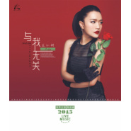

与我无关
============================

|  |  |
| :--: | :-- |
| [ 与我无关](https://emumo.xiami.com/album/1422928797) | **艺人**: [庄心妍](../index.md) **语种**: 国语 **唱片公司**: 致力音乐 **发行时间**: 2015年06月22日 **专辑类别**: 录音室专辑 **专辑风格**: 国语流行 Mandarin Pop **播放数**: 8952670 **收藏数**: 414 **评论数**: 34  |

## 简介

这一切，仿佛与你无关。  
但这一切，又与你有关。  
那么，有一种疗伤药，她叫庄心妍。  
那么，有那么一张心专辑你不得不听，因为疗伤的痊愈就是《与我无关》。  
  
完美收录《后来才发现》+《与我无关》+《差一点》  
华语流行音乐重新定义公式：心专辑+心音乐+心声音=庄心妍  
  
用歌声创造百万治愈能量，治愈千万听众的解药。  
疗伤系天后庄心妍，无论哪一种伤痛，她都能对症下药。  
聆听来自疗伤系天后庄心妍的声音，就是聆听我们自己曾经的点滴故事。  
  
致力音乐完美班底收录疗伤歌曲 再度冲击内地流行音乐！  
如果说她的声音感动了你 那么这张专辑不是新的，而是心的。  
  
【心专辑 疗伤药 庄心妍】  
如果说一些音乐是新的，如果说一张专辑是新的。那么我想，庄心妍的这一张新专辑不能叫做新的，而是心的。因为所有收录的歌曲，都是用心在演绎的。当然，这一种心的声音里，继续在夏季给我们带来了治疗。相比之前的音乐，或许多多少少的是一种小治愈的疗伤。那么这一张心的专辑，是庄心妍真真正正的开始走向华语乐坛成熟的疗伤方式了。我们或许可以在声音中找到那些过往的影子，但不得不说，当你听完整张心的专辑，你会发现，在庄心妍的音乐世界里，又增添了更多的是细腻。或许我们不该用成熟来形容，但我敢保证，你不得不听她那成熟却不失去以往的穿透力的声音。她的音乐能够让你忘记烦恼，忘记爱情、友情、亲情上的伤痛，特别是恋爱上给人带来的痛楚，听这些歌也许会笑，也许会哭，泪水能让人好受点。感情受挫后，听她的音乐是一种很好的情绪宣泄。伤感、悲情，本来就是爱情不可分割的一面，也是让爱情那般刻骨铭心的原因。她的歌曲里的疗伤，结合文字和音乐的双重催泪效果。煽情的文字及旋律，无法让人忘却。  
  
【心专辑 创造能量 治愈心灵】  
从筹备心专辑，再到完美收工，庄心妍都有参与所有的工作。不再像从前一样只是单单的演唱及演绎自己专辑中的作品那么简单。她要证明一件事情，她不光要用自己的声音来制造治愈的能量，她希望自己的行动，也可以制造出治愈的解药。同样也创造了她第一次参与录音后的工作，第一次在歌曲中体现大提琴的音色，第一次改变演绎方式，更细腻的处理歌曲情感。也正是有致力音乐这个完美的团队和坚不可摧的固定班底，再一次的用心专辑创造能量，治愈那些应该被治愈的心灵。  
  
【心专辑 心音乐 心声音】  
可以说这张《与我无关》专辑，将是对华语流行音乐专辑的定义改变，这也是真正近年来原创音乐上的又一重大事件。当你听这张心专辑时，你接触这些心音乐时，你会发现，心的声音越来越靠近了你自己，治愈了你自己。这张专辑《与我无关》也将用心重新定义许多我们未曾发现的为止的以后。就像我开始时那样说过一样：如果说她的声音感动了你，那么这张专辑不是新的，而是心的。

## 曲目

## 评论

|  |  |  |
| :-- | :-- | :-- |
|  [虾米用户](https://emumo.xiami.com/u/311445933) 你若盛开，清风自来，心若... 2017-08-25 10:09 赞(0) 踩(0) | 
,。。。
 |
|  [虾米用户](https://emumo.xiami.com/u/160146108)  2016-06-08 22:21 赞(2) 踩(0) | 
好赞 
 |
|  [虾米用户](https://emumo.xiami.com/u/454506) 我还没想好要写什么... 2016-04-16 09:02 赞(1) 踩(0) | 
喜欢这张的封面造型
 |
|  [虾米用户](https://emumo.xiami.com/u/33009066) 豬小小 2016-01-27 07:10 赞(1) 踩(0) | 
love
 |
|  [虾米用户](https://emumo.xiami.com/u/7322777) ∮ 2015-08-12 01:14 赞(1) 踩(0) | 
...A...
 |
|  [虾米用户](https://emumo.xiami.com/u/717688)  2015-08-07 21:41 赞(1) 踩(0) | 
庄心妍
 |
|  [虾米用户](https://emumo.xiami.com/u/29537993) 高山流水 2015-07-09 13:32 赞(1) 踩(0) | 
好听
 |
|  [虾米用户](https://emumo.xiami.com/u/4987911)  2015-06-27 00:36 赞(0) 踩(0) | 

 |
|  [虾米用户](https://emumo.xiami.com/u/46780791)   2015-05-06 15:45 赞(0) 踩(0) | 
好听
 |
|  [虾米用户](https://emumo.xiami.com/u/10975) 喜欢的人，都是心里有别人 2015-04-22 21:41 赞(0) 踩(0) | 
还是故作好听。
 |
| ⇒ |  [虾米用户](https://emumo.xiami.com/u/50290105) 暂无签名~ 2015-06-03 22:22 赞(0) 踩(0) | 
听着好吓人啊
 |
| ⇒ |  [虾米用户](https://emumo.xiami.com/u/10975) 喜欢的人，都是心里有别人 2015-06-03 22:27 赞(0) 踩(0) | 
<q><b>现在开始。说：</b></q>
 |
| ⇒ |  [虾米用户](https://emumo.xiami.com/u/50290105) 暂无签名~ 2015-06-03 22:28 赞(0) 踩(0) | 
<q><b>小明同学说：</b></q>
 |
| ⇒ |  [虾米用户](https://emumo.xiami.com/u/10975) 喜欢的人，都是心里有别人 2015-06-03 22:46 赞(0) 踩(0) | 
<q><b>现在开始。说：</b></q>
 |
| ⇒ |  [虾米用户](https://emumo.xiami.com/u/50290105) 暂无签名~ 2015-06-03 22:46 赞(0) 踩(0) | 
<q><b>小明同学说：</b></q>
 |
| ⇒ |  [虾米用户](https://emumo.xiami.com/u/10975) 喜欢的人，都是心里有别人 2015-06-03 23:25 赞(0) 踩(0) | 
<q><b>现在开始。说：</b></q>
 |
| ⇒ |  [虾米用户](https://emumo.xiami.com/u/50290105) 暂无签名~ 2015-06-03 23:27 赞(0) 踩(0) | 
<q><b>小明同学说：</b></q>
 |
| ⇒ |  [虾米用户](https://emumo.xiami.com/u/10975) 喜欢的人，都是心里有别人 2015-06-04 21:05 赞(0) 踩(0) | 
<q><b>现在开始。说：</b></q>
 |
| ⇒ |  [虾米用户](https://emumo.xiami.com/u/50290105) 暂无签名~ 2015-06-04 21:06 赞(0) 踩(0) | 
<q><b>小明同学说：</b></q>
 |
|  [虾米用户](https://emumo.xiami.com/u/40023314) 花凋鏡破，寄語若何。 2015-03-07 00:23 赞(1) 踩(0) | 
真心觉得上只砖还没听完 又来了。。
 |
| ⇒ |  [虾米用户](https://emumo.xiami.com/u/3771620) 多多听歌。 2015-03-16 10:20 赞(0) 踩(0) | 
哈哈哈哈哈哈哈哈哈
 |
|  [虾米用户](https://emumo.xiami.com/u/1418791) 浮躁 2015-03-06 22:37 赞(0) 踩(0) | 
头是被放大了吗…
 |
|  [虾米用户](https://emumo.xiami.com/u/8244559)  2015-03-06 09:37 赞(0) 踩(0) | 
******
 |
|  [虾米用户](https://emumo.xiami.com/u/12491471) 暂无签名~ 2015-03-05 16:17 赞(0) 踩(0) | 
这发专辑的速度也是醉了！
 |
|  [虾米用户](https://emumo.xiami.com/u/19120199)  2015-02-28 09:55 赞(0) 踩(0) | 
真心好听
 |
|  [虾米用户](https://emumo.xiami.com/u/46726251) 暂无签名~ 2015-02-15 23:27 赞(0) 踩(0) | 
好
 |
|  [虾米用户](https://emumo.xiami.com/u/46949577)  2015-02-14 05:47 赞(0) 踩(0) | 
不错，很喜欢。
 |
|  [虾米用户](https://emumo.xiami.com/u/10863300) 暮雨清寒 2015-02-11 22:14 赞(0) 踩(0) | 
不惊艳，但听着舒服，需要更好的歌曲来提高。
 |
|  [虾米用户](https://emumo.xiami.com/u/6689208) 那一臉憤慨風化失去。 2015-02-08 16:48 赞(0) 踩(0) | 
我的妍
 |
|  [虾米用户](https://emumo.xiami.com/u/30221225) 有梦的地方就是你卖命的理... 2015-02-04 22:38 赞(2) 踩(0) | 
依旧是那么熟悉的嗓音，深深的印在了心了！！
 |
|  [虾米用户](https://emumo.xiami.com/u/3877240)  2015-02-04 02:38 赞(0) 踩(0) | 
超愛妳! 好聽好聽~~~~
 |
|  [虾米用户](https://emumo.xiami.com/u/26839600) going home 2015-02-04 01:14 赞(0) 踩(0) | 
太好了
 |
|  [虾米用户](https://emumo.xiami.com/u/5015574) 暂无签名~ 2015-02-03 15:54 赞(0) 踩(0) | 
好听！
 |
|  [虾米用户](https://emumo.xiami.com/u/12777090)  2015-02-03 14:25 赞(0) 踩(0) | 
沙发支持。。。呵呵
 |
