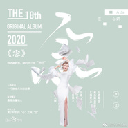
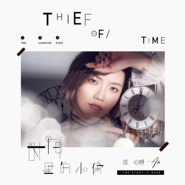
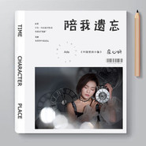
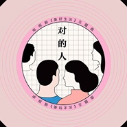

庄心妍
============================

|  |  |
| :--: | :-- |
| [ 庄心妍](https://i.xiami.com/zhuangxinyan) | **地区**: China 中国大陆 **风格**: 国语流行 Mandarin Pop **播放数**: 288199938 **粉丝数**: 459400 **评论数**: 1468  |

## 档案

小档案 
中   文    名：   庄心妍 
英   文    名：  Ada 
民           族：   汉族 
星           座：   摩羯座 
血           型：   O  型 
出    生   地：   广东省汕尾市陆丰区 
出生日期：   1993  年  1  月  9  日 
代表作品：   一万个舍不得、为情所伤、他说的谎、好可惜、以后的以后、不要在我的伤口撒盐 
简介 
庄心妍（  Ada  ），  1993  年  1  月  9  日出生于广东省汕尾市，中国内地女歌手，  2012  年与致力音乐签约成为旗下艺人。 
早年经历 
2004  年，一张来自  04  年超级女声冠军安又琪的唱片，让庄心妍开始喜欢并熟悉了音乐。  2007  年，经过自己的姐姐介绍一首来自卫诗”  Jill  “的歌曲《可可》，让她开始慢慢的对粤语歌曲有了感觉。随后参加了一大型商场举办的  K  歌比赛。 
最初开始接触的是  QQ  音乐，后喜欢上了用于“聊天”“唱歌”的语音软件，继而参加各种语音软件里面举行的小型  K  歌比赛，同时她也学会了录音，录好的歌就发布到原创音乐里面。后来从玩语音软件升级到了视频直播，每天在固定的时间段到视频网站进行网络直播。同时在直播的同时也会定期地把自己的翻唱歌曲发布到网站上，也就是因为自己在网站上的翻唱作品，被同样喜欢音乐而且还会作词作曲的朋友发现。后被致力音乐公司签约，成为歌手，签约之后发行了自己的首张  EP  《填密爱》。 
演艺经历 
2012  年  10  月  29  日，庄心妍发行单曲《一万个舍不得》，并在首发当日突破  300  万点击量。  2012  年  11  月  16  日，发行酷狗主题曲《繁星点点》。  12  月  11  日，发行歌曲《真的不容易》。 
2013  年  3  月  14  日，庄心妍受邀携专辑《一万个舍不得》做客爱拍原创访谈“遇见大明星”。  5  月  3  日，发行单曲《心有所爱》。  6  月  13  日，发行单曲《以后的以后》。  8  月  1  日，与冷漠共同发行歌曲《梦缠绵》。  11  月  26  日，发行个人第二张原创专辑《一直想着他》。    12  月  5  日，发行单曲《今天就要回家》。 
2014  年  1  月，携专辑《一直想着他》做客“星乐坊”。  1  月  22  日，参加在茶陵县影剧院举办的“朝阳之梦”春节联欢晚会。  3  月  22  日，发行第三张原创专辑《错爱情歌》。  4  月，与音乐人萧全共同推出了电子舞曲《爱音乐》。  4  月  26  日，与林依轮、杨臣刚、陶钰玉等明星参加在“商丘中原国际纺织服装商贸港”举办的群星演唱会。  5  月  23  日，参加在华南理工大学音乐厅举办的“清爽新声代”广州赛区表演赛。  6  月  28  日，发行第四张专辑《我知道》。  8  月  2  日，发行七夕歌曲《爱你就要嫁给你》。同年，歌曲《一万个舍不得》获得酷狗音乐年度最受欢迎彩铃金曲。  12  月  16  日，发行第五张专辑《好可惜》。 
2015  年  2  月  3  日，发行专辑《断了乱了》。  2015  年  5  月  6  日，发行歌曲《差一点》。  6  月，发布第六张专辑《与我无关》。  7  月  29  日，发行单曲《爱吹情散》。  8  月  12  日，发行单曲《爱情遗嘱》。  9  月  16  日，与富博洋共同发行歌曲《新霸王别姬》。  10  月  13  日，发行歌曲《走着走着就散了》。  2015  年  11  月，发布第七张专辑《放过自己》。  11  月  7  日，发行歌曲《三千痴缠》。  11  月  8  日，在沈阳铁西体育馆举办了自己的第一场个人演唱会。 
2016  年  1  月  5  日，在河北体育馆举办了第二站石家庄演唱会。  1  月  29  日，发行第八张原创专辑《我也许在等候》。同年，发行“甜妍蜜语”演唱会沈阳站  CD  。  3  月  12  日，在第三站大连举办“甜妍蜜语”演唱会。  3  月  24  日，与江映蓉参加深圳卫视综艺节目《为梦想加速》。  4  月  21  日，发行第九张专辑《做最好的我》。  7  月  8  日，与海哲明共同发行歌曲《有些情爱不能碰》。

## 专辑

| 名称 | 语种 | 唱片公司 | 发行时间 | 专辑类别 | 专辑风格 |
| :--: | :-- | :-- | :-- | :-- | :-- |
| [ 念](./albums/5021174897.md) | 国语 | 致力文化 | 2020年07月03日 | EP, 单曲 |  |
| [ 时间里的小偷](./albums/2108287391.md) | 国语 | 致力音乐 | 2020年03月27日 | 录音室专辑 | 拉丁流行 Latin Pop |
| [ 陪我遗忘](./albums/2106094592.md) | 国语 | 致力音乐 | 2020年02月21日 |  | 流行 Pop |
| [ 静好岁月](./albums/2104815912.md) | 国语 | 光线影业 | 2019年04月26日 | 原声带, 影视音乐 | 电影原声 Film Score |
| [ 心有所爱](./albums/2105975556.md) | 英语 | 致力音乐 | 2019年04月19日 | 录音室专辑 | 欧美流行 Western Pop |
| [ 说再见就好](./albums/2105172090.md) | 国语 | 霍尔果斯致力文化 | 2019年03月08日 | 录音室专辑 |  |
| [ 孤单坠爱](./albums/2105975884.md) | 英语 | 致力音乐 | 2019年01月11日 | EP, 单曲 | 欧美流行 Western Pop |
| [ 以后的以后](./albums/2105995746.md) | 国语 | 致力音乐 | 2019年01月10日 | EP, 单曲 | 国语流行 Mandarin Pop |
| [ 放过自己再见只是陌生人](./albums/2105972133.md) | 国语 | 致力音乐 | 2019年01月10日 | 精选集 | 国语流行 Mandarin Pop |
| [ 好可惜](./albums/2108231854.md) | 其他 | 致力音乐 | 2019年01月10日 | EP, 单曲 | 欧美流行 Western Pop |
| [ 一万个舍不得](./albums/2105975044.md) | 英语 | 致力音乐 | 2019年01月04日 | EP, 单曲 | 欧美流行 Western Pop |
| [ 彻底](./albums/2104443859.md) | 国语 | 霍尔果斯致力文化 | 2019年01月03日 | 录音室专辑 | 国语流行 Mandarin Pop |
| [ 想不到](./albums/2104195128.md) | 国语 | 霍尔果斯致力文化 | 2018年11月09日 | EP, 单曲 | 国语流行 Mandarin Pop |
| [ 一刻十年](./albums/2104200365.md) | 国语 | 霍尔果斯致力文化 | 2018年10月26日 | EP, 单曲 |  |
| [ 太早](./albums/2104200372.md) | 国语 | 霍尔果斯致力文化 | 2018年10月19日 | EP, 单曲 |  |
| [ 彻底](./albums/2104120246.md) | 国语 | 霍尔果斯致力文化 | 2018年10月12日 | EP, 单曲 |  |
| [ 爱能有多好](./albums/2103714990.md) | 国语 | 霍尔果斯致力文化 | 2018年05月20日 | 录音室专辑 | 国语流行 Mandarin Pop |
| [ 对的人](./albums/2103561315.md) | 国语 | 谭旋音乐工作室 | 2018年02月26日 | EP, 单曲 |  |
| [ 梦诛缘 · 忆暖冬](./albums/2102885672.md) | 国语 | 腾讯游戏 | 2017年10月30日 | EP, 单曲 | 国语流行 Mandarin Pop, 中国风 China-Wave |
| [ 迷](./albums/2102884124.md) | 国语 | 致力音乐 | 2017年10月27日 | 录音室专辑 | 国语流行 Mandarin Pop |
| [ 一人一城](./albums/2102865391.md) | 国语 | 致力音乐 | 2017年09月29日 | EP, 单曲 | 国语流行 Mandarin Pop |
| [ 再遇不到你这样的人](./albums/2102853159.md) | 国语 | 禾信科技 | 2017年09月08日 | EP, 单曲 | 国语流行 Mandarin Pop |
| [ 再遇不到你这样的人](./albums/2102765801.md) | 国语 | 禾信科技 | 2017年06月15日 | EP, 单曲 | 国语流行 Mandarin Pop |
| [ 从心出发](./albums/2102728254.md) | 国语 | 致力音乐 | 2017年04月07日 | 录音室专辑 | 国语流行 Mandarin Pop |
| [ Touch Of Love](./albums/2100390340.md) | 国语 | 致力音乐 | 2016年11月25日 | 录音室专辑 | 国语流行 Mandarin Pop |
| [ 再给我一些勇气](./albums/2100380744.md) | 国语 | 致力音乐 | 2016年08月19日 | EP, 单曲 | 国语流行 Mandarin Pop |
| [ 有些情爱不能碰](./albums/2100373868.md) | 国语 | 致力音乐 | 2016年07月27日 | EP, 单曲 | 国语流行 Mandarin Pop |
| [ 做最好的我](./albums/2100319234.md) | 国语 | 致力音乐 | 2016年04月28日 | 录音室专辑 | 国语流行 Mandarin Pop |
| [ 守望地球](./albums/2100308638.md) | 国语 | 致力音乐 | 2016年04月08日 | EP, 单曲 | 国语流行 Mandarin Pop |
| [ 甜妍蜜语演唱会](./albums/2100291176.md) | 国语 | 致力音乐 | 2016年03月11日 | 现场专辑 | 国语流行 Mandarin Pop |
| [ 我也许在等候](./albums/2100250644.md) | 国语 | 致力音乐 | 2016年02月05日 | 录音室专辑 | 国语流行 Mandarin Pop |
| [ 三千痴缠](./albums/2100238330.md) | 国语 | 致力音乐 | 2015年11月17日 | EP, 单曲 | 国语流行 Mandarin Pop |
| [ 放过自己](./albums/2100233012.md) | 国语 | 致力音乐 | 2015年11月05日 | 录音室专辑 | 国语流行 Mandarin Pop |
| [ 一万个舍不得](./albums/2100221430.md) | 国语 | 致力音乐 | 2015年10月16日 | EP, 单曲 | 国语流行 Mandarin Pop |
| [ 走着走着就散了](./albums/2100218152.md) | 国语 | 致力音乐 | 2015年10月13日 | EP, 单曲 | 国语流行 Mandarin Pop |
| [ 新霸王别姬](./albums/2100201066.md) | 国语 | 致力音乐 | 2015年09月16日 | EP, 单曲 | 国语流行 Mandarin Pop |
| [ 想你伤口会疼](./albums/2100196902.md) | 国语 | 致力音乐 | 2015年09月11日 | EP, 单曲 | 国语流行 Mandarin Pop |
| [ 与我无关](./albums/1422928797.md) | 国语 | 致力音乐 | 2015年06月22日 | 录音室专辑 | 国语流行 Mandarin Pop |
| [ 好可惜](./albums/1713366753.md) | 国语 | 致力音乐 | 2014年12月16日 | 录音室专辑 | 国语流行 Mandarin Pop |
| [ 我知道](./albums/1504099860.md) | 国语 | 致力音乐 | 2014年06月28日 | 录音室专辑 | 国语流行 Mandarin Pop |
| [ 摇摆 舞曲合集](./albums/599863110.md) | 国语 | 致力音乐 | 2014年05月12日 | 精选集 | 国语流行 Mandarin Pop |
| [ 错爱情歌](./albums/368670734.md) | 国语 | 冒牌音乐 | 2014年03月22日 | 录音室专辑 | 国语流行 Mandarin Pop |
| [ 喜气盈门](./albums/1389595277.md) | 国语 | 致力音乐 | 2014年01月03日 | EP, 单曲 | 国语流行 Mandarin Pop |
| [ 一直想着他](./albums/285436696.md) | 国语 | 海蝶音乐, 致力音乐 | 2013年11月26日 | 录音室专辑 | 国语流行 Mandarin Pop |
| [ 一万个舍不得](./albums/1362529739.md) | 国语 | 致力音乐 | 2013年03月15日 | 录音室专辑 | 国语流行 Mandarin Pop |

## 评论

|  |  |  |
| :-- | :-- | :-- |
|  [虾米用户](https://emumo.xiami.com/u/169824892) ROG;BGM 2021-01-24 13:44 赞(0) 踩(0) | 
喜欢你的音乐，也喜欢你的颜！会一直爱你的！
 |
|  [虾米用户](https://emumo.xiami.com/u/442319257) 这个人很懒什么都没有留下 2021-01-22 12:23 赞(0) 踩(0) | 
⏰叮～今天是个特别的日子
 |
|  [虾米用户](https://emumo.xiami.com/u/406679119) 越努力越幸运 2021-01-12 17:36 赞(0) 踩(0) | 
有认真帮你多许几个愿望
 |
|  [虾米用户](https://emumo.xiami.com/u/44080851) 就一个字   爱 2021-01-10 23:35 赞(0) 踩(0) | 
我在找一首讲述白蛇传的歌，
 |
|  [虾米用户](https://emumo.xiami.com/u/446589094)  2021-01-09 23:21 赞(0) 踩(0) | 
祝你快乐，不止生日❤
 |
|  [虾米用户](https://emumo.xiami.com/u/446514920)  2021-01-09 20:36 赞(1) 踩(0) | 
今天因你而特别
 |
|  [虾米用户](https://emumo.xiami.com/u/376491577)  2021-01-09 06:29 赞(1) 踩(0) | 
天空飘来五个字，偶像过生日
 |
|  [虾米用户](https://emumo.xiami.com/u/133970104) Music has no... 2021-01-09 04:12 赞(1) 踩(0) | 
带给我快乐的人 一定要双倍快乐
 |
|  [虾米用户](https://emumo.xiami.com/u/439874814)  2021-01-02 06:48 赞(0) 踩(0) | 
崇拜的女神
 |
|  [虾米用户](https://emumo.xiami.com/u/279792500) 艹，虾米撑住啊我最喜欢的... 2020-12-27 20:49 赞(1) 踩(0) | 
加油庄心妍，你的歌都很好听，你会被看到的！
 |
|  [虾米用户](https://emumo.xiami.com/u/309024793)  2020-11-14 11:11 赞(1) 踩(0) | 
ada还很年轻，继续加油，你会很棒的
 |
|  [虾米用户](https://emumo.xiami.com/u/342925685) 我只想静静聆听一首歌 2020-10-05 23:23 赞(1) 踩(0) | 
以后的以后 伤感之余后的感动 谢谢你庄心妍 有这么好的作品
 |
|  [虾米用户](https://emumo.xiami.com/u/4346767) Whale Song 2020-09-14 19:02 赞(1) 踩(0) | 
经历好励志啊，简单的描述后面应该有满满的不易，一路打怪升级到现在。祝愿今后越来越好。支持，加油！
 |
|  [虾米用户](https://emumo.xiami.com/u/410751837)  2020-09-10 05:31 赞(1) 踩(0) | 
用心唱歌
 |
|  [虾米用户](https://emumo.xiami.com/u/444613969)  2020-09-04 02:02 赞(1) 踩(0) | 
@庄心妍，喜欢你的歌，继续前行，一定会大红大紫飞黄腾达的！
 |
|  [虾米用户](https://emumo.xiami.com/u/429296040)  2020-08-20 22:32 赞(1) 踩(0) | 
最新评论
 |
|  [虾米用户](https://emumo.xiami.com/u/245466)  2020-07-25 03:58 赞(2) 踩(0) | 
可惜了，出道关注到现在，最早一批虾米用户，那时还不是阿里，被收购很多人离开了，我也一直停留那个时刻，也很久没有登录了，后来女儿名字和你一样了，铁粉吧！喜欢那些有你声线陪伴的岁月，真的是一起变老了了！
 |
|  [虾米用户](https://emumo.xiami.com/u/351277425)  2020-06-20 03:57 赞(1) 踩(0) | 
旋律很有故事，记录心情，爱就在那里淡淡的
 |
|  [虾米用户](https://emumo.xiami.com/u/257667868)  2020-06-04 21:20 赞(0) 踩(0) | 
劳模姐
 |
|  [虾米用户](https://emumo.xiami.com/u/83964128) 誓死捍卫铲屎官的荣耀！ 2020-04-19 13:36 赞(1) 踩(0) | 
潮汕的歌手，非常难得啊，普通话能那么标准 
 |
|  [虾米用户](https://emumo.xiami.com/u/15985582)  2020-04-12 21:20 赞(0) 踩(0) | 
是你放弃了虾米还是虾米放弃了你？
 |
|  [虾米用户](https://emumo.xiami.com/u/442008430)  2020-04-06 21:39 赞(0) 踩(0) | 

 |
|  [虾米用户](https://emumo.xiami.com/u/441609779)  2020-04-02 07:05 赞(2) 踩(0) | 
喜欢
 |
|  [虾米用户](https://emumo.xiami.com/u/352240359)  2020-03-05 09:35 赞(2) 踩(0) | 
最喜欢的歌手，没有之一
 |
|  [虾米用户](https://emumo.xiami.com/u/333484162) 每天开心一点！成长一点！ 2020-02-25 23:24 赞(2) 踩(0) | 
喜欢听
 |
|  [虾米用户](https://emumo.xiami.com/u/286652625)  2020-02-16 11:17 赞(2) 踩(0) | 
继续出新歌吧，期待你火起来的样子。
 |
|  [虾米用户](https://emumo.xiami.com/u/339801727) 与虾米分离在即，纵有千般... 2020-01-13 23:10 赞(2) 踩(0) | 
庄心妍唱的就是有味道。
 |
|  [虾米用户](https://emumo.xiami.com/u/432657453) (￣Q～Q￣)3024 ... 2019-12-30 16:00 赞(3) 踩(0) | 
第一首歌，一万个舍不得
 |
|  [虾米用户](https://emumo.xiami.com/u/411304111) 岁月如歌，你低吟浅唱，我... 2019-09-23 17:56 赞(3) 踩(0) | 
庄心妍这名字，我上个年级那个班的语文课代表就叫庄心妍 
 |
|  [虾米用户](https://emumo.xiami.com/u/407735911)  2019-09-09 22:34 赞(1) 踩(0) | 
难道又又我去企鹅那交费?
 |
|  [虾米用户](https://emumo.xiami.com/u/411846849) 谢谢你那么认真的让我难过... 2019-08-18 15:17 赞(3) 踩(0) | 
嗯嗯，为自己现在拥有的知足，不要太贪心，何必让自己的❤️受到煎熬，何必让自己活的不快乐！自找的难受记得不要告诉别人。。。。。。。。。。。。
 |
|  [虾米用户](https://emumo.xiami.com/u/426311286) 能遇到你，是我最幸运的事 2019-07-08 18:59 赞(4) 踩(0) | 
我很喜欢你的歌 
 |
|  [虾米用户](https://emumo.xiami.com/u/404026779)  2019-06-27 11:20 赞(0) 踩(0) | 
好
 |
|  [虾米用户](https://emumo.xiami.com/u/11342331) 如是我闻 2019-06-08 04:17 赞(3) 踩(0) | 
怎么不来虾米了？
 |
|  [虾米用户](https://emumo.xiami.com/u/412286109)  2019-05-31 22:43 赞(3) 踩(0) | 
你的歌曲最爱的一首
 |
|  [虾米用户](https://emumo.xiami.com/u/323114716) 『 生活如雨，请撑伞原谅... 2019-05-30 22:30 赞(2) 踩(0) | 
顶上去啊~~什么时候才有版权？？
 |
|  [虾米用户](https://emumo.xiami.com/u/2796166) 最爱莫文蔚..... 2019-05-01 00:28 赞(2) 踩(0) | 
加油~~~~
 |
|  [虾米用户](https://emumo.xiami.com/u/412286109)  2019-04-28 07:04 赞(2) 踩(0) | 
好，我喜欢听你唱歌的心情与无奈，加油
 |
|  [虾米用户](https://emumo.xiami.com/u/405907487)  2019-04-18 23:11 赞(2) 踩(0) | 
咪咕拿了版权
 |
|  [虾米用户](https://emumo.xiami.com/u/422646317) 樱花美丽心情好 2019-04-11 09:27 赞(4) 踩(0) | 
庄心妍以后推荐新歌记着提醒我谢谢啦庄心妍爱你  
 |
|  [虾米用户](https://emumo.xiami.com/u/422966633)  2019-04-08 08:01 赞(1) 踩(0) | 
为什么虾米音乐人，听不了她的歌，谁来给我解释一下
 |
|  [虾米用户](https://emumo.xiami.com/u/8832213) 我还没想好要写什么... 2019-04-04 02:05 赞(4) 踩(0) | 
庄心妍是虾米音乐人，但虾米没有她的版权啊，这就尴尬了。
 |
| ⇒ |  [虾米用户](https://emumo.xiami.com/u/339801727) 与虾米分离在即，纵有千般... 2020-01-13 23:05 赞(0) 踩(0) | 
一万个舍不得怎么播放不了？
 |
|  [虾米用户](https://emumo.xiami.com/u/11576254) 最喜欢听虾米音乐了，哈哈 2019-03-24 23:18 赞(1) 踩(0) | 
什么歌都听不了
 |
|  [虾米用户](https://emumo.xiami.com/u/40096737)  2019-03-17 02:41 赞(1) 踩(0) | 
可惜了，这么多好听的歌就是没在虾米找到
 |
|  [虾米用户](https://emumo.xiami.com/u/421131099)  2019-03-14 19:51 赞(1) 踩(0) | 
你的歌很好听，我很喜欢
 |
|  [虾米用户](https://emumo.xiami.com/u/420645316) 我还没想好要写什么... 2019-03-09 16:57 赞(0) 踩(0) | 
以后的以后，这首歌是我喝酒最爱听的歌！尤其是在一个人在楼顶带着耳塞喝着啤酒，感觉世界真的是我的了！
 |
|  [虾米用户](https://emumo.xiami.com/u/420521274) 音乐让生活更美好！ 2019-03-08 15:01 赞(1) 踩(0) | 
我最喜欢的是《繁星点点》这首歌，反正就不知道为什么，贼好听！
 |
|  [虾米用户](https://emumo.xiami.com/u/358104299) 悲观的唯心存在现实解构虚... 2019-03-07 04:21 赞(0) 踩(0) | 
10217
 |
|  [虾米用户](https://emumo.xiami.com/u/361059089)  2019-02-18 19:20 赞(0) 踩(0) | 
没想到那么年轻
 |
|  [虾米用户](https://emumo.xiami.com/u/45218895) 萨瓦迪卡 2019-02-17 11:31 赞(0) 踩(0) | 
    
 |
|  [虾米用户](https://emumo.xiami.com/u/379460251) 我是木兰，请多指教 2019-02-12 16:37 赞(0) 踩(0) | 
你的歌很好听，我超级喜欢听你的歌，你就是我的骄傲
 |
|  [虾米用户](https://emumo.xiami.com/u/418897840) 待到山花烂漫时，她在丛中... 2019-02-12 12:32 赞(0) 踩(0) | 
你的歌好听！♥♥♥
 |
|  [虾米用户](https://emumo.xiami.com/u/317514239)   2019-01-26 10:24 赞(2) 踩(0) | 
爱你不只两三年哦！
 |
|  [虾米用户](https://emumo.xiami.com/u/347913934) 我还没想好要写什么... 2019-01-20 21:08 赞(2) 踩(0) | 
虾米音乐没几首你的歌的？
 |
|  [虾米用户](https://emumo.xiami.com/u/347913934) 我还没想好要写什么... 2019-01-20 21:08 赞(1) 踩(0) | 
虾米音乐没几首你的歌的？
 |
|  [虾米用户](https://emumo.xiami.com/u/46847110)  2019-01-14 23:10 赞(1) 踩(0) | 
听的第一首歌是一万个舍不得，喜欢！
 |
|  [虾米用户](https://emumo.xiami.com/u/30777859) 随心所听 2019-01-11 18:09 赞(1) 踩(0) | 
喜欢你，没道理！      
 |
|  [虾米用户](https://emumo.xiami.com/u/376519940)  2018-12-31 20:54 赞(1) 踩(0) | 
再听已是曲中人
 |
|  [虾米用户](https://emumo.xiami.com/u/332621860) 好听的歌都tell me... 2018-12-28 00:01 赞(1) 踩(0) | 
祝福你越来越好，我很喜欢你的歌啊小姐姐
 |
|  [虾米用户](https://emumo.xiami.com/u/52364266)  2018-12-27 12:41 赞(1) 踩(0) | 
加油！胶己人
 |
|  [虾米用户](https://emumo.xiami.com/u/411164895)  2018-12-26 21:27 赞(2) 踩(0) | 
好听
 |
|  [虾米用户](https://emumo.xiami.com/u/411074788)  2018-12-23 09:46 赞(3) 踩(0) | 
我想知道版权都在哪里  这都已经是我换的第四个软件了 还是没有版权
 |
|  [虾米用户](https://emumo.xiami.com/u/373822436) 只有输得起.. 你才赢得... 2018-12-21 05:08 赞(1) 踩(0) | 
超喜欢听你的歌，但这app感觉越来越差，很多喜欢的歌都不能听。  
 |
|  [虾米用户](https://emumo.xiami.com/u/25593875)  2018-12-18 07:28 赞(0) 踩(0) | 
自从收费了，有许多歌手都被经济公司出卖了，即使唱的再好，没人听，有什么用！还有影视也是，贾跃亭，滚回来！全面支持听歌不收费，下歌收费！
 |
|  [虾米用户](https://emumo.xiami.com/u/374249141)  2018-12-15 08:36 赞(0) 踩(0) | 
你的声音带给我很多感动
 |
|  [虾米用户](https://emumo.xiami.com/u/403535577)  2018-12-10 04:42 赞(0) 踩(0) | 
真的不错哦
 |
|  [虾米用户](https://emumo.xiami.com/u/339801727) 与虾米分离在即，纵有千般... 2018-11-30 22:26 赞(0) 踩(0) | 
为情所伤是我最爱
 |
|  [虾米用户](https://emumo.xiami.com/u/20129882) 过去进行时 2018-11-23 18:09 赞(0) 踩(0) | 
加油加油，多出点新歌吧
 |
|  [虾米用户](https://emumo.xiami.com/u/346937433)  2018-11-16 19:34 赞(0) 踩(0) | 
我比你小两岁呢听姐姐唱的歌很不错
 |
|  [虾米用户](https://emumo.xiami.com/u/346937433)  2018-11-16 19:33 赞(0) 踩(0) | 
第一次听你的曲子是一万个舍不得倒是DJ版挺好听的听得出来你是认真的一心一意的唱挺好听的 
 |
|  [虾米用户](https://emumo.xiami.com/u/286852275)  2018-11-13 16:46 赞(0) 踩(0) | 
好走心的歌！！！
 |
|  [虾米用户](https://emumo.xiami.com/u/11893882)   2018-11-09 13:55 赞(0) 踩(0) | 
同一个地方的，为你自豪！加油   
 |
|  [虾米用户](https://emumo.xiami.com/u/342219397)  2018-11-07 20:36 赞(0) 踩(0) | 
怎么没有DJ版梦缠绵啊心妍 
 |
|  [虾米用户](https://emumo.xiami.com/u/320205386)  2018-11-07 00:37 赞(0) 踩(0) | 
真的好好听啊！没想到还是个90后美女         
 |
|  [虾米用户](https://emumo.xiami.com/u/357538725)  2018-11-04 23:03 赞(0) 踩(0) | 
昨晚湛江演唱会路转粉，实力歌手！
 |
|  [虾米用户](https://emumo.xiami.com/u/8832213) 我还没想好要写什么... 2018-11-04 01:30 赞(0) 踩(0) | 
很喜欢你的嗓音，今晚听了你的演唱会（20181103湛江奥体演唱会，我坐在VIP4排）后就更加喜欢了，从晚上八点唱到十一点。是个实力派歌手！
 |
|  [虾米用户](https://emumo.xiami.com/u/8832213) 我还没想好要写什么... 2018-11-04 01:27 赞(0) 踩(0) | 
虾米现在没有庄心妍的版权了   
 |
|  [虾米用户](https://emumo.xiami.com/u/74393642) 听听音乐放松自己 2018-10-25 12:20 赞(2) 踩(0) | 
支持我们汕尾女星
 |
|  [虾米用户](https://emumo.xiami.com/u/378648707) 生活简约而不简单 2018-10-06 17:15 赞(0) 踩(0) | 
你的歌曲每一首都那么有魔力，听了会上瘾 
 |
|  [虾米用户](https://emumo.xiami.com/u/376787936)  2018-09-29 23:48 赞(0) 踩(0) | 
为什么那么多歌曲都没有了，
 |
|  [虾米用户](https://emumo.xiami.com/u/401989745)  2018-08-19 09:23 赞(0) 踩(0) | 
祝你越来越6
 |
|  [虾米用户](https://emumo.xiami.com/u/349214370)  2018-08-07 20:45 赞(0) 踩(0) | 
长治的演唱会很成功，祝你在音乐的路上越走越好，非常喜欢你唱的歌！！！
 |
|  [虾米用户](https://emumo.xiami.com/u/379968058)  2018-08-03 11:19 赞(0) 踩(0) | 
      
 |
|  [虾米用户](https://emumo.xiami.com/u/293692544) 你敢给我说话吗？我咬你 2018-08-01 05:20 赞(1) 踩(0) | 
好听
 |
|  [虾米用户](https://emumo.xiami.com/u/37606153) 倾听心灵的声音，感受大自... 2018-07-28 23:59 赞(4) 踩(0) | 
小庄加油，期待你的新作。很喜欢你的歌。
 |
|  [虾米用户](https://emumo.xiami.com/u/298991608) 听着音乐去旅行 2018-07-25 20:48 赞(2) 踩(0) | 
你的声音带给我很多感动
 |
|  [虾米用户](https://emumo.xiami.com/u/355777546)  2018-07-23 16:46 赞(2) 踩(0) | 
歌都不给听了，都是伴 
 |
|  [虾米用户](https://emumo.xiami.com/u/357074398)  2018-07-20 15:03 赞(1) 踩(0) | 
喜欢听你的歌，去年开始听了再见只是陌生人之后，你的每首歌我都基本上都听过。喜欢你   
 |
|  [虾米用户](https://emumo.xiami.com/u/378643552) 伪00的哥哥仔 2018-07-19 12:43 赞(2) 踩(0) | 
才女
 |
|  [虾米用户](https://emumo.xiami.com/u/336516835) 来是偶然，走是必然。你我... 2018-07-11 15:04 赞(1) 踩(0) | 
......Look back on your life, making us the pain, not failure, but no experience everything I want to experience.~回首人生，最使得我们痛的，不是失败，而是没有经历我所想要经历的一切。来是偶然，走是必然～出生✪死亡。你我都在路上&amp;hellip;&amp;hellip;欢乐只是记忆，痛苦也只是记忆，一切都只是记忆，让我们慢慢地回忆&amp;hellip;&amp;hellip;愿那些灵魂的深处依然&amp;hellip;&amp;hellip;
 |
|  [虾米用户](https://emumo.xiami.com/u/11342331) 如是我闻 2018-07-06 07:10 赞(1) 踩(0) | 
喜欢你，喜欢你的歌。但愿你有更多经典面世！
 |
|  [虾米用户](https://emumo.xiami.com/u/35476595)  2018-07-01 12:43 赞(1) 踩(0) | 
怎呢那么多伴奏？？？版权？？？？、
 |
|  [虾米用户](https://emumo.xiami.com/u/267815933) 跟着音乐走 2018-06-28 01:19 赞(1) 踩(0) | 
希望有天能在虾米收听你的所有歌曲
 |
|  [虾米用户](https://emumo.xiami.com/u/288266954)  2018-06-26 22:48 赞(1) 踩(0) | 

 |
|  [虾米用户](https://emumo.xiami.com/u/288266954)  2018-06-26 22:48 赞(1) 踩(0) | 

 |
|  [虾米用户](https://emumo.xiami.com/u/339801727) 与虾米分离在即，纵有千般... 2018-06-26 00:08 赞(1) 踩(0) | 
好听，喜欢
 |
|  [虾米用户](https://emumo.xiami.com/u/53587777) Да не говори... 2018-06-22 21:15 赞(25) 踩(0) | 
好端端的一个华语女声，被硬生生的包装成了清仓大甩卖一样的存在。可惜。
 |
|  [虾米用户](https://emumo.xiami.com/u/376120609) QQ 130513116... 2018-06-20 03:55 赞(1) 踩(0) | 
这首歌我的最爱。
 |
|  [虾米用户](https://emumo.xiami.com/u/285481594)  2018-06-18 14:40 赞(4) 踩(0) | 
听着再见只是陌生人，边听边哭，经常都是无限次单曲循环！越听越伤心，不听，悲伤就没有发泄的方式了！
 |
|  [虾米用户](https://emumo.xiami.com/u/253023341) 命里有时终须有，命里无时... 2018-06-10 23:40 赞(16) 踩(0) | 
版权呢马老板
 |
|  [虾米用户](https://emumo.xiami.com/u/322372011)  2018-06-08 13:07 赞(1) 踩(0) | 
歌呢？
 |
|  [虾米用户](https://emumo.xiami.com/u/240145765) Beaman. 2018-06-06 10:08 赞(4) 踩(0) | 
版权版权啊，庄心妍 快回来虾米音乐吧   
 |
|  [虾米用户](https://emumo.xiami.com/u/189914900)  2018-06-04 21:11 赞(3) 踩(0) | 
人长得好看歌唱的好听女神 
 |
|  [虾米用户](https://emumo.xiami.com/u/352403784) 追求人生最高境界！ 2018-06-04 13:43 赞(1) 踩(0) | 
国外好多男孩女孩特別愛听庄心妍的DJ歌曲！我和身邊的賽車手都愛聼她的歌！
 |
|  [虾米用户](https://emumo.xiami.com/u/54755399)  2018-06-02 20:05 赞(1) 踩(0) | 
庄心妍关心妍傻傻分不清楚
 |
|  [虾米用户](https://emumo.xiami.com/u/359868482)  2018-06-01 19:22 赞(0) 踩(0) | 
怎么她的歌几乎没有啊
 |
|  [虾米用户](https://emumo.xiami.com/u/302166398)  2018-06-01 01:08 赞(0) 踩(0) | 
我心里最好的女歌手，很多歌能唱出我心底的共鸣
 |
|  [虾米用户](https://emumo.xiami.com/u/217716373) 我还没想好要写什么... 2018-05-28 14:29 赞(0) 踩(0) | 
不过唱的好，唯有这首歌吸引我了、谢谢
 |
|  [虾米用户](https://emumo.xiami.com/u/2389373)  2018-05-27 12:29 赞(0) 踩(0) | 
有版权的歌越来越少。。
 |
|  [虾米用户](https://emumo.xiami.com/u/309388046)  2018-05-22 12:56 赞(0) 踩(0) | 
好喜欢你
 |
|  [虾米用户](https://emumo.xiami.com/u/14560381)  2018-05-22 10:06 赞(0) 踩(0) | 
Cued78
 |
|  [虾米用户](https://emumo.xiami.com/u/14560381)  2018-05-22 10:05 赞(0) 踩(0) | 
Jfg v
 |
|  [虾米用户](https://emumo.xiami.com/u/366523250)  2018-05-15 19:33 赞(1) 踩(0) | 
为什么没有错过的花季
 |
|  [虾米用户](https://emumo.xiami.com/u/319738331) 我还没想好要写什么... 2018-05-15 17:20 赞(1) 踩(0) | 
怎么啥歌都没有
 |
|  [虾米用户](https://emumo.xiami.com/u/357059904)  2018-05-12 22:44 赞(1) 踩(0) | 
期待新作品^~^
 |
|  [虾米用户](https://emumo.xiami.com/u/44729081) Rambo 2018-05-10 19:30 赞(1) 踩(0) | 
天呐，刚刚又更新一批，纷纷下架了！！！完蛋&amp;hellip;&amp;hellip;
 |
|  [虾米用户](https://emumo.xiami.com/u/354797441) 听歌是一种享受 2018-05-10 07:09 赞(2) 踩(0) | 
喜欢你，喜欢你所有的歌，加油女神
 |
|  [虾米用户](https://emumo.xiami.com/u/364823747)  2018-05-08 20:22 赞(1) 踩(0) | 
庄心妍好美啊   
 |
|  [虾米用户](https://emumo.xiami.com/u/364651741)  2018-05-08 12:15 赞(1) 踩(0) | 
你唱的歌很好听。
 |
|  [虾米用户](https://emumo.xiami.com/u/279311596)  2018-05-07 22:22 赞(2) 踩(0) | 
真的好听！只有有故事的人才能唱出真感情。 
 |
|  [虾米用户](https://emumo.xiami.com/u/328759291)  2018-05-06 08:31 赞(1) 踩(0) | 
你唱歌真挺好听的。
 |
|  [虾米用户](https://emumo.xiami.com/u/326471422)  2018-05-05 06:51 赞(2) 踩(0) | 
女神女神mua～
 |
| ⇒ |  [虾米用户](https://emumo.xiami.com/u/364823747)  2018-05-08 20:23 赞(0) 踩(0) | 
赞同你的说的话
 |
|  [虾米用户](https://emumo.xiami.com/u/35062303) 一个喜欢唱歌的小女孩 2018-05-01 17:37 赞(1) 踩(0) | 
又来听歌啦  就是好听！
 |
|  [虾米用户](https://emumo.xiami.com/u/361636435) 霸道总裁！ 2018-05-01 14:38 赞(1) 踩(0) | 
 
 |
|  [虾米用户](https://emumo.xiami.com/u/358252350)  2018-04-30 21:15 赞(1) 踩(0) | 
炎炎夏日 六月夏日祝你开开心心    
 |
|  [虾米用户](https://emumo.xiami.com/u/270866136) 生命不息，摇滚不止 2018-04-30 18:40 赞(1) 踩(0) | 
才知道她是93年的，同样是93年的如今还是一事无成。
 |
|  [虾米用户](https://emumo.xiami.com/u/313340045)  2018-04-30 15:55 赞(4) 踩(0) | 
庄心妍的歌就是好听。。。
 |
|  [虾米用户](https://emumo.xiami.com/u/260805422) 天青色等烟雨 2018-04-30 10:55 赞(1) 踩(0) | 
期待 耳听爱情  什么时候才上虾米啊？
 |
|  [虾米用户](https://emumo.xiami.com/u/359492275)  2018-04-30 00:40 赞(1) 踩(0) | 
好听！
 |
|  [虾米用户](https://emumo.xiami.com/u/355632883)  2018-04-29 09:04 赞(3) 踩(0) | 
    
 |
|  [虾米用户](https://emumo.xiami.com/u/361272424)  2018-04-28 16:34 赞(2) 踩(0) | 
歌曲很好听，很入心   
 |
|  [虾米用户](https://emumo.xiami.com/u/259354432) 无以伦比，为杰沉沦 2018-04-28 09:21 赞(3) 踩(0) | 
喜欢女歌手不多，心妍是我最爱的女歌手之一
 |
|  [虾米用户](https://emumo.xiami.com/u/357682465)  2018-04-27 21:10 赞(2) 踩(0) | 
美好的旋律，优美动听的歌声，喜欢！
 |
|  [虾米用户](https://emumo.xiami.com/u/293692544) 你敢给我说话吗？我咬你 2018-04-27 05:18 赞(2) 踩(0) | 
好听
 |
|  [虾米用户](https://emumo.xiami.com/u/206811636) 笔芯 2018-04-25 23:20 赞(2) 踩(0) | 
爱你
 |
|  [虾米用户](https://emumo.xiami.com/u/32786465)  2018-04-23 01:17 赞(2) 踩(0) | 
要是能上一次歌手，估计会跟邓一样大红大紫吧。假如歌手还能继续举办下去。。
 |
| ⇒ |  [虾米用户](https://emumo.xiami.com/u/17270255)  2018-04-30 07:47 赞(0) 踩(0) | 
歌手和好声音一样，看的是飙高音。。。。
 |
|  [虾米用户](https://emumo.xiami.com/u/359889952)  2018-04-23 00:58 赞(2) 踩(0) | 
嗯嗯熊出没，不要睡觉啊，我陪我先做铃声吧，好多人排的
 |
|  [虾米用户](https://emumo.xiami.com/u/316976555) 我还没想好要写什么... 2018-04-22 19:14 赞(2) 踩(0) | 
喜欢歌曲，好听催泪
 |
|  [虾米用户](https://emumo.xiami.com/u/355650898)  2018-04-21 19:06 赞(3) 踩(0) | 
太好听了
 |
|  [虾米用户](https://emumo.xiami.com/u/350503065)  2018-04-20 22:11 赞(2) 踩(0) | 
最喜欢听以后的以后
 |
|  [虾米用户](https://emumo.xiami.com/u/344417415)  2018-04-19 22:10 赞(2) 踩(0) | 
唱歌好好听呀
 |
|  [虾米用户](https://emumo.xiami.com/u/356948181)  2018-04-18 11:02 赞(3) 踩(0) | 

 |
|  [虾米用户](https://emumo.xiami.com/u/344580977)  2018-04-18 07:47 赞(2) 踩(0) | 
你唱的歌很好听      
 |
|  [虾米用户](https://emumo.xiami.com/u/358588808)  2018-04-16 22:03 赞(4) 踩(0) | 
一直很喜欢你的歌！喜欢你的声音！以后会一直关注的
 |
|  [虾米用户](https://emumo.xiami.com/u/344014159)  2018-04-15 14:43 赞(4) 踩(0) | 
你唱的歌总是那么好听,        
 |
|  [虾米用户](https://emumo.xiami.com/u/247377820)  2018-04-15 13:42 赞(3) 踩(0) | 
还是那么好听
 |
|  [虾米用户](https://emumo.xiami.com/u/26685738)  2018-04-15 00:09 赞(2) 踩(0) | 
每一首都好听
 |
|  [虾米用户](https://emumo.xiami.com/u/357062237)  2018-04-14 21:12 赞(2) 踩(0) | 
很喜欢你 
 |
|  [虾米用户](https://emumo.xiami.com/u/347857540)  2018-04-13 10:50 赞(2) 踩(0) | 
我喜欢她的歌
 |
|  [虾米用户](https://emumo.xiami.com/u/287799199)   2018-04-13 07:44 赞(3) 踩(0) | 
喜欢你的音色 情歌很适合你的嗓音 爱你
 |
|  [虾米用户](https://emumo.xiami.com/u/356358441)  2018-04-12 20:09 赞(2) 踩(0) | 
爱你
 |
|  [虾米用户](https://emumo.xiami.com/u/340497010)  2018-04-10 12:46 赞(2) 踩(0) | 
我好喜欢，超喜欢听你的歌曲，谢谢你
 |
|  [虾米用户](https://emumo.xiami.com/u/7840066)  2018-04-08 18:51 赞(2) 踩(0) | 
感觉好多歌都下架了。。不开心T-T
 |
|  [虾米用户](https://emumo.xiami.com/u/356711041) 戴上耳机踩着七彩音符去娶... 2018-04-08 15:35 赞(2) 踩(0) | 
人红是非多，不要卷进是是非非里。好好的给我们唱歌，特别喜欢听你的歌。
 |
|  [虾米用户](https://emumo.xiami.com/u/4484961)  2018-04-04 23:12 赞(3) 踩(0) | 
可惜我最喜欢的两首歌不能下载！为情所伤和以后的以后！   
 |
|  [虾米用户](https://emumo.xiami.com/u/356837231) 做一个开心的吃货 2018-04-04 17:12 赞(2) 踩(0) | 
好听
 |
|  [虾米用户](https://emumo.xiami.com/u/327382545)  2018-04-04 13:48 赞(3) 踩(0) | 
你的歌好听
 |
|  [虾米用户](https://emumo.xiami.com/u/345028512)  2018-04-04 06:37 赞(3) 踩(0) | 
大赞
 |
|  [虾米用户](https://emumo.xiami.com/u/354370478)  2018-04-01 15:24 赞(2) 踩(0) | 
呵呵
 |
|  [虾米用户](https://emumo.xiami.com/u/346878801)  2018-03-30 00:00 赞(2) 踩(0) | 
  
 |
|  [虾米用户](https://emumo.xiami.com/u/338427152)  2018-03-27 13:32 赞(2) 踩(0) | 
接地气啊这个
 |
|  [虾米用户](https://emumo.xiami.com/u/355557875)  2018-03-27 06:47 赞(4) 踩(0) | 
南奕欢 北景甜  捧不红的庄心妍  心疼你6秒
 |
|  [虾米用户](https://emumo.xiami.com/u/331859907) 我在这里，等风也等你 2018-03-26 22:59 赞(3) 踩(0) | 
你好大明星
 |
|  [虾米用户](https://emumo.xiami.com/u/267746404)  2018-03-23 13:12 赞(3) 踩(0) | 
就是好听，没别的
 |
|  [虾米用户](https://emumo.xiami.com/u/333768658)  2018-03-18 12:07 赞(3) 踩(0) | 
好听
 |
|  [虾米用户](https://emumo.xiami.com/u/306514919) 活着时候开心点！因为我们... 2018-03-17 04:59 赞(2) 踩(0) | 
支持你
 |
|  [虾米用户](https://emumo.xiami.com/u/50293022) 当爱已成往事 2018-03-15 07:56 赞(2) 踩(0) | 
不造那一年才会看见你本人
 |
|  [虾米用户](https://emumo.xiami.com/u/353702950)  2018-03-13 21:56 赞(1) 踩(0) | 
也许，很久以后你才会懂，像我这般倔强的人，是要鼓足多大的勇气才会求你别丢下我
 |
|  [虾米用户](https://emumo.xiami.com/u/353054250)  2018-03-13 17:59 赞(1) 踩(0) | 
非常好听
 |
|  [虾米用户](https://emumo.xiami.com/u/278878010) 洗涤心灵，给生活点缀色彩... 2018-03-11 22:08 赞(1) 踩(0) | 
爱你！
 |
|  [虾米用户](https://emumo.xiami.com/u/265739102)  2018-03-11 15:49 赞(1) 踩(0) | 
我还记得初中时候拿着个小mp3 不停的循环你的歌 现在听到这些旋律都会忍不住轻哼
 |
|  [虾米用户](https://emumo.xiami.com/u/353209575)  2018-03-07 12:37 赞(0) 踩(0) | 
gw favori bngat sma kmu
 |
|  [虾米用户](https://emumo.xiami.com/u/339801727) 与虾米分离在即，纵有千般... 2018-03-06 16:48 赞(0) 踩(0) | 
《为情所伤》上哪去了？超喜欢这首歌。
 |
|  [虾米用户](https://emumo.xiami.com/u/353209575)  2018-03-04 13:10 赞(0) 踩(0) | 
嗯快 乐慕斯你呀
 |
|  [虾米用户](https://emumo.xiami.com/u/45925211)  哈薩克斯坦Kazakh... 2018-03-03 16:31 赞(0) 踩(0) | 
她是香港人嗎？
 |
| ⇒ |  [虾米用户](https://emumo.xiami.com/u/83190836)  2018-03-21 12:05 赞(0) 踩(0) | 
她是广东陆丰人
 |
| ⇒ |  [虾米用户](https://emumo.xiami.com/u/45925211)  哈薩克斯坦Kazakh... 2018-04-23 23:38 赞(0) 踩(0) | 
<q><b>小庄说：</b></q>
 |
|  [虾米用户](https://emumo.xiami.com/u/351717757)  2018-03-03 02:23 赞(1) 踩(0) | 
希望你继续唱下去   
 |
|  [虾米用户](https://emumo.xiami.com/u/351717757)  2018-03-03 02:21 赞(1) 踩(0) | 
非常好听 
 |
|  [虾米用户](https://emumo.xiami.com/u/348843527)  2018-03-01 09:27 赞(3) 踩(0) | 
非常好    
 |
|  [虾米用户](https://emumo.xiami.com/u/352428793)  2018-02-26 19:21 赞(1) 踩(0) | 
图图喔噢  
 |
|  [虾米用户](https://emumo.xiami.com/u/352428793)  2018-02-26 19:20 赞(0) 踩(0) | 
夕它  v册立9马上课  
 |
|  [虾米用户](https://emumo.xiami.com/u/49617957)   2018-02-23 15:19 赞(0) 踩(0) | 
oknonknmixxkkoxn哦基本昆明uihkkmkjnjibkonm
 |
|  [虾米用户](https://emumo.xiami.com/u/52330525)   2018-02-22 23:44 赞(2) 踩(0) | 
人挺红了吧，起码我这个90后知道，。
 |
|  [虾米用户](https://emumo.xiami.com/u/325471970) 我不想换头像-因为我不想... 2018-02-16 16:13 赞(22) 踩(0) | 
庄心妍会红的
 |
| ⇒ |  [虾米用户](https://emumo.xiami.com/u/315702995)  2018-02-17 08:26 赞(0) 踩(0) | 
她不是红了吗
 |
| ⇒ |  [虾米用户](https://emumo.xiami.com/u/325471970) 我不想换头像-因为我不想... 2018-02-17 13:29 赞(0) 踩(0) | 
<q><b>文乐说：</b></q>
 |
| ⇒ |  [虾米用户](https://emumo.xiami.com/u/315702995)  2018-02-18 09:50 赞(0) 踩(0) | 
<q><b>草莓♡说：</b></q>
 |
| ⇒ |  [虾米用户](https://emumo.xiami.com/u/325471970) 我不想换头像-因为我不想... 2018-02-18 12:11 赞(0) 踩(0) | 
<q><b>文乐说：</b></q>
 |
| ⇒ |  [虾米用户](https://emumo.xiami.com/u/325471970) 我不想换头像-因为我不想... 2018-02-28 20:46 赞(0) 踩(0) | 
<q><b>文乐说：</b></q>
 |
| ⇒ |  [虾米用户](https://emumo.xiami.com/u/315702995)  2018-02-28 20:48 赞(0) 踩(0) | 
<q><b>草莓♡说：</b></q>
 |
| ⇒ |  [虾米用户](https://emumo.xiami.com/u/325471970) 我不想换头像-因为我不想... 2018-02-28 20:50 赞(0) 踩(0) | 
<q><b>文乐说：</b></q>
 |
| ⇒ |  [虾米用户](https://emumo.xiami.com/u/315702995)  2018-05-31 19:54 赞(0) 踩(0) | 
<q><b>草莓♡说：</b></q>
 |
|  [虾米用户](https://emumo.xiami.com/u/350806336)  2018-02-16 01:08 赞(0) 踩(0) | 
民间好歌手    
 |
|  [虾米用户](https://emumo.xiami.com/u/339801727) 与虾米分离在即，纵有千般... 2018-02-15 01:47 赞(0) 踩(0) | 
喜欢
 |
|  [虾米用户](https://emumo.xiami.com/u/306297155)  2018-02-08 19:28 赞(2) 踩(0) | 
庄心妍迟早天后级，歌声太有感染力。
 |
|  [虾米用户](https://emumo.xiami.com/u/347652726)  2018-02-08 09:57 赞(0) 踩(0) | 
好听
 |
|  [虾米用户](https://emumo.xiami.com/u/348060542)  2018-02-07 23:36 赞(0) 踩(0) | 
没有绯闻没人捧
 |
|  [虾米用户](https://emumo.xiami.com/u/348273396)  2018-02-07 14:53 赞(0) 踩(0) | 
很喜欢庄心妍的声音
 |
|  [虾米用户](https://emumo.xiami.com/u/348280366) 绝爱 2018-02-07 14:10 赞(1) 踩(0) | 
庄心妍的歌唱到的我心里去了。以后以后。
 |
|  [虾米用户](https://emumo.xiami.com/u/297865324)  2018-02-06 22:05 赞(3) 踩(0) | 
努力哦，心妍我们永远爱你✌
 |
|  [虾米用户](https://emumo.xiami.com/u/324154649)  2018-02-05 16:51 赞(3) 踩(0) | 
你好
 |
|  [虾米用户](https://emumo.xiami.com/u/332086244)  2018-02-05 16:47 赞(0) 踩(0) | 
歌火人不火，庄宝   
 |
| ⇒ |  [虾米用户](https://emumo.xiami.com/u/145597060) 享受音乐的魅力！ 2018-02-08 02:04 赞(0) 踩(0) | 
人家是歌手，不是网红。谁说她不火了？在酷我（女歌手）人家都是排第一的。曝光率跟火好像不搭边吧 
 |
|  [虾米用户](https://emumo.xiami.com/u/282087575)   2018-02-05 11:50 赞(2) 踩(0) | 
加油，非常喜欢你的歌      
 |
|  [虾米用户](https://emumo.xiami.com/u/6830714)  2018-02-02 20:01 赞(0) 踩(0) | 
再见只是陌生人~~~~~~~~~~~~~~听了一下午了   
 |
|  [虾米用户](https://emumo.xiami.com/u/344288462)  2018-02-01 08:41 赞(0) 踩(0) | 
庄心妍的声音好魅力  
 |
|  [虾米用户](https://emumo.xiami.com/u/287941803)  2018-02-01 06:03 赞(0) 踩(0) | 
喜欢庄心妍的歌！
 |
|  [虾米用户](https://emumo.xiami.com/u/347035045)  2018-01-30 23:29 赞(0) 踩(0) | 
心研，你的歌我都喜欢，一直都支持你哟，爱你么么哒 
 |
|  [虾米用户](https://emumo.xiami.com/u/338911503)  2018-01-28 13:52 赞(14) 踩(0) | 
@庄心妍   你好！很高兴你进驻虾米艺人圈，我很喜欢你的唱的歌。你的独特嗓音辨识度超高，嗓音嘹亮清澈，非常干净细腻的嗓音情歌被你深情演绎，超好听感谢你让我听到了这么好听的歌曲
 |
| ⇒ |  [虾米用户](https://emumo.xiami.com/u/351717757)  2018-03-03 02:24 赞(0) 踩(0) | 
对
 |
|  [虾米用户](https://emumo.xiami.com/u/339801727) 与虾米分离在即，纵有千般... 2018-01-28 06:45 赞(0) 踩(0) | 
最喜欢你的《为情所伤》，可不知道为什么现在无法播放，着急，请问怎么能播放？
 |
|  [虾米用户](https://emumo.xiami.com/u/346066803)  2018-01-27 15:00 赞(2) 踩(0) | 
我觉得你的歌很好听，有时是因为歌词好
 |
|  [虾米用户](https://emumo.xiami.com/u/268166597)  2018-01-25 18:22 赞(0) 踩(0) | 
比较喜欢你的歌
 |
|  [虾米用户](https://emumo.xiami.com/u/346237664)  2018-01-25 05:47 赞(0) 踩(0) | 
我都用心听你的每一首歌曲。
 |
|  [虾米用户](https://emumo.xiami.com/u/346237664)  2018-01-25 05:47 赞(0) 踩(0) | 
庄心妍，我好喜欢你唱歌，真心的好听啊。
 |
|  [虾米用户](https://emumo.xiami.com/u/326412982)  2018-01-19 20:40 赞(0) 踩(0) | 
好听         
 |
|  [虾米用户](https://emumo.xiami.com/u/338005913) QQ：180137188... 2018-01-14 19:17 赞(1) 踩(0) | 
唱歌真的很好听，为你加油 
 |
|  [虾米用户](https://emumo.xiami.com/u/344359876) 以后的以后……我会慢慢回... 2018-01-12 06:15 赞(0) 踩(0) | 
有些人需要记住她的名字才知道她的歌，有些人只需要听到歌就一定知道&amp;hellip;&amp;hellip;是她
 |
| ⇒ |  [虾米用户](https://emumo.xiami.com/u/348280366) 绝爱 2018-02-07 14:06 赞(0) 踩(0) | 
对
 |
|  [虾米用户](https://emumo.xiami.com/u/184692488)  2018-01-10 21:42 赞(0) 踩(0) | 
很好听，棒棒哒
 |
|  [虾米用户](https://emumo.xiami.com/u/223438264) 即使在最漆黑冰冷的夜，也... 2018-01-07 23:12 赞(0) 踩(0) | 
为什么不火呢？？？
 |
|  [虾米用户](https://emumo.xiami.com/u/343589844)  2018-01-07 10:58 赞(0) 踩(0) | 
你的歌我会唱十几首呢，喜欢你唱歌的风格
 |
|  [虾米用户](https://emumo.xiami.com/u/343547249)  2018-01-07 05:39 赞(0) 踩(0) | 
加油!我是70后。很喜欢你的声音和歌 
 |
|  [虾米用户](https://emumo.xiami.com/u/58955898)  2018-01-06 05:34 赞(0) 踩(0) | 

 |
|  [虾米用户](https://emumo.xiami.com/u/301867228)  2017-12-30 23:34 赞(47) 踩(0) | 
哎   歌红人不红的庄心妍  心疼
 |
| ⇒ |  [虾米用户](https://emumo.xiami.com/u/315702995)  2018-02-17 08:25 赞(0) 踩(0) | 
为什么歌红 人不红
 |
| ⇒ |  [虾米用户](https://emumo.xiami.com/u/124583994) 忧伤 2018-02-28 22:18 赞(0) 踩(0) | 
为什么要人红呢，我还不希望别人听她的歌呢
 |
| ⇒ |  [虾米用户](https://emumo.xiami.com/u/405083727)  2018-12-31 14:00 赞(0) 踩(0) | 
人红事非多，更希望她像现在那样平平淡淡的过，做她的事业，开心的过好每一天，只要喜欢她歌的人在听到她的歌声的时候还能记得她是庄心妍就可以了 
 |
|  [虾米用户](https://emumo.xiami.com/u/340857845)  2017-12-30 21:30 赞(1) 踩(0) | 
你的歌我会唱十几首呢，喜欢你唱歌的风格
 |
|  [虾米用户](https://emumo.xiami.com/u/342003643)  2017-12-29 18:44 赞(0) 踩(0) | 
算好吧
 |
|  [虾米用户](https://emumo.xiami.com/u/237552062) 喜马拉雅app认证主播 ... 2017-12-29 16:47 赞(0) 踩(0) | 
为什么没有 再没相遇的缘分
 |
|  [虾米用户](https://emumo.xiami.com/u/341658132) 终有一天她会回来，回来我... 2017-12-28 16:13 赞(0) 踩(0) | 
继续加油吧
 |
|  [虾米用户](https://emumo.xiami.com/u/337317037)  2017-12-25 19:13 赞(1) 踩(0) | 
放过自己。听哭了。
 |
|  [虾米用户](https://emumo.xiami.com/u/338522952)  2017-12-25 07:33 赞(0) 踩(0) | 
真的不容易这首歌有问题
 |
|  [虾米用户](https://emumo.xiami.com/u/341079656)  2017-12-23 17:12 赞(1) 踩(0) | 
《放过自己》，让我正确的面对生活
 |
| ⇒ |  [虾米用户](https://emumo.xiami.com/u/341079656)  2018-01-05 20:00 赞(0) 踩(0) | 
你好
 |
| ⇒ |  [虾米用户](https://emumo.xiami.com/u/348843527)  2018-03-01 09:27 赞(0) 踩(0) | 
我葶双的
 |
|  [虾米用户](https://emumo.xiami.com/u/328690001)  2017-12-23 08:06 赞(0) 踩(0) | 
很好听，不知道怎么说
 |
|  [虾米用户](https://emumo.xiami.com/u/330809420)  2017-12-22 20:55 赞(0) 踩(0) | 
不知道你为什么就是火不起来？
 |
|  [虾米用户](https://emumo.xiami.com/u/281900791)  2017-12-19 11:56 赞(1) 踩(0) | 
痛彻心扉伤感情歌
 |
|  [虾米用户](https://emumo.xiami.com/u/309978451) 你特别好，我喜欢你 2017-12-13 20:22 赞(0) 踩(0) | 
胜过喜欢
 |
|  [虾米用户](https://emumo.xiami.com/u/295838037)  2017-12-12 18:22 赞(0) 踩(0) | 
那是因为好听啊
 |
|  [虾米用户](https://emumo.xiami.com/u/337984890)   2017-12-09 17:15 赞(0) 踩(0) | 
她的歌，她的声音都是我每天的习惯
 |
|  [虾米用户](https://emumo.xiami.com/u/338851372)  2017-12-06 20:19 赞(0) 踩(0) | 
我很喜欢你的歌
 |
|  [虾米用户](https://emumo.xiami.com/u/336000078) 所有的分离，只是为了衬托... 2017-12-01 22:12 赞(0) 踩(0) | 
喜欢你的歌 
 |
|  [虾米用户](https://emumo.xiami.com/u/61004040)  2017-11-29 15:39 赞(0) 踩(0) | 
庄美女有啥新歌？
 |
|  [虾米用户](https://emumo.xiami.com/u/337334635)  2017-11-29 14:42 赞(0) 踩(0) | 
好听&amp;hellip;&amp;hellip;
 |
|  [虾米用户](https://emumo.xiami.com/u/335209838)  2017-11-28 23:18 赞(0) 踩(0) | 
你的歌手很好听啊!刚开头不那么留意，越听越觉得歌字非常有意思，希望后来你会有很多很多的歌手啊，我会支持你的
 |
|  [虾米用户](https://emumo.xiami.com/u/103850164)  2017-11-28 22:15 赞(0) 踩(0) | 
曲风真的杀马特
 |
|  [虾米用户](https://emumo.xiami.com/u/261143653) 王乐乐本人 2017-11-26 19:58 赞(0) 踩(0) | 
 
 |
|  [虾米用户](https://emumo.xiami.com/u/37233715)   2017-11-25 02:16 赞(2) 踩(0) | 
以后的以后为什么不见了
 |
| ⇒ |  [虾米用户](https://emumo.xiami.com/u/261143653) 王乐乐本人 2017-11-26 19:58 赞(0) 踩(0) | 
是啊
 |
|  [虾米用户](https://emumo.xiami.com/u/46725301) 我还没想好要写什么... 2017-11-24 11:53 赞(0) 踩(0) | 
女神。 
 |
|  [虾米用户](https://emumo.xiami.com/u/336926818)  2017-11-23 22:15 赞(0) 踩(0) | 
我在全民K歌唱了很多你作品知道吗?
 |
|  [虾米用户](https://emumo.xiami.com/u/336926818)  2017-11-23 22:07 赞(0) 踩(0) | 
好喜欢听你庄心妍的歌，人又漂亮，真想和你合唱  
 |
|  [虾米用户](https://emumo.xiami.com/u/274641568)  2017-11-21 23:28 赞(0) 踩(0) | 
唱到心里去了，入心了，谢谢庄心妍。
 |
|  [虾米用户](https://emumo.xiami.com/u/336612782) 一直在幻想  卻從未被超... 2017-11-21 21:39 赞(1) 踩(0) | 
不錯哈！
 |
|  [虾米用户](https://emumo.xiami.com/u/325648406) 得一人心，白首不分离！ 2017-11-16 19:48 赞(2) 踩(0) | 
好听！
 |
|  [虾米用户](https://emumo.xiami.com/u/323168643) beyond，王杰，郑智... 2017-11-16 10:52 赞(1) 踩(0) | 
走着走着就散了和一万个舍不得最好听
 |
|  [虾米用户](https://emumo.xiami.com/u/296795396)   2017-11-15 20:20 赞(1) 踩(0) | 
陆丰老乡来点个赞&amp;hellip;&amp;hellip;在马街上总是听到庄心妍的歌&amp;hellip;&amp;hellip; 家乡骄傲
 |
|  [虾米用户](https://emumo.xiami.com/u/334617047) 由你的世界才精采 2017-11-12 20:20 赞(0) 踩(0) | 
好喜欢你的，《梦的翅膀受了伤》，微博关注你好多年，朝气蓬勃好有动力的老大
 |
|  [虾米用户](https://emumo.xiami.com/u/334719253)  2017-11-12 11:36 赞(0) 踩(0) | 
好听！
 |
|  [虾米用户](https://emumo.xiami.com/u/293692544) 你敢给我说话吗？我咬你 2017-11-10 16:49 赞(1) 踩(0) | 
好听
 |
|  [虾米用户](https://emumo.xiami.com/u/248121361) gccdjnndhhdh... 2017-11-09 16:21 赞(1) 踩(0) | 
sjeje
 |
|  [虾米用户](https://emumo.xiami.com/u/319270764) 也许这是一片晴天 2017-11-06 11:05 赞(0) 踩(0) | 
表面让人感觉高傲...
 |
|  [虾米用户](https://emumo.xiami.com/u/326247668)  2017-11-05 20:32 赞(1) 踩(0) | 
好评        
 |
|  [虾米用户](https://emumo.xiami.com/u/326247668)  2017-11-05 20:31 赞(1) 踩(0) | 
        [文字up][文字up]     
 |
|  [虾米用户](https://emumo.xiami.com/u/333301722) 我想听的 2017-11-05 02:04 赞(2) 踩(0) | 
女神   
 |
|  [虾米用户](https://emumo.xiami.com/u/325416484)  2017-11-03 16:36 赞(1) 踩(0) | 
你的唱的好听极了美女加油！
 |
|  [虾米用户](https://emumo.xiami.com/u/187491321) 少点不快乐 2017-11-01 23:56 赞(3) 踩(0) | 
唱的很好听啊，但是没有好的歌词，唱的很多口水歌。
 |
|  [虾米用户](https://emumo.xiami.com/u/1046373)  2017-10-28 00:27 赞(1) 踩(0) | 
大部分歌曲都是可以听下去的调调，平时不评论，特意支持下！
 |
|  [虾米用户](https://emumo.xiami.com/u/21425626) 听自己的歌，装自己的X 2017-10-28 00:16 赞(2) 踩(0) | 
声音好听，是个好苗子，歌别太口水，制作精良一点就好了，希望有伯乐发现她！
 |
| ⇒ |  [虾米用户](https://emumo.xiami.com/u/279427621)  2017-12-17 12:00 赞(0) 踩(0) | 
确实，赞你
 |
|  [虾米用户](https://emumo.xiami.com/u/7066650) Everything w... 2017-10-23 22:21 赞(1) 踩(0) | 
高产似母猪
 |
|  [虾米用户](https://emumo.xiami.com/u/321869416)  2017-10-23 21:24 赞(1) 踩(0) | 
可以
 |
|  [虾米用户](https://emumo.xiami.com/u/327133648)  2017-10-21 16:18 赞(1) 踩(0) | 
不谢
 |
|  [虾米用户](https://emumo.xiami.com/u/192684451) Alex 2017-10-19 22:25 赞(1) 踩(0) | 
好喜欢你的歌，太有意思了。
 |
|  [虾米用户](https://emumo.xiami.com/u/3028278) 这个家伙很聪明，什么也没... 2017-10-19 18:40 赞(1) 踩(0) | 
庄心妍，我一下想到《三体》里的庄颜呢。都是美女
 |
|  [虾米用户](https://emumo.xiami.com/u/285342803) 从今天开始爱上音乐 2017-10-08 05:26 赞(2) 踩(0) | 
庄心妍和玉镯儿搭配最完美
 |
|  [虾米用户](https://emumo.xiami.com/u/327903505)  2017-10-07 20:43 赞(3) 踩(0) | 
你的每首歌都像是我的写照。
 |
|  [虾米用户](https://emumo.xiami.com/u/325253805)  2017-10-05 19:13 赞(2) 踩(0) | 
喜欢一个人还需要理由吗？
 |
| ⇒ |  [虾米用户](https://emumo.xiami.com/u/329022650)   2017-10-11 01:29 赞(0) 踩(0) | 
不需要吗
 |
| ⇒ |  [虾米用户](https://emumo.xiami.com/u/337984890)   2017-12-09 17:16 赞(0) 踩(0) | 
<q><b>前说：</b></q>
 |
|  [虾米用户](https://emumo.xiami.com/u/327410209)  2017-10-05 16:37 赞(2) 踩(0) | 
庄心妍  
 |
|  [虾米用户](https://emumo.xiami.com/u/327640297)  2017-10-05 10:28 赞(1) 踩(0) | 
你专辑里最喜欢的一首，已珍藏。
 |
|  [虾米用户](https://emumo.xiami.com/u/328499493) 美妙的音乐，赏心悦耳 2017-10-05 03:56 赞(2) 踩(0) | 
简单，舒服
 |
|  [虾米用户](https://emumo.xiami.com/u/114973944)   2017-10-02 13:04 赞(2) 踩(0) | 
第一次认识你是通过《以后的以后》，声音超级棒。喜欢你歌！
 |
|  [虾米用户](https://emumo.xiami.com/u/301572565) 。。。。 2017-10-01 08:52 赞(1) 踩(0) | 

 |
|  [虾米用户](https://emumo.xiami.com/u/214571320)  2017-09-30 20:32 赞(2) 踩(0) | 
狂
 |
|  [虾米用户](https://emumo.xiami.com/u/16663136)  2017-09-30 15:54 赞(3) 踩(0) | 
好听的声音，好听的歌曲
 |
|  [虾米用户](https://emumo.xiami.com/u/325521119)  2017-09-29 17:07 赞(2) 踩(0) | 
不错。
 |
|  [虾米用户](https://emumo.xiami.com/u/271394313) 音乐就是我的灵魂！！ 2017-09-24 15:02 赞(1) 踩(0) | 
喜欢你！
 |
|  [虾米用户](https://emumo.xiami.com/u/325097163)   2017-09-22 15:32 赞(2) 踩(0) | 
庄心妍的歌适合刚失恋的人听，深入人心！
 |
|  [虾米用户](https://emumo.xiami.com/u/314695186)  2017-09-20 23:21 赞(1) 踩(0) | 
心缘
 |
|  [虾米用户](https://emumo.xiami.com/u/325809895)  2017-09-19 17:34 赞(0) 踩(0) | 
******
 |
|  [虾米用户](https://emumo.xiami.com/u/301896941)  2017-09-17 15:21 赞(1) 踩(0) | 
超级喜欢庄心妍
 |
|  [虾米用户](https://emumo.xiami.com/u/285342803) 从今天开始爱上音乐 2017-09-13 05:21 赞(1) 踩(0) | 
喜欢你喜欢玉镯儿
 |
|  [虾米用户](https://emumo.xiami.com/u/324577092)  2017-09-12 23:00 赞(0) 踩(0) | 

 |
|  [虾米用户](https://emumo.xiami.com/u/184349198) 继续努力，加油 2017-09-11 15:07 赞(0) 踩(0) | 
歌声美
 |
|  [虾米用户](https://emumo.xiami.com/u/34052305)  2017-09-11 11:11 赞(0) 踩(0) | 
唉，《以后的以后》还是挺有韵味的，可惜被《一万个舍不得》这首口水歌毁了。
 |
|  [虾米用户](https://emumo.xiami.com/u/313761702)  2017-09-11 08:49 赞(1) 踩(0) | 
我喜欢庄心妍的歌曲，每首歌唱到我心里，真的很好~
 |
|  [虾米用户](https://emumo.xiami.com/u/323885809)  2017-09-08 01:12 赞(0) 踩(0) | 
庄心妍！手机里大部分都是庄心妍的歌
 |
|  [虾米用户](https://emumo.xiami.com/u/234483533)  2017-09-07 20:41 赞(0) 踩(0) | 
我收藏的不仅仅这一首哦，为你点赞
 |
|  [虾米用户](https://emumo.xiami.com/u/323596369)  2017-09-06 14:27 赞(0) 踩(0) | 
她的声音超好听！越听越喜欢！
 |
|  [虾米用户](https://emumo.xiami.com/u/16325603)  2017-09-04 15:13 赞(0) 踩(0) | 
顺耳，好听
 |
|  [虾米用户](https://emumo.xiami.com/u/323253976)  2017-09-04 06:02 赞(1) 踩(0) | 
2013年我也开始听了你的歌，你的歌曲诠释了我的所有心情，每次听到感触都是很深的，到现在听到也会一个人流泪
 |
|  [虾米用户](https://emumo.xiami.com/u/322154942) 动力改变一切 2017-08-29 10:24 赞(1) 踩(0) | 
好听
 |
|  [虾米用户](https://emumo.xiami.com/u/321409301)  2017-08-25 09:44 赞(0) 踩(0) | 
每一首歌都有自己的故事，很喜欢你！加油↖(^&amp;omega;^)↗
 |
|  [虾米用户](https://emumo.xiami.com/u/312316101)  2017-08-24 17:19 赞(1) 踩(0) | 
好有节奏感～～～可以！
 |
|  [虾米用户](https://emumo.xiami.com/u/49303880) 我还没想好要写什么... 2017-08-24 17:01 赞(0) 踩(0) | 
8阶了？
 |
|  [虾米用户](https://emumo.xiami.com/u/320636117) 本杰明李 2017-08-24 11:23 赞(1) 踩(0) | 
很好听
 |
|  [虾米用户](https://emumo.xiami.com/u/78395548)  2017-08-21 19:20 赞(0) 踩(0) | 
90后的小Ella
 |
|  [虾米用户](https://emumo.xiami.com/u/275753816)  2017-08-19 19:15 赞(0) 踩(0) | 
有故事的声音    
 |
|  [虾米用户](https://emumo.xiami.com/u/246707812)  2017-08-19 14:53 赞(0) 踩(0) | 
男欢女爱，情爱专属
 |
|  [虾米用户](https://emumo.xiami.com/u/317372688) Salsamba 2017-08-18 01:45 赞(0) 踩(0) | 
你好，你的音乐很棒！ 我们是来自美国的爵士乐团Salsamba latin jazz group，刚刚上传了我们的一张专辑，希望大家能够互相欣赏互相交流。
 |
|  [虾米用户](https://emumo.xiami.com/u/306920065)  2017-08-17 14:13 赞(1) 踩(0) | 
真心喜欢  期待最新作品 
 |
|  [虾米用户](https://emumo.xiami.com/u/314666005)  2017-08-17 01:07 赞(0) 踩(0) | 
     
 |
|  [虾米用户](https://emumo.xiami.com/u/314666005)  2017-08-17 01:07 赞(0) 踩(0) | 
    
 |
|  [虾米用户](https://emumo.xiami.com/u/314666005)  2017-08-17 01:06 赞(0) 踩(0) | 
？？？
 |
|  [虾米用户](https://emumo.xiami.com/u/267062851)  2017-08-16 22:40 赞(1) 踩(0) | 
商业流行口水歌
 |
| ⇒ |  [虾米用户](https://emumo.xiami.com/u/118161142)  2017-08-19 18:32 赞(0) 踩(0) | 
别这样说，一首歌背后付出了太多人的心血&amp;hellip;句句雕琢
 |
|  [虾米用户](https://emumo.xiami.com/u/178176102) 找一首歌… 2017-08-16 04:59 赞(0) 踩(0) | 
我们算是有缘哦
 |
|  [虾米用户](https://emumo.xiami.com/u/34374706)  2017-08-15 15:40 赞(0) 踩(0) | 
你说过，你要给我生猴子的
 |
|  [虾米用户](https://emumo.xiami.com/u/238719816)  2017-08-15 13:21 赞(1) 踩(0) | 
]@庄心妍     姐老乡我也是陆丰 永远支持么么哒
 |
|  [虾米用户](https://emumo.xiami.com/u/318648047)  2017-08-15 11:31 赞(0) 踩(0) | 
一万个舍不得
 |
|  [虾米用户](https://emumo.xiami.com/u/305642819)  2017-08-14 20:21 赞(0) 踩(0) | 
y&amp;amp;#039;t&amp;amp;#039;j&amp;amp;#039;y&amp;amp;#039;t&amp;amp;#039;j&amp;amp;#039;y
 |
|  [虾米用户](https://emumo.xiami.com/u/12101234) 十里春风不如你 2017-08-12 19:53 赞(0) 踩(0) | 
这很情歌！
 |
|  [虾米用户](https://emumo.xiami.com/u/276956414) 透心凉，心飞扬。 2017-08-12 13:14 赞(1) 踩(0) | 
喜欢上你的歌，喜欢上了你 《两个人的记忆一个人过》...好多都与我共鸣着...
 |
|  [虾米用户](https://emumo.xiami.com/u/317902657)  2017-08-11 13:02 赞(1) 踩(0) | 
好歌好心情，知足常乐。
 |
|  [虾米用户](https://emumo.xiami.com/u/316450118) 感情就像茶，刚开始泡很浓... 2017-08-05 23:34 赞(1) 踩(0) | 
全心全意支持我们陆丰的美女歌星（因为我也是陆丰人）
 |
|  [虾米用户](https://emumo.xiami.com/u/280863492)  2017-08-05 17:57 赞(0) 踩(0) | 
喜欢你的歌，每首歌都有很多特点，感情也容入歌声当中，但是我希望的是能给我们更多的正能量的歌，这是我想说的一点。
 |
|  [虾米用户](https://emumo.xiami.com/u/272770941)  2017-08-03 08:59 赞(1) 踩(0) | 
哎呀，我喜欢的女孩子也在汕尾，可我什么时候能看到她呢？( ๑ŏ ﹏ ŏ๑ )
 |
|  [虾米用户](https://emumo.xiami.com/u/313676737)  2017-08-02 01:06 赞(0) 踩(0) | 
你是我的女神  心妍  
 |
|  [虾米用户](https://emumo.xiami.com/u/316250080) 你还要我怎样 2017-07-31 06:35 赞(1) 踩(0) | 
加油！你是最棒的！我们心中的女神！ 
 |
|  [虾米用户](https://emumo.xiami.com/u/301423733)  2017-07-29 17:19 赞(0) 踩(0) | 
喜欢一个人就是喜欢她的全部！ 
 |
|  [虾米用户](https://emumo.xiami.com/u/314858268)  2017-07-25 12:38 赞(1) 踩(0) | 
喜欢美理由~！
 |
| ⇒ |  [虾米用户](https://emumo.xiami.com/u/301423733)  2017-07-29 17:21 赞(0) 踩(0) | 
给咱回个赞吧！你是第一 
 |
|  [虾米用户](https://emumo.xiami.com/u/205555191) 微笑并不总是快乐的，偶尔... 2017-07-23 00:24 赞(0) 踩(0) | 
1
 |
|  [虾米用户](https://emumo.xiami.com/u/205555191) 微笑并不总是快乐的，偶尔... 2017-07-23 00:24 赞(0) 踩(0) | 
1
 |
|  [虾米用户](https://emumo.xiami.com/u/314083107)  2017-07-22 12:40 赞(0) 踩(0) | 
好听。
 |
|  [虾米用户](https://emumo.xiami.com/u/314083107)  2017-07-22 12:39 赞(0) 踩(0) | 
声音很甜美，超棒！
 |
|  [虾米用户](https://emumo.xiami.com/u/31616387) 浮生面具三千个，谁人与我... 2017-07-21 21:29 赞(0) 踩(0) | 
才比我大一岁，很成熟实力的声音  
 |
|  [虾米用户](https://emumo.xiami.com/u/310416571)  2017-07-20 20:46 赞(0) 踩(0) | 
     
 |
|  [虾米用户](https://emumo.xiami.com/u/312194969)  2017-07-14 21:23 赞(0) 踩(0) | 
我很喜欢你的歌，很好听
 |
|  [虾米用户](https://emumo.xiami.com/u/258912718)  2017-07-10 23:09 赞(0) 踩(0) | 
2013年开年听你歌！ 
 |
|  [虾米用户](https://emumo.xiami.com/u/285030199) 吹落一池寂寞 2017-07-08 17:02 赞(4) 踩(0) | 
庄心妍是唯一让我喜欢的女歌手，没有之一。
 |
|  [虾米用户](https://emumo.xiami.com/u/295673764) 这家伙很聪明什么也没留下... 2017-07-08 11:10 赞(1) 踩(0) | 
很喜欢她
 |
|  [虾米用户](https://emumo.xiami.com/u/40908099)  2017-07-06 20:00 赞(0) 踩(0) | 
这个人是干啥的？?
 |
|  [虾米用户](https://emumo.xiami.com/u/309937600)  2017-07-05 19:00 赞(0) 踩(0) | 
我的女神是张靓颖,张碧晨 
 |
| ⇒ |  [虾米用户](https://emumo.xiami.com/u/285030199) 吹落一池寂寞 2017-07-08 17:04 赞(0) 踩(0) | 
脑子进啥了？你喜欢谁是你的事，在这里说就纯粹是脑残。张靓颖？呵呵，那个为了渣男不要妈的？
 |
|  [虾米用户](https://emumo.xiami.com/u/178176102) 找一首歌… 2017-07-05 14:17 赞(0) 踩(0) | 
陆丰的啊，哈哈06年我在那边山里印钞票
 |
| ⇒ |  [虾米用户](https://emumo.xiami.com/u/298435350)  2017-08-04 01:47 赞(0) 踩(0) | 
只是！
 |
|  [虾米用户](https://emumo.xiami.com/u/14375270)  2017-07-05 11:45 赞(0) 踩(0) | 
想看的可以点进去购票<a href="http://item.juooo.com/79917" target="_blank" rel="nofollow noreferrer noopener">http://item.juooo.com/79917</a>
 |
|  [虾米用户](https://emumo.xiami.com/u/14375270)  2017-07-05 11:43 赞(0) 踩(0) | 
庄心妍巡回con广州站今儿在聚橙网开始预售[带墨镜笑][带墨镜笑][带墨镜笑]
 |
|  [虾米用户](https://emumo.xiami.com/u/29921862) 喜欢和煦的阳光 2017-07-04 17:06 赞(1) 踩(0) | 
缺一家好公司
 |
|  [虾米用户](https://emumo.xiami.com/u/309603299) 音乐使人快乐，音乐是与心... 2017-07-04 13:12 赞(0) 踩(0) | 
                                   
 |
|  [虾米用户](https://emumo.xiami.com/u/309238122)  2017-07-02 21:08 赞(0) 踩(0) | 
好听
 |
|  [虾米用户](https://emumo.xiami.com/u/309111098)  2017-07-02 14:05 赞(1) 踩(0) | 
你的歌好好听
 |
| ⇒ |  [虾米用户](https://emumo.xiami.com/u/298435350)  2017-08-04 01:48 赞(0) 踩(0) | 
还可以 
 |
|  [虾米用户](https://emumo.xiami.com/u/288958527) 在音符中找到平静，在歌词... 2017-06-28 11:09 赞(0) 踩(0) | 
每首歌里都会让人想起过往发生的事，一响起勾起回忆的这首歌，往事似乎都历历在目，因为歌里有回忆属于我们的影子，一直跟着我
 |
|  [虾米用户](https://emumo.xiami.com/u/308051805)  2017-06-28 10:45 赞(1) 踩(0) | 
好喜欢 你的音色 ^_^ 
 |
|  [虾米用户](https://emumo.xiami.com/u/307587348)  2017-06-26 13:05 赞(0) 踩(0) | 
邓紫棋，你吃中午饭没有(*๓&amp;acute;╰╯`๓)
 |
|  [虾米用户](https://emumo.xiami.com/u/307587348)  2017-06-26 13:01 赞(0) 踩(0) | 
邓紫棋，我很喜欢你
 |
| ⇒ |  [虾米用户](https://emumo.xiami.com/u/285030199) 吹落一池寂寞 2017-07-08 17:05 赞(0) 踩(0) | 
脑残真尼玛多，
 |
| ⇒ |  [虾米用户](https://emumo.xiami.com/u/327640297)  2017-10-05 10:30 赞(0) 踩(0) | 
不要在这里BB，喜欢谁自己跳楼就追上了&amp;hellip;&amp;hellip;
 |
|  [虾米用户](https://emumo.xiami.com/u/290620444) 所有可以分享的瞬间我想到... 2017-06-25 22:31 赞(1) 踩(0) | 
内容已删除
 |
| ⇒ |  [虾米用户](https://emumo.xiami.com/u/40908099)  2017-07-06 20:03 赞(0) 踩(0) | 
就你矫情
 |
| ⇒ |  [虾米用户](https://emumo.xiami.com/u/290620444) 所有可以分享的瞬间我想到... 2017-07-11 17:38 赞(0) 踩(0) | 
<q><b>johnfive98说：</b></q>
 |
|  [虾米用户](https://emumo.xiami.com/u/283281658)  2017-06-23 22:03 赞(0) 踩(0) | 
好喜欢你的歌 
 |
|  [虾米用户](https://emumo.xiami.com/u/247173434) 有咩唔开心就听多几首歌 2017-06-21 00:52 赞(1) 踩(0) | 
喜欢这样的调。  
 |
|  [虾米用户](https://emumo.xiami.com/u/306141559)  2017-06-20 21:58 赞(1) 踩(0) | 
好听
 |
|  [虾米用户](https://emumo.xiami.com/u/33234927) …… 2017-06-19 12:20 赞(1) 踩(0) | 
业界少有的一种style
 |
|  [虾米用户](https://emumo.xiami.com/u/305192219)  2017-06-17 14:28 赞(0) 踩(0) | 
唱的真好听   
 |
|  [虾米用户](https://emumo.xiami.com/u/304980228) 藝紅 2017-06-16 23:45 赞(0) 踩(0) | 
挺好听的，喜欢你有的很深情
 |
|  [虾米用户](https://emumo.xiami.com/u/304775970)  2017-06-15 21:15 赞(0) 踩(0) | 
好听
 |
|  [虾米用户](https://emumo.xiami.com/u/303923512)  2017-06-13 18:56 赞(0) 踩(0) | 
很好听
 |
|  [虾米用户](https://emumo.xiami.com/u/156037608)   2017-06-11 00:49 赞(0) 踩(0) | 
哈哈哈～大家好。我一直喜欢虾米音乐～庄心妍单的歌好听，推荐给你们。那首都好听，最喜欢的以后以后
 |
|  [虾米用户](https://emumo.xiami.com/u/297120006)  2017-06-10 16:32 赞(2) 踩(0) | 
同姓同是汕尾陆丰人，我叫庄智敏。
 |
| ⇒ |  [虾米用户](https://emumo.xiami.com/u/75678260) 南方的小巷，推开多情的门... 2017-07-09 08:26 赞(0) 踩(0) | 
我还知道方志敏
 |
|  [虾米用户](https://emumo.xiami.com/u/254912236)  2017-06-10 16:18 赞(0) 踩(0) | 
听着很舒服
 |
|  [虾米用户](https://emumo.xiami.com/u/303096019)  2017-06-09 19:53 赞(0) 踩(0) | 
细雨蒙蒙，情意绵绵。《从心出发》，让爱继续。摆脱烦恼，去寻找属于门自己的世界。
 |
|  [虾米用户](https://emumo.xiami.com/u/303096019)  2017-06-09 19:45 赞(1) 踩(0) | 
我喜欢妍姐的哥，有为唱的真很发自内心，让人很感动，希望妍姐能多唱一些更加美妙的music，我也期待有一天，妍神的歌红遍所有中的人。
 |
|  [虾米用户](https://emumo.xiami.com/u/284447959) Hvccjffg  2017-06-09 05:17 赞(0) 踩(0) | 
听这首歌我喜欢
 |
|  [虾米用户](https://emumo.xiami.com/u/284447959) Hvccjffg  2017-06-09 05:17 赞(0) 踩(0) | 
我想要你电话
 |
|  [虾米用户](https://emumo.xiami.com/u/284447959) Hvccjffg  2017-06-09 05:16 赞(0) 踩(0) | 

 |
|  [虾米用户](https://emumo.xiami.com/u/302134917)  2017-06-06 20:40 赞(0) 踩(0) | 
客服电话
 |
|  [虾米用户](https://emumo.xiami.com/u/302257687)  2017-06-06 09:32 赞(0) 踩(0) | 
喜欢他的歌曲啊
 |
|  [虾米用户](https://emumo.xiami.com/u/254989793)  2017-06-04 16:56 赞(0) 踩(0) | 
不谢哈
 |
|  [虾米用户](https://emumo.xiami.com/u/37472316)  2017-06-03 14:07 赞(0) 踩(0) | 
加油，你会懂我
 |
|  [虾米用户](https://emumo.xiami.com/u/301163854)  2017-06-02 07:08 赞(1) 踩(0) | 
喜欢她就是喜欢她没有理由
 |
|  [虾米用户](https://emumo.xiami.com/u/300622150)  2017-05-30 22:38 赞(0) 踩(0) | 
哈啰
 |
|  [虾米用户](https://emumo.xiami.com/u/299799720)  2017-05-29 19:50 赞(3) 踩(0) | 
可能你想像不出，我是六十老汉了，用女声唱这支歌还能吸引周围的游人，但我的男音也不错，最近刚刚会一首大意十分相近的一首五月天的后来的我们，那更动人，唱着唱着，泪奔了，你们这些歌手太伟大了，给人间带来巨大的愛声
 |
|  [虾米用户](https://emumo.xiami.com/u/299799720)  2017-05-29 19:43 赞(0) 踩(0) | 
你的歌美且动人，以后的以后，又善又美，失去了这样你，真是太蠢了
 |
|  [虾米用户](https://emumo.xiami.com/u/299719676) 努力未必成功，放弃一定失... 2017-05-28 06:14 赞(1) 踩(0) | 
庄姐唱得歌越来越好听了    
 |
|  [虾米用户](https://emumo.xiami.com/u/9152977) 不合群的音谋者。 2017-05-25 23:31 赞(0) 踩(0) | 
愛囚 其實很好聽 是一首很好聽的 口水歌 原來一萬個捨不得是你唱的 那一年 我和女朋友擠在狹小的出租房裡 天天聽隔壁握手樓的鄰居在播 不會都會了
 |
|  [虾米用户](https://emumo.xiami.com/u/9152977) 不合群的音谋者。 2017-05-25 23:30 赞(0) 踩(0) | 
這是真的實力派 喜歡這種真實在唱歌的 雖然有點非主流的感覺 但是聲音和唱功真的很好 94年的小妹妹已經追不上現在所謂的潮流了。喜歡認真唱歌的歌手
 |
|  [虾米用户](https://emumo.xiami.com/u/296452892)  2017-05-24 20:07 赞(0) 踩(0) | 
听的有时候心好痛，想哭。。。。
 |
|  [虾米用户](https://emumo.xiami.com/u/296452892)  2017-05-24 20:06 赞(0) 踩(0) | 
我很喜欢听这首走着走着就散了，我每天都挺几十边，呵呵。真的很喜欢。我还給很多朋友介绍了。
 |
| ⇒ |  [虾米用户](https://emumo.xiami.com/u/299719676) 努力未必成功，放弃一定失... 2017-05-28 06:13 赞(0) 踩(0) | 
額額
 |
|  [虾米用户](https://emumo.xiami.com/u/721393)  2017-05-22 21:46 赞(0) 踩(0) | 
调调不错，我很喜欢
 |
|  [虾米用户](https://emumo.xiami.com/u/279237984) 眸卿一笑，必恋一生。 2017-05-21 14:11 赞(0) 踩(0) | 
以后的以后，可以是她，也可以是他。
 |
|  [虾米用户](https://emumo.xiami.com/u/275731158)  2017-05-20 13:09 赞(0) 踩(0) | 
喜欢歌，更喜欢你
 |
|  [虾米用户](https://emumo.xiami.com/u/297696214)  2017-05-20 09:50 赞(0) 踩(0) | 
很喜欢你的一首歌，带着梦想去旅行，愿你的事业蒸蒸日上，爱你亲爱的  
 |
|  [虾米用户](https://emumo.xiami.com/u/297189819)  2017-05-18 09:37 赞(0) 踩(0) | 
不错
 |
|  [虾米用户](https://emumo.xiami.com/u/281936206)  2017-05-17 12:55 赞(1) 踩(0) | 
声音很特别，好好听
 |
|  [虾米用户](https://emumo.xiami.com/u/24728774)  2017-05-16 21:09 赞(1) 踩(0) | 
努力！喜欢你的歌！
 |
|  [虾米用户](https://emumo.xiami.com/u/277653969)  2017-05-16 14:59 赞(0) 踩(0) | 
只是喜欢她唱的歌
 |
|  [虾米用户](https://emumo.xiami.com/u/68473072) 真实  朴素 2017-05-16 09:39 赞(0) 踩(0) | 
你这风格  就是你的风格 ~
 |
|  [虾米用户](https://emumo.xiami.com/u/248838386)  2017-05-15 20:48 赞(0) 踩(0) | 
《弄虚作假》中有一句歌词我印象非常深&amp;ldquo;变了心的情人最可怕&amp;rdquo;  也令我明白了，身边的人一旦变了心只能离开！我觉得，变了心的人是很难去挽留的。
 |
|  [虾米用户](https://emumo.xiami.com/u/295802708)  2017-05-13 00:37 赞(0) 踩(0) | 
超喜欢庄姐
 |
|  [虾米用户](https://emumo.xiami.com/u/288239263) 光怪陆离 2017-05-12 17:03 赞(0) 踩(0) | 
唱得鼻头发酸。。。。
 |
|  [虾米用户](https://emumo.xiami.com/u/293108029)  2017-05-11 19:03 赞(0) 踩(0) | 
   
 |
|  [虾米用户](https://emumo.xiami.com/u/103620440)  2017-05-10 06:33 赞(0) 踩(0) | 
从一开始听你的歌就感觉很适合我，伤感，以后会在全民k歌把你的歌都唱了
 |
|  [虾米用户](https://emumo.xiami.com/u/294778374)  2017-05-08 12:07 赞(0) 踩(0) | 
支持，现在很烦那些炒作的！
 |
|  [虾米用户](https://emumo.xiami.com/u/200672799)  2017-05-08 00:17 赞(1) 踩(0) | 
谢谢你庄心妍，你的回复让我很开心和惊讶，有被关注的感觉，《再见只是陌生人》这首歌早就下载了，最近被喜欢的人不喜欢，很痛，连见面时都觉得尴尬，问了对方如果遇见怎么办。对方没回应，也把我拒收消息了。然后就遇到这首歌了，这首歌音乐和歌词都特别喜欢，反复听了很多变，歌名也给出了我的答案，遗憾的是歌词还没完整的背下来，谢谢你和这首歌，也谢谢你的回复，愿你的歌越来越好。
 |
|  [虾米用户](https://emumo.xiami.com/u/277300732)  2017-05-07 10:44 赞(0) 踩(0) | 
加点人气。。。 
 |
|  [虾米用户](https://emumo.xiami.com/u/246644997)  2017-05-06 21:12 赞(1) 踩(0) | 
歌唱得好，人也好看         
 |
|  [虾米用户](https://emumo.xiami.com/u/293927425)  惰性是最可怕的习惯。 2017-05-06 18:30 赞(0) 踩(0) | 

 |
|  [虾米用户](https://emumo.xiami.com/u/291501762)  2017-05-05 21:28 赞(0) 踩(0) | 
再见也是{摆}生人 
 |
|  [虾米用户](https://emumo.xiami.com/u/291501762)  2017-05-05 21:25 赞(0) 踩(0) | 
词写得好，歌唱的也好， 
 |
|  [虾米用户](https://emumo.xiami.com/u/293432241)  2017-05-05 06:58 赞(0) 踩(0) | 
以后的以后，珍惜现在的拥有
 |
|  [虾米用户](https://emumo.xiami.com/u/275896364) 好的音乐来自好的软件 2017-05-03 19:17 赞(0) 踩(0) | 
以后的以后真的很好听
 |
|  [虾米用户](https://emumo.xiami.com/u/291009536)  2017-05-03 08:30 赞(0) 踩(0) | 
？？？
 |
|  [虾米用户](https://emumo.xiami.com/u/293305927)  2017-05-03 07:18 赞(0) 踩(0) | 
？？
 |
|  [虾米用户](https://emumo.xiami.com/u/248121361) gccdjnndhhdh... 2017-05-02 19:52 赞(0) 踩(0) | 
hend
 |
|  [虾米用户](https://emumo.xiami.com/u/248121361) gccdjnndhhdh... 2017-05-02 19:52 赞(0) 踩(0) | 
dhdh
 |
|  [虾米用户](https://emumo.xiami.com/u/293250670)  2017-05-02 14:40 赞(0) 踩(0) | 
  
 |
|  [虾米用户](https://emumo.xiami.com/u/286178646)  2017-05-02 00:17 赞(0) 踩(0) | 
好听好听
 |
|  [虾米用户](https://emumo.xiami.com/u/292982955)  2017-05-01 17:06 赞(0) 踩(0) | 
太好听了
 |
|  [虾米用户](https://emumo.xiami.com/u/292982955)  2017-05-01 17:06 赞(0) 踩(0) | 
谢谢
 |
|  [虾米用户](https://emumo.xiami.com/u/292865714)  2017-05-01 09:37 赞(0) 踩(0) | 
早上好！
 |
|  [虾米用户](https://emumo.xiami.com/u/292826059)  2017-05-01 04:45 赞(0) 踩(0) | 
666
 |
|  [虾米用户](https://emumo.xiami.com/u/292018060)  2017-04-30 22:39 赞(0) 踩(0) | 
666
 |
|  [虾米用户](https://emumo.xiami.com/u/289246305)  2017-04-30 18:23 赞(0) 踩(0) | 
唱的歌好好听
 |
|  [虾米用户](https://emumo.xiami.com/u/284003909) 无名小姐 2017-04-30 18:05 赞(1) 踩(0) | 
爱囚太好听了！
 |
|  [虾米用户](https://emumo.xiami.com/u/292345556)  2017-04-30 13:56 赞(0) 踩(0) | 
好
 |
|  [虾米用户](https://emumo.xiami.com/u/292135433)  2017-04-30 10:33 赞(2) 踩(0) | 
长得很漂亮
 |
|  [虾米用户](https://emumo.xiami.com/u/283876844)  2017-04-29 15:03 赞(2) 踩(0) | 
加油
 |
|  [虾米用户](https://emumo.xiami.com/u/292170025) 这家伙很聪明什么也没留下... 2017-04-28 23:53 赞(0) 踩(0) | 
  
 |
|  [虾米用户](https://emumo.xiami.com/u/281436473)  2017-04-28 20:34 赞(0) 踩(0) | 
棒棒棒哒！支持   
 |
| ⇒ |  [虾米用户](https://emumo.xiami.com/u/284003909) 无名小姐 2017-04-30 18:06 赞(0) 踩(0) | 
呵呵
 |
|  [虾米用户](https://emumo.xiami.com/u/291877675)  2017-04-28 10:48 赞(0) 踩(0) | 
好听，棒棒哒  
 |
|  [虾米用户](https://emumo.xiami.com/u/291944032) 我等你。 2017-04-28 10:02 赞(0) 踩(0) | 
好听好听 
 |
|  [虾米用户](https://emumo.xiami.com/u/260586933)  2017-04-28 09:40 赞(0) 踩(0) | 
超级爱你❤
 |
|  [虾米用户](https://emumo.xiami.com/u/291671998)  2017-04-27 21:38 赞(0) 踩(0) | 
帅
 |
|  [虾米用户](https://emumo.xiami.com/u/47493892) 创作好听的音乐与您共分享 2017-04-27 14:44 赞(0) 踩(0) | 
有感觉
 |
|  [虾米用户](https://emumo.xiami.com/u/291786460)  2017-04-27 13:42 赞(1) 踩(0) | 
每次听 她的再见陌生人这首歌 心情不好的时候真的想好好哭一场。。
 |
|  [虾米用户](https://emumo.xiami.com/u/291540569)  2017-04-27 11:15 赞(0) 踩(0) | 
我也喜欢
 |
|  [虾米用户](https://emumo.xiami.com/u/1605392)   2017-04-27 00:07 赞(0) 踩(0) | 
一万个舍不得开始，到现在。
 |
|  [虾米用户](https://emumo.xiami.com/u/291529071)  2017-04-26 17:15 赞(0) 踩(0) | 
好听好听好听
 |
|  [虾米用户](https://emumo.xiami.com/u/291580095)  2017-04-26 15:43 赞(0) 踩(0) | 
走着走着就散了，时间冲淡一切
 |
|  [虾米用户](https://emumo.xiami.com/u/269043206)  2017-04-26 14:42 赞(0) 踩(0) | 
超级喜欢
 |
|  [虾米用户](https://emumo.xiami.com/u/291518697)  2017-04-26 10:26 赞(0) 踩(0) | 
庄心妍的歌真心不错！
 |
|  [虾米用户](https://emumo.xiami.com/u/280469467)  2017-04-26 07:37 赞(0) 踩(0) | 
好听，很有意味
 |
|  [虾米用户](https://emumo.xiami.com/u/17797077)  2017-04-25 14:17 赞(2) 踩(0) | 
好听
 |
|  [虾米用户](https://emumo.xiami.com/u/291248807)  2017-04-25 09:26 赞(0) 踩(0) | 
喜欢你唱的歌 
 |
|  [虾米用户](https://emumo.xiami.com/u/291150923)  2017-04-24 18:39 赞(2) 踩(0) | 
好听
 |
|  [虾米用户](https://emumo.xiami.com/u/291127922)  2017-04-24 16:39 赞(0) 踩(0) | 
好好干
 |
|  [虾米用户](https://emumo.xiami.com/u/291078373)  2017-04-24 11:59 赞(0) 踩(0) | 
好
 |
|  [虾米用户](https://emumo.xiami.com/u/291061727)  2017-04-24 10:24 赞(2) 踩(0) | 
    
 |
|  [虾米用户](https://emumo.xiami.com/u/283709170)  2017-04-24 03:56 赞(0) 踩(0) | 
我也喜欢啊
 |
|  [虾米用户](https://emumo.xiami.com/u/283709170)  2017-04-24 03:56 赞(0) 踩(0) | 
  
 |
|  [虾米用户](https://emumo.xiami.com/u/290926295)  2017-04-23 19:21 赞(0) 踩(0) | 
唱功一流
 |
|  [虾米用户](https://emumo.xiami.com/u/290798560)  2017-04-23 18:47 赞(0) 踩(0) | 
   
 |
|  [虾米用户](https://emumo.xiami.com/u/259498731)  2017-04-23 13:18 赞(0) 踩(0) | 

 |
|  [虾米用户](https://emumo.xiami.com/u/290813063)  2017-04-23 11:31 赞(0) 踩(0) | 
你的歌都很适合我的故事，心情
 |
|  [虾米用户](https://emumo.xiami.com/u/290280788)   2017-04-23 01:33 赞(0) 踩(0) | 
应该我们是一个年代的人，音乐同感
 |
|  [虾米用户](https://emumo.xiami.com/u/290280788)   2017-04-23 01:32 赞(0) 踩(0) | 
我很喜欢听你的歌睡觉 
 |
|  [虾米用户](https://emumo.xiami.com/u/271234115)  2017-04-23 00:20 赞(0) 踩(0) | 
爱你
 |
|  [虾米用户](https://emumo.xiami.com/u/253414493)  2017-04-22 23:12 赞(0) 踩(0) | 
求求你们了不要在骂EXO了
 |
|  [虾米用户](https://emumo.xiami.com/u/253414493)  2017-04-22 23:11 赞(1) 踩(0) | 
以后的以后好适合EXO的，吴亦凡因为身体受不了SM公司高强度的训练，鹿哥在凡哥之后就走了，世勋哭了很久灿烈一直在劝他不要伤心了，15年wuil韬韬因为爸爸的威胁下离开了，从2012年到2017这五年之间欧巴们受了多少的苦，被骂了多少回，棉妈因为等十一个兄弟在SM公司当了七年的练习生，放弃了家里面的山珍海味去公司吃难吃的盒饭，当秀珉从包子瘦成了饺子，钟仁为了练好舞蹈弄的满身都是伤痕累累，艺兴有凝血症，他的腰和七八十岁的老爷爷的腰差不多灿烈的眼睛做过手术不能照太强烈的光伯贤的胃病世勋的头发他们是为了谁才把身体弄成这样是为了我们啊有些人还骂他们，你们有权利有资格吗尤其一些萤火虫你们不要得寸进尺好不好
 |
|  [虾米用户](https://emumo.xiami.com/u/290384209)  2017-04-22 19:49 赞(0) 踩(0) | 
太好听了
 |
|  [虾米用户](https://emumo.xiami.com/u/290607311) 一生想念的你 2017-04-22 16:57 赞(0) 踩(0) | 
喜欢
 |
|  [虾米用户](https://emumo.xiami.com/u/290570031) 人是会变的 时间久了 甜... 2017-04-22 15:31 赞(0) 踩(0) | 
超级喜欢庄心妍的歌
 |
|  [虾米用户](https://emumo.xiami.com/u/290542346)  2017-04-22 13:11 赞(0) 踩(0) | 
  
 |
|  [虾米用户](https://emumo.xiami.com/u/251027517)   2017-04-22 08:23 赞(0) 踩(0) | 
13年听到街上放的〈一万个舍不得〉，我们准备分手，他说让我听这首歌，因为他结婚了，我在不知情况下跟他认识，后面知道了真相，直到分手那天我们一起听这首歌，他哭了，我也哭了，他狠狠打了自己，我说我爱你我怎么舍得你受伤，你幸福就好，后面我走了，直到如今我都不能忘记&amp;hellip;&amp;hellip;
 |
|  [虾米用户](https://emumo.xiami.com/u/199917843)  2017-04-21 20:59 赞(0) 踩(0) | 
很喜欢你的歌
 |
|  [虾米用户](https://emumo.xiami.com/u/27848390)  2017-04-21 17:04 赞(0) 踩(0) | 
特别喜欢你的歌
 |
|  [虾米用户](https://emumo.xiami.com/u/41567885)  2017-04-21 16:15 赞(0) 踩(0) | 
伤心情歌集
 |
|  [虾米用户](https://emumo.xiami.com/u/10598470) 一只想听歌的斑鸠 2017-04-21 13:40 赞(0) 踩(0) | 
喜欢她唱歌
 |
|  [虾米用户](https://emumo.xiami.com/u/289806669)  2017-04-21 13:06 赞(0) 踩(0) | 
超喜欢走着走着就散了  
 |
|  [虾米用户](https://emumo.xiami.com/u/287992785)  2017-04-21 10:10 赞(0) 踩(0) | 
。。。
 |
|  [虾米用户](https://emumo.xiami.com/u/4803498) 我还没想好要写什么... 2017-04-21 00:52 赞(0) 踩(0) | 
蛮多首歌好听，再接再厉
 |
|  [虾米用户](https://emumo.xiami.com/u/289871528)  2017-04-20 16:04 赞(0) 踩(0) | 
超级喜欢庄心妍！喜欢你所有的歌   
 |
|  [虾米用户](https://emumo.xiami.com/u/289918587)  2017-04-20 15:24 赞(1) 踩(0) | 
很喜欢她唱的歌
 |
|  [虾米用户](https://emumo.xiami.com/u/290039933) 向来情深，奈何缘浅。 2017-04-20 10:53 赞(0) 踩(0) | 
小庄你好
 |
|  [虾米用户](https://emumo.xiami.com/u/289196847)  2017-04-20 07:47 赞(0) 踩(0) | 
好听
 |
|  [虾米用户](https://emumo.xiami.com/u/289965156)  2017-04-19 22:59 赞(0) 踩(0) | 
爱囚呢
 |
|  [虾米用户](https://emumo.xiami.com/u/281159074)  2017-04-19 22:54 赞(0) 踩(0) | 
点赞。
 |
|  [虾米用户](https://emumo.xiami.com/u/56262416)  2017-04-19 19:02 赞(0) 踩(0) | 
好听
 |
|  [虾米用户](https://emumo.xiami.com/u/289817390)  2017-04-19 17:00 赞(0) 踩(0) | 
她的嗓音很好听，歌也好听
 |
|  [虾米用户](https://emumo.xiami.com/u/289834887)  2017-04-19 12:55 赞(0) 踩(0) | 
好听
 |
|  [虾米用户](https://emumo.xiami.com/u/289830149)  2017-04-19 12:37 赞(1) 踩(0) | 
好听⊙▽⊙
 |
|  [虾米用户](https://emumo.xiami.com/u/261565095)  2017-04-19 11:31 赞(0) 踩(0) | 
最喜欢再见只是陌生人
 |
|  [虾米用户](https://emumo.xiami.com/u/261565095)  2017-04-19 11:23 赞(0) 踩(0) | 
为什么你的每首都好听太喜欢了     
 |
|  [虾米用户](https://emumo.xiami.com/u/287918587)  2017-04-19 10:54 赞(0) 踩(0) | 
从相恋到无奈的分手，每次听到你的声音，脑海里全是当初的画面，从一万个舍不得开始相爱，到一直还想着她分手，太多太多的回忆，无法抹去
 |
|  [虾米用户](https://emumo.xiami.com/u/289806707)  2017-04-19 10:13 赞(0) 踩(0) | 
喜欢心研的歌！ 
 |
|  [虾米用户](https://emumo.xiami.com/u/283320661)   2017-04-18 16:12 赞(0) 踩(0) | 
支持您！来自马来西亚歌迷！从（有种离开叫舍不得）开始。。。
 |
|  [虾米用户](https://emumo.xiami.com/u/46336929) 随心而动，随情而定 2017-04-18 05:43 赞(0) 踩(0) | 
好自为之&amp;hellip;不错&amp;hellip;
 |
|  [虾米用户](https://emumo.xiami.com/u/46336929) 随心而动，随情而定 2017-04-18 05:42 赞(0) 踩(0) | 
喜欢&amp;hellip;不多说&amp;hellip;
 |
|  [虾米用户](https://emumo.xiami.com/u/288743655)  2017-04-17 11:58 赞(0) 踩(0) | 
爱爱
 |
|  [虾米用户](https://emumo.xiami.com/u/288330763)  2017-04-17 07:54 赞(0) 踩(0) | 
挺好的
 |
|  [虾米用户](https://emumo.xiami.com/u/289212495)  2017-04-16 18:10 赞(0) 踩(0) | 
庄心妍我喜欢你唱的歌
 |
|  [虾米用户](https://emumo.xiami.com/u/287344957)  2017-04-16 13:49 赞(0) 踩(0) | 
喜欢喜欢小庄的哥和小庄的人
 |
|  [虾米用户](https://emumo.xiami.com/u/266729658) 星空中最亮的星照亮你我同... 2017-04-16 13:10 赞(0) 踩(0) | 
喜欢她的歌
 |
|  [虾米用户](https://emumo.xiami.com/u/288271299)  2017-04-16 04:00 赞(1) 踩(0) | 
歌曲真的很好听，尤其还是那一首伤感情歌【走着走着就散了】。
 |
|  [虾米用户](https://emumo.xiami.com/u/289012216)  2017-04-15 23:08 赞(0) 踩(0) | 
喜欢庄心妍
 |
|  [虾米用户](https://emumo.xiami.com/u/289012216)  2017-04-15 23:08 赞(0) 踩(0) | 
哇
 |
|  [虾米用户](https://emumo.xiami.com/u/288914333)  2017-04-15 23:05 赞(0) 踩(0) | 
很好听的嗓音
 |
|  [虾米用户](https://emumo.xiami.com/u/288904268)  2017-04-15 17:27 赞(0) 踩(0) | 
喜欢庄心妍的歌，嗓音好！
 |
|  [虾米用户](https://emumo.xiami.com/u/287572261)  2017-04-15 17:06 赞(0) 踩(0) | 
挺你
 |
|  [虾米用户](https://emumo.xiami.com/u/287097861)  2017-04-15 11:27 赞(0) 踩(0) | 
好听 
 |
|  [虾米用户](https://emumo.xiami.com/u/164278908)  2017-04-15 10:28 赞(0) 踩(0) | 
以后摇滚就听五月天和你了
 |
|  [虾米用户](https://emumo.xiami.com/u/288742204)   2017-04-14 23:44 赞(0) 踩(0) | 

 |
|  [虾米用户](https://emumo.xiami.com/u/288674460)   2017-04-14 19:55 赞(0) 踩(0) | 
好听 
 |
|  [虾米用户](https://emumo.xiami.com/u/42249182)  2017-04-14 11:13 赞(0) 踩(0) | 
非常好
 |
|  [虾米用户](https://emumo.xiami.com/u/288510287)  2017-04-14 01:49 赞(0) 踩(0) | 
喜欢你的歌  加油
 |
|  [虾米用户](https://emumo.xiami.com/u/266608922)  2017-04-13 20:46 赞(0) 踩(0) | 
走着走着就散了最好听
 |
|  [虾米用户](https://emumo.xiami.com/u/288149142)  2017-04-13 14:32 赞(0) 踩(0) | 
嗓音好听。 感情丰富。
 |
|  [虾米用户](https://emumo.xiami.com/u/288336257) 音乐是人类的灵魂 2017-04-13 13:17 赞(0) 踩(0) | 
我喜欢听庄心妍的走着走着就散了
 |
|  [虾米用户](https://emumo.xiami.com/u/288326637)  2017-04-13 09:44 赞(0) 踩(0) | 
雷子
 |
|  [虾米用户](https://emumo.xiami.com/u/283025009)  2017-04-13 07:40 赞(0) 踩(0) | 

 |
|  [虾米用户](https://emumo.xiami.com/u/288278648)  2017-04-12 23:39 赞(0) 踩(0) | 
走着走着就散了。听到入心
 |
|  [虾米用户](https://emumo.xiami.com/u/288278648)  2017-04-12 23:35 赞(0) 踩(0) | 
我第一次听你的歌，我就爱上你的声音。
 |
|  [虾米用户](https://emumo.xiami.com/u/264593899)  2017-04-12 21:13 赞(0) 踩(0) | 
你声音太适合我了，每次唱歌我都唱你的歌，么么哒，希望你再出像以后的以后，再见只是陌生人这样的歌，歌词感动唱出来特别有独特
 |
|  [虾米用户](https://emumo.xiami.com/u/287681392)  2017-04-12 13:27 赞(0) 踩(0) | 
千言万语都在不言中，             
 |
|  [虾米用户](https://emumo.xiami.com/u/288132280)  2017-04-12 13:05 赞(0) 踩(0) | 
很喜欢听你的歌
 |
|  [虾米用户](https://emumo.xiami.com/u/287950020)  2017-04-12 11:24 赞(0) 踩(0) | 
真喜欢她的歌
 |
|  [虾米用户](https://emumo.xiami.com/u/288043207)  2017-04-12 05:33 赞(0) 踩(0) | 

 |
|  [虾米用户](https://emumo.xiami.com/u/288061715) 明明你还爱我 2017-04-12 00:39 赞(1) 踩(0) | 
好喜欢你的歌
 |
|  [虾米用户](https://emumo.xiami.com/u/287836785)   2017-04-11 13:15 赞(0) 踩(0) | 
好听  
 |
|  [虾米用户](https://emumo.xiami.com/u/278485494)  2017-04-11 09:47 赞(1) 踩(0) | 
她的歌听起来特别有感觉，声音也比较独特。
 |
|  [虾米用户](https://emumo.xiami.com/u/287824991)  2017-04-11 08:25 赞(1) 踩(0) | 
   
 |
|  [虾米用户](https://emumo.xiami.com/u/287840779)   2017-04-11 03:51 赞(0) 踩(0) | 
。
 |
|  [虾米用户](https://emumo.xiami.com/u/282105318)  2017-04-11 02:54 赞(0) 踩(0) | 
还回家
 |
|  [虾米用户](https://emumo.xiami.com/u/287810305)  2017-04-10 23:59 赞(0) 踩(0) | 
喜欢你的歌
 |
|  [虾米用户](https://emumo.xiami.com/u/46338264)   2017-04-10 23:07 赞(1) 踩(0) | 
《好可惜》好可惜
 |
|  [虾米用户](https://emumo.xiami.com/u/281953395)  2017-04-10 22:07 赞(0) 踩(0) | 
太喜欢
 |
|  [虾米用户](https://emumo.xiami.com/u/287746971)  2017-04-10 19:13 赞(0) 踩(0) | 
以后的以后
 |
| ⇒ |  [虾米用户](https://emumo.xiami.com/u/178441216)  2017-04-12 15:05 赞(0) 踩(0) | 
|
 |
|  [虾米用户](https://emumo.xiami.com/u/266900372)  2017-04-10 16:21 赞(0) 踩(0) | 
以后的以后  没有之一
 |
|  [虾米用户](https://emumo.xiami.com/u/125611574) 啦啦啦… 2017-04-10 15:52 赞(0) 踩(0) | 
  
 |
|  [虾米用户](https://emumo.xiami.com/u/230181632)  2017-04-10 12:17 赞(0) 踩(0) | 
真正的歌手
 |
|  [虾米用户](https://emumo.xiami.com/u/286804958)  2017-04-10 08:16 赞(0) 踩(0) | 
喜欢
 |
|  [虾米用户](https://emumo.xiami.com/u/287604669)  2017-04-10 06:31 赞(0) 踩(0) | 
一萬個捨不得是好作品
 |
|  [虾米用户](https://emumo.xiami.com/u/200341448)  90后 2017-04-10 00:49 赞(0) 踩(0) | 
很喜欢你
 |
|  [虾米用户](https://emumo.xiami.com/u/287489579)  2017-04-09 23:22 赞(0) 踩(0) | 
喜欢一万个舍不得
 |
|  [虾米用户](https://emumo.xiami.com/u/41890732)  2017-04-09 21:41 赞(0) 踩(0) | 
最爱《错爱精选》
 |
|  [虾米用户](https://emumo.xiami.com/u/287054062)  2017-04-09 18:35 赞(0) 踩(0) | 
好歌 听不够&amp;lt;  一万个舍不得&amp;gt;
 |
|  [虾米用户](https://emumo.xiami.com/u/287344864)   2017-04-09 11:51 赞(0) 踩(0) | 
 
 |
|  [虾米用户](https://emumo.xiami.com/u/285333312) 和好容易，如初太难，与其... 2017-04-09 09:09 赞(0) 踩(0) | 
   
 |
|  [虾米用户](https://emumo.xiami.com/u/287334893)  2017-04-09 08:22 赞(0) 踩(0) | 
 
 |
|  [虾米用户](https://emumo.xiami.com/u/281544290)  2017-04-09 00:48 赞(0) 踩(0) | 
以后的以后，，，，，
 |
|  [虾米用户](https://emumo.xiami.com/u/286979788)  2017-04-08 21:44 赞(0) 踩(0) | 

 |
|  [虾米用户](https://emumo.xiami.com/u/286262054)  2017-04-08 21:04 赞(0) 踩(0) | 

 |
|  [虾米用户](https://emumo.xiami.com/u/231403021) 生命中不可缺少的一部分…... 2017-04-08 13:47 赞(0) 踩(0) | 
  
 |
|  [虾米用户](https://emumo.xiami.com/u/286655605) 永爱杨颖 2017-04-08 08:55 赞(0) 踩(0) | 
好
 |
|  [虾米用户](https://emumo.xiami.com/u/284741746)  2017-04-07 15:46 赞(0) 踩(0) | 
爱你
 |
|  [虾米用户](https://emumo.xiami.com/u/283709170)  2017-04-07 03:10 赞(1) 踩(0) | 
我太喜欢你的歌了  
 |
|  [虾米用户](https://emumo.xiami.com/u/286529926) 所有关系变淡的原因，一个... 2017-04-07 03:01 赞(0) 踩(0) | 
感觉歌词唱的就是自己，而且也好听 
 |
|  [虾米用户](https://emumo.xiami.com/u/286139987) 阿丽亚 2017-04-07 01:39 赞(0) 踩(0) | 
我很喜欢听的 一万个舍不得 歌
 |
|  [虾米用户](https://emumo.xiami.com/u/286470989) 瑞姑娘    北 2017-04-06 15:30 赞(0) 踩(0) | 
好听
 |
|  [虾米用户](https://emumo.xiami.com/u/286591298)  2017-04-06 13:35 赞(0) 踩(0) | 
我喜欢  
 |
|  [虾米用户](https://emumo.xiami.com/u/286533700)  2017-04-06 06:29 赞(0) 踩(0) | 

 |
|  [虾米用户](https://emumo.xiami.com/u/284767739) 今生的路  我一人走 2017-04-06 03:14 赞(1) 踩(0) | 
真好听  
 |
|  [虾米用户](https://emumo.xiami.com/u/286177680)  2017-04-06 00:00 赞(0) 踩(0) | 
好喜欢听好可惜 
 |
|  [虾米用户](https://emumo.xiami.com/u/286430911) 大不了从头再来 2017-04-05 19:59 赞(1) 踩(0) | 
听着你的歌，让我更伤感了，但我觉得这样很适合我。
 |
|  [虾米用户](https://emumo.xiami.com/u/286246423)  2017-04-05 12:02 赞(0) 踩(0) | 
谁啊
 |
|  [虾米用户](https://emumo.xiami.com/u/286096723) 我还没想好要写什么... 2017-04-04 21:48 赞(0) 踩(0) | 
庄姐为什么我下载不到，流着泪说分手这条歌呢，我好喜欢
 |
|  [虾米用户](https://emumo.xiami.com/u/285993396)  2017-04-04 14:51 赞(0) 踩(0) | 
喜欢听
 |
|  [虾米用户](https://emumo.xiami.com/u/206029922) 一笑泯恩仇 2017-04-04 09:42 赞(0) 踩(0) | 
感觉庄心妍要火
 |
| ⇒ |  [虾米用户](https://emumo.xiami.com/u/286529926) 所有关系变淡的原因，一个... 2017-04-07 03:02 赞(0) 踩(0) | 
必须的
 |
| ⇒ |  [虾米用户](https://emumo.xiami.com/u/200341448)  90后 2017-04-10 00:50 赞(0) 踩(0) | 
本来就火
 |
|  [虾米用户](https://emumo.xiami.com/u/285749870)  2017-04-04 00:07 赞(0) 踩(0) | 
很好听(ง &amp;bull;̀_&amp;bull;́)ง
 |
|  [虾米用户](https://emumo.xiami.com/u/285839532)  2017-04-03 23:34 赞(1) 踩(0) | 
，，
 |
|  [虾米用户](https://emumo.xiami.com/u/206029922) 一笑泯恩仇 2017-04-03 22:31 赞(0) 踩(0) | 
可以
 |
|  [虾米用户](https://emumo.xiami.com/u/285729944)  2017-04-03 18:46 赞(0) 踩(0) | 
好听
 |
|  [虾米用户](https://emumo.xiami.com/u/285689842)  2017-04-03 15:39 赞(0) 踩(0) | 
喜欢你，庄姐
 |
|  [虾米用户](https://emumo.xiami.com/u/278038458)  2017-04-03 10:50 赞(1) 踩(0) | 
很棒
 |
|  [虾米用户](https://emumo.xiami.com/u/285534012)  2017-04-03 00:31 赞(0) 踩(0) | 
好听
 |
|  [虾米用户](https://emumo.xiami.com/u/285416290)  2017-04-02 18:20 赞(1) 踩(0) | 
喜欢你的歌呦  
 |
|  [虾米用户](https://emumo.xiami.com/u/285234991) 爱你一生 2017-04-02 10:03 赞(0) 踩(0) | 
好听
 |
|  [虾米用户](https://emumo.xiami.com/u/285255533)  2017-04-02 08:25 赞(0) 踩(0) | 
喜欢听
 |
|  [虾米用户](https://emumo.xiami.com/u/284082785)  2017-04-02 00:16 赞(0) 踩(0) | 
个人最爱一万个舍不得 
 |
|  [虾米用户](https://emumo.xiami.com/u/285208823)  2017-04-02 00:00 赞(1) 踩(0) | 
一万个舍不得，真是唱到人的心里了
 |
|  [虾米用户](https://emumo.xiami.com/u/284848130)  2017-04-01 20:27 赞(1) 踩(0) | 
好听
 |
|  [虾米用户](https://emumo.xiami.com/u/284775479)  2017-04-01 06:54 赞(0) 踩(0) | 
   
 |
|  [虾米用户](https://emumo.xiami.com/u/284775479)  2017-04-01 06:52 赞(0) 踩(0) | 
挺喜欢你的（庄心研）
 |
|  [虾米用户](https://emumo.xiami.com/u/254732993)  2017-04-01 01:40 赞(0) 踩(0) | 
庄心妍的歌唱的挺好的  
 |
|  [虾米用户](https://emumo.xiami.com/u/280906788) 坚爷 2017-03-31 14:00 赞(0) 踩(0) | 
好喜欢你
 |
|  [虾米用户](https://emumo.xiami.com/u/284222906)  2017-03-31 09:53 赞(0) 踩(0) | 
以后的以后我也不知道怎么办，
 |
|  [虾米用户](https://emumo.xiami.com/u/284497929)  2017-03-30 12:31 赞(0) 踩(0) | 
走着走着就散了，真走散了&amp;hellip;&amp;hellip;
 |
|  [虾米用户](https://emumo.xiami.com/u/284480617)  2017-03-30 09:38 赞(0) 踩(0) | 

 |
|  [虾米用户](https://emumo.xiami.com/u/284450999)  2017-03-30 06:10 赞(0) 踩(0) | 
可以啊
 |
|  [虾米用户](https://emumo.xiami.com/u/284427102)   2017-03-29 23:50 赞(1) 踩(0) | 
听好可惜爱上听你的歌
 |
|  [虾米用户](https://emumo.xiami.com/u/284359787)   2017-03-29 20:09 赞(0) 踩(0) | 
太棒了
 |
|  [虾米用户](https://emumo.xiami.com/u/284293124)   2017-03-29 15:55 赞(0) 踩(0) | 
一首独自唱情歌
 |
|  [虾米用户](https://emumo.xiami.com/u/284204337)   2017-03-29 07:50 赞(0) 踩(0) | 
很有感触
 |
|  [虾米用户](https://emumo.xiami.com/u/284164172)   2017-03-28 23:03 赞(0) 踩(0) | 
 
 |
|  [虾米用户](https://emumo.xiami.com/u/284102363)  2017-03-28 21:28 赞(0) 踩(0) | 
好喜欢她的歌 
 |
|  [虾米用户](https://emumo.xiami.com/u/251641653)  2017-03-28 15:42 赞(0) 踩(0) | 
心妍你的歌唱出好多心声
 |
|  [虾米用户](https://emumo.xiami.com/u/278868463) 赵蕾，你个大笨蛋，我爱你 2017-03-27 14:07 赞(0) 踩(0) | 
心妍，在听你的一万个舍不得时候，我哭了，因为张琪，她是我最爱的人，可是却伤我最深，我很喜欢这首歌
 |
|  [虾米用户](https://emumo.xiami.com/u/282563021)  2017-03-27 07:10 赞(0) 踩(0) | 
心妍你是我的偶像哦，2013第一次听你的一万个舍不得就被你的嗓音吸引，加油期待你的新专辑 
 |
|  [虾米用户](https://emumo.xiami.com/u/282836583)  2017-03-26 22:01 赞(1) 踩(0) | 
喜欢庄心妍的歌
 |
|  [虾米用户](https://emumo.xiami.com/u/283632600)  2017-03-26 20:35 赞(0) 踩(0) | 
喜欢你的歌
 |
|  [虾米用户](https://emumo.xiami.com/u/273340786)   2017-03-26 20:29 赞(0) 踩(0) | 
力挺你
 |
|  [虾米用户](https://emumo.xiami.com/u/281633513)  2017-03-26 17:56 赞(0) 踩(0) | 
很好
 |
|  [虾米用户](https://emumo.xiami.com/u/283414968)  2017-03-26 03:45 赞(0) 踩(0) | 
为何再见只是陌生人，用过心，怎么做朋友
 |
|  [虾米用户](https://emumo.xiami.com/u/283404834)  2017-03-26 01:52 赞(1) 踩(0) | 
好听
 |
|  [虾米用户](https://emumo.xiami.com/u/282553143)  2017-03-25 21:43 赞(0) 踩(0) | 
 
 |
|  [虾米用户](https://emumo.xiami.com/u/283326280)  2017-03-25 20:32 赞(0) 踩(0) | 
很喜欢你的歌
 |
|  [虾米用户](https://emumo.xiami.com/u/283223026)  2017-03-25 15:28 赞(0) 踩(0) | 
好听 
 |
|  [虾米用户](https://emumo.xiami.com/u/283094325) 跟随音乐之声   心随乐... 2017-03-25 13:25 赞(0) 踩(0) | 
很好听
 |
|  [虾米用户](https://emumo.xiami.com/u/282819917)  2017-03-25 10:01 赞(0) 踩(0) | 
真心的好听 
 |
|  [虾米用户](https://emumo.xiami.com/u/280622564)  2017-03-25 06:51 赞(0) 踩(0) | 
歌挺好里
 |
|  [虾米用户](https://emumo.xiami.com/u/38393220) 我还没想好要写什么... 2017-03-24 22:46 赞(2) 踩(0) | 
  
 |
|  [虾米用户](https://emumo.xiami.com/u/282890606)   2017-03-24 22:16 赞(1) 踩(0) | 
喜欢你奥
 |
|  [虾米用户](https://emumo.xiami.com/u/279343498)  2017-03-24 21:19 赞(1) 踩(0) | 
一
 |
|  [虾米用户](https://emumo.xiami.com/u/280297834)  2017-03-24 13:43 赞(2) 踩(0) | 
喜欢，好听！
 |
|  [虾米用户](https://emumo.xiami.com/u/282876715)  2017-03-24 10:21 赞(0) 踩(0) | 
很喜欢她的歌
 |
|  [虾米用户](https://emumo.xiami.com/u/282853785)  2017-03-24 08:10 赞(0) 踩(0) | 
好听
 |
|  [虾米用户](https://emumo.xiami.com/u/282714791)  2017-03-23 20:48 赞(0) 踩(0) | 
棒棒哦
 |
|  [虾米用户](https://emumo.xiami.com/u/282411351)  2017-03-23 13:09 赞(0) 踩(0) | 
两个人的回忆一个人过，太好听了
 |
|  [虾米用户](https://emumo.xiami.com/u/282411351)  2017-03-23 13:08 赞(1) 踩(0) | 
所有的歌我都喜欢，人也喜欢 
 |
|  [虾米用户](https://emumo.xiami.com/u/276896912)  2017-03-23 13:05 赞(0) 踩(0) | 
我也许在等候
 |
|  [虾米用户](https://emumo.xiami.com/u/38305567) 我还没想好要写什么... 2017-03-22 22:59 赞(0) 踩(0) | 
《走着走着就散了》听完泪流满面，完全唱出了我的心声 
 |
|  [虾米用户](https://emumo.xiami.com/u/281094131)  2017-03-22 15:05 赞(0) 踩(0) | 
喜欢这首歌
 |
|  [虾米用户](https://emumo.xiami.com/u/281543515)  2017-03-22 02:24 赞(0) 踩(0) | 
很好
 |
|  [虾米用户](https://emumo.xiami.com/u/281497313)  2017-03-21 23:38 赞(0) 踩(0) | 
很喜欢为情所伤
 |
|  [虾米用户](https://emumo.xiami.com/u/281950206)  2017-03-21 21:39 赞(0) 踩(0) | 
喜欢她歌唱的忧伤
 |
|  [虾米用户](https://emumo.xiami.com/u/282165627)   2017-03-21 13:47 赞(0) 踩(0) | 
我们走着走着就散了 梦做着做着就醒了 
 |
|  [虾米用户](https://emumo.xiami.com/u/282137448)  2017-03-21 12:40 赞(0) 踩(0) | 
很喜欢
 |
|  [虾米用户](https://emumo.xiami.com/u/282053041)  2017-03-21 08:42 赞(0) 踩(0) | 
喜欢
 |
|  [虾米用户](https://emumo.xiami.com/u/272108458)  2017-03-20 22:09 赞(0) 踩(0) | 
很喜欢你的这首歌
 |
|  [虾米用户](https://emumo.xiami.com/u/282022165)   2017-03-20 21:10 赞(3) 踩(0) | 
我最喜欢庄心研唱的那个走着走着就散了  
 |
|  [虾米用户](https://emumo.xiami.com/u/281822479)  2017-03-20 10:18 赞(0) 踩(0) | 
喜欢你
 |
|  [虾米用户](https://emumo.xiami.com/u/278742796)  2017-03-20 09:26 赞(0) 踩(0) | 
  
 |
|  [虾米用户](https://emumo.xiami.com/u/275557425)  2017-03-20 04:46 赞(1) 踩(0) | 
   
 |
|  [虾米用户](https://emumo.xiami.com/u/281583129)  2017-03-19 19:09 赞(0) 踩(0) | 
好听
 |
|  [虾米用户](https://emumo.xiami.com/u/281673576) 淡淡的人生淡淡的走，淡淡... 2017-03-19 16:45 赞(0) 踩(0) | 
 
 |
|  [虾米用户](https://emumo.xiami.com/u/280038081)  2017-03-19 12:54 赞(1) 踩(0) | 
错误的邂逅
 |
|  [虾米用户](https://emumo.xiami.com/u/281583930)  2017-03-19 10:51 赞(0) 踩(0) | 
666
 |
|  [虾米用户](https://emumo.xiami.com/u/256715482)  2017-03-18 23:06 赞(1) 踩(0) | 
力挺――庄心妍
 |
|  [虾米用户](https://emumo.xiami.com/u/281435374)  2017-03-18 20:32 赞(1) 踩(0) | 
放过自己好听我妍妍棒棒哒
 |
|  [虾米用户](https://emumo.xiami.com/u/281281095)  2017-03-18 16:20 赞(1) 踩(0) | 
好听
 |
|  [虾米用户](https://emumo.xiami.com/u/280378626)  2017-03-18 16:16 赞(0) 踩(0) | 
歌
 |
|  [虾米用户](https://emumo.xiami.com/u/281273316)  2017-03-18 16:06 赞(1) 踩(0) | 
好听
 |
|  [虾米用户](https://emumo.xiami.com/u/281335902)   2017-03-18 15:18 赞(0) 踩(0) | 
666
 |
|  [虾米用户](https://emumo.xiami.com/u/269420813) 因为爱过，所以慈悲，因为... 2017-03-18 14:49 赞(2) 踩(0) | 
加油，心研
 |
|  [虾米用户](https://emumo.xiami.com/u/281248146)  2017-03-18 09:29 赞(2) 踩(0) | 
再见只是陌生人
 |
|  [虾米用户](https://emumo.xiami.com/u/281208507)   2017-03-18 02:55 赞(1) 踩(0) | 
好听 
 |
|  [虾米用户](https://emumo.xiami.com/u/260482025)  2017-03-17 22:19 赞(0) 踩(0) | 
。
 |
|  [虾米用户](https://emumo.xiami.com/u/280576599) 音乐无限！…你想到的，想... 2017-03-17 00:16 赞(1) 踩(0) | 
庄心妍有两首歌都是在沙面取景的！我细个果时成日去！&amp;hellip;
 |
|  [虾米用户](https://emumo.xiami.com/u/280883613)  2017-03-16 21:49 赞(0) 踩(0) | 

 |
|  [虾米用户](https://emumo.xiami.com/u/280651259) 一厢情愿…… 2017-03-16 11:44 赞(0) 踩(0) | 
老大我来了 
 |
|  [虾米用户](https://emumo.xiami.com/u/280545546)  2017-03-15 15:51 赞(0) 踩(0) | 
喜欢听心妍，声音好
 |
|  [虾米用户](https://emumo.xiami.com/u/278750624)  2017-03-13 16:57 赞(0) 踩(0) | 
怎么找不到《一次就好》
 |
|  [虾米用户](https://emumo.xiami.com/u/270539972)  2017-03-12 00:06 赞(0) 踩(0) | 
我关注了
 |
|  [虾米用户](https://emumo.xiami.com/u/269509385)  2017-03-11 17:51 赞(0) 踩(0) | 
好听，不错，我喜欢
 |
|  [虾米用户](https://emumo.xiami.com/u/278925110)  2017-03-09 12:48 赞(1) 踩(0) | 
超喜欢听你的歌，么么哒
 |
|  [虾米用户](https://emumo.xiami.com/u/274437248)  2017-03-07 23:56 赞(0) 踩(0) | 
好听
 |
|  [虾米用户](https://emumo.xiami.com/u/268734946)  2017-03-06 20:18 赞(0) 踩(0) | 
我擦还有3年前草  3年前我还是小学生
 |
|  [虾米用户](https://emumo.xiami.com/u/272551770) 噢 2017-03-01 23:01 赞(0) 踩(0) | 

 |
|  [虾米用户](https://emumo.xiami.com/u/276221620)  2017-03-01 22:30 赞(0) 踩(0) | 
好好的！
 |
|  [虾米用户](https://emumo.xiami.com/u/267300473) 微微一笑 2017-02-28 18:20 赞(0) 踩(0) | 
么么哒 
 |
|  [虾米用户](https://emumo.xiami.com/u/275874485) 流璃月 2017-02-26 19:32 赞(0) 踩(0) | 
  
 |
|  [虾米用户](https://emumo.xiami.com/u/275953456)  2017-02-25 10:10 赞(1) 踩(0) | 
心妍的歌声永远最美爱你一万年，谢天乐大侠
 |
|  [虾米用户](https://emumo.xiami.com/u/275902846)  2017-02-25 00:10 赞(0) 踩(0) | 
不错
 |
|  [虾米用户](https://emumo.xiami.com/u/4249351)  2017-02-24 21:03 赞(0) 踩(0) | 
好听
 |
|  [虾米用户](https://emumo.xiami.com/u/270256330)  2017-02-22 22:01 赞(0) 踩(0) | 
好听
 |
|  [虾米用户](https://emumo.xiami.com/u/268503534)  2017-02-22 14:38 赞(0) 踩(0) | 
好听
 |
|  [虾米用户](https://emumo.xiami.com/u/273587219)  2017-02-21 21:36 赞(0) 踩(0) | 
庄心妍对吗？
 |
|  [虾米用户](https://emumo.xiami.com/u/72622294) 爱音乐 爱狗狗 爱美食 2017-02-21 18:04 赞(0) 踩(0) | 
好听
 |
|  [虾米用户](https://emumo.xiami.com/u/10610999) 如果有一天我们因为下载盗... 2017-02-21 10:15 赞(0) 踩(0) | 
好听
 |
|  [虾米用户](https://emumo.xiami.com/u/248646945)  2017-02-20 19:52 赞(0) 踩(0) | 
2⃣️！你
 |
|  [虾米用户](https://emumo.xiami.com/u/265010251)  2017-02-18 22:29 赞(0) 踩(0) | 
觉得她的几首歌都好有时光感，喜欢     
 |
|  [虾米用户](https://emumo.xiami.com/u/274394212)  2017-02-18 18:25 赞(0) 踩(0) | 
喜欢，声音极具分辨度，有感染力。
 |
|  [虾米用户](https://emumo.xiami.com/u/232869683)  2017-02-16 19:02 赞(0) 踩(0) | 
我爱庄心奸    
 |
|  [虾米用户](https://emumo.xiami.com/u/273370628)  2017-02-14 12:54 赞(1) 踩(0) | 
好听
 |
|  [虾米用户](https://emumo.xiami.com/u/273370628)  2017-02-14 12:53 赞(1) 踩(0) | 
你好
 |
|  [虾米用户](https://emumo.xiami.com/u/40170685)  2017-02-12 12:53 赞(1) 踩(0) | 
 
 |
|  [虾米用户](https://emumo.xiami.com/u/247173434) 有咩唔开心就听多几首歌 2017-02-10 21:00 赞(1) 踩(0) | 
保持这样的节奏，很喜欢❤️
 |
|  [虾米用户](https://emumo.xiami.com/u/272175533)  2017-02-09 19:36 赞(2) 踩(0) | 
加油哦，
 |
| ⇒ |  [虾米用户](https://emumo.xiami.com/u/271763534)  2017-02-10 15:10 赞(0) 踩(0) | 
加油
 |
|  [虾米用户](https://emumo.xiami.com/u/265248229)  2017-02-08 20:14 赞(2) 踩(0) | 
歌很好，词不错的，赞。
 |
|  [虾米用户](https://emumo.xiami.com/u/271594921)  2017-02-07 18:05 赞(2) 踩(0) | 
好好听
 |
|  [虾米用户](https://emumo.xiami.com/u/269991963)  2017-02-02 02:27 赞(2) 踩(0) | 
很喜欢这首歌
 |
|  [虾米用户](https://emumo.xiami.com/u/199663528) 远处的是风景，近处的才是... 2017-02-01 14:36 赞(2) 踩(0) | 
好听极了
 |
|  [虾米用户](https://emumo.xiami.com/u/269540543) 相信自己！ 2017-01-31 14:34 赞(2) 踩(0) | 
为什么没有(真的不容易)？？？？？
 |
|  [虾米用户](https://emumo.xiami.com/u/269465399) 快乐音乐 2017-01-31 09:55 赞(1) 踩(0) | 
非常棒
 |
|  [虾米用户](https://emumo.xiami.com/u/23441394)  2017-01-30 14:40 赞(1) 踩(0) | 
好聽!!!
 |
|  [虾米用户](https://emumo.xiami.com/u/258160158)  2017-01-29 09:38 赞(1) 踩(0) | 
好听
 |
|  [虾米用户](https://emumo.xiami.com/u/263997608)  2017-01-28 21:01 赞(1) 踩(0) | 
我很喜欢你
 |
|  [虾米用户](https://emumo.xiami.com/u/127725646)  2017-01-25 23:32 赞(2) 踩(0) | 
我女朋友，超爱你，你能给我祝福吗？
 |
|  [虾米用户](https://emumo.xiami.com/u/199663528) 远处的是风景，近处的才是... 2017-01-25 16:58 赞(1) 踩(0) | 
姐姐，我永远支持你哦，加油！
 |
|  [虾米用户](https://emumo.xiami.com/u/266423982)  2017-01-22 23:44 赞(1) 踩(0) | 
你是我的粉丝
 |
|  [虾米用户](https://emumo.xiami.com/u/8226693) Musik des Ei... 2017-01-18 10:15 赞(1) 踩(0) | 
图9.汤唯
 |
|  [虾米用户](https://emumo.xiami.com/u/243673410)  2017-01-16 23:34 赞(0) 踩(0) | 
好听
 |
|  [虾米用户](https://emumo.xiami.com/u/246557897)  2017-01-16 10:43 赞(0) 踩(0) | 
好听 
 |
|  [虾米用户](https://emumo.xiami.com/u/186842365)  2017-01-15 09:45 赞(0) 踩(0) | 
       
 |
|  [虾米用户](https://emumo.xiami.com/u/186842365)  2017-01-15 09:45 赞(0) 踩(0) | 
庄心妍我喜欢你的（以后的以后）
 |
|  [虾米用户](https://emumo.xiami.com/u/261642651)  2017-01-13 22:12 赞(0) 踩(0) | 
庄心妍唱的歌太好听了
 |
|  [虾米用户](https://emumo.xiami.com/u/261347508) 有多少期待，最后变成无奈... 2017-01-12 17:54 赞(0) 踩(0) | 
棒棒的好听
 |
|  [虾米用户](https://emumo.xiami.com/u/41883784) 世间本无情，何必处处留意 2017-01-11 18:55 赞(0) 踩(0) | 
喜欢你的声音
 |
|  [虾米用户](https://emumo.xiami.com/u/245286889)   2017-01-10 20:52 赞(0) 踩(0) | 
支持
 |
|  [虾米用户](https://emumo.xiami.com/u/230030561) ⛳ 2017-01-09 17:38 赞(0) 踩(0) | 
不错
 |
|  [虾米用户](https://emumo.xiami.com/u/72630110) 最浪漫的事就是和你手牵手... 2017-01-09 09:50 赞(0) 踩(0) | 
继续加油
 |
|  [虾米用户](https://emumo.xiami.com/u/258327777) 一岁一枯荣 2017-01-08 11:15 赞(0) 踩(0) | 
老庄，来听你的歌了
 |
|  [虾米用户](https://emumo.xiami.com/u/247549585) 流金岁月 2017-01-07 23:35 赞(0) 踩(0) | 
庄主，你的歌声唱出了我的心声
 |
|  [虾米用户](https://emumo.xiami.com/u/260152666)  2017-01-07 21:32 赞(0) 踩(0) | 
超喜欢庄主的歌
 |
|  [虾米用户](https://emumo.xiami.com/u/87826286)   2017-01-06 23:42 赞(0) 踩(0) | 
爱你！你的歌聚聚唱到我心
 |
|  [虾米用户](https://emumo.xiami.com/u/190745246) 温柔.上进.知足 2017-01-03 22:49 赞(0) 踩(0) | 
。
 |
|  [虾米用户](https://emumo.xiami.com/u/207626626) Derek 2017-01-01 23:12 赞(1) 踩(0) | 
加油
 |
|  [虾米用户](https://emumo.xiami.com/u/258489304)  2017-01-01 05:25 赞(1) 踩(0) | 
我喜欢你的歌
 |
|  [虾米用户](https://emumo.xiami.com/u/258482372)  2017-01-01 00:57 赞(0) 踩(0) | 
谢谢你，爱你
 |
|  [虾米用户](https://emumo.xiami.com/u/255983872) 来呀 2016-12-30 21:53 赞(0) 踩(0) | 
666
 |
|  [虾米用户](https://emumo.xiami.com/u/45930725) jason 2016-12-27 13:56 赞(0) 踩(0) | 
好听
 |
|  [虾米用户](https://emumo.xiami.com/u/207812695)   2016-12-26 12:29 赞(0) 踩(0) | 
加油 好听 
 |
|  [虾米用户](https://emumo.xiami.com/u/256755512)  2016-12-25 00:36 赞(0) 踩(0) | 
&amp;#039;.
 |
|  [虾米用户](https://emumo.xiami.com/u/256361032)  2016-12-23 16:46 赞(0) 踩(0) | 
不错，挺喜欢你的声音。
 |
|  [虾米用户](https://emumo.xiami.com/u/23113069) 做一个风一样的人，有一棵... 2016-12-19 18:16 赞(1) 踩(0) | 
非常喜欢你，庄心妍你是最棒的
 |
|  [虾米用户](https://emumo.xiami.com/u/194653361)  2016-12-19 12:49 赞(0) 踩(0) | 
厉害了我的姐
 |
|  [虾米用户](https://emumo.xiami.com/u/192811571)  2016-12-18 21:52 赞(0) 踩(0) | 
我爱你，从你的真心不容易开始
 |
|  [虾米用户](https://emumo.xiami.com/u/1716769) YO 2016-12-17 00:23 赞(1) 踩(0) | 
喜欢你的声音
 |
|  [虾米用户](https://emumo.xiami.com/u/247944903)  2016-12-12 22:46 赞(0) 踩(0) | 
好好  
 |
|  [虾米用户](https://emumo.xiami.com/u/253755319)  2016-12-11 22:12 赞(0) 踩(0) | 
歌曲旋律容易被接受，很好听
 |
|  [虾米用户](https://emumo.xiami.com/u/252249590)   2016-12-11 17:26 赞(0) 踩(0) | 
潭西小妹加油 
 |
|  [虾米用户](https://emumo.xiami.com/u/197747497)  2016-12-10 09:50 赞(0) 踩(0) | 
很好听
 |
|  [虾米用户](https://emumo.xiami.com/u/3722881)  2016-12-07 15:27 赞(0) 踩(0) | 
听着就戒不掉了 
 |
|  [虾米用户](https://emumo.xiami.com/u/248261986)  2016-12-07 06:24 赞(0) 踩(0) | 
哈喽，你好，庄心妍！很喜欢你的歌！加油！   
 |
|  [虾米用户](https://emumo.xiami.com/u/188539991)  2016-12-06 21:39 赞(0) 踩(0) | 
@加油
 |
|  [虾米用户](https://emumo.xiami.com/u/250630166)  2016-12-05 17:06 赞(0) 踩(0) | 
喜欢听
 |
|  [虾米用户](https://emumo.xiami.com/u/181675358) 12 2016-12-03 21:48 赞(0) 踩(0) | 
陆丰人骄傲 
 |
|  [虾米用户](https://emumo.xiami.com/u/224402162)  2016-12-03 09:52 赞(0) 踩(0) | 
声音好听啊
 |
|  [虾米用户](https://emumo.xiami.com/u/195268367) Ω爱得起&就甩得起% 2016-11-30 08:14 赞(0) 踩(0) | 
喜欢听她的歌      歌词表达出心思 
 |
|  [虾米用户](https://emumo.xiami.com/u/242331730) 游戏人生。。。 2016-11-29 15:15 赞(0) 踩(0) | 
真心好听。。。
 |
|  [虾米用户](https://emumo.xiami.com/u/248680854)  2016-11-28 20:38 赞(0) 踩(0) | 
真棒
 |
|  [虾米用户](https://emumo.xiami.com/u/3988238) 喜剧人生 2016-11-26 17:20 赞(0) 踩(0) | 
你的歌有毒，我中的很深，无可救药
 |
|  [虾米用户](https://emumo.xiami.com/u/248669715)  2016-11-25 15:40 赞(0) 踩(0) | 
声音好听
 |
|  [虾米用户](https://emumo.xiami.com/u/234676266)  2016-11-25 10:33 赞(1) 踩(0) | 
庄心妍唱歌声音很独特，很好听，就是我觉得他的作曲团队不怎么好，出来的歌有点俗
 |
|  [虾米用户](https://emumo.xiami.com/u/248741651)   2016-11-24 16:11 赞(0) 踩(0) | 
111
 |
|  [虾米用户](https://emumo.xiami.com/u/47863697)  2016-11-24 12:04 赞(0) 踩(0) | 
\
 |
|  [虾米用户](https://emumo.xiami.com/u/240336115)  2016-11-23 00:04 赞(1) 踩(0) | 
她的资料啥时候成1993年出生的了？比我还小了？真能扯！她不是八零后吗！
 |
|  [虾米用户](https://emumo.xiami.com/u/246719913)  2016-11-22 21:17 赞(0) 踩(0) | 

 |
|  [虾米用户](https://emumo.xiami.com/u/147971660)  2016-11-21 21:23 赞(0) 踩(0) | 
好听
 |
|  [虾米用户](https://emumo.xiami.com/u/5961544) 用了十年虾米，不舍啊！ 2016-11-21 21:06 赞(0) 踩(0) | 

 |
|  [虾米用户](https://emumo.xiami.com/u/224307232)  2016-11-18 19:08 赞(0) 踩(0) | 
额
 |
|  [虾米用户](https://emumo.xiami.com/u/224307232)  2016-11-18 19:08 赞(0) 踩(0) | 
额
 |
|  [虾米用户](https://emumo.xiami.com/u/54055699)  2016-11-17 22:49 赞(0) 踩(0) | 

 |
|  [虾米用户](https://emumo.xiami.com/u/224967643)  2016-11-16 20:34 赞(0) 踩(0) | 
   
 |
|  [虾米用户](https://emumo.xiami.com/u/169693260)  2016-11-16 18:15 赞(2) 踩(0) | 
汕尾人支持你！
 |
|  [虾米用户](https://emumo.xiami.com/u/9661907) 我爱音乐 2016-11-15 16:49 赞(0) 踩(0) | 
喜欢她的嗓音
 |
|  [虾米用户](https://emumo.xiami.com/u/241453360) qq529921550 2016-11-14 16:26 赞(1) 踩(0) | 
赞
 |
|  [虾米用户](https://emumo.xiami.com/u/229278546)  2016-11-14 10:23 赞(0) 踩(0) | 
出来说话
 |
|  [虾米用户](https://emumo.xiami.com/u/245170275)  2016-11-12 19:54 赞(0) 踩(0) | 
加油↖(^ω^)↗
 |
|  [虾米用户](https://emumo.xiami.com/u/34279719) 音乐人 2016-11-09 14:11 赞(0) 踩(0) | 
好棒
 |
|  [虾米用户](https://emumo.xiami.com/u/26242879)  2016-11-09 00:14 赞(0) 踩(0) | 
很好听
 |
|  [虾米用户](https://emumo.xiami.com/u/26242879)  2016-11-09 00:13 赞(1) 踩(0) | 
很喜欢庄心妍的以后的以后
 |
|  [虾米用户](https://emumo.xiami.com/u/198162995)  2016-11-06 14:39 赞(0) 踩(0) | 
最爱听庄心研的，好听，加油，
 |
|  [虾米用户](https://emumo.xiami.com/u/238405390)  2016-11-04 15:23 赞(0) 踩(0) | 
突然爱上你了
 |
|  [虾米用户](https://emumo.xiami.com/u/117399064)  2016-11-04 12:41 赞(0) 踩(0) | 
独特嗓音，喜欢
 |
|  [虾米用户](https://emumo.xiami.com/u/4040905)  2016-11-02 00:53 赞(0) 踩(0) | 
喜欢！
 |
|  [虾米用户](https://emumo.xiami.com/u/241868197)  2016-10-31 14:17 赞(0) 踩(0) | 
1
 |
|  [虾米用户](https://emumo.xiami.com/u/219844145)  2016-10-19 22:29 赞(0) 踩(0) | 
赞
 |
|  [虾米用户](https://emumo.xiami.com/u/200468141)  2016-10-16 16:38 赞(0) 踩(0) | 
一次就好
 |
|  [虾米用户](https://emumo.xiami.com/u/236335626)  2016-10-13 23:16 赞(1) 踩(0) | 
支持^_^
 |
|  [虾米用户](https://emumo.xiami.com/u/8640604)  2016-10-13 13:16 赞(1) 踩(0) | 
庄心妍
 |
|  [虾米用户](https://emumo.xiami.com/u/1878262) 你才不是一个没有故事的大... 2016-10-11 14:56 赞(1) 踩(0) | 
就是喜欢 木有为啥子
 |
|  [虾米用户](https://emumo.xiami.com/u/192321819)  2016-10-10 23:55 赞(1) 踩(0) | 
她的歌声是越听越有味道的那种
 |
|  [虾米用户](https://emumo.xiami.com/u/233913137)  2016-10-09 12:57 赞(2) 踩(0) | 
不错
 |
| ⇒ |  [虾米用户](https://emumo.xiami.com/u/234984080)  2016-10-09 13:03 赞(0) 踩(0) | 
还好
 |
|  [虾米用户](https://emumo.xiami.com/u/48314990)  2016-10-08 17:58 赞(1) 踩(0) | 
不错
 |
|  [虾米用户](https://emumo.xiami.com/u/233344607)  2016-10-05 10:11 赞(0) 踩(0) | 
你好!庄心妍
 |
|  [虾米用户](https://emumo.xiami.com/u/232908876)  2016-10-04 20:54 赞(1) 踩(0) | 
庄心妍唱的都是关于爱情的歌，很好听，我很喜欢。
 |
|  [虾米用户](https://emumo.xiami.com/u/233146830)  2016-10-04 12:40 赞(1) 踩(0) | 
我喜欢好可惜
 |
|  [虾米用户](https://emumo.xiami.com/u/44866927)  2016-09-29 15:31 赞(1) 踩(0) | 
声音有特点
 |
|  [虾米用户](https://emumo.xiami.com/u/186934892)  2016-09-26 16:19 赞(2) 踩(0) | 
加油！很喜欢你的歌声
 |
|  [虾米用户](https://emumo.xiami.com/u/20598305) 听歌就是种享受 2016-09-26 09:23 赞(1) 踩(0) | 
走着走着就散了，很棒的歌，听着我哭了
 |
|  [虾米用户](https://emumo.xiami.com/u/227543363) 生死由命，富贵在天。 2016-09-23 01:59 赞(2) 踩(0) | 
支持。歌词和旋律都很喜欢。继续加油！么～ 
 |
|  [虾米用户](https://emumo.xiami.com/u/55443486)  2016-09-22 21:29 赞(1) 踩(0) | 
喜欢听
 |
|  [虾米用户](https://emumo.xiami.com/u/228697826) 我只是一个走的太久 2016-09-21 21:55 赞(0) 踩(0) | 
我是新人报道 
 |
|  [虾米用户](https://emumo.xiami.com/u/228697826) 我只是一个走的太久 2016-09-21 21:54 赞(0) 踩(0) | 

 |
|  [虾米用户](https://emumo.xiami.com/u/227716192)  2016-09-18 17:03 赞(1) 踩(0) | 

 |
|  [虾米用户](https://emumo.xiami.com/u/227708830)  2016-09-18 16:34 赞(1) 踩(0) | 
加油
 |
|  [虾米用户](https://emumo.xiami.com/u/227708830)  2016-09-18 16:34 赞(1) 踩(0) | 
你的歌让我有了太多的感慨，真的很好听，很棒！心研姐姐 加油 
 |
|  [虾米用户](https://emumo.xiami.com/u/103823442) 既然打开了，就留个赞吧！ 2016-09-17 20:34 赞(1) 踩(0) | 
你每一首歌，都特别好听 
 |
|  [虾米用户](https://emumo.xiami.com/u/214576812)  2016-09-16 20:50 赞(1) 踩(0) | 
我最爱心妍的歌了，永远支持你哦，  
 |
|  [虾米用户](https://emumo.xiami.com/u/223319308)  2016-09-12 17:41 赞(1) 踩(0) | 
太好听了，百听不厌。 
 |
|  [虾米用户](https://emumo.xiami.com/u/223456542) 长天一笑空遗恨，天地不仁... 2016-09-12 04:32 赞(1) 踩(0) | 
唱歌没什么前途，还是去日本发展吧！把你的歌声带到日本去，边唱边叫一定大有前途。 
 |
|  [虾米用户](https://emumo.xiami.com/u/15466184) Niceboy 2016-09-11 02:56 赞(0) 踩(0) | 
网络歌手我只服慕容晓晓和王麟
 |
|  [虾米用户](https://emumo.xiami.com/u/223225144) 只有付出才有回报 2016-09-05 21:24 赞(1) 踩(0) | 
我最喜欢你的歌，好多歌都好像是为我而唱。只有亲身经历了爱情的分分合合，才能感受歌的真情
 |
|  [虾米用户](https://emumo.xiami.com/u/221774599)  2016-09-02 10:30 赞(0) 踩(0) | 
好好听
 |
|  [虾米用户](https://emumo.xiami.com/u/217291191)  2016-08-27 18:49 赞(2) 踩(0) | 
很好
 |
|  [虾米用户](https://emumo.xiami.com/u/88203226)  2016-08-26 20:11 赞(0) 踩(0) | 
还好
 |
|  [虾米用户](https://emumo.xiami.com/u/216641647)  2016-08-22 21:50 赞(0) 踩(0) | 
很像我女朋友
 |
|  [虾米用户](https://emumo.xiami.com/u/43980967)  2016-08-18 16:27 赞(1) 踩(0) | 
一万个舍不得 我同学天天听呢
 |
|  [虾米用户](https://emumo.xiami.com/u/74351868) 敬往事一杯酒 2016-08-18 07:46 赞(1) 踩(0) | 
声音很好～
 |
|  [虾米用户](https://emumo.xiami.com/u/9353012) 。 2016-08-13 18:34 赞(1) 踩(0) | 
怎么记得有个庄心妍是香港的？。。好吧是关心妍
 |
|  [虾米用户](https://emumo.xiami.com/u/211890164)  2016-08-13 13:18 赞(1) 踩(0) | 
喜欢
 |
|  [虾米用户](https://emumo.xiami.com/u/207520298)  2016-08-08 23:58 赞(1) 踩(0) | 
喜欢
 |
|  [虾米用户](https://emumo.xiami.com/u/45505768) 需要有人黑夜点灯 2016-08-07 21:43 赞(1) 踩(0) | 
比较
 |
|  [虾米用户](https://emumo.xiami.com/u/23910898) leon 2016-08-03 23:37 赞(1) 踩(0) | 
好听
 |
|  [虾米用户](https://emumo.xiami.com/u/207909858)  2016-08-02 00:03 赞(3) 踩(0) | 
您好心研我也不知道你是那里人我是赣州人我是庄上先
 |
|  [虾米用户](https://emumo.xiami.com/u/207909858)  2016-08-02 00:01 赞(0) 踩(0) | 
喜欢
 |
|  [虾米用户](https://emumo.xiami.com/u/205697511)  2016-07-27 12:18 赞(0) 踩(0) | 
太好听了，感觉就像在天上
 |
|  [虾米用户](https://emumo.xiami.com/u/205697511)  2016-07-27 12:17 赞(1) 踩(0) | 
庄心妍的歌很好听的
 |
|  [虾米用户](https://emumo.xiami.com/u/205258776) 累么，累就对了。 2016-07-26 11:14 赞(1) 踩(0) | 
好听~
 |
|  [虾米用户](https://emumo.xiami.com/u/202216426)  2016-07-22 13:31 赞(0) 踩(0) | 
还可以吧
 |
|  [虾米用户](https://emumo.xiami.com/u/42154964) 虾米难民，漂泊网易云 2016-07-17 14:32 赞(0) 踩(0) | 
魔性，中毒了
 |
|  [虾米用户](https://emumo.xiami.com/u/67919956)  2016-07-17 12:51 赞(1) 踩(0) | 
歌曲都很好听
 |
|  [虾米用户](https://emumo.xiami.com/u/201168093)  2016-07-15 13:38 赞(1) 踩(0) | 
最喜欢庄心妍
 |
|  [虾米用户](https://emumo.xiami.com/u/201139120) 你总是在笑 只是从不对我 2016-07-15 12:16 赞(0) 踩(0) | 
草泥马不需要理由
 |
|  [虾米用户](https://emumo.xiami.com/u/101295520) 天边飞来小鸽子 2016-07-13 13:57 赞(0) 踩(0) | 
在此相遇，开心，祝好！
 |
|  [虾米用户](https://emumo.xiami.com/u/127387206)  2016-07-12 20:24 赞(0) 踩(0) | 
 
 |
|  [虾米用户](https://emumo.xiami.com/u/35577075) 再见 2016-07-09 11:38 赞(1) 踩(0) | 
我是真的很喜欢庄心妍有点沙哑却有力的嗓音
 |
|  [虾米用户](https://emumo.xiami.com/u/198698043)  2016-07-08 16:23 赞(0) 踩(0) | 
******
 |
|  [虾米用户](https://emumo.xiami.com/u/196682695)  2016-07-02 22:28 赞(1) 踩(0) | 
我喜欢心妍唱的独自唱情歌
 |
|  [虾米用户](https://emumo.xiami.com/u/3200106) 随心随意 2016-07-01 08:27 赞(1) 踩(0) | 
声音好美
 |
|  [虾米用户](https://emumo.xiami.com/u/195232018)  2016-06-30 10:08 赞(1) 踩(0) | 
在吗？
 |
|  [虾米用户](https://emumo.xiami.com/u/195275896)  2016-06-29 11:03 赞(1) 踩(0) | 
第一次听一万个舍不得就喜欢上了，喜欢你的歌你的人。加油
 |
|  [虾米用户](https://emumo.xiami.com/u/99247248)   2016-06-24 13:35 赞(1) 踩(0) | 
好听
 |
|  [虾米用户](https://emumo.xiami.com/u/191290422)  2016-06-18 13:28 赞(1) 踩(0) | 
好好听
 |
|  [虾米用户](https://emumo.xiami.com/u/82635632)  2016-06-17 13:15 赞(0) 踩(0) | 
喜欢你
 |
|  [虾米用户](https://emumo.xiami.com/u/189107649)  2016-06-12 11:53 赞(1) 踩(0) | 
你是我唯一喜欢的艺人
 |
|  [虾米用户](https://emumo.xiami.com/u/188575994)  2016-06-11 21:12 赞(0) 踩(0) | 
庄心妍你可来呀
 |
|  [虾米用户](https://emumo.xiami.com/u/188575994)  2016-06-11 21:11 赞(0) 踩(0) | 
宏泰一别别来无恙
 |
|  [虾米用户](https://emumo.xiami.com/u/188575994)  2016-06-11 21:10 赞(0) 踩(0) | 
你可来黄骅开演唱会啊
 |
|  [虾米用户](https://emumo.xiami.com/u/110560990) 快乐的小二逼 2016-06-09 15:27 赞(0) 踩(0) | 
有些人走着走着就散了，
 |
|  [虾米用户](https://emumo.xiami.com/u/104420544)  2016-06-06 20:33 赞(236) 踩(0) | 
最早听到的一首你的歌是一万个舍不得，是我女友在YY里唱给我听得，我们18岁恋爱，谈了两年，因为她父母，我们私奔同居6个月，直到她姐姐联系她说奶奶去世，她回去了，再也没有回来，我打听到她被父母关一个多月，并在回去后2个月订婚了，以后很快结婚，我一直问她为什么，之后各种建小号加她，直到有次YY，单独的房间，她让我听她唱安静的一首歌，一万个舍不得，我泪如雨下，是因为她有娃娃亲！如今她已嫁我已娶，我们都有各自的孩子，但是我们最终不在一起！每次听到你的歌我都会想到她，2012年你首发歌，2012年她结婚，我都在想，你会不会就是她，因为一万个舍不得，她唱的比你好！
 |
| ⇒ |  [虾米用户](https://emumo.xiami.com/u/199969989) 没有爱过，何来誓言之说？ 2017-04-04 12:12 赞(0) 踩(0) | 
很伤感呢？
 |
| ⇒ |  [虾米用户](https://emumo.xiami.com/u/261565095)  2017-04-19 11:26 赞(0) 踩(0) | 
感人
 |
| ⇒ |  [虾米用户](https://emumo.xiami.com/u/279792912)  2017-04-26 16:13 赞(0) 踩(0) | 
结局
 |
| ⇒ |  [虾米用户](https://emumo.xiami.com/u/203176102)  2017-05-02 09:47 赞(0) 踩(0) | 
生活总是有那么多的不如意 
 |
| ⇒ |  [虾米用户](https://emumo.xiami.com/u/68473072) 真实  朴素 2017-05-16 09:41 赞(0) 踩(0) | 
听的心痛
 |
| ⇒ |  [虾米用户](https://emumo.xiami.com/u/39067796)  2017-06-23 17:48 赞(0) 踩(0) | 
感人的故事，就是这首歌喜剧了 
 |
| ⇒ |  [虾米用户](https://emumo.xiami.com/u/40908099)  2017-07-06 20:02 赞(0) 踩(0) | 
你咋这么矫情呢！！
 |
| ⇒ |  [虾米用户](https://emumo.xiami.com/u/305712250)  2017-07-10 11:33 赞(0) 踩(0) | 
矫情，怎么可能是她
 |
| ⇒ |  [虾米用户](https://emumo.xiami.com/u/195271170)  2017-07-11 04:10 赞(0) 踩(0) | 
laji
 |
| ⇒ |  [虾米用户](https://emumo.xiami.com/u/266059445) 音乐 2017-07-18 21:53 赞(0) 踩(0) | 
造物弄人，什么时代了还娃娃亲
 |
| ⇒ |  [虾米用户](https://emumo.xiami.com/u/314624660)  2017-07-26 17:43 赞(0) 踩(0) | 
笑了
 |
| ⇒ |  [虾米用户](https://emumo.xiami.com/u/317658874)  2017-08-06 16:05 赞(0) 踩(0) | 
这个故事套路好深
 |
| ⇒ |  [虾米用户](https://emumo.xiami.com/u/285342803) 从今天开始爱上音乐 2017-09-25 04:10 赞(0) 踩(0) | 
好听的故事
 |
| ⇒ |  [虾米用户](https://emumo.xiami.com/u/327640297)  2017-10-05 10:23 赞(0) 踩(0) | 
APP官方是不是雇佣了很多写手，在歌的后面总有那么多曲折的故事&amp;hellip;&amp;hellip;
 |
| ⇒ |  [虾米用户](https://emumo.xiami.com/u/250325266)  2017-10-17 06:34 赞(0) 踩(0) | 
你在跟我逗吗？能在YY上混的风生水起的会被家里人关一个月，再逼婚？
 |
| ⇒ |  [虾米用户](https://emumo.xiami.com/u/297041097)  2017-10-27 21:47 赞(0) 踩(0) | 
666
 |
| ⇒ |  [虾米用户](https://emumo.xiami.com/u/312123125)  2017-11-20 14:01 赞(0) 踩(0) | 
瞎jb扯蛋
 |
| ⇒ |  [虾米用户](https://emumo.xiami.com/u/22295186) 好久好久 2017-11-20 15:29 赞(0) 踩(0) | 
同居半年&amp;hellip;你是Bridge吗？
 |
| ⇒ |  [虾米用户](https://emumo.xiami.com/u/81899102) 发乎情；止于礼。深埋于心... 2017-11-30 23:06 赞(0) 踩(0) | 
<q><b>烂崽人#说：</b></q>
 |
| ⇒ |  [虾米用户](https://emumo.xiami.com/u/328186252)  2017-12-07 09:04 赞(0) 踩(0) | 
   
 |
| ⇒ |  [虾米用户](https://emumo.xiami.com/u/339547172) 有心者有所谓，无心者无所... 2017-12-13 22:37 赞(0) 踩(0) | 
唉
 |
| ⇒ |  [虾米用户](https://emumo.xiami.com/u/272330379) YZL贱人，荆玉疆我们永... 2017-12-16 18:03 赞(0) 踩(0) | 
哎
 |
| ⇒ |  [虾米用户](https://emumo.xiami.com/u/334607302)  2018-01-08 04:45 赞(0) 踩(0) | 
如果是属实，太伤感了，可以拍再再回她拍一部微电影。
 |
| ⇒ |  [虾米用户](https://emumo.xiami.com/u/342057974)  2018-01-09 01:55 赞(0) 踩(0) | 
庄心妍 你老家我去打过工
 |
| ⇒ |  [虾米用户](https://emumo.xiami.com/u/583541) ian 2018-01-11 10:51 赞(0) 踩(0) | 
不在牵挂才是对她好
 |
| ⇒ |  [虾米用户](https://emumo.xiami.com/u/309790879) 遇到对的人 2018-01-27 10:20 赞(0) 踩(0) | 
你比我幸运，她嫁我却未娶
 |
| ⇒ |  [虾米用户](https://emumo.xiami.com/u/345679140)  2018-01-31 07:05 赞(0) 踩(0) | 
傻吊
 |
| ⇒ |  [虾米用户](https://emumo.xiami.com/u/114813766)  2018-02-02 04:12 赞(0) 踩(0) | 
竟然还有人信
 |
| ⇒ |  [虾米用户](https://emumo.xiami.com/u/49617957)   2018-02-23 15:23 赞(0) 踩(0) | 
几把hmbaB
 |
| ⇒ |  [虾米用户](https://emumo.xiami.com/u/347857540)  2018-04-13 10:42 赞(0) 踩(0) | 
感人
 |
| ⇒ |  [虾米用户](https://emumo.xiami.com/u/339801727) 与虾米分离在即，纵有千般... 2018-05-29 17:25 赞(0) 踩(0) | 
泪目。。。好凄美的爱情故事
 |
|  [虾米用户](https://emumo.xiami.com/u/9710379)  2016-06-02 14:04 赞(0) 踩(0) | 
粤语歌八错。高大上
 |
|  [虾米用户](https://emumo.xiami.com/u/175770180)  2016-05-30 18:00 赞(0) 踩(0) | 
默默的感受你的歌，
 |
|  [虾米用户](https://emumo.xiami.com/u/12354680) 我还没想好要写什么... 2016-05-29 23:48 赞(4) 踩(0) | 
最初这些歌是在那种类似乡村结合部地方的手机店听听过的，但作为一个文伪青年，我得承认这歌是雅俗共享的，也是这些年来南粤地区比较出彩的歌手
 |
|  [虾米用户](https://emumo.xiami.com/u/7171632)  2016-05-21 11:43 赞(1) 踩(0) | 
很喜欢你的歌 唱的真好  
 |
|  [虾米用户](https://emumo.xiami.com/u/173172918)  2016-05-19 07:37 赞(2) 踩(0) | 
你是我从小到大第一个值得去粉的人
 |
|  [虾米用户](https://emumo.xiami.com/u/169752734)  2016-05-14 22:57 赞(0) 踩(0) | 
我也姓庄 
 |
|  [虾米用户](https://emumo.xiami.com/u/168231836)  2016-05-14 12:56 赞(1) 踩(0) | 
爱你
 |
|  [虾米用户](https://emumo.xiami.com/u/166752448) 与世无争，心若止水… 2016-05-11 13:18 赞(0) 踩(0) | 
就是喜欢
 |
|  [虾米用户](https://emumo.xiami.com/u/157364690)  2016-05-01 21:28 赞(1) 踩(0) | 
不错
 |
|  [虾米用户](https://emumo.xiami.com/u/10914849)  2016-04-30 20:45 赞(0) 踩(0) | 
吼吼吼
 |
|  [虾米用户](https://emumo.xiami.com/u/156057278)  2016-04-30 01:54 赞(0) 踩(0) | 
好期待～
 |
|  [虾米用户](https://emumo.xiami.com/u/156057278)  2016-04-30 01:53 赞(0) 踩(0) | 
我喜欢
 |
|  [虾米用户](https://emumo.xiami.com/u/148143108)  2016-04-23 12:24 赞(1) 踩(0) | 
我也很喜欢听你的歌
 |
|  [虾米用户](https://emumo.xiami.com/u/148143108)  2016-04-23 12:24 赞(1) 踩(0) | 
你好，我也很喜欢听你的歌
 |
|  [虾米用户](https://emumo.xiami.com/u/144799926)  2016-04-18 22:50 赞(2) 踩(0) | 
为什么好多歌都下架了？
 |
|  [虾米用户](https://emumo.xiami.com/u/142148814)  2016-04-16 14:27 赞(0) 踩(0) | 
女神
 |
|  [虾米用户](https://emumo.xiami.com/u/1561047) 我还没想好要写什么... 2016-04-09 20:19 赞(0) 踩(0) | 
原来唱过一万个不舍得啊 好魔性的
 |
|  [虾米用户](https://emumo.xiami.com/u/4160046) 把时间花在对的人！ 2016-04-08 08:39 赞(0) 踩(0) | 
有些人走着走着就散了
 |
|  [虾米用户](https://emumo.xiami.com/u/126984524)  2016-03-26 19:41 赞(2) 踩(0) | 
我们陆丰的唯一一位歌星
 |
|  [虾米用户](https://emumo.xiami.com/u/88195174) 暂无签名~ 2016-03-24 23:12 赞(0) 踩(0) | 
心妍得好多歌我都听希望尽快有新歌发出永远支持你加油！
 |
|  [虾米用户](https://emumo.xiami.com/u/42948250) 发烧音乐 2016-03-24 17:04 赞(0) 踩(0) | 
有些人走着走着就散了
 |
|  [虾米用户](https://emumo.xiami.com/u/88195174) 暂无签名~ 2016-03-24 16:38 赞(1) 踩(0) | 
好喜欢心妍
 |
|  [虾米用户](https://emumo.xiami.com/u/6044227) 人生如戏，戏如人生…… 2016-03-23 23:21 赞(1) 踩(0) | 
今天逛街时在商场里听到 走着走着就散了，那刻的心有些触动，脚步也停了下来，静静听完后，才走！
 |
|  [虾米用户](https://emumo.xiami.com/u/126369122)   2016-03-23 21:43 赞(0) 踩(0) | 
听着她的歌，陪我渡过最痛苦的一个月 
 |
|  [虾米用户](https://emumo.xiami.com/u/124720286)  一直奋斗的路上。 2016-03-20 13:12 赞(0) 踩(0) | 
0716
 |
|  [虾米用户](https://emumo.xiami.com/u/123959640)  2016-03-16 19:03 赞(0) 踩(0) | 
666
 |
|  [虾米用户](https://emumo.xiami.com/u/118496874)   2016-03-08 17:40 赞(1) 踩(0) | 
虾米音乐人交流群 245563426 就等你来 
 |
|  [虾米用户](https://emumo.xiami.com/u/116670986)  2016-02-26 01:55 赞(0) 踩(0) | 
还可以
 |
|  [虾米用户](https://emumo.xiami.com/u/55497822)  2016-02-23 12:24 赞(0) 踩(0) | 
还是喜欢用酷狗！虾米音乐不好用
 |
|  [虾米用户](https://emumo.xiami.com/u/55497822)  2016-02-23 12:24 赞(1) 踩(0) | 
我是庄宝  大坏Monkey
 |
|  [虾米用户](https://emumo.xiami.com/u/55497822)  2016-02-23 12:24 赞(0) 踩(0) | 
心妍我爱你！
 |
|  [虾米用户](https://emumo.xiami.com/u/55497822)  2016-02-23 12:23 赞(0) 踩(0) | 
心妍好可爱！
 |
|  [虾米用户](https://emumo.xiami.com/u/55497822)  2016-02-23 12:23 赞(0) 踩(0) | 
心妍你知道我为什么喜欢你吗？  告诉你！13年繁星网的时候，就爱上你了！
 |
|  [虾米用户](https://emumo.xiami.com/u/55497822)  2016-02-23 12:22 赞(0) 踩(0) | 
老大我爱你！！！
 |
|  [虾米用户](https://emumo.xiami.com/u/55497822)  2016-02-23 12:22 赞(0) 踩(0) | 
一万个舍不得，不能回到从前了
 |
|  [虾米用户](https://emumo.xiami.com/u/55497822)  2016-02-23 12:21 赞(1) 踩(0) | 
关注心妍2年了！我看着心妍一点一点在进步 
 |
|  [虾米用户](https://emumo.xiami.com/u/55497822)  2016-02-23 12:21 赞(0) 踩(0) | 
心妍声音很好听！
 |
|  [虾米用户](https://emumo.xiami.com/u/114259492)  2016-02-20 21:40 赞(0) 踩(0) | 
好听
 |
|  [虾米用户](https://emumo.xiami.com/u/102276464)  2016-02-20 09:49 赞(1) 踩(0) | 
很喜欢你的歌  希望越来越好 
 |
|  [虾米用户](https://emumo.xiami.com/u/105441266)   2016-02-17 13:01 赞(0) 踩(0) | 
我爱你
 |
|  [虾米用户](https://emumo.xiami.com/u/70274014) 我还没想好要写什么... 2016-02-10 11:14 赞(0) 踩(0) | 
支持
 |
|  [虾米用户](https://emumo.xiami.com/u/11599136)  2016-01-24 22:03 赞(0) 踩(0) | 
歌曲都能唱出心声很喜欢。
 |
|  [虾米用户](https://emumo.xiami.com/u/90513206)  2016-01-23 20:46 赞(1) 踩(0) | 
关心研和庄心妍有什么区别
 |
| ⇒ |  [虾米用户](https://emumo.xiami.com/u/112886494)  2016-02-13 12:28 赞(0) 踩(0) | 
你出去
 |
|  [虾米用户](https://emumo.xiami.com/u/72290568)  2016-01-22 15:46 赞(0) 踩(0) | 
好聽
 |
|  [虾米用户](https://emumo.xiami.com/u/1354172) 留孤亟待屋里巷 为此挂心... 2016-01-15 10:27 赞(1) 踩(0) | 
几个月发了8个专辑……
 |
|  [虾米用户](https://emumo.xiami.com/u/33088388)  2016-01-15 00:43 赞(0) 踩(0) | 

 |
|  [虾米用户](https://emumo.xiami.com/u/55448351)  2016-01-11 20:39 赞(1) 踩(0) | 
心妍唱的歌曲都很有特色，我很喜欢听，加油哦，心妍，永远支持你！
 |
|  [虾米用户](https://emumo.xiami.com/u/89114544)  2016-01-07 21:54 赞(0) 踩(0) | 
还行！
 |
|  [虾米用户](https://emumo.xiami.com/u/60654498)  2016-01-05 00:32 赞(0) 踩(0) | 
Hehe
 |
|  [虾米用户](https://emumo.xiami.com/u/96444210)  2016-01-02 16:15 赞(0) 踩(0) | 
好听
 |
|  [虾米用户](https://emumo.xiami.com/u/49465304)   2015-12-29 21:28 赞(1) 踩(0) | 
内容已删除
 |
| ⇒ |  [虾米用户](https://emumo.xiami.com/u/99984368)  2016-01-14 11:24 赞(0) 踩(0) | 
咱们相差10天出生
 |
|  [虾米用户](https://emumo.xiami.com/u/94598066) 没有理由说未来 2015-12-26 17:25 赞(0) 踩(0) | 

 |
|  [虾米用户](https://emumo.xiami.com/u/91988)  2015-12-26 14:32 赞(0) 踩(0) | 
普通话差得一C，ZH\Z，SH\S傻傻分不清
 |
|  [虾米用户](https://emumo.xiami.com/u/12494137) 爱音乐的人  不会辜负爱... 2015-12-26 11:45 赞(3) 踩(0) | 
词曲都属于粗制滥造的水平。庄心妍下半年这些个类型的单曲发布频率太高了。对，产量高似母猪！但还是顾及点单曲质量的好吧？ 虾米通知区没几天就要通知一次，而我就知道又一首烂歌面世了。再无其它！
 |
| ⇒ |  [虾米用户](https://emumo.xiami.com/u/77344302) 静 2016-01-18 21:40 赞(0) 踩(0) | 
有同感，希望有一个知音（词人）出现打破庄心研的风格，甚好…
 |
| ⇒ |  [虾米用户](https://emumo.xiami.com/u/74755418) I FOUND YOU！... 2016-05-06 00:32 赞(0) 踩(0) | 
我们其实什么都没有原来什么都有就高端了？
 |
|  [虾米用户](https://emumo.xiami.com/u/92645364)  2015-12-24 16:30 赞(0) 踩(0) | 
df
 |
|  [虾米用户](https://emumo.xiami.com/u/49719766)  2015-12-19 21:55 赞(0) 踩(0) | 
)声音真心好听
 |
|  [虾米用户](https://emumo.xiami.com/u/55497822)  2015-12-19 20:31 赞(0) 踩(0) | 
心妍，爱死你啦
 |
|  [虾米用户](https://emumo.xiami.com/u/55497822)  2015-12-19 20:31 赞(0) 踩(0) | 
心妍，爱死你啦
 |
|  [虾米用户](https://emumo.xiami.com/u/92616490)  2015-12-18 21:24 赞(1) 踩(0) | 
繁星的歌手注定只能在酷狗混
 |
|  [虾米用户](https://emumo.xiami.com/u/92191724)  2015-12-16 23:04 赞(0) 踩(0) | 
赞
 |
|  [虾米用户](https://emumo.xiami.com/u/43094340)  2015-12-16 12:55 赞(0) 踩(0) | 
好听，声音不做作
 |
|  [虾米用户](https://emumo.xiami.com/u/8833102) 伟❤️375882267 2015-12-10 07:06 赞(0) 踩(0) | 
；         2015.12.10
 |
|  [虾米用户](https://emumo.xiami.com/u/89955214) 只为追求快乐 2015-12-09 14:39 赞(0) 踩(0) | 
独特
 |
|  [虾米用户](https://emumo.xiami.com/u/40918864)  2015-12-07 14:29 赞(0) 踩(0) | 
这么多年了，也该轮到你红了，当年何韵诗红过你，可惜她作死走个性炒作。
 |
| ⇒ |  [虾米用户](https://emumo.xiami.com/u/2929032)  2015-12-29 09:09 赞(0) 踩(0) | 
你把关心妍跟庄心妍搞混了
 |
|  [虾米用户](https://emumo.xiami.com/u/942674) 在你心里每一首曲子，永远... 2015-12-03 23:28 赞(0) 踩(0) | 
我爱庄心妍！   
 |
|  [虾米用户](https://emumo.xiami.com/u/23811318)  2015-12-01 16:11 赞(0) 踩(0) | 
喜欢这个声音
 |
|  [虾米用户](https://emumo.xiami.com/u/69049670) 总有一个存在心底 2015-11-25 21:40 赞(0) 踩(0) | 
我反正觉得挺好的
 |
|  [虾米用户](https://emumo.xiami.com/u/85369506)  2015-11-22 09:02 赞(0) 踩(0) | 
 
 |
|  [虾米用户](https://emumo.xiami.com/u/83333396) 我只想告诉自己，要好好学... 2015-11-16 13:43 赞(0) 踩(0) | 
好听的歌   你是我的歌神
 |
|  [虾米用户](https://emumo.xiami.com/u/83333396) 我只想告诉自己，要好好学... 2015-11-16 13:42 赞(0) 踩(0) | 
哈喽   各位朋友们  我今天进驻虾米艺人圈了
 |
|  [虾米用户](https://emumo.xiami.com/u/82974148)  2015-11-14 20:37 赞(0) 踩(0) | 
差不多
 |
|  [虾米用户](https://emumo.xiami.com/u/32374520)  2015-11-14 11:32 赞(0) 踩(0) | 
专辑
 |
|  [虾米用户](https://emumo.xiami.com/u/1072946)  2015-11-09 22:38 赞(1) 踩(0) | 
《放過自己》這張真的很不錯的。前3首的詞真的每個字都割在心裡
 |
|  [虾米用户](https://emumo.xiami.com/u/9973283) 越来越习惯深夜 2015-11-08 23:33 赞(0) 踩(0) | 
虽然土了点，但是很好听啊
 |
|  [虾米用户](https://emumo.xiami.com/u/69658316)  2015-11-03 20:13 赞(2) 踩(0) | 
听你歌两年了   加油啊
 |
|  [虾米用户](https://emumo.xiami.com/u/52736619) 喜欢听歌！ 2015-11-01 15:26 赞(2) 踩(0) | 
伤心的时侯总喜欢听你的歌。。一直支持你！
 |
|  [虾米用户](https://emumo.xiami.com/u/41267967)  2015-10-24 21:51 赞(2) 踩(0) | 
你的歌好好喜欢，伤感，像是自身经历
 |
|  [虾米用户](https://emumo.xiami.com/u/8556275) 只听，不聊… 2015-10-23 01:18 赞(1) 踩(0) | 
晕，评论的说好的基本上注册时间都好短
 |
| ⇒ |  [虾米用户](https://emumo.xiami.com/u/9973283) 越来越习惯深夜 2015-11-08 23:28 赞(0) 踩(0) | 
我注册时间不短。。
 |
|  [虾米用户](https://emumo.xiami.com/u/10475285) 自由只是一種奢求 2015-10-09 23:51 赞(1) 踩(0) | 
讚
 |
|  [虾米用户](https://emumo.xiami.com/u/13926206) For The Win 2015-10-07 14:57 赞(1) 踩(0) | 
关注一下喜欢的女声 :)
 |
|  [虾米用户](https://emumo.xiami.com/u/13926206) For The Win 2015-10-07 14:41 赞(1) 踩(0) | 
超喜欢以后的以后，一开口就被吸引了。那个一万个舍不得也很好，不过咋下架了，遗憾。
 |
|  [虾米用户](https://emumo.xiami.com/u/56781502) 我爱你一辈子 2015-10-06 11:41 赞(2) 踩(0) | 
我的偶像
 |
|  [虾米用户](https://emumo.xiami.com/u/70019072) 我爱音乐 2015-09-28 10:00 赞(0) 踩(0) | 
还行
 |
|  [虾米用户](https://emumo.xiami.com/u/8608) 暂无签名~ 2015-09-28 09:21 赞(2) 踩(0) | 
非常好听，一直在听真的不容易，单曲循环，节奏感符合我的动感
 |
|  [虾米用户](https://emumo.xiami.com/u/5587261) Architect 2015-09-19 20:26 赞(1) 踩(0) | 
在看她上中央电视台的节目
 |
|  [虾米用户](https://emumo.xiami.com/u/64002570)  2015-09-13 07:53 赞(1) 踩(0) | 
好
 |
|  [虾米用户](https://emumo.xiami.com/u/63018848)  2015-09-10 22:14 赞(0) 踩(0) | 
人在年轻时总会有些莫名的坚持，并以此感动着自己，却时常会在不经意间让真正重要的东西从指间流走
 |
|  [虾米用户](https://emumo.xiami.com/u/2495800)  2015-09-02 10:54 赞(0) 踩(0) | 
聽說她歌聲滿好聽~就想聽聽看唷!!
 |
|  [虾米用户](https://emumo.xiami.com/u/2495800)  2015-09-02 10:54 赞(0) 踩(0) | 
聽說她歌聲滿好聽~就想聽聽看唷!!
 |
|  [虾米用户](https://emumo.xiami.com/u/58351390)  2015-08-27 16:13 赞(1) 踩(0) | 
人美，歌也美，
 |
|  [虾米用户](https://emumo.xiami.com/u/56188144)  2015-08-21 13:23 赞(0) 踩(0) | 
心妍你好
 |
|  [虾米用户](https://emumo.xiami.com/u/55497822)  2015-08-18 14:32 赞(0) 踩(0) | 
870770257
 |
|  [虾米用户](https://emumo.xiami.com/u/55497822)  2015-08-18 14:32 赞(0) 踩(0) | 
呵呵   庄八秒
 |
|  [虾米用户](https://emumo.xiami.com/u/55497822)  2015-08-18 14:32 赞(1) 踩(0) | 
好期待下一次直播
 |
|  [虾米用户](https://emumo.xiami.com/u/55497822)  2015-08-18 14:31 赞(1) 踩(0) | 
好想看你直播啊
 |
|  [虾米用户](https://emumo.xiami.com/u/55497822)  2015-08-18 14:31 赞(1) 踩(0) | 
心妍  我太喜欢你了
 |
|  [虾米用户](https://emumo.xiami.com/u/55497822)  2015-08-18 14:31 赞(1) 踩(0) | 
心妍
 |
|  [虾米用户](https://emumo.xiami.com/u/55497822)  2015-08-18 14:30 赞(1) 踩(0) | 
一万个舍不得好好听
 |
|  [虾米用户](https://emumo.xiami.com/u/30221225) 有梦的地方就是你卖命的理... 2015-08-12 22:43 赞(0) 踩(0) | 
 
 |
|  [虾米用户](https://emumo.xiami.com/u/54839463)  2015-08-09 10:11 赞(1) 踩(0) | 
永远支持你，加油啦
 |
|  [虾米用户](https://emumo.xiami.com/u/31827277)  2015-07-29 08:55 赞(0) 踩(0) | 
转音不错
 |
|  [虾米用户](https://emumo.xiami.com/u/31827277)  2015-07-29 08:55 赞(0) 踩(0) | 
转音不错
 |
|  [虾米用户](https://emumo.xiami.com/u/44878751)  2015-07-25 00:10 赞(1) 踩(0) | 
挺喜欢你歌曲，听得挺有感觉的
 |
|  [虾米用户](https://emumo.xiami.com/u/44878751)  2015-07-25 00:10 赞(1) 踩(0) | 
挺喜欢你歌曲，听得挺有感觉的
 |
|  [虾米用户](https://emumo.xiami.com/u/52527672)  2015-07-13 02:07 赞(1) 踩(0) | 
妍姐~你好 你很棒  
 |
|  [虾米用户](https://emumo.xiami.com/u/40328889)  2015-07-03 23:57 赞(1) 踩(0) | 
最近迷这个…
 |
|  [虾米用户](https://emumo.xiami.com/u/50009951)  2015-07-03 15:34 赞(1) 踩(0) | 
明天就能看到你了
 |
|  [虾米用户](https://emumo.xiami.com/u/36536789) 深锁广寒宫殿 2015-07-02 00:27 赞(0) 踩(0) | 
红红火火
 |
|  [虾米用户](https://emumo.xiami.com/u/548375)  2015-06-30 19:41 赞(1) 踩(0) | 
嗓音独特 好伤感，感人。
 |
|  [虾米用户](https://emumo.xiami.com/u/51679465)  2015-06-25 21:51 赞(1) 踩(0) | 
我喜欢那首《我选择原谅》
 |
|  [虾米用户](https://emumo.xiami.com/u/51679465)  2015-06-25 21:49 赞(1) 踩(0) | 
唱出我的伤心
 |
|  [虾米用户](https://emumo.xiami.com/u/46333802) 暂无签名~ 2015-06-25 18:40 赞(1) 踩(0) | 
唱进了心里
 |
|  [虾米用户](https://emumo.xiami.com/u/51599513) 信娜扎雨生王杰谁撕他们我... 2015-06-21 16:16 赞(0) 踩(0) | 
我觉得你的声音和别的歌手不一样，也不知道为什么      
 |
|  [虾米用户](https://emumo.xiami.com/u/51599513) 信娜扎雨生王杰谁撕他们我... 2015-06-21 16:13 赞(1) 踩(0) | 
我觉得你声音挺特别的。爱囚这歌越听越好听可我不想做谁的粉丝。可我还是支持你，么么
 |
|  [虾米用户](https://emumo.xiami.com/u/47993059)  2015-06-05 22:36 赞(1) 踩(0) | 
声音很纯净的感觉
 |
|  [虾米用户](https://emumo.xiami.com/u/26571510) 入戏出戏  2015-06-02 11:52 赞(3) 踩(0) | 
刚刚听完这首歌打算睡觉，突然看见一条说说“睡觉时把手机放在枕头边有辐射”于是我以迅雷不及掩耳之势把枕头扔了，吓死我了卧槽，为机智的我点个赞！
 |
|  [虾米用户](https://emumo.xiami.com/u/50485852)  2015-06-01 11:53 赞(1) 踩(0) | 
图片不能更换
 |
|  [虾米用户](https://emumo.xiami.com/u/50453059)  2015-05-30 23:43 赞(2) 踩(0) | 
好期待新歌 永远支持
 |
|  [虾米用户](https://emumo.xiami.com/u/50364731)  2015-05-27 17:37 赞(1) 踩(0) | 
我是你忠实的粉丝
 |
|  [虾米用户](https://emumo.xiami.com/u/50364731)  2015-05-27 17:37 赞(2) 踩(0) | 
你唱的太好听了
 |
|  [虾米用户](https://emumo.xiami.com/u/50364731)  2015-05-27 17:37 赞(1) 踩(0) | 
我爱你我爱你
 |
|  [虾米用户](https://emumo.xiami.com/u/15548997)   2015-05-26 22:57 赞(2) 踩(0) | 
为什么感觉像乡村歌手。。
 |
|  [虾米用户](https://emumo.xiami.com/u/48070722) 我还没想好要写什么... 2015-05-26 13:58 赞(1) 踩(0) | 
你的声音真的很好听！很不一样 ！
 |
|  [虾米用户](https://emumo.xiami.com/u/235050) 我就说我是穷逼嘛~ 2015-05-23 17:28 赞(1) 踩(0) | 
竟然没有收藏庄心妍！
 |
|  [虾米用户](https://emumo.xiami.com/u/43628858) 暂无签名~ 2015-05-18 00:35 赞(1) 踩(0) | 
庄心妍 
 |
|  [虾米用户](https://emumo.xiami.com/u/49882585)  2015-05-08 00:59 赞(1) 踩(0) | 
繁星给力，，  
 |
|  [虾米用户](https://emumo.xiami.com/u/13552)  2015-05-05 08:23 赞(0) 踩(0) | 
***
 |
|  [虾米用户](https://emumo.xiami.com/u/12458401) 徐山水 2015-04-27 23:10 赞(1) 踩(0) | 
我喜爱，，你的歌曲 个个爱听，，力挺你。摇摆 ，，，好可惜，，，都很好 听  。
 |
|  [虾米用户](https://emumo.xiami.com/u/47010782)  2015-04-25 15:27 赞(1) 踩(0) | 
好听
 |
|  [虾米用户](https://emumo.xiami.com/u/1414515)  2015-04-22 20:31 赞(1) 踩(0) | 
旋律感人
 |
|  [虾米用户](https://emumo.xiami.com/u/45676951)   2015-04-20 22:37 赞(1) 踩(0) | 
繁星还不错啦
 |
| ⇒ |  [虾米用户](https://emumo.xiami.com/u/50457172)  2015-06-01 20:42 赞(0) 踩(0) | 
傻  
 |
|  [虾米用户](https://emumo.xiami.com/u/13255598)  2015-04-18 19:51 赞(3) 踩(0) | 
又俗又口水的歌竟然听着还不错
 |
|  [虾米用户](https://emumo.xiami.com/u/43830910)  2015-04-17 21:15 赞(1) 踩(0) | 
我也喜欢你的声音你的歌，因为有些故事的真理就藏在你唱的歌里。
 |
|  [虾米用户](https://emumo.xiami.com/u/49103478)  2015-04-13 23:30 赞(1) 踩(0) | 
喜欢你唱歌，不需要在乎别人的评论，唱你自己的就好
 |
|  [虾米用户](https://emumo.xiami.com/u/45605006) 暂无签名~ 2015-04-11 22:27 赞(0) 踩(0) | 
长得很像最近爆红的邓紫棋，尤其是声音，实在和邓紫棋一模一样。
 |
|  [虾米用户](https://emumo.xiami.com/u/48945606)  2015-04-08 10:42 赞(1) 踩(0) | 
独特的嗓音很喜欢
 |
|  [虾米用户](https://emumo.xiami.com/u/32359200)  2015-04-08 00:59 赞(0) 踩(0) | 
这年头还有人一发专辑九首歌吗
 |
|  [虾米用户](https://emumo.xiami.com/u/8972778)  2015-04-07 07:27 赞(1) 踩(0) | 
喜欢 
 |
|  [虾米用户](https://emumo.xiami.com/u/42154756) 我还没想好要写什么... 2015-04-06 22:38 赞(0) 踩(0) | 
就只有好自为之能听 其他的不评论
 |
|  [虾米用户](https://emumo.xiami.com/u/48944975)  2015-04-06 13:21 赞(1) 踩(0) | 
很喜欢你的歌，超好听！！！！！
 |
|  [虾米用户](https://emumo.xiami.com/u/8983580)  2015-04-05 04:08 赞(1) 踩(0) | 
很喜歡她的歌 聲音也很好聽!!
 |
|  [虾米用户](https://emumo.xiami.com/u/43090814) 唯篮球与音乐不可辜负 2015-04-04 01:09 赞(1) 踩(0) | 
一万个舍不得
 |
|  [虾米用户](https://emumo.xiami.com/u/235050) 我就说我是穷逼嘛~ 2015-03-20 22:51 赞(1) 踩(0) | 
嗓子很好啊其实，一万个舍不得太好听了。。。哈哈哈哈哈哈哈哈哈哈哈哈
 |
|  [虾米用户](https://emumo.xiami.com/u/47745487)  2015-03-16 04:10 赞(2) 踩(0) | 
每一首都是神曲，如此年轻又有才华，以后肯定是华语乐坛的天后。。。
 |
|  [虾米用户](https://emumo.xiami.com/u/33739084) oh my ess 2015-03-09 21:58 赞(1) 踩(0) | 
唱腔极富磁性的颗粒感如同阳光拂过重金属般。。。
 |
|  [虾米用户](https://emumo.xiami.com/u/2170446)   2015-03-09 16:02 赞(3) 踩(0) | 
我发现，听她歌的25-35的人居多，同意的点赞
 |
|  [虾米用户](https://emumo.xiami.com/u/47842202) 爱音乐，爱咖啡！生活如此... 2015-03-05 10:34 赞(1) 踩(0) | 
好听
 |
|  [虾米用户](https://emumo.xiami.com/u/47793369)  2015-03-03 18:32 赞(2) 踩(0) | 
很喜欢你的声音哦，加油，庄庄^O^
 |
|  [虾米用户](https://emumo.xiami.com/u/39943325) 自我舒缓 2015-03-03 00:50 赞(1) 踩(0) | 
很好听(❁´◡`❁)*✲ﾟ* 一直都喜欢着
 |
|  [虾米用户](https://emumo.xiami.com/u/37175224) https://musi... 2015-03-01 21:14 赞(0) 踩(0) | 
~~~
 |
|  [虾米用户](https://emumo.xiami.com/u/47717623) 奔跑 2015-03-01 12:49 赞(1) 踩(0) | 
唱的真好
 |
|  [虾米用户](https://emumo.xiami.com/u/3295568)  2015-02-22 23:28 赞(2) 踩(0) | 
喜欢你的声音，但是一万个舍不得实在很毁啊。。。
 |
| ⇒ |  [虾米用户](https://emumo.xiami.com/u/235050) 我就说我是穷逼嘛~ 2015-03-19 22:43 赞(0) 踩(0) | 
哈哈哈哈哈哈哈哈哈哈就是被这首歌洗脑了！
 |
|  [虾米用户](https://emumo.xiami.com/u/47242954)  2015-02-13 09:46 赞(0) 踩(0) | 
比大牌不知道强多少
 |
|  [虾米用户](https://emumo.xiami.com/u/6652575) mbz2006 2015-02-08 20:16 赞(1) 踩(0) | 
ok
 |
|  [虾米用户](https://emumo.xiami.com/u/45818461) 暂无签名~ 2015-01-31 21:53 赞(1) 踩(0) | 
声音很有磁性
 |
|  [虾米用户](https://emumo.xiami.com/u/14197606) 我还没想好要写什么... 2015-01-30 23:53 赞(79) 踩(0) | 
此女被《一万个舍不得》毁灭！
 |
| ⇒ |  [虾米用户](https://emumo.xiami.com/u/281950206)  2017-03-21 21:40 赞(0) 踩(0) | 
只是你不喜欢听这首单曲吗
 |
| ⇒ |  [虾米用户](https://emumo.xiami.com/u/234893319)  2017-03-30 14:03 赞(0) 踩(0) | 
不同意
 |
| ⇒ |  [虾米用户](https://emumo.xiami.com/u/285671772)  2017-04-03 14:54 赞(0) 踩(0) | 
(⊙o⊙)&amp;hellip;
 |
| ⇒ |  [虾米用户](https://emumo.xiami.com/u/309443589)  2017-10-19 20:58 赞(0) 踩(0) | 
一万个舍不得，她才火了
 |
| ⇒ |  [虾米用户](https://emumo.xiami.com/u/324627121)  2017-12-22 09:17 赞(0) 踩(0) | 
实名反对
 |
| ⇒ |  [虾米用户](https://emumo.xiami.com/u/341079656)  2017-12-23 17:09 赞(0) 踩(0) | 
因为她父母的控制，想她是对的，爱她也许是错的。
 |
|  [虾米用户](https://emumo.xiami.com/u/46739604)  2015-01-30 20:34 赞(1) 踩(0) | 
很喜欢你的歌曲 继续创作好听的歌曲分享给我们
 |
|  [虾米用户](https://emumo.xiami.com/u/45696312)  2015-01-29 07:13 赞(0) 踩(0) | 
时间长了受不了，好怪异的歌名。
 |
|  [虾米用户](https://emumo.xiami.com/u/43424533)  2015-01-21 15:15 赞(1) 踩(0) | 
好听太喜欢你了
 |
|  [虾米用户](https://emumo.xiami.com/u/31184636)   2015-01-18 07:32 赞(0) 踩(0) | 
一首好可惜讓我鬱悶了好久好久啊
 |
|  [虾米用户](https://emumo.xiami.com/u/3537843) 只听音乐 2015-01-16 14:19 赞(1) 踩(0) | 
听过好听
 |
|  [虾米用户](https://emumo.xiami.com/u/10441078)  2015-01-16 00:10 赞(0) 踩(0) | 
如果有好的作词作曲去打造 比神马大牌们不知强多少
 |
|  [虾米用户](https://emumo.xiami.com/u/10441078)  2015-01-16 00:07 赞(0) 踩(0) | 
放松而富磁性的声线 居然蕴含婉转旋律 小妮子前途无限
 |
|  [虾米用户](https://emumo.xiami.com/u/46005057)  2015-01-14 10:03 赞(1) 踩(0) | 
多以情歌为主，虽然听起来多少有点悲情，但是听的让人心情很舒畅，听完之后就很释怀了
 |
|  [虾米用户](https://emumo.xiami.com/u/36073007) so young so ... 2015-01-10 16:19 赞(0) 踩(0) | 
The voice's amazing
 |
|  [虾米用户](https://emumo.xiami.com/u/45722770) 爱上一个人，容易吗？ 2015-01-07 02:47 赞(1) 踩(0) | 
我愿意做你的爱囚
 |
|  [虾米用户](https://emumo.xiami.com/u/4090687)   2014-12-30 23:09 赞(1) 踩(0) | 
爱囚，很好听
 |
|  [虾米用户](https://emumo.xiami.com/u/89123) 暂无签名~ 2014-12-29 13:47 赞(1) 踩(0) | 
“带着梦想去旅行”赞一个！
 |
|  [虾米用户](https://emumo.xiami.com/u/45317005)  2014-12-29 11:07 赞(0) 踩(0) | 
最近才发现你
 |
|  [虾米用户](https://emumo.xiami.com/u/45317005)  2014-12-29 11:06 赞(1) 踩(0) | 
喜欢你的歌
 |
|  [虾米用户](https://emumo.xiami.com/u/21418447)  2014-12-28 22:18 赞(0) 踩(0) | 
无意之间发现了你
 |
|  [虾米用户](https://emumo.xiami.com/u/8833102) 伟❤️375882267 2014-12-24 23:51 赞(1) 踩(0) | 
歌曲真好听呀  好听的受不了了啊  支持支持     ！  路过
 |
|  [虾米用户](https://emumo.xiami.com/u/4257923)  2014-12-24 16:28 赞(1) 踩(0) | 
在完全不知歌手名字的情况下。被“好自为之”吸引了。后面听“人前人后、还不至于”感觉挺喜欢这个声音的。然后上虾米搜了所有歌。第一首“一万个舍不得”瞬间感觉亮了。瞬间变成小苹果级别。印象瞬间大打折扣。加油。别唱太多口水哥。喜欢你的声音
 |
|  [虾米用户](https://emumo.xiami.com/u/1936926)  2014-12-23 09:16 赞(0) 踩(0) | 
我觉得还蛮好听的。。。（僵尸粉刷刷神马的别太在意啦）
 |
|  [虾米用户](https://emumo.xiami.com/u/45168515) 暂无签名~ 2014-12-22 23:56 赞(0) 踩(0) | 
你们有没有去繁星看过我庄主的直播～#^_^#
 |
|  [虾米用户](https://emumo.xiami.com/u/45168515) 暂无签名~ 2014-12-22 12:33 赞(1) 踩(0) | 
大爱我庄主
 |
|  [虾米用户](https://emumo.xiami.com/u/10534749)  2014-12-21 20:49 赞(1) 踩(0) | 
非常喜欢谢谢
 |
|  [虾米用户](https://emumo.xiami.com/u/3454200) 音樂即信仰。 2014-12-17 00:29 赞(0) 踩(0) | 
火钳刘明
 |
|  [虾米用户](https://emumo.xiami.com/u/6576029) 好看皮囊千篇一律，有趣的... 2014-12-10 13:30 赞(0) 踩(0) | 
口水歌唱出小清新的感觉
 |
|  [虾米用户](https://emumo.xiami.com/u/3725242) 不听音乐会死 | 微信公... 2014-12-09 13:31 赞(0) 踩(0) | 
洗剪吹
 |
|  [虾米用户](https://emumo.xiami.com/u/35420797) 别看了，想不出签名！ 2014-12-05 16:57 赞(0) 踩(0) | 
华语乐坛缺的是音乐创作人，不是只会唱歌的。
 |
|  [虾米用户](https://emumo.xiami.com/u/43628858) 暂无签名~ 2014-12-05 02:01 赞(0) 踩(0) | 
歌迷太依赖权威，其实音乐就是听着好听就可以了，如果音乐有所谓的框架，那就不是自由了！音乐是自由的，也是快乐的！
 |
|  [虾米用户](https://emumo.xiami.com/u/454506) 我还没想好要写什么... 2014-12-03 13:12 赞(1) 踩(0) | 
低音治癒，高音又清亮
 |
|  [虾米用户](https://emumo.xiami.com/u/44150449) 你喜欢的女孩笑起来美吗 2014-12-02 09:25 赞(0) 踩(0) | 

 |
|  [虾米用户](https://emumo.xiami.com/u/19120199)  2014-11-30 12:41 赞(1) 踩(0) | 
歌曲真心很好听
 |
|  [虾米用户](https://emumo.xiami.com/u/1132252)  2014-11-28 17:23 赞(1) 踩(0) | 
声音很棒，不过都是什么狗屁歌词啊，公司太渣，白瞎了这么好的声音和感情
 |
|  [虾米用户](https://emumo.xiami.com/u/8096482)   2014-11-26 09:12 赞(0) 踩(0) | 
这女的声音很性感，音色醇厚，带点丝丝的沙哑，高音带劲，真假声转换流畅，值得一听，推荐。
 |
| ⇒ |  [虾米用户](https://emumo.xiami.com/u/13798712) Forever youn... 2014-11-26 22:21 赞(0) 踩(0) | 
我也很喜欢
 |
|  [虾米用户](https://emumo.xiami.com/u/43962605)  2014-11-24 16:58 赞(1) 踩(0) | 
庄心妍庄心妍。清新
 |
|  [虾米用户](https://emumo.xiami.com/u/44003358)  2014-11-23 18:25 赞(1) 踩(0) | 
好听又朗朗上口
 |
|  [虾米用户](https://emumo.xiami.com/u/37648735)  2014-11-23 07:47 赞(1) 踩(0) | 
超爱，加油！
 |
|  [虾米用户](https://emumo.xiami.com/u/10863300) 暮雨清寒 2014-11-21 16:02 赞(1) 踩(0) | 
嗓音是难得的，情感也用得不错，有潜力。
 |
|  [虾米用户](https://emumo.xiami.com/u/35875416) 想把我唱给你听 2014-11-17 22:45 赞(1) 踩(0) | 
声音很好听
 |
|  [虾米用户](https://emumo.xiami.com/u/43767984) 暂无签名~ 2014-11-17 16:12 赞(1) 踩(0) | 
好喜欢你的歌
 |
|  [虾米用户](https://emumo.xiami.com/u/43406454)   2014-11-07 20:25 赞(1) 踩(0) | 
女神！
 |
|  [虾米用户](https://emumo.xiami.com/u/43107885)  2014-10-31 14:47 赞(1) 踩(0) | 
超爱庄庄
 |
|  [虾米用户](https://emumo.xiami.com/u/12458401) 徐山水 2014-10-29 15:52 赞(1) 踩(0) | 
ok
 |
|  [虾米用户](https://emumo.xiami.com/u/42815920) 暂无签名~ 2014-10-20 22:53 赞(1) 踩(0) | 
超喜欢
 |
|  [虾米用户](https://emumo.xiami.com/u/658404) 放肆 2014-10-18 14:41 赞(1) 踩(0) | 
这妞出歌速度不错，满满的口水歌
 |
|  [虾米用户](https://emumo.xiami.com/u/26554454)  2014-10-18 09:25 赞(1) 踩(0) | 
喜欢
 |
|  [虾米用户](https://emumo.xiami.com/u/42677730) 音乐无界…… 2014-10-18 01:17 赞(1) 踩(0) | 
支持海陆丰，我就是陆丰人
 |
|  [虾米用户](https://emumo.xiami.com/u/5809491) 我还没想好要写什么... 2014-10-17 22:31 赞(2) 踩(0) | 
风格独特，
 |
|  [虾米用户](https://emumo.xiami.com/u/42605930)  2014-10-16 14:57 赞(1) 踩(0) | 
1
 |
|  [虾米用户](https://emumo.xiami.com/u/42393335)  2014-10-12 06:53 赞(1) 踩(0) | 
非常好听
 |
|  [虾米用户](https://emumo.xiami.com/u/12458401) 徐山水 2014-10-10 20:00 赞(1) 踩(0) | 
okok
 |
|  [虾米用户](https://emumo.xiami.com/u/42233082) 冲开雾霾 奔向蓝天 2014-10-09 23:15 赞(1) 踩(0) | 
声音很美…非常好听！赞
 |
|  [虾米用户](https://emumo.xiami.com/u/32820852)  2014-10-06 18:34 赞(0) 踩(0) | 
不错啊，支持，海陆丰的同乡，有些歌蛮喜欢的
 |
|  [虾米用户](https://emumo.xiami.com/u/42024142)  2014-10-04 04:27 赞(0) 踩(0) | 
去到边都选择支持她的
 |
|  [虾米用户](https://emumo.xiami.com/u/16452923)  2014-09-26 11:20 赞(0) 踩(0) | 
美丽
 |
|  [虾米用户](https://emumo.xiami.com/u/10883550) 大部分人只有工作，没有追... 2014-09-24 12:27 赞(1) 踩(0) | 
带着梦想去旅行
 |
|  [虾米用户](https://emumo.xiami.com/u/6925511)  2014-09-23 20:02 赞(1) 踩(0) | 
好，不错
 |
|  [虾米用户](https://emumo.xiami.com/u/6674200) 每个劫数时间会善后。 2014-09-21 14:46 赞(0) 踩(0) | 
卧槽，咋出了这么多专辑！！！
 |
|  [虾米用户](https://emumo.xiami.com/u/2104186)  2014-09-20 23:16 赞(2) 踩(0) | 
其实爱囚真挺不错的...
 |
|  [虾米用户](https://emumo.xiami.com/u/3524112) μ‘s forever！ 2014-09-15 23:47 赞(2) 踩(0) | 
广东陆丰，好棒啊~~我是广东惠州
 |
| ⇒ |  [虾米用户](https://emumo.xiami.com/u/24237104) 终究要道别。网易云ID：... 2014-09-16 20:06 赞(0) 踩(0) | 
哈哈 陆丰人住惠州在广州读书的撸过～
 |
| ⇒ |  [虾米用户](https://emumo.xiami.com/u/3524112) μ‘s forever！ 2014-09-16 20:50 赞(0) 踩(0) | 
<q><b>LyF说：</b></q>
 |
|  [虾米用户](https://emumo.xiami.com/u/12458401) 徐山水 2014-09-10 22:09 赞(1) 踩(0) | 
ok
 |
|  [虾米用户](https://emumo.xiami.com/u/17520744) 落英不忍拭素手 2014-09-09 12:49 赞(1) 踩(0) | 
磁性女声~
 |
|  [虾米用户](https://emumo.xiami.com/u/40460827) 肮脏的卡纳斯塔把泰菲鸭的... 2014-09-06 15:03 赞(0) 踩(0) | 
总觉得每换一次妆就变了个人
 |
|  [虾米用户](https://emumo.xiami.com/u/40849267) 有你☆就好…… 2014-09-04 21:48 赞(0) 踩(0) | 
支持你，加油！
 |
|  [虾米用户](https://emumo.xiami.com/u/1842946) 我还没想好要写什么... 2014-09-01 15:13 赞(1) 踩(0) | 
太赞了
 |
|  [虾米用户](https://emumo.xiami.com/u/40603162) 一根葱的时间。。。 2014-08-30 10:02 赞(0) 踩(0) | 
贴近我
 |
|  [虾米用户](https://emumo.xiami.com/u/7909558)  2014-08-21 11:41 赞(0) 踩(0) | 
good
 |
|  [虾米用户](https://emumo.xiami.com/u/39887918) 小宝 2014-08-17 14:34 赞(0) 踩(0) | 
只因为一首歌《为情所伤》、
 |
|  [虾米用户](https://emumo.xiami.com/u/4866056) 言论自由 2014-08-06 19:48 赞(1) 踩(0) | 
喜欢她的清晰度
 |
|  [虾米用户](https://emumo.xiami.com/u/287778)  2014-08-05 18:03 赞(0) 踩(0) | 
4425849不是很高啊！！
 |
|  [虾米用户](https://emumo.xiami.com/u/13552)  2014-08-01 09:46 赞(0) 踩(0) | 
***
 |
|  [虾米用户](https://emumo.xiami.com/u/10637) 音乐唱作人 2014-07-31 22:16 赞(1) 踩(0) | 
一万个舍不得
 |
|  [虾米用户](https://emumo.xiami.com/u/6629718) 凉生过云 2014-07-30 16:22 赞(1) 踩(0) | 
中国真不缺好声音，缺好歌曲啊！！！！！
 |
|  [虾米用户](https://emumo.xiami.com/u/1955265) 这个家伙好坏什么也不留下 2014-07-25 16:21 赞(3) 踩(0) | 
声音很好听，歌太烂了
 |
|  [虾米用户](https://emumo.xiami.com/u/39242404)  2014-07-22 17:41 赞(0) 踩(0) | 
支持你
 |
|  [虾米用户](https://emumo.xiami.com/u/6629718) 凉生过云 2014-07-16 19:20 赞(0) 踩(0) | 
为什么要用这种嗓子来唱一万个舍不得这种口水歌？
 |
|  [虾米用户](https://emumo.xiami.com/u/38884714)  2014-07-15 21:22 赞(0) 踩(0) | 
垃圾歌
 |
|  [虾米用户](https://emumo.xiami.com/u/38755275) 听。。。 2014-07-06 18:27 赞(1) 踩(0) | 
清新
 |
|  [虾米用户](https://emumo.xiami.com/u/10006134)  2014-07-03 14:55 赞(0) 踩(0) | 
你的声音像毒药
 |
|  [虾米用户](https://emumo.xiami.com/u/13617745)  2014-07-03 06:09 赞(1) 踩(0) | 
在这年代还能每年出非农金(一万个舍不得除外...)专辑的妹子都是好妹子！
 |
|  [虾米用户](https://emumo.xiami.com/u/1202823)  2014-06-29 16:56 赞(0) 踩(0) | 
随便听到，觉得不错。
 |
|  [虾米用户](https://emumo.xiami.com/u/37905688) 开心每天 2014-06-27 20:15 赞(0) 踩(0) | 
喜欢
 |
|  [虾米用户](https://emumo.xiami.com/u/37747456) 暂无签名~ 2014-06-21 13:03 赞(0) 踩(0) | 
一万个舍不得
 |
|  [虾米用户](https://emumo.xiami.com/u/37715307)  2014-06-18 05:54 赞(0) 踩(0) | 
好听
 |
|  [虾米用户](https://emumo.xiami.com/u/2307526) 连接比特与像素的造梦师！ 2014-06-09 10:05 赞(0) 踩(0) | 
清新神曲！
 |
|  [虾米用户](https://emumo.xiami.com/u/5558413) I love music 2014-06-08 22:36 赞(0) 踩(0) | 
her voice, her voice and her voice
 |
|  [虾米用户](https://emumo.xiami.com/u/23663890) 爱音乐，爱生活 2014-06-02 15:18 赞(0) 踩(0) | 
爱你爱你
 |
|  [虾米用户](https://emumo.xiami.com/u/6130574) seven 2014-06-01 10:33 赞(0) 踩(0) | 
歌曲音质不错  加分！
 |
|  [虾米用户](https://emumo.xiami.com/u/36863189) 庄宝 2014-05-21 15:23 赞(0) 踩(0) | 
庄宝
 |
|  [虾米用户](https://emumo.xiami.com/u/8963287)  2014-05-18 21:04 赞(0) 踩(0) | 
没法下载啊。。。
 |
|  [虾米用户](https://emumo.xiami.com/u/5691092) 爱生活 爱音乐 爱影视 2014-05-17 20:19 赞(1) 踩(0) | 
很不错。
 |
|  [虾米用户](https://emumo.xiami.com/u/2307526) 连接比特与像素的造梦师！ 2014-05-15 11:35 赞(0) 踩(0) | 
一万个舍不得！
 |
|  [虾米用户](https://emumo.xiami.com/u/20518838) 听音乐改变心情 2014-05-09 20:04 赞(0) 踩(0) | 
喜欢
 |
|  [虾米用户](https://emumo.xiami.com/u/35875455) Good things ... 2014-05-01 16:27 赞(1) 踩(0) | 
她喜欢，所以我喜欢。
 |
|  [虾米用户](https://emumo.xiami.com/u/21167930) 求好听的歌，不限语种 2014-04-29 05:30 赞(1) 踩(0) | 
好听
 |
|  [虾米用户](https://emumo.xiami.com/u/12019222) 一只狗，一座城。 2014-04-28 11:24 赞(1) 踩(0) | 
声音，真心听着不错！
 |
|  [虾米用户](https://emumo.xiami.com/u/3654150)  2014-04-20 20:50 赞(1) 踩(0) | 
我喜欢DJ版的一万个舍不得，分享大家一起听！
 |
|  [虾米用户](https://emumo.xiami.com/u/1135662)  2014-04-08 21:55 赞(0) 踩(0) | 
长得样子
 |
|  [虾米用户](https://emumo.xiami.com/u/9926785)  2014-04-03 10:03 赞(0) 踩(0) | 
喜欢
 |
|  [虾米用户](https://emumo.xiami.com/u/6674200) 每个劫数时间会善后。 2014-03-30 20:54 赞(1) 踩(0) | 
快说，是谁派你来洗我弟弟的脑的！
 |
|  [虾米用户](https://emumo.xiami.com/u/34139277) 心有所向，脚有所行 2014-03-16 21:39 赞(0) 踩(0) | 
好听
 |
|  [虾米用户](https://emumo.xiami.com/u/13381105) liuhui000224 2014-03-16 02:23 赞(0) 踩(0) | 
一万个舍不得真是首洗脑神曲啊。。。
 |
|  [虾米用户](https://emumo.xiami.com/u/33738734)  2014-03-08 13:11 赞(0) 踩(0) | 
就是喜欢。。。
 |
|  [虾米用户](https://emumo.xiami.com/u/3901761) 懵懂顽童，游手好闲 2014-03-07 12:02 赞(0) 踩(0) | 
就没好歌给她唱？
 |
|  [虾米用户](https://emumo.xiami.com/u/11562471) 渴望爱 2014-03-04 10:52 赞(0) 踩(0) | 
喜欢，希望更有特点。让那些傻孩妒忌去吧。
 |
|  [虾米用户](https://emumo.xiami.com/u/24964600)  2014-02-21 14:53 赞(0) 踩(0) | 
庄心妍
 |
|  [虾米用户](https://emumo.xiami.com/u/522205) 一切很美，音為有你﹏ 2014-02-06 09:12 赞(0) 踩(0) | 
路过帮顶，声音蛮成熟的~
 |
|  [虾米用户](https://emumo.xiami.com/u/613063)  2014-01-10 00:55 赞(0) 踩(0) | 
喜欢她的声音
 |
|  [虾米用户](https://emumo.xiami.com/u/3783479) 2011-04-30 加... 2014-01-09 19:07 赞(0) 踩(0) | 
生日快樂
 |
|  [虾米用户](https://emumo.xiami.com/u/3877240)  2014-01-09 16:54 赞(0) 踩(0) | 
生日快樂 愛你!
 |
|  [虾米用户](https://emumo.xiami.com/u/29764320)  2014-01-05 14:36 赞(0) 踩(0) | 
就是喜欢这样知性，话里有话的声音
 |
|  [虾米用户](https://emumo.xiami.com/u/4056495)   2013-12-30 16:08 赞(0) 踩(0) | 
诶……
 |
|  [虾米用户](https://emumo.xiami.com/u/20471645) 忽远忽近若即若离 2013-12-26 19:48 赞(0) 踩(0) | 
动感
 |
|  [虾米用户](https://emumo.xiami.com/u/3888436) 穷逼会员 2013-12-23 22:25 赞(0) 踩(0) | 
挺好的嗓音，唱情歌可惜了，唱李丽芬类型的歌应该很不错
 |
|  [虾米用户](https://emumo.xiami.com/u/1984283)  2013-12-21 14:49 赞(0) 踩(0) | 
不错
 |
|  [虾米用户](https://emumo.xiami.com/u/12761645)  2013-12-19 17:12 赞(0) 踩(0) | 
難得發現一個挺特別的華語女聲
 |
|  [虾米用户](https://emumo.xiami.com/u/2880511) 有了摇滚，还怕没有你？ 2013-12-16 19:49 赞(0) 踩(0) | 
不错的歌 手
 |
|  [虾米用户](https://emumo.xiami.com/u/29698310) 朴信惠 2013-12-15 06:15 赞(0) 踩(0) | 
hhe
 |
|  [虾米用户](https://emumo.xiami.com/u/1408110) 力量源自强大内心。 2013-12-14 17:21 赞(0) 踩(0) | 
原来送外卖大哥播放的神曲是《一万个舍不得》，顿时瞎了。
 |
|  [虾米用户](https://emumo.xiami.com/u/11259253) 听靓歌 2013-12-11 17:13 赞(0) 踩(0) | 
不错。
 |
|  [虾米用户](https://emumo.xiami.com/u/987294) 暂无签名~ 2013-12-11 01:24 赞(0) 踩(0) | 
被虾米坑了····
 |
|  [虾米用户](https://emumo.xiami.com/u/4289123)  2013-12-08 22:32 赞(0) 踩(0) | 
看到推荐，我以为是什么文艺小清新，听第一首歌我就明白了。
 |
|  [虾米用户](https://emumo.xiami.com/u/25352898)  2013-12-05 19:13 赞(0) 踩(0) | 
以前看QQ音乐她这么红一直以为她跟许嵩徐良汪苏泷一样 哦 不 不是以前 现在也这样认为
 |
|  [虾米用户](https://emumo.xiami.com/u/2423735)  2013-12-02 23:31 赞(0) 踩(0) | 
good singer
 |
|  [虾米用户](https://emumo.xiami.com/u/11761033) zy雅刀 2013-11-28 19:07 赞(0) 踩(0) | 
他的声旋律很好听支持........
 |
|  [虾米用户](https://emumo.xiami.com/u/230554) ■□■□■□■□■□■□ 2013-11-26 10:02 赞(0) 踩(0) | 
一万个舍不得 庄心妍;祁隆..... 听了 天注定。过来一看。。。。好吧。。让那个毁了的感觉
 |
|  [虾米用户](https://emumo.xiami.com/u/28347194) Honseed 2013-11-25 12:19 赞(0) 踩(0) | 
庄心妍。清新,
 |
|  [虾米用户](https://emumo.xiami.com/u/28347617)  2013-11-24 21:10 赞(0) 踩(0) | 
为情所伤
 |
|  [虾米用户](https://emumo.xiami.com/u/25605564)  2013-11-24 19:37 赞(0) 踩(0) | 
<a href="http://www.xiami.com/widget/25605564_1772239439/singlePlayer.swf" target="_blank" rel="nofollow noreferrer noopener">http://www.xiami.com/widget/25605564_1772239439/singlePlayer.swf</a>
 |
|  [虾米用户](https://emumo.xiami.com/u/2794174) everything i... 2013-11-20 13:30 赞(0) 踩(0) | 
fuck
 |
|  [虾米用户](https://emumo.xiami.com/u/28035933)  2013-11-20 12:21 赞(0) 踩(0) | 
好听
 |
|  [虾米用户](https://emumo.xiami.com/u/5487965)  2013-11-16 23:02 赞(1) 踩(0) | 
虾米网的试听都有人刷，发现一个新世界啊我操- -
 |
| ⇒ |  [虾米用户](https://emumo.xiami.com/u/2104186)  2013-11-26 16:28 赞(0) 踩(0) | 
去试试曾仁广吧 你会发现创造宇宙的神之国度的
 |
|  [虾米用户](https://emumo.xiami.com/u/24784741) 杨富才 2013-11-16 18:36 赞(0) 踩(0) | 
喜欢她的声音
 |
|  [虾米用户](https://emumo.xiami.com/u/27539071)  2013-11-14 17:23 赞(0) 踩(0) | 
听着舒服
 |
|  [虾米用户](https://emumo.xiami.com/u/6054768)  2013-11-12 20:43 赞(0) 踩(0) | 
舒服的女生，让我心里很安静
 |
|  [虾米用户](https://emumo.xiami.com/u/25945672)  2013-11-04 23:42 赞(0) 踩(0) | 
54545
 |
|  [虾米用户](https://emumo.xiami.com/u/25823429) 爱生活爱音乐我是骏仔 2013-11-04 01:41 赞(0) 踩(0) | 
耶  也关注下我吧
 |
|  [虾米用户](https://emumo.xiami.com/u/18836762) 静静发呆 2013-11-03 20:01 赞(0) 踩(0) | 
跟我同姓  加油
 |
|  [虾米用户](https://emumo.xiami.com/u/24810551) 爱自由，爱生活。 2013-11-01 12:04 赞(0) 踩(0) | 
有种铿锵不服的感觉
 |
|  [虾米用户](https://emumo.xiami.com/u/3043372) 当下 2013-10-28 22:27 赞(0) 踩(0) | 
在赛百味里坐着 店里一直循环 整张专辑的歌，听的脑子里都有印象。
 |
|  [虾米用户](https://emumo.xiami.com/u/8645460)  2013-10-28 13:53 赞(0) 踩(0) | 
不错哦
 |
|  [虾米用户](https://emumo.xiami.com/u/20577479)  2013-10-27 20:40 赞(0) 踩(0) | 
好听
 |
|  [虾米用户](https://emumo.xiami.com/u/1023075) 你不在  时间好难挨 2013-10-23 22:49 赞(0) 踩(0) | 
很特别的一个女声。 旋律听着挺舒服的。
 |
|  [虾米用户](https://emumo.xiami.com/u/21221020)  2013-10-21 15:34 赞(0) 踩(0) | 
振奋 节奏 牛
 |
|  [虾米用户](https://emumo.xiami.com/u/8803222) believe~大愛無言 2013-10-20 12:07 赞(0) 踩(0) | 
喜欢庄心妍的声音~~最喜欢她唱的、、一万个舍不得
 |
|  [虾米用户](https://emumo.xiami.com/u/1492598)  2013-10-20 10:05 赞(0) 踩(0) | 
嗓音还不错的一个阳光女孩，相信你有美好的未来，支持下潜力明星！
 |
|  [虾米用户](https://emumo.xiami.com/u/7944354) 暂无签名~ 2013-10-20 05:55 赞(0) 踩(0) | 
有特色的漂亮女生
 |
|  [虾米用户](https://emumo.xiami.com/u/11910526)  2013-10-18 11:07 赞(0) 踩(0) | 
好听，你说收不收？
 |
|  [虾米用户](https://emumo.xiami.com/u/19989108)  2013-10-15 22:59 赞(0) 踩(0) | 
就是喜欢喜欢她的歌
 |
|  [虾米用户](https://emumo.xiami.com/u/24156667)  2013-10-14 15:47 赞(0) 踩(0) | 
就是喜欢
 |
|  [虾米用户](https://emumo.xiami.com/u/24152608)  2013-10-10 22:08 赞(0) 踩(0) | 
蠻有趣的歌
 |
|  [虾米用户](https://emumo.xiami.com/u/13179302) 来自安徽合肥的声音 2013-10-09 14:25 赞(0) 踩(0) | 
大家好，我是一个新人，大家可以试听的我的demo，新人求罩~
 |
|  [虾米用户](https://emumo.xiami.com/u/8163450)  2013-10-07 09:05 赞(1) 踩(0) | 
好声音被歌糟蹋了。。。
 |
|  [虾米用户](https://emumo.xiami.com/u/10095266)  2013-10-04 18:16 赞(0) 踩(0) | 
好口水。。。。
 |
| ⇒ |  [虾米用户](https://emumo.xiami.com/u/4951089) 半夜喝了葡萄酒的我 2013-10-04 22:58 赞(0) 踩(0) | 
嗯，真的好口水。。
 |
|  [虾米用户](https://emumo.xiami.com/u/23508752) 我爱着我的爱 2013-10-02 10:54 赞(0) 踩(0) | 
我最喜欢的歌手她的每首歌都那么好听
 |
|  [虾米用户](https://emumo.xiami.com/u/13179302) 来自安徽合肥的声音 2013-09-30 17:11 赞(0) 踩(0) | 
大家好，我是一个新人，大家可以试听的我的demo，新人求罩~
 |
|  [虾米用户](https://emumo.xiami.com/u/23374550) 莉 2013-09-30 13:51 赞(0) 踩(0) | 
喜欢
 |
|  [虾米用户](https://emumo.xiami.com/u/23365470)  2013-09-30 11:52 赞(0) 踩(0) | 
情感
 |
|  [虾米用户](https://emumo.xiami.com/u/23091840)  2013-09-26 21:08 赞(0) 踩(0) | 
心妍的声音听起来很舒服欢快，歌好听啊
 |
|  [虾米用户](https://emumo.xiami.com/u/2034281) 我还没想好要写什么... 2013-09-22 10:33 赞(2) 踩(0) | 
滚 垃圾
 |
| ⇒ |  [虾米用户](https://emumo.xiami.com/u/2104186)  2013-10-05 16:31 赞(0) 踩(0) | 
其实这个也还算能听的了。你去听听曾仁广的吧，那才叫长见识呢。
 |
| ⇒ |  [虾米用户](https://emumo.xiami.com/u/576000) 我还没想好要写什么... 2013-10-19 22:31 赞(0) 踩(0) | 
<q><b>未知生物说：</b></q>
 |
|  [虾米用户](https://emumo.xiami.com/u/224393) 没有音乐我会死 2013-09-21 09:29 赞(0) 踩(0) | 
你好凤凰传奇。
 |
|  [虾米用户](https://emumo.xiami.com/u/21015844)  2013-09-18 23:27 赞(0) 踩(0) | 
你的歌好好听啊
 |
|  [虾米用户](https://emumo.xiami.com/u/20927955)  2013-09-16 17:52 赞(0) 踩(0) | 
好聽..
 |
|  [虾米用户](https://emumo.xiami.com/u/3505583) 原来我爱你 2013-09-15 23:54 赞(0) 踩(0) | 
快乐！清新，
 |
|  [虾米用户](https://emumo.xiami.com/u/21745417) 勇者无敌 2013-09-12 01:07 赞(2) 踩(0) | 
很少喜欢女歌手的歌，不过庄心妍的声音听起来很舒服欢快，让人心情轻松，充满对美好生活的向往。
 |
|  [虾米用户](https://emumo.xiami.com/u/19635774)  2013-09-11 19:25 赞(0) 踩(0) | 
好好聽的歌聲 加油
 |
|  [虾米用户](https://emumo.xiami.com/u/21645875)  2013-09-10 23:53 赞(0) 踩(0) | 
喜欢
 |
|  [虾米用户](https://emumo.xiami.com/u/1065560) ‮‮ 2013-09-09 15:31 赞(0) 踩(0) | 
2000多K的试听了不错啊。
 |
|  [虾米用户](https://emumo.xiami.com/u/13949306)  2013-09-04 09:31 赞(0) 踩(0) | 
tu
 |
|  [虾米用户](https://emumo.xiami.com/u/776088) 不愿一个人 2013-09-02 12:54 赞(0) 踩(0) | 
声音挺有特点，有辨识度，不过歌嘛，就还好，建议换几个词曲作者，唱点别的风格。
 |
|  [虾米用户](https://emumo.xiami.com/u/2104186)  2013-08-30 23:01 赞(0) 踩(0) | 
长的还是挺美的...我还以为范文芳她妹妹，或她姐姐呢。
 |
|  [虾米用户](https://emumo.xiami.com/u/20628233)  2013-08-29 22:15 赞(0) 踩(0) | 
没有为什么
 |
|  [虾米用户](https://emumo.xiami.com/u/6113169)  2013-08-29 16:55 赞(0) 踩(0) | 
快乐，我之本心
 |
|  [虾米用户](https://emumo.xiami.com/u/3413399)  2013-08-29 14:50 赞(1) 踩(0) | 
这不是健身房踩单车的歌么。居然还排名第一了。。。。。。
 |
|  [虾米用户](https://emumo.xiami.com/u/20349440)  2013-08-29 11:07 赞(0) 踩(0) | 
我喜歡您的TONE
 |
|  [虾米用户](https://emumo.xiami.com/u/212949)  2013-08-27 19:25 赞(0) 踩(0) | 
被头像给骗了
 |
|  [虾米用户](https://emumo.xiami.com/u/12919642) 我是女主播，high起来 2013-08-27 11:15 赞(0) 踩(0) | 
good
 |
|  [虾米用户](https://emumo.xiami.com/u/10131342)  2013-08-26 05:48 赞(0) 踩(0) | 
。。。没想到网络歌曲也进驻虾米了。。。
 |
| ⇒ |  [虾米用户](https://emumo.xiami.com/u/203394) 三分似神，七分似我。 2013-08-26 15:17 赞(0) 踩(0) | 
有容乃大。虽然鄙人对中国大多数作曲人的作品都不敢恭维，哈哈！
 |
|  [虾米用户](https://emumo.xiami.com/u/20230773)  2013-08-25 16:16 赞(0) 踩(0) | 
不华丽却温柔
 |
|  [虾米用户](https://emumo.xiami.com/u/6069861) 乖乖隆地隆 2013-08-22 22:59 赞(0) 踩(0) | 
相当有特点的嗓音，妹纸收藏了
 |
|  [虾米用户](https://emumo.xiami.com/u/6069861) 乖乖隆地隆 2013-08-22 22:35 赞(0) 踩(0) | 
一万个舍不得，大街小巷听到过，很特别的旋律，一下就记住了
 |
|  [虾米用户](https://emumo.xiami.com/u/10991185) 世界不管怎样荒凉爱过你就... 2013-08-22 10:56 赞(1) 踩(0) | 
表示这首歌我发现身边好多人听，自己也很喜欢
 |
|  [虾米用户](https://emumo.xiami.com/u/18975411)  2013-08-18 08:49 赞(0) 踩(0) | 
喜欢你的声音
 |
|  [虾米用户](https://emumo.xiami.com/u/437290)  2013-08-16 19:14 赞(0) 踩(0) | 
很喜欢“以后的以后”
 |
|  [虾米用户](https://emumo.xiami.com/u/9764192)  2013-08-08 18:32 赞(0) 踩(0) | 
朋友发来的一首&amp;quot;以后的以后&amp;quot;听了挺喜欢,继而找到她的专辑听听,不错的.
 |
|  [虾米用户](https://emumo.xiami.com/u/4398711)  2013-07-31 12:01 赞(0) 踩(0) | 
不错好听！
 |
|  [虾米用户](https://emumo.xiami.com/u/9794860) (❁´◡`❁)*✲ﾟ* 2013-07-30 19:47 赞(0) 踩(0) | 
卧槽！难道火了？？？
 |
|  [虾米用户](https://emumo.xiami.com/u/17751497) 有痔青年 2013-07-20 19:08 赞(0) 踩(0) | 
不需要说什么，听几遍就会喜欢上~
 |
|  [虾米用户](https://emumo.xiami.com/u/17751497) 有痔青年 2013-07-20 19:04 赞(0) 踩(0) | 
喜欢她的唱歌时的认真劲~
 |
|  [虾米用户](https://emumo.xiami.com/u/10050657)  2013-07-18 11:53 赞(0) 踩(0) | 
以后的以后，为自己加油
 |
|  [虾米用户](https://emumo.xiami.com/u/4952798) 将来的你，一定会感谢现在 2013-07-18 10:12 赞(1) 踩(0) | 
干净清澈的声音，很喜欢
 |
|  [虾米用户](https://emumo.xiami.com/u/17402147)  2013-07-16 14:03 赞(0) 踩(0) | 
喜欢就是喜欢
 |
|  [虾米用户](https://emumo.xiami.com/u/17400858) 希望大家喜欢我的音乐 2013-07-16 13:50 赞(1483) 踩(0) | 
哈罗~大家好！我今天进驻虾米艺人圈了~快来这里听我的最新歌曲吧！
 |
| ⇒ |  [虾米用户](https://emumo.xiami.com/u/8) GELI.org 2013-07-16 13:59 赞(0) 踩(0) | 
楼主赶紧加入虾米音乐人吧。。。这样可以和粉丝更好的互动。。。i.xiami.com
 |
| ⇒ |  [虾米用户](https://emumo.xiami.com/u/66) 六楼后座 2013-07-16 16:42 赞(0) 踩(0) | 
神速呀！！！欢迎欢迎！
 |
| ⇒ |  [虾米用户](https://emumo.xiami.com/u/2198269) 是大厨- 2013-07-16 21:09 赞(0) 踩(0) | 
欢迎欢迎~~~
 |
| ⇒ |  [虾米用户](https://emumo.xiami.com/u/355865) Let it go, l... 2013-07-21 14:44 赞(0) 踩(0) | 
<q><b>evillions说：</b></q>
 |
| ⇒ |  [虾米用户](https://emumo.xiami.com/u/3877240)  2013-08-03 21:47 赞(0) 踩(0) | 
喜歡你的歌唷!!
 |
| ⇒ |  [虾米用户](https://emumo.xiami.com/u/750191) my will 2013-08-14 13:26 赞(0) 踩(0) | 
声音很喜欢
 |
| ⇒ |  [虾米用户](https://emumo.xiami.com/u/1447058) 已迁移至网易云，祝好——... 2013-08-28 22:10 赞(0) 踩(0) | 
<q><b>Desperado说：</b></q>
 |
| ⇒ |  [虾米用户](https://emumo.xiami.com/u/355865) Let it go, l... 2013-08-28 22:12 赞(0) 踩(0) | 
<q><b>暗叉说：</b></q>
 |
| ⇒ |  [虾米用户](https://emumo.xiami.com/u/19635774)  2013-09-11 19:30 赞(0) 踩(0) | 
歌聲好棒  加油
 |
| ⇒ |  [虾米用户](https://emumo.xiami.com/u/2390272) aijide.com 2013-09-26 22:45 赞(0) 踩(0) | 
++++
 |
| ⇒ |  [虾米用户](https://emumo.xiami.com/u/17509285)  2013-10-05 00:41 赞(0) 踩(0) | 
你的声音不错，很有自己的特点，希望你出更多的原创音乐作品
 |
| ⇒ |  [虾米用户](https://emumo.xiami.com/u/7944354) 暂无签名~ 2013-10-20 05:52 赞(0) 踩(0) | 
支持你，做好音乐
 |
| ⇒ |  [虾米用户](https://emumo.xiami.com/u/7251273) Love & P 2013-12-11 01:55 赞(0) 踩(0) | 
你居然是陆丰人~~!!!
 |
| ⇒ |  [虾米用户](https://emumo.xiami.com/u/12165357) 我只信自己的耳朵跟心。 2014-08-29 14:13 赞(0) 踩(0) | 
好自为之 把我唱哭了。
 |
| ⇒ |  [虾米用户](https://emumo.xiami.com/u/7909558)  2014-10-22 13:36 赞(0) 踩(0) | 
新一代歌手中唯一一个能唱出让我反复听的歌的歌手。
 |
| ⇒ |  [虾米用户](https://emumo.xiami.com/u/21993068)  2014-12-10 16:10 赞(0) 踩(0) | 
说不出的感觉，喜欢.
 |
| ⇒ |  [虾米用户](https://emumo.xiami.com/u/7513962)   2014-12-17 13:39 赞(0) 踩(0) | 
喜欢你！
 |
| ⇒ |  [虾米用户](https://emumo.xiami.com/u/12458401) 徐山水 2015-04-27 23:07 赞(0) 踩(0) | 
0k...我们都很喜爱你。。歌曲有范，有欧洲风格。
 |
| ⇒ |  [虾米用户](https://emumo.xiami.com/u/49750211)  2015-05-18 12:46 赞(0) 踩(0) | 
好喜欢你啊！姐姐
 |
| ⇒ |  [虾米用户](https://emumo.xiami.com/u/50318743)  2015-05-25 00:43 赞(0) 踩(0) | 

 |
| ⇒ |  [虾米用户](https://emumo.xiami.com/u/50916442)   2015-06-18 23:24 赞(0) 踩(0) | 
我一直都喜欢听你的歌、、、不管怎么我会挺你到最后。让我们一起加油吧！！！
 |
| ⇒ |  [虾米用户](https://emumo.xiami.com/u/51599513) 信娜扎雨生王杰谁撕他们我... 2015-06-21 16:20 赞(0) 踩(0) | 
我觉得你声音挺不错，给人不一样的感觉。但我感觉你的歌因为音色的限制。不能有更多更好的发展。不喜勿喷。关注玩玩。么么。
 |
| ⇒ |  [虾米用户](https://emumo.xiami.com/u/41904952)  2015-08-09 23:16 赞(0) 踩(0) | 
很棒
 |
| ⇒ |  [虾米用户](https://emumo.xiami.com/u/54754584)  2015-08-13 10:00 赞(0) 踩(0) | 
恩
 |
| ⇒ |  [虾米用户](https://emumo.xiami.com/u/54754584)  2015-08-13 10:01 赞(0) 踩(0) | 
<q><b>hjj520tj说：</b></q>
 |
| ⇒ |  [虾米用户](https://emumo.xiami.com/u/54754584)  2015-08-13 10:01 赞(0) 踩(0) | 
<q><b>hjj520tj说：</b></q>
 |
| ⇒ |  [虾米用户](https://emumo.xiami.com/u/54940747)  2015-08-13 20:03 赞(0) 踩(0) | 
会的
 |
| ⇒ |  [虾米用户](https://emumo.xiami.com/u/52970522)  2015-08-20 21:02 赞(0) 踩(0) | 
很让人思考，但是每一首歌都不像情歌，都是一次人生的回首。感觉很好！
 |
| ⇒ |  [虾米用户](https://emumo.xiami.com/u/68883568)  2015-09-28 07:14 赞(0) 踩(0) | 
心妍姐姐加油！祝你每天快快乐乐，开开心心。 我相信。在过几年你依然是最棒的！ 
 |
| ⇒ |  [虾米用户](https://emumo.xiami.com/u/68883568)  2015-09-28 07:14 赞(0) 踩(0) | 
心妍姐姐加油！祝你每天快快乐乐，开开心心。 我相信。在过几年你依然是最棒的！ 
 |
| ⇒ |  [虾米用户](https://emumo.xiami.com/u/77315442)  2015-10-27 21:12 赞(0) 踩(0) | 

 |
| ⇒ |  [虾米用户](https://emumo.xiami.com/u/69860468)  2015-11-22 17:40 赞(0) 踩(0) | 
姐姐你的歌怎么好多下架了，本来想听听看的
 |
| ⇒ |  [虾米用户](https://emumo.xiami.com/u/78111448)  2015-11-27 23:43 赞(0) 踩(0) | 
 
 |
| ⇒ |  [虾米用户](https://emumo.xiami.com/u/78111448)  2015-11-27 23:43 赞(0) 踩(0) | 
 
 |
| ⇒ |  [虾米用户](https://emumo.xiami.com/u/96703708)  2016-01-04 11:02 赞(0) 踩(0) | 
美女
 |
| ⇒ |  [虾米用户](https://emumo.xiami.com/u/97555770)   2016-01-05 01:48 赞(0) 踩(0) | 
我很喜欢你的眼睛！会说话的眼睛，好像看到我心里，让我羞涩的感觉你离我那么近！
 |
| ⇒ |  [虾米用户](https://emumo.xiami.com/u/52805190)  2016-01-25 19:18 赞(0) 踩(0) | 
额(⊙o⊙)…
 |
| ⇒ |  [虾米用户](https://emumo.xiami.com/u/25529645)  2016-02-26 22:35 赞(0) 踩(0) | 
加油
 |
| ⇒ |  [虾米用户](https://emumo.xiami.com/u/78325772) 听一首歌，品一世人生 2016-02-29 22:53 赞(0) 踩(0) | 
喜欢你的声音
 |
| ⇒ |  [虾米用户](https://emumo.xiami.com/u/10130241)  2016-03-04 13:38 赞(0) 踩(0) | 
很喜欢你的歌
 |
| ⇒ |  [虾米用户](https://emumo.xiami.com/u/85184002)  2016-03-04 18:58 赞(0) 踩(0) | 
  
 |
| ⇒ |  [虾米用户](https://emumo.xiami.com/u/85184002)  2016-03-04 18:59 赞(0) 踩(0) | 
<q><b>MrDi说：</b></q>
 |
| ⇒ |  [虾米用户](https://emumo.xiami.com/u/110907886) 国家一级退堂鼓表演艺术家 2016-03-15 09:07 赞(0) 踩(0) | 
妍妍我也是汕尾的
 |
| ⇒ |  [虾米用户](https://emumo.xiami.com/u/11370629)  2016-03-19 12:02 赞(0) 踩(0) | 
最近看不到你了，许久不见
 |
| ⇒ |  [虾米用户](https://emumo.xiami.com/u/88195174) 暂无签名~ 2016-03-24 23:13 赞(0) 踩(0) | 
恩
 |
| ⇒ |  [虾米用户](https://emumo.xiami.com/u/46623309) 音乐驱散孤单 重生自我 2016-04-29 08:14 赞(0) 踩(0) | 
爱你
 |
| ⇒ |  [虾米用户](https://emumo.xiami.com/u/156057278)  2016-04-30 01:54 赞(0) 踩(0) | 
你的新专辑什么时候才出来啊～
 |
| ⇒ |  [虾米用户](https://emumo.xiami.com/u/143139400) QQ:257204529... 2016-04-30 19:30 赞(0) 踩(0) | 
棒棒哒~~ 
 |
| ⇒ |  [虾米用户](https://emumo.xiami.com/u/173389852)  2016-05-23 23:50 赞(0) 踩(0) | 
一定听
 |
| ⇒ |  [虾米用户](https://emumo.xiami.com/u/195232018)  2016-06-30 10:07 赞(0) 踩(0) | 
好
 |
| ⇒ |  [虾米用户](https://emumo.xiami.com/u/197166480)  2016-07-10 01:41 赞(0) 踩(0) | 
好
 |
| ⇒ |  [虾米用户](https://emumo.xiami.com/u/190841886)  2016-07-10 18:16 赞(0) 踩(0) | 

 |
| ⇒ |  [虾米用户](https://emumo.xiami.com/u/191290226)  2016-07-17 13:05 赞(0) 踩(0) | 
嗯
 |
| ⇒ |  [虾米用户](https://emumo.xiami.com/u/203025420)  2016-07-20 13:02 赞(0) 踩(0) | 
很喜欢听你唱的歌 
 |
| ⇒ |  [虾米用户](https://emumo.xiami.com/u/203025420)  2016-07-20 13:03 赞(0) 踩(0) | 
很喜欢你唱的歌
 |
| ⇒ |  [虾米用户](https://emumo.xiami.com/u/207851706)  2016-08-01 21:30 赞(0) 踩(0) | 
老大
 |
| ⇒ |  [虾米用户](https://emumo.xiami.com/u/52801540)  2016-08-06 21:34 赞(0) 踩(0) | 
很好听，很喜欢你的声音，加油！
 |
| ⇒ |  [虾米用户](https://emumo.xiami.com/u/217083689)  2016-08-27 16:27 赞(0) 踩(0) | 

 |
| ⇒ |  [虾米用户](https://emumo.xiami.com/u/195370081) 我有我的规矩。 2016-09-16 02:30 赞(0) 踩(0) | 
 
 |
| ⇒ |  [虾米用户](https://emumo.xiami.com/u/226324929) 生活不止眼前苟且 2016-09-16 09:34 赞(0) 踩(0) | 
嘿
 |
| ⇒ |  [虾米用户](https://emumo.xiami.com/u/227708830)  2016-09-18 16:36 赞(0) 踩(0) | 
心研姐姐你的歌让我感慨了好多好多，也让17岁的我懂了很多  加油！我支持你
 |
| ⇒ |  [虾米用户](https://emumo.xiami.com/u/231331601)  2016-09-30 02:36 赞(0) 踩(0) | 
我最喜欢你唱的歌了，
 |
| ⇒ |  [虾米用户](https://emumo.xiami.com/u/229670694)  2016-10-01 07:54 赞(0) 踩(0) | 
歌声很好听，要继续加油做我们喜欢的！
 |
| ⇒ |  [虾米用户](https://emumo.xiami.com/u/217937647)  2016-10-07 14:29 赞(0) 踩(0) | 
  
 |
| ⇒ |  [虾米用户](https://emumo.xiami.com/u/219189268)  2016-10-20 20:27 赞(0) 踩(0) | 
很动听的歌，很动听的声音，很喜欢你的歌
 |
| ⇒ |  [虾米用户](https://emumo.xiami.com/u/194121528)  2016-10-21 16:52 赞(0) 踩(0) | 
厉害了我的姐
 |
| ⇒ |  [虾米用户](https://emumo.xiami.com/u/22352789)  2016-10-22 18:02 赞(0) 踩(0) | 
么么哒
 |
| ⇒ |  [虾米用户](https://emumo.xiami.com/u/14857630) 虾米是最好的！ 2016-10-27 07:56 赞(0) 踩(0) | 
真是你吗？
 |
| ⇒ |  [虾米用户](https://emumo.xiami.com/u/240771707)  2016-10-27 20:09 赞(0) 踩(0) | 
 
 |
| ⇒ |  [虾米用户](https://emumo.xiami.com/u/175161086)   2016-11-03 00:01 赞(0) 踩(0) | 
美女 好听  
 |
| ⇒ |  [虾米用户](https://emumo.xiami.com/u/95799540) 当爱情已不再延续、我们就... 2016-11-14 10:38 赞(0) 踩(0) | 
我很喜欢你作品
 |
| ⇒ |  [虾米用户](https://emumo.xiami.com/u/202167798) 既然不能在一起，命运为什... 2016-11-15 17:25 赞(0) 踩(0) | 

 |
| ⇒ |  [虾米用户](https://emumo.xiami.com/u/239035121)  2016-11-25 00:02 赞(0) 踩(0) | 
        
 |
| ⇒ |  [虾米用户](https://emumo.xiami.com/u/247879881)  2016-11-25 12:36 赞(0) 踩(0) | 

 |
| ⇒ |  [虾米用户](https://emumo.xiami.com/u/250163231)  2016-11-27 01:39 赞(0) 踩(0) | 
一直支持 
 |
| ⇒ |  [虾米用户](https://emumo.xiami.com/u/246950718)  2016-11-27 17:46 赞(0) 踩(0) | 
永远的支持。经常一个人拿出手机插上耳机聆听。喜欢你的《再见只是陌生人》。愿优秀作品多多哟
 |
| ⇒ |  [虾米用户](https://emumo.xiami.com/u/191247277)  2016-11-28 08:51 赞(0) 踩(0) | 
喜欢你的每一首歌
 |
| ⇒ |  [虾米用户](https://emumo.xiami.com/u/250060829)  2016-12-04 14:05 赞(0) 踩(0) | 
有新專輯嗎
 |
| ⇒ |  [虾米用户](https://emumo.xiami.com/u/247173434) 有咩唔开心就听多几首歌 2016-12-05 00:25 赞(0) 踩(0) | 
加油
 |
| ⇒ |  [虾米用户](https://emumo.xiami.com/u/204502986)  2016-12-07 13:33 赞(0) 踩(0) | 
在打车时听到的，刚开始是被歌词吸引，后来就爱上了   
 |
| ⇒ |  [虾米用户](https://emumo.xiami.com/u/257880290)  2016-12-29 21:19 赞(0) 踩(0) | 
哈哈
 |
| ⇒ |  [虾米用户](https://emumo.xiami.com/u/52261535) 总有那么一些该坚持的事儿... 2016-12-31 19:51 赞(0) 踩(0) | 
嗯嗯 
 |
| ⇒ |  [虾米用户](https://emumo.xiami.com/u/258482372)  2017-01-01 00:57 赞(0) 踩(0) | 
谢谢你
 |
| ⇒ |  [虾米用户](https://emumo.xiami.com/u/236104848)   2017-01-07 13:42 赞(0) 踩(0) | 
啊啊啊
 |
| ⇒ |  [虾米用户](https://emumo.xiami.com/u/49139313) 爱音乐 我的异想世界 2017-01-15 11:37 赞(0) 踩(0) | 
你唱的歌 都喜欢  ....太棒了  继续加油 创超出更多好作品
 |
| ⇒ |  [虾米用户](https://emumo.xiami.com/u/263909547)  2017-01-19 13:37 赞(0) 踩(0) | 
我很喜欢你
 |
| ⇒ |  [虾米用户](https://emumo.xiami.com/u/262322118)  2017-02-07 13:59 赞(0) 踩(0) | 
我很喜欢你的歌
 |
| ⇒ |  [虾米用户](https://emumo.xiami.com/u/261296397)  2017-02-08 18:57 赞(0) 踩(0) | 
你不留刘海好看
 |
| ⇒ |  [虾米用户](https://emumo.xiami.com/u/264663992)  2017-02-08 20:19 赞(0) 踩(0) | 
喜欢你的歌曲演绎
 |
| ⇒ |  [虾米用户](https://emumo.xiami.com/u/255488517)  2017-02-09 00:02 赞(0) 踩(0) | 
喜欢你性感的嗓音。不错。像走着走着就散了，这样的好歌曲，希望还能够听到。。。
 |
| ⇒ |  [虾米用户](https://emumo.xiami.com/u/261222697)  2017-02-09 12:02 赞(0) 踩(0) | 
妍妍，我好喜欢你
 |
| ⇒ |  [虾米用户](https://emumo.xiami.com/u/223827688) 李秀波 2017-02-09 13:39 赞(0) 踩(0) | 
好喜欢你的嗓音！！！
 |
| ⇒ |  [虾米用户](https://emumo.xiami.com/u/241583811)  2017-02-13 17:49 赞(0) 踩(0) | 
你好
 |
| ⇒ |  [虾米用户](https://emumo.xiami.com/u/255916884) 我还没想好要写什么... 2017-02-23 11:16 赞(0) 踩(0) | 
吹箫无？妍妍
 |
| ⇒ |  [虾米用户](https://emumo.xiami.com/u/33460639)  2017-02-25 22:43 赞(0) 踩(0) | 
好听，好棒～
 |
| ⇒ |  [虾米用户](https://emumo.xiami.com/u/269804529)  2017-02-26 15:45 赞(0) 踩(0) | 
爱你
 |
| ⇒ |  [虾米用户](https://emumo.xiami.com/u/277150240)  2017-03-02 03:38 赞(0) 踩(0) | 
我是在跟机器人打招呼吗？
 |
| ⇒ |  [虾米用户](https://emumo.xiami.com/u/277501925)  2017-03-03 18:06 赞(0) 踩(0) | 
 
 |
| ⇒ |  [虾米用户](https://emumo.xiami.com/u/6790136)  2017-03-04 20:45 赞(0) 踩(0) | 
<q><b>几兮说：</b></q>
 |
| ⇒ |  [虾米用户](https://emumo.xiami.com/u/268734946)  2017-03-06 20:18 赞(0) 踩(0) | 
你好姐姐  我是小学生
 |
| ⇒ |  [虾米用户](https://emumo.xiami.com/u/279751824)  2017-03-12 11:23 赞(0) 踩(0) | 
你的声音很甜美，我很喜欢。
 |
| ⇒ |  [虾米用户](https://emumo.xiami.com/u/203240572) 千载勋名身外影   百年... 2017-03-14 23:28 赞(0) 踩(0) | 
感谢你的精彩力作《走着走着就散了》一曲，唱出我心中对前女友，前&amp;hellip;&amp;hellip;连女友也算不上的此生只送过一次玫瑰花的女孩（骆全娇）对她们的思念&amp;hellip;&amp;hellip;青春曾经有过这样的女孩也不枉，他们都没有走进我的生活，却走进了心里；一别两宽各生欢喜，愿你总能被世界温柔的对待。晚安我的爱 
 |
| ⇒ |  [虾米用户](https://emumo.xiami.com/u/277798903)  2017-03-15 00:48 赞(0) 踩(0) | 
加油！
 |
| ⇒ |  [虾米用户](https://emumo.xiami.com/u/280698035) 只要沒有留在身邊的都是過... 2017-03-16 07:22 赞(0) 踩(0) | 
好喜欢你和你的歌曲
 |
| ⇒ |  [虾米用户](https://emumo.xiami.com/u/26139283) 谢谢你出现在我的世界里 2017-03-17 09:45 赞(0) 踩(0) | 
好听
 |
| ⇒ |  [虾米用户](https://emumo.xiami.com/u/280015643)  2017-03-28 15:23 赞(0) 踩(0) | 
好̦̒听̦̒༓
 |
| ⇒ |  [虾米用户](https://emumo.xiami.com/u/229627815)  2017-04-03 20:16 赞(0) 踩(0) | 
❤
 |
| ⇒ |  [虾米用户](https://emumo.xiami.com/u/199969989) 没有爱过，何来誓言之说？ 2017-04-04 12:11 赞(0) 踩(0) | 
呵呵
 |
| ⇒ |  [虾米用户](https://emumo.xiami.com/u/277943417)  2017-04-07 15:54 赞(0) 踩(0) | 
满满的回忆。
 |
| ⇒ |  [虾米用户](https://emumo.xiami.com/u/286655605) 永爱杨颖 2017-04-08 08:56 赞(0) 踩(0) | 
  
 |
| ⇒ |  [虾米用户](https://emumo.xiami.com/u/286655605) 永爱杨颖 2017-04-08 08:57 赞(0) 踩(0) | 
<q><b>忠←Cｈéň说：</b></q>
 |
| ⇒ |  [虾米用户](https://emumo.xiami.com/u/80750554)  2017-04-13 08:59 赞(0) 踩(0) | 
会一直支持你的
 |
| ⇒ |  [虾米用户](https://emumo.xiami.com/u/289196847)  2017-04-20 07:47 赞(0) 踩(0) | 
爱你
 |
| ⇒ |  [虾米用户](https://emumo.xiami.com/u/289667892)  2017-04-21 12:57 赞(0) 踩(0) | 
一定
 |
| ⇒ |  [虾米用户](https://emumo.xiami.com/u/52853129) 最爱BIGBANG 2017-04-28 22:08 赞(0) 踩(0) | 
OK
 |
| ⇒ |  [虾米用户](https://emumo.xiami.com/u/284003909) 无名小姐 2017-04-30 18:06 赞(0) 踩(0) | 
呵呵 你的声音好听
 |
| ⇒ |  [虾米用户](https://emumo.xiami.com/u/285611588)  2017-05-01 11:07 赞(0) 踩(0) | 
好
 |
| ⇒ |  [虾米用户](https://emumo.xiami.com/u/296452892)  2017-05-24 20:09 赞(0) 踩(0) | 
和我的现在好好像。。。。。
 |
| ⇒ |  [虾米用户](https://emumo.xiami.com/u/302381898)  2017-06-06 19:17 赞(0) 踩(0) | 
永远支持你。你的歌好好听，每次都是KTV都必点你的歌
 |
| ⇒ |  [虾米用户](https://emumo.xiami.com/u/286179955)  2017-06-09 02:06 赞(0) 踩(0) | 

 |
| ⇒ |  [虾米用户](https://emumo.xiami.com/u/297480021)  2017-06-19 10:30 赞(0) 踩(0) | 
好听吗
 |
| ⇒ |  [虾米用户](https://emumo.xiami.com/u/241914615)  2017-06-19 15:50 赞(0) 踩(0) | 
加油
 |
| ⇒ |  [虾米用户](https://emumo.xiami.com/u/241914615)  2017-06-19 15:50 赞(0) 踩(0) | 
好喜欢你哦
 |
| ⇒ |  [虾米用户](https://emumo.xiami.com/u/305917719)  2017-06-19 23:23 赞(0) 踩(0) | 
<q><b>啵啵虎说：</b></q>
 |
| ⇒ |  [虾米用户](https://emumo.xiami.com/u/296355177) 一生离不开你智涵 2017-06-21 10:22 赞(0) 踩(0) | 
我好喜欢你的歌声
 |
| ⇒ |  [虾米用户](https://emumo.xiami.com/u/274070225)  2017-06-27 14:40 赞(0) 踩(0) | 
认识一下吧
 |
| ⇒ |  [虾米用户](https://emumo.xiami.com/u/304187222)  2017-06-27 21:10 赞(0) 踩(0) | 
喜欢你的声音
 |
| ⇒ |  [虾米用户](https://emumo.xiami.com/u/303660692)  2017-07-03 12:21 赞(0) 踩(0) | 
大家深思发的发个
 |
| ⇒ |  [虾米用户](https://emumo.xiami.com/u/306763861)  2017-07-07 22:25 赞(0) 踩(0) | 
第一个最喜欢的女生歌曲，以前都觉得男生唱得好听些
 |
| ⇒ |  [虾米用户](https://emumo.xiami.com/u/289914794)  2017-07-10 18:48 赞(0) 踩(0) | 
咱俩是一家我也是老庄家的人  
 |
| ⇒ |  [虾米用户](https://emumo.xiami.com/u/263545204) 翻山越岭，飞沙走漠，漂洋... 2017-07-14 21:47 赞(0) 踩(0) | 
你认识求导？
 |
| ⇒ |  [虾米用户](https://emumo.xiami.com/u/289317888)  2017-08-01 08:29 赞(0) 踩(0) | 
这么好的女孩却没有人珍惜
 |
| ⇒ |  [虾米用户](https://emumo.xiami.com/u/316250080) 你还要我怎样 2017-08-01 22:16 赞(0) 踩(0) | 
厉害了，你把每一首歌都赋予了高度情感在里面，好像真的一样发生在身边的故事，加油！我们心目中女神！还有最后一句我也是93年的 
 |
| ⇒ |  [虾米用户](https://emumo.xiami.com/u/317022493)  2017-08-08 20:54 赞(0) 踩(0) | 
我要加你好友
 |
| ⇒ |  [虾米用户](https://emumo.xiami.com/u/319038272) 电子音乐是我们的精神食粮 2017-08-16 19:20 赞(0) 踩(0) | 
妍姐，我很喜欢你的作品，我想用电音与你合作。可否？
 |
| ⇒ |  [虾米用户](https://emumo.xiami.com/u/22974212)  2017-08-16 22:14 赞(0) 踩(0) | 
你的好多歌我都非常喜欢，谢谢你创作出这么多好听的歌   
 |
| ⇒ |  [虾米用户](https://emumo.xiami.com/u/295790664)  2017-08-19 22:47 赞(0) 踩(0) | 
挺喜欢你的歌，谢谢你，也祝福你，心妍
 |
| ⇒ |  [虾米用户](https://emumo.xiami.com/u/313384258) 双世宠妃永远支持你 2017-08-20 20:24 赞(0) 踩(0) | 
我可是你的忠实粉丝
 |
| ⇒ |  [虾米用户](https://emumo.xiami.com/u/284185493)  2017-08-22 23:19 赞(0) 踩(0) | 
特喜欢你的那首再见只是陌生人
 |
| ⇒ |  [虾米用户](https://emumo.xiami.com/u/297524542)  2017-08-24 10:43 赞(0) 踩(0) | 
心妍心妍我的最爱，庄主庄主法力无边 
 |
| ⇒ |  [虾米用户](https://emumo.xiami.com/u/25313236)  2017-08-29 04:08 赞(0) 踩(0) | 
好听哈你 
 |
| ⇒ |  [虾米用户](https://emumo.xiami.com/u/311793099)  2017-08-30 12:56 赞(0) 踩(0) | 
我特别喜欢你唱的再见只是陌生人
 |
| ⇒ |  [虾米用户](https://emumo.xiami.com/u/188319250)   2017-09-03 13:25 赞(0) 踩(0) | 
心妍姐姐的歌真的好喜欢 我会一直支持你的 
 |
| ⇒ |  [虾米用户](https://emumo.xiami.com/u/40511986) 酉时7点寂寞,卯时强求变... 2017-09-04 17:27 赞(0) 踩(0) | 
能多唱点方言吗.?
 |
| ⇒ |  [虾米用户](https://emumo.xiami.com/u/324376240) 爱我所爱！ 2017-09-13 13:57 赞(0) 踩(0) | 
默默的爱你！
 |
| ⇒ |  [虾米用户](https://emumo.xiami.com/u/43131166)  2017-09-14 10:41 赞(0) 踩(0) | 
以后以后
 |
| ⇒ |  [虾米用户](https://emumo.xiami.com/u/314419680)  2017-09-16 12:49 赞(0) 踩(0) | 
好棒哦！
 |
| ⇒ |  [虾米用户](https://emumo.xiami.com/u/322237098)  2017-09-21 17:15 赞(0) 踩(0) | 
很喜欢&amp;ldquo;以后的以后&amp;rdquo;为啥突然不能放了？
 |
| ⇒ |  [虾米用户](https://emumo.xiami.com/u/294119657)  2017-09-27 22:37 赞(0) 踩(0) | 
很喜欢你的歌
 |
| ⇒ |  [虾米用户](https://emumo.xiami.com/u/327320947)  2017-09-29 15:24 赞(0) 踩(0) | 
好喜欢你，天天在全民K歌唱你的歌 
 |
| ⇒ |  [虾米用户](https://emumo.xiami.com/u/327705087)  2017-10-03 11:44 赞(0) 踩(0) | 
以后的以后
 |
| ⇒ |  [虾米用户](https://emumo.xiami.com/u/324972229)   2017-10-08 00:01 赞(0) 踩(0) | 
真心喜欢你的所有歌。  加油    
 |
| ⇒ |  [虾米用户](https://emumo.xiami.com/u/268027113)  2017-10-19 19:10 赞(0) 踩(0) | 
好好唱
 |
| ⇒ |  [虾米用户](https://emumo.xiami.com/u/295542921)  2017-10-23 11:48 赞(0) 踩(0) | 
我女神是不是谈恋爱了    
 |
| ⇒ |  [虾米用户](https://emumo.xiami.com/u/896146) 每首歌后面都有一个故事 2017-10-28 00:04 赞(0) 踩(0) | 
加个微信呗
 |
| ⇒ |  [虾米用户](https://emumo.xiami.com/u/332734144)  2017-11-01 20:59 赞(0) 踩(0) | 
听着你的歌入睡，总是哭醒，喜欢你的歌！加油！
 |
| ⇒ |  [虾米用户](https://emumo.xiami.com/u/326247668)  2017-11-05 20:31 赞(0) 踩(0) | 
<q><b>@王超辉说：</b></q>
 |
| ⇒ |  [虾米用户](https://emumo.xiami.com/u/300737000)  2017-11-17 02:23 赞(0) 踩(0) | 
八零后即将老去，青春逐渐远行
 |
| ⇒ |  [虾米用户](https://emumo.xiami.com/u/286692536) 你若平和，无人可恨，你若... 2017-11-18 11:51 赞(0) 踩(0) | 
加油，一直喜欢你的歌曲，很多很多
 |
| ⇒ |  [虾米用户](https://emumo.xiami.com/u/261143653) 王乐乐本人 2017-11-26 19:59 赞(0) 踩(0) | 
哦
 |
| ⇒ |  [虾米用户](https://emumo.xiami.com/u/288262962)  2017-12-07 18:08 赞(0) 踩(0) | 
小庄你好
 |
| ⇒ |  [虾米用户](https://emumo.xiami.com/u/339506723)  2017-12-11 14:03 赞(0) 踩(0) | 
我是网易人，我下载了虾米也是唯一的一次，我暂时地离开了网易，为你而来。我有酒，你有歌，不醉不归
 |
| ⇒ |  [虾米用户](https://emumo.xiami.com/u/61491806) 音乐有直击灵魂的力量 2017-12-26 21:12 赞(0) 踩(0) | 
心妍加油＾０＾~，好喜欢你的作品！
 |
| ⇒ |  [虾米用户](https://emumo.xiami.com/u/293611068) 懒货，不喜欢发任何感言。 2017-12-29 19:57 赞(0) 踩(0) | 
女神为什么你入驻酷狗之后歌曲再无版权  
 |
| ⇒ |  [虾米用户](https://emumo.xiami.com/u/261743360)  2017-12-30 13:59 赞(0) 踩(0) | 

 |
| ⇒ |  [虾米用户](https://emumo.xiami.com/u/300668452)   2018-01-09 23:39 赞(0) 踩(0) | 
最钟意噶好自为之偏偏无版权&amp;hellip;&amp;hellip;
 |
| ⇒ |  [虾米用户](https://emumo.xiami.com/u/261581560)  2018-01-16 15:46 赞(0) 踩(0) | 
爱你
 |
| ⇒ |  [虾米用户](https://emumo.xiami.com/u/345215976)  2018-01-17 21:42 赞(0) 踩(0) | 
爱你^_^
 |
| ⇒ |  [虾米用户](https://emumo.xiami.com/u/345769388)  爱是阳光，恨是阴影，人... 2018-01-21 17:43 赞(0) 踩(0) | 
女神
 |
| ⇒ |  [虾米用户](https://emumo.xiami.com/u/33761773)  2018-01-25 16:36 赞(0) 踩(0) | 
嗯嗯，太好了，把你歌曲下载完了 
 |
| ⇒ |  [虾米用户](https://emumo.xiami.com/u/99058832)  2018-01-29 21:52 赞(0) 踩(0) | 
好想和你谈恋爱
 |
| ⇒ |  [虾米用户](https://emumo.xiami.com/u/319576159)  2018-01-31 13:15 赞(0) 踩(0) | 
庄心妍，你好！
 |
| ⇒ |  [虾米用户](https://emumo.xiami.com/u/286809850)  2018-02-05 21:45 赞(0) 踩(0) | 
女神
 |
| ⇒ |  [虾米用户](https://emumo.xiami.com/u/348799865)  2018-02-10 14:29 赞(0) 踩(0) | 
最喜欢以后的以后了
 |
| ⇒ |  [虾米用户](https://emumo.xiami.com/u/343158622) Lenovo 2018-02-13 16:20 赞(0) 踩(0) | 
我觉得两个人人的回忆一个人过、带着梦想去旅行好听
 |
| ⇒ |  [虾米用户](https://emumo.xiami.com/u/49617957)   2018-02-23 15:16 赞(0) 踩(0) | 
<q><b>微风303438说：</b></q>
 |
| ⇒ |  [虾米用户](https://emumo.xiami.com/u/282957367)   2018-02-25 20:49 赞(0) 踩(0) | 
很喜欢你的声音
 |
| ⇒ |  [虾米用户](https://emumo.xiami.com/u/338898049)  2018-02-28 06:59 赞(0) 踩(0) | 
女神你好
 |
| ⇒ |  [虾米用户](https://emumo.xiami.com/u/265739102)  2018-03-11 15:44 赞(0) 踩(0) | 
音色很美 初中时候的女生   
 |
| ⇒ |  [虾米用户](https://emumo.xiami.com/u/337702454) 为祖国建设添砖加瓦 2018-03-15 19:05 赞(0) 踩(0) | 
欢迎来到这个大家庭，永远支持你
 |
| ⇒ |  [虾米用户](https://emumo.xiami.com/u/305364313)  2018-03-25 13:47 赞(0) 踩(0) | 
很喜欢你的声音，加油 
 |
| ⇒ |  [虾米用户](https://emumo.xiami.com/u/350704174) 我还没想好要写什么... 2018-04-15 21:34 赞(0) 踩(0) | 
我是你的超级粉丝
 |
| ⇒ |  [虾米用户](https://emumo.xiami.com/u/358669129)  2018-04-23 21:16 赞(0) 踩(0) | 
<q><b>麦智翔说：</b></q>
 |
| ⇒ |  [虾米用户](https://emumo.xiami.com/u/355757161) 我喜欢醉和震撼的感觉，有... 2018-04-25 10:26 赞(0) 踩(0) | 
希望你唱多的有感情有品味的广东歌，男有王杰，女有庄心妍，支持你。
 |
| ⇒ |  [虾米用户](https://emumo.xiami.com/u/351393344) 爱酒之人 2018-04-29 19:19 赞(0) 踩(0) | 
可以加个微信吗
 |
| ⇒ |  [虾米用户](https://emumo.xiami.com/u/359915540)  2018-04-30 10:01 赞(0) 踩(0) | 
我们家乡整个镇有95%以上都姓庄噢！
 |
| ⇒ |  [虾米用户](https://emumo.xiami.com/u/338829015)  2018-05-07 16:49 赞(0) 踩(0) | 
最爱你的歌曲了！
 |
| ⇒ |  [虾米用户](https://emumo.xiami.com/u/24797920)   2018-05-07 19:43 赞(0) 踩(0) | 
同是姓庄
 |
| ⇒ |  [虾米用户](https://emumo.xiami.com/u/14560381)  2018-05-22 10:05 赞(0) 踩(0) | 
<q><b>zhuangyuanta说：</b></q>
 |
| ⇒ |  [虾米用户](https://emumo.xiami.com/u/14560381)  2018-05-22 10:05 赞(0) 踩(0) | 
Fhw54z/gfuuggyd5rc,glvlj j
 |
| ⇒ |  [虾米用户](https://emumo.xiami.com/u/309388046)  2018-05-22 12:54 赞(0) 踩(0) | 
好喜欢你！
 |
| ⇒ |  [虾米用户](https://emumo.xiami.com/u/55229333)  2018-05-24 23:55 赞(0) 踩(0) | 
我和范红雨老稀罕你的歌了
 |
| ⇒ |  [虾米用户](https://emumo.xiami.com/u/374064256)  2018-05-30 06:06 赞(0) 踩(0) | 
刚听你歌曲，唱棒棒的
 |
| ⇒ |  [虾米用户](https://emumo.xiami.com/u/15820170)  2018-06-01 23:56 赞(0) 踩(0) | 
我喜欢你的歌，我喜欢你！
 |
| ⇒ |  [虾米用户](https://emumo.xiami.com/u/338960712)  2018-06-04 10:47 赞(0) 踩(0) | 
超爱听你的歌!
 |
| ⇒ |  [虾米用户](https://emumo.xiami.com/u/33341742) 听音乐 2018-06-11 18:58 赞(0) 踩(0) | 
加油！
 |
| ⇒ |  [虾米用户](https://emumo.xiami.com/u/271390077) 古典音乐拯救了我崩塌的世... 2018-06-23 13:54 赞(0) 踩(0) | 
为什么虾米不能听你的歌了 
 |
| ⇒ |  [虾米用户](https://emumo.xiami.com/u/364501630)  2018-07-09 03:12 赞(0) 踩(0) | 
为什么听不了
 |
| ⇒ |  [虾米用户](https://emumo.xiami.com/u/244251896) 完了，已经完了 2018-07-27 21:06 赞(0) 踩(0) | 
我来晚了
 |
| ⇒ |  [虾米用户](https://emumo.xiami.com/u/14804998) 愿一切都美好 2018-07-30 14:06 赞(0) 踩(0) | 
所以这样回复的话，是直接回复到歌手么？
 |
| ⇒ |  [虾米用户](https://emumo.xiami.com/u/49663335)  2018-08-03 16:13 赞(0) 踩(0) | 
  
 |
| ⇒ |  [虾米用户](https://emumo.xiami.com/u/337240468)   2018-08-19 08:25 赞(0) 踩(0) | 
哇
 |
| ⇒ |  [虾米用户](https://emumo.xiami.com/u/202167798) 既然不能在一起，命运为什... 2018-08-22 06:23 赞(0) 踩(0) | 
什么时候才能回归虾米，当时因为虾米音乐人选择了虾米，签约后版权就没了，期待能把&amp;ldquo;遇见&amp;rdquo;这首歌上传到虾米。 
 |
| ⇒ |  [虾米用户](https://emumo.xiami.com/u/354200737)  2018-08-27 15:38 赞(0) 踩(0) | 
哈
 |
| ⇒ |  [虾米用户](https://emumo.xiami.com/u/23209478)  2018-10-13 20:20 赞(0) 踩(0) | 
我超喜欢你，觉得你是用心在歌唱
 |
| ⇒ |  [虾米用户](https://emumo.xiami.com/u/374194159)  2018-11-22 17:14 赞(0) 踩(0) | 
为什么你的歌都放不了
 |
| ⇒ |  [虾米用户](https://emumo.xiami.com/u/319632504) 相信自己，一切都很美好 2018-12-25 23:27 赞(0) 踩(0) | 
你好，本家
 |
| ⇒ |  [虾米用户](https://emumo.xiami.com/u/403079846)  2019-01-02 20:41 赞(0) 踩(0) | 
 好喜欢你啊
 |
| ⇒ |  [虾米用户](https://emumo.xiami.com/u/234431418) 愿得一人心 2019-01-08 19:11 赞(0) 踩(0) | 
版权呢？
 |
| ⇒ |  [虾米用户](https://emumo.xiami.com/u/31018656) 持续性混吃等死还间歇性踌... 2019-01-20 20:32 赞(0) 踩(0) | 
版权呢 大姐我想听你的歌
 |
| ⇒ |  [虾米用户](https://emumo.xiami.com/u/317514239)   2019-01-26 10:24 赞(0) 踩(0) | 
爱你不止两三年哦！
 |
| ⇒ |  [虾米用户](https://emumo.xiami.com/u/414244509)  2019-01-30 23:24 赞(0) 踩(0) | 
爱你  爱你  么么哒
 |
| ⇒ |  [虾米用户](https://emumo.xiami.com/u/414244509)  2019-01-30 23:24 赞(0) 踩(0) | 
爱你  爱你  么么哒
 |
| ⇒ |  [虾米用户](https://emumo.xiami.com/u/422821360) 爱听音乐，就爱上我 2019-05-05 12:43 赞(0) 踩(0) | 
庄心妍是我的女神 ，特别喜欢她的歌，和样子
 |
| ⇒ |  [虾米用户](https://emumo.xiami.com/u/278122721) 一生奔波勞累衹為了能和妳... 2019-07-17 19:15 赞(0) 踩(0) | 
可惜都聽不了
 |
| ⇒ |  [虾米用户](https://emumo.xiami.com/u/419124854)             2019-07-29 18:43 赞(0) 踩(0) | 
好多听不了啥回事
 |
| ⇒ |  [虾米用户](https://emumo.xiami.com/u/35294585)  2019-08-15 21:13 赞(0) 踩(0) | 
好喜欢你噢
 |
| ⇒ |  [虾米用户](https://emumo.xiami.com/u/114043714)  2019-09-23 11:09 赞(0) 踩(0) | 
一首歌听了几十遍， 突然发现，还欠庄心妍一个双击！
 |
| ⇒ |  [虾米用户](https://emumo.xiami.com/u/421933684)  2019-12-16 12:56 赞(0) 踩(0) | 
心妍美女，仰羡慕你很久了。很想结识您！
 |
| ⇒ |  [虾米用户](https://emumo.xiami.com/u/380068063) 我还没想好要写什么... 2020-01-13 01:28 赞(0) 踩(0) | 
你快回来....
 |
| ⇒ |  [虾米用户](https://emumo.xiami.com/u/432698436) 我还没想好要写什么... 2020-03-24 09:40 赞(0) 踩(0) | 
广东骄傲，祝你发展得越来越好，看好你哦   
 |
| ⇒ |  [虾米用户](https://emumo.xiami.com/u/436430102)  2020-05-29 16:48 赞(0) 踩(0) | 
我对你的这个歌很喜欢期待你的下一个歌
 |
|  [虾米用户](https://emumo.xiami.com/u/9599943)  2013-07-15 22:54 赞(0) 踩(0) | 
nice
 |
|  [虾米用户](https://emumo.xiami.com/u/6832564) 用虚幻光影忘记与你的时光 2013-07-15 14:31 赞(0) 踩(0) | 
好好的一首歌，被中间的一段贱兮兮的说唱给搞坏了
 |
|  [虾米用户](https://emumo.xiami.com/u/4987911)  2013-07-12 13:10 赞(0) 踩(0) | 
这里的歌曲音质不错哦
 |
|  [虾米用户](https://emumo.xiami.com/u/16602001)  2013-06-30 15:54 赞(0) 踩(0) | 
温馨
 |
|  [虾米用户](https://emumo.xiami.com/u/8827122)  2013-06-30 01:06 赞(0) 踩(0) | 
不错哦
 |
|  [虾米用户](https://emumo.xiami.com/u/1447058) 已迁移至网易云，祝好——... 2013-05-12 20:10 赞(0) 踩(0) | 
竟然是我们陆丰那边的 OMG！
 |
| ⇒ |  [虾米用户](https://emumo.xiami.com/u/3410768) u never know 2013-05-13 22:07 赞(0) 踩(0) | 
好妹子啊喂。。问QQ号码吧！
 |
| ⇒ |  [虾米用户](https://emumo.xiami.com/u/1447058) 已迁移至网易云，祝好——... 2013-05-13 22:10 赞(0) 踩(0) | 
<q><b>玄性说：</b></q>
 |
| ⇒ |  [虾米用户](https://emumo.xiami.com/u/3087053)  2013-06-29 12:42 赞(0) 踩(0) | 
哈哈...遇到老乡了
 |
| ⇒ |  [虾米用户](https://emumo.xiami.com/u/1447058) 已迁移至网易云，祝好——... 2013-06-29 12:54 赞(0) 踩(0) | 
<q><b>Mr.C X说：</b></q>
 |
|  [虾米用户](https://emumo.xiami.com/u/10114359)  2013-05-08 20:25 赞(0) 踩(0) | 
很好听
 |
|  [虾米用户](https://emumo.xiami.com/u/7081460) 暂无签名~ 2013-04-30 14:27 赞(0) 踩(0) | 
很喜欢这首歌，特有的忧伤，但是有是那么的积极乐观，大爱
 |
|  [虾米用户](https://emumo.xiami.com/u/3877240)  2013-04-21 20:38 赞(0) 踩(0) | 
非常有特色悶騷得聲音~~大愛
 |
|  [虾米用户](https://emumo.xiami.com/u/13196065)  2013-02-23 11:35 赞(0) 踩(0) | 
好棒
 |
|  [虾米用户](https://emumo.xiami.com/u/2871430) 造梦者。 2013-02-21 20:19 赞(0) 踩(0) | 
like
 |
|  [虾米用户](https://emumo.xiami.com/u/2599476) 沉醉在音乐的世界里.. 2012-11-26 23:46 赞(0) 踩(0) | 
声音带感！！繁星下听着你的填蜜爱，时间长了，有点受不了，对你的爱囚有一万个舍不得！！
 |
