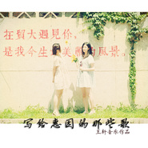

在贸大遇见你写给惠园的那些歌
============================

|  |  |
| :--: | :-- |
| [ 在贸大遇见你写给惠园的那些歌](https://emumo.xiami.com/album/1614846337) | **艺人**: [王轩](../index.md) **语种**: 国语 **唱片公司**: 独立发行 **发行时间**: 2015年11月28日 **专辑类别**: 精选集 **专辑风格**: 国语流行 Mandarin Pop, 校园民谣 Campus Folk **播放数**: 19927 **收藏数**: 13 **评论数**: 4  |

## 简介

本张专辑中的歌曲都是应邀为贸大创作的。  
贸大有多美，音乐告诉你。

## 曲目

## 评论

|  |  |  |  |
| :-- | :-- | :-- | :-- |
|  [虾米用户](https://emumo.xiami.com/u/347295814)  2018-02-01 21:38 赞(0) 踩(0) | 
好好听5555
 |
|  [虾米用户](https://emumo.xiami.com/u/323587056)  2017-09-08 08:09 赞(0) 踩(0) | 
为有才华的学长学姐们点赞！
 |
|  [虾米用户](https://emumo.xiami.com/u/50018468) 就是相信小乐胃！ 2015-06-02 20:01 赞(0) 踩(0) | 
同为贸大人，再没有更有同感了！
 |
|  [虾米用户](https://emumo.xiami.com/u/50018468) 就是相信小乐胃！ 2015-06-02 20:00 赞(0) 踩(0) | 
好好听 给学长点赞~
 |
