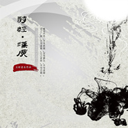

王轩
============================

|  |  |
| :--: | :-- |
| [ 王轩](https://i.xiami.com/wangxuan) | **播放数**: 2464414 **粉丝数**: 542 **评论数**: 40 **地区**: China 中国大陆 **风格**: 民谣流行 Folk Pop, 现代古典 Modern Classical, 流行摇滚 Pop Rock, 国语流行 Mandarin Pop  |

## 档案

王轩（野外的酒鬼），词曲作者、独立制作人。 
毕业于对外经济贸易大学。 
擅长古风、民族和流行风格。 
主要歌曲作品包括：《汉广》（橙live原创音乐榜第三期冠军）、《声律启蒙》、《月出》、《今夕何夕》、《梦中的洪格尔》等。

## 专辑

| 名称 | 语种 | 唱片公司 | 发行时间 | 专辑类别 | 专辑风格 |
| :--: | :-- | :-- | :-- | :-- | :-- |
| [ 守护者风控与安全中心](./albums/2108269464.md) | 国语 | 独立发行 | 2020年03月30日 | EP, 单曲 | 流行摇滚 Pop Rock |
| [ 岂曰无衣阿里巴巴员工抗疫原创歌曲](./albums/2108151030.md) | 国语 | 独立发行 | 2020年03月07日 | EP, 单曲 | 国语流行 Mandarin Pop |
| [ 惠园特快UIBE Express](./albums/2105159979.md) | 国语 |  | 2019年08月17日 | EP, 单曲 | 朋克 Punk Rock |
| [ 诗经·月出诗经歌曲系列](./albums/2100260890.md) | 国语 | 独立发行 | 2016年01月14日 | EP, 单曲 | 中国风 China-Wave |
| [ 健康之路中华健康产业协会会歌](./albums/2100255152.md) | 国语 | 独立发行 | 2016年01月05日 | EP, 单曲 | 国语流行 Mandarin Pop |
| [ 梦中的洪格尔](./albums/2100254042.md) | 国语 | 独立发行 | 2016年01月02日 | EP, 单曲 | 传统民谣 Traditional Folk, 中国传统民歌 Chinese Traditional Folk, 国语流行 Mandarin Pop |
| [ 在贸大遇见你写给惠园的那些歌](./albums/1614846337.md) | 国语 | 独立发行 | 2015年11月28日 | 精选集 | 国语流行 Mandarin Pop, 校园民谣 Campus Folk |
| [ 今夕何夕](./albums/2100241196.md) | 国语 | 独立发行 | 2015年11月25日 | EP, 单曲 | 国语流行 Mandarin Pop |
| [ 声律启蒙国学启蒙儿歌](./albums/2100240016.md) | 国语 | 独立发行 | 2015年11月20日 | EP, 单曲 | 当代民谣 Contemporary Folk, 中国风 China-Wave |
| [ Зүүдэнд ирдэг хонгор](./albums/1626806859.md) | 其他 | 独立发行 | 2015年03月20日 | EP, 单曲 | 当代民谣 Contemporary Folk |
| [ 诗经·汉广](./albums/1523645724.md) | 国语 | 独立发行 | 2015年02月11日 | EP, 单曲 | 中国风 China-Wave |
| [ 国界](./albums/1616831933.md) | 国语 | 独立发行 | 2014年11月24日 | EP, 单曲 |  |
| [ 琴旅王轩纯音乐作品专辑](./albums/214830227.md) | 其他 | 独立发行 | 2013年08月03日 | 录音室专辑 | 器乐独奏 Solo Instrumental, 新世纪音乐 New Age |
| [ 春暖江融王轩音乐记录](./albums/314806232.md) | 国语 | 独立发行 | 2012年06月10日 | 精选集 | 国语流行 Mandarin Pop, 中国风 China-Wave, 校园民谣 Campus Folk |
| [ 永远的征程中国远程教育之歌](./albums/1814994268.md) | 国语 | 独立发行 | 2009年12月05日 | EP, 单曲 | 国语流行 Mandarin Pop |
| [ 篮球梦想全国业余篮球公开赛会歌](./albums/15014604.md) | 国语 | 独立发行 | 2006年10月10日 | EP, 单曲 | 流行摇滚 Pop Rock |

## 评论

|  |  |  |  |
| :-- | :-- | :-- | :-- |
|  [虾米用户](https://emumo.xiami.com/u/8337431) 以乐会友 2020-11-21 00:27 赞(0) 踩(0) | 
20201120.40
 |
|  [虾米用户](https://emumo.xiami.com/u/276944698) 不要自我设限..... 2020-08-15 23:25 赞(1) 踩(0) | 

 |
|  [虾米用户](https://emumo.xiami.com/u/432722617)  2019-12-04 23:47 赞(0) 踩(0) | 
你好，能给我看下汉广的曲谱吗  好喜欢的
 |
|  [虾米用户](https://emumo.xiami.com/u/404026779)  2019-07-16 22:33 赞(0) 踩(0) | 
在
 |
|  [虾米用户](https://emumo.xiami.com/u/337477658)  2019-07-04 16:29 赞(0) 踩(0) | 
声律启蒙有完整版吗？
 |
|  [虾米用户](https://emumo.xiami.com/u/26274528)  2019-02-03 21:18 赞(0) 踩(0) | 
更新希望
 |
|  [虾米用户](https://emumo.xiami.com/u/403502300)  2018-11-29 21:52 赞(0) 踩(0) | 
弄哩不赖，支援十元，多整点蒙学的
 |
|  [虾米用户](https://emumo.xiami.com/u/303670306)  2017-06-27 18:00 赞(1) 踩(0) | 
请问声律启蒙有完整版吗？如果有，怎么买？
 |
| ⇒ |  [虾米用户](https://emumo.xiami.com/u/43128825) 在音符里了解你 2017-07-15 19:16 赞(0) 踩(0) | 
没有，没钱录：）
 |
| ⇒ |  [虾米用户](https://emumo.xiami.com/u/1542545)  2017-09-09 08:19 赞(0) 踩(0) | 
<q><b>王轩说：</b></q>
 |
| ⇒ |  [虾米用户](https://emumo.xiami.com/u/50419555) 悟以往之不谏，知来者之可... 2018-04-22 13:29 赞(0) 踩(0) | 
<q><b>王轩说：</b></q>
 |
| ⇒ |  [虾米用户](https://emumo.xiami.com/u/50880346)  2020-09-09 16:47 赞(0) 踩(0) | 
<q><b>王轩说：</b></q>
 |
|  [虾米用户](https://emumo.xiami.com/u/19928334) 正视不完美，是对过去的一... 2016-12-14 13:46 赞(0) 踩(0) | 
支持！敬请关注！
 |
|  [虾米用户](https://emumo.xiami.com/u/11825902)  2016-12-13 10:59 赞(0) 踩(0) | 
请问如何联系您？有合作事宜想与你联系~
 |
| ⇒ |  [虾米用户](https://emumo.xiami.com/u/43128825) 在音符里了解你 2017-01-02 18:27 赞(0) 踩(0) | 
谢谢，微博@野外的酒鬼
 |
|  [虾米用户](https://emumo.xiami.com/u/50018468) 就是相信小乐胃！ 2015-05-13 08:58 赞(0) 踩(0) | 
永远的学长
 |
| ⇒ |  [虾米用户](https://emumo.xiami.com/u/35660892)  2016-12-12 13:10 赞(0) 踩(0) | 
你好，请问才能买到王轩老师的专辑呢
 |
| ⇒ |  [虾米用户](https://emumo.xiami.com/u/50018468) 就是相信小乐胃！ 2016-12-12 14:11 赞(0) 踩(0) | 
<q><b>大小眼说：</b></q>
 |
| ⇒ |  [虾米用户](https://emumo.xiami.com/u/35660892)  2016-12-12 14:36 赞(0) 踩(0) | 
<q><b>陈熙元说：</b></q>
 |
| ⇒ |  [虾米用户](https://emumo.xiami.com/u/50018468) 就是相信小乐胃！ 2016-12-12 18:09 赞(0) 踩(0) | 
<q><b>大小眼说：</b></q>
 |
| ⇒ |  [虾米用户](https://emumo.xiami.com/u/50018468) 就是相信小乐胃！ 2016-12-12 18:10 赞(0) 踩(0) | 
<q><b>大小眼说：</b></q>
 |
| ⇒ |  [虾米用户](https://emumo.xiami.com/u/43128825) 在音符里了解你 2017-01-02 18:27 赞(0) 踩(0) | 
<q><b>大小眼说：</b></q>
 |
|  [虾米用户](https://emumo.xiami.com/u/41282386)  2015-03-05 08:25 赞(0) 踩(0) | 
让我很感动的音乐，谢谢，非常喜欢，真的很好听。
 |
|  [虾米用户](https://emumo.xiami.com/u/47757730)  2015-03-02 16:24 赞(0) 踩(0) | 
喜欢是必须滴！！！！！！！！！！！
 |
|  [虾米用户](https://emumo.xiami.com/u/25550049)  2015-02-17 19:59 赞(0) 踩(0) | 
追逐梦想，祝贺圆梦！
 |
|  [虾米用户](https://emumo.xiami.com/u/47350433)   2015-02-16 13:01 赞(0) 踩(0) | 
支持！
 |
|  [虾米用户](https://emumo.xiami.com/u/46799110)  2015-02-01 12:18 赞(1) 踩(0) | 
好听！有担当的音乐人！
 |
|  [虾米用户](https://emumo.xiami.com/u/46505030)  2015-01-31 15:18 赞(0) 踩(0) | 
歌曲主题明确！反对战争！祈愿和平！
 |
|  [虾米用户](https://emumo.xiami.com/u/46505030)  2015-01-31 15:14 赞(0) 踩(0) | 
因为好听！因为感恩！因为热爱！
 |
|  [虾米用户](https://emumo.xiami.com/u/46505030)  2015-01-30 10:12 赞(0) 踩(0) | 
因为热爱，旋律从你的心中奔流而出……焕发出七色的光彩！支持你！早日实现你的音乐梦想！
 |
|  [虾米用户](https://emumo.xiami.com/u/46597034)  2015-01-29 23:40 赞(0) 踩(0) | 
有才
 |
|  [虾米用户](https://emumo.xiami.com/u/9701053)  2015-01-29 17:40 赞(0) 踩(0) | 
有才华的大师哥！！
 |
| ⇒ |  [虾米用户](https://emumo.xiami.com/u/35660892)  2016-12-12 13:11 赞(0) 踩(0) | 
你好，请问怎样能买到王轩老师的专辑呀？谢谢
 |
|  [虾米用户](https://emumo.xiami.com/u/46525839)  2015-01-27 18:39 赞(0) 踩(0) | 
好听
 |
|  [虾米用户](https://emumo.xiami.com/u/46483271)  2015-01-25 23:31 赞(0) 踩(0) | 
支持师兄！
 |
| ⇒ |  [虾米用户](https://emumo.xiami.com/u/35660892)  2016-12-12 13:11 赞(0) 踩(0) | 
你好，请问怎样能买到王轩老师的专辑呀？谢谢
 |
|  [虾米用户](https://emumo.xiami.com/u/35143301) 我还没想好要写什么... 2015-01-19 16:10 赞(0) 踩(0) | 
好听好听～
 |
|  [虾米用户](https://emumo.xiami.com/u/3361958)  2014-10-31 22:49 赞(0) 踩(0) | 
收藏了不少啊。
 |
|  [虾米用户](https://emumo.xiami.com/u/43128825) 在音符里了解你 2014-10-31 22:42 赞(1) 踩(0) | 
我刚入驻了虾米音乐人，欢迎大家来我的个人主页，收听我的最新音乐
 |
| ⇒ |  [虾米用户](https://emumo.xiami.com/u/35660892)  2016-12-12 13:11 赞(0) 踩(0) | 
您好，请问怎样能买到您的专辑呢？谢谢
 |
