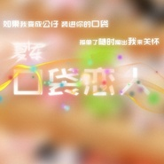

口袋恋人
============================

|  |  |
| :--: | :-- |
| [ 口袋恋人](https://emumo.xiami.com/album/1415885403) | **艺人**: [夏军](../index.md) **语种**: 国语 **唱片公司**: 独立发行 **发行时间**: 2014年08月28日 **专辑类别**: EP, 单曲 **专辑风格**: 当代民谣 Contemporary Folk, 国语流行 Mandarin Pop, 华语唱作人 Chinese Singer-Songwriter **播放数**: 14088 **收藏数**: 3 **评论数**: 0  |

## 简介

独家收入了夏军所创作的《口袋恋人》，曲风甜蜜浪漫，张扬这年轻 爱情的梦幻姿态。如果我变成公仔，装进你的口袋，更是将爱情无奈 的心情巧妙的比喻为了公仔。  
《木偶》诡异的题目却写着人生的无奈。冥冥之中有一双手，你我都 是舞台上的提线木偶为命运所操纵。也许这些掌声都是属于幕后那个 人的，而我们始终只能微笑的站在台前。 

## 曲目

## 评论

