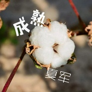

夏军
============================

|  |  |
| :--: | :-- |
| [ 夏军](https://i.xiami.com/xiajun) | **地区**: China 中国大陆 **风格**: 流行说唱 Pop Rap, 传统民谣 Traditional Folk, 当代民谣 Contemporary Folk, 国语流行 Mandarin Pop, 华语唱作人 Chinese Singer-Songwriter **播放数**: 1089333 **粉丝数**: 25 **评论数**: 3  |

## 档案

## 专辑

| 名称 | 语种 | 唱片公司 | 发行时间 | 专辑类别 | 专辑风格 |
| :--: | :-- | :-- | :-- | :-- | :-- |
| [ 小小异类](./albums/2108401047.md) | 国语 | 听见音乐 | 2020年05月06日 | EP, 单曲 | 国语流行 Mandarin Pop |
| [ 爱不罢休](./albums/2105421365.md) | 国语 | 看见文娱 | 2019年11月07日 | EP, 单曲 |  |
| [ 海市蜃楼](./albums/2105413247.md) | 国语 | 看见文娱 | 2019年11月07日 | EP, 单曲 |  |
| [ 成熟](./albums/2104928776.md) | 国语 | 独立发行 | 2019年06月01日 | 录音室专辑 | 民谣流行 Folk Pop |
| [ 创作季](./albums/2103630062.md) | 国语 | 独立发行 | 2018年03月16日 | 录音室专辑 | 流行摇滚 Pop Rock, 摇滚 Rock & Roll |
| [ 过去](./albums/2100283328.md) | 国语 | 独立发行 | 2016年02月28日 | 录音室专辑 | 流行摇滚 Pop Rock, 国语流行 Mandarin Pop |
| [ 爱不罢休](./albums/1531582970.md) | 国语 | 独立发行 | 2015年05月14日 | 录音室专辑 | 放克电子 Electro (Electro-Funk), 国语流行 Mandarin Pop |
| [ 最爱的小诗](./albums/1818116569.md) | 国语 | 独立发行 | 2014年12月09日 | EP, 单曲 | 国语流行 Mandarin Pop |
| [ 单纯爱](./albums/515887239.md) | 国语 | 独立发行 | 2014年11月12日 | EP, 单曲 | 流行说唱 Pop Rap, 国语流行 Mandarin Pop, 华语唱作人 Chinese Singer-Songwriter |
| [ 孤独之旅](./albums/515862286.md) | 国语 | 独立发行 | 2014年10月06日 | EP, 单曲 | 流行说唱 Pop Rap, 民谣流行 Folk Pop, 国语流行 Mandarin Pop |
| [ 口袋恋人](./albums/1415885403.md) | 国语 | 独立发行 | 2014年08月28日 | EP, 单曲 | 当代民谣 Contemporary Folk, 国语流行 Mandarin Pop, 华语唱作人 Chinese Singer-Songwriter |
| [ 夏军独家精选合集](./albums/1515886137.md) | 国语 | 独立发行 | 2014年08月28日 | 合集, 杂锦 | 当代民谣 Contemporary Folk, 国语流行 Mandarin Pop, 华语唱作人 Chinese Singer-Songwriter |

## 评论

|  |  |  |
| :-- | :-- | :-- |
|  [虾米用户](https://emumo.xiami.com/u/358104299) 悲观的唯心存在现实解构虚... 2020-12-23 07:40 赞(0) 踩(0) | 
43825
 |
|  [虾米用户](https://emumo.xiami.com/u/78279)  2014-11-14 13:35 赞(0) 踩(0) | 
GARU~
 |
|  [虾米用户](https://emumo.xiami.com/u/43636233) 用心磨炼出最好的音乐！ 2014-11-13 14:49 赞(1) 踩(0) | 
我刚入驻了虾米音乐人，欢迎大家来我的个人主页，收听我的最新音乐
 |
