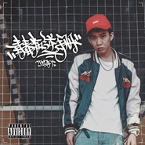

青春叛逆手冊
============================

|  |  |
| :--: | :-- |
| [ 青春叛逆手冊](https://emumo.xiami.com/album/2100265570) | **艺人**: [T-T](../index.md) **语种**: 国语 **唱片公司**:  **发行时间**: 2016年01月25日 **专辑类别**: EP, 单曲 **专辑风格**: 流行说唱 Pop Rap **播放数**: 48121 **收藏数**: 3 **评论数**: 16  |

## 简介

距离专辑正式发布一周，单曲《青春叛逆手册》MV先行上线。与以往或通常的MV不同，这支《青春叛逆手册》MV的前半部分实际上是一部迷你纪录片，日常生活与工作状态交织的画面中，TT讲述着自己对Hip-Hop音乐“与生俱来”的热爱，以及近五年间在音乐道路上的心路历程与收获。之后，后半段的歌曲《青春叛逆手册》随即响起，那些或属于TT私人，或属于一代人集体记忆的符号、画面和场景，共同合成了一份以叛逆为主题的青春DNA图谱，TT将它编撰成册，为尚且还如此年轻的自己留下一个可供分享的精彩印记。
 

 
 

本次MV还邀请到国内出色的Graffiti写手，——来自南京的CHOSE专门设计了一系列字体，为MV增添了浓郁的街头Hip-Hop风味。此外，MV由Hip-Hop文化厂牌Yo&nbsp;Nation主理人Dickid剪辑制作，讲者等音乐人好友亦有出镜支持。
 

 

## 曲目

## 评论

|  |  |  |
| :-- | :-- | :-- |
|  [虾米用户](https://emumo.xiami.com/u/25484802)  2016-04-21 09:55 赞(1) 踩(0) | 
真他妈土
 |
| ⇒ |  [虾米用户](https://emumo.xiami.com/u/349911034) 最好自己 2019-11-25 16:25 赞(0) 踩(0) | 
懂你ma
 |
|  [虾米用户](https://emumo.xiami.com/u/47772459) 最难找的伴奏 尽管留言 ... 2016-03-31 21:23 赞(0) 踩(0) | 
帅
 |
|  [虾米用户](https://emumo.xiami.com/u/83401866)   2016-01-29 15:16 赞(0) 踩(0) | 
年轻优秀
 |
|  [虾米用户](https://emumo.xiami.com/u/58827028) 滴滴 2016-01-27 17:13 赞(0) 踩(0) | 
完美！
 |
|  [虾米用户](https://emumo.xiami.com/u/83895198)   2016-01-26 22:25 赞(0) 踩(0) | 
哟哟哟
 |
|  [虾米用户](https://emumo.xiami.com/u/24665518)  2016-01-26 21:40 赞(0) 踩(0) | 
好！！！！！
 |
|  [虾米用户](https://emumo.xiami.com/u/87207216)  2016-01-26 18:10 赞(0) 踩(0) | 
cool
 |
|  [虾米用户](https://emumo.xiami.com/u/23701241)   2016-01-26 16:57 赞(0) 踩(0) | 
年轻且优秀
 |
|  [虾米用户](https://emumo.xiami.com/u/5840205)  2016-01-26 15:04 赞(0) 踩(0) | 
相当不错··
 |
|  [虾米用户](https://emumo.xiami.com/u/54885166)   2016-01-26 11:47 赞(0) 踩(0) | 
Yo,whassup？太kool了，点赞 
 |
|  [虾米用户](https://emumo.xiami.com/u/49010350)   2016-01-26 10:19 赞(0) 踩(0) | 
我是与生俱来我就觉得我是喜欢hiphop的了
 |
|  [虾米用户](https://emumo.xiami.com/u/44464426)   2016-01-26 06:58 赞(0) 踩(0) | 
☺
 |
|  [虾米用户](https://emumo.xiami.com/u/43186945) bitches and ... 2016-01-26 01:10 赞(0) 踩(0) | 

 |
|  [虾米用户](https://emumo.xiami.com/u/26015717) 微博：浪漫失格 2016-01-26 00:44 赞(0) 踩(0) | 

 |
|  [虾米用户](https://emumo.xiami.com/u/47583845)   2016-01-25 21:31 赞(0) 踩(0) | 
赞
 |
