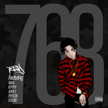

768Mixtape
============================

|  |  |
| :--: | :-- |
| [ 768Mixtape](https://emumo.xiami.com/album/2100379292) | **艺人**: [T-T](../index.md) **语种**: 国语 **唱片公司**: YoNation **发行时间**: 2016年08月12日 **专辑类别**: 录音室专辑 **专辑风格**: 流行说唱 Pop Rap, 南方说唱 Southern Hip Hop **播放数**: 3594696 **收藏数**: 873 **评论数**: 89  |

## 简介

Yo Nation旗下说唱歌手“你的男孩”TT，集合今年以来创作的8首全新作品的《768Mixtape》正式发布。专辑前5首歌分别由VAVA、Future、K9999、Per$on、Jony J参与合作演唱，母带工程由西安XXX Studio的YoungMai协助完成，封面插画则由Suck One执笔。  
  
经历2016年初个人首张专辑《你的男孩》的发布及全国巡演后，TT依旧全力专注于创作，并将生活随即转化为素材，记录下这段时间的想法和故事。《U Pu$$y U Know It》和《F.W.M.C》两首简单粗暴的直抒胸臆，一贯的叛逆不羁汹涌而来，字里行间的犀利需要你在开篇时直接招架；同样透着坦荡和傲气，《赵德柱》（罩得住）和《他们都想像我这么做》则是TT对周遭那些“光怪陆离”和“趋之若鹜”给出的态度反馈。  
  
之所以定名为“768”，源自TT广东潮州老家的电话区号“0768”，——那里同样给予TT无限的灵感。由于这份故乡情结的存在，《768Mixtape》当中不仅有《Two Chains》这样的潮州方言作品，也有如《菩萨保佑》这般，在TT过往作品中相对少见的关乎家人和亲情的坦露；而《Tic Toc》里对钟表运行的拟声，和《变》当中“看着墙上指针滴答滴，其实那是个时光机”的比喻，都包含着一个在对自我和时间的审视中，一路继续前行的TT。  
  
和专辑《你的男孩》一样，《768Mixtape》依然是TT又一次忠于内心的自我阐释，而透过你每一次的聆听，那个“年轻且优秀，积极且颓废”的你的男孩，将愈发变得立体而清晰。 

## 曲目

## 评论

|  |  |  |
| :-- | :-- | :-- |
|  [虾米用户](https://emumo.xiami.com/u/26166944) 游走在社会边缘的神秘者 2019-05-02 07:34 赞(1) 踩(0) | 
这种破歌我懒听  一天能写四公斤
 |
| ⇒ |  [虾米用户](https://emumo.xiami.com/u/253917430) 我还没想好要写什么... 2020-07-21 21:29 赞(0) 踩(0) | 
要是说唱圈一天全都diss diss 谁愿意听？？多点励志向上的歌不好吗
 |
|  [虾米用户](https://emumo.xiami.com/u/114193750) 黑怕 2018-05-13 13:15 赞(2) 踩(0) | 
赵德柱没了&amp;hellip;&amp;hellip;我壳没了
 |
|  [虾米用户](https://emumo.xiami.com/u/682254) 暂无签名~ 2018-03-06 04:49 赞(0) 踩(0) | 
Speechless, all the songs got banned? Who can tells the truth?
 |
|  [虾米用户](https://emumo.xiami.com/u/219128193) 猜猜我的占有欲有多可怕_ 2018-02-09 12:26 赞(2) 踩(0) | 
变没了
 |
|  [虾米用户](https://emumo.xiami.com/u/241252718)  2018-01-06 20:33 赞(2) 踩(0) | 
woc上午还能听来着，告诉我哪里能听OK？
 |
|  [虾米用户](https://emumo.xiami.com/u/312600383)  2017-10-20 22:36 赞(0) 踩(0) | 
炒鸡喜欢
 |
|  [虾米用户](https://emumo.xiami.com/u/80780068) 90后 pretty b... 2017-08-21 12:32 赞(2) 踩(0) | 
Ft.future
 |
| ⇒ |  [虾米用户](https://emumo.xiami.com/u/47266881)   2017-10-06 23:27 赞(0) 踩(0) | 
我也感觉很疑惑
 |
|  [虾米用户](https://emumo.xiami.com/u/320004612)  2017-08-18 03:33 赞(0) 踩(0) | 
Tizzyt，加油，你最帅你最棒，你最酷，你最强
 |
|  [虾米用户](https://emumo.xiami.com/u/320004612)  2017-08-18 03:32 赞(0) 踩(0) | 
加油，你最棒，要一直坚强下去。永远支持你  
 |
|  [虾米用户](https://emumo.xiami.com/u/282642830)  2017-08-07 10:24 赞(0) 踩(0) | 
我们的男孩！加油↖(^&amp;omega;^)↗你是最棒的！
 |
|  [虾米用户](https://emumo.xiami.com/u/307295179)  2017-07-17 08:19 赞(0) 踩(0) | 
相信你
 |
|  [虾米用户](https://emumo.xiami.com/u/33935437)  2017-05-16 03:55 赞(2) 踩(0) | 
这张专辑挺好的
 |
|  [虾米用户](https://emumo.xiami.com/u/227111612) 因为你.不是为了你 2017-04-02 19:49 赞(0) 踩(0) | 
挺搞笑的你们，3bangz.的钱，你们自豪个什么劲&amp;hellip;&amp;hellip;好好听歌行不
 |
|  [虾米用户](https://emumo.xiami.com/u/227111612) 因为你.不是为了你 2017-04-02 19:47 赞(0) 踩(0) | 
.
 |
|  [虾米用户](https://emumo.xiami.com/u/6981661) 我还没想好要写什么... 2017-03-29 03:43 赞(1) 踩(0) | 
♞
 |
|  [虾米用户](https://emumo.xiami.com/u/30588204)  2017-03-26 18:37 赞(1) 踩(0) | 
das
 |
|  [虾米用户](https://emumo.xiami.com/u/33185339) MC口子伟 2017-03-24 04:21 赞(0) 踩(0) | 
sdaw
 |
|  [虾米用户](https://emumo.xiami.com/u/227111612) 因为你.不是为了你 2017-02-18 13:40 赞(0) 踩(0) | 
....3bangz和tt怎么了……………………
 |
|  [虾米用户](https://emumo.xiami.com/u/26166944) 游走在社会边缘的神秘者 2017-01-20 15:37 赞(1) 踩(0) | 
～变不错
 |
|  [虾米用户](https://emumo.xiami.com/u/57456914) 不搬后台因为谁都有 2016-09-24 22:34 赞(2) 踩(0) | 
不喜欢听滚
 |
|  [虾米用户](https://emumo.xiami.com/u/49856654) 我还没想好要写什么... 2016-09-08 21:52 赞(1) 踩(0) | 
这张不行 继续努力
 |
| ⇒ |  [虾米用户](https://emumo.xiami.com/u/249820479)   2017-01-23 15:15 赞(0) 踩(0) | 
行不行要你来b？你行你来？
 |
|  [虾米用户](https://emumo.xiami.com/u/145418594)   2016-08-31 01:46 赞(3) 踩(0) | 
不懂为什么那么多喷的人。路人觉得真的蛮好听的
 |
|  [虾米用户](https://emumo.xiami.com/u/34501941)  2016-08-30 14:28 赞(0) 踩(0) | 
这个是模仿黑人了
 |
|  [虾米用户](https://emumo.xiami.com/u/34501941)  2016-08-30 14:16 赞(1) 踩(0) | 
挺一下目前还不是主流的说唱，不错
 |
| ⇒ |  [虾米用户](https://emumo.xiami.com/u/1635914) 地上大老虎,江中小白龙. 2017-02-07 12:54 赞(0) 踩(0) | 
早两年  trap hop就是主流了哟 
 |
|  [虾米用户](https://emumo.xiami.com/u/39105269) wechat: hell... 2016-08-29 14:03 赞(1) 踩(0) | 
很OK
 |
|  [虾米用户](https://emumo.xiami.com/u/124216952)  2016-08-25 23:26 赞(1) 踩(0) | 
好听哎，我哥们罩得住
 |
|  [虾米用户](https://emumo.xiami.com/u/50649222) hell 2016-08-24 15:06 赞(1) 踩(0) | 
好
 |
|  [虾米用户](https://emumo.xiami.com/u/8611504)  2016-08-23 22:13 赞(1) 踩(0) | 
业界良心作品
 |
|  [虾米用户](https://emumo.xiami.com/u/37377959) 来自2011 2016-08-23 11:37 赞(3) 踩(0) | 
TT那种鼻音 有特点 一听就知道是他的声音
 |
|  [虾米用户](https://emumo.xiami.com/u/8244559)  2016-08-18 12:57 赞(0) 踩(0) | 
******
 |
|  [虾米用户](https://emumo.xiami.com/u/6160581) If u dont li... 2016-08-18 12:23 赞(0) 踩(0) | 
哪里话？客家话？
 |
|  [虾米用户](https://emumo.xiami.com/u/94252534) 你好 2016-08-18 10:59 赞(22) 踩(0) | 
对事的说 我并不多讨厌tt 但tt的粉丝确实不行 啥都不懂 real脑残粉
 |
| ⇒ |  [虾米用户](https://emumo.xiami.com/u/103216648) FUCK FAKE BO... 2016-08-18 11:57 赞(0) 踩(0) | 
对事的说 我也不讨厌tt 我就喜欢喷tt脑残粉 另外tt的歌也不是不能听 毕竟给tt做beat和混音的都没得黑
 |
|  [虾米用户](https://emumo.xiami.com/u/119991464) 没事多笑笑，明天可能还不... 2016-08-17 19:44 赞(0) 踩(0) | 
  
 |
|  [虾米用户](https://emumo.xiami.com/u/85501218)   2016-08-17 17:18 赞(0) 踩(0) | 
等很久
 |
|  [虾米用户](https://emumo.xiami.com/u/188115549)   2016-08-17 09:49 赞(1) 踩(0) | 
还地狱彷徨，你以为你起个非主流名字就是杀马特老大了？
 |
| ⇒ |  [虾米用户](https://emumo.xiami.com/u/103216648) FUCK FAKE BO... 2016-08-18 08:21 赞(0) 踩(0) | 
多听几遍赵德柱就罩得住了??哈哈哈哈XSWL
 |
|  [虾米用户](https://emumo.xiami.com/u/88316834) 回归真实 2016-08-15 21:21 赞(0) 踩(0) | 
等到昏厥
 |
|  [虾米用户](https://emumo.xiami.com/u/88316834) 回归真实 2016-08-15 21:20 赞(0) 踩(0) | 

 |
|  [虾米用户](https://emumo.xiami.com/u/73116958) 我还没想好要写什么... 2016-08-15 20:22 赞(0) 踩(0) | 
捉
 |
|  [虾米用户](https://emumo.xiami.com/u/101471870) 我始终学不会控制 2016-08-15 20:06 赞(0) 踩(0) | 
等很久
 |
|  [虾米用户](https://emumo.xiami.com/u/212013309)  2016-08-15 18:34 赞(0) 踩(0) | 
兴奋
 |
|  [虾米用户](https://emumo.xiami.com/u/212013309)  2016-08-15 18:33 赞(0) 踩(0) | 
哈哈哈哈
 |
|  [虾米用户](https://emumo.xiami.com/u/38548771) Drink more w... 2016-08-15 17:39 赞(0) 踩(0) | 
质量好
 |
|  [虾米用户](https://emumo.xiami.com/u/52574604)   2016-08-15 17:26 赞(0) 踩(0) | 
不错诶
 |
|  [虾米用户](https://emumo.xiami.com/u/39924023)  2016-08-15 17:04 赞(0) 踩(0) | 
[带墨镜笑]
 |
|  [虾米用户](https://emumo.xiami.com/u/82640628) 快乐啊，祝你也祝我 2016-08-15 16:50 赞(0) 踩(0) | 

 |
|  [虾米用户](https://emumo.xiami.com/u/46583375) 新浪微博@Lil_Kok... 2016-08-15 16:42 赞(0) 踩(0) | 
帅套
 |
|  [虾米用户](https://emumo.xiami.com/u/96026564)  2016-08-15 16:33 赞(0) 踩(0) | 

 |
|  [虾米用户](https://emumo.xiami.com/u/82759380)  2016-08-15 16:19 赞(0) 踩(0) | 
768768
 |
|  [虾米用户](https://emumo.xiami.com/u/54875780) 收《SpidaBoi》《... 2016-08-15 15:39 赞(3) 踩(0) | 
TT新mixtape 打个90分儿  给做beat的哥们30分儿 给混音的mai神30分儿 给专辑里有合作的人20分儿 给TT的帅10分儿
 |
| ⇒ |  [虾米用户](https://emumo.xiami.com/u/48905128) 永远保持我的美式 2016-08-24 17:05 赞(0) 踩(0) | 
哈哈哈哈哈哈
 |
|  [虾米用户](https://emumo.xiami.com/u/44873270) 飛的越高我就心情越好 2016-08-15 14:39 赞(0) 踩(0) | 

 |
|  [虾米用户](https://emumo.xiami.com/u/98854364) 。。。。。。。。 2016-08-15 14:09 赞(0) 踩(0) | 
⑥
 |
|  [虾米用户](https://emumo.xiami.com/u/103939452)  2016-08-15 13:57 赞(0) 踩(0) | 
666
 |
|  [虾米用户](https://emumo.xiami.com/u/63882480) 若你太清醒我建议你停下来 2016-08-15 13:42 赞(0) 踩(0) | 
好听 
 |
|  [虾米用户](https://emumo.xiami.com/u/45014281) 自 由 2016-08-15 12:50 赞(1) 踩(0) | 
看了两场都帅到炸
 |
|  [虾米用户](https://emumo.xiami.com/u/91103352)   2016-08-15 12:28 赞(0) 踩(0) | 
变 好听到哭
 |
|  [虾米用户](https://emumo.xiami.com/u/87239832) keep it real 2016-08-15 11:51 赞(0) 踩(0) | 
虾米终于上了
 |
|  [虾米用户](https://emumo.xiami.com/u/129478958) QQ1142859457 2016-08-15 11:49 赞(0) 踩(0) | 
终于出了
 |
|  [虾米用户](https://emumo.xiami.com/u/57647284) 坠 2016-08-15 11:41 赞(0) 踩(0) | 
虾米终于发了
 |
|  [虾米用户](https://emumo.xiami.com/u/77984516) 暗无天日 2016-08-15 11:33 赞(0) 踩(0) | 
前排我的
 |
|  [虾米用户](https://emumo.xiami.com/u/52528430) SK8 2016-08-15 11:32 赞(0) 踩(0) | 

 |
|  [虾米用户](https://emumo.xiami.com/u/162846700)   2016-08-15 11:29 赞(0) 踩(0) | 
前
 |
|  [虾米用户](https://emumo.xiami.com/u/113056998) 别看了，比你过得好。 2016-08-15 11:17 赞(0) 踩(0) | 
前排前排 ！
 |
|  [虾米用户](https://emumo.xiami.com/u/72594338) lillil7 2016-08-15 11:14 赞(54) 踩(0) | 
这是三棒子他爹的专辑
 |
| ⇒ |  [虾米用户](https://emumo.xiami.com/u/113732102) 冈斯特刚 2016-08-16 05:22 赞(0) 踩(0) | 
<q><b>说：</b></q>
 |
| ⇒ |  [虾米用户](https://emumo.xiami.com/u/103216648) FUCK FAKE BO... 2016-08-16 09:36 赞(0) 踩(0) | 
<q><b>NEVERLAND巨婴说：</b></q>
 |
| ⇒ |  [虾米用户](https://emumo.xiami.com/u/62281860)  2016-08-17 15:01 赞(0) 踩(0) | 
<q><b>Yung Lean说：</b></q>
 |
| ⇒ |  [虾米用户](https://emumo.xiami.com/u/103216648) FUCK FAKE BO... 2016-08-18 08:22 赞(0) 踩(0) | 
<q><b>全民赚$说：</b></q>
 |
| ⇒ |  [虾米用户](https://emumo.xiami.com/u/212013309)  2016-08-21 19:48 赞(0) 踩(0) | 
<q><b>说：</b></q>
 |
| ⇒ |  [虾米用户](https://emumo.xiami.com/u/35373666) trap love 2016-09-15 14:06 赞(0) 踩(0) | 
说的对
 |
| ⇒ |  [虾米用户](https://emumo.xiami.com/u/62046282)   2016-12-24 11:42 赞(0) 踩(0) | 
<q><b>说：</b></q>
 |
| ⇒ |  [虾米用户](https://emumo.xiami.com/u/103216648) FUCK FAKE BO... 2016-12-24 17:34 赞(0) 踩(0) | 
<q><b>enjoy life说：</b></q>
 |
| ⇒ |  [虾米用户](https://emumo.xiami.com/u/62046282)   2016-12-24 19:17 赞(0) 踩(0) | 
<q><b>Yung Lean说：</b></q>
 |
| ⇒ |  [虾米用户](https://emumo.xiami.com/u/103216648) FUCK FAKE BO... 2016-12-24 20:37 赞(0) 踩(0) | 
<q><b>enjoy life说：</b></q>
 |
| ⇒ |  [虾米用户](https://emumo.xiami.com/u/106248458)   2017-01-31 00:24 赞(0) 踩(0) | 
没办法 三棒子开迈凯轮 tt一辈子买不起
 |
| ⇒ |  [虾米用户](https://emumo.xiami.com/u/13274612) 暂无签名~ 2017-07-22 06:20 赞(0) 踩(0) | 
<q><b>说：</b></q>
 |
| ⇒ |  [虾米用户](https://emumo.xiami.com/u/188407843)  2017-09-02 09:54 赞(0) 踩(0) | 
<q><b>说：</b></q>
 |
| ⇒ |  [虾米用户](https://emumo.xiami.com/u/103216648) FUCK FAKE BO... 2017-10-30 09:54 赞(0) 踩(0) | 
<q><b>enjoy life说：</b></q>
 |
| ⇒ |  [虾米用户](https://emumo.xiami.com/u/409850766)  2019-06-17 21:45 赞(0) 踩(0) | 
3bangz是你grandfather 
 |
|  [虾米用户](https://emumo.xiami.com/u/46717802) 走远 2016-08-15 11:01 赞(0) 踩(0) | 
前
 |
|  [虾米用户](https://emumo.xiami.com/u/37326976) 只要音药 2016-08-15 10:59 赞(0) 踩(0) | 
ᕕ(ᐛ)ᕗ
 |
|  [虾米用户](https://emumo.xiami.com/u/11778540)   2016-08-15 10:59 赞(0) 踩(0) | 

 |
|  [虾米用户](https://emumo.xiami.com/u/9522515) Fuckin'felli... 2016-08-15 10:53 赞(1) 踩(0) | 
沙发
 |
