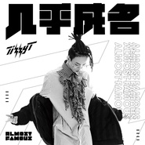

几乎成名
============================

|  |  |
| :--: | :-- |
| [ 几乎成名](https://emumo.xiami.com/album/2103701090) | **艺人**: [T-T](../index.md) **语种**: 国语 **唱片公司**: 摩登天空 **发行时间**: 2018年05月03日 **专辑类别**: EP, 单曲 **专辑风格**: 流行说唱 Pop Rap **播放数**: 21471 **收藏数**: 65 **评论数**: 16  |

## 简介

Tizzy T全新单曲《几乎成名》及MV曝光  
剖真心坦言“最难的是认识自己” Tizzy T全新力作《几乎成名》mv曝光 表达真我引共鸣被赞“诚意满满” 前不久，《中国新说唱》正式发声开始启动全球海选，这再次点燃了观众们对说唱的新期待，如果说2017年是说唱元年，那么2018年是说唱备受考验又值得期待的一年。  
  
近日，摩登天空嘻哈厂牌MDSK旗下说唱艺人Tizzy T发布了全新单曲《几乎成名》及MV。据悉，此次歌曲的发布与以往不同，Tizzy T不仅打开心门，将近期真实的自我经历写到了歌曲里面，而且还提出了“自传体叙事风格”的理念。  
  
让大家感受到了Tizzy T真实蜕变，成长为富有个人想法、敢于向歌迷展示最真实自我的唱作人。这一突破可谓是收获了一大波真心点赞与戳心好评。 正能量歌曲碰撞“成名梦” 剧情版mv发布戳中观众内心柔软处 2017年夏季,一档火遍全国的选秀节目让Tizzy T走进大众视野。  
  
这个25岁的大男孩以自己阳光开朗的外表、惊人的爆发力、富有个性的创作力赢得无数人的喜爱。随着一夜爆红,一同扑面而来的还有各种嘈杂的声音:“他不懂Hip hop”、“太锋芒毕露”、“玩地下音乐的都是坏孩子”。各种负面评价也蜂拥而至。从“地下”转为主流平台的过程,给了这个年轻人更多的考验。《几乎成名》就是在这样的大背景下应运而生，以“第一人称”开启自我救赎精神，值得肯定的是，这个男孩的创作力如此丰富，与其说唱歌，不如说“唱自己”。  
  
不仅是歌曲本身，《几乎成名》的MV也从极简的镜头语言上，让我们感受到一个以 “认识真我”为主题的从“默默无闻“到”红遍大街小巷“，从“经历疲惫期”再到“鼓励自我不要害怕”自传性质的内心独白。在剧情上，MV围绕着几乎成名“真实走进大众视野”而展开，表达了2017年第一次被大家所认识收获鲜花和掌声之后渴望摆脱外界眼光束缚、勇敢追求自我真实的情感。  
  
通过这场一波三折的人生起伏，Tizzy T也收获了成长，从一个面对鲜花和掌声会胆怯的男生，成长为一个勇敢、有担当的少年，并想坚守住自己的“理想国”寻找回一个真我的心里路程。这其中他有迷茫过，徘徊过，但是经历过大起大落的人生，才能感受到对自我的反思，从一个对未来充满迷茫的男孩，成长为坚定信念、相信“爱”、“不怕出错”的大男孩。 解读歌曲“三大”细节 折射展现出Tizzy T “五种”内心真实 通过对Tizzy T本次全新歌曲和MV的细读，有三大细节值得去细细品味。  
  
首先是“几乎成名”前后戳心对比，整个歌曲中传达对比最强烈的是：“几乎成名”前“没有人在乎”，“几乎成名”后“红遍大街小巷“这一戏剧性的反差真实的出现在了Tizzy T的人生，仿佛是过山车似的变化。其次是一个形容词的亮点修饰“几乎”，透露着遗憾，折射着反思，带着些自我嘲讽的黑色幽默，呈现出了对自我认知的探索。最后是一个开放式结局：“我做的梦拜托不要把我吵醒。” Tizzy T的梦究竟是什么？不要打破的我的“梦”，这个梦是“明星梦”还是“最初心理想国”，一千个读者，有一千个哈姆雷特。但值得关注的是，歌曲的最后令人扼腕，其中传递的极致情感需要观众仔细琢磨与体会，是不能用一场大哭来抒发的“悲伤告白”，开放式的结尾动人心魄。 与其说听歌看mv，不如说听Tizzy T的内心，看Tizzy T这一年的变化。  
  
歌曲中有五处Tizzy T感情流露的描写：从“节目爆炸感觉神奇”到“面对质疑害怕出错”到“鼓励自己不要害怕”再到”我想我来保护我的丛林”，还有那句令人感慨的“也许快乐”都像我们展示出来了真实的Tizzy T。面对低潮期, Tizzy T并没有反驳也没有选择沉寂,而是不断的以实际行动来印证他的人生座右铭“年轻且优秀，颓废且积极。” “自传体叙事风格” 细腻动人 Tizzy T表达自我被赞诚意满满 值得关注的是，这一次 Tizzy T携独自作词作曲的全新单曲《几乎成名》和MV回馈粉丝，向大家述说自己对生活的态度，第一次勇敢的在歌中向大众剖析自己,表达了真实的自我。  
  
向歌迷娓娓道来这一路走来的经历，所带给他的真实感悟，展现内心最想表达以往却不敢于表达的东西，向大众述说一个真实且无法替代的Tizzy T。 不少观众在听过《几乎成名》后都会感同身受，仿佛从Tizzy T身上看到了自己的影子“也经历过Tizzy T同样的心境，听到了这首歌曲，就想到了那时的自己，歌曲很真实，感受到了Tizzy T的诚意满满。”还有不少网友给出评价，“歌曲很用心，无论是从旋律还是歌词都很喜欢，会一直支持Tizzy T，期待他出更多的作品。  
  
”而在歌曲上线后，很多网友纷纷表示为点赞打call，称这首歌曲和MV无论是歌词、旋律，还是画面、声音，都高分完成，感情深厚很适合反复回味，是一个不可多得的好作品。 据悉，摩登天空嘻哈厂牌MDSK旗下说唱艺人Tizzy T发布了全新力作《几乎成名》及MV，用轻快却饱含力量的唱腔直抵观众内心，让人过耳难忘，余味悠长。在收获口碑的同时，也让我们认识到了一个不一样Tizzy T，那么接下来他还会给我们带来哪些惊喜？我们拭目以待吧！

## 曲目

## 评论

|  |  |  |
| :-- | :-- | :-- |
|  [虾米用户](https://emumo.xiami.com/u/214682745) 它说对，我还没想好要写什... 2018-06-23 11:11 赞(0) 踩(0) | 
特别好听
 |
|  [虾米用户](https://emumo.xiami.com/u/96112218) My soul is b... 2018-06-05 11:23 赞(1) 踩(0) | 
很有触动这首歌打动了我
 |
|  [虾米用户](https://emumo.xiami.com/u/7087533) 暂无签名~ 2018-05-19 18:11 赞(0) 踩(0) | 
怎么还不上架&amp;hellip;
 |
|  [虾米用户](https://emumo.xiami.com/u/288287646) HⅠP H▪P 2018-05-07 02:46 赞(0) 踩(0) | 
我几天前评论了怎么没发
 |
|  [虾米用户](https://emumo.xiami.com/u/193315380)  2018-05-06 13:14 赞(1) 踩(0) | 
还没上？
 |
|  [虾米用户](https://emumo.xiami.com/u/342866477) bht 2018-05-06 11:37 赞(0) 踩(0) | 
最好的tt
 |
|  [虾米用户](https://emumo.xiami.com/u/336075710) I'll color m... 2018-05-05 23:28 赞(1) 踩(0) | 
我的小甜甜
 |
|  [虾米用户](https://emumo.xiami.com/u/313198923)  2018-05-05 13:12 赞(0) 踩(0) | 
日常思念我的男孩tt
 |
|  [虾米用户](https://emumo.xiami.com/u/353501290) 宁信黄河没有水不信灿白没... 2018-05-05 12:56 赞(0) 踩(0) | 
tt是真的有才
 |
|  [虾米用户](https://emumo.xiami.com/u/40245030) 灿白哥哥 2018-05-04 14:45 赞(0) 踩(0) | 
期待
 |
|  [虾米用户](https://emumo.xiami.com/u/64785274) 爱听重型，走阿美咔叽风的... 2018-05-03 22:39 赞(1) 踩(0) | 
你们人呢？
 |
|  [虾米用户](https://emumo.xiami.com/u/211850328)  2018-05-03 18:09 赞(0) 踩(0) | 
我是喜欢说唱的脑残粉！
 |
|  [虾米用户](https://emumo.xiami.com/u/187513725) 年轻且优秀 颓废且积极 2018-05-03 15:51 赞(1) 踩(0) | 
婆娘说不好听 于是换了个婆娘
 |
| ⇒ |  [虾米用户](https://emumo.xiami.com/u/211850328)  2018-05-03 18:08 赞(0) 踩(0) | 
你换多少了？
 |
| ⇒ |  [虾米用户](https://emumo.xiami.com/u/187513725) 年轻且优秀 颓废且积极 2018-05-05 22:13 赞(0) 踩(0) | 
<q><b>海南最黑的黄人说：</b></q>
 |
| ⇒ |  [虾米用户](https://emumo.xiami.com/u/211850328)  2018-05-07 14:00 赞(0) 踩(0) | 
<q><b>阿海说：</b></q>
 |
