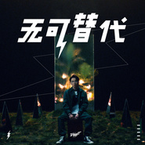

无可替代
============================

|  |  |
| :--: | :-- |
| [ 无可替代](https://emumo.xiami.com/album/2103705341) | **艺人**: [T-T](../index.md) **语种**: 国语 **唱片公司**: 华宇世博, 摩登天空 **发行时间**: 2018年05月10日 **专辑类别**: EP, 单曲 **专辑风格**:  **播放数**: 103717 **收藏数**: 55 **评论数**: 14  |

## 简介

Tizzy T《无可替代》及MV发布 黑色幽默开辟“T式”新风格  
  
近日，继摩登天空嘻哈厂牌MDSK旗下说唱艺人Tizzy T发布了《夜行动物园》第一支单曲《几乎成名》和MV后，第二支全新单曲《无可替代》及MV也随后发布。据悉，这首歌与早先曝光的《几乎成名》不同，是一首带有强烈Tizzy T个人风格标签的作品，直白、有趣同时又耐人琢磨，能与当下年轻人的生活有很大共鸣。歌曲中传达出了鼓励年轻人勇于正视自己，不再迷茫认清现实，定位好自我的价值去做最真实的自己。《无可替代》一上线便被许多网友带上“洗脑”“真实”“不做作”的标签，也在行业内得到了一致的好口碑，感同身受的同时也收获观众的好评连连。  
  
无惧“严苛目光”审视  《无可替代》展现“新”自我成就“新“力量  
  
回归歌曲和MV，《无可替代》用音乐语言阐述内心，镜头语言简洁有力，直观传达Tizzy T真实的自我。一方面“要活的像你自己，别忘记名字怎么写”的歌词让观者回味和反思，作为人这个独立个体本身的价值是不可被取代的。另一方面“但你是个倒霉鬼，这角色无人能代替”描述了每一个成长道路上的一个心态，虽然不是最优秀的但也是无可代替的自我。最后整个歌曲还穿插成长道路上的故事和缩影，“他已经在考硕士你文凭还在初中，但是他喜欢的女孩就是只对你心动”这是有关情感和成长的故事，是年轻一代的情感的真实写照。“你有件跟我一样的橘黄色卫衣，但你模仿不来我的气质无人能代替”歌词描述的细节就是特立独行的行为就是在彰显自我。整个歌曲从多个层面传达出了青春和成长其实就是励志本身，从“小”到“大”，从不知所措到认清现实、整装出发，这一切都是“无可替代”的宝贵财富。  
  
值得关注的是，《夜行动物园》第二支单曲《无可替代》及MV虽说是在表达自我,但其实也是送给粉丝和听众的。通过述说自己不被世人评判左右，“我”有“我”的价值观，这种人生态度去告诉那些和曾经迷茫的自己一样的年轻人,不要太拘泥于别人的眼光，价值是自己给自己的，无论如何你都还是这个世界上“无可替代”的那个你。希望歌迷也可以从她的歌曲中汲取到力量，去面对更多未知的困难。  
  
黑色幽默开辟“T式”新风格  演绎Tizzy T 多面性格  
  
据悉，《无可替代》歌曲中多次出现的“没有人能替代你”，不难发现虽然这好像是一句对别人说的话，但其实也是一种对自己的提醒。与开头的“没有人能替代我”前后呼应。用了黑色幽默“自嘲式”的对比，但实际上，确实是无法掩盖这之中所传达出的强烈的自我肯定。  
  
《无可替代》这首歌中每一处都在展现着Tizzy T自己的性格多面性。中间带有戏剧性的“你”与“他”的对比也是多次重复出现，貌似“你”很失败，“他”很成功，但是评判价值是自己给自己的，如果你认为自己是成功的，那你就是成功的，“黑色幽默式”的歌词其实反过来看实则是对自己的鼓励和安慰，自我怀疑的时候给自己的一种自我肯定。   
  
“独白式” 旋律被赞洗脑  无可替代的“你”“我”“他”获得一致好评  
  
歌曲上线后，不断上升的口碑都是对这首歌的肯定。无论从歌词、旋律，还是到mv的画面、声音，都表现优异，高质量的完成度，值得诚意推荐。听到《无可替代》时第一反应是觉得“洗脑”“有趣”，细细品味过后却有了不一样的心境，听到了这首歌曲，会想到曾经的自己，会反思现在的自己，我又没有在抱怨今天的自己？歌曲的真实，就是Tizzy T想送大家的礼物。  
  
摩登天空嘻哈厂牌MDSK旗下说唱艺人Tizzy T的全新单曲《无可替代》及MV得到满满点赞的之后，歌手Tizzy T还会有哪些让大家期待的惊喜没有来呢，让我们静候佳音吧！

## 曲目

## 评论

|  |  |  |  |
| :-- | :-- | :-- | :-- |
|  [虾米用户](https://emumo.xiami.com/u/441979591) 我还没想好要写什么... 2020-04-04 15:58 赞(0) 踩(0) | 
这么少人？
 |
|  [虾米用户](https://emumo.xiami.com/u/351101684) 我还没想好要写什么... 2018-09-01 17:31 赞(0) 踩(0) | 
5星好评
 |
|  [虾米用户](https://emumo.xiami.com/u/22263606)  2018-07-26 14:02 赞(0) 踩(0) | 
垃圾
 |
| ⇒ |  [虾米用户](https://emumo.xiami.com/u/346334447)  2018-08-11 11:51 赞(0) 踩(0) | 
会说唱吗，不要用键盘侠的身份来着BB，你爸妈没教你怎么说话吗。除了会乱码还会什么。搞笑你有能力请证明。不会就不要说，听你的音乐。请把你嘴角的shi擦好了，漱个口再好好说人话
 |
|  [虾米用户](https://emumo.xiami.com/u/10334424) 我还没想好要写什么... 2018-06-18 19:05 赞(0) 踩(0) | 
永远都是这个flow
 |
|  [虾米用户](https://emumo.xiami.com/u/320288876) 沉... 2018-06-18 17:40 赞(0) 踩(0) | 
永远注意你
 |
|  [虾米用户](https://emumo.xiami.com/u/357813073)  2018-06-10 22:36 赞(0) 踩(0) | 
你是无可替代的
 |
|  [虾米用户](https://emumo.xiami.com/u/353899436)  2018-05-16 12:29 赞(1) 踩(0) | 
加油TT，对了《几乎成名》怎么下了？
 |
|  [虾米用户](https://emumo.xiami.com/u/366932261)  2018-05-15 01:31 赞(0) 踩(0) | 
✌哈哈哈哈哈哈哈哈哈哈哈哈哈TizzyT   虽然这个歌  我可能不理解吧但是  还是很支持你
 |
| ⇒ |  [虾米用户](https://emumo.xiami.com/u/73775600)   2018-05-25 14:18 赞(0) 踩(0) | 
看MV就理解了
 |
|  [虾米用户](https://emumo.xiami.com/u/50793819) 。 2018-05-13 12:46 赞(1) 踩(0) | 
没人了哈哈哈哈哈 笑死 跟风狗呢都
 |
| ⇒ |  [虾米用户](https://emumo.xiami.com/u/366932261)  2018-05-15 01:30 赞(0) 踩(0) | 
？？？？
 |
|  [虾米用户](https://emumo.xiami.com/u/318629070) ba 2018-05-12 22:38 赞(0) 踩(0) | 
炒鸡喜欢喜欢T-T的呐
 |
|  [虾米用户](https://emumo.xiami.com/u/361332276)  2018-05-12 03:29 赞(1) 踩(0) | 
真皮沙发，为朕独尊。
 |
