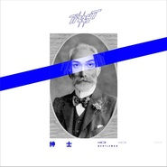

绅士Gentleman
============================

|  |  |
| :--: | :-- |
| [ 绅士Gentleman](https://emumo.xiami.com/album/2103711638) | **艺人**: [T-T](../index.md) **语种**: 国语 **唱片公司**: 摩登天空 **发行时间**: 2018年05月17日 **专辑类别**: EP, 单曲 **专辑风格**: 流行说唱 Pop Rap, 嘻哈 Hip-Hop **播放数**: 8032 **收藏数**: 42 **评论数**: 5  |

## 简介

Tizzy T “三部曲”进阶表达 《绅士》自我风格再突破  
摩登天空嘻哈厂牌MDSK旗下说唱艺人Tizzy T第三支单曲《绅士》发布上线。  
  
据悉，Tizzy T《夜行动物园》专辑已经发布了两支单曲和MV《几乎成名》、《无可替代》，此次第三首新歌《绅士》继续表达真我，但不同以往的作品，风格更为大胆。新专辑《夜行动物园》发布的第一首歌《几乎成名》述说了Tizzy T“过去自我”的蜕变，在被观众熟悉之后，他能够逐渐理性地对待出名后的各种声音，不会选择停滞不前，更多的专注于音乐创作，用作品和实力说话。  
  
第二首单曲《无可替代》洗脑的旋律，直白的唱出年轻的自信，无论你是谁，你都无可替代，是Tizzy T另一个更深层次的自我思考和价值肯定，表达每个个体都是独一无二的。如果说《几乎成名》是对“成名”的反思，《无可替代》是对“自我”的肯定，那么《绅士》则是对于“执着”的展望。三个不同纬度的自我剖析，能够通过音乐作品更好的认识到了Tizzy T丰富的一面。  
  
值得注意的是，新发的这首《绅士》基调上更加慷慨激昂，充满希望，基调上低沉冷静，节奏紧凑，充满攻击性的声音非常有力量。整首歌旋律大气磅礴，全是Tizzy T的真实表达。Tizzy T用“愤怒”“激烈”“反抗”展现他内心世界的呐喊，不同以往，风格更为大胆。  
  
《绅士》深刻剖析不同以往 呈现Tizzy T“冷静”“丰富”多面 《绅士》这首歌曲直观传达了Tizzy T的爆发，用音乐作品来“捍卫家园”，不再迷 茫和自我怀疑，用“命运一直掌握在手”，大胆的书写属于自己的梦。不再选择“争执”而是“保持绅士”，无人阻挡的前行。歌曲中充满了故事感，从音乐、生活、梦想三个层面来传达对自我的思考。  
  
开头的招呼像是Tizzy T以主人的姿态来迎接你进入他的世界，一方面，诠释对待音乐的态度，自称是一名骑士，对待音乐，像珍视的“公主”，愿意为之坚持提升“丰富”自己；另一方面还有他对生活和家人的“冷静”态度，在他的心中，有温柔的地方永远为家人开放；最后他还表达了会不惜一切代价，对自我的坚守：“我换上西装，把子弹上膛”认为自己已经长大，应该保护自己应该保护的人，不只是说唱和家人，他在用自己的能力捍卫自己的家园和自我的坚守。  
  
他用“子弹”、“弹药”等意象来表达作为音乐人背后所承受的压力。对感情的态度Tizzy T也在整首歌中做了特别的表达，他压低着声调像是一种诉求，“休想把她从我身边带走”歌词朴实平淡却能戳中我们的内心。重金属的敲打撕心裂肺又刻骨铭心，同时又给音乐蒙上了一层神秘的色彩。 巡演和新专辑两不误 Tizzy T用作品说话获得好评 据悉，Tizzy T在筹备新专辑《夜行动物园》的同时在全国十二个城市进行着Tizzy T2018年的中国巡演，巡演对应专辑主题，用十二种夜行动物代表十二座巡演城市，用新歌和精心挑选的曲目，力图在每一座城市给观众带来最佳的live演出。巡演现场透过作品，能感受到现在的Tizzy T已经蓄势待发，拥抱了崭新的自我，有粉丝评论：“《绅士》有难过，有怀念，有伤心，有不甘，有倔强，有冲破束缚的勇气和追逐自由的灵魂。”借着巡演和很快新专辑的发布，Tizzy T用作品和大家交流，更多人在Tizzy T的音乐中感同身受，期待Tizzy T带来的更多惊喜。

## 曲目

## 评论

|  |  |  |
| :-- | :-- | :-- |
|  [虾米用户](https://emumo.xiami.com/u/427574022) Spider-Man 2019-07-25 09:07 赞(1) 踩(0) | 
TT的声音真的太完美了
 |
|  [虾米用户](https://emumo.xiami.com/u/50280802) Under the Ho... 2019-05-06 23:13 赞(0) 踩(0) | 
-
 |
|  [虾米用户](https://emumo.xiami.com/u/357813073)  2018-06-10 22:36 赞(0) 踩(0) | 
很赞
 |
|  [虾米用户](https://emumo.xiami.com/u/341044904)  2018-06-05 13:04 赞(1) 踩(0) | 
薛之谦了解一下
 |
|  [虾米用户](https://emumo.xiami.com/u/140329404)  2018-05-19 18:45 赞(1) 踩(0) | 
加油超级赞
 |
