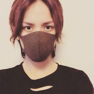
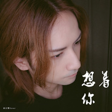
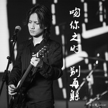
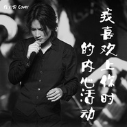
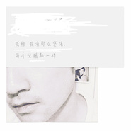

徐云霄
============================

|  |  |
| :--: | :-- |
| [ 徐云霄](https://i.xiami.com/xuyunxiao) | **地区**: China 中国大陆 **风格**: 华语唱作人 Chinese Singer-Songwriter **播放数**: 9532153 **粉丝数**: 961 **评论数**: 79  |

## 档案

《旋风少女2》电视原声 【如果可以】- 胡夏 （作词/作曲:徐云霄） 
2009年 担任“王传君主演电视剧【超级偶像】主题曲“-倔强的希望 作词/作曲

## 专辑

| 名称 | 语种 | 唱片公司 | 发行时间 | 专辑类别 | 专辑风格 |
| :--: | :-- | :-- | :-- | :-- | :-- |
| [ 想着你Cover 郭顶](./albums/2102860126.md) | 国语 | 独立发行 | 2017年09月20日 | 录音室专辑 | 流行 Pop |
| [ 不如](./albums/2102812356.md) | 国语 | JSJ杰思国际娱乐 | 2017年08月11日 | EP, 单曲 |  |
| [ 敢爱的冲动](./albums/2100298994.md) | 国语 | JSJ杰思国际娱乐 | 2017年08月03日 | EP, 单曲 | 国语流行 Mandarin Pop |
| [ 吻你之时别再躲 Re arrange （欢乐颂2 插曲）Cover 杨烁](./albums/2102756024.md) | 国语 | 独立发行 | 2017年05月29日 | 录音室专辑 | 流行 Pop |
| [ 我喜欢上你时的内心活动 Re arrangeCover 陈绮贞](./albums/2102745313.md) | 国语 | 独立发行 | 2017年05月09日 | 录音室专辑 | 流行 Pop |
| [ 崇拜( Cover 梁静茹）](./albums/2102732735.md) | 国语 | 独立发行 | 2017年04月15日 | EP, 单曲 | 流行 Pop |
| [ 因为遇见你电视剧【因为遇见你】同名片尾曲](./albums/2102726800.md) | 国语 | 独立发行 | 2017年04月03日 | 录音室专辑 | 流行 Pop |
| [ 凉凉Cover 张碧晨&杨宗纬 Re arrange](./albums/2102708104.md) | 国语 | 独立发行 | 2017年03月09日 | 录音室专辑 | 国语流行 Mandarin Pop |
| [ 后来的我们（Cover 五月天）AM-3:33版翻唱](./albums/2102702776.md) | 国语 | 独立发行 | 2017年03月02日 | 录音室专辑 | 流行 Pop |
| [ 灵魂伴侣原唱 田馥甄](./albums/2102688649.md) | 国语 | 独立发行 | 2017年02月04日 | EP, 单曲 | 流行 Pop |
| [ 翻唱（重编版伴奏）MONO](./albums/2102662458.md) | 其他 | 独立发行 | 2016年12月11日 | 录音室专辑 | 浩室舞曲 House |
| [ Whevever you are - one ok rock翻唱](./albums/2102661632.md) | 英语 | 独立发行 | 2016年12月09日 | 录音室专辑 |  |
| [ 好好 (想把你写成一首歌) (电影《你的名字》中文宣传主题曲)Cover 五月天 Re arrange](./albums/2102659561.md) | 国语 | 独立发行 | 2016年12月05日 | 录音室专辑 | 流行 Pop |
| [ 翻唱先Cover 后创作](./albums/2102407155.md) | 国语 |  | 2016年10月15日 | 录音室专辑 | 国语流行 Mandarin Pop |
| [ 我想我没那么坚强，每个女孩都一样I think I'm not that strong, as each girl](./albums/2100173066.md) | 国语 | 独立发行 | 2015年07月31日 | EP, 单曲 | 迷幻流行 Psychedelic Pop, 独立流行 Indie Pop |
| [ 我幸福你](./albums/557806.md) | 国语 | 青春伙伴 | 2012年11月20日 | EP, 单曲 |  |

## 评论

|  |  |  |
| :-- | :-- | :-- |
|  [虾米用户](https://emumo.xiami.com/u/358104299) 悲观的唯心存在现实解构虚... 2020-12-28 03:14 赞(0) 踩(0) | 
44382
 |
|  [虾米用户](https://emumo.xiami.com/u/378330797) 我还没想好要写什么... 2020-01-27 13:10 赞(0) 踩(0) | 
他现在还唱吗？ 找不到更新的歌曲
 |
|  [虾米用户](https://emumo.xiami.com/u/411597829) 一年能等吗？ 2019-06-09 01:01 赞(0) 踩(0) | 
无意中听到虾米推荐，喜欢你唱歌的感觉，温柔中带着一点点的哀伤…
 |
|  [虾米用户](https://emumo.xiami.com/u/424758500)  2019-06-08 23:43 赞(1) 踩(0) | 
超喜欢您的歌，尤其是崇拜，一直在单循
 |
|  [虾米用户](https://emumo.xiami.com/u/43343789)   2018-04-22 22:21 赞(0) 踩(0) | 
特别喜欢你，今天循环的是灵魂伴侣
 |
|  [虾米用户](https://emumo.xiami.com/u/34593165) 我还没想好要写什么... 2018-03-23 00:14 赞(1) 踩(0) | 
和同学撞名字 
 |
|  [虾米用户](https://emumo.xiami.com/u/269553617) 人就像寒冬里的刺猬，靠得... 2017-12-30 12:20 赞(1) 踩(0) | 
加油
 |
|  [虾米用户](https://emumo.xiami.com/u/293323124)   2017-12-29 07:10 赞(1) 踩(0) | 
听小说我不喜欢这世界 我只喜欢你 尾曲是这首 很好听！
 |
|  [虾米用户](https://emumo.xiami.com/u/321787267) 音乐，那是我的药！ 2017-12-24 13:11 赞(0) 踩(0) | 
加油哦(&amp;acute;-&amp;omega;-`)
 |
|  [虾米用户](https://emumo.xiami.com/u/335440417)  2017-12-05 16:48 赞(3) 踩(0) | 
我来自马来西亚, 非常喜欢你的声音!!! 希望可以听到更多你的作品 ❤️❤️❤️
 |
|  [虾米用户](https://emumo.xiami.com/u/9456600)  2017-11-30 15:49 赞(4) 踩(0) | 
今日推荐歌单里随机播的声音，整个办公室都沉沦了，纷纷打听唱歌的是谁，于是寻来主页了。这声音温暖、磁性，像共振在心房。
 |
|  [虾米用户](https://emumo.xiami.com/u/307462274)  2017-10-06 22:09 赞(1) 踩(0) | 
爱你
 |
|  [虾米用户](https://emumo.xiami.com/u/307462274)  2017-10-06 22:08 赞(0) 踩(0) | 
                              
 |
|  [虾米用户](https://emumo.xiami.com/u/324536693) 我天生就那么美，那么好。 2017-09-28 06:18 赞(1) 踩(0) | 
我好喜欢你的
 |
|  [虾米用户](https://emumo.xiami.com/u/260988274)  2017-09-04 17:05 赞(0) 踩(0) | 
   
 |
|  [虾米用户](https://emumo.xiami.com/u/321668891) 喜欢就说 2017-08-29 17:50 赞(2) 踩(0) | 
你唱的歌真好听
 |
|  [虾米用户](https://emumo.xiami.com/u/317466646)  2017-08-29 12:38 赞(1) 踩(0) | 
你是一个怎么样的人
 |
|  [虾米用户](https://emumo.xiami.com/u/312900424) 活泼好动 2017-08-26 13:28 赞(1) 踩(0) | 
好听好听
 |
|  [虾米用户](https://emumo.xiami.com/u/321028233)  2017-08-23 12:31 赞(2) 踩(0) | 
敢爱的冲动很好听
 |
|  [虾米用户](https://emumo.xiami.com/u/317686238)  成全 2017-08-16 23:41 赞(1) 踩(0) | 
敢爱的冲动 这一次我不放手
 |
|  [虾米用户](https://emumo.xiami.com/u/277573440)   2017-08-11 18:31 赞(0) 踩(0) | 
敢爱的冲动好听
 |
|  [虾米用户](https://emumo.xiami.com/u/310908582) 就爱听听歌，就爱听，就不... 2017-08-10 17:06 赞(1) 踩(0) | 
敢爱的冲动，那么我来八卦一下香菇先生大大，你有女朋友吗，有的话，。。。。。
 |
| ⇒ |  [虾米用户](https://emumo.xiami.com/u/3552342) 孤独一人 照顾星辰 2017-09-22 01:33 赞(0) 踩(0) | 
他女朋友就是香菇啊，<a href="http://i.xiami.com/xvfei?spm=a1z1s.6632057.1392350353.2.PCeVqw" target="_blank" rel="nofollow noreferrer noopener">http://i.xiami.com/xvfei?spm=a1z1s.6632057.1392350353.2.PCeVqw</a>
 |
|  [虾米用户](https://emumo.xiami.com/u/262954577) 活泼 而且 可爱 2017-08-10 12:41 赞(2) 踩(0) | 
你好我是蓝瘦小姐！好啦开玩笑的，加油。
 |
|  [虾米用户](https://emumo.xiami.com/u/169405612)  2017-08-05 22:43 赞(3) 踩(0) | 
你的声音很有特点，歌很好听，听着歌感觉在回味电视剧的剧情，很有感情。第一次在浪花一朵朵的片尾听到就果断下歌了。
 |
|  [虾米用户](https://emumo.xiami.com/u/39226365) X XX X XX XX... 2017-07-04 07:17 赞(3) 踩(0) | 
很好听 同学推荐的 早起好舒服
 |
|  [虾米用户](https://emumo.xiami.com/u/53722244) 一万首的mp3 一万次瘋... 2017-06-30 18:43 赞(3) 踩(0) | 
好日系的男生啊
 |
|  [虾米用户](https://emumo.xiami.com/u/302304781) 在大大世界里，一个有一个... 2017-06-28 22:57 赞(15) 踩(0) | 
如果把原唱比作巧克力，那么你的歌就是巧克力制品，既有巧克力的浓郁，又不失自己的独特 好喜欢你～
 |
| ⇒ |  [虾米用户](https://emumo.xiami.com/u/2882310)   2017-06-29 05:00 赞(0) 踩(0) | 
很酷的比喻_谢谢你
 |
| ⇒ |  [虾米用户](https://emumo.xiami.com/u/302304781) 在大大世界里，一个有一个... 2017-06-29 10:17 赞(0) 踩(0) | 
<q><b>徐云霄说：</b></q>
 |
|  [虾米用户](https://emumo.xiami.com/u/284025686) 音乐是水，我不爱它，可却... 2017-05-28 22:33 赞(2) 踩(0) | 
刚刚为了这首歌下载了虾米 冲着五月天来的 但是听到你的发现好舒服---五月天的歌是最棒的 但是他们毕竟摇滚主打 所有的歌听多了难免耳朵乱 你的风格很清晰
 |
|  [虾米用户](https://emumo.xiami.com/u/41691196)  2017-05-05 16:57 赞(1) 踩(0) | 
赞赞赞 加油！
 |
|  [虾米用户](https://emumo.xiami.com/u/132670672) 突然好想你 你会在哪里 2017-04-30 18:45 赞(1) 踩(0) | 
后来的我们没五月天唱的好听 有一段跑音
 |
| ⇒ |  [虾米用户](https://emumo.xiami.com/u/193925224) Mayday最高‼︎大事... 2017-05-04 00:06 赞(0) 踩(0) | 
如果要留这种言那就不要听啊没人逼你听
 |
| ⇒ |  [虾米用户](https://emumo.xiami.com/u/281505511) 猪始终都是猪，人有时不是... 2017-08-21 23:58 赞(0) 踩(0) | 
没你家五月天好听你还听，你有毒啊 
 |
| ⇒ |  [虾米用户](https://emumo.xiami.com/u/132670672) 突然好想你 你会在哪里 2017-08-23 07:53 赞(0) 踩(0) | 
<q><b>ねんね说：</b></q>
 |
| ⇒ |  [虾米用户](https://emumo.xiami.com/u/132670672) 突然好想你 你会在哪里 2017-08-23 07:53 赞(0) 踩(0) | 
<q><b>则安说：</b></q>
 |
| ⇒ |  [虾米用户](https://emumo.xiami.com/u/281505511) 猪始终都是猪，人有时不是... 2017-08-23 13:07 赞(0) 踩(0) | 
<q><b>天丶说：</b></q>
 |
| ⇒ |  [虾米用户](https://emumo.xiami.com/u/132670672) 突然好想你 你会在哪里 2017-08-24 22:31 赞(0) 踩(0) | 
<q><b>则安说：</b></q>
 |
| ⇒ |  [虾米用户](https://emumo.xiami.com/u/281505511) 猪始终都是猪，人有时不是... 2017-08-24 22:49 赞(0) 踩(0) | 
<q><b>天丶说：</b></q>
 |
|  [虾米用户](https://emumo.xiami.com/u/248226602)  2017-04-27 22:26 赞(0) 踩(0) | 
好听~
 |
|  [虾米用户](https://emumo.xiami.com/u/48910291) 人生就是一场梦 2017-04-13 09:19 赞(1) 踩(0) | 
哇，发现我的新偶像，  
 |
|  [虾米用户](https://emumo.xiami.com/u/118661288)   2017-04-05 22:48 赞(0) 踩(0) | 
  好听！
 |
|  [虾米用户](https://emumo.xiami.com/u/222824210)  2017-03-31 21:26 赞(0) 踩(0) | 
超喜欢你的声音
 |
|  [虾米用户](https://emumo.xiami.com/u/14057233) 我明白有些感情难再体会。 2017-03-18 09:23 赞(0) 踩(0) | 
眼睛长得有点像toma
 |
|  [虾米用户](https://emumo.xiami.com/u/106220694)   2017-03-10 02:00 赞(0) 踩(0) | 
喜欢喜欢
 |
|  [虾米用户](https://emumo.xiami.com/u/262305171)  2017-01-18 23:36 赞(1) 踩(0) | 
哈喽  这个 好好的伴奏 贼喜欢 能分享下吗？
 |
| ⇒ |  [虾米用户](https://emumo.xiami.com/u/2882310)   2017-02-10 14:20 赞(0) 踩(0) | 
主页有伴奏专辑
 |
| ⇒ |  [虾米用户](https://emumo.xiami.com/u/2882310)   2017-05-18 03:09 赞(0) 踩(0) | 
怎么在主页留言 我有上传单声道伴奏
 |
| ⇒ |  [虾米用户](https://emumo.xiami.com/u/262305171)  2017-06-03 13:16 赞(0) 踩(0) | 
<q><b>徐云霄说：</b></q>
 |
|  [虾米用户](https://emumo.xiami.com/u/260531635)  2017-01-09 00:17 赞(0) 踩(0) | 
耳朵已怀孕。
 |
|  [虾米用户](https://emumo.xiami.com/u/260531635)  2017-01-09 00:16 赞(0) 踩(0) | 
蓝瘦
 |
|  [虾米用户](https://emumo.xiami.com/u/233324424)   2016-12-19 01:07 赞(2) 踩(0) | 
声音很暖  加油加油 ʚ◡̈⃝ɞ
 |
|  [虾米用户](https://emumo.xiami.com/u/246459887)  2016-12-11 00:39 赞(2) 踩(0) | 
可以分享给我好好（想把你写成一首歌）的伴奏吗，急啊
 |
| ⇒ |  [虾米用户](https://emumo.xiami.com/u/2882310)   2017-02-10 14:20 赞(0) 踩(0) | 
主页有伴奏专辑分享
 |
| ⇒ |  [虾米用户](https://emumo.xiami.com/u/2882310)   2017-05-18 03:09 赞(0) 踩(0) | 
怎么不在歌曲下留言 我有上传 单声道伴奏
 |
| ⇒ |  [虾米用户](https://emumo.xiami.com/u/321823575) 香米 2017-08-31 15:00 赞(0) 踩(0) | 
<q><b>徐云霄说：</b></q>
 |
| ⇒ |  [虾米用户](https://emumo.xiami.com/u/321823575) 香米 2017-08-31 15:01 赞(0) 踩(0) | 
<q><b>徐云霄说：</b></q>
 |
|  [虾米用户](https://emumo.xiami.com/u/73721088) 心若向阳，无畏悲伤 2015-10-15 15:48 赞(1) 踩(0) | 
加油！香菇  
 |
|  [虾米用户](https://emumo.xiami.com/u/73721088) 心若向阳，无畏悲伤 2015-10-15 15:48 赞(2) 踩(0) | 
分享  徐云霄 的歌曲《MAMIYA－DEMO》<a href="http://www.xiami.com/song/1774891174" target="_blank" rel="nofollow noreferrer noopener">http://www.xiami.com/song/1774891174</a>（分享自@虾米音乐）
 |
|  [虾米用户](https://emumo.xiami.com/u/1931086) 正义，或许会迟到，但永远... 2015-10-12 12:46 赞(2) 踩(0) | 
支持云霄的原创音乐。
 |
| ⇒ |  [虾米用户](https://emumo.xiami.com/u/2882310)   2015-10-12 14:13 赞(0) 踩(0) | 
谢谢 哈哈
 |
|  [虾米用户](https://emumo.xiami.com/u/36388572)   2015-08-07 01:08 赞(1) 踩(0) | 
喜欢你的那首歌、一直盼着的单曲终于出了  
 |
|  [虾米用户](https://emumo.xiami.com/u/830118)  2015-08-02 13:25 赞(0) 踩(0) | 
终于放出这首单曲啦，赞
 |
|  [虾米用户](https://emumo.xiami.com/u/414118)   2015-08-01 10:31 赞(2) 踩(0) | 
支持一下云霄！
 |
|  [虾米用户](https://emumo.xiami.com/u/28585501)  2015-07-31 23:57 赞(0) 踩(0) | 
香菇好棒啊
 |
|  [虾米用户](https://emumo.xiami.com/u/54106914)  2015-07-31 21:34 赞(1) 踩(0) | 
好好听哦，希望能把更多好听音乐带给我们，加油！
 |
|  [虾米用户](https://emumo.xiami.com/u/54106914)  2015-07-31 21:30 赞(2) 踩(0) | 
原创歌曲非常地好听，继续加油。
 |
|  [虾米用户](https://emumo.xiami.com/u/2882310)   2015-07-31 11:02 赞(51) 踩(0) | 
我刚入驻了虾米音乐人，欢迎大家来我的个人主页，收听我的最新音乐
 |
|  [虾米用户](https://emumo.xiami.com/u/1931086) 正义，或许会迟到，但永远... 2015-07-31 10:22 赞(0) 踩(0) | 
欢迎香菇先生徐云霄入驻虾米音乐人。
 |
|  [虾米用户](https://emumo.xiami.com/u/53847950) 此生到尽头 你是谁 曾怎... 2015-07-30 01:11 赞(1) 踩(0) | 
从前有一个电台叫香菇电台，里面有一个主播叫香菇大帝，然而我并不认识他，直到有一天……原来你很优秀
 |
|  [虾米用户](https://emumo.xiami.com/u/9301514) 独立唱作人 2014-08-27 20:48 赞(1) 踩(0) | 
梦之声原创很赞啊。
 |
|  [虾米用户](https://emumo.xiami.com/u/682784) 人要去做自己渴望的事，内... 2014-05-05 20:49 赞(3) 踩(0) | 
蘑菇跟香菇，啊哈哈哈
 |
|  [虾米用户](https://emumo.xiami.com/u/28589649)  2014-03-15 19:56 赞(23) 踩(0) | 
香菇
 |
|  [虾米用户](https://emumo.xiami.com/u/1931086) 正义，或许会迟到，但永远... 2013-11-29 11:46 赞(1) 踩(0) | 
欢迎徐菲登陆虾米音乐人，我对徐云霄登陆虾米音乐人表示期待。
 |
|  [虾米用户](https://emumo.xiami.com/u/1931086) 正义，或许会迟到，但永远... 2013-07-05 12:32 赞(0) 踩(0) | 
虾米艺人主页徐菲专栏。请大家来光临一下。 <a href="http://www.xiami.com/artist/2072992358?spm=0.0.0.0.iNSdOn&amp;amp;ref=ac-index" target="_blank" rel="nofollow noreferrer noopener">http://www.xiami.com/artist/2072992358?spm=0.0.0.0.iNSdOn&amp;amp;ref=ac-index</a>
 |
|  [虾米用户](https://emumo.xiami.com/u/1079525)  2013-06-20 14:40 赞(1) 踩(0) | 
喜欢徐云霄和徐菲，加油！
 |
|  [虾米用户](https://emumo.xiami.com/u/3542041)  2013-05-31 20:59 赞(0) 踩(0) | 
为什么只有一首嘛。说好了不分开超好听的
 |
|  [虾米用户](https://emumo.xiami.com/u/1931086) 正义，或许会迟到，但永远... 2013-05-25 21:39 赞(0) 踩(0) | 
我看了中国梦之声的第一期后就发现你特别地有才华。你还要载着徐菲的梦想，加油吧。
 |
