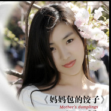

肖洋
============================

|  |  |
| :--: | :-- |
| [ 肖洋](https://i.xiami.com/xy1989) | **地区**: China 中国大陆 **风格**: 流行 Pop **播放数**: 5653240 **粉丝数**: 384 **评论数**: 23  |

## 档案

## 专辑

| 名称 | 语种 | 唱片公司 | 发行时间 | 专辑类别 | 专辑风格 |
| :--: | :-- | :-- | :-- | :-- | :-- |
| [ 日光菩萨咒](./albums/5022157585.md) | 国语 | 独立发行 | 2020年12月10日 | 录音室专辑 | 流行 Pop |
| [ 地藏王菩萨赞](./albums/5021706457.md) | 国语 | 独立发行 | 2020年10月21日 | 录音室专辑 | 古典音乐 Classical |
| [ 月光菩萨咒](./albums/5021681515.md) | 国语 | 独立发行 | 2020年10月15日 | 录音室专辑 | 流行 Pop |
| [ 峨眉山古琴版](./albums/5021089854.md) | 国语 | 独立发行 | 2020年07月15日 | 录音室专辑 | 国语流行 Mandarin Pop |
| [ 药师灌顶真言（新版）](./albums/5021006501.md) | 国语 | 独立发行 | 2020年06月28日 | 录音室专辑 | 古典音乐 Classical |
| [ 文殊菩萨心咒](./albums/5020894766.md) | 国语 | 独立发行 | 2020年06月16日 | 录音室专辑 | 古典音乐 Classical |
| [ 药师灌顶真言](./albums/2108280693.md) | 国语 | 独立发行 | 2020年04月01日 | 录音室专辑 | 流行 Pop |
| [ 峨眉山](./albums/2105268616.md) | 国语 |  | 2019年09月22日 | 录音室专辑 | 流行 Pop |
| [ 心中的歌唱（柔情版）](./albums/2105140831.md) | 国语 |  | 2019年08月10日 | 录音室专辑 | 佛教音乐 Buddhist Music |
| [ 报父母恩（新版）](./albums/2105100417.md) | 国语 |  | 2019年08月08日 | EP, 单曲 | 流行 Pop |
| [ 寂静的夜我问月](./albums/2104988523.md) | 国语 |  | 2019年07月12日 | 录音室专辑 | 流行 Pop |
| [ 报父母恩](./albums/2104982594.md) | 国语 |  | 2019年07月10日 | 录音室专辑 | 流行 Pop |
| [ 祈请文](./albums/2104973287.md) | 国语 |  | 2019年07月05日 | 录音室专辑 | 佛教音乐 Buddhist Music |
| [ 心中的歌唱](./albums/2104896032.md) | 国语 |  | 2019年05月24日 | EP, 单曲 | 流行 Pop |
| [ 昨夜的泪痕](./albums/2104888714.md) | 国语 |  | 2019年05月22日 | EP, 单曲 | 流行 Pop |
| [ 肖洋十首金曲合辑](./albums/2103698715.md) | 国语 | 壹字唱片 | 2018年04月28日 | 录音室专辑 |  |
| [ 百字明](./albums/2103647350.md) | 国语 | 壹字唱片 | 2018年03月22日 | EP, 单曲 |  |
| [ 放歌新时代](./albums/2103499432.md) | 国语 | 壹字唱片 | 2018年01月24日 | EP, 单曲 |  |
| [ 爱情独立日DJ版](./albums/2102945149.md) | 国语 | 壹字唱片 | 2017年11月20日 | EP, 单曲 |  |
| [ 赶走寂寞](./albums/2102729544.md) | 国语 | 壹字唱片 | 2017年04月10日 | EP, 单曲 |  |
| [ 你在我的思念里](./albums/2102681747.md) | 国语 | 壹字唱片 | 2017年01月17日 | EP, 单曲 |  |
| [ 一个人的情人节](./albums/2102659706.md) | 国语 | 魔音文化 | 2016年12月05日 | EP, 单曲 |  |
| [ 飘雨的季节](./albums/2102643054.md) | 国语 | 魔音文化 | 2016年10月31日 | EP, 单曲 |  |
| [ 走进阿西里西](./albums/2102401915.md) | 国语 | 魔音文化 | 2016年09月19日 | EP, 单曲 |  |
| [ 丝丝小雨](./albums/2100375154.md) | 国语 | 魔音文化 | 2016年08月01日 | EP, 单曲 |  |
| [ 小卓玛](./albums/2100359277.md) | 国语 | 魔音文化 | 2016年06月27日 | EP, 单曲 |  |
| [ 妈妈包的饺子](./albums/2100206312.md) | 国语 | 歌缘文化 | 2016年05月30日 | EP, 单曲 |  |
| [ 父爱如山](./albums/2100337174.md) | 国语 | 魔音文化 | 2016年05月16日 | EP, 单曲 |  |
| [ 捧着笑脸乐哈哈](./albums/2100324738.md) | 国语 | 魔音文化 | 2016年04月28日 | EP, 单曲 |  |
| [ 有事你就说](./albums/2100306630.md) | 国语 | 金麦田文化 | 2016年04月05日 | EP, 单曲 |  |
| [ 渭河故事](./albums/2100295708.md) | 国语 | 魔音文化 | 2016年03月18日 | EP, 单曲 |  |
| [ 火苗](./albums/2100242856.md) | 国语 | 歌缘文化 | 2015年11月30日 | EP, 单曲 |  |
| [ 又见炊烟](./albums/2100242912.md) | 国语 | 金麦田文化 | 2015年11月30日 | EP, 单曲 |  |
| [ 舞女泪](./albums/2100239672.md) | 国语 | 金麦田文化 | 2015年11月19日 | EP, 单曲 |  |
| [ 爱情独立日](./albums/2100235806.md) | 国语 |  | 2015年11月11日 | EP, 单曲 |  |
| [ 行走的彩虹](./albums/2100220524.md) | 国语 | 金麦田文化 | 2015年10月15日 | EP, 单曲 |  |
| [ 真爱的人](./albums/1435297482.md) | 国语 | 歌缘文化 | 2015年06月23日 | EP, 单曲 |  |
| [ 叶子](./albums/212843112.md) | 国语 | 百人文化 | 2014年09月26日 | EP, 单曲 |  |
| [ 但愿人长久](./albums/1202985514.md) | 国语 | 金麦田文化 | 2014年06月16日 | EP, 单曲 |  |
| [ 我和我的家](./albums/794158853.md) | 国语 | 金麦田文化 | 2014年03月04日 | EP, 单曲 |  |
| [ 一朵](./albums/557827.md) | 国语 | 独立发行 | 2012年10月01日 | 录音室专辑 |  |

## 评论

|  |  |  |
| :-- | :-- | :-- |
|  [虾米用户](https://emumo.xiami.com/u/358104299) 悲观的唯心存在现实解构虚... 2020-12-20 13:12 赞(0) 踩(0) | 
43512
 |
|  [虾米用户](https://emumo.xiami.com/u/272017031) 清静以为天下正。谦虚，随... 2020-08-28 10:31 赞(0) 踩(0) | 
好
 |
|  [虾米用户](https://emumo.xiami.com/u/376885395)  2020-04-23 21:05 赞(1) 踩(0) | 
   
 |
|  [虾米用户](https://emumo.xiami.com/u/376885395)  2020-04-23 21:04 赞(1) 踩(0) | 
声音好听，人也美唱出歌也好听，唱出了一个好春天
 |
|  [虾米用户](https://emumo.xiami.com/u/426682984) 广交善缘 2020-02-23 09:39 赞(0) 踩(0) | 
本家就是厉害，挺你加油
 |
|  [虾米用户](https://emumo.xiami.com/u/320865992) 我还没想好要写什么... 2019-10-20 10:48 赞(1) 踩(0) | 
你的声音好特殊 我想知道你的故事
 |
|  [虾米用户](https://emumo.xiami.com/u/353406727) 音乐.无疆界 2019-09-11 00:20 赞(1) 踩(0) | 
好听的歌 
 |
|  [虾米用户](https://emumo.xiami.com/u/259438775) 一曲肝肠断，天涯何处觅知... 2019-05-24 22:19 赞(1) 踩(0) | 
美
 |
|  [虾米用户](https://emumo.xiami.com/u/338149852)  2019-03-05 19:53 赞(1) 踩(0) | 
 
 |
|  [虾米用户](https://emumo.xiami.com/u/358389277) 清风徐来，水波荡漾，明月... 2019-01-28 20:20 赞(1) 踩(0) | 
肖洋唱得好棒
 |
|  [虾米用户](https://emumo.xiami.com/u/333913345)             ... 2018-05-27 12:27 赞(0) 踩(0) | 
加油
 |
|  [虾米用户](https://emumo.xiami.com/u/325412377) 听听音乐，开开心 2017-11-30 19:51 赞(1) 踩(0) | 
人美歌美
 |
|  [虾米用户](https://emumo.xiami.com/u/272044429) 心若没有栖息的地方，人到... 2017-07-13 23:50 赞(1) 踩(0) | 
真好
 |
|  [虾米用户](https://emumo.xiami.com/u/308128363)  2017-06-28 18:54 赞(0) 踩(0) | 
这歌还不错
 |
|  [虾米用户](https://emumo.xiami.com/u/256614530)  2017-03-26 07:37 赞(0) 踩(0) | 
好喜欢《你曾是少年》，有类似的歌么？
 |
|  [虾米用户](https://emumo.xiami.com/u/276236152)  2017-02-26 11:00 赞(0) 踩(0) | 
beautiful.ilike
 |
|  [虾米用户](https://emumo.xiami.com/u/60561226)  2016-06-06 19:31 赞(2) 踩(0) | 
好看身材棒
 |
|  [虾米用户](https://emumo.xiami.com/u/6770643) 谨言慎行，戒急用忍 2015-09-14 00:05 赞(1) 踩(0) | 
脸蛋、身材都不错
 |
|  [虾米用户](https://emumo.xiami.com/u/33385349) 臭板儿是个傻逼。 2015-08-26 15:59 赞(0) 踩(0) | 
买过精装版。
 |
|  [虾米用户](https://emumo.xiami.com/u/27541482) 失去翅膀的鸟儿 2015-01-30 08:06 赞(0) 踩(0) | 
是非
 |
|  [虾米用户](https://emumo.xiami.com/u/13937861) 我还没想好要写什么... 2014-12-28 19:45 赞(1) 踩(0) | 
尹相杰女友曝光：小其20岁 曾为房祖名求情
 |
|  [虾米用户](https://emumo.xiami.com/u/4924123) 发夕=傍晚出发 2014-12-28 11:04 赞(1) 踩(0) | 
传说中rapper的女朋友..
 |
|  [虾米用户](https://emumo.xiami.com/u/33908413)   2014-05-05 20:55 赞(1) 踩(0) | 
占个沙发先〜〜
 |
