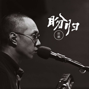

盼归
============================

|  |  |
| :--: | :-- |
| [ 盼归](https://emumo.xiami.com/album/2103519929) | **艺人**: [赵鹏](../index.md) **语种**: 国语 **唱片公司**: 明日明星文化 **发行时间**: 2018年02月02日 **专辑类别**: EP, 单曲 **专辑风格**:  **播放数**: 80596 **收藏数**: 161 **评论数**: 16  |

## 简介

《盼归》年少离家，曾经繁华的金刚碑日渐萧条，家里的老灶台已经有斑鸠驻窝……这首歌发于2018年春节之际，充分表达了老家亲朋好友盼望在外游子归家的心情，配合赵鹏深沉有磁性的声音，有种娓娓道来的感动和感伤。

## 曲目

- [盼归](./2103519929/xN2ayva2b99.md)
- [盼归 (伴奏)](./2103519929/mSHb9Mdbec7.md)

## 评论

|  |  |  |
| :-- | :-- | :-- |
|  [虾米用户](https://emumo.xiami.com/u/3656928) That I have ... 2019-06-25 21:50 赞(0) 踩(0) | 
没想象中的好
 |
|  [虾米用户](https://emumo.xiami.com/u/360628854) 体态律动 2019-06-19 09:34 赞(0) 踩(0) | 
好听
 |
|  [虾米用户](https://emumo.xiami.com/u/32717711)  2019-05-17 07:32 赞(0) 踩(0) | 
非常好
 |
|  [虾米用户](https://emumo.xiami.com/u/356824831) 笑看云起 2019-04-04 22:22 赞(0) 踩(0) | 
很喜欢听《归来》……缓缓的节奏，词曲俱佳，配器好，唱得好，每一次听到，都很感动！
 |
|  [虾米用户](https://emumo.xiami.com/u/422512370)  2019-03-30 20:49 赞(1) 踩(0) | 
喜欢赵鹏独特的声音，很有韵味！
 |
|  [虾米用户](https://emumo.xiami.com/u/6958839)  2018-09-22 00:05 赞(1) 踩(0) | 
超喜欢赵鹏，喜欢那份优雅和庸懒
 |
|  [虾米用户](https://emumo.xiami.com/u/331362602) 七味草 2018-05-14 22:15 赞(0) 踩(0) | 
好高兴认识你!
 |
|  [虾米用户](https://emumo.xiami.com/u/8277413) 顺其自然…… 2018-05-03 20:23 赞(0) 踩(0) | 
很喜欢赵鹏 
 |
|  [虾米用户](https://emumo.xiami.com/u/9463262) 暂无 2018-02-15 09:39 赞(0) 踩(0) | 
啥时候剪头发了？！（关注点是不是错了&amp;hellip;&amp;hellip;）   
 |
|  [虾米用户](https://emumo.xiami.com/u/145675566)  2018-02-10 09:14 赞(1) 踩(0) | 
这么好的音乐人怎么这么少
 |
|  [虾米用户](https://emumo.xiami.com/u/4970021) 自由行走的音符 2018-02-09 12:51 赞(2) 踩(0) | 
赵鹏的声音就如同故事的讲述者，音乐娓娓道来，淡淡的画面一幅幅展现。
 |
|  [虾米用户](https://emumo.xiami.com/u/226101496)  2018-02-09 11:03 赞(0) 踩(0) | 
喜欢赵鹏的低音炮，加油！
 |
|  [虾米用户](https://emumo.xiami.com/u/14940959)  2018-02-08 09:57 赞(0) 踩(0) | 
先别走先别走
 |
|  [虾米用户](https://emumo.xiami.com/u/47503116) 简单，快乐：自在 2018-02-08 01:43 赞(0) 踩(0) | 
鹏哥的新专网易木有哦
 |
|  [虾米用户](https://emumo.xiami.com/u/11263640) 我还没想好要写什么... 2018-02-07 17:14 赞(0) 踩(0) | 
赵鹏的声音依然如故、温暖人心深沉入耳可回味，可惜虾米听不到他大部分好听的歌啦
 |
|  [虾米用户](https://emumo.xiami.com/u/533358)   2018-02-07 15:36 赞(0) 踩(0) | 
赵鹏加油
 |
