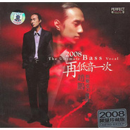

再低音一次
============================

|  |  |
| :--: | :-- |
| [ 再低音一次](https://emumo.xiami.com/album/33232) | **艺人**: [赵鹏](../index.md) **语种**: 国语 **唱片公司**: 柏菲唱片 **发行时间**: 2007年11月30日 **专辑类别**: 录音室专辑 **专辑风格**:  **播放数**: 4913248 **收藏数**: 2363 **评论数**: 139  |

## 简介

重磅落地  
新碟轰动乐坛  
柏菲赵鹏 联手炮制  
一碟叹为听止  
声音出众 作品出色 编配出彩  
赵鹏再次挑战男声低音新极限  
  
曾几何时，赵鹏以其首张个人发烧大碟“男声低音炮”而一炮打响，一炮走红，在Hifi乐坛引发巨大轰动，发烧友“粉丝”不计其数。  
  
时至今日，赵鹏携“惊堂木”乐队，又在柏菲音乐制作再“秀”一炮，名为《再低音一次——赵鹏与惊堂木乐队》。现已瞄准乐坛，重磅落地。听赵鹏这张新碟，确实令人震撼之余，还有一番新鲜的感觉，经历多个春秋与舞台的磨练，明显有了长足的进步。  
  
原本以中低音出色的他，现今音色更为松弛、圆润，独具一格的演唱特色更为成熟自然，他的歌唱动情处沉实而不虚浮，激情处张扬而不造作，歌声总是那么自然流畅，每一首歌都能给人营造出一种平和的心境，同时以这种心境去欣赏他的歌唱，或喜或悲，或哀或乐，声音的运用都那么自如，用他那磁性般美妙的声音，把歌一句句地唱到你的心里去，大概这就是赵鹏现今的魅力了。  
  
赵鹏专辑的选歌亦花心思，除了收录一些经典名歌如《情人的眼泪》、《山茶花》、《中华民谣》外，特别值得一提的是，在这张专辑中，《殇》、《呜啦啦》、《我的家乡》和《风和花的爱情》等四首风格各异的原创作品，词曲均由赵鹏一手包办。其中主打歌《殇》，时尚和摇滚巧妙结合的创意，旋律起伏跌宕，对比强烈，声情并茂，充分表达了歌者对美好事物的热切追求，民谣风格的《呜啦啦》和《我的家乡》则是清新、脱俗、优美婉委、轻吟慢唱中娓娓道来，抒发出歌者对祖国大好河山和美丽家乡的深情赞美。吉他情歌《风和花的爱情》则是纯朴无华，旋律起伏有致，情不自禁地倾诉出对爱的内心感受。这四首赵鹏所写的原创歌曲在大碟中占有重要位置，然而也是成功的。之所以成功，是他为自己度身定做之作，因此演唱中无论声音的发挥，风格的把握，歌曲的处理等等都恰到好处，大大增强了歌曲的艺术感染力，是几首值得回味的好歌。  
  
谨以此歌献给我们日益枯萎的地球  
千百年以前，与千百年以后  
环境的巨大反差，如一张急剧衰老的面容  
保护我们赖以生存的地球，已如利箭在弦  
不要等到，那爱，已成殇！

## 曲目

- [殇MV](./33232/opKuf1910.md)
- [山茶花](./33232/fR2r5b69f.md)
- [中华民谣](./33232/fR2s63187.md)
- [Wulala](./33232/opKxefe24.md)
- [情人的眼泪](./33232/fR2u69ede.md)
- [我的家乡](./33232/kdBxde4a0.md)
- [明月千里寄相思](./33232/fR2w59fb3.md)
- [知道不知道](./33232/fR2x7358b.md)
- [春花秋月](./33232/fR2y52063.md)
- [蓝眼泪](./33232/kdB19ae3e.md)
- [风和花的爱情](./33232/kdB2c83df.md)
- [把悲伤留给自己](./33232/5cuD38974.md)

## 评论

|  |  |  |  |
| :-- | :-- | :-- | :-- |
|  [虾米用户](https://emumo.xiami.com/u/302830785)  2018-03-16 00:08 赞(2) 踩(0) | 
******
 |
|  [虾米用户](https://emumo.xiami.com/u/343391721)  2018-01-06 10:13 赞(0) 踩(0) | 
我发现赵鹏的歌是2007年发的，这就解释了当年的音响设备下为什么他没大火起来吧，没有低音炮根本演绎不出来这么美的感觉
 |
|  [虾米用户](https://emumo.xiami.com/u/16080899)  2017-10-30 10:12 赞(0) 踩(0) | 
赵鹏大大的歌太好听了…………泥马太棒啦这低音………………O&lt;——&lt;
 |
|  [虾米用户](https://emumo.xiami.com/u/948793) 自由如鸟 2017-06-19 17:16 赞(0) 踩(0) | 
超低音，浑厚动听！
 |
|  [虾米用户](https://emumo.xiami.com/u/510039)  2017-04-16 20:48 赞(0) 踩(0) | 
好听
 |
|  [虾米用户](https://emumo.xiami.com/u/49520952) 我还没想好要写什么... 2017-01-10 10:12 赞(0) 踩(0) | 
深沉、和缓、缠绵，低的恰到好处
 |
|  [虾米用户](https://emumo.xiami.com/u/5659721)  2016-11-23 09:54 赞(0) 踩(0) | 
浑厚低醇的声音，带来的是忘我的意境，偶然间的发现，似乎饮了一口窖藏美酒，品出了时间空间的交错味道。
 |
|  [虾米用户](https://emumo.xiami.com/u/5659721)  2016-11-23 09:44 赞(0) 踩(0) | 
浑厚低醇的声音，带来的是忘我的意境，偶然间的发现，似乎饮了一口窖藏美酒，陷入了深深品味之中。
 |
|  [虾米用户](https://emumo.xiami.com/u/167267262)  2016-07-12 23:05 赞(0) 踩(0) | 
就是喜欢
 |
|  [虾米用户](https://emumo.xiami.com/u/2299773)  2016-06-30 10:52 赞(0) 踩(0) | 
深沉的好歌
 |
|  [虾米用户](https://emumo.xiami.com/u/183556330)  2016-06-23 16:01 赞(0) 踩(0) | 
真好听
 |
|  [虾米用户](https://emumo.xiami.com/u/11622296)  2016-06-04 20:01 赞(0) 踩(0) | 
赵鹏  马常胜
 |
|  [虾米用户](https://emumo.xiami.com/u/34546582) 我爱的人也爱我吗 2015-11-25 17:22 赞(0) 踩(0) | 
这个低音没有低到断气的感觉，很舒服
 |
|  [虾米用户](https://emumo.xiami.com/u/8043507)  2015-11-01 19:48 赞(1) 踩(0) | 
在车上偶尔听到了赵鹏的山茶花，磁性的低音将山茶花这首多人演唱过的歌曲诠释的淋漓尽致，让人回味无穷，从此，成为了赵鹏的歌迷，欣赏了他多首歌更加认定他是不可多得，演唱功底很高的男歌唱者。
 |
|  [虾米用户](https://emumo.xiami.com/u/6085429)  2015-10-22 05:09 赞(0) 踩(0) | 
喜爱无理由
 |
|  [虾米用户](https://emumo.xiami.com/u/40124694)  2015-10-04 12:58 赞(0) 踩(0) | 
APE无损资源已更新：<a href="http://www.162wp.com/yinle/2015-10-04/25698.html" target="_blank" rel="nofollow noreferrer noopener">http://www.162wp.com/yinle/2015-10-04/25698.html</a>
 |
|  [虾米用户](https://emumo.xiami.com/u/40110682) 没他妈个性！ 2015-09-14 13:54 赞(0) 踩(0) | 
为啥没原创呢？
 |
|  [虾米用户](https://emumo.xiami.com/u/8043507)  2015-08-21 22:40 赞(0) 踩(0) | 
非常美好。
 |
|  [虾米用户](https://emumo.xiami.com/u/7237652)  2015-07-04 23:13 赞(0) 踩(0) | 
很喜欢
 |
|  [虾米用户](https://emumo.xiami.com/u/3647597) hello 2015-06-30 09:32 赞(0) 踩(0) | 
蛮好听的
 |
|  [虾米用户](https://emumo.xiami.com/u/11440803) 温暖的现在 2015-05-14 23:39 赞(0) 踩(0) | 
瞬间抓住我的耳朵
 |
|  [虾米用户](https://emumo.xiami.com/u/8274256) 乐在其中 2015-05-10 11:42 赞(0) 踩(0) | 
大神，收下我的膝盖吧，太享受了！
 |
|  [虾米用户](https://emumo.xiami.com/u/49220426) 思念\\...落叶的飘向... 2015-04-14 23:45 赞(0) 踩(0) | 
很喜欢
 |
|  [虾米用户](https://emumo.xiami.com/u/35151938) 暂无签名~ 2015-04-05 14:36 赞(0) 踩(0) | 
感动灵魂的低音^^
 |
|  [虾米用户](https://emumo.xiami.com/u/45179691)  2015-03-31 18:57 赞(0) 踩(0) | 
声音保满厚实，难得的人声低音炮！！
 |
|  [虾米用户](https://emumo.xiami.com/u/47795379) 音乐～～最好的解药 2015-03-23 22:05 赞(0) 踩(0) | 
这声音。听醉的节奏呀
 |
| ⇒ |  [虾米用户](https://emumo.xiami.com/u/46889049)  2015-03-31 21:25 赞(0) 踩(0) | 
i´●＿＿＿＿＿＿＿＿●`。
 |
|  [虾米用户](https://emumo.xiami.com/u/46582869)  2015-01-28 18:02 赞(0) 踩(0) | 
好听
 |
|  [虾米用户](https://emumo.xiami.com/u/10629523) 流动的不是音符是寂寞 2014-12-25 08:15 赞(0) 踩(0) | 
好。无需理由
 |
|  [虾米用户](https://emumo.xiami.com/u/3987161)  2014-12-13 20:03 赞(0) 踩(0) | 
赵鹏低音风,《再低音一次》,
 |
|  [虾米用户](https://emumo.xiami.com/u/3987161)  2014-12-13 20:02 赞(0) 踩(0) | 
赵鹏低音风,《再低音一次》,
 |
|  [虾米用户](https://emumo.xiami.com/u/3122918) ♒ 2014-12-06 23:44 赞(0) 踩(0) | 
这低音够味
 |
|  [虾米用户](https://emumo.xiami.com/u/44275535)  2014-12-01 02:51 赞(0) 踩(0) | 
着迷了！！
 |
|  [虾米用户](https://emumo.xiami.com/u/22767178)  2014-10-31 16:01 赞(0) 踩(0) | 
那还用说
 |
|  [虾米用户](https://emumo.xiami.com/u/10155903)  2014-10-04 23:44 赞(0) 踩(0) | 
百听不厌
 |
|  [虾米用户](https://emumo.xiami.com/u/8471028)  2014-05-02 21:35 赞(0) 踩(0) | 
低音穿透
 |
|  [虾米用户](https://emumo.xiami.com/u/1020194)   2014-01-23 23:55 赞(0) 踩(0) | 
好声音
 |
|  [虾米用户](https://emumo.xiami.com/u/8855222) 我还没想好要写什么... 2014-01-06 00:30 赞(0) 踩(0) | 
太适合睡觉了！！！！！！！超爱
 |
|  [虾米用户](https://emumo.xiami.com/u/1472662)  2013-11-08 11:29 赞(0) 踩(0) | 
声音控啊~这声音要是平时在路上听到，定会迷倒一圈人
 |
|  [虾米用户](https://emumo.xiami.com/u/6360898) 我还没想好要写什么... 2013-10-15 21:11 赞(0) 踩(0) | 
相爱的危险，刀割在眉间
 |
|  [虾米用户](https://emumo.xiami.com/u/20788859)  2013-10-13 13:16 赞(0) 踩(0) | 
“如果说一种声音代表着一种品质，那么他代表的就是人声低音品牌中高标准的测试指标。如果一种声音代表着一种风格，那么他代表的就是人声低音领域那独树一帜的沉美。如果一种声音代表着一种流派，那么他代表的就是人声低音门派的五岳之首，超然凌驾于蝼蚁之上。&amp;quot;他，就是赵鹏。
 |
|  [虾米用户](https://emumo.xiami.com/u/12359186) 郁闷的时候听听音要 2013-09-19 19:01 赞(1) 踩(0) | 
低音
 |
|  [虾米用户](https://emumo.xiami.com/u/21706879)  2013-09-11 16:04 赞(0) 踩(0) | 
超爱 ，很磁性的声音
 |
|  [虾米用户](https://emumo.xiami.com/u/18299416)  2013-07-31 20:47 赞(0) 踩(0) | 
好听
 |
|  [虾米用户](https://emumo.xiami.com/u/18299416)  2013-07-31 20:44 赞(0) 踩(0) | 
这声音太棒了
 |
|  [虾米用户](https://emumo.xiami.com/u/18299416)  2013-07-31 20:43 赞(0) 踩(0) | 
这声音,,,,真不错
 |
|  [虾米用户](https://emumo.xiami.com/u/14815560) 小修专属 2013-05-29 13:36 赞(0) 踩(0) | 
歌曲换个人唱，档次瞬间觉得好高档啊！
 |
|  [虾米用户](https://emumo.xiami.com/u/937269)  2013-05-12 21:49 赞(0) 踩(0) | 
只听一次，便记住了这个性感磁性独特的嗓音。
 |
|  [虾米用户](https://emumo.xiami.com/u/6387445)  2013-05-07 08:43 赞(0) 踩(0) | 
小子玩深沉，贼啦滴遭银歇罕！
 |
|  [虾米用户](https://emumo.xiami.com/u/14174857)  2013-05-06 16:26 赞(0) 踩(0) | 
好听
 |
|  [虾米用户](https://emumo.xiami.com/u/13423166)  2013-04-09 08:49 赞(0) 踩(0) | 
真的好低。诠释的很动情。竟然有中华民谣这样的老歌。
 |
|  [虾米用户](https://emumo.xiami.com/u/3204939) 人生如茶，静心以对。对错... 2013-03-25 17:21 赞(0) 踩(0) | 
重磅落地新碟轰动乐坛柏菲赵鹏 联手炮制一碟叹为听止
 |
|  [虾米用户](https://emumo.xiami.com/u/12740912) 声名水上书 2013-03-09 03:13 赞(0) 踩(0) | 
。。。低音一出来感觉整个人都酥了。。咳。
 |
|  [虾米用户](https://emumo.xiami.com/u/13011691) 哈利路亚 2013-02-12 10:58 赞(0) 踩(0) | 
深刻 稳重 空明
 |
|  [虾米用户](https://emumo.xiami.com/u/6059981) 时光太瘦，指缝太宽. 2013-01-12 16:17 赞(0) 踩(0) | 
惊叹，有感染力。
 |
|  [虾米用户](https://emumo.xiami.com/u/9865077)  2013-01-11 15:04 赞(0) 踩(0) | 
极品低音
 |
|  [虾米用户](https://emumo.xiami.com/u/6227075)  2013-01-04 18:43 赞(0) 踩(0) | 
难得的男低音
 |
|  [虾米用户](https://emumo.xiami.com/u/9026935) 路，还是那条路，只是每天... 2013-01-02 16:14 赞(0) 踩(0) | 
还以为是再爱我一次呢呵呵！！！！
 |
|  [虾米用户](https://emumo.xiami.com/u/11924571) 我还没想好要写什么... 2012-12-14 18:42 赞(0) 踩(0) | 
听这个戴个大耳机开个重低音 怎么就那么好听！！！！
 |
|  [虾米用户](https://emumo.xiami.com/u/9134017)  2012-11-24 16:22 赞(0) 踩(0) | 
收藏
 |
|  [虾米用户](https://emumo.xiami.com/u/8128667)   2012-10-19 20:15 赞(0) 踩(0) | 
殇
 |
|  [虾米用户](https://emumo.xiami.com/u/11097241) 伪文青要当老板娘 2012-10-18 13:36 赞(0) 踩(0) | 
他的歌声，“就像是‘天鹅绒’般的白云，又如‘润物细无声’的春雨，连绵不绝，让人回味无穷！其歌声带来的不仅仅是听觉上的享受，更是精神上的洗礼，把人带到虚无缥缈的境界，给人刻骨铭心的淡泊。”
 |
| ⇒ |  [虾米用户](https://emumo.xiami.com/u/9026935) 路，还是那条路，只是每天... 2013-01-02 16:12 赞(0) 踩(0) | 
天鹅绒是什么呀？！
 |
| ⇒ |  [虾米用户](https://emumo.xiami.com/u/11097241) 伪文青要当老板娘 2013-01-09 10:11 赞(0) 踩(0) | 
<q><b>天下说：</b></q>
 |
| ⇒ |  [虾米用户](https://emumo.xiami.com/u/9026935) 路，还是那条路，只是每天... 2013-01-10 06:54 赞(0) 踩(0) | 
<q><b>最爱蛇鼠蝎蛛说：</b></q>
 |
|  [虾米用户](https://emumo.xiami.com/u/11097241) 伪文青要当老板娘 2012-10-17 22:51 赞(1) 踩(0) | 
他的歌声，“就像是‘天鹅绒’般的白云，又如‘润物细无声’的春雨，连绵不绝，让人回味无穷！其歌声带来的不仅仅是听觉上的享受，更是精神上的洗礼，把人带到虚无缥缈的境界，给人刻骨铭心的淡泊。”
 |
|  [虾米用户](https://emumo.xiami.com/u/10828794)  2012-09-28 01:46 赞(0) 踩(0) | 
能让我静下来
 |
|  [虾米用户](https://emumo.xiami.com/u/10679112)  2012-09-27 18:41 赞(0) 踩(0) | 
太好听了
 |
|  [虾米用户](https://emumo.xiami.com/u/8432844)  2012-09-23 03:53 赞(0) 踩(0) | 
低音
 |
|  [虾米用户](https://emumo.xiami.com/u/10646520) 流连美丽,浪迹温暖... 2012-09-17 13:22 赞(1) 踩(0) | 
华人古典版STING么？这么特别的声音一下子就联想到了英国摇滚歌手STING的声音，如果说赵鹏是体贴入微却又遥不可及的话，那STING就是沧桑落寞却又真切写实。缓缓的低音炮让人不知不觉中沉沦深陷，穿越轮回，清幽古琴，音韵缭绕，所有经他重新演绎的歌曲仿佛披上了新装，点燃温暖。。
 |
|  [虾米用户](https://emumo.xiami.com/u/5027030)  2012-09-09 19:29 赞(1) 踩(0) | 
有种意会中的中国味道，**尤甚。
 |
|  [虾米用户](https://emumo.xiami.com/u/4734006)  2012-08-26 21:02 赞(0) 踩(0) | 
声音很有磁性
 |
|  [虾米用户](https://emumo.xiami.com/u/10378736) 体会孤独，品味天籁之音… 2012-08-26 20:16 赞(0) 踩(0) | 
试音大碟！超喜欢！
 |
|  [虾米用户](https://emumo.xiami.com/u/2357514)  2012-07-24 21:56 赞(0) 踩(0) | 
HIFI人声测试碟
 |
|  [虾米用户](https://emumo.xiami.com/u/256986)  2012-06-30 22:42 赞(0) 踩(0) | 
确实不错！！！
 |
|  [虾米用户](https://emumo.xiami.com/u/9596153)  2012-06-27 18:05 赞(0) 踩(0) | 
美妙
 |
|  [虾米用户](https://emumo.xiami.com/u/7898619) 与其拘泥于过去，不如好好 2012-05-21 19:03 赞(0) 踩(0) | 
重磅落地新碟轰动乐坛柏菲赵鹏 联手炮制一碟叹为听止
 |
|  [虾米用户](https://emumo.xiami.com/u/9104910) 徜徉在苍穹间的声音之中啊 2012-05-07 22:38 赞(0) 踩(0) | 
大爱啊1
 |
|  [虾米用户](https://emumo.xiami.com/u/9104910) 徜徉在苍穹间的声音之中啊 2012-05-07 22:37 赞(0) 踩(0) | 
大爱啊
 |
|  [虾米用户](https://emumo.xiami.com/u/9059795)  2012-05-03 06:04 赞(0) 踩(0) | 
极品中的极品很玄妙
 |
|  [虾米用户](https://emumo.xiami.com/u/8704663)  2012-04-03 14:10 赞(0) 踩(0) | 
要低调
 |
|  [虾米用户](https://emumo.xiami.com/u/3939328)   2012-03-31 00:29 赞(0) 踩(0) | 
很玄妙
 |
|  [虾米用户](https://emumo.xiami.com/u/3957508)  2012-03-29 14:27 赞(0) 踩(0) | 
喜欢
 |
|  [虾米用户](https://emumo.xiami.com/u/8254590)  2012-03-11 16:17 赞(0) 踩(0) | 
重磅落地新碟轰动乐坛柏菲赵鹏 联手炮制一碟叹为听止
 |
|  [虾米用户](https://emumo.xiami.com/u/6582298)  2012-03-09 10:54 赞(0) 踩(0) | 
一个人静静地听，一种享受！
 |
|  [虾米用户](https://emumo.xiami.com/u/1848672)  2012-02-28 12:06 赞(0) 踩(0) | 
极品中的极品！
 |
|  [虾米用户](https://emumo.xiami.com/u/1848672)  2012-02-28 12:00 赞(0) 踩(0) | 
不是喜欢！而是非常之喜欢，这声音只怕只应天上有，人间能有几回闻啊.....
 |
|  [虾米用户](https://emumo.xiami.com/u/7978192)  2012-02-23 21:08 赞(0) 踩(0) | 
再低音一次~~~
 |
|  [虾米用户](https://emumo.xiami.com/u/4155909)  2012-02-20 19:38 赞(0) 踩(0) | 
低音王
 |
|  [虾米用户](https://emumo.xiami.com/u/1696576)  2012-02-20 14:37 赞(0) 踩(0) | 
很不错
 |
|  [虾米用户](https://emumo.xiami.com/u/7984002)  2012-02-20 10:02 赞(0) 踩(0) | 
超级低音炮
 |
|  [虾米用户](https://emumo.xiami.com/u/1676612) 安静的听你唱歌 2012-02-19 15:24 赞(0) 踩(0) | 
like
 |
|  [虾米用户](https://emumo.xiami.com/u/1696576)  2012-02-18 20:20 赞(0) 踩(0) | 
节奏和音调有点梵音的赶脚
 |
|  [虾米用户](https://emumo.xiami.com/u/18013)  2012-02-18 16:26 赞(0) 踩(0) | 
赵鹏的第一二张专辑给我印象深刻, 这张还没认真听过哦
 |
|  [虾米用户](https://emumo.xiami.com/u/8083652)  2012-02-18 00:17 赞(0) 踩(0) | 
低音很好听
 |
|  [虾米用户](https://emumo.xiami.com/u/8044210)  2012-02-17 18:36 赞(0) 踩(0) | 
真的很低……
 |
|  [虾米用户](https://emumo.xiami.com/u/7693096)  2012-02-17 14:54 赞(0) 踩(0) | 
唯美的低音
 |
|  [虾米用户](https://emumo.xiami.com/u/5185780)  2012-02-16 15:50 赞(0) 踩(0) | 
足以让你触摸到心底在一起颤动，性感的男低音，抚摸着你的耳膜。这浅吟低唱，怎能如此销魂。殇，简直绝了。只是可惜了，为什么听不到更多的感情融入。
 |
|  [虾米用户](https://emumo.xiami.com/u/8057368)  2012-02-16 12:42 赞(0) 踩(0) | 
谢谢
 |
|  [虾米用户](https://emumo.xiami.com/u/1358008)  2012-02-15 15:55 赞(0) 踩(0) | 
a
 |
|  [虾米用户](https://emumo.xiami.com/u/3324475) Chris Bone 2012-02-14 16:10 赞(0) 踩(0) | 
沧桑，沉稳的低音，美。
 |
|  [虾米用户](https://emumo.xiami.com/u/3683260)  2012-02-04 20:16 赞(0) 踩(0) | 
听到这声音，哥醉了.
 |
|  [虾米用户](https://emumo.xiami.com/u/7441201)  2012-01-02 17:30 赞(0) 踩(0) | 
沁人心脾的歌者，听了以后整个人安静下来，值得反复玩味
 |
|  [虾米用户](https://emumo.xiami.com/u/7250113)  2011-12-29 23:19 赞(0) 踩(0) | 
赵鹏的声音是中国最棒的男低音。。。
 |
|  [虾米用户](https://emumo.xiami.com/u/7250113)  2011-12-29 23:01 赞(0) 踩(0) | 
超喜欢他的歌。。。
 |
|  [虾米用户](https://emumo.xiami.com/u/7017145)  2011-12-26 15:25 赞(0) 踩(0) | 
听他的歌越听越有味道，很舒服
 |
|  [虾米用户](https://emumo.xiami.com/u/7090105)  2011-12-09 13:56 赞(0) 踩(0) | 
苍劲.底沉.
 |
|  [虾米用户](https://emumo.xiami.com/u/6478421)  2011-11-12 23:03 赞(0) 踩(0) | 
难得的声音
 |
|  [虾米用户](https://emumo.xiami.com/u/948540)  2011-10-30 21:57 赞(0) 踩(0) | 
看着三毛的书，听着赵鹏的歌，太赞了！
 |
|  [虾米用户](https://emumo.xiami.com/u/6515884)  2011-10-30 16:39 赞(0) 踩(0) | 
耐听，听后心情能不那么浮躁
 |
|  [虾米用户](https://emumo.xiami.com/u/5880322) 发觉自己喜欢的音乐 2011-09-23 16:19 赞(0) 踩(0) | 
好听，有些歌曲经他的喉咙唱出来就是好听
 |
|  [虾米用户](https://emumo.xiami.com/u/5938419)  2011-09-23 14:42 赞(0) 踩(0) | 
中意就中意啦，日日问
 |
|  [虾米用户](https://emumo.xiami.com/u/873483)  2011-09-14 15:09 赞(0) 踩(0) | 
好音乐。好嗓子。好帅。
 |
|  [虾米用户](https://emumo.xiami.com/u/5691260)  2011-09-09 19:51 赞(0) 踩(0) | 
就像对我低声诉说着，忍不住静下心来倾听。
 |
|  [虾米用户](https://emumo.xiami.com/u/688701)  2011-09-02 19:02 赞(0) 踩(0) | 
如时光能倒流，……。
 |
|  [虾米用户](https://emumo.xiami.com/u/1947581)  2011-08-11 15:27 赞(0) 踩(0) | 
跟大学相关的记忆里有这个声音
 |
|  [虾米用户](https://emumo.xiami.com/u/2357772)  2011-07-23 19:02 赞(0) 踩(0) | 
真的很低
 |
|  [虾米用户](https://emumo.xiami.com/u/1030568) 乐色撩人 2011-07-21 19:49 赞(0) 踩(0) | 
风格呦！
 |
|  [虾米用户](https://emumo.xiami.com/u/2934906)  2011-07-20 10:59 赞(0) 踩(0) | 
天然的低音
 |
|  [虾米用户](https://emumo.xiami.com/u/2320927)  2011-07-19 11:57 赞(0) 踩(0) | 
呵呵
 |
|  [虾米用户](https://emumo.xiami.com/u/1433476) 我还没想好要写什么... 2011-07-19 11:02 赞(0) 踩(0) | 
性感的低音
 |
|  [虾米用户](https://emumo.xiami.com/u/4814783)  2011-07-12 00:36 赞(0) 踩(0) | 
低音之美，令人迷醉
 |
|  [虾米用户](https://emumo.xiami.com/u/1316017) 爱我，就把我捧在手心吧！ 2011-06-16 15:19 赞(0) 踩(0) | 
蔡琴的低音，让我陶醉，而赵鹏的低音，让我痴迷！
 |
|  [虾米用户](https://emumo.xiami.com/u/3389673) 音乐爱好的人 2011-06-09 09:18 赞(0) 踩(0) | 
ok
 |
|  [虾米用户](https://emumo.xiami.com/u/4081581)  2011-06-03 10:37 赞(0) 踩(0) | 
喜欢这把有磁性的声音。
 |
|  [虾米用户](https://emumo.xiami.com/u/3591043) 我回来啦 2011-05-25 07:40 赞(0) 踩(0) | 
曾几何时，我们虚荣过，幻想过，为狭隘的目标奋斗过。待到重新回头看待这一切时，觉得很多事情都云淡风轻了 。
 |
|  [虾米用户](https://emumo.xiami.com/u/3841291)  2011-05-05 19:58 赞(0) 踩(0) | 
再低音一次
 |
|  [虾米用户](https://emumo.xiami.com/u/2245161)  2011-03-27 07:57 赞(0) 踩(0) | 
人声低音炮》不仅成为了赵鹏的代称，还成为了音响发烧友们必备的试音宝典。
 |
|  [虾米用户](https://emumo.xiami.com/u/2245161)  2011-03-27 07:53 赞(0) 踩(0) | 
人声低音炮，不仅成为了赵鹏的代称，还成为了音响发烧友们必备的试音宝典。
 |
|  [虾米用户](https://emumo.xiami.com/u/1747119)  2011-03-24 16:06 赞(0) 踩(0) | 
我浑身抖
 |
|  [虾米用户](https://emumo.xiami.com/u/3065862)  2011-03-24 11:44 赞(0) 踩(0) | 
1
 |
|  [虾米用户](https://emumo.xiami.com/u/1228787)  2011-03-20 10:13 赞(0) 踩(0) | 
低音  这个重啊
 |
|  [虾米用户](https://emumo.xiami.com/u/3004083)   2011-02-27 21:22 赞(0) 踩(0) | 
无敌！
 |
|  [虾米用户](https://emumo.xiami.com/u/3000853)  2011-02-27 12:19 赞(0) 踩(0) | 
超低音的男生
 |
|  [虾米用户](https://emumo.xiami.com/u/2237717)  2010-12-21 14:54 赞(0) 踩(0) | 
一个听
 |
|  [虾米用户](https://emumo.xiami.com/u/1422055)  2010-10-18 20:24 赞(0) 踩(0) | 
太棒了！
 |
|  [虾米用户](https://emumo.xiami.com/u/55690)  2010-09-08 23:09 赞(0) 踩(0) | 
喜欢赵鹏的声音，无声的晚上带着耳机。。。。
 |
|  [虾米用户](https://emumo.xiami.com/u/481098)  2009-11-06 16:29 赞(0) 踩(0) | 
深夜一个人聆听赵鹏的歌，那才叫棒。
 |
|  [虾米用户](https://emumo.xiami.com/u/362625)  2009-09-07 10:43 赞(0) 踩(0) | 
这种风格的歌听着好舒服，很轻松的感觉
 |
|  [虾米用户](https://emumo.xiami.com/u/22895)  2008-12-30 06:34 赞(0) 踩(0) | 
听赵鹏的歌就是享受
 |
