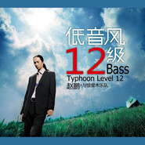

低音风12级
============================

|  |  |
| :--: | :-- |
| [ 低音风12级](https://emumo.xiami.com/album/338115) | **艺人**: [赵鹏](../index.md) **语种**: 国语 **唱片公司**: 柏菲音乐 **发行时间**: 2008年11月28日 **专辑类别**: 录音室专辑 **专辑风格**:  **播放数**: 888333 **收藏数**: 1031 **评论数**: 45  |

## 简介

赵鹏 再次掀起低音旋风 “风力”12级以上！赵鹏 挑战低音极限,声声冲击听觉 HiFi“极酷”之作,  
  
字字落地鏗锵 《低音风12级》试音大碟之极佳推荐！

## 曲目

- [地平线](./338115/mQ38lyc7b5a.md)
- [声音](./338115/mQ38lz6daab.md)
- [绣荷包](./338115/b1pMzT441c18.md)
- [嘎达梅林](./338115/mQ38l112ed9.md)
- [南泥湾](./338115/mQ38l287441.md)
- [当我想你的时候](./338115/xLo7addc4f0.md)
- [亲爱的小孩](./338115/xLo7aeb8937.md)
- [早春](./338115/mQ38l55ef6e.md)
- [唱歌给你听](./338115/xLo7agdc081.md)
- [鲁冰花MV](./338115/mQ38l753181.md)
- [几多愁](./338115/8FZ5OIe9e41.md)
- [孤甲](./338115/xLo7aj9fcc5.md)

## 评论

|  |  |  |  |
| :-- | :-- | :-- | :-- |
|  [虾米用户](https://emumo.xiami.com/u/412736465)  2020-12-23 09:37 赞(0) 踩(0) | 
为啥下架了 
 |
|  [虾米用户](https://emumo.xiami.com/u/43045392) 喜欢听好歌 2017-10-28 00:15 赞(0) 踩(0) | 
播音依旧如歌声般高品质。宁静恬淡的声音映射出怡然心境。超赞！！
 |
|  [虾米用户](https://emumo.xiami.com/u/274213654)  2017-02-28 21:57 赞(0) 踩(0) | 
怎么可以这么低，，，，
 |
|  [虾米用户](https://emumo.xiami.com/u/11597974)   2015-04-21 18:47 赞(0) 踩(0) | 
低音共鸣
 |
|  [虾米用户](https://emumo.xiami.com/u/5657731) 在音乐面前语言很苍白 2015-01-04 22:00 赞(0) 踩(0) | 
怎么可以这么美
 |
|  [虾米用户](https://emumo.xiami.com/u/40802576)  2014-10-03 12:39 赞(0) 踩(0) | 
nice
 |
| ⇒ |  [虾米用户](https://emumo.xiami.com/u/26150922) @ 2014-10-27 11:58 赞(0) 踩(0) | 
Ugh a. Fqb
 |
| ⇒ |  [虾米用户](https://emumo.xiami.com/u/26150922) @ 2014-10-27 11:58 赞(0) 踩(0) | 
YTzxx.
 |
|  [虾米用户](https://emumo.xiami.com/u/4117308)  2014-05-30 20:09 赞(1) 踩(0) | 
中国低音第一人
 |
|  [虾米用户](https://emumo.xiami.com/u/13953263)  2014-05-03 18:43 赞(0) 踩(0) | 
好听
 |
|  [虾米用户](https://emumo.xiami.com/u/4197380)  2014-01-21 20:49 赞(0) 踩(0) | 
风之子
 |
|  [虾米用户](https://emumo.xiami.com/u/14054310)  2013-12-03 21:05 赞(0) 踩(0) | 
喜欢
 |
|  [虾米用户](https://emumo.xiami.com/u/25988894)  2013-12-02 15:56 赞(0) 踩(0) | 
震撼
 |
|  [虾米用户](https://emumo.xiami.com/u/28052350)  2013-12-01 13:29 赞(0) 踩(0) | 
低音风12级
 |
|  [虾米用户](https://emumo.xiami.com/u/25010570)  2013-10-21 14:13 赞(0) 踩(0) | 
好
 |
|  [虾米用户](https://emumo.xiami.com/u/8871569) 音乐是我拯救灵魂最好的良... 2013-09-12 20:33 赞(0) 踩(0) | 
怎么做到这么低的，完全hold不住啊
 |
|  [虾米用户](https://emumo.xiami.com/u/21527197) 幸福其实很简单，好音乐，... 2013-09-09 13:50 赞(0) 踩(0) | 
声音富有磁性，醇厚，低沉。美哉，赵鹏！
 |
|  [虾米用户](https://emumo.xiami.com/u/16042599) 随心 2013-06-20 17:42 赞(0) 踩(0) | 
经典的曲目与他美妙的低音结合起来确实是一种享受。
 |
|  [虾米用户](https://emumo.xiami.com/u/6524724)  2013-03-10 12:51 赞(1) 踩(0) | 
赵鹏的男低音让你迷醉，撩拨起你的心弦。赵鹏的嗓音 令人如痴如醉。安静的时候，听着这些熟悉的，几乎是 伴随着 我们 长大的歌，似乎回到了那个 使我们 心中 充满激情的 年代，那个 快乐 的时光 仿佛又出现在眼前。知道赵鹏是在虾米音乐网，一听就被迷醉，于是自己收集了一些曲目，发个链接与虾友们分享。<a href="http://www.xiami.com/song/showcollect/id/10792718?success=2" target="_blank" rel="nofollow noreferrer noopener">http://www.xiami.com/song/showcollect/id/10792718?success=2</a>
 |
|  [虾米用户](https://emumo.xiami.com/u/4310613) flora8301 2012-12-21 11:49 赞(0) 踩(0) | 
低音
 |
|  [虾米用户](https://emumo.xiami.com/u/2367065)  2012-12-19 11:21 赞(0) 踩(0) | 
喜欢
 |
|  [虾米用户](https://emumo.xiami.com/u/1848672)  2012-12-02 09:52 赞(0) 踩(0) | 
这才是中国的好声音！
 |
|  [虾米用户](https://emumo.xiami.com/u/9658298)  2012-11-17 20:01 赞(0) 踩(0) | 
让人平静的男低音。
 |
|  [虾米用户](https://emumo.xiami.com/u/10896939) 听好音乐就是一种享受 2012-11-17 16:19 赞(0) 踩(0) | 
喜欢这种声音的感觉
 |
|  [虾米用户](https://emumo.xiami.com/u/6819624)  2012-11-08 17:16 赞(0) 踩(0) | 
低音
 |
|  [虾米用户](https://emumo.xiami.com/u/6819624)  2012-11-08 17:16 赞(0) 踩(0) | 
低音
 |
|  [虾米用户](https://emumo.xiami.com/u/5802799) 张大可 2012-11-05 20:57 赞(0) 踩(0) | 
低音王目前无人可敌!高音区依然漂亮!
 |
|  [虾米用户](https://emumo.xiami.com/u/11184563) 好的音乐可以愉心养志 2012-10-24 21:53 赞(0) 踩(0) | 
静心
 |
|  [虾米用户](https://emumo.xiami.com/u/11097241) 伪文青要当老板娘 2012-10-19 21:47 赞(0) 踩(0) | 
12级音乐旋风把我吹走了~~~~
 |
|  [虾米用户](https://emumo.xiami.com/u/7329482) 我还没想好要写什么... 2012-06-08 09:48 赞(0) 踩(0) | 
赵鹏啊～ 你怎么就这么优雅
 |
|  [虾米用户](https://emumo.xiami.com/u/7475343)  2012-05-30 22:27 赞(0) 踩(0) | 
不解释
 |
|  [虾米用户](https://emumo.xiami.com/u/7898619) 与其拘泥于过去，不如好好 2012-05-21 19:02 赞(0) 踩(0) | 
赵鹏 再次掀起低音旋风 “风力”12级以上！赵鹏 挑战低音极限,声声冲击听觉 HiFi“极酷”之作,
 |
|  [虾米用户](https://emumo.xiami.com/u/9104910) 徜徉在苍穹间的声音之中啊 2012-05-07 22:34 赞(0) 踩(0) | 
真的是低音的12级风暴呢迷死人了
 |
|  [虾米用户](https://emumo.xiami.com/u/4874803)  2012-02-07 08:22 赞(0) 踩(0) | 
低音十二级
 |
|  [虾米用户](https://emumo.xiami.com/u/7250113)  2011-12-22 10:29 赞(0) 踩(0) | 
喜欢
 |
|  [虾米用户](https://emumo.xiami.com/u/5128701)  2011-12-04 16:47 赞(0) 踩(0) | 
好
 |
|  [虾米用户](https://emumo.xiami.com/u/3856677)  2011-11-07 20:06 赞(0) 踩(0) | 
声音 轰轰
 |
|  [虾米用户](https://emumo.xiami.com/u/1434013)  2011-11-03 10:56 赞(0) 踩(0) | 
庆幸没有错过
 |
|  [虾米用户](https://emumo.xiami.com/u/3915739) 平平爸爸 2011-08-27 08:41 赞(0) 踩(0) | 
经典
 |
|  [虾米用户](https://emumo.xiami.com/u/4138721)  2011-06-01 09:37 赞(0) 踩(0) | 
ht
 |
|  [虾米用户](https://emumo.xiami.com/u/1747119)  2011-03-24 16:04 赞(0) 踩(0) | 
轰轰
 |
|  [虾米用户](https://emumo.xiami.com/u/3244532)  2011-03-19 10:07 赞(0) 踩(0) | 
声音
 |
|  [虾米用户](https://emumo.xiami.com/u/994568)  2011-03-15 15:41 赞(0) 踩(0) | 
都是一些耳熟能详的经典老歌！
 |
|  [虾米用户](https://emumo.xiami.com/u/2894368)  2011-02-22 12:33 赞(0) 踩(0) | 
中国流行低音代表~老乡的光荣！给力~~
 |
|  [虾米用户](https://emumo.xiami.com/u/10180)  2009-07-24 14:22 赞(0) 踩(0) | 
抵到心……
 |
