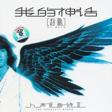

我的神话人声低音炮Vol.3 / My Myth
============================

|  |  |
| :--: | :-- |
| [ 我的神话人声低音炮Vol.3 / My Myth](https://emumo.xiami.com/album/6295) | **艺人**: [赵鹏](../index.md) **语种**: 国语 **唱片公司**: 涂鸦文化 **发行时间**: 2005年09月24日 **专辑类别**: 录音室专辑 **专辑风格**:  **播放数**: 130172 **收藏数**: 383 **评论数**: 39  |

## 简介

涂鸦文化本年度最辣手之作赵鹏《人声低音炮 Vol.3 我的神话》正式向外界强势推出。本大碟收录以香港八九十年代经典粤语之作为曲+原创填词的歌曲。碟中更收录有涂鸦才子小东的词曲倾力原创《我的神话·叶赛尼娅》及《小妹》。  
  
⊙前言  
  
天亮在六点钟左右，早班车里是懵懂的新鲜生命。  
  
我站在公司的阳台上睡眼惺忪地眺望，我们人人心怀欲求，大口大口地呼吸着九月的空气，我爱这迷人而又坚硬的生活。  
  
刚刚写完《叶赛尼亚》，昨晚九点看了一遍那部老电影后开始创作属于我的叶赛尼亚情结。  
  
好犀利的几句情话呀！  
  
叶塞尼亚：当兵的，你不守信用。你不等我了？  
奥斯瓦尔多：我已经等了三天了。  
叶塞尼亚：你要再来亲我的话，我马上砸碎你的脑袋。我们吉普赛人说了算。  
奥斯瓦尔多：不，我只想看看你的眼睛。 叶塞尼亚：我，我不是来看你眼睛的，你别胡思乱想了。  
奥斯瓦尔多：你不用担心，无论如何都不能把我们分开。 叶赛尼亚：我也爱你。现在我得走了。我爱你！  
  
我比较喜欢自然流露的艺术表现形式，讨厌那些扭捏造作的媚俗或者媚雅，在艺术里，大师和肖小之徒的区别一眼能分辨， 就像一份菜摆在桌上，一口后就已分胜负。  
  
我觉得艺术至关重要的是打动一个人的神经，让他迅速地享受到感官上的快感，这是一个成功艺术家必须具备的基本素质和天赋，而不是华丽的外壳。  
  
我喜欢这样地被一部苍老的影片吸引，幻想着我们母亲时代的爱情，他们在露天的电影屏幕下小心翼翼地拖着手。享受属于他们的极乐。  
  
我也喜欢写一首这样忘情的歌给忘情的人群，让赵鹏低缓的声音来撩起你的神经，我们在努力地煽情，你们要努力地入戏，每一次的音乐游说都是我们赖以生存的一次攻击，相信它的锐利和持久，我以我毫无睡意的灵魂像你保证！  
  
我们一直和音乐相依为命。  
  
小东 2005年9月6日 于广州涂鸦文化 

## 曲目

- [我的神话·叶赛尼娅](./6295/c0k42b75a.md)
- [小妹](./6295/KgT6aba6.md)
- [北风是你最后给我的拥抱](./6295/bkhOb2345.md)
- [一声朋友](./6295/KgV7e047.md)
- [早春](./6295/KgW54797.md)
- [你的外套](./6295/egol459b9.md)
- [三生缘](./6295/bkhSd66b2.md)
- [摇啊摇 摇到外婆桥](./6295/cQl531e27.md)
- [温柔分手](./6295/bkhU15148.md)
- [透明](./6295/bkhV11731.md)
- [昙花痛](./6295/Khc702ba.md)

## 评论

|  |  |  |  |
| :-- | :-- | :-- | :-- |
|  [虾米用户](https://emumo.xiami.com/u/289228620)  2017-04-16 20:08 赞(0) 踩(0) | 
谢谢！
 |
|  [虾米用户](https://emumo.xiami.com/u/244949016) fh789 2016-11-13 12:14 赞(0) 踩(0) | 
付费
 |
|  [虾米用户](https://emumo.xiami.com/u/72502) 音乐可以改变人的心情！ 2016-07-11 09:18 赞(0) 踩(0) | 
听赵鹏的第一首歌是&amp;lt;温柔的分手&amp;gt;
 |
|  [虾米用户](https://emumo.xiami.com/u/3425353)  2015-08-16 23:25 赞(0) 踩(0) | 
这张碟中的 《小妹》   每每听见 除了怀恋 就是泪水... ...
 |
|  [虾米用户](https://emumo.xiami.com/u/40124694)  2015-06-18 11:27 赞(0) 踩(0) | 
APE无损资源已更新：<a href="http://www.162wp.com/yinle/2015-06-18/23328.html" target="_blank" rel="nofollow noreferrer noopener">http://www.162wp.com/yinle/2015-06-18/23328.html</a>
 |
|  [虾米用户](https://emumo.xiami.com/u/1385300) 95-43782 2015-04-03 19:25 赞(0) 踩(0) | 
怎么下架了？
 |
|  [虾米用户](https://emumo.xiami.com/u/32097877) 由来一声笑/ 2015-02-05 11:59 赞(0) 踩(0) | 
爱哈哈哈哈和
 |
|  [虾米用户](https://emumo.xiami.com/u/14801002)  2014-04-11 21:45 赞(0) 踩(0) | 
good
 |
|  [虾米用户](https://emumo.xiami.com/u/1609946) 一即一切 2014-04-03 09:50 赞(0) 踩(0) | 
心 境不二
 |
|  [虾米用户](https://emumo.xiami.com/u/70320) 曾经的梦 2014-01-02 20:07 赞(0) 踩(0) | 
有安抚的力量
 |
|  [虾米用户](https://emumo.xiami.com/u/28052350)  2013-12-01 12:57 赞(0) 踩(0) | 
比较喜欢自然流露的艺术表现形式,讨厌那些扭捏造作的媚俗或者媚雅,在艺术里,大师和肖小之徒的区别一眼能分辨, 就像一份菜摆在桌上,一口后就已分胜负。
 |
|  [虾米用户](https://emumo.xiami.com/u/655537) 多类别吉他教师、乐评人 2013-07-31 15:52 赞(2) 踩(0) | 
03 北风是你最后给我的拥抱 徐小凤 - 婚纱背后04 一声朋友 温兆伦 - 随缘05 早春 关淑怡 - 难得有情人06 你的外套 黄凯芹 - 情深缘浅07 三生缘 张国荣 - 倩女幽魂08 摇啊摇 摇到外婆桥 陈百强 - 念亲恩09 温柔分手 周启生 - 天长地久10 透明 张国荣 - 当年情11 昙花痛  蔡国权 - 不装饰你的梦碉堡了。
 |
|  [虾米用户](https://emumo.xiami.com/u/12590017)  2013-01-23 03:20 赞(0) 踩(0) | 
词好音佳
 |
|  [虾米用户](https://emumo.xiami.com/u/11091606) 喜欢心的声音 2012-10-17 13:43 赞(0) 踩(0) | 
晴天午后的慵懒
 |
|  [虾米用户](https://emumo.xiami.com/u/11091606) 喜欢心的声音 2012-10-17 13:37 赞(0) 踩(0) | 
晴天午后的慵懒
 |
|  [虾米用户](https://emumo.xiami.com/u/2606092) 我还没想好要写什么... 2012-08-31 18:38 赞(0) 踩(0) | 
我爱低音
 |
|  [虾米用户](https://emumo.xiami.com/u/9596153)  2012-06-27 18:06 赞(0) 踩(0) | 
美妙
 |
|  [虾米用户](https://emumo.xiami.com/u/9104910) 徜徉在苍穹间的声音之中啊 2012-05-17 21:14 赞(0) 踩(0) | 
美妙绝伦的音色。不知多少年才能出一个呢
 |
|  [虾米用户](https://emumo.xiami.com/u/7327304) 静水流深 2012-05-13 15:38 赞(0) 踩(0) | 
叶赛尼娅
 |
|  [虾米用户](https://emumo.xiami.com/u/9059795)  2012-05-03 06:14 赞(0) 踩(0) | 
好喜欢他的声音
 |
|  [虾米用户](https://emumo.xiami.com/u/8743251)  2012-04-05 19:45 赞(0) 踩(0) | 
好听
 |
|  [虾米用户](https://emumo.xiami.com/u/3957508)  2012-03-26 00:00 赞(0) 踩(0) | 
适合在独自的深夜听他的歌
 |
|  [虾米用户](https://emumo.xiami.com/u/8455406)  2012-03-16 20:31 赞(0) 踩(0) | 
厚实
 |
|  [虾米用户](https://emumo.xiami.com/u/1848672)  2012-02-28 11:51 赞(0) 踩(0) | 
好喜欢他的声音！
 |
|  [虾米用户](https://emumo.xiami.com/u/4155909)  2012-02-20 19:37 赞(0) 踩(0) | 
低音王
 |
|  [虾米用户](https://emumo.xiami.com/u/7671272)  2012-01-21 17:38 赞(0) 踩(0) | 
最先是听到小妹这首歌，真是被这种低音的感觉震撼，并且歌曲非常有画面感，太喜欢了！
 |
|  [虾米用户](https://emumo.xiami.com/u/7250113)  2012-01-03 19:25 赞(0) 踩(0) | 
喜欢你的声音没理由。。。
 |
|  [虾米用户](https://emumo.xiami.com/u/1688191)  2012-01-02 18:47 赞(0) 踩(0) | 
一如既往
 |
|  [虾米用户](https://emumo.xiami.com/u/7250113)  2011-12-30 20:18 赞(0) 踩(0) | 
喜欢你没理由。。。
 |
|  [虾米用户](https://emumo.xiami.com/u/4825290)  2011-12-15 18:42 赞(0) 踩(0) | 
饱满  深厚
 |
|  [虾米用户](https://emumo.xiami.com/u/56868) 过去的铅笔小丁 2011-12-06 18:52 赞(0) 踩(0) | 
1=2=3= 徐小凤 婚纱背后4=温兆伦 随缘5 = 关淑怡 难得有情人6 = 黄凯芹 情深缘浅7 = 张国荣 倩女幽魂8 = 陈百强 念亲恩9 = 周启生 天长地久10 = 张国荣 当年情11 = 蔡国权 不装饰你的梦
 |
|  [虾米用户](https://emumo.xiami.com/u/56868) 过去的铅笔小丁 2011-12-06 18:52 赞(0) 踩(0) | 
1=2=3= 徐小凤 婚纱背后4=温兆伦 随缘5 = 关淑怡 难得有情人6 = 黄凯芹 情深缘浅7 = 张国荣 倩女幽魂8 = 陈百强 念亲恩9 = 周启生 天长地久10 = 张国荣 当年情11 = 蔡国权 不装饰你的梦
 |
|  [虾米用户](https://emumo.xiami.com/u/6329459)  2011-10-19 20:29 赞(0) 踩(0) | 
经典
 |
|  [虾米用户](https://emumo.xiami.com/u/6329459)  2011-10-19 20:29 赞(0) 踩(0) | 
听他得第一首歌  就是这张专辑
 |
|  [虾米用户](https://emumo.xiami.com/u/3915739) 平平爸爸 2011-08-27 08:45 赞(0) 踩(0) | 
经典
 |
|  [虾米用户](https://emumo.xiami.com/u/808752)  2011-08-01 11:47 赞(0) 踩(0) | 
我们一直和音乐相依为命,这句经典......
 |
|  [虾米用户](https://emumo.xiami.com/u/1061989)  2011-07-31 11:25 赞(0) 踩(0) | 
赵鹏《
 |
|  [虾米用户](https://emumo.xiami.com/u/3004083)   2011-02-27 21:23 赞(0) 踩(0) | 
好，男人的歌
 |
|  [虾米用户](https://emumo.xiami.com/u/2698403)  2011-02-01 20:28 赞(0) 踩(0) | 
沒第二句話,就是喜歡了
 |
