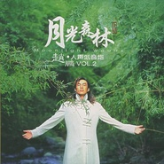

月光森林人声低音炮Vol.2 / Moonlight Woods
============================

|  |  |
| :--: | :-- |
| [ 月光森林人声低音炮Vol.2 / Moonlight Woods](https://emumo.xiami.com/album/6296) | **艺人**: [赵鹏](../index.md) **语种**: 国语 **唱片公司**: 涂鸦文化 **发行时间**: 2004年08月18日 **专辑类别**: 录音室专辑 **专辑风格**:  **播放数**: 164658 **收藏数**: 561 **评论数**: 46  |

## 简介

涂鸦文化推出的《赵鹏 人声低音炮Vol.1 闪亮的日子》在国内外音乐市场上获得极大的成功后，《人声低音炮》不仅成为了赵鹏的代称，还成为了音响发烧友们必备的试音宝典。  
  
赵鹏在这张新专辑，在选曲上，不仅有经典的老歌《夜来香》，《青春舞曲》，《小路》等，与上一张专辑纯翻唱不同，新专辑里加入了由音乐才子小东独立创作的唯美作品《夜色如水》和精心配词的《月光森林》，《老情人1959》等歌曲，整张专辑在艺术上和人气上都上了一个台阶。编曲上，由国内外众多音乐家联手配制上和歌词表现上都达到了合二为一的境界，而在音响发烧友最为关注的录音方面，无一不为听众听提供了体验完美音质的绝好机会。至于，最为关键的人声部分，赵鹏不仅在演唱技巧上有明显的进步，而且在歌曲的感情处理上更为细腻，让人为之动容。 

## 曲目

- [月光森林](./6296/cQl933d18.md)
- [青春舞曲](./6296/Khe7d8b6.md)
- [老情人1959](./6296/cajN239da.md)
- [乡间小路](./6296/dqm63bc02.md)
- [夜色如水](./6296/Khh61ff7.md)
- [红莓花儿开](./6296/egow48980.md)
- [夜来香](./6296/Khj58839.md)
- [不了情](./6296/bkiede003.md)
- [小路](./6296/Khl8aa4c.md)
- [再回首](./6296/bAjafa51e.md)
- [其实你不懂我的心](./6296/bkihd65ed.md)

## 评论

|  |  |  |  |
| :-- | :-- | :-- | :-- |
|  [虾米用户](https://emumo.xiami.com/u/405004903)  2019-03-13 22:51 赞(0) 踩(0) | 
太棒了
 |
|  [虾米用户](https://emumo.xiami.com/u/296713561)   2017-05-16 11:00 赞(0) 踩(0) | 
磁性的低音
 |
|  [虾米用户](https://emumo.xiami.com/u/12962508)  2016-11-29 13:51 赞(0) 踩(0) | 
都不能听，虾米要你干嘛？
 |
|  [虾米用户](https://emumo.xiami.com/u/244949016) fh789 2016-11-13 12:13 赞(0) 踩(0) | 
付费
 |
|  [虾米用户](https://emumo.xiami.com/u/40073195) Easy come ea... 2016-08-25 14:18 赞(0) 踩(0) | 
我最爱，夜色如水
 |
|  [虾米用户](https://emumo.xiami.com/u/22343481)  2016-01-18 18:49 赞(0) 踩(0) | 
歌曲怎么没了？
 |
|  [虾米用户](https://emumo.xiami.com/u/51750574)  2015-08-03 11:21 赞(0) 踩(0) | 
ASD
 |
|  [虾米用户](https://emumo.xiami.com/u/11597974)   2015-04-21 18:48 赞(0) 踩(0) | 
低音共鸣
 |
|  [虾米用户](https://emumo.xiami.com/u/2752) 岁月流淌 音乐相随 2015-01-07 12:29 赞(1) 踩(0) | 
歌曲怎么没了?
 |
|  [虾米用户](https://emumo.xiami.com/u/6119024) HELL AND HEA... 2014-08-24 08:34 赞(0) 踩(0) | 
比刘罡强。
 |
|  [虾米用户](https://emumo.xiami.com/u/36400359)  2014-05-11 00:21 赞(0) 踩(0) | 
静静的夜，带着耳机，低沉浑厚磁性的嗓音就像爱人在耳边低吟，每个音符就如柔软的嘴唇抚慰着身体的每寸肌肤，亲切，忧伤，温柔，性感。
 |
|  [虾米用户](https://emumo.xiami.com/u/7488039)  2014-03-27 19:51 赞(0) 踩(0) | 
厚实的男低音配以通透的琴声，犹如在天鹅绒上洒落一把珍珠。。。《Yesterday》和《真诚的爱》的中文版似把人带入古旧、蒙着灰尘的古城堡中，神秘，深邃。。。
 |
|  [虾米用户](https://emumo.xiami.com/u/1336213)  2014-02-11 16:09 赞(0) 踩(0) | 
低音醇厚
 |
|  [虾米用户](https://emumo.xiami.com/u/28052350)  2013-12-01 12:46 赞(0) 踩(0) | 
在歌曲处理，感情处理上更为细腻，让人为之动容，情难自控。
 |
|  [虾米用户](https://emumo.xiami.com/u/19533318)  2013-08-17 14:00 赞(0) 踩(0) | 
好
 |
|  [虾米用户](https://emumo.xiami.com/u/19148487)  2013-08-12 21:54 赞(0) 踩(0) | 
暖暖的
 |
|  [虾米用户](https://emumo.xiami.com/u/19148487)  2013-08-12 21:54 赞(0) 踩(0) | 
暖暖的
 |
|  [虾米用户](https://emumo.xiami.com/u/6617203) 我还没想好要写什么... 2013-06-03 14:25 赞(0) 踩(0) | 
夜来香
 |
|  [虾米用户](https://emumo.xiami.com/u/15507499)  2013-05-31 02:29 赞(0) 踩(0) | 
不为什么，就是喜欢！
 |
|  [虾米用户](https://emumo.xiami.com/u/13953263)  2013-04-14 17:37 赞(0) 踩(0) | 
好听
 |
|  [虾米用户](https://emumo.xiami.com/u/10317096)  2013-03-21 10:51 赞(0) 踩(0) | 
震撼后是沉稳沉静
 |
|  [虾米用户](https://emumo.xiami.com/u/13611273)  2013-03-20 17:49 赞(0) 踩(0) | 
喜欢
 |
|  [虾米用户](https://emumo.xiami.com/u/9575689)  2013-03-10 13:15 赞(0) 踩(0) | 
一下子就被他的声音吸引住了
 |
|  [虾米用户](https://emumo.xiami.com/u/9857340)  2012-11-05 16:03 赞(0) 踩(0) | 
听
 |
|  [虾米用户](https://emumo.xiami.com/u/7097744)  2012-11-02 15:46 赞(0) 踩(0) | 
好听,
 |
|  [虾米用户](https://emumo.xiami.com/u/8128667)   2012-10-19 19:35 赞(0) 踩(0) | 
好听
 |
|  [虾米用户](https://emumo.xiami.com/u/7647325)  2012-09-24 12:57 赞(0) 踩(0) | 
好听的低音
 |
|  [虾米用户](https://emumo.xiami.com/u/10719055)  2012-09-23 13:48 赞(0) 踩(0) | 
牛
 |
|  [虾米用户](https://emumo.xiami.com/u/9991496) 暂无签名~ 2012-09-14 18:31 赞(0) 踩(0) | 
喜欢男低音
 |
|  [虾米用户](https://emumo.xiami.com/u/608129)  2012-07-17 20:22 赞(0) 踩(0) | 
气场很棒
 |
|  [虾米用户](https://emumo.xiami.com/u/489580)  2012-06-05 11:26 赞(0) 踩(0) | 
超强低音，令人迷醉啊
 |
|  [虾米用户](https://emumo.xiami.com/u/8776801)  2012-04-07 18:40 赞(0) 踩(0) | 
翻唱口水歌浪费了一副低沉的独特
 |
|  [虾米用户](https://emumo.xiami.com/u/6969605)  2012-03-03 11:22 赞(0) 踩(0) | 
记住他，曾经带给我的安慰。
 |
|  [虾米用户](https://emumo.xiami.com/u/1848672)  2012-02-28 11:53 赞(0) 踩(0) | 
全部都是极品！
 |
|  [虾米用户](https://emumo.xiami.com/u/4155909)  2012-02-20 19:37 赞(0) 踩(0) | 
低音王
 |
|  [虾米用户](https://emumo.xiami.com/u/4362227)  2012-02-03 00:19 赞(0) 踩(0) | 
天鹅绒一样的声音 很温柔
 |
|  [虾米用户](https://emumo.xiami.com/u/7511651)  2012-01-04 09:58 赞(0) 踩(0) | 
1******
 |
|  [虾米用户](https://emumo.xiami.com/u/2561740)  2012-01-02 20:35 赞(0) 踩(0) | 
不错咯
 |
|  [虾米用户](https://emumo.xiami.com/u/1815887)  2011-10-24 22:05 赞(0) 踩(0) | 
夜晚埋在沙发里，开台灯，闭上眼，七杯茶在手中轻抚，任凭茶香与旋律萦绕在身周围。
 |
|  [虾米用户](https://emumo.xiami.com/u/3915739) 平平爸爸 2011-08-27 08:44 赞(0) 踩(0) | 
经典
 |
|  [虾米用户](https://emumo.xiami.com/u/1686294)  2011-03-30 00:03 赞(0) 踩(0) | 
第一次听到他的声音，就是这张专辑。嗓音一听难忘~
 |
|  [虾米用户](https://emumo.xiami.com/u/2961686)  2011-03-17 16:48 赞(0) 踩(0) | 
首首动听的音乐，扣人心弦的低磁音及新唱法，歌词意境令人回味
 |
|  [虾米用户](https://emumo.xiami.com/u/3004083)   2011-02-27 21:24 赞(0) 踩(0) | 
心底的旋律
 |
|  [虾米用户](https://emumo.xiami.com/u/2698403)  2011-02-01 20:27 赞(0) 踩(0) | 
老歌新唱,很有特色
 |
|  [虾米用户](https://emumo.xiami.com/u/244366)  2009-07-02 19:43 赞(0) 踩(0) | 
这么低沉的男音，喜欢死了
 |
| ⇒ |  [虾米用户](https://emumo.xiami.com/u/481098)  2009-11-06 16:32 赞(0) 踩(0) | 
我也很喜欢！特别深夜一个人听！
 |
