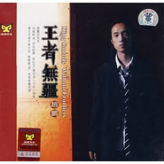

赵鹏
============================

|  |  |
| :--: | :-- |
| [ 赵鹏](https://i.xiami.com/dyzp2004) | **播放数**: 31958656 **粉丝数**: 31244 **评论数**: 1085 **地区**: China 中国大陆 **风格**: 国语流行 Mandarin Pop  |

## 档案

赵鹏， 男低音歌唱家，生长在冰雪皑皑的北国城市－黑龙江省齐齐哈尔。 从16岁开始学习声乐，同年开始词曲创作，因创作歌曲《其实我真的很丑》成为齐齐哈尔市音乐家协会会员。1998年考入广州星海音乐学院学习声乐，先后师从著名歌唱家罗洪副教授和黎国坤教授。1999年开始热充于吉他和爵士鼓演奏，并于2000年组建广州著名流行摇滚乐队——“扩张乐队”，并在其中担任主唱、队长兼节奏吉他。 2004年赵鹏将扩张乐队更名为惊堂木乐队，活跃在全国的演出舞台。

## 专辑

| 名称 | 语种 | 唱片公司 | 发行时间 | 专辑类别 | 专辑风格 |
| :--: | :-- | :-- | :-- | :-- | :-- |
| [ 盼归](./albums/2103519929.md) | 国语 | 明日明星文化 | 2018年02月02日 | EP, 单曲 |  |
| [ 谜](./albums/2102803135.md) | 国语 | 独立发行 | 2017年07月19日 | 录音室专辑 |  |
| [ 赵鹏的音乐慢生活 (第61期—第77期)低音赵鹏的个人电台](./albums/1820809715.md) | 国语 | 独立发行 | 2014年03月22日 | 播客 | 国语流行 Mandarin Pop |
| [ 赵鹏的音乐慢生活 (第21期—第40期)低音赵鹏的个人电台](./albums/820637148.md) | 国语 | 独立发行 | 2012年05月08日 | 播客 | 国语流行 Mandarin Pop |
| [ 赵鹏的音乐慢生活 (第41期—第60期)低音赵鹏的个人电台](./albums/320640923.md) | 国语 | 独立发行 | 2012年01月29日 | 播客 | 国语流行 Mandarin Pop |
| [ 赵鹏的音乐慢生活 (第1期—第20期)低音赵鹏的个人电台](./albums/1220636644.md) | 国语 | 赵鹏音乐工作室 | 2012年01月01日 | 播客 | 国语流行 Mandarin Pop |
| [ 低音共鸣](./albums/468415.md) | 国语 | 松竹梅影音 | 2011年09月20日 | 录音室专辑 | 国语流行 Mandarin Pop |
| [ 低音王朝I 你的眼神](./albums/408023.md) | 国语 | 赵鹏音乐 | 2010年10月01日 | 录音室专辑 | 国语流行 Mandarin Pop |
| [ 低音炮3套车](./albums/373029.md) | 国语 | 柏菲唱片 | 2010年03月12日 | 录音室专辑 |  |
| [ 赵鹏首张纯原创Hi-Fi大碟](./albums/351237.md) | 国语 | 赵鹏音乐 | 2009年07月01日 | 录音室专辑 |  |
| [ 低音风12级](./albums/338115.md) | 国语 | 柏菲音乐 | 2008年11月28日 | 录音室专辑 |  |
| [ 王者无疆](./albums/344561.md) | 国语 | 涂鸦文化 | 2008年07月17日 | 录音室专辑 |  |
| [ 再低音一次](./albums/33232.md) | 国语 | 柏菲唱片 | 2007年11月30日 | 录音室专辑 |  |
| [ 测试王 II](./albums/33273.md) | 国语 | 涂鸦文化 | 2007年11月06日 | 录音室专辑 |  |
| [ 赵鹏黑胶精选人声低音炮](./albums/6292.md) | 国语 | 涂鸦文化 | 2007年07月01日 | 录音室专辑 |  |
| [ 测试王King Of The Hi-Fi Test](./albums/6293.md) | 国语 | 涂鸦文化 | 2007年04月27日 | 录音室专辑 |  |
| [ 一生守候人声低音炮Vol.4 / The Lifetime Waiting](./albums/6294.md) | 国语 | 涂鸦文化 | 2006年10月12日 | 录音室专辑 |  |
| [ 叶塞尼亚](./albums/442661.md) | 国语 | 涂鸦文化 | 2005年09月26日 | EP, 单曲 |  |
| [ 我的神话人声低音炮Vol.3 / My Myth](./albums/6295.md) | 国语 | 涂鸦文化 | 2005年09月24日 | 录音室专辑 |  |
| [ 月光森林人声低音炮Vol.2 / Moonlight Woods](./albums/6296.md) | 国语 | 涂鸦文化 | 2004年08月18日 | 录音室专辑 |  |
| [ 闪亮的日子人声低音炮Vol.1 / The Greatest Basso](./albums/6297.md) | 国语 | 涂鸦文化 | 2004年04月15日 | 录音室专辑 |  |

## 评论

|  |  |  |  |
| :-- | :-- | :-- | :-- |
|  [虾米用户](https://emumo.xiami.com/u/89649008) 我还没想好要写什么... 2020-12-05 23:02 赞(1) 踩(0) | 
很期待你演绎《贝加尔湖畔》的效果
 |
|  [虾米用户](https://emumo.xiami.com/u/50612483)   2020-11-01 03:33 赞(1) 踩(0) | 
热门怎么可以没有《殇》这首！
 |
|  [虾米用户](https://emumo.xiami.com/u/342260492) 爱听音乐痴迷音乐的女人 2020-10-01 01:03 赞(1) 踩(0) | 
赵鹏的声音是可以当做梦中情人的声音听的。  精神支柱
 |
|  [虾米用户](https://emumo.xiami.com/u/342260492) 爱听音乐痴迷音乐的女人 2020-09-29 07:46 赞(2) 踩(0) | 
赵鹏先生.您有演过电影或者电视剧吗.您这么帅气，儒雅，演戏一定会很完美，我们这些铁粉们想更了解您，爱您
 |
|  [虾米用户](https://emumo.xiami.com/u/342260492) 爱听音乐痴迷音乐的女人 2020-09-29 07:06 赞(0) 踩(0) | 
太好听了
 |
|  [虾米用户](https://emumo.xiami.com/u/342260492) 爱听音乐痴迷音乐的女人 2020-09-29 06:53 赞(0) 踩(0) | 
希望有空就继续做节目出歌吧，期待！
 |
|  [虾米用户](https://emumo.xiami.com/u/342260492) 爱听音乐痴迷音乐的女人 2020-09-29 06:52 赞(0) 踩(0) | 
出国时候，赵鹏先生还没有开始红吧，昨天在CCTV4号台第一次听他的歌，简直给震撼了，还是这样底超美的音乐，今天在公司里听了一天，晚上回来在火锅店里接着听，连老外都说太美了，太棒了，爱你赵鹏老师      
 |
|  [虾米用户](https://emumo.xiami.com/u/342260492) 爱听音乐痴迷音乐的女人 2020-09-29 06:48 赞(0) 踩(0) | 
这嗓音绝了
 |
|  [虾米用户](https://emumo.xiami.com/u/2831012) 暂无签名~ 2020-08-29 18:38 赞(1) 踩(0) | 
低音超美
 |
|  [虾米用户](https://emumo.xiami.com/u/403126936) 玄玄妙音天际响，恍恍神思... 2020-08-05 06:39 赞(0) 踩(0) | 
我只想听伴奏音乐，谁能把人声去掉？
 |
| ⇒ |  [虾米用户](https://emumo.xiami.com/u/406386669) 我还没想好要写什么... 2020-10-03 23:05 赞(0) 踩(0) | 
又一个买椟还珠的
 |
|  [虾米用户](https://emumo.xiami.com/u/1894746)  2020-07-29 11:18 赞(0) 踩(0) | 
唉，怎么会有赵鹏这样好听的声线呢，暗红丝绒一样的声音，把他的嗓音当乐器来听，配乐也好，很多都是清丽的配器绝配他的低吟，超性感，
 |
|  [虾米用户](https://emumo.xiami.com/u/404274804)  2020-06-06 20:21 赞(2) 踩(0) | 
赵鹏老师唱的歌曲音色低沉，适合慢慢欣赏
 |
|  [虾米用户](https://emumo.xiami.com/u/442819152)  2020-06-05 23:16 赞(0) 踩(0) | 
赵鹏老师开通抖音了，每周二、五晚8点到10点直播唱歌   
 |
|  [虾米用户](https://emumo.xiami.com/u/351134673) 音乐美化生活 2020-03-12 17:47 赞(1) 踩(0) | 

 |
|  [虾米用户](https://emumo.xiami.com/u/276944698) 不要自我设限..... 2020-02-24 22:04 赞(0) 踩(0) | 
⭐️⭐️⭐️
 |
|  [虾米用户](https://emumo.xiami.com/u/437623916)  2020-01-22 04:53 赞(0) 踩(0) | 
这嗓音绝了
 |
|  [虾米用户](https://emumo.xiami.com/u/377721082)  2019-12-21 19:20 赞(0) 踩(0) | 
赵鹏老师的风格已经涉及“现代民谣”，标签可以加上了
 |
|  [虾米用户](https://emumo.xiami.com/u/16409719)  2019-12-15 11:24 赞(1) 踩(0) | 
希望有空就继续做节目吧，挺好！
 |
|  [虾米用户](https://emumo.xiami.com/u/426972092)  2019-12-10 21:09 赞(0) 踩(0) | 
乌兰巴托就还是这样，宁静致远，无喜无悲，温善安良！乌兰巴托的夜，安静出尘！
 |
|  [虾米用户](https://emumo.xiami.com/u/345223307)  2019-11-26 18:32 赞(2) 踩(0) | 
很有磁性的嗓音，希望多演唱一些歌曲 或出自己风格的歌曲一定不错  
 |
|  [虾米用户](https://emumo.xiami.com/u/430460962)  2019-11-12 18:05 赞(1) 踩(0) | 
那么多年来一直在听！ 
 |
|  [虾米用户](https://emumo.xiami.com/u/425730569) 我还没想好要写什么... 2019-10-25 01:53 赞(0) 踩(0) | 
♥️♥️♥️
 |
|  [虾米用户](https://emumo.xiami.com/u/35197714)  2019-09-02 23:59 赞(0) 踩(0) | 
为你的无损买会员
 |
|  [虾米用户](https://emumo.xiami.com/u/53539783)  2019-09-01 22:40 赞(0) 踩(0) | 
平平淡淡才是真！
 |
| ⇒ |  [虾米用户](https://emumo.xiami.com/u/426330866) 做个真的我 2020-01-19 21:46 赞(0) 踩(0) | 
认同这句话。但唱什么样的歌还是该投入什么样的感情、热情乃至激情吧？！
 |
|  [虾米用户](https://emumo.xiami.com/u/408445980)  开心些，人间不值得。 2019-08-22 11:03 赞(0) 踩(0) | 
山茶花听不到啊……
 |
|  [虾米用户](https://emumo.xiami.com/u/526266) 我不能强迫自己天天签到，... 2019-06-25 14:10 赞(1) 踩(0) | 
第一次因为留言被赞而打败众多敌手，正得意洋洋呢？发现楼下有位小哥以惊人的速度最赶上来。我是个要强的人，目前238比201领先于2019-6月25日，特此纪念！
 |
|  [虾米用户](https://emumo.xiami.com/u/34397928)   2019-06-23 23:07 赞(0) 踩(0) | 
认识一个朋友叫赵鹏，长的和赵鹏很像，一度以为就是唱歌的这个，和他聊天，说和超低音赵鹏也是不错的关系，太巧了，可惜到现在还欠我签名唱片<a href="http://emumo.xiami.com/u/45279221" target="_blank" rel="nofollow" name_card="45279221">@赵鹏</a>
 |
|  [虾米用户](https://emumo.xiami.com/u/276021714)  2019-06-01 23:13 赞(0) 踩(0) | 
在就下了你的专辑
 |
|  [虾米用户](https://emumo.xiami.com/u/413242981)  2019-05-24 21:03 赞(0) 踩(0) | 
希望多来点老苏联歌曲
 |
|  [虾米用户](https://emumo.xiami.com/u/424479505) 迷人的领域 2019-05-13 17:31 赞(1) 踩(0) | 
代表男人的声音   
 |
|  [虾米用户](https://emumo.xiami.com/u/324753854)  2019-05-09 12:07 赞(0) 踩(0) | 
赵鹏大哥你的低音共鸣是我听过最好听的 声卡也很好 如果音响不好都不好意思听
 |
|  [虾米用户](https://emumo.xiami.com/u/356824831) 笑看云起 2019-05-04 23:35 赞(2) 踩(0) | 
《盼归》，带着深切的情感，带来唯美的画面～～   
 |
|  [虾米用户](https://emumo.xiami.com/u/356824831) 笑看云起 2019-05-04 23:32 赞(1) 踩(0) | 
第一次听赵鹏的《盼归》，是在去年。戴耳机听的～～那深沉的男低音，缓缓地细诉，一下子就把我吸引住了。《盼归》——词曲皆美，喜欢！   
 |
|  [虾米用户](https://emumo.xiami.com/u/332721391)  2019-04-16 16:02 赞(2) 踩(0) | 
第一次听他的莫斯科郊外，和苏联版不太一样，但是低音真的太太太......太抓耳了
 |
|  [虾米用户](https://emumo.xiami.com/u/423093559) 一路走来有点累…… 2019-04-10 17:12 赞(1) 踩(0) | 
当岁月化成沧桑的音符，带着你谦卑而又质朴的唯美。曾几何时伴随我在四季的路上……一路有你 ！
 |
|  [虾米用户](https://emumo.xiami.com/u/50444263) 慢慢走吧，你要的答案都在... 2019-03-02 23:20 赞(1) 踩(0) | 
可以
 |
|  [虾米用户](https://emumo.xiami.com/u/193235171) 饭能养身  歌能养心 2019-02-03 19:10 赞(2) 踩(0) | 
真爷们
 |
|  [虾米用户](https://emumo.xiami.com/u/377980413)  2019-01-21 21:33 赞(2) 踩(0) | 
听着就像从心里流淌出来的声音。中国古诗词都由您来吟唱，婉转、儒雅又铿锵，那是多么美妙啊！
 |
|  [虾米用户](https://emumo.xiami.com/u/277205722)  2019-01-17 01:59 赞(2) 踩(0) | 
为数不多的好男低音，当然对器材要求也高，尤其低音下潜要深且不发散。
 |
|  [虾米用户](https://emumo.xiami.com/u/406907425) 我还没想好要写什么... 2018-12-26 18:53 赞(2) 踩(0) | 
好听。。。。。。
 |
|  [虾米用户](https://emumo.xiami.com/u/358104299) 悲观的唯心存在现实解构虚... 2018-12-25 00:58 赞(1) 踩(0) | 
10064
 |
|  [虾米用户](https://emumo.xiami.com/u/318428021)   2018-12-19 21:02 赞(1) 踩(0) | 
赵鹏老师 您好 非常高兴与惊喜 我是齐齐哈尔市人土家住建华区建华厂 高兴在此地相识 我会关注您的 大力给予赞
 |
| ⇒ |  [虾米用户](https://emumo.xiami.com/u/318428021)   2018-12-19 21:03 赞(0) 踩(0) | 
土生土长
 |
|  [虾米用户](https://emumo.xiami.com/u/326826579) 不愁明月尽  自有暗香来 2018-12-07 09:49 赞(1) 踩(0) | 
几年前就喜欢赵鹏的歌，有一首山茶花特别好听，现在在哪里都找不到了！
 |
|  [虾米用户](https://emumo.xiami.com/u/409511281)  2018-11-28 10:49 赞(1) 踩(0) | 
好喜欢你的歌声
 |
|  [虾米用户](https://emumo.xiami.com/u/409511281)  2018-11-28 10:49 赞(1) 踩(0) | 
好喜欢你唱的慢慢歌名
 |
|  [虾米用户](https://emumo.xiami.com/u/41115610) 喜欢音乐 2018-11-16 18:47 赞(1) 踩(0) | 
beo音响挺爽
 |
|  [虾米用户](https://emumo.xiami.com/u/334346881) 太阳与海，交相辉映 2018-11-03 21:43 赞(0) 踩(0) | 
我们班上也有一个男生叫赵鹏 而且也是个低音炮  
 |
|  [虾米用户](https://emumo.xiami.com/u/12375897)  2018-10-30 23:16 赞(2) 踩(0) | 
也就只有声音优势。听了几首他的歌，情绪从来都是一样，没有起伏。当唱歌只剩声音和技术时，还有什么意思？配乐都比他有激情。
 |
| ⇒ |  [虾米用户](https://emumo.xiami.com/u/411515340) 人类的悲欢并不相通，我只... 2019-05-10 23:28 赞(0) 踩(0) | 
但是好听啊，，，喜欢啊，听起来有感觉不就行吗   
 |
|  [虾米用户](https://emumo.xiami.com/u/42993993)  2018-10-11 17:49 赞(2) 踩(0) | 
喜欢你心嗓音
 |
|  [虾米用户](https://emumo.xiami.com/u/7510317)  2018-10-07 21:20 赞(1) 踩(0) | 
没人觉得他唱歌就是在读书？
 |
| ⇒ |  [虾米用户](https://emumo.xiami.com/u/426330866) 做个真的我 2020-01-19 21:48 赞(0) 踩(0) | 
有同感。太平淡了！
 |
|  [虾米用户](https://emumo.xiami.com/u/324365616)  2018-10-02 19:31 赞(3) 踩(0) | 
您的歌一直喜欢，早就在关注您了，您的嗓音非常有男人味，雄性十足。
 |
|  [虾米用户](https://emumo.xiami.com/u/55090159) 冰雪奇缘  2018-09-10 16:54 赞(1) 踩(0) | 
&lt;[url=/u/45279221]@赵鹏 [/url][url=/u/45279221]@赵鹏 [/url]&gt;&lt;45279221,45279221&gt;
 |
|  [虾米用户](https://emumo.xiami.com/u/346163867) 微博：柔柔judy  2018-09-10 05:50 赞(0) 踩(0) | 
Hello我是柔柔judy
 |
|  [虾米用户](https://emumo.xiami.com/u/403208511) 我还没想好要写什么... 2018-09-06 21:28 赞(1) 踩(0) | 
喜欢
 |
|  [虾米用户](https://emumo.xiami.com/u/280231740) China   Germ... 2018-07-28 04:24 赞(4) 踩(0) | 
声音是好声音，不过都是一个level，缺乏灵性和感情，感觉每一首歌都是相同的同一首歌一样
 |
| ⇒ |  [虾米用户](https://emumo.xiami.com/u/426330866) 做个真的我 2020-01-19 21:51 赞(0) 踩(0) | 

 |
|  [虾米用户](https://emumo.xiami.com/u/16065637) 被很多人喜欢的歌一定很好... 2018-06-24 00:25 赞(3) 踩(0) | 
这声音太美了，第一次听就被迷住了，以前竟然从来没有听说过，真是孤陋寡闻啊！
 |
|  [虾米用户](https://emumo.xiami.com/u/47075657) 我还没想好要写什么... 2018-06-11 03:18 赞(1) 踩(0) | 
加油
 |
|  [虾米用户](https://emumo.xiami.com/u/100133084)  2018-05-14 23:08 赞(0) 踩(0) | 
加油   
 |
|  [虾米用户](https://emumo.xiami.com/u/357674040)  2018-05-09 07:09 赞(0) 踩(0) | 

 |
|  [虾米用户](https://emumo.xiami.com/u/336575258)   2018-04-29 13:24 赞(0) 踩(0) | 
喜欢喜欢 无限喜欢
 |
|  [虾米用户](https://emumo.xiami.com/u/299737778)  2018-04-29 09:09 赞(3) 踩(0) | 
赵老师，在北京开了咖啡馆，叫予舍咖啡在北锣鼓巷
 |
| ⇒ |  [虾米用户](https://emumo.xiami.com/u/79360608) 我才不聪明呢！！ 2019-05-03 19:22 赞(0) 踩(0) | 

 |
|  [虾米用户](https://emumo.xiami.com/u/236997409) 无情最好，可以不为情所困... 2018-04-24 23:46 赞(1) 踩(0) | 
鹏哥的歌 最早在玩UC的时候听到的。绝对的超级低音！  
 |
|  [虾米用户](https://emumo.xiami.com/u/323987299)  2018-04-18 16:12 赞(0) 踩(0) | 
啪。带犯人
 |
|  [虾米用户](https://emumo.xiami.com/u/310311935)  2018-04-15 08:26 赞(0) 踩(0) | 
每次同学聚会我们生都会对女同学唱起把悲伤留给自己》常常令她们泪流满面&amp;hellip;&amp;hellip;
 |
|  [虾米用户](https://emumo.xiami.com/u/357413391)  2018-04-12 23:52 赞(1) 踩(0) | 
非常完美
 |
|  [虾米用户](https://emumo.xiami.com/u/2502354) 不实验 2018-04-03 21:49 赞(1) 踩(0) | 
这逼每次唱歌追求把早饭都呕出来的效果，估计每次喝多爬厕所吐都当是练声了。
 |
|  [虾米用户](https://emumo.xiami.com/u/271042507)  2018-03-31 23:36 赞(2) 踩(0) | 
一听钟情，尤其是《殇》。
 |
|  [虾米用户](https://emumo.xiami.com/u/351164761)  2018-03-31 01:06 赞(1) 踩(0) | 
我一不小心下载了你所有的音乐
 |
|  [虾米用户](https://emumo.xiami.com/u/54464307)  2018-03-09 02:49 赞(2) 踩(0) | 
第一次听就迷上了！太喜欢了 
 |
|  [虾米用户](https://emumo.xiami.com/u/4091262) ndjswdhswd 2018-02-27 10:43 赞(2) 踩(0) | 
生活过滤着我们，愿我们更忠于自己内心，愿我们活的更纯粹。
 |
|  [虾米用户](https://emumo.xiami.com/u/352403784) 追求人生最高境界！ 2018-02-26 17:01 赞(2) 踩(0) | 
歌唱的真好听！好听好听真好听！真是太美了！赵老师才是真正的天下第一！
 |
|  [虾米用户](https://emumo.xiami.com/u/265989264) 爱听不听 2018-02-18 03:53 赞(1) 踩(0) | 
我是男中音。怎么唱出低音炮的音色呢
 |
|  [虾米用户](https://emumo.xiami.com/u/37253204) 你且来过 2018-02-17 16:40 赞(1) 踩(0) | 
十年前听到这声音，便喜欢上。
 |
|  [虾米用户](https://emumo.xiami.com/u/345595912)  2018-02-05 20:05 赞(2) 踩(0) | 
开口湿!
 |
|  [虾米用户](https://emumo.xiami.com/u/10266153) bingshan 2018-02-05 15:24 赞(2) 踩(0) | 
难得男低音值得收藏
 |
|  [虾米用户](https://emumo.xiami.com/u/342536390) 宁可轰轰烈烈去死也不能平... 2018-02-04 01:32 赞(2) 踩(0) | 
赵老师我可以加你微信嘛，我的微信 13561915555
 |
| ⇒ |  [虾米用户](https://emumo.xiami.com/u/310311935)  2018-04-15 08:22 赞(0) 踩(0) | 
赵老师加微信了吗？我更想加你 
 |
|  [虾米用户](https://emumo.xiami.com/u/73666056)  2018-01-25 00:21 赞(2) 踩(0) | 
很多年前就喜欢的声音，可惜没有《月光森林》系列，有点遗憾。同时期还喜欢雨林的陈洁丽
 |
|  [虾米用户](https://emumo.xiami.com/u/342892461)  2018-01-03 15:08 赞(4) 踩(0) | 
赵鹏的歌，我最喜欢，漂亮的男低音，有磁性有个性，希望他的新歌快给朋友们见面。
 |
|  [虾米用户](https://emumo.xiami.com/u/342531937)  2018-01-01 19:12 赞(1) 踩(0) | 
赵老师好！我喜欢男低音歌曲，可了解你的作品不多，能否推荐几首你的经典作品。谢谢！
 |
| ⇒ |  [虾米用户](https://emumo.xiami.com/u/4218777) 博学之,审问之,慎思之,... 2018-01-07 23:56 赞(0) 踩(0) | 
以前他黑胶精选那张特别好，可惜下架了，能找到的话可以收一个。
 |
|  [虾米用户](https://emumo.xiami.com/u/329238143)  2017-12-29 21:37 赞(1) 踩(0) | 
想听 昙花痛
 |
|  [虾米用户](https://emumo.xiami.com/u/326806710)  2017-12-19 23:06 赞(2) 踩(0) | 
个人听着好就是享受
 |
|  [虾米用户](https://emumo.xiami.com/u/276535776)  2017-12-07 12:10 赞(1) 踩(0) | 
是你嘛？
 |
|  [虾米用户](https://emumo.xiami.com/u/96244812) 有趣的人很容易做的 2017-12-06 13:13 赞(2) 踩(0) | 
他的声音一听就沉溺。
 |
|  [虾米用户](https://emumo.xiami.com/u/325160522)  2017-11-17 14:58 赞(2) 踩(0) | 
一听就中毒的低音炮
 |
|  [虾米用户](https://emumo.xiami.com/u/26447774)  2017-11-08 09:06 赞(1) 踩(0) | 
没有热门歌曲？
 |
| ⇒ |  [虾米用户](https://emumo.xiami.com/u/376655733)  2018-08-02 00:12 赞(0) 踩(0) | 
这类二次编配的特别注重表现乐器人声声音质量的歌曲大多数是这样的。做个简单的测试，在你没有听过翻唱的这个版本的时候，把这类歌曲的人声去掉(纯伴奏），可能从头放到尾你都没有听出来这首曲子的名称，哪怕是你熟悉的歌曲，但也许就是这类歌曲追求的另类感受吧，毕竟艺术这个东西就是个性的一种表达，还有就是审美疲劳会让人们去接受另一种艺术的表现形式，与接受者的素养有很大关系
 |
|  [虾米用户](https://emumo.xiami.com/u/241786973)  2017-11-03 20:15 赞(1) 踩(0) | 
诶呀，声音低到奢华，那天我尝试了一下，给我累的
 |
|  [虾米用户](https://emumo.xiami.com/u/241786973)  2017-11-03 20:15 赞(1) 踩(0) | 
那天
 |
|  [虾米用户](https://emumo.xiami.com/u/41292752)  2017-10-28 13:50 赞(1) 踩(0) | 
声音好听
 |
|  [虾米用户](https://emumo.xiami.com/u/13331176)  2017-10-28 00:12 赞(1) 踩(0) | 
从“月亮代表我的心”开始，一直以为是谷峰，来支持！
 |
|  [虾米用户](https://emumo.xiami.com/u/5932224) 站在最高的山顶听动人歌谣 2017-10-27 23:41 赞(1) 踩(0) | 
789+一曲琴音，一席茶语 。敬请收听蜻蜓FM～赵鹏《鹏客时光》，谈赵鹏聊天时都“弹”些什么。 [文字cool]
 |
|  [虾米用户](https://emumo.xiami.com/u/74381186)   2017-10-27 23:35 赞(2) 踩(0) | 
想知道鹏哥说话时，声音是不是也这么性感
 |
|  [虾米用户](https://emumo.xiami.com/u/289552590) 用心感受到的才是最真实的... 2017-10-17 19:38 赞(1) 踩(0) | 
喜欢……！ 
 |
|  [虾米用户](https://emumo.xiami.com/u/117786884)  2017-10-15 19:00 赞(4) 踩(0) | 
这声音就是镇国利器——096核动力（潜水艇）！！！
 |
|  [虾米用户](https://emumo.xiami.com/u/313901891) 我很聪明所以什么也没留下 2017-10-15 11:36 赞(4) 踩(0) | 
中老年人的自閉良藥？？？
 |
|  [虾米用户](https://emumo.xiami.com/u/9298177)  2017-10-10 21:08 赞(1) 踩(0) | 
迷人低音炮
 |
|  [虾米用户](https://emumo.xiami.com/u/324754484)  2017-10-07 01:28 赞(1) 踩(0) | 
还不错
 |
|  [虾米用户](https://emumo.xiami.com/u/16464180)  2017-10-04 16:36 赞(1) 踩(0) | 
车上 家里 都有 小孩最喜欢听这首&amp;ldquo;噔噔&amp;rdquo;。。船歌  还会跟着唱
 |
|  [虾米用户](https://emumo.xiami.com/u/46870880) 摇滚，是生命激素 2017-09-30 16:51 赞(1) 踩(0) | 
好有磁性
 |
|  [虾米用户](https://emumo.xiami.com/u/323613841)  2017-09-21 15:19 赞(1) 踩(0) | 
好
 |
|  [虾米用户](https://emumo.xiami.com/u/323060653)  2017-09-10 16:00 赞(1) 踩(0) | 
赞喜欢你爱你
 |
|  [虾米用户](https://emumo.xiami.com/u/241435981)  2017-09-07 23:15 赞(2) 踩(0) | 
超喜欢，好听
 |
|  [虾米用户](https://emumo.xiami.com/u/84718706)  2017-09-06 00:08 赞(1) 踩(0) | 
竹笛经典
 |
|  [虾米用户](https://emumo.xiami.com/u/185555347) 费思量，自难忘，断人肠。 2017-09-01 17:54 赞(1) 踩(0) | 
专业翻唱二十年，
 |
|  [虾米用户](https://emumo.xiami.com/u/278862480)  2017-08-25 03:52 赞(1) 踩(0) | 
真的跪了
 |
|  [虾米用户](https://emumo.xiami.com/u/26226557)  2017-08-01 23:54 赞(1) 踩(0) | 
很有特点的歌手，喜欢。
 |
|  [虾米用户](https://emumo.xiami.com/u/3566813) 菩萨，祝您身体健康！34... 2017-07-23 03:32 赞(0) 踩(0) | 
麻蛋，赵鹏发专辑啦！虾米你个扯瘪犊子    
 |
|  [虾米用户](https://emumo.xiami.com/u/293327281)  2017-07-19 14:43 赞(1) 踩(0) | 
你好，好低的声音，感谢您为北辰老师的节目创作并演绎的歌曲，很好听！   
 |
|  [虾米用户](https://emumo.xiami.com/u/297534376)  2017-07-15 01:28 赞(1) 踩(0) | 
听一遍就已经醉了&amp;hellip;&amp;hellip;
 |
|  [虾米用户](https://emumo.xiami.com/u/307896305) 我还没想好要写什么... 2017-06-27 17:40 赞(2) 踩(0) | 
希望鹏哥长生不老，歌声永恒。
 |
|  [虾米用户](https://emumo.xiami.com/u/227479718)  2017-06-24 22:25 赞(1) 踩(0) | 
好性感的嗓音～听醉了&amp;hellip;
 |
|  [虾米用户](https://emumo.xiami.com/u/237061610) 努力做事，随其自然 2017-06-24 15:18 赞(1) 踩(0) | 
，看来要去买对好音响，才配这牛逼的声音
 |
|  [虾米用户](https://emumo.xiami.com/u/284178475)  2017-06-19 00:19 赞(1) 踩(0) | 
听到殇时，鸡皮疙瘩起来了，太好听了
 |
|  [虾米用户](https://emumo.xiami.com/u/305424364) 科学是一切的答案。 2017-06-18 09:43 赞(1) 踩(0) | 
超级低音！！！
 |
|  [虾米用户](https://emumo.xiami.com/u/303940392)  2017-06-12 23:26 赞(1) 踩(0) | 
我也是低音呢呵
 |
|  [虾米用户](https://emumo.xiami.com/u/113593166) 全天自然放牧的山羊 2017-06-11 20:51 赞(2) 踩(0) | 
这个风格的，好喜欢。
 |
|  [虾米用户](https://emumo.xiami.com/u/10363618) 歌 书 电影 心情 不易... 2017-06-08 19:49 赞(2) 踩(0) | 
低音炮
 |
|  [虾米用户](https://emumo.xiami.com/u/299796371)  2017-05-31 19:42 赞(2) 踩(0) | 
超好聽！超喜歡 
 |
|  [虾米用户](https://emumo.xiami.com/u/300717627)  2017-05-31 12:37 赞(4) 踩(0) | 
这浑厚的男低音天下难寻
 |
|  [虾米用户](https://emumo.xiami.com/u/72849408) 然而他并不知道上帝已死。 2017-05-27 11:07 赞(2) 踩(0) | 
这个乐队名字莫名其妙的像&amp;ldquo;巴那啥与云母逼&amp;rdquo;&amp;hellip;&amp;hellip;完了，家里音响不好呀&amp;hellip;&amp;hellip;
 |
|  [虾米用户](https://emumo.xiami.com/u/2850233)  2017-05-17 13:08 赞(1) 踩(0) | 
mifa音响终于可以用上了，低音澎湃
 |
|  [虾米用户](https://emumo.xiami.com/u/282252611)  2017-05-12 22:10 赞(1) 踩(0) | 
声音太棒了，音响也必须好
 |
|  [虾米用户](https://emumo.xiami.com/u/252667103)  2017-05-06 18:12 赞(1) 踩(0) | 
好听
 |
|  [虾米用户](https://emumo.xiami.com/u/45485152) Wubba lubba ... 2017-05-02 02:36 赞(2) 踩(0) | 
这声音 爱死了
 |
|  [虾米用户](https://emumo.xiami.com/u/241123961)   2017-04-27 00:20 赞(1) 踩(0) | 
太好听了！
 |
|  [虾米用户](https://emumo.xiami.com/u/248687489)  2017-04-23 22:14 赞(1) 踩(0) | 
必须的
 |
|  [虾米用户](https://emumo.xiami.com/u/248687489)  2017-04-11 21:18 赞(4) 踩(0) | 
喜欢听一生守候
 |
|  [虾米用户](https://emumo.xiami.com/u/248687489)  2017-04-11 21:17 赞(1) 踩(0) | 
深沉
 |
|  [虾米用户](https://emumo.xiami.com/u/287957488)  2017-04-11 17:45 赞(3) 踩(0) | 
很喜欢他的低沉有力的声音。
 |
|  [虾米用户](https://emumo.xiami.com/u/287273896)  2017-04-08 23:37 赞(2) 踩(0) | 
声音很有磁性
 |
|  [虾米用户](https://emumo.xiami.com/u/31709801) 还活着，真的是太好了..... 2017-04-06 01:53 赞(2) 踩(0) | 
bose lifestyle650家庭影音系统，你就说够不够屌？然而我并没有....我只有三个bose耳机而已。
 |
|  [虾米用户](https://emumo.xiami.com/u/226101496)  2017-04-05 21:44 赞(3) 踩(0) | 
低音真的溺死人
 |
|  [虾米用户](https://emumo.xiami.com/u/282915313)  2017-03-24 13:21 赞(1) 踩(0) | 
好听。
 |
|  [虾米用户](https://emumo.xiami.com/u/281686674)  2017-03-19 22:44 赞(1) 踩(0) | 
很喜欢你的歌
 |
|  [虾米用户](https://emumo.xiami.com/u/92214528)   2017-03-18 17:02 赞(3) 踩(0) | 
很喜欢赵鹏的音色
 |
|  [虾米用户](https://emumo.xiami.com/u/280159503)  2017-03-13 20:33 赞(1) 踩(0) | 
就是为赵鹏来的 
 |
|  [虾米用户](https://emumo.xiami.com/u/276516931)  2017-03-05 15:57 赞(0) 踩(0) | 
短发帅的不行不行的～ 
 |
|  [虾米用户](https://emumo.xiami.com/u/14470410) 我还没想好要写什么... 2017-02-26 21:42 赞(0) 踩(0) | 
丝不如竹，竹不如肉
 |
|  [虾米用户](https://emumo.xiami.com/u/276313459)  2017-02-26 17:10 赞(1) 踩(0) | 
最爱   
 |
|  [虾米用户](https://emumo.xiami.com/u/135968566)  2017-02-25 13:38 赞(2) 踩(0) | 
人形自走低音炮，我赵老师没毛病
 |
|  [虾米用户](https://emumo.xiami.com/u/78500332) 爱自己、爱别人 2017-02-23 16:25 赞(0) 踩(0) | 
低音
 |
|  [虾米用户](https://emumo.xiami.com/u/22752075)   2017-02-22 16:27 赞(1) 踩(0) | 
这声音太man了，赞。
 |
|  [虾米用户](https://emumo.xiami.com/u/253396980) 经典的书籍和音乐是让我逃... 2017-02-18 17:20 赞(1) 踩(0) | 
聆听赵老师深沉美妙撼动内心深处动情美妙的歌声能够带走全身心的疲惫！好享受！喜欢赵老师的歌！超赞！！！谢谢啦！！！
 |
|  [虾米用户](https://emumo.xiami.com/u/882766)  2017-02-08 12:04 赞(1) 踩(0) | 
人形低音炮 自走型 鉴定完毕
 |
|  [虾米用户](https://emumo.xiami.com/u/62029216)  2017-02-07 14:19 赞(1) 踩(0) | 
好听，支持赵鹏。
 |
|  [虾米用户](https://emumo.xiami.com/u/267309240)  2017-01-29 23:05 赞(1) 踩(0) | 
******
 |
|  [虾米用户](https://emumo.xiami.com/u/1412453) 少壮不努力老大玩虾米 2017-01-26 00:13 赞(1) 踩(0) | 
船歌呢
 |
|  [虾米用户](https://emumo.xiami.com/u/260755606)  2017-01-25 06:29 赞(1) 踩(0) | 
人声低音炮最爱
 |
|  [虾米用户](https://emumo.xiami.com/u/248209680)   2017-01-16 00:34 赞(2) 踩(0) | 
第一次听说这位低音演唱家赵鹏，好喜欢，把老歌唱出了新意，又很美，
 |
|  [虾米用户](https://emumo.xiami.com/u/1643164) 阳光淌过手心天空笑了笑！ 2017-01-12 10:36 赞(1) 踩(0) | 
喜欢~_~
 |
|  [虾米用户](https://emumo.xiami.com/u/252258863)  2017-01-11 16:48 赞(1) 踩(0) | 
夜
 |
|  [虾米用户](https://emumo.xiami.com/u/259383320)  2017-01-09 21:19 赞(1) 踩(0) | 
磁性的声音 打动心扉
 |
|  [虾米用户](https://emumo.xiami.com/u/60956296) 我还没想好要写什么... 2017-01-08 02:58 赞(1) 踩(0) | 
声音太酥了...
 |
|  [虾米用户](https://emumo.xiami.com/u/8565892) 不学无术不发愁，坑蒙拐骗... 2017-01-01 18:40 赞(1) 踩(0) | 
怎么说呢，我觉得你还是应该留一点刘海嗯。。。
 |
|  [虾米用户](https://emumo.xiami.com/u/256638286)  2016-12-24 17:19 赞(1) 踩(0) | 
我非常喜欢听俄罗斯民歌三套车百听不厌，也很想学唱
 |
|  [虾米用户](https://emumo.xiami.com/u/19696105) 暂无签名~ 2016-12-18 22:06 赞(1) 踩(0) | 
如果我男朋友声音这样就好了
 |
|  [虾米用户](https://emumo.xiami.com/u/19696105) 暂无签名~ 2016-12-18 22:05 赞(1) 踩(0) | 
很好听呢~
 |
|  [虾米用户](https://emumo.xiami.com/u/19928334) 正视不完美，是对过去的一... 2016-12-14 13:44 赞(1) 踩(0) | 
支持！敬请关注！
 |
|  [虾米用户](https://emumo.xiami.com/u/220051979)   2016-12-06 17:15 赞(1) 踩(0) | 
一定要听他的赶集回来和外婆的澎湖湾          男低音有磁性
 |
|  [虾米用户](https://emumo.xiami.com/u/56721756)  2016-12-03 00:47 赞(2) 踩(0) | 
花费了心思升级了汽车音响后，终于找到一个可以让我重复听的艺人
 |
|  [虾米用户](https://emumo.xiami.com/u/23790963) 需要沉淀的卷儿 2016-11-24 22:29 赞(1) 踩(0) | 
烘培店里的背景音乐听来的
 |
| ⇒ |  [虾米用户](https://emumo.xiami.com/u/259823285)  2017-01-06 11:19 赞(0) 踩(0) | 
我也在～
 |
| ⇒ |  [虾米用户](https://emumo.xiami.com/u/23790963) 需要沉淀的卷儿 2019-06-12 00:19 赞(0) 踩(0) | 
<q><b>海绵宝宝_18说：</b></q>
 |
|  [虾米用户](https://emumo.xiami.com/u/127822770) The baddest ... 2016-11-14 00:13 赞(1) 踩(0) | 
低音很棒！
 |
|  [虾米用户](https://emumo.xiami.com/u/10363618) 歌 书 电影 心情 不易... 2016-11-14 00:03 赞(3) 踩(0) | 
高中就非常喜欢他 低音炮 太有磁性了
 |
|  [虾米用户](https://emumo.xiami.com/u/50329277) 漫不经心地热爱着 2016-11-05 20:11 赞(1) 踩(0) | 
会听到颅内高潮！
 |
|  [虾米用户](https://emumo.xiami.com/u/1139286) 看见你还在… 2016-11-02 20:00 赞(1) 踩(0) | 
炮爷！！
 |
|  [虾米用户](https://emumo.xiami.com/u/242299774)  2016-11-02 09:47 赞(1) 踩(0) | 
很喜欢他的声音！！  
 |
|  [虾米用户](https://emumo.xiami.com/u/6044227) 人生如戏，戏如人生…… 2016-10-27 20:57 赞(1) 踩(0) | 
乌兰巴托的夜晚 相比谭维维的，我更喜欢你唱的，对这种低音质的实在没有抵抗力。
 |
|  [虾米用户](https://emumo.xiami.com/u/6820570) 这是语言的变调，承接醒来... 2016-10-27 01:16 赞(2) 踩(0) | 
刚刚看了微博，赵老师的短发发型好帅！加上圆圆的眼镜，气质好不同啊。还说什么“帅不好瞎帅”←_←
 |
|  [虾米用户](https://emumo.xiami.com/u/44472586) 暂无签名~ 2016-10-21 22:46 赞(1) 踩(0) | 
低低的震撼～
 |
|  [虾米用户](https://emumo.xiami.com/u/9404352)  2016-10-21 12:25 赞(1) 踩(0) | 
喜欢就是喜欢不为什么
 |
|  [虾米用户](https://emumo.xiami.com/u/161429994)  2016-10-20 10:23 赞(1) 踩(0) | 
非常喜欢
 |
|  [虾米用户](https://emumo.xiami.com/u/137461038)  2016-10-11 20:56 赞(1) 踩(0) | 
为了煲音响而来 无法自拔
 |
|  [虾米用户](https://emumo.xiami.com/u/286463) 音乐不是歌 2016-10-10 22:23 赞(1) 踩(0) | 
人声自走低音炮
 |
|  [虾米用户](https://emumo.xiami.com/u/44720676) 人生处处听雨声，心境感悟... 2016-09-27 12:30 赞(1) 踩(0) | 
赵鹏的音色很好，但感情投入不足
 |
|  [虾米用户](https://emumo.xiami.com/u/2299773)  2016-09-27 10:13 赞(1) 踩(0) | 
磁力般的嗓音
 |
|  [虾米用户](https://emumo.xiami.com/u/43416529) 哼首歌吧少年 2016-08-26 23:26 赞(4) 踩(0) | 
这个声音就是让你觉得你不买一套顶级影响来烧对不起他啊的那种
 |
|  [虾米用户](https://emumo.xiami.com/u/43416529) 哼首歌吧少年 2016-08-26 23:22 赞(0) 踩(0) | 
没有音响也能震撼
 |
|  [虾米用户](https://emumo.xiami.com/u/40073195) Easy come ea... 2016-08-25 14:17 赞(0) 踩(0) | 
周日去买了赵鹏2张新专辑，回来烧了下音箱，前无古人后无来者的低音，超级好听
 |
|  [虾米用户](https://emumo.xiami.com/u/9563270)  2016-08-24 18:19 赞(0) 踩(0) | 
低音赵鹏望你希欢
 |
|  [虾米用户](https://emumo.xiami.com/u/19382777) 你眼里的我没有悲伤。 2016-08-12 17:44 赞(0) 踩(0) | 
没有人能拒绝赵鹏！！ 
 |
|  [虾米用户](https://emumo.xiami.com/u/18841366) 远离人群，守着小小梦想与... 2016-08-06 13:48 赞(0) 踩(0) | 
中国好声音！
 |
|  [虾米用户](https://emumo.xiami.com/u/23618525) 心净无染  自然 2016-08-02 22:44 赞(0) 踩(0) | 
这嗓音真是如陈年老酒般醇香久远
 |
|  [虾米用户](https://emumo.xiami.com/u/26928311)  2016-07-31 21:00 赞(0) 踩(0) | 
goooooooooooooooood
 |
|  [虾米用户](https://emumo.xiami.com/u/4200162) sayonara 2016-07-21 23:20 赞(0) 踩(0) | 
人声低音炮
 |
|  [虾米用户](https://emumo.xiami.com/u/51738279)  2016-07-07 20:04 赞(1) 踩(0) | 
人声低音，调音必备曲目
 |
|  [虾米用户](https://emumo.xiami.com/u/8124755) 音乐，你是最好的朋友 2016-07-06 20:43 赞(0) 踩(0) | 
醉了，是国宝。长得也超帅，唯独不喜欢你的发型。
 |
| ⇒ |  [虾米用户](https://emumo.xiami.com/u/190676146)   2016-07-24 23:20 赞(0) 踩(0) | 
赵老师的长头发早就剪了  现在平头长腿欧巴一枚  本人比照片更帅 
 |
|  [虾米用户](https://emumo.xiami.com/u/98914) 耳朵具有自动过滤歌词功能 2016-06-30 00:32 赞(0) 踩(0) | 
翻唱的编曲都润色得不错，感觉可以上我是歌手这种对改编曲子有要求的舞台
 |
|  [虾米用户](https://emumo.xiami.com/u/38548771) Drink more w... 2016-06-29 23:04 赞(0) 踩(0) | 
赵鹏低音炮
 |
|  [虾米用户](https://emumo.xiami.com/u/96960270) 天，将降大任于斯人。 2016-06-20 17:55 赞(0) 踩(0) | 
屌！
 |
|  [虾米用户](https://emumo.xiami.com/u/6673144) 我想要变得强大 2016-06-16 22:26 赞(3) 踩(0) | 
赵大叔的声音听得我都酥了，耳朵要怀孕的节奏！
 |
|  [虾米用户](https://emumo.xiami.com/u/175691904)  2016-05-21 17:09 赞(0) 踩(0) | 
喜欢你
 |
|  [虾米用户](https://emumo.xiami.com/u/35509231) 提灯天后  策马小僧 2016-05-19 10:59 赞(4) 踩(0) | 
真是天赐一把好嗓。感情把握得也很得体。所谓优秀就是这样吧？
 |
|  [虾米用户](https://emumo.xiami.com/u/35509231) 提灯天后  策马小僧 2016-05-19 10:59 赞(0) 踩(0) | 
真是天赐一把好嗓。感情把握得也很得体。所谓优秀就是这样吧？
 |
|  [虾米用户](https://emumo.xiami.com/u/1948315)  2016-05-13 10:20 赞(2) 踩(0) | 
开口就被惊艳到
 |
|  [虾米用户](https://emumo.xiami.com/u/2482997) 愤青 2016-05-07 20:27 赞(1) 踩(0) | 
荡涤心尘，声与乐完美融合，堪称天籁！
 |
|  [虾米用户](https://emumo.xiami.com/u/1899547)  2016-05-06 10:50 赞(1) 踩(0) | 
重低音
 |
|  [虾米用户](https://emumo.xiami.com/u/28094308) 符号堆积 2016-04-26 15:25 赞(3) 踩(0) | 
我没有好音响，也很少用耳机，听他数年，觉历久而弥深。唯有好声音配得上好音响，但好声音却不必靠好音响来听。
 |
|  [虾米用户](https://emumo.xiami.com/u/42916) 留一部《英国病人》分享 2016-03-22 11:30 赞(0) 踩(0) | 
因为是先知道赵鹏的难免拿王晰相比较，还是鹏鹏叔的低嗓更有味道，下雨天低音嗓和大叔脸才更配哦O(∩_∩)O
 |
|  [虾米用户](https://emumo.xiami.com/u/20490025)  2016-03-13 18:48 赞(0) 踩(0) | 
喜欢赵鹏的声音好多年～～～～～
 |
|  [虾米用户](https://emumo.xiami.com/u/13526500) Comment ça v... 2016-03-08 00:11 赞(1) 踩(0) | 
他的声音好像一下一下可以戳进胸腔
 |
|  [虾米用户](https://emumo.xiami.com/u/8259878) 质感人生 2016-03-06 18:33 赞(1) 踩(0) | 
开始我以为是个大胖子。没想到赵鹏还是个帅小伙
 |
|  [虾米用户](https://emumo.xiami.com/u/8846493) 我还没想好要写什么... 2016-03-06 16:46 赞(1) 踩(0) | 
真的很好听，王晰也不错但其实王晰应该算男中也蛮好听的，评论不用提高一个歌手贬低另一个歌手这样来彰显自己，这样只会很low……
 |
|  [虾米用户](https://emumo.xiami.com/u/6215042) 欢迎关注同名音乐公众号 2016-03-06 14:55 赞(0) 踩(0) | 
以后不知道听什么就来这里
 |
|  [虾米用户](https://emumo.xiami.com/u/33570603)  2016-03-06 13:25 赞(1) 踩(0) | 
可惜家里没有好音响
 |
|  [虾米用户](https://emumo.xiami.com/u/32171141) 著名自我剧场表演者 2016-03-05 17:56 赞(3) 踩(0) | 
我觉得他的低音比歌手的那个好听不知道多少
 |
|  [虾米用户](https://emumo.xiami.com/u/12303557) 西二良品 2016-02-27 22:27 赞(1) 踩(0) | 
耳机掉了简直坐立难安
 |
|  [虾米用户](https://emumo.xiami.com/u/87972752)  2016-02-26 14:15 赞(1) 踩(0) | 
他唱歌太好听。。
 |
|  [虾米用户](https://emumo.xiami.com/u/8070377) 爱雾瑞性维欧腐漏 2016-02-24 14:37 赞(15) 踩(0) | 
鹏哥这醇的低音炮要不要去秒杀一下内个小王
 |
| ⇒ |  [虾米用户](https://emumo.xiami.com/u/8070377) 爱雾瑞性维欧腐漏 2019-07-15 23:03 赞(0) 踩(0) | 
我这条评论写的不好(๑˙ー˙๑)
 |
|  [虾米用户](https://emumo.xiami.com/u/13120462) 声音 2016-02-22 13:31 赞(1) 踩(0) | 
这才是低音炮
 |
|  [虾米用户](https://emumo.xiami.com/u/346047) 撒旦踏着探戈的舞步，一日... 2016-02-21 01:21 赞(3) 踩(0) | 
真．低音炮
 |
|  [虾米用户](https://emumo.xiami.com/u/44947149) 然而我并没有什么个性！ 2016-02-20 23:27 赞(1) 踩(0) | 
留着测音响跟耳机
 |
|  [虾米用户](https://emumo.xiami.com/u/17806314) 以梦为马 以己为光 2016-02-20 00:30 赞(0) 踩(0) | 
_(:з」∠)_
 |
|  [虾米用户](https://emumo.xiami.com/u/115018252)  2016-02-18 00:34 赞(0) 踩(0) | 
白桦林 一生守候 都听不了。
 |
|  [虾米用户](https://emumo.xiami.com/u/44602376)  2016-02-18 00:09 赞(0) 踩(0) | 
低音炮还是爱赵鹏
 |
|  [虾米用户](https://emumo.xiami.com/u/2614721) 路过 2016-02-06 23:23 赞(1) 踩(0) | 
醇正低音炮
 |
|  [虾米用户](https://emumo.xiami.com/u/1601818)  2016-01-24 21:36 赞(11) 踩(0) | 
那些来测音响的，你们真的是够了……
 |
|  [虾米用户](https://emumo.xiami.com/u/3734040) 知道什么最贱么：三星党 2016-01-21 12:38 赞(0) 踩(0) | 
鹏哥你人都在这，三生缘怎么下架了...
 |
|  [虾米用户](https://emumo.xiami.com/u/42737287) 荡气回肠是为了最美的平凡 2016-01-11 18:41 赞(0) 踩(0) | 
安利一个歌手，低音太有魅力了
 |
|  [虾米用户](https://emumo.xiami.com/u/12686799) 因你听见我的呼救 把我引... 2016-01-08 09:32 赞(0) 踩(0) | 
聽他的聲音 會想到細野晴臣 都是溫柔
 |
|  [虾米用户](https://emumo.xiami.com/u/89898042) Evething tha... 2015-12-28 00:52 赞(1) 踩(0) | 
耳机坏了的我 简直要炸了
 |
|  [虾米用户](https://emumo.xiami.com/u/37041739) 你们还有旺盛的生活欲望吧... 2015-12-19 23:11 赞(0) 踩(0) | 
船歌竟然不能听了…
 |
|  [虾米用户](https://emumo.xiami.com/u/2502751) 各人有各人的修行 2015-12-19 19:17 赞(1) 踩(0) | 
让我想起了巩汉林《如此包装》里的那个造型
 |
|  [虾米用户](https://emumo.xiami.com/u/51609968)  2015-12-19 11:04 赞(0) 踩(0) | 
喜欢
 |
|  [虾米用户](https://emumo.xiami.com/u/7639752)  2015-12-18 16:40 赞(0) 踩(0) | 
性感低音炮
 |
|  [虾米用户](https://emumo.xiami.com/u/1114583)  2015-12-15 15:04 赞(0) 踩(0) | 
山楂树竟然下架了= =
 |
|  [虾米用户](https://emumo.xiami.com/u/89370256) 想听就听 2015-12-07 07:36 赞(0) 踩(0) | 
喜欢
 |
|  [虾米用户](https://emumo.xiami.com/u/29013557) 生长迟滞  2015-12-07 06:52 赞(0) 踩(0) | 
感谢nei谁 最早听的是《一生守候》
 |
|  [虾米用户](https://emumo.xiami.com/u/40872947) 不善言谈 却爱跟对味er... 2015-12-04 22:06 赞(24) 踩(0) | 
好人才总被污水淹没  懂得点个赞吧
 |
|  [虾米用户](https://emumo.xiami.com/u/48545365)  2015-11-29 20:56 赞(0) 踩(0) | 
好
 |
|  [虾米用户](https://emumo.xiami.com/u/686613)  意识觉醒 从动物到人  2015-11-27 11:40 赞(0) 踩(0) | 
有演出 哇哇哇⋯⋯
 |
|  [虾米用户](https://emumo.xiami.com/u/49445796) 幻听 2015-11-14 02:39 赞(0) 踩(0) | 
什么时候来南京捏 已经爱上你
 |
|  [虾米用户](https://emumo.xiami.com/u/2309934)  2015-11-04 19:23 赞(0) 踩(0) | 
岁月
 |
|  [虾米用户](https://emumo.xiami.com/u/77392630)  2015-10-28 09:16 赞(0) 踩(0) | 
百度一下卜奎大街就听到了这首歌，之后进入音乐人页面发现这是一位鹤城人，除了惊喜还是惊喜！必须收藏！
 |
|  [虾米用户](https://emumo.xiami.com/u/7671734)  2015-10-26 18:22 赞(0) 踩(0) | 
声音太迷人了
 |
|  [虾米用户](https://emumo.xiami.com/u/1564538)  2015-10-25 19:23 赞(0) 踩(0) | 
有磁性的男声
 |
|  [虾米用户](https://emumo.xiami.com/u/75925714)  2015-10-24 09:30 赞(0) 踩(0) | 
像土地一样的声音
 |
|  [虾米用户](https://emumo.xiami.com/u/75904556) ⛲ 2015-10-24 02:44 赞(0) 踩(0) | 
喜欢   就好  
 |
|  [虾米用户](https://emumo.xiami.com/u/64311194)  2015-10-22 22:34 赞(0) 踩(0) | 
喜欢需要理由吗？
 |
|  [虾米用户](https://emumo.xiami.com/u/7513) 我永远都是一头猪！ 2015-10-20 18:43 赞(0) 踩(0) | 
这个声音真好啊
 |
|  [虾米用户](https://emumo.xiami.com/u/10363618) 歌 书 电影 心情 不易... 2015-10-11 21:47 赞(0) 踩(0) | 
高中听到现在 磁性
 |
|  [虾米用户](https://emumo.xiami.com/u/49710469)  2015-10-06 13:18 赞(0) 踩(0) | 
太震撼了！
 |
|  [虾米用户](https://emumo.xiami.com/u/34950093)  2015-10-04 22:20 赞(0) 踩(0) | 
想听你唱《执着》
 |
|  [虾米用户](https://emumo.xiami.com/u/15812499) 我还没想好要写什么... 2015-10-02 01:41 赞(2) 踩(0) | 
牛逼，可为什么专辑封面都这么土
 |
|  [虾米用户](https://emumo.xiami.com/u/45677108) so cool 2015-09-28 20:11 赞(0) 踩(0) | 
人肉低音炮
 |
|  [虾米用户](https://emumo.xiami.com/u/13443284) 蓝色的回忆，灰色的天空 2015-09-28 18:21 赞(0) 踩(0) | 
好听的男低音
 |
|  [虾米用户](https://emumo.xiami.com/u/6593359)  2015-09-23 21:45 赞(0) 踩(0) | 
重低音
 |
|  [虾米用户](https://emumo.xiami.com/u/427712) 安心 2015-09-22 06:31 赞(0) 踩(0) | 
东北老乡儿[带墨镜笑]
 |
|  [虾米用户](https://emumo.xiami.com/u/35194314)  2015-09-20 11:22 赞(0) 踩(0) | 
最好的男低音，此声只应天上有。
 |
|  [虾米用户](https://emumo.xiami.com/u/4091262) ndjswdhswd 2015-09-18 13:22 赞(0) 踩(0) | 
雨夜戴上耳机，一杯咖啡、一本书，让这声音在耳畔低喃，犹如情人般轻轻触碰你的心灵，让你沉静安然……
 |
| ⇒ |  [虾米用户](https://emumo.xiami.com/u/58518296)  2016-04-10 13:50 赞(0) 踩(0) | 
说的好
 |
|  [虾米用户](https://emumo.xiami.com/u/43300946) 老风筝 2015-09-14 20:54 赞(1) 踩(0) | 
不是声控，也被迷住
 |
|  [虾米用户](https://emumo.xiami.com/u/34281476)  2015-09-14 19:38 赞(0) 踩(0) | 
发烧男声
 |
|  [虾米用户](https://emumo.xiami.com/u/38486344)  2015-09-13 20:54 赞(0) 踩(0) | 
爱男低音
 |
|  [虾米用户](https://emumo.xiami.com/u/46347355)  2015-09-12 15:27 赞(0) 踩(0) | 
喜欢了小十年了，那声音就像海洋在低吟
 |
|  [虾米用户](https://emumo.xiami.com/u/44559134) 暂无签名~ 2015-09-07 21:54 赞(0) 踩(0) | 
他的声音为我绘出一副宁静的草原星夜图
 |
|  [虾米用户](https://emumo.xiami.com/u/28299619)  2015-09-07 13:09 赞(0) 踩(0) | 
牛逼
 |
|  [虾米用户](https://emumo.xiami.com/u/4247176)  2015-09-01 22:22 赞(0) 踩(0) | 
民谣
 |
|  [虾米用户](https://emumo.xiami.com/u/44155886) vx：czhjnz505... 2015-09-01 20:51 赞(1) 踩(0) | 
炮中之炮
 |
|  [虾米用户](https://emumo.xiami.com/u/24806744) 嗯 2015-08-23 11:52 赞(0) 踩(0) | 
讲真这声音太抓人太性感了～
 |
|  [虾米用户](https://emumo.xiami.com/u/12503353) 没错我就是拯救地球的火星... 2015-08-22 06:21 赞(0) 踩(0) | 
行走的低音炮
 |
|  [虾米用户](https://emumo.xiami.com/u/6770643) 谨言慎行，戒急用忍 2015-08-17 10:41 赞(2) 踩(0) | 
2015.08.09有幸去看了他的现场，低音很赞。可惜的是，殇、船歌都没唱。而且赵鹏，温文尔雅的一个人，不善言辞，现场气氛很闷。来自iPhone客户端
 |
|  [虾米用户](https://emumo.xiami.com/u/1894746)  2015-08-16 17:23 赞(0) 踩(0) | 
喜欢他的嗓音，真好听，慵懒性感。
 |
|  [虾米用户](https://emumo.xiami.com/u/11211107) 晴好 2015-08-09 02:04 赞(0) 踩(0) | 
单纯的⋯⋯低音。
 |
|  [虾米用户](https://emumo.xiami.com/u/3315456) 暂无签名~ 2015-07-31 17:05 赞(0) 踩(0) | 
这低音，绝了！
 |
|  [虾米用户](https://emumo.xiami.com/u/48134033) 有自己喜欢听的歌 2015-07-25 21:56 赞(0) 踩(0) | 
听的第一首是，外婆的澎湖湾，非常棒
 |
|  [虾米用户](https://emumo.xiami.com/u/8070377) 爱雾瑞性维欧腐漏 2015-07-18 00:42 赞(0) 踩(0) | 
哈哈哈 得拿好设备听
 |
|  [虾米用户](https://emumo.xiami.com/u/38640339) 我想好写什么了…… 2015-07-12 14:57 赞(1) 踩(0) | 
初中同学：赵鹏
 |
|  [虾米用户](https://emumo.xiami.com/u/38640339) 我想好写什么了…… 2015-07-12 14:57 赞(0) 踩(0) | 
初中同学：赵鹏
 |
|  [虾米用户](https://emumo.xiami.com/u/10478680) 就是这么屌 2015-07-11 12:56 赞(0) 踩(0) | 
一开嗓就喜欢
 |
|  [虾米用户](https://emumo.xiami.com/u/51504911)  2015-07-10 00:55 赞(1) 踩(0) | 
用手机听也很美啊，又不是非得用器材，最重要的是要静下心来听
 |
|  [虾米用户](https://emumo.xiami.com/u/3216776)  2015-07-08 22:07 赞(0) 踩(0) | 
这声线太美了！
 |
|  [虾米用户](https://emumo.xiami.com/u/12862689)  2015-07-06 21:47 赞(0) 踩(0) | 
好听
 |
|  [虾米用户](https://emumo.xiami.com/u/632227)  2015-07-05 23:07 赞(2) 踩(0) | 
一张口就一身鸡皮疙瘩！简直太棒了
 |
|  [虾米用户](https://emumo.xiami.com/u/33831959)  2015-07-05 00:07 赞(0) 踩(0) | 
中国再出多几个像赵鹏这样的歌手就好了
 |
| ⇒ |  [虾米用户](https://emumo.xiami.com/u/44269060) 我还没想好要写什么... 2015-07-23 15:21 赞(0) 踩(0) | 
男低音稀有
 |
|  [虾米用户](https://emumo.xiami.com/u/11782984)  2015-06-22 20:59 赞(2) 踩(0) | 
房祖名的音准居然这么好，点赞。
 |
| ⇒ |  [虾米用户](https://emumo.xiami.com/u/13648891) 把声音乐起来，这就是音的... 2015-07-24 22:12 赞(0) 踩(0) | 
不是房祖名。是趙鵬！
 |
|  [虾米用户](https://emumo.xiami.com/u/48974585)  2015-06-19 09:02 赞(0) 踩(0) | 
好喜欢好喜欢好喜欢
 |
|  [虾米用户](https://emumo.xiami.com/u/7235462)  2015-06-18 20:31 赞(2) 踩(0) | 
赵鹏的声音就像把酒抿到了口中，酒香沁人
 |
|  [虾米用户](https://emumo.xiami.com/u/49980804)  2015-06-18 08:10 赞(0) 踩(0) | 
认识你的声音真可以说是千转百回。
 |
|  [虾米用户](https://emumo.xiami.com/u/49980804)  2015-06-18 08:10 赞(0) 踩(0) | 
天籁之声
 |
|  [虾米用户](https://emumo.xiami.com/u/27333239)  2015-06-16 22:26 赞(1) 踩(0) | 
今天听的你妹电台，今晚就推送了他的歌
 |
|  [虾米用户](https://emumo.xiami.com/u/18024895) Valar Morghu... 2015-06-09 21:18 赞(2) 踩(0) | 
他的声音太性感了！！[色]
 |
|  [虾米用户](https://emumo.xiami.com/u/4322664)  2015-06-08 15:32 赞(3) 踩(0) | 
以前听觉得还好，今天换了一个低音效果好的耳机，现在整个人都听呆了。总结起来：买一个好耳机太重要了！！！！！！！
 |
|  [虾米用户](https://emumo.xiami.com/u/3042251) 暂无签名~ 2015-06-05 12:57 赞(0) 踩(0) | 
支持赵鹏！真让我感动的国内的歌者也就数他了，《殇》是我最喜欢的，反复听反复听。
 |
|  [虾米用户](https://emumo.xiami.com/u/6345817)  2015-05-25 14:08 赞(0) 踩(0) | 
不行了 沦陷在这种音色里面了 好爱❤。。。。。。。。。。。
 |
|  [虾米用户](https://emumo.xiami.com/u/50288936)  2015-05-23 22:04 赞(0) 踩(0) | 
有没有赵鹏唱的我的思念是翻唱姜育恒的歌，很好听！
 |
|  [虾米用户](https://emumo.xiami.com/u/34391766)  2015-05-22 20:24 赞(2) 踩(0) | 
闭上眼静静的听，感到整个人被低沉的声音包裹，像是被含在嘴里，嗯，我已经融化了.....
 |
|  [虾米用户](https://emumo.xiami.com/u/9449012)  2015-05-18 20:34 赞(0) 踩(0) | 
大学偶尔听到，一直不知道是谁唱的，今天才知道
 |
|  [虾米用户](https://emumo.xiami.com/u/3566813) 菩萨，祝您身体健康！34... 2015-05-15 18:17 赞(0) 踩(0) | 
为了我不能舍弃的  殇，要关注。
 |
|  [虾米用户](https://emumo.xiami.com/u/11075697) 枫叶 2015-05-11 15:50 赞(0) 踩(0) | 
喜欢
 |
|  [虾米用户](https://emumo.xiami.com/u/6681911)  2015-05-11 15:05 赞(0) 踩(0) | 
低音太有魅力
 |
|  [虾米用户](https://emumo.xiami.com/u/45437985)  2015-05-08 19:06 赞(0) 踩(0) | 
刺激心灵
 |
|  [虾米用户](https://emumo.xiami.com/u/6171336) 谢谢9年陪伴，你依然是我... 2015-05-08 10:40 赞(0) 踩(0) | 
卧槽低音炮
 |
|  [虾米用户](https://emumo.xiami.com/u/4380909)  2015-05-03 13:22 赞(0) 踩(0) | 
shishi
 |
|  [虾米用户](https://emumo.xiami.com/u/7447173)  2015-05-02 22:38 赞(0) 踩(0) | 
还是要唱大气的歌，小调不适合。
 |
|  [虾米用户](https://emumo.xiami.com/u/49672158)  2015-04-29 10:40 赞(0) 踩(0) | 
喜欢的
 |
|  [虾米用户](https://emumo.xiami.com/u/3086900) 要再见了吗。。 2015-04-22 20:02 赞(3) 踩(0) | 
需要好设备
 |
|  [虾米用户](https://emumo.xiami.com/u/10297818) 梦幻泡影  如露如电 2015-04-18 21:12 赞(0) 踩(0) | 
嗓音好性感。
 |
|  [虾米用户](https://emumo.xiami.com/u/9977499) 蓦然回首，后面有猫也有狗 2015-04-15 23:40 赞(0) 踩(0) | 
又找到宝了
 |
|  [虾米用户](https://emumo.xiami.com/u/8182568) 暂无签名~ 2015-04-03 11:27 赞(2) 踩(0) | 
听好妹妹电台来的。。。
 |
|  [虾米用户](https://emumo.xiami.com/u/10363618) 歌 书 电影 心情 不易... 2015-04-02 16:48 赞(0) 踩(0) | 
高中时候发现他的 太喜欢了 低音炮阿
 |
|  [虾米用户](https://emumo.xiami.com/u/14152306) 無法入眠 2015-03-28 20:43 赞(0) 踩(0) | 
低音
 |
|  [虾米用户](https://emumo.xiami.com/u/14018349) 暂无签名~ 2015-03-19 00:30 赞(2) 踩(0) | 
低沉感性，娓娓道来。情之所起，人不由衷。
 |
|  [虾米用户](https://emumo.xiami.com/u/47577064) 杂食耳 2015-03-17 15:06 赞(0) 踩(0) | 
低音炮HIFI，音乐厅听过现场唱的，就爱上他了。。
 |
|  [虾米用户](https://emumo.xiami.com/u/47456115)   2015-03-13 23:52 赞(0) 踩(0) | 
低音炮测试机
 |
|  [虾米用户](https://emumo.xiami.com/u/1867416)  2015-03-09 10:22 赞(0) 踩(0) | 
刷个屏就取关了？楼下们的爱还真是脆弱呢啧啧【邓摇
 |
|  [虾米用户](https://emumo.xiami.com/u/3566813) 菩萨，祝您身体健康！34... 2015-02-24 17:12 赞(0) 踩(0) | 
因为他这有我深深迷上的  殤！
 |
|  [虾米用户](https://emumo.xiami.com/u/9704437) 我还没想好要写什么... 2015-02-05 21:15 赞(4) 踩(0) | 
我母亲问我为什么跪着听歌。
 |
| ⇒ |  [虾米用户](https://emumo.xiami.com/u/3741170) ◇◆Vesti la g... 2015-02-06 14:05 赞(0) 踩(0) | 
有才……
 |
| ⇒ |  [虾米用户](https://emumo.xiami.com/u/13369013) 那是一只鸟 2015-03-25 16:51 赞(0) 踩(0) | 
有才……
 |
|  [虾米用户](https://emumo.xiami.com/u/3057399) 朝闻道，夕死可矣。 2015-01-29 14:46 赞(0) 踩(0) | 
怎么没月光森林！~~~o_O
 |
|  [虾米用户](https://emumo.xiami.com/u/5521347) 我还没睡醒... 2015-01-28 12:15 赞(0) 踩(0) | 
人声低音炮！
 |
|  [虾米用户](https://emumo.xiami.com/u/38889407) 我还没想好要写什么... 2015-01-28 05:14 赞(1) 踩(0) | 
被刷屏有个啥？
 |
|  [虾米用户](https://emumo.xiami.com/u/8640498)  2015-01-27 19:23 赞(0) 踩(0) | 
喜欢这样使人能够安静的声音，希望能有更多适合你声音的作品！
 |
|  [虾米用户](https://emumo.xiami.com/u/17330125) 想象音乐的另一种可能 2015-01-26 16:58 赞(1) 踩(0) | 
跟大家解释一下，赵鹏并不是刷屏哦，他按照正常程序发自己的电台节目而已哦，只是不知道可以在一张专辑基础上添加歌曲，于是就出现这么多的专辑，导致出现被“刷屏”的效果~我们已经将这些电台节目合并成四张了，欢迎大家试听~大家也关注回来嘛！
 |
| ⇒ |  [虾米用户](https://emumo.xiami.com/u/205735) 芒果的体型能变成黄瓜的么 2015-01-26 21:11 赞(0) 踩(0) | 
大虾，那两张无损专辑呢？？？充了钱来下载，却发现它们不见了~，肿么办肿么办？？
 |
| ⇒ |  [虾米用户](https://emumo.xiami.com/u/2958995)  2015-05-11 00:44 赞(0) 踩(0) | 
萌
 |
|  [虾米用户](https://emumo.xiami.com/u/7439332)  2015-01-25 10:21 赞(0) 踩(0) | 
mark
 |
|  [虾米用户](https://emumo.xiami.com/u/1867832) 喜听~ 2015-01-21 12:31 赞(0) 踩(0) | 
漂亮的男低！收藏专辑～
 |
|  [虾米用户](https://emumo.xiami.com/u/35629621) 我还没想好要写什么... 2015-01-15 13:59 赞(0) 踩(0) | 
恰好喜欢了明月千里寄相思
 |
|  [虾米用户](https://emumo.xiami.com/u/44935802) 有些心情在岁月里中已经难... 2015-01-14 21:07 赞(0) 踩(0) | 
所以鹏哥会唱双截棍吗
 |
|  [虾米用户](https://emumo.xiami.com/u/35410419) 我不知会遇见你，却偏偏遇... 2015-01-13 03:08 赞(0) 踩(0) | 
齐齐哈尔老乡来了，好早以前就知道你了，但从来不知道你是齐齐哈尔的，听了你妹电台才知道。一定支持！
 |
|  [虾米用户](https://emumo.xiami.com/u/10373247) is an island 2015-01-10 11:08 赞(1) 踩(0) | 
果断取关  烦！
 |
|  [虾米用户](https://emumo.xiami.com/u/537081) ✧٩(ˊωˋ*)و✧ 2015-01-10 01:02 赞(0) 踩(0) | 
每天这样刷好么……取关……
 |
|  [虾米用户](https://emumo.xiami.com/u/458674) 曲多耳杂 关注需谨慎 2015-01-09 23:45 赞(0) 踩(0) | 
耳朵要怀&amp;gt;0&amp;lt;
 |
|  [虾米用户](https://emumo.xiami.com/u/26352870) 地 狱 天 堂 皆 在 ... 2015-01-09 23:27 赞(0) 踩(0) | 
随手点一下的事啦，高产很好呀~
 |
|  [虾米用户](https://emumo.xiami.com/u/3798186) 我家门前有大海 2015-01-09 21:53 赞(0) 踩(0) | 
鹏哥弄一个电台合集吧
 |
|  [虾米用户](https://emumo.xiami.com/u/5200500) 人之初，性本欲…… 2015-01-09 21:43 赞(0) 踩(0) | 
鹏哥！能不能整合到一起发呀……受不了了
 |
| ⇒ |  [虾米用户](https://emumo.xiami.com/u/3798186) 我家门前有大海 2015-01-09 21:52 赞(0) 踩(0) | 
我也觉得。。
 |
|  [虾米用户](https://emumo.xiami.com/u/7739685) 我很好，希望你也是 2015-01-09 21:39 赞(0) 踩(0) | 
慢慢来，别着急……
 |
|  [虾米用户](https://emumo.xiami.com/u/2371509)  2015-01-09 19:24 赞(1) 踩(0) | 
刷我屏，好几天了。取消
 |
|  [虾米用户](https://emumo.xiami.com/u/2509537)  2015-01-09 13:25 赞(0) 踩(0) | 
优质男低，相当校验你的音响！
 |
|  [虾米用户](https://emumo.xiami.com/u/1686294)  2015-01-09 10:44 赞(0) 踩(0) | 
大哥……本来关注了你的，很喜欢你的音乐和嗓音。但咱们能不这么刷屏么。。。实在忍不了了。。。每天更新5条讯息，只好取消关注了……
 |
| ⇒ |  [虾米用户](https://emumo.xiami.com/u/7800081) 我还没想好要写什么... 2015-01-09 18:57 赞(0) 踩(0) | 
我也是。。
 |
| ⇒ |  [虾米用户](https://emumo.xiami.com/u/1686294)  2015-01-19 18:18 赞(0) 踩(0) | 
<q><b>管理员说：</b></q>
 |
|  [虾米用户](https://emumo.xiami.com/u/11648464) ~ 2015-01-09 10:38 赞(0) 踩(0) | 
被刷屏了 汗
 |
| ⇒ |  [虾米用户](https://emumo.xiami.com/u/1686294)  2015-01-09 10:44 赞(0) 踩(0) | 
我也是……撑不住了，取消了关注。。。
 |
| ⇒ |  [虾米用户](https://emumo.xiami.com/u/11648464) ~ 2015-01-09 21:34 赞(0) 踩(0) | 
<q><b>霓裳说：</b></q>
 |
|  [虾米用户](https://emumo.xiami.com/u/42395575) 不睡觉是个坏习惯 2015-01-09 09:08 赞(0) 踩(0) | 
好声音 赞
 |
|  [虾米用户](https://emumo.xiami.com/u/7596887) 这世界好宽 2015-01-09 06:34 赞(0) 踩(0) | 
大清早 发现这么犀利的音乐
 |
|  [虾米用户](https://emumo.xiami.com/u/5657731) 在音乐面前语言很苍白 2015-01-04 21:24 赞(0) 踩(0) | 
这声音听着心里麻麻的。。。。好赞
 |
|  [虾米用户](https://emumo.xiami.com/u/640704) Fight for Lo... 2015-01-04 17:35 赞(0) 踩(0) | 
天生的好声音♥️
 |
|  [虾米用户](https://emumo.xiami.com/u/695533)  2015-01-03 22:27 赞(0) 踩(0) | 
第一次听你的歌是那首‘昙花痛’，于是爱上了你·····
 |
| ⇒ |  [虾米用户](https://emumo.xiami.com/u/2307526) 连接比特与像素的造梦师！ 2015-01-08 16:24 赞(0) 踩(0) | 
我第一次听的是他的《船歌》
 |
|  [虾米用户](https://emumo.xiami.com/u/45279221) 男低音歌手赵鹏 2014-12-30 15:36 赞(267) 踩(0) | 
我刚入驻了虾米音乐人，欢迎大家来我的个人主页，收听我的最新音乐
 |
| ⇒ |  [虾米用户](https://emumo.xiami.com/u/296069) 暂无签名~ 2015-01-02 22:01 赞(0) 踩(0) | 
期待更多你创作的歌曲
 |
| ⇒ |  [虾米用户](https://emumo.xiami.com/u/27576447) 眼中的世界正是自己的影子 2015-03-29 17:56 赞(0) 踩(0) | 
我真是落伍啊～要不是爸爸推荐～差点错过你的魅力声音～
 |
| ⇒ |  [虾米用户](https://emumo.xiami.com/u/307896305) 我还没想好要写什么... 2017-06-27 17:38 赞(0) 踩(0) | 
一直听你的音乐，我是你的铁杆粉丝。
 |
| ⇒ |  [虾米用户](https://emumo.xiami.com/u/277344589)  2017-07-19 17:48 赞(0) 踩(0) | 
自从2015年听到你演唱的《叶塞尼亚》后就喜欢听你演唱的歌曲。
 |
| ⇒ |  [虾米用户](https://emumo.xiami.com/u/327432909)  2017-10-01 13:50 赞(0) 踩(0) | 
顶
 |
| ⇒ |  [虾米用户](https://emumo.xiami.com/u/321560652)  2017-10-17 12:55 赞(0) 踩(0) | 
想买你的唱片，可是我们这里小城市，不知哪里可以买到。
 |
| ⇒ |  [虾米用户](https://emumo.xiami.com/u/331963793) 这家伙很聪明什么也没留下... 2017-11-07 18:31 赞(0) 踩(0) | 
好听 鹏哥 原谅我是2017年11月6日才知道你的 一听就爱上你的声音了
 |
| ⇒ |  [虾米用户](https://emumo.xiami.com/u/335905391) 没有脾气不等于没有个性 2017-12-05 16:59 赞(0) 踩(0) | 
非常喜欢你深沉的低音
 |
| ⇒ |  [虾米用户](https://emumo.xiami.com/u/282128968)  2017-12-13 17:24 赞(0) 踩(0) | 
我13年来北京的时候去南锣鼓巷，有一家店天天放你的歌，当时我听到迷人极了，从此爱上了这个低音，每次去音箱店里试听都拿你的歌来试，家里没有好的音箱听你的歌！还是听了好几年，非常喜欢！
 |
| ⇒ |  [虾米用户](https://emumo.xiami.com/u/321948704)  2017-12-23 18:39 赞(0) 踩(0) | 
 
 |
| ⇒ |  [虾米用户](https://emumo.xiami.com/u/342536390) 宁可轰轰烈烈去死也不能平... 2018-02-04 01:34 赞(0) 踩(0) | 
我是你忠实的粉丝，可以加你微信嘛，我的微信13561915555
 |
| ⇒ |  [虾米用户](https://emumo.xiami.com/u/352634344) Lord Give Me... 2018-04-18 11:44 赞(0) 踩(0) | 
<q><b>清晨的阳光说：</b></q>
 |
| ⇒ |  [虾米用户](https://emumo.xiami.com/u/223579130) 我还没想好要写什么... 2018-05-20 22:06 赞(0) 踩(0) | 
啊啊啊啊啊啊啊啊啊啊
 |
| ⇒ |  [虾米用户](https://emumo.xiami.com/u/376993284)  2018-07-09 08:03 赞(0) 踩(0) | 
老大，你的声音简直绝了
 |
| ⇒ |  [虾米用户](https://emumo.xiami.com/u/255570138)  2018-08-31 22:28 赞(0) 踩(0) | 
喜欢你快二十年了，可是一次也没机会去你的现场听你的魔声
 |
| ⇒ |  [虾米用户](https://emumo.xiami.com/u/254447938)  2018-11-26 00:12 赞(0) 踩(0) | 
好的
 |
| ⇒ |  [虾米用户](https://emumo.xiami.com/u/356316737)  2019-05-29 10:56 赞(0) 踩(0) | 
听你的音乐及声音很舒服，第一听是月光森林！
 |
| ⇒ |  [虾米用户](https://emumo.xiami.com/u/423264823)  2020-08-25 12:37 赞(0) 踩(0) | 
非常喜欢您的作品，沉淀之后的味道！
 |
|  [虾米用户](https://emumo.xiami.com/u/1192824) （づ￣3￣）づ╭❤～ 2014-12-29 21:13 赞(0) 踩(0) | 
欢迎，期待你的新原创。翻唱你的《叶塞尼亚》得了我们这里的好声音亚军，很喜欢。
 |
|  [虾米用户](https://emumo.xiami.com/u/11085457) 常随佛学 2014-12-28 16:08 赞(0) 踩(0) | 
赵鹏,低音
 |
|  [虾米用户](https://emumo.xiami.com/u/8246136) 很高兴给你带来短暂的快乐... 2014-12-26 22:21 赞(0) 踩(0) | 
之前他也在呀 不懂音乐人和非音乐人的区别 不许笑我……请回答
 |
|  [虾米用户](https://emumo.xiami.com/u/3676939) 音乐ye发烧 2014-12-26 15:36 赞(0) 踩(0) | 
有感于涂鸦唱片的精心制作，惊叹男声低音之苍劲雄厚，编曲配器录音无可挑剔，此乃大尺寸喇叭的福音，试音必备，爱之弥久！
 |
|  [虾米用户](https://emumo.xiami.com/u/460795)  2014-12-26 12:40 赞(0) 踩(0) | 
你好!^^
 |
|  [虾米用户](https://emumo.xiami.com/u/4486462) 不和听垃圾的人做朋友。 2014-12-26 10:04 赞(0) 踩(0) | 
欢迎ww
 |
|  [虾米用户](https://emumo.xiami.com/u/886551)  2014-12-26 09:14 赞(0) 踩(0) | 
欢迎入驻
 |
|  [虾米用户](https://emumo.xiami.com/u/7739685) 我很好，希望你也是 2014-12-25 19:24 赞(0) 踩(0) | 
欢迎
 |
|  [虾米用户](https://emumo.xiami.com/u/37843761) 我还没想好要写什么... 2014-12-20 18:42 赞(0) 踩(0) | 
喜欢赵鹏
 |
|  [虾米用户](https://emumo.xiami.com/u/11859528) 总有一些事情值得奋斗 2014-12-10 13:02 赞(0) 踩(0) | 
低音值得你欣赏
 |
|  [虾米用户](https://emumo.xiami.com/u/11859528) 总有一些事情值得奋斗 2014-12-10 13:01 赞(0) 踩(0) | 
低音没得说
 |
|  [虾米用户](https://emumo.xiami.com/u/18236588)   2014-12-08 18:25 赞(0) 踩(0) | 
人声低音炮
 |
|  [虾米用户](https://emumo.xiami.com/u/31913995) 原谅了不可原谅的，过去了... 2014-12-08 18:25 赞(0) 踩(0) | 
声音好厉害~有点喜欢啊  低音！
 |
|  [虾米用户](https://emumo.xiami.com/u/299617) 浮云一别后，流水十年间 2014-12-03 16:46 赞(0) 踩(0) | 
看了这么多溢美之词，下了几十首他的歌在手机里，路上仔细的听，发现一个特点：一如既往的“波澜不惊”一如既往的“平和舒缓”...无力吐槽，听听人家降央卓玛吧，一样是低音中音，一样是翻唱曲目，差别咋那么大呢？这么好的条件，这么唱歌也是卖弄嗓音吧？为低音而低音？不会好好唱歌吗？假装不装，也是装。<a href="http://www.xiami.com/widget/0_1771340792/singlePlayer.swf" target="_blank" rel="nofollow noreferrer noopener">http://www.xiami.com/widget/0_1771340792/singlePlayer.swf</a>来自android客户端来自android客户端来自android客户端
 |
| ⇒ |  [虾米用户](https://emumo.xiami.com/u/8246136) 很高兴给你带来短暂的快乐... 2014-12-26 22:52 赞(0) 踩(0) | 
表士反对 但不习惯点弱
 |
| ⇒ |  [虾米用户](https://emumo.xiami.com/u/376655733)  2018-08-02 00:24 赞(0) 踩(0) | 
你说的非常正确，这类二次编配的特别注重表现乐器人声声音质量的歌曲大多数是这样的。做个简单的测试，在你没有听过翻唱的这个版本的时候，把这类歌曲的人声去掉(纯伴奏），可能从头放到尾你都没有听出来这首曲子的名称，哪怕是你熟悉的歌曲，但也许就是这类歌曲追求的另类感受吧，毕竟艺术这个东西就是个性的一种表达，还有就是审美疲劳会让人们去接受另一种艺术的表现形式，与接受者的素养有很大关系
 |
|  [虾米用户](https://emumo.xiami.com/u/5726693) You live on ... 2014-11-27 01:43 赞(0) 踩(0) | 
他和惊堂木乐队一起唱的歌也都很好听很好听。
 |
|  [虾米用户](https://emumo.xiami.com/u/11354281) 不留。 2014-11-25 21:55 赞(0) 踩(0) | 
天呐太好听了吧！！！！
 |
|  [虾米用户](https://emumo.xiami.com/u/44035406) 关注新歌，收藏经典 2014-11-23 21:32 赞(0) 踩(0) | 
以前用kuwo听，可以下无损。转来这，按艺人分类点评，发现还是不少人关注他的。他的歌曲多是翻唱，但从听觉感受上确是全新的。持续关注，希望有更多的精品。
 |
| ⇒ |  [虾米用户](https://emumo.xiami.com/u/44035406) 关注新歌，收藏经典 2014-11-23 21:35 赞(0) 踩(0) | 
人声里，还喜欢陈果，推荐。
 |
|  [虾米用户](https://emumo.xiami.com/u/40865202)  2014-11-17 17:40 赞(0) 踩(0) | 
随机到这首歌的时候声音开的好大，都跪下了！orz
 |
|  [虾米用户](https://emumo.xiami.com/u/32097877) 由来一声笑/ 2014-11-17 13:42 赞(0) 踩(0) | 
可以一直没有见过你
 |
|  [虾米用户](https://emumo.xiami.com/u/41430922)   2014-11-17 01:35 赞(0) 踩(0) | 
以前为什么都不知道！
 |
|  [虾米用户](https://emumo.xiami.com/u/35335937) 已不再是那个无悔的青年 2014-11-14 19:45 赞(0) 踩(0) | 
我直接淘醉了，国内还有如此好声音
 |
|  [虾米用户](https://emumo.xiami.com/u/5559614)  2014-11-11 13:37 赞(0) 踩(0) | 
虾米真是个好地方，能找到这样的声音
 |
|  [虾米用户](https://emumo.xiami.com/u/5559614)  2014-11-11 13:35 赞(1) 踩(0) | 
赵鹏，如池中青莲，静怡、温婉......无论从音质、唱功，都值得一赞.....
 |
| ⇒ |  [虾米用户](https://emumo.xiami.com/u/299617) 浮云一别后，流水十年间 2014-12-04 20:20 赞(0) 踩(0) | 
我是来黑他的，为啥，期待太高呗。您用这个“池中青莲，静怡温婉”来形容她，真是贴切！
 |
|  [虾米用户](https://emumo.xiami.com/u/43455004)  2014-11-10 22:50 赞(0) 踩(0) | 
有一次在试音碟上听到，无法自拔，后来就霸占了我的播放列表，再后来QQ音乐把他删了，感谢万能虾米！
 |
| ⇒ |  [虾米用户](https://emumo.xiami.com/u/8368125) 少私寡欲，不去争斗 2014-11-21 20:17 赞(0) 踩(0) | 
QQ音乐确实是去不得的
 |
|  [虾米用户](https://emumo.xiami.com/u/5751395) 那就这样吧 2014-11-02 22:57 赞(0) 踩(0) | 
声音也太好听了。。。
 |
|  [虾米用户](https://emumo.xiami.com/u/3798186) 我家门前有大海 2014-11-02 20:43 赞(0) 踩(0) | 
和Leonard Cohen有一拼！
 |
| ⇒ |  [虾米用户](https://emumo.xiami.com/u/299617) 浮云一别后，流水十年间 2014-12-03 16:47 赞(0) 踩(0) | 
他比可汗要单纯干净的多，听的出来
 |
|  [虾米用户](https://emumo.xiami.com/u/347131)  2014-10-31 14:57 赞(0) 踩(0) | 
人声低音炮
 |
|  [虾米用户](https://emumo.xiami.com/u/2987444)  2014-10-25 12:54 赞(0) 踩(0) | 
人声低音炮
 |
|  [虾米用户](https://emumo.xiami.com/u/22219308) 笑一个吧！~ 2014-10-20 12:08 赞(0) 踩(0) | 
好男人，听声音就知道有故事
 |
| ⇒ |  [虾米用户](https://emumo.xiami.com/u/8246136) 很高兴给你带来短暂的快乐... 2014-12-26 22:14 赞(0) 踩(0) | 
小田 也是好男人 哈哈~~就是没听到声音
 |
| ⇒ |  [虾米用户](https://emumo.xiami.com/u/22219308) 笑一个吧！~ 2014-12-26 22:41 赞(0) 踩(0) | 
<q><b>！说：</b></q>
 |
| ⇒ |  [虾米用户](https://emumo.xiami.com/u/8246136) 很高兴给你带来短暂的快乐... 2014-12-26 22:48 赞(0) 踩(0) | 
<q><b>良田说：</b></q>
 |
|  [虾米用户](https://emumo.xiami.com/u/13911286) 我和我重合在了一起。 2014-10-15 22:09 赞(0) 踩(0) | 
声音太棒太喜欢！
 |
|  [虾米用户](https://emumo.xiami.com/u/42426009)  2014-10-12 14:28 赞(0) 踩(0) | 
人声
 |
|  [虾米用户](https://emumo.xiami.com/u/8800489)  2014-10-07 00:31 赞(0) 踩(0) | 
很早就知道这个人了，只是之前一直在听他的CD，因为出版的比较少，所以也比较难买到和收集，听起来也不是十分的方便。在虾米中找到他了，喜出望外，赶快收藏和下载。他的低音用Bose的音响听尤其不错，静静的，很舒适的感觉。
 |
|  [虾米用户](https://emumo.xiami.com/u/23837044) 疲惫生活中的英雄理想 2014-10-03 12:42 赞(1) 踩(0) | 
就是好听，将来买车，第一个去买下他的专辑，爱车配爱乐！
 |
|  [虾米用户](https://emumo.xiami.com/u/6388689) 愿我们在到达路的尽头时，... 2014-10-01 20:35 赞(0) 踩(0) | 
。
 |
|  [虾米用户](https://emumo.xiami.com/u/41853161)  2014-09-29 22:37 赞(0) 踩(0) | 
声音
 |
|  [虾米用户](https://emumo.xiami.com/u/11873617) 不耐听的都不算好歌。 2014-09-28 19:11 赞(0) 踩(0) | 
哇擦...这低音够独特!
 |
|  [虾米用户](https://emumo.xiami.com/u/37224025) 暂无签名~ 2014-09-28 19:10 赞(0) 踩(0) | 
依稀听得到 有人轻轻唱
 |
|  [虾米用户](https://emumo.xiami.com/u/18895937)  2014-09-26 23:47 赞(0) 踩(0) | 
半夜带着耳塞听赵鹏也是醉了…… 骨头都听酥了…… 感觉整个脊椎都在抖……
 |
|  [虾米用户](https://emumo.xiami.com/u/1167487)  2014-09-21 23:30 赞(0) 踩(0) | 
轻轻柔柔地抚摸着你的灵魂入睡。。。
 |
|  [虾米用户](https://emumo.xiami.com/u/13552)  2014-09-16 10:29 赞(0) 踩(0) | 
殇、我的神话•叶塞尼亚
 |
|  [虾米用户](https://emumo.xiami.com/u/4874803)  2014-09-03 08:43 赞(0) 踩(0) | 
发烧10
 |
|  [虾米用户](https://emumo.xiami.com/u/14028085) 感谢音乐带来的美好与感动... 2014-08-31 18:54 赞(0) 踩(0) | 
低音
 |
|  [虾米用户](https://emumo.xiami.com/u/19391160)  2014-08-21 18:21 赞(0) 踩(0) | 
深沉，宁静
 |
|  [虾米用户](https://emumo.xiami.com/u/37951218)  2014-08-14 10:20 赞(0) 踩(0) | 
支持家乡人
 |
|  [虾米用户](https://emumo.xiami.com/u/270386)  2014-08-13 17:43 赞(0) 踩(0) | 
人声低音炮，神赞~
 |
|  [虾米用户](https://emumo.xiami.com/u/36093606) 我还没想好要写什么... 2014-08-13 12:29 赞(0) 踩(0) | 
好想听赵鹏演绎的《一江水》
 |
|  [虾米用户](https://emumo.xiami.com/u/33420209) 暂无签名~ 2014-08-09 11:16 赞(0) 踩(0) | 
这是我听过最美的男声
 |
|  [虾米用户](https://emumo.xiami.com/u/7872129)  2014-08-08 23:29 赞(0) 踩(0) | 
偶然很好听。声音很有魅力。
 |
|  [虾米用户](https://emumo.xiami.com/u/3530854)  2014-08-08 21:33 赞(0) 踩(0) | 
自带低音炮！
 |
|  [虾米用户](https://emumo.xiami.com/u/7658848)   2014-08-08 15:07 赞(0) 踩(0) | 
D
 |
|  [虾米用户](https://emumo.xiami.com/u/7348007)  2014-08-05 19:29 赞(0) 踩(0) | 
很好听！
 |
|  [虾米用户](https://emumo.xiami.com/u/5618806)  2014-07-29 17:57 赞(0) 踩(0) | 
尼玛  太喜欢了  怎么可以那么美
 |
|  [虾米用户](https://emumo.xiami.com/u/13536573)  2014-07-25 12:18 赞(0) 踩(0) | 
ie 80+d100
 |
|  [虾米用户](https://emumo.xiami.com/u/7772861) 喜欢好音乐 2014-07-23 19:59 赞(0) 踩(0) | 
磁性的声音让我起鸡皮疙瘩了 过断点收藏
 |
|  [虾米用户](https://emumo.xiami.com/u/526266) 我不能强迫自己天天签到，... 2014-07-22 09:12 赞(269) 踩(0) | 
不好意思啊 听他的歌还有一点炫耀家里音响的因素。
 |
| ⇒ |  [虾米用户](https://emumo.xiami.com/u/88616380) 爱是什么 2016-10-15 07:25 赞(0) 踩(0) | 
头像是沙比
 |
| ⇒ |  [虾米用户](https://emumo.xiami.com/u/281686674)  2017-03-19 22:44 赞(0) 踩(0) | 
同感
 |
| ⇒ |  [虾米用户](https://emumo.xiami.com/u/282183851)  2017-04-24 23:13 赞(0) 踩(0) | 
呵呵、必须的。咱有啊，哈哈哈。
 |
| ⇒ |  [虾米用户](https://emumo.xiami.com/u/33005427)   2017-07-06 16:35 赞(0) 踩(0) | 
说的太对了，没有好音响和耳机都不好意思听他的作品
 |
| ⇒ |  [虾米用户](https://emumo.xiami.com/u/266024198)  2018-01-31 16:54 赞(0) 踩(0) | 
<q><b>苍灵说：</b></q>
 |
| ⇒ |  [虾米用户](https://emumo.xiami.com/u/342536390) 宁可轰轰烈烈去死也不能平... 2018-02-04 01:35 赞(0) 踩(0) | 
最好用胆机听赵鹏老师的歌，绝配
 |
| ⇒ |  [虾米用户](https://emumo.xiami.com/u/290685302) GOO LIAN LOY 2018-07-29 22:28 赞(0) 踩(0) | 
<q><b>&nbsp;&nbsp;&nbsp;糖饼哥说：</b></q>
 |
| ⇒ |  [虾米用户](https://emumo.xiami.com/u/329475867) 我还没想好要写什么... 2018-08-03 19:43 赞(0) 踩(0) | 
这个富炫的我是服气的
 |
| ⇒ |  [虾米用户](https://emumo.xiami.com/u/343266515)  2019-10-11 18:06 赞(0) 踩(0) | 
哥  头像换了吧 
 |
|  [虾米用户](https://emumo.xiami.com/u/5648898)  2014-07-20 14:11 赞(0) 踩(0) | 
听歌的时候，受到这哥们磁性声音的影响，我觉得地板都在抖
 |
|  [虾米用户](https://emumo.xiami.com/u/10796315) 凡人一枚。 2014-07-16 21:41 赞(0) 踩(0) | 
乍一听还以为是钟立风
 |
|  [虾米用户](https://emumo.xiami.com/u/577236) 暂无签名~ 2014-07-09 18:22 赞(0) 踩(0) | 
磁性低音，引人入胜。
 |
|  [虾米用户](https://emumo.xiami.com/u/36093606) 我还没想好要写什么... 2014-07-06 17:07 赞(0) 踩(0) | 
有人觉得赵鹏的演绎太单调、没有感情…我倒觉得这种淡定很好，闷骚的低音才有感觉嘛
 |
|  [虾米用户](https://emumo.xiami.com/u/3576599)  2014-06-27 17:58 赞(0) 踩(0) | 
听这样的声音好像听人讲故事。
 |
|  [虾米用户](https://emumo.xiami.com/u/34555207)  2014-06-21 22:39 赞(0) 踩(0) | 
可以专心听的声音
 |
|  [虾米用户](https://emumo.xiami.com/u/8793830)  2014-06-18 21:33 赞(0) 踩(0) | 
低音也可以如此华丽！
 |
|  [虾米用户](https://emumo.xiami.com/u/3358982)  2014-06-14 14:31 赞(0) 踩(0) | 
以前的湖南老板很喜欢船歌 哈哈
 |
|  [虾米用户](https://emumo.xiami.com/u/32117227)  2014-06-10 17:40 赞(0) 踩(0) | 
一付能令你马上从浮躁转为平静的嗓音，舒服、宁静！！
 |
|  [虾米用户](https://emumo.xiami.com/u/6706965) if. 2014-06-09 13:31 赞(0) 踩(0) | 
性感的赴汤蹈火
 |
|  [虾米用户](https://emumo.xiami.com/u/16571245)  2014-06-08 15:58 赞(0) 踩(0) | 
声音好听
 |
|  [虾米用户](https://emumo.xiami.com/u/37295332)  2014-06-06 23:43 赞(0) 踩(0) | 
赵鹏,低音炮,
 |
|  [虾米用户](https://emumo.xiami.com/u/6139895) 一定要幸福~ 2014-06-04 20:24 赞(0) 踩(0) | 
中国男低音……
 |
|  [虾米用户](https://emumo.xiami.com/u/37152757)  2014-06-01 12:32 赞(0) 踩(0) | 
极纯净的声音，极好听的配乐，极品质的惊堂木乐队...
 |
|  [虾米用户](https://emumo.xiami.com/u/4993602) 我还没想好要写什么... 2014-05-29 02:49 赞(0) 踩(0) | 
低音是他的强项，但结合歌曲的意境来演绎就差些。所有歌曲都一个味了。我还真是挑剔啊：）
 |
|  [虾米用户](https://emumo.xiami.com/u/4017941)  2014-05-20 16:09 赞(0) 踩(0) | 
适合煲耳机
 |
|  [虾米用户](https://emumo.xiami.com/u/35968936)   2014-05-18 14:06 赞(0) 踩(0) | 
diyin
 |
|  [虾米用户](https://emumo.xiami.com/u/238487)  2014-05-16 22:13 赞(0) 踩(0) | 
好听
 |
|  [虾米用户](https://emumo.xiami.com/u/3099038) 尘世不免俗语 2014-05-15 02:52 赞(0) 踩(0) | 
沉迷，怀旧，不俗
 |
|  [虾米用户](https://emumo.xiami.com/u/31145767)  2014-05-08 10:50 赞(0) 踩(0) | 
醇厚的男低音
 |
|  [虾米用户](https://emumo.xiami.com/u/3465198)  2014-05-05 18:21 赞(0) 踩(0) | 
妈呀要不要这么性感
 |
|  [虾米用户](https://emumo.xiami.com/u/33192577) 流于山流于水，流于天地间 2014-04-30 23:01 赞(1) 踩(0) | 
有没有人为他写些新歌哦，期待。
 |
|  [虾米用户](https://emumo.xiami.com/u/4331461)  2014-04-27 09:55 赞(0) 踩(0) | 
人声低音炮
 |
|  [虾米用户](https://emumo.xiami.com/u/32577882)  2014-04-26 23:16 赞(0) 踩(0) | 
音色醇厚
 |
|  [虾米用户](https://emumo.xiami.com/u/13226185)  2014-04-25 00:02 赞(0) 踩(0) | 
低沉的声音十分有磁性。
 |
|  [虾米用户](https://emumo.xiami.com/u/3478879) 人生如梦，且行且珍惜 2014-04-07 15:14 赞(0) 踩(0) | 
大爱！
 |
|  [虾米用户](https://emumo.xiami.com/u/3957508)  2014-04-06 22:17 赞(0) 踩(0) | 
他的声音，很像那个我念念不忘的人。
 |
|  [虾米用户](https://emumo.xiami.com/u/7024706)   2014-04-06 18:16 赞(0) 踩(0) | 
卧槽 这么好听
 |
|  [虾米用户](https://emumo.xiami.com/u/13346655)  2014-04-06 15:47 赞(0) 踩(0) | 
熟悉的旋律变得更容易让现代人的耳朵和心灵接收，配上他独特的性感男低音嗓音，足够让我喜欢上他了。
 |
|  [虾米用户](https://emumo.xiami.com/u/9743840) 愿余生醉溺于乐 2014-03-25 21:08 赞(0) 踩(0) | 
喜欢低音
 |
|  [虾米用户](https://emumo.xiami.com/u/5800282) 无常逐一升起与熄灭。 2014-03-20 22:35 赞(0) 踩(0) | 
换个发型?
 |
|  [虾米用户](https://emumo.xiami.com/u/3933688)  2014-03-20 22:02 赞(0) 踩(0) | 
男版蔡琴？
 |
|  [虾米用户](https://emumo.xiami.com/u/23027273)   2014-03-16 21:42 赞(0) 踩(0) | 
耳朵怀孕系列
 |
|  [虾米用户](https://emumo.xiami.com/u/15887324)   2014-03-10 16:19 赞(0) 踩(0) | 
低音男人
 |
|  [虾米用户](https://emumo.xiami.com/u/1406878) 情难为 2014-03-07 19:15 赞(0) 踩(0) | 
想听他唱《往日时光》
 |
|  [虾米用户](https://emumo.xiami.com/u/8327446)  2014-03-05 01:55 赞(1) 踩(0) | 
如此性感的男低音，无与伦比的美妙，绚烂缤纷的世界给予的天赋，声色犬马中的砥柱，对造物主最掷地有声的赞美
 |
|  [虾米用户](https://emumo.xiami.com/u/23383621)  2014-02-26 19:14 赞(0) 踩(0) | 
没道理似的就是喜欢
 |
|  [虾米用户](https://emumo.xiami.com/u/12311992)  2014-02-16 22:08 赞(0) 踩(0) | 
男中音
 |
|  [虾米用户](https://emumo.xiami.com/u/9579707)  2014-01-29 00:29 赞(0) 踩(0) | 
试音
 |
|  [虾米用户](https://emumo.xiami.com/u/24899029)  2014-01-11 20:56 赞(0) 踩(0) | 
很不错的男声
 |
|  [虾米用户](https://emumo.xiami.com/u/15846008) 闲谈莫论人非，静坐常思己... 2014-01-06 10:57 赞(0) 踩(0) | 
因为低音，因为专业，因为Hi-Fi，因为发烧。我的汽车CD一定有他的。
 |
|  [虾米用户](https://emumo.xiami.com/u/1486623) 音乐总是会给我惊喜！ 2014-01-05 00:22 赞(1) 踩(0) | 
这低音听的让人心都化了……
 |
|  [虾米用户](https://emumo.xiami.com/u/12349046)  2013-12-25 14:01 赞(0) 踩(0) | 
魅力歌喉
 |
|  [虾米用户](https://emumo.xiami.com/u/967943)   2013-12-23 13:48 赞(0) 踩(0) | 
虽然缺少了点感情的感觉，但是清冷的感觉还是很舒服。
 |
|  [虾米用户](https://emumo.xiami.com/u/3775147) 暂无签名~ 2013-12-18 12:07 赞(0) 踩(0) | 
据说个头高越高嗓音越低沉。。。。这位将近一米九的身高
 |
| ⇒ |  [虾米用户](https://emumo.xiami.com/u/861911) 我还没想好要写什么... 2015-10-24 12:38 赞(0) 踩(0) | 
有时也不一定，周迅那声音
 |
|  [虾米用户](https://emumo.xiami.com/u/5796101)  2013-12-16 13:45 赞(0) 踩(0) | 
我最爱的温柔男声。
 |
|  [虾米用户](https://emumo.xiami.com/u/22653800)  2013-12-13 14:09 赞(0) 踩(0) | 
爱他没理由
 |
|  [虾米用户](https://emumo.xiami.com/u/5029290) 溺死的鱼 2013-12-10 19:24 赞(98) 踩(0) | 
其实每首曲子都改编的相当不错，滤去了老歌古旧、不时髦的杂质，熟悉的旋律变得更容易让现代人的耳朵和心灵接收，配上他独特的嗓音，足够让我喜欢上他了。我觉得一首歌首先还是要看它整体的感觉，包括它的配乐和主音，歌手声音不是没有情感，只是更内敛，更融合在大的音乐背景中，总而言之……看了些评论，但不影响我喜欢他。
 |
|  [虾米用户](https://emumo.xiami.com/u/4197472)  2013-12-09 17:36 赞(0) 踩(0) | 
超好听
 |
|  [虾米用户](https://emumo.xiami.com/u/10440038) 倾听让人幸福的声音 2013-12-08 16:54 赞(0) 踩(0) | 
低音轻吟-赵鹏
 |
|  [虾米用户](https://emumo.xiami.com/u/21679543)  2013-12-07 02:49 赞(0) 踩(0) | 
漂亮的低音
 |
|  [虾米用户](https://emumo.xiami.com/u/4219505)  2013-11-16 19:40 赞(0) 踩(0) | 
喜欢没道理
 |
|  [虾米用户](https://emumo.xiami.com/u/6624678)  2013-11-16 18:47 赞(0) 踩(0) | 
人声低音炮
 |
|  [虾米用户](https://emumo.xiami.com/u/13990303)  2013-10-29 23:55 赞(0) 踩(0) | 
听得我起鸡皮疙瘩，震撼。
 |
|  [虾米用户](https://emumo.xiami.com/u/11384569) 我还没想好要写什么... 2013-10-25 00:16 赞(0) 踩(0) | 
赵鹏赵鹏与惊堂木乐队
 |
|  [虾米用户](https://emumo.xiami.com/u/8426208)   2013-10-21 15:28 赞(0) 踩(0) | 
不懂音乐  就是喜欢他的声音
 |
|  [虾米用户](https://emumo.xiami.com/u/1988743)  2013-10-17 13:02 赞(0) 踩(0) | 
少有的极具特色的嗓音...
 |
|  [虾米用户](https://emumo.xiami.com/u/24545251)  2013-10-15 14:57 赞(0) 踩(0) | 
低的好
 |
|  [虾米用户](https://emumo.xiami.com/u/2902180) 暂无签名~ 2013-10-12 03:59 赞(0) 踩(0) | 
想嫁给赵鹏
 |
|  [虾米用户](https://emumo.xiami.com/u/7739685) 我很好，希望你也是 2013-10-11 22:00 赞(0) 踩(0) | 
为什么一定要寻找意义，耳朵喜欢，心也喜欢就好了。我很喜欢低音，他的声音呢让我想起V叔。《你的眼神》别有一番风味。
 |
|  [虾米用户](https://emumo.xiami.com/u/2080044)  2013-10-09 17:49 赞(0) 踩(0) | 
好干净的声音
 |
|  [虾米用户](https://emumo.xiami.com/u/15402680) 我还没想好要写什么... 2013-10-07 19:05 赞(0) 踩(0) | 
赵鹏,低音炮
 |
|  [虾米用户](https://emumo.xiami.com/u/6820451)  2013-09-30 20:48 赞(0) 踩(0) | 
睡觉
 |
|  [虾米用户](https://emumo.xiami.com/u/13718987)  2013-09-29 17:35 赞(0) 踩(0) | 
dididi
 |
|  [虾米用户](https://emumo.xiami.com/u/22865063)  2013-09-25 11:09 赞(1) 踩(0) | 
喜欢听他的歌没道理
 |
|  [虾米用户](https://emumo.xiami.com/u/12962508)  2013-09-25 00:16 赞(0) 踩(0) | 
最喜欢的男声之一。非常有磁性的声音。美。
 |
|  [虾米用户](https://emumo.xiami.com/u/20099178)  2013-09-24 12:27 赞(1) 踩(0) | 
情放出来很容易 收那就是历练与沉淀的工夫了 君子之道 淡如水 喜欢他的处理方式
 |
|  [虾米用户](https://emumo.xiami.com/u/7555722)  2013-09-14 06:15 赞(0) 踩(0) | 
低音男
 |
|  [虾米用户](https://emumo.xiami.com/u/19814204) 重口味~轻熟女~ 2013-09-13 22:14 赞(0) 踩(0) | 
天籁低音！
 |
|  [虾米用户](https://emumo.xiami.com/u/8871569) 音乐是我拯救灵魂最好的良... 2013-09-12 20:57 赞(0) 踩(0) | 
清澈低音
 |
|  [虾米用户](https://emumo.xiami.com/u/20973650)  2013-09-12 11:25 赞(0) 踩(0) | 
让人安静下来
 |
|  [虾米用户](https://emumo.xiami.com/u/7153284)  2013-09-09 13:57 赞(0) 踩(0) | 
令人心随之震撼的低音
 |
|  [虾米用户](https://emumo.xiami.com/u/1523567)  2013-09-04 23:39 赞(74) 踩(0) | 
一开始看人以为是房祖名。。。。
 |
| ⇒ |  [虾米用户](https://emumo.xiami.com/u/819805) 我们点起火把，烧死爱情。 2014-04-08 22:19 赞(0) 踩(0) | 
<a href="http://www.douban.com/event/21277519/" target="_blank" rel="nofollow noreferrer noopener">http://www.douban.com/event/21277519/</a>
 |
| ⇒ |  [虾米用户](https://emumo.xiami.com/u/8368125) 少私寡欲，不去争斗 2014-11-21 20:15 赞(0) 踩(0) | 
笑了
 |
|  [虾米用户](https://emumo.xiami.com/u/3676939) 音乐ye发烧 2013-08-29 18:24 赞(0) 踩(0) | 
无以名状的低音，配合大尺寸HI-FI组合，汹涌澎湃足已爆棚...
 |
|  [虾米用户](https://emumo.xiami.com/u/14801002)  2013-08-23 13:52 赞(0) 踩(0) | 
good
 |
|  [虾米用户](https://emumo.xiami.com/u/3390162)  2013-08-14 18:37 赞(0) 踩(0) | 
嗓子低稳醇厚，只是音调转换的时候跳跃有点大，听第一首歌时的感觉
 |
|  [虾米用户](https://emumo.xiami.com/u/2250580)  2013-08-11 20:07 赞(1) 踩(0) | 
失眠，就喜欢上了低音，喜欢上低音之后，就喜欢上了赵鹏。
 |
|  [虾米用户](https://emumo.xiami.com/u/8932698)  2013-08-08 10:20 赞(0) 踩(0) | 
我就喜欢着男人的嗓音
 |
|  [虾米用户](https://emumo.xiami.com/u/17890411) 音以类聚  乐以群分 2013-08-05 18:31 赞(0) 踩(0) | 
1
 |
|  [虾米用户](https://emumo.xiami.com/u/583786)  2013-07-30 10:25 赞(0) 踩(0) | 
低好像不算特别低吧。。。。
 |
|  [虾米用户](https://emumo.xiami.com/u/18005890) 很酷的阿邱 2013-07-28 16:35 赞(0) 踩(0) | 
音响发烧友必备CD！！！
 |
|  [虾米用户](https://emumo.xiami.com/u/8098655)  2013-07-22 14:47 赞(0) 踩(0) | 
喜欢殇的味，船歌的调更顺，是有点那种不够畅快的感觉，刚听到的时候被前奏吸引，不过没怎么听过男低音，可能只是个人喜好原因
 |
|  [虾米用户](https://emumo.xiami.com/u/15323636) nothing 2013-07-17 20:00 赞(0) 踩(0) | 
赵鹏,
 |
|  [虾米用户](https://emumo.xiami.com/u/299617) 浮云一别后，流水十年间 2013-07-17 18:36 赞(27) 踩(0) | 
其实，远远没有评论里说的那么好。我总觉得优美的男低音，要是少了炽热的情感，也就只能听在“优美”这个阶段了，黑鸭子，也很优美吧？现在呢？放在大堂，做无伤大雅的背景音乐的命，谁想从中得到点儿共鸣，别做梦了，赵鹏和黑鸭子一样，歌匠而已。说句难听的，听这种优美的歌，如喝白水，有益健康，却难抒胸臆，想畅快淋漓，还是得酒。补充几句，能把任何歌曲给唱出柔情脉脉的情歌范儿，也就他了...不屑的吐槽他！期待一高，失望就大，我五年虾米第一个讨厌的歌手，赵鹏，就你了！
 |
| ⇒ |  [虾米用户](https://emumo.xiami.com/u/6792908) stateofdecay 2013-07-25 23:59 赞(0) 踩(0) | 
很精辟
 |
| ⇒ |  [虾米用户](https://emumo.xiami.com/u/10647440) 咦，你真可爱 2013-08-01 08:40 赞(0) 踩(0) | 
恩，挺同意的。这样的歌总是要调整自己的情绪去聆听才能听出味道啊喂，你的最后一句话好搞笑啊，有喜感
 |
| ⇒ |  [虾米用户](https://emumo.xiami.com/u/299617) 浮云一别后，流水十年间 2013-08-01 19:32 赞(0) 踩(0) | 
<q><b>肥猫猫说：</b></q>
 |
| ⇒ |  [虾米用户](https://emumo.xiami.com/u/2174863) 无想 2013-08-31 09:05 赞(0) 踩(0) | 
精神不正常吧
 |
| ⇒ |  [虾米用户](https://emumo.xiami.com/u/3068890)  2013-09-24 17:58 赞(0) 踩(0) | 
赞同赞同 singing machine一台，主要是歌手综合修养不够，看那啥Leonard Cohen就能看出人文修养对于一个金嗓子歌手的重要性
 |
| ⇒ |  [虾米用户](https://emumo.xiami.com/u/26043687)  2013-11-11 22:19 赞(0) 踩(0) | 
适合催眠和0岁以下，注意音乐的用途不同，我个人以听大死，黑死为主，间歇放松一下耳膜，还是不错
 |
| ⇒ |  [虾米用户](https://emumo.xiami.com/u/19203079) 吴斌 2013-11-14 16:00 赞(0) 踩(0) | 
你是在搏出位吧。
 |
| ⇒ |  [虾米用户](https://emumo.xiami.com/u/1388196) 为何在雨伞外独行 2013-11-19 19:58 赞(0) 踩(0) | 
说的挺好，唱的没什么感情，很苍白
 |
| ⇒ |  [虾米用户](https://emumo.xiami.com/u/299617) 浮云一别后，流水十年间 2013-11-25 20:03 赞(0) 踩(0) | 
<q><b>UB说：</b></q>
 |
| ⇒ |  [虾米用户](https://emumo.xiami.com/u/6546497) 我播着叔的歌但假装不在听 2013-12-16 13:21 赞(0) 踩(0) | 
呵呵
 |
| ⇒ |  [虾米用户](https://emumo.xiami.com/u/3640659)  2014-01-16 08:46 赞(0) 踩(0) | 
喜欢喝酒，就去喝酒。不要去茶馆喝茶却大骂这茶一点都不烈。
 |
| ⇒ |  [虾米用户](https://emumo.xiami.com/u/13933838)  2014-07-30 10:41 赞(0) 踩(0) | 
<q><b>北海说：</b></q>
 |
|  [虾米用户](https://emumo.xiami.com/u/11780137)  2013-07-15 07:36 赞(0) 踩(0) | 
很有韵味的
 |
|  [虾米用户](https://emumo.xiami.com/u/17140841)  2013-07-13 22:15 赞(0) 踩(0) | 
喜欢低沉的歌声~
 |
|  [虾米用户](https://emumo.xiami.com/u/3138978) soulgazing k... 2013-07-12 13:26 赞(0) 踩(0) | 
嘤嘤嘤！！！！@阿尔劳伦斯
 |
|  [虾米用户](https://emumo.xiami.com/u/13973555) simon 2013-07-08 18:57 赞(0) 踩(0) | 
大爱赵鹏的男低音！真的是有一种沉淀了华丽的味道！
 |
|  [虾米用户](https://emumo.xiami.com/u/9026935) 路，还是那条路，只是每天... 2013-07-07 01:10 赞(0) 踩(0) | 
歌，每个人都喜欢唱！但想要有一种意境还需要沉淀！
 |
|  [虾米用户](https://emumo.xiami.com/u/157488)  2013-07-06 20:52 赞(1) 踩(0) | 
低音很美
 |
|  [虾米用户](https://emumo.xiami.com/u/3250527) 困在原地 2013-07-02 10:53 赞(0) 踩(0) | 
喜欢低沉浑厚的嗓音
 |
|  [虾米用户](https://emumo.xiami.com/u/13404171) 追梦人 2013-06-28 21:49 赞(0) 踩(0) | 
低沉迷人的成熟男人味道。
 |
|  [虾米用户](https://emumo.xiami.com/u/16295991)  2013-06-24 16:35 赞(0) 踩(0) | 
充满温暖的声音
 |
|  [虾米用户](https://emumo.xiami.com/u/6788176)  2013-06-24 11:02 赞(0) 踩(0) | 
发烧音乐
 |
|  [虾米用户](https://emumo.xiami.com/u/485638)  2013-06-24 07:10 赞(1) 踩(0) | 
嗓音颗粒感和情感诠释的完美体现。音频制作技术的尖端之作。
 |
|  [虾米用户](https://emumo.xiami.com/u/8782582)  2013-06-23 21:41 赞(0) 踩(0) | 
音响发烧友必备CD.
 |
|  [虾米用户](https://emumo.xiami.com/u/843363) 梵我两忘 2013-06-23 01:37 赞(0) 踩(0) | 
赵鹏  音色
 |
|  [虾米用户](https://emumo.xiami.com/u/491315)  2013-06-21 16:34 赞(0) 踩(0) | 
低音~
 |
|  [虾米用户](https://emumo.xiami.com/u/8675232)  2013-06-21 11:55 赞(0) 踩(0) | 
很有名的男低音歌唱家~声音低到尘埃里去，想要试试你音响效果，就听他的歌~……@几哦啊是 】
 |
|  [虾米用户](https://emumo.xiami.com/u/3886489)  2013-06-21 01:08 赞(1) 踩(0) | 
好唱功值得信赖，专注翻唱30年！你值得拥有！
 |
|  [虾米用户](https://emumo.xiami.com/u/1851561)  2013-06-20 14:16 赞(0) 踩(0) | 
啊啊啊 不行了
 |
|  [虾米用户](https://emumo.xiami.com/u/10494235)  2013-06-18 14:41 赞(0) 踩(0) | 
好喜欢！
 |
|  [虾米用户](https://emumo.xiami.com/u/2763179) 我还没想好要写什么... 2013-06-17 16:55 赞(0) 踩(0) | 
最喜欢《叶塞尼亚》
 |
|  [虾米用户](https://emumo.xiami.com/u/13567716) brightness 2013-06-15 13:39 赞(0) 踩(0) | 
低音
 |
|  [虾米用户](https://emumo.xiami.com/u/11775222) 我心飞翔 2013-06-13 20:48 赞(0) 踩(0) | 
好听的低音
 |
|  [虾米用户](https://emumo.xiami.com/u/15981210)  2013-06-12 00:29 赞(0) 踩(0) | 
浅斟低唱
 |
|  [虾米用户](https://emumo.xiami.com/u/5862093) 我还没想好要写什么... 2013-06-11 21:47 赞(0) 踩(0) | 
拿得出手的乐队主唱。
 |
|  [虾米用户](https://emumo.xiami.com/u/5705820)   2013-06-09 19:53 赞(0) 踩(0) | 
喜欢赵鹏的声音
 |
|  [虾米用户](https://emumo.xiami.com/u/626275)  2013-06-09 11:40 赞(0) 踩(0) | 
太好听了……这声音。
 |
|  [虾米用户](https://emumo.xiami.com/u/11718752)  2013-06-08 20:47 赞(0) 踩(0) | 
赵鹏
 |
|  [虾米用户](https://emumo.xiami.com/u/7597809)  2013-06-05 16:11 赞(0) 踩(0) | 
男人的沧桑
 |
|  [虾米用户](https://emumo.xiami.com/u/13619079)  2013-06-04 02:45 赞(0) 踩(0) | 
沉静
 |
|  [虾米用户](https://emumo.xiami.com/u/5470345) 人生天地间，忽如远行客。 2013-05-30 22:03 赞(0) 踩(0) | 
低音男声 如同 岁月里 一杯香醇红酒 回味无穷
 |
|  [虾米用户](https://emumo.xiami.com/u/364654)  2013-05-27 18:51 赞(0) 踩(0) | 
爱他的低吟浅唱.
 |
|  [虾米用户](https://emumo.xiami.com/u/10712299) 要拼 也要随心随性 也要... 2013-05-26 22:23 赞(0) 踩(0) | 
我爸的最爱之一 =、=
 |
|  [虾米用户](https://emumo.xiami.com/u/4286515) 呵呵。 2013-05-26 14:04 赞(0) 踩(0) | 
非常性感而勾起回忆的男低音。
 |
|  [虾米用户](https://emumo.xiami.com/u/929477)  2013-05-25 02:38 赞(0) 踩(0) | 
真心喜欢他的低音。可是为啥都是翻唱？这么好的歌喉，咋就不能有原创新作呢？
 |
|  [虾米用户](https://emumo.xiami.com/u/10454454)  2013-05-24 22:57 赞(0) 踩(0) | 
好听
 |
|  [虾米用户](https://emumo.xiami.com/u/502288)  2013-05-24 20:38 赞(0) 踩(0) | 
男低音
 |
|  [虾米用户](https://emumo.xiami.com/u/5838350)  2013-05-24 12:50 赞(0) 踩(0) | 
有磁性的声音，缓缓的从耳边穿过~ 仿佛把我带去了南方的水乡
 |
|  [虾米用户](https://emumo.xiami.com/u/8953203)  2013-05-23 14:16 赞(1) 踩(0) | 
《叶塞尼亚》这么经典的低音歌竟然没排进前十！
 |
|  [虾米用户](https://emumo.xiami.com/u/260980)  2013-05-23 13:18 赞(0) 踩(0) | 
这嗓音，真的太性感了
 |
|  [虾米用户](https://emumo.xiami.com/u/260980)  2013-05-23 13:14 赞(0) 踩(0) | 
磁性，直击人心深处，开始就被深深吸引
 |
|  [虾米用户](https://emumo.xiami.com/u/9653208)  2013-05-23 11:36 赞(0) 踩(0) | 
饱满低沉性感的声音，直击人心。
 |
|  [虾米用户](https://emumo.xiami.com/u/13133798)  2013-05-22 22:54 赞(0) 踩(0) | 
贼性感 真低
 |
|  [虾米用户](https://emumo.xiami.com/u/15357314)  2013-05-21 21:26 赞(0) 踩(0) | 
gg
 |
|  [虾米用户](https://emumo.xiami.com/u/10165975)  2013-05-18 15:32 赞(0) 踩(0) | 
实力派，部分歌曲略有拖沓，爱深责切
 |
|  [虾米用户](https://emumo.xiami.com/u/1616417)  2013-05-15 16:44 赞(0) 踩(0) | 
太性感了吧这……
 |
|  [虾米用户](https://emumo.xiami.com/u/3936282) 要死一起死 2013-05-14 21:10 赞(1) 踩(0) | 
低成狗了
 |
|  [虾米用户](https://emumo.xiami.com/u/14138237)  2013-05-12 20:52 赞(0) 踩(0) | 
美妙的声音
 |
|  [虾米用户](https://emumo.xiami.com/u/1548527) 我还没想好要写什么... 2013-05-11 16:16 赞(0) 踩(0) | 
醇厚的低音，优美的旋律
 |
|  [虾米用户](https://emumo.xiami.com/u/729382) 现在的夏只是在窗外而已 2013-05-10 22:33 赞(0) 踩(0) | 
是我的key
 |
|  [虾米用户](https://emumo.xiami.com/u/14631999)  2013-05-08 06:58 赞(0) 踩(0) | 
嗓音要让我晕倒了，不行了，我去凉快会儿。。。。
 |
|  [虾米用户](https://emumo.xiami.com/u/7111249)  2013-05-06 21:07 赞(0) 踩(0) | 
xh
 |
|  [虾米用户](https://emumo.xiami.com/u/847574)  2013-05-06 13:21 赞(0) 踩(0) | 
厚重的男低音啊，游走在乐曲中
 |
|  [虾米用户](https://emumo.xiami.com/u/9919801) cx5115 2013-04-30 18:24 赞(0) 踩(0) | 
声音
 |
|  [虾米用户](https://emumo.xiami.com/u/5005970) 爱你，爱你就爱你，爱死你... 2013-04-28 04:07 赞(0) 踩(0) | 
(⊙o⊙)哦   真是好听呀！这位歌者真是不认识啦！想了想收藏或分享给大家吧！
 |
|  [虾米用户](https://emumo.xiami.com/u/2189940)  2013-04-27 00:50 赞(0) 踩(0) | 
厚厚的低音
 |
|  [虾米用户](https://emumo.xiami.com/u/11062646) 发乎情止乎礼 2013-04-25 00:12 赞(0) 踩(0) | 
嗓音很好，只是好歌少了些
 |
|  [虾米用户](https://emumo.xiami.com/u/3290980)  2013-04-24 23:02 赞(0) 踩(0) | 
赵鹏，很东方的气质歌手·我是在苏北的上空突然听到他的歌，第一首《月亮…》，
 |
|  [虾米用户](https://emumo.xiami.com/u/14052425) 灵魂的嗡鸣与摇摆 2013-04-24 10:46 赞(0) 踩(0) | 
海畔山
 |
|  [虾米用户](https://emumo.xiami.com/u/5556013) 淡淡的就好 2013-04-21 22:28 赞(0) 踩(0) | 
如此醇厚的嗓音，听的时候适合与美酒咖啡一起。如此温柔舒缓的演绎，款款深情，适合在灯光昏黄的时候，边听边看一本好书……
 |
|  [虾米用户](https://emumo.xiami.com/u/13282875)  2013-04-21 16:06 赞(0) 踩(0) | 
很早以前听过他的歌，其他都没啥感，都没啥欺负的低音，but,,,殇 第一次在晚上听把我听哭了
 |
|  [虾米用户](https://emumo.xiami.com/u/9992640)  2013-04-17 22:19 赞(0) 踩(0) | 
喜欢 他的低音
 |
|  [虾米用户](https://emumo.xiami.com/u/6861281)  2013-04-17 15:53 赞(0) 踩(0) | 
the voice !
 |
|  [虾米用户](https://emumo.xiami.com/u/10547530) 生于白昼，隐与黑夜。 2013-04-15 20:52 赞(0) 踩(0) | 
这个人的嗓音就仿似一件乐器。自有韵律，也自有风格。
 |
|  [虾米用户](https://emumo.xiami.com/u/1851561)  2013-04-12 19:36 赞(0) 踩(0) | 
啊啊啊啊 车载很洋气啊
 |
|  [虾米用户](https://emumo.xiami.com/u/6792908) stateofdecay 2013-04-11 19:53 赞(1) 踩(0) | 
歌都很好听，但为什么专辑的名字都一定要和低音挂钩，难道非要说出来才能证明低音很厉害？
 |
|  [虾米用户](https://emumo.xiami.com/u/588121) 我还没想好要写什么... 2013-04-11 19:10 赞(0) 踩(0) | 
车载音响代言人...
 |
|  [虾米用户](https://emumo.xiami.com/u/12880875) 行走在西部的草原 2013-04-04 16:59 赞(0) 踩(0) | 
喜欢赵鹏的优雅。
 |
|  [虾米用户](https://emumo.xiami.com/u/7982203)  2013-03-28 18:04 赞(0) 踩(0) | 
太难听了。装出来的男低音，到了低音，那个勉强啊，位置太浅。
 |
|  [虾米用户](https://emumo.xiami.com/u/955077) 音乐之下人人平等 2013-03-28 08:58 赞(0) 踩(0) | 
厚重的低音穿透灵魂
 |
|  [虾米用户](https://emumo.xiami.com/u/13261626)  2013-03-26 21:35 赞(0) 踩(0) | 
磁性的声音让我久久不能放弃
 |
|  [虾米用户](https://emumo.xiami.com/u/6202454)  2013-03-24 15:13 赞(0) 踩(0) | 
深情、磁性低音
 |
|  [虾米用户](https://emumo.xiami.com/u/1020194)   2013-03-24 12:36 赞(0) 踩(0) | 
我又来听了。怎么可以这么赞！！！
 |
|  [虾米用户](https://emumo.xiami.com/u/1768355)  2013-03-24 10:20 赞(0) 踩(0) | 
震撼低音
 |
|  [虾米用户](https://emumo.xiami.com/u/7217882) Had we but w... 2013-03-20 21:25 赞(0) 踩(0) | 
让人安静的声音，特适合在午夜用唱片机一个人听
 |
|  [虾米用户](https://emumo.xiami.com/u/2574632)  2013-03-18 19:54 赞(0) 踩(0) | 
性感的低音  太牛了
 |
|  [虾米用户](https://emumo.xiami.com/u/12021980) 暂无签名~ 2013-03-15 10:28 赞(0) 踩(0) | 
可用来煲机的低音男声，低音饱满富有磁性
 |
|  [虾米用户](https://emumo.xiami.com/u/12021980) 暂无签名~ 2013-03-15 10:27 赞(0) 踩(0) | 
可用来煲机的低音男声，低音饱满富有磁性
 |
|  [虾米用户](https://emumo.xiami.com/u/1507585) 我还没想好要写什么... 2013-03-11 13:07 赞(0) 踩(0) | 
他的声音会让我全身心的放松下来
 |
|  [虾米用户](https://emumo.xiami.com/u/13111530) 让心灵去旅行 2013-03-11 12:16 赞(0) 踩(0) | 
喜欢他的低音
 |
|  [虾米用户](https://emumo.xiami.com/u/1287117)  2013-03-09 11:46 赞(0) 踩(0) | 
人声低音
 |
|  [虾米用户](https://emumo.xiami.com/u/2406056)  2013-03-08 21:35 赞(0) 踩(0) | 
深深的沉在我心底
 |
|  [虾米用户](https://emumo.xiami.com/u/3085613)  2013-03-04 11:43 赞(0) 踩(0) | 
有一种音乐让人感动，平静。
 |
|  [虾米用户](https://emumo.xiami.com/u/3567585) Thanks for s... 2013-02-27 15:59 赞(1) 踩(0) | 
老衲听湿了
 |
|  [虾米用户](https://emumo.xiami.com/u/4412959) fresh steame... 2013-02-27 13:59 赞(0) 踩(0) | 
男低音太性感了！
 |
|  [虾米用户](https://emumo.xiami.com/u/13257070) 李丰伯 2013-02-26 21:41 赞(0) 踩(0) | 
喜欢
 |
|  [虾米用户](https://emumo.xiami.com/u/13208093)  2013-02-23 22:58 赞(0) 踩(0) | 
天天向上看到他的，过来听听
 |
|  [虾米用户](https://emumo.xiami.com/u/5771493)  2013-02-23 15:47 赞(0) 踩(0) | 
人声低音炮，名不虚传
 |
|  [虾米用户](https://emumo.xiami.com/u/456645)  2013-02-12 19:35 赞(0) 踩(0) | 
被此人声音秒了···
 |
|  [虾米用户](https://emumo.xiami.com/u/13011691) 哈利路亚 2013-02-12 11:03 赞(0) 踩(0) | 
有种空冥的感觉
 |
|  [虾米用户](https://emumo.xiami.com/u/4898947)  2013-02-08 18:35 赞(0) 踩(0) | 
像块深沉的磁铁
 |
|  [虾米用户](https://emumo.xiami.com/u/7550491) 蜀黍 2013-02-06 10:55 赞(0) 踩(0) | 
❤
 |
|  [虾米用户](https://emumo.xiami.com/u/8337431) 以乐会友 2013-02-06 08:25 赞(0) 踩(0) | 
发烧男声
 |
|  [虾米用户](https://emumo.xiami.com/u/9756619)  2013-02-04 17:40 赞(0) 踩(0) | 
（低音炮）
 |
|  [虾米用户](https://emumo.xiami.com/u/8338598) 暂无签名~ 2013-02-03 09:47 赞(0) 踩(0) | 
夜深人静听特别温柔，听得我心碎。
 |
|  [虾米用户](https://emumo.xiami.com/u/4240907)  2013-02-01 17:35 赞(0) 踩(0) | 
其实我甚至没听过赵鹏别的歌。
 |
|  [虾米用户](https://emumo.xiami.com/u/6989803)  2013-01-30 18:31 赞(0) 踩(0) | 
渾厚又柔和且具磁性
 |
|  [虾米用户](https://emumo.xiami.com/u/210849) 老夏天 2013-01-30 13:21 赞(0) 踩(0) | 
其实他的歌只能用来做音响测试吗？他真的非常棒。
 |
|  [虾米用户](https://emumo.xiami.com/u/8782582)  2013-01-27 11:31 赞(0) 踩(0) | 
试音响低音必备。
 |
|  [虾米用户](https://emumo.xiami.com/u/9003931) 千淘万漉虽辛苦 2013-01-25 22:24 赞(1) 踩(0) | 
有个哥们竟然贴上了低音炮的标签。。。。。
 |
|  [虾米用户](https://emumo.xiami.com/u/4763912)  2013-01-25 10:17 赞(0) 踩(0) | 
这哥们儿的低音太帅了~
 |
|  [虾米用户](https://emumo.xiami.com/u/4359079) 暂无签名~ 2013-01-21 18:55 赞(0) 踩(0) | 
声音太棒了
 |
|  [虾米用户](https://emumo.xiami.com/u/4359079) 暂无签名~ 2013-01-21 12:51 赞(0) 踩(0) | 
妈呀，这低音太尼玛性感了~~~~都像在响动我的心·~砰砰砰··
 |
|  [虾米用户](https://emumo.xiami.com/u/12345353)  2013-01-20 20:15 赞(0) 踩(0) | 
穿透人心的音乐
 |
|  [虾米用户](https://emumo.xiami.com/u/3846427)  2013-01-19 21:11 赞(0) 踩(0) | 
没人告诉你音响的最低音 可以尝试换音炮了听完他的歌
 |
|  [虾米用户](https://emumo.xiami.com/u/11085924) 村庄还好 2013-01-16 14:41 赞(0) 踩(0) | 
低音赵鹏
 |
|  [虾米用户](https://emumo.xiami.com/u/9392565)  2013-01-14 11:36 赞(0) 踩(0) | 
低音震撼
 |
|  [虾米用户](https://emumo.xiami.com/u/8470638) 苦海既无边,回头哪来岸. 2013-01-13 23:14 赞(0) 踩(0) | 
低音
 |
|  [虾米用户](https://emumo.xiami.com/u/12362246) 八阿哥思密达 2013-01-13 19:27 赞(0) 踩(0) | 
声音
 |
|  [虾米用户](https://emumo.xiami.com/u/12398231)  2013-01-13 11:49 赞(0) 踩(0) | 
就是喜欢
 |
|  [虾米用户](https://emumo.xiami.com/u/12359900)  2013-01-11 14:16 赞(0) 踩(0) | 
磁性深沉醇厚
 |
|  [虾米用户](https://emumo.xiami.com/u/3961826)  2013-01-09 21:17 赞(0) 踩(0) | 
因为赵鹏爱上了苏联歌曲0 . 0
 |
|  [虾米用户](https://emumo.xiami.com/u/5900184)  2013-01-08 11:05 赞(0) 踩(0) | 
浑厚、纯粹、温暖的低音，很难得，也很少见。猜想这应该是个很纯净的人。
 |
|  [虾米用户](https://emumo.xiami.com/u/6227075)  2013-01-04 18:35 赞(0) 踩(0) | 
非常欣赏带磁性的嗓音！
 |
|  [虾米用户](https://emumo.xiami.com/u/12172783) 时不时的为回忆而……感动 2013-01-04 16:52 赞(0) 踩(0) | 
异域的风格加上低沉的男声，不错的结合，很缠绵的一首歌曲。
 |
|  [虾米用户](https://emumo.xiami.com/u/12218489)  2013-01-02 01:18 赞(0) 踩(0) | 
男人的声音！
 |
|  [虾米用户](https://emumo.xiami.com/u/3480558) 史蒂文·席格 2013-01-01 18:09 赞(0) 踩(0) | 
有着超强的磁性吸引着
 |
|  [虾米用户](https://emumo.xiami.com/u/9368881)   2012-12-28 02:34 赞(11) 踩(0) | 
熟练的技术工人，像一台机器，没有感情。浪费这把嗓子了。
 |
|  [虾米用户](https://emumo.xiami.com/u/1126754)  2012-12-24 12:14 赞(0) 踩(0) | 
适合30岁的男人的哥
 |
|  [虾米用户](https://emumo.xiami.com/u/2745571) Shutthefucku... 2012-12-22 01:05 赞(0) 踩(0) | 
逢听必湿
 |
|  [虾米用户](https://emumo.xiami.com/u/1406878) 情难为 2012-12-19 16:33 赞(0) 踩(0) | 
上帝给了他唱歌的嗓子，却没给他唱歌的脑子。所以，听他的歌有点纠结，音色真不错，不过真没感觉。
 |
| ⇒ |  [虾米用户](https://emumo.xiami.com/u/376655733)  2018-08-02 00:27 赞(0) 踩(0) | 
说的对，这类二次编配的特别注重表现乐器人声声音质量的歌曲大多数是这样的。做个简单的测试，在你没有听过翻唱的这个版本的时候，把这类歌曲的人声去掉(纯伴奏），可能从头放到尾你都没有听出来这首曲子的名称，哪怕是你熟悉的歌曲，但也许就是这类歌曲追求的另类感受吧，毕竟艺术这个东西就是个性的一种表达，还有就是审美疲劳会让人们去接受另一种艺术的表现形式，与接受者的素养有很大关系
 |
|  [虾米用户](https://emumo.xiami.com/u/11328205) Weekend! 2012-12-19 14:02 赞(0) 踩(0) | 
人间低音炮，比较不错。
 |
|  [虾米用户](https://emumo.xiami.com/u/6955870)  2012-12-16 23:22 赞(0) 踩(0) | 
低音
 |
|  [虾米用户](https://emumo.xiami.com/u/1440708)  2012-12-16 10:57 赞(0) 踩(0) | 
！！！！！！！！这声线无敌了！！！！
 |
|  [虾米用户](https://emumo.xiami.com/u/11934517) dolce vita 2012-12-15 06:50 赞(0) 踩(0) | 
少有的那么希望歌声充满耳朵
 |
|  [虾米用户](https://emumo.xiami.com/u/11911477)  2012-12-13 15:39 赞(0) 踩(0) | 
人长得一般但唱歌很好听。
 |
|  [虾米用户](https://emumo.xiami.com/u/11830253)  2012-12-11 16:52 赞(0) 踩(0) | 
绝对Men
 |
|  [虾米用户](https://emumo.xiami.com/u/5980444) 早起蟲兒可恥鳥 2012-12-10 18:40 赞(0) 踩(0) | 
這聲音難人聽了嫉妒 釹人聽了誘惑
 |
|  [虾米用户](https://emumo.xiami.com/u/11841374) 我笑花，花醉太红，何意笑 2012-12-08 16:13 赞(0) 踩(0) | 
声音太好听了
 |
|  [虾米用户](https://emumo.xiami.com/u/11831013) 天堂浏览者 2012-12-08 09:59 赞(0) 踩(0) | 
声音独特、灵魂吟唱、低音~~
 |
|  [虾米用户](https://emumo.xiami.com/u/3163538)  2012-12-08 09:50 赞(0) 踩(0) | 
这么好的声音没有理由不喜欢
 |
|  [虾米用户](https://emumo.xiami.com/u/9026935) 路，还是那条路，只是每天... 2012-12-08 09:27 赞(0) 踩(0) | 
整体不怎么样，音乐要是做成这样也就悲催了！面对面唱歌才最立体声！
 |
|  [虾米用户](https://emumo.xiami.com/u/4405282)  2012-12-06 13:34 赞(0) 踩(0) | 
好听好听好听
 |
|  [虾米用户](https://emumo.xiami.com/u/1037891)  2012-11-30 19:16 赞(1) 踩(0) | 
赵鹏的低音浑厚、明彻、引人入胜。
 |
|  [虾米用户](https://emumo.xiami.com/u/1037891)  2012-11-30 19:13 赞(0) 踩(0) | 
很喜欢。低音浑厚、明彻、有磁力，浅呤低唱中直抵心灵深处。
 |
|  [虾米用户](https://emumo.xiami.com/u/5719186)  2012-11-29 16:06 赞(0) 踩(0) | 
喜欢
 |
|  [虾米用户](https://emumo.xiami.com/u/7597026)  2012-11-28 09:31 赞(0) 踩(0) | 
******
 |
|  [虾米用户](https://emumo.xiami.com/u/5581982)  2012-11-28 02:14 赞(0) 踩(0) | 
催了别人为我溜泪
 |
|  [虾米用户](https://emumo.xiami.com/u/11602878) 走火入魔 2012-11-22 13:02 赞(0) 踩(0) | 
喜欢他那低沉的声音... 能引人入胜
 |
|  [虾米用户](https://emumo.xiami.com/u/3051939)  2012-11-20 12:53 赞(0) 踩(0) | 
很好听的男低音。
 |
|  [虾米用户](https://emumo.xiami.com/u/28445)  2012-11-20 07:38 赞(0) 踩(0) | 
好听得吃不消，太消魂。
 |
|  [虾米用户](https://emumo.xiami.com/u/30000)  2012-11-19 19:29 赞(0) 踩(0) | 
第一次在拉萨瓦斯爷那里听叶塞尼亚。直接被震撼
 |
|  [虾米用户](https://emumo.xiami.com/u/3144154) 暂无签名~ 2012-11-18 12:51 赞(0) 踩(0) | 
像 芬芳 这样的真好听。
 |
|  [虾米用户](https://emumo.xiami.com/u/11525254)  2012-11-17 09:41 赞(0) 踩(0) | 
好听
 |
|  [虾米用户](https://emumo.xiami.com/u/778424)  2012-11-16 16:54 赞(0) 踩(0) | 
嘀嘀
 |
|  [虾米用户](https://emumo.xiami.com/u/3491301)  2012-11-14 07:28 赞(0) 踩(0) | 
1
 |
|  [虾米用户](https://emumo.xiami.com/u/5032318) 暖暖 2012-11-13 01:42 赞(0) 踩(0) | 
男低音，赵鹏
 |
|  [虾米用户](https://emumo.xiami.com/u/9532466) 跟着音乐  收起你的肮脏 2012-11-09 11:59 赞(0) 踩(0) | 
夜色如水 倾听赵鹏
 |
|  [虾米用户](https://emumo.xiami.com/u/4939853)   2012-11-09 00:05 赞(0) 踩(0) | 
磁性吸引力
 |
|  [虾米用户](https://emumo.xiami.com/u/1818151)  2012-11-08 12:20 赞(0) 踩(0) | 
好声音
 |
|  [虾米用户](https://emumo.xiami.com/u/6255493)  2012-11-07 23:10 赞(0) 踩(0) | 
喜欢赵鹏的歌喉，太有磁性了。
 |
|  [虾米用户](https://emumo.xiami.com/u/11378708)  2012-11-06 19:28 赞(0) 踩(0) | 
喜欢他的声音
 |
|  [虾米用户](https://emumo.xiami.com/u/11378708)  2012-11-06 19:26 赞(0) 踩(0) | 
人声低音炮
 |
|  [虾米用户](https://emumo.xiami.com/u/651858)  2012-11-06 14:03 赞(0) 踩(0) | 
发烧
 |
|  [虾米用户](https://emumo.xiami.com/u/10253041)  2012-11-06 13:38 赞(0) 踩(0) | 
在天天向上上看到的 那个船歌 真是惊艳啊
 |
|  [虾米用户](https://emumo.xiami.com/u/5802799) 张大可 2012-11-05 21:04 赞(0) 踩(0) | 
低音王目前无人可敌,高音区依然漂亮!
 |
|  [虾米用户](https://emumo.xiami.com/u/3426766) 坐看光阴 2012-11-05 15:08 赞(0) 踩(0) | 
磁性啊～～～
 |
|  [虾米用户](https://emumo.xiami.com/u/5638311)   2012-11-02 19:33 赞(0) 踩(0) | 
声音很有魅力，特别是低音吟唱时特别声音特别性感啊
 |
|  [虾米用户](https://emumo.xiami.com/u/11233330) 努力做有用的人 2012-10-28 11:52 赞(0) 踩(0) | 
很好听，果断拿下
 |
|  [虾米用户](https://emumo.xiami.com/u/8117566)  2012-10-26 12:22 赞(0) 踩(0) | 
非常好的声音
 |
|  [虾米用户](https://emumo.xiami.com/u/10197661) 耳朵醒着呢。 2012-10-25 21:01 赞(0) 踩(0) | 
難得。
 |
|  [虾米用户](https://emumo.xiami.com/u/10395241)  2012-10-25 18:53 赞(0) 踩(0) | 
喜欢
 |
|  [虾米用户](https://emumo.xiami.com/u/2794138)  2012-10-24 22:35 赞(0) 踩(0) | 
一记重拳 缓缓的推进 直至你的心里
 |
|  [虾米用户](https://emumo.xiami.com/u/3734923)  2012-10-22 11:45 赞(0) 踩(0) | 
人生低音炮
 |
|  [虾米用户](https://emumo.xiami.com/u/2307526) 连接比特与像素的造梦师！ 2012-10-22 11:37 赞(0) 踩(0) | 
低的真好听！
 |
|  [虾米用户](https://emumo.xiami.com/u/11011020)  2012-10-20 20:15 赞(0) 踩(0) | 
太喜欢这个声音了
 |
|  [虾米用户](https://emumo.xiami.com/u/11117013)  2012-10-20 16:18 赞(0) 踩(0) | 
,挺喜欢
 |
|  [虾米用户](https://emumo.xiami.com/u/11106093)  2012-10-19 10:59 赞(0) 踩(0) | 
歌声中有故事
 |
|  [虾米用户](https://emumo.xiami.com/u/8308852)  2012-10-18 18:56 赞(0) 踩(0) | 
爷们
 |
|  [虾米用户](https://emumo.xiami.com/u/11097241) 伪文青要当老板娘 2012-10-17 21:58 赞(0) 踩(0) | 
他的歌声，“就像是‘天鹅绒’般的白云，又如‘润物细无声’的春雨，连绵不绝，让人回味无穷！其歌声带来的不仅仅是听觉上的享受，更是精神上的洗礼，把人带到虚无缥缈的境界，给人刻骨铭心的淡泊。”
 |
|  [虾米用户](https://emumo.xiami.com/u/9323372)  2012-10-16 22:23 赞(0) 踩(0) | 
魅力,听着,挺喜欢.就是这样。
 |
|  [虾米用户](https://emumo.xiami.com/u/2555776)  2012-10-16 20:07 赞(0) 踩(0) | 
低音魅力
 |
|  [虾米用户](https://emumo.xiami.com/u/3480920)  2012-10-16 10:48 赞(0) 踩(0) | 
鸡皮疙瘩。。
 |
|  [虾米用户](https://emumo.xiami.com/u/3080279)  2012-10-14 18:55 赞(0) 踩(0) | 
神一样的低音
 |
|  [虾米用户](https://emumo.xiami.com/u/10972055)  2012-10-14 17:12 赞(0) 踩(0) | 
闭上眼睛，听着，就好了
 |
|  [虾米用户](https://emumo.xiami.com/u/2649557)  2012-10-14 08:35 赞(1) 踩(0) | 
听到第一声就难以自拔的声音。
 |
|  [虾米用户](https://emumo.xiami.com/u/8692174)  2012-10-13 22:49 赞(0) 踩(0) | 
淡然的人生态度才能有的声音
 |
|  [虾米用户](https://emumo.xiami.com/u/6284858)  2012-10-13 00:12 赞(0) 踩(0) | 
听见开嗓就喜欢这个声音了，听个人作品《殇》觉得创作也不错，在天天向上的节目里沉稳淡然的状态也挺喜欢，恩，就是这样。
 |
|  [虾米用户](https://emumo.xiami.com/u/1365744)  2012-10-11 06:29 赞(0) 踩(0) | 
低音炮
 |
|  [虾米用户](https://emumo.xiami.com/u/1193919)  2012-10-10 12:35 赞(0) 踩(0) | 
I Love This Feel!
 |
|  [虾米用户](https://emumo.xiami.com/u/2190264)  2012-10-10 10:59 赞(0) 踩(0) | 
一下子被抓住了~~
 |
|  [虾米用户](https://emumo.xiami.com/u/10963410)  饥来吃饭困来眠，世上闲... 2012-10-09 10:12 赞(0) 踩(0) | 
舒服
 |
|  [虾米用户](https://emumo.xiami.com/u/2813873) 来签个名~～音乐节奏，旋... 2012-10-06 18:12 赞(0) 踩(0) | 
不错！！
 |
|  [虾米用户](https://emumo.xiami.com/u/3333020) peace is lie 2012-10-06 00:34 赞(0) 踩(0) | 
很少被国人的声音一下子弄得头皮发麻,
 |
|  [虾米用户](https://emumo.xiami.com/u/2596919) 音乐就像呼吸空气，吃饭睡... 2012-10-02 22:25 赞(0) 踩(0) | 
好低音
 |
|  [虾米用户](https://emumo.xiami.com/u/10139096)  2012-10-01 20:22 赞(0) 踩(0) | 
人声低音炮!!!!
 |
|  [虾米用户](https://emumo.xiami.com/u/8724170)  2012-10-01 16:53 赞(0) 踩(0) | 
不愧是人声低音炮！
 |
|  [虾米用户](https://emumo.xiami.com/u/6131008)  2012-09-29 01:02 赞(1) 踩(0) | 
夸张的音效后期，另一种的假唱。
 |
|  [虾米用户](https://emumo.xiami.com/u/2766019) 暂无签名~ 2012-09-27 19:38 赞(0) 踩(0) | 
声音好棒~！
 |
|  [虾米用户](https://emumo.xiami.com/u/10679112)  2012-09-27 18:37 赞(0) 踩(0) | 
重低音
 |
|  [虾米用户](https://emumo.xiami.com/u/10135065) 我还没想好要写什么... 2012-09-27 11:54 赞(0) 踩(0) | 
低音的魅力在他的身上表现的无以伦比
 |
|  [虾米用户](https://emumo.xiami.com/u/10135065) 我还没想好要写什么... 2012-09-27 11:54 赞(0) 踩(0) | 
低音的魅力在他的身上表现的无以伦比
 |
|  [虾米用户](https://emumo.xiami.com/u/3516200)  2012-09-27 11:04 赞(0) 踩(0) | 
好声音
 |
|  [虾米用户](https://emumo.xiami.com/u/10761779) 随乐逐流 2012-09-26 20:04 赞(0) 踩(0) | 
低音
 |
|  [虾米用户](https://emumo.xiami.com/u/3436053)  2012-09-26 13:32 赞(0) 踩(0) | 
不愧是低音炮啊~~
 |
|  [虾米用户](https://emumo.xiami.com/u/452866) 暂无签名~ 2012-09-26 12:17 赞(0) 踩(0) | 
头皮发麻......
 |
|  [虾米用户](https://emumo.xiami.com/u/9493123)  2012-09-24 22:21 赞(0) 踩(0) | 
好听~O(∩_∩)O
 |
|  [虾米用户](https://emumo.xiami.com/u/10767868) 川川 2012-09-24 13:33 赞(0) 踩(0) | 
低音炮
 |
|  [虾米用户](https://emumo.xiami.com/u/3611440)  2012-09-24 09:40 赞(0) 踩(0) | 
为什么没有鸿雁这首歌了呢
 |
|  [虾米用户](https://emumo.xiami.com/u/3612192) 给你不全的依赖@TKS 2012-09-24 00:01 赞(0) 踩(0) | 
真是太低了，哈哈
 |
|  [虾米用户](https://emumo.xiami.com/u/1709729) 再见 虾米 2012-09-23 23:04 赞(0) 踩(0) | 
哈哈  看了天天向上来听听
 |
|  [虾米用户](https://emumo.xiami.com/u/7002408)   2012-09-23 19:48 赞(0) 踩(0) | 
人声低音炮
 |
|  [虾米用户](https://emumo.xiami.com/u/7007254) 你要的我都有啊~~ 2012-09-23 17:45 赞(0) 踩(0) | 
呵呵！！！
 |
|  [虾米用户](https://emumo.xiami.com/u/261276)  2012-09-23 17:37 赞(0) 踩(0) | 
人声低音炮
 |
|  [虾米用户](https://emumo.xiami.com/u/9426227)  2012-09-23 16:45 赞(0) 踩(0) | 
低音炮
 |
|  [虾米用户](https://emumo.xiami.com/u/4826545) 哈哈哈 2012-09-23 16:41 赞(0) 踩(0) | 
质感低音
 |
|  [虾米用户](https://emumo.xiami.com/u/10754353)  2012-09-23 16:00 赞(0) 踩(0) | 
平静的心情，很难得
 |
|  [虾米用户](https://emumo.xiami.com/u/10557436)  2012-09-23 11:53 赞(0) 踩(0) | 
喜欢
 |
|  [虾米用户](https://emumo.xiami.com/u/10747124)  2012-09-23 09:41 赞(0) 踩(0) | 
金嗓子
 |
|  [虾米用户](https://emumo.xiami.com/u/611780)  2012-09-23 00:24 赞(0) 踩(0) | 
声音牛B了
 |
|  [虾米用户](https://emumo.xiami.com/u/1837530)  2012-09-22 23:01 赞(0) 踩(0) | 
被瞬秒。。。。。。
 |
|  [虾米用户](https://emumo.xiami.com/u/1587492) 暂无签名~ 2012-09-22 21:53 赞(0) 踩(0) | 
人声低音炮啊！我喜欢他唱的苏联的民歌。
 |
|  [虾米用户](https://emumo.xiami.com/u/10553440)  2012-09-22 21:06 赞(0) 踩(0) | 
喜欢 喜欢 还是喜欢
 |
|  [虾米用户](https://emumo.xiami.com/u/1011196)   2012-09-22 19:06 赞(0) 踩(0) | 
声音真心好听啊
 |
|  [虾米用户](https://emumo.xiami.com/u/10732224)  2012-09-22 16:35 赞(0) 踩(0) | 
萨满
 |
|  [虾米用户](https://emumo.xiami.com/u/3710010)  2012-09-22 14:37 赞(0) 踩(0) | 
天雨流芳2012-09-22 08:53 回复 赞(1) 弱(0)赵鹏。 这个名字你原来可以没有听过~。 但是不许你听过但是还没有记住~。。============================说得真好！
 |
|  [虾米用户](https://emumo.xiami.com/u/10730091) 只是怀念那逝去的时光…… 2012-09-22 14:16 赞(0) 踩(0) | 
他的声音
 |
|  [虾米用户](https://emumo.xiami.com/u/8238233)  2012-09-22 09:04 赞(0) 踩(0) | 
低沉的诉歌
 |
|  [虾米用户](https://emumo.xiami.com/u/1137473) 我还没想好要写什么... 2012-09-22 08:53 赞(1) 踩(0) | 
赵鹏。 这个名字你原来可以没有听过~。 但是不许你听过但是还没有记住~。。
 |
|  [虾米用户](https://emumo.xiami.com/u/1137473) 我还没想好要写什么... 2012-09-22 08:52 赞(0) 踩(0) | 
刚刚听了一首  &amp;lt;船歌&amp;gt; 只想说两点:1. 巨恨自己买不起20W 双轨音响。2. 声音 真的~  屌爆了~
 |
|  [虾米用户](https://emumo.xiami.com/u/1137473) 我还没想好要写什么... 2012-09-22 08:51 赞(0) 踩(0) | 
昨天刚看电视~  特来试试~。
 |
|  [虾米用户](https://emumo.xiami.com/u/4707186)  2012-09-22 00:33 赞(0) 踩(0) | 
超喜欢听他的低音 很有磁性的感觉！！！
 |
|  [虾米用户](https://emumo.xiami.com/u/7640125)  2012-09-21 23:38 赞(0) 踩(0) | 
殇，真是屌爆了
 |
|  [虾米用户](https://emumo.xiami.com/u/10630804) 有你真好 2012-09-21 21:09 赞(0) 踩(0) | 
低沉
 |
|  [虾米用户](https://emumo.xiami.com/u/2334072)   2012-09-20 00:08 赞(0) 踩(0) | 
他的声音爽爆咯~！！！
 |
|  [虾米用户](https://emumo.xiami.com/u/9486351) 如题。 2012-09-17 01:19 赞(0) 踩(0) | 
听听
 |
|  [虾米用户](https://emumo.xiami.com/u/1002413) 陌上花开 2012-09-16 09:05 赞(0) 踩(0) | 
最喜欢中国的 男低音！
 |
|  [虾米用户](https://emumo.xiami.com/u/1331428)  2012-09-12 12:05 赞(0) 踩(0) | 
超赞！
 |
|  [虾米用户](https://emumo.xiami.com/u/878127) 暂无签名~ 2012-09-11 09:12 赞(0) 踩(0) | 
低音炮
 |
|  [虾米用户](https://emumo.xiami.com/u/3264573)  2012-09-03 01:21 赞(0) 踩(0) | 
原来中文男低音这么性感
 |
|  [虾米用户](https://emumo.xiami.com/u/10427552) 有那么老吗？ 2012-08-30 13:15 赞(0) 踩(0) | 
声音很好
 |
|  [虾米用户](https://emumo.xiami.com/u/9066605)  2012-08-29 06:55 赞(0) 踩(0) | 
最喜欢的男低音歌手没有之一,特喜欢他的 把悲伤留给自己 和 晚秋 碉堡了!
 |
|  [虾米用户](https://emumo.xiami.com/u/9066605)  2012-08-28 07:15 赞(0) 踩(0) | 
最喜欢的低音男歌手没有之一 , 翻唱&amp;lt;把悲伤留给自己&amp;gt;  &amp;lt;晚秋&amp;gt; 碉堡了.
 |
|  [虾米用户](https://emumo.xiami.com/u/7640825)  2012-08-27 13:11 赞(0) 踩(0) | 
声音超赞
 |
|  [虾米用户](https://emumo.xiami.com/u/3604272)  2012-08-22 15:10 赞(0) 踩(0) | 
非常棒的男低音
 |
|  [虾米用户](https://emumo.xiami.com/u/533741) 脑内音乐小剧场导演 2012-08-14 15:28 赞(0) 踩(0) | 
被他的低音秒到
 |
|  [虾米用户](https://emumo.xiami.com/u/4869000) 虾条 2012-08-14 00:34 赞(0) 踩(0) | 
经典
 |
|  [虾米用户](https://emumo.xiami.com/u/10143713)  2012-08-13 15:22 赞(0) 踩(0) | 
怀旧低音
 |
|  [虾米用户](https://emumo.xiami.com/u/8021342)  2012-08-02 15:09 赞(0) 踩(0) | 
哥们的男低音超有feel
 |
|  [虾米用户](https://emumo.xiami.com/u/2176942)  2012-08-01 08:44 赞(0) 踩(0) | 
偶遇
 |
|  [虾米用户](https://emumo.xiami.com/u/2641409)  2012-07-31 14:19 赞(0) 踩(0) | 
优美的低音
 |
|  [虾米用户](https://emumo.xiami.com/u/2641409)  2012-07-31 14:19 赞(0) 踩(0) | 
优美的低音
 |
|  [虾米用户](https://emumo.xiami.com/u/5898826)  2012-07-27 00:11 赞(0) 踩(0) | 
经典的男低音
 |
|  [虾米用户](https://emumo.xiami.com/u/1930219)  2012-07-24 18:32 赞(0) 踩(0) | 
低音听起确实踏实
 |
|  [虾米用户](https://emumo.xiami.com/u/6578243)  2012-07-22 21:10 赞(0) 踩(0) | 
雄浑的低音，沁人心脾！
 |
|  [虾米用户](https://emumo.xiami.com/u/3037108) 我还没想好要写什么... 2012-07-20 20:14 赞(0) 踩(0) | 
低音！！！
 |
|  [虾米用户](https://emumo.xiami.com/u/706232) 我还没想好要写什么... 2012-07-19 22:32 赞(0) 踩(0) | 
低音真美
 |
|  [虾米用户](https://emumo.xiami.com/u/3027298) 暂无签名~ 2012-07-15 01:01 赞(0) 踩(0) | 
反正我非常非常八喜欢~~~反正我非常非常八喜欢~~~
 |
|  [虾米用户](https://emumo.xiami.com/u/3027298) 暂无签名~ 2012-07-15 01:00 赞(0) 踩(0) | 
我呸！！！男人版的童丽专门糟蹋经典歌的主反正我非常非常八喜欢~~~
 |
| ⇒ |  [虾米用户](https://emumo.xiami.com/u/5889863)  2012-09-03 15:02 赞(0) 踩(0) | 
哥们儿，喜欢什么样的
 |
|  [虾米用户](https://emumo.xiami.com/u/7858381) 在音乐的海洋里快乐的呼吸 2012-07-05 23:15 赞(0) 踩(0) | 
低若幽谷情深之音，回荡在心湖的冰层之下……
 |
|  [虾米用户](https://emumo.xiami.com/u/7295792)  2012-07-04 11:34 赞(0) 踩(0) | 
他的音乐，我拿来煲机用!
 |
|  [虾米用户](https://emumo.xiami.com/u/2464294)  2012-07-03 16:35 赞(0) 踩(0) | 
低音炮
 |
|  [虾米用户](https://emumo.xiami.com/u/8018643)  2012-06-30 22:45 赞(0) 踩(0) | 
べ_べ
 |
|  [虾米用户](https://emumo.xiami.com/u/4216533)  2012-06-30 11:22 赞(0) 踩(0) | 
每次听都是那么的不一样，首首经典
 |
|  [虾米用户](https://emumo.xiami.com/u/6753893)  2012-06-29 21:34 赞(0) 踩(0) | 
惊艳到触动心底的声音
 |
|  [虾米用户](https://emumo.xiami.com/u/9016438)  2012-06-29 16:52 赞(0) 踩(0) | 
不看脸太爱他了...
 |
|  [虾米用户](https://emumo.xiami.com/u/4307142) 逃至此处 2012-06-27 19:47 赞(0) 踩(0) | 
新平推荐
 |
|  [虾米用户](https://emumo.xiami.com/u/3236876) 我还没想好要写什么... 2012-06-19 17:56 赞(0) 踩(0) | 
爸爸最爱~
 |
|  [虾米用户](https://emumo.xiami.com/u/3770508)   2012-06-19 12:53 赞(0) 踩(0) | 
低音炮
 |
|  [虾米用户](https://emumo.xiami.com/u/5776615)  2012-06-17 01:06 赞(0) 踩(0) | 
哇
 |
|  [虾米用户](https://emumo.xiami.com/u/9385576)  2012-06-07 13:15 赞(0) 踩(0) | 
不一般的低音，不一般的魅力！
 |
|  [虾米用户](https://emumo.xiami.com/u/2609175)  2012-06-06 12:28 赞(0) 踩(0) | 
声音不错
 |
|  [虾米用户](https://emumo.xiami.com/u/1774454)  2012-06-04 21:04 赞(0) 踩(0) | 
低而清晰，淡定的定音鼓
 |
|  [虾米用户](https://emumo.xiami.com/u/5670592)  2012-05-31 21:41 赞(0) 踩(0) | 
老歌好听
 |
|  [虾米用户](https://emumo.xiami.com/u/9333716)  2012-05-31 00:27 赞(0) 踩(0) | 
男人味十足喜欢
 |
|  [虾米用户](https://emumo.xiami.com/u/8857414)  2012-05-29 14:24 赞(0) 踩(0) | 
令人心安愉悦的男声
 |
|  [虾米用户](https://emumo.xiami.com/u/1072139)  2012-05-25 23:58 赞(0) 踩(0) | 
低音之王。真心好听的声音。
 |
|  [虾米用户](https://emumo.xiami.com/u/7362217)  2012-05-25 14:44 赞(0) 踩(0) | 
good
 |
|  [虾米用户](https://emumo.xiami.com/u/2933399)  2012-05-21 22:03 赞(0) 踩(0) | 
声音太美了
 |
|  [虾米用户](https://emumo.xiami.com/u/2164285) 愿得浮生半日闲。 2012-05-15 23:06 赞(0) 踩(0) | 
叶塞尼亚
 |
|  [虾米用户](https://emumo.xiami.com/u/9139464)  2012-05-14 15:44 赞(0) 踩(0) | 
低音的东北男人
 |
|  [虾米用户](https://emumo.xiami.com/u/3220631)  2012-05-13 02:27 赞(0) 踩(0) | 
让人如痴如醉的低音
 |
|  [虾米用户](https://emumo.xiami.com/u/4091262) ndjswdhswd 2012-05-12 20:13 赞(0) 踩(0) | 
有情天地，不是友情啊啊啊啊啊
 |
|  [虾米用户](https://emumo.xiami.com/u/3014797) 暂无签名~ 2012-05-12 17:11 赞(0) 踩(0) | 
够低~~~~够味儿~~！
 |
|  [虾米用户](https://emumo.xiami.com/u/6768267)  2012-05-10 12:43 赞(0) 踩(0) | 
LOVE IS OVER
 |
|  [虾米用户](https://emumo.xiami.com/u/2291765) 无音乐吾宁死。 2012-05-09 23:28 赞(0) 踩(0) | 
一听难忘，令人如此安心的“低音炮”。
 |
|  [虾米用户](https://emumo.xiami.com/u/5948186)  2012-05-09 20:24 赞(0) 踩(0) | 
天生一副像贝斯一样的男低音
 |
|  [虾米用户](https://emumo.xiami.com/u/8822344)  2012-05-08 04:46 赞(0) 踩(0) | 
业内称他“人形低音炮”真是名不虚传!
 |
|  [虾米用户](https://emumo.xiami.com/u/9007440)  2012-05-07 11:11 赞(0) 踩(0) | 
低音  还是低音
 |
|  [虾米用户](https://emumo.xiami.com/u/8461120)  2012-05-07 07:41 赞(0) 踩(0) | 
低沉
 |
|  [虾米用户](https://emumo.xiami.com/u/6237955)  2012-05-05 22:54 赞(0) 踩(0) | 
人声低音，人生低吟
 |
|  [虾米用户](https://emumo.xiami.com/u/7102264)  2012-05-05 11:18 赞(0) 踩(0) | 
浑厚直穿人心灵最深处的声音
 |
|  [虾米用户](https://emumo.xiami.com/u/8913)  2012-04-29 09:53 赞(0) 踩(0) | 
真不赖～
 |
|  [虾米用户](https://emumo.xiami.com/u/8913)  2012-04-29 09:44 赞(0) 踩(0) | 
今天听男低音～
 |
|  [虾米用户](https://emumo.xiami.com/u/9005119)  2012-04-27 15:07 赞(0) 踩(0) | 
好听
 |
|  [虾米用户](https://emumo.xiami.com/u/8137670) 。。。 2012-04-26 20:51 赞(0) 踩(0) | 
最爱他低沉 磁性的 嗓音！！！
 |
|  [虾米用户](https://emumo.xiami.com/u/2315698)  2012-04-18 14:26 赞(0) 踩(0) | 
你问我什么是soothing，我耳畔只余赵鹏的声音。
 |
|  [虾米用户](https://emumo.xiami.com/u/2315698)  2012-04-18 14:24 赞(0) 踩(0) | 
只恨我的音响不好啊。。。soothing的声音。
 |
|  [虾米用户](https://emumo.xiami.com/u/8800625)  2012-04-17 13:23 赞(0) 踩(0) | 
第一次听到这好听的低音是在老弟的改装车里，那叫一个舒服呀！赫赫，，那可是在6年前了，听一次就忘不了这名字-------赵鹏
 |
|  [虾米用户](https://emumo.xiami.com/u/8876646)  2012-04-15 20:07 赞(0) 踩(0) | 
呵呵
 |
|  [虾米用户](https://emumo.xiami.com/u/7716351)  2012-04-11 16:27 赞(0) 踩(0) | 
Nice voice
 |
|  [虾米用户](https://emumo.xiami.com/u/8163856)  2012-04-04 12:06 赞(0) 踩(0) | 
好音
 |
|  [虾米用户](https://emumo.xiami.com/u/8704663)  2012-04-03 14:17 赞(0) 踩(0) | 
要低调
 |
|  [虾米用户](https://emumo.xiami.com/u/710997) 啊噢噢嗯 2012-04-03 13:55 赞(0) 踩(0) | 
听着听着就着迷了
 |
|  [虾米用户](https://emumo.xiami.com/u/8715372)  2012-04-03 11:37 赞(0) 踩(0) | 
好
 |
|  [虾米用户](https://emumo.xiami.com/u/49420)  2012-03-31 13:51 赞(0) 踩(0) | 
低的有味道
 |
|  [虾米用户](https://emumo.xiami.com/u/8655977)  2012-03-30 09:42 赞(0) 踩(0) | 
很有特点聆听
 |
|  [虾米用户](https://emumo.xiami.com/u/8375906) 吞风吻雨葬落日，欺山赶海... 2012-03-23 01:00 赞(0) 踩(0) | 
很舒服的低音。很怀旧的声音。
 |
|  [虾米用户](https://emumo.xiami.com/u/8413992)  2012-03-22 16:25 赞(0) 踩(0) | 
欣赏
 |
|  [虾米用户](https://emumo.xiami.com/u/2107409)  2012-03-22 14:22 赞(0) 踩(0) | 
上了就
 |
|  [虾米用户](https://emumo.xiami.com/u/8529462)  2012-03-21 17:58 赞(0) 踩(0) | 
dfkjjfdl
 |
|  [虾米用户](https://emumo.xiami.com/u/975436)   2012-03-21 17:25 赞(0) 踩(0) | 
迷上低音了！
 |
|  [虾米用户](https://emumo.xiami.com/u/7157663)  2012-03-21 12:48 赞(0) 踩(0) | 
声音太有魅力啦！
 |
|  [虾米用户](https://emumo.xiami.com/u/510695)  2012-03-19 22:13 赞(0) 踩(0) | 
没理由
 |
|  [虾米用户](https://emumo.xiami.com/u/8423473)  2012-03-16 12:12 赞(0) 踩(0) | 
沉静
 |
|  [虾米用户](https://emumo.xiami.com/u/6274844)  2012-03-15 10:58 赞(0) 踩(0) | 
很美的低音
 |
|  [虾米用户](https://emumo.xiami.com/u/360124) N久不来虾米了，最近都在... 2012-03-09 19:23 赞(0) 踩(0) | 
叶塞尼亚
 |
|  [虾米用户](https://emumo.xiami.com/u/1412453) 少壮不努力老大玩虾米 2012-03-06 20:30 赞(0) 踩(0) | 
船歌........
 |
|  [虾米用户](https://emumo.xiami.com/u/8320365)  2012-03-06 17:46 赞(0) 踩(0) | 
声音
 |
|  [虾米用户](https://emumo.xiami.com/u/6866051) didiao 2012-02-28 23:46 赞(0) 踩(0) | 
很喜欢的低音
 |
|  [虾米用户](https://emumo.xiami.com/u/6177767)  2012-02-28 14:14 赞(0) 踩(0) | 
传说中的低音炮
 |
|  [虾米用户](https://emumo.xiami.com/u/6469068)  2012-02-26 11:04 赞(0) 踩(0) | 
最近发现的超低音炮歌手……好好听……好开心啊。。。。
 |
|  [虾米用户](https://emumo.xiami.com/u/7978192)  2012-02-23 21:12 赞(0) 踩(0) | 
这声音真美丽，好比姑娘，诱惑了你我的耳朵~~~
 |
|  [虾米用户](https://emumo.xiami.com/u/8045960)  2012-02-23 20:04 赞(0) 踩(0) | 
声音
 |
|  [虾米用户](https://emumo.xiami.com/u/8118905)  2012-02-23 02:09 赞(0) 踩(0) | 
很喜欢他磁性的声音，能在寂寞的时候陪你娓娓道来......
 |
|  [虾米用户](https://emumo.xiami.com/u/565037)  2012-02-22 20:29 赞(0) 踩(0) | 
nice
 |
|  [虾米用户](https://emumo.xiami.com/u/7906523)  2012-02-22 10:49 赞(0) 踩(0) | 
低音的很特別在眾多的歌星中是很容易脫穎而出的特色聲音
 |
|  [虾米用户](https://emumo.xiami.com/u/5505815)  2012-02-20 23:08 赞(0) 踩(0) | 
真的好像大提琴。
 |
|  [虾米用户](https://emumo.xiami.com/u/3297560)  2012-02-20 21:53 赞(0) 踩(0) | 
也许
 |
|  [虾米用户](https://emumo.xiami.com/u/7411085)  2012-02-20 19:52 赞(0) 踩(0) | 
低音“炮”
 |
|  [虾米用户](https://emumo.xiami.com/u/7924242) 我还没想好要写什么... 2012-02-19 23:29 赞(0) 踩(0) | 
...
 |
|  [虾米用户](https://emumo.xiami.com/u/452738)  2012-02-19 23:15 赞(0) 踩(0) | 
低音炮
 |
|  [虾米用户](https://emumo.xiami.com/u/8096287)  2012-02-18 16:52 赞(0) 踩(0) | 
低音很有共鳴
 |
|  [虾米用户](https://emumo.xiami.com/u/8094293)  2012-02-18 14:14 赞(0) 踩(0) | 
听着让你颤抖的声音，很震撼
 |
|  [虾米用户](https://emumo.xiami.com/u/7930083)  2012-02-18 01:45 赞(0) 踩(0) | 
声音太赞了，一直很喜欢！可他的编曲很一般，赵鹏的歌亮点是人声，可不知为什么大部分曲子都充斥着大量水平很一般的配乐。建议赵鹏重新编曲，还要加强翻唱时的再创作，能加进去一些自己的风格。
 |
|  [虾米用户](https://emumo.xiami.com/u/5581964)  2012-02-17 22:37 赞(0) 踩(0) | 
找了很久的声音，浑厚有质感，像丝绸一样。
 |
|  [虾米用户](https://emumo.xiami.com/u/7391056)  2012-02-17 13:48 赞(0) 踩(0) | 
现实社会缺少这旋律与节奏...
 |
|  [虾米用户](https://emumo.xiami.com/u/7965355)  2012-02-09 20:53 赞(0) 踩(0) | 
已经喜欢N久了
 |
|  [虾米用户](https://emumo.xiami.com/u/324048) 爱我－别走 2012-02-09 17:30 赞(0) 踩(0) | 
很好
 |
|  [虾米用户](https://emumo.xiami.com/u/6467629)  2012-02-08 10:48 赞(0) 踩(0) | 
别样的“你的眼神”
 |
|  [虾米用户](https://emumo.xiami.com/u/5556866) We the lives 2012-02-04 23:43 赞(0) 踩(0) | 
品质磁性，试音碟一样的低音。
 |
|  [虾米用户](https://emumo.xiami.com/u/7634556)  2012-02-03 09:08 赞(0) 踩(0) | 
喜欢男低音的美，很早就有他很多音乐了，尽管他多唱口水歌，但唱出另有番风味，很悠然的一种慢版，适合喜欢安静的人。
 |
|  [虾米用户](https://emumo.xiami.com/u/4290972)  2012-02-02 21:14 赞(0) 踩(0) | 
like
 |
|  [虾米用户](https://emumo.xiami.com/u/723413)  2012-01-15 17:43 赞(0) 踩(0) | 
他的声音一出，我整个桌面都震了……喜欢=v=
 |
|  [虾米用户](https://emumo.xiami.com/u/573642) 常不在线请留言 2012-01-13 17:00 赞(0) 踩(0) | 
听了心稳
 |
|  [虾米用户](https://emumo.xiami.com/u/1078955)   2012-01-09 12:53 赞(0) 踩(0) | 
好不想把耳机摘下来的，声音缠绕不断啊。爸妈估计也会很喜欢
 |
|  [虾米用户](https://emumo.xiami.com/u/7206853)  2012-01-06 01:49 赞(0) 踩(0) | 
如果配置个好音响来听，我想会鸡皮疙瘩掉一地的。他的声音如古钟般低沉，缠绵不觉。
 |
| ⇒ |  [虾米用户](https://emumo.xiami.com/u/1078955)   2012-01-09 12:51 赞(0) 踩(0) | 
我真的第一次听就鸡皮疙瘩满脸了。
 |
|  [虾米用户](https://emumo.xiami.com/u/7503776)  2012-01-01 21:43 赞(0) 踩(0) | 
他声音好听！
 |
|  [虾米用户](https://emumo.xiami.com/u/1052461) @blinK4sy- 2012-01-01 19:08 赞(0) 踩(0) | 
OMG..
 |
| ⇒ |  [虾米用户](https://emumo.xiami.com/u/1020194)   2012-02-01 09:27 赞(0) 踩(0) | 
哈哈 新年快乐呀。怎么这么有缘啊。哈哈
 |
| ⇒ |  [虾米用户](https://emumo.xiami.com/u/1052461) @blinK4sy- 2012-02-01 12:57 赞(0) 踩(0) | 
<q><b>❤coco说：</b></q>
 |
|  [虾米用户](https://emumo.xiami.com/u/7446734)  2011-12-28 23:08 赞(0) 踩(0) | 
不错
 |
|  [虾米用户](https://emumo.xiami.com/u/4130343)  2011-12-28 21:51 赞(0) 踩(0) | 
超级低音炮，喜欢！
 |
|  [虾米用户](https://emumo.xiami.com/u/7235406)  2011-12-28 11:54 赞(0) 踩(0) | 
刚听他的低音时,以为歌者一定有\&amp;quot;老帕\&amp;quot;一般的体格. 网上一搜.... 服了. 一直在听他的歌.
 |
|  [虾米用户](https://emumo.xiami.com/u/4214675)  2011-12-27 00:29 赞(0) 踩(0) | 
人声低音,
 |
|  [虾米用户](https://emumo.xiami.com/u/4930938)  2011-12-26 20:52 赞(0) 踩(0) | 
BASS
 |
|  [虾米用户](https://emumo.xiami.com/u/7400089)  2011-12-25 18:36 赞(0) 踩(0) | 
爱上了你的音乐
 |
|  [虾米用户](https://emumo.xiami.com/u/1474545)  2011-12-25 15:58 赞(0) 踩(0) | 
低音
 |
|  [虾米用户](https://emumo.xiami.com/u/7386902)  2011-12-24 19:46 赞(0) 踩(0) | 
好舒服的低音
 |
|  [虾米用户](https://emumo.xiami.com/u/7386902)  2011-12-24 19:46 赞(0) 踩(0) | 
好美的低音
 |
|  [虾米用户](https://emumo.xiami.com/u/626275)  2011-12-23 18:47 赞(0) 踩(0) | 
虽然不是平时听的类型，但果断迷上了……
 |
|  [虾米用户](https://emumo.xiami.com/u/7095888)  2011-12-18 23:07 赞(0) 踩(0) | 
好听的低音
 |
|  [虾米用户](https://emumo.xiami.com/u/1470444)  2011-12-16 16:11 赞(0) 踩(0) | 
有味道~
 |
|  [虾米用户](https://emumo.xiami.com/u/6464426) 攘攘红尘槛内人 2011-12-16 10:58 赞(0) 踩(0) | 
磁性、魅惑的男低音，夜深时听，灵魂也会为之起舞。
 |
|  [虾米用户](https://emumo.xiami.com/u/2287033) 岁月如歌 2011-12-14 15:34 赞(0) 踩(0) | 
船歌很好听啊，低音炮一个，很舒服，呵呵
 |
|  [虾米用户](https://emumo.xiami.com/u/5748822)  2011-12-13 17:23 赞(0) 踩(0) | 
自然
 |
|  [虾米用户](https://emumo.xiami.com/u/5489452)  2011-12-13 15:27 赞(0) 踩(0) | 
声音非常有磁性，非常性感。
 |
|  [虾米用户](https://emumo.xiami.com/u/1119611)  2011-12-10 22:51 赞(0) 踩(0) | 
低沉磁性的男声，瞬间爱上
 |
|  [虾米用户](https://emumo.xiami.com/u/893250)  2011-12-08 22:14 赞(0) 踩(0) | 
北风是你给我最后的拥抱。
 |
|  [虾米用户](https://emumo.xiami.com/u/6893421)  2011-12-07 16:40 赞(0) 踩(0) | 
喜欢
 |
|  [虾米用户](https://emumo.xiami.com/u/1271913) 多听音乐少扯淡 2011-12-05 17:46 赞(0) 踩(0) | 
从《船歌》开始就被彻底打动了，喜欢这种清澈的声音。
 |
|  [虾米用户](https://emumo.xiami.com/u/2769931)  2011-12-05 11:57 赞(0) 踩(0) | 
喜欢赵鹏的歌曲
 |
|  [虾米用户](https://emumo.xiami.com/u/1063953)  2011-12-04 21:19 赞(0) 踩(0) | 
太好听了
 |
|  [虾米用户](https://emumo.xiami.com/u/1850993)  2011-12-01 12:43 赞(0) 踩(0) | 
很有磁性
 |
|  [虾米用户](https://emumo.xiami.com/u/2291475) 爱拼才会赢 2011-11-29 22:16 赞(0) 踩(0) | 
低音王啊
 |
|  [虾米用户](https://emumo.xiami.com/u/6744326)  2011-11-29 16:56 赞(0) 踩(0) | 
真的 很低 很低
 |
|  [虾米用户](https://emumo.xiami.com/u/6211714)  2011-11-29 00:50 赞(0) 踩(0) | 
很男性很磁性的低音。
 |
|  [虾米用户](https://emumo.xiami.com/u/6636418)  2011-11-28 12:56 赞(0) 踩(0) | 
好温暖的声音。
 |
|  [虾米用户](https://emumo.xiami.com/u/6636418)  2011-11-28 12:48 赞(0) 踩(0) | 
人声低音炮。
 |
|  [虾米用户](https://emumo.xiami.com/u/6363041)  2011-11-23 23:22 赞(0) 踩(0) | 
啊啊啊啊好惊艳好凶残的低音！！碉堡了！！人间大炮啊低音炮！
 |
|  [虾米用户](https://emumo.xiami.com/u/6917391)  2011-11-23 01:29 赞(0) 踩(0) | 
震撼声音
 |
|  [虾米用户](https://emumo.xiami.com/u/825884)  2011-11-20 13:11 赞(0) 踩(0) | 
咦？我原来收藏过他的啊？！为什么还是显示没收藏捏？！
 |
|  [虾米用户](https://emumo.xiami.com/u/698399) ☺ 2011-11-15 08:45 赞(0) 踩(0) | 
声音
 |
|  [虾米用户](https://emumo.xiami.com/u/3963464)  2011-11-14 23:05 赞(0) 踩(0) | 
d
 |
|  [虾米用户](https://emumo.xiami.com/u/2376954)  2011-11-13 14:35 赞(0) 踩(0) | 
搞到手
 |
|  [虾米用户](https://emumo.xiami.com/u/3786553)  2011-11-13 00:38 赞(0) 踩(0) | 
这个男人可以用声音拥抱你。
 |
|  [虾米用户](https://emumo.xiami.com/u/5866998)  2011-11-12 05:17 赞(0) 踩(0) | 
深沉，磁性
 |
|  [虾米用户](https://emumo.xiami.com/u/5734656)  2011-11-11 10:28 赞(0) 踩(0) | 
声音，听了能安神
 |
|  [虾米用户](https://emumo.xiami.com/u/6372109)  2011-11-07 17:28 赞(0) 踩(0) | 
充满磁性的歌喉，永远震撼人心的男低音。
 |
|  [虾米用户](https://emumo.xiami.com/u/6643430)  2011-11-07 15:06 赞(0) 踩(0) | 
沉到心底的共鸣
 |
|  [虾米用户](https://emumo.xiami.com/u/492730) YOLO 2011-11-06 06:46 赞(0) 踩(0) | 
名副其实的低音炮，声音听着真舒服啊
 |
|  [虾米用户](https://emumo.xiami.com/u/6367914)  2011-11-04 21:03 赞(0) 踩(0) | 
总在听
 |
|  [虾米用户](https://emumo.xiami.com/u/5505078) 寂寞精彩 2011-11-02 11:37 赞(0) 踩(0) | 
把神经一下子就集中到这个深沉的低音中了
 |
|  [虾米用户](https://emumo.xiami.com/u/2727912)  2011-11-01 12:40 赞(0) 踩(0) | 
如此理性冷静的男低音，天然去雕饰的硬性感。
 |
|  [虾米用户](https://emumo.xiami.com/u/1985013)  2011-10-30 13:06 赞(0) 踩(0) | 
有劲！！！
 |
|  [虾米用户](https://emumo.xiami.com/u/6406507)  2011-10-28 14:45 赞(0) 踩(0) | 
人体重低音好听,赵鹏,低音炮,人声低音,怀旧,光阴的故事,男声,
 |
|  [虾米用户](https://emumo.xiami.com/u/6316919)  2011-10-27 20:41 赞(0) 踩(0) | 
沉
 |
|  [虾米用户](https://emumo.xiami.com/u/6302916) 麦浪起伏，满天星光。 2011-10-19 10:09 赞(0) 踩(0) | 
沉静
 |
|  [虾米用户](https://emumo.xiami.com/u/6285238)  2011-10-18 21:44 赞(0) 踩(0) | 
很赞的哦
 |
|  [虾米用户](https://emumo.xiami.com/u/2299732)   2011-10-18 16:28 赞(0) 踩(0) | 
心肝儿颤了。
 |
|  [虾米用户](https://emumo.xiami.com/u/1109314)  2011-10-18 15:17 赞(0) 踩(0) | 
第一次听，还不错
 |
|  [虾米用户](https://emumo.xiami.com/u/6299209)  2011-10-17 18:22 赞(0) 踩(0) | 
超喜欢赵鹏的歌....赞....
 |
|  [虾米用户](https://emumo.xiami.com/u/544270)  2011-10-12 22:25 赞(0) 踩(0) | 
低音真的很动听，令人痴迷
 |
|  [虾米用户](https://emumo.xiami.com/u/5857541)  2011-10-11 08:39 赞(0) 踩(0) | 
直击心脏
 |
|  [虾米用户](https://emumo.xiami.com/u/5985016)  2011-10-05 22:26 赞(0) 踩(0) | 
男生低音炮
 |
|  [虾米用户](https://emumo.xiami.com/u/2245161)  2011-10-03 22:15 赞(0) 踩(0) | 
发自内心最动听的声音，将与你的灵魂共鸣“鹏”湃情感肆意，低频风暴无敌。
 |
|  [虾米用户](https://emumo.xiami.com/u/5594702)  2011-10-01 22:06 赞(0) 踩(0) | 
夜染繁华处，梅雨压殊途
 |
|  [虾米用户](https://emumo.xiami.com/u/1732132) 天空之下 云之上 2011-09-27 14:13 赞(0) 踩(0) | 
就是喜欢
 |
|  [虾米用户](https://emumo.xiami.com/u/1732132) 天空之下 云之上 2011-09-27 14:12 赞(0) 踩(0) | 
就是喜欢
 |
|  [虾米用户](https://emumo.xiami.com/u/5440174)  2011-09-25 17:41 赞(0) 踩(0) | 
挺低的
 |
|  [虾米用户](https://emumo.xiami.com/u/4124082)  2011-09-25 15:46 赞(0) 踩(0) | 
无解的低音~~~
 |
|  [虾米用户](https://emumo.xiami.com/u/5880322) 发觉自己喜欢的音乐 2011-09-23 16:03 赞(0) 踩(0) | 
一次无意中听到这么震撼的声音，名师出高徒
 |
|  [虾米用户](https://emumo.xiami.com/u/5905085)  2011-09-20 22:06 赞(0) 踩(0) | 
很喜欢
 |
|  [虾米用户](https://emumo.xiami.com/u/5878321)  2011-09-18 22:17 赞(0) 踩(0) | 
夜深了，听赵鹏的歌，心里暖暖的
 |
|  [虾米用户](https://emumo.xiami.com/u/4240850) 我还没想好要写什么... 2011-09-11 22:38 赞(0) 踩(0) | 
深沉的低音，诠释着磁性的魅力
 |
|  [虾米用户](https://emumo.xiami.com/u/4117308)  2011-09-09 20:18 赞(0) 踩(0) | 
低音王
 |
|  [虾米用户](https://emumo.xiami.com/u/1325057)  2011-09-08 22:49 赞(0) 踩(0) | 
悦耳
 |
|  [虾米用户](https://emumo.xiami.com/u/692)  2011-09-03 16:03 赞(0) 踩(0) | 
好声音啊~！
 |
|  [虾米用户](https://emumo.xiami.com/u/357059)  2011-09-02 21:02 赞(0) 踩(0) | 
第一次就无法抗拒
 |
|  [虾米用户](https://emumo.xiami.com/u/3138177) 我的音乐我做主 2011-09-01 19:22 赞(0) 踩(0) | 
低音王者
 |
|  [虾米用户](https://emumo.xiami.com/u/5533333)  2011-08-31 17:36 赞(0) 踩(0) | 
天哪！对这种男低音无力抵抗啊啊啊啊！！
 |
|  [虾米用户](https://emumo.xiami.com/u/1892211) 持久专注简单 2011-08-28 11:16 赞(0) 踩(0) | 
低音炮
 |
|  [虾米用户](https://emumo.xiami.com/u/5534261)  2011-08-25 00:15 赞(0) 踩(0) | 
神。。。晕啊。。。
 |
|  [虾米用户](https://emumo.xiami.com/u/5551650)  2011-08-24 10:12 赞(0) 踩(0) | 
每次听《殇》，都有种莫名的感动。
 |
|  [虾米用户](https://emumo.xiami.com/u/5540730)  2011-08-23 13:58 赞(0) 踩(0) | 
美~~~~
 |
|  [虾米用户](https://emumo.xiami.com/u/5517360)  2011-08-21 20:43 赞(0) 踩(0) | 
沙哑磁性的嗓音演绎出无限唯美的伤感情怀
 |
|  [虾米用户](https://emumo.xiami.com/u/5517360)  2011-08-21 20:41 赞(0) 踩(0) | 
喜欢他的这首《一生守候》
 |
|  [虾米用户](https://emumo.xiami.com/u/5130164) 我站在废墟上，开口说话。 2011-08-21 09:10 赞(0) 踩(0) | 
华丽的低音。
 |
|  [虾米用户](https://emumo.xiami.com/u/5116614)  2011-08-18 17:57 赞(0) 踩(0) | 
人声低音
 |
|  [虾米用户](https://emumo.xiami.com/u/4200686)  2011-08-17 11:12 赞(0) 踩(0) | 
很好~
 |
|  [虾米用户](https://emumo.xiami.com/u/4301476)  2011-08-04 16:10 赞(0) 踩(0) | 
很有磁性
 |
|  [虾米用户](https://emumo.xiami.com/u/4376639) 我想在草长莺飞的季节相遇 2011-08-03 04:36 赞(0) 踩(0) | 
我相信再低点一定就可以穿过地球。
 |
|  [虾米用户](https://emumo.xiami.com/u/4252043)  2011-08-02 16:35 赞(0) 踩(0) | 
淡定的声音
 |
|  [虾米用户](https://emumo.xiami.com/u/5084127)  2011-08-02 11:43 赞(0) 踩(0) | 
~
 |
|  [虾米用户](https://emumo.xiami.com/u/35120)  2011-08-01 22:26 赞(0) 踩(0) | 
声音真好听
 |
|  [虾米用户](https://emumo.xiami.com/u/255861) 再见。 2011-07-28 20:27 赞(0) 踩(0) | 
深夜里蛊惑灵魂的声音，。
 |
|  [虾米用户](https://emumo.xiami.com/u/4382669)  2011-07-24 16:02 赞(0) 踩(0) | 
这才是男人的声音~
 |
|  [虾米用户](https://emumo.xiami.com/u/2569619)  2011-07-19 12:34 赞(0) 踩(0) | 
磁性、干净的男声
 |
|  [虾米用户](https://emumo.xiami.com/u/2618549)  2011-07-08 11:57 赞(0) 踩(0) | 
人肉的低音，在低音域里也能把音階演繹得層次分明，便也是天籟。
 |
|  [虾米用户](https://emumo.xiami.com/u/791958)  2011-06-30 13:48 赞(0) 踩(0) | 
低音炮
 |
|  [虾米用户](https://emumo.xiami.com/u/4467743)  2011-06-29 12:23 赞(0) 踩(0) | 
迷
 |
|  [虾米用户](https://emumo.xiami.com/u/3112034)  2011-06-28 10:41 赞(0) 踩(0) | 
音浪低低的泛上来，情感层层的弥漫开，为了这把声音，要去买套好音响
 |
|  [虾米用户](https://emumo.xiami.com/u/84694)  2011-06-27 22:13 赞(0) 踩(0) | 
磁性嗓音，第一次听就欲罢不能
 |
|  [虾米用户](https://emumo.xiami.com/u/17153)  2011-06-22 21:43 赞(0) 踩(0) | 
好棒的低音
 |
|  [虾米用户](https://emumo.xiami.com/u/3045763)  2011-06-22 09:51 赞(0) 踩(0) | 
略带嘶哑的声音尽显魅力
 |
|  [虾米用户](https://emumo.xiami.com/u/4360408)  2011-06-20 23:01 赞(0) 踩(0) | 
爱上赵鹏的磁性嗓音，第一次听就欲罢不能
 |
|  [虾米用户](https://emumo.xiami.com/u/4299828) 别跪在地上自己把自己感动 2011-06-20 09:39 赞(0) 踩(0) | 
不用解释！一把好声音￥￥￥￥￥￥￥
 |
|  [虾米用户](https://emumo.xiami.com/u/467313)  2011-06-12 08:09 赞(0) 踩(0) | 
用HIFI听，低音炮真爽~
 |
|  [虾米用户](https://emumo.xiami.com/u/477682) 月光宝盒带俺中风带俺废~ 2011-06-09 05:39 赞(0) 踩(0) | 
哎呀呀 =~=原来这位低音炮跟过罗洪的说 =~=小凯到现在才知道 =~=
 |
|  [虾米用户](https://emumo.xiami.com/u/4147972)  2011-06-02 01:49 赞(0) 踩(0) | 
低人一等
 |
|  [虾米用户](https://emumo.xiami.com/u/1664435)  2011-05-27 13:23 赞(0) 踩(0) | 
一定不要错过这个男人的声音
 |
|  [虾米用户](https://emumo.xiami.com/u/702831)  2011-05-26 01:47 赞(0) 踩(0) | 
嗓子還不錯。
 |
|  [虾米用户](https://emumo.xiami.com/u/129087)  2011-05-25 22:24 赞(0) 踩(0) | 
低音男人惹人爱
 |
|  [虾米用户](https://emumo.xiami.com/u/2936307)   2011-05-18 11:03 赞(0) 踩(0) | 
声音不错~
 |
|  [虾米用户](https://emumo.xiami.com/u/1643465)  2011-05-17 15:45 赞(0) 踩(0) | 
期待郑州歌友会。
 |
|  [虾米用户](https://emumo.xiami.com/u/3157230)  2011-05-15 23:01 赞(0) 踩(0) | 
低呤 仿佛 有人诉说什么，安慰 茫然的心 找到 临时的停靠 休息
 |
|  [虾米用户](https://emumo.xiami.com/u/409075) 我觉得不能就这样算了。 2011-05-14 13:40 赞(0) 踩(0) | 
低音么？很适合电台，路上，以及深夜！！！
 |
|  [虾米用户](https://emumo.xiami.com/u/166566)  2011-05-14 09:59 赞(0) 踩(0) | 
寂静的夜
 |
|  [虾米用户](https://emumo.xiami.com/u/3919266)  2011-05-13 15:30 赞(0) 踩(0) | 
听听他的声音....你就安静了.......
 |
|  [虾米用户](https://emumo.xiami.com/u/3895746)  2011-05-10 17:58 赞(0) 踩(0) | 
低沉的嗓音很有感染力，心会慢慢静下来仔细聆听！
 |
|  [虾米用户](https://emumo.xiami.com/u/2587785)  2011-05-09 14:49 赞(0) 踩(0) | 
\'人声低音炮\' \'赵鹏\\\'
 |
|  [虾米用户](https://emumo.xiami.com/u/3637350) 想念老朋友 2011-05-06 19:24 赞(0) 踩(0) | 
超磁性男低音
 |
|  [虾米用户](https://emumo.xiami.com/u/3841291)  2011-05-05 19:46 赞(0) 踩(0) | 
好听的低音
 |
|  [虾米用户](https://emumo.xiami.com/u/3676939) 音乐ye发烧 2011-05-03 14:36 赞(0) 踩(0) | 
近麦录制的典范，老歌新唱特点鲜明，配器很出彩，添色不少，合成器低音下潜很深，书架音箱可能会不知所云。
 |
|  [虾米用户](https://emumo.xiami.com/u/1021506)  2011-05-02 18:25 赞(0) 踩(0) | 
人声低音炮，没得说，
 |
|  [虾米用户](https://emumo.xiami.com/u/903957)  2011-05-01 07:47 赞(0) 踩(0) | 
这男人的声音。。。
 |
|  [虾米用户](https://emumo.xiami.com/u/3395113)   2011-04-24 21:27 赞(0) 踩(0) | 
动听
 |
|  [虾米用户](https://emumo.xiami.com/u/1570877)  2011-04-24 09:41 赞(0) 踩(0) | 
这个低音
 |
|  [虾米用户](https://emumo.xiami.com/u/3713579)  2011-04-23 22:43 赞(0) 踩(0) | 
动听的男低音
 |
|  [虾米用户](https://emumo.xiami.com/u/3616291)  2011-04-22 21:03 赞(0) 踩(0) | 
萌死我了，太攻了！
 |
|  [虾米用户](https://emumo.xiami.com/u/3601787) 我还没想好要写什么... 2011-04-22 20:05 赞(0) 踩(0) | 
赵鹏
 |
|  [虾米用户](https://emumo.xiami.com/u/3653581)  2011-04-19 04:42 赞(0) 踩(0) | 
人声低音炮\'
 |
|  [虾米用户](https://emumo.xiami.com/u/1456822)  2011-04-15 22:52 赞(0) 踩(0) | 
就喜欢这种低低沉沉的声音，让人觉得很安定~
 |
|  [虾米用户](https://emumo.xiami.com/u/3603550)  2011-04-15 11:40 赞(0) 踩(0) | 
这位哥哥的声音太深沉，太美了。。。
 |
|  [虾米用户](https://emumo.xiami.com/u/3577679)  2011-04-12 09:43 赞(0) 踩(0) | 
如果虾米上能配上歌词就更好了！
 |
|  [虾米用户](https://emumo.xiami.com/u/3035802) 爱吃不吃～ 2011-04-08 23:07 赞(0) 踩(0) | 
人声大提琴
 |
|  [虾米用户](https://emumo.xiami.com/u/166045) 我还没想好要写什么... 2011-04-07 14:44 赞(0) 踩(0) | 
低音
 |
|  [虾米用户](https://emumo.xiami.com/u/201114)  2011-04-07 10:26 赞(0) 踩(0) | 
他的声音，我真找不到词形容了
 |
|  [虾米用户](https://emumo.xiami.com/u/1020194)   2011-04-05 01:35 赞(0) 踩(0) | 
wow
 |
|  [虾米用户](https://emumo.xiami.com/u/2182562)   2011-04-02 22:29 赞(0) 踩(0) | 
低音
 |
|  [虾米用户](https://emumo.xiami.com/u/1686294)  2011-03-29 23:05 赞(0) 踩(0) | 
低音王~ 沉淀下来的经典声音
 |
|  [虾米用户](https://emumo.xiami.com/u/1686294)  2011-03-29 23:04 赞(0) 踩(0) | 
大学时候听到第一张专辑~很是喜欢。
 |
|  [虾米用户](https://emumo.xiami.com/u/3389673) 音乐爱好的人 2011-03-29 11:50 赞(0) 踩(0) | 
ok
 |
|  [虾米用户](https://emumo.xiami.com/u/3389673) 音乐爱好的人 2011-03-29 11:41 赞(0) 踩(0) | 
ok
 |
|  [虾米用户](https://emumo.xiami.com/u/2917438) 我还没想好要写什么... 2011-03-26 16:29 赞(0) 踩(0) | 
被一首月亮代表我的心深深打动
 |
|  [虾米用户](https://emumo.xiami.com/u/381525)  2011-03-17 21:31 赞(0) 踩(0) | 
有感觉
 |
|  [虾米用户](https://emumo.xiami.com/u/3207469)  2011-03-17 14:13 赞(0) 踩(0) | 
喜欢……
 |
|  [虾米用户](https://emumo.xiami.com/u/2566206)  2011-03-12 21:44 赞(0) 踩(0) | 
很有磁性的声音
 |
|  [虾米用户](https://emumo.xiami.com/u/3152023)  2011-03-11 15:52 赞(0) 踩(0) | 
令人平和
 |
|  [虾米用户](https://emumo.xiami.com/u/2424454) 吃饱了睡，睡饱了吃。 2011-03-06 09:53 赞(0) 踩(0) | 
声乐低音可以学唱 ^_^
 |
|  [虾米用户](https://emumo.xiami.com/u/543734) 音乐魔力，生命动力！ 2011-03-05 22:48 赞(0) 踩(0) | 
国产低音炮
 |
|  [虾米用户](https://emumo.xiami.com/u/2046643) 小虎 2011-03-04 13:04 赞(0) 踩(0) | 
低音
 |
|  [虾米用户](https://emumo.xiami.com/u/1373699)  2011-02-06 21:45 赞(0) 踩(0) | 
很有磁性的男低音
 |
|  [虾米用户](https://emumo.xiami.com/u/874867)  2011-01-27 14:06 赞(0) 踩(0) | 
迷死人的低音，哈哈
 |
|  [虾米用户](https://emumo.xiami.com/u/1891235)  2011-01-26 13:57 赞(0) 踩(0) | 
不知道有几个人喜欢，我旁边的人都不喜欢，我喜欢。
 |
|  [虾米用户](https://emumo.xiami.com/u/256030)  2011-01-26 10:37 赞(0) 踩(0) | 
男低音
 |
|  [虾米用户](https://emumo.xiami.com/u/1091908) 一切随缘 2011-01-24 02:07 赞(0) 踩(0) | 
低吟
 |
|  [虾米用户](https://emumo.xiami.com/u/493504)  2011-01-23 17:34 赞(0) 踩(0) | 
声音出色是第一印象，所有歌曲唱出来都一个味是第二印象。
 |
| ⇒ |  [虾米用户](https://emumo.xiami.com/u/558689) 冰冷的热烈 2011-02-02 17:57 赞(0) 踩(0) | 
同意
 |
|  [虾米用户](https://emumo.xiami.com/u/274209)  2011-01-19 10:35 赞(0) 踩(0) | 
这音质
 |
|  [虾米用户](https://emumo.xiami.com/u/1167165) 暂无签名~ 2011-01-17 16:54 赞(0) 踩(0) | 
喜欢这声音，黑夜里的温暖
 |
|  [虾米用户](https://emumo.xiami.com/u/1116485)  2011-01-15 23:47 赞(0) 踩(0) | 
底音好强！
 |
|  [虾米用户](https://emumo.xiami.com/u/1342581)  2011-01-15 04:39 赞(0) 踩(0) | 
翻唱....男声低音炮!
 |
|  [虾米用户](https://emumo.xiami.com/u/1066130)  2011-01-12 10:24 赞(0) 踩(0) | 
开车的时候，听着他低沉磁性的声音，感觉真的很好
 |
|  [虾米用户](https://emumo.xiami.com/u/2442503)  2011-01-09 19:29 赞(0) 踩(0) | 
深深的声音，我最理想的声音，梦想着有一天有这样的一个他在我身旁。
 |
|  [虾米用户](https://emumo.xiami.com/u/481456)  2011-01-08 11:07 赞(0) 踩(0) | 
沙哑的男低音 日白
 |
|  [虾米用户](https://emumo.xiami.com/u/1160218)  2011-01-07 22:08 赞(0) 踩(0) | 
最棒的低音
 |
|  [虾米用户](https://emumo.xiami.com/u/1160218)  2011-01-07 22:07 赞(0) 踩(0) | 
最棒的低音，天籁之音
 |
|  [虾米用户](https://emumo.xiami.com/u/413547)  2011-01-05 15:13 赞(0) 踩(0) | 
这么低。。。唱几段歌剧听听呢。。。
 |
|  [虾米用户](https://emumo.xiami.com/u/1721509) 灵魂的洗涤剂 2010-12-04 16:13 赞(0) 踩(0) | 
跟贝司一样具有穿透力。。。
 |
|  [虾米用户](https://emumo.xiami.com/u/1576589)  2010-11-04 17:08 赞(0) 踩(0) | 
低音王子
 |
|  [虾米用户](https://emumo.xiami.com/u/1516575)  2010-11-04 14:03 赞(0) 踩(0) | 
老公鸭的嗓子是不是低音的最高境界？
 |
|  [虾米用户](https://emumo.xiami.com/u/815407)  2010-10-21 09:04 赞(0) 踩(0) | 
很迷人的Voice,赵鹏，记住你了
 |
|  [虾米用户](https://emumo.xiami.com/u/914070)  2010-10-10 20:22 赞(0) 踩(0) | 
从他的低音中我似乎都能触摸得到那颤抖的喉结，真的很迷人。
 |
|  [虾米用户](https://emumo.xiami.com/u/1408859) 年华如水逝去…… 2010-09-30 00:03 赞(0) 踩(0) | 
深沉的午夜，泡一杯清茶……听
 |
|  [虾米用户](https://emumo.xiami.com/u/1539812)  2010-09-22 12:28 赞(0) 踩(0) | 
非常喜欢他的声音，可惜除了《叶塞尼娅》，其他的歌都不怎么喜欢。
 |
|  [虾米用户](https://emumo.xiami.com/u/1375792) 不会游泳 2010-09-01 14:32 赞(0) 踩(0) | 
温柔的睡去
 |
|  [虾米用户](https://emumo.xiami.com/u/1020194)   2010-08-24 01:41 赞(0) 踩(0) | 
哇，这个低音。
 |
|  [虾米用户](https://emumo.xiami.com/u/42916) 留一部《英国病人》分享 2010-08-12 01:16 赞(0) 踩(0) | 
总觉得他的歌声里缺点儿什么
 |
| ⇒ |  [虾米用户](https://emumo.xiami.com/u/331793)   2010-09-04 14:09 赞(0) 踩(0) | 
:）:）:）:）:）
 |
| ⇒ |  [虾米用户](https://emumo.xiami.com/u/42916) 留一部《英国病人》分享 2010-09-04 22:27 赞(0) 踩(0) | 
<q><b>Ö说：</b></q>
 |
| ⇒ |  [虾米用户](https://emumo.xiami.com/u/1714502)  2010-11-05 10:26 赞(0) 踩(0) | 
缺少思考，个人的艺术思考。。。单纯从表现方面来说，他的技巧还是很不错的但是。。。有点经院主义，缺乏自我。那首三套车的改编，就有点失败。。
 |
| ⇒ |  [虾米用户](https://emumo.xiami.com/u/42916) 留一部《英国病人》分享 2010-11-05 14:18 赞(0) 踩(0) | 
<q><b>wsb729说：</b></q>
 |
| ⇒ |  [虾米用户](https://emumo.xiami.com/u/1714502)  2010-11-06 22:47 赞(0) 踩(0) | 
<q><b>邦说：</b></q>
 |
| ⇒ |  [虾米用户](https://emumo.xiami.com/u/208856) 众生喧哗，独寻幽静。 2012-11-08 07:23 赞(0) 踩(0) | 
确实如此，气息不够绵长，听起来缺少一点韵味。而且唱法千篇一律，容易审美疲劳。
 |
|  [虾米用户](https://emumo.xiami.com/u/967534)  2010-07-27 18:43 赞(0) 踩(0) | 
喜欢，非常喜欢他的声音
 |
|  [虾米用户](https://emumo.xiami.com/u/1072570)  2010-06-23 21:22 赞(0) 踩(0) | 
他妈的，世上居然还有这人？这声音？此曲只应天上有。
 |
|  [虾米用户](https://emumo.xiami.com/u/68604)  2010-06-05 23:26 赞(0) 踩(0) | 
听他的声音，感觉就像小时候躺在奶奶怀里，奶奶轻轻的抚着我的背，慢慢的沉入梦乡，很舒服很享受。
 |
|  [虾米用户](https://emumo.xiami.com/u/42291)   2010-04-24 19:04 赞(0) 踩(0) | 
太喜欢这声音了~~~
 |
|  [虾米用户](https://emumo.xiami.com/u/795503)  2010-04-12 22:56 赞(0) 踩(0) | 
有感觉了
 |
|  [虾米用户](https://emumo.xiami.com/u/706493)  2010-03-11 17:17 赞(0) 踩(0) | 
他的声音非常独特，非常优雅哦。。。我爱死他了
 |
|  [虾米用户](https://emumo.xiami.com/u/706493)  2010-03-11 17:16 赞(0) 踩(0) | 
赵鹏的歌曲让人感到舒心，他的歌让我心静、快乐、平和。。。真的值得想心静的朋友们去感受！
 |
|  [虾米用户](https://emumo.xiami.com/u/611126)  2010-02-24 19:25 赞(0) 踩(0) | 
不能再听了，快破产了！
 |
|  [虾米用户](https://emumo.xiami.com/u/634697)  2010-01-19 15:27 赞(0) 踩(0) | 
他的第一张专集被偷。。。。。再也找不到了。。。。
 |
|  [虾米用户](https://emumo.xiami.com/u/539899)  2009-12-21 19:31 赞(0) 踩(0) | 
任谁第一次听都会震撼的低音
 |
|  [虾米用户](https://emumo.xiami.com/u/450527)  2009-12-11 11:10 赞(0) 踩(0) | 
我滴妈，这个低音……我当时就震精了~~
 |
|  [虾米用户](https://emumo.xiami.com/u/418132)  2009-12-06 21:26 赞(0) 踩(0) | 
低音真受不了，太有感觉了
 |
|  [虾米用户](https://emumo.xiami.com/u/247780) 世间只有情难诉 2009-12-05 19:58 赞(0) 踩(0) | 
so do I
 |
|  [虾米用户](https://emumo.xiami.com/u/380870)  2009-09-27 04:53 赞(1) 踩(0) | 
低音控是我
 |
| ⇒ |  [虾米用户](https://emumo.xiami.com/u/322686)  2009-12-20 21:28 赞(0) 踩(0) | 
呆，抓到！
 |
| ⇒ |  [虾米用户](https://emumo.xiami.com/u/380870)  2009-12-21 10:06 赞(0) 踩(0) | 
<q><b>Midas说：</b></q>
 |
| ⇒ |  [虾米用户](https://emumo.xiami.com/u/322686)  2009-12-21 10:14 赞(0) 踩(0) | 
<q><b>Yakamoz说：</b></q>
 |
| ⇒ |  [虾米用户](https://emumo.xiami.com/u/356408)  2009-12-26 14:31 赞(0) 踩(0) | 
我也是 嘿嘿
 |
| ⇒ |  [虾米用户](https://emumo.xiami.com/u/380870)  2009-12-26 14:35 赞(0) 踩(0) | 
<q><b>Midas说：</b></q>
 |
| ⇒ |  [虾米用户](https://emumo.xiami.com/u/380870)  2009-12-26 14:35 赞(0) 踩(0) | 
<q><b>KANATA说：</b></q>
 |
