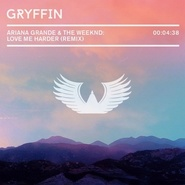

Love Me Harder (Gryffin Remix)
============================

|  |  |
| :--: | :-- |
| [ Love Me Harder (Gryffin Remix)](https://emumo.xiami.com/album/2100271234) | **艺人**: [Gryffin](../index.md) **语种**: 英语 **唱片公司**: Self-Released **发行时间**: 2015年12月23日 **专辑类别**: EP, 单曲 **专辑风格**:  **播放数**: 222582 **收藏数**: 36 **评论数**: 17  |

## 简介

Thank you so much helping me sell out my debut show in LA! Limited tickets are still available for my NYC show here: bit.ly/gryffinNYC  
  
As a thank you for all of the support this year, I decided to give you all a Holiday gift and release my private remix of Ariana Grande &amp; The Weeknd's "Love Me Harder," for FREE! I made this remix for fun over a year ago and have decided to release it after hearing all of the positive response about it on my summer mix. Hope you enjoy it :)

## 曲目

## 评论

|  |  |  |
| :-- | :-- | :-- |
|  [虾米用户](https://emumo.xiami.com/u/410537424)  2020-08-27 14:26 赞(0) 踩(0) | 
O x O
 |
|  [虾米用户](https://emumo.xiami.com/u/30800139) 我在低俗与高雅间活的很尴... 2019-03-23 15:01 赞(0) 踩(0) | 
。
 |
|  [虾米用户](https://emumo.xiami.com/u/73857918) 在黎明之前 2016-09-24 22:14 赞(0) 踩(0) | 
开口跪 
 |
|  [虾米用户](https://emumo.xiami.com/u/27224237) 永远在寻找能唤醒我耳朵的... 2016-08-04 22:12 赞(0) 踩(0) | 
♡
 |
|  [虾米用户](https://emumo.xiami.com/u/3998319) 就让我悲伤一次 2016-05-11 17:52 赞(0) 踩(0) | 
Z
 |
|  [虾米用户](https://emumo.xiami.com/u/37098145) 这个家伙太蠢了不会留下什... 2016-02-05 08:39 赞(0) 踩(0) | 
wk
 |
|  [虾米用户](https://emumo.xiami.com/u/19258387) Wechat: chri... 2016-02-04 23:55 赞(0) 踩(0) | 
yo
 |
|  [虾米用户](https://emumo.xiami.com/u/51865794) 我还没想好要写什么... 2016-02-04 22:29 赞(0) 踩(0) | 
۞
 |
|  [虾米用户](https://emumo.xiami.com/u/9513422) 虾米歌单迁徙到网易☁️:... 2016-02-04 20:15 赞(0) 踩(0) | 
o
 |
|  [虾米用户](https://emumo.xiami.com/u/39193232)  2016-02-04 18:13 赞(0) 踩(0) | 
ฅʕ•̫͡•ʔฅ   ฅʕ•̫͡•ʔฅ   ฅʕ•̫͡•ʔฅ  ฅʕ•̫͡•ʔฅ   ฅʕ•̫͡•ʔฅ   ฅʕ•̫͡•ʔฅ  ฅʕ•̫͡•ʔฅ   ฅʕ•̫͡•ʔฅ   ฅʕ•̫͡•ʔฅ
 |
|  [虾米用户](https://emumo.xiami.com/u/18412060) v15175288880 2016-02-04 18:12 赞(0) 踩(0) | 
nice
 |
|  [虾米用户](https://emumo.xiami.com/u/38213781) 不太用虾米听歌 2016-02-04 14:32 赞(0) 踩(0) | 
。
 |
|  [虾米用户](https://emumo.xiami.com/u/42725114) ThistheshitI... 2016-02-04 14:12 赞(0) 踩(0) | 

 |
|  [虾米用户](https://emumo.xiami.com/u/43910715) live music 2016-02-04 14:11 赞(0) 踩(0) | 
，
 |
|  [虾米用户](https://emumo.xiami.com/u/7322777) ∮ 2016-02-04 14:11 赞(0) 踩(0) | 
...a...
 |
|  [虾米用户](https://emumo.xiami.com/u/5490437) 女士优先 2016-02-04 14:10 赞(0) 踩(0) | 
*
 |
|  [虾米用户](https://emumo.xiami.com/u/1320669) ツ 2016-02-04 14:10 赞(0) 踩(0) | 
0.0
 |
