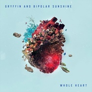

Whole Heart
============================

|  |  |
| :--: | :-- |
| [ Whole Heart](https://emumo.xiami.com/album/2100383182) | **艺人**: [Gryffin](../index.md) **语种**: 英语 **唱片公司**: Interscope Records **发行时间**: 2016年08月26日 **专辑类别**: EP, 单曲 **专辑风格**: 流行舞曲 Dance-Pop, 电子 Electronic **播放数**: 308439 **收藏数**: 50 **评论数**: 21  |

## 简介

## 曲目

## 评论

|  |  |  |
| :-- | :-- | :-- |
|  [虾米用户](https://emumo.xiami.com/u/52056952) 人生即是到來、相遇、陪伴... 2019-04-01 23:11 赞(0) 踩(0) | 

 |
|  [虾米用户](https://emumo.xiami.com/u/30800139) 我在低俗与高雅间活的很尴... 2019-03-23 15:00 赞(0) 踩(0) | 
。
 |
|  [虾米用户](https://emumo.xiami.com/u/194141415) 听一首歌，走一段路;择一... 2017-04-10 13:24 赞(1) 踩(0) | 
很好听呢，意外发现  
 |
|  [虾米用户](https://emumo.xiami.com/u/2888769)  2017-02-14 11:08 赞(0) 踩(0) | 
hi
 |
|  [虾米用户](https://emumo.xiami.com/u/89241402) 爱音乐，爱生活…… 2017-01-02 09:14 赞(0) 踩(0) | 

 |
|  [虾米用户](https://emumo.xiami.com/u/42725114) ThistheshitI... 2016-12-07 01:13 赞(0) 踩(0) | 

 |
|  [虾米用户](https://emumo.xiami.com/u/10435106) 听靓歌 2016-10-22 02:53 赞(0) 踩(0) | 
OK
 |
|  [虾米用户](https://emumo.xiami.com/u/38971967)  一名艺术爱好者，仅此 2016-08-29 00:27 赞(0) 踩(0) | 
这个小哥儿音乐都很棒
 |
|  [虾米用户](https://emumo.xiami.com/u/36641241) Meh 2016-08-28 01:15 赞(0) 踩(0) | 
Hmmm
 |
|  [虾米用户](https://emumo.xiami.com/u/1320669) ツ 2016-08-27 23:06 赞(0) 踩(0) | 
0.0
 |
|  [虾米用户](https://emumo.xiami.com/u/9513422) 虾米歌单迁徙到网易☁️:... 2016-08-27 12:25 赞(0) 踩(0) | 
/
 |
|  [虾米用户](https://emumo.xiami.com/u/54686131) 要听更多喜欢的歌~~~ 2016-08-27 07:05 赞(0) 踩(0) | 
-
 |
|  [虾米用户](https://emumo.xiami.com/u/21164070) 一沙一世界 一花一天堂 ... 2016-08-26 23:05 赞(0) 踩(0) | 
9
 |
|  [虾米用户](https://emumo.xiami.com/u/51607662) 闭关 2016-08-26 16:19 赞(0) 踩(0) | 
✙
 |
|  [虾米用户](https://emumo.xiami.com/u/9028760) 豆瓣见 spotify ... 2016-08-26 13:11 赞(0) 踩(0) | 

 |
|  [虾米用户](https://emumo.xiami.com/u/5490437) 女士优先 2016-08-26 11:34 赞(0) 踩(0) | 
s/：
 |
|  [虾米用户](https://emumo.xiami.com/u/27224237) 永远在寻找能唤醒我耳朵的... 2016-08-26 11:16 赞(0) 踩(0) | 
好听
 |
|  [虾米用户](https://emumo.xiami.com/u/38788628)  2016-08-26 11:16 赞(0) 踩(0) | 
$
 |
|  [虾米用户](https://emumo.xiami.com/u/42879874) born to lost 2016-08-26 11:04 赞(0) 踩(0) | 
✘
 |
|  [虾米用户](https://emumo.xiami.com/u/19258387) Wechat: chri... 2016-08-26 11:01 赞(0) 踩(0) | 
t
 |
|  [虾米用户](https://emumo.xiami.com/u/49845996) 我还没想好要写什么... 2016-08-26 11:01 赞(0) 踩(0) | 
➕
 |
