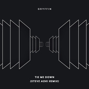
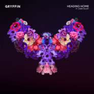
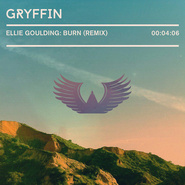

Gryffin
============================

|  |  |
| :--: | :-- |
| [ Gryffin](https://i.xiami.com/gryffin) | **地区**: United States of America 美国 **风格**: 未来贝斯 Future Bass **播放数**: 5855587 **粉丝数**: 2122 **评论数**: 90  |

## 档案

Dan Griffith以他的舞台名称Gryffin (通常被称为GRYFFIN) 而闻名，是一位美国DJ，唱片制作人和音乐家。 他因把一些著名歌曲重新混音而获得认可，如Tove Lo的“Talking Body”，Maroon 5的“Animals”和“Years＆Years”“Desire”。         小档案   艺名：Gryffin   英文名：Dan Griffith   国籍：美国   出生地：美国纽约   生日：1987年9月29日   职业：DJ、唱片制作人、音乐家   经纪公司：Interscope、The Darkroom   活跃时间：2014年至今         从艺历程   2016年1月22日，Gryffin发布了他的首张单曲《Heading Home》，由澳大利亚歌手Josef Salvat通过Darkroom/Interscope Records演唱。2016年5月2日，一段官方音乐视频被上传到他的YouTube频道。这首歌在热门舞曲/电子歌曲榜上排名第22位，在舞曲/电子数字歌曲榜上排名第21位，在Spotify Viral 50榜上排名第一，在公告牌Twitter新兴艺人榜上排名第五。2016年8月26日，他发布了一首名为《Whole Heart》的歌曲   2017年，Gryffin推出了三首单曲。与DJ Illenium和歌手Daya合作的《Feel Good》于3月3日发布。7月7日，歌手Sinéad Harnett演唱的《爱在废墟》发行，10月6日，Katie Pearlman演唱的《无人能与你相比》发行     事实证明，2018年Gryffin来说是重要的一年，他全年发行了五首单曲。他今年的首支单曲《Winnebago》于4月20日发行，这首单曲由Quinn XCII和Daniel Wilson合作。在此之后，他与Iselin合作的单曲《Just for a Moment》于6月22日发行，与Elley Duhe合作的单曲《Tie Me Down》于8月3日发行。在《Tie Me Down》发行两个月后，Griffith和以色列歌手Zohara一起发行了一首歌。《Remember》于10月26日发行，并最终登上美国舞曲排行榜榜首，这也是Gryffin的第一首热门单曲。         Dan Griffith, known by his stage name Gryffin (often stylized as GRYFFIN), is an American DJ, record producer and musician. He gained recognition for remixing some well-known songs such as Tove Lo's "Talking Body", Maroon 5's "Animals" and Years & Years' "Desire".     Background   Gryffin grew up as a classically trained pianist and learned to play the guitar at an early age. He played in bands to initially hone his instrumental abilities. He studied electrical engineering at the University of Southern California where he took much of his leisure time in his dorm room to work on music.When asked on his key lessons of music production, he said "At the beginning, I just released music with the main goal of having my friends play it at college parties and I never would have imagined it would get to this point". He made his 'world' debut at the SnowGlobe Music Festival 2015.  He moved to Los Angeles to be closer to his label and management.       History     2016  Heading Home  On January 22, 2016, Gryffin released his debut single titled "Heading Home"featuring Australian singer Josef Salvat via Darkroom/Interscope Records. On May 2, 2016, an official music video was uploaded on his YouTube channel.The song peaked at number 22 on the Hot Dance/Electronic Songs chart, number 21 on the Dance/Electronic Digital Songs chart, number 1 on Spotify Viral 50 chart and number 5 on Billboard Twitter Emerging Artists chart.  Whole Heart  On August 26, 2016, he released a song titled "Whole Heart" with Bipolar Sunshine. In an interview, about the song "Whole Heart", Gryffin said "'Whole Heart’ is a big step for me as an artist, as it represents a developing maturity of my sound and depth of songwriting".        Genre: Dance / Electronic / Soul      https://www.facebook.com/gryffinofficial   https://soundcloud.com/gryffinofficial

## 专辑

| 名称 | 语种 | 唱片公司 | 发行时间 | 专辑类别 | 专辑风格 |
| :--: | :-- | :-- | :-- | :-- | :-- |
| [ Safe With Me (TELYKast Remix)](./albums/5022582630.md) | 英语 | Darkroom, Interscope Records | 2021年01月22日 | EP, 单曲 | 流行舞曲 Dance-Pop |
| [ Gravity (Deluxe)](./albums/5022158326.md) | 英语 | Darkroom, Interscope Records | 2020年12月10日 | 录音室专辑 | 流行舞曲 Dance-Pop |
| [ Safe With Me](./albums/5021959499.md) | 英语 | Darkroom, Interscope Records | 2020年11月19日 | EP, 单曲 | 流行舞曲 Dance-Pop |
| [ Cry](./albums/5021243849.md) | 英语 | Darkroom | 2020年10月02日 | EP, 单曲 |  |
| [ Spotify Singles](./albums/5021923396.md) | 英语 | Darkroom, Interscope | 2020年05月06日 | EP, 单曲 |  |
| [ Body Back (The Remixes)](./albums/2108300074.md) | 英语 | Universal Music | 2020年01月30日 | EP, 单曲 | 嘻哈 Hip-Hop |
| [ Body Back (Acoustic)](./albums/2108281962.md) | 英语 | Universal Music | 2020年01月21日 | EP, 单曲 | 另类摇滚 Alternative Rock |
| [ Gravity](./albums/2105723774.md) | 英语 | Universal Music | 2019年10月24日 | 录音室专辑 |  |
| [ All You Need To Know (Acoustic)](./albums/2105723718.md) | 英语 | Universal Music | 2019年10月16日 | EP, 单曲 |  |
| [ Baggage](./albums/2105344077.md) | 英语 | Universal Music | 2019年09月19日 | EP, 单曲 |  |
| [ OMG](./albums/2105046344.md) | 英语 | Universal Music | 2019年07月31日 | EP, 单曲 |  |
| [ All You Need To Know (The Remixes)](./albums/2108289415.md) | 英语 | Geffen Records | 2019年06月14日 | EP, 单曲 | 新世纪音乐 New Age |
| [ Hurt People](./albums/2104952051.md) | 英语 | Universal Music | 2019年05月17日 | EP, 单曲 |  |
| [ All You Need To Know](./albums/2104732934.md) | 英语 | Universal Music | 2019年03月27日 | EP, 单曲 |  |
| [ The Gravity Sessions (Pt. 1)](./albums/2104560415.md) | 英语 | Darkroom | 2019年01月31日 | EP, 单曲 |  |
| [ Tie Me Down (Steve Aoki Remix)](./albums/2104399533.md) | 英语 | Universal Music | 2018年12月19日 | EP, 单曲 | 电子舞曲 EDM / Electronic Dance Music |
| [ Gravity Pt. 1](./albums/2104372008.md) | 英语 | Darkroom | 2018年12月14日 | EP, 单曲 | 未来贝斯 Future Bass |
| [ Bye Bye](./albums/2104302318.md) | 英语 | Geffen Records, Darkroom | 2018年11月30日 | EP, 单曲 | 欧美流行 Western Pop |
| [ Remember](./albums/2104158922.md) | 英语 | Darkroom | 2018年10月26日 | EP, 单曲 |  |
| [ Tie Me Down](./albums/2103910527.md) | 英语 | Darkroom | 2018年08月03日 | EP, 单曲 |  |
| [ Just For A Moment](./albums/2103763566.md) | 英语 | Darkroom | 2018年06月22日 | EP, 单曲 |  |
| [ Winnebago](./albums/2103696913.md) | 英语 | Geffen Records, Darkroom | 2018年04月20日 | EP, 单曲 | 电子舞曲 EDM / Electronic Dance Music |
| [ Nobody Compares to You](./albums/2102868257.md) | 英语 | Geffen Records, Darkroom | 2017年10月06日 | EP, 单曲 |  |
| [ Love In Ruins (Remixes)](./albums/2103230841.md) | 英语 | Geffen Records Release;℗2017 UMG Recordings, Inc. & Darkroom, Room | 2017年09月22日 | EP, 单曲 | 流行舞曲 Dance-Pop |
| [ Love In Ruins](./albums/2102803605.md) | 英语 | Geffen Records | 2017年07月27日 | EP, 单曲 |  |
| [ Feel Good (Abandoned Remix)](./albums/2102802829.md) | 英语 | Geffen Records | 2017年07月26日 | EP, 单曲 |  |
| [ Feel Good (feat. Daya) [Abandoned Remix]](./albums/2104266580.md) | 英语 | Darkroom | 2017年07月26日 | EP, 单曲 |  |
| [ Feel Good (The Remixes)](./albums/2102800604.md) | 英语 | Geffen Records, Darkroom | 2017年07月21日 | EP, 单曲 | 流行舞曲 Dance-Pop |
| [ Feel Good (Brooks Remix)](./albums/2102774988.md) | 英语 | Interscope Records | 2017年06月30日 | EP, 单曲 |  |
| [ Feel Good (Crankdat Remix)](./albums/2102750255.md) | 英语 | Darkroom | 2017年05月19日 | EP, 单曲 |  |
| [ Feel Good (Acoustic)](./albums/2102732475.md) | 英语 | Interscope Records | 2017年04月14日 | EP, 单曲 |  |
| [ Feel Good](./albums/2102702648.md) | 英语 | Interscope Records | 2017年03月03日 | EP, 单曲 | 旋律回响贝斯 Melodic Dubstep |
| [ Whole Heart](./albums/2100383182.md) | 英语 | Interscope Records | 2016年08月26日 | EP, 单曲 | 流行舞曲 Dance-Pop, 电子 Electronic |
| [ YOUTH (Gryffin Remix)](./albums/1658932438.md) | 英语 | Universal Music | 2016年03月25日 | EP, 单曲 |  |
| [ Heading Home](./albums/2100264680.md) | 英语 | Interscope Records, Darkroom | 2016年01月22日 | EP, 单曲 | 流行舞曲 Dance-Pop, 电子 Electronic |
| [ Love Me Harder (Gryffin Remix)](./albums/2100271234.md) | 英语 | Self-Released | 2015年12月23日 | EP, 单曲 |  |
| [ King (Gryffin Remix)](./albums/833617407.md) | 英语 | Self-Released | 2015年05月26日 | EP, 单曲 |  |
| [ Am I Wrong (Gryffin Remix)](./albums/833618450.md) | 英语 | Self-Released | 2014年08月02日 | EP, 单曲 |  |
| [ I Belong To You (Gryffin Remix)](./albums/233618938.md) | 英语 | Self-Released | 2014年07月25日 | EP, 单曲 |  |
| [ I Learned From The Best (Gryffin Remix)](./albums/1133618696.md) | 英语 | Self-Released | 2014年07月22日 | EP, 单曲 |  |
| [ Get It Shawty (Gryffin Remix)](./albums/1133619224.md) | 英语 | Self-Released | 2014年05月20日 | EP, 单曲 |  |
| [ Burn (Gryffin Remix)](./albums/933619411.md) | 英语 | Self-Released | 2014年04月25日 | EP, 单曲 |  |
| [ Reflections (Gryffin Remix)](./albums/533619600.md) | 英语 | Self-Released | 2014年04月22日 | EP, 单曲 |  |

## 评论

|  |  |  |
| :-- | :-- | :-- |
|  [虾米用户](https://emumo.xiami.com/u/379162683) 我想要记住你们，我想要你... 2020-08-01 08:46 赞(0) 踩(0) | 
✧*｡
 |
|  [虾米用户](https://emumo.xiami.com/u/35586392) SHOCKEDYOURS... 2020-03-19 22:29 赞(0) 踩(0) | 

 |
|  [虾米用户](https://emumo.xiami.com/u/411133757) k . 2020-03-14 15:41 赞(0) 踩(0) | 
爱了爱了
 |
|  [虾米用户](https://emumo.xiami.com/u/401541389) 专注听歌 2019-09-19 11:34 赞(0) 踩(0) | 
只为在虾米多看你两眼。
 |
|  [虾米用户](https://emumo.xiami.com/u/84571136) 唯有音乐不离不弃 2019-09-01 13:22 赞(1) 踩(0) | 
Gryffin &amp;amp;amp; Carly Rae Jepsen &amp;ndash; OMG (Remix Package, Pt. 1) &amp;ndash; EP
 |
|  [虾米用户](https://emumo.xiami.com/u/84571136) 唯有音乐不离不弃 2019-05-17 05:51 赞(1) 踩(0) | 
Gryffin &amp; Aloe Blacc – Hurt People
 |
|  [虾米用户](https://emumo.xiami.com/u/52264979) 我只有两样不会：这也不会... 2019-04-20 21:41 赞(1) 踩(0) | 
首首是精品。
 |
|  [虾米用户](https://emumo.xiami.com/u/228843687) 懒惰统治人间 2019-04-01 18:49 赞(2) 踩(0) | 

 |
|  [虾米用户](https://emumo.xiami.com/u/401541389) 专注听歌 2019-03-29 15:06 赞(1) 踩(0) | 
只为在虾米多看你两眼！
 |
|  [虾米用户](https://emumo.xiami.com/u/52056952) 人生即是到來、相遇、陪伴... 2019-03-29 13:06 赞(2) 踩(0) | 
[给力]
 |
|  [虾米用户](https://emumo.xiami.com/u/30800139) 我在低俗与高雅间活的很尴... 2019-03-23 15:03 赞(0) 踩(0) | 
19.3.23
 |
|  [虾米用户](https://emumo.xiami.com/u/64915454) Say Somethin... 2019-03-13 18:36 赞(2) 踩(0) | 
此生何时能有一个音乐知己。
 |
|  [虾米用户](https://emumo.xiami.com/u/358104299) 悲观的唯心存在现实解构虚... 2019-03-12 20:07 赞(1) 踩(0) | 
10237
 |
|  [虾米用户](https://emumo.xiami.com/u/4487129)  2019-02-07 20:52 赞(0) 踩(0) | 
！！！
 |
|  [虾米用户](https://emumo.xiami.com/u/313923153) 宇宙深处的大虾 2018-11-24 20:37 赞(2) 踩(0) | 
你的每一首歌我都喜欢你太棒了
 |
|  [虾米用户](https://emumo.xiami.com/u/84571136) 唯有音乐不离不弃 2018-09-20 21:06 赞(1) 踩(0) | 
Gryffin - Tie Me Down (feat. Elley Duhe) (Remixes)
 |
|  [虾米用户](https://emumo.xiami.com/u/8560271) Still here 2018-07-11 13:43 赞(1) 踩(0) | 
I like your music rhythm,so much!! I also hope u can make more excellent music.
 |
|  [虾米用户](https://emumo.xiami.com/u/262280019)  2018-06-25 15:10 赞(0) 踩(0) | 
just for a moment 怎麼還沒發
 |
|  [虾米用户](https://emumo.xiami.com/u/258427956) 微信：pandarial... 2018-05-08 12:07 赞(0) 踩(0) | 
我伤悲这世界，没有可以欺骗自己的好梦。
 |
|  [虾米用户](https://emumo.xiami.com/u/81081712) Nichts zu ve... 2018-04-30 09:15 赞(1) 踩(0) | 
Terrific live show at Shanghai edc!! 
 |
|  [虾米用户](https://emumo.xiami.com/u/12960058) We're not al... 2018-04-21 02:17 赞(0) 踩(0) | 
求winnebago?
 |
|  [虾米用户](https://emumo.xiami.com/u/298022288)  2018-01-21 16:57 赞(11) 踩(0) | 
I love your music so much.
 |
| ⇒ |  [虾米用户](https://emumo.xiami.com/u/216633864) 再见 2018-02-26 16:47 赞(0) 踩(0) | 
I love your music too.
 |
|  [虾米用户](https://emumo.xiami.com/u/255285644) 因为个性所以没有签名 2018-01-13 18:01 赞(0) 踩(0) | 
国人？
 |
|  [虾米用户](https://emumo.xiami.com/u/198245168) Fakeuphrosyn... 2018-01-09 17:46 赞(0) 踩(0) | 
封面太喜欢了
 |
|  [虾米用户](https://emumo.xiami.com/u/7889237) 向前走总有个出口 2017-12-13 20:57 赞(1) 踩(0) | 
疯狂打call
 |
|  [虾米用户](https://emumo.xiami.com/u/13555511) 听蛙 2017-09-29 14:49 赞(0) 踩(0) | 
✿
 |
|  [虾米用户](https://emumo.xiami.com/u/1503246) 好音乐,自己会说话 2017-09-29 00:31 赞(2) 踩(0) | 
O(&amp;cap;_&amp;cap;)O欢迎加入虾米！！
 |
|  [虾米用户](https://emumo.xiami.com/u/46583488)  2017-09-19 18:47 赞(0) 踩(0) | 
:)
 |
|  [虾米用户](https://emumo.xiami.com/u/325102804)  2017-09-15 14:28 赞(86) 踩(0) | 
我刚入驻了虾米音乐人，欢迎大家来我的个人主页，收听我的最新音乐
 |
| ⇒ |  [虾米用户](https://emumo.xiami.com/u/317682169) 音乐三分钟 2018-01-21 08:47 赞(0) 踩(0) | 
敢问您是国人吗？
 |
| ⇒ |  [虾米用户](https://emumo.xiami.com/u/350901664)  2018-02-28 21:40 赞(0) 踩(0) | 
爱你
 |
| ⇒ |  [虾米用户](https://emumo.xiami.com/u/324580486)  2018-04-06 11:45 赞(0) 踩(0) | 
欢迎
 |
| ⇒ |  [虾米用户](https://emumo.xiami.com/u/8735080) AhhhhTheWorl... 2018-04-23 21:22 赞(0) 踩(0) | 
<q><b>輕荺滴露说：</b></q>
 |
| ⇒ |  [虾米用户](https://emumo.xiami.com/u/292133220) 疯狂地刺伤自己，只为了一... 2019-03-27 03:43 赞(0) 踩(0) | 
like it
 |
|  [虾米用户](https://emumo.xiami.com/u/1166062) 熊呷衣indie! 2017-09-08 15:30 赞(0) 踩(0) | 
很想听coachella上演的新歌，好像叫blue sky。
 |
|  [虾米用户](https://emumo.xiami.com/u/291453508)  2017-06-25 12:38 赞(3) 踩(0) | 
希望你以后多出些像king的曲子
 |
|  [虾米用户](https://emumo.xiami.com/u/274761880)   2017-04-29 21:57 赞(2) 踩(0) | 
刚看完EDCJapan的现场 感觉只有你在用心表演.   终场Martin完全是是在放歌听 
 |
| ⇒ |  [虾米用户](https://emumo.xiami.com/u/19276055) st 2017-12-08 01:46 赞(0) 踩(0) | 
同意 martin的那个开场真是烂
 |
|  [虾米用户](https://emumo.xiami.com/u/46583488)  2017-04-20 08:00 赞(0) 踩(0) | 
:-)
 |
|  [虾米用户](https://emumo.xiami.com/u/1693816)  2017-04-17 03:10 赞(1) 踩(0) | 
coachella 2017
 |
|  [虾米用户](https://emumo.xiami.com/u/31696713) 轻音乐群88876205 2017-04-15 10:59 赞(1) 踩(0) | 
  
 |
|  [虾米用户](https://emumo.xiami.com/u/50701909) 艾音 2017-03-15 20:50 赞(0) 踩(0) | 
这是男的？
 |
| ⇒ |  [虾米用户](https://emumo.xiami.com/u/301731671)  2017-07-31 12:00 赞(0) 踩(0) | 
******
 |
|  [虾米用户](https://emumo.xiami.com/u/2888769)  2017-02-14 11:08 赞(0) 踩(0) | 
hi
 |
|  [虾米用户](https://emumo.xiami.com/u/8424657) 海岸线 2017-01-30 06:26 赞(0) 踩(0) | 

 |
|  [虾米用户](https://emumo.xiami.com/u/21164070) 一沙一世界 一花一天堂 ... 2016-12-02 01:00 赞(0) 踩(0) | 
又见
 |
|  [虾米用户](https://emumo.xiami.com/u/73857918) 在黎明之前 2016-09-16 15:30 赞(0) 踩(0) | 
滴滴打卡～
 |
|  [虾米用户](https://emumo.xiami.com/u/8475241) REACH FOR TH... 2016-09-05 13:15 赞(0) 踩(0) | 

 |
|  [虾米用户](https://emumo.xiami.com/u/27224237) 永远在寻找能唤醒我耳朵的... 2016-08-26 11:18 赞(0) 踩(0) | 

 |
|  [虾米用户](https://emumo.xiami.com/u/21164070) 一沙一世界 一花一天堂 ... 2016-08-19 09:29 赞(0) 踩(0) | 
40
 |
|  [虾米用户](https://emumo.xiami.com/u/54686131) 要听更多喜欢的歌~~~ 2016-08-01 17:48 赞(0) 踩(0) | 
专辑封面真迷幻啦。
 |
|  [虾米用户](https://emumo.xiami.com/u/52056952) 人生即是到來、相遇、陪伴... 2016-07-17 15:45 赞(0) 踩(0) | 

 |
|  [虾米用户](https://emumo.xiami.com/u/45489719)   2016-05-14 14:12 赞(0) 踩(0) | 
like it
 |
|  [虾米用户](https://emumo.xiami.com/u/8003982) 取次花丛懒回顾 2016-04-14 17:05 赞(0) 踩(0) | 
哇塞，好帅啊！没想到
 |
|  [虾米用户](https://emumo.xiami.com/u/45485152) Wubba lubba ... 2016-04-12 15:39 赞(0) 踩(0) | 
婶子么么哒
 |
|  [虾米用户](https://emumo.xiami.com/u/45485152) Wubba lubba ... 2016-04-12 15:39 赞(0) 踩(0) | 
只为在虾米中多看你一眼
 |
|  [虾米用户](https://emumo.xiami.com/u/42661055) ✨ 2016-02-28 10:00 赞(0) 踩(0) | 
❁
 |
|  [虾米用户](https://emumo.xiami.com/u/9028760) 豆瓣见 spotify ... 2016-02-21 12:09 赞(1) 踩(0) | 
☄
 |
|  [虾米用户](https://emumo.xiami.com/u/2556225)  2016-02-10 21:34 赞(0) 踩(0) | 
☹
 |
|  [虾米用户](https://emumo.xiami.com/u/52536056) (◉ω◉υ)⁼³₌₃悄咪... 2016-02-06 20:35 赞(1) 踩(0) | 
吸吸∠( ᐛ 」∠)＿
 |
|  [虾米用户](https://emumo.xiami.com/u/13729629)   2016-02-04 17:06 赞(1) 踩(0) | 
九首混曲我收藏了八首 还是很对口味的 混得非常有现代感与节奏感 毕竟喜欢同一个艺人的所有歌这种现象在我身上还是很少见的 大爱 
 |
|  [虾米用户](https://emumo.xiami.com/u/22881143) ㅤㅤㅤㅤ 2016-02-04 16:08 赞(1) 踩(0) | 
。
 |
|  [虾米用户](https://emumo.xiami.com/u/46292977) Music Drug 2016-01-25 14:23 赞(1) 踩(0) | 
这小伙可以的
 |
|  [虾米用户](https://emumo.xiami.com/u/84571136) 唯有音乐不离不弃 2016-01-22 03:36 赞(0) 踩(0) | 
Gryffin – Heading Home (feat. Josef Salvat)
 |
|  [虾米用户](https://emumo.xiami.com/u/38971967)  一名艺术爱好者，仅此 2015-12-19 04:13 赞(0) 踩(0) | 
看完电影《我们是你的朋友》滚过来的╮(╯▽╰)╭
 |
|  [虾米用户](https://emumo.xiami.com/u/44261599) 想好了 也不写 2015-12-18 23:55 赞(0) 踩(0) | 
 
 |
|  [虾米用户](https://emumo.xiami.com/u/29197411) 我还没想好要写什么... 2015-12-14 19:59 赞(1) 踩(0) | 
好几首都不错。
 |
|  [虾米用户](https://emumo.xiami.com/u/38788628)  2015-12-14 09:10 赞(0) 踩(0) | 
，
 |
|  [虾米用户](https://emumo.xiami.com/u/18165695) WHY U ACT LY... 2015-12-01 21:56 赞(0) 踩(0) | 
不错的
 |
|  [虾米用户](https://emumo.xiami.com/u/5490437) 女士优先 2015-11-27 20:05 赞(0) 踩(0) | 
~
 |
|  [虾米用户](https://emumo.xiami.com/u/1320669) ツ 2015-11-08 17:51 赞(0) 踩(0) | 
0.0
 |
|  [虾米用户](https://emumo.xiami.com/u/11917054) 『常年卧底医院并乔装成医... 2015-11-07 20:39 赞(0) 踩(0) | 
get√ U
 |
|  [虾米用户](https://emumo.xiami.com/u/763459) (๑•̀ㅁ•́ฅ)嗷呜 2015-10-25 12:08 赞(0) 踩(0) | 
SW，很好，收了两首
 |
|  [虾米用户](https://emumo.xiami.com/u/42096164)   2015-10-10 21:56 赞(1) 踩(0) | 
  
 |
|  [虾米用户](https://emumo.xiami.com/u/35714790)  2015-09-04 11:28 赞(1) 踩(0) | 
白捡╭（′▽‵）╭（′▽‵）╭（′▽‵）╯
 |
|  [虾米用户](https://emumo.xiami.com/u/47028637) 我还没想好要写什么... 2015-09-03 19:25 赞(0) 踩(0) | 
好喜欢他的Remix！
 |
|  [虾米用户](https://emumo.xiami.com/u/42695089) vb：吴浣甜甜 2015-07-30 15:51 赞(0) 踩(0) | 
。
 |
|  [虾米用户](https://emumo.xiami.com/u/50359715)  2015-07-29 21:31 赞(0) 踩(0) | 
The good music always take us higher.
 |
|  [虾米用户](https://emumo.xiami.com/u/11685537) i am Fuckin ... 2015-07-18 14:13 赞(0) 踩(0) | 
；）
 |
|  [虾米用户](https://emumo.xiami.com/u/42879874) born to lost 2015-07-16 14:33 赞(0) 踩(0) | 
✘
 |
|  [虾米用户](https://emumo.xiami.com/u/3882720) 人生如逆旅 我亦是行人 2015-07-15 12:10 赞(0) 踩(0) | 
整体素质不错
 |
|  [虾米用户](https://emumo.xiami.com/u/37098145) 这个家伙太蠢了不会留下什... 2015-06-29 22:13 赞(0) 踩(0) | 
wk
 |
|  [虾米用户](https://emumo.xiami.com/u/11664454) 喜欢电子音乐 acg 2015-06-23 12:36 赞(0) 踩(0) | 
才发现有了啊我天
 |
|  [虾米用户](https://emumo.xiami.com/u/8226204) ≡ 2015-06-07 19:22 赞(0) 踩(0) | 
wait。
 |
|  [虾米用户](https://emumo.xiami.com/u/20862728) 柯男 2015-05-17 23:15 赞(1) 踩(0) | 
(●—●)i want songs
 |
|  [虾米用户](https://emumo.xiami.com/u/9320764) 吃饭时要开心 2015-04-29 07:54 赞(1) 踩(0) | 
坐等
 |
|  [虾米用户](https://emumo.xiami.com/u/7322777) ∮ 2015-04-20 02:45 赞(1) 踩(0) | 
...A...
 |
|  [虾米用户](https://emumo.xiami.com/u/7097982) EVERYTHING 2015-03-29 19:40 赞(0) 踩(0) | 
==
 |
|  [虾米用户](https://emumo.xiami.com/u/558046) 朝 鲜 冷 面 杀 手 2015-03-16 17:03 赞(1) 踩(0) | 
<a href="http://www.xiami.com/album/1426298897?spm=0.0.0.0.hqnBVj" target="_blank" rel="nofollow noreferrer noopener">http://www.xiami.com/album/1426298897?spm=0.0.0.0.hqnBVj</a>
 |
