Toy王奕
============================

|  |  |
| :--: | :-- |
| [ Toy王奕](https://i.xiami.com/toy_wong) | **播放数**: 3779051 **粉丝数**: 2635 **评论数**: 93 **地区**: China 中国大陆 **风格**: 流行说唱 Pop Rap  |

## 档案

Toy 个人简历 
姓名：王奕 AKA:Toy 
微博名 ：Toy_wong 
性别：男  生日：1993年8月22日 
身高：1.75M 星座：狮子座  体重：65Kg 
主修词曲创作，舞蹈。 
★2005年湖南金阁铝材《舞动大赛》50强 
★2006年参加湖南娱乐频道《今晚看我的》第一期嘉宾。 
★2007年湖南衡阳ITAT街舞新人比赛湖南冠军。 
★2008年广州BBOY WOLRD 前八强。 
★2009年娃哈哈湖南街舞挑战赛冠军。 
★2009-2010年北京现代音乐学院进修1年半。 
★2011年将饶舌音乐带入魅力四射酒吧. X5酒吧.酒库酒吧. 
★2012年由魅力四射赞助拍摄制作：长沙《解放STYLE》 
★2012年电视剧频道邀请拍摄湖南新一代青年纪录片。 
★2012年台湾Mad street大陆赛区第三名。 
★2013年赴邀去台湾进行音乐交流与学习。 
★2013年哈尔滨啤酒长沙音乐节表演嘉宾 
★2014年独立创作歌曲《那么我先不等了》并拍摄mv。 
★2014年《那么我先不等了》获得中国嘻哈榜冠军 
★2014年深圳嘻哈全明星歌会嘉宾 
★2015年4月8日独立创作并完成自己第一张个人专辑 
台湾.大陆合作歌曲2013年 http://v.youku.com/v_show/id_XNTc3MDEyOTky.html 
首支单曲MV  http://v.youku.com/v_show/id_XNTQ5ODk5Nzc2.html 
LIFE SONG单曲   http://v.youku.com/v_show/id_XNDgwMzY1NTU2.html?from=y1.2-1-94.3.3-1.1-1-1-2 
2012年Roll star 合作  http://www.tudou.com/programs/view/BQuTc7v0mSc/ 
2014独立完成单曲  http://v.yinyuetai.com/video/2096352 
那么我先不等了mv  http://v.yinyuetai.com/video/2096352 
2015单曲BLACK MV  http://v.yinyuetai.com/video/2264638

## 专辑

| 名称 | 语种 | 唱片公司 | 发行时间 | 专辑类别 | 专辑风格 |
| :--: | :-- | :-- | :-- | :-- | :-- |
| [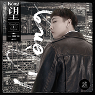 Wòng](./albums/5022307697.md) | 国语 | PINGPENG乒碰 | 2020年12月26日 | 录音室专辑 | 嘻哈 Hip-Hop |
| [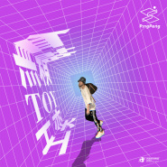 无赖](./albums/5021655787.md) | 国语 | PINGPENG乒碰 | 2020年10月12日 | EP, 单曲 | 嘻哈 Hip-Hop |
| [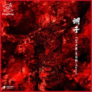 调子](./albums/5021470710.md) | 国语 | PINGPENG乒碰 | 2020年09月17日 | EP, 单曲 | 嘻哈 Hip-Hop |
| [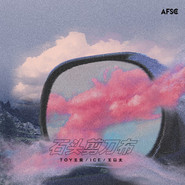 石头剪刀布](./albums/5020408903.md) | 国语 |  | 2020年04月08日 | 录音室专辑 |  |
| [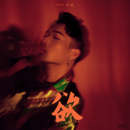 欲](./albums/5021989586.md) | 国语 | PINGPENG乒碰 | 2019年08月15日 | EP, 单曲 | 嘻哈 Hip-Hop |
| [ Keep](./albums/5021969959.md) | 国语 | PINGPENG乒碰 | 2019年06月15日 | EP, 单曲 | 嘻哈 Hip-Hop |
| [ 别担心](./albums/5021977862.md) | 国语 | PINGPENG乒碰 | 2019年04月06日 | EP, 单曲 | 嘻哈 Hip-Hop |
| [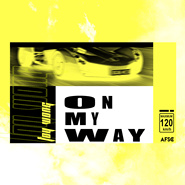 On my way](./albums/2104051670.md) | 国语 | AFSC | 2018年09月22日 | EP, 单曲 |  |
| [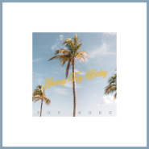 Young Toy baby](./albums/2103970333.md) | 国语 | AFSC | 2018年09月03日 | EP, 单曲 |  |
| [ Holla Back](./albums/2103815970.md) | 国语 | AFSC | 2018年07月17日 | EP, 单曲 | 嘻哈 Hip-Hop |
| [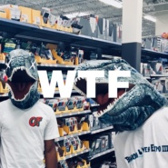 WTF](./albums/2103969430.md) | 英语 | Repost Network | 2018年06月05日 | EP, 单曲 |  |
| [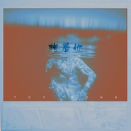 抱着你](./albums/5021975878.md) | 国语 | PINGPENG乒碰 | 2018年06月01日 | EP, 单曲 | 嘻哈 Hip-Hop |
| [ 那一天](./albums/5021986125.md) | 国语 | PINGPENG乒碰 | 2018年01月10日 | EP, 单曲 | 嘻哈 Hip-Hop |
| [ Coming now](./albums/2102974223.md) | 国语 | 独立发行 | 2017年12月14日 | EP, 单曲 |  |
| [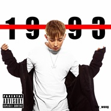 1993](./albums/2102729126.md) | 国语 | 独立发行 | 2017年04月06日 | 录音室专辑 | 嘻哈 Hip-Hop |
| [ Stay Alone Together孤单并肩](./albums/2100347770.md) | 国语 | 独立发行 | 2016年05月30日 | EP, 单曲 | 流行说唱 Pop Rap |
| [ Never Lonely陪在你身边](./albums/2100324792.md) | 国语 | RSPT | 2016年04月28日 | EP, 单曲 | 流行说唱 Pop Rap |
| [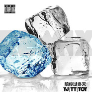 YJ;TT;TOY陪你过冬天](./albums/2100207652.md) | 国语 | 三结义 | 2015年09月20日 | EP, 单曲 | 流行说唱 Pop Rap |
| [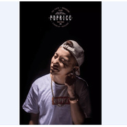 POPRICEPOPRICE](./albums/2100186564.md) | 国语 | 独立发行 | 2015年08月15日 | EP, 单曲 | 流行说唱 Pop Rap |
| [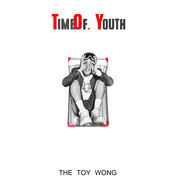 Time Of Youth](./albums/533244976.md) | 国语 |  | 2015年04月17日 | EP, 单曲 | 流行说唱 Pop Rap |
| [ Time Of  Youth青春时刻](./albums/236602988.md) | 国语 | Respect music | 2015年04月08日 | 录音室专辑 | 流行说唱 Pop Rap, 当代唱作人 Contemporary Singer-Songwriter, 国语流行 Mandarin Pop |

## 评论

|  |  |  |  |
| :-- | :-- | :-- | :-- |
|  [虾米用户](https://emumo.xiami.com/u/315036148) can't stop r... 2019-05-30 05:44 赞(0) 踩(0) | 
太甜了
 |
|  [虾米用户](https://emumo.xiami.com/u/378120315)  2019-04-06 09:58 赞(0) 踩(0) | 
依旧优秀
 |
|  [虾米用户](https://emumo.xiami.com/u/272113951)  2018-10-22 09:00 赞(0) 踩(0) | 
现场也太炸了吧，ayo西安站
 |
|  [虾米用户](https://emumo.xiami.com/u/403360818) ❤️❤ 2018-10-02 09:51 赞(0) 踩(0) | 

 |
|  [虾米用户](https://emumo.xiami.com/u/308908844) 再见 2018-07-22 16:20 赞(0) 踩(0) | 
他们没眼光 
 |
|  [虾米用户](https://emumo.xiami.com/u/207117730) 你的手机没得CDC都显得... 2018-07-20 22:34 赞(0) 踩(0) | 

 |
|  [虾米用户](https://emumo.xiami.com/u/18106066) 难得洒脱陶醉过 2018-07-03 19:44 赞(0) 踩(0) | 
我不等了
 |
|  [虾米用户](https://emumo.xiami.com/u/375872884)  2018-06-21 13:56 赞(0) 踩(0) | 
那么我先等了
 |
|  [虾米用户](https://emumo.xiami.com/u/248850485)  2018-06-11 00:53 赞(0) 踩(0) | 
 优秀的王王王可爱ớ ₃ờ
 |
|  [虾米用户](https://emumo.xiami.com/u/48411458) ¿ 2018-05-16 00:56 赞(0) 踩(0) | 
坐等因為節目而火。
 |
|  [虾米用户](https://emumo.xiami.com/u/359644374)  2018-04-21 23:39 赞(0) 踩(0) | 
奕坨我爱你
 |
|  [虾米用户](https://emumo.xiami.com/u/359393820)  2018-04-21 12:43 赞(0) 踩(0) | 
谁可以分享下奕和vava的《she》这首歌啊
 |
|  [虾米用户](https://emumo.xiami.com/u/45653586) 你眉头冷硬眼里却有雾气 2018-04-02 15:47 赞(0) 踩(0) | 
哈哈哈
 |
|  [虾米用户](https://emumo.xiami.com/u/330019116) 网易云音乐:s喜丸子 2017-11-30 23:13 赞(0) 踩(0) | 
最近耳朵喜欢TOY
 |
|  [虾米用户](https://emumo.xiami.com/u/330847742)  2017-10-19 17:38 赞(0) 踩(0) | 
奕坨
 |
|  [虾米用户](https://emumo.xiami.com/u/28878477) 我还没想好要写什么... 2017-09-12 03:28 赞(0) 踩(0) | 
Toy好喜欢你的歌啊
 |
|  [虾米用户](https://emumo.xiami.com/u/2418238) weibo: @尤米口 2017-09-11 17:25 赞(0) 踩(0) | 

 |
|  [虾米用户](https://emumo.xiami.com/u/3079853)  2017-09-10 05:05 赞(2) 踩(0) | 
这次为什么没有参加中国有嘻哈？
 |
|  [虾米用户](https://emumo.xiami.com/u/46850625) 不感兴趣 不想了解 2017-07-23 13:05 赞(0) 踩(0) | 
喜欢奕坨qwq
 |
|  [虾米用户](https://emumo.xiami.com/u/289300878)  2017-07-22 16:58 赞(0) 踩(0) | 
Rap挺有感觉的
 |
|  [虾米用户](https://emumo.xiami.com/u/289991820)   2017-07-17 22:01 赞(0) 踩(0) | 
喜欢你
 |
|  [虾米用户](https://emumo.xiami.com/u/68786032) 想念不会说话。所以我渐渐... 2017-07-05 15:45 赞(0) 踩(0) | 
我的歌声里&amp;hellip;&amp;hellip;
 |
|  [虾米用户](https://emumo.xiami.com/u/88514392)   2017-05-09 05:34 赞(0) 踩(0) | 
那么我先不等了 很nice
 |
|  [虾米用户](https://emumo.xiami.com/u/188976451)   2017-04-28 22:42 赞(0) 踩(0) | 
喜欢你
 |
|  [虾米用户](https://emumo.xiami.com/u/287884177)  2017-04-11 19:36 赞(1) 踩(0) | 
。
 |
|  [虾米用户](https://emumo.xiami.com/u/260578157)  2017-04-07 23:56 赞(1) 踩(0) | 
啊啊啊啊啊奕陀哥再来一次魅力啊啊啊啊啊啊啊啊啊
 |
|  [虾米用户](https://emumo.xiami.com/u/254195236)   2016-12-15 21:18 赞(0) 踩(0) | 
很喜欢
 |
|  [虾米用户](https://emumo.xiami.com/u/44283239)  2016-12-07 14:57 赞(0) 踩(0) | 

 |
|  [虾米用户](https://emumo.xiami.com/u/229717057) 碎碎念 2016-10-26 07:24 赞(0) 踩(0) | 
想让Toy
 |
|  [虾米用户](https://emumo.xiami.com/u/72210746) 我还没想好要写什么... 2016-09-30 17:07 赞(0) 踩(0) | 
在广州看到你之后马上就被圈粉了！！！！现在超级棒！！！
 |
|  [虾米用户](https://emumo.xiami.com/u/9793938) 要说拜拜啦虾米音乐 2016-09-27 11:59 赞(0) 踩(0) | 
在广州第一次看到你的现场 挺好的 笑起来很像台湾的熊仔
 |
|  [虾米用户](https://emumo.xiami.com/u/229715926)  2016-09-25 00:50 赞(0) 踩(0) | 
支持你
 |
|  [虾米用户](https://emumo.xiami.com/u/148167074) 我还没想好要写什么... 2016-09-17 20:02 赞(0) 踩(0) | 
加油奕哥  和cb一路唱个歌撒
 |
|  [虾米用户](https://emumo.xiami.com/u/227089019)  2016-09-16 20:34 赞(0) 踩(0) | 

 |
|  [虾米用户](https://emumo.xiami.com/u/85501218)   2016-08-27 15:21 赞(0) 踩(0) | 

 |
|  [虾米用户](https://emumo.xiami.com/u/103363344)   2016-08-10 10:40 赞(0) 踩(0) | 
帅到！
 |
|  [虾米用户](https://emumo.xiami.com/u/115575332) 我的存在或许只是用耳朵和... 2016-07-22 03:41 赞(0) 踩(0) | 
还有一个就1000粉丝了  
 |
|  [虾米用户](https://emumo.xiami.com/u/200345210)  2016-07-14 00:43 赞(0) 踩(0) | 
湖南 wow wow
 |
|  [虾米用户](https://emumo.xiami.com/u/124151798)   2016-06-28 12:34 赞(0) 踩(0) | 
支持
 |
|  [虾米用户](https://emumo.xiami.com/u/194090619) 世界上最好闻的味道  就... 2016-06-25 22:41 赞(0) 踩(0) | 
支持T  O   Y
 |
|  [虾米用户](https://emumo.xiami.com/u/50853616) 微博：dy 2016-06-24 19:45 赞(0) 踩(0) | 
支持哈哈
 |
|  [虾米用户](https://emumo.xiami.com/u/69675408) 活得很恍惚 2016-05-28 15:38 赞(0) 踩(0) | 
声音我好喜欢
 |
|  [虾米用户](https://emumo.xiami.com/u/97755670) -          ⅅ... 2016-05-11 10:03 赞(0) 踩(0) | 

 |
|  [虾米用户](https://emumo.xiami.com/u/49185549) 喜欢了六年的东西  至今... 2016-04-23 21:46 赞(0) 踩(0) | 
第一次看到你是在5sing~ 
 |
|  [虾米用户](https://emumo.xiami.com/u/10341523) 歌里留着回忆。 2016-04-23 13:43 赞(0) 踩(0) | 
长得帅唱的好 真棒！！(｡･ω･｡)ﾉ♡
 |
|  [虾米用户](https://emumo.xiami.com/u/42426726)  2016-04-23 00:10 赞(0) 踩(0) | 
是我选择在这肮脏的世界做个好人
 |
|  [虾米用户](https://emumo.xiami.com/u/145291506)   2016-04-19 16:42 赞(0) 踩(0) | 
超帅
 |
|  [虾米用户](https://emumo.xiami.com/u/145291506)   2016-04-19 16:41 赞(0) 踩(0) | 
超帅！！诸葛诸葛我爱你
 |
|  [虾米用户](https://emumo.xiami.com/u/122818070)  2016-04-11 03:49 赞(0) 踩(0) | 
老公！超帅！
 |
|  [虾米用户](https://emumo.xiami.com/u/11778540)   2016-04-08 23:04 赞(0) 踩(0) | 

 |
|  [虾米用户](https://emumo.xiami.com/u/55528074) Fresh gang 顽... 2016-04-07 00:11 赞(0) 踩(0) | 

 |
|  [虾米用户](https://emumo.xiami.com/u/102734022) 我还没想好要写什么... 2016-04-02 19:58 赞(0) 踩(0) | 
老公老公
 |
|  [虾米用户](https://emumo.xiami.com/u/124643526)  2016-04-02 18:27 赞(0) 踩(0) | 
adad
 |
|  [虾米用户](https://emumo.xiami.com/u/52889599) 五花八門 2016-04-01 15:50 赞(17) 踩(0) | 
来自长沙的Toy王奕,简直帅呆~
 |
| ⇒ |  [虾米用户](https://emumo.xiami.com/u/216720354) 蝦米再見有緣再愛你 2016-10-14 10:16 赞(0) 踩(0) | 
，
 |
|  [虾米用户](https://emumo.xiami.com/u/118200294) hi 2016-03-26 14:32 赞(0) 踩(0) | 
长沙
 |
|  [虾米用户](https://emumo.xiami.com/u/55137929) 无 2016-03-25 22:21 赞(1) 踩(0) | 
今晚listen up深圳的rap for China 太炸啦
 |
|  [虾米用户](https://emumo.xiami.com/u/45385073) 爱虾米期待再相遇为新：t... 2016-03-19 02:39 赞(0) 踩(0) | 
长沙
 |
|  [虾米用户](https://emumo.xiami.com/u/74738546)  2016-02-28 22:55 赞(0) 踩(0) | 

 |
|  [虾米用户](https://emumo.xiami.com/u/117243218)   2016-02-26 23:46 赞(0) 踩(0) | 
长沙顶
 |
|  [虾米用户](https://emumo.xiami.com/u/52889599) 五花八門 2016-02-18 21:46 赞(0) 踩(0) | 
so cool
 |
|  [虾米用户](https://emumo.xiami.com/u/92900072)   2016-02-18 11:46 赞(0) 踩(0) | 
喜欢你
 |
|  [虾米用户](https://emumo.xiami.com/u/41700224) 请输入签名... 2016-01-21 01:32 赞(0) 踩(0) | 
力顶！Young Toy   
 |
|  [虾米用户](https://emumo.xiami.com/u/79509134) WeiBo：VickyF... 2016-01-20 13:10 赞(0) 踩(0) | 
喜欢你
 |
|  [虾米用户](https://emumo.xiami.com/u/37840483) 再說吧 2016-01-10 15:35 赞(1) 踩(0) | 
喜歡
 |
|  [虾米用户](https://emumo.xiami.com/u/97104700)  2016-01-03 14:04 赞(1) 踩(0) | 
专门卸载了qq音乐下了一个虾米，  
 |
|  [虾米用户](https://emumo.xiami.com/u/96651378) 慢熟型脸盲症 2016-01-02 00:18 赞(0) 踩(0) | 
支持哦
 |
|  [虾米用户](https://emumo.xiami.com/u/94357554)  2015-12-25 10:43 赞(0) 踩(0) | 
为你下虾米
 |
|  [虾米用户](https://emumo.xiami.com/u/35151389) 万事胜意 2015-12-05 18:28 赞(1) 踩(0) | 
他为什么没火。。。
 |
|  [虾米用户](https://emumo.xiami.com/u/88713984)  2015-12-04 21:23 赞(0) 踩(0) | 
So cool
 |
|  [虾米用户](https://emumo.xiami.com/u/88713984)  2015-12-04 20:45 赞(0) 踩(0) | 

 |
|  [虾米用户](https://emumo.xiami.com/u/48777249) 永远不要放下你对这个世界... 2015-11-30 21:19 赞(0) 踩(0) | 

 |
|  [虾米用户](https://emumo.xiami.com/u/49496732)   2015-10-25 04:12 赞(0) 踩(0) | 
第一次听，还不错… 
 |
|  [虾米用户](https://emumo.xiami.com/u/50392515)   2015-10-08 18:23 赞(1) 踩(0) | 
～
 |
|  [虾米用户](https://emumo.xiami.com/u/71245418) 00年 2015-10-03 01:40 赞(0) 踩(0) | 
把si下个虾米音乐听你的歌  从此变脑残粉达
 |
|  [虾米用户](https://emumo.xiami.com/u/68786032) 想念不会说话。所以我渐渐... 2015-09-23 11:06 赞(0) 踩(0) | 
Toy，我的歌声里。叻 
 |
|  [虾米用户](https://emumo.xiami.com/u/60958708)   2015-09-05 04:10 赞(0) 踩(0) | 

 |
|  [虾米用户](https://emumo.xiami.com/u/57732336)  2015-08-25 21:14 赞(0) 踩(0) | 
单曲循环，每天五遍
 |
|  [虾米用户](https://emumo.xiami.com/u/55475973) 你很好 2015-08-18 05:16 赞(0) 踩(0) | 
只有虾米才有么么哒
 |
|  [虾米用户](https://emumo.xiami.com/u/55475973) 你很好 2015-08-18 05:16 赞(0) 踩(0) | 
只有虾米才有么么哒
 |
|  [虾米用户](https://emumo.xiami.com/u/54744404)   2015-08-11 03:44 赞(0) 踩(0) | 
    
 |
|  [虾米用户](https://emumo.xiami.com/u/18314357) 肆叁贰 2015-08-07 15:31 赞(0) 踩(0) | 
喜欢
 |
|  [虾米用户](https://emumo.xiami.com/u/43908289) 自己都不自己了  2015-06-17 09:31 赞(0) 踩(0) | 
单曲重复  
 |
|  [虾米用户](https://emumo.xiami.com/u/32220458)  2015-06-09 23:32 赞(0) 踩(0) | 
为了你下了个虾米 
 |
|  [虾米用户](https://emumo.xiami.com/u/43322606) 等到放晴的那天也许我会比... 2015-06-09 00:25 赞(0) 踩(0) | 
在中南听过后鏖战星城又听到了 然后回来果断自己来找了  哈哈哈哈
 |
|  [虾米用户](https://emumo.xiami.com/u/50550280)  2015-06-04 02:24 赞(0) 踩(0) | 
点赞
 |
|  [虾米用户](https://emumo.xiami.com/u/50374711)  2015-06-03 11:58 赞(0) 踩(0) | 
好听
 |
|  [虾米用户](https://emumo.xiami.com/u/7886920)   2015-05-30 11:06 赞(0) 踩(0) | 
一张送女神，王奕！we are party！
 |
|  [虾米用户](https://emumo.xiami.com/u/7886920)   2015-05-30 11:05 赞(0) 踩(0) | 
听的好爽，我买了两张专辑，爽爆
 |
|  [虾米用户](https://emumo.xiami.com/u/40246513)  2015-05-27 18:30 赞(0) 踩(0) | 
超屌的
 |
|  [虾米用户](https://emumo.xiami.com/u/35409320)   2015-05-24 11:31 赞(0) 踩(0) | 
昨天在中南听现场，太棒了！
 |
|  [虾米用户](https://emumo.xiami.com/u/50011035)  2015-05-18 21:28 赞(120) 踩(0) | 
请支持 Toy！
 |
| ⇒ |  [虾米用户](https://emumo.xiami.com/u/126967886)   2016-06-13 10:48 赞(0) 踩(0) | 
魅力rap的那个？
 |
