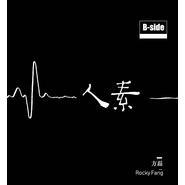
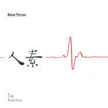
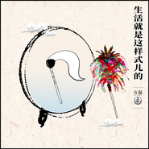
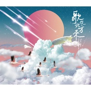

方磊
============================

|  |  |
| :--: | :-- |
| [ 方磊](https://i.xiami.com/sankuaishi) | **地区**: China 中国大陆 **风格**: 说唱 **播放数**: 5039911 **粉丝数**: 1087 **评论数**: 45  |

## 档案

三块石，本名方磊，曾在网络上发表东北风格的说唱歌曲，颇受关注，与郝宇、葡桃并称为“东北说唱三杰”。

## 专辑

| 名称 | 语种 | 唱片公司 | 发行时间 | 专辑类别 | 专辑风格 |
| :--: | :-- | :-- | :-- | :-- | :-- |
| [ 素人.番外篇](./albums/5022468784.md) | 纯音乐 |  | 2020年10月21日 | 录音室专辑 |  |
| [ 越来越远的故乡](./albums/2104971829.md) | 国语 | 大格娱乐 | 2019年07月05日 | EP, 单曲 |  |
| [ 素人](./albums/2104724345.md) | 国语 | 大格娱乐 | 2019年04月01日 | 录音室专辑 | 国语流行 Mandarin Pop |
| [ 方磊单曲集](./albums/2103729315.md) | 国语 | 大格娱乐 | 2018年06月04日 | EP, 单曲 |  |
| [ 生活就是这样式儿的](./albums/2103464106.md) | 国语 | 大格娱乐 | 2017年12月28日 | EP, 单曲 |  |
| [ 阳光下的声音](./albums/5021021140.md) | 国语 | 北京大格娱乐文化有限公司 | 2017年09月27日 | 录音室专辑 | 流行 Pop |
| [ 再见来不及握手](./albums/2102764381.md) | 国语 | 大格娱乐 | 2017年06月13日 | EP, 单曲 |  |
| [ 美丽村庄](./albums/2102749014.md) | 国语 | 大格娱乐 | 2017年05月16日 | EP, 单曲 |  |
| [ 临客](./albums/2102675233.md) | 国语 | 大格娱乐 | 2016年12月30日 | EP, 单曲 |  |
| [ 未.末](./albums/2102675237.md) | 国语 | 独立发行 | 2016年11月25日 | EP, 单曲 |  |
| [ 露水谣](./albums/2102414183.md) | 国语 | 大格娱乐 | 2016年10月27日 | EP, 单曲 |  |
| [ 某](./albums/2100220316.md) | 国语 | 崔式音乐 | 2015年10月19日 | 录音室专辑 | 民谣流行 Folk Pop |
| [ 穿越很忙](./albums/1869725680.md) | 国语 | 斗室文化 | 2012年05月06日 | EP, 单曲 |  |
| [ 小屁孩儿](./albums/1069725720.md) | 国语 | 斗室文化 | 2012年05月06日 | EP, 单曲 |  |
| [ 狗剩正传“四有青年”系列唱片](./albums/561180.md) | 国语 | 崔式音乐 | 2012年05月04日 | EP, 单曲 |  |

## 评论

|  |  |  |
| :-- | :-- | :-- |
|  [虾米用户](https://emumo.xiami.com/u/369960409) H.O.T.5你好！20... 2019-11-27 11:46 赞(0) 踩(0) | 
原来《依兰爱情故事》的方磊就是2000年左右东北说唱先去之一的三块石吗？！厉害了，我全喜欢！
 |
|  [虾米用户](https://emumo.xiami.com/u/339478917) 焦虑的大叔 2019-03-14 15:59 赞(2) 踩(0) | 
很好听的小调，听多了流行歌曲，再听听这种地方特色的小曲也是有滋有味。
 |
|  [虾米用户](https://emumo.xiami.com/u/288609) 音乐让人痴迷。 2019-01-20 20:38 赞(1) 踩(0) | 
你好很喜欢你的歌，在哪里可以买到你的专辑？
 |
|  [虾米用户](https://emumo.xiami.com/u/266366821) 想哥哥…… 2018-11-20 05:43 赞(0) 踩(0) | 
很喜欢，感觉跟自己的心情很贴切，Ps，我是东北的
 |
|  [虾米用户](https://emumo.xiami.com/u/257489637)  2018-11-05 20:56 赞(1) 踩(0) | 
怎么没有楞严咒词，希望能上传  
 |
|  [虾米用户](https://emumo.xiami.com/u/648020)  2018-05-29 11:06 赞(1) 踩(0) | 
从《你好，李焕英》来，给这个作品做插曲，特别感人呢，笑着流泪的那种，歌者有种莫名的亲切感呢
 |
|  [虾米用户](https://emumo.xiami.com/u/323163265)  2018-03-16 13:49 赞(0) 踩(0) | 
很好听
 |
|  [虾米用户](https://emumo.xiami.com/u/12274438) 我还没想好要写什么... 2018-02-24 11:10 赞(0) 踩(0) | 
小明，哈哈哈哈
 |
|  [虾米用户](https://emumo.xiami.com/u/297839604)  2018-02-23 12:09 赞(0) 踩(0) | 
这声音太有故事
 |
|  [虾米用户](https://emumo.xiami.com/u/1997808) 怀旧是一种情怀 2017-11-14 22:05 赞(2) 踩(0) | 
改编化哥的 别哭我最爱的人 不错
 |
| ⇒ |  [虾米用户](https://emumo.xiami.com/u/241306622)  2018-07-03 11:42 赞(0) 踩(0) | 
哪有下载的？
 |
| ⇒ |  [虾米用户](https://emumo.xiami.com/u/1997808) 怀旧是一种情怀 2018-07-03 21:49 赞(0) 踩(0) | 
<q><b>xiami1477730说：</b></q>
 |
|  [虾米用户](https://emumo.xiami.com/u/7164456)  2017-06-15 14:28 赞(1) 踩(0) | 
M你们自己在慢慢拉开发u x
 |
|  [虾米用户](https://emumo.xiami.com/u/7164456)  2017-06-15 14:27 赞(0) 踩(0) | 
 
 |
|  [虾米用户](https://emumo.xiami.com/u/7164456)  2017-06-15 14:27 赞(0) 踩(0) | 
m
 |
|  [虾米用户](https://emumo.xiami.com/u/7164456)  2017-06-15 14:27 赞(0) 踩(0) | 
qkmskwkwml
 |
|  [虾米用户](https://emumo.xiami.com/u/269332542) 关起满室不足的氧气，点着... 2017-05-02 13:04 赞(3) 踩(0) | 
偶然听到的，这才是真正的中国民谣。
 |
|  [虾米用户](https://emumo.xiami.com/u/263294324)  2017-04-18 21:06 赞(1) 踩(0) | 
孩子一样
 |
|  [虾米用户](https://emumo.xiami.com/u/264460186)  2017-03-22 18:02 赞(1) 踩(0) | 
终于找到这首歌，在你好李焕英里听了，就喜欢上了   
 |
|  [虾米用户](https://emumo.xiami.com/u/15231837)  2017-01-24 00:28 赞(2) 踩(0) | 
居然听哭了
 |
|  [虾米用户](https://emumo.xiami.com/u/266450926)  2017-01-22 23:41 赞(0) 踩(0) | 
找到喜欢的歌
 |
|  [虾米用户](https://emumo.xiami.com/u/5161648) 没错我就是很聪明什么也没... 2017-01-10 20:52 赞(1) 踩(0) | 
东北张震岳！
 |
|  [虾米用户](https://emumo.xiami.com/u/255059645)  2016-12-17 20:04 赞(0) 踩(0) | 
此人要火，挺有才华
 |
|  [虾米用户](https://emumo.xiami.com/u/243104987) 相信美好的事情随时都可以... 2016-11-05 11:23 赞(4) 踩(0) | 
废了半天劲终于找到方磊单独唱的依兰爱情故事这首歌了，贾玲加进去这首歌的味道都变了，但没有贾玲的作品也感受不到这首歌的魅力
 |
|  [虾米用户](https://emumo.xiami.com/u/127822770) The baddest ... 2016-10-22 08:52 赞(2) 踩(0) | 
很特别的声音、很特别的音乐风格、很好听！
 |
|  [虾米用户](https://emumo.xiami.com/u/211459034)  2016-10-21 00:19 赞(0) 踩(0) | 
不错
 |
|  [虾米用户](https://emumo.xiami.com/u/228549670) 麻烦不要杠我 浪费时间 ... 2016-10-15 19:52 赞(0) 踩(0) | 

 |
|  [虾米用户](https://emumo.xiami.com/u/2293737) 暂无签名~ 2016-10-11 22:29 赞(0) 踩(0) | 
依兰爱情故事
 |
|  [虾米用户](https://emumo.xiami.com/u/3970959) 我还没想好要写什么... 2016-10-09 07:06 赞(0) 踩(0) | 
东北风
 |
|  [虾米用户](https://emumo.xiami.com/u/90431912) 我只想我顺心的，随意的。... 2016-10-08 22:50 赞(0) 踩(0) | 
喜欢你没道理
 |
|  [虾米用户](https://emumo.xiami.com/u/126509478) 鹿晗，么么哒 2016-09-23 11:58 赞(0) 踩(0) | 
喜欢
 |
|  [虾米用户](https://emumo.xiami.com/u/2491956) 我还没想好要写什么... 2016-09-19 17:51 赞(0) 踩(0) | 
牛逼！
 |
|  [虾米用户](https://emumo.xiami.com/u/92236) 我还没想好要写什么... 2016-09-15 11:38 赞(0) 踩(0) | 
观光团速度了
 |
|  [虾米用户](https://emumo.xiami.com/u/225245922)  2016-09-11 17:03 赞(0) 踩(0) | 
喜欢没道理
 |
|  [虾米用户](https://emumo.xiami.com/u/52696611) 就这样逃跑吧 2016-09-11 15:30 赞(21) 踩(0) | 
在《你好，李焕英》听了《依兰爱情故事》，很感动。终于找到这首歌了。
 |
| ⇒ |  [虾米用户](https://emumo.xiami.com/u/6859183) 一只乌鸦... 2016-09-19 15:13 赞(0) 踩(0) | 
一样，我也是看了 这个小品找的这个歌
 |
| ⇒ |  [虾米用户](https://emumo.xiami.com/u/277954306)  2017-03-05 17:55 赞(0) 踩(0) | 
我也是看了小品后找到这首歌的 好感动
 |
|  [虾米用户](https://emumo.xiami.com/u/35501540)  2016-05-05 01:12 赞(0) 踩(0) | 
承德路上酒吧2016.5.21.周六傍晚7:30分歌手方磊（三块石）静净时光多久?慢漫冷暖哪里?“某时某地”专场演出——方磊 . 曾用艺名“三块石”，小有名气的说唱歌手，国内最著名的摇滚厂牌京文.嚎叫唱片2004年曾发行唱片《燎原星火Vol.1 之爱情上甘岭》@某方磊 。
 |
|  [虾米用户](https://emumo.xiami.com/u/8070377) 爱雾瑞性维欧腐漏 2015-04-03 20:49 赞(0) 踩(0) | 
还是没有上甘岭啊
 |
|  [虾米用户](https://emumo.xiami.com/u/8070377) 爱雾瑞性维欧腐漏 2014-11-08 01:16 赞(0) 踩(0) | 
牛逼
 |
|  [虾米用户](https://emumo.xiami.com/u/8070377) 爱雾瑞性维欧腐漏 2014-11-08 01:16 赞(0) 踩(0) | 

 |
|  [虾米用户](https://emumo.xiami.com/u/8608040) 在荒原里永远解不开的心结 2014-03-30 15:54 赞(0) 踩(0) | 
。。。
 |
|  [虾米用户](https://emumo.xiami.com/u/2510840)  2014-01-08 09:58 赞(0) 踩(0) | 
爱情上甘岭
 |
|  [虾米用户](https://emumo.xiami.com/u/14191886)  2013-04-27 23:46 赞(0) 踩(0) | 
真逗，思想性也不错
 |
|  [虾米用户](https://emumo.xiami.com/u/12874963) 我来听歌的 2013-02-04 12:48 赞(0) 踩(0) | 
一直喜欢
 |
