陈小春
============================

|  |  |
| :--: | :-- |
| [ 陈小春](https://i.xiami.com/cxc) | **播放数**: 186198932 **粉丝数**: 79381 **评论数**: 973 **地区**: Hong Kong ,PRC 中国香港 **风格**: 国语流行 Mandarin Pop, 粤语流行 Cantopop  |

## 档案

小档案 
中 文 名： 陈小春 
外 文 名： Jordan chan 
别   名： 陈小臻 
国   籍： 中国 
民   族： 汉族 
血   型： A型 
身   高： 178cm 
体   重： 69kg 
出 生 地： 广东省惠州市惠阳区 
出生日期： 1967年7月8日 
职   业： 演员、歌手 
毕业院校： 新亚书院 
经纪公司： 百娱传媒股份有限公司（中国） 
代表作品： 古惑仔，鹿鼎记，算你狠，犯贱 
主要成就： 香港电影金像奖最佳新人奖 
香港电影金像奖最佳男配角奖 
绿色和平大使 
TVB 劲歌金曲卓越表现大奖金奖 
十大中文金曲卓越表现大奖金奖 相关团体豹小子、风火海 
签约公司： 北京百娱时代文化经纪有限公司 
简介 
陈小春（本名陈小臻），  1967  年  7  月  8  日出生于广东省惠州市惠阳区淡水镇沙田村，中国香港男歌手、演员。 
早年经历 
1980  年，  13  岁的陈小春读到初一就辍学随父到香港谋生。由于缺乏营养，陈小春看起来比实际年龄要小很多，找不到正式工作，只能到父亲干活的工地打零工，后来跟着建筑装潢队进驻工地，干着铺木板的活，装潢任务完成后，装潢队撤出工地，陈小春开始失业。 
1983  年陈小春告别父母，独自一人来到了铜锣湾。开始在大排档做跑堂，时间不长。几经辗转后在湾仔一家“蓝坊”理发店打零工，一直干了两年。一次偶然的机会，听说香港无线电视台的舞蹈艺员，因为他从小就喜欢跳舞，便赶去参加考试，在考场跳完几个指定动作和自由发挥动作，评委就看中了他灵活的动作和长相，当场录取了他。舞蹈艺员每月可拿  700  港币的酬劳，第二天，陈小春就辞去了理发店的工作，来到香港无线电视台签了约，正式成为了一名舞蹈艺员。 
1985  年加入  TVB  舞蹈艺员训练班，培训结束作为优秀学员，进入豹小子组合，并被推荐给谭咏麟、梅艳芳、陈百强、张国荣等做演唱会伴舞。 
演艺经历 
1992  年陈小春在一次庆功酒会上，唱了一曲谭咏麟的《水中花》，吸引了星工厂的老板许愿。许愿邀请陈小春与朱永棠和谢天华给成了三人组合“风火海”。 
1994  年在陈德森导演的电影《晚九朝五》和陈可辛导演的电影《金枝玉叶》中出演男配角，因两部电影同时提名第  14  届香港电影金像奖最佳新人和最佳男配角奖，最终凭《晚九朝五》中的“阿宝”获得最佳男配角奖。 
1995  年开始与曾志伟主持无线电视台综艺节目《超级无敌奖门人》，与林晓峰并列“奖老”，但因歌唱及电影事业开始好转而辞去“奖老”一职。  2013  年在无线《超级无敌奖门人   终极篇》中相隔  17  年再做“奖老”。 
1996  年起参演刘伟强和文隽推出的《古惑仔》系列电影，在片中饰演“山鸡”一角，为人所熟识。 
1997  年接拍了《我爱厨房》、《古惑仔》、《基佬四十》、《神偷谍影》和《爱上百分之百英雄》等电影。 
1998  年领衔主演香港  TVB  出品的  45  集金庸武侠剧《鹿鼎记》，在剧中饰演古灵精怪的韦小宝。随后与张丰毅共同主演家庭伦理话剧《龙堂》。 
1999  年包小柏仔细揣摩，为其量身打造了《神啊，救救我吧》、《我没那种命》等歌曲，拿下当年的香港叱咤风云奖。 
2002  年与刘小锋共同主演古装历史剧《七品钦差刘罗锅》，扮演一代名相刘罗锅。在尝试了许多不同角色之后，陈小春推出了首张个人专辑《大件事》，并在“叱咤乐坛颁奖曲礼”上夺得了香港“乐坛新力军铜奖”。他又相继推出了两张专辑：粤语《爱妻号》和国语《人见人爱》。 
2003  年首度于香港体育馆举行个人演唱会。  2  月陈小春与两位好友于早年一起成立“  ARJ Dance Culture  ”舞蹈学校，由他担任总监。 
2004  年领衔主演彭芾执导的古装轻喜剧《天下第一媒》出演皇封的“天下第一媒”祝枝山。 
2005  年搭档林心如、杨紫婷主演青春励志剧《爱的进行式》饰演星光国。同年与袁咏仪和秦岚领衔主演温情连续剧《我家不打烊》饰演男主人公蔡田。 
2007  年与郑伊健、周牧茵主演古装动作剧《霍元甲》饰演霍元甲的徒弟陈真。同年搭档佘诗曼、谢天华主演古装喜剧《铁嘴银牙》饰演出身状王世家的陈梦吉。 
2008  年在王功执导的电视剧《精武陈真》中再次饰演陈真一角。之后在邓衍成、刘国辉执导的古装剧《南北大状》中饰演“南状王”宋世杰。 
2011  年  10  月陈小春正式加盟  A Music  东亚唱片制作有限公司。  11  月  29  日出演的古装战争动作电影《鸿门宴》上映，在片中饰演义薄云天的参乘樊哙。 
2012  年在邱礼涛执导，郑嘉颖、黄秋生主演的电影《叶问终极一战》中饰演邓声。 
2013  年  6  月陈小春岁月友情演唱会再现红磡。  8  月，在韩兆导演的爱情喜剧电影《好命先生》中饰演男主角林中飞，与安以轩合作。 
2014  年在齐星执导的《暴雨将至》中饰演李炳君。  2014  年  5  月  10  号，在澳门澳门威尼斯人金光综艺馆和郑伊健、陈小春等人合作举办岁月友情演唱会，同年的  11  月  27  、  28  日同郑伊健、陈小春等人在香港红磡体育馆合作举办岁月友情演唱会。 
2015  年搭档邓家佳、汪东城主演电影《槑计划》饰演乔大志。  3  月  5  日与小沈阳、田亮、熊黛林共同主演的电影《将错就错》上映。与谢天华、郑伊健等人在美国、以及中国上海、南京、广州、杭州、天津、哈尔滨、武汉、福州、深圳等地举行“岁月友情巡回演唱会”。  12  月  31  日，与郑伊健、林晓峰、谢天华和钱嘉乐一起参加  2016  年江苏卫视跨年演唱会，献唱《岁月友情》、《乱世巨星》、《光辉岁月》等歌曲。 
2016  年，陈小春推出全新单曲《主题曲》，这首作品是陈小春  8  年来推出的首个“完整作品”。《主题曲》由陈小春好友黄大炜作曲，黄子佼填词，记录了陈小春  8  年来的转折与精彩，以及落落洒脱的人生态度。

## 专辑

| 名称 | 语种 | 唱片公司 | 发行时间 | 专辑类别 | 专辑风格 |
| :--: | :-- | :-- | :-- | :-- | :-- |
| [ 全民情敌](./albums/5021339428.md) | 国语 | 讯飞音乐 | 2020年08月19日 | EP, 单曲 | 国语流行 Mandarin Pop |
| [ Stop Angry息怒](./albums/2104087045.md) | 国语 | MAX MINI LIMITED | 2018年10月09日 | EP, 单曲 | 国语流行 Mandarin Pop |
| [ 爱你直到宇宙终结](./albums/2103693229.md) | 国语 | 完美青春OST | 2018年04月23日 | EP, 单曲 | 国语流行 Mandarin Pop |
| [ 贪玩传世](./albums/2102900474.md) | 国语 | 江西贪玩 | 2017年11月01日 | EP, 单曲 | 国语流行 Mandarin Pop |
| [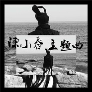 主题曲](./albums/2100289864.md) | 国语 | 发现音乐 | 2016年03月13日 | EP, 单曲 | 国语流行 Mandarin Pop |
| [ 相依为命: 20年精彩印记Jordan Chan: Past 20 Years](./albums/2102827999.md) | 粤语 | 索尼音乐娱乐 | 2015年10月16日 | 精选集 | 国语流行 Mandarin Pop, 粤语流行 Cantopop |
| [ 爱的相反](./albums/186563844.md) | 国语 | 东亚唱片 | 2013年06月06日 | EP, 单曲 | 国语流行 Mandarin Pop |
| [ 平凡英雄](./albums/542317.md) | 国语 | 东亚唱片 | 2012年09月14日 | EP, 单曲 | 国语流行 Mandarin Pop |
| [ 难怪](./albums/2100315168.md) | 粤语 | Amusic | 2012年09月11日 | EP, 单曲 | 粤语流行 Cantopop |
| [ 别碰我的人](./albums/478580.md) | 国语 | 东亚唱片 | 2011年11月10日 | EP, 单曲 | 国语流行 Mandarin Pop |
| [ 笛子魔童](./albums/2100191266.md) | 国语 | 乐海盛世 | 2009年12月07日 | EP, 单曲 | 国语流行 Mandarin Pop |
| [ 金碟铁盒珍藏系列 陈小春Steel Box Collection - Jordan Chan](./albums/2102898706.md) | 粤语 | 新力博德曼 | 2008年09月25日 | 精选集 | 粤语流行 Cantopop |
| [ 独家记忆Memory](./albums/167822.md) | 国语 | 正东唱片 | 2008年04月09日 | 录音室专辑 | 国语流行 Mandarin Pop |
| [ 拉阔演奏厅](./albums/485.md) | 粤语 | 正东唱片 | 2006年10月23日 | 现场专辑 | 粤语流行 Cantopop |
| [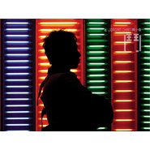 斗](./albums/486.md) | 粤语 | 正东唱片 | 2006年09月27日 | 录音室专辑 | 粤语流行 Cantopop |
| [ Sing十年纪念新歌精选辑](./albums/487.md) | 国语 | 新力博德曼 | 2006年01月13日 | 精选集 | 当代节奏布鲁斯 Contemporary R&B, 国语流行 Mandarin Pop |
| [ 好兄弟音乐会小春 X 伊健 / Jordan X Ekin Concert](./albums/488.md) | 粤语 | 千禧影视 | 2004年10月08日 | 现场专辑 | 粤语流行 Cantopop |
| [ 黑洞Black Hole](./albums/490.md) | 国语 | BMG | 2004年05月14日 | 录音室专辑 | 流行摇滚 Pop Rock, 艺术摇滚 Art Rock, 国语流行 Mandarin Pop |
| [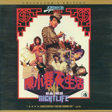 夜生活新曲+精选 / Night Life](./albums/492.md) | 粤语 | BMG | 2004年02月12日 | 精选集 | 粤语流行 Cantopop |
| [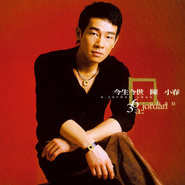 今生今世](./albums/493.md) | 国语 | BMG | 2004年02月06日 | EP, 单曲 | 国语流行 Mandarin Pop |
| [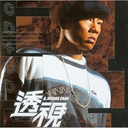 透视](./albums/494.md) | 国语 | BMG | 2003年10月30日 | EP, 单曲 | 国语流行 Mandarin Pop |
| [ 算你狠Heartless You](./albums/495.md) | 国语 | 博德曼 | 2003年08月29日 | 录音室专辑 | 当代节奏布鲁斯 Contemporary R&B, 嘻哈 Hip-Hop, 国语流行 Mandarin Pop |
| [ 失恋王](./albums/498.md) | 粤语 | BMG | 2002年12月01日 | EP, 单曲 | 粤语流行 Cantopop |
| [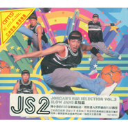 陈小春的R&B音乐补给站VOL.2 柔情篇R&B SELECTION VOL.2 SLOW JAMS](./albums/500.md) | 英语 | 博德曼 | 2002年08月12日 | 合集, 杂锦 | 欧美流行 Western Pop |
| [ 陈小春的R&B音乐补给站VOL.1 动感篇R&B SELECTION VOL.1 STREET VIBE](./albums/499.md) | 英语 | 博德曼 | 2002年08月12日 | 合集, 杂锦 | 当代节奏布鲁斯 Contemporary R&B, 节奏布鲁斯 R&B |
| [ 下半辈子](./albums/502.md) | 国语 | BMG | 2002年05月10日 | 录音室专辑 | 节奏布鲁斯 R&B, 嘻哈 Hip-Hop, 国语流行 Mandarin Pop |
| [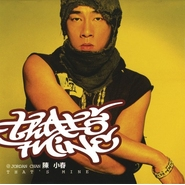 That's Mine那是我的](./albums/501.md) | 国语 | 博德曼 | 2002年05月10日 | 录音室专辑 | 当代节奏布鲁斯 Contemporary R&B, 嘻哈 Hip-Hop, 国语流行 Mandarin Pop |
| [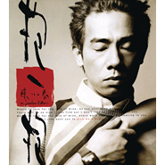 抱一抱](./albums/504.md) | 国语 | BMG | 2001年04月03日 | 录音室专辑 | 当代节奏布鲁斯 Contemporary R&B, 国语流行 Mandarin Pop |
| [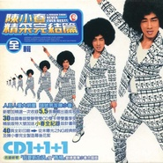 精采完结篇Never Ever Best](./albums/505.md) | 国语 | BMG | 2000年06月08日 | 精选集 | 国语流行 Mandarin Pop |
| [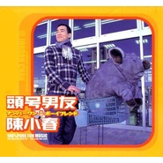 头号男友ナンバㄧワン·ボㄧイフレンド](./albums/506.md) | 国语 | 博德曼 | 2000年01月11日 | 录音室专辑 | 国语流行 Mandarin Pop |
| [ 大明星A Bigger Star](./albums/167602.md) | 国语 | BMG | 1999年03月29日 | 录音室专辑 | 国语流行 Mandarin Pop |
| [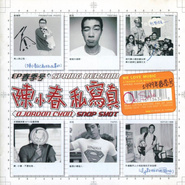 私写真Snap Shot](./albums/508.md) | 国语 | BMG | 1999年01月18日 | EP, 单曲 | 国语流行 Mandarin Pop |
| [ 人见人爱陈小春Everyone Loves Jordan](./albums/509.md) | 国语 | BMG | 1998年09月12日 | 录音室专辑 | 国语流行 Mandarin Pop |
| [ 爱妻号I'll Wash Away Your Blues](./albums/510.md) | 粤语 | BMG | 1998年04月10日 | 录音室专辑 | 粤语流行 Cantopop |
| [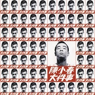 大件事No Big Deal](./albums/511.md) | 粤语 | BMG | 1997年07月13日 | 录音室专辑 | 粤语流行 Cantopop |
| [ 乱世巨星](./albums/5020898351.md) | 粤语 |  | 1996年06月29日 | EP, 单曲 |  |
| [ 战无不胜](./albums/5020899854.md) | 粤语 |  | 1996年06月29日 | EP, 单曲 |  |
| [ 战无不胜Remix](./albums/5020916682.md) | 粤语 |  | 1996年06月29日 | EP, 单曲 |  |

## 评论

|  |  |  |  |
| :-- | :-- | :-- | :-- |
|  [虾米用户](https://emumo.xiami.com/u/319688150) 愿经典不被遗忘 2020-11-18 15:33 赞(0) 踩(0) | 

 |
|  [虾米用户](https://emumo.xiami.com/u/320602232) 翠色连荒岸，烟姿入远楼。 2020-11-07 21:48 赞(0) 踩(0) | 
感谢陈小春，让这首歌曲成为在我心里永久不变的美景朝阳。
 |
|  [虾米用户](https://emumo.xiami.com/u/60002910) 混喝等死 2020-11-03 00:27 赞(1) 踩(0) | 
初中时期最喜欢的歌手
 |
|  [虾米用户](https://emumo.xiami.com/u/315969544) 向钱看齐 2020-07-08 11:45 赞(1) 踩(0) | 
山鸡哥 生日快乐
 |
|  [虾米用户](https://emumo.xiami.com/u/415181992) 人若欠你，天必还你，你尽... 2020-07-08 10:38 赞(0) 踩(0) | 
生日快乐。你是我喜欢的，当然我更喜欢你老婆孩子 
 |
|  [虾米用户](https://emumo.xiami.com/u/376975779) 義結盟（義結金蘭）聚義講... 2020-07-08 10:22 赞(1) 踩(0) | 
陈小春先生生日快乐
 |
|  [虾米用户](https://emumo.xiami.com/u/330073547)  2020-07-08 10:20 赞(0) 踩(0) | 
生日快乐鸭
 |
|  [虾米用户](https://emumo.xiami.com/u/3445988)  2020-07-08 10:15 赞(0) 踩(0) | 
没想到同一天啊
 |
|  [虾米用户](https://emumo.xiami.com/u/280678764) Edy 2020-07-08 10:13 赞(0) 踩(0) | 
Happy Birthday To You
 |
|  [虾米用户](https://emumo.xiami.com/u/195345979) stan 2020-06-09 16:09 赞(0) 踩(0) | 
太棒了
 |
|  [虾米用户](https://emumo.xiami.com/u/355810253)  2020-05-11 22:04 赞(0) 踩(0) | 
春哥我刚被放出来，快带我去找浩南哥 
 |
|  [虾米用户](https://emumo.xiami.com/u/42542853) no music，no ... 2020-05-06 18:08 赞(1) 踩(0) | 
献世，真神曲
 |
|  [虾米用户](https://emumo.xiami.com/u/344855664) 去你妈的年龄，去你妈的束... 2020-04-23 22:51 赞(0) 踩(0) | 
山鸡，好兄弟！
 |
|  [虾米用户](https://emumo.xiami.com/u/309246503) 野苜蓿散发着淡淡的香气，... 2020-03-09 10:05 赞(1) 踩(0) | 
超爱山鸡哥，大爱小春叔叔   
 |
|  [虾米用户](https://emumo.xiami.com/u/432246168)  2020-01-06 21:23 赞(1) 踩(0) | 
很努力的人
 |
|  [虾米用户](https://emumo.xiami.com/u/322096655)  2019-09-22 13:48 赞(0) 踩(0) | 
超好聽！
 |
|  [虾米用户](https://emumo.xiami.com/u/87275082) 我还没想好要写什么... 2019-09-11 20:11 赞(0) 踩(0) | 
喜欢啼笑因缘
 |
|  [虾米用户](https://emumo.xiami.com/u/3140019) 天马行空 2019-08-21 16:56 赞(0) 踩(0) | 
喜欢戴佩妮，喜欢陈小春，喜欢客家人身上的贵族气
 |
|  [虾米用户](https://emumo.xiami.com/u/342506019)  2019-08-10 19:49 赞(0) 踩(0) | 
一直很喜欢你的歌，你演的电影，电视剧，
 |
|  [虾米用户](https://emumo.xiami.com/u/358104299) 悲观的唯心存在现实解构虚... 2019-08-07 05:00 赞(2) 踩(0) | 
Zgsbgzz44749，
 |
|  [虾米用户](https://emumo.xiami.com/u/256547845)  2019-07-08 16:48 赞(3) 踩(0) | 
没那种命以前是觉得好听，现在真的听懂了。
 |
|  [虾米用户](https://emumo.xiami.com/u/327568216) 人生就像听歌一样，好好体... 2019-07-08 11:20 赞(0) 踩(0) | 
一杯二锅头呛的眼泪流 
 |
|  [虾米用户](https://emumo.xiami.com/u/322853302) 从不失败 2019-07-04 05:01 赞(1) 踩(0) | 
这是我儿子用我账号玩的，我比较喜欢你的：“二锅头”
 |
|  [虾米用户](https://emumo.xiami.com/u/363076522) 我还没想好要写什么... 2019-06-27 14:05 赞(0) 踩(0) | 
春爷，你演的张子强真是演的绝了，我自始至终都认为你演得这版本是还原度最高的，爱你
 |
|  [虾米用户](https://emumo.xiami.com/u/359464181)  2019-06-12 11:13 赞(1) 踩(0) | 
应采儿就是我要活出来的样子 谢谢你对她的疼爱 
 |
|  [虾米用户](https://emumo.xiami.com/u/262063901)  2019-06-01 22:34 赞(0) 踩(0) | 
O
 |
|  [虾米用户](https://emumo.xiami.com/u/262063901)  2019-06-01 22:34 赞(0) 踩(0) | 
z
 |
|  [虾米用户](https://emumo.xiami.com/u/287752724) 这家伙很懒，什么也没留下 2019-05-18 20:42 赞(0) 踩(0) | 
叱咤红人，KTV大招，走起 
 |
|  [虾米用户](https://emumo.xiami.com/u/261405947) 我还没想好要写什么... 2019-05-16 22:36 赞(0) 踩(0) | 
唯一喜欢并一直喜欢的
 |
|  [虾米用户](https://emumo.xiami.com/u/348972935) 我若不勇敢…誰替我堅強… 2019-05-09 17:44 赞(1) 踩(0) | 
CAN YOU STOP ANGRY NOW?
 |
|  [虾米用户](https://emumo.xiami.com/u/375332725) 我还没想好要写什么... 2019-04-25 12:03 赞(0) 踩(0) | 

 |
|  [虾米用户](https://emumo.xiami.com/u/136185402)  2019-04-23 12:14 赞(0) 踩(0) | 
老大，我来报道 
 |
|  [虾米用户](https://emumo.xiami.com/u/411658121)  2019-03-20 19:56 赞(0) 踩(0) | 
应该是我最喜欢的男艺人了，虽然看着有点痞。也不是帅气的那种。但是心中还是喜欢他，无论唱歌，影视。有他的出现一定看 
 |
| ⇒ |  [虾米用户](https://emumo.xiami.com/u/411658121)  2019-03-20 20:01 赞(0) 踩(0) | 
因为都是摩羯座哈哈
 |
|  [虾米用户](https://emumo.xiami.com/u/341875754)  2019-03-19 22:25 赞(0) 踩(0) | 
晚上好小春哥哥，我是你忠实的歌迷粉丝很喜欢你的歌曲想和你交个朋友行吗？
 |
|  [虾米用户](https://emumo.xiami.com/u/341875754)  2019-03-13 22:14 赞(0) 踩(0) | 
晚上好，小春哥哥我是你的粉丝，我喜欢你的所有音乐作品，我还是你的影迷
 |
|  [虾米用户](https://emumo.xiami.com/u/418577828)  2019-03-02 03:22 赞(0) 踩(0) | 
偶像山鸡哥
 |
|  [虾米用户](https://emumo.xiami.com/u/418577828)  2019-03-02 03:20 赞(0) 踩(0) | 
听他的歌主要是应为电影古惑仔，从而后来一直到现在都市听他的歌比较多
 |
|  [虾米用户](https://emumo.xiami.com/u/356393558) 我是大明星。 2019-02-20 17:17 赞(0) 踩(0) | 
陈小春你好你儿子小小春
 |
|  [虾米用户](https://emumo.xiami.com/u/356393558) 我是大明星。 2019-02-20 17:12 赞(0) 踩(0) | 
                                     
 |
|  [虾米用户](https://emumo.xiami.com/u/356393558) 我是大明星。 2019-02-20 17:11 赞(1) 踩(0) | 
你好春哥
 |
| ⇒ |  [虾米用户](https://emumo.xiami.com/u/356393558) 我是大明星。 2019-05-11 09:36 赞(0) 踩(0) | 

 |
|  [虾米用户](https://emumo.xiami.com/u/405393732)  2019-02-19 13:32 赞(0) 踩(0) | 
喜欢春哥
 |
|  [虾米用户](https://emumo.xiami.com/u/356393558) 我是大明星。 2019-02-14 12:34 赞(0) 踩(0) | 
我喜欢你。春哥
 |
|  [虾米用户](https://emumo.xiami.com/u/356393558) 我是大明星。 2019-02-14 12:33 赞(0) 踩(0) | 

 |
|  [虾米用户](https://emumo.xiami.com/u/415398690) 我还没想好要写什么... 2019-02-10 16:13 赞(0) 踩(0) | 
我唯一的男神! 喜欢你贱贱的笑，又喜欢你冷冷的表情，好似看透红尘! 一对好像蜡笔小新的眉毛 (๑´ڡ`๑)
 |
|  [虾米用户](https://emumo.xiami.com/u/47065698) 什么都能戒，音乐不行！ 2019-01-28 00:46 赞(1) 踩(0) | 
喜欢你，春哥哥
 |
|  [虾米用户](https://emumo.xiami.com/u/282734867)  2019-01-23 12:54 赞(0) 踩(0) | 
看到这个封面才发现山鸡哥老了，我也长大了。以前还真不知道他会唱歌，只知道他会演戏，哈哈。  
 |
| ⇒ |  [虾米用户](https://emumo.xiami.com/u/55177368) 哈喽 2019-01-24 00:02 赞(0) 踩(0) | 
他唱歌超好听的，现在老咯
 |
|  [虾米用户](https://emumo.xiami.com/u/350369613)  2019-01-19 07:59 赞(0) 踩(0) | 
鸡哥你好啊~有可能认识你吗~
 |
|  [虾米用户](https://emumo.xiami.com/u/12101540)  2019-01-12 22:28 赞(0) 踩(0) | 
刚听完现场回来…50多岁的人真是又唱又跳，可厉害了
 |
|  [虾米用户](https://emumo.xiami.com/u/14665785)   2019-01-12 02:14 赞(1) 踩(0) | 
好喜欢小春，喜欢他的人，喜欢他的歌  
 |
|  [虾米用户](https://emumo.xiami.com/u/345677891)  2019-01-11 13:01 赞(0) 踩(0) | 
我喜欢你拍戏更喜欢您的歌，也喜欢你老婆孩子。希望你拍多点戏！
 |
|  [虾米用户](https://emumo.xiami.com/u/45605759) 我还没想好要写什么... 2018-12-26 13:24 赞(0) 踩(0) | 
崖系客家人 
 |
|  [虾米用户](https://emumo.xiami.com/u/347840950) F4 2018-12-25 13:03 赞(0) 踩(0) | 
山鸡
 |
|  [虾米用户](https://emumo.xiami.com/u/405268928) 这么可爱又有仙气，一个是... 2018-11-29 21:32 赞(4) 踩(0) | 
长着一张社会人的脸，却在这里唱歌
 |
| ⇒ |  [虾米用户](https://emumo.xiami.com/u/357058358)  2018-12-20 00:05 赞(0) 踩(0) | 
❤️
 |
|  [虾米用户](https://emumo.xiami.com/u/301201412)  2018-11-17 20:08 赞(1) 踩(0) | 
支持春哥，永远可爱的春哥，祝你和采儿姐幸福，一辈子。
 |
|  [虾米用户](https://emumo.xiami.com/u/259428360)  2018-11-14 19:11 赞(1) 踩(0) | 
小时候教我怎么当大哥，现在教我怎么当老公（我是女的）  
 |
|  [虾米用户](https://emumo.xiami.com/u/302151927)  2018-11-12 11:43 赞(1) 踩(0) | 
我希望还有乱世巨星
 |
|  [虾米用户](https://emumo.xiami.com/u/355943186)  2018-11-12 11:40 赞(1) 踩(0) | 
我是你的死粉！ 這麼多年以來 你每次在香港開演唱會我都一定會來看的 
 |
|  [虾米用户](https://emumo.xiami.com/u/351784613)  2018-11-10 17:14 赞(2) 踩(0) | 
第一次明白型男，明白男人帅真的可以与脸无关，真的man，结婚之后竟然更柔却更man，对应采儿那满眼藏不住的爱，各种看得到的事情都特别正能量，看得到的小细节的善良和正直，乍一看好像脾气臭又拽，其实温柔搞笑的很，他演着各种最痞的角色却活着最优秀的人生
 |
|  [虾米用户](https://emumo.xiami.com/u/169469684) 你好 2018-10-25 12:58 赞(1) 踩(0) | 
6666667
 |
|  [虾米用户](https://emumo.xiami.com/u/404870544)  2018-10-02 15:23 赞(1) 踩(0) | 
喜欢你们的感情状态，也喜欢你们的作品。相依为命也很赞    
 |
|  [虾米用户](https://emumo.xiami.com/u/42305160)  2018-09-30 20:10 赞(0) 踩(0) | 
山鸡哥演的好  
 |
|  [虾米用户](https://emumo.xiami.com/u/401818546) 我还没想好要写什么... 2018-09-23 12:48 赞(3) 踩(0) | 
前天9.21去看了黄金兄弟，尽管没上映前就知道剧情不够爆炸，也必须去看，看的是情怀，整个剧没有让我觉得精彩的地方，直到响起了友情岁月，嗯，山鸡哥∙
 |
| ⇒ |  [虾米用户](https://emumo.xiami.com/u/405716037)  2018-12-30 11:58 赞(0) 踩(0) | 
我也看了，山鸡演技最好，在曾志伟面前那一跪一哭，表情到位，肢体语言到尾，没有香港老牌演员的那种套路式表演的浮夸
 |
|  [虾米用户](https://emumo.xiami.com/u/351421684)  2018-09-23 03:43 赞(1) 踩(0) | 
歌好聽！！戲好聽！！火山 小春   棒棒棒
 |
|  [虾米用户](https://emumo.xiami.com/u/261464944)  2018-09-19 22:50 赞(0) 踩(0) | 
信春哥，得永生，岁月无情，江湖永藏心底！
 |
|  [虾米用户](https://emumo.xiami.com/u/404196278)  2018-09-16 00:42 赞(0) 踩(0) | 
春哥和采儿一定要幸福下去哟，否则不相信爱情啦！   
 |
|  [虾米用户](https://emumo.xiami.com/u/400498037) 我还没想好要写什么... 2018-09-12 22:22 赞(1) 踩(0) | 
我跟他的名字就差一个姓 我是女的好不 喜欢痞子春哥
 |
|  [虾米用户](https://emumo.xiami.com/u/110473354)  2018-09-09 17:12 赞(1) 踩(0) | 
鸡哥好
 |
|  [虾米用户](https://emumo.xiami.com/u/329152667)  2018-09-07 12:30 赞(2) 踩(0) | 
一个被低估的实力歌手
 |
|  [虾米用户](https://emumo.xiami.com/u/356110911)  2018-09-05 20:34 赞(2) 踩(0) | 
客家人
 |
|  [虾米用户](https://emumo.xiami.com/u/43943397)  2018-08-28 01:58 赞(3) 踩(0) | 
其实你唱歌更好
 |
|  [虾米用户](https://emumo.xiami.com/u/345695947)  2018-08-06 11:03 赞(0) 踩(0) | 
谢谢春哥 带给我们很多快乐
 |
|  [虾米用户](https://emumo.xiami.com/u/378132679)  2018-07-25 16:52 赞(4) 踩(0) | 
我叫杨飞龙，小春大哥，我很迷茫，我由于不小心走错路坐了牢，有了前科，找工作不好找，父母有病，一个月三千块的医药费真的难以支付，我该怎么办，请小春哥出个主意
 |
|  [虾米用户](https://emumo.xiami.com/u/333280403) 听听歌 2018-07-23 03:53 赞(3) 踩(0) | 
第一次看到他我，我只知道他叫山雞，一直以為這個放蕩不羈的型象會一直存在，直到聽他到他的歌才知道他是個會唱的歌手，直到現在不但是個好老公.還是好爸爸 
 |
|  [虾米用户](https://emumo.xiami.com/u/336516835) 来是偶然，走是必然。你我... 2018-07-11 15:13 赞(0) 踩(0) | 
......Look back on your life, making us the pain, not failure, but no experience everything I want to experience.~回首人生，最使得我们痛的，不是失败，而是没有经历我所想要经历的一切。来是偶然，走是必然～出生✪死亡。你我都在路上&amp;hellip;&amp;hellip;欢乐只是记忆，痛苦也只是记忆，一切都只是记忆，让我们慢慢地回忆&amp;hellip;&amp;hellip;愿那些灵魂的深处依然&amp;hellip;&amp;hellip;不保留的， 才叫青春。 不解释的， 才叫从容。 不放手的， 才叫真爱。 不完美的， 才叫人生.
 |
|  [虾米用户](https://emumo.xiami.com/u/50011365)  2018-07-08 20:46 赞(0) 踩(0) | 
生日快乐 安好
 |
|  [虾米用户](https://emumo.xiami.com/u/261109025)  2018-07-08 10:09 赞(0) 踩(0) | 
大家好我是陈咬唇两年了。今晚八点是兄弟就来砍我   
 |
|  [虾米用户](https://emumo.xiami.com/u/54987436) ┌用獨特而又別致的妝容、... 2018-07-08 10:06 赞(1) 踩(0) | 
生日快樂❤️我爱的人
 |
|  [虾米用户](https://emumo.xiami.com/u/86543610) 星星之火 2018-07-08 10:03 赞(0) 踩(0) | 
生日快乐！ 
 |
|  [虾米用户](https://emumo.xiami.com/u/51816882) 1+1+4+4+2+0=... 2018-07-08 10:01 赞(0) 踩(0) | 
哥我爱你
 |
|  [虾米用户](https://emumo.xiami.com/u/360263918)  2018-07-07 19:41 赞(1) 踩(0) | 
独家记忆
 |
|  [虾米用户](https://emumo.xiami.com/u/357674040)  2018-07-03 10:01 赞(0) 踩(0) | 
 
 |
|  [虾米用户](https://emumo.xiami.com/u/159190136) 想要快乐却总是流泪 2018-07-01 15:12 赞(0) 踩(0) | 

 |
|  [虾米用户](https://emumo.xiami.com/u/40506833) 向钱看向厚赚 2018-06-25 19:25 赞(1) 踩(0) | 
哥  威武
 |
|  [虾米用户](https://emumo.xiami.com/u/367316438)  2018-06-19 01:37 赞(0) 踩(0) | 
山鸡哥你好
 |
|  [虾米用户](https://emumo.xiami.com/u/311959866) 我还没想好要写什么... 2018-06-12 10:52 赞(1) 踩(0) | 
最喜欢的还是陈小春的《叱咤红人》
 |
|  [虾米用户](https://emumo.xiami.com/u/374622415)  2018-06-10 21:22 赞(0) 踩(0) | 
很喜欢独家记忆和没那种命
 |
|  [虾米用户](https://emumo.xiami.com/u/359458973)  2018-06-04 13:06 赞(0) 踩(0) | 
加油，小春哥
 |
|  [虾米用户](https://emumo.xiami.com/u/352168537)  2018-06-02 14:10 赞(0) 踩(0) | 
祝你们幸福吧
 |
|  [虾米用户](https://emumo.xiami.com/u/249036173)  2018-06-02 10:02 赞(0) 踩(0) | 
陈小春的歌很好听！
 |
|  [虾米用户](https://emumo.xiami.com/u/365263978) 我还没想好要写什么... 2018-05-11 15:35 赞(0) 踩(0) | 
陈哥，喝一个！
 |
|  [虾米用户](https://emumo.xiami.com/u/4926530)  2018-05-10 10:18 赞(2) 踩(0) | 
相依为命，我老公给我唯一的歌，每次ktv必唱，希望你能一直为我唱下去~~
 |
|  [虾米用户](https://emumo.xiami.com/u/336161442)  2018-05-10 08:27 赞(0) 踩(0) | 
十分喜歡小春和伊健，你倆是陪伴我成長的男神，也是令我流淚最多的男神
 |
|  [虾米用户](https://emumo.xiami.com/u/354946181)  2018-05-02 23:30 赞(0) 踩(0) | 
好听。期待你还出新歌
 |
|  [虾米用户](https://emumo.xiami.com/u/333387911)  2018-04-29 08:11 赞(0) 踩(0) | 
雅痞。
 |
|  [虾米用户](https://emumo.xiami.com/u/325542903)  2018-04-25 12:27 赞(0) 踩(0) | 
不知道从什么时候喜欢他的歌，喜欢他的电影！后来知道她的老婆是谁，感觉她俩是那么的和谐
 |
|  [虾米用户](https://emumo.xiami.com/u/355620562)  2018-04-22 18:10 赞(1) 踩(0) | 
谢谢您的回话，我喜欢的艺人很少，但您的电影和音乐我一直很喜欢，特别是鹿鼎记（个人觉得已经是经典了，西游记&amp;rarr;六小龄童老师；大话西游&amp;rarr;周星驰老师；鹿鼎记&amp;rarr;陈小春老师），感谢您把青春奉献在了好的作品上。祝您一直幸福健康。
 |
|  [虾米用户](https://emumo.xiami.com/u/357163035)  2018-04-16 09:42 赞(1) 踩(0) | 
谢谢你的信息，一直以来都是看古惑仔长大 欣赏里面的义气 兄弟间的友情(因为现在的社会很少有这样的人) 最近看了爸爸去哪儿 觉得以前的春哥跟现在的感觉真的不一样 这就是有了家庭 婚姻的男人吧~ 我因为最近心情低落所以一直在听你的歌 无限量播放 (扑火)呵呵~
 |
|  [虾米用户](https://emumo.xiami.com/u/356061936)  2018-04-12 12:19 赞(0) 踩(0) | 
来忘掉错对 来怀念过去
 |
|  [虾米用户](https://emumo.xiami.com/u/255297606) 我还没想好要写什么... 2018-04-10 13:55 赞(0) 踩(0) | 
我叫山鸡，鸡（9-1）的鸡
 |
|  [虾米用户](https://emumo.xiami.com/u/321623357)  2018-03-31 08:37 赞(0) 踩(0) | 
永远都给我们留下一个山鸡的影响
 |
|  [虾米用户](https://emumo.xiami.com/u/8833102) 伟❤️375882267 2018-03-26 02:30 赞(4) 踩(0) | 
大扎好，我系轱天乐，我四渣渣辉，探挽懒月，介四里没有挽过的船新版本，挤需体验三番钟，里造会干我一样，爱象节款游戏。
 |
|  [虾米用户](https://emumo.xiami.com/u/351461447) 死亡并不可怕，可怕的是忘... 2018-03-24 10:24 赞(1) 踩(0) | 
山鸡我们不会忘记你的。
 |
|  [虾米用户](https://emumo.xiami.com/u/355147664) 。。。。 2018-03-21 07:11 赞(1) 踩(0) | 
春哥，你什么时候来武汉开演唱会。我喜欢你们古惑仔演唱会！伊健哥      
 |
|  [虾米用户](https://emumo.xiami.com/u/355147664) 。。。。 2018-03-21 07:10 赞(1) 踩(0) | 
最爷们，最讲义气！
 |
|  [虾米用户](https://emumo.xiami.com/u/313995507)  2018-03-17 00:43 赞(0) 踩(0) | 
从电台知道有呢首歌，到想听歌，仲系想听
 |
|  [虾米用户](https://emumo.xiami.com/u/236057156) … 2018-03-11 23:07 赞(1) 踩(0) | 
今晚八点，准时开车  
 |
|  [虾米用户](https://emumo.xiami.com/u/335514238) 半生不随 2018-03-03 10:10 赞(0) 踩(0) | 
演技中不失真实，你真是绝了！
 |
|  [虾米用户](https://emumo.xiami.com/u/352943004)  2018-03-02 19:41 赞(0) 踩(0) | 
我觉得《一于奉陪》这首歌曲很好听。 
 |
|  [虾米用户](https://emumo.xiami.com/u/262196449)  2018-02-23 18:19 赞(3) 踩(0) | 
古天乐绿了？
 |
|  [虾米用户](https://emumo.xiami.com/u/351861562)  2018-02-23 17:32 赞(0) 踩(0) | 
I likee
 |
|  [虾米用户](https://emumo.xiami.com/u/351511185) 爱生活，爱拼搏，爱生活，... 2018-02-22 05:47 赞(2) 踩(0) | 
陈小春是个烂货人物！我最不喜欢它！它代言的手表一点都不好！跑的太快了，其品质像陈小春一样，，，         
 |
| ⇒ |  [虾米用户](https://emumo.xiami.com/u/354452303)  2018-03-15 12:49 赞(0) 踩(0) | 
    
 |
|  [虾米用户](https://emumo.xiami.com/u/349403612) 顺其自然 2018-02-18 15:34 赞(1) 踩(0) | 
小春:我看TvB就关注你了，终于有出头的一天恭喜。又出歌我中意。做反黑又好看。祝步步高升，粉丝:同声同气。
 |
|  [虾米用户](https://emumo.xiami.com/u/348669449) 许墨哥哥 2018-02-13 21:07 赞(0) 踩(0) | 
看第五季爸爸去哪儿就超级喜欢你  以前只知道你的算你狠  后来看了大结局上的时候才知道独家记忆也是你唱的  我翻了翻歌曲列表  看见了你的相依为命  2018.2.13真的喜欢你
 |
|  [虾米用户](https://emumo.xiami.com/u/348719405)  2018-02-08 21:31 赞(0) 踩(0) | 
不得不说鸡哥真的是人生赢家！
 |
|  [虾米用户](https://emumo.xiami.com/u/343904147) Jay chou 2018-01-24 08:23 赞(0) 踩(0) | 
 
 |
|  [虾米用户](https://emumo.xiami.com/u/324605761)  2018-01-22 23:28 赞(0) 踩(0) | 
信春哥得永生 
 |
|  [虾米用户](https://emumo.xiami.com/u/345469823)  2018-01-22 13:58 赞(0) 踩(0) | 
喜欢小春，小小春，可爱的一对父子
 |
| ⇒ |  [虾米用户](https://emumo.xiami.com/u/354452303)  2018-03-15 12:50 赞(0) 踩(0) | 

 |
|  [虾米用户](https://emumo.xiami.com/u/295673764) 这家伙很聪明什么也没留下... 2018-01-18 16:10 赞(0) 踩(0) | 
uwuuwu
 |
|  [虾米用户](https://emumo.xiami.com/u/324969628)  2018-01-16 18:03 赞(0) 踩(0) | 
满满的回忆！歌声响起，追忆往兮
 |
|  [虾米用户](https://emumo.xiami.com/u/30244760) 暂无签名~ 2018-01-14 18:09 赞(2) 踩(0) | 
似松dei，就更我一起玩探碗揽月
 |
|  [虾米用户](https://emumo.xiami.com/u/344026515)  2018-01-09 21:52 赞(0) 踩(0) | 
依旧还是那么喜欢你的歌！虽然已是很久的歌，但依然是经典！
 |
|  [虾米用户](https://emumo.xiami.com/u/311479018)   2017-12-28 16:49 赞(1) 踩(0) | 
666
 |
|  [虾米用户](https://emumo.xiami.com/u/334029343) 鱼跃此时海  花开彼岸天 2017-12-23 14:24 赞(2) 踩(0) | 
春式悲歌，无意中听到了他的歌才知道他还唱歌，他的歌都挺喜欢
 |
|  [虾米用户](https://emumo.xiami.com/u/230803304) 三观正又爱国的成都宝藏男... 2017-12-18 17:18 赞(2) 踩(0) | 
既是艺人对兄弟很棒好 又是父亲 对待小小春很用心
 |
|  [虾米用户](https://emumo.xiami.com/u/340060897)  2017-12-16 00:00 赞(1) 踩(0) | 
小春的歌不是无病呻吟是充满真情的歌
 |
|  [虾米用户](https://emumo.xiami.com/u/18283676) 享受音乐享受生活 2017-12-10 22:31 赞(0) 踩(0) | 
热门歌曲里两首我爱的人，两首友情岁月。。。
 |
|  [虾米用户](https://emumo.xiami.com/u/332016402)  2017-12-09 07:20 赞(0) 踩(0) | 
喜欢你和长时间了  歌也挺好听的
 |
|  [虾米用户](https://emumo.xiami.com/u/338198779)  2017-12-09 05:11 赞(0) 踩(0) | 
66666
 |
|  [虾米用户](https://emumo.xiami.com/u/50891698) 问君能有几多丧，孟子赐予... 2017-12-07 00:54 赞(1) 踩(0) | 
大家好，我是陈小春，是男人就来砍我吧
 |
|  [虾米用户](https://emumo.xiami.com/u/336324088) 我们不一样 2017-12-05 22:37 赞(1) 踩(0) | 
好听
 |
|  [虾米用户](https://emumo.xiami.com/u/333787518)  2017-12-02 00:06 赞(3) 踩(0) | 
Jasper太可爱了
 |
|  [虾米用户](https://emumo.xiami.com/u/320780530) 莫叹失意百感生. 2017-11-29 22:18 赞(1) 踩(0) | 
春哥！
 |
|  [虾米用户](https://emumo.xiami.com/u/267585421)  2017-11-29 11:35 赞(1) 踩(0) | 
山鸡哥顶你
 |
|  [虾米用户](https://emumo.xiami.com/u/232133676)  2017-11-27 22:43 赞(0) 踩(0) | 
人生苦短，何乐而不为，春哥加油吧
 |
|  [虾米用户](https://emumo.xiami.com/u/286093061)  2017-11-27 14:58 赞(4) 踩(0) | 
我喜欢你的儿子，太暖了！
 |
|  [虾米用户](https://emumo.xiami.com/u/223190341)  2017-11-24 17:53 赞(2) 踩(0) | 
Jasper！
 |
|  [虾米用户](https://emumo.xiami.com/u/186554189)  2017-11-23 23:54 赞(0) 踩(0) | 
搞不清他和林保怡
 |
|  [虾米用户](https://emumo.xiami.com/u/333787096)  2017-11-20 13:04 赞(1) 踩(0) | 
大爱山鸡哥
 |
|  [虾米用户](https://emumo.xiami.com/u/332083502)  2017-11-19 17:20 赞(2) 踩(0) | 
你们夫妻俩是最完美的cp
 |
|  [虾米用户](https://emumo.xiami.com/u/516538)  2017-11-18 21:16 赞(1) 踩(0) | 
原来春哥的英文名是Jordan啊
 |
|  [虾米用户](https://emumo.xiami.com/u/334830006)  2017-11-18 20:13 赞(2) 踩(0) | 
超喜欢Jasper
 |
|  [虾米用户](https://emumo.xiami.com/u/335234607)  2017-11-15 00:12 赞(4) 踩(0) | 
喜欢就是喜欢小春坏坏哒酷酷哒成熟帅气有型 
 |
|  [虾米用户](https://emumo.xiami.com/u/41105474) 别紧张，我不是什么好人 2017-11-12 14:51 赞(4) 踩(0) | 
春哥，我有会员了！
 |
|  [虾米用户](https://emumo.xiami.com/u/258684438)  2017-11-08 21:39 赞(2) 踩(0) | 
山鸡，好喜欢哦
 |
|  [虾米用户](https://emumo.xiami.com/u/42261997)  2017-11-07 16:19 赞(2) 踩(0) | 
春哥
 |
|  [虾米用户](https://emumo.xiami.com/u/17275597) 你的梦想把我伤害 谁又来... 2017-11-05 17:57 赞(1) 踩(0) | 
您太好看了 向您致敬
 |
|  [虾米用户](https://emumo.xiami.com/u/2912264)  2017-10-28 00:24 赞(1) 踩(0) | 
有个性      他的歌真的很不错       很喜欢听他的歌,      特别是最近......
 |
|  [虾米用户](https://emumo.xiami.com/u/279250779)  2017-10-27 23:39 赞(4) 踩(0) | 
我是看了破晓，特别喜欢陈小春，陷于才华 
 |
|  [虾米用户](https://emumo.xiami.com/u/307932689)   2017-10-27 23:31 赞(1) 踩(0) | 
是给我一半的，谁也不行在我生命里拉走你！在我感情的封锁期…喜欢你娓娓叙说的心事，你的歌一直听不厌 
 |
|  [虾米用户](https://emumo.xiami.com/u/8186288) 就这样走下去吧，不急。 2017-10-27 23:08 赞(0) 踩(0) | 
我喜欢小春的歌是不是就证明了我的屌丝本质……
 |
|  [虾米用户](https://emumo.xiami.com/u/3028952)  2017-10-27 23:08 赞(0) 踩(0) | 
新歌 平凡英雄 今日已经推出
 |
|  [虾米用户](https://emumo.xiami.com/u/322832244)  2017-10-20 16:32 赞(1) 踩(0) | 
山鸡哥，太帅了！！
 |
|  [虾米用户](https://emumo.xiami.com/u/329331560)  2017-10-17 10:26 赞(0) 踩(0) | 
我叫山鸡 把的
 |
|  [虾米用户](https://emumo.xiami.com/u/1582817) 若收藏精选集已删除，请用... 2017-10-15 01:14 赞(0) 踩(0) | 
《反黑》主题曲呢　没有？？
 |
|  [虾米用户](https://emumo.xiami.com/u/255258008)  2017-10-13 23:16 赞(0) 踩(0) | 
我就看看我是
 |
|  [虾米用户](https://emumo.xiami.com/u/328088638)   2017-10-05 04:19 赞(78) 踩(0) | 
太喜欢你的儿子Jasper！ 
 |
|  [虾米用户](https://emumo.xiami.com/u/13111760) 以梦为马，拥抱诗和远方。 2017-10-04 20:31 赞(1) 踩(0) | 
主页小春哥拿的是老花镜嘛&amp;hellip;
 |
|  [虾米用户](https://emumo.xiami.com/u/252368113)  2017-10-01 20:33 赞(1) 踩(0) | 
唱歌好好听
 |
|  [虾米用户](https://emumo.xiami.com/u/6761779) 儿孙们都忙，而我却天天都... 2017-09-30 08:59 赞(4) 踩(0) | 
他的嗓音识别度如同莫文蔚一样奇迹般的存在。
 |
| ⇒ |  [虾米用户](https://emumo.xiami.com/u/10857967) 我～就是我！不喜勿進！ 2017-10-03 23:14 赞(0) 踩(0) | 
还有林俊杰
 |
|  [虾米用户](https://emumo.xiami.com/u/50674331) 爱你不需要理由＾3＾ 2017-09-24 16:41 赞(0) 踩(0) | 
 
 |
|  [虾米用户](https://emumo.xiami.com/u/288120283)  2017-09-23 12:49 赞(4) 踩(0) | 
超爱陈小春！你是最好的爸爸啦！
 |
|  [虾米用户](https://emumo.xiami.com/u/287748098) 唯有心无挂碍成就大愿，唯... 2017-09-20 22:34 赞(1) 踩(0) | 
真的是鸡爷，不会是冒充的吧！
 |
|  [虾米用户](https://emumo.xiami.com/u/325126440)  2017-09-19 11:02 赞(1) 踩(0) | 
我希望你是我独家的记忆
 |
|  [虾米用户](https://emumo.xiami.com/u/160208458) 一个无法得到的人，无法靠... 2017-09-15 21:45 赞(4) 踩(0) | 
小时候到现在是你教会我义气怎么写怎样做
 |
|  [虾米用户](https://emumo.xiami.com/u/48874735) 这家伙很笨什么也没留下… 2017-09-12 16:54 赞(37) 踩(0) | 
柔情起来真要命。
 |
|  [虾米用户](https://emumo.xiami.com/u/324331251)  2017-09-10 20:39 赞(0) 踩(0) | 
好好听啊
 |
|  [虾米用户](https://emumo.xiami.com/u/318154488) 她们都是你漫漫长路上只配... 2017-09-03 23:10 赞(2) 踩(0) | 
小时候因为你操社会你现在跑去唱歌？
 |
|  [虾米用户](https://emumo.xiami.com/u/297673734) 我还没想好要写什么... 2017-09-01 23:27 赞(1) 踩(0) | 
从小就听小春的歌，以至于越听越自卑， 
 |
|  [虾米用户](https://emumo.xiami.com/u/297651852)  2017-09-01 09:46 赞(1) 踩(0) | 
在星空卫视看到陈小春演的非凡英雄，没想到他居然拍起抗日神剧了。
 |
| ⇒ |  [虾米用户](https://emumo.xiami.com/u/134868)  2017-09-02 14:40 赞(0) 踩(0) | 
你不说，我不知道
 |
|  [虾米用户](https://emumo.xiami.com/u/90282654) 嗯哼 2017-08-29 14:20 赞(0) 踩(0) | 
为什么虾米音乐没法播放您的《离不开你》
 |
| ⇒ |  [虾米用户](https://emumo.xiami.com/u/10857967) 我～就是我！不喜勿進！ 2017-10-03 23:15 赞(0) 踩(0) | 
之前没版权，现在有了
 |
|  [虾米用户](https://emumo.xiami.com/u/321666402) 说谎的人吞一千根针 2017-08-26 15:14 赞(4) 踩(0) | 
因为一次演唱会，突然看见他老婆，他笑了，很感动
 |
|  [虾米用户](https://emumo.xiami.com/u/319629145)  2017-08-25 15:28 赞(1) 踩(0) | 
声音磁和，充满好感 
 |
|  [虾米用户](https://emumo.xiami.com/u/196132822) 怀念过去，不如面对将来。 2017-08-24 23:32 赞(2) 踩(0) | 
永远的山鸡，唱歌却又那么柔情，一触便到心底。
 |
|  [虾米用户](https://emumo.xiami.com/u/290941100)  2017-08-23 17:47 赞(1) 踩(0) | 
喜欢你哦
 |
|  [虾米用户](https://emumo.xiami.com/u/318368571)   2017-08-19 10:22 赞(1) 踩(0) | 
喜欢他 
 |
|  [虾米用户](https://emumo.xiami.com/u/306920065)  2017-08-17 14:15 赞(1) 踩(0) | 
永远的，友情岁月
 |
|  [虾米用户](https://emumo.xiami.com/u/285827653) 清澈明朗  心向暖阳 2017-08-14 17:25 赞(1) 踩(0) | 
独家记忆
 |
|  [虾米用户](https://emumo.xiami.com/u/121620230) 容易生气 2017-08-14 10:34 赞(1) 踩(0) | 
钟意你呀
 |
|  [虾米用户](https://emumo.xiami.com/u/12858831)  2017-08-12 14:13 赞(0) 踩(0) | 
没那种命，上学时暗恋班里的女生，一边听歌一边落泪
 |
|  [虾米用户](https://emumo.xiami.com/u/233415959)  2017-08-09 17:25 赞(2) 踩(0) | 
有的聲音   光是說話就好聽的不行  就像張學友  劉德華  陳小春
 |
|  [虾米用户](https://emumo.xiami.com/u/265731114)  2017-08-09 09:24 赞(1) 踩(0) | 
陈小春应该结婚了吧，对象是谁啊
 |
| ⇒ |  [虾米用户](https://emumo.xiami.com/u/94308988) 我还没想好要写什么... 2017-09-26 16:42 赞(0) 踩(0) | 
应采儿
 |
|  [虾米用户](https://emumo.xiami.com/u/315598716) Tina ng 2017-08-01 21:21 赞(1) 踩(0) | 
喜欢他的歌及古惑仔1-6集电影
 |
|  [虾米用户](https://emumo.xiami.com/u/315598716) Tina ng 2017-08-01 21:18 赞(1) 踩(0) | 
我都粉丝謝天华哥都係粉絲
 |
|  [虾米用户](https://emumo.xiami.com/u/315598716) Tina ng 2017-08-01 21:17 赞(1) 踩(0) | 
春哥同埋时謝天华你唱古惑仔好听
 |
|  [虾米用户](https://emumo.xiami.com/u/284748716) 邓丽君和周笔畅的铁杆歌迷 2017-07-31 15:50 赞(0) 踩(0) | 
喜欢他的歌，他的电影
 |
|  [虾米用户](https://emumo.xiami.com/u/295128805) 国良 2017-07-30 00:03 赞(0) 踩(0) | 
....
 |
|  [虾米用户](https://emumo.xiami.com/u/307244488) 我系够天真，俾你偷呃拐骗... 2017-07-29 16:01 赞(2) 踩(0) | 
去了你拍蛊惑仔倾单的地方，点了个牛河一份牛杂，细品这像大排档又像路边摊的波涛暗涌 
 |
|  [虾米用户](https://emumo.xiami.com/u/315712382)  2017-07-28 21:37 赞(0) 踩(0) | 
挺有感觉的
 |
|  [虾米用户](https://emumo.xiami.com/u/261172253)  2017-07-20 00:29 赞(2) 踩(0) | 
陈先生，非常喜欢你的歌！
 |
|  [虾米用户](https://emumo.xiami.com/u/311870408)  2017-07-20 00:18 赞(0) 踩(0) | 
山鸡哥，你好。
 |
|  [虾米用户](https://emumo.xiami.com/u/309755233) 为人民币服务 2017-07-10 02:55 赞(0) 踩(0) | 
山鸡，我跟你呵 
 |
|  [虾米用户](https://emumo.xiami.com/u/309487825) 鲁班七号 2017-07-05 19:32 赞(0) 踩(0) | 
好听到爆
 |
|  [虾米用户](https://emumo.xiami.com/u/309487825) 鲁班七号 2017-07-04 21:38 赞(0) 踩(0) | 
陈哥，你的歌真好听
 |
|  [虾米用户](https://emumo.xiami.com/u/308788634)  2017-07-01 10:25 赞(1) 踩(0) | 
喜欢陈小春，在我眼里，春爷永远在，不存在过不过夜。一个人，有一首歌能被人记住，有一部经典电视被人议论，就已足矣。相比当红的那些个小鲜肉，对不起，我唱不出他们半句歌，也没看过他们一部电视电影&amp;hellip;可能，我也老了
 |
|  [虾米用户](https://emumo.xiami.com/u/52056952) 人生即是到來、相遇、陪伴... 2017-06-28 22:09 赞(0) 踩(0) | 

 |
|  [虾米用户](https://emumo.xiami.com/u/6792477) 爱生活 2017-06-28 18:13 赞(0) 踩(0) | 
喜欢听
 |
|  [虾米用户](https://emumo.xiami.com/u/306110760) 好好听老婆唱歌，你们不要... 2017-06-20 22:38 赞(0) 踩(0) | 
小春哥你和我名字一样？
 |
|  [虾米用户](https://emumo.xiami.com/u/300758504)   2017-06-20 12:33 赞(0) 踩(0) | 
山鸡哥永远支持你你是最棒的
 |
|  [虾米用户](https://emumo.xiami.com/u/299141534)  2017-06-11 22:06 赞(0) 踩(0) | 
Come on!
 |
|  [虾米用户](https://emumo.xiami.com/u/30598981)  2017-06-09 15:47 赞(0) 踩(0) | 
大愛小春
 |
|  [虾米用户](https://emumo.xiami.com/u/266775759) 只要我以为，就不是误会，... 2017-06-05 15:58 赞(3) 踩(0) | 
虽然关注你是因为喜欢你，但是你一定要和应采儿走到最后，我希望我喜欢的你永远专一的爱一个人。希望我认识的那个和你很像的人，也能找到他爱的，也爱他的人，永远不要变心～
 |
|  [虾米用户](https://emumo.xiami.com/u/245503328) 我啥也不想写┐（─__─... 2017-06-04 06:57 赞(0) 踩(0) | 
鸡哥好
 |
|  [虾米用户](https://emumo.xiami.com/u/140737912) 滴滴回忆 满身流串 2017-05-30 08:18 赞(0) 踩(0) | 
你既歌，不是太伤感但又将感情世界里面的甜酸苦辣发挥到极致。
 |
|  [虾米用户](https://emumo.xiami.com/u/300254995)  2017-05-29 20:45 赞(185) 踩(0) | 
小时候他教我们打架，长大后他教我们做人
 |
| ⇒ |  [虾米用户](https://emumo.xiami.com/u/295847269)  2017-05-31 12:46 赞(0) 踩(0) | 
！
 |
| ⇒ |  [虾米用户](https://emumo.xiami.com/u/27088802)  2017-09-12 21:56 赞(0) 踩(0) | 
小时候他教我们打架，长大后他教我们做人
 |
| ⇒ |  [虾米用户](https://emumo.xiami.com/u/170480854)   2017-10-23 00:46 赞(0) 踩(0) | 
小时候教我们大家，长大后教我们疼老婆 
 |
| ⇒ |  [虾米用户](https://emumo.xiami.com/u/324605761)  2018-01-22 23:26 赞(0) 踩(0) | 
山鸡
 |
|  [虾米用户](https://emumo.xiami.com/u/296348115)  2017-05-27 17:19 赞(1) 踩(0) | 
陈小春和任贤齐是不是亲兄弟
 |
|  [虾米用户](https://emumo.xiami.com/u/290942094)  2017-05-26 22:12 赞(0) 踩(0) | 
我特别喜欢陈小春和应采儿在一起撒狗粮，甜蜜死人了，   看着最喜欢的一对明星夫妻在一起，跟着一起开心。
 |
|  [虾米用户](https://emumo.xiami.com/u/264081379)  2017-05-22 21:33 赞(0) 踩(0) | 
居然没有算你狠
 |
| ⇒ |  [虾米用户](https://emumo.xiami.com/u/10857967) 我～就是我！不喜勿進！ 2017-06-22 18:05 赞(0) 踩(0) | 
版权被腾讯买走了
 |
|  [虾米用户](https://emumo.xiami.com/u/260269298)  2017-05-22 08:18 赞(0) 踩(0) | 
山鸡哥好
 |
|  [虾米用户](https://emumo.xiami.com/u/68941378) 好歌无限，值再寻找…… 2017-05-17 15:39 赞(0) 踩(0) | 
春哥好~
 |
|  [虾米用户](https://emumo.xiami.com/u/258859287) 这孩子很聪明…… 2017-05-14 22:07 赞(2) 踩(0) | 
我爱的人也叫陈小春 
 |
|  [虾米用户](https://emumo.xiami.com/u/206700683)  2017-05-06 12:10 赞(2) 踩(0) | 
山鸡哥
 |
|  [虾米用户](https://emumo.xiami.com/u/293923825)  2017-05-05 22:46 赞(0) 踩(0) | 
顶  天王
 |
|  [虾米用户](https://emumo.xiami.com/u/290350041)  2017-05-03 17:37 赞(0) 踩(0) | 

 |
|  [虾米用户](https://emumo.xiami.com/u/245125932) 简。 2017-05-03 13:28 赞(0) 踩(0) | 
好听
 |
|  [虾米用户](https://emumo.xiami.com/u/292348185) 抱着回忆轻轻亲_ 2017-05-02 20:14 赞(0) 踩(0) | 
喜欢他歌里的不羁却又偏偏有着深情&amp;hellip;
 |
|  [虾米用户](https://emumo.xiami.com/u/280398008)  2017-04-30 07:10 赞(0) 踩(0) | 
我喜欢陈小春
 |
|  [虾米用户](https://emumo.xiami.com/u/291275485)  2017-04-29 20:45 赞(0) 踩(0) | 
春哥的神啊救救我吧就像为我量身定制的歌曲！
 |
|  [虾米用户](https://emumo.xiami.com/u/292146805) 得之是幸，失之是命，愿余... 2017-04-28 22:48 赞(1) 踩(0) | 
我也陈姓，且喜你不作。
 |
|  [虾米用户](https://emumo.xiami.com/u/291445835)  2017-04-25 22:37 赞(1) 踩(0) | 
好听到爆    
 |
|  [虾米用户](https://emumo.xiami.com/u/47544256)  2017-04-23 17:45 赞(0) 踩(0) | 

 |
|  [虾米用户](https://emumo.xiami.com/u/290735193)  2017-04-23 11:00 赞(0) 踩(0) | 
谢谢为大家做贡献
 |
|  [虾米用户](https://emumo.xiami.com/u/290174221)  2017-04-22 04:45 赞(0) 踩(0) | 
666
 |
|  [虾米用户](https://emumo.xiami.com/u/287490082)  2017-04-20 12:44 赞(0) 踩(0) | 
哈哈
 |
|  [虾米用户](https://emumo.xiami.com/u/272535213)  2017-04-18 20:49 赞(0) 踩(0) | 
666
 |
|  [虾米用户](https://emumo.xiami.com/u/288436914)  2017-04-16 22:34 赞(0) 踩(0) | 
喜欢 就是喜欢
 |
|  [虾米用户](https://emumo.xiami.com/u/273560167)   2017-04-16 21:24 赞(0) 踩(0) | 
听他的歌很舒服，也很有代入感
 |
|  [虾米用户](https://emumo.xiami.com/u/249010330)   2017-04-16 16:37 赞(0) 踩(0) | 

 |
|  [虾米用户](https://emumo.xiami.com/u/288427565)  2017-04-16 08:52 赞(0) 踩(0) | 
陈小春加油！
 |
|  [虾米用户](https://emumo.xiami.com/u/240210981)  2017-04-14 17:33 赞(1) 踩(0) | 

 |
|  [虾米用户](https://emumo.xiami.com/u/278062569)  2017-04-13 14:33 赞(1) 踩(0) | 
  
 |
|  [虾米用户](https://emumo.xiami.com/u/275236519) super boy 2017-04-11 18:38 赞(1) 踩(0) | 
回忆
 |
| ⇒ |  [虾米用户](https://emumo.xiami.com/u/288427565)  2017-04-16 08:53 赞(0) 踩(0) | 
hi
 |
|  [虾米用户](https://emumo.xiami.com/u/280678764) Edy 2017-04-10 23:34 赞(1) 踩(0) | 
多謝你
 |
|  [虾米用户](https://emumo.xiami.com/u/243527245) 爱华一万年 2017-04-09 17:08 赞(2) 踩(0) | 
永远的山鸡哥
 |
|  [虾米用户](https://emumo.xiami.com/u/147444714)   2017-04-09 11:51 赞(1) 踩(0) | 
大爱
 |
|  [虾米用户](https://emumo.xiami.com/u/247894380)  2017-04-07 10:10 赞(1) 踩(0) | 
山鸡哥 我的最爱
 |
| ⇒ |  [虾米用户](https://emumo.xiami.com/u/288427565)  2017-04-16 08:54 赞(0) 踩(0) | 
你好
 |
|  [虾米用户](https://emumo.xiami.com/u/285840093)  2017-04-06 18:22 赞(1) 踩(0) | 
&amp;hellip;
 |
|  [虾米用户](https://emumo.xiami.com/u/248398476) 我爱我家宝贝们 2017-04-05 21:59 赞(1) 踩(0) | 
   
 |
|  [虾米用户](https://emumo.xiami.com/u/286167856)   2017-04-05 00:14 赞(1) 踩(0) | 
因为那首我爱的人MV中深情的眼神，我彻底沦陷。喜欢鸡爷，
 |
|  [虾米用户](https://emumo.xiami.com/u/286004060)  2017-04-04 19:11 赞(1) 踩(0) | 
  
 |
|  [虾米用户](https://emumo.xiami.com/u/285320177)   2017-04-04 15:59 赞(2) 踩(0) | 
独家记忆&amp;hellip;&amp;hellip;简直不能更爱了&amp;hellip;&amp;hellip;
 |
|  [虾米用户](https://emumo.xiami.com/u/285741933)  2017-04-04 01:24 赞(1) 踩(0) | 
喜欢，小春
 |
|  [虾米用户](https://emumo.xiami.com/u/284894520)  2017-04-03 17:05 赞(1) 踩(0) | 
稀罕这首歌
 |
|  [虾米用户](https://emumo.xiami.com/u/285290774)  2017-04-02 11:20 赞(1) 踩(0) | 
独家记忆、相依为命！这是小春和采儿幸福 ！
 |
|  [虾米用户](https://emumo.xiami.com/u/260973695)  2017-03-30 01:52 赞(2) 踩(0) | 
[Reply@十由]  
 |
|  [虾米用户](https://emumo.xiami.com/u/284412981)  2017-03-29 23:15 赞(2) 踩(0) | 
好听
 |
|  [虾米用户](https://emumo.xiami.com/u/284182531)  2017-03-29 14:19 赞(1) 踩(0) | 
第一次听到老大的歌是我暗恋我老公，感觉很符合我当时心情。我还记得那时候听的独家记忆
 |
|  [虾米用户](https://emumo.xiami.com/u/283770927)  2017-03-27 23:39 赞(2) 踩(0) | 
看了友情岁月的演唱会，和应采儿好幸福的，她在闹，他在笑 
 |
|  [虾米用户](https://emumo.xiami.com/u/205957237) 上上签 2017-03-27 13:24 赞(1) 踩(0) | 
好听~~   
 |
|  [虾米用户](https://emumo.xiami.com/u/282270028) 听歌听歌…… 2017-03-25 16:55 赞(0) 踩(0) | 
好听  
 |
|  [虾米用户](https://emumo.xiami.com/u/282815404) 哈 哈 2017-03-24 16:48 赞(0) 踩(0) | 
boy
 |
|  [虾米用户](https://emumo.xiami.com/u/4350626)  2017-03-24 08:30 赞(0) 踩(0) | 
没谁了！
 |
|  [虾米用户](https://emumo.xiami.com/u/13752853)  2017-03-23 22:33 赞(0) 踩(0) | 
越来越喜欢小春
 |
|  [虾米用户](https://emumo.xiami.com/u/37990286)  2017-03-23 14:23 赞(0) 踩(0) | 
厉害了
 |
|  [虾米用户](https://emumo.xiami.com/u/281860648)  2017-03-21 17:16 赞(0) 踩(0) | 
好听
 |
|  [虾米用户](https://emumo.xiami.com/u/282085329)  2017-03-21 12:04 赞(0) 踩(0) | 
友情岁月
 |
|  [虾米用户](https://emumo.xiami.com/u/282115232)  2017-03-21 09:11 赞(0) 踩(0) | 
偶像 
 |
|  [虾米用户](https://emumo.xiami.com/u/244881005)  2017-03-20 22:12 赞(0) 踩(0) | 
      
 |
|  [虾米用户](https://emumo.xiami.com/u/47128696) 你开口我们就会有故事。 2017-03-19 01:41 赞(0) 踩(0) | 
最爱是相依为命
 |
|  [虾米用户](https://emumo.xiami.com/u/279897948)  2017-03-18 22:56 赞(0) 踩(0) | 
单身狗听苦情歌
 |
|  [虾米用户](https://emumo.xiami.com/u/195631937) 音乐无处不在，爱无可替代... 2017-03-13 14:09 赞(0) 踩(0) | 
霸气
 |
|  [虾米用户](https://emumo.xiami.com/u/49481354) 大隐隐于市 2017-03-10 19:33 赞(0) 踩(0) | 
我来凑700爱采儿
 |
|  [虾米用户](https://emumo.xiami.com/u/272073469) 谁也没有时光机器 2017-03-10 12:55 赞(0) 踩(0) | 
看似不正经的纯情男
 |
|  [虾米用户](https://emumo.xiami.com/u/38802367)   2017-03-09 22:54 赞(0) 踩(0) | 
最近有看他的李炳君 上热搜了
 |
|  [虾米用户](https://emumo.xiami.com/u/269993654)  2017-03-09 09:37 赞(0) 踩(0) | 
春哥！
 |
|  [虾米用户](https://emumo.xiami.com/u/276607517)  2017-02-28 19:54 赞(0) 踩(0) | 
喜欢的
 |
|  [虾米用户](https://emumo.xiami.com/u/266559542)  2017-02-26 03:06 赞(1) 踩(0) | 
独家记忆
 |
|  [虾米用户](https://emumo.xiami.com/u/260176390)  2017-02-25 14:26 赞(0) 踩(0) | 
中 文 名： 陈小春外 文 名： Jordan chan别   名： 陈小臻国   籍： 中国民   族： 汉族血   型： A型
 |
|  [虾米用户](https://emumo.xiami.com/u/253567411) 音乐就像一场梦 2017-02-17 08:00 赞(0) 踩(0) | 
只是静静地喜欢，淡淡地听！
 |
|  [虾米用户](https://emumo.xiami.com/u/272904722)  2017-02-13 19:26 赞(0) 踩(0) | 
11
 |
|  [虾米用户](https://emumo.xiami.com/u/42631015) 亲爱的虾米，直到世界尽头... 2017-02-11 19:17 赞(0) 踩(0) | 
你是个有情有义的汉子！
 |
|  [虾米用户](https://emumo.xiami.com/u/256144073)  2017-02-06 10:17 赞(0) 踩(0) | 
。卧槽，偶像00y
 |
|  [虾米用户](https://emumo.xiami.com/u/269544902)  2017-01-31 17:06 赞(1) 踩(0) | 
           
 |
|  [虾米用户](https://emumo.xiami.com/u/3553387)   2017-01-30 18:50 赞(0) 踩(0) | 
估计你是有专业团队在虾米里回复听众，我收藏你的歌是因为你的这首《相依为命》虽然与你其他歌风格不一，也与你自己风格不同，但感性耐听！
 |
|  [虾米用户](https://emumo.xiami.com/u/265727260)  2017-01-25 17:37 赞(0) 踩(0) | 
陈小春啊
 |
|  [虾米用户](https://emumo.xiami.com/u/48276337) 22世纪不道德 2017-01-23 09:19 赞(0) 踩(0) | 

 |
|  [虾米用户](https://emumo.xiami.com/u/240996964)  2017-01-15 08:45 赞(0) 踩(0) | 
…超级喜欢有情有义这个电视剧，，，大爱大平，小凡.
 |
|  [虾米用户](https://emumo.xiami.com/u/262001368) 哈哈文 2017-01-15 08:32 赞(0) 踩(0) | 

 |
|  [虾米用户](https://emumo.xiami.com/u/262001368) 哈哈文 2017-01-15 08:32 赞(0) 踩(0) | 

 |
|  [虾米用户](https://emumo.xiami.com/u/73577530) 我喜欢阳光，喜欢晚上乘公... 2017-01-13 20:36 赞(0) 踩(0) | 
学吉他学不会的音痴，每到ktv必点 算你狠
 |
|  [虾米用户](https://emumo.xiami.com/u/260281022) 逆风飞翔 2017-01-13 19:04 赞(0) 踩(0) | 
春哥，你能看到我的评论吗？我听你的歌有十好几年了，
 |
|  [虾米用户](https://emumo.xiami.com/u/261418497) 心地善良 2017-01-13 02:34 赞(0) 踩(0) | 
很努力啊！很喜欢啊！
 |
|  [虾米用户](https://emumo.xiami.com/u/261418497) 心地善良 2017-01-13 02:33 赞(0) 踩(0) | 
突破3000
 |
|  [虾米用户](https://emumo.xiami.com/u/258977550)   2017-01-10 21:46 赞(0) 踩(0) | 
雷好啊 我叫三给 给八的给
 |
|  [虾米用户](https://emumo.xiami.com/u/110676292)  2017-01-06 23:37 赞(0) 踩(0) | 
原来是自动发的，还以为是本人，白激动了…
 |
|  [虾米用户](https://emumo.xiami.com/u/258038660) 情伪，何物 2016-12-30 16:19 赞(0) 踩(0) | 
男神
 |
|  [虾米用户](https://emumo.xiami.com/u/249937070) 人生若无悔放下过去归零 2016-12-24 09:03 赞(1) 踩(0) | 
风华是一指流砂，苍老是一段年华。
 |
|  [虾米用户](https://emumo.xiami.com/u/15986466) 你长大了，学会不说话了。 2016-12-19 11:42 赞(0) 踩(0) | 
好男人，陈小春。
 |
|  [虾米用户](https://emumo.xiami.com/u/37317837)  2016-12-03 15:08 赞(0) 踩(0) | 
永远支持！
 |
|  [虾米用户](https://emumo.xiami.com/u/242331730) 游戏人生。。。 2016-11-29 15:17 赞(1) 踩(0) | 
真心好听。。。
 |
| ⇒ |  [虾米用户](https://emumo.xiami.com/u/261418497) 心地善良 2017-01-13 02:35 赞(0) 踩(0) | 
赞成
 |
|  [虾米用户](https://emumo.xiami.com/u/848618) 像花虽未红，如冰虽不冻 2016-11-28 10:08 赞(0) 踩(0) | 
算你狠
 |
| ⇒ |  [虾米用户](https://emumo.xiami.com/u/261418497) 心地善良 2017-01-13 02:35 赞(0) 踩(0) | 
离不开你
 |
|  [虾米用户](https://emumo.xiami.com/u/18282119) 我就是我，独一无二 2016-11-26 10:28 赞(0) 踩(0) | 
神马情况，居然加入阿里音乐人了？
 |
|  [虾米用户](https://emumo.xiami.com/u/243135992) 馮卓螢 2016-11-24 20:01 赞(0) 踩(0) | 
好聽
 |
|  [虾米用户](https://emumo.xiami.com/u/248846625)  2016-11-24 16:00 赞(0) 踩(0) | 
算你狠很好听，第一次听的时候就特别有感觉。。
 |
|  [虾米用户](https://emumo.xiami.com/u/42100089) 能安静听个歌就很好 2016-11-22 23:31 赞(0) 踩(0) | 
嘿嘿嘿
 |
|  [虾米用户](https://emumo.xiami.com/u/5637766) 暗戀就是自毀。 2016-11-22 10:32 赞(0) 踩(0) | 
最爱。
 |
|  [虾米用户](https://emumo.xiami.com/u/229278546)  2016-11-18 16:08 赞(0) 踩(0) | 
你好
 |
|  [虾米用户](https://emumo.xiami.com/u/54448790) 甜辣 2016-11-18 00:01 赞(0) 踩(0) | 
夏伟！
 |
|  [虾米用户](https://emumo.xiami.com/u/54448790) 甜辣 2016-11-18 00:01 赞(0) 踩(0) | 
吴科成！
 |
|  [虾米用户](https://emumo.xiami.com/u/239565599)  2016-11-03 20:33 赞(0) 踩(0) | 
陈小春666我非常喜欢听你的音乐
 |
|  [虾米用户](https://emumo.xiami.com/u/1593895) 最佳益友 2016-10-06 23:13 赞(2) 踩(0) | 
我觉得我将来应该会去听他的演唱会
 |
|  [虾米用户](https://emumo.xiami.com/u/104036000)  2016-09-30 09:55 赞(0) 踩(0) | 
期待新专辑
 |
|  [虾米用户](https://emumo.xiami.com/u/229955667)  2016-09-25 18:57 赞(1) 踩(0) | 
独家记忆
 |
|  [虾米用户](https://emumo.xiami.com/u/219931149) 人善被人欺，马上被人骑。 2016-09-06 19:23 赞(2) 踩(0) | 
好久没听陈小春的歌了还是老歌有味道。
 |
|  [虾米用户](https://emumo.xiami.com/u/14000163)  2016-08-31 18:47 赞(0) 踩(0) | 
1
 |
|  [虾米用户](https://emumo.xiami.com/u/5078253)  2016-08-29 20:14 赞(0) 踩(0) | 
医院
 |
|  [虾米用户](https://emumo.xiami.com/u/210497030)  2016-08-08 16:53 赞(0) 踩(0) | 
我喜欢 
 |
|  [虾米用户](https://emumo.xiami.com/u/122688364) 生在愤坑，长在赤圈；挣脱 2016-07-19 22:38 赞(0) 踩(0) | 
2031
 |
|  [虾米用户](https://emumo.xiami.com/u/200737547)  2016-07-14 09:12 赞(0) 踩(0) | 
我好喜欢
 |
|  [虾米用户](https://emumo.xiami.com/u/104036000)  2016-06-30 15:29 赞(2) 踩(0) | 
1998年人见人爱专辑爱上陈小春的音乐，最爱的男歌手，每首抒情歌都能唱出来，希望听陈小春的歌听到一辈子。
 |
|  [虾米用户](https://emumo.xiami.com/u/5810689) 美版monster饮料 2016-06-25 16:27 赞(3) 踩(0) | 
小春哥快回春！！！！演技歌技俱佳，请见《树大招风》里的演出和《怎么舍得你》的演唱。
 |
|  [虾米用户](https://emumo.xiami.com/u/10933495) 慢悠悠的过生活 2016-06-15 05:22 赞(0) 踩(0) | 
我爱的人
 |
|  [虾米用户](https://emumo.xiami.com/u/10857967) 我～就是我！不喜勿進！ 2016-05-28 14:07 赞(56) 踩(0) | 
终于知道陈小春为什么叫春爷了，因为李宇春叫春哥
 |
| ⇒ |  [虾米用户](https://emumo.xiami.com/u/195085963)  2017-09-16 15:31 赞(0) 踩(0) | 
哈哈哈哈
 |
|  [虾米用户](https://emumo.xiami.com/u/83719904)  2016-04-29 13:15 赞(0) 踩(0) | 

 |
|  [虾米用户](https://emumo.xiami.com/u/115379262)  2016-04-10 16:55 赞(0) 踩(0) | 
小春唱的歌比较有味道。
 |
|  [虾米用户](https://emumo.xiami.com/u/115379262)  2016-04-10 16:55 赞(0) 踩(0) | 
小春唱的歌比较有味道。
 |
|  [虾米用户](https://emumo.xiami.com/u/6543591)   2016-04-09 01:50 赞(0) 踩(0) | 
最早的时候就听他的歌了，那时候还是小学，女人不该让男人太累，最深印象
 |
|  [虾米用户](https://emumo.xiami.com/u/119676606)  2016-04-07 10:45 赞(2) 踩(0) | 
很多年前听独家记忆就好喜欢他的调调 后来看到演唱会上跟应采儿的相依为命瞬间少女心扑通扑通的！又开始把他的歌找出来听了  听说4月30号他会来肇庆鼎湖山音乐节  好想知道他现场唱什么！！！
 |
|  [虾米用户](https://emumo.xiami.com/u/5704024) 你怎样信仰，你就怎样生活 2016-03-13 14:38 赞(2) 踩(0) | 
一代人最经典的会议啦，我们也长大了，老了没关系，心一直在！
 |
|  [虾米用户](https://emumo.xiami.com/u/51782486) 未来怎样 2016-03-13 12:17 赞(0) 踩(0) | 
我爱你
 |
|  [虾米用户](https://emumo.xiami.com/u/120812780)  2016-03-07 00:06 赞(0) 踩(0) | 
h还追过张柏芝？
 |
| ⇒ |  [虾米用户](https://emumo.xiami.com/u/33548848)  2016-03-13 22:48 赞(0) 踩(0) | 
他俩在一起过，不过只是类似于备胎的存在，夹在张柏芝与谢霆锋、陈晓东两段恋情之间
 |
| ⇒ |  [虾米用户](https://emumo.xiami.com/u/49481354) 大隐隐于市 2017-03-10 19:35 赞(0) 踩(0) | 
<q><b>达克 止戈为武说：</b></q>
 |
|  [虾米用户](https://emumo.xiami.com/u/35304662)  2016-03-04 13:39 赞(2) 踩(0) | 
喜欢一个人看下大雨；
 |
|  [虾米用户](https://emumo.xiami.com/u/116870110)  2016-03-04 13:13 赞(1) 踩(0) | 
陈小春版的“韦小宝”表演的真是入木三分~！现在想起韦小宝，只记得陈小春版的，和原著太匹配了~
 |
|  [虾米用户](https://emumo.xiami.com/u/70980706) 分开也像同渡过 2016-02-04 19:39 赞(0) 踩(0) | 
爱这个男人
 |
|  [虾米用户](https://emumo.xiami.com/u/2324258)  2016-01-24 15:25 赞(2) 踩(0) | 
为啥我看到陈小春就想笑，难道他天生就该演喜剧？
 |
|  [虾米用户](https://emumo.xiami.com/u/101678616)  2016-01-20 17:09 赞(0) 踩(0) | 
好多歌曲都听不了，为什么捏 
 |
| ⇒ |  [虾米用户](https://emumo.xiami.com/u/43173766) 算了我放下了   再会吧... 2016-01-21 09:53 赞(0) 踩(0) | 
下架了，准备收钱
 |
|  [虾米用户](https://emumo.xiami.com/u/98680082)  2016-01-16 01:20 赞(1) 踩(0) | 
不追星，并不了解陈小春，但是真的很喜欢他，说不清道不明单纯的喜欢。 
 |
|  [虾米用户](https://emumo.xiami.com/u/43156603) 请叫我何小河 2016-01-06 16:29 赞(2) 踩(0) | 
大家好！我是陈小春！硬是帅我一脸！ 
 |
|  [虾米用户](https://emumo.xiami.com/u/55956347)  2015-12-26 18:55 赞(1) 踩(0) | 

 |
|  [虾米用户](https://emumo.xiami.com/u/2115136)  2015-12-15 20:31 赞(0) 踩(0) | 
相依为命
 |
|  [虾米用户](https://emumo.xiami.com/u/86927530) 曾听闻 2015-11-27 23:24 赞(0) 踩(0) | 
有感
 |
|  [虾米用户](https://emumo.xiami.com/u/1811524) 听---- 2015-11-21 14:23 赞(1) 踩(0) | 
虾米是不是打算不做了，大多数明星的歌都听不了了~~~
 |
| ⇒ |  [虾米用户](https://emumo.xiami.com/u/86383614)  2015-11-29 20:12 赞(0) 踩(0) | 
留下来的都是真音乐
 |
| ⇒ |  [虾米用户](https://emumo.xiami.com/u/1811524) 听---- 2015-11-30 00:10 赞(0) 踩(0) | 
<q><b>Pariah、说：</b></q>
 |
|  [虾米用户](https://emumo.xiami.com/u/52287312) /I like you/... 2015-11-20 19:23 赞(0) 踩(0) | 
山鸡
 |
|  [虾米用户](https://emumo.xiami.com/u/5810689) 美版monster饮料 2015-11-16 20:47 赞(20) 踩(0) | 
山鸡哥也有些过气了，唉，演技和唱功还是有的，但现在却到处内地走穴，代言个5毛页游，唉……
 |
|  [虾米用户](https://emumo.xiami.com/u/79603856)  2015-11-06 17:47 赞(0) 踩(0) | 
歌声疼入人心
 |
|  [虾米用户](https://emumo.xiami.com/u/79603856)  2015-11-03 22:10 赞(0) 踩(0) | 
深情
 |
|  [虾米用户](https://emumo.xiami.com/u/39881605) 越努力 越幸运 2015-10-29 01:59 赞(0) 踩(0) | 
大爱山鸡哥的歌啊
 |
|  [虾米用户](https://emumo.xiami.com/u/1137473) 我还没想好要写什么... 2015-10-25 10:28 赞(3) 踩(0) | 
其实我一直感觉，那笔小新长大了就变成了 小春，真的好像。
 |
| ⇒ |  [虾米用户](https://emumo.xiami.com/u/33548848)  2016-03-13 22:53 赞(0) 踩(0) | 
看过他儿子的照片么，更像蜡笔小新，他的眉眼也确实有点小新的影子
 |
|  [虾米用户](https://emumo.xiami.com/u/7951647)  2015-10-20 05:25 赞(0) 踩(0) | 
不唱這些歌，你們這些喜歡做備胎的屌絲會喜歡。
 |
| ⇒ |  [虾米用户](https://emumo.xiami.com/u/252842946)  2017-04-15 17:45 赞(0) 踩(0) | 
針對我
 |
|  [虾米用户](https://emumo.xiami.com/u/16852456) 理想是御用配乐师(/ω＼... 2015-10-14 22:59 赞(2) 踩(0) | 
就喜欢这种类型的～这样才是男人
 |
|  [虾米用户](https://emumo.xiami.com/u/55289489)  2015-10-13 16:27 赞(3) 踩(0) | 
春爷就是有一股说不清道不明的怪异吸引力。
 |
|  [虾米用户](https://emumo.xiami.com/u/3326320) 我要幸福。 2015-10-13 14:38 赞(0) 踩(0) | 
苦情歌，苦瓜脸，非常喜欢
 |
|  [虾米用户](https://emumo.xiami.com/u/5517914)  2015-10-09 20:27 赞(0) 踩(0) | 

 |
|  [虾米用户](https://emumo.xiami.com/u/54068756) 只想好好唱歌 2015-10-09 13:39 赞(0) 踩(0) | 
我也是客家人，唔同春爷都是可家人
 |
|  [虾米用户](https://emumo.xiami.com/u/54068756) 只想好好唱歌 2015-10-09 13:39 赞(0) 踩(0) | 
我也是客家人，唔同春爷都是可家人
 |
|  [虾米用户](https://emumo.xiami.com/u/45851287)   2015-10-01 15:24 赞(0) 踩(0) | 
山鸡哥
 |
|  [虾米用户](https://emumo.xiami.com/u/9575413) 我还没想好要写什么... 2015-09-28 14:29 赞(0) 踩(0) | 
叱咤红人绝世小流氓~.~
 |
|  [虾米用户](https://emumo.xiami.com/u/61962836)  2015-09-26 18:19 赞(1) 踩(0) | 
男神
 |
|  [虾米用户](https://emumo.xiami.com/u/47953489)  2015-09-26 14:24 赞(0) 踩(0) | 
好听
 |
|  [虾米用户](https://emumo.xiami.com/u/3536526) Hey...音乐，一直在 2015-09-24 14:28 赞(0) 踩(0) | 
我心中永远的山鸡哥。
 |
|  [虾米用户](https://emumo.xiami.com/u/3619554)  2015-09-23 14:36 赞(0) 踩(0) | 
为什么呢？
 |
|  [虾米用户](https://emumo.xiami.com/u/39852553) 你找不到我了 2015-09-11 14:00 赞(0) 踩(0) | 
爱死你
 |
|  [虾米用户](https://emumo.xiami.com/u/49147690)  2015-09-11 01:12 赞(0) 踩(0) | 
算你狠
 |
|  [虾米用户](https://emumo.xiami.com/u/54056572)  2015-09-07 08:43 赞(0) 踩(0) | 
男神帅帅...
 |
|  [虾米用户](https://emumo.xiami.com/u/52136455)  2015-09-05 21:01 赞(0) 踩(0) | 
小水 ，。？
 |
|  [虾米用户](https://emumo.xiami.com/u/52136455)  2015-09-05 21:00 赞(0) 踩(0) | 
水水果
 |
|  [虾米用户](https://emumo.xiami.com/u/52136455)  2015-09-05 20:59 赞(0) 踩(0) | 
小水嗯。我要听写了，谁雇我。小少
 |
|  [虾米用户](https://emumo.xiami.com/u/52136455)  2015-09-05 20:58 赞(0) 踩(0) | 
小 
 |
|  [虾米用户](https://emumo.xiami.com/u/52136455)  2015-09-05 20:57 赞(0) 踩(0) | 
小木大
 |
|  [虾米用户](https://emumo.xiami.com/u/40736857) 厉害厉害厉害 2015-09-05 01:17 赞(1) 踩(0) | 
看完奇葩说又来听男神的歌   
 |
| ⇒ |  [虾米用户](https://emumo.xiami.com/u/2642287) FREAK! 2015-09-06 16:04 赞(0) 踩(0) | 
哈哈哈+1
 |
|  [虾米用户](https://emumo.xiami.com/u/60879762)  2015-09-04 20:30 赞(3) 踩(0) | 
都没人知道他这几首最好听的歌几乎都是当年唱给张柏芝的么
 |
|  [虾米用户](https://emumo.xiami.com/u/40747617)   2015-09-04 08:58 赞(0) 踩(0) | 
       
 |
|  [虾米用户](https://emumo.xiami.com/u/40747617)   2015-09-04 08:57 赞(0) 踩(0) | 
  
 |
|  [虾米用户](https://emumo.xiami.com/u/1749408)  2015-09-01 03:56 赞(1) 踩(0) | 
我爱小春哥
 |
|  [虾米用户](https://emumo.xiami.com/u/58665534) 我还没想好要写什么... 2015-08-28 15:26 赞(0) 踩(0) | 
离不开你
 |
|  [虾米用户](https://emumo.xiami.com/u/52349999)  2015-08-27 21:35 赞(0) 踩(0) | 
  
 |
|  [虾米用户](https://emumo.xiami.com/u/10641981) God choosing... 2015-08-22 17:58 赞(1) 踩(0) | 
鸡爷
 |
|  [虾米用户](https://emumo.xiami.com/u/11913286) 斗战圣皇 2015-08-20 00:53 赞(0) 踩(0) | 
陈小春
 |
|  [虾米用户](https://emumo.xiami.com/u/47586473) 啊 2015-08-18 12:36 赞(0) 踩(0) | 
黄贯中！#（滑稽）
 |
|  [虾米用户](https://emumo.xiami.com/u/47112027)   2015-08-17 14:44 赞(0) 踩(0) | 
深情
 |
|  [虾米用户](https://emumo.xiami.com/u/55400438)  2015-08-17 01:27 赞(1) 踩(0) | 
我非常喜欢你，感觉你都帅爆了。所以不管你唱的咋样我永远的支持你   
 |
|  [虾米用户](https://emumo.xiami.com/u/7723791) 我的征途是星辰大海 2015-08-16 09:53 赞(51) 踩(0) | 
他和采儿是少数几个不做作，又甜蜜的令人羡慕的CP，希望他们白头偕老
 |
|  [虾米用户](https://emumo.xiami.com/u/55116) 不说再见 2015-08-15 01:40 赞(4) 踩(0) | 
女朋友在的时候唱《第1号女朋友》，不在的时候唱《我爱的人》。
 |
|  [虾米用户](https://emumo.xiami.com/u/53731485)  2015-08-14 14:28 赞(2) 踩(0) | 
我怎么就这么喜欢你呢，喜欢你呢⊙ω⊙9岁喜欢你到现在，现在每次旅途都会听你的歌，你唱歌没有什么技巧，却很真诚。
 |
|  [虾米用户](https://emumo.xiami.com/u/55007829)  2015-08-11 13:48 赞(0) 踩(0) | 
喜欢没有什么道理的喜欢！男神2号
 |
|  [虾米用户](https://emumo.xiami.com/u/11763865)  2015-08-08 22:49 赞(0) 踩(0) | 

 |
|  [虾米用户](https://emumo.xiami.com/u/30074304) 寄蜉蝣于天地，渺沧海之一... 2015-08-07 21:26 赞(0) 踩(0) | 
山鸡耍大刀，来者不惧！
 |
|  [虾米用户](https://emumo.xiami.com/u/30074304) 寄蜉蝣于天地，渺沧海之一... 2015-08-07 21:26 赞(0) 踩(0) | 
山鸡耍大刀，来者不惧！
 |
|  [虾米用户](https://emumo.xiami.com/u/15296189) 有趣即真理 2015-08-07 15:02 赞(2) 踩(0) | 
山鸡哥！
 |
|  [虾米用户](https://emumo.xiami.com/u/3420129) 人间值得个屁 2015-08-06 16:00 赞(1) 踩(0) | 
哈哈哈網紅夫婦=3=
 |
|  [虾米用户](https://emumo.xiami.com/u/14351582) 默默听歌 2015-08-06 01:11 赞(0) 踩(0) | 
山鸡哥！！！
 |
|  [虾米用户](https://emumo.xiami.com/u/23494804) 暂无签名~ 2015-08-05 09:53 赞(1) 踩(0) | 
一不小心成了网红夫妇
 |
|  [虾米用户](https://emumo.xiami.com/u/46987203)  2015-08-04 21:56 赞(0) 踩(0) | 
  赋予陈小春平凡好男人
 |
|  [虾米用户](https://emumo.xiami.com/u/46987203)  2015-08-04 21:56 赞(0) 踩(0) | 
  赋予陈小春平凡好男人
 |
|  [虾米用户](https://emumo.xiami.com/u/46988050) 脑壳痛 2015-08-04 13:09 赞(0) 踩(0) | 
…
 |
|  [虾米用户](https://emumo.xiami.com/u/36395415)   2015-08-03 17:20 赞(29) 踩(0) | 
一听起他的“相依为命”立即想起我前女友，这辈子最深爱的女人，曾经傻傻的两个人听着个拥抱，曾经把整首歌背下来就为在空闲的时间唱给她听，可是现在差点连歌名都忘记了，或许我和小春一样“我不是伟人”，而你永远都是我的“独家记忆，”所以你“一定要幸福”.
 |
|  [虾米用户](https://emumo.xiami.com/u/46040575)  2015-08-03 11:34 赞(3) 踩(0) | 
在我的认识中我感觉春哥一直都是真性情的人
 |
|  [虾米用户](https://emumo.xiami.com/u/10665359) No music no ... 2015-08-03 10:49 赞(0) 踩(0) | 
爱妻子的好男人~
 |
|  [虾米用户](https://emumo.xiami.com/u/2971921)   2015-08-03 01:09 赞(3) 踩(0) | 
微博团到b站再追过来的！
 |
|  [虾米用户](https://emumo.xiami.com/u/39198775) He ate my he... 2015-08-01 22:12 赞(51) 踩(0) | 
看到应采儿的时候扑克脸笑成了傻逼
 |
|  [虾米用户](https://emumo.xiami.com/u/12354680) 我还没想好要写什么... 2015-08-01 01:36 赞(4) 踩(0) | 
暴怒的痞子和幸福的孩子之间只是一线之差，那一线就是今生今世因缘而来“收”你的人。
 |
|  [虾米用户](https://emumo.xiami.com/u/43358920) 别来无恙 2015-07-31 13:16 赞(3) 踩(0) | 
应采儿很幸福
 |
|  [虾米用户](https://emumo.xiami.com/u/8096482)   2015-07-11 20:09 赞(2) 踩(0) | 
陈小春的歌曲道路上，都是扮演着这么一个角色~独家记忆我爱的人献世没那种命一定要幸福取消资格失恋王一句到尾爱情失败者~
 |
|  [虾米用户](https://emumo.xiami.com/u/11038315)   2015-07-10 22:54 赞(0) 踩(0) | 
小时候喜欢的那些唱歌的人如今咋都听不到啥声音啊！
 |
|  [虾米用户](https://emumo.xiami.com/u/4702457) 醉生梦死 2015-07-08 01:48 赞(1) 踩(0) | 
可惜你做人太假....所以就到这了！你不是山鸡，你是鸭！
 |
| ⇒ |  [虾米用户](https://emumo.xiami.com/u/42989712) 烟雨却低回，望来终不来。 2015-07-31 19:31 赞(0) 踩(0) | 
为何说他做人太假
 |
|  [虾米用户](https://emumo.xiami.com/u/44436586)   2015-07-06 22:00 赞(0) 踩(0) | 
我的饮歌
 |
|  [虾米用户](https://emumo.xiami.com/u/36327925) 你给我信任&我还你担当$ 2015-06-28 22:58 赞(0) 踩(0) | 
春哥的歌不错的
 |
|  [虾米用户](https://emumo.xiami.com/u/42122611) 人们说“有朝一日”时，就... 2015-06-24 21:33 赞(0) 踩(0) | 
一开始不喜欢，但是越听越喜欢～很耐听～倒是反而比那些小清新更吸引我。春，你可以靠音乐吃饭的。
 |
|  [虾米用户](https://emumo.xiami.com/u/15365174)  2015-06-24 21:13 赞(0) 踩(0) | 
。。
 |
|  [虾米用户](https://emumo.xiami.com/u/43244748) ......... 2015-06-21 15:18 赞(0) 踩(0) | 
帅！
 |
|  [虾米用户](https://emumo.xiami.com/u/37737652) 目黑之夜有星 2015-06-15 00:37 赞(0) 踩(0) | 
我跟靓坤混的现在在听鸡哥的歌摇头晃脑这种事麻烦你们行行好别告诉我大佬…
 |
|  [虾米用户](https://emumo.xiami.com/u/50724991)   2015-06-11 12:57 赞(0) 踩(0) | 
.
 |
|  [虾米用户](https://emumo.xiami.com/u/13194141) 看到的给我来个联络方式。... 2015-05-10 18:40 赞(1) 踩(0) | 
好男人
 |
|  [虾米用户](https://emumo.xiami.com/u/49763299)  2015-05-03 20:53 赞(1) 踩(0) | 
他的歌里听出了浓浓的深情
 |
|  [虾米用户](https://emumo.xiami.com/u/8421750) 碧海蓝天爱青岛 2015-04-20 23:50 赞(3) 踩(0) | 
永远的山鸡～
 |
|  [虾米用户](https://emumo.xiami.com/u/48072100)  2015-04-18 16:15 赞(0) 踩(0) | 
舒服
 |
|  [虾米用户](https://emumo.xiami.com/u/47229654) 如何是好！该怎样的 2015-04-01 01:24 赞(0) 踩(0) | 
太喜欢小虾米了谢谢小虾
 |
|  [虾米用户](https://emumo.xiami.com/u/47441766)  2015-02-20 01:20 赞(0) 踩(0) | 
头像碉堡
 |
|  [虾米用户](https://emumo.xiami.com/u/10244403)  2015-01-28 15:36 赞(0) 踩(0) | 
用音乐聆听心声
 |
|  [虾米用户](https://emumo.xiami.com/u/24890963) 暂无签名~ 2015-01-23 20:35 赞(0) 踩(0) | 
我们都喜欢~
 |
|  [虾米用户](https://emumo.xiami.com/u/18265880)  2015-01-21 15:25 赞(0) 踩(0) | 
~
 |
|  [虾米用户](https://emumo.xiami.com/u/18473852)  2015-01-18 12:11 赞(2) 踩(0) | 
少女时期特别的存在，提到他总是会有满满的亲切感，不论是古惑仔里大家都喜欢陈浩南时而我固执地喜欢山鸡还是那个疯疯癫癫唱着她的妈妈不爱我和情流感菌的psycho
 |
|  [虾米用户](https://emumo.xiami.com/u/45546126)  2015-01-03 02:58 赞(1) 踩(0) | 
信春哥，得永生！反正我是信了！
 |
|  [虾米用户](https://emumo.xiami.com/u/44175762)  2014-12-31 10:34 赞(1) 踩(0) | 
春哥 的性格是我喜欢的范儿
 |
|  [虾米用户](https://emumo.xiami.com/u/7951647)  2014-12-24 01:11 赞(0) 踩(0) | 
陪衬王
 |
|  [虾米用户](https://emumo.xiami.com/u/38881044)  2014-12-23 12:01 赞(1) 踩(0) | 
多年前 陈小春告诉我其实可以这样唱歌
 |
|  [虾米用户](https://emumo.xiami.com/u/43242729) 我还没想好要写什么... 2014-12-13 22:16 赞(0) 踩(0) | 
纯爷们！
 |
|  [虾米用户](https://emumo.xiami.com/u/35658028) 我还没想好要写什么... 2014-12-07 09:50 赞(0) 踩(0) | 
春哥给我感觉永远带着一种男人该有的派头。
 |
|  [虾米用户](https://emumo.xiami.com/u/44234656)  2014-11-30 01:07 赞(0) 踩(0) | 
只剩独家记忆，神啊，救救我把。
 |
|  [虾米用户](https://emumo.xiami.com/u/9682733)  2014-11-07 19:22 赞(2) 踩(0) | 
内容已删除
 |
| ⇒ |  [虾米用户](https://emumo.xiami.com/u/34915789) 暂无签名~ 2014-11-16 10:04 赞(0) 踩(0) | 
那他逆袭了咯，娶的应采儿
 |
|  [虾米用户](https://emumo.xiami.com/u/38899962) never 2014-11-07 16:14 赞(2) 踩(0) | 
上次看到一新闻 山鸡露天打飞机被狗仔偷拍...
 |
|  [虾米用户](https://emumo.xiami.com/u/38528190) Ω 2014-11-05 22:36 赞(1) 踩(0) | 
好听
 |
|  [虾米用户](https://emumo.xiami.com/u/43291629)  2014-11-04 17:26 赞(0) 踩(0) | 
超喜欢独家记忆！
 |
|  [虾米用户](https://emumo.xiami.com/u/32401631) wo的征途是星辰大海 2014-10-26 18:55 赞(0) 踩(0) | 
山鸡
 |
|  [虾米用户](https://emumo.xiami.com/u/8284628) 没心没肺 2014-10-26 15:10 赞(2) 踩(0) | 
就在昨天！要不是发小在ktv里点了 独家记忆  我还真不知道陈小春的歌这么棒。。。。因为以前没有听过，泪奔。。。
 |
| ⇒ |  [虾米用户](https://emumo.xiami.com/u/6543591)   2016-04-09 01:58 赞(0) 踩(0) | 
你错过这么多年
 |
|  [虾米用户](https://emumo.xiami.com/u/12690979)  2014-10-24 09:11 赞(0) 踩(0) | 
其实我还是很喜欢小春哥的
 |
|  [虾米用户](https://emumo.xiami.com/u/6005127)  2014-10-09 23:23 赞(0) 踩(0) | 
我会说我是从陆夫人那边过来的吗
 |
| ⇒ |  [虾米用户](https://emumo.xiami.com/u/36409521) FasL与Fas 2014-10-15 14:53 赞(0) 踩(0) | 
我都听了好几天了。从陆夫人那过来的你不是一个人！
 |
|  [虾米用户](https://emumo.xiami.com/u/41137372)  2014-09-12 11:45 赞(0) 踩(0) | 
男人味
 |
|  [虾米用户](https://emumo.xiami.com/u/40939763) 生活 2014-09-07 01:31 赞(0) 踩(0) | 
个性
 |
|  [虾米用户](https://emumo.xiami.com/u/12376831) 好像这是叫女流氓(ฅ'ω... 2014-09-05 16:41 赞(1) 踩(0) | 
长的不是帅的，但是很有味道的。音色不算好听的，但是很有感情的。从初中就听啦，伦家现在都毕业工作了。╮(╯▽╰)╭
 |
|  [虾米用户](https://emumo.xiami.com/u/40860453) 凭感觉，也凭颜。 2014-09-05 02:36 赞(0) 踩(0) | 
太多 回忆
 |
|  [虾米用户](https://emumo.xiami.com/u/13072477) 找寻一个真爱 2014-09-04 22:18 赞(0) 踩(0) | 
山鸡
 |
|  [虾米用户](https://emumo.xiami.com/u/3530854)  2014-09-01 22:28 赞(0) 踩(0) | 
曾经的最爱啊！
 |
|  [虾米用户](https://emumo.xiami.com/u/40615470)  2014-08-31 14:49 赞(0) 踩(0) | 
形象和声音都有点痞，但是他的歌男人必听
 |
|  [虾米用户](https://emumo.xiami.com/u/280791) @愚細胞 2014-08-21 13:22 赞(0) 踩(0) | 
不知道为什么会喜欢陈小春 只要有和他有关的消息就会点进去看看 可能喜欢不准确但也关注了他这么多年
 |
|  [虾米用户](https://emumo.xiami.com/u/308216)  2014-08-12 12:15 赞(0) 踩(0) | 
哈哈 真是人生充满了讽刺 演喜剧的得了抑郁症 当了明星的确能唱出最底层的心声...
 |
|  [虾米用户](https://emumo.xiami.com/u/232837)  2014-08-06 10:38 赞(0) 踩(0) | 
韦小宝到山鸡，一个带点痞气又讲义气的小眼睛帅哥。后来又听了他的歌。
 |
|  [虾米用户](https://emumo.xiami.com/u/1273812)  2014-07-24 19:37 赞(0) 踩(0) | 
喜欢！有感情！
 |
|  [虾米用户](https://emumo.xiami.com/u/3909626)   2014-07-13 20:13 赞(0) 踩(0) | 
备胎神曲
 |
|  [虾米用户](https://emumo.xiami.com/u/16499335) Orcinus Orca 2014-07-03 13:28 赞(0) 踩(0) | 
男神~！
 |
|  [虾米用户](https://emumo.xiami.com/u/3250187) 图书作者、填词人 2014-07-03 10:56 赞(0) 踩(0) | 
非常喜欢春哥，他的音乐跟他的性格一样，好男人好另类！！！
 |
|  [虾米用户](https://emumo.xiami.com/u/37242767)  2014-06-05 10:07 赞(0) 踩(0) | 
喜欢
 |
|  [虾米用户](https://emumo.xiami.com/u/35695348)  2014-06-02 19:49 赞(0) 踩(0) | 
春爷
 |
|  [虾米用户](https://emumo.xiami.com/u/35390881) 一个好人 2014-05-29 23:51 赞(0) 踩(0) | 
嘿嘿,山鸡哥哥哥
 |
|  [虾米用户](https://emumo.xiami.com/u/8126229) 音乐就是生活。 2014-05-25 21:00 赞(0) 踩(0) | 
- -
 |
|  [虾米用户](https://emumo.xiami.com/u/140351)  2014-05-18 21:36 赞(0) 踩(0) | 
虾米做音乐网站，为什么都没有演唱会的信息
 |
|  [虾米用户](https://emumo.xiami.com/u/16033584) 喵 2014-05-18 11:16 赞(0) 踩(0) | 
谷歌
 |
|  [虾米用户](https://emumo.xiami.com/u/2880357)  2014-05-12 15:25 赞(8) 踩(0) | 
内容已删除
 |
| ⇒ |  [虾米用户](https://emumo.xiami.com/u/26204674) 。 2014-06-20 20:17 赞(0) 踩(0) | 
嗯，你用的疗效怎么样在？
 |
| ⇒ |  [虾米用户](https://emumo.xiami.com/u/2880357)  2014-06-21 08:30 赞(0) 踩(0) | 
<q><b>灾星下出生的恋人们说：</b></q>
 |
| ⇒ |  [虾米用户](https://emumo.xiami.com/u/1396391)  2014-06-25 11:02 赞(0) 踩(0) | 
哈哈哈哈...大夫~~~~~~~~~我~~好~~~~像~~~有~~~~咯~~~~~~
 |
| ⇒ |  [虾米用户](https://emumo.xiami.com/u/2880357)  2014-06-25 12:57 赞(0) 踩(0) | 
<q><b>咸鱼饭说：</b></q>
 |
| ⇒ |  [虾米用户](https://emumo.xiami.com/u/1396391)  2014-06-25 13:33 赞(0) 踩(0) | 
<q><b>lapa说：</b></q>
 |
| ⇒ |  [虾米用户](https://emumo.xiami.com/u/5557329)   2014-08-31 01:14 赞(0) 踩(0) | 
哈哈哈
 |
|  [虾米用户](https://emumo.xiami.com/u/3546315) 灯笼鱼 2014-05-10 11:07 赞(1) 踩(0) | 
如果说王杰是浪子他就是个浪人...
 |
|  [虾米用户](https://emumo.xiami.com/u/16974938)  2014-04-23 18:22 赞(0) 踩(0) | 
独家记忆
 |
|  [虾米用户](https://emumo.xiami.com/u/12690979)  2014-04-13 09:20 赞(0) 踩(0) | 
喜欢这种痞气
 |
|  [虾米用户](https://emumo.xiami.com/u/23071485) ez 2014-04-07 03:35 赞(0) 踩(0) | 
就喜欢 :目
 |
|  [虾米用户](https://emumo.xiami.com/u/10620534)  2014-03-27 04:38 赞(0) 踩(0) | 
男人心情~
 |
|  [虾米用户](https://emumo.xiami.com/u/25632153) 静、动时我都喜欢音乐 2014-03-24 10:35 赞(0) 踩(0) | 
简单的歌手，我的青春。
 |
|  [虾米用户](https://emumo.xiami.com/u/33436646)  2014-03-01 22:34 赞(0) 踩(0) | 
小春的哥还是挺不错的
 |
|  [虾米用户](https://emumo.xiami.com/u/13123066) 我还没想好要写什么... 2014-03-01 12:11 赞(0) 踩(0) | 
我就是喜欢，这个痞子~
 |
|  [虾米用户](https://emumo.xiami.com/u/14571968)  2014-02-19 14:20 赞(0) 踩(0) | 
别救我   我自愿   并无怨言
 |
|  [虾米用户](https://emumo.xiami.com/u/13543533) 恭喜发财 2014-01-26 22:22 赞(0) 踩(0) | 
大支我铜锣湾扎fei人
 |
|  [虾米用户](https://emumo.xiami.com/u/7903811) My Story,You... 2014-01-17 19:08 赞(0) 踩(0) | 
好男人
 |
|  [虾米用户](https://emumo.xiami.com/u/8283799)   2014-01-16 00:18 赞(11) 踩(0) | 
小桂子,你在哪里,小玄子很惦记你啊！  原谅我是鹿鼎迷。。
 |
|  [虾米用户](https://emumo.xiami.com/u/6258345) TVXQ 2014-01-14 10:08 赞(0) 踩(0) | 
好喜欢小春，有着很朴实而又痞气的脸，总是笑得很傻，演了很多的喜剧，一直记得山鸡和小宝~~~~~童年的回忆~
 |
|  [虾米用户](https://emumo.xiami.com/u/2911755)   2014-01-12 21:34 赞(0) 踩(0) | 
他很像我的以前一个同学，他叫：何光远
 |
|  [虾米用户](https://emumo.xiami.com/u/31075975)  2014-01-04 15:36 赞(0) 踩(0) | 
TTTT
 |
|  [虾米用户](https://emumo.xiami.com/u/9024240) 谁说癞蛤蟆不是蛤蟆 2013-12-28 22:51 赞(0) 踩(0) | 
我什么时候能睡醒啊
 |
|  [虾米用户](https://emumo.xiami.com/u/1384160)  2013-12-16 20:59 赞(0) 踩(0) | 
从小就喜欢的
 |
| ⇒ |  [虾米用户](https://emumo.xiami.com/u/5557329)   2014-08-31 01:15 赞(0) 踩(0) | 
头像好可怕
 |
|  [虾米用户](https://emumo.xiami.com/u/1384160)  2013-12-16 20:59 赞(0) 踩(0) | 
从小就喜欢的。。
 |
| ⇒ |  [虾米用户](https://emumo.xiami.com/u/12686938) 活捉一只伪文青 2013-12-18 21:48 赞(0) 踩(0) | 
头像好可怕。。。是我见过最恐怖的了TAT
 |
|  [虾米用户](https://emumo.xiami.com/u/29330763) 快乐 2013-12-09 19:35 赞(0) 踩(0) | 
挺喜欢
 |
|  [虾米用户](https://emumo.xiami.com/u/286463) 音乐不是歌 2013-11-29 14:22 赞(0) 踩(0) | 
哈哈，挺喜欢陈小春的
 |
|  [虾米用户](https://emumo.xiami.com/u/12356730)  2013-11-15 19:36 赞(0) 踩(0) | 
不错
 |
|  [虾米用户](https://emumo.xiami.com/u/26403486)  2013-11-10 08:10 赞(0) 踩(0) | 
haha
 |
|  [虾米用户](https://emumo.xiami.com/u/1700002) V5_ORZZZZZ 2013-11-08 16:51 赞(0) 踩(0) | 
算你狠
 |
|  [虾米用户](https://emumo.xiami.com/u/26212122)  2013-11-06 21:53 赞(0) 踩(0) | 
good
 |
|  [虾米用户](https://emumo.xiami.com/u/12112742) 念念无滞，常见本性 2013-11-06 14:17 赞(0) 踩(0) | 
为人歌唱
 |
|  [虾米用户](https://emumo.xiami.com/u/3570038) 是杯酒渐浓 2013-11-06 02:56 赞(0) 踩(0) | 
献世
 |
|  [虾米用户](https://emumo.xiami.com/u/3624586) 天使微笑 2013-10-25 22:29 赞(1) 踩(0) | 
苦情歌大师 俗称屌丝之歌王
 |
|  [虾米用户](https://emumo.xiami.com/u/1818348) super bad 2013-10-16 12:14 赞(0) 踩(0) | 
年少轻狂时喜欢的哥们
 |
|  [虾米用户](https://emumo.xiami.com/u/23817106)  2013-10-06 14:28 赞(0) 踩(0) | 
他是我的独家记忆、
 |
|  [虾米用户](https://emumo.xiami.com/u/6807078)   2013-10-02 10:03 赞(0) 踩(0) | 
献世
 |
|  [虾米用户](https://emumo.xiami.com/u/4720170)  2013-09-16 05:59 赞(0) 踩(0) | 
愛的相反
 |
|  [虾米用户](https://emumo.xiami.com/u/20481512)  2013-09-14 14:48 赞(0) 踩(0) | 
离不开你
 |
|  [虾米用户](https://emumo.xiami.com/u/9777922) 金属米 2013-09-13 09:14 赞(0) 踩(0) | 
不错 好听
 |
|  [虾米用户](https://emumo.xiami.com/u/17819515) 寒 2013-09-08 00:56 赞(0) 踩(0) | 
0.0
 |
|  [虾米用户](https://emumo.xiami.com/u/21072207)  2013-09-03 22:55 赞(0) 踩(0) | 
cool
 |
|  [虾米用户](https://emumo.xiami.com/u/2048309) 我还没想好要写什么... 2013-09-01 19:46 赞(0) 踩(0) | 
山鸡哥！
 |
|  [虾米用户](https://emumo.xiami.com/u/2172622) 咦。这货是谁？ 2013-09-01 04:08 赞(0) 踩(0) | 
杠杠唱K回来，结束的时候听到新歌推荐 爱的相反 好听到炸！赶快上线吧！
 |
|  [虾米用户](https://emumo.xiami.com/u/6215042) 欢迎关注同名音乐公众号 2013-08-29 11:38 赞(0) 踩(0) | 
鸡八的鸡
 |
|  [虾米用户](https://emumo.xiami.com/u/2580267) 相见亦无事，别后常忆君。 2013-08-09 16:09 赞(0) 踩(0) | 
华人男星中的最爱~~~
 |
|  [虾米用户](https://emumo.xiami.com/u/2580267) 相见亦无事，别后常忆君。 2013-08-09 16:09 赞(0) 踩(0) | 
华人男星中的最爱~~~
 |
|  [虾米用户](https://emumo.xiami.com/u/2113183) 我还是我~ 2013-08-02 14:47 赞(0) 踩(0) | 
小春春
 |
|  [虾米用户](https://emumo.xiami.com/u/11652963) 我还没想好要写什么... 2013-08-01 14:00 赞(0) 踩(0) | 
确实是备胎专属啊！！！
 |
|  [虾米用户](https://emumo.xiami.com/u/18306705) 下个百万 2013-07-31 22:52 赞(0) 踩(0) | 
偶尔会听！
 |
|  [虾米用户](https://emumo.xiami.com/u/7601068) 音乐就是我每天要吸的新鲜 2013-07-28 08:31 赞(162) 踩(0) | 
内容已删除
 |
| ⇒ |  [虾米用户](https://emumo.xiami.com/u/40747617)   2015-09-04 08:56 赞(0) 踩(0) | 
！
 |
|  [虾米用户](https://emumo.xiami.com/u/10132380) 死如复生，生如死 2013-07-20 18:13 赞(0) 踩(0) | 
好男人
 |
|  [虾米用户](https://emumo.xiami.com/u/319780) 平凡的生活变得热气腾腾 2013-07-06 22:14 赞(0) 踩(0) | 
对陈小春 就说一句 我喜欢你 。足矣
 |
|  [虾米用户](https://emumo.xiami.com/u/824127) 我是丸子！龇牙！ 2013-07-03 13:47 赞(1) 踩(0) | 
最喜欢成王败寇，没有之一。
 |
|  [虾米用户](https://emumo.xiami.com/u/8924593)  2013-06-30 15:02 赞(0) 踩(0) | 
蝦米怎麼沒更新愛的相反
 |
|  [虾米用户](https://emumo.xiami.com/u/10136097) 师太~ 2013-06-26 15:45 赞(0) 踩(0) | 
弱弱的说，你的新歌，爱的相反，我没听出来是你的声音。。。~~o(&amp;gt;_&amp;lt;)o ~~
 |
|  [虾米用户](https://emumo.xiami.com/u/7196452) 除了吐槽，我还会吐烟圈呢 2013-06-21 20:59 赞(0) 踩(0) | 
都只记 我爱的人   没人忆 战无不胜
 |
|  [虾米用户](https://emumo.xiami.com/u/16059102)  2013-06-16 17:23 赞(0) 踩(0) | 
歌词写得很生动
 |
|  [虾米用户](https://emumo.xiami.com/u/7508425)  2013-06-09 16:07 赞(1) 踩(0) | 
不能聽太多陳小春，越聽越認命。
 |
|  [虾米用户](https://emumo.xiami.com/u/2781286)  2013-06-02 19:55 赞(0) 踩(0) | 
^^
 |
|  [虾米用户](https://emumo.xiami.com/u/11162135)  2013-05-24 21:05 赞(0) 踩(0) | 
献世，沦陷。
 |
|  [虾米用户](https://emumo.xiami.com/u/5966773)  2013-05-20 12:50 赞(0) 踩(0) | 
喜欢听
 |
|  [虾米用户](https://emumo.xiami.com/u/3369835)  2013-05-19 11:56 赞(0) 踩(0) | 
只为了那种自嘲的感觉
 |
|  [虾米用户](https://emumo.xiami.com/u/2142546) 我还没想好要写什么... 2013-05-18 21:28 赞(2) 踩(0) | 
感觉真男人的爱只有小春能唱出那个味道。不是那种优越的男人，不是那种细腻的男人，够爷们够粗糙够深情，即使失恋也是那般粗犷的悲叹，那种感觉。。。无法言传
 |
|  [虾米用户](https://emumo.xiami.com/u/2017890) 当岁月开出执迷不悟的花~ 2013-05-13 11:51 赞(1) 踩(0) | 
谁是谁的独家回忆，占据了多少心里的距离……
 |
| ⇒ |  [虾米用户](https://emumo.xiami.com/u/5646786) 我还没想好要写什么... 2013-09-28 04:25 赞(0) 踩(0) | 
lei ben.......
 |
|  [虾米用户](https://emumo.xiami.com/u/10196232) 我就是很聪明，什么都留不... 2013-05-11 17:58 赞(0) 踩(0) | 
好男人
 |
|  [虾米用户](https://emumo.xiami.com/u/13844710) List-Eason 2013-05-10 17:16 赞(0) 踩(0) | 
有个性
 |
|  [虾米用户](https://emumo.xiami.com/u/7664977) p122416 2013-05-08 15:53 赞(0) 踩(0) | 
真难得有这么多合适他的歌
 |
|  [虾米用户](https://emumo.xiami.com/u/13979322) 一手行愿千手护持 2013-05-08 11:08 赞(0) 踩(0) | 
从小就喜欢戏又拍得好喜欢真诚
 |
|  [虾米用户](https://emumo.xiami.com/u/3921669) 我还没想好要写什么... 2013-05-05 21:11 赞(442) 踩(0) | 
陈小春是个奇异的存在。看到第一眼就觉得这是个不折不扣的痞子，但他的眼神总会让你觉得有满溢的真诚，甚至有点可怜，让你不自觉就会想要了解他，走进他的世界。
 |
| ⇒ |  [虾米用户](https://emumo.xiami.com/u/54380850)  2015-08-04 01:35 赞(0) 踩(0) | 
一.丿0[笑着哭很；]：.；@：
 |
| ⇒ |  [虾米用户](https://emumo.xiami.com/u/316503308)  2018-01-06 17:51 赞(0) 踩(0) | 
赞
 |
| ⇒ |  [虾米用户](https://emumo.xiami.com/u/331245397) 虾米 2018-01-15 09:29 赞(0) 踩(0) | 
好精辟啊，想yy小说的那种
 |
| ⇒ |  [虾米用户](https://emumo.xiami.com/u/411238851) 听就得了~嗨就够了~ 2020-11-03 10:03 赞(0) 踩(0) | 
所以让他来演韦小宝再好不过
 |
|  [虾米用户](https://emumo.xiami.com/u/117047) 猴PiaPia 2013-05-04 13:47 赞(0) 踩(0) | 
我爱他，就是爱他。
 |
|  [虾米用户](https://emumo.xiami.com/u/7027687) 不爱经g  你爱谁 2013-05-01 20:59 赞(0) 踩(0) | 
第一眼就爱   第一个音节就爱
 |
|  [虾米用户](https://emumo.xiami.com/u/588121) 我还没想好要写什么... 2013-04-30 12:58 赞(0) 踩(0) | 
痞子
 |
|  [虾米用户](https://emumo.xiami.com/u/13864052) ...... 2013-04-22 21:28 赞(0) 踩(0) | 
like 他的风格
 |
|  [虾米用户](https://emumo.xiami.com/u/13983695) 活着亦是一种修行！ 2013-04-17 19:29 赞(0) 踩(0) | 
喜欢他的随性！
 |
|  [虾米用户](https://emumo.xiami.com/u/13551994) 音为爱 2013-04-11 09:42 赞(0) 踩(0) | 
独家记忆
 |
|  [虾米用户](https://emumo.xiami.com/u/13848307)  2013-04-10 15:11 赞(0) 踩(0) | 
很帥
 |
|  [虾米用户](https://emumo.xiami.com/u/13793576)  2013-04-03 02:17 赞(0) 踩(0) | 
就是喜欢
 |
|  [虾米用户](https://emumo.xiami.com/u/13721286)  2013-04-02 10:38 赞(0) 踩(0) | 
LIKE
 |
|  [虾米用户](https://emumo.xiami.com/u/13629324)  2013-03-22 08:45 赞(0) 踩(0) | 
感觉很随性
 |
|  [虾米用户](https://emumo.xiami.com/u/3127749)  2013-03-18 21:01 赞(0) 踩(0) | 
！！
 |
|  [虾米用户](https://emumo.xiami.com/u/6610432)  2013-03-18 13:55 赞(0) 踩(0) | 
最喜欢独家记忆！！！都很好听哦~~~
 |
|  [虾米用户](https://emumo.xiami.com/u/13531123)  2013-03-15 20:10 赞(607) 踩(0) | 
内容已删除
 |
| ⇒ |  [虾米用户](https://emumo.xiami.com/u/38809418)  2014-07-16 22:04 赞(0) 踩(0) | 
+1
 |
| ⇒ |  [虾米用户](https://emumo.xiami.com/u/10857967) 我～就是我！不喜勿進！ 2016-08-03 18:52 赞(0) 踩(0) | 
反正他们的歌都能唱出我们的心情
 |
| ⇒ |  [虾米用户](https://emumo.xiami.com/u/288427565)  2017-04-16 08:53 赞(0) 踩(0) | 
hi
 |
| ⇒ |  [虾米用户](https://emumo.xiami.com/u/80739158) 願所有愛國榮的人幸福美滿... 2017-07-20 11:23 赞(0) 踩(0) | 
乱世巨星啊
 |
| ⇒ |  [虾米用户](https://emumo.xiami.com/u/333965514) 私の名前は？ 2017-12-12 12:52 赞(0) 踩(0) | 
6
 |
| ⇒ |  [虾米用户](https://emumo.xiami.com/u/316503308)  2018-01-06 17:51 赞(0) 踩(0) | 
因为有情伤啊
 |
| ⇒ |  [虾米用户](https://emumo.xiami.com/u/321531515)  2018-06-16 17:26 赞(0) 踩(0) | 
<q><b>都灵穹顶的⭐说：</b></q>
 |
| ⇒ |  [虾米用户](https://emumo.xiami.com/u/321531515)  2018-06-16 17:28 赞(0) 踩(0) | 
<q><b>都灵穹顶的⭐说：</b></q>
 |
| ⇒ |  [虾米用户](https://emumo.xiami.com/u/288058591)  2018-06-17 23:57 赞(0) 踩(0) | 
<q><b>Eliztan说：</b></q>
 |
| ⇒ |  [虾米用户](https://emumo.xiami.com/u/356410107)  2018-10-11 09:00 赞(0) 踩(0) | 
'？
 |
| ⇒ |  [虾米用户](https://emumo.xiami.com/u/10857967) 我～就是我！不喜勿進！ 2018-10-21 14:51 赞(0) 踩(0) | 
还有张信哲
 |
| ⇒ |  [虾米用户](https://emumo.xiami.com/u/376475506)  2019-03-20 11:57 赞(0) 踩(0) | 
因为他的真爱是张柏芝
 |
| ⇒ |  [虾米用户](https://emumo.xiami.com/u/278447974)  2019-09-07 11:26 赞(0) 踩(0) | 
通常 vvüvvvvüvü人。
 |
|  [虾米用户](https://emumo.xiami.com/u/302251)  2013-02-27 08:00 赞(1) 踩(0) | 
偶尔听一下，让人心有感触。
 |
|  [虾米用户](https://emumo.xiami.com/u/4472157)  2013-02-22 16:57 赞(0) 踩(0) | 
哈哈~~第一次听得流行歌曲就是他的~~
 |
|  [虾米用户](https://emumo.xiami.com/u/13116510) 听风咆哮，且不止 2013-02-21 23:00 赞(0) 踩(0) | 
..
 |
|  [虾米用户](https://emumo.xiami.com/u/11755224) 给我点时间给我空间泡在音... 2013-02-08 13:39 赞(0) 踩(0) | 
友情岁月 非常好听
 |
|  [虾米用户](https://emumo.xiami.com/u/6546621)  2013-01-16 17:16 赞(0) 踩(0) | 
这种痞气的男人，有种。
 |
|  [虾米用户](https://emumo.xiami.com/u/12321461) 201314 2013-01-09 21:25 赞(0) 踩(0) | 
超喜欢小春，真性情，歌催情，人生爱，影动人
 |
|  [虾米用户](https://emumo.xiami.com/u/12321461) 201314 2013-01-09 20:58 赞(0) 踩(0) | 
率性
 |
|  [虾米用户](https://emumo.xiami.com/u/12160525) 流逝过往。 2012-12-30 20:58 赞(1) 踩(0) | 
用感情唱歌,
 |
|  [虾米用户](https://emumo.xiami.com/u/12180163)  2012-12-30 19:22 赞(0) 踩(0) | 
非常棒
 |
|  [虾米用户](https://emumo.xiami.com/u/4911915) 心情很重要！ 2012-12-22 20:36 赞(0) 踩(0) | 
帅气啊
 |
|  [虾米用户](https://emumo.xiami.com/u/3049124)  2012-12-20 22:45 赞(0) 踩(0) | 
==
 |
|  [虾米用户](https://emumo.xiami.com/u/11598637) 享受音乐 2012-12-20 13:34 赞(0) 踩(0) | 
用感情唱歌,
 |
|  [虾米用户](https://emumo.xiami.com/u/2502046)  2012-12-15 11:29 赞(0) 踩(0) | 
就是喜欢。
 |
|  [虾米用户](https://emumo.xiami.com/u/11918227)  2012-12-13 23:30 赞(0) 踩(0) | 
没有理由。。。。
 |
|  [虾米用户](https://emumo.xiami.com/u/3644289) 一身烟火半入眠 2012-12-09 21:22 赞(0) 踩(0) | 
喜欢独家记忆和献世
 |
|  [虾米用户](https://emumo.xiami.com/u/6309188)  2012-11-29 22:26 赞(0) 踩(0) | 
好听
 |
|  [虾米用户](https://emumo.xiami.com/u/2307526) 连接比特与像素的造梦师！ 2012-11-29 21:07 赞(0) 踩(0) | 
春爷！
 |
|  [虾米用户](https://emumo.xiami.com/u/1608485)  2012-11-29 11:52 赞(0) 踩(0) | 
山鸡~
 |
|  [虾米用户](https://emumo.xiami.com/u/11649275) Rap ~~life 2012-11-25 11:29 赞(0) 踩(0) | 
爱他
 |
|  [虾米用户](https://emumo.xiami.com/u/11608946)  2012-11-22 20:24 赞(0) 踩(0) | 
1234
 |
|  [虾米用户](https://emumo.xiami.com/u/8731300)  2012-11-16 00:38 赞(0) 踩(0) | 
I LIKE
 |
|  [虾米用户](https://emumo.xiami.com/u/1729030) 你的青春结束了、那我的也... 2012-11-06 13:17 赞(0) 踩(0) | 
山鸡哥。。。
 |
|  [虾米用户](https://emumo.xiami.com/u/7074929) 好好听歌，天天向善~ 2012-10-27 23:31 赞(0) 踩(0) | 
好男人总能有个好老婆的~
 |
|  [虾米用户](https://emumo.xiami.com/u/10917538)  2012-10-23 16:03 赞(0) 踩(0) | 
COOK
 |
|  [虾米用户](https://emumo.xiami.com/u/6995344)  2012-10-06 22:33 赞(0) 踩(0) | 
屌丝之王！很喜欢！
 |
|  [虾米用户](https://emumo.xiami.com/u/4397947) 很多收藏整理的专辑都不能... 2012-10-05 11:55 赞(0) 踩(0) | 
喜欢
 |
|  [虾米用户](https://emumo.xiami.com/u/5662907)  2012-10-04 22:07 赞(1) 踩(0) | 
小春的歌，不平凡的人喜欢唱那种平凡的小人物的爆发力量。那么长的时间，和小春都在一个频率上。
 |
|  [虾米用户](https://emumo.xiami.com/u/10435106) 听靓歌 2012-10-02 17:51 赞(0) 踩(0) | 
喜欢。
 |
|  [虾米用户](https://emumo.xiami.com/u/7597026)  2012-09-28 20:18 赞(0) 踩(0) | 
******
 |
|  [虾米用户](https://emumo.xiami.com/u/7597026)  2012-09-28 20:17 赞(0) 踩(0) | 
******
 |
|  [虾米用户](https://emumo.xiami.com/u/7597026)  2012-09-28 20:15 赞(0) 踩(0) | 
******
 |
|  [虾米用户](https://emumo.xiami.com/u/10376859)  2012-09-26 10:43 赞(0) 踩(0) | 
硬朗中细腻
 |
|  [虾米用户](https://emumo.xiami.com/u/1646976) 不要太过分 2012-09-25 00:20 赞(1) 踩(0) | 
内容已删除
 |
| ⇒ |  [虾米用户](https://emumo.xiami.com/u/3404636)   2013-01-18 18:42 赞(0) 踩(0) | 
人屌歌也屌   声“屌”人不“屌”
 |
|  [虾米用户](https://emumo.xiami.com/u/10435106) 听靓歌 2012-09-24 01:57 赞(0) 踩(0) | 
支持下。
 |
|  [虾米用户](https://emumo.xiami.com/u/10434781) 得你一人，愈来愈可爱 2012-09-21 16:46 赞(0) 踩(0) | 
离不开你   太赞了
 |
|  [虾米用户](https://emumo.xiami.com/u/2888555)   2012-09-16 20:34 赞(0) 踩(0) | 
山鸡
 |
|  [虾米用户](https://emumo.xiami.com/u/2443233)  2012-09-14 20:26 赞(0) 踩(0) | 
小黄豆竟然这么靠后
 |
|  [虾米用户](https://emumo.xiami.com/u/2699513)  2012-09-10 23:20 赞(0) 踩(0) | 
.........
 |
|  [虾米用户](https://emumo.xiami.com/u/10360001) 风de自由 2012-09-09 21:36 赞(0) 踩(0) | 
好听
 |
|  [虾米用户](https://emumo.xiami.com/u/10475511) 做自己 2012-09-02 21:37 赞(0) 踩(0) | 
不羁，放纵，爱的认真
 |
|  [虾米用户](https://emumo.xiami.com/u/6180937)  2012-08-28 21:33 赞(0) 踩(0) | 
再见  真的会再见吗？
 |
|  [虾米用户](https://emumo.xiami.com/u/839541) NEVER STOP T... 2012-08-24 22:46 赞(0) 踩(0) | 
独家记忆。。。
 |
|  [虾米用户](https://emumo.xiami.com/u/10324194)  2012-08-22 19:42 赞(0) 踩(0) | 
1
 |
|  [虾米用户](https://emumo.xiami.com/u/9914423)  2012-08-21 20:38 赞(0) 踩(0) | 
长得像？
 |
|  [虾米用户](https://emumo.xiami.com/u/834854)  2012-08-21 14:04 赞(0) 踩(0) | 
独家记忆
 |
|  [虾米用户](https://emumo.xiami.com/u/10287367) 你让我看透爱这个字。 2012-08-20 00:43 赞(0) 踩(0) | 
独家记忆
 |
|  [虾米用户](https://emumo.xiami.com/u/10212436) あらし 2012-08-16 12:24 赞(0) 踩(0) | 
型男
 |
|  [虾米用户](https://emumo.xiami.com/u/3389072)  2012-08-13 09:28 赞(0) 踩(0) | 
独家的。
 |
|  [虾米用户](https://emumo.xiami.com/u/1184114) Missing u…… 2012-08-09 22:23 赞(0) 踩(0) | 
你是我  独家记忆~
 |
|  [虾米用户](https://emumo.xiami.com/u/4264517) 人生短短几十载，做有趣的... 2012-08-02 02:01 赞(0) 踩(0) | 
山鸡
 |
|  [虾米用户](https://emumo.xiami.com/u/9866043)  2012-07-18 21:42 赞(0) 踩(0) | 
苦苦的
 |
|  [虾米用户](https://emumo.xiami.com/u/2569452)  2012-07-14 23:23 赞(0) 踩(0) | 
因为发型.
 |
|  [虾米用户](https://emumo.xiami.com/u/9391230)  2012-07-14 17:58 赞(0) 踩(0) | 
初中时《抱一抱》里面的数首歌曲都红翻了，记忆中的好声音!
 |
|  [虾米用户](https://emumo.xiami.com/u/4986797)  2012-07-07 15:49 赞(0) 踩(0) | 
符合我的口味
 |
|  [虾米用户](https://emumo.xiami.com/u/6205581)  2012-07-05 14:09 赞(0) 踩(0) | 
男人情怀
 |
|  [虾米用户](https://emumo.xiami.com/u/2464767)   2012-07-04 17:59 赞(0) 踩(0) | 
独家记忆
 |
|  [虾米用户](https://emumo.xiami.com/u/8329421) 时光不及你眉眼 2012-06-30 07:34 赞(0) 踩(0) | 
+1
 |
|  [虾米用户](https://emumo.xiami.com/u/5686321) 爱着一个人。 2012-06-25 17:19 赞(0) 踩(0) | 
我喜欢你，是我独家的记忆。
 |
|  [虾米用户](https://emumo.xiami.com/u/3639470)  2012-06-08 20:20 赞(0) 踩(0) | 
算你狠，亲
 |
|  [虾米用户](https://emumo.xiami.com/u/2483900)  2012-06-07 23:20 赞(0) 踩(0) | 
男人
 |
|  [虾米用户](https://emumo.xiami.com/u/7899703) 你知道我在瞪你吗？ 2012-06-03 14:12 赞(0) 踩(0) | 
喜欢小春的歌
 |
|  [虾米用户](https://emumo.xiami.com/u/9325337)  2012-05-30 10:47 赞(0) 踩(0) | 
献世
 |
|  [虾米用户](https://emumo.xiami.com/u/1444570) Less is more 2012-05-22 22:47 赞(0) 踩(0) | 
杰伦谱的曲没话说……
 |
|  [虾米用户](https://emumo.xiami.com/u/374450) GAME MAKER！！ 2012-05-17 17:02 赞(0) 踩(0) | 
独家记忆
 |
|  [虾米用户](https://emumo.xiami.com/u/8914033) 戴了面具的假王子 2012-05-17 07:04 赞(0) 踩(0) | 
喜欢他
 |
|  [虾米用户](https://emumo.xiami.com/u/9068122)  2012-05-03 21:24 赞(0) 踩(0) | 
haha
 |
|  [虾米用户](https://emumo.xiami.com/u/1745980)  2012-04-18 20:50 赞(0) 踩(0) | 
以前都很喜欢
 |
|  [虾米用户](https://emumo.xiami.com/u/8684023)  2012-04-16 01:32 赞(0) 踩(0) | 
小学的最爱，偶想a神马山鸡，小宝，hold不住！有木有！！
 |
|  [虾米用户](https://emumo.xiami.com/u/3745842)  2012-04-12 23:45 赞(0) 踩(0) | 
独家记忆，你是我的
 |
|  [虾米用户](https://emumo.xiami.com/u/7984037)  2012-04-11 15:40 赞(0) 踩(0) | 
就是喜欢，没有理由~~
 |
|  [虾米用户](https://emumo.xiami.com/u/7126622)  2012-04-08 12:12 赞(0) 踩(0) | 
amo
 |
|  [虾米用户](https://emumo.xiami.com/u/8758416)  2012-04-06 10:31 赞(0) 踩(0) | 
没什么理由就是喜欢
 |
|  [虾米用户](https://emumo.xiami.com/u/8659087) 遇见了谁，记住了谁，又忘 2012-03-30 13:55 赞(0) 踩(0) | 
献世一句到尾像是自嘲
 |
|  [虾米用户](https://emumo.xiami.com/u/8458788)  2012-03-24 21:13 赞(0) 踩(0) | 
犯贱
 |
|  [虾米用户](https://emumo.xiami.com/u/8458788)  2012-03-24 21:13 赞(0) 踩(0) | 
悲情
 |
|  [虾米用户](https://emumo.xiami.com/u/8125958) 会不会，有一天，时间真的... 2012-03-24 20:48 赞(0) 踩(0) | 
我爱的人，你怎么了？我怎么了？
 |
|  [虾米用户](https://emumo.xiami.com/u/2542539)  2012-03-23 16:17 赞(0) 踩(0) | 
歌曲唱出了男人的心声，我喜欢的情歌
 |
|  [虾米用户](https://emumo.xiami.com/u/8547172)  2012-03-22 21:29 赞(0) 踩(0) | 
喜欢他的黄豆，喜欢他的“痞\&amp;quot;味
 |
|  [虾米用户](https://emumo.xiami.com/u/8525146)  2012-03-21 12:26 赞(0) 踩(0) | 
就是喜欢小春~
 |
|  [虾米用户](https://emumo.xiami.com/u/7595437)  2012-03-20 19:42 赞(0) 踩(0) | 
狠有感触
 |
|  [虾米用户](https://emumo.xiami.com/u/8452111)  2012-03-19 21:49 赞(0) 踩(0) | 
春哥，无理由的喜欢
 |
|  [虾米用户](https://emumo.xiami.com/u/8374246)  2012-03-18 22:39 赞(0) 踩(0) | 
不羁
 |
|  [虾米用户](https://emumo.xiami.com/u/7967707)  2012-03-18 07:46 赞(0) 踩(0) | 
行
 |
|  [虾米用户](https://emumo.xiami.com/u/8367613)  2012-03-12 20:29 赞(0) 踩(0) | 
小春很有个性。
 |
|  [虾米用户](https://emumo.xiami.com/u/7220007)  2012-03-12 03:05 赞(0) 踩(0) | 
......
 |
|  [虾米用户](https://emumo.xiami.com/u/108772) 趁年轻，犯点二吧！ 2012-03-02 20:28 赞(0) 踩(0) | 
KTV必点他的歌
 |
|  [虾米用户](https://emumo.xiami.com/u/8197831)  2012-02-26 19:46 赞(0) 踩(0) | 
Feel~~
 |
|  [虾米用户](https://emumo.xiami.com/u/5814915)  2012-02-24 01:43 赞(0) 踩(0) | 
友情岁月，我们青龙记的主题曲。
 |
|  [虾米用户](https://emumo.xiami.com/u/8055355)  2012-02-16 09:56 赞(0) 踩(0) | 
山鸡
 |
|  [虾米用户](https://emumo.xiami.com/u/374314)  2012-02-12 18:16 赞(0) 踩(0) | 
对这种略带沙哑的声音几乎没有抵抗力啊。。。
 |
|  [虾米用户](https://emumo.xiami.com/u/7529366)  2012-02-09 20:00 赞(0) 踩(0) | 
哇嚯嚯
 |
|  [虾米用户](https://emumo.xiami.com/u/7832911)  2012-02-04 21:34 赞(0) 踩(0) | 
大爱春爷
 |
|  [虾米用户](https://emumo.xiami.com/u/469851) 这世间，唯有梦想和好姑娘... 2012-02-04 15:14 赞(0) 踩(0) | 
....
 |
|  [虾米用户](https://emumo.xiami.com/u/2381982) 我还没想好要写什么... 2012-02-01 16:29 赞(0) 踩(0) | 
绝种的伤心好男人，为什么受伤的总是他...和我
 |
|  [虾米用户](https://emumo.xiami.com/u/1212777)   2012-01-26 21:38 赞(0) 踩(0) | 
就是喜欢
 |
|  [虾米用户](https://emumo.xiami.com/u/7248305)  2012-01-25 21:04 赞(0) 踩(0) | 
很爱啊
 |
|  [虾米用户](https://emumo.xiami.com/u/6262238)  2012-01-25 14:46 赞(0) 踩(0) | 
xx
 |
|  [虾米用户](https://emumo.xiami.com/u/2695693)  2012-01-16 21:25 赞(0) 踩(0) | 
感觉骨子里会是个好男人~
 |
|  [虾米用户](https://emumo.xiami.com/u/2455035)  2012-01-16 03:08 赞(0) 踩(0) | 
伤心情歌
 |
|  [虾米用户](https://emumo.xiami.com/u/2821999) 吾身为幻想所天成 2012-01-03 14:40 赞(0) 踩(0) | 
文艺大痞子，酷帅黑老大。
 |
|  [虾米用户](https://emumo.xiami.com/u/3756000)  2012-01-03 10:05 赞(0) 踩(0) | 
很男人，喜欢他的痞气，男人气，还幽默。。。
 |
|  [虾米用户](https://emumo.xiami.com/u/7243552)  2012-01-02 20:03 赞(0) 踩(0) | 
大富翁
 |
|  [虾米用户](https://emumo.xiami.com/u/7454426)  2011-12-29 15:35 赞(0) 踩(0) | 
。。。。。。
 |
|  [虾米用户](https://emumo.xiami.com/u/7342559)  2011-12-23 19:56 赞(0) 踩(0) | 
小春
 |
|  [虾米用户](https://emumo.xiami.com/u/4996245)  2011-12-20 15:56 赞(0) 踩(0) | 
Hello World
 |
|  [虾米用户](https://emumo.xiami.com/u/6309865)  2011-12-17 23:10 赞(0) 踩(0) | 
春哥
 |
|  [虾米用户](https://emumo.xiami.com/u/2922667)  2011-12-15 16:44 赞(0) 踩(0) | 
听着小春的歌长大的！
 |
|  [虾米用户](https://emumo.xiami.com/u/7096604)  2011-12-13 22:51 赞(0) 踩(0) | 
數來寶???
 |
|  [虾米用户](https://emumo.xiami.com/u/7208302)  2011-12-13 11:36 赞(0) 踩(0) | 
自嘲获真爱
 |
|  [虾米用户](https://emumo.xiami.com/u/4367136)  2011-12-11 15:34 赞(0) 踩(0) | 
每个成熟的男人都有一段故事。。
 |
|  [虾米用户](https://emumo.xiami.com/u/7144863)  2011-12-07 22:06 赞(0) 踩(0) | 
52
 |
|  [虾米用户](https://emumo.xiami.com/u/5842383)  2011-12-04 02:22 赞(0) 踩(0) | 
独家记忆
 |
|  [虾米用户](https://emumo.xiami.com/u/6465227)  2011-12-03 20:05 赞(0) 踩(0) | 
祝福他和應采兒
 |
|  [虾米用户](https://emumo.xiami.com/u/2979326)  2011-11-28 23:35 赞(0) 踩(0) | 
初中的回忆~
 |
|  [虾米用户](https://emumo.xiami.com/u/6751845)  2011-11-26 18:37 赞(0) 踩(0) | 
巨蟹的男人，支持
 |
|  [虾米用户](https://emumo.xiami.com/u/4367273)  2011-11-26 12:59 赞(0) 踩(0) | 
山鸡啊...
 |
|  [虾米用户](https://emumo.xiami.com/u/6163827)  2011-11-23 12:16 赞(0) 踩(0) | 
喜欢他的随意，喜欢他的自在。
 |
|  [虾米用户](https://emumo.xiami.com/u/5713666)  2011-11-23 09:52 赞(0) 踩(0) | 
山鸡，小宝 都喜欢
 |
|  [虾米用户](https://emumo.xiami.com/u/3398924)  2011-11-20 20:17 赞(0) 踩(0) | 
因为他是山鸡
 |
|  [虾米用户](https://emumo.xiami.com/u/4111307) 最后的晚安 2011-11-18 10:17 赞(0) 踩(0) | 
幸运的 不是我……
 |
|  [虾米用户](https://emumo.xiami.com/u/6779605)  2011-11-14 23:02 赞(0) 踩(0) | 
我没那种命啊！！！！
 |
|  [虾米用户](https://emumo.xiami.com/u/1453644)  2011-11-14 00:18 赞(0) 踩(0) | 
独特的声音~同为巨蟹座~怀着那份伤痛唱着歌~~~
 |
|  [虾米用户](https://emumo.xiami.com/u/755860)  2011-11-08 11:18 赞(0) 踩(0) | 
说不出的特别
 |
|  [虾米用户](https://emumo.xiami.com/u/5485772) Lets only th... 2011-11-08 11:14 赞(0) 踩(0) | 
孤单的人也总会有一天不再孤单。
 |
|  [虾米用户](https://emumo.xiami.com/u/5658902)  2011-11-06 22:47 赞(0) 踩(0) | 
赖赖的，挺好
 |
|  [虾米用户](https://emumo.xiami.com/u/5835970)  2011-11-04 22:19 赞(0) 踩(0) | 
香港
 |
|  [虾米用户](https://emumo.xiami.com/u/6265974) 雁渡寒潭.... 2011-11-02 10:50 赞(0) 踩(0) | 
有个性的男人
 |
|  [虾米用户](https://emumo.xiami.com/u/6275570)  2011-10-29 22:18 赞(0) 踩(0) | 
有自己的感觉
 |
|  [虾米用户](https://emumo.xiami.com/u/1867486)  2011-10-28 13:08 赞(0) 踩(0) | 
没什么好说的，小春哥
 |
|  [虾米用户](https://emumo.xiami.com/u/6365362)  2011-10-21 21:41 赞(0) 踩(0) | 
个性的自我!
 |
|  [虾米用户](https://emumo.xiami.com/u/6234052)   2011-10-13 21:04 赞(0) 踩(0) | 
好！
 |
|  [虾米用户](https://emumo.xiami.com/u/5050245)  2011-10-12 13:00 赞(0) 踩(0) | 
~~
 |
|  [虾米用户](https://emumo.xiami.com/u/469851) 这世间，唯有梦想和好姑娘... 2011-10-11 14:33 赞(0) 踩(0) | 
...
 |
|  [虾米用户](https://emumo.xiami.com/u/5982606)  2011-10-09 23:49 赞(0) 踩(0) | 
好聽的歌 沒有理由XD
 |
|  [虾米用户](https://emumo.xiami.com/u/6167023)  2011-10-08 21:49 赞(0) 踩(0) | 
哈哈
 |
|  [虾米用户](https://emumo.xiami.com/u/6117037)  2011-10-05 12:43 赞(0) 踩(0) | 
喜欢，永远支持你!
 |
|  [虾米用户](https://emumo.xiami.com/u/5704244)  2011-10-03 00:32 赞(0) 踩(0) | 
帅
 |
|  [虾米用户](https://emumo.xiami.com/u/6062373)  2011-10-02 19:57 赞(0) 踩(0) | 
痞,痞,
 |
|  [虾米用户](https://emumo.xiami.com/u/2312192) 好歪腻呢，油油滴 2011-09-29 12:37 赞(0) 踩(0) | 
一股无奈慵懒的感觉深深的刻入我心里！
 |
|  [虾米用户](https://emumo.xiami.com/u/6014312)  2011-09-28 20:15 赞(0) 踩(0) | 
感觉
 |
|  [虾米用户](https://emumo.xiami.com/u/1251274)  2011-09-28 10:39 赞(0) 踩(0) | 
简单 自然 平凡
 |
|  [虾米用户](https://emumo.xiami.com/u/5625929)  2011-09-28 00:48 赞(0) 踩(0) | 
一种 无所谓的执着。
 |
|  [虾米用户](https://emumo.xiami.com/u/5625929)  2011-09-28 00:47 赞(0) 踩(0) | 
有内涵的“古惑仔”~~
 |
|  [虾米用户](https://emumo.xiami.com/u/5831684)  2011-09-22 22:22 赞(0) 踩(0) | 
是的，你懂得
 |
|  [虾米用户](https://emumo.xiami.com/u/2681125)  2011-09-22 21:33 赞(0) 踩(0) | 
特别
 |
|  [虾米用户](https://emumo.xiami.com/u/1152798)  2011-09-22 14:33 赞(0) 踩(0) | 
因为有你才更精彩，欢迎加入“音为有你”94530834音乐交流群。好的音乐大家分享。
 |
|  [虾米用户](https://emumo.xiami.com/u/5906945) 乐感差 切分弱 拍子错 2011-09-21 00:32 赞(0) 踩(0) | 
无
 |
|  [虾米用户](https://emumo.xiami.com/u/5534261)  2011-09-20 10:04 赞(0) 踩(0) | 
真的人、真的歌。就这样
 |
|  [虾米用户](https://emumo.xiami.com/u/4728601)  2011-09-19 13:21 赞(0) 踩(0) | 
山鸡
 |
|  [虾米用户](https://emumo.xiami.com/u/4154788)  2011-09-19 06:33 赞(0) 踩(0) | 
不知道 就是很喜欢
 |
|  [虾米用户](https://emumo.xiami.com/u/5668750) 我还没想好要写什么... 2011-09-17 11:36 赞(0) 踩(0) | 
没道理的喜欢。。也许是魅力吧。
 |
|  [虾米用户](https://emumo.xiami.com/u/5816322)  2011-09-16 23:18 赞(0) 踩(0) | 
我的爱情就是想这样 可是我没有 没有了
 |
|  [虾米用户](https://emumo.xiami.com/u/1986555)  2011-09-15 07:53 赞(0) 踩(0) | 
有经历的人。
 |
|  [虾米用户](https://emumo.xiami.com/u/5803464)  2011-09-14 22:30 赞(0) 踩(0) | 
小春
 |
|  [虾米用户](https://emumo.xiami.com/u/5812754)  2011-09-14 11:27 赞(0) 踩(0) | 
稀饭木道理
 |
|  [虾米用户](https://emumo.xiami.com/u/2312968)  2011-09-13 13:02 赞(0) 踩(0) | 
相当喜欢
 |
|  [虾米用户](https://emumo.xiami.com/u/5684559)  2011-09-07 16:36 赞(0) 踩(0) | 
喜欢就是喜欢
 |
|  [虾米用户](https://emumo.xiami.com/u/5388918)  2011-09-06 20:20 赞(0) 踩(0) | 
初中听得最多的歌手，喜欢他的苦情歌和韦小宝
 |
|  [虾米用户](https://emumo.xiami.com/u/5706834) 哎哟不错哦 2011-09-05 22:00 赞(0) 踩(0) | 
喜欢春哥，还需要理由么！！
 |
|  [虾米用户](https://emumo.xiami.com/u/5006360)  2011-09-03 02:49 赞(0) 踩(0) | 
经典
 |
|  [虾米用户](https://emumo.xiami.com/u/5481804)  2011-08-28 14:45 赞(0) 踩(0) | 
年代吧。。
 |
|  [虾米用户](https://emumo.xiami.com/u/5557729)  2011-08-27 23:09 赞(0) 踩(0) | 
忧伤。。。心痛的音乐~~~
 |
|  [虾米用户](https://emumo.xiami.com/u/3016988)   2011-08-27 14:21 赞(0) 踩(0) | 
初中的回忆啊T T
 |
|  [虾米用户](https://emumo.xiami.com/u/3496718) idle space 2011-08-24 13:19 赞(0) 踩(0) | 
简单朴实不浮华
 |
|  [虾米用户](https://emumo.xiami.com/u/1220927)  2011-08-23 09:22 赞(0) 踩(0) | 
喜欢小春的歌，喜欢小春的电影
 |
|  [虾米用户](https://emumo.xiami.com/u/1371000)  2011-08-23 01:59 赞(0) 踩(0) | 
歌声朴实
 |
|  [虾米用户](https://emumo.xiami.com/u/1477113)  2011-08-22 22:31 赞(0) 踩(0) | 
独特的声线，我喜欢~
 |
|  [虾米用户](https://emumo.xiami.com/u/275850)  2011-08-21 12:30 赞(0) 踩(0) | 
春哥K歌必备金曲
 |
|  [虾米用户](https://emumo.xiami.com/u/3530854)  2011-08-20 00:37 赞(0) 踩(0) | 
苦男人，顶一个
 |
|  [虾米用户](https://emumo.xiami.com/u/5488673)  2011-08-19 18:53 赞(0) 踩(0) | 
唱歌好听
 |
|  [虾米用户](https://emumo.xiami.com/u/5482681)  2011-08-19 10:58 赞(0) 踩(0) | 
就是喜欢！
 |
|  [虾米用户](https://emumo.xiami.com/u/4827253)  2011-08-18 23:57 赞(0) 踩(0) | 
此情可痴
 |
|  [虾米用户](https://emumo.xiami.com/u/3672189)  2011-08-16 15:31 赞(0) 踩(0) | 
有一种深情的付出
 |
|  [虾米用户](https://emumo.xiami.com/u/5407428)  2011-08-14 09:24 赞(0) 踩(0) | 
没什么好说的就是喜欢
 |
|  [虾米用户](https://emumo.xiami.com/u/5271440)  2011-08-10 21:11 赞(0) 踩(0) | 
我和他很像
 |
|  [虾米用户](https://emumo.xiami.com/u/2240565)  2011-08-09 09:33 赞(0) 踩(0) | 
独家记忆。
 |
|  [虾米用户](https://emumo.xiami.com/u/1742284) ♂ 2011-08-07 19:03 赞(0) 踩(0) | 
是山鸡
 |
|  [虾米用户](https://emumo.xiami.com/u/1225682)  2011-08-07 17:11 赞(0) 踩(0) | 
由杰伦作曲
 |
|  [虾米用户](https://emumo.xiami.com/u/2520496)  2011-08-04 17:56 赞(0) 踩(0) | 
苦情歌
 |
|  [虾米用户](https://emumo.xiami.com/u/787430) ne-yo万岁 2011-08-02 23:50 赞(0) 踩(0) | 
yugezanziliaodeZYIGEZANZILIAODE
 |
|  [虾米用户](https://emumo.xiami.com/u/4728347)  2011-08-02 20:56 赞(0) 踩(0) | 
感情悲歌男
 |
|  [虾米用户](https://emumo.xiami.com/u/5094479)  2011-08-01 16:37 赞(0) 踩(0) | 
akoe
 |
|  [虾米用户](https://emumo.xiami.com/u/17466) 不以物喜不以己悲 2011-07-30 14:37 赞(0) 踩(0) | 
声音很好听啊啊啊啊 啊
 |
|  [虾米用户](https://emumo.xiami.com/u/4739345)  2011-07-27 19:02 赞(0) 踩(0) | 
喜欢
 |
|  [虾米用户](https://emumo.xiami.com/u/5024171)  2011-07-26 18:34 赞(0) 踩(0) | 
爱啊春哥
 |
|  [虾米用户](https://emumo.xiami.com/u/4912002) 知黑守白 2011-07-22 01:43 赞(0) 踩(0) | 
二愣子
 |
|  [虾米用户](https://emumo.xiami.com/u/4860713)  2011-07-20 12:44 赞(0) 踩(0) | 
其实不然
 |
|  [虾米用户](https://emumo.xiami.com/u/2813934) 暂无签名~ 2011-07-17 16:13 赞(0) 踩(0) | 
就是喜欢而已，为什么一定要有为什么？
 |
|  [虾米用户](https://emumo.xiami.com/u/4811216)   2011-07-14 20:19 赞(0) 踩(0) | 
小春  陈  小春  歌还是好听
 |
|  [虾米用户](https://emumo.xiami.com/u/2936875) 既然丑，就要别人灵魂深处... 2011-07-14 19:29 赞(0) 踩(0) | 
山鸡哥（歌），，必须顶
 |
|  [虾米用户](https://emumo.xiami.com/u/4759655)  2011-07-13 22:15 赞(0) 踩(0) | 
因为老公喜欢他
 |
|  [虾米用户](https://emumo.xiami.com/u/4393508)  2011-07-12 10:29 赞(0) 踩(0) | 
酷酷的
 |
|  [虾米用户](https://emumo.xiami.com/u/993543)  2011-07-10 14:54 赞(0) 踩(0) | 
没什么说的！
 |
|  [虾米用户](https://emumo.xiami.com/u/4048546)  2011-07-09 14:46 赞(0) 踩(0) | 
喜欢这样的男人、
 |
|  [虾米用户](https://emumo.xiami.com/u/4770960)  2011-07-08 23:02 赞(0) 踩(0) | 
霸道、
 |
|  [虾米用户](https://emumo.xiami.com/u/3516216)  2011-07-07 20:48 赞(0) 踩(0) | 
喜欢
 |
|  [虾米用户](https://emumo.xiami.com/u/1540367)  2011-07-07 19:35 赞(0) 踩(0) | 
鬼马的春
 |
|  [虾米用户](https://emumo.xiami.com/u/3148615)  2011-07-07 15:11 赞(0) 踩(0) | 
无条件，我是小黄豆
 |
|  [虾米用户](https://emumo.xiami.com/u/1587262)   2011-07-05 13:25 赞(0) 踩(0) | 
就是会突然很想听听他的歌。
 |
|  [虾米用户](https://emumo.xiami.com/u/1706691)  2011-07-04 02:48 赞(0) 踩(0) | 
没那种命是首好歌 是给失意人一个美好的梦
 |
|  [虾米用户](https://emumo.xiami.com/u/4718704)  2011-07-02 23:35 赞(0) 踩(0) | 
~
 |
|  [虾米用户](https://emumo.xiami.com/u/2761179)  2011-06-24 09:55 赞(0) 踩(0) | 
传说中我最喜欢的觉得最men的男人之一~~哇啊啊~~~
 |
|  [虾米用户](https://emumo.xiami.com/u/4375234)  2011-06-23 23:52 赞(0) 踩(0) | 
我喜欢
 |
|  [虾米用户](https://emumo.xiami.com/u/887143)  2011-06-22 13:07 赞(0) 踩(0) | 
听着真辛酸呐..
 |
|  [虾米用户](https://emumo.xiami.com/u/2773388) 你爹 2011-06-21 20:29 赞(0) 踩(0) | 
热血年华
 |
|  [虾米用户](https://emumo.xiami.com/u/4257204)  2011-06-20 15:01 赞(0) 踩(0) | 
痞子的精神
 |
|  [虾米用户](https://emumo.xiami.com/u/2788689) 本宫乃.双子座B型无敌死... 2011-06-19 13:03 赞(0) 踩(0) | 
就是单纯的喜欢这个男人
 |
|  [虾米用户](https://emumo.xiami.com/u/4032929)  2011-06-19 11:52 赞(0) 踩(0) | 
唱得都是苦歌
 |
|  [虾米用户](https://emumo.xiami.com/u/4342291)  2011-06-19 10:56 赞(0) 踩(0) | 
HAH
 |
|  [虾米用户](https://emumo.xiami.com/u/4296332)  2011-06-15 10:26 赞(0) 踩(0) | 
喜欢听
 |
|  [虾米用户](https://emumo.xiami.com/u/4287048)  2011-06-14 13:38 赞(0) 踩(0) | 
也算主流。
 |
|  [虾米用户](https://emumo.xiami.com/u/1171323)  2011-06-13 11:08 赞(0) 踩(0) | 
有味道
 |
|  [虾米用户](https://emumo.xiami.com/u/3633383)  2011-06-12 10:15 赞(0) 踩(0) | 
有些歌 直入人心
 |
|  [虾米用户](https://emumo.xiami.com/u/4214619)  2011-06-08 10:39 赞(0) 踩(0) | 
超酷的男人。
 |
|  [虾米用户](https://emumo.xiami.com/u/4177141)  2011-06-07 23:17 赞(1) 踩(0) | 
虽然不得不承认，春爷真的不帅！但是他的电视剧还是有好多很经典！还有他的独家记忆和难朋友！我很喜欢。唱不出来那个味道！很深情！也很伤情
 |
|  [虾米用户](https://emumo.xiami.com/u/1627645)   2011-06-06 22:26 赞(0) 踩(0) | 
苦
 |
|  [虾米用户](https://emumo.xiami.com/u/1627645)   2011-06-06 22:23 赞(0) 踩(0) | 
苦男人...
 |
|  [虾米用户](https://emumo.xiami.com/u/1627645)   2011-06-06 22:16 赞(0) 踩(0) | 
独家的忆啊..苦
 |
|  [虾米用户](https://emumo.xiami.com/u/4192403)  2011-06-06 21:08 赞(0) 踩(0) | 
有味道。。。
 |
|  [虾米用户](https://emumo.xiami.com/u/4032929)  2011-06-06 02:32 赞(0) 踩(0) | 
山鸡 我们都老了
 |
|  [虾米用户](https://emumo.xiami.com/u/4032929)  2011-06-06 02:31 赞(0) 踩(0) | 
独家记忆啊
 |
|  [虾米用户](https://emumo.xiami.com/u/4062479)  2011-06-03 20:31 赞(0) 踩(0) | 
其他的歌很好听~新歌旧歌都很好听，但你陪伴我们的古惑仔山鸡现在结婚了~终于不用做什么失恋王了~~那歌留给我来唱吧~~
 |
|  [虾米用户](https://emumo.xiami.com/u/1724649)  2011-06-02 23:58 赞(0) 踩(0) | 
独家记忆
 |
|  [虾米用户](https://emumo.xiami.com/u/3160697) 我还没想好要写什么... 2011-05-30 10:21 赞(0) 踩(0) | 
挺好
 |
|  [虾米用户](https://emumo.xiami.com/u/2727327) 盛夏繁花 2011-05-29 20:43 赞(0) 踩(0) | 
还记得
 |
|  [虾米用户](https://emumo.xiami.com/u/3541224)  2011-05-28 21:59 赞(0) 踩(0) | 
一直很喜欢的艺人之一
 |
|  [虾米用户](https://emumo.xiami.com/u/486864)  2011-05-27 17:27 赞(0) 踩(0) | 
hi...
 |
|  [虾米用户](https://emumo.xiami.com/u/4040817) 我还没想好要写什么... 2011-05-23 22:19 赞(0) 踩(0) | 
小痞子，很随性，好玩~
 |
|  [虾米用户](https://emumo.xiami.com/u/1576590)  2011-05-21 10:37 赞(0) 踩(0) | 
真实的感觉
 |
|  [虾米用户](https://emumo.xiami.com/u/3972135)  2011-05-17 20:08 赞(0) 踩(0) | 
喜欢很多年了
 |
|  [虾米用户](https://emumo.xiami.com/u/3678803)  2011-05-16 07:31 赞(0) 踩(0) | 
偶尔听听
 |
|  [虾米用户](https://emumo.xiami.com/u/3592035)  2011-05-12 13:24 赞(0) 踩(0) | 
特别喜欢他的声音，每次听到他的歌唱就总会被感动
 |
|  [虾米用户](https://emumo.xiami.com/u/3772221)  2011-05-11 20:59 赞(0) 踩(0) | 
一直很喜欢
 |
|  [虾米用户](https://emumo.xiami.com/u/2879445)  2011-05-11 19:56 赞(0) 踩(0) | 
一晃就这么多年了。
 |
|  [虾米用户](https://emumo.xiami.com/u/3827670)  2011-05-11 08:04 赞(0) 踩(0) | 
一直大爱陈小春
 |
|  [虾米用户](https://emumo.xiami.com/u/3897146) 一一 2011-05-10 19:02 赞(0) 踩(0) | 
酷
 |
|  [虾米用户](https://emumo.xiami.com/u/3885453)  2011-05-09 14:53 赞(0) 踩(0) | 
喜欢特呢pup
 |
|  [虾米用户](https://emumo.xiami.com/u/1528359)  2011-05-09 14:27 赞(0) 踩(0) | 
喜欢还要说什么！
 |
|  [虾米用户](https://emumo.xiami.com/u/1162638) ILYSB 2011-05-08 03:38 赞(0) 踩(0) | 
怎么说呢~歌声和人一样有安全感呢~
 |
|  [虾米用户](https://emumo.xiami.com/u/3686115)  2011-05-06 16:29 赞(0) 踩(0) | 
爷们儿
 |
|  [虾米用户](https://emumo.xiami.com/u/3846875)  2011-05-06 15:57 赞(0) 踩(0) | 
.
 |
|  [虾米用户](https://emumo.xiami.com/u/3838740) 曲高 2011-05-06 11:57 赞(0) 踩(0) | 
就是这个味...
 |
|  [虾米用户](https://emumo.xiami.com/u/3683126)  2011-05-05 16:47 赞(0) 踩(0) | 
拽
 |
|  [虾米用户](https://emumo.xiami.com/u/2216947)  2011-05-03 19:39 赞(0) 踩(0) | 
酷
 |
|  [虾米用户](https://emumo.xiami.com/u/2292908)  2011-05-03 17:29 赞(0) 踩(0) | 
帅爆了！！
 |
|  [虾米用户](https://emumo.xiami.com/u/3816157) 暂无签名~ 2011-05-03 11:12 赞(0) 踩(0) | 
我喜欢山鸡那种感觉
 |
|  [虾米用户](https://emumo.xiami.com/u/3466467)  2011-04-30 18:01 赞(0) 踩(0) | 
电影好看，歌也好听
 |
|  [虾米用户](https://emumo.xiami.com/u/3774848)  2011-04-29 13:51 赞(0) 踩(0) | 
野
 |
|  [虾米用户](https://emumo.xiami.com/u/3475647)  2011-04-28 14:24 赞(0) 踩(0) | 
SO COOL
 |
|  [虾米用户](https://emumo.xiami.com/u/2514764)  2011-04-25 14:33 赞(0) 踩(0) | 
不为什么
 |
|  [虾米用户](https://emumo.xiami.com/u/3395113)   2011-04-24 14:06 赞(0) 踩(0) | 
真实男孩
 |
|  [虾米用户](https://emumo.xiami.com/u/3690480)  2011-04-21 23:16 赞(0) 踩(0) | 
算你狠不错
 |
|  [虾米用户](https://emumo.xiami.com/u/3230900) 我是一个傻子，可以上全球... 2011-04-21 21:46 赞(0) 踩(0) | 
真实
 |
|  [虾米用户](https://emumo.xiami.com/u/3468271)  2011-04-20 14:01 赞(0) 踩(0) | 
这首歌我反反复复地听吖海在唱，后来我觉得好像听过的，开机找找原来是小春爷的作品，那感调不错。
 |
|  [虾米用户](https://emumo.xiami.com/u/3654828) 生为征服 2011-04-19 16:38 赞(0) 踩(0) | 
坏坏的 其实是很靠得住的好男人 不做作 最真实的小春
 |
|  [虾米用户](https://emumo.xiami.com/u/3360735)  2011-04-19 12:34 赞(0) 踩(0) | 
喜欢~
 |
|  [虾米用户](https://emumo.xiami.com/u/1818945) error 2011-04-17 22:39 赞(0) 踩(0) | 
一直喜欢陈小春
 |
|  [虾米用户](https://emumo.xiami.com/u/3637923)  2011-04-17 18:52 赞(0) 踩(0) | 
痞子感绝对第一
 |
|  [虾米用户](https://emumo.xiami.com/u/3554164)  2011-04-17 15:26 赞(0) 踩(0) | 
随性，歌也好听。
 |
|  [虾米用户](https://emumo.xiami.com/u/3640552)  2011-04-17 14:45 赞(0) 踩(0) | 
hh
 |
|  [虾米用户](https://emumo.xiami.com/u/2760348)  2011-04-17 13:50 赞(0) 踩(0) | 
1
 |
|  [虾米用户](https://emumo.xiami.com/u/3598387)  2011-04-16 19:47 赞(0) 踩(0) | 
喜欢几是喜欢
 |
|  [虾米用户](https://emumo.xiami.com/u/2670866)  2011-04-15 23:26 赞(0) 踩(0) | 
喜欢
 |
|  [虾米用户](https://emumo.xiami.com/u/3079795)  2011-04-15 16:56 赞(0) 踩(0) | 
很好
 |
|  [虾米用户](https://emumo.xiami.com/u/3096932) 我还没想好要写什么... 2011-04-15 00:53 赞(0) 踩(0) | 
独特味道
 |
|  [虾米用户](https://emumo.xiami.com/u/3590435)  2011-04-14 20:02 赞(0) 踩(0) | 
小时候喜欢
 |
|  [虾米用户](https://emumo.xiami.com/u/3457364)  2011-04-11 21:56 赞(0) 踩(0) | 
我爱的人却不是我的爱人
 |
|  [虾米用户](https://emumo.xiami.com/u/2720528)  2011-04-11 18:58 赞(0) 踩(0) | 
好聽
 |
|  [虾米用户](https://emumo.xiami.com/u/3510878)  2011-04-07 15:39 赞(0) 踩(0) | 
JordanChan~
 |
|  [虾米用户](https://emumo.xiami.com/u/2938410)  2011-04-05 22:47 赞(0) 踩(0) | 
顺眼
 |
|  [虾米用户](https://emumo.xiami.com/u/3463476)  2011-04-03 15:33 赞(0) 踩(0) | 
叼叼的
 |
|  [虾米用户](https://emumo.xiami.com/u/2720528)  2011-04-03 09:50 赞(0) 踩(0) | 
好聽
 |
|  [虾米用户](https://emumo.xiami.com/u/3454916)  2011-04-02 21:57 赞(0) 踩(0) | 
不知道为什么喜欢
 |
|  [虾米用户](https://emumo.xiami.com/u/3355190)   2011-04-01 19:47 赞(0) 踩(0) | 
随性
 |
|  [虾米用户](https://emumo.xiami.com/u/3402103) 哇撒 2011-03-31 11:13 赞(0) 踩(0) | 
有很多歌很不错哦
 |
|  [虾米用户](https://emumo.xiami.com/u/1536188)  2011-03-30 17:32 赞(0) 踩(0) | 
酷
 |
|  [虾米用户](https://emumo.xiami.com/u/3413847)  2011-03-30 16:06 赞(0) 踩(0) | 
给力的青春
 |
|  [虾米用户](https://emumo.xiami.com/u/2868186) 暂无签名~ 2011-03-25 23:34 赞(0) 踩(0) | 
二愣子
 |
|  [虾米用户](https://emumo.xiami.com/u/3347115)  2011-03-25 13:54 赞(0) 踩(0) | 
一直很喜欢他！
 |
|  [虾米用户](https://emumo.xiami.com/u/3341941)  2011-03-25 11:37 赞(0) 踩(0) | 
喜欢你没道理
 |
|  [虾米用户](https://emumo.xiami.com/u/3333736)  2011-03-24 12:58 赞(0) 踩(0) | 
用心在唱歌
 |
|  [虾米用户](https://emumo.xiami.com/u/2350357)  2011-03-23 19:28 赞(0) 踩(0) | 
铁血，柔情
 |
|  [虾米用户](https://emumo.xiami.com/u/1400554)  2011-03-23 15:23 赞(0) 踩(0) | 
首首经典！
 |
|  [虾米用户](https://emumo.xiami.com/u/2470180)  2011-03-21 17:37 赞(0) 踩(0) | 
简单不做作 ...
 |
|  [虾米用户](https://emumo.xiami.com/u/2874367)  2011-03-20 02:14 赞(0) 踩(0) | 
港人如此真的歌手不多！
 |
|  [虾米用户](https://emumo.xiami.com/u/2545319) 因为爱所以爱 2011-03-19 23:39 赞(0) 踩(0) | 
喜欢
 |
|  [虾米用户](https://emumo.xiami.com/u/3117933)  2011-03-18 08:14 赞(0) 踩(0) | 
就是喜欢
 |
|  [虾米用户](https://emumo.xiami.com/u/2632450)   2011-03-17 19:59 赞(0) 踩(0) | 
好男人呐~
 |
|  [虾米用户](https://emumo.xiami.com/u/2062952)  2011-03-17 13:20 赞(0) 踩(0) | 
喜欢，他的幽默他的苦情他的嘻哈他的一切~
 |
| ⇒ |  [虾米用户](https://emumo.xiami.com/u/2632450)   2011-03-17 20:00 赞(0) 踩(0) | 
头像是我的手机壁纸~
 |
|  [虾米用户](https://emumo.xiami.com/u/3237574)  2011-03-17 11:05 赞(0) 踩(0) | 
en
 |
|  [虾米用户](https://emumo.xiami.com/u/3225286)  2011-03-16 10:38 赞(0) 踩(0) | 
大家都来听听吧
 |
|  [虾米用户](https://emumo.xiami.com/u/1676735)  2011-03-16 10:21 赞(0) 踩(0) | 
cool
 |
|  [虾米用户](https://emumo.xiami.com/u/2321162)  2011-03-12 15:20 赞(0) 踩(0) | 
男人歌。
 |
|  [虾米用户](https://emumo.xiami.com/u/993459)  2011-03-12 11:37 赞(0) 踩(0) | 
喜欢就是喜欢
 |
|  [虾米用户](https://emumo.xiami.com/u/3151099)  2011-03-12 10:50 赞(0) 踩(0) | 
痞，动情
 |
|  [虾米用户](https://emumo.xiami.com/u/3163054)  2011-03-11 17:15 赞(0) 踩(0) | 
就是喜欢！
 |
|  [虾米用户](https://emumo.xiami.com/u/3162760)  2011-03-11 15:09 赞(0) 踩(0) | 
他的不羁
 |
|  [虾米用户](https://emumo.xiami.com/u/3154039)  2011-03-10 20:29 赞(0) 踩(0) | 
喜欢他的不羁，他的柔情~~~
 |
|  [虾米用户](https://emumo.xiami.com/u/412964)  2011-03-09 09:42 赞(0) 踩(0) | 
我想听鹿鼎记了，有伐~
 |
|  [虾米用户](https://emumo.xiami.com/u/3130862)  2011-03-08 23:20 赞(0) 踩(0) | 
就是爱，没理由
 |
|  [虾米用户](https://emumo.xiami.com/u/97810)  2011-03-08 19:40 赞(0) 踩(0) | 
他总是很苦情。。。
 |
|  [虾米用户](https://emumo.xiami.com/u/877753)   2011-03-08 09:18 赞(0) 踩(0) | 
喜欢！！
 |
|  [虾米用户](https://emumo.xiami.com/u/3090717)  2011-03-05 23:26 赞(0) 踩(0) | 
痞到位
 |
|  [虾米用户](https://emumo.xiami.com/u/3072222)  2011-03-04 19:35 赞(0) 踩(0) | 
就是喜欢
 |
|  [虾米用户](https://emumo.xiami.com/u/3049086)  2011-03-03 18:58 赞(0) 踩(0) | 
just like
 |
|  [虾米用户](https://emumo.xiami.com/u/3037087)  2011-03-02 23:55 赞(0) 踩(0) | 
还好
 |
|  [虾米用户](https://emumo.xiami.com/u/3049179)  2011-03-02 22:45 赞(0) 踩(0) | 
山鸡
 |
|  [虾米用户](https://emumo.xiami.com/u/3041452)  2011-03-02 16:57 赞(0) 踩(0) | 
他的歌和人一样~  很有味道~
 |
|  [虾米用户](https://emumo.xiami.com/u/3032331)  2011-03-01 16:52 赞(0) 踩(0) | 
个性
 |
|  [虾米用户](https://emumo.xiami.com/u/2942892)  2011-02-28 22:06 赞(0) 踩(0) | 
fans 呀
 |
|  [虾米用户](https://emumo.xiami.com/u/2148497) Just like  2011-02-28 21:16 赞(0) 踩(0) | 
古惑仔
 |
|  [虾米用户](https://emumo.xiami.com/u/311019)  2011-02-28 17:43 赞(0) 踩(0) | 
\'陈小春\\\'
 |
|  [虾米用户](https://emumo.xiami.com/u/783597)  2011-02-26 15:27 赞(0) 踩(0) | 
唉..初中就开始听他的歌,那时候是盗版磁带和VCD- -||然后大学的独家记忆更加的刻录了我的独家记忆.人生若只如初见..唉..回忆太多.
 |
|  [虾米用户](https://emumo.xiami.com/u/2982704)  2011-02-26 11:36 赞(0) 踩(0) | 
tai hao le
 |
|  [虾米用户](https://emumo.xiami.com/u/2550138)  2011-02-26 08:22 赞(0) 踩(0) | 
哈哈从山鸡到二愣子到下半辈子，我们的小春苦情男人也结婚啦，喜欢他需要理由吗？
 |
|  [虾米用户](https://emumo.xiami.com/u/2126231)  2011-02-25 18:27 赞(0) 踩(0) | 
喜欢他哦
 |
|  [虾米用户](https://emumo.xiami.com/u/2393505)  2011-02-24 20:42 赞(0) 踩(0) | 
老男人，感情很真实。痞痞的，但是很可爱
 |
|  [虾米用户](https://emumo.xiami.com/u/792500)  2011-02-22 20:55 赞(0) 踩(0) | 
不错 啊
 |
|  [虾米用户](https://emumo.xiami.com/u/2923375)  2011-02-21 15:19 赞(0) 踩(0) | 
喜欢~
 |
|  [虾米用户](https://emumo.xiami.com/u/2890586)  2011-02-18 20:15 赞(0) 踩(0) | 
喜欢他的痞，喜欢他的放纵，喜欢他的柔情~
 |
|  [虾米用户](https://emumo.xiami.com/u/2887020)  2011-02-18 18:48 赞(0) 踩(0) | 
...
 |
|  [虾米用户](https://emumo.xiami.com/u/2636225)  2011-02-18 15:01 赞(0) 踩(0) | 
就喜欢那股子邪气儿～～
 |
|  [虾米用户](https://emumo.xiami.com/u/405016)  2011-02-18 10:01 赞(0) 踩(0) | 
歌曲很好听
 |
|  [虾米用户](https://emumo.xiami.com/u/2860939)  2011-02-17 17:12 赞(0) 踩(0) | 
5454545369789
 |
|  [虾米用户](https://emumo.xiami.com/u/2820076)  2011-02-16 14:03 赞(0) 踩(0) | 
性情中人
 |
|  [虾米用户](https://emumo.xiami.com/u/2820076)  2011-02-16 14:01 赞(0) 踩(0) | 
性情男人
 |
|  [虾米用户](https://emumo.xiami.com/u/2788247)  2011-02-14 10:42 赞(0) 踩(0) | 
像我哥~
 |
|  [虾米用户](https://emumo.xiami.com/u/2828175)  2011-02-13 17:01 赞(0) 踩(0) | 
陈小春 会 嘻哈吗?
 |
|  [虾米用户](https://emumo.xiami.com/u/2776555)  2011-02-13 09:26 赞(0) 踩(0) | 
搞笑
 |
|  [虾米用户](https://emumo.xiami.com/u/2729171)  2011-02-13 06:49 赞(0) 踩(0) | 
听他的歌长大~~~~
 |
|  [虾米用户](https://emumo.xiami.com/u/2820947)  2011-02-12 23:04 赞(0) 踩(0) | 
够酷
 |
|  [虾米用户](https://emumo.xiami.com/u/2816635)  2011-02-12 16:57 赞(0) 踩(0) | 
真实的男人味
 |
|  [虾米用户](https://emumo.xiami.com/u/2816120)  2011-02-12 16:16 赞(0) 踩(0) | 
醇厚如二锅头的感情流淌在歌声里。不是天籁，却依然动听。
 |
|  [虾米用户](https://emumo.xiami.com/u/2632450)   2011-02-11 21:01 赞(0) 踩(0) | 
终于幸福了的山鸡同学。
 |
|  [虾米用户](https://emumo.xiami.com/u/2795042)  2011-02-10 21:06 赞(0) 踩(0) | 
00
 |
|  [虾米用户](https://emumo.xiami.com/u/2786741)  2011-02-10 01:57 赞(0) 踩(0) | 
没有理由的喜欢
 |
|  [虾米用户](https://emumo.xiami.com/u/2780368)  2011-02-10 01:45 赞(0) 踩(0) | 
.
 |
|  [虾米用户](https://emumo.xiami.com/u/2782996)  2011-02-10 00:58 赞(0) 踩(0) | 
粤语好听
 |
|  [虾米用户](https://emumo.xiami.com/u/2741470)  2011-02-08 00:35 赞(0) 踩(0) | 
听着让人蛋疼确还是喜欢～～！
 |
|  [虾米用户](https://emumo.xiami.com/u/2753608)  2011-02-06 22:19 赞(0) 踩(0) | 
\'用感情唱歌\'
 |
|  [虾米用户](https://emumo.xiami.com/u/2748070) 阳光，迷雾 2011-02-06 12:23 赞(0) 踩(0) | 
个性
 |
|  [虾米用户](https://emumo.xiami.com/u/2740814)  2011-02-05 21:05 赞(0) 踩(0) | 
挺你！·
 |
|  [虾米用户](https://emumo.xiami.com/u/2685762)  2011-02-03 16:07 赞(0) 踩(0) | 
粤语好听
 |
|  [虾米用户](https://emumo.xiami.com/u/195697) 认真你就赢了。 2011-02-03 12:51 赞(0) 踩(0) | 
唱情歌的痞子。
 |
|  [虾米用户](https://emumo.xiami.com/u/2533493)  2011-02-01 10:20 赞(0) 踩(0) | 
山鸡哥   霸道
 |
|  [虾米用户](https://emumo.xiami.com/u/2691085)  2011-01-31 13:16 赞(0) 踩(0) | 
另类
 |
|  [虾米用户](https://emumo.xiami.com/u/2668633)  2011-01-30 18:35 赞(0) 踩(0) | 
淡淡的忧伤。
 |
|  [虾米用户](https://emumo.xiami.com/u/11578)   2011-01-30 15:37 赞(0) 踩(0) | 
痞子情歌
 |
|  [虾米用户](https://emumo.xiami.com/u/2669363)  2011-01-29 21:01 赞(0) 踩(0) | 
不知道
 |
|  [虾米用户](https://emumo.xiami.com/u/2200363)  2011-01-27 21:03 赞(0) 踩(0) | 
小春啊！ 就是喜欢啊！
 |
|  [虾米用户](https://emumo.xiami.com/u/2581002)  2011-01-22 22:51 赞(0) 踩(0) | 
初中时代的偶像
 |
|  [虾米用户](https://emumo.xiami.com/u/97810)  2011-01-22 16:38 赞(0) 踩(0) | 
总是唱被抛弃的苦情歌，哈哈，好可爱的男人
 |
|  [虾米用户](https://emumo.xiami.com/u/1387664)  2011-01-19 15:46 赞(0) 踩(0) | 
BBlove
 |
|  [虾米用户](https://emumo.xiami.com/u/2516357)  2011-01-17 14:03 赞(0) 踩(0) | 
春哥的那首我爱的人。是永远不能被复制的吧。
 |
|  [虾米用户](https://emumo.xiami.com/u/2068427)  2011-01-16 09:15 赞(0) 踩(0) | 
有个性的男人！
 |
|  [虾米用户](https://emumo.xiami.com/u/1970237)  2011-01-14 14:39 赞(0) 踩(0) | 
用感情唱歌'
 |
|  [虾米用户](https://emumo.xiami.com/u/1046054)  2011-01-14 11:58 赞(0) 踩(0) | 
爱他的痞，爱他的独
 |
|  [虾米用户](https://emumo.xiami.com/u/2462515)  2011-01-13 21:00 赞(0) 踩(0) | 
独家记忆
 |
|  [虾米用户](https://emumo.xiami.com/u/2479862)  2011-01-13 13:15 赞(0) 踩(0) | 
痞子味
 |
|  [虾米用户](https://emumo.xiami.com/u/2276796)  2011-01-13 09:37 赞(0) 踩(0) | 
ㄒ
 |
|  [虾米用户](https://emumo.xiami.com/u/2476620)  2011-01-13 01:12 赞(0) 踩(0) | 
男人的歌声
 |
|  [虾米用户](https://emumo.xiami.com/u/1933663)  2011-01-12 17:08 赞(0) 踩(0) | 
喜欢而已!
 |
|  [虾米用户](https://emumo.xiami.com/u/1423731)  2011-01-11 08:35 赞(0) 踩(0) | 
喜欢他的《独家记忆》等
 |
|  [虾米用户](https://emumo.xiami.com/u/1415115)  2011-01-08 13:33 赞(0) 踩(0) | 
喜欢酷酷的小春
 |
|  [虾米用户](https://emumo.xiami.com/u/1747214)  2010-12-21 21:53 赞(0) 踩(0) | 
独家记忆
 |
|  [虾米用户](https://emumo.xiami.com/u/1052461) @blinK4sy- 2010-12-15 18:34 赞(0) 踩(0) | 
喂喂喂………………虾小编把我们小春的头像换了吧这张多寒颤啊·
 |
|  [虾米用户](https://emumo.xiami.com/u/1052461) @blinK4sy- 2010-12-15 18:33 赞(0) 踩(0) | 
是的，你的歌伴随着我的成长，
 |
|  [虾米用户](https://emumo.xiami.com/u/88942) 暂无签名~ 2010-11-15 14:52 赞(0) 踩(0) | 
山鸡哥都结婚啦...
 |
| ⇒ |  [虾米用户](https://emumo.xiami.com/u/1052461) @blinK4sy- 2010-12-15 18:32 赞(0) 踩(0) | 
……
 |
| ⇒ |  [虾米用户](https://emumo.xiami.com/u/1378940)  2010-12-27 19:16 赞(0) 踩(0) | 
是呀
 |
|  [虾米用户](https://emumo.xiami.com/u/1405220)  2010-09-14 19:13 赞(1) 踩(0) | 
春爷的歌永远都那么有感觉~喜欢他的电影他的音乐~喜欢他的一切~
 |
| ⇒ |  [虾米用户](https://emumo.xiami.com/u/1559237)  2010-10-08 14:17 赞(0) 踩(0) | 
熟人啊
 |
| ⇒ |  [虾米用户](https://emumo.xiami.com/u/1405220)  2010-10-09 14:14 赞(0) 踩(0) | 
<q><b>杀死蜗牛说：</b></q>
 |
|  [虾米用户](https://emumo.xiami.com/u/1052461) @blinK4sy- 2010-09-12 15:27 赞(0) 踩(0) | 
^^
 |
|  [虾米用户](https://emumo.xiami.com/u/1459690)  2010-09-07 09:40 赞(0) 踩(0) | 
******
 |
|  [虾米用户](https://emumo.xiami.com/u/1244083)   2010-08-07 09:36 赞(0) 踩(0) | 
就是喜欢这种痞
 |
|  [虾米用户](https://emumo.xiami.com/u/1112553)  2010-07-02 09:33 赞(0) 踩(0) | 
我要看《飞沙风中转》哇~~~
 |
|  [虾米用户](https://emumo.xiami.com/u/1010941)  2010-06-18 16:28 赞(0) 踩(0) | 
不管是电影还是音乐我都很喜欢
 |
|  [虾米用户](https://emumo.xiami.com/u/1015488)  2010-06-14 05:00 赞(0) 踩(0) | 
超喜欢你！
 |
|  [虾米用户](https://emumo.xiami.com/u/61907)  2010-06-10 10:43 赞(0) 踩(0) | 
对这种有点坏坏感觉的男生，总是没有抵抗力。。。
 |
|  [虾米用户](https://emumo.xiami.com/u/634524) 我还没想好要写什么... 2010-05-02 20:31 赞(0) 踩(0) | 
怎么听着很难受啊TT
 |
|  [虾米用户](https://emumo.xiami.com/u/549846)  2010-02-19 18:47 赞(0) 踩(0) | 
春春..支持你.信春哥.得音乐.
 |
|  [虾米用户](https://emumo.xiami.com/u/351661) 世间最美的莫不过“遇” 2009-11-14 03:42 赞(1) 踩(0) | 
没有人可以和他一样自嘲的唱歌他的声音并不是那种特别华美的但是他的悲情情歌却是真的很能抓住你听时的瞬间所有情绪和着他想要告诉你的此首歌他的情感一起喜怒哀乐
 |
| ⇒ |  [虾米用户](https://emumo.xiami.com/u/372804)  2009-12-01 00:47 赞(0) 踩(0) | 
精辟！
 |
| ⇒ |  [虾米用户](https://emumo.xiami.com/u/300811) Hello world. 2010-06-06 08:11 赞(0) 踩(0) | 
可是为什么呢？
 |
|  [虾米用户](https://emumo.xiami.com/u/304012) 女人说到做到 2009-11-06 00:05 赞(0) 踩(0) | 
加油，永远支持你，很man的小春~
 |
|  [虾米用户](https://emumo.xiami.com/u/435406) 我还没想好要写什么... 2009-10-17 21:26 赞(1) 踩(0) | 
他爱演喜剧，唱的却都是苦情歌。听他唱歌，总觉得就是在听他讲自己的伤心故事。不做作，很动人。相比《独家记忆》来说，我更喜欢的是粤语版的《我不是伟人》。
 |
|  [虾米用户](https://emumo.xiami.com/u/343665)  2009-08-23 22:29 赞(0) 踩(0) | 
封面果然有点不好呵呵加油啊春爷，很喜欢你的歌啊
 |
|  [虾米用户](https://emumo.xiami.com/u/10923)  2009-08-19 13:47 赞(0) 踩(0) | 
虾米给陈小春的封面选的太差额。。
 |
|  [虾米用户](https://emumo.xiami.com/u/7370) Léon 2009-04-25 13:53 赞(0) 踩(0) | 
还是挺喜欢他的歌。
 |
|  [虾米用户](https://emumo.xiami.com/u/61089)  2009-02-25 21:19 赞(0) 踩(0) | 
陈小春英文名：Jordan chan出生地：香港祖籍：广东省惠州市惠阳区生日：1967年7月8日生肖：羊星座：巨蟹座血型：A型身高：178cm体重：69kg学历：博允中学家庭状况：父母，一弟，二妹座右铭：岂能尽如人意 但求无愧于心
 |
| ⇒ |  [虾米用户](https://emumo.xiami.com/u/211811) 我们是我们自己。 2010-04-28 16:49 赞(0) 踩(0) | 
真男人！
 |
|  [虾米用户](https://emumo.xiami.com/u/61089)  2009-02-25 21:16 赞(0) 踩(0) | 
超爱陈小春
 |
