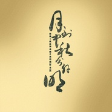

月亮粑粑月到中秋分外明——陈酿十载 浓情奉献
============================

|  |  |
| :--: | :-- |
| [ 月亮粑粑月到中秋分外明——陈酿十载 浓情奉献](https://emumo.xiami.com/album/350032) | **艺人**: [钟志刚](../index.md) **语种**: 国语 **唱片公司**: 声扬文化 音乐宿舍 **发行时间**: 2005年08月01日 **专辑类别**: EP, 单曲 **专辑风格**:  **播放数**: 1354960 **收藏数**: 199 **评论数**: 32  |

## 简介

月到中秋分外明——陈酿十载 浓情奉献  
  
  
他的歌——  
吟唱爱与善良的诗歌  
扫去你身上的倦意  
解脱你心灵的束缚  
好听到入骨三分  
  
三毛的《橄榄树》，已成绝唱。  
罗大佑的《乡愁四韵》，渐行渐远。  
陈星的《流浪歌》，还在民工口中流传。  
这个午夜，我听到了一种最纯粹的天籁之音。  
它是来自民谣歌者——小刚的：《月亮粑粑》。  
  
《月亮粑粑》，解读了一种你我的皆有的美丽乡愁。  
浅显的文字，流畅的笔调，道出了中国人真挚朴实的情感。  
“人人心中皆有，人人笔下却无”原来是诗词的最高境界。  
白居易作诗，力求平浅，平易近人，哪怕会被人说成「俚俗」  
——难怪他的作品才得以流传千古。  
《月亮粑粑》原来也是异曲同工，大雅若俗…… 

## 曲目

- [月亮粑粑](./350032/U56ge82cf8e.md)

## 评论

|  |  |  |  |
| :-- | :-- | :-- | :-- |
|  [虾米用户](https://emumo.xiami.com/u/276944698) 不要自我设限..... 2020-10-25 03:26 赞(0) 踩(0) | 
❇️❇️❇️
 |
|  [虾米用户](https://emumo.xiami.com/u/50521343) 乘着尘世的马，驾着超世的... 2019-04-12 11:54 赞(0) 踩(0) | 
1996，湖大桃子湖，音乐宿舍。小刚写了很多好歌，那段永远怀念的时光。
 |
| ⇒ |  [虾米用户](https://emumo.xiami.com/u/330919568)  2020-01-29 15:18 赞(0) 踩(0) | 
古古怪怪滚滚滚
 |
|  [虾米用户](https://emumo.xiami.com/u/41903099) 虚度时光 2017-02-20 13:04 赞(0) 踩(0) | 
想听赵雷的版本
 |
|  [虾米用户](https://emumo.xiami.com/u/258491392)  2017-02-16 20:41 赞(0) 踩(0) | 
周六赵小雷要唱这首歌，先预热一下啦
 |
|  [虾米用户](https://emumo.xiami.com/u/760301) 慈。 2016-09-20 04:40 赞(0) 踩(0) | 
就为这一首歌
 |
|  [虾米用户](https://emumo.xiami.com/u/4806378)  2015-05-03 00:41 赞(0) 踩(0) | 
你还会在香樟路口等我吗？
 |
|  [虾米用户](https://emumo.xiami.com/u/3255062) 不长，不短，一念之间 2015-03-07 23:29 赞(0) 踩(0) | 
很有感情，亲切
 |
|  [虾米用户](https://emumo.xiami.com/u/7888098) 吃 2015-03-01 01:50 赞(0) 踩(0) | 
月亮月亮我問妳今天妳多大年紀
 |
|  [虾米用户](https://emumo.xiami.com/u/42814020)  2015-02-04 23:39 赞(0) 踩(0) | 
忍不住穿着睡衣在冷风中多站了一会，今夜的月亮太圆太亮，想起了一首歌。
 |
|  [虾米用户](https://emumo.xiami.com/u/38508232) 嘻嘻嘻 2014-11-02 15:45 赞(0) 踩(0) | 
觉得这种感觉  真的  很真实  不同于一般流行音乐的歌词完全不知道在说什么想表达什么  这类歌曲更能触动人心  喜欢
 |
|  [虾米用户](https://emumo.xiami.com/u/31537778)   2014-09-09 12:55 赞(0) 踩(0) | 
思亲
 |
|  [虾米用户](https://emumo.xiami.com/u/21362915) Thinking abo... 2014-09-08 22:07 赞(0) 踩(0) | 
中秋佳节
 |
|  [虾米用户](https://emumo.xiami.com/u/5460701)  2014-08-10 17:46 赞(0) 踩(0) | 
汪涵教小朋友们的“月亮粑粑”哈哈哈
 |
|  [虾米用户](https://emumo.xiami.com/u/20544253)  2014-02-17 19:34 赞(0) 踩(0) | 
里面的小孩唱的好像听苏苏唱过，听着好亲切~
 |
|  [虾米用户](https://emumo.xiami.com/u/11259253) 听靓歌 2014-01-23 15:38 赞(0) 踩(0) | 
不错。
 |
|  [虾米用户](https://emumo.xiami.com/u/30353061)  2013-12-23 16:49 赞(0) 踩(0) | 
[心]
 |
|  [虾米用户](https://emumo.xiami.com/u/2667261)  2013-09-25 00:10 赞(0) 踩(0) | 
夜晚听到勾起乡愁。。
 |
|  [虾米用户](https://emumo.xiami.com/u/6335094)  2013-09-20 00:37 赞(1) 踩(0) | 
中秋过完了，感觉好久没有回家了，爸说他痛风，吃不了肉，妈说她感冒，咳个不停。我只是笑不知道要说什么好。月亮月亮我问你，今天你多大年纪，什么时候我已长大了，你却依然很平静。
 |
|  [虾米用户](https://emumo.xiami.com/u/5736821) 不为什么 2013-09-19 15:06 赞(0) 踩(0) | 
今儿晚上听这个，真合适
 |
|  [虾米用户](https://emumo.xiami.com/u/1577874) 我还没想好要写什么... 2013-09-18 00:57 赞(0) 踩(0) | 
快到中秋节了，听这个真合适好听啊！！
 |
|  [虾米用户](https://emumo.xiami.com/u/3057007) 因为行走，所以快乐! 2013-08-22 13:52 赞(0) 踩(0) | 
支持本地民谣歌手
 |
|  [虾米用户](https://emumo.xiami.com/u/4993602) 我还没想好要写什么... 2013-07-22 14:43 赞(0) 踩(0) | 
会念该首民谣的人哈是长沙人
 |
|  [虾米用户](https://emumo.xiami.com/u/10748295)  2013-05-15 18:27 赞(0) 踩(0) | 
月亮月亮我问你，今年你多大年纪，什么时候我已长大了，你却依然很年轻……
 |
|  [虾米用户](https://emumo.xiami.com/u/7755011) 我还没想好要写什么... 2013-03-21 12:39 赞(0) 踩(0) | 
心里有，话确无从起
 |
|  [虾米用户](https://emumo.xiami.com/u/5980444) 早起蟲兒可恥鳥 2012-09-28 19:34 赞(0) 踩(0) | 
送上月亮粑粑祝朋友們月亮節快樂  團團圓圓
 |
|  [虾米用户](https://emumo.xiami.com/u/57294) 女子。 2012-07-31 05:20 赞(0) 踩(0) | 
好好听。
 |
|  [虾米用户](https://emumo.xiami.com/u/1730745) 挑战未来 ！ 共享未来！ 2012-07-29 09:17 赞(0) 踩(0) | 
实诚的艺术家！
 |
|  [虾米用户](https://emumo.xiami.com/u/1647391)  2012-06-27 01:32 赞(1) 踩(0) | 
好听的音乐；一个在做实事的艺术家！
 |
|  [虾米用户](https://emumo.xiami.com/u/2526928) 想当年，老夫也是神一般的... 2012-06-24 13:38 赞(0) 踩(0) | 
两年前在叔于田听到的小曲儿。
 |
|  [虾米用户](https://emumo.xiami.com/u/5818314)  2012-02-29 22:15 赞(0) 踩(0) | 
张玮玮和小河的版本都非常不错，不过听着钟志刚的声音，还是有种不同的滋味
 |
|  [虾米用户](https://emumo.xiami.com/u/858475)  2011-03-20 20:47 赞(0) 踩(0) | 
什么时候我已长大了，你却依然很平静
 |
