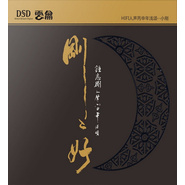

刚刚好
============================

|  |  |
| :--: | :-- |
| [ 刚刚好](https://emumo.xiami.com/album/502564590) | **艺人**: [钟志刚](../index.md) **语种**: 国语 **唱片公司**: 广东音像 **发行时间**: 2016年07月19日 **专辑类别**: 录音室专辑 **专辑风格**:  **播放数**: 176332 **收藏数**: 185 **评论数**: 10  |

## 简介

2016年全新专辑：钟志刚(小刚)丙申年浅颂《刚刚好》  
关于回忆、纯粹、珍贵…  
吉他荡漾、风琴隐约  
陶笛悠远、钢琴缠绵  
每一个声音和力度都诉说着故事，各种艰辛、折磨、可爱、愉悦…  
精心收录12首精选每首都是动人主旋律！《又唱起这首歌》《你在我的冬季里》……  
  
当我们终于静下来重新聆听这些歌曲时，我们被小刚的歌声深深撼动。我们听见“流水年华”的小刚，听见了“我有一段情”的小刚对他诠释着“最浪漫的事”，也同时听见了“乌兰巴托的夜”，最动人的情歌。于是在这张专辑里，我们不只听见了歌，我们还听见了小刚阐述生命故事。  
  
所有的故事都在音乐里，  
正如此刻您的聆听，  
也都构成故事，美、希望、爱、求索……  
一直在延续。

## 曲目

- [我有一段情](./502564590/mSvY4G66913.md)
- [贝加尔湖畔](./502564590/mSvY4H5bc52.md)
- [永隔一江水](./502564590/mSvY4I6767a.md)
- [乌兰巴托的夜](./502564590/mSvY4J60546.md)
- [你在我的冬季](./502564590/mSvY4K5c849.md)
- [流水年华](./502564590/JCCUW51f5ee.md)
- [垄上行](./502564590/xNgXtwb4da4.md)
- [敲敲门](./502564590/xNgXtxc8882.md)
- [最浪漫的事](./502564590/b1rEQmS3d466.md)
- [又唱起这首歌](./502564590/U7xTLj2b3a8.md)
- [最远的你是我最近的爱](./502564590/mSvY4Q67cf4.md)
- [梨花又开放](./502564590/bqwTRyv3acf1.md)

## 评论

|  |  |  |  |
| :-- | :-- | :-- | :-- |
|  [虾米用户](https://emumo.xiami.com/u/424804193) 我还没想好要写什么... 2020-08-29 19:14 赞(0) 踩(0) | 
卜自丶人发、....…:。~⋯…戊…"丶滩.小、⋯
 |
|  [虾米用户](https://emumo.xiami.com/u/327278566)  2020-04-29 23:03 赞(0) 踩(0) | 

 |
|  [虾米用户](https://emumo.xiami.com/u/339657443)   2020-02-05 19:19 赞(0) 踩(0) | 
这个味精有点多了
 |
|  [虾米用户](https://emumo.xiami.com/u/433809692)  2019-12-16 23:10 赞(0) 踩(0) | 
独特的风格，不一样的风格，给了歌新的生命。
 |
|  [虾米用户](https://emumo.xiami.com/u/311861246)  2019-09-05 18:44 赞(1) 踩(0) | 
很好，好声音，耐人寻味！
 |
|  [虾米用户](https://emumo.xiami.com/u/276667790)  2019-03-15 14:14 赞(0) 踩(0) | 
耐人寻味！真心不错！
 |
|  [虾米用户](https://emumo.xiami.com/u/410232214) 暖色度余生 2018-12-14 16:29 赞(0) 踩(0) | 
赞！赞！赞！赞！赞！赞！
 |
|  [虾米用户](https://emumo.xiami.com/u/25891506)  2017-11-18 23:27 赞(2) 踩(0) | 
声音情感充沛，低吟浅唱，回味无穷，但是配器真的不要太复杂，会淹没掉声音的细节和质感，《请跟我来》才是经典，才是发烧男声里的真正极品！！！！！！！！！
 |
|  [虾米用户](https://emumo.xiami.com/u/49656103)   2017-09-23 05:26 赞(1) 踩(0) | 
志刚大部分人能接受的好声音，有故事，有情感的声音
 |
|  [虾米用户](https://emumo.xiami.com/u/245543492)  2017-09-18 07:20 赞(1) 踩(0) | 
他的声音真的好纯粹，清澈，温暖，感动到我了。
 |
