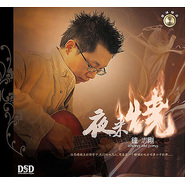

夜来烧
============================

|  |  |
| :--: | :-- |
| [ 夜来烧](https://emumo.xiami.com/album/6574) | **艺人**: [钟志刚](../index.md) **语种**: 国语 **唱片公司**: 艺扬唱片 **发行时间**: 2005年03月01日 **专辑类别**: 录音室专辑 **专辑风格**:  **播放数**: 239157 **收藏数**: 157 **评论数**: 10  |

## 简介

……跟随，去向记忆深处最温暖的一片波浪。  
然后我们只是顺水漂流，在阳光弥漫于窗帘上的下午，在一根香烟上燃起的那一种寂寞。  
或者黑夜茫茫，在灭着灯的房间里，听着的那一种歌。  
看着冥冥灭灭，一点一点散开的那一种城市的灯光，灯光下为记忆生活的那一种人。  
或者只是无意，只是偶尔想起的一段时间。  
  
晓刚，本名钟志刚，长沙人，民歌艺术家郭兰英的得意门生。  
  
这是晓刚的第二张演唱专辑，虽然《夜来烧》这张专辑晓刚仍以改编翻唱为主，却是他的原创音乐的处女碟--第一次收入了原创作品，两首：《为你唱不停》、《一会看天一会看你》。晓刚的声音表现力丰富、沉着而富有情感张力、略带忧郁和含蓄，适合秋天的黄昏或子夜聆听。晓刚从事原创音乐的写和唱快十五年了，从事音乐制作也已经起步。而他用演唱发烧唱片的形式进入市场，建立了他的听众群，此后他会推出更多他的原创精品。虽然目前还听不到更多他的原创精品，欣慰的是，能听到小刚唱的歌--本身就是一种享受。 

## 曲目

- [老情歌](./6574/bAZFec4c0.md)
- [阿美阿美](./6574/bAZGe6c6f.md)
- [童年的小摇车](./6574/dHen41167.md)
- [为你唱不停](./6574/KXU635f7.md)
- [相思河畔](./6574/bkYP11b86.md)
- [爱情的故事](./6574/KXW6c1d1.md)
- [橄榄树](./6574/KXX4bba5.md)
- [那天晚上](./6574/KXY55251.md)
- [不了情](./6574/KXZ527ac.md)
- [玻璃心](./6574/c1bC2ceee.md)
- [一会看天,一会看你](./6574/bAZPec23e.md)

## 评论

|  |  |  |  |
| :-- | :-- | :-- | :-- |
|  [虾米用户](https://emumo.xiami.com/u/8337431) 以乐会友 2020-05-19 01:55 赞(1) 踩(0) | 
发烧魅力男声，童年的小摇车，老情歌，爱情的故事…… 20200519.10
 |
|  [虾米用户](https://emumo.xiami.com/u/41305323)  2017-11-29 23:17 赞(0) 踩(0) | 
好
 |
|  [虾米用户](https://emumo.xiami.com/u/1105098)  2014-12-29 10:19 赞(1) 踩(0) | 
好美，多少年的老歌，唱出了另一种味道。唱到了我骨子里。
 |
|  [虾米用户](https://emumo.xiami.com/u/12728850) 程國隆 2013-02-05 22:52 赞(0) 踩(0) | 
夠味
 |
|  [虾米用户](https://emumo.xiami.com/u/1940909)  2012-11-27 00:00 赞(0) 踩(0) | 
钟志刚
 |
|  [虾米用户](https://emumo.xiami.com/u/1609946) 一即一切 2012-09-22 16:18 赞(1) 踩(0) | 
于2012年9月22日造访——明达陶瓷致：说不出的感动立体声的声线
 |
|  [虾米用户](https://emumo.xiami.com/u/4777508)  2012-04-02 10:52 赞(0) 踩(0) | 
999
 |
|  [虾米用户](https://emumo.xiami.com/u/8512231)  2012-03-20 13:38 赞(0) 踩(0) | 
干净的声音，完美的诠释
 |
|  [虾米用户](https://emumo.xiami.com/u/1986385)  2011-02-04 02:36 赞(0) 踩(0) | 
很好听的声音
 |
|  [虾米用户](https://emumo.xiami.com/u/1986385)  2011-02-04 02:35 赞(0) 踩(0) | 
好听
 |
