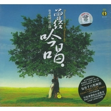

钟志刚
============================

|  |  |
| :--: | :-- |
| [ 钟志刚](https://i.xiami.com/zzg) | **地区**: China 中国大陆 **风格**: 民歌, 融合 **播放数**: 2670647 **粉丝数**: 1629 **评论数**: 53  |

## 档案

钟志刚，又名晓刚。湖南长沙人，是一名创作歌手。从1988年开始，在原创音乐道路上行走了已经16年，好歌无数。获得不少的奖项，如最佳创作歌曲奖，十佳歌手奖等。参加过无数的大型户外演出，积累了丰富的舞台表演经验。 
晓刚曾在郭兰英老师身边学习民歌，期望并努力完成一种使民族、民谣与自我相融合的音乐。曾获中国轻音乐学会奖最佳男歌手、1998/99两届"深圳十佳歌手"、2004/05两届深圳十佳歌手及最佳创作人，曾任主持佛山电台《城市民谣夜》、是音乐宿舍原创媒介网的创始人。擅长民谣民歌、老歌吟唱、现场即兴谱歌演唱等，他的声音表现力丰富、沉着而富有情感张力、略带忧郁和含蓄。

## 专辑

| 名称 | 语种 | 唱片公司 | 发行时间 | 专辑类别 | 专辑风格 |
| :--: | :-- | :-- | :-- | :-- | :-- |
| [ 亲吻草原握手天堂](./albums/2102955634.md) | 国语 | 安雨琪枫 | 2017年11月22日 | EP, 单曲 |  |
| [ 刚刚好](./albums/502564590.md) | 国语 | 广东音像 | 2016年07月19日 | 录音室专辑 |  |
| [ 聆听·小刚](./albums/302564600.md) | 国语 | 红音堂唱片 | 2016年01月01日 | 精选集 |  |
| [ 追忆梁弘志](./albums/423306.md) | 国语 | 天圆文化 | 2011年01月22日 | 录音室专辑 |  |
| [ 为爱而歌](./albums/338585.md) | 国语 | 新京文音像有限公司 | 2009年03月16日 | 录音室专辑 |  |
| [ 请跟我来](./albums/167463.md) | 国语 | 音乐堡唱片 | 2007年10月01日 | 录音室专辑 |  |
| [ 月亮粑粑月到中秋分外明——陈酿十载 浓情奉献](./albums/350032.md) | 国语 | 声扬文化 音乐宿舍 | 2005年08月01日 | EP, 单曲 |  |
| [ 曾经吟唱](./albums/6573.md) | 国语 | 广州音像 | 2005年06月01日 | 录音室专辑 |  |
| [ 夜来烧](./albums/6574.md) | 国语 | 艺扬唱片 | 2005年03月01日 | 录音室专辑 |  |

## 评论

|  |  |  |
| :-- | :-- | :-- |
|  [虾米用户](https://emumo.xiami.com/u/351594163)  2020-12-08 11:50 赞(0) 踩(0) | 
很好聽
 |
|  [虾米用户](https://emumo.xiami.com/u/276944698) 不要自我设限..... 2020-10-25 03:26 赞(0) 踩(0) | 
Ⓜ️Ⓜ️Ⓜ️
 |
|  [虾米用户](https://emumo.xiami.com/u/8337431) 以乐会友 2020-05-19 00:39 赞(0) 踩(0) | 
发烧男声
 |
|  [虾米用户](https://emumo.xiami.com/u/8337431) 以乐会友 2020-05-19 00:23 赞(0) 踩(0) | 
20200519.50
 |
|  [虾米用户](https://emumo.xiami.com/u/428833137)  2020-02-26 12:35 赞(0) 踩(0) | 
听着很不错，干净通透！
 |
|  [虾米用户](https://emumo.xiami.com/u/358104299) 悲观的唯心存在现实解构虚... 2020-01-26 20:56 赞(1) 踩(0) | 
14647
 |
|  [虾米用户](https://emumo.xiami.com/u/43250463)  2019-06-04 18:28 赞(0) 踩(0) | 
长沙满哥
 |
|  [虾米用户](https://emumo.xiami.com/u/286011977)  2019-01-25 10:30 赞(0) 踩(0) | 
聆听和刚刚好都监制得不错，
 |
|  [虾米用户](https://emumo.xiami.com/u/286011977)  2019-01-25 10:28 赞(0) 踩(0) | 
有声有情，唱功扎实，而且、耐听。期望听到更多个人创作和品。
 |
|  [虾米用户](https://emumo.xiami.com/u/5716944)  2018-11-11 09:50 赞(0) 踩(0) | 
``
 |
|  [虾米用户](https://emumo.xiami.com/u/42560187) 归于传统 2018-07-31 19:22 赞(2) 踩(0) | 
城市民谣老听众过来打卡[带墨镜笑]
 |
|  [虾米用户](https://emumo.xiami.com/u/280691715)  2018-07-17 22:56 赞(0) 踩(0) | 
声音自然蛮好听
 |
|  [虾米用户](https://emumo.xiami.com/u/199599830)  2018-06-04 18:52 赞(0) 踩(0) | 
难得的好声音 好喜欢！
 |
|  [虾米用户](https://emumo.xiami.com/u/282480241) 奋斗者 2018-04-18 10:06 赞(0) 踩(0) | 
声音好听录制也好我买了&amp;ldquo;刚刚好&amp;rdquo;正版CD在车上听、最喜欢第二首
 |
|  [虾米用户](https://emumo.xiami.com/u/9127105)   2017-10-28 00:15 赞(0) 踩(0) | 
哈哈，听到前面的童瑶就知道这个歌手是长沙丫子
 |
|  [虾米用户](https://emumo.xiami.com/u/9842933)  2017-10-27 23:18 赞(0) 踩(0) | 
又名晓刚。湖南长沙人，是一名创作歌手。从1988年开始，在原创音乐道路上行走了已经16年，好歌无数。获得不少的奖项，如最佳创作歌曲奖，十佳歌手奖等。参加过无数的大型户外演出，曾在郭兰英老师身边学习民歌，期望并努力完成一种使民族、民谣与自我相融合曾获中国轻音乐学会奖最佳男歌手
 |
|  [虾米用户](https://emumo.xiami.com/u/49656103)   2017-09-23 05:20 赞(0) 踩(0) | 
钟志刚声场宽阔，略带磁性低嗓，每一首歌曲都极易引发共鸣，这就是好声音，声情并茂！
 |
|  [虾米用户](https://emumo.xiami.com/u/238411858)   2017-07-25 09:58 赞(0) 踩(0) | 
好听
 |
|  [虾米用户](https://emumo.xiami.com/u/37007949)   2017-02-10 20:21 赞(0) 踩(0) | 
~~~~~
 |
|  [虾米用户](https://emumo.xiami.com/u/244790009)  2016-12-29 23:51 赞(0) 踩(0) | 
入睡前听，很舒服，浅唱低吟，好听入梦。
 |
|  [虾米用户](https://emumo.xiami.com/u/9563270)  2016-08-24 16:40 赞(0) 踩(0) | 
希望你能听
 |
|  [虾米用户](https://emumo.xiami.com/u/43888261)  2016-01-14 22:24 赞(1) 踩(0) | 
唱功还好，不一定非要出名嘛，是吧
 |
|  [虾米用户](https://emumo.xiami.com/u/11361609)   2016-01-11 19:57 赞(0) 踩(0) | 
过年了，流泪了
 |
|  [虾米用户](https://emumo.xiami.com/u/39577409) 热爱生活/热爱生命  去... 2015-09-12 18:03 赞(0) 踩(0) | 
原来是老乡啊
 |
|  [虾米用户](https://emumo.xiami.com/u/38218751) 暂无签名~ 2015-05-08 18:49 赞(1) 踩(0) | 
月亮粑粑！！！
 |
|  [虾米用户](https://emumo.xiami.com/u/7673651)  2015-03-14 18:10 赞(3) 踩(0) | 
刚子，好多年没见了，最近活的出色不？
 |
| ⇒ |  [虾米用户](https://emumo.xiami.com/u/96103920)  2017-06-28 15:50 赞(0) 踩(0) | 
小刚老师现在在广州雲龠
 |
|  [虾米用户](https://emumo.xiami.com/u/7012981) 声音中的故事 2014-12-04 13:52 赞(0) 踩(0) | 
虾米也出MV了，可说好的你的MV呢！
 |
|  [虾米用户](https://emumo.xiami.com/u/286463) 音乐不是歌 2014-09-07 20:45 赞(0) 踩(0) | 
好！
 |
|  [虾米用户](https://emumo.xiami.com/u/197885)  2014-08-08 21:55 赞(0) 踩(0) | 
这个声音我以前咋不知道啊 重要遇到了
 |
|  [虾米用户](https://emumo.xiami.com/u/3065048) 渐行渐远..... 2014-07-12 09:24 赞(1) 踩(0) | 
挚爱 风声鹤唳~
 |
|  [虾米用户](https://emumo.xiami.com/u/19523628)  2014-05-26 16:11 赞(0) 踩(0) | 
爱听
 |
|  [虾米用户](https://emumo.xiami.com/u/8388034)  2014-01-19 19:34 赞(0) 踩(0) | 
好听啊！！
 |
|  [虾米用户](https://emumo.xiami.com/u/11897273)   2013-11-08 00:46 赞(0) 踩(0) | 
加油长沙伢子！
 |
|  [虾米用户](https://emumo.xiami.com/u/3183191)  2013-10-30 00:57 赞(0) 踩(0) | 
特么特么喜欢
 |
|  [虾米用户](https://emumo.xiami.com/u/13350)  2013-10-19 10:29 赞(0) 踩(0) | 
好得很！
 |
|  [虾米用户](https://emumo.xiami.com/u/4993602) 我还没想好要写什么... 2013-10-03 17:10 赞(0) 踩(0) | 
晓刚去参加中国好声音吧，让更多人喜欢你。
 |
|  [虾米用户](https://emumo.xiami.com/u/302258) Todi 2013-08-17 17:35 赞(0) 踩(0) | 
Good job ye !
 |
|  [虾米用户](https://emumo.xiami.com/u/205735) 芒果的体型能变成黄瓜的么 2013-08-14 22:01 赞(0) 踩(0) | 
月亮月亮我问你。
 |
|  [虾米用户](https://emumo.xiami.com/u/16857276) epin 2013-07-23 00:02 赞(3) 踩(0) | 
小刚，堕落街还记得吗，当年你刚刚创作月亮粑粑，我们几个在分享你的成果
 |
|  [虾米用户](https://emumo.xiami.com/u/10435106) 听靓歌 2013-07-07 03:31 赞(0) 踩(0) | 
不错.
 |
|  [虾米用户](https://emumo.xiami.com/u/8560774)  2013-06-30 13:10 赞(0) 踩(0) | 
回到家乡,回到山涧.........
 |
|  [虾米用户](https://emumo.xiami.com/u/13619909) 我有耳朵，需要美味 2013-04-24 20:09 赞(0) 踩(0) | 
喜欢不需要理由
 |
|  [虾米用户](https://emumo.xiami.com/u/12253947) 每一段感情都会改变一次歌... 2013-01-04 14:43 赞(0) 踩(0) | 
晓刚的月亮粑粑很好听
 |
|  [虾米用户](https://emumo.xiami.com/u/3389673) 音乐爱好的人 2012-09-01 15:35 赞(0) 踩(0) | 
ok
 |
|  [虾米用户](https://emumo.xiami.com/u/2631092)  2012-07-20 20:53 赞(0) 踩(0) | 
请大家关注声动亚洲的“钟志刚”，这是他的虾米主页，如果你喜欢，就为他在这里：<a href="http://vote.weibo.com/vid=1867285" target="_blank" rel="nofollow noreferrer noopener">http://vote.weibo.com/vid=1867285</a>  顶一下！谢谢！@钟志刚_小刚
 |
|  [虾米用户](https://emumo.xiami.com/u/5808799)  2012-07-07 23:43 赞(0) 踩(0) | 
月亮粑粑,终于找到这首歌了
 |
|  [虾米用户](https://emumo.xiami.com/u/693411)   2012-02-12 17:32 赞(0) 踩(0) | 
我去，不要介么温柔好咩！！
 |
|  [虾米用户](https://emumo.xiami.com/u/3720036)  2012-01-28 12:37 赞(0) 踩(0) | 
There is hardly anything more touching than hearing  a man sing in such a deep, soulful voice.
 |
|  [虾米用户](https://emumo.xiami.com/u/5489452)  2011-12-13 15:28 赞(0) 踩(0) | 
非常特别，我非常喜欢。特别是夜来香。
 |
|  [虾米用户](https://emumo.xiami.com/u/695533)  2011-07-06 09:29 赞(0) 踩(0) | 
怎么最近虾米无法听他的歌曲啊？？？
 |
|  [虾米用户](https://emumo.xiami.com/u/3065048) 渐行渐远..... 2011-04-29 23:40 赞(0) 踩(0) | 
我 特喜欢 风声鹤唳 每天都 会聆听几次
 |
| ⇒ |  [虾米用户](https://emumo.xiami.com/u/363069)  2011-05-22 17:55 赞(0) 踩(0) | 
几年前，第一次听翠湖寒，竟然会听到流泪。至今仍然不时听听，那份感觉依然。
 |
