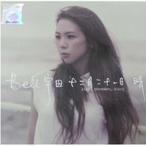

十二月二十一日 晴
============================

|  |  |
| :--: | :-- |
| [ 十二月二十一日 晴](https://emumo.xiami.com/album/568963) | **艺人**: [Bell宇田](../index.md) **语种**: 国语 **唱片公司**: 立志音乐 **发行时间**: 2012年12月21日 **专辑类别**: 录音室专辑 **专辑风格**: 国语流行 Mandarin Pop **播放数**: 4374396 **收藏数**: 393 **评论数**: 34  |

## 简介

末日后的第一个晴天   Bell 宇田  
首张个人专辑    十二月二十一日，晴  
创作x编曲x和声编写x 和声 x 製作x 钢琴 x 演唱  
钢琴是她最好的朋友，  
小提琴是陪伴长大的玩具，  
合音是信手拈来的兴趣，  
编曲则是秘密武器。  
毕业于音乐系的Bell 宇田，气质出眾、外型亮眼，乐坛期待已久的新生代女歌手。  
  
Bell宇田是立志音乐首位签下的女创作歌手，她是音乐系出身，早前曾在民歌餐厅演出，并参与多项广告，编曲，和声以及电影配乐等工作。  
一首纸月亮电影主题曲《带我走》让立志音乐发掘了她，正式在2012年底踏入乐坛。   
Bell宇田在首张个人专辑《十二月二十一日，晴》中，一手包办了演唱、製作、创作、和声编写、和声，并参与了选歌、编曲，以及钢琴演奏的部份。  
  
推荐曲：  
  
雨是甜的   Sweetness In The Rain      
  
专辑第一创作主打《雨是甜的》  
歌曲由Bell宇田谱曲，瑞业填词  
希望流泪分手的人，不要觉得雨天太惨，歌曲表达了一种矛盾的情绪，虽然失恋是一件不开心的事，但是在谈恋爱的过程中一定很甜蜜，这首歌曲也提醒大家要爱自己  
  
带我走 Take Me Away  
  
「 纸月亮」电影主题曲 , 电影配乐也由Bell负责担纲製作  
配合「 纸月亮」的电影意境，内容在表达一种凄美的爱情故事，爱情的勇敢和冒险加上Bell宇田细腻的情感语气呈献，是属于一首表达内心世界的歌曲。　　  
  
Beautiful    
  
烟火虽然漂亮，但是却很短暂，  
不曾相爱过，就不算失去  
在爱情世界里，不见得相爱的人就会在一起  
这首歌曲在敍述一段感情，在还没有机会表达就失去了  
歌曲也是Bell录音期间花最长时间来演绎的歌曲  
  
十二月二十一日，晴   21st December, Sunny  
  
今天结束后，明天会更好 !  
十二月二十一日，晴是以写日记方式来记录生活，晴天代表新的开始，希望大家认真渡过每一天  
  
红豆梦Tale Of The Red Beans    
  
红豆梦是Bell多年前的一首作品，歌里敍述著一个小女孩非常迷恋红楼梦的贾宝玉，但只有在梦里才能见到他  
  
开花不结果  Faded Away      电视剧《飞跃阳光》插曲  
  
歌曲内容在细述Bell宇田过去的感情故事  
多年前爱上一个和自己不同世界的人　  
虽然相爱　但是却无法得到幸福  
就算没有在一起　还是祝福对方　  
  
想念  Miss You Dearly    
  
当暗恋一个人或者  
偷偷爱上一个人的时候　吃饭，睡觉，散步…..无时无刻都会想念他　　　  
那一种温馨  甜蜜  暗恋  曖昧的感觉真的好好　  
  
柔软  Softly &amp; Tenderly    
  
这是Bell很喜欢的一首歌曲，内容表达她在音乐路上的经歷与成长  
现在回头看过去，心是感慨与珍惜的　  
  
我的世界  My World      电视剧《飞跃阳光》插曲  
  
一段无奈的感情故事　　  
  
爱你最用心  I Honestly Love You      《红花原创大奖》主题曲

## 曲目

## 评论

|  |  |  |
| :-- | :-- | :-- |
|  [虾米用户](https://emumo.xiami.com/u/319664580)  2019-04-28 19:22 赞(0) 踩(0) | 
完美
 |
|  [虾米用户](https://emumo.xiami.com/u/51538422)  2017-10-29 13:02 赞(1) 踩(0) | 
有种下载完一整张砖的冲动
 |
| ⇒ |  [虾米用户](https://emumo.xiami.com/u/319110362)  2018-01-20 01:10 赞(0) 踩(0) | 
me too
 |
|  [虾米用户](https://emumo.xiami.com/u/1141691)  2017-10-27 23:01 赞(2) 踩(0) | 
喜欢！！很像YUI声音风格自由干净！
 |
|  [虾米用户](https://emumo.xiami.com/u/72666568)  2016-05-31 00:15 赞(1) 踩(0) | 
所以还记得。
 |
|  [虾米用户](https://emumo.xiami.com/u/12832915) 相见且欢娱 2015-12-01 22:27 赞(0) 踩(0) | 
这几天重温了一下默默无闻的这一张，还是觉得很好听。《开花不结果》是很优质的芭乐。《红豆梦》本专最佳，词曲编唱都很有意思。好希望她会有第二张。
 |
|  [虾米用户](https://emumo.xiami.com/u/4376156)  2015-09-20 16:53 赞(0) 踩(0) | 
大马也有这么好听的唱华语歌曲的女嗓  点个赞先
 |
|  [虾米用户](https://emumo.xiami.com/u/43267640) 来自宇宙深处的天蝎座 2015-01-15 22:33 赞(0) 踩(0) | 
那天……我生日
 |
|  [虾米用户](https://emumo.xiami.com/u/30800139) 我在低俗与高雅间活的很尴... 2014-12-09 02:07 赞(0) 踩(0) | 
。
 |
|  [虾米用户](https://emumo.xiami.com/u/6916135)  2014-11-07 00:06 赞(0) 踩(0) | 
喜欢的唱腔，喜欢的温度
 |
|  [虾米用户](https://emumo.xiami.com/u/8886280) 暂无签名~ 2014-11-05 18:59 赞(0) 踩(0) | 
喜欢
 |
|  [虾米用户](https://emumo.xiami.com/u/32364473) 暂无签名~ 2014-11-05 02:50 赞(0) 踩(0) | 
长的和卓文萱有相似度，声音很动听，第一次听。
 |
|  [虾米用户](https://emumo.xiami.com/u/3754998)  2013-11-17 23:51 赞(0) 踩(0) | 
末日后的第一个晴天
 |
|  [虾米用户](https://emumo.xiami.com/u/25856702)  2013-11-01 15:58 赞(0) 踩(0) | 
soft
 |
|  [虾米用户](https://emumo.xiami.com/u/550969) 雞翅如我 2013-10-03 01:46 赞(0) 踩(0) | 
跟白安同一天發片出道，風格大同小異，卻沒有白安公司宣傳到位而被不被熟知
 |
|  [虾米用户](https://emumo.xiami.com/u/17350729)  2013-09-30 07:28 赞(0) 踩(0) | 
I only speak english, but I really like this album a lot!
 |
|  [虾米用户](https://emumo.xiami.com/u/21009417) chickbun 2013-09-03 11:26 赞(0) 踩(0) | 
一聽說愛上...
 |
|  [虾米用户](https://emumo.xiami.com/u/5658772)   2013-08-28 15:46 赞(0) 踩(0) | 
马来西亚国语歌手，动听感人
 |
|  [虾米用户](https://emumo.xiami.com/u/9316497)  2013-08-28 15:08 赞(0) 踩(0) | 
喜欢
 |
|  [虾米用户](https://emumo.xiami.com/u/19484576)  2013-08-16 20:54 赞(0) 踩(0) | 
有特色
 |
|  [虾米用户](https://emumo.xiami.com/u/7205091) 胡同串子 2013-05-07 17:43 赞(0) 踩(0) | 
好长时间没有听到过这么干净的嗓子了 ，去泰国旅行当然就听她了！
 |
|  [虾米用户](https://emumo.xiami.com/u/10607840)  2013-04-23 23:35 赞(0) 踩(0) | 
好声 音
 |
|  [虾米用户](https://emumo.xiami.com/u/13588706)  2013-04-06 23:35 赞(0) 踩(0) | 
人美，声甜又带一点点沙哑。。超赞
 |
|  [虾米用户](https://emumo.xiami.com/u/7131885) 我还没想好要写什么... 2013-04-06 19:01 赞(0) 踩(0) | 
轻轻地听 静静的心：）
 |
|  [虾米用户](https://emumo.xiami.com/u/2691052) 且看那青山綠水別來無恙。 2013-04-04 03:56 赞(0) 踩(0) | 
我喜欢这个声音：）
 |
|  [虾米用户](https://emumo.xiami.com/u/6118132) 光是你我 2013-03-29 19:05 赞(0) 踩(0) | 
音色和假音很棒啊真的
 |
|  [虾米用户](https://emumo.xiami.com/u/5425623) 只有音乐才能带给我快乐。 2013-03-20 12:22 赞(0) 踩(0) | 
有点新意~~~
 |
|  [虾米用户](https://emumo.xiami.com/u/1468742)  2013-03-20 10:23 赞(0) 踩(0) | 
还不错,不过``话说现在的disc list d 歌名都是双语?
 |
|  [虾米用户](https://emumo.xiami.com/u/12474277)  2013-02-26 10:32 赞(0) 踩(0) | 
干净又带点倔强的声音 值得一听
 |
|  [虾米用户](https://emumo.xiami.com/u/12832915) 相见且欢娱 2013-02-05 14:48 赞(0) 踩(0) | 
除了同名歌曲，其他的歌曲都让我很喜欢。《红豆梦》的编曲将古典与现代糅合，精妙而又动听。不过她最大的武器还是抒情歌的创作，《开花不结果》、《雨是甜的》等都展现了她创作和演唱上的实力。她的声音初听不会很惊艳，但是经得起细细的品味。最后，强推收场曲《Beautiful》~
 |
|  [虾米用户](https://emumo.xiami.com/u/1141691)  2013-01-21 02:42 赞(2) 踩(0) | 
chefairy别自以为是了好吗。。。什么是风格？什么是唱功？你又懂什么？人家一半的歌都是熬了四年才出来的创作曲吖。人家风格：声音干净，唱功就更毋庸置疑了。《带我走》更是电影插曲。难道连导演耳朵也有问题了哦？会选一个没风格，没唱功的来唱？？
 |
|  [虾米用户](https://emumo.xiami.com/u/3863685) 你的一切都是星辰，你的腹... 2013-01-10 02:04 赞(1) 踩(0) | 
@彼端的日子 声线像赵薇又像牛奶咖啡主音又像杨丞琳，了了，音乐风格定性
 |
| ⇒ |  [虾米用户](https://emumo.xiami.com/u/1229692)  2013-02-04 10:46 赞(0) 踩(0) | 
还真是像
 |
| ⇒ |  [虾米用户](https://emumo.xiami.com/u/3863685) 你的一切都是星辰，你的腹... 2013-02-10 02:13 赞(0) 踩(0) | 
<q><b>夕岸说：</b></q>
 |
