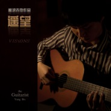

杨波
============================

|  |  |
| :--: | :-- |
| [ 杨波](https://i.xiami.com/hailinbo) | **播放数**: 2275957 **粉丝数**: 320 **评论数**: 22 **地区**: China 中国大陆 **风格**: 现代古典 Modern Classical, 西方古典 Western Classical Music  |

## 档案

## 专辑

| 名称 | 语种 | 唱片公司 | 发行时间 | 专辑类别 | 专辑风格 |
| :--: | :-- | :-- | :-- | :-- | :-- |
| [ Free guitar杨波吉他作品](./albums/2100298184.md) | 国语 | 北京海林波文化艺术有限责任公司 | 2016年01月01日 | 录音室专辑 | 现代古典 Modern Classical, 当代民谣 Contemporary Folk, 西方古典 Western Classical Music |
| [ 遥望](./albums/569765.md) | 国语 | 中国科学文化音像 | 2013年01月01日 | 录音室专辑 | 现代古典 Modern Classical, 器乐独奏 Solo Instrumental, 西方古典 Western Classical Music |

## 评论

|  |  |  |  |
| :-- | :-- | :-- | :-- |
|  [虾米用户](https://emumo.xiami.com/u/286654883)  2020-11-01 11:57 赞(0) 踩(0) | 
喜欢你的白色恋人 希望能听到更多好听的音乐
 |
|  [虾米用户](https://emumo.xiami.com/u/4781945)   2020-08-03 00:19 赞(0) 踩(0) | 
能否弹一首 斯卡保罗集市的曲子呀
 |
|  [虾米用户](https://emumo.xiami.com/u/37410580) 我的世界，春暖花开，四季... 2020-02-27 01:30 赞(0) 踩(0) | 
谢谢你的音乐
 |
|  [虾米用户](https://emumo.xiami.com/u/87827600) 山水两相忘，日月无瓜葛；... 2019-03-18 09:19 赞(1) 踩(0) | 
平时只听音乐觉得乐曲声中充满了美好的幻想与回忆，但我知道学任何一件乐曲想要达到一定的水平也不是短短几年就可以造就的。弹入他人心扉的音乐家听着他人故事成长，又用故事感动着同样热爱音乐的人们，不知不觉把自己也活成了故事。
 |
|  [虾米用户](https://emumo.xiami.com/u/318329468)  2019-02-09 21:03 赞(0) 踩(0) | 
支持 
 |
|  [虾米用户](https://emumo.xiami.com/u/418425684)  2019-02-08 20:03 赞(0) 踩(0) | 
wz
 |
|  [虾米用户](https://emumo.xiami.com/u/42592050) 暂无签名~ 2018-01-22 19:35 赞(2) 踩(0) | 
听了这个版本的卡农想问一句 有谱吗我要学，我要学。
 |
|  [虾米用户](https://emumo.xiami.com/u/211904307)  2017-10-22 11:44 赞(2) 踩(0) | 
有谱吗？谢谢
 |
|  [虾米用户](https://emumo.xiami.com/u/253553442)  2016-12-11 07:51 赞(0) 踩(0) | 
咱俩同名啊，14年第一次听你的歌，好听，挺你，我也是80后，希望你能唱出我们这一代人的心声
 |
|  [虾米用户](https://emumo.xiami.com/u/120495640)   2016-03-06 06:14 赞(3) 踩(0) | 
成为主流需要推广，让更多人听到，最爱tears
 |
| ⇒ |  [虾米用户](https://emumo.xiami.com/u/87827600) 山水两相忘，日月无瓜葛；... 2019-03-18 09:24 赞(0) 踩(0) | 
不要过度推广才好，做音乐是细水长流的职业，无非是谁人唱罢换人唱，顺其自然便好。音乐是块试金石，你在成长中有何变化听听一路陪伴你的音乐心已明了。
 |
|  [虾米用户](https://emumo.xiami.com/u/5694222)   2016-02-20 21:35 赞(3) 踩(0) | 
实在太偶然找到这张专辑，如获珍宝
 |
|  [虾米用户](https://emumo.xiami.com/u/37296521) 暂无签名~ 2015-10-21 23:19 赞(0) 踩(0) | 
老师好
 |
|  [虾米用户](https://emumo.xiami.com/u/23373595)   2013-09-30 13:22 赞(0) 踩(0) | 
很棒的专辑 虽然不是很主流 但是值得一听
 |
|  [虾米用户](https://emumo.xiami.com/u/1667703)  2013-02-26 17:17 赞(0) 踩(0) | 
细腻的旋律，好听
 |
|  [虾米用户](https://emumo.xiami.com/u/10493929)  2013-01-21 14:43 赞(0) 踩(0) | 
用心做出来的音乐，沉淀着很多故事，宁静优美，很棒！！！
 |
|  [虾米用户](https://emumo.xiami.com/u/12415872)  2013-01-13 22:57 赞(0) 踩(0) | 
宁静
 |
|  [虾米用户](https://emumo.xiami.com/u/12356124)  2013-01-11 09:49 赞(0) 踩(0) | 
很棒的指弹古典吉他！
 |
