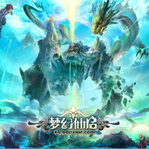

梦幻仙启 原声音乐
============================

|  |  |
| :--: | :-- |
| [ 梦幻仙启 原声音乐](https://emumo.xiami.com/album/2103498594) | **艺人**: [魏小涵](../index.md) **语种**: 国语 **唱片公司**: 独立发行 **发行时间**: 2012年12月14日 **专辑类别**: 原声带, 影视音乐 **专辑风格**: 中国风 China-Wave, 古风 GuFeng Music, 民族融合新世纪 Ethnic Fusion New Age **播放数**: 6179 **收藏数**: 23 **评论数**: 2  |

## 简介

 

 

《梦幻仙启》 
 

作曲/编曲/制作/录制：The One Studio 
 

音乐团队：<a href="http://theonestudio.cn" target="_blank" rel="nofollow noreferrer noopener">http://theonestudio.cn</a> 
 

音乐总监：魏小涵 
 

联系邮箱：<a href="mailto:service@theonestudio.cn">service@theonestudio.cn</a> 
 

  

 

《梦幻仙启》是一款移动端大型仙侠回合制RPG网络游戏。游戏采用先进的掌端技术同跨iOS、Android两大系统。精美细腻的全高清画面，营造出浪漫瑰丽的精品游戏风格；清新动人的背景音乐，渲染出如梦似幻的修仙世界。其玩法丰富，耐玩度匹敌传统PC网游。 
 

 

## 曲目

## 评论

|  |  |  |  |
| :-- | :-- | :-- | :-- |
|  [虾米用户](https://emumo.xiami.com/u/52259218)  2018-04-29 22:00 赞(1) 踩(0) | 
很好听很美妙的音乐
 |
|  [虾米用户](https://emumo.xiami.com/u/1501985) 我还没想好要写什么... 2018-01-23 13:45 赞(1) 踩(0) | 

 |
