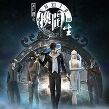
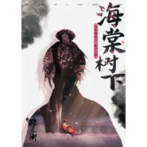
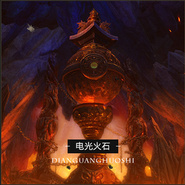
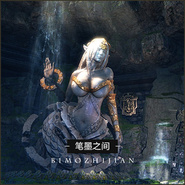
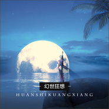
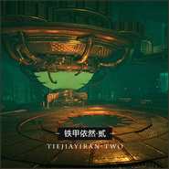
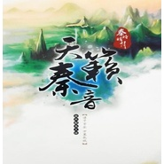
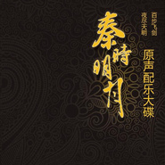
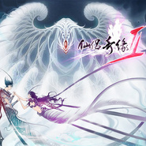

魏小涵
============================

|  |  |
| :--: | :-- |
| [ 魏小涵](https://i.xiami.com/weixiaohan) | **地区**: China 中国大陆 **风格**: 中国风 China-Wave, 古风 GuFeng Music, 游戏配乐 Video Game Music **播放数**: 19592887 **粉丝数**: 5760 **评论数**: 229  |

## 档案

魏小涵是中国ACG音乐第一品牌The One Studio创始人，资深音乐监制。担任国内诸多著名动漫、游戏项目音乐总监、音频监制等职务。其创立并拥有的The One Studio主要从事影视动漫音乐、游戏音乐创作制作，自成立以来先后完成超过600余部项目。 
现任The One Studio的CEO、音乐监制、音频导演，电影《重返狼群》音乐监制；3D动画剧《秦时明月》系列、《天行九歌》、《少年歌行》、《元龙》、《芯觉》、《暗界神使》、《天宝伏妖录》、《少年锦衣卫》、《双月之城》、《斗破苍穹》、《画江湖之不良人》、《画江湖之灵主》、《画江湖之杯莫停》、《画江湖之换世门生》、《雪鹰领主》、《观海策》、《天谕》、《神契幻奇谭》、《侠岚》、《灵之契约》、《英雄冯子材》等剧音乐总监；3D影视动画《入学考试》音频总监；2D动画剧《我是江小白》、《双生灵探》、《你在星光深处》、《我开动物园》、《幻界王》、《国民老公带回家》、《戒魔人》、《乌龙院》、《小花仙》、《偷星九月天》、《聚精会神榜》、《十二星魂》等剧音乐总监。 
监制网游《天谕》、《盘龙OL》、《零世界》等二十余部配乐，页游《糖之物语》、《星之物语》等二十余部配乐，手游《诛仙》、《新仙剑》、《全民梦三国》、《全民英雄》、《七雄争霸》、《跑跑西游》、《血族》、《齐天大圣3D》、《鬼舞三国》、《梦幻神域》、《QQ降龙》、《QQ御剑天涯》等三百余部配乐。

## 专辑

| 名称 | 语种 | 唱片公司 | 发行时间 | 专辑类别 | 专辑风格 |
| :--: | :-- | :-- | :-- | :-- | :-- |
| [ 诛仙 原声音乐The One Studio](./albums/2103498694.md) | 纯音乐 | 独立发行 | 2017年12月26日 | 原声带, 影视音乐 | 民族融合新世纪 Ethnic Fusion New Age, 中国风 China-Wave, 古风 GuFeng Music |
| [ 画江湖之换世门生 原声音乐The One Studio](./albums/2102867382.md) | 国语 | 若森科技 | 2017年09月14日 | 原声带, 影视音乐 | 流行 Pop, 独立流行 Indie Pop |
| [ 画江湖之杯莫停 原声音乐The One Studio](./albums/2102656141.md) | 国语 | 若森科技 | 2017年07月01日 | 原声带, 影视音乐 | 中国风 China-Wave, 古风 GuFeng Music, 中国民乐 Chinese Folk Music |
| [ 海棠树下: 少年锦衣卫原声音乐](./albums/2102699816.md) | 国语 | 柏言影视 | 2017年06月09日 | 原声带, 影视音乐 | 流行 Pop, 古风 GuFeng Music |
| [ 斗破苍穹 原声音乐The One Studio](./albums/2102702921.md) | 国语 | 腾讯 | 2017年03月03日 | 原声带, 影视音乐 | 流行 Pop |
| [ 画江湖之不良人 原声音乐The One Studio](./albums/2102655254.md) | 国语 | 若森科技 | 2016年11月21日 | 原声带, 影视音乐 | 中国风 China-Wave, 古风 GuFeng Music, 流行 Pop |
| [ The One Studio 配乐作品--古侠题材The One Studio](./albums/2100368196.md) | 国语 | The One Studio | 2016年07月16日 | 原声带, 影视音乐 | 中国风 China-Wave |
| [ The One Studio 配乐作品--欧式题材The One Studio](./albums/2100368186.md) | 国语 | The One Studio | 2016年07月16日 | 原声带, 影视音乐 |  |
| [ The One Studio 配乐作品--日系幻想The One Studio](./albums/2100368214.md) | 国语 | The One Studio | 2016年07月16日 | 原声带, 影视音乐 |  |
| [ The One Studio 配乐作品: 沙漠题材](./albums/2100368235.md) | 其他 | The One Studio | 2016年07月16日 | 原声带, 影视音乐 |  |
| [ The One Studio 配乐作品--未来题材The One Studio](./albums/2100368199.md) | 国语 | The One Studio | 2016年07月16日 | 原声带, 影视音乐 |  |
| [ 天行九歌](./albums/2100305102.md) | 国语 | 玄机科技 | 2016年04月01日 | 原声带, 影视音乐 | 民族融合新世纪 Ethnic Fusion New Age |
| [ 画江湖之灵主 原声音乐](./albums/2100244596.md) | 国语 | 若森科技 | 2015年12月07日 | 原声带, 影视音乐 | 中国风 China-Wave |
| [ 秦时明月 原声配乐精选](./albums/498926.md) | 其他 | 玄机科技 | 2015年12月07日 | 原声带, 影视音乐 | 民族融合新世纪 Ethnic Fusion New Age |
| [ 天谕之云垂纪行 游戏原声配乐辑](./albums/2100244440.md) | 其他 | 雷火科技 | 2015年12月07日 | 原声带, 影视音乐 | 游戏配乐 Video Game Music |
| [ 天谕之铁甲依然·壹 游戏原声配乐辑](./albums/2100244430.md) | 其他 | 雷火科技 | 2015年12月07日 | 原声带, 影视音乐 | 游戏配乐 Video Game Music |
| [ 天谕之电光火石 游戏原声配乐辑](./albums/2100244436.md) | 其他 | 雷火科技 | 2015年12月07日 | 原声带, 影视音乐 | 游戏配乐 Video Game Music, 新世纪音乐 New Age |
| [ 天谕之笔墨之间 游戏原声配乐辑](./albums/2100244422.md) | 其他 | 雷火科技 | 2015年12月07日 | 原声带, 影视音乐 | 游戏配乐 Video Game Music |
| [ 天谕之幻世狂想 游戏原声配乐辑](./albums/2100244434.md) | 其他 | 雷火科技 | 2015年12月07日 | 原声带, 影视音乐 | 游戏配乐 Video Game Music |
| [ 天谕之铁甲依然·贰 游戏原声配乐辑](./albums/2100244432.md) | 其他 | 雷火科技 | 2015年12月07日 | 原声带, 影视音乐 | 卡通配乐 Cartoon Music |
| [ 七雄争霸 手游原声配乐](./albums/2100305268.md) | 国语 | 腾讯游戏 | 2015年03月01日 | 原声带, 影视音乐 | 民族融合新世纪 Ethnic Fusion New Age |
| [ 盘龙OL 游戏原声配乐](./albums/2100244464.md) | 其他 | 盛大游戏 | 2013年12月31日 | 原声带, 影视音乐 | 游戏配乐 Video Game Music |
| [ 天籁秦音 原声配乐大碟秦时明月OST 2](./albums/783024363.md) | 国语 | 玄机科技 | 2013年10月21日 | 原声带, 影视音乐 | 民族融合新世纪 Ethnic Fusion New Age, 中国风 China-Wave |
| [ 十二星魂之战士的觉醒 动画原声配乐](./albums/2100305272.md) | 国语 | The One Studio | 2013年04月01日 | 原声带, 影视音乐 | 卡通配乐 Cartoon Music |
| [ 梦幻仙启 原声音乐](./albums/2103498594.md) | 国语 | 独立发行 | 2012年12月14日 | 原声带, 影视音乐 | 中国风 China-Wave, 古风 GuFeng Music, 民族融合新世纪 Ethnic Fusion New Age |
| [ 游龙戏凤 舞台剧原声音乐](./albums/2100305278.md) | 国语 | 横店影视城 | 2012年10月01日 | 原声带, 影视音乐 | 民族融合新世纪 Ethnic Fusion New Age |
| [ 秦时明月之夜尽天明  原声配乐大碟The One Studio](./albums/2100305158.md) | 其他 | 玄机科技 | 2012年05月12日 | 原声带, 影视音乐 | 民族融合新世纪 Ethnic Fusion New Age, 原声 Soundtrack, 中国风 China-Wave, 古风 GuFeng Music |
| [ 酷电家庭 动画原声配乐](./albums/2100305280.md) | 国语 | 国家电网 | 2011年01月20日 | 原声带, 影视音乐 | 国语流行 Mandarin Pop |
| [ 折纸小兵 动画原声配乐](./albums/2100305284.md) | 国语 | 乾豪科技 | 2010年08月01日 | 原声带, 影视音乐 | 国语流行 Mandarin Pop |
| [ 梦幻迪斯尼 游戏原声配乐](./albums/2100305276.md) | 国语 | Walt Disney | 2010年07月01日 | 原声带, 影视音乐 | 放松新世纪 Relaxation New Age |
| [ 云端的日子 动画原声](./albums/333305.md) | 国语 | The One Studio | 2008年07月22日 | 原声带, 影视音乐 | 卡通配乐 Cartoon Music |
| [ 仙侣奇缘II](./albums/133123303.md) | 国语 | The One Studio | 2006年06月08日 | 原声带, 影视音乐 |  |

## 评论

|  |  |  |
| :-- | :-- | :-- |
|  [虾米用户](https://emumo.xiami.com/u/411358160) 好好工作，快乐生活 2020-12-14 13:40 赞(0) 踩(0) | 
喜欢你制作的音乐，都很美，富有古韵&amp;hellip;
 |
|  [虾米用户](https://emumo.xiami.com/u/783129) 暂无签名~ 2020-05-03 01:28 赞(0) 踩(0) | 
空山鸟语这首曲子被虾米替换了，不是原作了。大事故。
 |
|  [虾米用户](https://emumo.xiami.com/u/13979322) 一手行愿千手护持 2020-02-27 23:37 赞(0) 踩(0) | 
再看看小主生平 这么多优秀作品 哎真是太有才了 看来每天不能三心四意琴茶书画了还是得一门深入才可好好学习天天向上咯 惭愧至极 汗颜 
 |
|  [虾米用户](https://emumo.xiami.com/u/434152246) 聪明少一些大智慧多一些，... 2020-02-12 07:57 赞(0) 踩(0) | 

 |
|  [虾米用户](https://emumo.xiami.com/u/434152246) 聪明少一些大智慧多一些，... 2020-02-08 23:13 赞(0) 踩(0) | 

 |
|  [虾米用户](https://emumo.xiami.com/u/99435334) 西湖听秋雨，试剑断桥边。 2019-12-11 14:09 赞(0) 踩(0) | 
魏大大，求你给现在的古装剧配配乐吧，实在粗糙得不能听了，有些剧明明不错，虽然不错的剧也少了
 |
|  [虾米用户](https://emumo.xiami.com/u/99435334) 西湖听秋雨，试剑断桥边。 2019-12-11 13:42 赞(0) 踩(0) | 
太美了，听到忍不住泪目，天哪，什么样的精神世界才能作出这样的曲子啊
 |
|  [虾米用户](https://emumo.xiami.com/u/349659834) 身披浴血的蔷薇 2019-11-17 14:27 赞(0) 踩(0) | 
太美
 |
|  [虾米用户](https://emumo.xiami.com/u/12163016) 别怕世事从来難尝所願 2019-11-05 10:52 赞(2) 踩(0) | 
果然是四川的，虾米上好多四川人
 |
|  [虾米用户](https://emumo.xiami.com/u/358104299) 悲观的唯心存在现实解构虚... 2019-08-19 12:12 赞(0) 踩(0) | 
13040
 |
|  [虾米用户](https://emumo.xiami.com/u/369780109)  2019-08-07 23:07 赞(0) 踩(0) | 
QQ御剑天涯，那么好玩，那么有趣，那么仗义江湖的游戏，可惜没了，看到魏小涵的简介，对那游戏甚是怀念
 |
|  [虾米用户](https://emumo.xiami.com/u/237533635)  2019-06-22 06:07 赞(2) 踩(0) | 
超喜欢魏小涵制作的音乐 
 |
|  [虾米用户](https://emumo.xiami.com/u/407923012) 这个人，有点儿帅.. 2019-06-11 15:42 赞(3) 踩(0) | 
魏小涵的人生简直就是一场传奇
 |
|  [虾米用户](https://emumo.xiami.com/u/5646786) 我还没想好要写什么... 2019-06-11 06:04 赞(1) 踩(0) | 
谢谢你的《飞雪玉花》，婉转悠长，直击人心，也带给我了一段很美好的回忆。
 |
|  [虾米用户](https://emumo.xiami.com/u/245909260)   2019-06-07 00:13 赞(1) 踩(0) | 
好厉害
 |
|  [虾米用户](https://emumo.xiami.com/u/245909260)   2019-06-07 00:12 赞(3) 踩(0) | 
从秦时找过来的。 旋律很有意思，很有想法的作曲家！超喜欢    每一首都很有意境，可以说把古风诠释的是最好的！ 有很多冷门的专辑里藏了很多好曲子 好听。真的
 |
|  [虾米用户](https://emumo.xiami.com/u/277083794)  2019-05-20 21:21 赞(0) 踩(0) | 
感觉他好厉害呀！
 |
|  [虾米用户](https://emumo.xiami.com/u/328657369) 风格随心而变、 2019-04-17 08:29 赞(1) 踩(0) | 

 |
|  [虾米用户](https://emumo.xiami.com/u/405716037)  2019-03-26 11:05 赞(0) 踩(0) | 
牛逼
 |
|  [虾米用户](https://emumo.xiami.com/u/9878283) 歌单很乱 将就听吧 新歌... 2018-11-05 11:46 赞(0) 踩(0) | 
大大加油～多出好音乐 (●'◡'●)ﾉ❤
 |
|  [虾米用户](https://emumo.xiami.com/u/357055990)  2018-11-03 04:30 赞(0) 踩(0) | 
jjj
 |
|  [虾米用户](https://emumo.xiami.com/u/327602833) …… 2018-10-21 21:09 赞(0) 踩(0) | 
加油！很喜欢你的音乐
 |
|  [虾米用户](https://emumo.xiami.com/u/176111066) 北国风光，千里冰封，万里... 2018-10-19 19:14 赞(0) 踩(0) | 
述岚记太好听了
 |
|  [虾米用户](https://emumo.xiami.com/u/13458176)  2018-10-18 18:55 赞(1) 踩(0) | 
想用“钟灵”形容魏小涵的音乐作品
 |
|  [虾米用户](https://emumo.xiami.com/u/309762867)  2018-10-01 09:57 赞(1) 踩(0) | 
魏老师您可以给我发一份情深意长的箫谱吗？
 |
| ⇒ |  [虾米用户](https://emumo.xiami.com/u/309762867)  2018-10-01 09:57 赞(0) 踩(0) | 
994998974扣扣
 |
|  [虾米用户](https://emumo.xiami.com/u/318179303)  2018-09-11 13:23 赞(0) 踩(0) | 
因为音乐喜欢这一系列动漫的
 |
|  [虾米用户](https://emumo.xiami.com/u/323042283)  2018-08-23 11:23 赞(1) 踩(0) | 
简直就是我男神，看秦时明月的时候就很迷啊
 |
|  [虾米用户](https://emumo.xiami.com/u/379411908) 岁月沉淀，苍生不过是一瞬... 2018-08-13 11:08 赞(0) 踩(0) | 
老秦老秦 
 |
|  [虾米用户](https://emumo.xiami.com/u/379315793) 心灵深处 2018-07-22 22:43 赞(2) 踩(0) | 
哈，酷狗的账号密码忘了，下个虾米继续关注你。
 |
|  [虾米用户](https://emumo.xiami.com/u/199719903)  2018-07-15 21:03 赞(3) 踩(0) | 
这是个音乐才子！绝对的音乐才子！
 |
|  [虾米用户](https://emumo.xiami.com/u/164699134) 呜喵 2018-06-16 15:16 赞(4) 踩(0) | 
幻音宝盒  
 |
|  [虾米用户](https://emumo.xiami.com/u/225970647)  2018-03-17 16:26 赞(3) 踩(0) | 
我看的每部动画都有你  流批
 |
|  [虾米用户](https://emumo.xiami.com/u/333163693)  2018-03-04 13:46 赞(1) 踩(0) | 
       
 |
|  [虾米用户](https://emumo.xiami.com/u/333163693)  2018-03-04 13:45 赞(0) 踩(0) | 
      
 |
|  [虾米用户](https://emumo.xiami.com/u/26393221)  2018-02-06 19:22 赞(2) 踩(0) | 
非常喜欢魏先生的音乐，特别是《飞雪玉花》，周末无事就会用埙吹奏几回。
 |
|  [虾米用户](https://emumo.xiami.com/u/26393221)  2018-02-06 19:22 赞(9) 踩(0) | 
非常喜欢魏先生的音乐，特别是《飞雪玉花》，周末无事就会用埙吹奏几回。
 |
|  [虾米用户](https://emumo.xiami.com/u/4727032)   2018-02-01 14:14 赞(3) 踩(0) | 
_(:qゝ&amp;ang;)_他差不多承包了我看过的古风国漫插曲，可怕
 |
|  [虾米用户](https://emumo.xiami.com/u/3265314) 用音乐致青春 2018-01-26 15:37 赞(1) 踩(0) | 
也不知道为什么，自己总是固执的把他与姜小青搞混，哈哈哈
 |
|  [虾米用户](https://emumo.xiami.com/u/303527089) 帮你不是为了感激-是为了... 2018-01-21 00:23 赞(3) 踩(0) | 
好音乐
 |
|  [虾米用户](https://emumo.xiami.com/u/180320834) 李栋旭快拔我的牙！！ 2018-01-01 11:12 赞(2) 踩(0) | 
表白魏小涵!!少锦入坑的举手
 |
|  [虾米用户](https://emumo.xiami.com/u/240658311)   2017-12-20 20:24 赞(3) 踩(0) | 
这是个大材。
 |
|  [虾米用户](https://emumo.xiami.com/u/45999588) 我还没想好要写什么... 2017-12-10 17:32 赞(2) 踩(0) | 
这哥们 人才
 |
|  [虾米用户](https://emumo.xiami.com/u/255703068) 古风，轻音，好听的BGM... 2017-11-19 01:11 赞(2) 踩(0) | 
配乐太棒！！
 |
|  [虾米用户](https://emumo.xiami.com/u/4268650) 我还没想好要写什么... 2017-10-19 00:44 赞(1) 踩(0) | 
请帮阿兰·达瓦卓玛写一首好歌吧！
 |
|  [虾米用户](https://emumo.xiami.com/u/324102909)  2017-10-18 18:09 赞(0) 踩(0) | 
爱死了，爱死了
 |
|  [虾米用户](https://emumo.xiami.com/u/44012180) NMZL 2017-10-16 21:31 赞(1) 踩(0) | 
灯火阑珊真好听
 |
| ⇒ |  [虾米用户](https://emumo.xiami.com/u/314191664)  2018-02-04 22:30 赞(0) 踩(0) | 
用来作闹钟不错哦
 |
|  [虾米用户](https://emumo.xiami.com/u/50531452)  2017-10-16 19:28 赞(0) 踩(0) | 
这个是男的
 |
|  [虾米用户](https://emumo.xiami.com/u/328457194)  2017-10-16 14:10 赞(0) 踩(0) | 
小曼莎哪里可以听
 |
|  [虾米用户](https://emumo.xiami.com/u/254887421)  2017-10-15 04:03 赞(1) 踩(0) | 
那个不良人倾国倾城那段节奏能弄到手吗？
 |
| ⇒ |  [虾米用户](https://emumo.xiami.com/u/314191664)  2018-02-04 22:30 赞(0) 踩(0) | 
哪一段
 |
|  [虾米用户](https://emumo.xiami.com/u/30333403) 我还没想好要写什么... 2017-10-14 07:43 赞(0) 踩(0) | 
照片长得好敦 
 |
|  [虾米用户](https://emumo.xiami.com/u/327719394)  2017-10-01 13:20 赞(1) 踩(0) | 
我都有
 |
|  [虾米用户](https://emumo.xiami.com/u/284266330)  2017-09-12 19:48 赞(0) 踩(0) | 
气度不凡
 |
|  [虾米用户](https://emumo.xiami.com/u/272921845)  2017-09-02 22:45 赞(0) 踩(0) | 
伯牙子琪遇知音。
 |
|  [虾米用户](https://emumo.xiami.com/u/16119370) 腹中少食口中少言 2017-08-31 18:24 赞(0) 踩(0) | 
可以说是很牛了
 |
|  [虾米用户](https://emumo.xiami.com/u/308132692)  2017-08-10 03:38 赞(1) 踩(0) | 
我想问一下秦时明月君临天下67里面一男一女讨论一个盒子的问题，背景音乐叫啥名字啊？谢谢你了，太凄美了。你走吧，我只是个微不足道的男人罢了。
 |
| ⇒ |  [虾米用户](https://emumo.xiami.com/u/327719394)  2017-10-01 13:21 赞(0) 踩(0) | 
幻音宝盒
 |
| ⇒ |  [虾米用户](https://emumo.xiami.com/u/308132692)  2017-10-15 22:51 赞(0) 踩(0) | 
<q><b>孟玄离说：</b></q>
 |
| ⇒ |  [虾米用户](https://emumo.xiami.com/u/329072803) 没有号角的年代里，生存是... 2017-11-15 16:13 赞(0) 踩(0) | 
悠远宁静，不谢！
 |
|  [虾米用户](https://emumo.xiami.com/u/2958995)  2017-08-07 03:20 赞(0) 踩(0) | 
这老哥感觉是mark morgan信徒
 |
|  [虾米用户](https://emumo.xiami.com/u/34885535)  2017-07-18 17:42 赞(0) 踩(0) | 
怎么才能练习你呢
 |
|  [虾米用户](https://emumo.xiami.com/u/312744544)  2017-07-16 22:44 赞(2) 踩(0) | 
找《凤丘》找了很久，真的超赞的～今年年会就跳这个曲子啦～
 |
|  [虾米用户](https://emumo.xiami.com/u/216523947)  2017-07-16 14:01 赞(1) 踩(0) | 
大爱国色天香
 |
| ⇒ |  [虾米用户](https://emumo.xiami.com/u/300245086) 白玉雪高 2017-07-17 16:25 赞(0) 踩(0) | 
我也最喜欢国色天香，因为我最喜欢雪女
 |
| ⇒ |  [虾米用户](https://emumo.xiami.com/u/300245086) 白玉雪高 2017-07-17 16:25 赞(0) 踩(0) | 
飞雪玉花我也喜欢
 |
|  [虾米用户](https://emumo.xiami.com/u/68586844) 是个不坦率的人呢。 2017-07-09 18:09 赞(0) 踩(0) | 
为啥有的歌都被换了
 |
|  [虾米用户](https://emumo.xiami.com/u/290968958)  2017-07-07 07:06 赞(1) 踩(0) | 
谢谢你的好音乐!
 |
|  [虾米用户](https://emumo.xiami.com/u/309475501)  2017-07-03 21:04 赞(0) 踩(0) | 
而营业额
 |
|  [虾米用户](https://emumo.xiami.com/u/4487129)  2017-06-24 11:34 赞(0) 踩(0) | 
！！！
 |
|  [虾米用户](https://emumo.xiami.com/u/298207538)  2017-06-22 06:55 赞(3) 踩(0) | 
飞雪玉花和燕鸣骊歌好听
 |
|  [虾米用户](https://emumo.xiami.com/u/4268650) 我还没想好要写什么... 2017-06-04 02:19 赞(2) 踩(0) | 
请为阿兰创造几首歌吧！
 |
|  [虾米用户](https://emumo.xiami.com/u/45793262) 暂无签名~ 2017-05-31 09:51 赞(0) 踩(0) | 
有一种音乐总会让你相见恨晚，如果薄彩生和魏小涵合作的话，我感觉绝对不比当年黄霑和顾嘉辉差到哪去，上世纪的音乐鬼才黄霑和顾嘉辉，现在的薄彩生和魏小涵，
 |
|  [虾米用户](https://emumo.xiami.com/u/279350660) 你的态度，决定着我的性格... 2017-05-25 13:18 赞(2) 踩(0) | 
小涵  崇拜你 
 |
|  [虾米用户](https://emumo.xiami.com/u/9327494) http://www.x... 2017-05-05 19:31 赞(0) 踩(0) | 
怒鳞之火
 |
|  [虾米用户](https://emumo.xiami.com/u/13688011) 子瑄 2017-05-03 19:12 赞(0) 踩(0) | 
喜欢飞雪落花
 |
| ⇒ |  [虾米用户](https://emumo.xiami.com/u/300245086) 白玉雪高 2017-07-17 16:26 赞(0) 踩(0) | 
是飞雪玉花吧
 |
|  [虾米用户](https://emumo.xiami.com/u/7099249)  2017-04-23 14:27 赞(0) 踩(0) | 
配乐很不错
 |
|  [虾米用户](https://emumo.xiami.com/u/49180865)  2017-04-21 21:55 赞(0) 踩(0) | 
偶像！
 |
|  [虾米用户](https://emumo.xiami.com/u/278943952) 努力奔跑 2017-03-28 17:59 赞(1) 踩(0) | 
天赋之人
 |
|  [虾米用户](https://emumo.xiami.com/u/68009986)  2017-03-26 19:08 赞(38) 踩(0) | 
魏大配乐的国漫，虽然不能全算是佳作，但都是有情怀的作品。我想这份情怀也有一部分来自于魏大的配乐吧
 |
|  [虾米用户](https://emumo.xiami.com/u/3043372) 当下 2017-03-26 08:04 赞(0) 踩(0) | 
不良人2里的音乐太动听 
 |
|  [虾米用户](https://emumo.xiami.com/u/46741438)   2017-03-22 21:31 赞(2) 踩(0) | 
一代鬼才
 |
|  [虾米用户](https://emumo.xiami.com/u/193682882)  2017-03-08 22:30 赞(0) 踩(0) | 
杯莫停  定档预告片的敲鼓的是啥音乐？
 |
|  [虾米用户](https://emumo.xiami.com/u/278025508)  2017-03-05 14:25 赞(1) 踩(0) | 
锦衣卫的配乐尤其是《似水年华 命宿》太好听了，大大好厉害！
 |
|  [虾米用户](https://emumo.xiami.com/u/32136248)   2017-03-03 15:05 赞(3) 踩(0) | 
多了些烟火，欠了些节操；多了些节奏，欠了些节律；也许是为了顺应商业化，但伪古韵，也仅是一听罢了。
 |
|  [虾米用户](https://emumo.xiami.com/u/48581528)   2017-03-03 05:11 赞(0) 踩(0) | 
我想问一下杯莫停第一集后面的背景音乐叫什么？
 |
|  [虾米用户](https://emumo.xiami.com/u/254494551) 静静的听音乐… 2017-02-28 00:34 赞(2) 踩(0) | 
很不错&amp;hellip;压过和风&amp;hellip;看了秦时才知道的
 |
|  [虾米用户](https://emumo.xiami.com/u/269707771)  2017-02-27 05:51 赞(4) 踩(0) | 
作为一个资深宅我可以负责的告诉你们；&amp;ldquo;魏老大的古典音乐和忘语的书简直是绝配&amp;rdquo;！！！！！
 |
| ⇒ |  [虾米用户](https://emumo.xiami.com/u/273721663) 凌晨潇潇雨，潇潇到黄昏。 2017-04-14 23:16 赞(0) 踩(0) | 
忘语，是谁？
 |
|  [虾米用户](https://emumo.xiami.com/u/269707771)  2017-02-27 05:44 赞(0) 踩(0) | 
人才人才人才！！！！
 |
|  [虾米用户](https://emumo.xiami.com/u/248655609)  2017-02-26 20:41 赞(0) 踩(0) | 
很有才华
 |
|  [虾米用户](https://emumo.xiami.com/u/12668973) 深河之际，深心之渊 2017-02-14 23:42 赞(1) 踩(0) | 
国色天香好好听 
 |
| ⇒ |  [虾米用户](https://emumo.xiami.com/u/300245086) 白玉雪高 2017-07-17 16:27 赞(0) 踩(0) | 
我都听哭了
 |
|  [虾米用户](https://emumo.xiami.com/u/12668973) 深河之际，深心之渊 2017-02-14 23:40 赞(0) 踩(0) | 
一舞倾城
 |
|  [虾米用户](https://emumo.xiami.com/u/11081895) 雨念酱～～ 2017-02-12 18:10 赞(0) 踩(0) | 
天谕的背景音乐很好听
 |
|  [虾米用户](https://emumo.xiami.com/u/55130001) 大道至简，幻悲立轩 2017-02-10 16:59 赞(19) 踩(0) | 
原以为国风已死，现在感觉国风哪会比日风差？！
 |
|  [虾米用户](https://emumo.xiami.com/u/263232960)  2017-02-10 01:15 赞(0) 踩(0) | 
bgm做得很好
 |
|  [虾米用户](https://emumo.xiami.com/u/251732265)  2017-01-30 18:18 赞(0) 踩(0) | 
太厉害！
 |
|  [虾米用户](https://emumo.xiami.com/u/264687293)  2017-01-20 05:04 赞(0) 踩(0) | 
赞赞赞赞赞赞
 |
|  [虾米用户](https://emumo.xiami.com/u/42569711)  2017-01-08 12:20 赞(41) 踩(0) | 
秦时明月秦时明月的配乐简直完美
 |
|  [虾米用户](https://emumo.xiami.com/u/259519575)  2017-01-04 22:54 赞(4) 踩(0) | 
看完灵主发现了好多好音乐，特别是脉脉情丝，才疏学浅不知道该如何评价，那可真是被之穿透灵魂的感觉，感觉可以将自己置身事外于此乐之外的其他的人与事，其他的音乐也是非常的棒，真是相识恨晚，幸运的是没有错过！
 |
| ⇒ |  [虾米用户](https://emumo.xiami.com/u/264687293)  2017-01-20 05:06 赞(0) 踩(0) | 
你说的正是我所想，还有长相厮守
 |
|  [虾米用户](https://emumo.xiami.com/u/256810947)  2017-01-02 10:10 赞(1) 踩(0) | 
寒千落，楼满风爱死了
 |
|  [虾米用户](https://emumo.xiami.com/u/258186394)  2016-12-31 21:04 赞(1) 踩(0) | 
你们哪位有情深意长和天付良缘的曲谱啊
 |
|  [虾米用户](https://emumo.xiami.com/u/7616503) 暂无签名~ 2016-12-31 01:45 赞(0) 踩(0) | 
哎卧槽，怎么能这么牛逼
 |
|  [虾米用户](https://emumo.xiami.com/u/255880201) 向着自己这颗阴暗的太阳 2016-12-22 11:02 赞(2) 踩(0) | 
最喜欢他的飞雪玉花，现在听都好感人
 |
|  [虾米用户](https://emumo.xiami.com/u/247766205)  2016-12-10 13:01 赞(1) 踩(0) | 
在我心里是和林海一样的地位。。一个武侠，一个古风。
 |
|  [虾米用户](https://emumo.xiami.com/u/122184726)  2016-11-19 18:09 赞(2) 踩(0) | 
作者画江湖不良人第二季19集背景音乐是什么啊我找不到
 |
|  [虾米用户](https://emumo.xiami.com/u/122184726)  2016-11-19 18:08 赞(0) 踩(0) | 
给你无限个星星
 |
|  [虾米用户](https://emumo.xiami.com/u/233903852) 疼痛闪烁名为你的星 2016-11-02 00:12 赞(0) 踩(0) | 

 |
|  [虾米用户](https://emumo.xiami.com/u/50090854)  2016-10-29 22:47 赞(1) 踩(0) | 
一直喜欢  10年了  留个评
 |
|  [虾米用户](https://emumo.xiami.com/u/4938458)  2016-10-12 19:13 赞(0) 踩(0) | 

 |
|  [虾米用户](https://emumo.xiami.com/u/23794844) 喜欢任何音乐梦想是成为 ... 2016-10-07 11:44 赞(0) 踩(0) | 
太漂亮了！
 |
|  [虾米用户](https://emumo.xiami.com/u/227486271)  2016-10-04 19:02 赞(2) 踩(0) | 
秦时明月我会一直支持下去！
 |
|  [虾米用户](https://emumo.xiami.com/u/11346022) 听、、 2016-09-16 21:02 赞(2) 踩(0) | 
对你的仰慕之情如黄河之水滔滔不绝，加油，希望今后可以听到你更多的曲子。美啊美啊
 |
|  [虾米用户](https://emumo.xiami.com/u/11346022) 听、、 2016-09-16 21:00 赞(4) 踩(0) | 
好喜欢你为画江湖 灵主里面配的音乐，好美好美啊！好喜欢好喜欢！
 |
|  [虾米用户](https://emumo.xiami.com/u/45059418)  2016-08-24 12:22 赞(0) 踩(0) | 
游戏
 |
|  [虾米用户](https://emumo.xiami.com/u/8351679)  2016-08-23 11:23 赞(2) 踩(0) | 
墓王之王的配乐应该也是魏大做的，好听。
 |
| ⇒ |  [虾米用户](https://emumo.xiami.com/u/256810947)  2017-01-02 10:10 赞(0) 踩(0) | 
嗯
 |
|  [虾米用户](https://emumo.xiami.com/u/48827243)  2016-08-14 09:56 赞(24) 踩(0) | 
我一直以为是个女人来着 
 |
| ⇒ |  [虾米用户](https://emumo.xiami.com/u/217991968) 相信奇迹的任何奇迹一样了... 2016-08-30 16:06 赞(0) 踩(0) | 
我也以为呢
 |
|  [虾米用户](https://emumo.xiami.com/u/6451748)  2016-08-08 22:56 赞(1) 踩(0) | 
很喜欢
 |
|  [虾米用户](https://emumo.xiami.com/u/113044190) 我知道这世界本如露水般短... 2016-08-04 16:12 赞(4) 踩(0) | 
我始终相信，一位有脱俗品味的人，心境也是美好的。
 |
|  [虾米用户](https://emumo.xiami.com/u/208052703)  2016-08-02 13:10 赞(2) 踩(0) | 
神人
 |
|  [虾米用户](https://emumo.xiami.com/u/1251113) 荒唐人的梦 2016-07-21 19:04 赞(0) 踩(0) | 
云端的日子 纯美
 |
|  [虾米用户](https://emumo.xiami.com/u/45818524) 致我所爱的人好夢~Twi... 2016-07-20 10:57 赞(2) 踩(0) | 
支持支持~
 |
|  [虾米用户](https://emumo.xiami.com/u/145329002)  2016-07-15 13:58 赞(26) 踩(0) | 
一入古风深似海，从此流行似路人。
 |
| ⇒ |  [虾米用户](https://emumo.xiami.com/u/356584437)  2019-03-06 14:04 赞(0) 踩(0) | 
给你99个赞
 |
|  [虾米用户](https://emumo.xiami.com/u/20516430)  2016-07-05 22:24 赞(0) 踩(0) | 
音乐很动听
 |
|  [虾米用户](https://emumo.xiami.com/u/43785712)  2016-06-27 13:06 赞(0) 踩(0) | 
支持
 |
|  [虾米用户](https://emumo.xiami.com/u/43602737)   2016-06-24 11:23 赞(2) 踩(0) | 
喜欢您的音乐
 |
|  [虾米用户](https://emumo.xiami.com/u/6867408)   2016-06-22 06:07 赞(3) 踩(0) | 
榜首全是一舞倾城的BGM赞赞赞！秦时明月没看全，但一舞倾城是却是看了无数遍
 |
|  [虾米用户](https://emumo.xiami.com/u/41911126) 常见有人发QAQ是什么意... 2016-06-14 11:55 赞(4) 踩(0) | 
秦时、侠岚的音乐直接点我死穴啊！
 |
|  [虾米用户](https://emumo.xiami.com/u/41911126) 常见有人发QAQ是什么意... 2016-06-14 11:55 赞(1) 踩(0) | 
秦时、侠岚的音乐直接点我死穴啊！
 |
|  [虾米用户](https://emumo.xiami.com/u/189726383) 。。。。。。 2016-06-14 00:07 赞(10) 踩(0) | 
大神，空山鸟语好好听听啊啊啊啊啊
 |
|  [虾米用户](https://emumo.xiami.com/u/189726383) 。。。。。。 2016-06-14 00:06 赞(0) 踩(0) | 
加油加油
 |
|  [虾米用户](https://emumo.xiami.com/u/187257161)  2016-06-08 16:58 赞(0) 踩(0) | 
支持您！
 |
|  [虾米用户](https://emumo.xiami.com/u/44318470) 水能载舟 亦能煮粥 2016-06-01 00:16 赞(1) 踩(0) | 
很喜欢
 |
|  [虾米用户](https://emumo.xiami.com/u/47943204) 蹉跎错 消磨过 最是光阴... 2016-05-15 17:27 赞(0) 踩(0) | 
666
 |
|  [虾米用户](https://emumo.xiami.com/u/96051730) ᴍᴇᴏᴡ 2016-05-12 20:39 赞(2) 踩(0) | 
(◕ܫ◕)简直不能再喜欢了！
 |
|  [虾米用户](https://emumo.xiami.com/u/115399766)  2016-05-08 18:55 赞(1) 踩(0) | 
爱你的音乐，么么哒  
 |
|  [虾米用户](https://emumo.xiami.com/u/163143482)  2016-05-07 19:16 赞(2) 踩(0) | 
大爱。。么么哒   
 |
|  [虾米用户](https://emumo.xiami.com/u/6250774) 我爱虾米！！！ 2016-05-05 20:01 赞(0) 踩(0) | 
我竟然能在虾米找到你
 |
|  [虾米用户](https://emumo.xiami.com/u/52683150)  2016-04-21 21:36 赞(0) 踩(0) | 
好
 |
|  [虾米用户](https://emumo.xiami.com/u/84331096)  2016-04-16 10:30 赞(11) 踩(0) | 
希望中国这种类型的音乐也能崛起！
 |
|  [虾米用户](https://emumo.xiami.com/u/12348038) 深鱼 2016-03-26 00:18 赞(1) 踩(0) | 
言一聲多謝
 |
|  [虾米用户](https://emumo.xiami.com/u/50001224)   2016-03-20 10:43 赞(1) 踩(0) | 
简直太牛啦 好好听
 |
|  [虾米用户](https://emumo.xiami.com/u/49773032)   2016-03-13 22:20 赞(3) 踩(0) | 
我就想知道天行九歌的ost啥时候出啊啊啊啊啊啊啊啊啊美到疯啊啊啊啊啊啊求大神快出吧
 |
|  [虾米用户](https://emumo.xiami.com/u/1173505) 树荫精灵 2016-02-21 22:32 赞(3) 踩(0) | 
今之幸甚，得遇小涵。
 |
|  [虾米用户](https://emumo.xiami.com/u/45611827) 暂无签名~ 2016-02-02 20:29 赞(2) 踩(0) | 
好厉害QAQ好喜欢曲风QAQ
 |
|  [虾米用户](https://emumo.xiami.com/u/106649864)  2016-02-02 18:54 赞(1) 踩(0) | 
爱秦时配乐
 |
|  [虾米用户](https://emumo.xiami.com/u/73647438)  2016-01-27 18:02 赞(3) 踩(0) | 
特别喜欢你创作的以萧或古琴演奏的配乐。求发火凤涅槃的原曲。不带人声的也不是片中截取的消音版。跪求
 |
|  [虾米用户](https://emumo.xiami.com/u/96970810)  2016-01-03 10:16 赞(0) 踩(0) | 
暖贴
 |
|  [虾米用户](https://emumo.xiami.com/u/96663204)  2016-01-02 01:49 赞(0) 踩(0) | 
有没有，群雄并起的纯音乐，不要旁白的啊
 |
|  [虾米用户](https://emumo.xiami.com/u/50777268)  2015-12-25 16:51 赞(18) 踩(0) | 
哇哇哇，居然担任了这么多动漫的监制，简直了大神，音乐都超好听，怎么会编出这么好听的音乐呢，飞雪玉花和易水两岸是最最爱的，现在已是我的手机铃声，嘿嘿
 |
|  [虾米用户](https://emumo.xiami.com/u/16745497) 我还没想好要写什么... 2015-12-07 19:48 赞(0) 踩(0) | 
支持支持0.0
 |
|  [虾米用户](https://emumo.xiami.com/u/1308967) 虾米听重型极端音乐这块的... 2015-12-07 18:46 赞(0) 踩(0) | 
呵呵
 |
|  [虾米用户](https://emumo.xiami.com/u/1700002) V5_ORZZZZZ 2015-12-07 15:18 赞(0) 踩(0) | 
碉堡 爱爆
 |
|  [虾米用户](https://emumo.xiami.com/u/9335153)  2015-11-10 09:53 赞(1) 踩(0) | 
大神
 |
|  [虾米用户](https://emumo.xiami.com/u/48486933) 加油 2015-11-01 20:35 赞(1) 踩(0) | 
如果您可以看到，我想认识您，老师好，我也是学器乐的，也许可以有机会配乐就太好了
 |
|  [虾米用户](https://emumo.xiami.com/u/73647438)  2015-10-28 19:30 赞(0) 踩(0) | 
很赞
 |
|  [虾米用户](https://emumo.xiami.com/u/10525746)  2015-10-26 09:52 赞(0) 踩(0) | 
灵主的片尾曲啥时候上架啊。。。
 |
| ⇒ |  [虾米用户](https://emumo.xiami.com/u/9943562) 多数盗版碟在02年发行 2015-12-11 19:59 赞(0) 踩(0) | 
已
 |
| ⇒ |  [虾米用户](https://emumo.xiami.com/u/10525746)  2015-12-12 01:44 赞(0) 踩(0) | 
<q><b>唱片架#1说：</b></q>
 |
|  [虾米用户](https://emumo.xiami.com/u/50392209)   2015-10-20 17:48 赞(41) 踩(0) | 
从灵主找过来没想到是秦时配乐，简直不能再想哭！(┳Д┳)
 |
|  [虾米用户](https://emumo.xiami.com/u/5648978) 行走在未知的路途，有不一... 2015-09-23 16:56 赞(1) 踩(0) | 
哇哦，居然有他了
 |
|  [虾米用户](https://emumo.xiami.com/u/45611827) 暂无签名~ 2015-09-19 23:15 赞(1) 踩(0) | 
国色天香美哭了啊啊啊啊啊啊啊啊啊啊啊美哭了是表达不出的那种美啊啊啊啊啊啊啊啊啊啊。希望奇迹什么的能够延续啊
 |
|  [虾米用户](https://emumo.xiami.com/u/4775470)   2015-09-11 12:35 赞(0) 踩(0) | 
霁十: 有几集写的是日本人。而且那人不专研，把日本音乐直接搬来，没水准。
 |
|  [虾米用户](https://emumo.xiami.com/u/4775470)   2015-09-11 12:29 赞(1) 踩(0) | 
听到The One Studio的音乐，真的感慨我国民族风的配乐已上升到国际水平了。感谢你们的一路陪伴！
 |
|  [虾米用户](https://emumo.xiami.com/u/42188727) 我们仰望着同一片天空，却... 2015-08-11 19:24 赞(1) 踩(0) | 
大神大神(⑉°з°)-♡
 |
|  [虾米用户](https://emumo.xiami.com/u/49393487) 别在等我了  我也在等别... 2015-08-01 18:06 赞(0) 踩(0) | 
有才
 |
|  [虾米用户](https://emumo.xiami.com/u/38705032) 这个人很懒什么都没有留下 2015-07-19 04:39 赞(0) 踩(0) | 

 |
|  [虾米用户](https://emumo.xiami.com/u/11522154) 挚爱无限，历久弥新！Lo... 2015-06-12 11:17 赞(72) 踩(0) | 
现在的秦时他已经不是音乐监制了～～太可惜了
 |
| ⇒ |  [虾米用户](https://emumo.xiami.com/u/8948737) depersonaliz... 2015-08-03 12:59 赞(0) 踩(0) | 
哪里不是了 ==
 |
| ⇒ |  [虾米用户](https://emumo.xiami.com/u/8948737) depersonaliz... 2015-08-03 13:02 赞(0) 踩(0) | 
不管胡彦斌还是魏小涵都一直都是啊
 |
| ⇒ |  [虾米用户](https://emumo.xiami.com/u/76916662)  2015-10-28 09:01 赞(0) 踩(0) | 
现在秦时明月的音乐还是他在做，微博上经常看到
 |
| ⇒ |  [虾米用户](https://emumo.xiami.com/u/8477680)  2015-12-07 14:15 赞(0) 踩(0) | 
第五部还是魏小涵啊，胡彦斌大概只做片头片尾这种吧，整剧的背景还是他吧
 |
| ⇒ |  [虾米用户](https://emumo.xiami.com/u/306967610) 这家伙很聪明什么也没留下... 2018-05-06 20:38 赞(0) 踩(0) | 
谁告诉你的
 |
| ⇒ |  [虾米用户](https://emumo.xiami.com/u/411052080)  2019-02-28 13:06 赞(0) 踩(0) | 
现在还在给秦时做。
 |
|  [虾米用户](https://emumo.xiami.com/u/9258259) 删音乐中 2015-06-04 00:04 赞(0) 踩(0) | 
神人
 |
|  [虾米用户](https://emumo.xiami.com/u/50164992)  2015-05-18 19:39 赞(0) 踩(0) | 
喜欢，非常赞
 |
|  [虾米用户](https://emumo.xiami.com/u/50150767)  2015-05-18 03:24 赞(0) 踩(0) | 
云端的日子为什么听不了 在其他地方也找不到 下载不了
 |
|  [虾米用户](https://emumo.xiami.com/u/24230405)  2015-05-14 11:44 赞(0) 踩(0) | 
秦时明月
 |
|  [虾米用户](https://emumo.xiami.com/u/10648358) 嘿の 2015-05-12 22:19 赞(2) 踩(0) | 
大爱古风，大爱秦时明月，所以爱你的配乐
 |
|  [虾米用户](https://emumo.xiami.com/u/11375404)  2015-05-01 19:14 赞(0) 踩(0) | 
真是有才
 |
|  [虾米用户](https://emumo.xiami.com/u/44004531) I Be trippy ... 2015-04-23 00:40 赞(0) 踩(0) | 
吊。
 |
|  [虾米用户](https://emumo.xiami.com/u/7523318)  2015-03-28 14:37 赞(1) 踩(0) | 
诸子百家那张专辑肿么消失了？？
 |
|  [虾米用户](https://emumo.xiami.com/u/11340472) 辣鸡强制收藏 2015-03-23 23:58 赞(0) 踩(0) | 
大气恢弘 帅
 |
|  [虾米用户](https://emumo.xiami.com/u/2282124) 西风吹雨长路遥，葬花落魄... 2015-03-21 17:33 赞(2) 踩(0) | 
卧槽，没想到啊......
 |
|  [虾米用户](https://emumo.xiami.com/u/35929982)   2015-03-18 14:20 赞(1) 踩(0) | 
期待新作快點出
 |
|  [虾米用户](https://emumo.xiami.com/u/43926997) 暂无签名~ 2015-03-04 17:59 赞(0) 踩(0) | 
加油加油加油加油加油加油
 |
|  [虾米用户](https://emumo.xiami.com/u/43926997) 暂无签名~ 2015-03-04 17:59 赞(1) 踩(0) | 
超支持你！！！有才的大哥哥
 |
|  [虾米用户](https://emumo.xiami.com/u/3271051)  2015-01-29 11:33 赞(1) 踩(0) | 
空山鸟语和第五季的OST什么出啊~~~
 |
|  [虾米用户](https://emumo.xiami.com/u/3469153) 我还没想好要写什么... 2015-01-12 12:52 赞(1) 踩(0) | 
谁知道空山鸟语的音乐在哪啊？那个古琴曲！太好听了555
 |
|  [虾米用户](https://emumo.xiami.com/u/36368947)  2014-12-19 03:16 赞(2) 踩(0) | 
特别喜欢《秦时明月》里的音乐，在它并不是很出名的时候，就爱上了，现在秦时大火，而且也被搬上了大银幕，心里还是很开心的！希望国漫越走越远！越走越好！
 |
|  [虾米用户](https://emumo.xiami.com/u/41227575) 喜欢古风和韩语歌 2014-12-15 20:17 赞(1) 踩(0) | 
配乐太强大
 |
|  [虾米用户](https://emumo.xiami.com/u/32461398) 曾在云上浮想联翩如今也终... 2014-12-04 19:40 赞(0) 踩(0) | 
好
 |
|  [虾米用户](https://emumo.xiami.com/u/44232788) 一花一草一红颜 2014-11-29 23:32 赞(0) 踩(0) | 
太感动了。找到了
 |
|  [虾米用户](https://emumo.xiami.com/u/15943422) 暂无签名~ 2014-11-12 17:57 赞(0) 踩(0) | 
真心棒啊
 |
|  [虾米用户](https://emumo.xiami.com/u/41266746) 暂无签名~ 2014-10-29 17:08 赞(0) 踩(0) | 
不知道跟罗生堂下的mv在哪儿有？
 |
|  [虾米用户](https://emumo.xiami.com/u/38941010)  2014-10-07 19:36 赞(0) 踩(0) | 
v
 |
|  [虾米用户](https://emumo.xiami.com/u/40147419) 暂无签名~ 2014-09-27 20:18 赞(1) 踩(0) | 
歌曲太好听，太棒了
 |
|  [虾米用户](https://emumo.xiami.com/u/11865653) 要成为理想世界的缔造者和... 2014-09-25 21:40 赞(3) 踩(0) | 
这么多牛逼的音乐粉丝却不多 O__O&amp;quot; 只闻其音 不知其人
 |
|  [虾米用户](https://emumo.xiami.com/u/1354288) 都好 都爱 不买 2014-09-14 21:46 赞(1) 踩(0) | 
果然三张专辑都是超过9.5的高分。
 |
|  [虾米用户](https://emumo.xiami.com/u/11623484) ᶘ ᵒᴥᵒᶅ 2014-09-13 13:26 赞(0) 踩(0) | 
想听罗生堂下QWQ
 |
|  [虾米用户](https://emumo.xiami.com/u/9541152)  2014-09-10 16:29 赞(0) 踩(0) | 
很喜欢他的飞雪玉花
 |
|  [虾米用户](https://emumo.xiami.com/u/11172632)   2014-09-10 11:21 赞(0) 踩(0) | 
热切期盼万里和空山的OST。
 |
|  [虾米用户](https://emumo.xiami.com/u/3271051)  2014-08-10 22:18 赞(0) 踩(0) | 
空山鸟语的OST什么时候会有啊？
 |
|  [虾米用户](https://emumo.xiami.com/u/33783313) 沾枕头就着 2014-06-10 04:56 赞(0) 踩(0) | 
好感动
 |
|  [虾米用户](https://emumo.xiami.com/u/9129296)  2014-06-08 21:22 赞(0) 踩(0) | 
记忆的深处的旋律和犬夜叉里面的《悲運の巫女 桔梗》有点儿异曲同工哦，不过还挺喜欢这个味道的。
 |
|  [虾米用户](https://emumo.xiami.com/u/16095176)   2014-05-22 20:59 赞(0) 踩(0) | 
长得像郜林XD
 |
|  [虾米用户](https://emumo.xiami.com/u/35945645)  2014-05-15 00:29 赞(0) 踩(0) | 
不知道能不能看到 能不能把《云端的日子》OST也放上来啊 官网上的下载链又不能用 之前下载的硬盘又蹦了 哎
 |
|  [虾米用户](https://emumo.xiami.com/u/15284041)  2014-05-04 00:45 赞(0) 踩(0) | 
这么好的音乐人太可惜了！
 |
| ⇒ |  [虾米用户](https://emumo.xiami.com/u/6155347) 暂无签名~ 2014-05-27 22:37 赞(0) 踩(0) | 
可惜什么？
 |
|  [虾米用户](https://emumo.xiami.com/u/15284041)  2014-05-04 00:44 赞(0) 踩(0) | 
好音乐必须顶！
 |
|  [虾米用户](https://emumo.xiami.com/u/16745497) 我还没想好要写什么... 2014-05-01 18:31 赞(1) 踩(0) | 
哎。国内大神总是藏在角落里。 待俺老孙，慢慢寻找！
 |
|  [虾米用户](https://emumo.xiami.com/u/9258259) 删音乐中 2014-04-21 20:11 赞(0) 踩(0) | 
魏哥做了非常棒的音乐
 |
|  [虾米用户](https://emumo.xiami.com/u/7871053) 星火相传，奋飞不辍。 2014-01-14 08:07 赞(1) 踩(0) | 
= =虾米为毛要归到胡彦斌那里去...吓尿.......
 |
| ⇒ |  [虾米用户](https://emumo.xiami.com/u/1477158) http://weibo... 2014-01-26 21:58 赞(0) 踩(0) | 
可能因为长得差不多？
 |
|  [虾米用户](https://emumo.xiami.com/u/3347083) 爱音乐，爱钓鱼 2013-12-26 23:40 赞(0) 踩(0) | 
”秦时明月“的音乐非常赞，必须要顶，喜欢～～
 |
|  [虾米用户](https://emumo.xiami.com/u/29933384)  2013-12-17 10:22 赞(0) 踩(0) | 
支持小魏子，顶有中国元素的动漫音乐！
 |
|  [虾米用户](https://emumo.xiami.com/u/3265314) 用音乐致青春 2013-12-10 11:02 赞(0) 踩(0) | 
唯美的音乐
 |
|  [虾米用户](https://emumo.xiami.com/u/7439453)  2013-11-18 22:36 赞(0) 踩(0) | 
好音乐
 |
|  [虾米用户](https://emumo.xiami.com/u/8502648) 人性本恶。 2013-11-16 19:49 赞(0) 踩(0) | 
好强大！
 |
|  [虾米用户](https://emumo.xiami.com/u/7853914)  2013-11-16 17:36 赞(0) 踩(0) | 
实在很好听！！！！
 |
|  [虾米用户](https://emumo.xiami.com/u/9261161) 音乐里流动 2013-11-02 15:49 赞(1) 踩(0) | 
竟然这么点人气…留~
 |
|  [虾米用户](https://emumo.xiami.com/u/231797) 活着真好 好好活着 2013-06-05 01:10 赞(1) 踩(0) | 
留名~
 |
