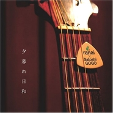

夕暮れ日和
============================

|  |  |
| :--: | :-- |
| [ 夕暮れ日和](https://emumo.xiami.com/album/1372388535) | **艺人**: [伍々慧](../index.md) **语种**: 日语 **唱片公司**: ベットタリス **发行时间**: 2007年07月25日 **专辑类别**: EP, 单曲 **专辑风格**:  **播放数**: 28332 **收藏数**: 133 **评论数**: 5  |

## 简介

その存在感のあるギターの音色がCHAGE and ASKAから絶賛された!業界関係者や著名ミュージシャンからの評価・注目が高まってきている、アコースティック・ギタリスト、伍々慧と元サムシングエルス今井と伊藤によるユニット、ranaiによる第1弾シングル。夕暮れ時に一日を振り返りながら聴きたいミディアムソング。 (C)RS

## 曲目

## 评论

|  |  |  |  |
| :-- | :-- | :-- | :-- |
|  [虾米用户](https://emumo.xiami.com/u/423203746)  2019-04-18 22:56 赞(0) 踩(0) | 
是我想听到的歌声和曲风
 |
|  [虾米用户](https://emumo.xiami.com/u/55483418)   2015-12-03 14:21 赞(0) 踩(0) | 
人好少
 |
|  [虾米用户](https://emumo.xiami.com/u/10410204) ? 2015-10-24 11:15 赞(0) 踩(0) | 
不是啦 人声是出自サムシングエルス…封面上那个ranai x satoshi gogo… 就是和ranai(不知道这是那个something else的新组合还是里面的成员名)合作而已吧...
 |
|  [虾米用户](https://emumo.xiami.com/u/21776277) 生命不息 指弹不止 2015-05-08 14:04 赞(0) 踩(0) | 
居然听到GOGO……滴人声儿？个人感觉还是没他手里那把杉田健司好听……  
 |
|  [虾米用户](https://emumo.xiami.com/u/5157153)  2014-09-10 11:45 赞(0) 踩(0) | 
是他唱的？
 |
