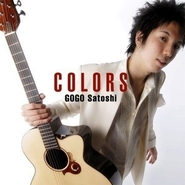

COLORS
============================

|  |  |
| :--: | :-- |
| [ COLORS](https://emumo.xiami.com/album/72339504) | **艺人**: [伍々慧](../index.md) **语种**: 日语 **唱片公司**: ダイキサウンド **发行时间**: 2006年08月22日 **专辑类别**: EP, 单曲 **专辑风格**:  **播放数**: 46321 **收藏数**: 95 **评论数**: 3  |

## 简介

前作のリリースから約1年半、プロデューサーに古川忠義氏を迎え、さらに洗練された伍々ワールドを展開、待望のニューアルバム。

## 曲目

## 评论

|  |  |  |  |
| :-- | :-- | :-- | :-- |
|  [虾米用户](https://emumo.xiami.com/u/257342495)  2018-01-18 04:04 赞(1) 踩(0) | 
伍伍慧的曲子都好好听呐
 |
|  [虾米用户](https://emumo.xiami.com/u/47843130)  2015-03-05 10:39 赞(1) 踩(0) | 
指弹爱好者
 |
|  [虾米用户](https://emumo.xiami.com/u/8272756) ♡L'Arc/ACID/... 2013-06-29 00:55 赞(1) 踩(0) | 
嚶~~伍伍慧一下更新了三張專輯，麻吉感謝上傳者
 |
