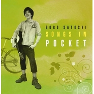

伍々慧
============================

|  |  |
| :--: | :-- |
| [ 伍々慧](https://i.xiami.com/wuwuhui) | **播放数**: 4318310 **粉丝数**: 5595 **评论数**: 116 **地区**: Japan 日本 **风格**: 器乐独奏 Solo Instrumental  |

## 档案

小档案 
中   文   名   伍伍慧 
日   文   名   伍々慧 
出生日期   1988  年 
出   生   地   日本大阪 
职        业   弹奏家、吉他手 
代   表   作   《等待的风》、《约束的海》 
艺人简介 
伍伍慧  1988  年出生于日本大阪。  12  岁时开始学习吉他。  15  岁时在モーリス・フィンガーピッキング・コンテスト  2004  最优秀奖等  4  部门获奖。  是历史上最年少的最多获奖记录者。  16  岁时伍伍慧职业出道，之后与岸部真明、古川忠义合作发行了两张专辑单曲。 
伍伍慧曾出演过大多数  TV  ·广播·杂志等媒体活动，参演了  CHAGE and ASKA  、佐藤竹善先生  (ex.SING LIKE TALKING)  、南高节等各种各样的类型的著名音乐家的演出和录音。并在  FM  爱知担任个性节目，另外其作品也作为  TV  节目后台音乐而被使用。 
演艺经历 
2005  年  2  月协助发行了岸部真明  Produce  的首张迷你专辑『  MELODY  』，之后拜师于古川忠义。 
2005  年  9  月在美国堪萨斯州温菲尔德（  Winfield  ）举行的「  National Finger Picking Contest  」出场。 
2006  年  8  月协助发行了古川忠义  Produce  的第  2  张迷你专辑『  COLORS  』。之后作为吉他手参加演艺了  CHAGE and ASKA  的专辑『  DOUBLE  』收录的   「  36  度线  -1995  夏  -album ver.  」。其颇具存在感的吉他音色得到了  CHAGE and ASKA  的最好的赞美。 
2016  年  Magic  文化巡演  -14  站   伍伍慧  &  陈亮 
プロファイル 
名        前     伍々慧 
誕   生   日   1988  年 
出   身   地   日本大阪 
職        業     奏でる家、ギターの手 
代     表     作     『待つ風』、『約束の海』 
アーテイスト紹介 
伍々慧  1988  年日本生まれ大阪。  12  歳の時にギター勉強を始めた。  15  歳の時にはシモンのユーリ・フトモモとして、  2004  年最も優秀賞など  4  部門で受賞。歴史で最も最年少の最多受賞記録者。じゅうろく歳の時伍伍慧プロデビュー、その後と岸部真明、古川忠義協力がリリースされた  2  枚のアルバムをシングル。 
伍伍慧かつて演じ大多数のテレビ・ラジオ・雑誌などのメディアイベントに出演した  ASKA CHAGEandASKA  と、佐藤竹善さん（  ex.SING LIKE TALKING  ）、南こうせつ氏ど様々なタイプの有名な音楽家の演出と録音。  FM  愛知で個性番組を担当し、また、  TV  番組として楽屋音楽として使用されているという作品も。 
芸能経歴 
2005  年  2  月，発売した岸部真明協力  Produce  のファーストミニアルバム『  MELODY  』は、後に弟子入りして、古川忠義。 
2005  年  9  月，アメリカカンザス州ウィンフィールド（  Winfield  ）で行われたナショナル「  Finger Picking Contest  」出場。 
2006  年  8  月，協力して発行された古川忠義  Produce  に第  2  枚のミニアルバム『  COLORS  』。 
ギタリストとして参加した後芸能  CHAGEandASKA  と  ASKA  のアルバム『  DOUBLE  』に収録されている「  36  度線  - 1995  夏  -album ver.  」その存在感のあるギターの音色を得た  ASKA  の  CHAGEandASKA  と絶賛。 
2016  年のマジック文化ツアー  -  じゅうよん駅伍伍慧  &  陈亮。

## 专辑

| 名称 | 语种 | 唱片公司 | 发行时间 | 专辑类别 | 专辑风格 |
| :--: | :-- | :-- | :-- | :-- | :-- |
| [ Shipmates](./albums/2102753512.md) | 日语 | Wonderful Days Music | 2017年07月01日 | 录音室专辑 |  |
| [ My Bluebird](./albums/2100230388.md) | 日语 | Wonderful Days Music | 2015年09月04日 | 录音室专辑 |  |
| [ Little Christmas Wish](./albums/2102815240.md) | 纯音乐 | Wonderful Days Music | 2013年11月08日 | EP, 单曲 |  |
| [ Bedtime Story](./albums/267996783.md) | 日语 | Wonderful Days Music | 2013年04月05日 | 录音室专辑 |  |
| [ SONGS IN POCKET](./albums/972388549.md) | 日语 | バウンディ | 2011年07月13日 | 录音室专辑 |  |
| [ 夕暮れ日和](./albums/1372388535.md) | 日语 | ベットタリス | 2007年07月25日 | EP, 单曲 |  |
| [ COLORS](./albums/72339504.md) | 日语 | ダイキサウンド | 2006年08月22日 | EP, 单曲 |  |
| [ MELODY](./albums/1372339419.md) | 日语 | Slice of Life | 2005年02月15日 | EP, 单曲 |  |

## 评论

|  |  |  |  |
| :-- | :-- | :-- | :-- |
|  [虾米用户](https://emumo.xiami.com/u/42678742)   2020-09-19 12:02 赞(0) 踩(0) | 
2020年新砖什么时候能上？
 |
|  [虾米用户](https://emumo.xiami.com/u/276944698) 不要自我设限..... 2019-07-22 15:12 赞(1) 踩(0) | 

 |
|  [虾米用户](https://emumo.xiami.com/u/42963872) 我还没想好要写什么... 2019-07-10 13:56 赞(1) 踩(0) | 
啊
 |
|  [虾米用户](https://emumo.xiami.com/u/405316312) spiders 2019-03-21 13:20 赞(0) 踩(0) | 
中！
 |
|  [虾米用户](https://emumo.xiami.com/u/45686435) 一壺飛鳧 尋山夢鶴   ... 2019-03-20 03:54 赞(0) 踩(0) | 
错过了嗷！
 |
|  [虾米用户](https://emumo.xiami.com/u/325299555) 我还没想好要写什么... 2019-03-14 15:21 赞(0) 踩(0) | 
这个温柔的大男孩
 |
|  [虾米用户](https://emumo.xiami.com/u/42894053)  2019-02-10 23:25 赞(3) 踩(0) | 
巡演2019.3.8天津   3.9北京  3.10武汉   3.12合肥    3.13南京   3.14上海   3.16杭州
 |
|  [虾米用户](https://emumo.xiami.com/u/270320259) 耶穌愛你 2018-11-15 16:30 赞(0) 踩(0) | 
會不會來廣州啊？好正！最近有聽押尾光太郎添，都好鍾意 
 |
|  [虾米用户](https://emumo.xiami.com/u/343762116)  2018-08-08 12:11 赞(1) 踩(0) | 
昨晚在重庆听了个现场，真的很棒
 |
|  [虾米用户](https://emumo.xiami.com/u/7872701) 多一份远见，就少一分刺激 2018-07-03 11:04 赞(5) 踩(0) | 
8.2 石家庄人民会堂8.5 成都电子科大8.7 重庆寅派动力8.15 深圳A88.17 厦门MAO
 |
|  [虾米用户](https://emumo.xiami.com/u/6750080)  2018-03-16 23:00 赞(0) 踩(0) | 
今年。。有现场不 
 |
|  [虾米用户](https://emumo.xiami.com/u/107926502) 你要去哪里 2018-01-27 20:28 赞(0) 踩(0) | 
只有一张皂片？？
 |
|  [虾米用户](https://emumo.xiami.com/u/45896212)  2017-12-19 00:11 赞(7) 踩(0) | 
这才是明日指弹之星 大师的接班人 曲子质量太高了
 |
| ⇒ |  [虾米用户](https://emumo.xiami.com/u/228843687) 懒惰统治人间 2019-12-13 12:53 赞(0) 踩(0) | 
赞同
 |
|  [虾米用户](https://emumo.xiami.com/u/109811188) 乱世红尘真难辨，化作白鹤... 2017-11-29 18:54 赞(0) 踩(0) | 
啊，因为学业错过了他的现场！好桑心
 |
|  [虾米用户](https://emumo.xiami.com/u/325430097)  2017-11-19 07:55 赞(1) 踩(0) | 
听伍伍慧，是一件很幸福的事
 |
|  [虾米用户](https://emumo.xiami.com/u/52555139) 来日某天再相见 2017-10-02 12:46 赞(0) 踩(0) | 
第一百 
 |
|  [虾米用户](https://emumo.xiami.com/u/56193100) ♡ 2017-09-02 15:39 赞(0) 踩(0) | 
★
 |
|  [虾米用户](https://emumo.xiami.com/u/40323832)   2017-08-02 09:20 赞(0) 踩(0) | 
新专辑多久开放？
 |
|  [虾米用户](https://emumo.xiami.com/u/346341)  2017-07-21 15:15 赞(0) 踩(0) | 
音乐还不错
 |
|  [虾米用户](https://emumo.xiami.com/u/6497033) 我还没想好要写什么... 2017-06-18 17:36 赞(0) 踩(0) | 
偶像么么哒
 |
|  [虾米用户](https://emumo.xiami.com/u/52555139) 来日某天再相见 2017-06-15 08:46 赞(27) 踩(0) | 
13武汉站 开场前在厕所碰到他 
 |
|  [虾米用户](https://emumo.xiami.com/u/2836406) 暂无签名~ 2017-06-03 18:23 赞(0) 踩(0) | 
要去听live了  
 |
|  [虾米用户](https://emumo.xiami.com/u/224870273) 下雨的时候 2017-05-31 10:24 赞(0) 踩(0) | 
安静
 |
|  [虾米用户](https://emumo.xiami.com/u/39674727) 特技是挖掘冷门乐队 2017-05-25 00:25 赞(0) 踩(0) | 
w
 |
|  [虾米用户](https://emumo.xiami.com/u/9513422) 虾米歌单迁徙到网易☁️:... 2017-04-10 02:56 赞(0) 踩(0) | 
❤️
 |
|  [虾米用户](https://emumo.xiami.com/u/4400366) 再也不见 2017-01-07 17:12 赞(0) 踩(0) | 
囍
 |
|  [虾米用户](https://emumo.xiami.com/u/22610163) 没时间听抓！抓狂！ 2016-11-29 07:58 赞(1) 踩(0) | 
天哪相见恨晚！
 |
|  [虾米用户](https://emumo.xiami.com/u/54375017) 我还没想好要写什么... 2016-11-15 17:54 赞(1) 踩(0) | 
一听就知道是日本的 简直好听到想哭
 |
|  [虾米用户](https://emumo.xiami.com/u/3038663) 无言的人最深情，而幸福的... 2016-11-06 15:06 赞(3) 踩(0) | 
日本男人的吉他真是棒。。。
 |
|  [虾米用户](https://emumo.xiami.com/u/6066908) 光芒与希望 *JazzH... 2016-07-26 11:11 赞(0) 踩(0) | 
自然的清新风味！
 |
|  [虾米用户](https://emumo.xiami.com/u/144625104) 我还没想好要写什么... 2016-07-13 14:22 赞(1) 踩(0) | 
好听极了（拒绝抄袭）
 |
|  [虾米用户](https://emumo.xiami.com/u/52614594)  2016-07-06 16:43 赞(0) 踩(0) | 
的都有
 |
|  [虾米用户](https://emumo.xiami.com/u/52614594)  2016-07-06 16:43 赞(0) 踩(0) | 
的人多吗 
 |
|  [虾米用户](https://emumo.xiami.com/u/32981188)  2016-05-01 19:14 赞(2) 踩(0) | 
16年6月芜湖
 |
|  [虾米用户](https://emumo.xiami.com/u/121060378)  2016-03-16 23:28 赞(1) 踩(0) | 
一场演奏会，一个小粉丝
 |
|  [虾米用户](https://emumo.xiami.com/u/6717745) 不 要 告 别 2016-01-08 19:33 赞(0) 踩(0) | 
看头像以为是萧敬腾··
 |
| ⇒ |  [虾米用户](https://emumo.xiami.com/u/14835159) Jazz Voicing 2016-06-26 12:07 赞(0) 踩(0) | 
哈哈
 |
|  [虾米用户](https://emumo.xiami.com/u/5511496) ◜◡◝ 2015-12-09 10:07 赞(0) 踩(0) | 
啊啊啊啊好喜欢！
 |
|  [虾米用户](https://emumo.xiami.com/u/6968991) 生活在別處～ 2015-11-25 13:07 赞(1) 踩(0) | 
希望他能來西安⋯⋯我從大學等到這會兒了⋯⋯不過上次押尾和淘神來了⋯⋯
 |
| ⇒ |  [虾米用户](https://emumo.xiami.com/u/11994589)  2016-01-03 17:31 赞(0) 踩(0) | 
16年上班年有 西安
 |
|  [虾米用户](https://emumo.xiami.com/u/83473590) 大概今生有些事是提早都不... 2015-11-15 23:57 赞(0) 踩(0) | 
和上一张专辑Bedtime Story一样安静。可能是因为当了爸爸的缘故，每一首曲子都很用心很温暖。真想快点全部学会。
 |
|  [虾米用户](https://emumo.xiami.com/u/42394674)  2015-11-10 14:28 赞(0) 踩(0) | 
希望慢慢学会他的曲子
 |
|  [虾米用户](https://emumo.xiami.com/u/2165833)   2015-10-21 15:54 赞(0) 踩(0) | 
很舒缓 很随心
 |
|  [虾米用户](https://emumo.xiami.com/u/9327494) http://www.x... 2015-10-21 12:08 赞(1) 踩(0) | 
love
 |
|  [虾米用户](https://emumo.xiami.com/u/4158050) 晚上 2015-09-16 21:42 赞(0) 踩(0) | 
清新吉他獨奏不收藏嗎
 |
|  [虾米用户](https://emumo.xiami.com/u/12221090) 逍遥于天地而心意自得 2015-09-11 13:59 赞(0) 踩(0) | 
耳朵与心都献给了你，好好沉醉吧，我的身体
 |
|  [虾米用户](https://emumo.xiami.com/u/8163430) 很蓝很蓝的家伙 2015-09-05 09:30 赞(0) 踩(0) | 
~
 |
|  [虾米用户](https://emumo.xiami.com/u/43348306) 暂无签名~ 2015-08-30 21:20 赞(1) 踩(0) | 
等待的风，等待的人
 |
|  [虾米用户](https://emumo.xiami.com/u/4747915) 跟我听歌有糖吃 2015-07-08 07:57 赞(0) 踩(0) | 
好好听！和押尾和DEPAPEPE并称三大吉他杰 XXD
 |
|  [虾米用户](https://emumo.xiami.com/u/6231745)  2015-07-05 16:51 赞(0) 踩(0) | 
帅气
 |
|  [虾米用户](https://emumo.xiami.com/u/2526606)  2015-06-13 16:11 赞(0) 踩(0) | 
~~
 |
|  [虾米用户](https://emumo.xiami.com/u/48026959)  2015-06-12 22:34 赞(0) 踩(0) | 
吉他
 |
|  [虾米用户](https://emumo.xiami.com/u/43735991) jazz，classic... 2015-06-03 22:58 赞(0) 踩(0) | 
坐等新专i got rhythm！
 |
| ⇒ |  [虾米用户](https://emumo.xiami.com/u/32521918) 留给自己的所有美好，很久... 2015-06-06 19:57 赞(0) 踩(0) | 
怎么把你也炸出来   
 |
|  [虾米用户](https://emumo.xiami.com/u/3798043)  2015-06-03 12:30 赞(0) 踩(0) | 
感觉比之前更好..希望Tears会在新专辑中收录.
 |
|  [虾米用户](https://emumo.xiami.com/u/12166822) 微博，公众号同名。主要听... 2015-06-02 23:17 赞(0) 踩(0) | 
来中国巡演炸出这么多人
 |
|  [虾米用户](https://emumo.xiami.com/u/32521918) 留给自己的所有美好，很久... 2015-05-30 19:58 赞(17) 踩(0) | 
对于昨日现场表演，我只想说一个词，无与伦比！干净的琴声，高端音响还有梦中的杉田 第一次听秋叶现场才知道其中一段鼓声沙沙的间奏是那种手法演奏出来的。所有曲目演奏完了现场气氛太高还是被要求返场了 不过连续的巡演伍伍身体可能不太适应，有点小感冒，他还说中国的食物真的到处都很辣呢 
 |
| ⇒ |  [虾米用户](https://emumo.xiami.com/u/218674)  2015-06-04 00:10 赞(0) 踩(0) | 
什么手法……我还是不知道
 |
| ⇒ |  [虾米用户](https://emumo.xiami.com/u/43735991) jazz，classic... 2015-06-05 23:57 赞(0) 踩(0) | 
<q><b>Moco.G说：</b></q>
 |
|  [虾米用户](https://emumo.xiami.com/u/32521918) 留给自己的所有美好，很久... 2015-05-30 19:54 赞(0) 踩(0) | 
昨晚听现场被震撼到了，当然伍伍还是和照片里面一样高大帅气，合照真的萌萌的身高差呢 
 |
|  [虾米用户](https://emumo.xiami.com/u/50343522)  2015-05-29 18:35 赞(0) 踩(0) | 
风骚啊！！！
 |
|  [虾米用户](https://emumo.xiami.com/u/50406877)  2015-05-29 08:47 赞(0) 踩(0) | 
新生代 指弹吉他音乐人 技术超群
 |
|  [虾米用户](https://emumo.xiami.com/u/44277082)  2015-05-28 10:18 赞(0) 踩(0) | 
哇，今晚见！
 |
|  [虾米用户](https://emumo.xiami.com/u/20286400)  2015-05-24 20:39 赞(1) 踩(0) | 
如果这些指弹艺术家能来深圳就好}╮(╯_╰)╭
 |
|  [虾米用户](https://emumo.xiami.com/u/5006797) 你说啥都是对的 2015-05-21 20:20 赞(0) 踩(0) | 
求大神po个新砖啊！！！
 |
|  [虾米用户](https://emumo.xiami.com/u/5739280) 虾米脑残粉，虾米一生黑 2015-05-21 14:39 赞(1) 踩(0) | 
今晚，北大见
 |
| ⇒ |  [虾米用户](https://emumo.xiami.com/u/48641576) 我听到你。 2015-05-22 15:02 赞(0) 踩(0) | 
昨天我也在
 |
| ⇒ |  [虾米用户](https://emumo.xiami.com/u/5739280) 虾米脑残粉，虾米一生黑 2015-05-23 09:42 赞(0) 踩(0) | 
<q><b>小气有名说：</b></q>
 |
|  [虾米用户](https://emumo.xiami.com/u/37599977) 我还没想好要写什么... 2015-05-19 09:54 赞(1) 踩(0) | 
如果梦里没有假话，那么对于我最好的安眠药剂，是你带着温度的怀抱。_骆骆
 |
|  [虾米用户](https://emumo.xiami.com/u/16111134) 爱情无非自顾自的执着 2015-05-17 01:23 赞(1) 踩(0) | 
轻轻一首《Distance》，既有徘徊悱恻后的明媚果决，又有等闲不起波澜的倔强自持
 |
|  [虾米用户](https://emumo.xiami.com/u/43438437)  2015-04-30 20:29 赞(0) 踩(0) | 
似乎还是岸部的曲子更有深度
 |
| ⇒ |  [虾米用户](https://emumo.xiami.com/u/279900264)  2017-05-15 20:40 赞(0) 踩(0) | 
伍伍就是岸部的学生
 |
|  [虾米用户](https://emumo.xiami.com/u/16030415)  2015-04-15 23:26 赞(0) 踩(0) | 
曲风赞~\(≧▽≦)/~
 |
|  [虾米用户](https://emumo.xiami.com/u/3118604)  2015-04-06 10:33 赞(0) 踩(0) | 

 |
|  [虾米用户](https://emumo.xiami.com/u/3079612)  2015-04-03 15:07 赞(0) 踩(0) | 
吉他
 |
|  [虾米用户](https://emumo.xiami.com/u/7651584)  2015-03-12 10:14 赞(0) 踩(0) | 
很好听
 |
|  [虾米用户](https://emumo.xiami.com/u/12876004) ` 2015-02-15 12:55 赞(0) 踩(0) | 
0.0
 |
|  [虾米用户](https://emumo.xiami.com/u/44368575)   2015-02-10 15:46 赞(0) 踩(0) | 
。
 |
|  [虾米用户](https://emumo.xiami.com/u/33814712)  2015-01-30 14:22 赞(0) 踩(0) | 
除了虾米有比较全的指弹曲外，还有没有其他的软件可以听指弹啊？外国的指弹家都用什么软件啊？
 |
| ⇒ |  [虾米用户](https://emumo.xiami.com/u/10632399) 我还没想好要写什么... 2015-11-18 00:01 赞(0) 踩(0) | 
都是花钱买专辑，也只有中国能不花钱…
 |
|  [虾米用户](https://emumo.xiami.com/u/9604319) Dreamer 2015-01-19 13:48 赞(0) 踩(0) | 
有灵气有活力
 |
|  [虾米用户](https://emumo.xiami.com/u/12862689)  2014-11-12 11:13 赞(0) 踩(0) | 
好听
 |
|  [虾米用户](https://emumo.xiami.com/u/33397048) 暂无签名~ 2014-11-01 21:18 赞(0) 踩(0) | 
有新专辑了，
 |
|  [虾米用户](https://emumo.xiami.com/u/12166822) 微博，公众号同名。主要听... 2014-11-01 18:15 赞(0) 踩(0) | 
新专请上
 |
|  [虾米用户](https://emumo.xiami.com/u/2795876) 我还没想好要写什么... 2014-10-30 18:13 赞(0) 踩(0) | 
好听。
 |
|  [虾米用户](https://emumo.xiami.com/u/32587305)  2014-09-22 18:16 赞(0) 踩(0) | 
希望明年还能来中国，最好有巡演
 |
| ⇒ |  [虾米用户](https://emumo.xiami.com/u/8564667)  2015-05-18 19:37 赞(0) 踩(0) | 
长沙和南昌真的有巡演哦
 |
|  [虾米用户](https://emumo.xiami.com/u/15477519) 爱  是生命的和弦，而不... 2014-09-01 23:20 赞(0) 踩(0) | 
❤
 |
|  [虾米用户](https://emumo.xiami.com/u/8126117) 心如止水 2014-09-01 18:16 赞(0) 踩(0) | 
很有味道
 |
|  [虾米用户](https://emumo.xiami.com/u/29365101)  2014-08-01 09:42 赞(0) 踩(0) | 
来北大弹的时候去看了，整个空间都安静温暖，好像樱花飘落
 |
|  [虾米用户](https://emumo.xiami.com/u/12166822) 微博，公众号同名。主要听... 2014-07-17 19:57 赞(0) 踩(0) | 
来中国穿个大短裤上台。。。
 |
|  [虾米用户](https://emumo.xiami.com/u/1271812) WX:Likejazzm... 2014-07-10 22:13 赞(0) 踩(0) | 
36
 |
|  [虾米用户](https://emumo.xiami.com/u/7479862)  2014-06-24 05:51 赞(0) 踩(0) | 
这名字好萌~~~
 |
|  [虾米用户](https://emumo.xiami.com/u/10063642) ω 2014-06-19 23:37 赞(0) 踩(0) | 
_(:3」∠)_
 |
|  [虾米用户](https://emumo.xiami.com/u/9318738)  2014-04-30 10:00 赞(0) 踩(0) | 
又找到真爱！
 |
|  [虾米用户](https://emumo.xiami.com/u/1271812) WX:Likejazzm... 2014-01-22 17:33 赞(0) 踩(0) | 
音痴到此一游
 |
|  [虾米用户](https://emumo.xiami.com/u/230696)  2013-12-11 00:26 赞(0) 踩(0) | 
嘤嘤嘤 终于收了 =3=
 |
|  [虾米用户](https://emumo.xiami.com/u/1555162)  2013-12-04 13:23 赞(0) 踩(0) | 
大爱
 |
|  [虾米用户](https://emumo.xiami.com/u/1226865) 爱音乐的人原本就该活简单 2013-11-19 06:54 赞(0) 踩(0) | 
世界名师
 |
|  [虾米用户](https://emumo.xiami.com/u/2092701)  2013-07-28 20:03 赞(0) 踩(0) | 
音晨明曦 评价并分享专辑 ：指弹吉他
 |
|  [虾米用户](https://emumo.xiami.com/u/8953266)  2013-07-28 12:37 赞(0) 踩(0) | 
很清新，很甜的曲风。听着很舒服很舒服。好喜欢啊！啊啊啊啊
 |
|  [虾米用户](https://emumo.xiami.com/u/8953266)  2013-07-28 12:20 赞(0) 踩(0) | 
很清新的曲风，很干净，听着很舒服。
 |
|  [虾米用户](https://emumo.xiami.com/u/3326646)  2013-07-11 20:45 赞(0) 踩(0) | 
有押尾光太郎的风范
 |
| ⇒ |  [虾米用户](https://emumo.xiami.com/u/20856879)  2014-04-30 17:14 赞(0) 踩(0) | 
不是岸部大叔么？
 |
|  [虾米用户](https://emumo.xiami.com/u/2283906) 早起的虫儿有鸟吃 2013-07-08 18:55 赞(0) 踩(0) | 
就两个字                  清新！
 |
|  [虾米用户](https://emumo.xiami.com/u/2689579)  2013-06-28 21:48 赞(38) 踩(0) | 
哪个大神发布的啊！！！啊啊啊啊啊！！！我爱你啊！！！
 |
| ⇒ |  [虾米用户](https://emumo.xiami.com/u/45037974) 恋旧的人就像个拾荒者。 2017-08-16 14:19 赞(0) 踩(0) | 
已发布
 |
| ⇒ |  [虾米用户](https://emumo.xiami.com/u/2689579)  2017-08-16 17:07 赞(0) 踩(0) | 
<q><b>李赞说：</b></q>
 |
|  [虾米用户](https://emumo.xiami.com/u/12766443)  2013-06-22 13:43 赞(0) 踩(0) | 
清新
 |
|  [虾米用户](https://emumo.xiami.com/u/607032)  2013-06-15 21:48 赞(0) 踩(0) | 
这个是吉他界未来的大师！
 |
|  [虾米用户](https://emumo.xiami.com/u/5052803)  2013-06-01 23:54 赞(1) 踩(0) | 
听DISTANCE已经不知道多少遍了，仍然每次都被感动。
 |
|  [虾米用户](https://emumo.xiami.com/u/2689579)  2013-05-17 11:45 赞(1) 踩(0) | 
上传的大侠啊！！！我爱你啊！！！
 |
|  [虾米用户](https://emumo.xiami.com/u/7835007)  2013-04-29 00:38 赞(0) 踩(0) | 
没人传他的专辑么。。都出了几张了。。
 |
| ⇒ |  [虾米用户](https://emumo.xiami.com/u/11850527) 呵呵 2013-05-17 16:53 赞(0) 踩(0) | 
我想传来着，可是虾米审核没通过
 |
|  [虾米用户](https://emumo.xiami.com/u/3140575)  2013-01-12 17:27 赞(1) 踩(0) | 
那位大侠上传啊、、、、
 |
