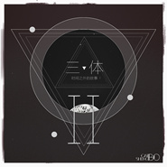

三体：时间之外的故事 II
============================

|  |  |
| :--: | :-- |
| [ 三体：时间之外的故事 II](https://emumo.xiami.com/album/2102815148) | **艺人**: [薄彩生](../index.md) **语种**: 国语 **唱片公司**: 独立发行 **发行时间**: 2017年08月17日 **专辑类别**: 录音室专辑 **专辑风格**: 原声 Soundtrack, 电影原声 Film Score, 管弦乐流行 Orchestral Pop **播放数**: 45562 **收藏数**: 221 **评论数**: 12  |

## 简介

三体：时间之外的故事 II 
 

Comparing to the first album, which depicted the grandness and 4 major scenes of the three-body universe, this sequel aims to dig into the &amp;human&amp; part of the story. With a more subtle touch of emotions and flows, these 5 tracks take you to a rather personal experience.

## 曲目

## 评论

|  |  |  |
| :-- | :-- | :-- |
|  [虾米用户](https://emumo.xiami.com/u/106317518) 寻找些想留住的过往 2019-07-07 00:04 赞(0) 踩(0) | 
意境很到位，铺垫也恰到好处，女声渲染出的史诗感令人动容。
 |
|  [虾米用户](https://emumo.xiami.com/u/79966098) 想到一生中后悔的事 2019-04-07 20:43 赞(0) 踩(0) | 
天高地阔，灵魂空荡
 |
|  [虾米用户](https://emumo.xiami.com/u/339191478)   2018-10-04 07:29 赞(0) 踩(0) | 
❤
 |
|  [虾米用户](https://emumo.xiami.com/u/7292098) 我們不斷相遇 在未來里 2018-10-03 13:16 赞(1) 踩(0) | 
留
 |
|  [虾米用户](https://emumo.xiami.com/u/759386) 终与俗别，一尘不染 2018-10-02 21:03 赞(0) 踩(0) | 
以国内的电影水准和氛围是拍不了三体的，不过音乐不错，比王利夫的三体音乐要好
 |
|  [虾米用户](https://emumo.xiami.com/u/91107230) 此生唯一自传 如同诗一般 2018-04-02 23:21 赞(0) 踩(0) | 
不走心
 |
|  [虾米用户](https://emumo.xiami.com/u/20177386) 感谢一切美好的遇见❤️ 2018-03-28 00:48 赞(1) 踩(0) | 

 |
|  [虾米用户](https://emumo.xiami.com/u/271948506) Reid. said. 2017-12-31 12:57 赞(1) 踩(0) | 
相比第一张专辑，情感更加丰沛，偏向感性。
 |
|  [虾米用户](https://emumo.xiami.com/u/5851736) 我们来聊章北海！ 2017-09-07 03:29 赞(0) 踩(0) | 
听听
 |
|  [虾米用户](https://emumo.xiami.com/u/28239027)  2017-09-03 19:48 赞(0) 踩(0) | 
电影黄了黄，配乐很满意 
 |
|  [虾米用户](https://emumo.xiami.com/u/45907678) 别了虾米 2017-08-20 20:28 赞(0) 踩(0) | 
好
 |
|  [虾米用户](https://emumo.xiami.com/u/299765597)  2017-08-17 10:35 赞(0) 踩(0) | 
赞美薄彩生大大~虽然自己的拙作和薄大的专辑有着不同的曲风结构，但致敬三体的本心不变~
 |
