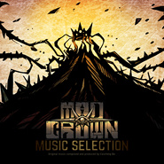

Mad Crown - Music Selection《疯狂之冠》音乐选辑
============================

|  |  |
| :--: | :-- |
| [ Mad Crown - Music Selection《疯狂之冠》音乐选辑](https://emumo.xiami.com/album/2103891373) | **艺人**: [薄彩生](../index.md) **语种**: 国语 **唱片公司**: 独立发行 **发行时间**: 2018年09月20日 **专辑类别**: 录音室专辑 **专辑风格**: 后摇 Post-Rock, 氛围科技舞曲 Ambient Techno, 原声 Soundtrack **播放数**: 486 **收藏数**: 9 **评论数**: 2  |

## 简介

STEAM，iOS，安卓平台游戏《疯狂之冠》游戏配乐选集。
 

 
 

人类用核武将自己送上了毁灭之路。与此同时，沉睡在地球深处的庞然巨物苏醒，与异星来客进行了撼天动地的搏杀。人类所闻所见，如同古书上所记载的“世界末日”。  
随着巨神之间战斗的终结，仅存的幸存者们，开始在面目全非的土地上重建文明。  
而百年后的现在，疯狂之冠的传说传遍了天下，似乎预示着新事件的发生。

## 曲目

## 评论

|  |  |  |
| :-- | :-- | :-- |
|  [虾米用户](https://emumo.xiami.com/u/205708965)  2019-01-10 19:09 赞(0) 踩(0) | 
薄老师还有多久啊 (ノ˃̩̩Δ˂̩̩ )ノ
 |
|  [虾米用户](https://emumo.xiami.com/u/339191478)   2018-10-04 07:26 赞(0) 踩(0) | 
❤
 |
