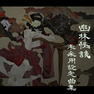
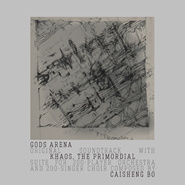
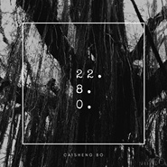
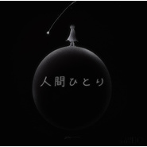
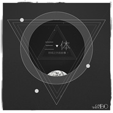
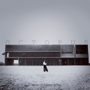
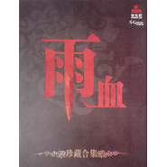
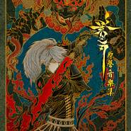
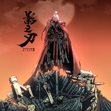

薄彩生
============================

|  |  |
| :--: | :-- |
| [ 薄彩生](https://i.xiami.com/bocaisheng) | **播放数**: 2593363 **粉丝数**: 2231 **评论数**: 104 **地区**: China 中国大陆 **风格**: 柔顺爵士 Smooth Jazz, 原声 Soundtrack, 电影原声 Film Score, 游戏配乐 Video Game Music, 管弦乐 Orchestral  |

## 档案

游戏、动画、影视配乐人，指挥。 
毕业于美国弗吉尼亚大学，旅美、日八年，现居北京。师从美国达拉斯交响乐团指挥Kate Tamarkin教授与普林斯顿大学普利策奖提名作曲家Judith Shatin教授。代表作有《大王不高兴》、《影之刃》系列游戏配乐等。

## 专辑

| 名称 | 语种 | 唱片公司 | 发行时间 | 专辑类别 | 专辑风格 |
| :--: | :-- | :-- | :-- | :-- | :-- |
| [ 百妖谱《百妖谱》片尾曲](./albums/2108378131.md) | 国语 | 独立发行 | 2020年04月25日 | EP, 单曲 | 古风 GuFeng Music, 原声 Soundtrack |
| [ 大王不高兴 游戏原声专辑](./albums/2105708016.md) | 纯音乐 | 独立发行 | 2020年01月09日 | 录音室专辑 | 游戏配乐 Video Game Music, 原声 Soundtrack, 拉丁流行 Latin Pop |
| [ 破浪四海鲸骑动画第2季 片头曲](./albums/2105370841.md) | 国语 |  | 2019年10月24日 | EP, 单曲 | 流行摇滚 Pop Rock |
| [ NEVERMORE Original Soundtrack](./albums/2104944595.md) | 其他 |  | 2019年06月14日 | 录音室专辑 | 游戏配乐 Video Game Music, 原声 Soundtrack |
| [ 想去看蓝天 原声专辑](./albums/2104522641.md) | 国语 |  | 2019年04月30日 | 录音室专辑 | 原声 Soundtrack, 轻音乐 Easy Listening |
| [ Unruly Heroes Original Soundtrack非常英雄 原声配乐](./albums/2104562385.md) | 国语 |  | 2019年02月03日 | 原声带, 影视音乐 | 中国民乐 Chinese Folk Music, 原声 Soundtrack |
| [ 幽林怪谈 · 未采用设定曲集](./albums/2104396971.md) | 其他 |  | 2018年12月20日 | 原声带, 影视音乐 | 游戏配乐 Video Game Music |
| [ Gods Arena Original Soundtrack《诸神之争》原声配乐](./albums/2103891650.md) | 其他 | 独立发行 | 2018年09月30日 | 录音室专辑 | 原声 Soundtrack, 管弦乐 Orchestral, 现代古典 Modern Classical |
| [ Mad Crown - Music Selection《疯狂之冠》音乐选辑](./albums/2103891373.md) | 国语 | 独立发行 | 2018年09月20日 | 录音室专辑 | 后摇 Post-Rock, 氛围科技舞曲 Ambient Techno, 原声 Soundtrack |
| [ Sound Forge Open Day 2018Works for short films and commercials](./albums/2103651021.md) | 国语 | 独立发行 | 2018年03月29日 | 原声带, 影视音乐 | 原声 Soundtrack |
| [ Sleepless Songs 2A tribute to Henri de Régnier.](./albums/2102963556.md) | 国语 | 独立发行 | 2017年11月29日 | 录音室专辑 | 实验音乐 Experimental, 器乐独奏 Solo Instrumental, 新世纪音乐 New Age |
| [ 三体：时间之外的故事 II](./albums/2102815148.md) | 国语 | 独立发行 | 2017年08月17日 | 录音室专辑 | 原声 Soundtrack, 电影原声 Film Score, 管弦乐流行 Orchestral Pop |
| [ 22. 8. 0.](./albums/2102815147.md) | 国语 | 独立发行 | 2017年08月16日 | 录音室专辑 | 器乐独奏 Solo Instrumental, 自由即兴 Free Improvisation |
| [ 人間ひとり chapter 2人间一人 chapter 2](./albums/2102756474.md) | 国语 | 独立发行 | 2017年05月27日 | 录音室专辑 | 爵士 Jazz, 轻音乐 Easy Listening, 实验音乐 Experimental |
| [ 影之刃2大漠篇音乐追加集](./albums/2102756465.md) | 国语 | 独立发行 | 2017年04月19日 | 原声带, 影视音乐 | 原声 Soundtrack, 游戏配乐 Video Game Music |
| [ 影之刃: 2 原声音乐辑Phantom Blade: 2 Original Soundtrack](./albums/2100362441.md) | 国语 | 发现音乐 | 2016年11月17日 | 原声带, 影视音乐 |  |
| [ and so on.](./albums/2102413902.md) | 国语 |  | 2016年10月22日 | 录音室专辑 |  |
| [ 人間ひとり人间一人](./albums/2100353004.md) | 国语 | 独立发行 | 2016年06月07日 | 原声带, 影视音乐 | 器乐独奏 Solo Instrumental, 电影原声 Film Score, 轻音乐 Easy Listening |
| [ 三体：时间之外的故事](./albums/2100344564.md) | 其他 | 独立发行 | 2016年05月25日 | 原声带, 影视音乐 | 原声 Soundtrack, 电影原声 Film Score, 同人音乐 DouJin |
| [ Sleepless songs](./albums/2100331054.md) | 其他 | 独立发行 | 2016年05月06日 | 合集, 杂锦 | 柔顺爵士 Smooth Jazz, 器乐独奏 Solo Instrumental, 轻音乐 Easy Listening |
| [ Moonrise](./albums/2100312666.md) | 国语 | 独立发行 | 2016年04月06日 | EP, 单曲 | 柔顺爵士 Smooth Jazz, 轻音乐 Easy Listening |
| [ 章鱼 原声专辑](./albums/2100312648.md) | 国语 | 独立发行 | 2016年03月18日 | 原声带, 影视音乐 | 原声 Soundtrack, 电影原声 Film Score |
| [ Night Walk夜行](./albums/2100312626.md) | 国语 | 独立发行 | 2015年09月29日 | 原声带, 影视音乐 | 氛围音乐 Ambient, 原声 Soundtrack, 电影原声 Film Score |
| [ Sands2011 - 2014 未公开曲集](./albums/2100312542.md) | 国语 | 独立发行 | 2015年08月31日 | 原声带, 影视音乐 | 原声 Soundtrack, 电影原声 Film Score, 交响乐 Symphonic Music |
| [ 雨血 系列原声音乐集](./albums/573262.md) | 国语 | 灵游坊 | 2013年01月15日 | 原声带, 影视音乐 |  |
| [ 雨血前传：蜃楼](./albums/1761088572.md) | 国语 | Soulframe | 2013年01月15日 | 原声带, 影视音乐 |  |
| [ 影之刃原声音乐辑](./albums/2100312616.md) | 国语 | 独立发行 | 2013年01月15日 | 原声带, 影视音乐 | 原声 Soundtrack, 游戏配乐 Video Game Music |
| [ 影之刃3 预告EP](./albums/2104456953.md) | 国语 |  | 不详 | EP, 单曲 | 古风 GuFeng Music, 原声 Soundtrack |

## 评论

|  |  |  |  |
| :-- | :-- | :-- | :-- |
|  [虾米用户](https://emumo.xiami.com/u/42426022) 當一個男人步入中年，他就... 2020-11-18 00:59 赞(0) 踩(0) | 
难忘
 |
|  [虾米用户](https://emumo.xiami.com/u/73740960)  2020-09-14 21:15 赞(0) 踩(0) | 

 |
|  [虾米用户](https://emumo.xiami.com/u/121702052) 超脱 2020-09-06 06:48 赞(0) 踩(0) | 

 |
|  [虾米用户](https://emumo.xiami.com/u/253519278)  2020-09-02 15:20 赞(0) 踩(0) | 
能抚平内心焦虑感觉的音乐，很喜欢
 |
|  [虾米用户](https://emumo.xiami.com/u/65854688) Cheers 2020-08-18 22:53 赞(0) 踩(0) | 

 |
|  [虾米用户](https://emumo.xiami.com/u/443697633) 是长夜暂停了时间. 2020-06-30 22:51 赞(0) 踩(0) | 
大大太有才华了
 |
|  [虾米用户](https://emumo.xiami.com/u/228843687) 懒惰统治人间 2020-05-23 09:42 赞(0) 踩(0) | 

 |
|  [虾米用户](https://emumo.xiami.com/u/404005278) 音乐是我的生命 2020-05-05 14:51 赞(1) 踩(0) | 
我想了解你这首曲子的创作思想 
 |
|  [虾米用户](https://emumo.xiami.com/u/253100822) 要做哥哥们的御用舞者 E... 2020-04-01 23:48 赞(1) 踩(0) | 
取关谁都不会取关你
 |
|  [虾米用户](https://emumo.xiami.com/u/400715332) 留白 2020-03-24 15:40 赞(0) 踩(0) | 
&amp;mdash;&amp;mdash;
 |
|  [虾米用户](https://emumo.xiami.com/u/73740960)  2020-03-12 10:12 赞(2) 踩(0) | 
发现宝藏
 |
|  [虾米用户](https://emumo.xiami.com/u/276944698) 不要自我设限..... 2020-01-27 13:33 赞(0) 踩(0) | 

 |
|  [虾米用户](https://emumo.xiami.com/u/202924441) 如果可以我愿陪你到永远 2020-01-11 12:42 赞(1) 踩(0) | 
我感觉在庆余年里听到了大神的手笔
 |
|  [虾米用户](https://emumo.xiami.com/u/7949441) 我还没想好要写什么... 2019-11-19 18:33 赞(2) 踩(0) | 
好棒啊...
 |
|  [虾米用户](https://emumo.xiami.com/u/5819278) 面朝大海 春暖花开 2019-11-15 16:29 赞(1) 踩(0) | 
多元的作曲家
 |
|  [虾米用户](https://emumo.xiami.com/u/253100822) 要做哥哥们的御用舞者 E... 2019-09-19 23:32 赞(1) 踩(0) | 
我爱你
 |
|  [虾米用户](https://emumo.xiami.com/u/403653757) 爱老王。 2019-09-10 00:28 赞(0) 踩(0) | 
爱了
 |
|  [虾米用户](https://emumo.xiami.com/u/378725856)  2019-07-21 15:44 赞(0) 踩(0) | 

 |
|  [虾米用户](https://emumo.xiami.com/u/321453777)  2019-07-11 15:15 赞(1) 踩(0) | 
感觉所以的音乐都倾注了自己的情感伴随着钢琴键上的纷飞我也沉醉在其中那音符似是有灵魂深深吸引着我而我不可自拔无法忘记
 |
| ⇒ |  [虾米用户](https://emumo.xiami.com/u/321453777)  2019-07-11 15:16 赞(0) 踩(0) | 
不奢望作者大大能够看见，只求遇见同道中人
 |
|  [虾米用户](https://emumo.xiami.com/u/2165528)   2019-07-10 14:22 赞(1) 踩(0) | 

 |
|  [虾米用户](https://emumo.xiami.com/u/276944698) 不要自我设限..... 2019-07-05 09:21 赞(1) 踩(0) | 

 |
|  [虾米用户](https://emumo.xiami.com/u/12221090) 逍遥于天地而心意自得 2019-05-29 14:45 赞(0) 踩(0) | 
赞
 |
|  [虾米用户](https://emumo.xiami.com/u/59367130) 天地不仁 以万物为刍狗 2019-05-01 12:16 赞(2) 踩(0) | 
超棒
 |
|  [虾米用户](https://emumo.xiami.com/u/324879742)   2019-04-22 02:45 赞(0) 踩(0) | 
.
 |
|  [虾米用户](https://emumo.xiami.com/u/419909374) 嗯 2019-04-20 21:16 赞(0) 踩(0) | 
路过生活   路过美梦   很多年过    花颊空空   唯心中珍藏
 |
|  [虾米用户](https://emumo.xiami.com/u/206703958) Ins:lulululu... 2019-04-02 19:44 赞(1) 踩(0) | 

 |
|  [虾米用户](https://emumo.xiami.com/u/3583995) 一個人的戰爭 2019-03-31 20:09 赞(0) 踩(0) | 
.
 |
|  [虾米用户](https://emumo.xiami.com/u/11446884) New York MoM... 2019-03-29 03:51 赞(4) 踩(0) | 
很想听听关于你的11:47pm的故事……
 |
|  [虾米用户](https://emumo.xiami.com/u/52056952) 人生即是到來、相遇、陪伴... 2019-01-09 13:34 赞(0) 踩(0) | 

 |
|  [虾米用户](https://emumo.xiami.com/u/89469834) 一直没想好些什么… 2018-12-12 22:03 赞(10) 踩(0) | 
以后大家富裕，可以投资电影，一定要用老薄的音乐 
 |
|  [虾米用户](https://emumo.xiami.com/u/297025227) 暂无介绍 2018-12-10 08:16 赞(0) 踩(0) | 
为什么有这两个时间点呢
 |
|  [虾米用户](https://emumo.xiami.com/u/3683833) 一宅_Ez. 2018-12-04 11:13 赞(0) 踩(0) | 
机核报道一下~
 |
|  [虾米用户](https://emumo.xiami.com/u/78519234) 我还没想好要写什么... 2018-11-18 19:05 赞(0) 踩(0) | 

 |
|  [虾米用户](https://emumo.xiami.com/u/5487539) % 2018-11-02 23:51 赞(0) 踩(0) | 
膜拜大神 
 |
|  [虾米用户](https://emumo.xiami.com/u/339191478)   2018-10-04 07:25 赞(2) 踩(0) | 
❤
 |
|  [虾米用户](https://emumo.xiami.com/u/336638438) 我还没想好要写什么... 2018-08-21 22:51 赞(1) 踩(0) | 
好有才，爵士乐写的很好
 |
|  [虾米用户](https://emumo.xiami.com/u/136748890) 云村带我看到世界，而虾米... 2018-07-06 10:22 赞(2) 踩(0) | 
听上去真的比pav和鲸鱼的音乐还要有惊喜～
 |
|  [虾米用户](https://emumo.xiami.com/u/8982553) 心有猛虎细嗅蔷薇 2018-07-01 01:46 赞(1) 踩(0) | 
机核最近一期电台节目聊游戏配乐才知道了这位大大，前来留个名！期待以后更多的好作品！
 |
|  [虾米用户](https://emumo.xiami.com/u/351494081)  2018-06-08 20:52 赞(0) 踩(0) | 
影之刃&amp;hellip;&amp;hellip;
 |
|  [虾米用户](https://emumo.xiami.com/u/49365982) 当断则断 2018-06-05 14:28 赞(0) 踩(0) | 
燃!
 |
|  [虾米用户](https://emumo.xiami.com/u/32108480) 要开心٩( *´﹀`* ... 2018-05-26 02:23 赞(0) 踩(0) | 
点亮了第800颗小心心 您真好听~
 |
|  [虾米用户](https://emumo.xiami.com/u/187423113) 我渺小如蜉蝣，却也是宇宙... 2018-04-01 22:43 赞(0) 踩(0) | 

 |
|  [虾米用户](https://emumo.xiami.com/u/187423113) 我渺小如蜉蝣，却也是宇宙... 2018-03-29 22:13 赞(0) 踩(0) | 

 |
|  [虾米用户](https://emumo.xiami.com/u/201990840)  2018-03-09 21:20 赞(1) 踩(0) | 
❤
 |
|  [虾米用户](https://emumo.xiami.com/u/4043410) 唯夜色浪漫 2018-02-27 17:55 赞(1) 踩(0) | 
但愿后面的《影之刃zero》也是找到你来做系列音乐吧。
 |
|  [虾米用户](https://emumo.xiami.com/u/20177386) 感谢一切美好的遇见❤️ 2018-02-23 15:20 赞(4) 踩(0) | 

 |
|  [虾米用户](https://emumo.xiami.com/u/5493286) 。 2018-01-20 20:03 赞(0) 踩(0) | 
对这位神人相见恨晚
 |
| ⇒ |  [虾米用户](https://emumo.xiami.com/u/4043410) 唯夜色浪漫 2018-02-11 18:16 赞(0) 踩(0) | 
+1
 |
|  [虾米用户](https://emumo.xiami.com/u/337230321)   2018-01-09 11:36 赞(0) 踩(0) | 
&amp;hearts;️
 |
|  [虾米用户](https://emumo.xiami.com/u/71178106) 塵世や 酒、風呂を抜け ... 2017-12-17 15:49 赞(3) 踩(0) | 
♡
 |
|  [虾米用户](https://emumo.xiami.com/u/10471420)  2017-12-14 22:27 赞(0) 踩(0) | 
太好听！
 |
|  [虾米用户](https://emumo.xiami.com/u/13491138)  2017-12-02 16:29 赞(2) 踩(0) | 
是丰满的、又是细腻的，是波涛汹涌的、又是涓涓潺潺的，是有烟火气的、又是清泠孤傲的，是茕茕孑立的，又是热情欢愉的。热泪盈眶。
 |
|  [虾米用户](https://emumo.xiami.com/u/2790533)  2017-11-29 19:11 赞(0) 踩(0) | 
要出新专啦
 |
|  [虾米用户](https://emumo.xiami.com/u/329044859) 我还没想好要写什么... 2017-10-28 23:45 赞(0) 踩(0) | 
不需要歌词，让我们去猜想你带我们飞去的地方，刀光剑影，大漠驼铃，高楼飞檐，楼影灯火阑珊～一技“雁字归川”名字恰到好处！你带我们飞，飞去，归川，川入海口，是否是晔城，是否有金玉阁佳人等待……
 |
| ⇒ |  [虾米用户](https://emumo.xiami.com/u/329044859) 我还没想好要写什么... 2017-10-28 23:54 赞(0) 踩(0) | 
感觉这音乐一直从西北大漠走过了神州大地直到东南形胜三吴都会的江浙……我个人觉得非常贴合现在提倡和重点的一带一路政策……把西北到东南的特点全表现在乐曲中了
 |
|  [虾米用户](https://emumo.xiami.com/u/329044859) 我还没想好要写什么... 2017-10-28 23:43 赞(0) 踩(0) | 
真的特别好，很喜欢您的中国风古典音乐，您的造诣很高！！尤其喜欢为影之刃2做的《雁字归川》
 |
|  [虾米用户](https://emumo.xiami.com/u/51768151) 爱你不解释 2017-06-20 12:56 赞(0) 踩(0) | 
听着你的歌就会想很多会忍不住写好多文字好想把它唱出来
 |
|  [虾米用户](https://emumo.xiami.com/u/5699400) 我还没想好要写什么... 2017-06-11 13:31 赞(1) 踩(0) | 
我又怕你，又喜欢你。你的音乐都能走进我的心里，但是又能把我心里面的孤寂无限放大。
 |
|  [虾米用户](https://emumo.xiami.com/u/45793262) 暂无签名~ 2017-05-31 09:43 赞(0) 踩(0) | 
有一种音乐总会让你相见恨晚，如果薄彩生和魏小涵合作的话，我感觉绝对不比当年黄霑和顾嘉辉差到哪去，上世纪的音乐鬼才黄霑和顾嘉辉，现在的薄彩生和魏小涵，
 |
|  [虾米用户](https://emumo.xiami.com/u/45793262) 暂无签名~ 2017-05-31 06:45 赞(0) 踩(0) | 
卧槽，
 |
|  [虾米用户](https://emumo.xiami.com/u/206965881)  2017-05-13 01:05 赞(0) 踩(0) | 
居然在虾米也有了！买买买！表白！
 |
|  [虾米用户](https://emumo.xiami.com/u/22444238) 邱比官方虾米 2017-03-05 01:00 赞(13) 踩(0) | 
get.
 |
|  [虾米用户](https://emumo.xiami.com/u/8364606) never stop s... 2017-01-13 22:33 赞(1) 踩(0) | 
这头像跟虾米现在找不到音乐的那个好像，耳机加电发哈哈
 |
|  [虾米用户](https://emumo.xiami.com/u/3832450)  2016-08-17 02:12 赞(2) 踩(0) | 
薄大的音乐超棒！几年前开始听雨血的原声，一直在MP3里从未删掉，气氛渲染大气磅礴简直身临其境！半夜一听就如打了鸡血各种停不下来
 |
| ⇒ |  [虾米用户](https://emumo.xiami.com/u/9391726)  2016-09-26 16:19 赞(0) 踩(0) | 
谢谢！！
 |
|  [虾米用户](https://emumo.xiami.com/u/2790533)  2016-07-30 17:44 赞(0) 踩(0) | 
从烨城纪录片开始认识的新力量
 |
|  [虾米用户](https://emumo.xiami.com/u/28668420) 音乐是生命，家喵是一切！ 2016-06-19 15:20 赞(0) 踩(0) | 
听薄大讲各种故事
 |
|  [虾米用户](https://emumo.xiami.com/u/36776236) 长路漫漫，踏歌长行 2016-06-05 10:44 赞(0) 踩(0) | 
90后？？？！！！   你竟然是90后？
 |
| ⇒ |  [虾米用户](https://emumo.xiami.com/u/2790533)  2016-07-30 17:40 赞(0) 踩(0) | 
比我还年轻的90后
 |
|  [虾米用户](https://emumo.xiami.com/u/181649618)  2016-05-28 21:26 赞(1) 踩(0) | 
好听
 |
|  [虾米用户](https://emumo.xiami.com/u/5120818) 你是智智智全面发展的三好... 2016-05-22 12:15 赞(2) 踩(0) | 
几年前就因为纳米核心的曲子到处搜都没找到你，现在终于等到你，还好我没放弃！
 |
| ⇒ |  [虾米用户](https://emumo.xiami.com/u/9391726)  2016-06-03 01:23 赞(0) 踩(0) | 
真爱啊！谢谢  
 |
| ⇒ |  [虾米用户](https://emumo.xiami.com/u/46593268) 我还没想好要写什么... 2016-11-22 00:58 赞(0) 踩(0) | 
<q><b>薄彩生说：</b></q>
 |
|  [虾米用户](https://emumo.xiami.com/u/164092184) 侠 2016-05-07 23:10 赞(1) 踩(0) | 
那首《吻》在哪里？我现在只能到微博收藏的地方去听，这里找不到……
 |
| ⇒ |  [虾米用户](https://emumo.xiami.com/u/9391726)  2016-05-11 12:39 赞(0) 踩(0) | 
等攒一些废曲子做个合集放出来吧
 |
|  [虾米用户](https://emumo.xiami.com/u/164092184) 侠 2016-05-07 23:06 赞(0) 踩(0) | 
因为雨血的游戏音乐喜欢上你的音乐，赞
 |
|  [虾米用户](https://emumo.xiami.com/u/61044502)   2016-04-15 19:36 赞(1) 踩(0) | 
没有薄大就没有雨血。薄大成就了雨血系列。永远支持你。雨血蜃楼的整体配乐都很完美，堪入化境。
 |
|  [虾米用户](https://emumo.xiami.com/u/126495190)  2016-04-14 01:38 赞(0) 踩(0) | 
好听，非常喜欢
 |
|  [虾米用户](https://emumo.xiami.com/u/9391726)  2016-04-13 13:46 赞(74) 踩(0) | 
我刚入驻了虾米音乐人，欢迎大家来我的个人主页，收听我的最新音乐
 |
| ⇒ |  [虾米用户](https://emumo.xiami.com/u/4043410) 唯夜色浪漫 2016-04-13 20:01 赞(0) 踩(0) | 
赞赞赞，早年从《雨血》系列听到你的作品，感觉非常棒~！加油，支持！！！
 |
| ⇒ |  [虾米用户](https://emumo.xiami.com/u/9391726)  2016-04-13 23:15 赞(0) 踩(0) | 
<q><b>恍若夜色说：</b></q>
 |
| ⇒ |  [虾米用户](https://emumo.xiami.com/u/9391726)  2016-04-14 18:23 赞(0) 踩(0) | 
<q><b>恍若夜色说：</b></q>
 |
| ⇒ |  [虾米用户](https://emumo.xiami.com/u/36776236) 长路漫漫，踏歌长行 2016-05-30 08:57 赞(0) 踩(0) | 
你的头像怎么就这一张啊，为什么不把中配谢霆锋放上来，吸吸粉也是可以的嘛
 |
| ⇒ |  [虾米用户](https://emumo.xiami.com/u/9391726)  2016-06-03 01:24 赞(0) 踩(0) | 
<q><b>大石碎胸口说：</b></q>
 |
| ⇒ |  [虾米用户](https://emumo.xiami.com/u/19301726) 我喜欢你，廖婷婷 2016-09-05 16:37 赞(0) 踩(0) | 
好喜欢你的影之刃和雨血的配乐、支持支持
 |
| ⇒ |  [虾米用户](https://emumo.xiami.com/u/46593268) 我还没想好要写什么... 2017-07-22 09:05 赞(0) 踩(0) | 
大大雨血单机的第三部什么时候出呀？盼星星盼月亮
 |
| ⇒ |  [虾米用户](https://emumo.xiami.com/u/349535624)  2018-07-02 21:00 赞(0) 踩(0) | 
爱你哈哈
 |
| ⇒ |  [虾米用户](https://emumo.xiami.com/u/406227299)  2020-04-03 00:40 赞(0) 踩(0) | 
太喜欢你的曲子了 
 |
|  [虾米用户](https://emumo.xiami.com/u/46593268) 我还没想好要写什么... 2015-05-31 11:17 赞(22) 踩(0) | 
薄大大的配乐不是像仙剑古剑那样的中国古典音乐儿女情长剑侠情缘～有中西方结合的感觉，气势上好恢宏～其实我也很喜欢仙剑古剑，然而儿女情长免不了音乐比较晦涩孤独，雨血系列看似是以感情线为主，可内容其实是男主内心的挣扎吧，高处不胜寒又没有挚友和情人的悲凉……如此孤独却很大气！！！
 |
| ⇒ |  [虾米用户](https://emumo.xiami.com/u/9391726)  2016-04-13 23:16 赞(0) 踩(0) | 
不好意思，才看到留言！迟来到虾米，不太熟悉，多多包涵！
 |
|  [虾米用户](https://emumo.xiami.com/u/11865653) 要成为理想世界的缔造者和... 2014-12-11 10:18 赞(0) 踩(0) | 
让我对国产配乐又大增信心！
 |
|  [虾米用户](https://emumo.xiami.com/u/2913172) 写剧本的~╰_╯ 2014-10-05 19:45 赞(0) 踩(0) | 
头像是本人吗？好有范啊~
 |
| ⇒ |  [虾米用户](https://emumo.xiami.com/u/29593294)  2015-02-19 21:03 赞(0) 踩(0) | 
是
 |
|  [虾米用户](https://emumo.xiami.com/u/7497777)  2013-07-04 22:40 赞(0) 踩(0) | 
BGM~
 |
|  [虾米用户](https://emumo.xiami.com/u/10708192)  2013-06-06 16:46 赞(0) 踩(0) | 
重新认识了中国游戏原声
 |
|  [虾米用户](https://emumo.xiami.com/u/2524149) 我还没想好要写什么... 2013-05-28 19:19 赞(0) 踩(0) | 
这配乐真心好，让雨血更上了一层次
 |
|  [虾米用户](https://emumo.xiami.com/u/1809803)  2013-04-04 12:48 赞(0) 踩(0) | 
我的最爱！
 |
|  [虾米用户](https://emumo.xiami.com/u/13381054)  2013-03-05 01:13 赞(0) 踩(0) | 
天才
 |
|  [虾米用户](https://emumo.xiami.com/u/13381054)  2013-03-05 01:12 赞(0) 踩(0) | 
简直是天才
 |
|  [虾米用户](https://emumo.xiami.com/u/13219015)  2013-02-24 16:09 赞(0) 踩(0) | 
good!雨血全系列入手玩家路过
 |
|  [虾米用户](https://emumo.xiami.com/u/870953)  2013-02-07 22:11 赞(0) 踩(0) | 
蜃楼
 |
|  [虾米用户](https://emumo.xiami.com/u/870953)  2013-02-07 22:10 赞(0) 踩(0) | 
sp!
 |
|  [虾米用户](https://emumo.xiami.com/u/10010188)  2013-02-07 16:36 赞(0) 踩(0) | 
配乐完美
 |
