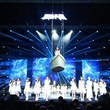

星梦之光
============================

|  |  |
| :--: | :-- |
| [ 星梦之光](https://emumo.xiami.com/album/1023649276) | **艺人**: [SNH48](../index.md) **语种**: 国语 **唱片公司**: 星四芭音乐 **发行时间**: 2015年02月11日 **专辑类别**: EP, 单曲 **专辑风格**: 女子团体 Girl Group, 国语流行 Mandarin Pop **播放数**: 198643 **收藏数**: 116 **评论数**: 9  |

## 简介

2015年1月31日，SNH48“年度金曲大赏”万人演唱会现场，SNH48现场演唱新曲《星梦之光》打动了所有人。本曲改编自美国著名歌手Skeeter&nbsp;Davis（已故）原唱的“The&nbsp;End&nbsp;of&nbsp;the&nbsp;World”，由SNH48成员吴燕文作词，由SNH48全体成员演唱。 

## 曲目

## 评论

|  |  |  |
| :-- | :-- | :-- |
|  [虾米用户](https://emumo.xiami.com/u/44241321) 暂无签名~ 2015-02-13 09:41 赞(1) 踩(0) | 
这首竟然不是肥秋写的！
 |
|  [虾米用户](https://emumo.xiami.com/u/13981119) Morning Coll... 2015-02-13 06:03 赞(1) 踩(0) | 
好
 |
|  [虾米用户](https://emumo.xiami.com/u/13000892) 眉毛忘画了 2015-02-12 07:11 赞(0) 踩(0) | 

 |
|  [虾米用户](https://emumo.xiami.com/u/34825036) 暂无签名~ 2015-02-12 00:57 赞(0) 踩(0) | 
恩...词填的不错。但是真心听困了，没听出梦想的感觉...个人拙见
 |
|  [虾米用户](https://emumo.xiami.com/u/4286734) 我控萝莉我自豪~ 2015-02-11 22:04 赞(1) 踩(0) | 
蛮好听的 词填的不错。
 |
|  [虾米用户](https://emumo.xiami.com/u/4047138) 一瞬间 2015-02-11 20:12 赞(1) 踩(0) | 
章鱼哥 李毛毛 小17 许驼驼
 |
|  [虾米用户](https://emumo.xiami.com/u/46488136) 暂无签名~ 2015-02-11 18:33 赞(0) 踩(0) | 
女神们，么么哒。永远爱     大爱菊婧炜女神
 |
|  [虾米用户](https://emumo.xiami.com/u/19812281) 扰乱 就是 扰乱 2015-02-11 18:22 赞(0) 踩(0) | 
！！！！！
 |
|  [虾米用户](https://emumo.xiami.com/u/34831732) Hell nawh to... 2015-02-11 18:14 赞(0) 踩(0) | 
嗯
 |
