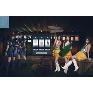

无处可逃100メートルコンビニ
============================

|  |  |
| :--: | :-- |
| [ 无处可逃100メートルコンビニ](https://emumo.xiami.com/album/1826646000) | **艺人**: [SNH48](../index.md) **语种**: 国语 **唱片公司**: 星四芭音乐 **发行时间**: 2015年03月18日 **专辑类别**: EP, 单曲 **专辑风格**: 女子团体 Girl Group, 国语流行 Mandarin Pop **播放数**: 64879 **收藏数**: 128 **评论数**: 13  |

## 简介

藏好了吗？还没有！  
  
SNH48 躲猫猫单曲《无处可逃》首发，为网游《CSonline2》献唱中文主题曲，S队人气成员莫寒 、戴萌 、孔肖吟 和N队鞠婧祎 、赵粤献唱。 

## 曲目

## 评论

|  |  |  |  |
| :-- | :-- | :-- | :-- |
|  [虾米用户](https://emumo.xiami.com/u/1667369) 香港的一些老歌总唤起自己... 2015-05-04 03:31 赞(1) 踩(0) | 
八十年代香港的偏曲！
 |
|  [虾米用户](https://emumo.xiami.com/u/10258883) 我还没想好要写什么... 2015-03-21 12:59 赞(2) 踩(0) | 
你团药丸
 |
|  [虾米用户](https://emumo.xiami.com/u/1294938)  最后一次来看你，再见了 2015-03-19 14:09 赞(0) 踩(0) | 
说真的，，封面真的好难看:-(
 |
|  [虾米用户](https://emumo.xiami.com/u/134263) _(:3」∠)_ 2015-03-19 00:38 赞(2) 踩(0) | 
这作词……耳朵瞎了。能不能不要一段时间密集地狂光接广告啊= =这曲特别容易让人误会是夜店神曲。附送原曲：《100メートルコンビニ》<a href="http://www.xiami.com/song/1771592477?spm=a1z1s.3521865.0.0.udAOVK" target="_blank" rel="nofollow noreferrer noopener">http://www.xiami.com/song/1771592477?spm=a1z1s.3521865.0.0.udAOVK</a>
 |
|  [虾米用户](https://emumo.xiami.com/u/600368) 群众的眼睛是雪亮的=喷子 2015-03-19 00:04 赞(0) 踩(0) | 
B级片的封面是走cult路线还是预算不够……？
 |
| ⇒ |  [虾米用户](https://emumo.xiami.com/u/187710480) 我还没想好要写什么... 2017-09-04 00:56 赞(0) 踩(0) | 
你太污了
 |
|  [虾米用户](https://emumo.xiami.com/u/4286734) 我控萝莉我自豪~ 2015-03-18 18:24 赞(0) 踩(0) | 
还好还好
 |
|  [虾米用户](https://emumo.xiami.com/u/4047138) 一瞬间 2015-03-18 13:39 赞(0) 踩(0) | 
麦当娜。。。
 |
|  [虾米用户](https://emumo.xiami.com/u/13028574) 捅死那个傻逼流行歌手 2015-03-18 12:59 赞(0) 踩(0) | 
呵呵这几十年前的魂斗罗8bit曲风是怎么回事？
 |
| ⇒ |  [虾米用户](https://emumo.xiami.com/u/2975506) 和虾米相处的最后一天，第... 2015-03-30 18:09 赞(0) 踩(0) | 
这是AKB48 TEAM B老歌。
 |
|  [虾米用户](https://emumo.xiami.com/u/37491164) studying Dru... 2015-03-18 11:37 赞(0) 踩(0) | 
作曲作词毁了
 |
|  [虾米用户](https://emumo.xiami.com/u/8244559)  2015-03-18 10:42 赞(0) 踩(0) | 
******
 |
|  [虾米用户](https://emumo.xiami.com/u/34831732) Hell nawh to... 2015-03-18 10:38 赞(0) 踩(0) | 
嗯
 |
